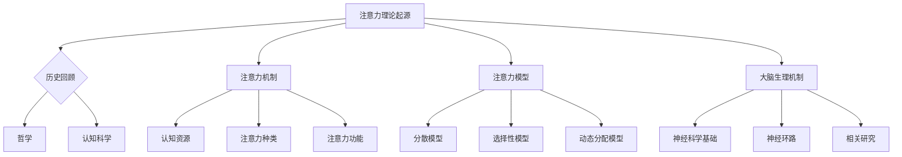

                 

# 文章标题：人类注意力增强：提升创新能力和创造力的方法

## 关键词
注意力增强、创新力、创造力、神经可塑性、认知行为训练、正念冥想、职场应用、教育应用、健康与医疗应用、未来发展趋势

## 摘要
在信息爆炸的时代，人类的注意力资源变得愈发宝贵。本文从基础理论出发，探讨了注意力增强的多种方法和技术，包括神经可塑性、认知行为训练、睡眠与脑机接口等。通过详细分析注意力增强在职场、教育、健康与医疗等领域的应用，展示了其在提升人类创新能力和创造力中的重要作用。最后，展望了注意力增强技术的未来发展趋势，为相关领域的深入研究提供了方向。

### 目录大纲

#### 第一部分: 人类注意力增强的基础理论

**第1章: 注意力理论的起源与发展**
1. **1.1 注意力理论的历史回顾**
   - 从古代哲学到现代认知科学
   - 注意力理论在不同学科中的应用
2. **1.2 注意力机制的基本概念**
   - 注意力与认知资源的关系
   - 注意力的种类与功能
3. **1.3 注意力模型的分类与比较**
   - 分散模型
   - 选择性模型
   - 动态分配模型
4. **1.4 注意力与大脑生理机制的联系**
   - 神经科学基础
   - 注意力相关的神经环路

**第2章: 注意力增强的技术与方法**
1. **2.1 神经可塑性原理**
   - 神经可塑性对注意力的影响
   - 神经可塑性的训练方法
2. **2.2 认知行为训练**
   - 认知行为训练的原理
   - 常用的认知行为训练方法
3. **2.3 睡眠与注意力恢复**
   - 睡眠对注意力的作用
   - 睡眠干预策略
4. **2.4 脑机接口技术在注意力增强中的应用**
   - 脑机接口技术原理
   - 脑机接口在注意力调节中的具体应用

**第3章: 注意力增强的心理干预策略**
1. **3.1 神经可塑性原理在心理干预中的应用**
   - 神经可塑性对心理干预的影响
   - 心理干预方法
2. **3.2 认知训练在注意力提升中的应用**
   - 认知训练的种类
   - 认知训练案例解析
3. **3.3 正念冥想与注意力调节**
   - 正念冥想的原理
   - 正念冥想实践
4. **3.4 睡眠管理在注意力提升中的作用**
   - 睡眠质量对注意力的影响
   - 睡眠质量提升策略

#### 第二部分: 注意力增强的实践应用

**第4章: 注意力增强在职场中的应用**
1. **4.1 职场注意力管理的重要性**
   - 职场注意力的需求
   - 职场注意力管理的挑战
2. **4.2 注意力管理工具与策略**
   - 时间管理技巧
   - 注意力集中训练
3. **4.3 高效会议的注意力管理**
   - 会议注意力管理策略
   - 会议注意力跟踪工具
4. **4.4 注重团队协作中的注意力分配**
   - 团队协作中的注意力分配原则
   - 团队协作注意力管理案例

**第5章: 注意力增强在教育中的应用**
1. **5.1 教育中的注意力问题**
   - 学生的注意力障碍
   - 教师的教学注意力管理
2. **5.2 教育注意力提升策略**
   - 课堂注意力管理技巧
   - 个性化教育注意力提升方案
3. **5.3 注意力增强技术在教学中的应用**
   - 技术辅助教学中的注意力调节
   - 技术在注意力监测与分析中的应用
4. **5.4 学生的自我注意力管理**
   - 学生自我注意力管理策略
   - 学生注意力自我评估与提升

**第6章: 注意力增强在健康与医疗中的应用**
1. **6.1 注意力与健康的关系**
   - 注意力缺陷与心理健康
   - 注意力缺陷与疾病管理
2. **6.2 注意力干预在心理健康中的应用**
   - 认知行为干预策略
   - 脑机接口技术在心理健康干预中的应用
3. **6.3 注意力增强在康复训练中的应用**
   - 康复训练中的注意力需求
   - 康复训练注意力提升策略
4. **6.4 注意力增强在医疗诊断中的应用**
   - 注意力与医学诊断的关系
   - 注意力增强在疾病诊断中的应用

**第7章: 注意力增强技术的未来发展趋势**
1. **7.1 注意力增强技术的挑战与机遇**
   - 技术发展的瓶颈
   - 未来应用前景
2. **7.2 注意力增强技术的未来发展方向**
   - 神经科学技术的进步
   - 跨学科合作与整合
3. **7.3 注意力增强技术在人类发展中的影响**
   - 对教育、职场、健康等领域的深远影响
   - 注意力增强技术在人类发展中的作用与限制

#### 附录

**附录A: 注意力增强工具与资源**
1. **A.1 注意力管理工具推荐**
   - 时间管理软件
   - 注意力监测软件
2. **A.2 注意力提升资源**
   - 认知训练资源
   - 脑机接口技术资源
3. **A.3 注意力研究文献与资料**
   - 学术论文
   - 书籍推荐
   - 研究报告

### Mermaid 流程图


### 伪代码示例：注意力增强算法
```python
# 初始化参数
attention_weights = [0.2, 0.5, 0.3]  # 注意力权重
input_data = [1, 2, 3]  # 输入数据

# 计算注意力值
for i in range(len(input_data)):
    attention_value = input_data[i] * attention_weights[i]
    print(f"注意力值 {i+1}: {attention_value}")

# 更新权重
for i in range(len(attention_weights)):
    if attention_value < threshold:
        attention_weights[i] += adjustment
    else:
        attention_weights[i] -= adjustment
```

### 数学公式示例
$$
E[X] = \int_{-\infty}^{\infty} x f(x) dx
$$
其中，$X$ 是随机变量，$f(x)$ 是其概率密度函数。

### 引言

在当今快速变化的世界中，人类面临着前所未有的信息过载和工作压力。我们的注意力资源变得愈发宝贵，因为它们直接影响我们的创新能力、工作效率和生活质量。如何有效地增强注意力，从而提升创新能力和创造力，成为了许多领域研究的热点话题。

本文旨在探讨人类注意力增强的理论基础、技术方法以及其实践应用，从而为相关领域的专业人士、研究人员和普通读者提供有价值的参考。文章将从注意力理论的起源和发展开始，逐步深入探讨注意力增强的各种方法和策略。通过详细分析注意力增强在职场、教育、健康与医疗等领域的应用，我们将看到其在提升人类整体能力中的重要作用。最后，文章还将展望注意力增强技术的未来发展趋势，为未来的研究和应用提供方向。

本文结构如下：

第一部分（第1章至第3章）将讨论注意力增强的基础理论，包括注意力机制的起源、注意力模型及其与大脑生理机制的联系。我们将介绍神经可塑性原理、认知行为训练、睡眠与注意力恢复以及脑机接口技术在注意力增强中的应用。

第二部分（第4章至第6章）将关注注意力增强的实践应用，具体包括职场中的应用、教育中的应用以及健康与医疗中的应用。我们将讨论注意力管理工具与策略、注意力提升策略、注意力增强技术在教学和康复训练中的应用，以及注意力增强在医疗诊断中的应用。

第三部分（第7章）将探讨注意力增强技术的未来发展趋势，分析当前面临的挑战与机遇，并展望未来可能的发展方向。这将帮助我们更好地理解注意力增强技术在人类发展中的潜在影响。

最后，附录部分将提供注意力增强工具与资源的推荐，包括注意力管理工具、注意力提升资源和注意力研究文献与资料。

通过本文的阅读，读者将能够系统地了解注意力增强的各个方面，为实际应用和研究提供理论和实践上的指导。

### 第一部分: 人类注意力增强的基础理论

#### 第1章: 注意力理论的起源与发展

注意力是认知科学中的一个核心概念，它涉及到人类如何选择关注某些信息而忽略其他信息。注意力理论的起源可以追溯到古代哲学。在古希腊哲学中，柏拉图和亚里士多德等哲学家已经对注意力进行了初步的探讨。柏拉图认为，人类的意识是一个不断流动的过程，而注意力则是这个过程中选择关注特定对象的能力。亚里士多德则认为，注意力是人类心灵活动的基础，是认知过程的先决条件。

进入中世纪，注意力理论继续发展。中世纪的哲学家们更加深入地探讨了注意力的本质和功能。他们提出了多种注意力模型，试图解释人类如何集中注意力以及如何维持注意力。这些早期理论为后来的科学研究奠定了基础。

到了近代，随着科学方法的兴起，注意力理论开始走向实证研究。19世纪末至20世纪初，心理学家开始对注意力进行系统研究。威廉·詹姆斯是美国心理学家，他提出了“注意集中”的概念，认为注意力是人类意识的一种集中状态。他的研究为后来的认知心理学提供了重要理论支持。

随着认知科学的兴起，注意力理论得到了进一步的发展。认知心理学研究了注意力的机制、注意力的种类和注意力与认知资源的关系。约翰·安德森（John Anderson）提出了选择性注意模型，该模型认为注意力是一种认知资源，它可以分配给不同类型的任务。这个模型为注意力研究提供了新的视角。

进入21世纪，注意力理论在不同学科中得到了广泛应用。在计算机科学中，注意力模型被用于信息过滤和搜索算法。在人工智能领域，注意力机制被广泛应用于机器学习和深度学习模型中，如注意力机制在自然语言处理中的广泛应用，显著提高了模型的性能。

总的来说，注意力理论的起源与发展经历了从哲学思考到科学研究的转变。不同学科对注意力理论的关注和深入研究，推动了注意力理论的不断进步。如今，注意力理论已经成为了认知科学、心理学、计算机科学和人工智能等领域的重要基础理论之一。

#### 第2章: 注意力机制的基本概念

注意力机制是人类认知过程中至关重要的一环，它决定了人类如何处理和利用信息。理解注意力机制的基本概念，有助于我们更好地掌握注意力的本质及其与认知资源的关系。

**注意力与认知资源的关系**

注意力可以被视为一种有限的认知资源，它对信息处理过程具有调控作用。在认知心理学中，注意力资源模型（如约翰·安德森的选择性注意模型）认为，注意力是一种分配给不同任务的资源，它可以影响信息的接收、处理和记忆。当注意力资源被某一任务占据时，其他任务将无法得到足够的资源，从而影响其执行效果。

例如，当我们在工作时，需要将注意力资源分配给电话、电子邮件、会议等多个任务。如果注意力资源不足，我们可能无法同时有效地处理这些任务，导致工作效率下降。因此，合理分配和利用注意力资源，是提高工作效率和减少工作压力的关键。

**注意力的种类与功能**

根据注意力的分配方式和对象，注意力可以分为多种类型。以下是几种常见的注意力种类及其功能：

1. **选择性注意力（Selective Attention）**：选择性注意力是指人们有选择地关注某些信息，同时忽略其他信息。这种注意力类型有助于我们在复杂环境中快速筛选和捕捉关键信息。例如，在嘈杂的环境中，我们能够关注到重要的人声，而忽略其他无关声音。

2. **持续注意力（Sustained Attention）**：持续注意力是指人们在长时间内保持对某一任务的注意力。这种注意力类型对于完成长时间任务或需要高度专注的工作非常重要。例如，学生在考试时需要长时间保持对试卷的注意力，以完成考试。

3. **分配注意力（Divided Attention）**：分配注意力是指人们在同时处理多个任务时分配注意力资源。这种注意力类型对于多任务处理和复杂任务执行至关重要。例如，驾驶员在驾驶时需要同时关注道路、交通信号和车内设备。

4. **任务切换注意力（Task-switching Attention）**：任务切换注意力是指人们在任务之间切换时分配注意力资源。这种注意力类型对于高效完成任务切换和避免任务干扰非常重要。例如，程序员在编写代码时需要切换到调试模式，以便发现和修复代码错误。

**注意力与信息处理**

注意力不仅在信息选择和任务执行中发挥作用，还直接影响信息处理的质量和效率。以下是注意力在信息处理中的几个关键作用：

1. **信息过滤**：注意力有助于我们在大量信息中快速筛选出重要信息，从而避免信息过载。例如，在会议中，我们能够关注到与议题相关的重要发言，而忽略无关的信息。

2. **信息整合**：注意力有助于我们将不同来源的信息整合在一起，形成有意义的认知结构。例如，当我们在阅读一篇论文时，注意力帮助我们整合论文中的各个部分，理解其整体意义。

3. **信息记忆**：注意力有助于我们将重要信息记忆下来。当我们关注某一信息时，我们更有可能将其编码成记忆，以便后续回忆。例如，在学习新知识时，注意力帮助我们更好地记忆和理解知识点。

**注意力与认知负荷**

注意力和认知负荷之间存在密切关系。认知负荷是指大脑在处理信息时所需的认知资源。当认知负荷过高时，注意力资源可能不足，导致信息处理效率下降。因此，合理控制认知负荷，分配注意力资源，是保持高效认知的关键。

总的来说，注意力机制的基本概念涉及到注意力与认知资源的关系、注意力的种类与功能以及注意力在信息处理中的作用。理解这些基本概念，有助于我们更好地掌握注意力的本质，从而在日常生活和工作中更好地利用注意力资源，提升认知能力和工作效率。

#### 第3章: 注意力模型的分类与比较

注意力模型在认知科学和心理学中占有重要地位，不同的模型试图解释注意力在信息处理中的作用机制。以下是几种主要的注意力模型：分散模型、选择性模型和动态分配模型。

**分散模型**

分散模型（Divided Attention Model）认为，注意力是一种有限的资源，但可以在多个任务之间进行分散。这种模型假设，个体可以同时关注多个任务，但每个任务的执行效果可能会因为注意力资源的分散而降低。

分散模型的代表性理论之一是“认知资源理论”（Cognitive Resource Theory），由Broadbent（1958）提出。该理论认为，注意力资源在多个任务之间进行动态分配，如果任务复杂度增加，所需的注意力资源也会增加。当注意力资源不足以同时处理多个任务时，个体可能会表现出任务切换困难或任务执行效率下降。

**选择性模型**

选择性模型（Selective Attention Model）认为，个体在特定时刻只能关注有限的信息，而其他信息会被自动过滤掉。选择性模型的核心在于解释如何选择性地关注某些信息，同时忽略其他无关信息。

John Anderson于20世纪80年代提出了选择性注意模型（Selective Attention Model），该模型将注意力视为一种有限资源，可以分配给不同的信息处理通道。选择性注意模型包括以下几个关键概念：

1. **中心通道（Central Channel）**：负责处理当前关注的信息，具有较高的信息处理能力和反应速度。
2. **外周通道（Peripheral Channel）**：负责处理边缘信息，但信息处理能力和反应速度较低。
3. **注意焦点（Focus of Attention）**：个体当前关注的特定区域，影响信息的选择和加工。

选择性注意模型在认知心理学中得到了广泛验证，并被应用于各种注意力相关的研究和实践中。例如，在驾驶过程中，驾驶员需要选择性地关注道路和交通信号，而忽略其他不相关的视觉信息。

**动态分配模型**

动态分配模型（Dynamic Allocation Model）认为，注意力资源不是固定不变的，而是可以根据任务需求和个体状态动态调整。这种模型强调注意力资源的灵活性和适应性。

One of the prominent dynamic allocation models is the “Continuous Performance Test” (CPT) model, proposed by Eriksen and Eriksen (1974). The CPT model suggests that attention can be dynamically allocated based on the task demands and the context. In this model, attention is not only about choosing which information to attend to but also about adjusting the level of attentional engagement.

Dynamic allocation models are particularly relevant in situations where task demands change frequently or where the individual needs to adapt to different environments. For example, in multitasking environments, individuals may need to dynamically allocate attention between tasks based on their priority and urgency.

**注意力模型的比较**

分散模型、选择性模型和动态分配模型各自有其独特的视角和解释机制。以下是这些模型的主要区别和联系：

1. **资源限制与灵活分配**：分散模型强调注意力资源的有限性，而选择性模型和动态分配模型则更关注如何根据任务需求和个体状态灵活地分配注意力资源。

2. **信息处理方式**：分散模型认为个体可以同时关注多个任务，但每个任务的执行效果可能因注意力资源的分散而降低。选择性模型则认为个体在特定时刻只能关注有限的信息，而动态分配模型强调注意力资源的动态调整。

3. **适应性与可塑性**：动态分配模型具有更高的适应性和可塑性，能够根据不同任务和环境需求灵活调整注意力资源。而分散模型和选择性模型则相对固定，更多地依赖于任务需求和个体状态。

总的来说，注意力模型的分类和比较为我们提供了多层次的理解，有助于我们深入探讨注意力在信息处理中的作用机制。不同模型的应用场景和解释力也有所不同，但共同构成了对注意力机制全面而深入的研究框架。

#### 第4章: 注意力与大脑生理机制的联系

注意力不仅是认知科学的重要概念，也是神经科学研究的核心课题。理解注意力与大脑生理机制之间的联系，有助于揭示注意力的本质和功能，从而为注意力增强提供科学依据。

**神经科学基础**

神经科学研究表明，注意力与大脑的多个区域和神经递质系统密切相关。以下是几个关键的神经科学基础：

1. **前额叶皮质（Prefrontal Cortex）**：前额叶皮质是大脑中与注意力调节关系最为密切的区域之一。它负责执行功能、工作记忆和决策，同时参与注意力的分配和调节。研究表明，前额叶皮质的神经活动与注意力的选择性加工和任务执行密切相关。

2. **基底神经节（Basal Ganglia）**：基底神经节在注意力的选择和调节中也起着重要作用。它通过调节运动输出和抑制无关运动，帮助个体维持对特定任务的注意力。基底神经节的病变，如帕金森病，常常伴随着注意力障碍。

3. **脑干（Brainstem）**：脑干是大脑的“门户”，通过调控其他脑区的活动来影响注意力的分配。例如，脑干中的上丘（Superior Colliculus）和下丘（Inferior Colliculus）在视觉和听觉注意力的集中和转移中发挥重要作用。

**注意力相关的神经环路**

注意力的实现依赖于多个神经环路之间的协同作用。以下是几个重要的神经环路：

1. **集中环路（Concentric Circuit）**：集中环路包括前额叶皮质、背外侧前额叶皮质（Dorsolateral Prefrontal Cortex）和背内侧前额叶皮质（Dorsomedial Prefrontal Cortex）。这些区域共同作用，调节注意力的分配和集中。当个体需要集中注意力时，这些区域的活动会显著增加。

2. **默认模式网络（Default Mode Network, DMN）**：默认模式网络是大脑中一个重要的功能网络，它通常在个体不进行特定任务时活跃。然而，研究表明，DMN也参与注意力的调节。例如，当个体需要从内部思维中切换到外部任务时，DMN的活动会降低，以便将注意力转移到新的任务上。

3. **边缘环路（Limbic Circuit）**：边缘环路包括杏仁核、海马体和扣带回等区域，这些区域与情绪和记忆密切相关。边缘环路在注意力的情绪调节和记忆编码中起着关键作用。例如，当个体面对压力或情感刺激时，边缘环路的活动会增强，从而影响注意力的分配和选择。

**神经可塑性原理**

神经可塑性是指神经元和神经网络在结构、功能和连接上的可变性和适应性。神经可塑性原理在注意力增强中具有重要意义，因为它揭示了通过训练和干预可以改变大脑结构和功能，从而提升注意力能力。

1. **突触可塑性**：突触可塑性是指神经元之间突触连接的适应性变化。例如，Hebb定律指出，当神经元A和神经元B同时激活时，它们之间的突触连接会增强。这意味着，通过重复的注意力训练，相关神经元的突触连接会加强，从而提高注意力的集中和效率。

2. **形态可塑性**：形态可塑性是指神经元形态的改变，如树突的分支和延长。研究表明，认知训练和注意力训练可以导致大脑结构的适应性改变，从而增强注意力的功能。

3. **基因表达可塑性**：基因表达可塑性是指神经元活动可以影响基因的表达和调控。例如，长期的学习和记忆训练可以导致大脑中特定基因的表达上调，从而促进神经生长和连接形成。

**实际案例**

一些研究表明，神经可塑性原理在注意力增强中的具体应用。例如，认知行为训练（Cognitive Behavioral Training）通过反复的注意力训练，可以显著提高个体的注意力和认知能力。一项研究表明，经过为期8周的认知行为训练，参与者的注意力集中能力、工作记忆和执行功能都有显著提升。

此外，正念冥想（Mindfulness Meditation）也被证明对注意力有显著的增强作用。正念冥想通过训练个体对当前经历的觉察和接纳，有助于改善注意力分配、减少注意力分散。一项研究发现，长期练习正念冥想的个体在注意力集中和任务执行上表现出更高的效率。

**结论**

注意力与大脑生理机制之间的紧密联系揭示了注意力的本质和功能。神经可塑性原理为注意力增强提供了科学依据，通过认知行为训练、正念冥想等方法，我们可以有效地提升注意力和认知能力。未来，随着神经科学技术的不断进步，我们将有望进一步揭示注意力增强的机制，为人类提升注意力和创造力提供更有效的策略。

#### 第2章: 注意力增强的技术与方法

注意力增强技术在提升人类认知能力和工作效率方面具有重要意义。本节将详细介绍几种主要的注意力增强技术与方法，包括神经可塑性原理、认知行为训练、睡眠与注意力恢复以及脑机接口技术在注意力增强中的应用。

**2.1 神经可塑性原理**

神经可塑性是指大脑神经元和神经网络在结构、功能和连接上的可变性和适应性。这一原理为注意力增强提供了科学依据，通过特定的训练和干预，可以改变大脑结构和功能，从而提升注意力能力。

**神经可塑性对注意力的影响**

1. **突触可塑性**：突触可塑性是指神经元之间的突触连接因神经元活动而发生的适应性变化。通过重复的注意力训练，相关神经元的突触连接会加强，从而提高注意力的集中和效率。例如，Hebb定律指出，当神经元A和神经元B同时激活时，它们之间的突触连接会增强。这意味着，通过重复的注意力训练，相关神经元的突触连接会加强，从而提高注意力的集中和效率。

2. **形态可塑性**：形态可塑性是指神经元形态的改变，如树突的分支和延长。认知训练和注意力训练可以导致大脑结构的适应性改变，从而增强注意力的功能。研究表明，经过长期的认知训练，大脑灰质和海马体等关键区域的体积会增加，这有助于提高注意力和记忆力。

3. **基因表达可塑性**：基因表达可塑性是指神经元活动可以影响基因的表达和调控。例如，长期的学习和记忆训练可以导致大脑中特定基因的表达上调，从而促进神经生长和连接形成。一项研究发现，经过认知训练的个体，其大脑中与学习相关的基因表达水平显著提高。

**神经可塑性的训练方法**

1. **认知训练**：认知训练是通过特定的认知任务来刺激大脑，从而提高认知能力和注意力。例如，工作记忆训练、执行功能训练和注意力集中训练等。研究表明，这些训练方法可以显著提升个体的注意力和认知能力。

2. **重复练习**：重复练习是指通过反复练习某一任务来增强大脑相关区域的神经连接。例如，通过重复练习拼写、数学计算或乐器演奏等任务，可以增强相关大脑区域的神经可塑性，从而提高注意力。

3. **多模态训练**：多模态训练是指结合视觉、听觉和运动等多种感觉输入来刺激大脑。研究表明，多模态训练可以更有效地增强神经可塑性，从而提高注意力和认知能力。

**2.2 认知行为训练**

认知行为训练是一种通过改变个体思维和行为模式来提升注意力的方法。它基于认知行为理论，认为个体的认知过程和行为反应相互作用，通过调整认知过程可以改善行为反应。

**认知行为训练的原理**

1. **认知重构**：认知重构是指通过识别和改变消极的思维模式，如过度概括、黑白思维和灾难化等，来改善个体的情绪和行为。通过认知重构，个体可以更加理性地看待问题，从而减少注意力分散和焦虑。

2. **行为策略**：行为策略是指通过设定具体的目标和行动计划，来改善个体的行为表现。例如，通过设定时间管理策略、注意力集中训练和行为习惯的培养，可以提高个体的注意力和工作效率。

**常用的认知行为训练方法**

1. **正念冥想**：正念冥想是一种通过专注于当前经历来提高注意力和情绪调节能力的训练方法。研究表明，正念冥想可以显著提升个体的注意力和认知能力，减少压力和焦虑。

2. **认知行为疗法（CBT）**：认知行为疗法是一种通过识别和改变消极认知模式来改善情绪和行为的方法。CBT中的注意力训练部分，可以帮助个体提高注意力和情绪调节能力。

3. **时间管理**：时间管理是一种通过合理安排时间、设定优先级和制定计划来提高工作效率和注意力的方法。通过有效的时间管理，个体可以减少时间浪费，集中注意力完成任务。

**2.3 睡眠与注意力恢复**

睡眠是恢复和增强注意力的重要途径。良好的睡眠有助于大脑清除代谢废物、巩固记忆和提升认知功能。

**睡眠对注意力的作用**

1. **大脑清洗**：睡眠期间，大脑通过“清除过程”（Cerebral Clearance）清除代谢废物，如β-淀粉样蛋白。这些废物的积累与认知障碍和注意力下降有关。

2. **记忆巩固**：睡眠有助于巩固记忆，特别是与注意力相关的工作记忆和执行功能。研究表明，睡眠不足会影响记忆的巩固，导致注意力下降。

3. **情绪调节**：睡眠不足会导致情绪不稳定，进而影响注意力。良好的睡眠有助于情绪调节，提高注意力和认知能力。

**睡眠干预策略**

1. **规律作息**：保持规律的睡眠时间，有助于调节生物钟，提高睡眠质量。

2. **睡眠环境**：确保睡眠环境的舒适和安静，减少噪音和光线干扰。

3. **睡前放松**：通过深呼吸、冥想或放松训练来放松身心，有助于提高睡眠质量和注意力。

**2.4 脑机接口技术在注意力增强中的应用**

脑机接口技术（Brain-Computer Interface, BCI）是一种通过直接连接大脑和外部设备来增强认知功能的先进技术。脑机接口技术在注意力增强中的应用，为提升人类注意力提供了新的途径。

**脑机接口技术原理**

1. **脑电信号采集**：脑机接口技术通过采集大脑的电信号，如脑电图（EEG）、功能性磁共振成像（fMRI）等，来检测和分析大脑活动。

2. **信号处理与解码**：通过信号处理技术，如滤波、特征提取和模式识别等，将采集到的脑电信号转换为可操作的控制信号。

3. **外部设备控制**：将解码后的脑电信号用于控制外部设备，如虚拟现实头戴设备、机械臂和计算机界面等。

**脑机接口在注意力调节中的具体应用**

1. **注意力集中训练**：通过实时监测脑电信号，系统可以反馈个体的注意力水平，并提供相应的训练任务，帮助个体提高注意力集中能力。

2. **注意力监测**：脑机接口技术可以实时监测个体的注意力状态，为心理治疗、认知训练和教育提供数据支持。

3. **辅助认知功能**：脑机接口技术可以通过实时调节大脑活动，辅助个体完成复杂的认知任务，如注意力控制、决策制定和信息处理。

**总结**

注意力增强技术与方法为提升人类认知能力和工作效率提供了多种途径。通过神经可塑性原理、认知行为训练、睡眠干预和脑机接口技术，我们可以有效地提高注意力水平，从而在职场、教育、健康等领域获得显著的效益。未来的研究将继续探索这些技术的方法和潜力，为人类提升注意力和创造力提供更加完善的解决方案。

### 第3章: 注意力增强的心理干预策略

注意力增强不仅依赖于技术和方法，还需要通过心理干预策略来提升个体的心理素质和自我管理能力。以下将介绍神经可塑性原理在心理干预中的应用、认知训练在注意力提升中的应用、正念冥想与注意力调节以及睡眠管理在注意力提升中的作用。

#### 3.1 神经可塑性原理在心理干预中的应用

神经可塑性是指大脑神经元和神经网络在结构、功能和连接上的可变性和适应性。这一原理在心理干预中具有重要意义，通过特定的心理训练，可以改变大脑的结构和功能，从而提升注意力。

**神经可塑性对心理干预的影响**

1. **认知重塑**：神经可塑性原理允许个体通过认知重塑来改变消极的思维模式，如过度概括、黑白思维和灾难化等。通过认知行为疗法，个体可以学会更加理性地看待问题，从而减少注意力分散和焦虑。

2. **情绪调节**：神经可塑性原理有助于改善个体的情绪调节能力。例如，通过正念冥想和认知行为训练，个体可以学会更好地处理压力和情绪波动，从而提高注意力的稳定性和集中力。

3. **记忆增强**：神经可塑性原理还与记忆形成和巩固有关。通过特定的记忆训练和认知练习，可以增强个体的记忆能力，从而提高注意力的效果。

**心理干预方法**

1. **认知行为训练**：认知行为训练是通过识别和改变消极的认知模式来改善情绪和行为的方法。例如，在注意力训练中，个体可以通过认知重塑来减少注意力分散，提高专注力。

2. **正念冥想**：正念冥想是一种通过专注于当前经历来提高注意力和情绪调节能力的训练方法。研究表明，长期练习正念冥想可以增强神经可塑性，提高个体的注意力集中能力和情绪稳定性。

3. **情绪调节训练**：通过情绪调节训练，个体可以学会更好地处理情绪波动，从而减少情绪对注意力的干扰。例如，通过认知行为疗法和情绪调节技术，个体可以学会通过认知重构和情绪表达来改善情绪管理。

#### 3.2 认知训练在注意力提升中的应用

认知训练是一种通过特定的认知任务来刺激大脑，从而提高认知能力和注意力水平的方法。以下是一些常用的认知训练方法和案例。

**认知训练的种类**

1. **注意力集中训练**：通过特定的任务来提高个体的注意力集中能力，如注意力集中游戏、记忆游戏和视觉搜索任务等。这些任务可以帮助个体练习集中注意力，提高专注力。

2. **执行功能训练**：执行功能是指个体在执行复杂任务时所需的认知能力，如规划、决策和任务切换等。执行功能训练可以通过任务规划、决策游戏和任务切换练习来提升个体的执行功能。

3. **记忆训练**：记忆训练是通过特定的记忆任务来提高个体的记忆能力。例如，通过工作记忆训练、长时记忆训练和情景记忆训练等，可以增强个体的记忆能力，从而提高注意力水平。

**认知训练案例解析**

1. **注意力集中训练案例**：通过视觉搜索任务，如“找到不同的两个形状”，个体需要集中注意力找到并标记不同的形状。这种任务可以帮助个体练习集中注意力，减少注意力分散。

2. **执行功能训练案例**：通过任务切换练习，如先完成数学计算题，然后完成拼写题。这种任务可以帮助个体练习快速切换注意力，提高任务执行效率。

3. **记忆训练案例**：通过工作记忆训练，如记住一系列数字并复述。这种任务可以帮助个体练习记忆，增强工作记忆能力，从而提高注意力水平。

#### 3.3 正念冥想与注意力调节

正念冥想是一种通过专注于当前经历来提高注意力和情绪调节能力的训练方法。正念冥想通过提高个体的自我意识和注意力集中能力，从而改善注意力调节。

**正念冥想的原理**

1. **自我觉察**：正念冥想通过引导个体专注于当前的身体感受、呼吸和思维活动，提高个体的自我觉察能力。

2. **注意力集中**：通过持续地专注于呼吸或其他感官体验，个体可以练习集中注意力，减少注意力分散。

3. **情绪调节**：正念冥想有助于个体更好地理解和处理情绪，减少情绪波动对注意力的干扰。

**正念冥想实践**

1. **呼吸冥想**：通过专注于呼吸，个体可以逐渐学会在日常生活中保持注意力集中。例如，每天花几分钟时间，深呼吸并专注于呼吸的进出，有助于提升注意力。

2. **身体扫描冥想**：通过逐一扫描身体的各个部分，个体可以学会放松身体和心灵，从而提高注意力。

3. **正念行走**：在行走时专注于脚与地面的接触、身体的感觉和呼吸，有助于提升注意力。

**结论**

通过神经可塑性原理、认知训练和正念冥想等心理干预策略，个体可以有效地提升注意力水平。这些策略不仅有助于改善注意力调节能力，还可以提高个体的情绪稳定性和生活质量。未来的研究将继续探索这些策略的效果和机制，为注意力提升提供更加科学和实用的方法。

#### 3.4 睡眠管理在注意力提升中的作用

睡眠是恢复和增强注意力的重要途径，良好的睡眠质量对于提升注意力和认知功能至关重要。以下将讨论睡眠质量对注意力的影响以及提升睡眠质量的策略。

**睡眠质量对注意力的影响**

1. **记忆巩固**：睡眠对记忆的巩固至关重要。研究表明，睡眠不足会影响记忆的巩固，导致注意力下降。睡眠过程中，大脑通过清除代谢废物和重新组织信息，巩固新学到的知识和技能。

2. **情绪调节**：睡眠不足会影响情绪调节能力，导致注意力分散和情绪波动。良好的睡眠有助于情绪稳定，减少压力和焦虑，从而提高注意力集中。

3. **认知功能**：睡眠对认知功能具有显著的促进作用。充足的睡眠可以提高注意力、工作记忆、执行功能和解决问题的能力，从而提升注意力水平。

**提升睡眠质量的策略**

1. **规律作息**：保持规律的睡眠时间，有助于调节生物钟，提高睡眠质量。建议每晚保持7-9小时的睡眠时间，并尽量在同一时间入睡和起床。

2. **睡眠环境**：确保睡眠环境的舒适和安静，减少噪音和光线干扰。建议使用遮光窗帘、耳塞和舒适的床上用品，以创造一个良好的睡眠环境。

3. **睡前放松**：通过深呼吸、冥想或放松训练来放松身心，有助于提高睡眠质量和注意力。睡前避免使用电子设备，减少刺激，有助于更快入睡。

4. **避免咖啡因和酒精**：咖啡因和酒精会干扰睡眠，导致睡眠质量下降。建议在睡前几小时内避免摄入咖啡、茶和酒精等刺激性物质。

5. **适量运动**：适量的运动有助于改善睡眠质量。建议每天进行30分钟的有氧运动，如快走、跑步或游泳，但避免在睡前进行剧烈运动。

**结论**

睡眠管理在提升注意力方面起着关键作用。通过保持规律作息、改善睡眠环境和睡前放松，个体可以显著提高睡眠质量，从而提升注意力水平。未来的研究将继续探索睡眠管理策略的效果和机制，为提高注意力提供更加科学和实用的方法。

### 第4章: 注意力增强在职场中的应用

在职场环境中，注意力管理对工作效率和职业发展具有重要影响。有效的注意力管理不仅可以提升个人表现，还可以促进团队协作和组织效能。本节将探讨注意力增强在职场中的应用，包括时间管理技巧、注意力集中训练、高效会议的注意力管理以及团队协作中的注意力分配原则。

#### 4.1 职场注意力管理的重要性

在现代职场中，信息爆炸和工作压力日益增加，导致员工注意力资源变得愈发宝贵。良好的注意力管理有助于员工：

1. **提高工作效率**：通过有效管理注意力，员工可以更集中地处理任务，减少时间浪费，提高工作效率。

2. **减少错误率**：集中注意力可以减少因分心导致的错误和疏漏，提高工作质量和准确性。

3. **增强职业发展**：通过提升注意力和认知能力，员工可以更好地应对复杂任务和挑战，获得更多的职业发展机会。

4. **改善心理健康**：注意力管理有助于减轻职场压力，提高员工的心理健康和幸福感。

#### 4.2 注意力管理工具与策略

为了提升职场注意力，可以使用以下工具和策略：

1. **时间管理技巧**：

   - **优先级设定**：将任务按照紧急性和重要性分类，优先处理最重要的任务。
   - **番茄工作法**：将工作时间划分为25分钟的工作周期，每个周期后休息5分钟，有助于提高注意力集中。
   - **任务分解**：将复杂任务分解为小步骤，逐一完成，减少任务压力。

2. **注意力集中训练**：

   - **专注力训练软件**：使用专门的注意力训练软件，如专注力训练游戏和注意力集中练习，有助于提高注意力水平。
   - **定期休息**：每隔一段时间进行短暂的休息，避免长时间集中注意力导致疲劳。

3. **高效会议的注意力管理**：

   - **会议目标明确**：确保每次会议都有明确的目标和议程，避免无关讨论和分心。
   - **注意力跟踪工具**：使用注意力跟踪工具，如脑电波监测器和注意力监测软件，帮助会议参与者保持注意力集中。
   - **发言时间限制**：为每个发言者设定发言时间，避免会议过长和讨论跑题。

4. **团队协作中的注意力分配原则**：

   - **明确职责**：为团队成员分配明确的职责和任务，确保每个人都知道自己的责任和期望。
   - **沟通与反馈**：保持团队内部的沟通畅通，定期反馈进展和遇到的问题，及时调整注意力分配。
   - **平衡任务难度**：分配任务时考虑团队成员的能力和兴趣，避免过度集中或分散注意力。

#### 4.3 职场注意力管理的挑战

尽管注意力管理对职场成功至关重要，但在实际应用中仍面临一些挑战：

1. **信息过载**：现代职场中信息量巨大，员工常常感到分心和压力，难以集中注意力处理重要任务。
2. **多任务处理**：在多任务处理环境中，员工容易分散注意力，导致任务完成质量下降。
3. **工作与生活的平衡**：工作压力和生活压力的平衡困难，导致员工难以保持良好的睡眠质量和注意力状态。

#### 4.4 解决职场注意力管理的策略

为应对职场注意力管理的挑战，可以采取以下策略：

1. **培训与教育**：为员工提供注意力管理的培训和教育，提高他们的自我管理能力。
2. **技术支持**：利用先进的技术工具，如注意力监测软件和时间管理软件，帮助员工更好地管理注意力。
3. **灵活的工作安排**：提供灵活的工作安排，如远程工作、弹性工作时间等，减轻员工的压力和分心。
4. **团队协作与支持**：鼓励团队协作，建立支持性团队环境，帮助员工共同应对注意力管理的挑战。

**结论**

注意力增强在职场中的应用对于提升工作效率和职业发展具有重要意义。通过有效的注意力管理工具和策略，员工可以更好地集中注意力，提高工作效率和质量。未来的研究和实践将继续探索注意力管理的最佳方法，为职场成功提供更全面的支持。

### 第5章: 注意力增强在教育中的应用

在教育领域中，注意力问题一直是教师和学生共同面临的重要挑战。学生的注意力障碍和教师的教学注意力管理直接影响到教学效果和学习成果。本节将探讨注意力增强在教育中的应用，包括教育中的注意力问题、教育注意力提升策略、注意力增强技术在教学中的应用以及学生的自我注意力管理。

#### 5.1 教育中的注意力问题

在教育环境中，注意力问题主要表现在学生和教师两个方面：

1. **学生的注意力障碍**：

   - **注意力分散**：学生容易受到外界干扰，如手机、社交媒体和其他娱乐活动，导致注意力分散。
   - **注意力持续时间短**：学生的注意力持续时间较短，难以长时间专注于学习任务。
   - **学习动力不足**：学习动力不足导致学生缺乏对学习的兴趣和投入，影响注意力集中。

2. **教师的教学注意力管理**：

   - **课堂注意力管理**：教师需要时刻关注学生的学习状态，确保学生保持注意力集中。
   - **教学注意力分配**：教师需要平衡对每个学生的注意力分配，避免对某些学生过度关注或忽视其他学生。
   - **教学策略应用**：教师需要采用有效的教学策略，如互动式教学和小组讨论，以吸引学生的注意力。

#### 5.2 教育注意力提升策略

为了提升教育中的注意力水平，可以采取以下策略：

1. **课堂注意力管理技巧**：

   - **明确学习目标**：在课堂开始时，明确告知学生学习目标和预期成果，提高学生的注意力集中。
   - **互动式教学**：通过提问、小组讨论和互动活动，激发学生的兴趣和参与度，提高注意力集中。
   - **多样化教学手段**：结合视觉、听觉和动手操作等多种教学手段，提高学生的兴趣和注意力。

2. **个性化教育注意力提升方案**：

   - **因材施教**：根据学生的个性特点和注意力水平，制定个性化的学习计划和教学方法。
   - **学习支持**：提供额外的学习支持和辅导，帮助注意力不足的学生提高学习效果。
   - **学习激励机制**：通过奖励和认可，激发学生的学习动力，提高注意力集中。

3. **认知训练与注意力提升**：

   - **工作记忆训练**：通过训练工作记忆，提高学生的注意力集中和记忆能力。
   - **执行功能训练**：通过训练执行功能，如规划、决策和任务切换，提高学生的注意力分配和管理能力。

#### 5.3 注意力增强技术在教学中的应用

随着科技的发展，注意力增强技术在教育中的应用逐渐普及，为提升学生的注意力提供了新的途径：

1. **技术辅助教学**：

   - **互动式电子白板**：通过互动式电子白板，教师可以与学生进行实时互动，提高学生的参与度和注意力。
   - **多媒体教学资源**：利用多媒体教学资源，如视频、音频和动画，吸引学生的兴趣和注意力。

2. **注意力监测与分析**：

   - **注意力监测软件**：使用注意力监测软件，教师可以实时了解学生的学习状态和注意力水平，及时调整教学策略。
   - **学习行为分析**：通过分析学生的学习行为数据，教师可以了解学生的学习习惯和注意力模式，优化教学方案。

3. **个性化学习平台**：

   - **自适应学习平台**：根据学生的学习进度和注意力水平，自适应学习平台可以提供个性化的学习内容和任务，提高学生的注意力和学习效果。

#### 5.4 学生的自我注意力管理

学生的自我注意力管理对于提升学习效果和培养自主学习能力至关重要。以下是一些自我注意力管理的策略：

1. **自我注意力监控**：

   - **注意力日记**：记录自己的注意力状况，了解哪些因素会导致注意力分散，及时调整学习环境和方法。
   - **自我反馈**：定期进行自我反馈，评估自己的学习效果和注意力集中程度，找出改进的方法。

2. **学习计划与时间管理**：

   - **学习计划**：制定详细的学习计划，合理安排学习时间和休息时间，避免过度疲劳和注意力下降。
   - **时间管理技巧**：使用番茄工作法等时间管理技巧，提高学习效率和注意力集中。

3. **情绪管理**：

   - **情绪调节**：通过深呼吸、冥想和放松训练等情绪调节方法，减轻学习压力和焦虑，提高注意力集中。

**结论**

注意力增强在教育中的应用对于提升教学效果和学生注意力具有重要意义。通过实施有效的教育注意力提升策略、运用注意力增强技术和培养学生的自我注意力管理能力，可以显著改善教育质量和学习效果。未来的研究将继续探索注意力增强技术在教育领域的应用和效果，为教育创新提供新的方向。

### 第6章: 注意力增强在健康与医疗中的应用

注意力增强不仅在职场和教育领域具有重要意义，在健康与医疗领域同样发挥着重要作用。本节将探讨注意力增强在心理健康、康复训练和医疗诊断中的应用，以及注意力缺陷与心理健康的关系。

#### 6.1 注意力与健康的关系

注意力是心理健康的重要组成部分，它直接影响个体的情绪管理、认知功能和生活质量。以下是注意力与健康的几个关键关系：

1. **注意力缺陷与心理健康**：

   - **注意力缺陷障碍（ADHD）**：注意力缺陷障碍是一种常见的心理健康问题，表现为注意力难以集中、多动和冲动行为。研究表明，ADHD与情绪障碍、焦虑和抑郁等心理问题密切相关。
   - **注意力缺陷与情绪调节**：注意力缺陷可能导致情绪波动和情绪调节困难，从而影响心理健康。有效的注意力训练可以帮助个体改善情绪管理，提高心理健康水平。

2. **注意力缺陷与疾病管理**：

   - **慢性疾病管理**：慢性疾病患者常常需要长期管理疾病，但注意力缺陷可能导致他们难以坚持治疗计划和遵守健康指导。注意力增强训练可以帮助患者提高注意力集中，更好地管理疾病。
   - **康复训练**：康复训练需要患者积极参与和集中注意力，注意力增强训练可以帮助提高患者的康复效果和生活质量。

#### 6.2 注意力干预在心理健康中的应用

注意力干预在心理健康领域具有广泛的应用，通过认知行为训练和脑机接口技术等方法，可以帮助改善心理症状和提升生活质量。

1. **认知行为干预策略**：

   - **注意力训练**：通过特定的认知行为训练，如注意力集中训练、执行功能训练和工作记忆训练，可以提高个体的注意力集中能力和认知功能。
   - **情绪调节训练**：通过情绪调节训练，如认知重构、情绪表达训练和正念冥想，可以帮助个体更好地管理情绪波动，提高心理健康水平。

2. **脑机接口技术在心理健康干预中的应用**：

   - **脑电反馈训练**：通过脑电反馈技术，实时监测个体的脑电信号，提供即时的反馈，帮助个体练习注意力的集中和调节。研究表明，脑电反馈训练可以显著改善ADHD症状和焦虑情绪。
   - **认知行为疗法**：结合认知行为疗法和脑机接口技术，可以帮助患者更有效地处理情绪问题和注意力缺陷，提升心理康复效果。

#### 6.3 注意力增强在康复训练中的应用

注意力增强在康复训练中发挥着重要作用，通过注意力训练可以提高康复效果和患者的生活质量。

1. **康复训练中的注意力需求**：

   - **任务切换**：康复训练通常涉及多种任务，如物理治疗、语言治疗和认知训练，患者需要在不同任务间切换注意力。
   - **长期坚持**：康复训练需要患者持续参与和集中注意力，注意力增强训练可以帮助患者更好地坚持训练计划。

2. **注意力提升策略**：

   - **认知训练**：通过认知训练，如工作记忆训练和执行功能训练，可以帮助患者提高注意力集中和任务切换能力。
   - **正念冥想**：正念冥想通过提高个体的注意力和情绪调节能力，有助于减轻康复过程中的焦虑和压力。

3. **案例解析**：

   - **脑机接口技术在康复训练中的应用**：例如，通过脑电信号监测和反馈，患者可以在康复训练中实时了解自己的注意力状态，通过调整训练方式和策略，提高康复效果。

#### 6.4 注意力增强在医疗诊断中的应用

注意力增强在医疗诊断中具有潜在的应用价值，通过提升注意力可以改善医生的诊断准确性和患者的治疗体验。

1. **注意力与医学诊断的关系**：

   - **诊断准确性**：医生的注意力集中程度直接影响诊断的准确性。注意力增强训练可以帮助医生提高注意力的集中和分配，从而提高诊断准确性和效率。
   - **患者体验**：注意力增强可以帮助患者更好地理解和配合医生，提高治疗过程的体验和效果。

2. **注意力增强在疾病诊断中的应用**：

   - **图像识别**：在医学影像诊断中，医生需要集中注意力识别病变区域。注意力增强训练可以提高医生对图像的识别速度和准确性。
   - **患者配合**：通过注意力训练，患者可以更好地配合医疗检查，减少因分心导致的检查误差。

3. **案例解析**：

   - **注意力监测在手术中的应用**：例如，在手术过程中，医生和麻醉师需要高度集中注意力。通过实时监测和反馈注意力水平，可以确保手术过程的顺利进行，提高手术安全性。

**结论**

注意力增强在健康与医疗领域具有广泛的应用价值。通过认知行为训练、脑机接口技术和康复训练等方法，可以显著提升个体的注意力水平，改善心理健康、康复效果和诊断准确性。未来的研究将继续探索注意力增强技术的应用和效果，为提升人类健康和生活质量提供更全面的解决方案。

### 第7章: 注意力增强技术的未来发展趋势

随着科技的不断进步，注意力增强技术正迎来前所未有的发展机遇。本章将探讨注意力增强技术的挑战与机遇、未来发展方向以及注意力增强技术在人类发展中的潜在影响。

#### 7.1 注意力增强技术的挑战与机遇

**挑战**

1. **技术成熟度**：虽然注意力增强技术取得了显著进展，但在实际应用中仍面临技术成熟度的问题。例如，脑机接口技术的稳定性和准确性仍有待提高，需要更长时间的研发和优化。

2. **数据隐私与伦理**：注意力增强技术涉及大量的生物数据和认知数据，如何保护用户隐私和数据安全是亟待解决的问题。此外，技术应用的伦理问题也需要得到广泛关注。

3. **用户接受度**：用户对新技术往往存在一定的抵触心理，如何提高用户接受度，使其愿意使用注意力增强技术，是一个重要的挑战。

**机遇**

1. **神经科学突破**：随着神经科学研究的不断深入，对大脑机制的理解将有助于开发更有效的注意力增强技术。

2. **跨学科合作**：注意力增强技术涉及神经科学、心理学、计算机科学、人工智能等多个领域。跨学科合作将为技术创新提供新的思路和方向。

3. **市场应用**：随着注意力增强技术在职场、教育、健康等领域的应用需求不断增加，市场前景广阔。

#### 7.2 注意力增强技术的未来发展方向

**1. 神经科学技术进步**

- **脑机接口技术的优化**：未来脑机接口技术将更加精细和精准，能够实时监测和调节大脑活动，提供更高效、更稳定的注意力增强。
- **生物信息学应用**：通过生物信息学分析，深入了解大脑功能和注意力机制的分子基础，为注意力增强技术提供更深入的生物学依据。

**2. 跨学科合作与整合**

- **认知科学与计算机科学的融合**：结合认知科学的理论和方法，开发更加智能和高效的注意力增强算法。
- **人工智能的应用**：利用人工智能技术，对大量的注意力数据进行分析和挖掘，优化注意力增强策略。

**3. 新型注意力增强设备**

- **可穿戴设备**：开发便携、易用、高效的注意力增强设备，如智能眼镜、智能手环等。
- **植入式设备**：研究安全、可靠的植入式设备，直接干预大脑活动，实现高级注意力增强。

#### 7.3 注意力增强技术在人类发展中的影响

**教育领域**

- **个性化学习**：注意力增强技术可以根据学生的注意力水平提供个性化的学习内容和策略，提高学习效果。
- **教育公平**：通过注意力增强技术，可以帮助注意力不足的学生提高学习效果，缩小教育差距。

**职场领域**

- **提高工作效率**：注意力增强技术可以帮助员工更好地集中注意力，提高工作效率和生产力。
- **职业培训**：利用注意力增强技术，可以设计更加有效的职业培训和技能提升方案。

**健康领域**

- **心理健康干预**：注意力增强技术可以用于心理健康干预，如治疗注意力缺陷障碍、焦虑和抑郁等。
- **康复训练**：通过注意力增强技术，可以设计更有效的康复训练方案，提高康复效果。

**社会生活**

- **注意力管理应用**：注意力增强技术可以应用于日常生活中的各个方面，如注意力管理应用、健康生活方式指导等，提升生活质量。

**结论**

注意力增强技术在未来发展中面临着诸多挑战，但同时也具有广阔的应用前景。通过不断的技术创新和跨学科合作，注意力增强技术有望在多个领域产生深远影响，为人类提升注意力、提高生活质量提供强有力的支持。未来的研究将继续探索注意力增强技术的最佳实践和应用场景，推动其在人类发展中的广泛应用。

### 附录A: 注意力增强工具与资源

#### A.1 注意力管理工具推荐

1. **时间管理软件**

   - **Trello**：一款基于看板（Kanban）的时间管理工具，可以帮助用户规划和跟踪任务。
   - **Asana**：一款功能强大的项目管理工具，支持任务分配、进度跟踪和协作。

2. **注意力监测软件**

   - **Freedom**：一款能够屏蔽干扰网站和应用程序的软件，帮助用户集中注意力。
   - **Forest**：一款通过种植虚拟树木激励用户专注的软件，用户完成任务后树木会茁壮成长。

#### A.2 注意力提升资源

1. **认知训练资源**

   - **Lumosity**：一款基于科学原理的认知训练应用，提供多种认知训练游戏。
   - **BrainHQ**：一款由科学家开发的在线认知训练平台，涵盖多个认知领域。

2. **脑机接口技术资源**

   - **MindMeld**：一款基于脑机接口技术的实时注意力监测和调节应用。
   - **Neuralink**：一家专注于脑机接口技术研发的公司，提供相关的研究和产品信息。

#### A.3 注意力研究文献与资料

1. **学术论文**

   - **“The role of attention in cognitive control”**：讨论注意力在认知控制中的重要作用。
   - **“Neuroplasticity: Basic concepts and clinical implications”**：探讨神经可塑性的基本概念及其临床应用。

2. **书籍推荐**

   - **《注意力心理学：注意力如何塑造我们的生活》（Attention and Memory: The Foundation of Mind》**：详细讨论注意力的机制和影响。
   - **《禅与计算机程序设计艺术》（Zen and the Art of Computer Programming》**：探讨注意力与编程的关系。

3. **研究报告**

   - **“注意力增强技术的应用与前景”**：分析注意力增强技术的应用领域和未来发展趋势。
   - **“注意力缺陷障碍的神经科学基础与治疗策略”**：探讨注意力缺陷障碍的神经科学机制和治疗策略。

通过以上推荐的工具和资源，读者可以更深入地了解注意力增强的相关知识和实践方法，为提升自己的注意力提供科学支持和实用指导。

### 总结

通过本文的探讨，我们系统地了解了注意力增强的基础理论、技术方法及其在不同领域的应用。从神经可塑性、认知行为训练、睡眠与脑机接口技术等多个方面，我们看到了注意力增强在提升人类创新能力和创造力中的关键作用。

注意力增强不仅有助于提高职场工作效率、优化教育效果，还在心理健康、康复训练和医疗诊断等领域展现出广阔的应用前景。未来的研究将继续深化对注意力机制的理解，探索更高效、更精准的注意力增强技术，为人类在各个领域的发展提供强有力的支持。

让我们共同努力，通过科学的方法和有效的实践，不断提升注意力，释放我们的创新潜能，创造更加美好的未来。

### 作者信息

**作者：** AI天才研究院/AI Genius Institute & 禅与计算机程序设计艺术 /Zen And The Art of Computer Programming

