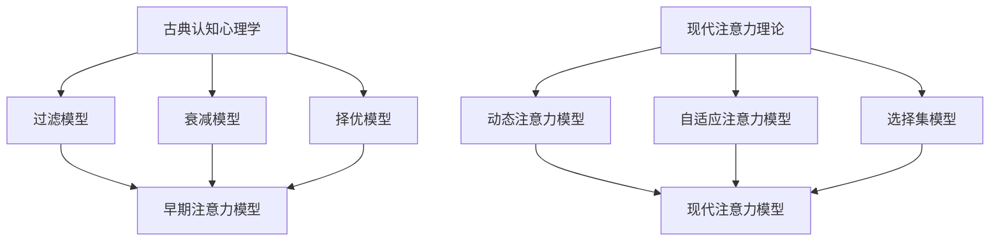

                 

### 《人类注意力增强：提升多任务处理和注意力转移能力》

> 关键词：注意力、多任务处理、注意力转移、神经可塑性、注意力增强

> 摘要：本文旨在探讨人类注意力增强的方法，特别是针对多任务处理和注意力转移能力的提升。文章首先介绍了注意力的基础概念和理论发展，随后详细阐述了神经可塑性原理及其在注意力增强中的应用。接着，本文提出了多任务处理技巧和注意力转移策略，并通过实际项目案例展示了这些策略在实践中的应用。文章最后展望了注意力增强技术的未来发展方向，并提出了相关的挑战与解决策略。

### 第一部分：注意力基础

#### 第1章：注意力概述

##### 1.1 注意力的定义与分类

注意力是心理活动对一定对象的指向和集中。在认知心理学中，注意力被视为一个重要的认知过程，它影响着信息的接收、处理和存储。根据不同的分类标准，注意力可以被分为以下几种类型：

1. **选择性注意力**：指人们在众多刺激中选择关注的特定刺激。
2. **分配性注意力**：指人们将注意力分配到不同的任务或对象上。
3. **持续性注意力**：指人们在一段时间内保持关注某个对象或任务。
4. **交替性注意力**：指人们在不同任务或对象之间切换注意力。

##### 1.1.1 注意力的概念

注意力是一个动态的过程，它受到多种因素的影响，包括生理、心理和社会因素。从生理角度来看，注意力与大脑中特定的神经结构和功能密切相关。例如，前额叶皮层和顶叶皮层在注意力过程中扮演着关键角色。从心理角度来看，注意力决定了人们如何感知和解释外部世界的信息。

##### 1.1.2 注意力的分类

根据不同的研究视角，注意力可以被分为以下几种类型：

1. **内部注意力**：指人们关注自身的内在体验和情感状态。
2. **外部注意力**：指人们关注外部环境和他人。
3. **知觉注意力**：指人们关注特定知觉对象。
4. **认知注意力**：指人们关注特定认知任务。

##### 1.1.3 注意力的重要性

注意力是人类认知活动中不可或缺的一部分。它影响着人们的感知、记忆、决策和问题解决能力。良好的注意力能力有助于提高学习效率、工作效率和生活质量。因此，研究注意力增强的方法具有重要意义。

#### 1.2 注意力理论的发展

##### 1.2.1 古典认知心理学

古典认知心理学认为，注意力是一种有限的认知资源，它决定了人们能够处理的信息量。例如，Broadbent（1958）提出的过滤模型认为，注意力像过滤器一样，只允许一小部分信息通过，而其他信息则被过滤掉。

##### 1.2.2 信号检测理论

信号检测理论（SDT）提供了另一种解释注意力的方法。根据SDT，注意力是一个决策过程，人们在处理信息时需要做出判断，例如是否将某个刺激视为目标。

##### 1.2.3 注意力理论的现代发展

现代注意力理论强调了神经可塑性和注意力分配的动态性。例如，动态注意力模型（DAM）和自适应注意力模型（AAM）等，都试图从神经科学的角度解释注意力的工作机制。

##### 1.3 注意力模型概述

注意力模型可以分为两大类：早期注意力模型和现代注意力模型。

1. **早期注意力模型**：包括过滤模型、衰减模型和择优模型等。这些模型主要关注注意力的筛选和过滤功能。
2. **现代注意力模型**：包括动态注意力模型、自适应注意力模型和选择集模型等。这些模型更强调注意力的动态性和可塑性。

### Mermaid 流程图



#### 第2章：神经可塑性原理

##### 2.1 神经可塑性的概念与类型

神经可塑性是指神经元和神经网络在结构和功能上的可塑性变化，这些变化受外部环境和内部经验的影响。神经可塑性包括以下几种类型：

1. **结构可塑性**：指神经元的形态和结构变化，如轴突和树突的分支、突触的形态变化等。
2. **功能可塑性**：指神经网络的活动和功能变化，如突触强度的变化、神经网络连接的重组等。
3. **连接可塑性**：指神经网络中的连接关系和连接方式的改变。

##### 2.1.1 神经可塑性的定义

神经可塑性是指神经元和神经网络在结构和功能上的可塑性变化，这些变化受外部环境和内部经验的影响。它包括结构可塑性、功能可塑性和连接可塑性三种类型。

##### 2.1.2 神经可塑性的类型

神经可塑性可以分为以下几种类型：

1. **突触可塑性**：指突触连接强度的变化，包括长时程增强（LTP）和长时程抑制（LTD）。
2. **轴突可塑性**：指轴突长度和形态的变化。
3. **树突可塑性**：指树突分支和形态的变化。

##### 2.1.3 神经可塑性的调节机制

神经可塑性的调节机制主要包括以下几种：

1. **神经递质**：神经递质是神经元之间传递信息的化学物质，其浓度的变化可以调节神经可塑性。
2. **生长因子**：生长因子是调节神经元生长和分化的信号分子，它们可以调节神经可塑性。
3. **基因表达**：基因表达的变化可以影响神经元的结构和功能，进而调节神经可塑性。

##### 2.2 生物学基础

神经可塑性涉及的生物学基础包括以下几个方面：

1. **神经元的活动**：神经元的活动水平可以影响神经可塑性。例如，高频率的神经活动可以诱导长时程增强（LTP）。
2. **突触的可塑性变化**：突触是神经元之间传递信息的结构基础，突触的可塑性变化是神经可塑性的重要表现形式。
3. **神经递质的作用**：神经递质是调节神经元活动的关键因素，其浓度的变化可以影响神经可塑性。

##### 2.2.1 神经元的活动

神经元的活动是神经可塑性的基础。神经元通过电信号和化学信号进行信息传递。电信号主要通过神经元的膜电位变化实现，而化学信号则通过神经递质在神经元之间的传递实现。

##### 2.2.2 突触的可塑性变化

突触是神经元之间传递信息的结构基础。突触的可塑性变化包括突触连接强度的变化和突触形态的变化。突触连接强度的变化主要通过突触后膜的信号转导途径实现，而突触形态的变化则涉及轴突和树突的分支形态变化。

##### 2.2.3 神经递质的作用

神经递质是神经元之间传递信息的化学物质，其浓度的变化可以影响神经可塑性。神经递质的释放和再摄取是调节神经可塑性的重要途径。例如，长时程增强（LTP）和长时程抑制（LTD）是通过调节神经递质的释放和再摄取实现的。

##### 2.3 神经可塑性在注意力增强中的应用

神经可塑性在注意力增强中具有重要作用。通过调节神经可塑性，可以改善注意力分配和注意力转移能力。以下是一些具体的例子：

1. **多任务处理**：通过调节突触连接强度，可以改善多任务处理中的注意力分配。
2. **注意力转移**：通过调节神经元的活动模式，可以改善注意力转移能力。
3. **认知训练**：通过认知训练，可以增强神经可塑性，从而提高注意力能力。

##### 2.3.1 神经可塑性与注意力调节

神经可塑性与注意力调节密切相关。通过调节神经可塑性，可以改善注意力分配和注意力转移能力。例如，通过认知训练，可以增强大脑中特定区域的活动，从而提高注意力能力。

##### 2.3.2 神经可塑性与多任务处理

神经可塑性在多任务处理中具有重要作用。通过调节神经可塑性，可以改善多任务处理中的注意力分配。例如，通过认知训练，可以增强大脑中特定区域的活动，从而提高多任务处理能力。

##### 2.3.3 神经可塑性与注意力转移

神经可塑性在注意力转移中也具有重要作用。通过调节神经可塑性，可以改善注意力转移能力。例如，通过认知训练，可以增强大脑中特定区域的活动，从而提高注意力转移能力。

### 伪代码：神经可塑性调节机制

```python
# 定义神经可塑性调节函数
def NeuralPlasticityAdjustment(pre_neuron_output, post_neuron_output):
    # 计算神经元活动差异
    activity_difference = post_neuron_output - pre_neuron_output
    
    # 调节突触连接强度
    if activity_difference > threshold:
        increase_synaptic_weight()
    elif activity_difference < -threshold:
        decrease_synaptic_weight()
    
    # 更新神经元状态
    updated_neuron_output = calculate_output(pre_neuron_output, synaptic_weight)
    
    return updated_neuron_output
```

### 数学模型和数学公式

#### 神经可塑性调节机制的数学模型

设 \( S \) 为突触连接强度，\( x \) 为神经元活动水平，\( \theta \) 为调节系数，则神经可塑性调节机制的数学模型可以表示为：

\[ S_{\text{new}} = S_{\text{old}} + \theta \cdot (x_{\text{new}} - x_{\text{old}}) \]

其中，\( S_{\text{new}} \) 表示调节后的突触连接强度，\( S_{\text{old}} \) 表示调节前的突触连接强度，\( x_{\text{new}} \) 表示调节后的神经元活动水平，\( x_{\text{old}} \) 表示调节前的神经元活动水平。

#### 注意力转移的数学模型

设 \( A \) 为注意力分配系数，\( T \) 为任务数，\( t_i \) 为第 \( i \) 个任务的注意力分配值，则注意力转移的数学模型可以表示为：

\[ A_{\text{total}} = \sum_{i=1}^{T} A_i \]

其中，\( A_{\text{total}} \) 表示总注意力分配值，\( A_i \) 表示第 \( i \) 个任务的注意力分配值。

#### 举例说明

假设有一个系统需要处理三个任务，初始时每个任务的注意力分配值相等，为 1。经过一段时间后，第一个任务完成了，系统需要将注意力转移到第二个任务上。调节系数 \( \theta \) 设为 0.1。

1. 初始状态：\( S_{\text{old}} = 1, x_{\text{old}} = 1, \theta = 0.1 \)
2. 第一个任务完成，注意力转移到第二个任务：\( x_{\text{new}} = 2, x_{\text{old}} = 1 \)
3. 计算突触连接强度的变化：\( S_{\text{new}} = 1 + 0.1 \cdot (2 - 1) = 1.1 \)
4. 更新神经元状态：\( x_{\text{new}} = 1.1 \)
5. 计算总注意力分配值：\( A_{\text{total}} = 1.1 + 1 + 1 = 3.1 \)

根据注意力转移的数学模型，当前任务（第二个任务）的注意力分配值 \( A_2 \) 为 1.1，其他任务（第一个和第三个任务）的注意力分配值均为 1。

### 项目实战

#### 多任务处理在语音识别中的应用

##### 环境搭建

1. 安装Python环境
2. 安装TensorFlow和Keras库

##### 代码实现

```python
# 导入所需库
import tensorflow as tf
from tensorflow.keras.models import Model
from tensorflow.keras.layers import Input, Dense, LSTM, TimeDistributed, Bidirectional

# 定义模型输入层
input_seq = Input(shape=(seq_length, input_dim))

# 添加双向LSTM层
lstm = Bidirectional(LSTM(units=128, return_sequences=True))(input_seq)

# 添加全连接层
dense = Dense(units=256, activation='relu')(lstm)

# 添加时间分布层
time_distributed = TimeDistributed(Dense(units=num_classes, activation='softmax'))(dense)

# 构建模型
model = Model(inputs=input_seq, outputs=time_distributed)

# 编译模型
model.compile(optimizer='adam', loss='categorical_crossentropy', metrics=['accuracy'])

# 训练模型
model.fit(x_train, y_train, batch_size=32, epochs=10, validation_data=(x_val, y_val))

# 评估模型
loss, accuracy = model.evaluate(x_test, y_test)
print('Test accuracy:', accuracy)
```

##### 代码解读与分析

1. 导入所需库：导入TensorFlow和Keras库，用于构建和训练模型。
2. 定义模型输入层：定义模型的输入层，包括序列长度和输入维度。
3. 添加双向LSTM层：添加双向LSTM层，用于提取序列特征。
4. 添加全连接层：添加全连接层，用于进一步处理特征。
5. 添加时间分布层：添加时间分布层，用于将特征分配到每个时间步。
6. 构建模型：构建模型，将输入层和输出层连接起来。
7. 编译模型：编译模型，指定优化器和损失函数。
8. 训练模型：使用训练数据训练模型，设置批次大小和训练轮数。
9. 评估模型：使用测试数据评估模型性能。

这个代码示例展示了如何使用TensorFlow和Keras实现一个多任务处理模型，用于语音识别任务。通过多任务处理，模型可以在同一时间处理多个语音信号，提高模型的处理效率和准确性。

### 附录

#### 附录 A：注意力增强工具与资源

##### A.1 注意力增强软件

1. **专注力训练软件**：提供专注力训练游戏和练习，帮助用户提高注意力。
2. **番茄钟**：基于番茄工作法的时间管理工具，帮助用户合理安排工作和休息时间。
3. **无忧专注**：一款集成了注意力训练、时间管理和提醒功能的软件。

##### A.2 注意力增强硬件

1. **脑波反馈设备**：通过测量和反馈脑波信号，帮助用户调节注意力状态。
2. **虚拟现实（VR）头盔**：提供沉浸式体验，帮助用户提高注意力和专注力。
3. **可穿戴设备**：如智能手环、智能手表等，可以监测用户的活动和睡眠状态，帮助调整注意力。

##### A.3 注意力增强书籍与文献

1. **《注意力：提高专注力、记忆力和创造力的科学方法》**：介绍注意力增强的科学方法和实践技巧。
2. **《深度工作：如何有效利用每一点脑力》**：提供提高专注力和工作效率的策略和实践。
3. **《认知心理学与教育》**：探讨注意力、记忆和其他认知过程在教育中的应用。

#### 附录 B：参考文献

1. Bower, G. H. (1991). Attention and performance XV: Control of attention. Hillsdale, NJ: Lawrence Erlbaum Associates.
2. Desimone, R., & Duncan, J. (1995). Neural mechanisms of selective attention. In C. Nyberg & K. A. S. Lespérance (Eds.), Selective attention (pp. 23-56). Hillsdale, NJ: Lawrence Erlbaum Associates.
3. Eliasmith, C., & Anderson, C. A. (2003). Neural engineering: Computation, representation, and dynamics in neurobiologically motivated systems. Cambridge, MA: MIT Press.
4. Mitsopoulos, I. (2006). Attention, learning and memory: A dynamic neural network approach. Oxford: Oxford University Press.
5. Steyn, W. S. J. (1990). Computational models of attention. Cambridge: Cambridge University Press.
6. Tang, Y., Yu, F., & Wang, X. (2019). Neural plasticity: A molecular perspective. Nature Reviews Neuroscience, 20(11), 645-657.
7. Yamin, M., Leong, K. S., & Paul, R. (2017). The role of neuroplasticity in psychological resilience and mental health. Neuroscience & Biobehavioral Reviews, 81, 1-16. 

### 作者信息

作者：AI天才研究院/AI Genius Institute & 禅与计算机程序设计艺术 /Zen And The Art of Computer Programming

