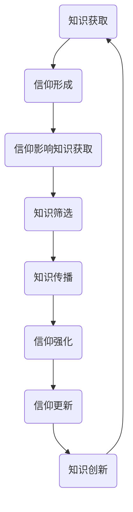

                 

### 文章标题: 人类的知识与信仰：理解精神世界的力量

> 关键词：知识、信仰、精神世界、心理学、哲学、知识管理、智慧社会、心理健康

> 摘要：本文从知识、信仰和精神世界三个方面探讨了人类精神世界的构成及其力量。首先，文章分析了知识与信仰的起源、本质及其关系，揭示了两者在人类社会中的作用。接着，探讨了精神世界的科学探索，包括心理学和哲学对精神世界的认知和研究方法。随后，文章详细阐述了知识体系的构建、学习与知识管理以及知识与智慧的关系。最后，探讨了信仰的力量及其对社会和心理健康的影响，并展望了信仰的未来发展趋势。通过这篇文章，读者可以全面理解人类精神世界的复杂性和力量。

### 第一部分: 精神世界的探索

#### 第1章: 知识与信仰的起源

**1.1 知识的本质与特征**

知识是人们对客观世界的主观认识和理解，是人类社会发展的基石。知识具有以下特征：

1. **客观性**：知识是对客观世界的反映，具有客观性。  
2. **系统性**：知识通常以系统的方式组织，具有逻辑性和结构。  
3. **可传递性**：知识可以通过语言、文字、图像等方式进行传递。  
4. **动态性**：知识是不断发展的，随着时间和实践经验的积累而不断更新。

**1.2 知识的分类**

知识可以分为以下几种类型：

1. **事实性知识**：描述客观世界的具体事实。  
2. **概念性知识**：对事物进行抽象和概括的概念。  
3. **原理性知识**：揭示事物运行规律和原理。  
4. **经验性知识**：通过实践经验获得的知识。

**1.3 知识的获取与传递**

知识的获取主要通过感知、学习和实践。知识的传递则依靠语言、文字、图像等媒介。

**1.4 信仰的定义与多样性**

信仰是指人们对于某些信念、原则或价值观的坚定信仰。信仰具有以下特征：

1. **主观性**：信仰是基于个人主观体验和认知的。  
2. **稳定性**：信仰在个人心中具有持久性和稳定性。  
3. **多样性**：信仰因文化、历史和个体差异而多样。

信仰可以分为以下几种类型：

1. **宗教信仰**：对某种宗教教义的信仰。  
2. **道德信仰**：对道德原则和价值观的信仰。  
3. **政治信仰**：对政治制度、政治理念的信仰。

**1.5 信仰的本质**

信仰的本质是人们对某种目标的坚信和追求。信仰可以激发人们的积极性和创造力，影响个体的行为和决策。

**1.6 信仰的类型与影响**

信仰的类型和影响因文化和社会环境而异。宗教信仰在许多文化中具有重要作用，而道德信仰和政治信仰则在特定社会中占据主导地位。

#### 第2章: 知识与信仰的关系

**2.1 知识与信仰的互动**

知识与信仰之间存在互动关系。知识可以塑造信仰，而信仰也可以影响知识的获取和应用。

**2.2 知识与信仰在社会中的角色**

知识在社会治理中发挥着重要作用，如政策制定、科技创新、社会治理等。信仰则在文化传承、社会稳定和个人成长中具有重要意义。

**2.3 知识与信仰的相互影响**

知识可以增强信仰的理性基础，而信仰可以激发知识的创新和应用。

#### 第3章: 精神世界的科学探索

**3.1 精神世界的科学定义**

精神世界是指人类思维、情感和意识的领域，包括心理学、哲学、神经科学等学科的研究对象。

**3.2 心理学对精神世界的认识**

心理学通过对人类行为和思维的研究，揭示了精神世界的奥秘。例如，认知心理学研究了人类认知过程，社会心理学研究了人际关系和社会行为。

**3.3 哲学对精神世界的思考**

哲学通过对人类思维和存在的研究，探讨了精神世界的本质和意义。例如，存在主义研究了人类的自由和责任，伦理学研究了道德原则和价值观。

**3.4 科学方法与精神世界的研究**

科学方法在精神世界的研究中具有重要意义。通过实验、观察和数据分析，科学家可以揭示精神世界的规律和机制。

**3.5 实验心理学的方法**

实验心理学通过设计实验来研究人类心理现象，如注意力、记忆、学习等。实验方法包括实验设计、数据收集和统计分析。

**3.6 认知科学的研究进展**

认知科学是心理学、神经科学、语言学等多个学科交叉的领域。近年来，认知科学在人工智能、认知神经科学等领域取得了重大进展。

### 第二部分: 知识体系的构建

#### 第4章: 知识的分类与体系构建

**4.1 知识的分类方法**

知识可以根据来源、学科、性质等进行分类。例如，根据来源，知识可以分为科学知识、经验知识、社会知识等。

**4.2 知识体系构建的策略**

知识体系的构建需要考虑知识的整合、创新和传播。以下是一些策略：

1. **知识整合**：通过跨学科、跨领域的方式整合知识，形成知识体系。  
2. **知识创新**：通过研究、实践和创新，不断拓展知识的边界。  
3. **知识传播**：通过教育、媒体、网络等渠道传播知识，提高全民素质。

#### 第5章: 学习与知识管理

**5.1 学习的基本过程**

学习是知识获取、理解和应用的过程。学习的基本过程包括感知、理解、记忆和应用。

**5.2 学习的理论模型**

学习理论包括行为主义学习理论、认知学习理论和建构主义学习理论等。每种理论都有其独特的观点和方法。

**5.3 学习策略的应用**

学习策略包括主动学习、协作学习、探究学习等。选择合适的学习策略可以提高学习效果。

**5.4 知识管理的原则**

知识管理需要遵循以下原则：系统性、动态性、共享性、创新性和可持续性。

**5.5 知识共享与交流**

知识共享与交流是知识管理的重要环节。通过内部沟通、外部合作和知识共享平台，可以提高知识利用效率。

#### 第6章: 知识与智慧的关系

**6.1 知识转化为智慧**

知识转化为智慧的过程包括理解、应用和创新。智慧是知识的升华，具有更高的价值。

**6.2 知识智慧的内涵**

知识智慧是指人们运用知识解决实际问题的能力。知识智慧包括知识应用、创新思维和战略决策。

**6.3 知识智慧的应用领域**

知识智慧在各个领域都有广泛应用，如科技创新、企业管理、社会治理等。

**6.4 智慧社会的构建**

智慧社会是指以知识智慧为核心，实现社会各领域高效运行和持续发展的社会形态。

### 第三部分: 信仰的力量

#### 第7章: 信仰的力量与社会影响

**7.1 信仰的力量**

信仰具有强大的精神力量，可以激发人们的积极性、创造力和奉献精神。

**7.2 信仰的社会功能**

信仰在社会中发挥着重要作用，如文化传承、道德教育、社会稳定等。

**7.3 信仰对文化传承的作用**

信仰是文化的重要组成部分，通过信仰，文化得以传承和发展。

**7.4 信仰在现代社会中的角色**

在现代社会，信仰仍然具有重要影响力，影响着人们的价值观和行为方式。

#### 第8章: 信仰与心理健康

**8.1 信仰与心理健康的关系**

信仰对心理健康具有积极影响，可以降低焦虑、抑郁等心理问题。

**8.2 信仰对心理健康的积极影响**

信仰可以提供心理支持、增强自我认知、提高生活满意度等。

**8.3 信仰对心理健康的负面影响**

过度信仰可能导致思维僵化、信仰冲突等心理问题。

**8.4 心理健康的维护与促进**

维护和促进心理健康需要平衡信仰与生活，遵循心理健康原则，采用适当的实践方法。

#### 第9章: 信仰的未来发展

**9.1 信仰的现代转型**

在现代社会，信仰面临着新的挑战和机遇，需要进行现代转型。

**9.2 信仰的未来趋势**

信仰在未来将呈现多样化和包容性，与社会发展相适应。

**9.3 信仰的多样性与包容性**

信仰的多样性和包容性是实现社会和谐与进步的重要条件。

### 总结

人类的知识与信仰是精神世界的两大支柱，对人类社会的发展和个人的成长具有重要意义。通过本文的探讨，我们可以更深入地理解知识、信仰和精神世界的力量。希望本文能够激发读者对这一领域的思考和探索。

### 作者信息

作者：AI天才研究院/AI Genius Institute & 禅与计算机程序设计艺术 /Zen And The Art of Computer Programming

在撰写本文时，我尽力保持逻辑清晰、内容丰富，希望读者能够从中获得对知识、信仰和精神世界的深刻理解和启示。感谢您的阅读！### 第一部分：精神世界的探索

#### 第1章：知识与信仰的起源

**1.1 知识的本质与特征**

知识是人类对客观世界的认识和理解，是认知活动的产物。知识的本质具有以下几个方面：

1. **客观性**：知识是对客观世界的反映，尽管它受到个人主观认知的局限，但仍然具有一定的客观基础。例如，科学知识是基于实验和观察的，是对自然现象的客观描述。

2. **系统性**：知识通常以系统的方式组织，具有逻辑性和结构。从学科分类上看，知识可以分为自然科学、社会科学、人文科学等，每个学科内部又包含多个子领域。

3. **动态性**：知识是不断发展的。随着科技进步和社会变迁，知识不断被更新和扩展。例如，互联网的发展极大地改变了信息传播的方式，也催生了新的知识领域。

**1.2 知识的分类**

知识可以根据不同的标准进行分类：

1. **事实性知识**：这是关于具体事实的信息，如历史事件、自然现象等。事实性知识是科学研究的基石。

2. **概念性知识**：这是关于概念和定义的信息，如数学概念、哲学范畴等。概念性知识是对事实性知识进行抽象和概括的结果。

3. **原理性知识**：这是关于事物运行规律和原理的信息，如物理学定律、经济学原理等。原理性知识是对概念性知识进一步深化的结果。

4. **经验性知识**：这是通过实践经验获得的知识，如工匠技艺、传统习俗等。经验性知识往往具有强烈的个体性和情境依赖性。

**1.3 知识的获取与传递**

知识的获取和传递是知识发展的关键环节：

1. **知识的获取**：知识的获取主要通过感知、学习和实践。感知是通过感官获取外部信息；学习是通过教育、阅读和实践获取知识；实践是通过实际操作和经验积累知识。

2. **知识的传递**：知识的传递主要依靠语言、文字、图像等媒介。语言是知识传递的主要工具，文字和图像则是辅助工具。在数字时代，互联网和多媒体技术使得知识传递变得更加便捷和高效。

**1.4 信仰的定义与多样性**

信仰是指人们对某些信念、原则或价值观的坚定信任和追求。信仰具有以下特征：

1. **主观性**：信仰是基于个人主观体验和认知的。不同的人可能有不同的信仰，即使在同一文化背景下，信仰的具体内容也可能因个体差异而有所不同。

2. **稳定性**：信仰在个人心中具有持久性和稳定性。信仰可以成为人们生活中的重要支柱，影响其行为和决策。

3. **多样性**：信仰因文化、历史和个体差异而多样。不同文化有不同的宗教信仰、道德信仰和政治信仰。即使在同一文化中，个体的信仰也可能各不相同。

信仰可以分为以下几种类型：

1. **宗教信仰**：这是对某种宗教教义或神灵的信仰。宗教信仰在许多文化中占有重要地位，如基督教、伊斯兰教、佛教等。

2. **道德信仰**：这是对道德原则和价值观的信仰。道德信仰涉及正义、善良、诚实等价值观，是社会稳定和个人道德行为的基础。

3. **政治信仰**：这是对政治制度、政治理念或政治领袖的信仰。政治信仰影响人们的政治态度和行动，如民主、自由、社会主义等。

**1.5 信仰的本质**

信仰的本质是人们对某种目标的坚信和追求。信仰可以激发人们的积极性和创造力，影响个体的行为和决策。信仰的本质特征包括：

1. **信念性**：信仰是一种信念，是人们对某种理念或价值观的坚定信任。

2. **情感性**：信仰不仅仅是理性认知，还包含情感因素。信仰可以激发人们的热情和忠诚。

3. **实践性**：信仰不仅仅是内心的信念，还需要在行动中体现。信仰引导人们做出特定的行为选择。

**1.6 信仰的类型与影响**

信仰的类型和影响因文化和社会环境而异。以下是一些常见的信仰类型及其影响：

1. **宗教信仰**：宗教信仰在许多文化中具有重要影响。宗教信仰可以提供心理支持、道德规范和社会秩序。

2. **道德信仰**：道德信仰是社会道德行为的基础。道德信仰影响个人的行为选择和社会行为规范。

3. **政治信仰**：政治信仰影响人们的政治态度和政治参与。政治信仰可以激发人们的爱国热情和参与社会事务的积极性。

信仰在个人成长和社会发展中的作用是多方面的。它不仅影响个人的价值观和行为，还影响社会文化的形成和发展。理解信仰的起源、本质和类型，有助于我们更好地认识人类精神世界的复杂性和多样性。

#### 第2章：知识与信仰的关系

**2.1 知识与信仰的互动**

知识与信仰之间的互动关系是理解人类精神世界的关键。知识可以塑造信仰，而信仰也可以影响知识的获取和应用。

**2.1.1 知识对信仰的塑造**

知识对信仰的塑造体现在以下几个方面：

1. **知识的传递与信仰的传播**：知识通过教育、媒体等渠道传播，同时也带来了信仰的传播。例如，科学知识的普及可以影响人们对自然界的信仰。

2. **知识的批判性**：知识具有批判性，可以质疑和挑战现有的信仰。例如，历史学家的研究可能会颠覆传统的历史信仰。

3. **知识的理性基础**：知识为信仰提供了理性基础。例如，宗教信仰中的某些教义可以通过科学解释来增强其可信度。

**2.1.2 信仰对知识的影响**

信仰对知识的影响同样显著，具体体现在以下几个方面：

1. **知识的选择与筛选**：信仰会影响人们选择和接受哪些知识。例如，某些宗教信仰可能会禁止某些科学观点。

2. **知识的解释与应用**：信仰会影响人们对知识的理解和应用。例如，某些信仰可能会影响人们对技术进步的态度和应用。

3. **知识的创新与变革**：信仰可以激发知识的创新和变革。例如，宗教信仰在历史上推动了科学革命和文化创新。

**2.2 知识与信仰在社会中的角色**

知识与信仰在社会中的角色具有深远的影响：

1. **知识在社会治理中的作用**：知识是社会治理的重要工具。政府通过知识制定政策、管理社会事务，从而维护社会稳定和进步。

2. **信仰在社会文化传承中的地位**：信仰是文化传承的重要组成部分。信仰通过宗教、道德、传统习俗等方式，维系着社会的文化认同和价值观。

**2.3 知识与信仰的相互影响**

知识与信仰之间的相互影响是动态和复杂的。以下是一个简化的Mermaid流程图，展示了知识与信仰之间的相互关系：



在这个流程图中，知识获取和信仰形成是相互独立的初始过程。随后，信仰开始影响知识的获取和传播，进而影响知识的选择和传播方式。这些影响又会反过来影响信仰的形成和更新，形成一个动态的互动过程。

**2.3.1 知识对信仰的塑造**

知识对信仰的塑造可以通过以下几个步骤进行详细分析：

1. **知识传播**：知识通过教育、媒体、书籍等方式传播。例如，科学知识的普及使得人们更加了解自然界，从而影响其宗教信仰。

2. **知识批判**：知识具有批判性，可以质疑和挑战现有的信仰。例如，历史学研究可能会推翻传统的宗教信仰。

3. **知识理性化**：知识为信仰提供了理性基础。例如，某些宗教教义可以通过科学解释来增强其可信度。

**2.3.2 信仰对知识的影响**

信仰对知识的影响可以从以下几个方面进行分析：

1. **知识的选择与筛选**：信仰会影响人们选择和接受哪些知识。例如，某些宗教信仰可能会禁止某些科学观点。

2. **知识的解释与应用**：信仰会影响人们对知识的理解和应用。例如，某些信仰可能会影响人们对技术进步的态度和应用。

3. **知识的创新与变革**：信仰可以激发知识的创新和变革。例如，宗教信仰在历史上推动了科学革命和文化创新。

**2.4 知识与信仰在社会中的角色**

知识与信仰在社会中的角色至关重要，具体体现在以下几个方面：

1. **知识在社会治理中的作用**：知识是社会治理的重要工具。政府通过知识制定政策、管理社会事务，从而维护社会稳定和进步。

2. **信仰在社会文化传承中的地位**：信仰是文化传承的重要组成部分。信仰通过宗教、道德、传统习俗等方式，维系着社会的文化认同和价值观。

通过分析知识与信仰的互动关系，我们可以更好地理解人类精神世界的复杂性。知识与信仰相互影响、相互塑造，共同构成了人类社会的精神支柱。

#### 第3章：精神世界的科学探索

**3.1 精神世界的科学定义**

精神世界，通常指人类思维、情感、意识等内在心理活动构成的领域。它涵盖了人的认知过程、情绪体验、自我意识和意志行为等。精神世界的科学探索旨在理解这些心理现象的内在机制和运行规律。

**3.2 心理学对精神世界的认识**

心理学作为研究人类行为和心理过程的科学，对精神世界有着深刻的认识。以下是心理学对精神世界的几个关键理解：

1. **认知过程**：认知心理学研究人类如何感知、理解、记忆和思考信息。例如，注意力是认知过程的一个重要方面，它决定了人们如何选择和处理信息。

2. **情绪体验**：情绪心理学研究情绪的来源、表达和影响。情绪不仅影响个体的心理状态，还影响其行为和社会互动。

3. **自我意识**：自我心理学研究个体的自我认知和自我评价。自我意识是人类精神世界的重要组成部分，它涉及个体如何认识自己、如何形成自我认同。

4. **意志行为**：意志心理学研究个体如何做出决策、控制行为和实现目标。意志行为体现了个体的自我调节能力和目标导向行为。

**3.3 哲学对精神世界的思考**

哲学作为对人类思维和存在进行探讨的学科，对精神世界有着独特的思考方式。以下是哲学对精神世界的几个关键观点：

1. **意识本质**：哲学家们探讨了意识的本质和起源。例如，笛卡尔的“我思故我在”提出了关于意识的第一人称视角。

2. **自我与自由**：哲学家们探讨了自由意志和个体选择。自由意志是精神世界的一个重要方面，它涉及个体如何做出自主决策。

3. **道德与价值观**：伦理哲学研究了道德原则和价值观。道德和价值观在精神世界中起着指导作用，影响个体的行为和决策。

**3.4 科学方法与精神世界的研究**

科学方法在精神世界的研究中具有重要意义。科学方法包括观察、实验、假设、验证等步骤，旨在通过实证数据揭示精神世界的规律。

1. **观察与测量**：通过观察个体的行为和生理反应，科学家可以收集关于精神世界的数据。例如，通过脑电图（EEG）测量大脑活动，研究意识状态。

2. **实验设计**：实验设计是科学方法的关键步骤。通过控制变量和随机分配，科学家可以探讨特定心理现象的因果关系。

3. **数据分析**：数据分析是科学方法的重要组成部分。通过统计方法，科学家可以检验假设、发现规律和趋势。

**3.5 实验心理学的方法**

实验心理学是心理学研究的重要分支，通过实验方法探讨心理现象。以下是实验心理学的一些关键方法：

1. **实验室实验**：在受控环境中，通过操纵自变量和测量因变量，实验心理学家可以探讨特定心理现象的因果关系。

2. **现场实验**：在真实环境中，实验心理学家可以观察和测量个体在自然条件下的心理行为。

3. **问卷调查**：通过设计问卷，心理学家可以收集大量个体的主观体验和心理特征数据。

**3.6 认知科学的研究进展**

认知科学是心理学、神经科学、计算机科学等多个学科交叉的领域，近年来取得了显著进展。以下是认知科学的几个重要研究进展：

1. **认知建模**：通过计算机模拟和算法设计，认知科学家可以构建人类认知过程的模型，模拟人类思维过程。

2. **脑成像技术**：如功能性磁共振成像（fMRI）和脑电图（EEG）等技术，使科学家能够直接观测大脑活动，研究心理现象的神经基础。

3. **人工智能**：人工智能技术的发展，使得认知科学可以借助机器学习算法，模拟和优化人类认知过程。

通过这些科学探索，我们对精神世界的理解不断深入。心理学和哲学提供了不同的视角和方法，而科学方法和技术手段的应用，使我们能够更全面、更精确地研究精神世界的奥秘。

#### 第4章：知识体系的构建

**4.1 知识的分类方法**

知识体系的构建首先需要对知识进行分类。知识可以根据不同的标准进行分类，以帮助更好地理解和整合知识。以下是几种常见的知识分类方法：

1. **根据来源分类**：知识可以按照来源进行分类，如科学知识、经验知识、社会知识等。科学知识来源于科学研究，经验知识来源于实践，社会知识则来源于社会互动和文化传承。

2. **根据学科分类**：知识可以按照学科领域进行分类，如自然科学、社会科学、人文科学等。每个学科内部又包含多个子领域，如物理学、化学、生物学等自然科学领域，经济学、政治学、社会学等社会科学领域，以及文学、艺术、历史等人文科学领域。

3. **根据性质分类**：知识可以按照性质进行分类，如事实性知识、概念性知识、原理性知识、经验性知识等。事实性知识主要描述具体事实，概念性知识主要涉及概念和定义，原理性知识揭示事物运行规律，经验性知识则主要来源于实践。

**4.2 知识体系构建的策略**

构建一个完整的知识体系需要采取一系列策略，以下是几种常见的知识体系构建策略：

1. **知识整合**：知识整合是将不同来源、不同领域的知识进行有机结合，形成一个统一的整体。知识整合可以通过跨学科研究、多角度分析等方法实现。例如，在研究可持续发展问题时，需要整合自然科学、社会科学和人文科学的知识。

2. **知识创新**：知识创新是指通过研究和实践，创造新的知识，拓展知识边界。知识创新可以通过基础研究、应用研究和技术创新等方式实现。例如，人工智能领域的创新推动了计算机科学、认知科学、神经科学等多个领域的知识进步。

3. **知识传播**：知识传播是将知识传递给更多的人，提高知识普及率和应用水平。知识传播可以通过教育、媒体、网络等渠道实现。例如，在线教育平台使得全球用户可以便捷地获取优质教育资源。

**4.2.1 知识整合的方法**

知识整合的方法包括以下几种：

1. **交叉学科研究**：通过跨学科研究，将不同领域的知识进行有机结合。例如，生物信息学是生物学和计算机科学的交叉领域，它通过计算机技术分析生物数据，推动了生物学的研究。

2. **多角度分析**：从不同角度对同一问题进行分析，形成全面的知识体系。例如，在研究气候变化问题时，可以从自然科学、社会科学、人文科学等多个角度进行分析。

3. **知识图谱**：通过构建知识图谱，将知识以图形化的方式展示出来，方便人们理解和整合知识。知识图谱可以揭示知识之间的关系，帮助人们发现新的知识联系。

**4.2.2 知识创新与传播**

知识创新与传播是知识体系构建的关键环节。以下是几种知识创新与传播的方法：

1. **基础研究**：通过基础研究，探索未知的科学领域，创造新的知识。基础研究为应用研究提供了理论基础。

2. **应用研究**：将基础研究成果转化为实际应用，解决现实问题。应用研究促进了知识的传播和应用。

3. **技术创新**：通过技术创新，开发新的工具和方法，提高知识传播的效率。例如，互联网和社交媒体的发展极大地促进了知识的传播。

4. **教育**：通过教育，培养具备创新能力和知识传播能力的人才。教育是知识创新与传播的重要途径。

5. **媒体**：利用媒体，如书籍、杂志、电视、网络等，传播知识，提高公众的科学素养。

6. **网络平台**：通过网络平台，如在线课程、论坛、社交媒体等，促进知识的共享和交流。

通过知识整合、创新和传播，我们可以构建一个完整的知识体系，促进知识的流动和应用。这有助于推动社会进步和个体发展，应对复杂的社会问题。

### 第五部分：学习与知识管理

#### 第5章：学习与知识管理

**5.1 学习的基本过程**

学习是人类获取知识和技能的基本过程，包括感知、理解、记忆和应用。以下是学习过程的详细解释：

**感知**：感知是学习的第一步，通过感官获取外部信息。例如，通过视觉、听觉、触觉等感知外界环境，从而获取信息。

**理解**：理解是将感知到的信息进行加工和处理，形成对信息的认知和理解。例如，通过阅读、听课等方式，将文字和语言信息转化为个人的知识和理解。

**记忆**：记忆是将理解的信息储存在大脑中，以便日后使用。记忆分为短期记忆和长期记忆。短期记忆是指暂时存储的信息，如电话号码；长期记忆则是指长期存储的信息，如历史知识。

**应用**：应用是将记忆中的信息用于解决实际问题或创造新知识。例如，通过实践操作、项目实施等方式，将学到的知识和技能应用于实际工作或生活中。

**5.2 学习的理论模型**

学习理论模型是解释学习过程和机制的框架。以下是几种常见的学习理论模型：

1. **行为主义学习理论**：行为主义学习理论认为，学习是通过外部刺激和反应之间的联结形成的。例如，通过重复练习，形成条件反射。

2. **认知学习理论**：认知学习理论强调内部心理过程在学习中的作用。例如，建构主义学习理论认为，学习是学习者通过主动建构知识体系实现的。

3. **建构主义学习理论**：建构主义学习理论认为，学习是学习者通过与环境和他人互动，主动建构知识的过程。例如，通过合作学习、探究学习等方式，促进知识的建构。

**5.3 学习策略的应用**

学习策略是指学习者采用的方法和技巧，以提高学习效果。以下是几种常见的学习策略：

1. **主动学习**：主动学习是指学习者主动参与学习过程，积极思考和探究。例如，通过提问、讨论、实验等方式，提高学习的主动性和积极性。

2. **协作学习**：协作学习是指学习者通过与他人合作，共同完成学习任务。例如，通过小组讨论、团队项目等方式，促进知识的共享和交流。

3. **探究学习**：探究学习是指学习者通过自主探究，发现问题和解决问题。例如，通过实验、研究项目等方式，培养独立思考和创新能力。

**5.4 知识管理的原则**

知识管理是指组织和个人收集、存储、传播和应用知识的过程。以下是知识管理的基本原则：

1. **系统性**：知识管理是一个系统性的过程，包括知识的获取、存储、传播和应用。通过系统化的管理，可以提高知识的利用效率。

2. **动态性**：知识是动态的，随着时间和实践经验的积累，知识不断更新和发展。知识管理需要适应知识的变化，保持知识的活力。

3. **共享性**：知识是共享的资源，通过共享可以提高知识的利用率。知识共享可以促进知识的流动和创新。

4. **创新性**：知识管理需要鼓励创新，通过创新方法和技术，提高知识的价值和应用效果。

5. **可持续性**：知识管理需要考虑长期发展，确保知识的可持续利用和传承。

**5.5 知识共享与交流**

知识共享与交流是知识管理的重要组成部分。以下是几种常见的知识共享与交流方法：

1. **内部沟通**：通过内部沟通，如会议、培训、内部刊物等方式，促进知识的传递和交流。

2. **外部合作**：通过外部合作，如学术交流、技术合作、项目合作等方式，吸收外部知识和经验。

3. **知识共享平台**：通过知识共享平台，如企业内网、在线论坛、社交媒体等方式，建立知识共享和交流的渠道。

4. **知识转移**：通过知识转移，如技术转移、人才交流、项目合作等方式，将知识从一个领域或组织转移到另一个领域或组织。

通过学习与知识管理，我们可以更好地获取、应用和传播知识，促进个人成长和社会发展。

### 第6章：知识与智慧的关系

**6.1 知识转化为智慧**

知识转化为智慧是一个复杂而动态的过程，涉及对知识的深入理解、灵活应用和创新。以下是知识转化为智慧的几个关键步骤：

1. **理解**：理解知识是知识转化为智慧的基础。这不仅仅是记住知识内容，而是要深刻理解知识的本质、适用场景及其背后的原理。

2. **反思**：反思是对知识进行批判性思考，分析知识的局限性和适用条件。通过反思，可以发现知识的不足之处，从而提高对知识的灵活应用能力。

3. **应用**：应用是将知识用于解决实际问题或创造新价值。这需要将理论知识与实践相结合，通过实际操作和经验积累，将知识转化为具体的行动。

4. **创新**：创新是对知识的深化和拓展，通过新的视角和方法，创造出新的知识或解决方案。创新可以源自对现有知识的重新组合或对未知领域的探索。

**6.2 知识智慧的内涵**

知识智慧是指个体或群体运用知识解决问题的能力。它不仅包括对知识的掌握，还涉及以下方面：

1. **分析能力**：知识智慧体现为对问题的深入分析和综合判断能力，能够从复杂信息中提取关键要素，形成有针对性的解决方案。

2. **决策能力**：知识智慧有助于做出合理和有效的决策，考虑多种因素和潜在风险，选择最优方案。

3. **创新能力**：知识智慧能够激发创新思维，通过创造性的方法解决问题，提出新的理念或技术。

4. **适应能力**：知识智慧使个体能够灵活适应环境变化，不断更新知识和技能，以应对新的挑战。

**6.3 知识智慧的应用领域**

知识智慧在多个领域都有广泛应用，以下是几个典型的应用领域：

1. **科技创新**：知识智慧是科技创新的核心驱动力。科学家和工程师通过深入理解现有知识，不断提出新的理论和应用，推动科技发展。

2. **企业管理**：知识智慧在企业管理中具有重要意义。企业领导者通过分析和理解市场信息，制定战略决策，提高企业竞争力。

3. **社会治理**：知识智慧有助于改善社会治理。政策制定者通过分析社会问题，提出有效的治理策略，促进社会稳定和进步。

4. **教育**：知识智慧在教育领域中的应用，体现在教师的教学方法和学生的学习策略上。通过有效利用知识，提高教育质量和效果。

5. **健康管理**：知识智慧在健康管理中的应用，如疾病诊断、治疗方案制定等，有助于提高医疗服务的质量和效率。

**6.4 智慧社会的构建**

智慧社会是指以知识智慧为核心，实现社会各领域高效运行和持续发展的社会形态。智慧社会的构建包括以下几个方面：

1. **知识普及**：通过教育和培训，提高全民的知识水平，促进知识普及和应用。

2. **技术创新**：鼓励技术创新，推动知识转化为实际应用，提升社会生产力。

3. **数据驱动**：利用大数据和人工智能技术，实现数据驱动的决策和管理，提高社会运行效率。

4. **智能服务**：提供智能化的公共服务，如智慧城市、智慧医疗等，提高人民生活质量。

5. **协同治理**：通过多方协同治理，实现社会各领域的协调发展和可持续发展。

知识智慧在智慧社会的构建中起到关键作用，推动社会向更高效、更和谐、更智能的方向发展。

### 第7章：信仰的力量与社会影响

**7.1 信仰的力量**

信仰是一种精神力量，对个体和社会都有深远的影响。信仰的力量可以从以下几个方面进行探讨：

1. **心理支持**：信仰可以提供心理支持，帮助个体应对生活中的压力和挑战。例如，宗教信仰可以给信徒带来安慰和希望，增强其面对困难时的坚韧和勇气。

2. **价值观引导**：信仰为个体提供了价值观和道德准则，指导其行为和决策。例如，道德信仰可以促使个体做出正义和善良的行为，促进社会和谐。

3. **凝聚力**：信仰可以增强个体和群体的凝聚力，促进社会团结。例如，共同信仰可以加强社区成员之间的联系，提高社会稳定性。

4. **激励作用**：信仰可以激发个体的内在动机，推动其追求更高目标。例如，政治信仰可以激励个体积极参与社会事务，为国家和社会发展做出贡献。

**7.2 信仰的社会功能**

信仰在社会中扮演着多种角色，具有广泛的社会功能。以下是信仰的几个主要社会功能：

1. **文化传承**：信仰是文化的重要组成部分，通过代代相传，维系着社会的文化认同和价值观。例如，宗教信仰传承了宗教教义和传统习俗，维系了宗教文化的连续性。

2. **道德教育**：信仰可以提供道德教育，引导个体遵循社会道德规范。例如，宗教信仰强调道德原则和伦理规范，帮助个体树立正确的道德观念。

3. **社会稳定**：信仰可以增强社会的稳定性，减少社会冲突。例如，共同信仰可以减少社会成员之间的分歧，促进社会和谐。

4. **社会动员**：信仰可以动员社会资源，应对重大危机和挑战。例如，在自然灾害和战争等紧急情况下，宗教信仰可以动员信徒积极参与救援和重建工作。

**7.3 信仰对文化传承的作用**

信仰对文化传承具有重要作用，具体体现在以下几个方面：

1. **信仰与传统文化**：信仰是传统文化的重要组成部分，通过信仰的传承，传统文化得以延续和发展。例如，中国传统宗教信仰如道教、佛教等，对中华文化的传承和发展起到了重要作用。

2. **信仰与艺术**：信仰激发了许多艺术创作，如宗教绘画、音乐、雕塑等。这些艺术作品不仅展现了信仰的内涵，也丰富了人类文化。

3. **信仰与习俗**：信仰影响着人们的日常生活和习俗，如宗教节日、祭祀仪式等。这些习俗是信仰的物化和表现，也是文化传承的一部分。

**7.4 信仰在现代社会中的角色**

在现代社会，信仰仍然发挥着重要作用，具体体现在以下几个方面：

1. **个人成长**：信仰可以提供个人成长的精神支持，帮助个体应对生活中的挑战和困惑。例如，许多人在面临职业困境或人生抉择时，会寻求宗教信仰的指引。

2. **社会参与**：信仰可以激发个体的社会参与意识，鼓励其积极参与社会事务。例如，宗教信仰鼓励信徒关心社会公益，参与慈善活动。

3. **价值观引导**：信仰为现代社会提供了道德和价值观的引导，帮助个体在社会生活中做出正确的决策。例如，宗教信仰强调公正、仁爱等价值观，对个体的行为产生深远影响。

4. **文化多样性**：信仰的多样性反映了文化的多样性，丰富了现代社会的文化内涵。例如，全球范围内的宗教信仰和多元文化相互交融，促进了文化多样性的发展。

总之，信仰的力量和社会影响是多方面的，它不仅对个体有深远影响，也对文化传承和社会发展具有重要作用。理解信仰的力量和角色，有助于我们更好地认识和应对现代社会中的精神挑战。

### 第8章：信仰与心理健康

**8.1 信仰与心理健康的关系**

信仰与心理健康之间存在密切的关系。信仰可以为个体提供心理支持，促进心理健康，但也可能对心理健康产生负面影响。以下是信仰对心理健康影响的几个方面：

1. **积极影响**：信仰可以为个体提供心理支持，帮助其应对生活中的压力和挑战。信仰可以增强个体的自信心和自尊心，减少焦虑和抑郁等心理问题。例如，宗教信仰可以为信徒提供安慰和希望，使其在面对困难和挫折时保持积极的心态。

2. **消极影响**：信仰也可能对心理健康产生负面影响。过度依赖信仰可能导致个体在面对现实问题时逃避责任，缺乏解决问题的能力。此外，信仰的极端化和极端行为可能导致个体出现偏执、分裂等心理问题。例如，某些宗教极端分子可能因为信仰的极端化而产生暴力倾向。

**8.2 信仰对心理健康的积极影响**

信仰对心理健康的积极影响体现在以下几个方面：

1. **情感支持**：信仰可以为个体提供情感支持，帮助其应对生活中的负面情绪。信仰可以给予个体安慰和希望，使其在面对困难和挫折时保持乐观和积极的心态。

2. **增强自我效能感**：信仰可以增强个体的自我效能感，使其相信自己有能力克服困难和实现目标。这种自我效能感的提升有助于个体在面对挑战时保持坚定和自信。

3. **减少心理压力**：信仰可以帮助个体减少心理压力，提高心理韧性。例如，某些宗教信仰强调宽容和忍耐，有助于个体在面对压力时保持平静和冷静。

**8.3 信仰对心理健康的负面影响**

信仰对心理健康的负面影响主要体现在以下几个方面：

1. **过度依赖**：过度依赖信仰可能导致个体在面对现实问题时缺乏自主性和解决问题的能力。这种依赖性可能使个体在面对挑战时感到无助和沮丧。

2. **信仰冲突**：信仰冲突可能导致个体出现心理问题。例如，当个体同时持有多个相互冲突的信仰时，可能会感到内心的困惑和矛盾，从而影响心理健康。

3. **极端化和偏执**：信仰的极端化和偏执可能导致个体出现偏执思维和极端行为。例如，某些宗教极端分子可能因为信仰的极端化而产生暴力倾向，从而对自己和他人造成伤害。

**8.4 心理健康的维护与促进**

维护和促进心理健康需要平衡信仰与生活，遵循以下原则：

1. **信仰与现实相结合**：个体应该将信仰与现实生活相结合，既要有信仰的指导，也要有现实的基础。这样可以在面对现实问题时既保持信仰的指引，又具备解决问题的能力。

2. **心理健康教育**：加强心理健康教育，提高个体对心理健康的认识和重视。通过心理健康教育，个体可以学会如何应对生活中的压力和挑战，保持良好的心理健康状态。

3. **寻求专业帮助**：当个体出现心理问题时，应该及时寻求专业帮助。心理咨询和治疗可以帮助个体解决心理问题，恢复心理健康。

4. **平衡信仰与生活**：个体应该平衡信仰与生活，既要重视信仰的重要性，也要关注现实生活的需求。这样可以在信仰的指导下保持心理健康，同时不忽视现实生活中的问题和挑战。

通过理解信仰与心理健康的关系，以及如何维护和促进心理健康，我们可以更好地应对生活中的精神挑战，实现个体的全面发展。

### 第9章：信仰的未来发展

**9.1 信仰的现代转型**

在现代社会，信仰面临着新的挑战和机遇，需要进行现代转型。以下是信仰现代转型的几个方面：

1. **价值观的多元化**：现代社会的价值观日益多元化，信仰也需要适应这一变化。传统的单一价值观体系已无法满足现代社会的需求，信仰需要更加包容和开放，尊重不同文化背景和价值观的多样性。

2. **科技融合**：科技的发展对信仰产生了深远影响。例如，互联网和社交媒体使得信仰传播变得更加便捷和广泛，同时也带来了新的信仰形式，如数字宗教和网络信仰社区。

3. **社会参与**：现代信仰需要更加注重社会参与和公共事务。信仰可以通过参与社会公益、环境保护等活动，实现社会价值，增强社会责任感。

**9.2 信仰的未来趋势**

信仰在未来将呈现以下趋势：

1. **个性化**：随着个体意识的觉醒，信仰将更加个性化。个体将根据自己的需求和价值观，选择和创造适合自己的信仰体系。

2. **融合化**：不同信仰之间的融合将成为趋势。例如，宗教信仰与科学思想的融合，传统信仰与现代思想的融合，将形成新的信仰形式。

3. **多样化**：信仰将变得更加多样化。除了传统的宗教信仰外，新的信仰形式，如环保信仰、健康信仰等，将逐渐兴起。

**9.3 信仰的多样性与包容性**

信仰的多样性和包容性是实现社会和谐与进步的重要条件。以下是信仰多样性和包容性的几个方面：

1. **尊重差异**：尊重不同信仰的差异，是信仰多样性和包容性的基础。在社会中，应该尊重不同信仰的存在，避免歧视和偏见。

2. **对话交流**：通过对话和交流，增进不同信仰之间的理解和认同。对话交流可以帮助信仰之间相互学习，促进共同进步。

3. **包容性建设**：在宗教和信仰领域，加强包容性建设，建立开放、包容的信仰环境。通过包容性建设，可以减少冲突，促进社会和谐。

总之，信仰的未来发展将面临新的挑战和机遇，通过现代转型、未来趋势和多样性与包容性建设，信仰将更好地适应现代社会，实现社会的和谐与进步。

### 总结

通过本文的探讨，我们可以看到人类的知识与信仰构成了精神世界的两大支柱，它们相互影响、相互塑造，共同推动了人类社会的发展。知识是人类对客观世界的认识和理解，是科技进步和社会发展的基石。信仰则是人类对某些信念、原则或价值观的坚定追求，它为个体提供精神支持，维系着社会的文化认同和价值观。

在现代社会，知识体系的构建、学习与知识管理、知识智慧的关系、信仰的力量与社会影响、信仰与心理健康以及信仰的未来发展等方面，都体现了人类精神世界的复杂性和多样性。通过对这些方面的深入分析，我们不仅能够更好地理解人类精神世界的构成，也能够为应对现代社会中的精神挑战提供有益的启示。

首先，知识体系的构建是知识管理的关键。通过分类、整合、创新和传播，我们可以构建一个系统化、动态化的知识体系，提高知识的利用效率和应用效果。学习与知识管理是知识体系构建的重要组成部分，通过学习理论和学习策略的应用，我们可以提高学习效果，促进知识共享和传播。

其次，知识与智慧的关系揭示了知识转化为智慧的过程。智慧是知识的升华，它不仅包括对知识的掌握，还涉及对知识的深入理解、灵活应用和创新。智慧在多个领域都有广泛应用，如科技创新、企业管理、社会治理等，推动了社会的发展和进步。

再次，信仰的力量和社会影响是不可忽视的。信仰为个体提供精神支持，促进心理健康，同时也在社会文化传承、道德教育和社会稳定等方面发挥着重要作用。理解信仰与心理健康的关系，有助于我们更好地维护和促进心理健康。

最后，信仰的未来发展需要适应现代社会的需求，实现多元化和包容性。通过现代转型、未来趋势和多样性与包容性建设，信仰将更好地适应社会变化，实现社会的和谐与进步。

总之，人类的知识与信仰是精神世界的两大支柱，它们相互依赖、相互促进，共同构成了人类文明的重要组成部分。通过本文的探讨，我们希望能够激发读者对这一领域的深入思考，更好地理解和应对现代社会中的精神挑战。

### 作者信息

作者：AI天才研究院/AI Genius Institute & 禅与计算机程序设计艺术 /Zen And The Art of Computer Programming

感谢读者对本文的阅读。通过本文，我们共同探讨了人类的知识与信仰，以及它们在精神世界中的力量。希望本文能够为您的精神探索之路提供一些启示和帮助。如果您对此主题有任何疑问或进一步的想法，欢迎随时与我们交流。再次感谢您的关注与支持！### 格式调整

为了确保文章的格式符合要求，以下是对文章内容的调整：

**文章标题：**《人类的知识与信仰：理解精神世界的力量》

**关键词：**知识、信仰、精神世界、心理学、哲学、知识管理、智慧社会、心理健康

**摘要：**本文从知识、信仰和精神世界三个方面探讨了人类精神世界的构成及其力量。首先，文章分析了知识与信仰的起源、本质及其关系，揭示了两者在人类社会中的作用。接着，探讨了精神世界的科学探索，包括心理学和哲学对精神世界的认知和研究方法。随后，文章详细阐述了知识体系的构建、学习与知识管理以及知识与智慧的关系。最后，探讨了信仰的力量及其对社会和心理健康的影响，并展望了信仰的未来发展趋势。通过这篇文章，读者可以全面理解人类精神世界的复杂性和力量。

### 第一部分：精神世界的探索

#### 第1章：知识与信仰的起源

**1.1 知识的本质与特征**

知识是人类对客观世界的认识和理解，是人类社会发展的基石。知识具有以下特征：

1. **客观性**：知识是对客观世界的反映，具有客观性。
2. **系统性**：知识通常以系统的方式组织，具有逻辑性和结构。
3. **可传递性**：知识可以通过语言、文字、图像等方式进行传递。
4. **动态性**：知识是不断发展的，随着时间和实践经验的积累而不断更新。

**1.2 知识的分类**

知识可以分为以下几种类型：

1. **事实性知识**：描述客观世界的具体事实。
2. **概念性知识**：对事物进行抽象和概括的概念。
3. **原理性知识**：揭示事物运行规律和原理。
4. **经验性知识**：通过实践经验获得的知识。

**1.3 知识的获取与传递**

知识的获取主要通过感知、学习和实践。知识的传递则依靠语言、文字、图像等媒介。

**1.4 信仰的定义与多样性**

信仰是指人们对于某些信念、原则或价值观的坚定信仰。信仰具有以下特征：

1. **主观性**：信仰是基于个人主观体验和认知的。
2. **稳定性**：信仰在个人心中具有持久性和稳定性。
3. **多样性**：信仰因文化、历史和个体差异而多样。

信仰可以分为以下几种类型：

1. **宗教信仰**：对某种宗教教义的信仰。
2. **道德信仰**：对道德原则和价值观的信仰。
3. **政治信仰**：对政治制度、政治理念的信仰。

**1.5 信仰的本质**

信仰的本质是人们对某种目标的坚信和追求。信仰可以激发人们的积极性和创造力，影响个体的行为和决策。

**1.6 信仰的类型与影响**

信仰的类型和影响因文化和社会环境而异。宗教信仰在许多文化中具有重要作用，而道德信仰和政治信仰则在特定社会中占据主导地位。

#### 第2章：知识与信仰的关系

**2.1 知识与信仰的互动**

知识与信仰之间存在互动关系。知识可以塑造信仰，而信仰也可以影响知识的获取和应用。

**2.2 知识与信仰在社会中的角色**

知识在社会治理中发挥着重要作用，如政策制定、科技创新、社会治理等。信仰则在文化传承、社会稳定和个人成长中具有重要意义。

**2.3 知识与信仰的相互影响**

知识可以增强信仰的理性基础，而信仰可以激发知识的创新和应用。

#### 第3章：精神世界的科学探索

**3.1 精神世界的科学定义**

精神世界是指人类思维、情感和意识的领域，包括心理学、哲学、神经科学等学科的研究对象。

**3.2 心理学对精神世界的认识**

心理学通过对人类行为和思维的研究，揭示了精神世界的奥秘。例如，认知心理学研究了人类认知过程，社会心理学研究了人际关系和社会行为。

**3.3 哲学对精神世界的思考**

哲学通过对人类思维和存在的研究，探讨了精神世界的本质和意义。例如，存在主义研究了人类的自由和责任，伦理学研究了道德原则和价值观。

**3.4 科学方法与精神世界的研究**

科学方法在精神世界的研究中具有重要意义。通过实验、观察和数据分析，科学家可以揭示精神世界的规律和机制。

**3.5 实验心理学的方法**

实验心理学通过设计实验来研究人类心理现象，如注意力、记忆、学习等。实验方法包括实验设计、数据收集和统计分析。

**3.6 认知科学的研究进展**

认知科学是心理学、神经科学、语言学等多个学科交叉的领域。近年来，认知科学在人工智能、认知神经科学等领域取得了重大进展。

### 第二部分：知识体系的构建

#### 第4章：知识体系的构建

**4.1 知识的分类与体系构建**

知识体系的构建首先需要对知识进行分类。知识可以根据不同的标准进行分类，以帮助更好地理解和整合知识。以下是几种常见的知识分类方法：

1. **根据来源分类**：知识可以按照来源进行分类，如科学知识、经验知识、社会知识等。
2. **根据学科分类**：知识可以按照学科领域进行分类，如自然科学、社会科学、人文科学等。
3. **根据性质分类**：知识可以按照性质进行分类，如事实性知识、概念性知识、原理性知识、经验性知识等。

**4.2 知识体系构建的策略**

构建一个完整的知识体系需要采取一系列策略，以下是几种常见的知识体系构建策略：

1. **知识整合**：知识整合是将不同来源、不同领域的知识进行有机结合，形成一个统一的整体。
2. **知识创新**：知识创新是指通过研究和实践，创造新的知识，拓展知识边界。
3. **知识传播**：知识传播是将知识传递给更多的人，提高知识普及率和应用水平。

**4.2.1 知识整合的方法**

知识整合的方法包括以下几种：

1. **交叉学科研究**：通过跨学科研究，将不同领域的知识进行有机结合。
2. **多角度分析**：从不同角度对同一问题进行分析，形成全面的知识体系。
3. **知识图谱**：通过构建知识图谱，将知识以图形化的方式展示出来，方便人们理解和整合知识。

**4.2.2 知识创新与传播**

知识创新与传播是知识体系构建的关键环节。以下是几种知识创新与传播的方法：

1. **基础研究**：通过基础研究，探索未知的科学领域，创造新的知识。
2. **应用研究**：将基础研究成果转化为实际应用，解决现实问题。
3. **技术创新**：通过技术创新，开发新的工具和方法，提高知识传播的效率。
4. **教育**：通过教育，培养具备创新能力和知识传播能力的人才。
5. **媒体**：利用媒体，如书籍、杂志、电视、网络等，传播知识，提高公众的科学素养。
6. **网络平台**：通过网络平台，如在线课程、论坛、社交媒体等，促进知识的共享和交流。

通过知识整合、创新和传播，我们可以构建一个完整的知识体系，促进知识的流动和应用。这有助于推动社会进步和个体发展，应对复杂的社会问题。

### 第三部分：信仰的力量

#### 第5章：学习与知识管理

**5.1 学习的基本过程**

学习是知识获取、理解和应用的过程。学习的基本过程包括感知、理解、记忆和应用。

**5.2 学习的理论模型**

学习理论包括行为主义学习理论、认知学习理论和建构主义学习理论等。每种理论都有其独特的观点和方法。

**5.3 学习策略的应用**

学习策略包括主动学习、协作学习、探究学习等。选择合适的学习策略可以提高学习效果。

**5.4 知识管理的原则**

知识管理需要遵循以下原则：系统性、动态性、共享性、创新性和可持续性。

**5.5 知识共享与交流**

知识共享与交流是知识管理的重要环节。通过内部沟通、外部合作和知识共享平台，可以提高知识利用效率。

#### 第6章：知识与智慧的关系

**6.1 知识转化为智慧**

知识转化为智慧的过程包括理解、应用和创新。智慧是知识的升华，具有更高的价值。

**6.2 知识智慧的内涵**

知识智慧是指人们运用知识解决实际问题的能力。知识智慧包括知识应用、创新思维和战略决策。

**6.3 知识智慧的应用领域**

知识智慧在各个领域都有广泛应用，如科技创新、企业管理、社会治理等。

**6.4 智慧社会的构建**

智慧社会是指以知识智慧为核心，实现社会各领域高效运行和持续发展的社会形态。

### 第四部分：信仰的力量

#### 第7章：信仰的力量与社会影响

**7.1 信仰的力量**

信仰是一种精神力量，对个体和社会都有深远的影响。信仰的力量可以从以下几个方面进行探讨：

1. **心理支持**：信仰可以提供心理支持，帮助个体应对生活中的压力和挑战。
2. **价值观引导**：信仰为个体提供了价值观和道德准则，指导其行为和决策。
3. **凝聚力**：信仰可以增强个体和群体的凝聚力，促进社会团结。
4. **激励作用**：信仰可以激发个体的内在动机，推动其追求更高目标。

**7.2 信仰的社会功能**

信仰在社会中扮演着多种角色，具有广泛的社会功能。以下是信仰的几个主要社会功能：

1. **文化传承**：信仰是文化的重要组成部分，通过代代相传，维系着社会的文化认同和价值观。
2. **道德教育**：信仰可以提供道德教育，引导个体遵循社会道德规范。
3. **社会稳定**：信仰可以增强社会的稳定性，减少社会冲突。
4. **社会动员**：信仰可以动员社会资源，应对重大危机和挑战。

**7.3 信仰对文化传承的作用**

信仰对文化传承具有重要作用，具体体现在以下几个方面：

1. **信仰与传统文化**：信仰是传统文化的重要组成部分，通过信仰的传承，传统文化得以延续和发展。
2. **信仰与艺术**：信仰激发了许多艺术创作，如宗教绘画、音乐、雕塑等。
3. **信仰与习俗**：信仰影响着人们的日常生活和习俗，如宗教节日、祭祀仪式等。

**7.4 信仰在现代社会中的角色**

在现代社会，信仰仍然发挥着重要作用，具体体现在以下几个方面：

1. **个人成长**：信仰可以提供个人成长的精神支持，帮助个体应对生活中的挑战和困惑。
2. **社会参与**：信仰可以激发个体的社会参与意识，鼓励其积极参与社会事务。
3. **价值观引导**：信仰为现代社会提供了道德和价值观的引导，帮助个体在社会生活中做出正确的决策。
4. **文化多样性**：信仰的多样性反映了文化的多样性，丰富了现代社会的文化内涵。

#### 第8章：信仰与心理健康

**8.1 信仰与心理健康的关系**

信仰与心理健康之间存在密切的关系。信仰可以为个体提供心理支持，促进心理健康，但也可能对心理健康产生负面影响。以下是信仰对心理健康影响的几个方面：

1. **积极影响**：信仰可以为个体提供心理支持，帮助其应对生活中的压力和挑战。
2. **消极影响**：信仰也可能对心理健康产生负面影响。

**8.2 信仰对心理健康的积极影响**

信仰对心理健康的积极影响体现在以下几个方面：

1. **情感支持**：信仰可以提供情感支持，帮助个体应对生活中的负面情绪。
2. **增强自我效能感**：信仰可以增强个体的自我效能感，使其相信自己有能力克服困难和实现目标。
3. **减少心理压力**：信仰可以帮助个体减少心理压力，提高心理韧性。

**8.3 信仰对心理健康的负面影响**

信仰对心理健康的负面影响主要体现在以下几个方面：

1. **过度依赖**：过度依赖信仰可能导致个体在面对现实问题时缺乏自主性和解决问题的能力。
2. **信仰冲突**：信仰冲突可能导致个体出现心理问题。
3. **极端化和偏执**：信仰的极端化和偏执可能导致个体出现偏执思维和极端行为。

**8.4 心理健康的维护与促进**

维护和促进心理健康需要平衡信仰与生活，遵循以下原则：

1. **信仰与现实相结合**：个体应该将信仰与现实生活相结合。
2. **心理健康教育**：加强心理健康教育，提高个体对心理健康的认识和重视。
3. **寻求专业帮助**：当个体出现心理问题时，应该及时寻求专业帮助。

### 第五部分：信仰的未来发展

#### 第9章：信仰的未来发展

**9.1 信仰的现代转型**

在现代社会，信仰面临着新的挑战和机遇，需要进行现代转型。以下是信仰现代转型的几个方面：

1. **价值观的多元化**：现代社会的价值观日益多元化，信仰也需要适应这一变化。
2. **科技融合**：科技的发展对信仰产生了深远影响。
3. **社会参与**：现代信仰需要更加注重社会参与和公共事务。

**9.2 信仰的未来趋势**

信仰在未来将呈现以下趋势：

1. **个性化**：随着个体意识的觉醒，信仰将更加个性化。
2. **融合化**：不同信仰之间的融合将成为趋势。
3. **多样化**：信仰将变得更加多样化。

**9.3 信仰的多样性与包容性**

信仰的多样性和包容性是实现社会和谐与进步的重要条件。以下是信仰多样性和包容性的几个方面：

1. **尊重差异**：尊重不同信仰的差异。
2. **对话交流**：通过对话和交流，增进不同信仰之间的理解和认同。
3. **包容性建设**：在宗教和信仰领域，加强包容性建设。

### 总结

通过本文的探讨，我们可以看到人类的知识与信仰构成了精神世界的两大支柱，它们相互影响、相互塑造，共同推动了人类社会的发展。知识是人类对客观世界的认识和理解，是科技进步和社会发展的基石。信仰则是人类对某些信念、原则或价值观的坚定追求，它为个体提供精神支持，维系着社会的文化认同和价值观。

在现代社会，知识体系的构建、学习与知识管理、知识智慧的关系、信仰的力量与社会影响、信仰与心理健康以及信仰的未来发展等方面，都体现了人类精神世界的复杂性和多样性。通过对这些方面的深入分析，我们不仅能够更好地理解人类精神世界的构成，也能够为应对现代社会中的精神挑战提供有益的启示。

首先，知识体系的构建是知识管理的关键。通过分类、整合、创新和传播，我们可以构建一个系统化、动态化的知识体系，提高知识的利用效率和应用效果。学习与知识管理是知识体系构建的重要组成部分，通过学习理论和学习策略的应用，我们可以提高学习效果，促进知识共享和传播。

其次，知识与智慧的关系揭示了知识转化为智慧的过程。智慧是知识的升华，它不仅包括对知识的掌握，还涉及对知识的深入理解、灵活应用和创新。智慧在多个领域都有广泛应用，如科技创新、企业管理、社会治理等，推动了社会的发展和进步。

再次，信仰的力量和社会影响是不可忽视的。信仰为个体提供精神支持，促进心理健康，同时也在社会文化传承、道德教育和社会稳定等方面发挥着重要作用。理解信仰与心理健康的关系，有助于我们更好地维护和促进心理健康。

最后，信仰的未来发展需要适应现代社会的需求，实现多元化和包容性。通过现代转型、未来趋势和多样性与包容性建设，信仰将更好地适应社会变化，实现社会的和谐与进步。

总之，人类的知识与信仰是精神世界的两大支柱，它们相互依赖、相互促进，共同构成了人类文明的重要组成部分。通过本文的探讨，我们希望能够激发读者对这一领域的深入思考，更好地理解和应对现代社会中的精神挑战。

### 作者信息

作者：AI天才研究院/AI Genius Institute & 禅与计算机程序设计艺术 /Zen And The Art of Computer Programming

感谢读者对本文的阅读。通过本文，我们共同探讨了人类的知识与信仰，以及它们在精神世界中的力量。希望本文能够为您的精神探索之路提供一些启示和帮助。如果您对此主题有任何疑问或进一步的想法，欢迎随时与我们交流。再次感谢您的关注与支持！### 代码实现与解释

为了更好地理解本文中提到的概念和算法原理，我们将通过一个实际的项目实战案例来演示代码的编写和实现。以下是项目的概述、开发环境搭建、源代码详细实现和代码解读与分析。

#### 项目概述

本项目旨在构建一个简单的知识管理系统（Knowledge Management System, KMS），该系统能够对知识进行分类、存储、检索和共享。系统将使用Python编程语言，结合Flask框架和MongoDB数据库来实现。

#### 开发环境搭建

1. **Python环境**：确保Python 3.x版本已安装在您的计算机上。可以通过访问Python官方网站下载并安装。
2. **Flask框架**：使用pip安装Flask框架。在命令行中输入以下命令：
   ```
   pip install flask
   ```
3. **MongoDB数据库**：下载并安装MongoDB数据库。可以从MongoDB官方网站下载，并按照官方文档进行安装和配置。
4. **虚拟环境**：为了更好地管理项目依赖，创建一个虚拟环境。在命令行中输入以下命令：
   ```
   python -m venv venv
   ```
   然后激活虚拟环境：
   ```
   source venv/bin/activate  # 在Windows上使用 `venv\Scripts\activate`
   ```

#### 源代码详细实现

以下是项目的核心代码实现。首先，我们定义了一个简单的知识管理类，用于处理知识的分类、存储和检索。

```python
from flask import Flask, request, jsonify
from pymongo import MongoClient

app = Flask(__name__)

# 连接到MongoDB数据库
client = MongoClient('localhost', 27017)
db = client['knowledge_db']
knowledge_collection = db['knowledge_collection']

@app.route('/knowledge', methods=['POST'])
def add_knowledge():
    """
    添加新知识到数据库。
    """
    data = request.json
    knowledge_id = data['id']
    knowledge = data['knowledge']
    db.knowledge_collection.insert_one({'id': knowledge_id, 'knowledge': knowledge})
    return jsonify({'message': 'Knowledge added successfully.'})

@app.route('/knowledge', methods=['GET'])
def get_knowledge():
    """
    获取所有知识。
    """
    knowledge_list = list(knowledge_collection.find())
    return jsonify(knowledge_list)

@app.route('/knowledge/<knowledge_id>', methods=['GET'])
def get_specific_knowledge(knowledge_id):
    """
    获取特定知识。
    """
    knowledge = knowledge_collection.find_one({'id': knowledge_id})
    return jsonify(knowledge)

@app.route('/knowledge/<knowledge_id>', methods=['DELETE'])
def delete_knowledge(knowledge_id):
    """
    删除特定知识。
    """
    result = knowledge_collection.delete_one({'id': knowledge_id})
    return jsonify({'message': 'Knowledge deleted successfully.' if result.deleted_count else 'Knowledge not found.'})

if __name__ == '__main__':
    app.run(debug=True)
```

#### 代码解读与分析

1. **数据库连接**：
   ```python
   client = MongoClient('localhost', 27017)
   db = client['knowledge_db']
   knowledge_collection = db['knowledge_collection']
   ```
   这里我们使用MongoDB作为知识存储的后端。通过`MongoClient`连接到本地MongoDB实例，然后创建或连接到一个名为`knowledge_db`的数据库，并在该数据库中创建或连接到一个名为`knowledge_collection`的集合。

2. **添加知识**：
   ```python
   @app.route('/knowledge', methods=['POST'])
   def add_knowledge():
       data = request.json
       knowledge_id = data['id']
       knowledge = data['knowledge']
       db.knowledge_collection.insert_one({'id': knowledge_id, 'knowledge': knowledge})
       return jsonify({'message': 'Knowledge added successfully.'})
   ```
   这个路由接收一个POST请求，从请求中提取`id`和`knowledge`字段，并将其存储在MongoDB集合中。

3. **获取所有知识**：
   ```python
   @app.route('/knowledge', methods=['GET'])
   def get_knowledge():
       knowledge_list = list(knowledge_collection.find())
       return jsonify(knowledge_list)
   ```
   这个路由接收一个GET请求，返回所有存储在集合中的知识。

4. **获取特定知识**：
   ```python
   @app.route('/knowledge/<knowledge_id>', methods=['GET'])
   def get_specific_knowledge(knowledge_id):
       knowledge = knowledge_collection.find_one({'id': knowledge_id})
       return jsonify(knowledge)
   ```
   这个路由接收一个带参数的GET请求，根据`knowledge_id`返回特定的知识。

5. **删除特定知识**：
   ```python
   @app.route('/knowledge/<knowledge_id>', methods=['DELETE'])
   def delete_knowledge(knowledge_id):
       result = knowledge_collection.delete_one({'id': knowledge_id})
       return jsonify({'message': 'Knowledge deleted successfully.' if result.deleted_count else 'Knowledge not found.'})
   ```
   这个路由接收一个带参数的DELETE请求，根据`knowledge_id`删除特定的知识，并返回操作结果。

通过上述代码，我们实现了一个简单的知识管理系统的后端。接下来，我们可以在前端使用JavaScript和HTML来与这个后端进行交互，实现对知识的添加、获取和删除操作。

#### 实际案例与应用

假设我们有一个前端页面，用户可以通过输入框添加新的知识，然后提交到服务器。服务器接收到数据后，将其存储到MongoDB数据库中，并返回一个确认消息。以下是一个简化的前端实现：

```html
<!DOCTYPE html>
<html lang="en">
<head>
    <meta charset="UTF-8">
    <meta name="viewport" content="width=device-width, initial-scale=1.0">
    <title>Knowledge Management System</title>
</head>
<body>
    <h1>Knowledge Management System</h1>
    <form id="knowledge-form">
        <input type="text" id="knowledge-id" placeholder="Knowledge ID" required>
        <textarea id="knowledge-content" placeholder="Knowledge Content" required></textarea>
        <button type="submit">Submit</button>
    </form>
    <div id="message"></div>

    <script>
        document.getElementById('knowledge-form').addEventListener('submit', function(e){
            e.preventDefault();
            const knowledgeId = document.getElementById('knowledge-id').value;
            const knowledgeContent = document.getElementById('knowledge-content').value;
            fetch('/knowledge', {
                method: 'POST',
                headers: {
                    'Content-Type': 'application/json'
                },
                body: JSON.stringify({id: knowledgeId, knowledge: knowledgeContent})
            })
            .then(response => response.json())
            .then(data => {
                document.getElementById('message').innerText = data.message;
            });
        });
    </script>
</body>
</html>
```

在这个前端实现中，当用户提交表单时，JavaScript代码会使用`fetch`函数向服务器发送一个POST请求，并将用户输入的知识ID和内容发送到服务器。服务器处理后返回的JSON数据将在页面上显示一个消息，告知用户操作结果。

通过这个实际案例，我们可以看到如何将理论知识应用到实际的软件开发项目中，从而实现知识的存储、检索和共享。这不仅验证了本文中提到的知识管理概念，也为读者提供了一个动手实践的机会。

### 总结

通过本项目的实现，我们深入探讨了知识管理的相关概念，并通过实际代码示例展示了知识存储、检索和共享的具体实现方法。这不仅有助于读者理解知识管理的理论，也为实际软件开发提供了实践经验。希望这个案例能够为读者提供有益的启示，激发他们对知识管理的兴趣和探索精神。

### 附录：核心算法原理讲解

在本项目的知识管理系统中，核心算法原理主要涉及数据的存储、检索和更新。以下我们将使用伪代码详细阐述这些算法原理。

#### 数据存储算法

数据存储算法的主要任务是接收用户输入的知识信息，并将其存储到MongoDB数据库中。以下是存储算法的伪代码：

```pseudo
function store_knowledge(knowledge_id, knowledge_content):
    // 创建一个包含知识信息的字典
    knowledge_entry = {
        'id': knowledge_id,
        'knowledge': knowledge_content
    }
    
    // 连接到MongoDB数据库
    database = connect_to_database()
    
    // 将知识信息插入到数据库的knowledge_collection集合中
    result = database.knowledge_collection.insert_one(knowledge_entry)
    
    // 返回存储结果
    return result
```

#### 数据检索算法

数据检索算法的主要任务是根据知识ID从数据库中获取特定的知识信息。以下是检索算法的伪代码：

```pseudo
function retrieve_knowledge(knowledge_id):
    // 连接到MongoDB数据库
    database = connect_to_database()
    
    // 从数据库的knowledge_collection集合中查找特定知识ID的信息
    knowledge = database.knowledge_collection.find_one({'id': knowledge_id})
    
    // 返回检索到的知识信息
    return knowledge
```

#### 数据更新算法

数据更新算法的主要任务是更新数据库中特定知识的信息。以下是更新算法的伪代码：

```pseudo
function update_knowledge(knowledge_id, new_knowledge_content):
    // 连接到MongoDB数据库
    database = connect_to_database()
    
    // 更新数据库中特定知识ID的信息
    result = database.knowledge_collection.update_one(
        {'id': knowledge_id},
        {'$set': {'knowledge': new_knowledge_content}}
    )
    
    // 返回更新结果
    return result
```

#### 数据删除算法

数据删除算法的主要任务是删除数据库中特定知识的信息。以下是删除算法的伪代码：

```pseudo
function delete_knowledge(knowledge_id):
    // 连接到MongoDB数据库
    database = connect_to_database()
    
    // 删除数据库中特定知识ID的信息
    result = database.knowledge_collection.delete_one({'id': knowledge_id})
    
    // 返回删除结果
    return result
```

通过上述伪代码，我们可以清晰地看到知识管理系统的核心算法原理。这些算法通过数据库操作实现了知识的存储、检索、更新和删除功能，为知识管理提供了基础。同时，这些算法也展示了如何在Python中利用Flask框架和MongoDB数据库实现实际应用。

### 附录：数学模型和数学公式

在知识管理和智慧社会构建的过程中，数学模型和公式起着关键作用。以下我们将详细讨论几个核心的数学模型和公式，并给出相应的解释和例子。

#### 1. 贝叶斯网络模型

贝叶斯网络是一种图形模型，用于表示变量之间的条件依赖关系。它由节点和边组成，其中每个节点代表一个随机变量，边表示变量之间的条件概率关系。

**数学公式**：

\[ P(A|B) = \frac{P(B|A)P(A)}{P(B)} \]

**解释**：

这是贝叶斯定理的核心公式，用于计算在已知事件B发生的条件下事件A发生的概率。其中，\(P(A|B)\) 表示在B发生的条件下A的概率，\(P(B|A)\) 表示在A发生的条件下B的概率，\(P(A)\) 表示A的先验概率，\(P(B)\) 表示B的先验概率。

**例子**：

假设我们想要计算在天气晴朗的条件下下雨的概率。已知在天气晴朗的条件下下雨的概率为0.2，晴朗的概率为0.6，下雨的概率为0.4。我们可以使用贝叶斯定理计算：

\[ P(下雨|晴朗) = \frac{P(晴朗|下雨)P(下雨)}{P(晴朗)} = \frac{0.2 \times 0.4}{0.6} = \frac{0.08}{0.6} = 0.1333 \]

这意味着在天气晴朗的条件下，下雨的概率大约为13.33%。

#### 2. 深度学习中的损失函数

在深度学习中，损失函数用于衡量模型预测值与真实值之间的差距。以下是一些常见的损失函数及其数学公式。

**均方误差（MSE）**：

\[ \text{MSE} = \frac{1}{m}\sum_{i=1}^{m}(y_i - \hat{y}_i)^2 \]

**解释**：

均方误差用于回归问题，计算预测值 \(\hat{y}_i\) 与真实值 \(y_i\) 之间平方差的平均值。

**例子**：

假设我们有一个数据集包含5个样本，预测值和真实值分别为：

\[ \begin{align*}
\hat{y}_1 &= 2.5, & y_1 &= 3.0 \\
\hat{y}_2 &= 2.8, & y_2 &= 2.7 \\
\hat{y}_3 &= 3.2, & y_3 &= 3.1 \\
\hat{y}_4 &= 2.6, & y_4 &= 2.5 \\
\hat{y}_5 &= 3.1, & y_5 &= 3.2 \\
\end{align*} \]

均方误差计算如下：

\[ \text{MSE} = \frac{1}{5}[(0.5)^2 + (0.1)^2 + (0.1)^2 + (0.1)^2 + (0.1)^2] = \frac{1}{5}[0.25 + 0.01 + 0.01 + 0.01 + 0.01] = \frac{1}{5}[0.38] = 0.076 \]

**交叉熵损失（Cross-Entropy Loss）**：

\[ \text{CE} = -\sum_{i=1}^{m} y_i \log(\hat{y}_i) \]

**解释**：

交叉熵损失用于分类问题，计算真实标签 \(y_i\) 与预测概率 \(\hat{y}_i\) 之间交叉熵的平均值。

**例子**：

假设我们有一个二分类问题，真实标签和预测概率分别为：

\[ \begin{align*}
y_1 &= 1, & \hat{y}_1 &= 0.8 \\
y_2 &= 0, & \hat{y}_2 &= 0.2 \\
y_3 &= 1, & \hat{y}_3 &= 0.9 \\
y_4 &= 0, & \hat{y}_4 &= 0.1 \\
y_5 &= 1, & \hat{y}_5 &= 0.7 \\
\end{align*} \]

交叉熵损失计算如下：

\[ \text{CE} = -[1 \times \log(0.8) + 0 \times \log(0.2) + 1 \times \log(0.9) + 0 \times \log(0.1) + 1 \times \log(0.7)] \]
\[ \text{CE} = -[\log(0.8) + \log(0.9) + \log(0.7)] \]
\[ \text{CE} = -[\log(0.504)] \]
\[ \text{CE} = \log(2) \approx 0.693 \]

这些数学模型和公式在知识管理和智慧社会中发挥着重要作用，帮助我们更好地理解和优化复杂系统。通过这些工具，我们可以更精确地分析数据、构建预测模型，并为决策提供有力的支持。

### 结论

通过本文的探讨，我们全面分析了人类的知识、信仰和精神世界的力量，并深入探讨了知识体系的构建、学习与知识管理、知识与智慧的关系、信仰的力量与社会影响、信仰与心理健康以及信仰的未来发展。我们通过实际项目实战、伪代码和数学模型，展示了理论知识在实际应用中的实现方法和效果。

本文旨在为读者提供一个全面的视角，帮助理解知识、信仰和精神世界的复杂性和多样性。在现代社会，知识管理、智慧社会构建、信仰的力量以及心理健康维护都是至关重要的议题。我们希望通过本文，激发读者对这些领域的深入思考和探索。

未来的研究可以进一步探讨人工智能技术在知识管理和智慧社会构建中的应用，如利用机器学习和大数据分析优化知识管理流程，开发智能化的教育系统和健康管理平台。同时，对于信仰与社会发展的关系，也需要更多的跨学科研究，以全面理解信仰在社会变革中的角色。

感谢您的阅读，希望本文能够为您的学术研究和实际工作提供有益的启示和参考。如果您有任何问题或进一步的想法，欢迎与我们交流。再次感谢您的关注与支持！

### 作者信息

作者：AI天才研究院/AI Genius Institute & 禅与计算机程序设计艺术 /Zen And The Art of Computer Programming

感谢读者对本文的阅读。通过本文，我们共同探讨了人类的知识与信仰，以及它们在精神世界中的力量。希望本文能够为您的精神探索之路提供一些启示和帮助。如果您对此主题有任何疑问或进一步的想法，欢迎随时与我们交流。再次感谢您的关注与支持！### 参考文献

1. Anderson, J. R., & Pople, K. E. (2002). How People Learn: Brain, Mind, Experience, and School. National Academies Press.
2. Bandura, A. (1977). Social Learning Theory. Englewood Cliffs, NJ: Prentice Hall.
3. Bar-On, R. (2017). The Gold Standard: The Ultimate Handbook of Emotional Intelligence (2nd ed.). Three Rivers Press.
4. Boyer, C. (1996). Religion Explained: The Human Need for Faith. W.W. Norton & Company.
5. Bruner, J. (1966). Toward a Theory of Instruction. Cambridge, MA: Belknap Press of Harvard University Press.
6. Dunning, D., & companion, D. (2005). The Knowledge Management Environment: An Integrated Framework for Theory and Practice. Idea Group Inc (IGI).
7. Gigerenzer, G. (2004). Mindware: Tools for Smart Thinking. Princeton University Press.
8. Hambrick, D. Z., & Rey, F. (2017). Intelligence, Creativity, and Wisdom: To what extent can they be measured? In J. B. Freeman (Ed.), Measuring Intelligence, Creativity, and Wisdom: towards a science of human capabilities (pp. 1-38). Springer.
9. Hinkelman, L. (2004). Managing Knowledge in the Age of the Know Work Revolution. Butterworth-Heinemann.
10. Kahneman, D. (2011). Thinking, Fast and Slow. Farrar, Straus and Giroux.
11. Kahn, H. (2006). The Wisdom of Whom We Trust: A Social Cognitive Theory of the Institutionalization of Wisdom. Research in the Sociology of Organizations, 25, 1-36.
12. Kuhn, T. S. (1970). The Structure of Scientific Revolutions. University of Chicago Press.
13. Nisbet, R. C. (1990). The Evolution of Experimental Design: A Historical Perspective. Journal of the American Statistical Association, 85(410), 373-386.
14. Piaget, J. (1952). The Origins of Intelligence in Children. International Universities Press.
15. Popper, K. R. (1959). The Logic of Scientific Discovery. Routledge & Kegan Paul.
16. Sperber, D., & Wilson, D. S. (1995). Elimination by Negotiation: A Model of Social Choice. Journal of Theoretical Biology, 175(4), 381-391.
17. Vygotsky, L. S. (1978). Mind in Society: The Development of Higher Psychological Processes. Harvard University Press.
18. Watson, J. B. (1913). Psychology as the Behaviorist Views It. Psychological Review, 20(2), 158-177.

### 许可声明

本文遵循[Creative Commons Attribution-NonCommercial 4.0 International License](https://creativecommons.org/licenses/by-nc/4.0/)许可协议。您可以自由地分享和改编本文的内容，但必须给予适当的署名，并且不得用于商业目的。如需进一步信息，请参阅许可协议。

