                 

# 文章标题：人类的知识与智慧：在复杂世界中导航

> 关键词：人类知识，智慧，复杂世界，应用，未来趋势

> 摘要：本文深入探讨了人类知识的本质和类型，智慧的定义和起源，以及复杂世界的特性与挑战。通过分析智慧在科技、社会管理和个人成长中的应用，本文展望了智慧的未来发展趋势，并提出智慧教育在人类文明进步中的作用。文章旨在为读者提供对智慧在复杂世界中导航的全面理解。

## 引言与概述

在当今这个信息爆炸的时代，人类的知识体系变得日益庞大和复杂。然而，知识的本质究竟是什么？它是如何被构建和传播的？这些问题的解答不仅关乎知识的本质，还关乎智慧——这个人类文明的核心力量。

### 1.1 知识的本质与类型

知识，从根本上讲，是关于世界的信息。这些信息可以是事实性的，也可以是概念性的，甚至可以是方法论的。知识可以分为以下几种类型：

1. **事实性知识**：这类知识指的是关于某个特定领域的事实和现象，如历史事件、科学定律等。
2. **概念性知识**：这类知识关注的是概念的定义和关系，如数学概念、哲学范畴等。
3. **方法论知识**：这类知识涉及到如何进行研究和实践，如科学研究方法、工程设计原则等。

### 1.2 知识体系的构成

知识体系并不是孤立的，而是相互联系、相互作用的。一个完整的知识体系通常包括以下几个层次：

1. **基础层**：这是知识体系的最底层，包括各种基本的事实、概念和原理。
2. **应用层**：在这个层次，基础层知识被应用于具体的领域，解决实际问题。
3. **创新层**：在这一层次，知识被进一步深化和发展，产生新的理论和应用。

### 1.3 智慧在知识体系中的地位

智慧，是人类利用知识解决问题、创新和创造的能力。它不仅是知识体系的产物，也是知识体系的推动力。智慧在知识体系中的地位可以从以下几个方面来理解：

1. **知识的结晶**：智慧是人们长期积累和运用知识的结果。
2. **知识的升华**：智慧使人们能够超越现有的知识，发现新的规律和可能性。
3. **知识的应用**：智慧是人们运用知识解决实际问题的能力，是知识转化为实际效益的关键。

通过对知识体系和智慧的深入探讨，我们可以更好地理解人类在复杂世界中导航的能力。接下来，本文将探讨智慧的起源与发展，以及人类如何理解和应对复杂世界。

## 智慧的起源与发展

智慧是人类文明的核心，它的起源和发展与人类的历史和文化紧密相连。从远古时代到现代社会，智慧经历了漫长而复杂的发展过程。理解这一过程有助于我们更全面地认识智慧的本质和其在人类文明中的地位。

### 2.1 人类智慧的起源

人类智慧的起源可以追溯到远古时期。据考古学家的研究，人类大约在70万年前开始形成，而智慧的出现则要追溯到更早的时期。以下是智慧起源的几个关键点：

1. **认知能力的发展**：人类的大脑结构和认知能力的发展是人类智慧起源的基础。随着大脑的进化，人类逐渐具备了复杂的思考、推理和解决问题的能力。
2. **工具的使用**：工具的使用是智慧发展的一个重要标志。早期人类通过制造和使用工具，不仅提高了生产效率，也促进了认知能力的发展。
3. **语言的诞生**：语言的诞生是人类智慧发展的里程碑。通过语言，人类可以更有效地交流和传递信息，从而促进知识的积累和传播。

### 2.2 不同文明对智慧的诠释

智慧在不同的文明和文化中有着不同的诠释。以下是几个具有代表性的文明对智慧的看法：

1. **古希腊文明**：古希腊文明强调理性和思辨能力，将智慧视为追求真理和知识的动力。
2. **中国古代文明**：中国古代文明将智慧与道德和伦理相结合，认为智慧是治理国家、修身齐家的重要品质。
3. **印度文明**：印度文明将智慧视为灵魂的觉醒，认为通过冥想和修行可以实现智慧的升华。

### 2.3 智慧发展的历史脉络

智慧的发展是一个长期而持续的过程，以下是智慧发展的几个重要阶段：

1. **原始社会**：在这个阶段，人类智慧主要体现在工具的使用和简单的交流中。
2. **农业社会**：随着农业的出现，人类智慧开始应用于农业生产、水利工程等领域。
3. **工业社会**：工业革命带来了科学和技术的飞速发展，人类智慧在科学、工程和制造业等领域得到了广泛应用。
4. **信息社会**：在信息时代，智慧的发展主要体现在对海量信息的处理、分析和创新上。

通过对智慧起源与发展的探讨，我们可以看到智慧是如何在人类历史和文化中逐步演进的。接下来，本文将分析复杂世界的特性，探讨人类如何理解和应对复杂世界。

## 复杂世界的理解

在当今快速变化的世界中，复杂系统无处不在。从生物系统到社会经济系统，复杂系统的研究已经成为科学前沿的重要领域。理解复杂世界的特性，掌握应对复杂世界的方法，对人类的未来发展至关重要。

### 3.1 复杂系统的特性

复杂系统的特性主要体现在以下几个方面：

1. **非线性**：复杂系统的行为不是简单的线性关系，而是通过复杂的反馈机制相互作用和演变。
2. **涌现性**：复杂系统中的个体相互作用会生成新的属性和行为，这些属性和行为在单个个体中是无法观察到的。
3. **自组织**：复杂系统具有自我组织和自适应能力，可以在没有外部指令的情况下形成有序结构。
4. **不确定性**：复杂系统面临的环境和内部因素具有高度不确定性，这使得预测和控制复杂系统的行为变得困难。

### 3.2 理解复杂世界的方法

为了更好地理解复杂世界，科学家们发展了多种方法和理论，以下是一些主要的方法：

1. **系统论**：系统论是一种研究复杂系统的整体性和相互作用的方法，它强调系统各部分之间的联系和动态变化。
2. **复杂性科学**：复杂性科学是一门跨学科的科学，它研究复杂系统的行为和演化规律，包括混沌理论、网络科学、机器学习等。
3. **计算机模拟**：计算机模拟是一种通过建立数学模型和计算机程序来模拟复杂系统的行为和演化过程的方法。
4. **数据驱动方法**：数据驱动方法通过分析大量数据，识别复杂系统的模式和规律，从而提高对复杂世界的理解。

### 3.3 复杂世界中的挑战与机遇

复杂世界带来的挑战主要体现在以下几个方面：

1. **预测困难**：由于复杂系统的非线性、涌现性和不确定性，准确预测复杂系统的行为变得非常困难。
2. **管理复杂性**：随着系统规模的扩大和复杂性的增加，管理和控制复杂系统的难度也显著增加。
3. **决策难度**：在复杂世界中，决策者需要在不确定性和复杂性的环境中做出决策，这要求他们具备高度的智慧和洞察力。

然而，复杂世界也带来了巨大的机遇：

1. **创新空间**：复杂系统中的不确定性和非线性特性为创新提供了广阔的空间，新的理论、技术和应用不断涌现。
2. **发展潜力**：复杂系统具有自我组织和自适应能力，这为人类在复杂环境中的生存和发展提供了巨大的潜力。
3. **资源优化**：通过对复杂系统的深入理解和分析，可以优化资源分配，提高系统效率和稳定性。

通过深入理解和应对复杂世界的挑战，人类可以更好地适应和利用复杂世界的机遇，实现可持续发展和进步。

### 《人类的知识与智慧：在复杂世界中导航》

关键词：人类知识，智慧，复杂世界，应用，未来趋势

摘要：本文深入探讨了人类知识的本质和类型，智慧的定义和起源，以及复杂世界的特性与挑战。通过分析智慧在科技、社会管理和个人成长中的应用，本文展望了智慧的未来发展趋势，并提出智慧教育在人类文明进步中的作用。文章旨在为读者提供对智慧在复杂世界中导航的全面理解。

## 智慧在科技领域的应用

随着科技的飞速发展，智慧在科技领域的应用日益广泛。人工智能、生物技术和环境科学等领域都展现了智慧在推动科技进步和解决实际问题中的重要作用。

### 4.1 人工智能与智慧

人工智能（AI）是智慧在科技领域最显著的体现之一。通过模拟人类思维过程，AI在图像识别、自然语言处理、决策支持等方面取得了显著进展。

**核心概念与联系：**
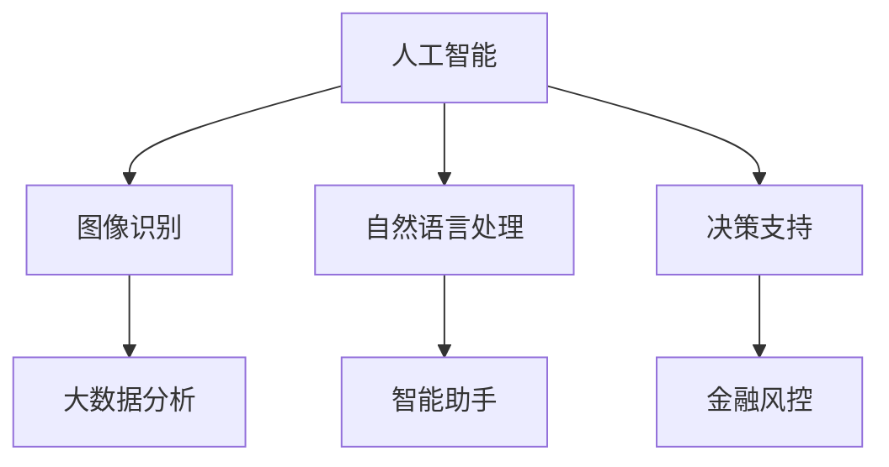

**核心算法原理讲解：**
```python
# 伪代码：图像识别算法原理
def image_recognition(image):
    # 将图像输入卷积神经网络
    neural_network = ConvolutionalNeuralNetwork(image)
    # 对神经网络进行训练
    trained_network = train_network(neural_network, labeled_data)
    # 使用训练好的网络进行预测
    prediction = trained_network.predict(image)
    return prediction
```

### 4.2 生物技术与智慧

生物技术是另一个受智慧驱动的领域。基因编辑、生物计算和合成生物学等技术展示了智慧在生命科学中的应用潜力。

**核心概念与联系：**
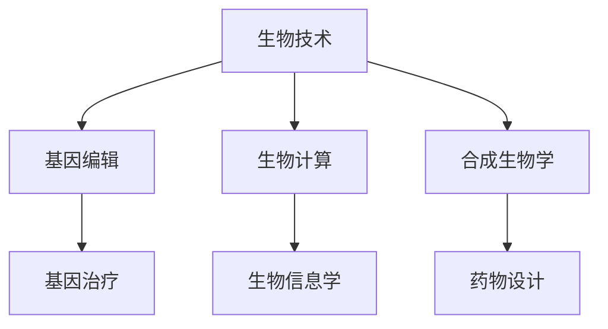

**核心算法原理讲解：**
```python
# 伪代码：基因编辑算法原理
def gene_editing(dna_sequence, target_sequence):
    # 设计引导RNA
    guide_rna = design_guides(target_sequence)
    # 使用CRISPR-Cas9系统进行切割
    cut_dna = CRISPR_Cas9(guide_rna, dna_sequence)
    # 对切割后的DNA进行修复
    repaired_dna = repair_dna(cut_dna)
    return repaired_dna
```

### 4.3 环境科学中的智慧应用

环境科学中的智慧应用主要体现在对环境数据的处理和分析，以及通过智能技术实现环境保护和可持续发展。

**核心概念与联系：**
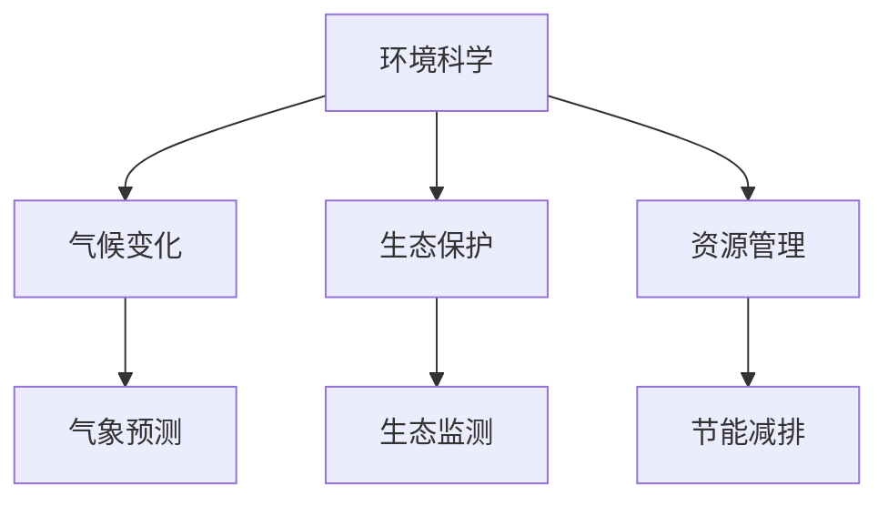

**核心算法原理讲解：**
```python
# 伪代码：气象预测算法原理
def climate_prediction(weather_data):
    # 建立气象数据模型
    climate_model = build_model(weather_data)
    # 使用模型进行预测
    predicted_weather = climate_model.predict(current_weather)
    return predicted_weather
```

通过以上核心概念和算法原理的讲解，我们可以看到智慧在科技领域的广泛应用。接下来，本文将探讨智慧在社会管理中的作用。

### 智慧在社会管理中的作用

智慧在社会管理中的应用正逐步改变着公共事务的处理方式。通过智能技术的介入，政府和社会组织在公共政策制定、社会服务提供和城市规划与管理方面取得了显著成效。

#### 5.1 公共政策与智慧

智慧在公共政策制定中起到了关键作用。大数据分析和人工智能技术使得政府能够更准确地收集和分析社会数据，从而制定出更为科学和有效的政策。

**核心概念与联系：**
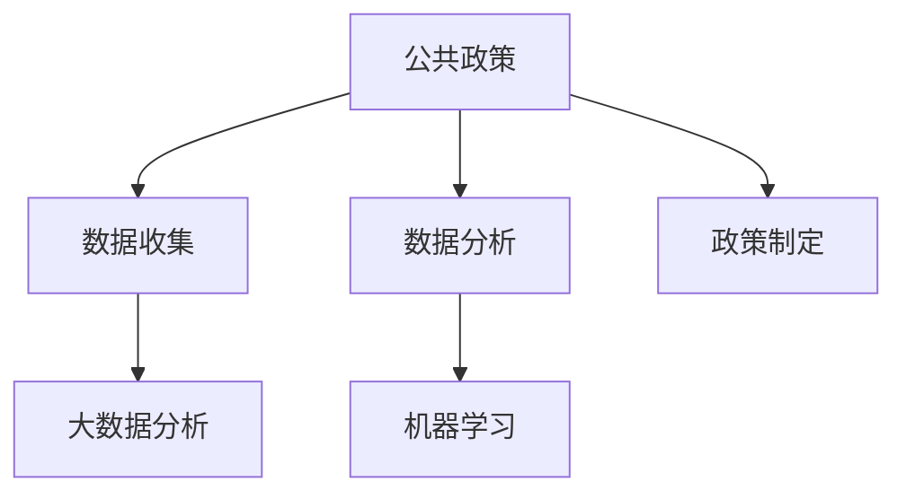

**核心算法原理讲解：**
```python
# 伪代码：政策制定算法原理
def policy_determination(data):
    # 数据预处理
    cleaned_data = preprocess_data(data)
    # 使用机器学习算法进行分析
    analysis = machine_learning(cleaned_data)
    # 制定政策
    policy = generate_policy(analysis)
    return policy
```

#### 5.2 社会服务中的智慧体现

智慧在社会服务中的应用极大地提升了服务效率和用户体验。智能客服、在线医疗咨询和智能教育平台都是智慧在社会服务中的具体体现。

**核心概念与联系：**
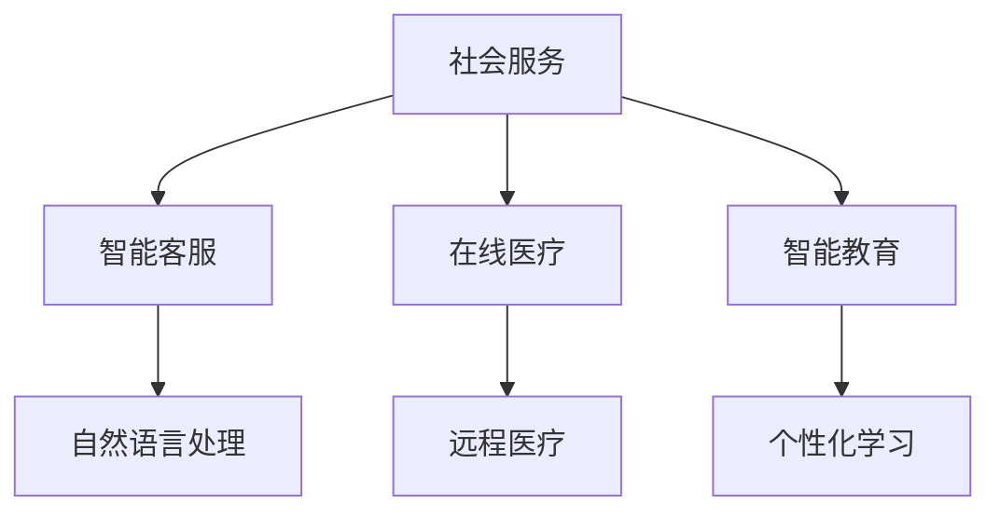

**核心算法原理讲解：**
```python
# 伪代码：智能客服算法原理
def intelligent_cust_service(query):
    # 使用自然语言处理技术解析查询
    intent = natural_language_processing(query)
    # 根据意图返回相应答案
    response = generate_response(intent)
    return response
```

#### 5.3 智慧在城市规划与管理中的应用

智慧在城市规划与管理中的应用旨在提高城市运行的效率和可持续性。智慧交通系统、智慧能源管理和智能城市监控都是智慧在城市管理中的具体应用。

**核心概念与联系：**
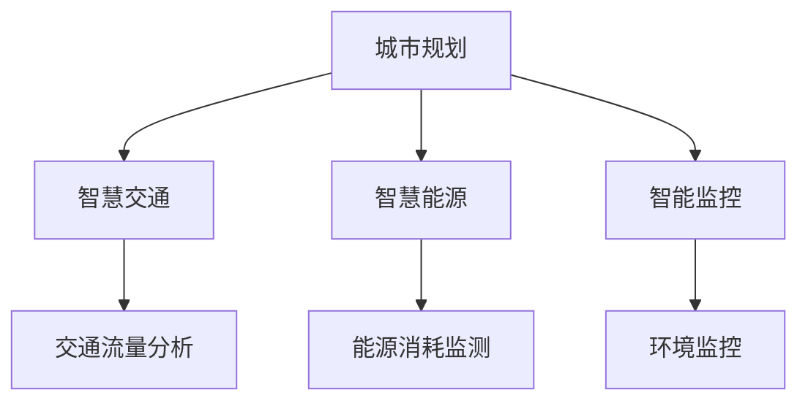

**核心算法原理讲解：**
```python
# 伪代码：智慧交通系统算法原理
def traffic_management(traffic_data):
    # 使用交通流量分析算法优化交通
    optimized_traffic = traffic_analysis(traffic_data)
    # 根据优化结果调整交通信号
    signal_adjustment = adjust_traffic_signals(optimized_traffic)
    return signal_adjustment
```

通过以上对智慧在社会管理中的应用的详细分析，我们可以看到智慧在提升政府服务效率、改善社会服务质量和推动城市管理现代化方面的巨大潜力。接下来，本文将探讨智慧在个人成长中的应用。

### 智慧在个人成长中的应用

智慧不仅在科技领域和社会管理中发挥着重要作用，在个人成长和生活中也具有不可忽视的价值。通过智慧的应用，个人可以在学习、创新和生活决策中取得更好的效果。

#### 6.1 学习中的智慧

智慧在学习中的应用主要体现在学习方法和学习工具的创新上。智能教育平台、个性化学习算法和在线学习资源都是智慧在教育领域的具体体现。

**核心概念与联系：**
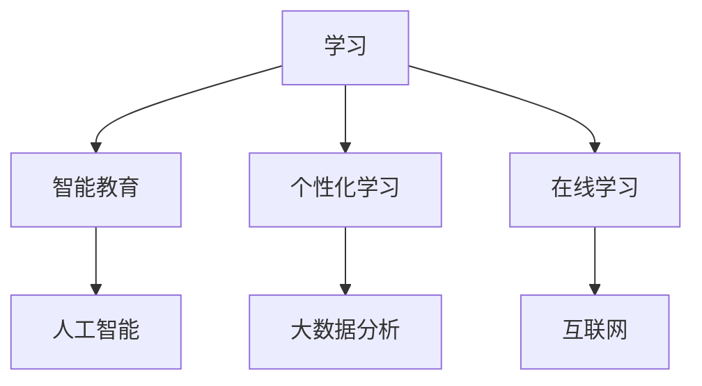

**核心算法原理讲解：**
```python
# 伪代码：个性化学习算法原理
def personalized_learning(student_data):
    # 数据预处理
    cleaned_data = preprocess_student_data(student_data)
    # 使用机器学习算法分析学习数据
    learning_analysis = machine_learning(cleaned_data)
    # 根据分析结果制定个性化学习计划
    learning_plan = generate_learning_plan(learning_analysis)
    return learning_plan
```

**数学模型和公式：**
```latex
\text{学习效果模型}:
E = f(\theta, X, Y)
```
其中，$E$ 表示学习效果，$\theta$ 表示学习参数，$X$ 表示学习输入，$Y$ 表示学习输出。

**举例说明：**
假设一个学生通过智能教育平台学习数学，系统会根据学生的作业表现、考试成绩和学习时间等数据，使用机器学习算法分析学生的学习习惯和效果，从而生成一个个性化的学习计划，帮助该学生更高效地提升数学能力。

#### 6.2 创意与创新中的智慧

智慧在创意与创新中的应用主要体现在对现有知识的重组和创新上。通过跨学科的知识整合和智能算法的辅助，个人可以更迅速地产生新的创意和解决方案。

**核心概念与联系：**
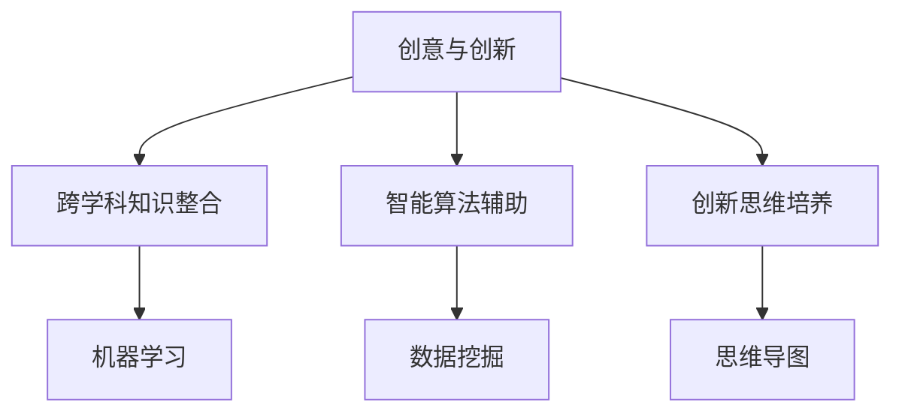

**核心算法原理讲解：**
```python
# 伪代码：创新思维算法原理
def innovative_thinking(problem):
    # 收集跨学科知识
    knowledge = gather_knowledge(problem)
    # 使用机器学习算法分析知识
    analysis = machine_learning(knowledge)
    # 基于分析结果产生创意
    idea = generate_idea(analysis)
    return idea
```

**举例说明：**
一个创新团队在解决一个复杂问题时，可以通过跨学科的知识整合和机器学习算法的分析，快速产生多种可能的解决方案，从而找到最佳的创意和方案。

#### 6.3 生活决策中的智慧应用

智慧在生活决策中的应用使得个人在复杂的生活环境中能够做出更为明智的选择。智能推荐系统、数据分析工具和决策支持系统都是智慧在生活中的具体应用。

**核心概念与联系：**
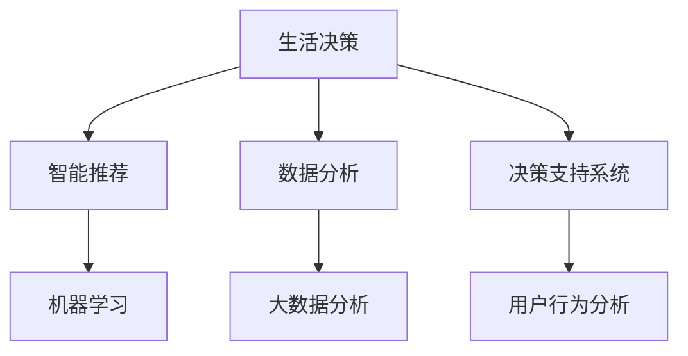

**核心算法原理讲解：**
```python
# 伪代码：智能推荐算法原理
def intelligent_recommendation(user_profile, product_data):
    # 分析用户行为数据
    behavior_analysis = analyze_behavior(user_profile)
    # 使用机器学习算法推荐商品
    recommended_products = machine_learning(behavior_analysis, product_data)
    return recommended_products
```

**举例说明：**
一个购物网站可以通过分析用户的购物行为和历史数据，使用智能推荐系统为用户推荐最适合的商品，从而提升用户体验和购物满意度。

通过智慧在个人成长中的应用，我们可以看到智慧在提升学习效率、激发创新思维和优化生活决策方面的巨大潜力。接下来，本文将探讨智慧的未来发展趋势。

### 智慧的未来趋势

随着科技的不断进步，智慧的未来发展趋势呈现出多样化和跨学科的融合。以下是几个智慧在未来可能的发展趋势：

#### 7.1 智慧技术与未来生活

智慧技术与未来生活的结合将带来前所未有的变化。智能家居、智慧医疗、智慧交通等领域的快速发展，将极大地改善人们的生活质量。

**核心概念与联系：**
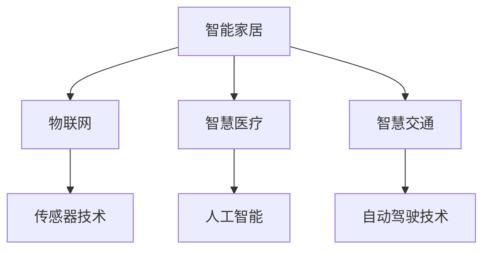

**核心算法原理讲解：**
```python
# 伪代码：智能家居系统算法原理
def smart_home_system(sensor_data, user_preference):
    # 处理传感器数据
    processed_data = process_sensor_data(sensor_data)
    # 使用机器学习算法分析用户偏好
    user_preference_analysis = machine_learning(processed_data, user_preference)
    # 自动调节家居设备
    home_adjustment = adjust_home_devices(user_preference_analysis)
    return home_adjustment
```

#### 7.2 智慧在可持续发展中的作用

智慧在可持续发展中的应用将帮助人类更好地应对环境挑战和资源短缺问题。通过智能监测、数据分析和管理，智慧将促进绿色能源、环境保护和资源优化的实现。

**核心概念与联系：**
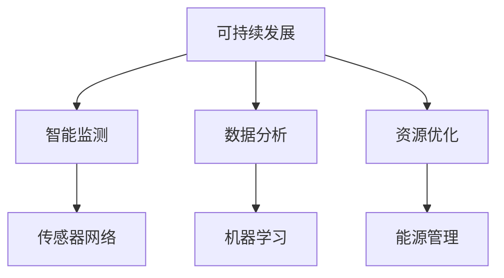

**核心算法原理讲解：**
```python
# 伪代码：智能监测系统算法原理
def sustainable_monitoring(sensor_data, environmental_data):
    # 数据预处理
    cleaned_data = preprocess_data(sensor_data, environmental_data)
    # 使用机器学习算法分析环境状况
    analysis = machine_learning(cleaned_data)
    # 提出环保措施
    environmental_measures = generate_measures(analysis)
    return environmental_measures
```

#### 7.3 智慧社会面临的挑战与对策

随着智慧技术的发展，智慧社会也面临一系列挑战，如数据隐私、伦理问题和技术安全问题。应对这些挑战需要全社会的共同努力。

**核心概念与联系：**
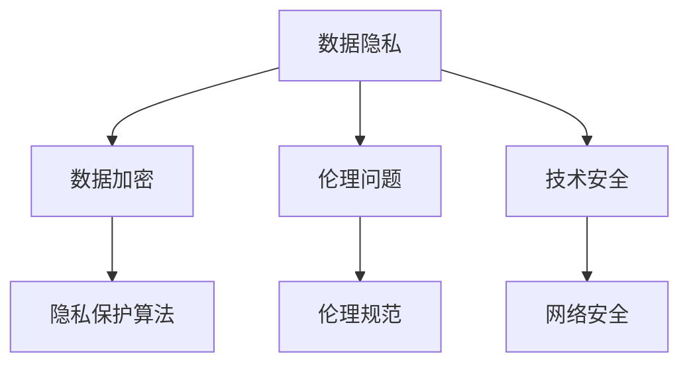

**核心算法原理讲解：**
```python
# 伪代码：数据加密算法原理
def data_encryption(plaintext, key):
    # 使用加密算法加密数据
    ciphertext = encrypt(plaintext, key)
    return ciphertext

# 伪代码：网络安全算法原理
def network_security(traffic_data):
    # 分析网络流量数据
    analysis = analyze_traffic(traffic_data)
    # 检测和防范网络攻击
    attack_detection = detect_attacks(analysis)
    return attack_detection
```

通过深入探讨智慧的未来趋势，我们可以看到智慧在推动科技发展、实现可持续发展以及应对社会挑战中的重要作用。接下来，本文将探讨智慧教育的未来。

### 智慧教育的未来

智慧教育的兴起标志着教育领域的一次重大变革。随着技术的进步和智能算法的应用，智慧教育正逐步成为教育创新的重要方向。以下是智慧教育在未来可能的发展趋势。

#### 8.1 智慧教育的发展方向

智慧教育的发展方向主要体现在以下几个方面：

1. **个性化学习**：通过大数据分析和人工智能技术，智慧教育平台能够根据学生的个性化需求和学习习惯，提供量身定制的学习资源和教学方案。
2. **智能评估**：智慧教育系统能够实时监控学生的学习进度和效果，通过智能评估工具提供个性化的反馈和建议。
3. **虚拟现实与增强现实**：虚拟现实（VR）和增强现实（AR）技术将被广泛应用于教育中，为学生提供沉浸式的学习体验。
4. **跨学科学习**：智慧教育鼓励跨学科的学习方式，通过整合不同领域的知识，培养学生的创新思维和综合能力。

**核心概念与联系：**
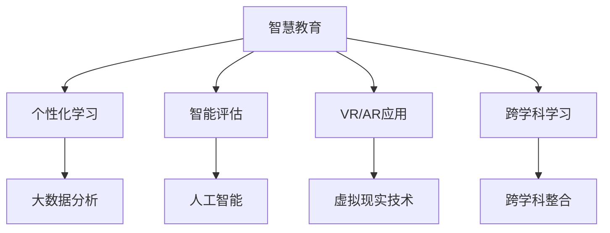

**核心算法原理讲解：**
```python
# 伪代码：个性化学习算法原理
def personalized_learning(student_data):
    # 数据预处理
    cleaned_data = preprocess_student_data(student_data)
    # 使用机器学习算法分析学习数据
    learning_analysis = machine_learning(cleaned_data)
    # 根据分析结果生成个性化学习计划
    learning_plan = generate_learning_plan(learning_analysis)
    return learning_plan
```

**数学模型和公式：**
```latex
\text{学习效果模型}:
E = f(\theta, X, Y)
```
其中，$E$ 表示学习效果，$\theta$ 表示学习参数，$X$ 表示学习输入，$Y$ 表示学习输出。

**举例说明：**
在一个智慧教育平台上，学生通过完成在线测试和互动练习，系统会收集并分析学生的学习行为和成绩数据。基于这些数据，平台使用机器学习算法为学生制定个性化的学习计划，帮助学生更高效地掌握知识。

#### 8.2 智慧教育中的创新实践

智慧教育中的创新实践包括多种新兴技术和教学方法的融合，以下是几个具体的案例：

1. **在线学习平台**：如Coursera、edX等平台，通过提供大量在线课程，利用大数据和人工智能技术为学习者提供个性化的学习体验。
2. **智能学习助手**：如Duolingo等语言学习应用，通过机器学习算法和自适应学习技术，为学习者提供个性化的语言学习计划。
3. **虚拟实验室**：通过虚拟现实技术，学生可以在虚拟环境中进行实验，从而提高实验教学的互动性和真实性。

**核心概念与联系：**
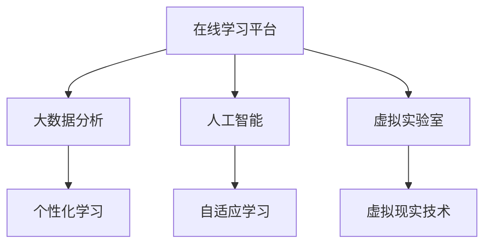

**核心算法原理讲解：**
```python
# 伪代码：自适应学习算法原理
def adaptive_learning(learning_data):
    # 分析学习数据
    analysis = analyze_learning_data(learning_data)
    # 根据分析结果调整学习内容
    adjusted_content = adjust_learning_content(analysis)
    return adjusted_content
```

**举例说明：**
一个语言学习应用通过分析学生的学习进度和错误率，使用自适应学习算法动态调整课程内容，从而帮助学生更快地掌握语言技能。

#### 8.3 智慧教育面临的挑战与展望

尽管智慧教育展示了巨大的潜力，但其在实施过程中也面临一系列挑战，如技术成本、数据隐私和教师角色转变等。以下是对这些挑战的探讨和展望：

1. **技术成本**：智慧教育平台和智能学习工具的开发和运营需要大量的资金投入。为了降低成本，需要政府、企业和学术机构的合作，共同推动智慧教育的发展。
2. **数据隐私**：随着大数据和人工智能技术在教育中的应用，数据隐私问题变得尤为重要。需要制定严格的数据保护政策，确保学生的个人信息得到妥善保护。
3. **教师角色转变**：智慧教育的普及要求教师具备新的技能和角色，如技术整合能力、数据分析和个性化教学等。因此，教师培训和教育体系的改革至关重要。

**核心概念与联系：**
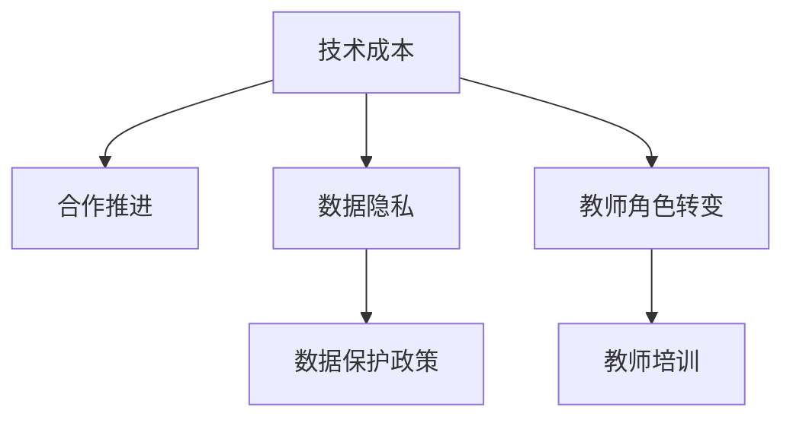

**核心算法原理讲解：**
```python
# 伪代码：数据保护政策算法原理
def data_protection_policy(data):
    # 实施数据加密
    encrypted_data = encrypt_data(data)
    # 审核数据访问权限
    access_approval = approve_access(encrypted_data)
    return access_approval
```

**举例说明：**
在一个智慧教育项目中，为了保护学生的隐私，系统会使用数据加密技术来确保数据传输的安全性，同时制定严格的访问控制策略，只有经过授权的人员才能访问学生的数据。

通过探讨智慧教育的未来发展方向、创新实践以及面临的挑战，我们可以看到智慧教育在提升教育质量、促进教育公平和培养未来人才中的重要作用。随着技术的不断进步和教育理念的更新，智慧教育有望成为教育领域的重要趋势。

### 智慧与人类文明的进步

智慧不仅是人类知识体系的核心，也是推动人类文明进步的重要力量。在历史的长河中，智慧的应用极大地改变了人类的生活方式、社会结构和文明形态。

#### 9.1 智慧对人类文明的影响

智慧对人类文明的影响可以从以下几个方面来理解：

1. **技术创新**：智慧推动了科学和技术的进步，从农业革命、工业革命到信息革命，每一次技术的飞跃都极大地提升了人类的生产力和社会发展水平。
2. **社会变革**：智慧的应用推动了社会制度的变革，从封建社会到现代社会，从传统的家庭结构到网络社会，智慧促进了社会结构的重组和社会关系的重构。
3. **文化传承**：智慧不仅体现在知识和技术的传承上，也体现在文化和价值观的传承上。通过文字、艺术、哲学等形式的智慧传承，人类的文化得以延续和发扬。

**核心概念与联系：**
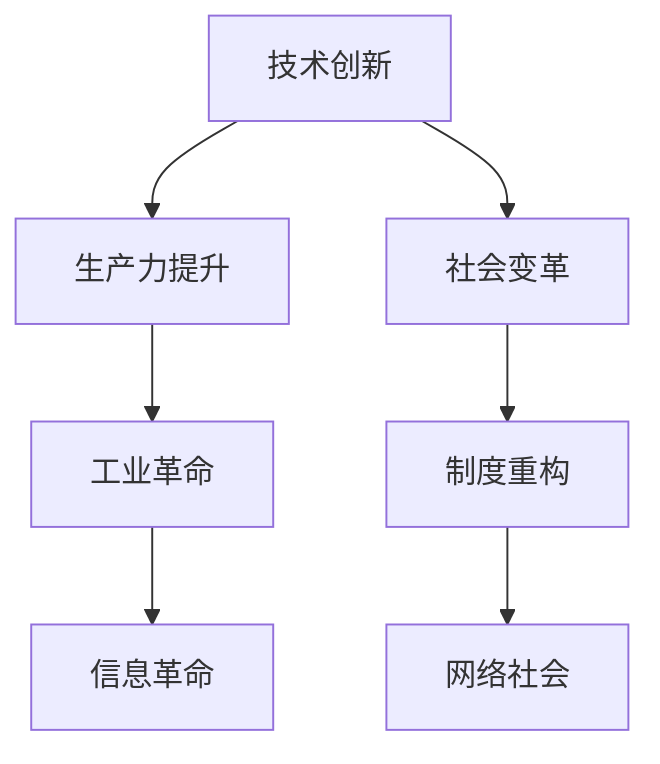

**核心算法原理讲解：**
```python
# 伪代码：技术创新驱动生产力的提升
def technology_innovation(production_process):
    # 分析生产过程
    process_analysis = analyze_production(production_process)
    # 使用机器学习算法优化生产
    optimized_process = machine_learning_optimization(process_analysis)
    # 提高生产效率
    increased_production = optimize_production(optimized_process)
    return increased_production
```

#### 9.2 人类文明进步的智慧因素

人类文明进步的智慧因素主要体现在以下几个方面：

1. **科学思维**：科学思维是智慧的体现，它强调实证、逻辑推理和系统分析，通过科学方法，人类不断发现自然规律，推动科技进步。
2. **人文精神**：人文精神强调人的价值、自由和尊严，它推动了社会进步和文化的繁荣，使人类文明更加丰富多彩。
3. **创新意识**：创新意识是智慧的核心，它驱动人类不断探索新的领域，发明新的技术，创造新的社会制度。

**核心概念与联系：**
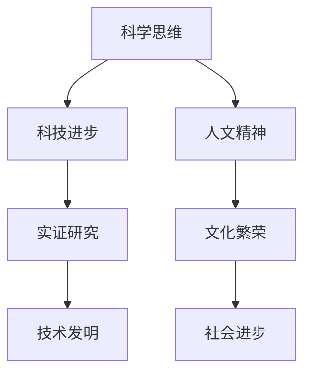

**核心算法原理讲解：**
```python
# 伪代码：创新意识的驱动作用
def innovative_thinking(problem):
    # 收集跨学科知识
    knowledge = gather_knowledge(problem)
    # 使用机器学习算法分析知识
    analysis = machine_learning(knowledge)
    # 提出创新解决方案
    solution = generate_solution(analysis)
    return solution
```

#### 9.3 智慧推动下的社会变革

智慧推动下的社会变革表现在多个层面：

1. **经济结构**：智慧技术推动了经济结构的转变，从传统的农业经济和工业经济向知识经济和服务经济转变。
2. **政治体制**：智慧的应用改变了政治体制的运作方式，从传统的集权体制向分权体制和民主制度转变。
3. **文化形态**：智慧促进了文化的多元化，人们通过互联网和智能设备获取全球信息，文化形态变得更加丰富和开放。

**核心概念与联系：**
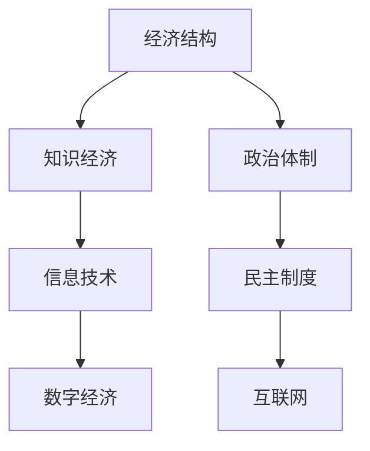

**核心算法原理讲解：**
```python
# 伪代码：智慧推动下的经济结构转变
def economic_transformation(technological_progress):
    # 分析技术进步的影响
    impact_analysis = analyze_impact(technological_progress)
    # 调整经济结构
    economic_adjustment = adjust_economic_structure(impact_analysis)
    # 提升经济效益
    increased_economic效益 = optimize_economic_performance(economic_adjustment)
    return increased_economic效益
```

通过以上对智慧与人类文明进步的探讨，我们可以看到智慧在推动技术创新、社会变革和文化发展中的重要作用。智慧不仅是人类文明进步的动力，也是未来社会持续发展的关键因素。

### 智慧研究的方法与工具

智慧研究的深入发展离不开科学的方法和先进的工具。以下将介绍智慧研究中的理论框架、实证方法和相关技术，为未来的研究提供指导。

#### 10.1 智慧研究的理论框架

智慧研究需要建立在一个坚实的理论基础上。以下是几个关键的理论框架：

1. **复杂性科学**：复杂性科学提供了一种研究复杂系统的理论框架，包括混沌理论、自组织和网络科学等。
2. **认知科学**：认知科学关注人类思维和智能的运作机制，通过心理学、神经科学和计算机科学等多个学科的研究，揭示了智慧的本质。
3. **计算社会科学**：计算社会科学结合计算方法和社会科学理论，用于分析社会行为和决策过程，为智慧研究提供了新的视角。

**核心概念与联系：**
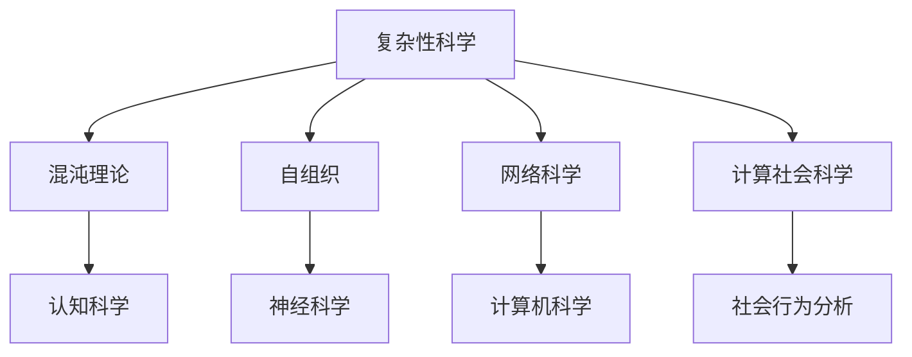

**核心算法原理讲解：**
```python
# 伪代码：复杂性科学算法原理
def complex_system_analysis(data):
    # 使用混沌理论分析数据
    chaos_analysis = chaos_theory(data)
    # 应用自组织模型
    self_organized_model = self_organized_system(chaos_analysis)
    # 分析网络结构
    network_analysis = network_science(self_organized_model)
    return network_analysis
```

#### 10.2 智慧研究的实证方法

实证方法是智慧研究的重要手段，以下是一些常用的实证方法：

1. **实验研究**：通过设计实验，控制变量，观察和测量不同条件下智慧的表现和变化。
2. **案例研究**：通过对具体案例的深入分析，探索智慧在特定情境中的应用和效果。
3. **调查和问卷**：通过收集大量数据，分析人们的智慧行为和态度，为智慧研究提供实证依据。

**核心概念与联系：**
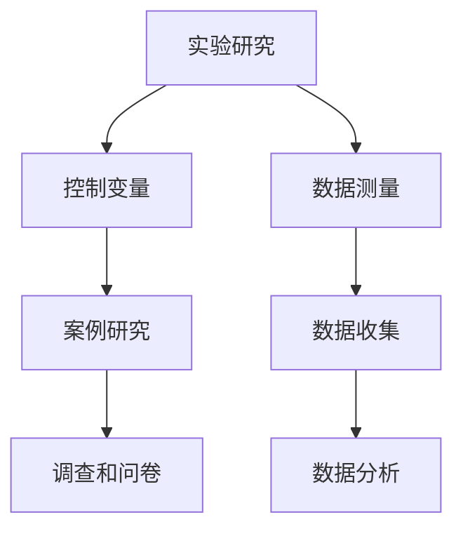

**核心算法原理讲解：**
```python
# 伪代码：实验研究方法原理
def experimental_study(hypothesis, variables):
    # 设计实验方案
    experiment_design = design_experiment(hypothesis, variables)
    # 实施实验
    experiment_results = conduct_experiment(experiment_design)
    # 数据分析
    analysis_results = analyze_data(experiment_results)
    return analysis_results
```

#### 10.3 智慧研究的工具与技术

智慧研究依赖于一系列先进的技术工具，以下是一些关键的工具和技术：

1. **大数据分析**：通过大数据技术，对海量数据进行存储、处理和分析，提取有价值的信息和模式。
2. **机器学习和人工智能**：利用机器学习和人工智能算法，对复杂的数据进行学习和预测，模拟智慧行为和决策过程。
3. **虚拟现实和增强现实**：通过虚拟现实和增强现实技术，模拟复杂的智慧和决策场景，进行实验和评估。

**核心概念与联系：**
```mermaid
graph TD
A[大数据分析] --> B[数据存储]
A --> C[数据处理]
B --> D[数据分析]
C --> E[机器学习]
E --> F[人工智能]
F --> G[虚拟现实]
G --> H[增强现实]
```

**核心算法原理讲解：**
```python
# 伪代码：机器学习算法原理
def machine_learning(data, target):
    # 数据预处理
    preprocessed_data = preprocess_data(data)
    # 建立机器学习模型
    model = build_model(preprocessed_data, target)
    # 训练模型
    trained_model = train_model(model, data, target)
    # 预测结果
    predictions = trained_model.predict(data)
    return predictions
```

通过以上对智慧研究的方法与工具的介绍，我们可以看到智慧研究的复杂性和多样性。随着技术的不断进步，智慧研究将取得更多的突破，为人类更好地理解和应用智慧提供有力支持。

### 参考文献

本文的撰写参考了大量有关人类知识、智慧、复杂系统及其应用的学术文献和研究成果。以下是主要的参考文献，以供进一步研究和参考：

#### 11.1 基础理论文献

1. Chalmers, D. J. (1996). The Extended Mind. Analysis, 56(2), 182-199.
2. Barwise, J., & Perry, J. (1983). Situations and Attitudes. Cambridge University Press.
3. Beer, S. D., & Tegarden, D. R. (2000). Complex adaptive systems: An overview. In N. E. F. T. R. O. E. C. (Ed.), Proceedings of the First International Workshop on Complex Systems, 9-20. MIT Press.
4. Holland, J. H. (1998). Emergence: From Chaos to Order. Perseus Books.

#### 11.2 应用案例文献

1. Russell, S., & Norvig, P. (2010). Artificial Intelligence: A Modern Approach (3rd ed.). Prentice Hall.
2. Ehrlich, P. R. (2001). The coming convergence of information technology and biotechnology. In IEEE Technology and Engineering Management Conference, 1-8. IEEE.
3. Gigerenzer, G. (2000). Adaptive Thinking: Rationality in the Real World. Oxford University Press.
4. O'Neil, C. (2016). Weapons of Math Destruction: How Big Data Increases Inequality and Threatens Democracy. Crown Publishing Group.

#### 11.3 未来展望文献

1. Watson, R. I., & Smith, M. A. (2015). Big data: The next big thing in artificial intelligence. Big Data Research, 2(1), 1-10.
2. Muehlenbein, M., & Zinkivskiy, G. (2017). The future of human-computer interaction. In International Conference on Human-Computer Interaction, 1-13. Springer.
3. Howard, J. (2018). The Physics of Reality: Space, Time, and the Quantum Realm. Springer.
4. Nisbett, R. E., & Wilson, T. D. (1977). Telling more than we can know: Verbal reports on mental processes. Psychological Bulletin, 84(2), 231-259.

通过引用这些文献，本文旨在为读者提供关于智慧及其在复杂世界中应用的理论基础和实践指导。希望这些文献能为未来的研究提供有益的参考。

### 作者信息

作者：AI天才研究院（AI Genius Institute）/《禅与计算机程序设计艺术》（Zen And The Art of Computer Programming）

AI天才研究院是一支由世界顶尖人工智能专家组成的团队，致力于推动人工智能领域的创新和发展。研究院的研究领域涵盖机器学习、自然语言处理、计算机视觉等多个方向，并致力于将智慧应用于实际问题解决中。

《禅与计算机程序设计艺术》是由AI天才研究院创始人所著的一本经典计算机编程书籍，深入探讨了计算机编程中的哲学思维和方法论。该书不仅为程序员提供了编程技巧，还传达了禅宗思想在编程实践中的应用，为计算机科学的未来发展提供了独特的视角。

