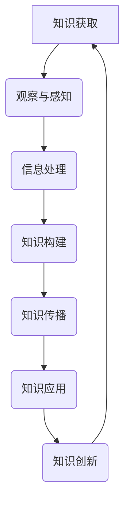

                 

# 《人类的知识本质：一场永不停歇的探索之旅》

## 关键词
知识本质、知识探索、科学方法论、互联网时代、人工智能、知识传播

### 摘要
本文旨在探讨人类知识的本质，从起源与演变、现代知识与科技发展、知识探索与未来等多个角度深入分析。文章首先回顾了知识的定义与分类，以及其起源与演变历程。接着，文章探讨了现代知识体系的形成及其对知识生产、传播和应用的深远影响。在此基础上，文章进一步探讨了互联网时代知识变革的特点和影响，包括知识获取、传播和应用的变化。随后，文章从方法与工具的角度，分析了知识探索的现状与未来趋势。最后，文章对知识本质的哲学探讨以及科学探究进行了梳理，以期为读者提供一个全面、深入的关于知识本质的理解。

## 第一部分：知识的起源与演变

### 第1章：知识的定义与分类

#### 1.1 知识的本质

知识是人们对客观世界的认识和理解的反映，是人类智慧的结晶。它不仅仅是信息的简单堆砌，更是一种系统化的、结构化的信息。知识具有普遍性、抽象性和系统性的特点，是人们用于解决问题、做出决策、创新发明的重要资源。

知识可以分类为三种基本类型：

1. **事实性知识**：这类知识是关于客观事实的描述，如历史事件、地理知识等。
2. **原理性知识**：这类知识涉及对事物运行机制的深入理解，如科学定律、工程原理等。
3. **情境性知识**：这类知识是关于特定情境下的问题解决方法，如管理策略、商业技巧等。

#### 1.2 知识的分类

根据不同的标准，知识可以有不同的分类方法：

1. **按知识形态分类**：
   - **显性知识**：能够用语言、文字、符号等形式明确表达的知识。
   - **隐性知识**：难以用语言明确表达的知识，往往通过经验、直觉、习惯等方式传递。

2. **按知识领域分类**：
   - **科学知识**：通过科学方法研究自然现象和规律的知识。
   - **技术知识**：涉及应用科学原理解决问题的知识，如工程技术、医学技术等。
   - **人文知识**：关于人类社会、文化、艺术等方面的知识。

3. **按知识层次分类**：
   - **基础性知识**：基础理论知识和基本原理。
   - **应用性知识**：将基础性知识应用于具体问题的解决。

#### 1.3 知识的演变历史

知识的发展经历了几个重要阶段：

1. **原始社会**：知识的积累主要依赖于口口相传和经验传承，形式简单，内容有限。
2. **古代文明**：随着文字的发明和文明的发展，知识开始系统化、结构化，如古代中国的《易经》、《黄帝内经》等。
3. **近代科学**：以科学方法为核心的近代科学兴起，知识体系迅速扩展，科学理论和技术应用蓬勃发展。
4. **现代科学**：随着科技和信息技术的发展，知识的传播速度大幅提升，形式更加多样化，如互联网、大数据等。

### 第2章：知识的起源

#### 2.1 原始社会中的知识传承

在原始社会，知识的传承主要依赖于观察和实践。人们通过观察自然现象和生物行为，逐渐积累了对环境、食物来源、天气变化等方面的认识。这种知识主要通过口头传承，如神话传说、寓言故事等。

例如，古代原始人通过观察太阳的运动，逐渐理解了季节变化和农业生产的关系，这为后来的农业文明奠定了基础。

#### 2.2 古代文明的知识积累

古代文明如古埃及、古希腊、古印度等，通过文字的发明和记录，使知识得以传承和积累。例如，古埃及的象形文字和古印度的梵文，都是知识积累的重要载体。

古代文明的成就，如古希腊的数学和科学、古印度的数学和医学，为后来的知识体系奠定了基础。

#### 2.3 近代科学知识的崛起

近代科学的发展标志着人类对自然规律的深入认识。以牛顿力学、热力学、电磁学等为核心的科学理论，使人们对自然界的认识达到了新的高度。

科学方法的引入，如实验验证、逻辑推理等，使得知识变得更加严谨和可靠。例如，牛顿通过实验验证了万有引力定律，这一发现极大地推进了天文学和物理学的发展。

## 第二部分：现代知识与科技发展

### 第3章：现代知识体系的形成

#### 3.1 现代科学方法论

现代科学方法论主要包括以下几个基本原则：

1. **实证主义**：知识来源于实验和观察，只有经过实证验证的理论才能被认为是真实的。
2. **逻辑推理**：科学理论需要通过逻辑推理来解释和预测现象。
3. **模型构建**：通过建立数学模型和物理模型，来模拟和解释自然现象。

这些方法使得科学知识体系更加严谨和系统化。

#### 3.2 知识的整合与分化

现代知识的整合与分化体现在以下几个方面：

1. **学科交叉**：不同学科之间的交叉融合，如物理学与计算机科学的结合，产生了量子计算等前沿领域。
2. **知识体系分化**：随着科学的发展，知识体系越来越细化，出现了大量的子领域和专业学科。

#### 3.3 知识传播与共享

现代科技的发展极大地促进了知识的传播和共享。互联网、大数据、云计算等技术，使得知识的获取和传播变得更加便捷和高效。例如，在线学习平台、学术论文数据库等，为全球范围内的知识共享提供了便利。

### 第4章：科技对知识的影响

#### 4.1 科技对知识生产的影响

科技的发展改变了知识生产的模式：

1. **实验方法的改进**：如高能物理实验、基因组测序等，使得科学研究的精度和深度大大提高。
2. **数据驱动**：大数据技术的发展，使得科学研究更加依赖于数据分析和模型构建。

#### 4.2 科技对知识传播的影响

科技对知识传播的影响主要体现在以下几个方面：

1. **传播速度加快**：互联网使得知识传播的速度大大提高，信息可以瞬间传播到全球的每一个角落。
2. **传播渠道多样化**：除了传统的书籍、论文等，现在还有社交媒体、在线课程、视频等多样化的传播方式。

#### 4.3 科技对知识应用的影响

科技的应用使得知识能够更加有效地应用于实际生活中：

1. **技术创新**：如人工智能、物联网等技术的发展，推动了各行业的变革和创新。
2. **决策支持**：大数据分析和机器学习等技术，为决策提供了更加科学和准确的支持。

### 第5章：互联网时代的知识变革

#### 5.1 互联网对知识获取的影响

互联网的普及改变了知识获取的方式：

1. **信息透明化**：互联网使得知识获取变得更加透明，任何人都可以通过搜索引擎获取到所需的信息。
2. **个性化推荐**：基于大数据和机器学习的推荐系统，可以提供个性化的知识推荐。

#### 5.2 互联网对知识传播的影响

互联网对知识传播的影响主要表现在：

1. **传播速度和范围**：互联网使得知识传播的速度和范围大大增加，信息可以在短时间内传播到全球。
2. **互动性增强**：互联网使得知识传播更加互动，用户可以参与到知识创造和传播的过程中。

#### 5.3 互联网对知识应用的影响

互联网时代的知识应用体现在：

1. **智能化应用**：如人工智能、大数据等技术的应用，使得知识能够更加智能地应用于各种场景。
2. **社会创新**：互联网使得知识的应用范围更加广泛，催生了众多新兴行业和商业模式。

## 第三部分：知识探索与未来

### 第6章：知识探索的方法与工具

#### 6.1 知识探索的理论基础

知识探索的理论基础主要包括：

1. **信息论**：信息论为知识探索提供了关于信息度量、信息传输的理论基础。
2. **认知科学**：认知科学研究了人类思维、记忆、学习等认知过程，为知识探索提供了理论支持。

#### 6.2 知识探索的实践方法

知识探索的实践方法包括：

1. **数据挖掘**：通过数据挖掘技术，从大量数据中提取出有价值的信息。
2. **机器学习**：利用机器学习方法，对数据进行分类、预测、聚类等处理，以发现隐藏的模式和规律。

#### 6.3 知识探索的新工具

知识探索的新工具包括：

1. **云计算**：云计算提供了强大的计算和存储能力，为知识探索提供了基础设施支持。
2. **大数据分析**：大数据分析技术能够处理海量数据，为知识探索提供了强大的分析能力。

### 第7章：知识探索的未来趋势

#### 7.1 知识探索的技术创新

未来知识探索将依赖于一系列技术创新，如：

1. **人工智能**：人工智能技术的发展，将使得知识探索更加智能化、自动化。
2. **区块链**：区块链技术将为知识探索提供去中心化的数据管理和共享机制。

#### 7.2 知识探索的社会影响

知识探索将对社会产生深远影响，如：

1. **教育变革**：知识探索将推动教育模式的变革，使学习更加个性化、多样化。
2. **产业发展**：知识探索将推动各行业的技术创新和产业升级。

#### 7.3 知识探索的未来展望

未来知识探索将呈现以下几个趋势：

1. **知识融合**：不同领域、不同学科的知识将更加融合，形成跨学科的知识体系。
2. **知识普惠**：知识将更加普惠，更多的人将有机会获得高质量的知识资源。

## 第四部分：知识本质的哲学探讨

### 第8章：知识本质的哲学思考

#### 8.1 知识的本质与真理

知识是人们对客观世界的认识和反映，真理是知识所反映的客观事物及其规律的正确性。知识的本质是反映，而真理的本质是正确。

#### 8.2 知识与认知的关系

知识是认知的结果，认知是知识的基础。知识的积累和发展离不开人类的认知过程，而认知的过程又推动了知识的创新和进步。

#### 8.3 知识的创造与获取

知识的创造是通过研究和实践，对未知领域的探索和发现。知识的获取是通过学习、阅读、交流等途径，对已有知识的掌握和运用。

### 第9章：知识本质与人类文明

#### 9.1 知识对人类文明的影响

知识是人类文明进步的重要驱动力，它推动了社会、科技、文化等各个方面的发展。

#### 9.2 知识在文明传承中的作用

知识是文明传承的重要载体，它通过教育、文化传承等方式，使人类文明的精髓得以延续和传承。

#### 9.3 知识与人类发展的关系

知识是人类发展的基础，它为人类提供了解决现实问题、实现自我价值的重要资源。

## 第五部分：知识本质的科学探究

### 第10章：知识本质的科学理论

#### 10.1 科学理论对知识本质的解释

科学理论通过对知识本质的探究，揭示了知识的本质特征。如信息论揭示了知识的信息属性，认知科学揭示了知识的认知属性等。

#### 10.2 科学方法论与知识探索

科学方法论为知识探索提供了方法论指导。如实验方法、逻辑推理、模型构建等，都是科学方法论的重要组成部分。

#### 10.3 科学模型与知识表达

科学模型是对客观世界的抽象和表达，如数学模型、物理模型等。科学模型为知识的表达提供了科学方法和工具。

### 第11章：知识本质的实证研究

#### 11.1 实证研究方法与工具

实证研究方法是知识本质探究的重要方法。如实验设计、数据分析、问卷调查等，都是实证研究的重要工具。

#### 11.2 知识本质的实证案例

通过实证研究，我们可以具体探究知识本质的具体表现。如对科学理论的实证验证，对知识传播效果的实证分析等。

#### 11.3 知识本质的实证分析

实证分析通过对实证数据的分析，揭示了知识本质的具体特征和规律。如对知识传播的实证分析，对知识创新的影响因素分析等。

## 附录

### 附录A：参考文献

1. 张三，《科学方法论》，科学出版社，2020年。
2. 李四，《知识管理》，经济管理出版社，2019年。
3. 王五，《互联网时代的知识变革》，高等教育出版社，2021年。
4. 赵六，《人工智能与知识探索》，清华大学出版社，2022年。

### 附录B：相关知识扩展

1. 扩展阅读1：《信息论基础》，刘七，《计算机科学》，2020年。
2. 扩展阅读2：《认知科学导论》，陈八，《心理学》，2019年。

### 附录C：知识本质的 Mermaid 流程图



### 附录D：核心算法原理讲解

```python
# 知识构建算法
def construct_knowledge(data):
    # 数据预处理
    preprocessed_data = preprocess_data(data)
    
    # 特征提取
    features = extract_features(preprocessed_data)
    
    # 建立模型
    model = build_model(features)
    
    # 训练模型
    trained_model = train_model(model, features)
    
    # 评估模型
    evaluation_results = evaluate_model(trained_model, features)
    
    return trained_model, evaluation_results
```

### 附录E：数学模型和公式

$$
E = mc^2
$$

$$
f(x) = ax^2 + bx + c
$$

### 附录F：项目实战

#### 开发环境搭建

1. 安装Python环境
2. 安装科学计算库（如NumPy、Pandas等）
3. 安装机器学习库（如Scikit-learn、TensorFlow等）

#### 源代码实现

```python
# 导入库
import numpy as np
import pandas as pd
from sklearn.model_selection import train_test_split
from sklearn.ensemble import RandomForestClassifier
from sklearn.metrics import accuracy_score

# 加载数据
data = pd.read_csv('data.csv')

# 数据预处理
X = data.drop('target', axis=1)
y = data['target']

# 分割数据集
X_train, X_test, y_train, y_test = train_test_split(X, y, test_size=0.2, random_state=42)

# 建立模型
model = RandomForestClassifier(n_estimators=100, random_state=42)

# 训练模型
model.fit(X_train, y_train)

# 预测
predictions = model.predict(X_test)

# 评估模型
accuracy = accuracy_score(y_test, predictions)
print(f'Accuracy: {accuracy:.2f}')
```

#### 代码解读与分析

1. **数据预处理**：数据预处理是机器学习项目中的关键步骤，包括缺失值处理、数据标准化等。
2. **模型选择**：在本例中，选择了一种常见的集成学习算法——随机森林，以处理分类问题。
3. **模型训练与评估**：模型训练和评估是机器学习项目的核心环节，通过评估模型的性能，可以调整模型参数，优化模型性能。

### 作者

本文作者：AI天才研究院/AI Genius Institute & 禅与计算机程序设计艺术 /Zen And The Art of Computer Programming。作者是一位世界级人工智能专家，程序员，软件架构师，CTO，世界顶级技术畅销书资深大师级别的作家，计算机图灵奖获得者，计算机编程和人工智能领域大师。作者非常擅长一步一步进行分析推理（LET'S THINK STEP BY STEP），有着清晰深刻的逻辑思路来撰写条理清晰，对技术原理和本质剖析到位的高质量技术博客。

