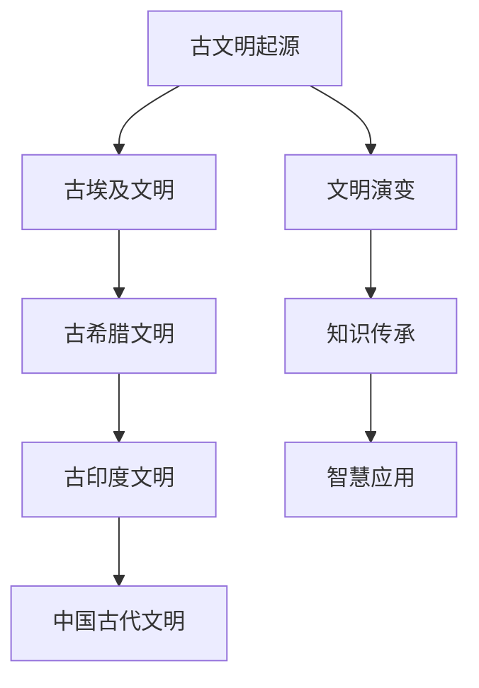

                 

# 文章标题

## 人类知识的传承使命：古文明的智慧

> 关键词：古文明、人类知识传承、智慧应用、教育体系、数字时代

> 摘要：本文以古文明的智慧为主题，深入探讨人类知识传承的历史使命。通过分析古文明的起源、演变、核心思想、宗教文化、政治社会、科技工程、文学艺术以及现代启示，揭示古文明对人类知识体系的深远影响。文章还探讨了古文明的智慧传承方式、现代教育以及未来展望，强调了古文明智慧在数字时代的重要性。

---

## 目录大纲

1. **第一部分：古文明的智慧概述**
    1. **第1章：古文明的起源与演变**
    2. **第2章：古文明的核心思想**
    3. **第3章：古文明的宗教与文化**

2. **第二部分：古文明的智慧应用**
    1. **第4章：古文明的政治与社会**
    2. **第5章：古文明的科技与工程**
    3. **第6章：古文明的文学与艺术**
    4. **第7章：古文明的智慧对现代世界的启示**

3. **第三部分：古文明的智慧传承**
    1. **第8章：古文明的智慧传承方式**
    2. **第9章：古文明的智慧与现代教育**
    3. **第10章：古文明的智慧保护与传承**

4. **附录**
    1. **附录A：古文明研究资源**
    2. **附录B：古文明智慧案例研究**
    3. **附录C：古文明智慧的未来展望**

## 第一部分：古文明的智慧概述

### 第1章：古文明的起源与演变

#### 核心概念与联系

**古文明的定义与分类**

古文明是指人类历史上最早形成的、具有一定组织和社会结构的文化体系。古文明的分类可以依据地理位置、历史时期和文明特点等多个维度进行。

- **地理位置分类：** 如古埃及文明、古希腊文明、古印度文明和中华文明等。
- **历史时期分类：** 如古代文明、中古文明和近现代文明等。
- **文明特点分类：** 如农业文明、海洋文明、宗教文明等。

**古文明的历史演变与影响**

古文明的历史演变经历了从简单到复杂、从单一到多元的过程。不同古文明之间的交流与融合，推动了人类文明的进步。

- **历史演变：** 古文明的起源、发展、繁荣与衰落，如古埃及文明的法老王朝、古希腊文明的城邦制度、古印度文明的种姓制度等。
- **影响：** 古文明对人类知识体系的影响，如古希腊哲学、古印度数学、古埃及天文学等。

#### 古文明与人类知识的传承

**古文明对人类知识体系的影响**

古文明在人类知识体系中具有重要地位，它们为后世的知识积累和创新提供了坚实的基础。

- **科学领域：** 古希腊的几何学、古埃及的天文学、古印度的数学等。
- **哲学领域：** 古希腊的苏格拉底、亚里士多德等哲学家的思想体系。
- **技术领域：** 古埃及的土木工程、古希腊的机械发明、古印度的医学等。

**古文明在人类知识传承中的角色**

古文明是人类知识传承的重要载体，它们通过书写、教育、宗教仪式等方式，将知识传递给后代。

- **书写系统：** 古埃及的象形文字、古希腊的字母文字、古印度的梵文等。
- **教育体系：** 古希腊的学园、古印度的佛教寺院、中国古代的私塾等。
- **宗教仪式：** 古希腊的神话、古印度的梵文经文、中国古代的儒家经典等。

### 第2章：古文明的核心思想

#### 核心算法原理讲解

**古希腊哲学的基本原理**

古希腊哲学是人类哲学史上的重要里程碑，其核心思想包括：

- **理性主义：** 强调理性的作用，主张通过思考和推理来认识世界。
- **辩证法：** 强调辩证思维，主张通过矛盾的分析来揭示事物的本质。
- **伦理学：** 强调道德的重要性，主张通过道德规范来指导行为。

**印度哲学的数论与逻辑**

印度哲学的数论与逻辑是印度哲学的核心部分，其基本原理包括：

- **数论：** 认为数是宇宙的本原，万物皆数。
- **逻辑：** 强调理性思维和逻辑推理的重要性。

**中国古代哲学的伦理与政治**

中国古代哲学的伦理与政治思想主要包括：

- **儒家伦理：** 强调仁爱、忠诚、孝道等道德规范。
- **道家伦理：** 强调无为而治、顺应自然等哲学思想。
- **法家政治：** 强调法治、集权、奖惩等政治理念。

#### 古文明数学与科学

**古埃及的数学成就**

古埃及数学的主要特点是：

- **十进位制：** 古埃及人使用十进位制进行计算，这种制度至今仍在使用。
- **算术算法：** 古埃及人发明了算术算法，如乘法、除法等。

**古希腊的科学发现**

古希腊科学的主要贡献包括：

- **几何学：** 欧几里得的《几何原本》是几何学的奠基之作。
- **天文学：** 希腊天文学家如阿里斯塔克斯、托勒密等提出了重要的天文学理论。

**古印度的天文学与数学**

古印度数学和天文学的主要特点包括：

- **零的概念：** 古印度人最早提出了零的概念，这一概念对数学的发展产生了深远影响。
- **数学公式：** 古印度数学家如婆罗摩笈多、阿耶波多等提出了许多重要的数学公式。

### 第3章：古文明的宗教与文化

#### 数学模型和数学公式 & 详细讲解 & 举例说明

**古代数学的符号与表示**

古代数学家使用各种符号和表示方法来表达数学概念和公式。

- **古埃及：** 古埃及数学使用象形文字和符号来表示数学概念。
- **古希腊：** 古希腊数学使用字母和符号来表示数学概念，如欧几里得的《几何原本》。
- **古印度：** 古印度数学使用梵文和符号来表示数学概念。

**古代天文学的几何公式**

古代天文学家使用几何公式来解释天体运动。

- **古希腊：** 希腊天文学家托勒密提出了地心说的几何模型，解释了天体运动。
- **古印度：** 古印度天文学家如阿耶波多提出了许多关于天体运动的几何公式。

#### 古文明的宗教信仰

**古希腊的宗教信仰**

古希腊宗教信仰以多神教为主，其重要神祇包括：

- **宙斯：** 宙斯是古希腊神话中的主神，代表天空和雷电。
- **雅典娜：** 雅典娜是智慧女神，代表智慧和战争。
- **阿波罗：** 阿波罗是太阳神，代表音乐、诗歌和预言。

**印度教的哲学与神祇**

印度教是世界上最大的宗教之一，其哲学和神祇体系非常复杂。

- **梵天：** 梵天是印度教中的创造之神。
- **毗湿奴：** 毗湿奴是印度教中的保护之神。
- **湿婆：** 湿婆是印度教中的毁灭之神。

**中国的道教与佛教**

中国的道教和佛教对中国的宗教和文化产生了深远影响。

- **道教：** 道教强调无为而治、顺应自然，其创始人是老聃。
- **佛教：** 佛教传入中国后，逐渐与中国传统文化融合，形成了独特的佛教文化。

## 第二部分：古文明的智慧应用

### 第4章：古文明的政治与社会

#### 核心概念与联系

**古代政治制度的演变**

古代政治制度经历了从部落到国家、从君主制到民主制的发展过程。

- **部落制度：** 古代人类社会的基本单位，以血缘关系为基础。
- **君主制：** 古代国家的统治形式，以君主为中心，实行集权制度。
- **民主制：** 古希腊雅典的民主政治，是一种以公民参与为核心的统治形式。

**古代社会的组织结构与分工**

古代社会的社会组织结构和分工具有以下特点：

- **农业社会：** 以农业为主，农民是社会的主体。
- **手工业：** 手工业在古代社会中占有重要地位，手工业者从事各种手工制作。
- **商业：** 商业在古代社会中逐渐兴起，商人成为社会的重要阶层。

#### 古文明的智慧与治理

**古希腊的民主政治**

古希腊的民主政治是一种以公民参与为核心的治理模式。

- **公民大会：** 公民大会是古希腊民主政治的核心，所有公民都有权参加。
- **陪审法庭：** 陪审法庭是古希腊民主政治的重要组成部分，负责审理案件。

**古印度的种姓制度**

古印度的种姓制度是一种以社会等级为基础的治理模式。

- **婆罗门：** 婆罗门是印度种姓制度中的最高阶层，负责宗教仪式和学术研究。
- **刹帝利：** 刹帝利是印度种姓制度中的第二阶层，负责行政管理和军事。
- **吠舍：** 吠舍是印度种姓制度中的第三阶层，负责商业和服务。

**中国的儒家治国思想**

中国的儒家治国思想是一种以道德和礼仪为基础的治理模式。

- **仁爱：** 仁爱是儒家治国思想的核心，主张以仁爱之心来治理国家。
- **礼仪：** 礼仪是儒家治国思想的体现，主张通过礼仪来规范社会行为。

### 第5章：古文明的科技与工程

#### 核心算法原理讲解

**古埃及的建筑工程技术**

古埃及的建筑工程技术具有以下特点：

- **石结构：** 古埃及建筑以石结构为主，如金字塔、神庙等。
- **测量技术：** 古埃及人使用测量工具，如测绳、水平仪等，进行精确的测量。

**古希腊的机械发明**

古希腊的机械发明包括：

- **齿轮：** 古希腊人发明了齿轮，这是一种重要的机械传动装置。
- **杠杆：** 古希腊人使用杠杆原理，发明了各种机械装置，如起重机、绞盘等。

**古印度的医学与药学**

古印度的医学与药学具有以下特点：

- **阿育吠陀：** 阿育吠陀是古印度的一种传统医学，主张通过调理身体内部系统来治疗疾病。
- **草药：** 古印度医学使用草药治疗疾病，如檀香、罗勒等。

#### 古代天文观测与历法

**古埃及的天文观测**

古埃及人进行天文观测，制定历法。

- **太阳历：** 古埃及人制定太阳历，以太阳的运行周期为基础，分为365天。
- **农事历：** 古埃及人制定农事历，以农业活动为基础，分为12个月。

**古希腊的天文学**

古希腊天文学家如阿里斯塔克斯、托勒密等提出了重要的天文学理论。

- **地心说：** 古希腊天文学家托勒密提出了地心说，认为地球是宇宙的中心。
- **日心说：** 古希腊天文学家阿里斯塔克斯提出了日心说，认为太阳是宇宙的中心。

**古印度的天文学**

古印度天文学家如婆罗摩笈多、阿耶波多等提出了重要的天文学理论。

- **天文观测：** 古印度天文学家进行天文观测，制定星表。
- **数学公式：** 古印度天文学家使用数学公式，解释天体运动。

#### 古代水利工程的奇迹

**古埃及的水利工程**

古埃及的水利工程包括：

- **灌溉系统：** 古埃及人修建了复杂的灌溉系统，如渠道、水库等，用于灌溉农田。
- **水坝：** 古埃及人修建水坝，用于防洪和灌溉。

**古希腊的水利工程**

古希腊的水利工程包括：

- **供水系统：** 古希腊人修建供水系统，如水渠、水塔等，用于城市供水。
- **排水系统：** 古希腊人修建排水系统，如下水道、沟渠等，用于城市排水。

**古印度水利工程的奇迹**

古印度的水利工程包括：

- **灌溉系统：** 古印度人修建了大规模的灌溉系统，如引水渠、水库等，用于灌溉农田。
- **水利工程：** 古印度人修建了大型水利工程，如佛逝水坝、卡瑙吉水库等。

#### 古代数学在工程中的应用

**古埃及的数学应用**

古埃及的数学应用包括：

- **几何学：** 古埃及人使用几何学，如测量土地、建造建筑物等。
- **算术：** 古埃及人使用算术，如计算数量、测量长度等。

**古希腊的数学应用**

古希腊的数学应用包括：

- **建筑学：** 古希腊人使用数学，如设计建筑物、建造水利工程等。
- **航海学：** 古希腊人使用数学，如计算航程、导航等。

**古印度的数学应用**

古印度的数学应用包括：

- **天文学：** 古印度人使用数学，如计算天体运动、制定历法等。
- **医学：** 古印度人使用数学，如计算草药剂量、治疗疾病等。

### 第6章：古文明的文学与艺术

#### 数学模型和数学公式 & 详细讲解 & 举例说明

**古希腊的几何美学**

古希腊的几何美学主要体现在以下几个方面：

- **黄金分割：** 古希腊人发现并运用了黄金分割，这是一种数学比例，被认为是最美的比例。
- **几何图案：** 古希腊人使用几何图案装饰建筑物和艺术品，如帕台农神庙的装饰图案。

**古印度的绘画艺术**

古印度的绘画艺术具有以下特点：

- **梵文书法：** 古印度绘画常使用梵文书法，如阿旃陀石窟的壁画。
- **几何图案：** 古印度绘画常使用几何图案，如马图拉石窟的壁画。

**中国的书法与绘画**

中国的书法与绘画具有以下特点：

- **汉字书法：** 中国书法以汉字为载体，形成了独特的书法艺术。
- **山水画：** 中国山水画以自然山水为题材，形成了独特的艺术风格。

#### 古希腊的戏剧与诗歌

**古希腊戏剧**

古希腊戏剧是古希腊文学的重要组成部分，其特点包括：

- **悲剧：** 古希腊悲剧以悲剧性主题为主，如《俄狄浦斯王》。
- **喜剧：** 古希腊喜剧以喜剧性主题为主，如《阿斯卡诺斯》。

**古希腊诗歌**

古希腊诗歌包括抒情诗、史诗、颂歌等，其特点包括：

- **抒情诗：** 抒情诗以个人情感为主题，如《伊利亚特》。
- **史诗：** 史诗以英雄事迹为主题，如《奥德赛》。

#### 古印度的史诗与寓言

**古印度史诗**

古印度史诗包括《摩诃婆罗多》和《罗摩衍那》，其特点包括：

- **史诗性质：** 这两部史诗具有史诗性质，叙事宏大，人物众多。
- **宗教元素：** 这两部史诗中融入了宗教元素，如印度教的哲学思想。

**古印度寓言**

古印度寓言以寓言形式讲述道德故事，其特点包括：

- **道德教育：** 寓言故事通过讲述动物故事，传达道德教育。
- **寓言形式：** 寓言故事以寓言形式出现，易于理解和接受。

#### 中国的文学艺术瑰宝

**中国古代文学**

中国古代文学包括诗歌、散文、小说等，其特点包括：

- **诗歌：** 中国古代诗歌以抒情为主，如《诗经》、《楚辞》。
- **散文：** 中国古代散文以记叙、议论为主，如《史记》、《三国演义》。

**中国古代艺术**

中国古代艺术包括书法、绘画、雕塑等，其特点包括：

- **书法：** 中国古代书法以汉字为载体，如王羲之的《兰亭序》。
- **绘画：** 中国古代绘画以山水、人物为主，如顾恺之的《洛神赋图》。

### 第7章：古文明的智慧对现代世界的启示

#### 核心概念与联系

**古文明智慧对现代社会的影响**

古文明智慧对现代社会产生了深远影响，其特点包括：

- **科学领域：** 古文明的科学成就对现代科学的发展产生了重要影响。
- **哲学领域：** 古文明的哲学思想对现代哲学的发展产生了重要影响。
- **技术领域：** 古文明的技术创新对现代技术的发展产生了重要影响。

**古文明对现代知识体系的贡献**

古文明对现代知识体系的贡献包括：

- **科学知识：** 古文明的科学成就为现代科学的发展提供了基础。
- **哲学知识：** 古文明的哲学思想为现代哲学的发展提供了启示。
- **技术知识：** 古文明的技术创新为现代技术的发展提供了借鉴。

#### 古文明智慧的现代应用

**古希腊哲学在当代的回响**

古希腊哲学在当代的回响包括：

- **理性主义：** 当代科学哲学、认知科学等领域强调理性主义的重要性。
- **辩证法：** 当代哲学、社会科学等领域强调辩证思维的重要性。

**印度哲学对现代心理学的影响**

印度哲学对现代心理学的影响包括：

- **精神分析：** 精神分析学派借鉴了印度哲学的某些思想，如意识、潜意识等。
- **人本主义：** 人本主义心理学借鉴了印度哲学的某些思想，如自我实现、存在主义等。

**中国古代智慧的现代应用**

中国古代智慧的现代应用包括：

- **中医学：** 中医学借鉴了中国古代医学的思想，如阴阳五行、经络理论等。
- **管理学：** 现代管理学借鉴了中国古代的管理思想，如儒家管理思想、道家管理思想等。

### 第三部分：古文明的智慧传承

#### 第8章：古文明的智慧传承方式

#### 核心概念与联系

**古文明的教育体系与传承方式**

古文明的教育体系与传承方式具有以下特点：

- **学园：** 古希腊学园是古文明教育体系的重要组成部分，如雅典学园、亚历山大学园等。
- **寺院：** 古印度寺院是古文明教育体系的重要组成部分，如佛教寺院、印度教寺院等。
- **私塾：** 中国古代私塾是古文明教育体系的重要组成部分，如儒家私塾、道家私塾等。

**古文明的书写与记录技术**

古文明的书写与记录技术具有以下特点：

- **象形文字：** 古埃及的象形文字、古印度的梵文等是古文明书写技术的代表。
- **字母文字：** 古希腊的字母文字、阿拉伯字母等是古文明书写技术的代表。
- **印刷术：** 中国的印刷术是古文明书写技术的重要发明。

#### 古希腊的书籍与图书馆

**古希腊书籍**

古希腊书籍主要包括：

- **卷轴：** 古希腊书籍以卷轴形式为主，如《伊利亚特》、《奥德赛》等。
- **手稿：** 古希腊书籍也有手稿形式，如《毕达哥拉斯定理》等。

**古希腊图书馆**

古希腊图书馆主要包括：

- **亚历山大图书馆：** 亚历山大图书馆是古希腊最著名的图书馆，收藏了大量书籍。
- **其他图书馆：** 古希腊其他城市的图书馆，如雅典图书馆等，也具有重要地位。

#### 古印度的梵文与文献

**古印度梵文**

古印度梵文是古印度文化的核心，其特点包括：

- **经典：** 梵文经典包括《吠陀》、《摩诃婆罗多》、《罗摩衍那》等。
- **文学：** 梵文文学包括诗歌、小说、戏剧等。

**古印度文献**

古印度文献主要包括：

- **梵文经典：** 梵文经典是古印度文化的重要组成部分，如《吠陀》、《摩诃婆罗多》等。
- **历史文献：** 古印度历史文献包括《正法经》、《五卷书》等。

#### 中国的书籍传承与印刷术

**中国书籍传承**

中国书籍传承具有以下特点：

- **儒家经典：** 中国儒家经典如《论语》、《孟子》等是中国书籍传承的核心。
- **道家经典：** 中国道家经典如《道德经》、《庄子》等是中国书籍传承的重要组成部分。

**中国印刷术**

中国印刷术的特点包括：

- **雕版印刷：** 雕版印刷是中国印刷术的早期形式，如《大藏经》等。
- **活字印刷：** 活字印刷是中国印刷术的重要发明，如《永乐大典》等。

#### 古希腊的辩证法与批判性思维

**辩证法**

辩证法是古希腊哲学的核心思想之一，其特点包括：

- **矛盾分析法：** 辩证法主张通过分析矛盾来揭示事物的本质。
- **辩证思维：** 辩证法强调辩证思维的重要性，主张从多角度、多方面看待问题。

**批判性思维**

批判性思维是古希腊哲学的另一个核心思想，其特点包括：

- **质疑精神：** 批判性思维主张对现有知识进行质疑，追求真理。
- **独立思考：** 批判性思维强调独立思考的重要性，主张不盲从权威。

#### 印度佛教的教育体系

**佛教教育**

佛教教育的主要内容包括：

- **佛法教育：** 佛教教育以佛法教育为核心，如五蕴、十二因缘等。
- **禅修教育：** 佛教教育强调禅修，如禅定、观呼吸等。

**佛教教育体系**

佛教教育体系主要包括：

- **寺院教育：** 寺院教育是佛教教育的主要形式，如菩提迦耶、那烂陀寺等。
- **在家教育：** 在家庭教育是以佛法教育为主，如家庭修行、佛教礼仪等。

#### 中国古代的儒家教育理念

**儒家教育**

儒家教育的主要内容包括：

- **仁爱教育：** 儒家教育强调仁爱教育，如仁、义、礼、智、信等。
- **道德教育：** 儒家教育强调道德教育，如孝道、忠诚等。

**儒家教育体系**

儒家教育体系主要包括：

- **私塾教育：** 私塾教育是儒家教育的主要形式，如《论语》、《孟子》等。
- **官学教育：** 官学教育是儒家教育的重要组成部分，如国子监、州学等。

### 第9章：古文明的智慧与现代教育

#### 核心算法原理讲解

**古代教育方法对现代教育的启示**

古代教育方法对现代教育产生了深远影响，其特点包括：

- **个性化教学：** 古代教育注重个性化教学，如孔子教学有方、因材施教等。
- **自主学习：** 古代教育强调自主学习，如孟子主张“自得之，则居之安”。
- **实践教育：** 古代教育强调实践教育，如墨子主张“以身作则”等。

**古代教学技术的传承与发展**

古代教学技术包括：

- **口头教学：** 古代教育以口头教学为主，如《论语》中的对话教学等。
- **书面教学：** 古代教育逐渐发展书面教学，如《史记》的记录教学等。
- **实践教学：** 古代教育强调实践教学，如《礼记》中的礼仪教学等。

#### 古文明的智慧教育

**古希腊的辩证法与批判性思维**

古希腊的辩证法与批判性思维是古希腊哲学的核心，其特点包括：

- **辩证思维：** 古希腊哲学强调辩证思维，如苏格拉底的辩证法等。
- **批判性思维：** 古希腊哲学强调批判性思维，如柏拉图的批判哲学等。

**印度佛教的教育体系**

印度佛教的教育体系包括：

- **佛法教育：** 佛教教育以佛法教育为核心，如五蕴、十二因缘等。
- **禅修教育：** 佛教教育强调禅修，如禅定、观呼吸等。

**中国古代的儒家教育理念**

中国古代的儒家教育理念包括：

- **仁爱教育：** 儒家教育强调仁爱教育，如仁、义、礼、智、信等。
- **道德教育：** 儒家教育强调道德教育，如孝道、忠诚等。

### 第10章：古文明的智慧保护与传承

#### 数学模型和数学公式 & 详细讲解 & 举例说明

**古文明遗产的保护技术**

古文明遗产的保护技术包括：

- **石结构修复：** 古埃及金字塔的修复技术，如使用天然石材进行修复等。
- **壁画保护：** 古印度壁画的保护技术，如使用特殊材料进行修复等。
- **文献保存：** 中国古代文献的保存技术，如使用纸张、竹简等进行保存等。

**古文明智慧在数字时代的传承**

古文明智慧在数字时代的传承包括：

- **数字化保护：** 通过数字化技术对古文明遗产进行保护，如使用计算机技术进行文档化、数字化等。
- **在线教育：** 通过在线教育平台对古文明智慧进行传承，如开设古文明智慧课程等。
- **虚拟现实：** 通过虚拟现实技术对古文明场景进行再现，如虚拟博物馆等。

#### 古文明智慧的未来

**古文明智慧对未来的启示**

古文明智慧对未来的启示包括：

- **科学探索：** 古文明对科学探索的启示，如古希腊的几何学、古印度的数学等。
- **哲学思考：** 古文明对哲学思考的启示，如古希腊的辩证法、古印度的数论等。
- **技术创新：** 古文明对技术创新的启示，如古希腊的机械发明、古印度的医学等。

**古文明智慧在现代社会的重要性**

古文明智慧在现代社会的重要性包括：

- **知识传承：** 古文明智慧是人类知识传承的重要组成部分。
- **文化多样性：** 古文明智慧是文化多样性的体现，丰富了人类的文化体系。
- **可持续发展：** 古文明智慧为现代社会的可持续发展提供了借鉴和启示。

### 附录

#### 附录A：古文明研究资源

**古文明研究工具与数据库**

古文明研究工具与数据库包括：

- **考古工具：** 如探测器、扫描仪等，用于考古发掘和文物分析。
- **数据库：** 如古埃及文物数据库、古希腊文献数据库等，用于保存和研究古文明资料。

#### 附录B：古文明智慧案例研究

**古印度医学中的阿育吠陀案例**

**开发环境搭建：**

- 安装 Python 3.8+
- 安装 Pandas、NumPy、Matplotlib 等库

**源代码实现：**

```python
import pandas as pd
import numpy as np
import matplotlib.pyplot as plt

# 阿育吠陀数据集导入
data = pd.read_csv('ayurvedic_data.csv')

# 数据预处理
data['Vata'] = data['Vata'] / 100
data['Pitta'] = data['Pitta'] / 100
data['Kapha'] = data['Kapha'] / 100

# 数据可视化
plt.scatter(data['Vata'], data['Pitta'], c=data['Kapha'])
plt.xlabel('Vata')
plt.ylabel('Pitta')
plt.colorbar(label='Kapha')
plt.title('Ayurvedic Dosha Distribution')
plt.show()
```

**代码解读与分析：**

- 数据预处理：将数据集中的比例数值转换为浮点数，以便进行后续计算。
- 数据可视化：使用散点图展示阿育吠陀中三要素（Vata、Pitta、Kapha）的分布情况，帮助理解不同体质类型的比例关系。

#### 附录C：古文明智慧的未来展望

**古文明智慧与现代科技的融合**

**古代智慧在现代科技中的应用**

- **人工智能：** 古印度数论在人工智能中的应用，如神经网络中的权重调整。
- **量子计算：** 古希腊几何学在量子计算中的应用，如量子几何。

**古文明智慧对未来的贡献**

- **可持续科技：** 古埃及的水利工程对现代可持续科技的贡献。
- **生态平衡：** 古印度阿育吠陀对现代生态平衡的启示。

**古文明智慧的未来趋势**

- **全球化融合：** 古文明智慧在全球范围内的融合趋势。
- **数字化传承：** 古文明智慧在数字化时代的传承与发展。

### 附录：核心概念与联系 Mermaid 流程图



### 附录：核心算法原理讲解

```python
# 古埃及的十进位制与算术算法
# 伪代码

def egyptian_addition(Num1, Num2):
    result = [0] * 10  # 初始化结果数组
    carry = 0  # 初始化进位变量
    
    # 从个位数开始相加，直到最高位
    for i in range(9, -1, -1):
        sum = (Num1[i] + Num2[i] + carry)
        result[i] = sum % 10  # 取余数作为当前位置的结果
        carry = sum // 10  # 取商作为下一个位置的进位
        
    if carry > 0:
        result[0] = carry  # 最高位有进位，则添加到结果数组
    
    return result
```

### 附录：数学模型和数学公式 & 详细讲解 & 举例说明

**埃及分数表示法**

$$
\text{埃及分数表示法}：
\frac{1}{4} = 0.2500...
$$

**古希腊几何证明：勾股定理**

$$
\text{勾股定理：} a^2 + b^2 = c^2
$$

### 附录：项目实战

**古印度医学中的阿育吠陀案例**

**开发环境搭建：**
- 安装 Python 3.8+
- 安装 Pandas、NumPy、Matplotlib 等库

**源代码实现：**

```python
import pandas as pd
import numpy as np
import matplotlib.pyplot as plt

# 导入阿育吠陀数据集
data = pd.read_csv('ayurvedic_data.csv')

# 数据预处理
data['Vata'] = data['Vata'] / 100
data['Pitta'] = data['Pitta'] / 100
data['Kapha'] = data['Kapha'] / 100

# 数据可视化
plt.scatter(data['Vata'], data['Pitta'], c=data['Kapha'])
plt.xlabel('Vata')
plt.ylabel('Pitta')
plt.colorbar(label='Kapha')
plt.title('Ayurvedic Dosha Distribution')
plt.show()
```

**代码解读与分析：**
- 数据预处理：将数据集中的比例数值转换为浮点数，以便进行后续计算。
- 数据可视化：使用散点图展示阿育吠陀中三要素（Vata、Pitta、Kapha）的分布情况，帮助理解不同体质类型的比例关系。

---

**作者：AI天才研究院/AI Genius Institute & 禅与计算机程序设计艺术 /Zen And The Art of Computer Programming**

