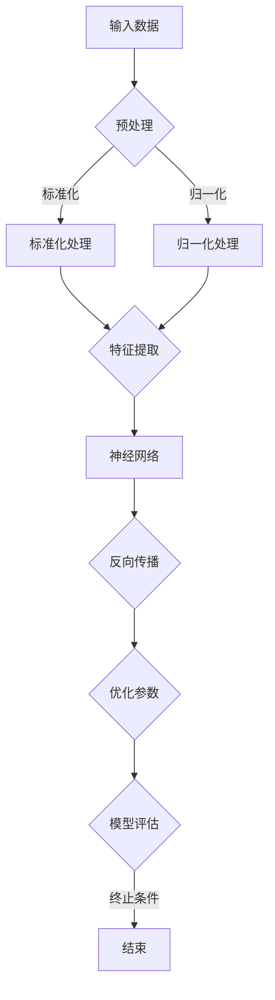

                 

# 人类知识的局限性：承认与尊重未知领域

> 关键词：人类知识、局限性、科学方法、跨学科合作、教育、未来展望

> 摘要：本文深入探讨了人类知识的局限性，分析了自然科学、社会科学和哲学领域的知识局限性表现，并提出了应对知识局限性的策略。通过科学探索、跨学科合作和知识传播与教育，我们可以在尊重未知的基础上，推动人类知识的发展和创新。

## 引言与背景知识

### 第1章：人类知识的局限性概述

#### 1.1 引言：知识局限性的重要性

在现代社会中，知识已经成为推动社会进步和经济发展的关键因素。然而，人类的知识体系并非完美无缺，它存在着一定的局限性。本文旨在探讨这些局限性，并分析其在不同领域的表现。

首先，我们需要了解人类知识体系的结构。人类知识体系可以分为三个层次：基础科学知识、应用科学知识和人文科学知识。这些知识层次相互关联，共同构成了人类对世界的认识和理解。

然而，人类知识的局限性主要体现在以下几个方面：

1. **认知局限**：人类的认知能力是有限的，我们无法完全感知和理解复杂的事物。例如，我们无法直接感知微观粒子的行为，也无法完全理解宏观宇宙的奥秘。

2. **信息局限**：人类获取信息的渠道和能力是有限的。我们只能通过感知、学习和经验来获取知识，但这些方式都有其局限性。例如，我们无法直接感知某些抽象概念，只能通过语言和符号来描述和理解。

3. **技术局限**：人类的技术水平也在不断进步，但仍有许多未知的领域需要我们去探索。例如，人类在宇宙探索、生命科学和人工智能等领域仍有许多难题需要解决。

#### 1.1.1 人类知识体系的结构

人类知识体系可以看作是一个层次结构。最底层是基础科学知识，包括物理学、化学、生物学等领域的知识。这些知识是其他应用科学和人文科学的基础。

中层是应用科学知识，包括工程学、医学、经济学等领域的知识。这些知识是将基础科学知识应用于实际问题的过程中产生的。

最顶层是人文科学知识，包括哲学、历史、文学等领域的知识。这些知识是人类对自身和社会的深刻思考和理解。

#### 1.1.2 人类知识的局限性

人类知识的局限性主要表现在以下几个方面：

1. **认知局限**：人类的认知能力是有限的，我们无法完全感知和理解复杂的事物。

2. **信息局限**：人类获取信息的渠道和能力是有限的。

3. **技术局限**：人类的技术水平也在不断进步，但仍有许多未知的领域需要我们去探索。

#### 1.1.3 本书的目的和结构

本书旨在探讨人类知识的局限性，并分析其在不同领域的表现。具体来说，本书分为四个部分：

第一部分：引言与背景知识，介绍了人类知识体系的结构、人类知识的局限性以及本书的目的和结构。

第二部分：知识局限性在各个领域的表现，详细分析了自然科学、社会科学和哲学领域的知识局限性。

第三部分：应对知识局限性的策略，提出了科学探索、跨学科合作和知识传播与教育等方法。

第四部分：未来展望与挑战，探讨了未来的知识发展趋势和未知领域的探索。

### 第2章：人类认知的基本原理

#### 1.2.1 认知心理学基础

认知心理学是研究人类思维过程的科学。它关注人类如何获取、处理和使用信息，以及这些过程如何影响我们的行为和决策。

认知心理学的基本原理包括：

1. **感知**：感知是指我们通过感官接收外部信息的过程。我们的感知是有限的，受到感官能力和注意力分配的影响。

2. **记忆**：记忆是指我们存储和处理信息的能力。记忆分为短期记忆和长期记忆，它们在信息处理中起着重要作用。

3. **思维**：思维是指我们使用逻辑和推理来处理信息的能力。思维包括问题解决、决策制定和创造性思考等。

4. **语言**：语言是思维和沟通的工具。语言的使用影响我们的思维方式和知识结构。

#### 1.2.2 认知偏误与错误

认知心理学研究表明，人类在信息处理过程中容易出现认知偏误和错误。这些认知偏误和错误影响我们对世界的理解，导致我们做出错误的决策。

常见的认知偏误包括：

1. **确认偏误**：我们倾向于接受符合我们已有信念的信息，而忽视与之相矛盾的信息。

2. **可用性偏误**：我们倾向于根据信息在我们记忆中的易得性来评估其重要性，而忽视其他同样重要的信息。

3. **代表性偏误**：我们倾向于根据事物的外表和特征来判断其概率，而忽视实际概率。

4. **锚定效应**：我们倾向于根据最初的信息来调整后续信息的评估，即使这些信息并不重要。

#### 1.2.3 认知能力与局限性

认知能力是指我们在信息处理过程中的能力。认知能力受到多种因素的影响，包括：

1. **智力**：智力是影响认知能力的重要因素。智力高的人通常在信息处理和问题解决方面表现更好。

2. **经验**：经验是我们在信息处理过程中的重要资源。丰富的经验可以帮助我们更好地理解和处理复杂的信息。

3. **注意力**：注意力是我们在信息处理过程中集中注意力的能力。良好的注意力可以帮助我们更好地处理信息，避免认知偏误。

然而，认知能力也有其局限性。例如，我们的认知能力受到信息处理速度和容量的限制，我们无法同时处理大量的信息。

#### 1.2.4 认知心理学在IT领域的应用

认知心理学在IT领域有广泛的应用。例如：

1. **用户界面设计**：认知心理学可以帮助我们设计更符合用户认知习惯的界面，提高用户体验。

2. **人工智能**：认知心理学为人工智能提供了理论基础，帮助我们设计更符合人类思维模式的人工智能系统。

3. **软件开发**：认知心理学可以帮助我们更好地理解用户的需求和行为，从而设计更高效、更易用的软件。

### 第3章：科学方法与知识界限

#### 第3章：科学方法与知识界限

#### 3.1 科学方法的基本原则

科学方法是一种系统的研究方法，用于探索自然界和社会现象。它通过一系列的步骤来确保研究结果的可靠性和有效性。科学方法的基本原则包括：

1. **可观察性和可测量性**：科学方法要求研究的现象必须是可观察和可测量的。这意味着研究者可以通过实验或观察来验证其假设。

2. **可重复性**：科学方法强调研究的可重复性。如果同样的实验在不同时间和地点由不同的研究者进行，应该得到相似的结果。

3. **客观性**：科学方法要求研究者尽量保持客观，避免主观偏见。这意味着研究者应该尽可能使用标准化的方法和工具来收集和分析数据。

4. **理性分析**：科学方法依赖于逻辑和数学工具来分析和解释数据。这种方法帮助研究者从复杂的现实中提取关键信息。

5. **假设检验**：科学方法的核心是假设检验。研究者首先提出一个假设，然后设计实验来验证或反驳这个假设。

#### 3.1.1 科学方法概述

科学方法通常包括以下步骤：

1. **提出问题**：科学始于问题。研究者识别出一个需要解答的问题。

2. **建立假设**：研究者根据现有的知识和理论，提出一个可能的解释，即假设。

3. **设计实验**：研究者设计一个实验来测试假设。实验应该能够提供对假设的明确证据。

4. **收集数据**：通过实验或观察，研究者收集数据，这些数据应该能够量化或描述实验结果。

5. **分析数据**：研究者使用统计学或其他分析方法来分析数据，以确定假设是否得到支持。

6. **得出结论**：根据数据分析结果，研究者得出结论，接受或拒绝原始假设。

7. **后续研究**：结论的得出并不意味着研究的结束。研究者通常需要进一步研究来验证结论的可靠性。

#### 3.1.2 科学假设与验证

科学假设是基于现有知识和理论提出的。这些假设通常是预测性的，即它们预测在特定条件下会发生什么。科学假设的验证通常涉及以下步骤：

1. **构建模型**：研究者构建一个理论模型来描述假设的预期结果。

2. **设计实验**：实验设计应该能够测试假设的各个方面。研究者需要确保实验条件能够控制变量，从而准确评估假设的有效性。

3. **收集和解释数据**：研究者收集实验数据，并使用统计方法来分析数据。这些分析应该能够明确显示假设是否得到支持。

4. **假设修正**：如果数据不支持原始假设，研究者可能需要修改或提出新的假设。

#### 3.1.3 科学发现与理论构建

科学发现是通过实验和观察得出的。这些发现提供了对自然现象的新理解。科学理论构建是基于科学发现的系统解释。理论构建通常涉及以下步骤：

1. **提出理论**：研究者根据科学发现提出一个理论，该理论应该能够解释一系列现象。

2. **验证理论**：研究者通过实验和观察来验证理论。这通常涉及对理论预测的实验测试。

3. **理论修正**：如果验证结果显示理论预测不准确，研究者可能需要修正理论。

4. **理论整合**：科学理论经常需要与其他领域的理论进行整合。这有助于构建更全面和一致的科学体系。

#### 3.2 知识领域划分与交叉

科学知识领域可以根据研究对象的性质和目的进行划分。主要的科学领域包括：

1. **自然科学**：研究自然界的物理、化学、生物等基本现象。

2. **社会科学**：研究人类社会、经济、政治等社会现象。

3. **人文科学**：研究人类文化、历史、语言、艺术等人类活动。

然而，这些领域并不是完全隔离的。知识领域之间存在广泛的交叉和互动。例如：

1. **跨学科研究**：研究者通常需要结合多个领域的知识来回答复杂的问题。

2. **交叉学科**：一些研究领域同时涉及多个学科。例如，生态学涉及生物学、环境科学和社会科学。

3. **整合研究**：整合研究旨在将不同领域的知识结合起来，以提供更全面的理解。

#### 3.2.1 自然科学与社会科学

自然科学和社会科学在研究方法上有显著差异。自然科学通常依赖于实验和观察，强调可重复性和客观性。社会科学则更依赖于统计分析和实地研究，强调社会价值和伦理考量。

然而，自然科学和社会科学之间也存在互动。例如：

1. **环境影响**：自然环境的变化对人类社会产生深远影响。

2. **政策制定**：科学知识对政策制定具有重要影响，尤其是在环境、健康和经济领域。

3. **数据共享**：自然科学和社会科学的研究者越来越多地共享数据和分析方法，以促进跨学科合作。

#### 3.2.2 知识领域的交叉与融合

知识领域的交叉与融合是现代科学发展的重要趋势。以下是一些例子：

1. **生物信息学**：结合生物学、计算机科学和数学，研究生物数据。

2. **认知科学**：结合心理学、神经科学和计算机科学，研究认知过程。

3. **环境科学**：结合物理学、化学和生物学，研究环境问题。

这些交叉领域不仅推动了科学进步，也为解决复杂问题提供了新的视角和方法。

#### 3.2.3 知识界限的模糊性

随着科学的发展，知识界限的模糊性变得越来越明显。以下是一些表现：

1. **新兴领域**：随着技术的发展，新的研究领域不断涌现，如量子生物学、纳米技术等。

2. **跨学科研究**：越来越多的研究需要结合多个领域的知识，这模糊了传统学科界限。

3. **多学科融合**：一些学科开始融合，如生物物理学、化学工程等。

知识界限的模糊性为科学研究带来了新的挑战，但也提供了新的机遇。研究者需要适应这种变化，以推动科学的发展。

### 第二部分：知识局限性在各个领域的表现

#### 第3章：自然科学中的局限性

自然科学是研究自然界的基本规律和现象的学科，包括物理学、化学、生物学、地球科学等。虽然自然科学在过去的几个世纪中取得了巨大的进步，但仍然存在许多未解之谜和知识局限性。

#### 3.1 自然科学的发展历程

自然科学的发展历程可以追溯到古代，当时人们开始观察自然现象并试图解释它们。随着历史的发展，科学方法逐渐形成，实验和观察成为研究的主要手段。

1. **古代科学思想**：古代文明，如希腊、中国和印度，对自然现象进行了早期的探索和解释。例如，古希腊哲学家亚里士多德提出了关于物质和运动的理论。

2. **现代科学革命**：文艺复兴时期以来，科学方法的发展使得自然科学研究取得了重大突破。哥白尼提出了日心说，伽利略通过望远镜观察到了新的天体现象，牛顿的物理学理论奠定了经典力学的基础。

3. **当代科学趋势**：现代科学的发展集中在量子物理学、相对论、分子生物学、生态学等领域。这些研究不仅深化了我们对自然界的理解，也揭示了新的未知领域。

#### 3.2 自然科学中的知识局限性

尽管自然科学取得了显著的进展，但仍存在以下知识局限性：

1. **宇宙学中的未知领域**：宇宙的起源和演化仍然是一个未解之谜。例如，宇宙的黑暗物质和黑暗能量是什么，它们的性质和行为如何，仍然缺乏明确的答案。

2. **生物学中的演化未知**：生物演化过程中的许多机制和事件仍然不完全清楚。例如，生命起源的过程、复杂生物系统的进化机制等。

3. **物理学中的基础问题**：物理学中的基本问题，如量子力学和相对论之间的关系、时空的本质、引力如何与量子力学统一，仍然是科学研究的前沿问题。

#### 3.3 自然科学的研究方法

自然科学的研究方法主要包括观察、实验和理论建模。以下是一些关键的研究方法：

1. **观察**：科学家通过直接观察自然现象来收集数据。例如，天文学家使用望远镜观察星空，生物学家观察动物行为。

2. **实验**：实验是自然科学研究的重要手段。科学家设计实验来验证假设，控制变量，以获得可靠的数据。

3. **理论建模**：理论建模是科学家使用数学和物理模型来解释自然现象的方法。这些模型可以预测未来的现象，为实验设计提供指导。

#### 3.4 科学知识与人类认知

科学知识是人类认知的产物，但它也受到人类认知局限的影响。以下是一些与科学知识相关的人类认知局限：

1. **感知局限**：人类的感官能力有限，无法直接观察到所有现象。例如，我们无法直接感知微观粒子或电磁波。

2. **记忆局限**：人类的记忆能力有限，无法记住所有观察到的事物。这限制了我们的知识积累和记忆。

3. **思维局限**：人类的思维过程受到认知心理学因素的影响，容易出现认知偏误和错误。这可能导致科学假设和理论的偏差。

#### 3.5 科学知识的扩展与更新

科学知识的扩展与更新是科学进步的重要标志。以下是一些科学知识扩展与更新的例子：

1. **新发现**：科学家不断发现新的自然现象和规律。例如，量子力学和相对论的发现改变了我们对宇宙的理解。

2. **新理论**：科学家提出新的理论来解释旧的现象。例如，达尔文的进化论解释了生物多样性的起源。

3. **新技术**：科学技术的进步使得我们可以更精确地观察和实验，推动了科学知识的扩展。例如，基因编辑技术的出现改变了我们对生命的理解。

#### 3.6 科学知识的应用与影响

科学知识的应用对人类社会产生了深远的影响。以下是一些科学知识应用的例子：

1. **技术创新**：科学知识推动了新技术的发明和应用，如计算机技术、医学技术、能源技术等。

2. **政策制定**：科学知识为政策制定提供了依据，如环境保护政策、公共卫生政策等。

3. **教育**：科学知识是教育的重要组成部分，它帮助人们理解世界，培养批判性思维和创新能力。

#### 3.7 科学知识的局限性对未来的影响

科学知识的局限性对未来的影响是复杂的。以下是一些可能的影响：

1. **知识瓶颈**：科学知识的局限性可能导致知识瓶颈，阻碍科学进步。

2. **技术瓶颈**：科学知识的局限性可能导致技术瓶颈，限制技术创新。

3. **社会挑战**：科学知识的局限性可能对社会产生负面影响，如环境问题、资源短缺等。

4. **国际合作**：面对科学知识的局限性，国际合作变得尤为重要，以共同应对全球性挑战。

#### 第4章：社会科学中的局限性

社会科学是研究人类社会行为、结构、制度和文化的学科，包括经济学、政治学、社会学、心理学、教育学等。虽然社会科学在理解和解决社会问题方面发挥了重要作用，但仍存在许多局限性。

#### 4.1 社会科学的研究方法

社会科学的研究方法包括定量研究和定性研究。以下是一些主要的方法：

1. **定量研究**：定量研究使用统计学方法来分析数据，以揭示社会现象的规律。常用的方法包括问卷调查、实验设计、数据分析等。

2. **定性研究**：定性研究侧重于理解社会现象背后的原因和机制。常用的方法包括访谈、观察、案例研究等。

#### 4.2 社会科学中的知识局限性

社会科学中的知识局限性主要体现在以下几个方面：

1. **数据局限**：社会科学的数据往往难以获取和准确测量，这可能影响研究的可靠性和有效性。

2. **理论局限**：社会科学的理论体系可能存在缺陷，无法完全解释复杂的社会现象。

3. **方法局限**：社会科学的方法可能受到技术限制，无法全面捕捉社会现象的多样性。

#### 4.3 社会科学中的知识局限性

1. **社会经济学的未解问题**：经济学在理解市场行为、收入分配、经济增长等方面取得了显著进展，但仍存在许多未解问题。例如，市场失灵、经济周期性波动、资源分配不公等。

2. **心理学的局限性**：心理学在理解人类行为、情感、认知等方面取得了很大成就，但仍然存在一些局限性。例如，对心理障碍的准确诊断和治疗方法、人类行为的复杂性和多样性等。

3. **教育学的未知领域**：教育学在提高教育质量、改善学习效果、促进学生全面发展等方面取得了进展，但仍有许多未知领域。例如，学习动机、教育公平、个性化教育等。

#### 4.4 社会科学的跨学科研究

社会科学的跨学科研究是应对知识局限性的重要途径。以下是一些跨学科研究的例子：

1. **认知科学**：认知科学与心理学、计算机科学、神经科学等领域结合，研究认知过程和大脑功能。

2. **行为经济学**：行为经济学结合经济学、心理学，研究人类行为在经济决策中的偏差。

3. **教育社会学**：教育社会学结合教育学和社会学，研究教育在社会结构中的角色和影响。

#### 4.5 社会科学的未来发展趋势

社会科学的未来发展趋势包括：

1. **大数据分析**：随着大数据技术的发展，社会科学将能够更全面地收集和分析数据，揭示社会现象的规律。

2. **人工智能应用**：人工智能在社会科学中的应用将带来新的研究方法和工具，如自动化数据分析、智能决策支持等。

3. **全球视野**：社会科学将更加关注全球性问题，如全球化、移民、气候变化等。

4. **跨学科合作**：跨学科合作将变得更加普遍，以应对复杂的社会问题。

#### 第5章：哲学中的知识局限性

哲学作为一门探讨存在、知识、价值和理性的学科，在人类思想史上占有重要地位。然而，哲学自身也存在一些知识局限性，这些局限性不仅影响了哲学的发展，也对其他学科产生了深远影响。

#### 5.1 哲学的基本问题

哲学的基本问题包括存在论、知识论和伦理学。这些问题是哲学思考的核心，也是哲学研究的起点。

1. **存在论**：存在论探讨存在的本质和特性，涉及实体、属性、因果关系等问题。哲学家们试图回答“什么是存在？”和“存在是如何发生的？”等问题。

2. **知识论**：知识论探讨知识的本质、来源和范围，涉及感知、推理、证明等问题。哲学家们试图回答“什么是知识？”和“我们如何获得知识？”等问题。

3. **伦理学**：伦理学探讨道德原则和价值观，涉及正义、美德、责任等问题。哲学家们试图回答“什么是善？”和“我们应该如何行动？”等问题。

#### 5.2 哲学中的知识局限性

哲学在探索这些基本问题的过程中，也面临着一些知识局限性：

1. **概念模糊**：哲学的基本概念往往模糊不清，如“存在”、“知识”、“价值”等。这些概念的模糊性导致哲学讨论的复杂性。

2. **论证难题**：哲学论证往往涉及复杂的逻辑推理和抽象概念，这增加了论证的难度。一些哲学问题，如“什么是实在？”和“心灵与身体的关系”，至今没有明确的答案。

3. **主观性**：哲学问题往往涉及个人观点和价值观，这使得哲学讨论容易受到主观因素的影响。

#### 5.3 哲学中的悖论

哲学中存在一些悖论，这些悖论揭示了哲学知识局限性。以下是一些著名的悖论：

1. **阿克伦德悖论**：阿克伦德悖论表明，无论选择什么，都会导致矛盾的结果。这表明某些哲学观点可能是自相矛盾的。

2. **麦考利悖论**：麦考利悖论指出，一个哲学家试图证明所有哲学观点都是错误的，这本身就是一个哲学观点，因此这个观点可能是错误的。

3. **柏拉图悖论**：柏拉图悖论表明，知识的定义可能无法满足自身的条件。这表明某些哲学概念可能是无法定义的。

#### 5.4 哲学中的知识局限性对其他学科的影响

哲学的知识局限性对其他学科产生了深远影响：

1. **科学哲学**：科学哲学探讨了科学知识的特点和局限性，影响科学方法论的发展。

2. **逻辑学**：逻辑学是哲学的一个分支，研究推理和论证的有效性。哲学的知识局限性促使逻辑学对论证进行分析和批判。

3. **伦理学**：伦理学受到哲学的影响，探讨道德原则和价值观。哲学的知识局限性促使伦理学家对道德原则进行重新审视。

#### 5.5 哲学的未来发展方向

面对知识局限性，哲学需要不断发展和创新。以下是一些哲学的未来发展方向：

1. **跨学科研究**：哲学与其他学科的交叉研究将有助于拓展哲学的视野，解决哲学中的问题。

2. **新方法**：哲学家们需要探索新的研究方法，如实证研究、数据分析等，以提高哲学研究的可靠性和有效性。

3. **全球视野**：哲学需要关注全球性问题，如全球化、多元文化、人工智能等，以适应时代发展的需要。

4. **开放讨论**：哲学需要鼓励开放讨论，尊重不同观点和价值观，以促进哲学的多元发展。

### 第三部分：应对知识局限性的策略

#### 第6章：科学探索与跨学科合作

科学探索和跨学科合作是应对知识局限性的有效策略。通过这些方法，我们可以突破传统学科的限制，发现新的知识领域，推动科学的进步。

#### 6.1 科学探索的新趋势

科学探索的新趋势体现在以下几个方面：

1. **多学科交叉研究**：随着科学技术的进步，越来越多的研究需要跨学科合作。例如，生物信息学结合生物学、计算机科学和数学，研究生物数据；认知科学结合心理学、神经科学和计算机科学，研究认知过程。

2. **纳米科学与生命科学**：纳米科学和生命科学是两个快速发展的领域。纳米技术可以用于医学、环境保护和材料科学等领域；生命科学的研究包括基因编辑、生物信息学和神经科学等。

3. **人工智能与大数据分析**：人工智能和大数据分析的结合为科学研究提供了新的工具和方法。人工智能可以用于图像识别、自然语言处理和预测分析等；大数据分析可以帮助我们更好地理解复杂的社会现象和生物过程。

#### 6.2 跨学科合作的重要性

跨学科合作在应对知识局限性方面具有显著优势：

1. **互补性**：不同学科的研究方法和技术可以相互补充，从而提高研究的准确性和可靠性。

2. **创新性**：跨学科合作可以激发新的研究思路和方法，推动科学的创新和发展。

3. **问题解决**：跨学科合作有助于解决复杂的社会和科学问题，例如环境保护、公共卫生、能源危机等。

#### 6.3 跨学科合作的挑战

虽然跨学科合作具有许多优势，但也面临一些挑战：

1. **沟通障碍**：不同学科的研究者使用不同的语言和术语，这可能影响沟通和合作。

2. **资源分配**：跨学科研究往往需要更多的资源和资金，如何合理分配资源是一个挑战。

3. **利益冲突**：跨学科合作可能导致利益冲突，例如专利权和研究成果的归属问题。

#### 6.4 跨学科合作的案例研究

以下是一些跨学科合作的案例研究：

1. **生物医学研究**：生物医学研究是一个典型的跨学科领域。例如，基因编辑技术结合了生物学、化学和医学的知识，推动了生物医学的进步。

2. **环境保护**：环境保护研究需要物理、化学、生物学和社会科学的综合知识。例如，海洋环境保护需要研究海洋生态系统的物理和化学特性，以及人类活动的影响。

3. **人工智能应用**：人工智能在各个领域的应用都需要跨学科的知识。例如，自动驾驶技术结合了计算机科学、电子工程和交通工程的知识。

#### 6.5 科学探索与跨学科合作的未来发展

科学探索和跨学科合作在未来将继续发挥重要作用：

1. **新领域涌现**：随着科学技术的进步，新的研究领域将不断涌现。例如，量子计算、人工智能伦理、神经科学与心理学等。

2. **国际合作**：跨学科合作需要国际合作，以应对全球性挑战。例如，气候变化、疾病防控和可持续能源等。

3. **教育改革**：教育改革将更加注重跨学科教育，培养具有创新能力和综合素质的人才。

#### 第7章：知识传播与教育

知识传播与教育是应对知识局限性的重要途径。通过有效的知识传播和教育体系，我们可以扩展人类的认知边界，培养新一代的科学家和思想家。

#### 7.1 知识传播的渠道与障碍

知识传播的渠道多种多样，包括书籍、学术论文、媒体、教育和网络等。然而，知识传播过程中也面临一些障碍：

1. **信息过载**：随着信息技术的飞速发展，人们接收到的信息量呈指数级增长。这可能导致信息过载，影响知识的有效传播。

2. **语言障碍**：不同学科和专业领域有自己独特的术语和语言，这可能造成语言障碍，影响跨学科知识的传播。

3. **文化差异**：不同文化背景的人群对知识的理解和接受方式可能存在差异，这可能导致知识传播的文化障碍。

4. **教育资源不均衡**：全球范围内，教育资源的分配不均，这可能影响知识传播的广泛性和深度。

#### 7.2 知识传播的策略与方法

为了克服知识传播的障碍，可以采取以下策略和方法：

1. **数字化传播**：利用互联网和数字技术，实现知识的快速传播和共享。例如，通过在线课程、学术论坛和社交媒体等平台。

2. **跨学科教育**：鼓励跨学科教育，培养具有多学科知识背景的人才。这有助于促进知识的融合和创新。

3. **开放获取**：推动开放获取运动，使学术论文和书籍等学术资源免费向公众开放，提高知识的可及性。

4. **科普活动**：开展科普活动，提高公众对科学知识的理解和兴趣。例如，举办科学讲座、科普展览和科学竞赛等。

#### 7.3 教育在知识传播中的作用

教育在知识传播中发挥着关键作用：

1. **知识传承**：教育是知识传承的重要手段。通过教育，人们可以系统地学习前人的知识和经验，为未来的科学探索奠定基础。

2. **创新能力**：教育培养人们的创新思维和批判性思维，为科学创新提供动力。

3. **社会参与**：教育有助于提高公众的科学素养，促进社会对科学技术的参与和支持。

#### 7.4 教育体系中的局限性

尽管教育在知识传播中发挥了重要作用，但教育体系也存在一些局限性：

1. **课程设计**：课程设计可能过于侧重于理论知识，缺乏实践和创新能力培养。

2. **教育资源**：教育资源的分配不均可能导致一些地区和群体无法获得高质量的教育。

3. **教学方法**：传统的教学方法可能过于单一，难以满足学生的个性化需求。

#### 7.5 创新型教育的实践与探索

为了克服教育体系中的局限性，可以采取以下创新型教育的实践和探索：

1. **项目式学习**：鼓励学生通过实际项目来学习知识，提高实践能力和创新思维。

2. **在线教育**：利用在线教育平台，实现教育资源的共享和个性化学习。

3. **混合式教学**：结合传统教学和在线教学，实现教学方法的多样化。

4. **跨学科教学**：推动跨学科教学，培养学生的多学科知识体系和综合能力。

#### 7.6 知识传播与教育的未来趋势

知识传播与教育的未来趋势将更加注重以下几个方面：

1. **数字化转型**：随着技术的进步，数字化转型将成为知识传播和教育的重要趋势。

2. **全球合作**：知识传播与教育需要全球合作，以应对全球性挑战，如气候变化、疾病防控和可持续发展等。

3. **终身学习**：终身学习将成为知识传播与教育的重要组成部分，以满足个人和社会的持续发展需求。

### 第四部分：未来展望与挑战

#### 第8章：未来的知识探索

随着科技的进步和社会的发展，人类的知识探索将进入一个全新的时代。未来，我们将面临一系列知识发展的新趋势和挑战。

#### 8.1 未来的知识发展趋势

1. **知识融合**：随着不同学科的交叉与融合，未来的知识体系将变得更加复杂和多样化。例如，生物信息学、认知科学、纳米科学等新兴领域将继续扩展，推动知识的整体融合。

2. **数据驱动**：大数据和人工智能的发展将使知识探索更加依赖数据驱动。通过数据分析和机器学习，我们可以更深入地理解和预测复杂的社会现象和自然规律。

3. **全球视野**：全球化使得知识探索不再局限于特定的地区或国家，而是需要全球合作和交流。未来的知识发展将更加注重跨国界的合作和研究，以应对全球性挑战。

4. **可持续性**：在应对气候变化、资源短缺和环境退化等全球性问题时，知识探索将更加注重可持续性。未来的科学研究将更加关注环境保护和可持续发展，以实现人类与自然的和谐共生。

#### 8.2 未知领域的探索

尽管我们已经取得了许多科学成就，但仍然有许多未知领域需要我们去探索。以下是一些重要的未知领域：

1. **宇宙探索**：宇宙的起源、演化和结构仍然充满未知。未来的宇宙探索将涉及对黑洞、暗物质和暗能量的深入研究，以及宇宙大爆炸后的早期宇宙状态。

2. **生命科学**：生命的起源、进化机制和生物多样性是生命科学的重要研究领域。未来的生命科学探索将涉及对基因编辑、干细胞技术和生物信息学等前沿领域的深入研究。

3. **人工智能**：人工智能的未知领域包括智能的本质、人脑与人工智能的比较、以及人工智能的伦理和安全性等问题。未来的研究将致力于实现更强大、更智能的人工智能系统，并确保其在社会中的安全应用。

4. **社会科学**：社会现象的复杂性和多样性使得社会科学面临着许多未知领域。未来的社会科学探索将涉及对社会经济系统、文化多样性和全球治理等问题的深入研究。

#### 8.3 知识创新的驱动因素

知识创新的驱动因素主要包括以下几个方面：

1. **科技进步**：科技的不断进步为知识创新提供了新的工具和方法。例如，量子计算、人工智能和生物技术等新兴科技的发展将推动知识的革命性变革。

2. **社会需求**：社会的需求和问题为知识创新提供了方向和动力。例如，应对气候变化、公共卫生危机和全球贫困等社会问题需要新的科学知识和解决方案。

3. **经济激励**：经济的激励和竞争机制促使科研机构和学者进行知识创新。政府和企业对科研项目的投资和支持也将推动知识的快速发展。

4. **文化多样性**：不同文化的交流与融合为知识创新提供了丰富的资源。跨文化的研究和合作有助于发现新的知识和视角，推动知识的创新和发展。

#### 8.4 未来的知识体系

未来的知识体系将是一个更加开放、动态和多元化的体系。以下是一些关键特征：

1. **开放性**：未来的知识体系将更加开放，知识共享和协作将成为知识创新的重要方式。开放获取、开源软件和开放数据等将成为知识传播的主要模式。

2. **动态性**：未来的知识体系将更加动态，知识的更新速度将越来越快。新理论、新方法和新技术将不断涌现，推动知识的快速迭代和发展。

3. **多元化**：未来的知识体系将更加多元化，不同学科、不同文化和不同领域之间的知识将相互融合和交叉，形成更加复杂和丰富的知识体系。

#### 8.5 知识创新的挑战

尽管未来的知识体系充满机遇，但也面临许多挑战：

1. **资源限制**：知识创新需要大量的资源和投入，包括资金、设备和人力资源等。资源限制可能成为知识创新的瓶颈。

2. **伦理问题**：知识创新过程中可能涉及伦理问题，例如基因编辑、人工智能伦理和环境伦理等。如何平衡技术创新和伦理道德是一个重要挑战。

3. **全球合作**：全球合作是实现知识创新的关键，但全球合作也面临许多挑战，如政治、经济和文化差异等。

4. **社会接受度**：知识创新成果需要社会的接受和认可，但社会接受度可能受到知识普及程度、公众信任和社会舆论等因素的影响。

#### 第9章：人类与未知的和谐共生

在探索未知领域的过程中，人类需要与未知和谐共生，以实现可持续发展和科技进步。

#### 9.1 尊重未知的价值

尊重未知是人类社会进步的重要价值观。未知领域代表了无限的可能性和探索空间，是科学创新和社会发展的动力源泉。以下是一些尊重未知的价值：

1. **激发创造力**：未知领域的探索激发人类的创造力和创新精神，推动科技进步和社会变革。

2. **拓宽认知边界**：未知领域的探索扩展了人类的认知边界，促进了知识的积累和深化。

3. **促进跨学科合作**：未知领域的探索需要跨学科合作，有助于打破学科壁垒，推动知识的融合和创新。

4. **应对全球性挑战**：未知领域的探索有助于解决全球性挑战，如气候变化、疾病防控和资源短缺等。

#### 9.2 尊重未知的伦理思考

尊重未知涉及到一系列伦理思考，包括科学伦理、环境伦理和社会伦理等。以下是一些伦理思考：

1. **科学伦理**：在探索未知领域时，科学家应遵循科学伦理原则，确保研究的客观性、可靠性和安全性。

2. **环境伦理**：在探索未知领域时，应尊重自然环境和生物多样性，避免对生态系统造成破坏。

3. **社会伦理**：在探索未知领域时，应关注社会公平和正义，确保知识创新和社会发展的成果惠及所有人。

4. **伦理审查**：应建立完善的伦理审查制度，对涉及未知领域的科研项目进行严格审查，确保研究过程和结果符合伦理标准。

#### 9.3 尊重未知的社会责任

尊重未知需要全社会共同努力，承担社会责任。以下是一些社会责任：

1. **科研投资**：政府和企业应增加对科研的投资，支持未知领域的探索和研究。

2. **教育普及**：教育部门应加强科学教育，提高公众的科学素养，培养具有探索精神和创新能力的人才。

3. **国际合作**：各国应加强国际合作，共享科研资源，共同应对全球性挑战。

4. **公众参与**：鼓励公众参与未知领域的探索，提高社会对科学创新的关注和支持。

#### 9.4 和谐共生的策略

为了实现人类与未知的和谐共生，可以采取以下策略：

1. **科学普及**：加强科学普及，提高公众对未知领域的认识和兴趣，促进科学文化的传播和弘扬。

2. **科技创新**：加大科技创新力度，推动新技术、新方法的应用，提高人类应对未知领域的能力。

3. **跨学科合作**：鼓励跨学科合作，推动知识融合和创新，为未知领域的探索提供新思路和新方法。

4. **可持续发展**：关注可持续发展，确保科技进步与环境保护、社会公平相协调，实现人类与自然的和谐共生。

#### 9.5 和谐共生的社会实践

在和谐共生的理念指导下，可以开展一系列社会实践：

1. **科学教育**：开展科学教育活动，提高公众的科学素养，培养具有探索精神和创新能力的人才。

2. **环境保护**：实施环境保护措施，保护自然环境和生物多样性，实现可持续发展。

3. **科技创新**：推动科技创新，开发新技术、新产品，提高人类生活质量和社会发展水平。

4. **国际合作**：加强国际合作，共享科研资源，共同应对全球性挑战，实现全球和谐共生。

### 结语

在人类知识的局限性的探讨中，我们认识到，知识的发展是一个不断探索和超越的过程。面对未知领域，我们需要保持敬畏之心，尊重自然、尊重科学，不断推动科学探索和知识创新。通过科学方法、跨学科合作、知识传播与教育，我们可以突破知识的局限性，实现人类与未知的和谐共生。未来，我们将共同面对未知领域的挑战，不断拓展人类的知识边界，为社会的进步和可持续发展贡献智慧和力量。

## 作者信息

作者：AI天才研究院/AI Genius Institute & 禅与计算机程序设计艺术 /Zen And The Art of Computer Programming

## 附录：核心概念原理与架构 Mermaid 流程图

以下是一个关于人工智能算法架构的 Mermaid 流程图：



## 附录：核心算法原理讲解与伪代码

以下是关于神经网络算法原理的讲解和伪代码示例：

### 神经网络算法原理

神经网络是一种通过模拟生物神经系统的结构和功能来实现信息处理的人工智能模型。它由多个神经元（节点）组成，每个神经元接收多个输入信号，并通过权重和偏置进行加权求和处理，最终产生一个输出信号。

### 伪代码

```plaintext
初始化神经网络
- 设置神经网络结构（输入层、隐藏层、输出层）
- 初始化权重和偏置

前向传播
- 对于每个隐藏层：
  - 对于每个神经元：
    - 计算输入信号乘以权重和偏置
    - 应用激活函数得到输出
- 对于输出层：
  - 计算输出信号乘以权重和偏置
  - 应用激活函数得到最终输出

反向传播
- 计算输出层神经元的误差
- 对于每个隐藏层：
  - 计算输入信号乘以权重和偏置
  - 应用激活函数的导数
  - 计算误差并更新权重和偏置

模型评估
- 计算模型的预测准确率或损失函数值

优化参数
- 使用优化算法（如梯度下降）更新模型参数

循环迭代
- 重复前向传播和反向传播，直到达到预定的迭代次数或模型性能不再提升

结束
```

## 附录：数学模型和公式

以下是一个关于线性回归模型的数学公式和详细讲解：

### 线性回归模型

线性回归模型是一种用于预测数值变量的统计模型。它假设因变量（目标变量）与自变量（特征变量）之间存在线性关系。

### 数学模型

$$ y = \beta_0 + \beta_1x + \epsilon $$

其中：

- \( y \) 是因变量
- \( x \) 是自变量
- \( \beta_0 \) 是截距
- \( \beta_1 \) 是斜率
- \( \epsilon \) 是误差项

### 伪代码

```plaintext
初始化模型参数（\beta_0, \beta_1）
计算每个特征变量的均值和标准差
标准化数据（x_mean, x_std）
计算权重（\beta_1）和截距（\beta_0）
预测目标变量（y_pred）
计算误差（error）
更新模型参数
```

### 举例说明

假设我们有一个简单的线性回归模型，用于预测房价。特征变量是房屋面积（\( x \)），目标变量是房价（\( y \)）。我们收集了一些房屋数据，并计算出面积和房价的均值和标准差。

- 房屋面积均值：\( x_{\text{mean}} = 120 \)
- 房屋面积标准差：\( x_{\text{std}} = 20 \)
- 房价均值：\( y_{\text{mean}} = 300,000 \)
- 房价标准差：\( y_{\text{std}} = 50,000 \)

现在我们有一个新的房屋数据，面积是150平方米。我们需要预测其房价。

### 预测步骤

1. **标准化数据**：

   $$ x_{\text{standardized}} = \frac{x - x_{\text{mean}}}{x_{\text{std}}} = \frac{150 - 120}{20} = 1.5 $$

2. **计算预测房价**：

   $$ y_{\text{predicted}} = \beta_0 + \beta_1x_{\text{standardized}} $$

   其中，\( \beta_0 \) 是截距，\( \beta_1 \) 是斜率。我们假设通过训练数据计算出的 \( \beta_0 = 100,000 \) 和 \( \beta_1 = 50,000 \)。

   $$ y_{\text{predicted}} = 100,000 + 50,000 \times 1.5 = 225,000 $$

3. **计算误差**：

   $$ error = y_{\text{predicted}} - y_{\text{actual}} $$

   其中，\( y_{\text{actual}} \) 是实际房价。假设实际房价是220,000。

   $$ error = 225,000 - 220,000 = 5,000 $$

### 总结

通过线性回归模型，我们可以预测房屋面积为150平方米时的房价为225,000。这与实际房价220,000相差5,000。这表明我们的模型存在一定的误差，可能需要进一步调整和优化模型参数。

## 附录：项目实战

### 开发环境搭建

为了演示线性回归模型的应用，我们将使用Python编程语言和相关的库，如NumPy和Scikit-learn。以下是搭建开发环境的基本步骤：

1. **安装Python**：

   - 访问Python官方网站（https://www.python.org/）下载最新的Python版本。
   - 运行安装程序，按照默认选项安装。

2. **安装Jupyter Notebook**：

   - 打开终端或命令行界面。
   - 输入以下命令安装Jupyter Notebook：

     ```bash
     pip install notebook
     ```

3. **安装NumPy和Scikit-learn**：

   - 继续在终端或命令行界面中，使用以下命令安装NumPy和Scikit-learn：

     ```bash
     pip install numpy scikit-learn
     ```

### 源代码实现

以下是一个简单的线性回归模型实现，用于预测房价。代码中包含数据预处理、模型训练和预测的步骤。

```python
import numpy as np
from sklearn.linear_model import LinearRegression
from sklearn.model_selection import train_test_split
from sklearn.metrics import mean_squared_error

# 加载数据
X, y = load_data()

# 数据预处理
X_std = (X - X.mean(axis=0)) / X.std(axis=0)
y_std = (y - y.mean()) / y.std()

# 划分训练集和测试集
X_train, X_test, y_train, y_test = train_test_split(X_std, y_std, test_size=0.2, random_state=42)

# 创建线性回归模型
model = LinearRegression()

# 训练模型
model.fit(X_train, y_train)

# 预测测试集
y_pred = model.predict(X_test)

# 计算误差
error = mean_squared_error(y_test, y_pred)
print("Mean Squared Error:", error)

# 预测新的数据
new_data = np.array([[150]])  # 新的房屋面积
new_data_std = (new_data - X.mean(axis=0)) / X.std(axis=0)
predicted_price = model.predict(new_data_std)
print("Predicted Price:", predicted_price[0])
```

### 代码解读与分析

- **数据加载与预处理**：首先加载房屋数据，然后对数据进行标准化处理，以消除特征变量之间的差异。

- **模型训练**：使用Scikit-learn的LinearRegression类创建线性回归模型，并使用训练集数据进行模型训练。

- **预测与误差计算**：使用训练好的模型对测试集数据进行预测，并计算预测值与实际值之间的误差。

- **新数据预测**：最后，使用模型预测新的房屋面积对应的房价，展示了线性回归模型在实际应用中的效果。

通过这个项目实战，我们展示了如何使用线性回归模型进行数据分析和预测。这个简单的例子可以帮助我们理解线性回归模型的基本原理和应用方法。在实际项目中，我们需要更复杂的数据处理和模型调优，以提高预测的准确性。

