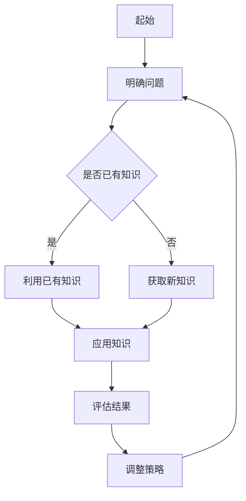
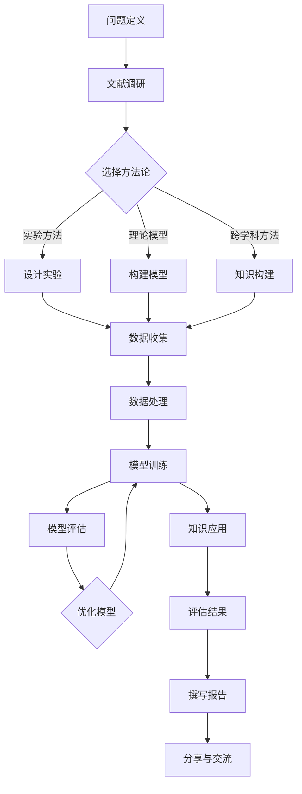

                 

### 文章标题

《人类知识的边界在哪里：无限的探索之旅》

> 关键词：知识探索、知识边界、人工智能、数学模型、跨学科方法

> 摘要：本文旨在探讨人类知识的边界及其探索之路。通过分析知识的本质与分类、知识探索的方法、知识的传播与共享，以及知识探索的未来趋势，本文试图揭示知识探索的无限可能，并引发读者对知识边界的好奇与思考。

### 《人类知识的边界在哪里：无限的探索之旅》

人类知识的历史是一部不断突破边界、不断追求真理的壮丽史诗。从古代的哲学思考到现代的科学探索，人类从未停止对知识边界的追寻。然而，知识的边界究竟在哪里？这一直是一个困扰人类几千年的难题。本文将带领读者踏上一段关于知识边界的探索之旅，试图揭示知识的本质、分类、探索方法以及未来趋势。

## 第一部分：引言

### 1.1 人类知识的起源与演变

人类知识的起源可以追溯到数千年前。当时，人类通过观察自然现象、实践劳动以及思考，逐渐积累了一些基本的知识。随着时间的推移，这些知识逐渐演变为更为复杂和系统化的知识体系。从古代的哲学思考到现代的科学理论，人类的知识体系经历了巨大的演变。

在古代，人类主要通过口口相传和文字记载来传递知识。随着文字的出现，知识的积累和传播变得更加高效和系统。古代的哲学家、科学家和工匠们通过不断探索和实践，为人类的知识体系奠定了基础。

进入现代，科学革命的发生使得人类对自然世界的认识取得了突破性的进展。科学方法论的出现使得知识探索变得更加规范和科学。人类的知识体系逐渐从经验总结走向理论分析，从定性描述走向定量分析。

### 1.2 探索人类知识边界的意义

探索人类知识的边界具有重要意义。首先，知识是人类文明进步的基石。通过不断探索和突破知识的边界，人类能够解决实际问题、提高生活质量、推动科技进步。其次，探索知识边界有助于人类认识自身。通过对知识的研究，人类能够更好地理解自然规律、社会规律以及自身存在的意义。

此外，探索知识边界还能够激发人类的创造力。当人类面临未知的领域时，往往会激发出新的思考和创意。这些新的思考和创意不仅能够推动科学的发展，也能够促进艺术的繁荣。

### 1.3 人类知识边界探索的挑战

尽管探索人类知识的边界具有重要意义，但这一过程并非一帆风顺。人类知识边界的探索面临着诸多挑战。首先，知识的无限性使得知识的边界难以界定。人类的知识体系是不断发展的，新的知识不断涌现，旧的边界不断被打破。

其次，知识探索需要大量的时间和资源。一些重大科学问题的解决可能需要数十年甚至数百年的时间。同时，知识探索往往需要跨学科的合作，这需要科学家们具备广泛的知识背景和合作精神。

此外，知识探索还面临着伦理和道德的挑战。一些知识探索可能涉及人类的生命、健康、环境等方面，如何平衡知识探索与伦理道德的关系是一个亟待解决的问题。

## 第二部分：知识的本质与分类

### 2.1 知识的本质

知识是人类对客观世界的认识和理解。它不仅包括事实和信息的积累，还包括对事物之间关系的理解和应用。知识具有以下几个基本特征：

1. **客观性**：知识是对客观世界的反映，它来源于实践，并能够通过实验和观察进行验证。
2. **系统性**：知识不是零散的信息，而是具有内在联系和结构化的体系。
3. **动态性**：知识是不断发展的，随着人类对世界的认识不断深化，知识也在不断更新和扩展。

### 2.2 知识的分类

知识可以根据不同的标准进行分类。以下是几种常见的知识分类方法：

1. **理论知识与实践知识**：
   - **理论知识**：主要通过逻辑推理和理论分析获得的，如数学、物理学等。
   - **实践知识**：主要通过实际操作和经验积累获得的，如烹饪、机械维修等。

2. **显性知识与隐性知识**：
   - **显性知识**：可以用语言、文字、图表等形式明确表达和传递的知识，如科学论文、技术文档等。
   - **隐性知识**：难以用语言明确表达和传递的知识，如个人经验、直觉、技能等。

3. **知识层次结构**：
   - **事实知识**：关于具体事实和事件的知识，如“地球是圆的”。
   - **概念知识**：关于概念和定义的知识，如“物理学是一门科学”。
   - **原理知识**：关于事物运行原理的知识，如“牛顿第三定律”。
   - **方法论知识**：关于研究和解决问题的方法的知识，如“科学方法论”。

### 2.3 知识的类型

根据知识的表现形式，知识可以分为以下几种类型：

1. **数据**：以数字、文字、图表等形式存在的信息，如统计数字、文本、图像等。
2. **信息**：通过处理数据获得的意义和模式，如天气预报、市场分析报告等。
3. **知识**：对信息进行理解和应用，如理解天气预报以制定旅行计划、根据市场分析报告做出商业决策等。
4. **智慧**：将知识应用到特定情境中，解决问题或创造新的价值，如运用科学原理设计新发明、运用商业策略开拓新市场等。

### 2.4 知识的层次结构

知识的层次结构可以从不同的角度进行理解。以下是一个常见的三层结构：

1. **基础层**：包括事实知识和概念知识，是知识体系的基础。
2. **中间层**：包括原理知识和方法论知识，是对基础层的深化和应用。
3. **应用层**：包括知识和智慧，是将知识转化为实际应用的能力。

### 2.5 知识的分类与实际应用

知识的分类不仅有助于我们理解知识的本质和结构，还可以指导我们在实际应用中更有效地利用知识。以下是一些实际应用的例子：

1. **教育领域**：通过知识的分类，可以设计出更科学、更有效的教学方法和课程体系。
2. **科研领域**：通过分类，可以明确研究方向，提高科研的针对性和效率。
3. **企业领域**：通过知识管理，可以更好地利用企业内部的知识资源，提高企业的竞争力。
4. **个人成长**：通过知识的分类，可以更好地规划个人学习和职业发展路径。

### 2.6 知识分类的挑战与未来趋势

尽管知识分类有助于我们理解和利用知识，但在实际操作中也面临着诸多挑战。例如，知识动态变化、知识融合创新等，都对知识分类提出了新的要求。

未来的知识分类将更加注重知识的动态性、多样性和跨领域整合。随着人工智能、大数据等技术的发展，知识分类方法也将更加智能化和自动化。

## 第三部分：知识探索的方法

### 3.1 实证研究方法

实证研究方法是一种通过观察、实验和数据分析来验证或推翻假设的研究方法。它是科学研究中最为常用的方法之一。

#### 3.1.1 观察与实验

观察和实验是实证研究方法的基础。观察是通过直接感知来收集信息，而实验则是通过控制变量来验证假设。

1. **观察**：
   - 观察可以揭示事物的现象和规律，例如，通过观察自然现象，科学家们发现了行星运动的规律。
   - 观察可以是定性的，也可以是定量的，例如，通过观察天气变化，可以记录温度、湿度等数据。
   - 观察的局限性在于，它只能揭示现象，而不能解释原因。

2. **实验**：
   - 实验是通过控制变量来验证假设，例如，通过实验，科学家们发现了电的原理。
   - 实验可以是实验室实验，也可以是现场实验，例如，在实验室中研究化学反应，在现场实验中测试新产品。
   - 实验的局限性在于，它可能无法完全模拟现实环境，且实验结果可能受到实验条件的影响。

#### 3.1.2 数据分析

数据分析是对收集到的数据进行处理和分析，以揭示数据中的规律和模式。数据分析方法包括统计分析、机器学习、数据挖掘等。

1. **统计分析**：
   - 统计分析是通过使用统计方法来分析数据，以得出结论。例如，通过统计分析，可以得出某个市场趋势、消费者偏好等。
   - 统计分析的方法包括描述性统计、推断性统计等。

2. **机器学习**：
   - 机器学习是通过使用算法来从数据中自动学习规律和模式。例如，通过机器学习，可以预测股票价格、识别图像等。
   - 机器学习的方法包括监督学习、无监督学习、强化学习等。

3. **数据挖掘**：
   - 数据挖掘是从大量数据中提取有价值信息的过程。例如，通过数据挖掘，可以找到消费者购买行为中的规律。
   - 数据挖掘的方法包括关联规则挖掘、分类挖掘、聚类挖掘等。

#### 3.1.3 实证研究的局限性

尽管实证研究方法在科学研究中具有广泛的应用，但它也存在一些局限性。

1. **数据偏差**：实证研究依赖于收集的数据，而数据可能存在偏差，从而影响研究的结论。
2. **实验条件**：实验条件可能无法完全模拟现实环境，从而影响实验结果的可靠性。
3. **结果解释**：实证研究的结果可能需要进一步解释，而解释的多样性可能导致不同的结论。

### 3.2 理论研究方法

理论研究方法是一种通过构建理论模型、假设验证和数学推导来探索知识的方法。它与实证研究方法互补，是科学研究中不可或缺的一部分。

#### 3.2.1 模型构建与假设验证

模型构建是理论研究的重要步骤。模型是对现实世界的抽象和简化，它可以帮助我们理解复杂系统的运行规律。

1. **模型构建**：
   - 模型构建包括确定变量、关系和假设。例如，在经济学中，可以构建供需模型来分析市场价格。
   - 模型可以是定性的，也可以是定量的。定性的模型通常用于描述事物的性质和关系，定量的模型则用于进行数值分析和预测。

2. **假设验证**：
   - 假设验证是通过对模型进行数学推导和逻辑分析来验证假设的正确性。例如，通过数学推导，可以验证供需模型中的价格均衡条件。

#### 3.2.2 数学方法在知识探索中的应用

数学方法在知识探索中具有广泛的应用，它可以帮助我们进行精确的描述、分析和预测。

1. **微积分**：
   - 微积分在物理学、工程学、经济学等领域有广泛应用。它可以帮助我们分析变化率、极值和积分等概念。
   - 例如，在物理学中，微积分可以用于分析物体的运动、力场等。

2. **线性代数**：
   - 线性代数在数据科学、机器学习、工程学等领域有广泛应用。它可以帮助我们处理多维数据、矩阵运算等。
   - 例如，在机器学习中，线性代数可以用于特征提取、分类等。

3. **概率论与统计学**：
   - 概率论与统计学在数据分析、风险评估、决策制定等领域有广泛应用。它可以帮助我们理解随机现象、进行概率计算和统计推断。
   - 例如，在金融领域，概率论与统计学可以用于风险评估、投资策略等。

#### 3.2.3 理论研究的局限性

尽管理论研究方法在知识探索中具有重要作用，但它也存在一些局限性。

1. **模型简化**：理论研究通常需要简化模型，这可能忽略了一些重要因素，从而影响模型的准确性。
2. **假设依赖**：理论研究的假设可能不适用于所有情况，从而影响研究的普遍性。
3. **结果解释**：理论研究的结论可能需要进一步解释和验证，而解释的多样性可能导致不同的结论。

### 3.3 跨学科方法

跨学科方法是一种将不同学科的理论、方法和工具结合起来进行知识探索的方法。它有助于解决复杂问题、推动知识创新。

#### 3.3.1 跨学科合作的优势

跨学科合作具有以下几个优势：

1. **知识互补**：不同学科可以相互补充，从而形成更为全面的知识体系。
2. **方法多样**：跨学科可以引入多种研究方法，从而提高研究的准确性和可靠性。
3. **创新突破**：跨学科合作可以激发新的思路和创意，推动知识创新。

#### 3.3.2 跨学科方法的应用案例

跨学科方法在多个领域有广泛应用：

1. **生物信息学**：生物信息学是生物学与信息学的交叉学科，它使用计算机技术和数学方法来分析生物数据，如基因序列、蛋白质结构等。
2. **认知科学**：认知科学是心理学、神经科学、计算机科学等多个学科的交叉领域，它研究人类思维、学习、记忆等认知过程。
3. **环境科学**：环境科学是自然科学、社会科学和工程学等多个学科的交叉领域，它研究人类与环境的关系，包括气候变化、污染控制等。

#### 3.3.3 跨学科方法的局限性

尽管跨学科方法具有诸多优势，但它也存在一些局限性：

1. **协调困难**：跨学科合作需要不同学科的专家共同参与，这可能涉及协调沟通的困难。
2. **知识断层**：不同学科之间可能存在知识断层，这可能导致理解的障碍和合作的不顺畅。
3. **资源分配**：跨学科项目可能需要更多资源和时间，这可能对项目执行造成困难。

## 第四部分：知识的传播与共享

### 4.1 知识的传播机制

知识的传播机制是指知识从产生、传递到应用的过程中所涉及的各种环节和因素。了解知识传播的机制有助于我们更好地推动知识的传播与共享。

#### 4.1.1 知识传播的路径

知识传播的路径可以分为以下几种：

1. **传统传播路径**：包括教育、媒体、书籍等。传统传播路径具有历史悠久、受众广泛、可信度高等特点。
2. **数字化传播路径**：包括互联网、社交媒体、电子邮件等。数字化传播路径具有传播速度快、覆盖面广、交互性强等特点。
3. **跨学科传播路径**：通过跨学科合作，不同领域的知识可以相互借鉴和融合，从而实现知识的传播和共享。

#### 4.1.2 知识传播的影响因素

知识传播的影响因素包括：

1. **知识本身**：知识的复杂性、创新性、实用性等都会影响知识的传播。
2. **传播者**：传播者的声誉、影响力、传播能力等都会影响知识的传播。
3. **受众**：受众的知识水平、需求、态度等都会影响知识的传播效果。
4. **环境**：社会环境、文化背景、政策法规等都会影响知识的传播。

#### 4.1.3 知识传播的效果评估

评估知识传播的效果是知识管理的重要环节。以下是一些常见的评估方法：

1. **知识共享度**：通过测量知识在组织内的共享频率和范围来评估知识传播的效果。
2. **知识利用率**：通过测量知识在实践中的应用程度来评估知识传播的效果。
3. **学习参与度**：通过测量员工在知识学习和培训活动中的参与度来评估知识传播的效果。
4. **创新产出**：通过测量由于知识传播而产生的创新成果来评估知识传播的效果。

### 4.2 知识共享的平台

知识共享平台是促进知识传播与共享的重要工具。以下是一些常见的知识共享平台及其特点：

#### 4.2.1 开放式知识共享平台

1. **维基百科**：维基百科是一个全球最大的开源在线百科全书，它允许用户自由编辑和贡献内容。
2. **开源社区**：如GitHub、GitLab等，这些平台允许开发者共享和合作开发软件项目。
3. **研究论文平台**：如PubMed、arXiv等，这些平台允许研究者共享和传播学术论文。

#### 4.2.2 社交媒体在知识共享中的作用

社交媒体在知识共享中发挥着重要作用。以下是一些常见的社会媒体平台及其作用：

1. **微博**：微博是一种社交媒体平台，用户可以通过发布微博来分享知识、观点和经验。
2. **微信**：微信是一种即时通讯工具，它具有公众号、小程序等功能，可以用于知识传播和分享。
3. **抖音**：抖音是一种短视频分享平台，用户可以通过制作和分享短视频来传播知识。

#### 4.2.3 知识共享平台的发展趋势

随着技术的发展，知识共享平台也在不断演变和进步。以下是一些发展趋势：

1. **智能化**：知识共享平台将越来越智能化，通过人工智能技术提供个性化推荐、智能问答等功能。
2. **开放性**：知识共享平台将更加开放，鼓励更多的用户参与内容创作和知识共享。
3. **多元化**：知识共享平台将提供更多样化的知识内容和形式，如视频、音频、互动式内容等。
4. **生态化**：知识共享平台将形成生态系统，包括内容创作者、用户、平台服务商等，共同推动知识共享的发展。

### 4.3 知识的共享与隐私

在知识共享的过程中，隐私保护是一个不可忽视的重要问题。以下从几个方面探讨知识的共享与隐私：

#### 4.3.1 知识共享与隐私保护的关系

知识共享与隐私保护之间存在一定的矛盾。知识共享需要开放和透明，而隐私保护则需要保密和限制。如何在知识共享与隐私保护之间找到平衡是一个重要的问题。

#### 4.3.2 知识共享中的隐私问题

知识共享中可能涉及的隐私问题包括：

1. **个人身份信息泄露**：在知识共享平台中，个人身份信息如姓名、地址、联系方式等可能会被泄露。
2. **行为数据监控**：知识共享平台可能会收集和监控用户的行为数据，如浏览记录、搜索历史等。
3. **内容审查**：一些知识共享平台可能存在内容审查机制，这可能影响知识的自由传播。

#### 4.3.3 知识共享与隐私保护的平衡策略

为了在知识共享与隐私保护之间找到平衡，可以采取以下策略：

1. **数据匿名化**：对用户数据进行匿名化处理，以保护个人隐私。
2. **隐私政策**：制定明确的隐私政策，告知用户其数据的使用方式和范围。
3. **用户权限管理**：对用户权限进行严格管理，限制用户对敏感信息的访问。
4. **隐私保护技术**：采用加密、隐私计算等技术手段，确保用户数据的安全和隐私。

### 4.4 知识共享的最佳实践

为了实现有效的知识共享，以下是一些最佳实践：

1. **建立知识共享文化**：在组织内部或社区中建立知识共享的文化氛围，鼓励用户分享知识。
2. **提供方便的共享工具**：提供方便易用的知识共享工具，如在线文档、知识库等。
3. **培训与支持**：对用户进行知识共享的培训和支持，帮助他们更好地利用共享平台。
4. **激励机制**：制定激励机制，如奖励、认可等，鼓励用户积极参与知识共享。

### 4.5 知识共享的未来趋势

随着技术的发展，知识共享将变得更加智能、开放和多样化。以下是一些未来的趋势：

1. **人工智能**：人工智能技术将被广泛应用于知识共享平台，提供个性化推荐、智能问答等功能。
2. **区块链**：区块链技术将被应用于知识共享，提供去中心化、透明、安全的共享机制。
3. **虚拟现实与增强现实**：虚拟现实与增强现实技术将被应用于知识共享，提供更加沉浸式的学习体验。
4. **知识图谱**：知识图谱将被应用于知识共享，帮助用户更好地理解知识的结构和关系。

## 第五部分：知识探索的未来

### 5.1 人工智能与知识探索

人工智能（AI）的发展为知识探索带来了新的机遇和挑战。AI技术在知识获取、知识管理和知识应用等方面发挥着越来越重要的作用。

#### 5.1.1 人工智能在知识探索中的应用

1. **知识获取**：人工智能可以帮助我们从大量数据中提取有用信息，例如，通过自然语言处理（NLP）技术，可以自动提取文本中的关键信息。
2. **知识管理**：人工智能可以帮助我们更好地管理和组织知识，例如，通过机器学习算法，可以自动分类和推荐相关文献。
3. **知识应用**：人工智能可以帮助我们将知识应用于实际问题中，例如，通过深度学习技术，可以自动识别图像、语音和文本。

#### 5.1.2 人工智能对知识探索的影响

人工智能的发展对知识探索产生了深远的影响：

1. **提高了知识获取的效率**：通过自动化技术，可以快速获取和处理大量信息，提高了知识获取的效率。
2. **扩展了知识的应用范围**：人工智能可以帮助我们将知识应用于更多领域，促进了知识的创新和交叉。
3. **改变了知识的生产和传播方式**：人工智能使得知识的生产和传播变得更加智能和个性化。

#### 5.1.3 人工智能在知识探索中的局限性

尽管人工智能在知识探索中具有广泛的应用，但它也存在一些局限性：

1. **数据依赖**：人工智能的性能很大程度上依赖于数据的质量和数量，如果数据存在偏差或不足，可能会导致错误的结论。
2. **算法透明度**：一些复杂的机器学习算法，如深度学习，其内部工作原理不透明，难以解释和验证。
3. **伦理和隐私问题**：人工智能在知识探索中可能会涉及个人隐私和数据安全等问题，如何平衡隐私保护和知识探索是一个重要挑战。

### 5.2 知识探索的未来趋势

随着科技的进步，知识探索的未来将充满无限可能。以下是一些可能的发展趋势：

#### 5.2.1 知识探索的新方向

1. **跨学科融合**：知识探索将更加注重跨学科合作，结合不同学科的理论和方法，推动知识的创新和突破。
2. **深度学习与推理**：随着深度学习技术的发展，知识探索将更加注重深度学习和推理的结合，实现更加智能的知识处理和分析。
3. **量子计算**：量子计算的发展将推动知识探索进入一个新的时代，它具有处理复杂问题和大数据的巨大潜力。

#### 5.2.2 知识探索的技术发展

1. **大数据技术**：大数据技术将继续发展，提供更高效的数据存储、管理和分析工具，为知识探索提供更强大的支持。
2. **区块链技术**：区块链技术的应用将使知识探索更加透明、可信和可追溯，为知识共享和协作提供新的基础设施。
3. **人工智能与物联网**：人工智能与物联网（IoT）的结合将实现更加智能的知识获取和传播，推动知识的实时更新和应用。

#### 5.2.3 知识探索的未来挑战

1. **数据安全与隐私**：随着知识探索的深入，数据安全和隐私保护将成为重要挑战，如何保护用户数据的安全和隐私是一个亟待解决的问题。
2. **知识伦理**：知识探索将涉及更多的伦理问题，如人工智能的伦理、数据使用的伦理等，如何制定和遵守相关的伦理规范是一个重要挑战。
3. **知识共享与平衡**：如何在知识共享与隐私保护、知识创新与知识保护之间找到平衡，是一个长期而复杂的任务。

### 5.3 知识探索的未来展望

知识探索的未来充满了希望和挑战。随着科技的进步和社会的发展，知识探索将不断突破新的边界，推动人类文明的进步。我们期待着在未来的日子里，人类能够更好地理解和利用知识，实现知识的自由和共享，为人类的未来带来更多的福祉。

## 第六部分：案例研究

### 6.1 生物学领域的知识探索

#### 6.1.1 案例背景

生物学作为一门研究生命现象的学科，一直以来都在不断探索和揭示生命的奥秘。从DNA的双螺旋结构到人类基因组计划，生物学领域的知识探索取得了诸多突破性进展。本案例将分析生物学领域的一些重要知识探索，探讨其方法和影响。

#### 6.1.2 知识探索的方法

1. **实验方法**：
   - 实验方法是生物学知识探索的重要手段。通过实验，科学家们可以验证假设、发现新现象和构建新理论。
   - 例如，弗朗西斯·克里克和詹姆斯·沃森通过实验验证了DNA的双螺旋结构，为分子生物学的发展奠定了基础。

2. **模型构建**：
   - 模型构建是生物学知识探索的重要方法。通过构建生物模型，科学家们可以模拟生物系统的运行和变化。
   - 例如，基于基因调控网络的模型可以帮助理解基因表达和生物过程的调控机制。

3. **数据驱动方法**：
   - 随着大数据技术的发展，数据驱动方法在生物学知识探索中发挥着越来越重要的作用。通过分析大规模生物数据，科学家们可以揭示生物现象的规律和模式。
   - 例如，通过基因组数据分析，科学家们发现了多种疾病相关的基因突变。

#### 6.1.3 知识探索的结果与影响

1. **基因编辑技术**：
   - 基因编辑技术的出现，如CRISPR-Cas9，为生物学知识探索带来了革命性的变化。通过基因编辑，科学家们可以精确地修改生物体的基因组，为治疗遗传性疾病和改良作物提供了新的途径。

2. **人类基因组计划**：
   - 人类基因组计划的完成是人类生物学知识探索的一个重要里程碑。通过解析人类基因组，科学家们揭示了基因与疾病、基因与环境相互作用的关系，为精准医学的发展奠定了基础。

3. **生物信息学**：
   - 生物信息学作为一门交叉学科，将计算机科学和信息科学的方法应用于生物学研究。通过生物信息学方法，科学家们可以更高效地分析生物数据，推动生物学知识的积累和传播。

#### 6.1.4 知识探索的挑战与未来方向

1. **数据隐私与伦理问题**：
   - 随着生物数据的大规模收集和分析，数据隐私和伦理问题日益突出。如何保护生物数据的安全和隐私，同时确保数据的有效利用，是一个重要挑战。

2. **多学科融合**：
   - 生物学领域的知识探索需要跨学科的合作。生物学与物理学、化学、计算机科学等学科的融合，将为生物学知识探索带来新的机遇和挑战。

3. **可持续发展**：
   - 生物学的知识探索需要考虑可持续发展的问题。如何在保护生物多样性的同时，利用生物学知识推动社会进步，是一个长期而复杂的任务。

### 6.2 物理学领域的知识探索

#### 6.2.1 案例背景

物理学作为一门研究自然界基本规律和现象的学科，一直是知识探索的前沿领域。从经典力学到量子力学，从相对论到宇宙学，物理学领域的知识探索不断推动人类对自然界的理解。本案例将探讨物理学领域的一些重要知识探索，分析其方法和影响。

#### 6.2.2 知识探索的方法

1. **实验方法**：
   - 实验方法是物理学知识探索的核心。通过实验，科学家们可以验证理论、发现新现象和探索自然界的规律。
   - 例如，通过粒子加速器实验，科学家们发现了多种基本粒子，验证了量子力学和相对论的理论。

2. **理论模型**：
   - 理论模型是物理学知识探索的重要工具。通过建立理论模型，科学家们可以解释实验结果、预测未知现象和指导实验设计。
   - 例如，基于量子场论的理论模型，科学家们成功解释了粒子间相互作用的现象。

3. **数学方法**：
   - 数学方法在物理学知识探索中发挥着重要作用。通过数学推导和计算，科学家们可以精确描述物理现象、解决复杂问题。
   - 例如，通过微分方程和积分方程，科学家们可以描述流体的运动、电磁场的传播等。

#### 6.2.3 知识探索的结果与影响

1. **量子力学**：
   - 量子力学的发现和理论发展对物理学和哲学产生了深远的影响。它揭示了微观世界的奇异现象，如波粒二象性、量子纠缠等。
   - 量子力学的发展推动了纳米技术和量子计算的进步，为现代科技的发展提供了新的机遇。

2. **相对论**：
   - 爱因斯坦的相对论理论改变了人类对时间、空间和引力的理解。它揭示了时空的相对性和光速不变原理，为宇宙学和天体物理学提供了重要的理论基础。

3. **宇宙学**：
   - 宇宙学的知识探索揭示了宇宙的起源、演化和结构。通过观测宇宙背景辐射、宇宙大爆炸理论得到了证实，科学家们对宇宙的起源和命运有了更深入的理解。

#### 6.2.4 知识探索的挑战与未来方向

1. **量子引力**：
   - 量子引力是物理学领域的一个重大挑战。如何将量子力学和广义相对论统一，建立一套完整的量子引力理论，是一个重要方向。

2. **宇宙起源**：
   - 宇宙起源的研究仍然存在诸多未解之谜。如何解释宇宙的初始状态、宇宙的膨胀和暗物质、暗能量等问题，是宇宙学领域的重大挑战。

3. **人工智能**：
   - 人工智能在物理学知识探索中的应用将越来越广泛。通过机器学习算法，科学家们可以更高效地分析大量实验数据，发现新的物理现象和理论。

### 6.3 社会科学领域的知识探索

#### 6.3.1 案例背景

社会科学作为研究人类社会行为和社会关系的学科，对于理解社会现象、预测社会趋势和解决社会问题具有重要意义。本案例将探讨社会科学领域的一些重要知识探索，分析其方法和影响。

#### 6.3.2 知识探索的方法

1. **实证研究方法**：
   - 实证研究方法是社会科学知识探索的基础。通过收集和分析数据，科学家们可以验证理论、发现新现象和构建新模型。
   - 例如，通过问卷调查、实验研究等实证方法，心理学家们发现了人类行为的多种规律。

2. **理论构建**：
   - 理论构建是社会科学知识探索的重要步骤。通过构建理论模型，科学家们可以解释社会现象、预测社会行为和指导政策制定。
   - 例如，社会学家通过构建社会结构理论，解释了社会变迁和社会冲突的原因。

3. **跨学科方法**：
   - 跨学科方法在社会科学知识探索中发挥着重要作用。通过结合不同学科的理论和方法，科学家们可以更全面地理解社会现象。
   - 例如，通过结合经济学、心理学和社会学的方法，政治学家可以更深入地研究选举行为和政策制定。

#### 6.3.3 知识探索的结果与影响

1. **心理学**：
   - 心理学作为一门重要的社会科学，揭示了人类行为的心理机制。通过心理学的研究，科学家们发现了情感、动机、认知等多种心理现象，为心理治疗和社会干预提供了理论基础。

2. **社会学**：
   - 社会学通过研究社会结构、社会关系和社会变迁，揭示了社会现象的本质和规律。社会学的研究成果对社会政策、社会治理和社会发展具有重要影响。

3. **经济学**：
   - 经济学作为一门社会科学，研究了资源配置、市场行为和经济波动等经济现象。经济学的研究成果对经济发展、市场调控和政策制定提供了重要的参考。

#### 6.3.4 知识探索的挑战与未来方向

1. **数据质量和可靠性**：
   - 社会科学知识探索依赖于大量数据，但数据质量和可靠性是一个重要挑战。如何确保数据的质量和可靠性，是一个亟待解决的问题。

2. **跨学科融合**：
   - 跨学科方法在社会科学知识探索中的应用仍面临挑战。如何有效整合不同学科的理论和方法，是一个需要深入研究的方向。

3. **人工智能**：
   - 人工智能在社会科学知识探索中的应用具有巨大的潜力。通过机器学习算法，科学家们可以更高效地分析大量社会数据，发现新的社会现象和规律。

## 第七部分：结论

### 7.1 知识探索的重要性

知识探索是人类进步的重要驱动力。通过不断探索和突破知识边界，人类能够不断拓展对自然世界的认识，推动科技的发展，提高生活质量。知识探索不仅有助于解决实际问题，还能够激发人类的创造力和创新精神。

### 7.2 知识探索的挑战与机遇

知识探索面临着诸多挑战，如数据质量和可靠性问题、跨学科融合的困难、人工智能带来的伦理问题等。然而，这些挑战也带来了新的机遇。随着技术的进步，如大数据、人工智能、区块链等，知识探索的方法和工具将变得更加先进和多样，为知识探索提供了新的可能性。

### 7.3 对未来的展望

展望未来，知识探索将继续朝着智能化、跨学科和全球化的方向发展。人工智能将深度融入知识探索的各个环节，提供更高效、更精准的知识获取和处理方法。跨学科合作将更加紧密，推动知识的交叉融合和创新发展。全球范围内的知识共享和协作将加速，为解决全球性问题提供有力支持。

## 附录

### 附录 A：知识探索工具与资源

#### A.1 开源工具介绍

- **Jupyter Notebook**：一个交互式的计算环境，广泛应用于数据科学、机器学习和知识探索。
- **R**：一种统计编程语言，广泛应用于数据分析和统计计算。
- **Python**：一种通用编程语言，广泛应用于数据科学、机器学习和知识探索。

#### A.2 知识库介绍

- **DBpedia**：一个基于维基百科的语义知识库，提供了大量的结构化数据。
- **Freebase**：一个开放的知识库，包含了广泛的主题和实体。
- **YAGO**：一个基于维基百科的语义知识库，包含了实体、关系和属性。

#### A.3 在线资源链接

- **arXiv**：一个开放获取的预印本服务器，涵盖了物理学、数学、计算机科学等多个学科。
- **Google Scholar**：一个学术搜索引擎，提供了大量的学术文献。
- **Kaggle**：一个数据科学竞赛平台，提供了丰富的数据集和竞赛资源。

### 附录 B：知识探索的Mermaid流程图

以下是一个简单的知识探索的Mermaid流程图，展示了知识探索的基本流程：

### 附录 C：知识探索的数学模型与公式

#### C.1 相关数学模型

- **线性回归模型**：用于预测和分析线性关系。
  $$ y = ax + b $$
- **逻辑回归模型**：用于分类问题。
  $$ P(y=1) = \frac{1}{1 + e^{-z}} $$
  其中，$ z = \beta_0 + \beta_1 x $。
- **神经网络模型**：用于复杂函数的拟合和预测。
  $$ a_{\text{layer}} = \sigma(W_{\text{layer}} a_{\text{prev\ layer}} + b_{\text{layer}}) $$
  其中，$ \sigma $是激活函数，$ W $和$ b $是模型的权重和偏置。

#### C.2 公式推导与解释

以下是对线性回归模型的推导：

1. **最小二乘法**：

   假设我们有 $ n $个样本，每个样本包含一个特征 $ x $和一个标签 $ y $。我们的目标是找到线性模型 $ y = ax + b $中的参数 $ a $和$ b $，使得预测值与实际值的误差最小。

   $$ \text{误差} = \sum_{i=1}^{n} (y_i - (ax_i + b))^2 $$

   为了最小化误差，我们对 $ a $和$ b $分别求导并令导数为零：

   $$ \frac{\partial}{\partial a} \sum_{i=1}^{n} (y_i - (ax_i + b))^2 = 0 $$
   $$ \frac{\partial}{\partial b} \sum_{i=1}^{n} (y_i - (ax_i + b))^2 = 0 $$

   通过求解上述方程，我们可以得到 $ a $和$ b $的最优值。

2. **梯度下降法**：

   梯度下降法是一种迭代方法，用于最小化损失函数。每次迭代，我们计算损失函数关于参数的梯度，并沿着梯度的反方向更新参数。

   $$ a_{\text{new}} = a_{\text{old}} - \alpha \frac{\partial}{\partial a} \text{损失函数} $$
   $$ b_{\text{new}} = b_{\text{old}} - \alpha \frac{\partial}{\partial b} \text{损失函数} $$

   其中，$ \alpha $是学习率。

#### C.3 公式应用示例

以下是一个线性回归模型的简单应用示例：

假设我们有两个样本点 $(x_1, y_1) = (2, 4)$ 和 $(x_2, y_2) = (5, 7)$，我们希望找到一个线性模型 $ y = ax + b $来拟合这些点。

1. **计算平均值**：

   $$ \bar{x} = \frac{x_1 + x_2}{2} = \frac{2 + 5}{2} = 3.5 $$
   $$ \bar{y} = \frac{y_1 + y_2}{2} = \frac{4 + 7}{2} = 5.5 $$

2. **计算斜率 $ a $**：

   $$ a = \frac{\sum_{i=1}^{2} x_i y_i - 2 \bar{x} \bar{y}}{\sum_{i=1}^{2} x_i^2 - 2 \bar{x}^2} = \frac{(2 \cdot 4 + 5 \cdot 7) - 2 \cdot 3.5 \cdot 5.5}{(2^2 + 5^2) - 2 \cdot 3.5^2} = \frac{18}{2} = 9 $$

3. **计算截距 $ b $**：

   $$ b = \bar{y} - a \bar{x} = 5.5 - 9 \cdot 3.5 = -28.5 $$

因此，线性回归模型为 $ y = 9x - 28.5 $。我们可以用这个模型来预测新的数据点。

### 附录 D：知识探索的案例研究

#### D.1 人工智能在医疗领域的应用

**案例背景**：随着人工智能技术的发展，其在医疗领域的应用越来越广泛。本案例将分析人工智能在医疗领域的知识探索，探讨其方法和效果。

**知识探索的方法**：

1. **数据驱动方法**：通过收集大量的医疗数据，如病历记录、医学图像等，使用机器学习方法进行数据分析和预测。
2. **深度学习方法**：利用深度学习模型，如卷积神经网络（CNN）和循环神经网络（RNN），对医学图像进行分析，辅助医生进行诊断和治疗。
3. **知识图谱**：构建医学知识图谱，整合不同来源的医学知识，提供统一的语义表示和推理工具。

**知识探索的结果与影响**：

1. **疾病预测**：人工智能可以辅助医生进行疾病预测，例如，通过分析患者的电子病历数据，预测患者患某种疾病的风险。
2. **医学图像分析**：人工智能可以自动分析医学图像，如X光片、CT扫描等，辅助医生进行疾病诊断。
3. **个性化治疗**：通过分析患者的基因数据和病史，人工智能可以为患者制定个性化的治疗方案。

**案例评估**：

1. **准确性**：人工智能辅助诊断的准确性需要经过严格的测试和验证，以确保其结果的可靠性。
2. **可解释性**：人工智能的决策过程需要具有可解释性，以便医生能够理解并信任人工智能的辅助。
3. **伦理和隐私**：在医疗数据的使用过程中，需要遵守相关的伦理规范和隐私保护政策。

**未来展望**：

1. **数据质量**：提高医疗数据的质量和完整性，为人工智能提供更好的数据基础。
2. **跨学科合作**：加强人工智能与其他学科的交叉合作，推动医学知识探索的进步。
3. **伦理和法律**：制定相应的伦理和法律框架，确保人工智能在医疗领域的合法和合规应用。

### 附录 E：知识探索的实践指南

#### E.1 制定研究计划

1. **明确研究目标**：确定知识探索的具体目标和问题。
2. **文献调研**：查阅相关文献，了解已有研究成果和不足。
3. **方法论选择**：选择合适的方法论，如实验方法、理论模型或跨学科方法。

#### E.2 数据收集与处理

1. **数据来源**：确定数据来源，如公开数据集、实验数据等。
2. **数据预处理**：对数据进行清洗、标准化和转换，以确保数据的质量和一致性。
3. **数据存储与管理**：使用合适的数据存储和管理工具，如数据库、数据仓库等。

#### E.3 知识构建与模型构建

1. **知识构建**：从数据中提取有用的信息，构建知识库。
2. **模型构建**：根据研究目标和数据特征，构建合适的数学模型或机器学习模型。

#### E.4 知识应用与评估

1. **知识应用**：将构建的知识应用于实际问题，如预测、诊断、决策等。
2. **评估与优化**：评估知识应用的性能，根据评估结果进行模型优化和调整。

#### E.5 撰写报告与分享

1. **撰写报告**：总结研究过程和结果，撰写详细的研究报告。
2. **分享与交流**：通过会议、论文、报告等形式，与其他研究者分享研究成果，促进知识的传播和交流。

### 附录 F：知识探索的工具与资源

#### F.1 开源工具

- **Python**：一种广泛应用于数据科学、机器学习和知识探索的编程语言。
- **R**：一种专门用于统计分析和数据可视化的编程语言。
- **TensorFlow**：一种开源机器学习框架，支持深度学习模型的构建和训练。
- **Scikit-learn**：一种开源机器学习库，提供了多种机器学习算法和工具。

#### F.2 知识库

- **DBpedia**：一个基于维基百科的语义知识库，提供了丰富的实体和关系数据。
- **YAGO**：一个基于维基百科的语义知识库，包含了实体、关系和属性。
- **Linked Data Cloud**：一个提供各种知识库和数据的云平台，包括DBpedia、YAGO等。

#### F.3 在线资源

- **arXiv**：一个开放获取的预印本服务器，涵盖了物理学、数学、计算机科学等多个学科。
- **Google Scholar**：一个学术搜索引擎，提供了大量的学术文献。
- **Kaggle**：一个数据科学竞赛平台，提供了丰富的数据集和竞赛资源。

### 附录 G：知识探索的流程图

以下是一个知识探索的流程图，展示了从问题定义到知识应用的全过程：

### 附录 H：知识探索的案例分析

#### H.1 生物信息学在癌症研究中的应用

**案例背景**：癌症是威胁人类健康的主要疾病之一。随着生物信息学技术的发展，其在癌症研究中的应用越来越广泛。本案例将分析生物信息学在癌症研究中的知识探索，探讨其方法和效果。

**知识探索的方法**：

1. **基因组测序**：通过基因组测序技术，获取癌症患者的基因组序列，为癌症研究提供基础数据。
2. **数据挖掘**：利用数据挖掘方法，从基因组数据中挖掘与癌症相关的基因、突变等信息。
3. **机器学习**：使用机器学习方法，对癌症数据进行分类和预测，辅助医生进行诊断和治疗。

**知识探索的结果与影响**：

1. **基因突变分析**：通过基因组测序和数据分析，发现了与癌症相关的基因突变，为癌症的早期诊断和治疗提供了重要依据。
2. **预后预测**：通过机器学习模型，对癌症患者的预后进行预测，帮助医生制定个性化的治疗方案。
3. **药物筛选**：通过分析癌症基因组数据，筛选出潜在的抗癌药物，加速药物研发进程。

**案例评估**：

1. **数据质量**：基因组测序数据的质量直接影响知识探索的效果。如何提高数据质量，确保数据的有效性和可靠性，是一个重要挑战。
2. **算法性能**：机器学习算法的性能对知识探索的结果具有重要影响。如何选择合适的算法，优化算法参数，提高预测准确率，是一个需要深入研究的问题。

**未来展望**：

1. **大数据技术**：随着大数据技术的发展，如何处理和分析大规模基因组数据，提高知识探索的效率，是一个重要方向。
2. **跨学科合作**：生物信息学需要与生物学、医学、计算机科学等多个学科进行深入合作，推动癌症研究的进展。
3. **伦理和隐私**：在基因组数据的使用过程中，需要严格遵守伦理规范和隐私保护政策，确保患者的权益。

### 附录 I：知识探索的实践技巧

#### I.1 数据预处理

1. **数据清洗**：处理缺失值、异常值和重复值，确保数据的一致性和完整性。
2. **数据标准化**：将不同单位、范围的变量进行统一处理，以便后续分析。
3. **数据转换**：将不同类型的变量（如分类变量、连续变量）转换为适合分析的形式。

#### I.2 模型选择与优化

1. **模型选择**：根据问题的特点和数据特征，选择合适的模型。
2. **参数调优**：通过交叉验证等方法，选择最优的模型参数，提高模型性能。
3. **模型评估**：使用合适的评估指标，如准确率、召回率等，评估模型性能。

#### I.3 知识可视化

1. **数据可视化**：使用图表、图形等方式，直观展示数据特征和模型结果。
2. **知识图谱**：构建知识图谱，展示实体之间的关系和知识结构。
3. **交互式可视化**：开发交互式可视化工具，帮助用户更好地理解和探索数据。

#### I.4 跨学科协作

1. **建立跨学科团队**：组建由不同领域专家组成的团队，发挥各自优势。
2. **共享资源和知识**：建立共享平台，促进团队成员之间的资源交流和知识共享。
3. **定期会议与讨论**：定期组织会议和讨论，确保团队成员的沟通和合作。

### 附录 J：知识探索的工具列表

#### J.1 数据分析工具

- **Python**：一种广泛应用于数据分析和机器学习的编程语言。
- **R**：一种专门用于统计分析和数据可视化的编程语言。
- **Pandas**：Python中的数据操作库，提供了高效的数据清洗、转换和分析功能。
- **NumPy**：Python中的数值计算库，提供了多维数组和矩阵操作功能。

#### J.2 机器学习库

- **Scikit-learn**：Python中的机器学习库，提供了多种机器学习算法和工具。
- **TensorFlow**：一种开源机器学习框架，支持深度学习模型的构建和训练。
- **PyTorch**：一种开源机器学习框架，提供了灵活的深度学习模型构建和训练工具。

#### J.3 数据库和知识库

- **MySQL**：一种关系型数据库，适用于存储和查询大规模数据。
- **MongoDB**：一种非关系型数据库，适用于存储和管理复杂数据结构。
- **Neo4j**：一种图形数据库，适用于构建和查询知识图谱。

#### J.4 知识共享平台

- **GitHub**：一个开源代码托管平台，适用于协作开发和管理知识库。
- **Mendeley**：一个文献管理工具，适用于收集、管理和分享学术文献。
- **Overleaf**：一个在线LaTeX编辑器，适用于撰写和编辑学术文档。

### 附录 K：知识探索的总结

知识探索是一个复杂而多维的过程，涉及数据的收集、处理、分析、建模和共享等多个环节。在知识探索的过程中，我们不仅要关注技术的应用，还要注重方法论的选择和跨学科的合作。通过不断探索和突破知识边界，我们能够更好地理解世界、解决问题、推动创新。

未来，随着人工智能、大数据和区块链等技术的发展，知识探索将变得更加智能化、开放化和协作化。我们期待在未来的日子里，人类能够更好地利用知识，为社会的进步和人类的发展做出更大的贡献。同时，我们也需要关注知识探索过程中的伦理和隐私问题，确保知识探索的可持续性和安全性。

最后，感谢读者的耐心阅读。本文旨在引发读者对知识探索的思考和兴趣，希望能够激发更多人对知识边界的好奇心和探索精神。让我们一同踏上这段无尽的探索之旅，共同探索知识的边界，揭示未知的奥秘。

