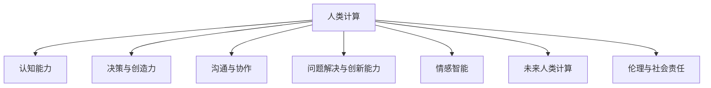

                 

# 人类计算：AI时代的关键人力要素

## 关键词：
AI时代、人类计算、认知能力、决策与创造力、沟通与协作、问题解决与创新能力、情感智能、伦理与社会责任

## 摘要：
在AI技术飞速发展的时代，人类计算作为一种独特的智能形式，正在重新定义劳动力市场与职业发展。本文将探讨人类计算的定义与重要性，分析AI时代对人类计算的影响，并详细解析人类计算的核心要素，如认知能力、决策与创造力、沟通与协作、问题解决与创新能力、情感智能等。此外，还将展望人类计算的未来发展，讨论教育变革，以及AI时代的伦理与社会责任。通过逐步分析推理，本文旨在为读者提供全面深入的理解，帮助其在AI时代更好地应对挑战与机遇。

### 目录大纲：

1. 引言与背景
   1.1 人类计算的定义与重要性
   1.2 AI时代对人类计算的影响
   1.3 人类计算与AI的协同发展

2. AI时代的劳动力市场
   2.1 AI对劳动力市场的影响
   2.2 职业技能的转变
   2.3 人力资本投资与培训

3. 人类计算的核心要素
   3.1 认知能力与AI
   3.2 决策与创造力
   3.3 沟通与协作
   3.4 问题解决与创新能力
   3.5 情感智能与AI

4. 人类计算的未来
   4.1 未来人类计算的展望
   4.2 AI时代的人力资源管理
   4.3 人类计算与可持续发展

5. 人类计算的教育变革
   5.1 教育目标与教育方式的变革
   5.2 AI辅助教育系统的构建
   5.3 个性化学习与终身学习

6. 伦理与社会责任
   6.1 AI时代的伦理挑战
   6.2 人类计算的社会责任
   6.3 人类计算伦理的实践路径

7. 附录
   7.1 AI与人类计算相关工具与资源
   7.2 Mermaid流程图

---

### 引言与背景

在当今这个AI技术突飞猛进的时代，人类计算的重要性日益凸显。人类计算并非指人类在计算机科学中的直接参与，而是指人类在信息处理、决策制定、创新思考等认知活动中所体现的智能形式。这种智能形式是人类与生俱来的，且具有独特的优势，如情感理解、复杂问题解决和创造性思维等。

#### 1.1 人类计算的定义与重要性

**人类计算** 是指人类在信息处理、知识获取、决策制定、问题解决和创造过程中所展现的认知能力。这种计算不仅依赖于逻辑推理和记忆，还涉及情感、直觉、判断和经验等多个方面。

人类计算的重要性体现在以下几个方面：

1. **独特性**：人类计算具有人工智能所不具备的情感理解和创造力，这使得人类在处理复杂问题和进行创新时具有独特优势。
2. **灵活性**：人类计算具有高度的灵活性和适应性，能够快速适应新的环境和情境，从而解决未知的问题。
3. **综合性**：人类计算涉及多个认知领域，如语言、视觉、听觉和空间感知等，这使得人类在处理多模态信息时具有综合性优势。

#### 1.2 AI时代对人类计算的影响

随着AI技术的飞速发展，人类计算正在经历深刻的变化。AI技术不仅提升了人类计算的能力，还改变了人类计算的方式：

1. **增强能力**：AI技术可以帮助人类更快地处理大量数据，提供更精确的预测和分析，从而增强人类计算的能力。
2. **辅助决策**：AI技术可以辅助人类进行复杂决策，通过分析大数据和模拟场景，为人类提供更加全面的决策依据。
3. **替代部分工作**：AI技术在某些领域的应用已经能够替代人类的部分工作，这要求人类需要不断更新自己的技能，以适应新的职业环境。

#### 1.3 人类计算与AI的协同发展

在AI时代，人类计算与AI并不是相互替代的关系，而是相互协同、共同发展的关系：

1. **互补性**：人类计算与AI具有互补性，人类计算擅长处理复杂、不确定的问题，而AI擅长处理结构化、确定性的任务。
2. **合作性**：在许多应用场景中，人类计算与AI可以相互合作，共同完成任务。例如，在医疗诊断中，AI可以通过分析大量病例数据提供诊断建议，而医生则通过经验和直觉进行最终决策。
3. **创新性**：人类计算与AI的结合可以激发创新思维，推动新技术的产生和应用。例如，在艺术创作中，AI可以通过生成创意方案，而人类艺术家则在此基础上进行创新。

通过以上分析，我们可以看出，在AI时代，人类计算不仅具有独特的重要性，而且与AI技术相互协同、共同发展。接下来，我们将进一步探讨AI时代对劳动力市场的影响，以及人类计算在其中的角色。

## AI时代的劳动力市场

随着AI技术的广泛应用，劳动力市场正在经历巨大的变革。AI不仅改变了工作的性质，还对职业需求、技能要求和就业机会产生了深远的影响。在这一部分，我们将详细探讨AI对劳动力市场的影响，职业技能的转变，以及人力资本投资与培训的重要性。

### 2.1 AI对劳动力市场的影响

AI技术的迅速发展对劳动力市场产生了多方面的影响：

1. **自动化与效率提升**：AI技术可以自动化许多重复性和低技能的工作，从而提高生产效率。例如，在制造业中，机器人可以代替人类进行组装和检测，从而减少错误和提高生产速度。
2. **职业替代与创造**：AI技术的发展导致一些传统职业的减少，但同时也在创造新的职业机会。例如，数据科学家、机器学习工程师和AI产品经理等职业需求大幅增加。
3. **技能要求提升**：随着AI技术的普及，劳动力市场对高技能劳动者的需求也在增加。这些高技能劳动者需要具备数据分析、编程和AI应用等相关技能。

#### 案例分析

以医疗行业为例，AI技术的应用正在改变医生的日常工作。AI算法可以通过分析大量病例数据，提供准确的诊断和治疗方案。这不仅提高了医疗诊断的准确性，还减轻了医生的工作负担。然而，这也意味着医疗行业需要更多的数据科学家和AI专家，以开发和维护这些系统。

### 2.2 职业技能的转变

在AI时代，职业技能的转变主要体现在以下几个方面：

1. **技术技能**：随着AI技术的普及，劳动者需要具备一定的编程、数据分析和技术应用技能。例如，掌握Python、R等编程语言，熟悉机器学习和深度学习算法等。
2. **跨学科技能**：AI技术的发展需要跨学科的知识，如计算机科学、统计学、生物学、心理学等。劳动者需要具备跨学科的知识结构，以更好地理解和应用AI技术。
3. **软技能**：尽管技术技能很重要，但软技能如沟通能力、团队合作能力和领导能力等在AI时代同样至关重要。这些技能有助于劳动者在复杂、多变的AI应用环境中取得成功。

#### 案例分析

在金融行业，数据科学家和机器学习工程师需要与业务团队紧密合作，理解业务需求，并将AI技术应用到实际场景中。这要求他们不仅具备技术技能，还需要具备良好的沟通能力和团队合作精神。

### 2.3 人力资本投资与培训

在AI时代，人力资本投资与培训的重要性愈加凸显。以下是一些关键点：

1. **终身学习**：AI技术更新迅速，劳动者需要具备终身学习的能力，不断更新自己的知识和技能。
2. **职业培训**：企业和教育机构应提供定期的职业培训，帮助劳动者掌握最新的AI技术和应用。
3. **技能认证**：技能认证可以帮助劳动者证明自己的能力，提高其在劳动力市场的竞争力。
4. **个性化学习**：通过个性化学习计划，可以根据劳动者的需求和兴趣，提供定制化的培训内容。

#### 案例分析

在制造业，一些企业通过实施员工培训计划，帮助员工掌握AI相关的技能，如机器视觉和自动化控制。这不仅提高了员工的工作效率，也增强了企业的竞争力。

通过以上分析，我们可以看出，AI时代对劳动力市场产生了深远的影响。劳动者需要适应这些变化，通过终身学习和职业培训，不断提升自己的技能和竞争力。同时，企业和教育机构也需要提供相应的支持和资源，以帮助劳动者在AI时代取得成功。

### 人类计算的核心要素

在AI技术飞速发展的背景下，人类计算作为一种独特的智能形式，正在重新定义劳动力市场和职业发展。人类计算的核心要素包括认知能力、决策与创造力、沟通与协作、问题解决与创新能力、情感智能等。下面我们将逐一探讨这些核心要素及其在AI时代的重要性。

#### 3.1 认知能力与AI

认知能力是人类在感知、理解、记忆和思考等过程中所展现的能力。在AI时代，认知能力与AI技术密切相关，二者相辅相成。

1. **概念与联系**：
   - **认知能力**：指人类在感知、理解、记忆和思考等方面的能力，包括感知能力、注意力、理解力、记忆力、逻辑推理等。
   - **AI**：指人工智能，通过模拟人类智能的算法和技术，实现机器在感知、理解、学习和决策等方面的自动化。

2. **互补性**：
   - **AI的优势**：AI擅长处理大量数据，具有强大的计算能力和模式识别能力，可以快速分析复杂的信息。
   - **认知能力的优势**：人类具有情感理解、直觉判断、创造性思维和适应能力，能够在复杂、不确定的环境中做出决策。

3. **认知增强技术**：
   - **人机交互**：通过人机交互技术，如虚拟现实、增强现实和语音识别等，AI可以更好地理解人类意图，实现更自然的人机协作。
   - **认知增强工具**：如智能助手、决策支持系统等，可以辅助人类进行信息处理和决策制定，提高工作效率。

#### 3.2 决策与创造力

决策与创造力是人类计算的重要组成部分，它们在AI时代同样具有重要价值。

1. **决策过程分析**：
   - **决策过程**：决策过程包括问题识别、信息收集、方案评估、决策选择和决策执行等步骤。
   - **决策类型**：包括程序性决策（基于惯例和规则）和非程序性决策（基于创新和判断）。

2. **AI辅助决策系统**：
   - **自动化决策**：AI可以通过自动化决策系统，处理大量的程序性决策，提高决策效率。
   - **智能化决策**：AI可以通过分析大数据和模拟场景，提供更加全面的决策支持，帮助人类进行复杂决策。

3. **创造力的培养与激发**：
   - **创造性思维**：通过联想、发散、重组和反思等创造性思维方法，培养创造性思维。
   - **创新实践**：通过实际项目和挑战，激发创造力，推动创新实践。

#### 3.3 沟通与协作

在AI时代，沟通与协作仍然是人类计算的核心要素之一。

1. **人际沟通的重要性**：
   - **沟通障碍**：在多文化、多背景的工作环境中，沟通障碍常常导致误解和冲突。
   - **有效沟通**：通过清晰、准确、及时和尊重的沟通方式，可以减少误解，提高团队协作效率。

2. **AI在沟通中的应用**：
   - **语音识别与合成**：通过语音识别和合成技术，可以实现语音与文本之间的转换，提高沟通效率。
   - **智能客服与沟通助手**：通过AI技术，可以提供智能客服和沟通助手，解决常见问题和提供个性化服务。

3. **协作与团队效率**：
   - **协作工具**：通过协作工具，如项目管理软件、即时通讯工具和虚拟会议室等，可以实现远程协作，提高团队效率。
   - **团队文化**：建立积极的团队文化和协作氛围，促进团队成员之间的沟通与协作。

#### 3.4 问题解决与创新能力

问题解决与创新能力是推动社会进步和个人成长的关键要素。

1. **问题解决的框架与方法**：
   - **问题定义**：明确问题的本质和范围，制定问题解决方案的目标。
   - **信息收集**：收集与问题相关的信息，为问题解决提供依据。
   - **方案评估**：评估不同解决方案的可行性、成本和效果，选择最佳方案。
   - **实施与反馈**：实施问题解决方案，并根据反馈进行调整和优化。

2. **AI与问题解决的结合**：
   - **数据驱动的解决方案**：通过大数据分析，AI可以帮助识别问题、分析原因，并提出数据驱动的解决方案。
   - **模拟与预测**：通过模拟和预测技术，AI可以帮助预测问题的可能影响，为问题解决提供参考。

3. **创新思维与创新实践**：
   - **创新思维**：通过联想、发散、重组和反思等创新思维方法，激发创新灵感。
   - **创新实践**：通过实际项目和挑战，将创新思维转化为实际成果，推动社会进步。

#### 3.5 情感智能与AI

情感智能是指人类在情感识别、理解和管理等方面展现的能力。在AI时代，情感智能与AI技术的结合具有重要意义。

1. **情感智能概述**：
   - **情感识别**：通过面部表情、语言和身体动作等，识别他人的情感状态。
   - **情感理解**：通过情感识别，理解他人的情感状态和情感需求。
   - **情感管理**：通过情感理解，管理自己的情感状态，以更好地与他人沟通和协作。

2. **AI在情感智能领域的应用**：
   - **情感识别与合成**：通过AI技术，可以实现情感识别与合成，提高人机交互的自然性和情感化。
   - **情感分析**：通过AI技术，可以分析文本、语音和视频中的情感信息，为情感智能应用提供数据支持。
   - **情感支持系统**：通过AI技术，可以开发情感支持系统，如智能聊天机器人、情感诊断工具等，为用户提供情感支持和帮助。

3. **情感管理与情商提升**：
   - **情感管理技巧**：通过心理训练和情感管理技巧，提高个体的情感管理能力，如情绪调节、压力管理和情感沟通等。
   - **情商培养**：通过教育和社会实践，培养个体的情商，提高其在社会和职业环境中的适应能力和人际交往能力。

通过以上对人类计算核心要素的探讨，我们可以看到，在AI时代，人类计算不仅具有重要的理论价值，还具有广泛的应用前景。人类计算与AI技术的协同发展，将为社会进步和个人成长带来新的机遇和挑战。接下来，我们将进一步探讨人类计算的未来发展趋势和潜在影响。

### 未来人类计算的展望

随着AI技术的不断进步，人类计算的未来将充满无限可能。在这一部分，我们将探讨未来人类计算的发展趋势，AI时代的人力资源管理，以及人类计算在推动可持续发展中的作用。

#### 4.1 未来人类计算的发展趋势

1. **智能化水平的提升**：随着AI技术的发展，人类计算将越来越智能化。通过深度学习、自然语言处理和计算机视觉等技术，人类计算将能够更高效地处理复杂任务，实现更高水平的自动化和智能化。

2. **跨领域的融合**：未来人类计算将不仅限于计算机科学领域，还将与其他领域如生物医学、社会科学和艺术等深度融合。这种跨领域的融合将促进人类计算在更多领域中的应用和创新。

3. **个性化与定制化**：未来的计算技术将更加注重个性化与定制化。通过分析大量的个人数据，AI将能够为每个人提供量身定制的计算解决方案，从而提高工作效率和生活质量。

4. **人机协同**：未来的计算环境将更加注重人机协同。人类计算与AI将更加紧密地结合，形成人机协同的工作模式，实现更高效的决策和问题解决。

#### 4.2 AI时代的人力资源管理

1. **技能需求的转变**：随着AI技术的发展，人力资源管理的重点将从传统的劳动力管理转向技能管理和人才发展。企业需要关注员工的技能提升和持续学习，以确保其在AI时代的竞争力。

2. **招聘与选拔**：AI技术将帮助企业在招聘和选拔过程中更加精准地评估候选人的技能和潜力。通过大数据分析和人工智能算法，企业可以更有效地识别和吸引合适的人才。

3. **培训与发展**：为了应对AI时代的变化，企业需要建立全面的培训与发展体系。通过提供定期的职业培训和学习机会，企业可以不断提升员工的技能和知识，以适应不断变化的职场环境。

4. **绩效管理**：AI技术将提升绩效管理的效率和准确性。通过数据分析和智能算法，企业可以更客观地评估员工的表现，并提供个性化的反馈和改进建议。

#### 4.3 人类计算与可持续发展

1. **环境保护**：人类计算在环境保护方面具有巨大潜力。通过AI技术，可以实现对环境数据的实时监测和分析，从而制定更有效的环境保护措施。例如，AI可以预测自然灾害的发生，提供预警和应急响应方案。

2. **资源优化**：人类计算可以帮助优化资源利用，提高资源利用效率。例如，在能源管理方面，AI可以预测能源需求，优化能源分配，降低能源消耗。

3. **社会公平**：人类计算在促进社会公平方面也有重要作用。通过数据分析和智能算法，可以识别社会不平等问题，并提出解决方案。例如，AI可以帮助优化教育资源配置，提高教育公平性。

4. **经济发展**：人类计算可以推动经济结构的优化和升级。通过大数据分析和智能决策，可以为企业提供精准的市场分析和预测，从而优化业务策略，提高经济效益。

通过以上分析，我们可以看到，未来人类计算将迎来前所未有的发展机遇。随着AI技术的不断进步，人类计算将在更多领域发挥重要作用，推动社会进步和可持续发展。然而，这同时也要求人类不断适应变化，提升自身的计算能力，以在AI时代中取得成功。

### 人类计算的教育变革

在AI技术飞速发展的背景下，教育体系正面临着深刻的变革。教育目标、教育方式的变革，以及AI辅助教育系统的构建，都成为教育领域的重要议题。此外，个性化学习和终身学习也将成为未来教育的重要趋势。

#### 9.1 教育目标与教育方式的变革

1. **教育目标的多元化**：
   - **知识传授**：传统的教育目标主要是传授基础知识，如数学、物理和文学等。
   - **技能培养**：在AI时代，教育目标需要扩展到技能培养，如编程、数据分析、人工智能应用等。
   - **创新能力**：教育目标还需要关注创新能力的培养，鼓励学生进行创造性思考和问题解决。

2. **教育方式的变革**：
   - **在线教育**：随着互联网技术的发展，在线教育成为教育方式变革的重要趋势。通过在线课程和虚拟课堂，学生可以随时随地学习，打破地域和时间的限制。
   - **项目式学习**：项目式学习鼓励学生在真实场景中解决问题，培养其实际操作能力和团队合作精神。
   - **混合式学习**：混合式学习将传统课堂教学与在线学习相结合，充分发挥两者的优势，提高教学效果。

#### 9.2 AI辅助教育系统的构建

1. **智能教学系统**：
   - **个性化教学**：AI可以根据学生的学习数据和习惯，提供个性化的教学内容和进度，帮助学生更好地掌握知识。
   - **自适应学习**：AI可以实时分析学生的学习情况，自动调整教学策略，提高教学效果。

2. **智能评估系统**：
   - **自动评分与反馈**：AI可以自动评估学生的作业和考试，提供即时反馈，帮助学生了解自己的学习情况。
   - **智能推荐**：AI可以根据学生的学习数据，推荐适合的学习资源和课程，提高学习效率。

3. **虚拟实验室**：
   - **虚拟实验**：通过虚拟现实技术，学生可以在虚拟环境中进行实验，提高实验操作能力。
   - **模拟学习**：AI可以模拟各种学习场景，帮助学生进行实践操作，提高实际问题解决能力。

#### 9.3 个性化学习与终身学习

1. **个性化学习**：
   - **学习路径**：通过AI技术，可以为学生量身定制学习路径，满足其个性化需求。
   - **学习资源**：AI可以根据学生的学习进度和兴趣，推荐适合的学习资源，提高学习效果。

2. **终身学习**：
   - **职业发展**：随着职场技能要求的不断提升，终身学习成为职业发展的必要条件。
   - **知识更新**：AI技术更新迅速，终身学习有助于个体不断更新知识和技能，适应科技发展。

3. **学习平台**：
   - **在线平台**：通过在线学习平台，个体可以随时随地进行学习，实现终身学习。
   - **社区互动**：在线学习平台还可以提供社区互动功能，促进学习者之间的交流和合作。

通过以上分析，我们可以看到，AI技术在教育领域的应用正在深刻改变教育目标、教育方式和教育系统。教育机构需要不断适应这些变革，借助AI技术提供个性化、高效的教育服务，以培养具有创新能力、实践能力和适应能力的新时代人才。

### 伦理与社会责任

随着AI技术的迅猛发展，人类计算面临着诸多伦理与社会责任挑战。如何在AI时代确保技术伦理，保障数据隐私，以及应对社会不平等，成为亟待解决的问题。在这一部分，我们将探讨AI时代的伦理挑战、人类计算的社会责任，以及人类计算伦理的实践路径。

#### 10.1 AI时代的伦理挑战

1. **算法偏见与歧视**：
   - **算法偏见**：AI算法可能基于历史数据中的偏见，导致决策结果不公平。例如，招聘系统可能基于性别、种族或年龄等特征进行筛选，导致某些群体被不公正对待。
   - **歧视**：AI算法的偏见可能导致歧视现象加剧，影响就业、教育、医疗等领域。

2. **数据隐私保护**：
   - **数据收集**：AI技术需要大量数据来训练模型，这涉及到个人隐私数据的收集和使用问题。
   - **数据泄露**：未经授权的数据访问和泄露可能导致个人隐私受到侵害，甚至引发严重的安全事件。

3. **责任归属**：
   - **责任分配**：在AI系统的应用过程中，当出现错误或事故时，如何确定责任归属成为一个难题。例如，自动驾驶汽车发生事故，是责任归咎于开发者、制造商还是操作者？

#### 10.2 人类计算的社会责任

1. **公平与正义**：
   - **公平**：人类计算应致力于消除算法偏见，确保技术公平地服务于所有人群，避免加剧社会不平等。
   - **正义**：人类计算应在技术开发和应用过程中，坚持正义原则，确保技术的积极影响最大化。

2. **隐私保护**：
   - **隐私权**：人类计算应尊重和保护个人隐私权，确保在数据收集、存储和使用过程中，个人隐私不被侵犯。
   - **透明性**：人类计算应提高算法和数据处理过程的透明性，让用户了解自己的数据如何被使用。

3. **社会责任**：
   - **教育普及**：人类计算应积极参与教育普及，帮助公众了解AI技术的优势和风险，提升其数字素养。
   - **社会参与**：人类计算应积极参与社会事务，通过技术手段解决社会问题，如贫困、医疗和教育不平等等。

#### 10.3 人类计算伦理的实践路径

1. **制定伦理规范**：
   - **伦理准则**：制定AI伦理准则，明确技术开发和应用中的伦理要求和责任。
   - **监管机制**：建立健全的监管机制，确保AI技术符合伦理标准和法律法规。

2. **教育培训**：
   - **伦理教育**：在人工智能相关课程中，加强伦理教育，培养具备伦理意识的技术人才。
   - **职业道德**：加强职业道德教育，提高技术人员的社会责任感。

3. **公共参与**：
   - **公众咨询**：在AI技术开发和应用过程中，广泛征求公众意见，确保技术符合社会需求和价值观。
   - **透明沟通**：与公众保持透明沟通，及时回应社会关切，增强公众对AI技术的信任。

通过以上措施，人类计算可以在AI时代更好地应对伦理挑战，承担社会责任，推动技术与社会和谐发展。这既是对技术发展负责，也是对人类社会负责。

### 附录

#### 7.1 AI与人类计算相关工具与资源

1. **常用AI工具介绍**：
   - **TensorFlow**：一款开源机器学习框架，广泛用于深度学习和人工智能开发。
   - **PyTorch**：一款开源机器学习库，适用于动态神经网络设计和研究。
   - **Scikit-learn**：一款Python库，提供多种机器学习算法和工具。

2. **人类计算相关数据库与平台**：
   - **Kaggle**：一个数据科学社区和比赛平台，提供大量数据集和竞赛。
   - **Google Dataset Search**：一个搜索数据库，提供各类公开数据集。

3. **在线课程与资源推荐**：
   - **Coursera**：提供大量AI和机器学习相关课程。
   - **edX**：提供由知名大学和机构提供的免费在线课程。

#### 7.2 Mermaid流程图

以下是一个用于展示人类计算核心要素的Mermaid流程图：

通过这些工具与资源，读者可以更深入地了解AI与人类计算的相关知识，并在此基础上进行实践和探索。

### 作者信息

作者：AI天才研究院/AI Genius Institute & 禅与计算机程序设计艺术 /Zen And The Art of Computer Programming

通过本文的详细探讨，我们可以看到人类计算在AI时代的重要性和独特价值。人类计算不仅与AI技术相互补充，共同推动社会进步，还面临着诸多伦理和社会责任挑战。在未来的发展中，我们需要关注人类计算的核心要素，如认知能力、决策与创造力、沟通与协作等，并不断适应技术变革，提升自身的计算能力。

随着AI技术的不断进步，人类计算将迎来更多的机遇和挑战。希望本文能够为读者提供有益的启示，帮助其在AI时代更好地应对变化，实现个人和社会的可持续发展。未来，让我们共同期待人类计算与AI技术携手前行，共创美好未来。

