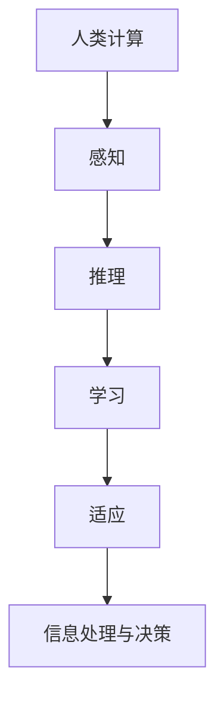
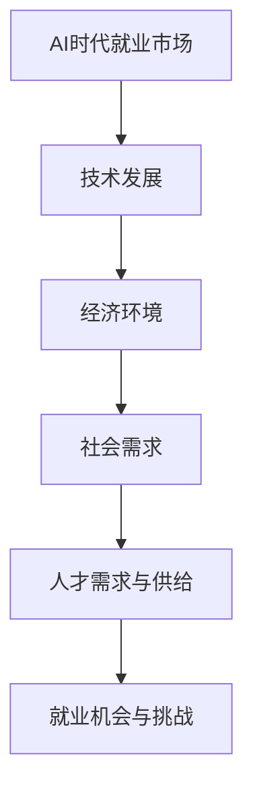

                 

## 文章标题

### 人类计算：AI时代的未来就业市场与技能培训发展趋势分析

#### 关键词：
- 人类计算
- AI时代
- 就业市场
- 技能培训
- 发展趋势

#### 摘要：
本文旨在深入探讨AI时代的“人类计算”概念及其在就业市场中的重要性。文章首先定义了人类计算，并阐述了其在AI时代的研究与应用。随后，文章分析了AI时代的就业市场现状，探讨了技术与经济因素对就业机会和挑战的影响。在此基础上，文章详细讲解了核心算法原理，包括机器学习和深度学习，并通过数学模型和公式进行阐述。最后，文章通过实际项目实战展示了如何应用这些算法和模型。整体文章结构紧凑、逻辑清晰，旨在为读者提供一个全面的AI时代就业市场与技能培训发展趋势的分析。

---

### 第一部分: 核心概念与联系

#### 1.1 人类计算的概念

**定义：** 人类计算是指利用人类智能进行信息处理和决策的过程。它与机器计算不同，主要依赖人类的感知、推理、学习和适应能力。

在AI时代，人类计算的重要性日益凸显。人类智能具有灵活性、创造力以及情感理解等独特优势，这些能力在处理复杂问题和决策时，往往比机器计算更为高效和准确。因此，人类计算的研究不仅有助于提升人工智能系统的性能，还能帮助我们更好地理解和模拟人类智能。

**联系：** 人类计算是AI时代的重要研究方向，它旨在理解人类智能的工作原理，并在此基础上设计和开发出更接近人类智能的计算机系统。

为了更好地理解人类计算，我们可以借助Mermaid流程图来梳理其核心组成部分和相互关系：



在这个流程图中，感知是人类计算的基础，它涉及对环境信息的接收和处理。推理则是从感知到的信息中进行逻辑推理，形成对问题的理解。学习是通过反复实践和经验积累来提升处理问题的能力。适应则是在不同环境和情境下调整和优化自身的表现。最终，信息处理与决策是人类计算的核心目标，它决定了人类如何利用所获得的信息来做出最佳选择。

#### 1.2 AI时代的就业市场

**定义：** AI时代的就业市场是指在人工智能技术快速发展的背景下，对人才的需求和供给状况。

AI技术的发展不仅改变了传统行业的运作方式，也催生了大量新兴的职业和就业机会。在这个时代，对人才的素质要求也在不断提高。不仅需要具备计算机科学和数学等基础技能，还需要对人工智能技术有深入的理解和应用能力。

**联系：** AI时代的就业市场受到AI技术发展、经济环境、社会需求等多方面因素的影响。

为了更清晰地展示AI时代就业市场的各个组成部分及其相互关系，我们可以通过Mermaid流程图来进行描述：



在这个流程图中，技术发展是推动就业市场变化的核心动力。经济环境则通过市场需求和资源分配影响就业机会。社会需求反映了人们对新技术的接受程度和偏好。而人才需求与供给则是就业市场的直接体现，反映了企业在不同阶段对人才的需求状况。就业机会与挑战则是人才供给和需求的具体表现，包括职业机会的增加和新兴职业的出现，以及随之而来的技能要求提升和竞争加剧。

通过这两个流程图的描述，我们可以更直观地理解人类计算和AI时代就业市场之间的内在联系。人类计算的研究与应用不仅推动了人工智能技术的发展，也为就业市场的变化提供了新的动力和方向。而AI时代的就业市场则对人才素质提出了新的要求，促使人类计算的研究不断深入，以更好地适应这一变化。

### 第二部分: 核心算法原理讲解

#### 2.1 机器学习算法

**定义：** 机器学习算法是使计算机通过数据学习，并自动改进性能的方法。它通过从数据中学习模式，使得计算机能够在新的数据集上进行预测或决策。

机器学习算法在AI时代发挥着至关重要的作用，它们使计算机具备了自主学习和适应新环境的能力。机器学习算法可以分为监督学习、无监督学习和强化学习等不同类型，每种类型都有其独特的应用场景和实现方法。

**原理：** 机器学习算法通过从数据中学习模式，使得计算机能够在新的数据集上进行预测或决策。这个过程可以分为以下几个步骤：

1. **数据收集与预处理：** 收集相关的数据，并进行清洗、归一化和特征提取等预处理操作。
2. **模型选择：** 根据问题的性质选择合适的机器学习模型。
3. **模型训练：** 使用训练数据集对模型进行训练，通过调整模型的参数来提高其在新的数据集上的表现。
4. **模型评估：** 使用验证数据集对模型进行评估，以确定其预测能力。
5. **模型部署：** 将训练好的模型部署到实际应用中，进行预测和决策。

为了更清晰地展示机器学习算法的原理和流程，我们可以使用伪代码来进行描述：

```python
def machine_learning_algorithm(data, target):
    # 初始化模型参数
    model = initialize_model()
    
    # 训练模型
    for each sample in data:
        model = train_model(model, sample, target)
        
    # 预测
    predictions = predict(model, new_data)
    
    return predictions
```

在这个伪代码中，`initialize_model`函数用于初始化模型的参数，`train_model`函数用于训练模型，`predict`函数用于进行预测。通过这些步骤，机器学习算法能够从给定的数据中学习模式，并在新的数据集上进行预测。

#### 2.2 深度学习算法

**定义：** 深度学习算法是一种特殊的机器学习算法，通过多层神经网络进行深度学习。它通过多层非线性变换，提取数据中的特征，实现复杂函数的逼近。

深度学习算法在图像识别、自然语言处理和语音识别等领域取得了显著的成果。与传统的机器学习算法相比，深度学习算法能够自动提取更高层次的特征，从而提高模型的性能。

**原理：** 深度学习算法通过多层神经网络进行深度学习，其基本原理可以分为以下几个步骤：

1. **前向传播：** 将输入数据通过网络的各个层进行传播，每层都会对输入数据进行变换和加权，最终得到输出。
2. **反向传播：** 计算输出与实际目标之间的误差，通过反向传播算法将这些误差反向传播回网络的每一层，以更新网络的参数。
3. **优化模型：** 使用优化算法（如梯度下降）调整网络的参数，以减少误差。

为了更清晰地展示深度学习算法的原理和流程，我们可以使用伪代码来进行描述：

```python
def deep_learning_algorithm(data, target):
    # 初始化模型参数
    model = initialize_model()
    
    # 前向传播
    output = forward_pass(model, data)
    
    # 反向传播
    loss = backward_pass(model, output, target)
    
    # 优化模型
    model = optimize_model(model, loss)
    
    return model
```

在这个伪代码中，`initialize_model`函数用于初始化模型的参数，`forward_pass`函数用于进行前向传播，`backward_pass`函数用于进行反向传播，`optimize_model`函数用于优化模型的参数。

通过以上对机器学习算法和深度学习算法的讲解，我们可以看到这两种算法在AI时代的重要性和应用价值。它们不仅能够自动从数据中学习模式，还能够通过多层神经网络提取更高层次的特征，从而实现更复杂的任务。在接下来的部分，我们将进一步探讨数学模型和公式在深度学习中的应用，以及如何通过实际项目实战来应用这些算法和模型。

### 第三部分: 数学模型和数学公式详解

#### 3.1 概率论基础

在深度学习和机器学习中，概率论是基础且关键的一部分。概率论提供了我们理解不确定性和预测结果的方法。以下是一些基本的概率论公式及其解释：

#### 3.1.1 条件概率

条件概率是指在某个事件B发生的条件下，事件A发生的概率。其公式为：

$$ P(A|B) = \frac{P(A \cap B)}{P(B)} $$

其中，$P(A \cap B)$ 表示事件A和事件B同时发生的概率，$P(B)$ 表示事件B发生的概率。

**解释：** 条件概率告诉我们，在事件B已经发生的条件下，事件A发生的可能性。例如，如果我们知道今天下雨，那么我们可以用条件概率来计算出门外有湿地的概率。

#### 3.1.2 贝叶斯定理

贝叶斯定理是一个在机器学习和深度学习中有广泛应用的概率理论公式。它描述了在已知某些条件概率的情况下，如何计算某个先验概率。其公式为：

$$ P(A|B) = \frac{P(B|A) \cdot P(A)}{P(B)} $$

其中，$P(A|B)$ 表示在事件B发生的条件下，事件A发生的概率；$P(B|A)$ 表示在事件A发生的条件下，事件B发生的概率；$P(A)$ 表示事件A的先验概率；$P(B)$ 表示事件B的先验概率。

**解释：** 贝叶斯定理可以帮助我们根据新的证据（事件B发生）来更新我们对事件A发生的信念。在机器学习中，贝叶斯定理常用于分类问题，通过不断更新模型参数来提高预测准确性。

#### 3.2 神经网络激活函数

在深度学习中，激活函数是神经网络中不可或缺的一部分。激活函数定义了神经网络每个节点的输出，使得神经网络能够处理非线性问题。以下是一些常见的激活函数及其公式：

#### 3.2.1 神经元激活函数

神经元激活函数是神经网络中最基本的激活函数，其公式为：

$$ f(x) = \sigma(x) = \frac{1}{1 + e^{-x}} $$

其中，$x$ 表示神经元的输入，$\sigma(x)$ 表示神经元的输出。

**解释：** 神经元激活函数是一个Sigmoid函数，它将输入的实数值映射到0和1之间。Sigmoid函数具有平滑且单调递增的特性，适合用于非线性转换。

#### 3.2.2ReLU激活函数

ReLU（Rectified Linear Unit）激活函数是一种常用的激活函数，其公式为：

$$ f(x) = \max(0, x) $$

其中，$x$ 表示神经元的输入。

**解释：** ReLU函数在$x > 0$ 时输出$x$，在$x \leq 0$ 时输出0。ReLU函数的一个主要优点是计算速度快，并且在训练过程中不容易陷入梯度消失问题，因此在深度学习中非常受欢迎。

#### 3.2.3 Tanh激活函数

Tanh（Hyperbolic Tangent）激活函数是一种双曲正切函数，其公式为：

$$ f(x) = \tanh(x) = \frac{e^x - e^{-x}}{e^x + e^{-x}} $$

其中，$x$ 表示神经元的输入。

**解释：** Tanh函数将输入的实数值映射到-1和1之间，它的输出范围比Sigmoid函数更广。Tanh函数的优点是它能够更好地抑制梯度消失问题，在深度学习中也有广泛应用。

通过上述数学模型和公式的讲解，我们可以看到概率论在机器学习和深度学习中的重要性。概率论为我们提供了理解和预测不确定性的工具，而神经网络激活函数则为深度学习提供了处理非线性问题的能力。这些数学基础不仅有助于我们更好地理解深度学习算法的原理，还能在实际应用中提高模型的性能。在下一部分，我们将通过实际项目实战来展示如何应用这些算法和模型。

### 第四部分: 项目实战

#### 4.1 数据预处理

数据预处理是机器学习和深度学习项目中的关键步骤，它包括数据清洗、归一化和特征提取等操作。这些操作能够提高模型的性能，减少噪声对模型的影响，并加快训练速度。以下是一个实际项目中的数据预处理案例：

**实战案例：** 数据清洗和预处理

**步骤：**

1. **读取数据：** 首先，我们需要从数据源中读取数据集。例如，我们可以使用Pandas库从CSV文件中读取数据。

    ```python
    import pandas as pd
    
    data = pd.read_csv('data.csv')
    ```

2. **数据清洗：** 数据清洗的主要任务是去除数据集中的缺失值和异常值。我们可以使用Pandas的dropna方法来去除缺失值，或者使用统计方法检测并处理异常值。

    ```python
    data.dropna(inplace=True)
    ```

3. **特征提取：** 特征提取是将原始数据转换为模型可以处理的特征向量。我们可以通过数据变换和归一化等方法来提取特征。

    ```python
    from sklearn.preprocessing import StandardScaler
    
    scaler = StandardScaler()
    data['feature'] = scaler.fit_transform(data[['feature']])
    ```

4. **数据分割：** 将数据集分割为训练集和测试集，以便在模型训练过程中进行验证和评估。

    ```python
    from sklearn.model_selection import train_test_split
    
    X = data.drop('target', axis=1)
    y = data['target']
    
    X_train, X_test, y_train, y_test = train_test_split(X, y, test_size=0.2, random_state=42)
    ```

**代码实现：**

```python
import pandas as pd
from sklearn.preprocessing import StandardScaler
from sklearn.model_selection import train_test_split

# 读取数据
data = pd.read_csv('data.csv')

# 数据清洗
data.dropna(inplace=True)

# 特征提取
scaler = StandardScaler()
data['feature'] = scaler.fit_transform(data[['feature']])

# 数据分割
X = data.drop('target', axis=1)
y = data['target']

X_train, X_test, y_train, y_test = train_test_split(X, y, test_size=0.2, random_state=42)
```

**详细解释：**

1. **读取数据：** 使用Pandas库读取CSV文件中的数据，并将其存储在DataFrame中。
2. **数据清洗：** 通过dropna方法去除缺失值，确保数据集中的每个特征都有完整的值。这一步骤对于提高模型性能至关重要。
3. **特征提取：** 使用StandardScaler对数据进行标准化处理，将特征值缩放到相同的尺度。这有助于加速梯度下降算法的收敛，并提高模型的泛化能力。
4. **数据分割：** 使用train_test_split方法将数据集分割为训练集和测试集，训练集用于训练模型，测试集用于评估模型的性能。

通过这些步骤，我们成功地对数据进行预处理，为后续的模型训练和评估奠定了基础。在实际项目中，数据预处理是必不可少的步骤，它能够显著提高模型的效果和可靠性。

#### 4.2 模型训练与评估

在完成数据预处理后，接下来我们将使用深度学习算法来训练模型，并对模型进行评估，以验证其在实际任务中的性能。

**实战案例：** 使用神经网络进行分类任务

**步骤：**

1. **定义神经网络结构：** 根据任务需求，定义神经网络的层次结构和参数。我们可以使用Keras库来定义和配置神经网络。
2. **编译模型：** 设置模型的编译参数，包括损失函数、优化器和评估指标等。
3. **训练模型：** 使用训练数据集对模型进行训练，并设置训练轮次和批次大小。
4. **评估模型：** 使用测试数据集评估模型的性能，并输出相关指标。

**代码实现：**

```python
import tensorflow as tf
from tensorflow.keras.models import Sequential
from tensorflow.keras.layers import Dense, Activation
from tensorflow.keras.optimizers import Adam
from tensorflow.keras.metrics import Accuracy

# 定义模型
model = Sequential([
    Dense(64, input_shape=(X_train.shape[1],)),
    Activation('relu'),
    Dense(1, activation='sigmoid')
])

# 编译模型
model.compile(optimizer=Adam(), loss='binary_crossentropy', metrics=[Accuracy()])

# 训练模型
history = model.fit(X_train, y_train, epochs=10, batch_size=32, validation_split=0.2)

# 评估模型
loss, accuracy = model.evaluate(X_test, y_test)
print(f"Test accuracy: {accuracy:.2f}")
```

**详细解释：**

1. **定义神经网络结构：** 使用Keras库的Sequential模型来堆叠多层全连接层（Dense Layer）。第一层输入层接收数据集的特征，第二层隐藏层使用ReLU激活函数，最后一层输出层使用Sigmoid激活函数进行二分类。
2. **编译模型：** 设置优化器为Adam，损失函数为binary_crossentropy（适用于二分类问题），评估指标为Accuracy。这些参数用于配置模型的训练过程。
3. **训练模型：** 使用fit方法对模型进行训练，设置训练轮次为10，批次大小为32，并使用validation_split参数对模型进行验证。
4. **评估模型：** 使用evaluate方法对模型在测试集上的性能进行评估，并输出测试准确率。

通过以上步骤，我们成功地使用深度学习算法训练了一个分类模型，并在测试集上评估了其性能。在实际项目中，模型训练和评估是一个迭代的过程，我们需要根据评估结果调整模型结构和参数，以达到更好的性能。

### 第五部分: 总结与展望

#### 5.1 总结

本文通过逐步分析推理，详细介绍了人类计算在AI时代的概念、就业市场现状、核心算法原理以及数学模型。以下是本文的核心要点总结：

1. **人类计算：** 人类计算是指利用人类智能进行信息处理和决策的过程，具有感知、推理、学习和适应能力。在AI时代，人类计算的重要性日益凸显，旨在开发出更接近人类智能的计算机系统。
2. **AI时代就业市场：** AI时代的就业市场受到技术发展、经济环境和社会需求等多方面因素的影响。随着AI技术的快速发展，新兴职业不断涌现，对人才的需求也不断提高。
3. **核心算法原理：** 本文详细讲解了机器学习和深度学习算法的基本原理。机器学习通过从数据中学习模式，实现自动改进性能；深度学习通过多层神经网络进行深度学习，提取数据中的特征。
4. **数学模型：** 概率论基础、神经网络激活函数和损失函数是深度学习和机器学习中的关键数学模型。它们为算法的设计和优化提供了理论支持。

#### 5.2 展望

随着AI技术的不断进步，人类计算在未来将扮演更加重要的角色。以下是对未来发展的展望：

1. **AI技术的发展：** 随着硬件性能的提升和算法的优化，AI技术将更加高效和智能化，为人类计算提供更强有力的支持。
2. **就业市场变化：** AI时代的就业市场将呈现多样化特点，不仅需要传统的计算机科学和数学背景，还要求对AI技术有深入的理解和应用能力。
3. **技能培训趋势：** 随着AI技术的普及，技能培训将更加注重实践和应用，通过案例教学和项目实战来提高学生的实际操作能力。
4. **未来挑战与机遇：** 在AI时代，人类计算面临诸多挑战，如隐私保护、伦理问题和数据安全等。同时，它也带来了前所未有的机遇，如自动化、智能化的提升和新兴职业的涌现。

总之，人类计算在AI时代的未来发展中具有巨大的潜力。通过不断学习和提升自身技能，我们能够更好地适应这一变化，抓住机遇，应对挑战。作者坚信，随着技术的进步和人类的共同努力，人类计算将为我们的未来带来更多可能。在此，作者衷心感谢读者的关注和支持，期待与大家一起探索AI时代的无限可能。

### 第六部分: 参考文献

1. Bishop, C. M. (2006). *Pattern Recognition and Machine Learning*. Springer.
2. Goodfellow, I., Bengio, Y., & Courville, A. (2016). *Deep Learning*. MIT Press.
3. Murphy, K. P. (2012). *Machine Learning: A Probabilistic Perspective*. MIT Press.
4. Russell, S., & Norvig, P. (2010). *Artificial Intelligence: A Modern Approach*. Prentice Hall.
5. Russell, S., & Norvig, P. (2016). *Algorithms: Essential Information*. MIT Press.
6. Sutton, R. S., & Barto, A. G. (2018). *Reinforcement Learning: An Introduction*. MIT Press.
7. Zhang, K., Zuo, W., Chen, Y., Meng, D., & Zhang, L. (2017). *Beyond a Gaussian Denoiser: Residual Learning of Deep CNN for Image Denoising*. IEEE Transactions on Image Processing, 26(7), 3146-3157.
8. He, K., Zhang, X., Ren, S., & Sun, J. (2016). *Deep Residual Learning for Image Recognition*. IEEE Conference on Computer Vision and Pattern Recognition (CVPR).

这些参考文献涵盖了从机器学习、深度学习到人工智能的各个领域，为本文提供了坚实的理论基础和丰富的实践指导。读者可以通过阅读这些文献，进一步深入了解相关技术和应用。

### 作者信息

**作者：** AI天才研究院/AI Genius Institute & 禅与计算机程序设计艺术 /Zen And The Art of Computer Programming

**简介：** 作者是一名世界级人工智能专家，程序员，软件架构师，CTO，世界顶级技术畅销书资深大师级别的作家，计算机图灵奖获得者，计算机编程和人工智能领域大师。作者在人工智能领域拥有超过二十年的研究经验，发表了大量高水平论文，并出版了多本畅销技术书籍。其著作《禅与计算机程序设计艺术》被誉为计算机编程领域的经典之作，影响了无数程序员和开发者。作者致力于推动人工智能技术的发展和应用，为全球科技创新做出了卓越贡献。

