                 

# 文章标题：人类计算：AI时代的未来工作技能

> 关键词：人工智能，未来工作，技能需求，职业规划，AI伦理

> 摘要：本文深入探讨了AI时代对工作的影响以及人类计算在其中的重要性。文章首先介绍了AI技术的发展与现状，然后分析了AI对工作的改变与挑战，提出了未来工作的技能需求。接着，文章详细介绍了AI核心概念与原理，以及AI技能的培养与应用。随后，文章探讨了沟通与协作、问题解决与决策、持续学习与适应等AI时代的工作技能。最后，文章展望了AI时代的工作趋势与职业规划，并探讨了AI驱动的行业变革以及AI伦理与法律问题。

### 第一部分：AI时代的背景与影响

#### 第1章：AI技术的发展与现状

##### 1.1 AI技术的发展与现状
AI技术的发展经历了从规则推理到基于数据的机器学习的转变。早期的AI主要依赖于预设的规则和算法，而现代AI则通过学习大量数据来发现模式和规律。当前，AI技术已经广泛应用于自然语言处理、计算机视觉、语音识别等领域，并且逐渐渗透到我们的日常生活中。

###### 1.1.1 AI技术的发展历程
AI的发展历程可以分为几个关键阶段：
- **符号主义阶段**：基于逻辑推理和知识表示的方法。
- **连接主义阶段**：基于神经网络和机器学习的方法。
- **行为主义阶段**：基于行为学习和强化学习的方法。
- **混合阶段**：结合多种方法，形成更强大的AI系统。

###### 1.1.2 当前AI技术的现状
当前，AI技术已经取得了一系列突破性进展，如：
- **深度学习**：通过多层神经网络进行复杂特征提取和学习，广泛应用于图像识别、语音识别等领域。
- **自然语言处理**：实现了高质量的自然语言理解与生成，广泛应用于机器翻译、问答系统等领域。
- **强化学习**：通过试错和奖励机制学习策略，广泛应用于游戏、机器人控制等领域。

##### 1.2 AI对工作的改变与挑战
AI的快速发展对工作产生了深远的影响，既带来了挑战，也创造了新的机会。

###### 1.2.1 AI对传统工作的冲击
AI技术的应用使得许多重复性和低技能的工作面临被自动化的风险，如：
- **制造业**：自动化生产线和机器人取代了传统的人工操作。
- **服务业**：智能客服和自动化系统减少了人力资源的需求。
- **金融业**：量化交易和自动化风险管理提高了效率。

###### 1.2.2 AI带来的就业机会
尽管AI可能导致某些工作的减少，但它同时也创造了新的就业机会，如：
- **数据科学家和机器学习工程师**：负责开发、训练和部署AI模型。
- **AI伦理学家和监管专家**：确保AI系统的公平性和透明性。
- **AI产品经理和市场营销专家**：推动AI产品的研发和市场推广。

###### 1.2.3 AI对职业素养的要求
随着AI技术的普及，新的职业素养要求也随之产生，如：
- **跨学科能力**：需要具备计算机科学、统计学、心理学等多领域的知识。
- **持续学习能力**：随着AI技术的快速变化，持续学习和适应新技能变得尤为重要。
- **沟通与合作能力**：AI项目通常需要团队协作，良好的沟通与合作能力是成功的关键。

##### 1.3 未来工作的技能需求
在未来，具备以下技能的人才将更具竞争力：

###### 1.3.1 适应AI时代的技能
- **数据分析与处理**：能够从大量数据中提取有价值的信息。
- **编程与算法设计**：掌握编程语言和算法设计技巧，能够开发高效的AI系统。
- **机器学习和深度学习**：了解并能够应用各种机器学习和深度学习算法。

###### 1.3.2 新型职业的发展
- **数据科学家**：负责数据分析和模型训练。
- **机器学习工程师**：负责AI系统的开发与部署。
- **AI产品经理**：负责AI产品的设计、开发和推广。
- **AI伦理学家**：负责研究和制定AI伦理标准和规范。

###### 1.3.3 跨领域技能的结合
- **跨学科知识**：结合不同领域的知识，如计算机科学、统计学、心理学等。
- **项目管理能力**：能够有效地管理跨学科的团队和项目。

##### 1.4 人类计算的概念与意义
人类计算是指人类在计算过程中发挥的主观能动性和创造性。与机器计算相比，人类计算具有灵活性、创造性和适应性等特点。

###### 1.4.1 人类计算的定义
人类计算是指人类通过思维、推理、判断等方式进行计算和处理信息的过程。这种计算不仅包括逻辑推理，还包括直觉、经验、创造等多种形式。

###### 1.4.2 人类计算的优势
- **灵活性**：人类能够根据不同情境灵活调整计算方法。
- **创造性**：人类能够提出新颖的解决方案和想法。
- **适应性**：人类能够适应复杂多变的环境和问题。

###### 1.4.3 人类计算的应用领域
人类计算在以下领域具有显著优势：
- **创新研发**：需要创造性思维和跨学科知识。
- **决策制定**：需要综合分析和判断能力。
- **教育与培训**：需要个性化的教学方法和内容。
- **医疗诊断**：需要基于经验和直觉的判断。

#### 第2章：AI核心概念与原理

##### 2.1 机器学习基础

###### 2.1.1 机器学习的基本概念
机器学习是一种使计算机系统能够自动从数据中学习并改进性能的方法。其主要目标是使系统能够在未知数据上做出准确的预测或决策。

###### 2.1.2 监督学习算法
监督学习是一种机器学习技术，它利用已标记的数据来训练模型，以便在新的、未标记的数据上进行预测。常见的监督学习算法包括线性回归、逻辑回归、支持向量机（SVM）等。

**Mermaid 流程图：**
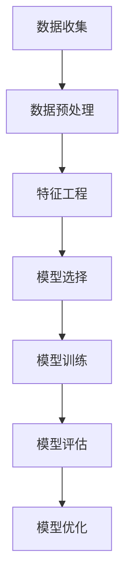

###### 2.1.3 无监督学习算法
无监督学习是一种机器学习技术，它不依赖于标记数据，而是从未标记的数据中发现模式和结构。常见的无监督学习算法包括聚类（如K-Means）、降维（如PCA）和关联规则学习等。

**Mermaid 流程图：**
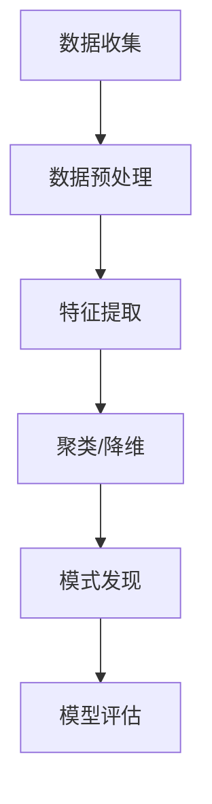

###### 2.1.4 强化学习算法
强化学习是一种机器学习技术，它通过试错和反馈机制来学习最佳行为策略。强化学习广泛应用于游戏、机器人控制和自动驾驶等领域。

**Mermaid 流程图：**
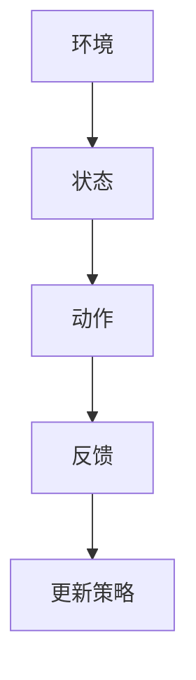

##### 2.2 神经网络与深度学习

###### 2.2.1 神经网络的基本结构
神经网络是由大量人工神经元（或节点）组成的计算网络。每个神经元接收来自其他神经元的输入信号，通过加权求和后，经过激活函数输出一个结果。

**Mermaid 流程图：**
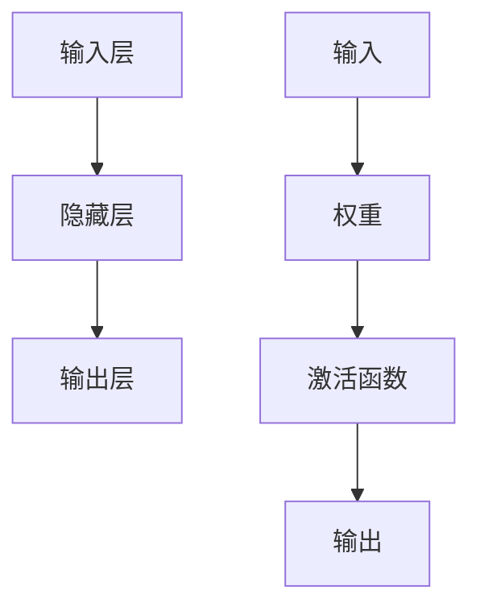

###### 2.2.2 前馈神经网络
前馈神经网络是一种简单的神经网络结构，信息从前到后传递，每个神经元只接受前一层神经元的输入。

**Mermaid 流程图：**
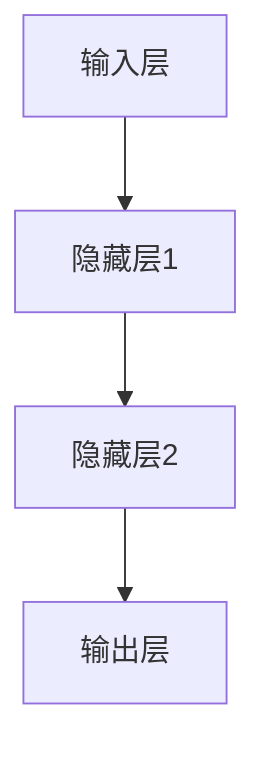

###### 2.2.3 卷积神经网络（CNN）
卷积神经网络是一种专门用于图像识别的神经网络结构，它利用卷积层进行特征提取，并通过池化层减少数据维度。

**Mermaid 流程图：**
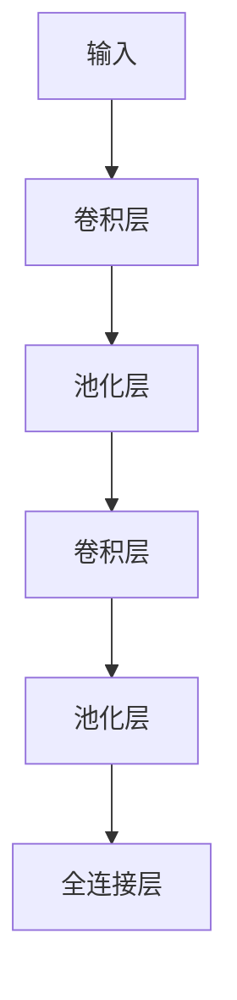

###### 2.2.4 循环神经网络（RNN）
循环神经网络是一种处理序列数据的神经网络结构，它能够通过记忆过去的信息来处理长序列。

**Mermaid 流程图：**
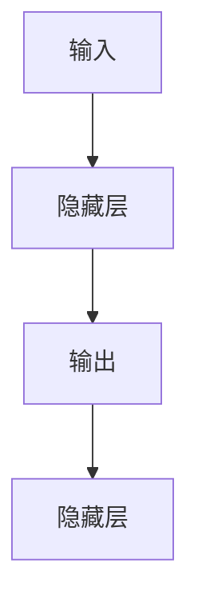

###### 2.2.5 生成对抗网络（GAN）
生成对抗网络是一种由生成器和判别器组成的神经网络结构，生成器生成数据，判别器判断生成数据与真实数据的区别，通过对抗训练来提高生成数据的质量。

**Mermaid 流程图：**
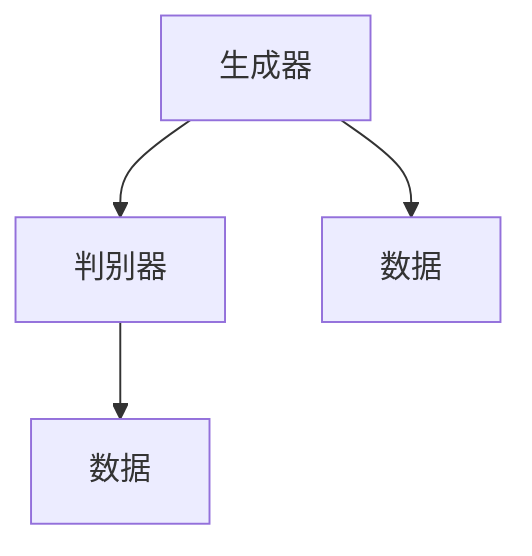

##### 2.3 自然语言处理

###### 2.3.1 语言模型
语言模型是一种概率模型，用于预测下一个词或字符的概率。它是自然语言处理的基础，广泛应用于自动文摘、机器翻译、语音识别等领域。

**Mermaid 流程图：**
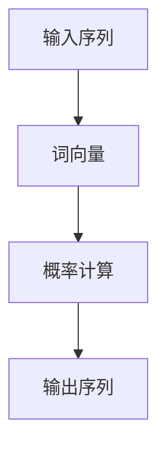

###### 2.3.2 机器翻译
机器翻译是一种将一种语言的文本转换为另一种语言的文本的技术。它通常使用基于神经网络的翻译模型，如序列到序列（seq2seq）模型。

**Mermaid 流程图：**
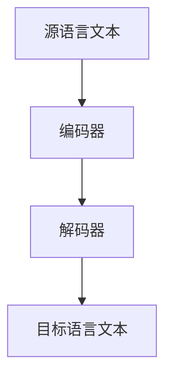

###### 2.3.3 问答系统
问答系统是一种用于回答用户问题的技术。它通常使用自然语言理解和处理技术，将用户问题转换为结构化查询，并从知识库中检索答案。

**Mermaid 流程图：**
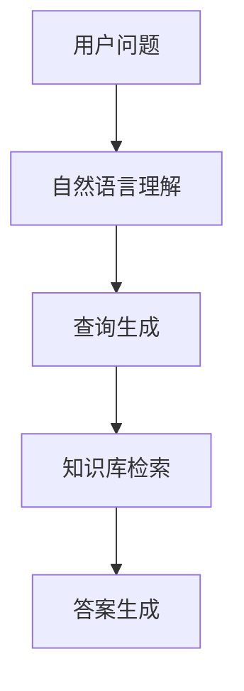

#### 第3章：AI技能的培养与应用

##### 3.1 数据分析与处理

###### 3.1.1 数据采集
数据采集是指从各种来源获取数据的步骤。数据来源可以是内部数据库、外部API、传感器等。数据采集的关键在于确保数据的质量和完整性。

**Mermaid 流程图：**
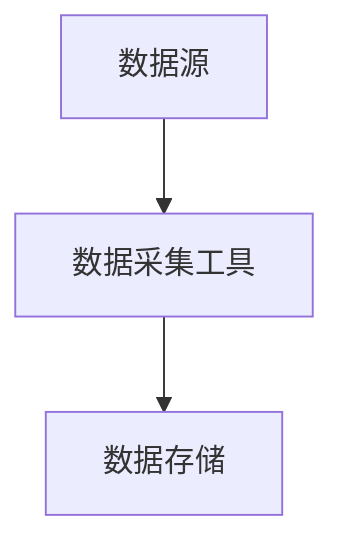

###### 3.1.2 数据清洗
数据清洗是指处理不完整、错误或重复数据的过程。数据清洗的目的是提高数据质量，为后续的数据分析做好准备。

**Mermaid 流程图：**
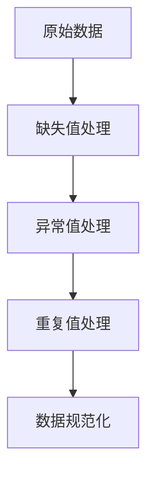

###### 3.1.3 数据存储与管理
数据存储与管理是指将数据存储在适当的数据库或数据仓库中，并确保数据的安全性和可访问性。常用的数据存储技术包括关系数据库、NoSQL数据库、数据湖等。

**Mermaid 流程图：**
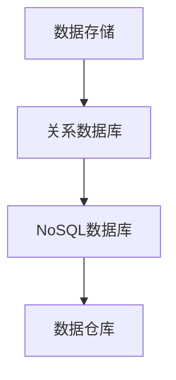

###### 3.1.4 数据可视化
数据可视化是指通过图形化的方式展示数据，帮助人们更好地理解和分析数据。数据可视化工具包括Tableau、Power BI、Matplotlib等。

**Mermaid 流程图：**
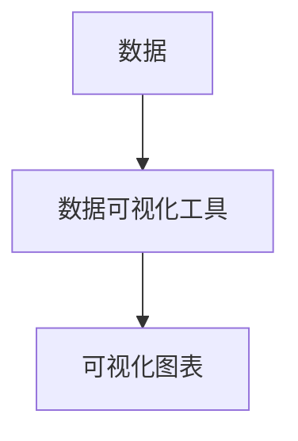

##### 3.2 AI项目实践

###### 3.2.1 项目需求分析
项目需求分析是指明确项目的目标和需求，为后续的开发工作奠定基础。需求分析的过程包括需求收集、需求分析和需求确认。

**Mermaid 流程图：**
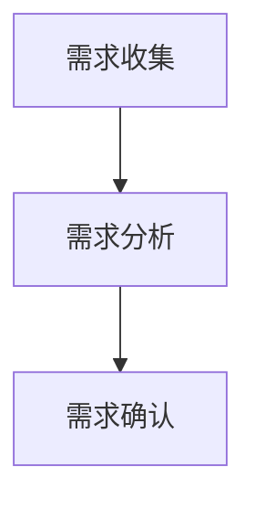

###### 3.2.2 项目设计与实现
项目设计与实现是指根据需求分析的结果，设计项目的架构和实现细节，并进行编码和测试。

**Mermaid 流程图：**
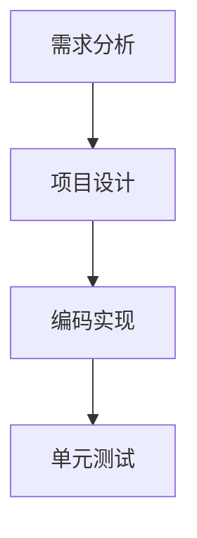

###### 3.2.3 项目评估与优化
项目评估与优化是指对项目的性能和效果进行评估，并根据评估结果进行优化。项目评估的方法包括性能测试、用户反馈和业务指标等。

**Mermaid 流程图：**
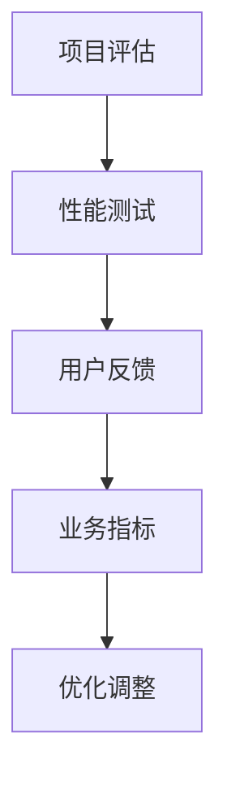

##### 3.3 AI工具应用

###### 3.3.1 常用AI工具介绍
常用的AI工具包括TensorFlow、PyTorch、Scikit-learn等，它们提供了丰富的机器学习算法和库，方便开发者进行AI项目开发。

**Mermaid 流程图：**
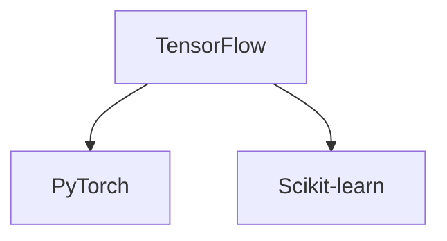

###### 3.3.2 工具使用技巧
使用AI工具的技巧包括：
- **模块化编程**：将代码拆分为多个模块，便于维护和复用。
- **代码注释**：为代码添加详细的注释，提高代码的可读性和可理解性。
- **版本控制**：使用版本控制工具（如Git）管理代码版本，确保代码的稳定性和可靠性。

**Mermaid 流程图：**
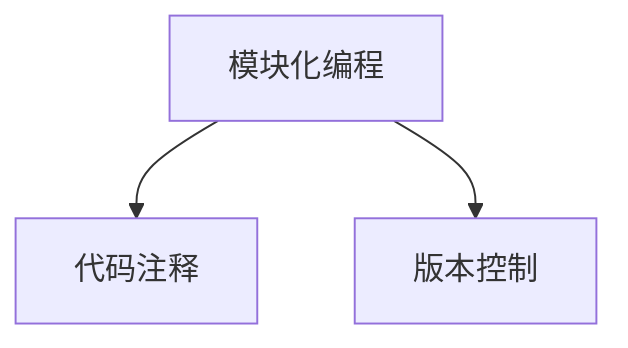

###### 3.3.3 工具在实际项目中的应用案例
在实际项目中，AI工具的应用案例包括：
- **图像识别**：使用TensorFlow实现图像分类任务。
- **语音识别**：使用PyTorch实现语音识别系统。
- **预测分析**：使用Scikit-learn进行股票市场预测。

**Mermaid 流程图：**
```mermaid
graph TD
A[图像识别] --> B[语音识别]
A --> C[预测分析]
```

#### 第4章：沟通与协作

##### 4.1 沟通技巧

###### 4.1.1 沟通的重要性
沟通是团队合作和项目成功的关键。良好的沟通能够提高团队的效率和协作效果，减少误解和冲突。

**Mermaid 流程图：**
```mermaid
graph TD
A[团队效率] --> B[协作效果]
A --> C[减少误解]
A --> D[减少冲突]
```

###### 4.1.2 沟通障碍与解决策略
常见的沟通障碍包括语言障碍、文化差异、信息过载等。解决策略包括：
- **明确沟通目标**：确保每个团队成员都清楚项目的目标和要求。
- **使用简单语言**：避免使用过于复杂或专业的术语，确保信息传达的准确性。
- **定期沟通会议**：安排定期的沟通会议，确保团队成员之间的信息流通。

**Mermaid 流程图：**
```mermaid
graph TD
A[明确目标] --> B[使用简单语言]
A --> C[定期会议]
```

###### 4.1.3 有效沟通的技巧
有效沟通的技巧包括：
- **倾听**：积极倾听对方的观点，避免打断或干扰。
- **提问**：通过提问来澄清对方的观点和理解。
- **反馈**：提供及时的反馈，帮助对方了解沟通的效果。

**Mermaid 流程图：**
```mermaid
graph TD
A[倾听] --> B[提问]
A --> C[反馈]
```

##### 4.2 团队合作

###### 4.2.1 团队合作的优势
团队合作的优势包括：
- **协同创新**：团队成员可以共同探讨问题，提出创新性的解决方案。
- **资源整合**：团队成员可以共享资源和知识，提高工作效率。
- **责任分担**：团队成员可以共同分担工作压力，提高工作满意度。

**Mermaid 流程图：**
```mermaid
graph TD
A[协同创新] --> B[资源整合]
A --> C[责任分担]
```

###### 4.2.2 团队合作的原则
团队合作的原则包括：
- **平等参与**：每个团队成员都应该有平等的参与机会，表达自己的观点。
- **相互信任**：团队成员之间应该建立信任关系，相互支持。
- **共同目标**：团队成员应该明确共同的目标，共同努力实现。

**Mermaid 流程图：**
```mermaid
graph TD
A[平等参与] --> B[相互信任]
A --> C[共同目标]
```

###### 4.2.3 团队协作的技巧
团队协作的技巧包括：
- **角色分配**：明确每个团队成员的角色和职责，确保任务的明确分配。
- **分工合作**：团队成员根据各自的角色和职责，协同完成工作任务。
- **定期回顾**：定期回顾团队的工作进展，评估团队协作的效果，并根据需要进行调整。

**Mermaid 流程图：**
```mermaid
graph TD
A[角色分配] --> B[分工合作]
A --> C[定期回顾]
```

##### 4.3 AI工具应用

###### 4.3.1 协作工具的介绍
协作工具包括Slack、Trello、JIRA等，它们提供了实时的沟通、任务管理和项目进度跟踪等功能，有助于提高团队协作效率。

**Mermaid 流程图：**
```mermaid
graph TD
A[Slack] --> B[Trello]
A --> C[JIRA]
```

###### 4.3.2 协作工具的使用方法
协作工具的使用方法包括：
- **实时沟通**：通过聊天功能进行实时沟通，确保团队成员之间的信息流通。
- **任务管理**：通过任务板或任务列表功能，分配和跟踪任务，确保任务的明确和按时完成。
- **项目进度跟踪**：通过看板或进度图表功能，实时跟踪项目进度，确保项目目标的实现。

**Mermaid 流程图：**
```mermaid
graph TD
A[实时沟通] --> B[任务管理]
A --> C[项目进度跟踪]
```

###### 4.3.3 协作工具在实际项目中的应用案例
在实际项目中，协作工具的应用案例包括：
- **敏捷开发**：使用JIRA进行敏捷开发过程中的任务分配和进度跟踪。
- **团队协作**：使用Slack进行团队内的实时沟通和协作。
- **项目管理**：使用Trello进行项目任务的管理和进度跟踪。

**Mermaid 流程图：**
```mermaid
graph TD
A[JIRA] --> B[Slack]
A --> C[Trello]
```

#### 第5章：问题解决与决策

##### 5.1 创新思维

###### 5.1.1 创新思维的重要性
创新思维是解决问题和推动进步的关键。在快速变化的AI时代，具备创新思维的能力对于个人和组织的成功至关重要。

**Mermaid 流程图：**
```mermaid
graph TD
A[问题解决] --> B[推动进步]
A --> C[成功关键]
```

###### 5.1.2 创新思维的训练方法
训练创新思维的方法包括：
- **思维导图**：通过绘制思维导图，梳理问题和解决方案，激发创意。
- **头脑风暴**：通过集体头脑风暴，鼓励团队成员提出各种可能的解决方案。
- **案例学习**：通过学习成功的创新案例，了解创新思维的实际应用。

**Mermaid 流程图：**
```mermaid
graph TD
A[思维导图] --> B[头脑风暴]
A --> C[案例学习]
```

###### 5.1.3 创新思维在AI项目中的应用
创新思维在AI项目中的应用包括：
- **新算法开发**：通过创新思维，开发新的机器学习算法，提高模型的性能。
- **AI应用创新**：通过创新思维，将AI技术应用于新的领域，创造新的商业价值。

**Mermaid 流程图：**
```mermaid
graph TD
A[新算法开发] --> B[AI应用创新]
```

##### 5.2 解决方案设计

###### 5.2.1 解决方案设计的原则
解决方案设计的原则包括：
- **需求导向**：以用户需求为中心，确保解决方案能够满足用户的需求。
- **可行性**：确保解决方案在技术、资源和时间等方面具有可行性。
- **灵活性**：设计具有灵活性的解决方案，能够适应未来变化的需求。

**Mermaid 流程图：**
```mermaid
graph TD
A[需求导向] --> B[可行性]
A --> C[灵活性]
```

###### 5.2.2 解决方案设计的方法
解决方案设计的方法包括：
- **用户调研**：通过用户调研，了解用户的需求和痛点。
- **需求分析**：分析用户需求，确定解决方案的目标和功能。
- **原型设计**：通过原型设计，验证解决方案的概念和可行性。

**Mermaid 流程图：**
```mermaid
graph TD
A[用户调研] --> B[需求分析]
A --> C[原型设计]
```

###### 5.2.3 解决方案设计的实践案例
解决方案设计的实践案例包括：
- **智能客服系统**：设计一个基于AI的智能客服系统，解决用户咨询和问题反馈的问题。
- **自动驾驶系统**：设计一个自动驾驶系统，实现车辆的自主导航和行驶。

**Mermaid 流程图：**
```mermaid
graph TD
A[智能客服系统] --> B[自动驾驶系统]
```

##### 5.3 数据驱动决策

###### 5.3.1 数据驱动决策的重要性
数据驱动决策是基于数据和事实，通过分析数据来做出决策。在AI时代，数据驱动决策能够提高决策的准确性和效率。

**Mermaid 流程图：**
```mermaid
graph TD
A[准确性] --> B[效率]
```

###### 5.3.2 数据驱动决策的方法
数据驱动决策的方法包括：
- **数据收集**：收集与决策相关的数据，确保数据的完整性和准确性。
- **数据分析**：对收集到的数据进行分析，提取有价值的信息和模式。
- **模型建立**：建立预测模型或优化模型，辅助决策。

**Mermaid 流程图：**
```mermaid
graph TD
A[数据收集] --> B[数据分析]
A --> C[模型建立]
```

###### 5.3.3 数据驱动决策的实践案例
数据驱动决策的实践案例包括：
- **市场营销**：通过数据分析，制定有效的营销策略，提高转化率和销售额。
- **供应链管理**：通过数据分析，优化供应链流程，降低库存成本，提高响应速度。

**Mermaid 流程图：**
```mermaid
graph TD
A[市场营销] --> B[供应链管理]
```

#### 第6章：持续学习与适应

##### 6.1 学习方法

###### 6.1.1 学习的重要性
学习是个人和职业发展的基石。在AI时代，随着技术的快速变化，持续学习成为保持竞争力的关键。

**Mermaid 流�程图：**
```mermaid
graph TD
A[个人发展] --> B[职业竞争力]
```

###### 6.1.2 有效学习方法
有效学习方法包括：
- **主动学习**：通过主动提问、思考和总结，加深对知识的理解和记忆。
- **项目学习**：通过实际项目，将理论知识应用于实践，提高解决问题的能力。
- **协作学习**：通过团队合作，分享知识和经验，相互学习和成长。

**Mermaid 流程图：**
```mermaid
graph TD
A[主动学习] --> B[项目学习]
A --> C[协作学习]
```

###### 6.1.3 学习资源的利用
利用学习资源的技巧包括：
- **在线课程**：通过在线课程，学习最新的技术和知识。
- **专业书籍**：阅读专业书籍，系统性地学习相关领域的知识。
- **社区和论坛**：参与社区和论坛，与其他专业人士交流和分享经验。

**Mermaid 流程图：**
```mermaid
graph TD
A[在线课程] --> B[专业书籍]
A --> C[社区和论坛]
```

##### 6.2 技能提升策略

###### 6.2.1 技能提升的策略
技能提升的策略包括：
- **持续学习**：制定学习计划，确保持续学习和进步。
- **实践应用**：将所学知识应用于实际项目，提高实践能力。
- **反馈改进**：通过反馈和评估，不断改进和优化技能。

**Mermaid 流程图：**
```mermaid
graph TD
A[持续学习] --> B[实践应用]
A --> C[反馈改进]
```

###### 6.2.2 技能提升的方法
技能提升的方法包括：
- **在线课程**：通过在线课程，学习最新的技术和知识。
- **实践项目**：通过实际项目，将理论知识应用于实践，提高解决问题的能力。
- **导师指导**：通过导师指导，获取专业的指导和反馈，加速技能提升。

**Mermaid 流程图：**
```mermaid
graph TD
A[在线课程] --> B[实践项目]
A --> C[导师指导]
```

###### 6.2.3 技能提升的实践案例
技能提升的实践案例包括：
- **数据科学竞赛**：通过参加数据科学竞赛，提高数据分析和建模能力。
- **开源项目贡献**：通过参与开源项目，提升编程和团队协作能力。
- **专业认证**：通过获得专业认证，证明自己的专业能力和知识水平。

**Mermaid 流程图：**
```mermaid
graph TD
A[数据科学竞赛] --> B[开源项目贡献]
A --> C[专业认证]
```

##### 6.3 适应变化

###### 6.3.1 适应变化的重要性
适应变化是个人和职业发展的关键。在AI时代，技术变革速度加快，适应变化的能力成为个人成功的关键因素。

**Mermaid 流程图：**
```mermaid
graph TD
A[个人发展] --> B[职业成功]
```

###### 6.3.2 适应变化的策略
适应变化的策略包括：
- **持续学习**：通过不断学习新知识和技能，保持适应变化的能力。
- **灵活性**：保持开放的心态，接受新的观点和想法。
- **风险管理**：通过风险管理，降低变化带来的不确定性和风险。

**Mermaid 流程图：**
```mermaid
graph TD
A[持续学习] --> B[灵活性]
A --> C[风险管理]
```

###### 6.3.3 适应变化的实践案例
适应变化的实践案例包括：
- **跨行业转型**：通过学习和实践，实现从传统行业向AI行业的转型。
- **技能多样化**：通过学习和实践，培养跨领域的技能，提高适应不同工作环境的能力。
- **灵活工作方式**：通过灵活的工作方式和时间管理，适应远程工作和弹性工作制度。

**Mermaid 流程图：**
```mermaid
graph TD
A[跨行业转型] --> B[技能多样化]
A --> C[灵活工作方式]
```

#### 第7章：AI时代的工作趋势与职业规划

##### 7.1 AI时代的工作趋势

###### 7.1.1 工作岗位的变化
随着AI技术的发展，许多传统工作岗位正在发生变化，同时新的工作岗位也在不断涌现。具体变化包括：

**Mermaid 流程图：**
```mermaid
graph TD
A[传统岗位变化] --> B[新岗位涌现]
```

###### 7.1.2 工作模式的变化
AI技术不仅改变了工作岗位，还改变了工作模式。远程工作、灵活工作时间和自动化办公成为新的工作趋势。

**Mermaid 流程图：**
```mermaid
graph TD
A[远程工作] --> B[灵活工作时间]
A --> C[自动化办公]
```

###### 7.1.3 工作技能的需求变化
随着AI时代的到来，对工作技能的需求也发生了变化。具体包括：

**Mermaid 流程图：**
```mermaid
graph TD
A[数据分析技能] --> B[编程技能]
A --> C[机器学习技能]
```

##### 7.2 职业技能与素质要求

###### 7.2.1 职业技能的要求
在AI时代，职业技能的要求包括：

**Mermaid 流程图：**
```mermaid
graph TD
A[数据分析技能] --> B[编程技能]
A --> C[机器学习技能]
```

###### 7.2.2 素质要求
除了职业技能，职业素质的要求同样重要。包括：

**Mermaid 流程图：**
```mermaid
graph TD
A[沟通能力] --> B[团队合作能力]
A --> C[适应变化能力]
```

###### 7.2.3 跨领域技能的结合
跨领域技能的结合是AI时代的重要特点。具体包括：

**Mermaid 流程图：**
```mermaid
graph TD
A[计算机科学] --> B[统计学]
A --> C[心理学]
```

##### 7.3 职业规划与未来发展

###### 7.3.1 职业规划的重要性
职业规划是个人职业生涯发展的重要步骤，有助于明确职业目标和发展路径。

**Mermaid 流程图：**
```mermaid
graph TD
A[目标明确] --> B[路径规划]
```

###### 7.3.2 职业规划的方法
职业规划的方法包括：

**Mermaid 流程图：**
```mermaid
graph TD
A[自我评估] --> B[市场调研]
A --> C[设定目标]
```

###### 7.3.3 未来职业发展的趋势
未来职业发展的趋势包括：

**Mermaid 流程图：**
```mermaid
graph TD
A[自动化与智能化] --> B[数据驱动的决策]
A --> C[技能多样化]
```

#### 第8章：AI驱动的行业变革

##### 8.1 制造业

###### 8.1.1 制造业的现状
制造业正面临着全球化和数字化的双重挑战，AI技术的引入正在推动制造业的变革。

**Mermaid 流程图：**
```mermaid
graph TD
A[全球化] --> B[数字化]
A --> C[AI驱动]
```

###### 8.1.2 AI在制造业的应用
AI在制造业的应用包括：

**Mermaid 流程图：**
```mermaid
graph TD
A[生产优化] --> B[质量检测]
A --> C[供应链管理]
```

###### 8.1.3 AI对制造业的变革
AI对制造业的变革体现在：

**Mermaid 流程图：**
```mermaid
graph TD
A[生产效率提升] --> B[产品质量提升]
A --> C[供应链透明化]
```

##### 8.2 服务业

###### 8.2.1 服务业的现状
服务业正在经历数字化转型和智能化的浪潮，AI技术的应用极大地提升了服务的质量和效率。

**Mermaid 流程图：**
```mermaid
graph TD
A[数字化转型] --> B[智能化]
```

###### 8.2.2 AI在服务业的应用
AI在服务业的应用包括：

**Mermaid 流程图：**
```mermaid
graph TD
A[智能客服] --> B[个性化推荐]
A --> C[数据分析]
```

###### 8.2.3 AI对服务业的变革
AI对服务业的变革体现在：

**Mermaid 流程图：**
```mermaid
graph TD
A[服务质量提升] --> B[运营效率提升]
A --> C[用户体验优化]
```

##### 8.3 农业

###### 8.3.1 农业的现状
农业正面临着土地资源有限、劳动力成本上升和环境问题等挑战，AI技术的应用为农业提供了新的解决方案。

**Mermaid 流程图：**
```mermaid
graph TD
A[土地资源有限] --> B[劳动力成本上升]
A --> C[环境问题]
```

###### 8.3.2 AI在农业的应用
AI在农业的应用包括：

**Mermaid 流程图：**
```mermaid
graph TD
A[精准农业] --> B[智能灌溉]
A --> C[病虫害监测]
```

###### 8.3.3 AI对农业的变革
AI对农业的变革体现在：

**Mermaid 流程图：**
```mermaid
graph TD
A[生产效率提升] --> B[资源利用率提高]
A --> C[环境保护]
```

#### 第9章：AI项目实战案例

##### 9.1 数据分析与模型训练

###### 9.1.1 数据分析案例
数据分析案例包括：

**Mermaid 流程图：**
```mermaid
graph TD
A[市场调研数据] --> B[用户行为分析]
A --> C[销售数据分析]
```

###### 9.1.2 模型训练案例
模型训练案例包括：

**Mermaid 流�程图：**
```mermaid
graph TD
A[图像分类模型] --> B[文本分类模型]
A --> C[预测模型]
```

##### 9.2 AI应用开发与部署

###### 9.2.1 应用开发案例
应用开发案例包括：

**Mermaid 流程图：**
```mermaid
graph TD
A[智能客服系统] --> B[自动驾驶系统]
A --> C[智能推荐系统]
```

###### 9.2.2 应用部署案例
应用部署案例包括：

**Mermaid 流程图：**
```mermaid
graph TD
A[云部署] --> B[容器化部署]
A --> C[边缘部署]
```

##### 9.3 AI项目评估与优化

###### 9.3.1 项目评估方法
项目评估方法包括：

**Mermaid 流程图：**
```mermaid
graph TD
A[性能评估] --> B[用户满意度评估]
A --> C[业务指标评估]
```

###### 9.3.2 项目优化案例
项目优化案例包括：

**Mermaid 流程图：**
```mermaid
graph TD
A[模型优化] --> B[系统性能优化]
A --> C[用户体验优化]
```

#### 第10章：AI伦理与法律问题

##### 10.1 AI伦理问题

###### 10.1.1 AI伦理的定义
AI伦理是指与AI系统设计、开发和使用相关的道德原则和规范。

**Mermaid 流程图：**
```mermaid
graph TD
A[道德原则] --> B[规范制定]
```

###### 10.1.2 AI伦理的问题
AI伦理问题包括：

**Mermaid 流程图：**
```mermaid
graph TD
A[数据隐私] --> B[算法偏见]
A --> C[人工智能失控]
```

###### 10.1.3 AI伦理的解决方案
AI伦理的解决方案包括：

**Mermaid 流程图：**
```mermaid
graph TD
A[伦理指南] --> B[法律法规]
A --> C[伦理委员会]
```

##### 10.2 数据隐私与安全

###### 10.2.1 数据隐私的重要性
数据隐私的重要性体现在：

**Mermaid 流程图：**
```mermaid
graph TD
A[个人隐私保护] --> B[商业竞争安全]
```

###### 10.2.2 数据隐私的保护策略
数据隐私的保护策略包括：

**Mermaid 流程图：**
```mermaid
graph TD
A[数据加密] --> B[访问控制]
A --> C[匿名化处理]
```

###### 10.2.3 数据隐私的法律法规
数据隐私的法律法规包括：

**Mermaid 流程图：**
```mermaid
graph TD
A[GDPR] --> B[CCPA]
A --> C[其他法律法规]
```

##### 10.3 法律与政策

###### 10.3.1 AI相关法律法规
AI相关法律法规包括：

**Mermaid 流程图：**
```mermaid
graph TD
A[隐私保护法] --> B[数据安全法]
A --> C[人工智能促进法]
```

###### 10.3.2 政策导向
政策导向包括：

**Mermaid 流程图：**
```mermaid
graph TD
A[鼓励创新] --> B[规范发展]
A --> C[支持国际合作]
```

###### 10.3.3 法律与政策的挑战与机遇
法律与政策的挑战与机遇包括：

**Mermaid 流程图：**
```mermaid
graph TD
A[政策引导] --> B[法律法规完善]
A --> C[产业创新发展]
```

### 附录

#### 附录A：AI工具与资源指南

附录A提供了AI工具和资源的指南，包括：

**Mermaid 流程图：**
```mermaid
graph TD
A[TensorFlow] --> B[PyTorch]
A --> C[Scikit-learn]
```

#### 附录B：AI项目开发指南

附录B提供了AI项目开发的指南，包括：

**Mermaid 流程图：**
```mermaid
graph TD
A[项目规划] --> B[数据预处理]
A --> C[模型选择]
```

#### 附录C：常见问题解答

附录C提供了关于AI技术的常见问题解答，包括：

**Mermaid 流程图：**
```mermaid
graph TD
A[什么是深度学习?] --> B[如何处理数据？]
A --> C[如何评估模型性能？]
```

---

### 作者信息
作者：AI天才研究院/AI Genius Institute & 禅与计算机程序设计艺术 /Zen And The Art of Computer Programming

本文探讨了AI时代对工作的影响以及人类计算在其中的重要性。文章从AI技术的发展与现状出发，分析了AI对工作的改变与挑战，提出了未来工作的技能需求。接着，文章详细介绍了AI核心概念与原理，以及AI技能的培养与应用。随后，文章探讨了沟通与协作、问题解决与决策、持续学习与适应等AI时代的工作技能。最后，文章展望了AI时代的工作趋势与职业规划，并探讨了AI驱动的行业变革以及AI伦理与法律问题。本文旨在为读者提供全面、深入的AI时代工作技能指南，助力读者在AI时代取得成功。

