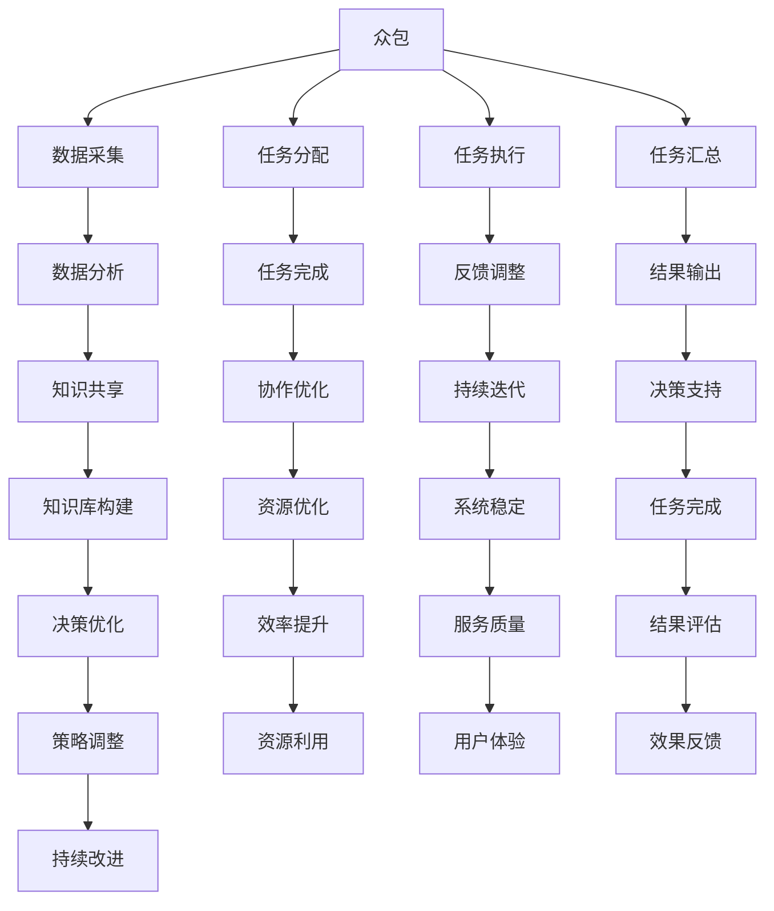

                 

# 文章标题：人类计算：可持续发展的推动力

> 关键词：人类计算，可持续发展，技术趋势，案例分析，未来展望

> 摘要：本文旨在探讨人类计算这一新兴概念在推动可持续发展中的重要作用。通过分析人类计算的核心原理、关键技术、应用领域以及成功案例，我们揭示了人类计算如何通过优化资源利用、提高效率、减少环境影响，为可持续发展提供新的路径。文章最后对未来发展趋势进行了展望，并提出了人类计算在可持续发展中的前景和应用。

---

## 第一部分：引言与背景介绍

### 1.1 书籍主题介绍

#### 1.1.1 人类计算的定义与意义

**人类计算（Human Computation）** 是指通过人类协作、智能与创造力来解决复杂问题的一种计算方式。它不同于传统的机器计算，强调人类在计算过程中的参与和贡献。这一概念在信息技术迅速发展的今天具有重要意义，它不仅丰富了计算的方式，也为我们探索可持续发展的路径提供了新思路。

在信息技术不断进步的背景下，人类计算逐渐成为一种重要的计算模式。通过人类智慧、协作和创造力，人类计算能够解决机器难以完成的复杂问题，如大规模数据处理、知识发现、创造性设计等。这些特点使得人类计算在许多领域具有广泛的应用前景，特别是在可持续发展方面，它为我们提供了一种新的解决方案。

#### 1.1.2 人类计算与可持续发展

**可持续发展（Sustainable Development）** 是指在不损害未来世代需求的前提下，满足当前人类需求的发展模式。它涉及到经济、社会、环境等多方面的发展，旨在实现经济繁荣、社会公正和环境可持续的目标。人类计算作为一种新兴的计算模式，为可持续发展提供了新的动力。

首先，人类计算能够优化资源利用。通过众包、人机协作等方式，人类计算能够高效地利用人类智慧和劳动力，降低资源消耗。例如，在环境保护领域，人类计算可以通过众包方式收集环境数据，提高环境保护的效率。

其次，人类计算能够提高效率。通过人类智慧参与，人类计算能够快速解决复杂问题，提高决策质量。例如，在决策支持系统中，人类计算可以帮助决策者分析大量数据，提供科学的决策依据。

最后，人类计算能够减少环境影响。通过优化资源利用、提高效率等方式，人类计算有助于减少碳排放、降低能源消耗，从而减少对环境的负面影响。

#### 1.1.3 人类计算在现代社会的应用

人类计算在现代社会中展现出了巨大的应用潜力。以下是一些关键领域的具体应用实例：

1. **决策支持系统**：人类计算可以帮助决策者分析大量数据，提供科学的决策依据。例如，在政府决策中，人类计算可以通过众包方式收集公众意见，提高决策的科学性和民主性。

2. **城市规划与管理**：人类计算可以优化城市规划，提高城市规划的科学性和可持续性。例如，通过众包方式收集市民对城市规划的意见和建议，有助于制定更符合实际需求的城市规划方案。

3. **环境保护与生态监测**：人类计算可以用于环境监测、生态保护和资源管理。例如，通过众包方式收集环境数据，可以提高环境监测的效率和准确性，为环境保护提供有力支持。

4. **教育与人才培养**：人类计算可以改进教育模式，提高教育质量和培养创新人才。例如，通过人机协作方式，学生可以更好地利用互联网资源进行学习，提高学习效果。

通过上述分析，我们可以看出，人类计算在现代社会中具有广泛的应用前景，特别是在推动可持续发展方面，它为我们提供了一种新的解决方案。在接下来的章节中，我们将深入探讨人类计算的核心原理、关键技术、应用领域以及未来发展趋势。

---

## 第二部分：人类计算的核心原理

### 2.1 人类计算的基本概念

#### 2.1.1 人类计算的定义与范畴

**人类计算** 涉及人类在计算过程中的角色、能力与协作方式。它是一种利用人类智慧、协作和创造力来解决复杂计算问题的计算模式。与传统的机器计算不同，人类计算强调人类在计算过程中的积极参与和贡献。

**人类计算的范畴** 包括以下几个方面：

1. **众包（Crowdsourcing）**：众包是指通过互联网平台，将复杂任务分解为多个子任务，然后利用大众的力量来完成整个任务。众包的优点在于能够迅速汇集大量人力，解决机器难以完成的复杂问题。

2. **众智（Collective Intelligence）**：众智是指通过人类协作，发挥集体智慧，解决复杂问题。众智的核心在于集体智慧和协同效应，通过多人协作，可以产生更高质量的解决方案。

3. **人机协作（Human-Machine Collaboration）**：人机协作是指人与机器之间的互动，通过协同工作，提高问题解决效率和效果。人机协作的优势在于能够充分发挥人类和机器的优势，实现更好的问题解决效果。

#### 2.1.2 人类计算的优势与挑战

**人类计算的优势** 主要表现在以下几个方面：

1. **灵活性**：人类计算能够根据具体问题灵活调整计算方法，适应不同类型的问题。

2. **创造力**：人类具有独特的创造力，能够在面对复杂问题时，提出创新性的解决方案。

3. **协作性**：人类计算能够充分利用人类协作的优势，通过多人合作，产生更好的计算结果。

**人类计算的挑战** 主要包括以下几个方面：

1. **效率**：人类计算的效率相对较低，特别是在处理大规模数据时，可能需要更多时间和资源。

2. **可靠性**：人类计算的可靠性受到个体差异的影响，可能存在数据质量不高、计算结果不一致等问题。

3. **标准化**：人类计算的标准化程度较低，难以实现统一的标准和规范。

#### 2.1.3 人类计算的基本模型与架构

**人类计算的基本模型** 包括众包、众智和人机协作等。以下分别介绍这些模型：

1. **众包模型**：众包模型是指通过互联网平台，将复杂任务分解为多个子任务，然后利用大众的力量来完成整个任务。众包模型的核心在于任务分解和任务分配。具体步骤如下：

    a. **任务分解**：将复杂任务分解为多个子任务，确保每个子任务能够独立完成。

    b. **任务分配**：将子任务分配给不同的参与者，确保每个参与者都能在自己的能力范围内完成任务。

    c. **任务执行**：参与者根据任务要求，独立完成任务。

    d. **任务汇总**：将各个参与者的任务结果汇总，形成最终的计算结果。

2. **众智模型**：众智模型是指通过人类协作，发挥集体智慧，解决复杂问题。众智模型的核心在于集体智慧和协同效应。具体步骤如下：

    a. **问题定义**：明确需要解决的问题，确定解决问题的目标。

    b. **知识共享**：参与者通过互联网平台共享知识、经验和信息，为解决问题提供支持。

    c. **方案生成**：参与者根据共享的知识和信息，提出可能的解决方案。

    d. **方案评估**：对各个方案进行评估，选择最优方案。

3. **人机协作模型**：人机协作模型是指人与机器之间的互动，通过协同工作，提高问题解决效率和效果。人机协作模型的核心在于人机交互和协同优化。具体步骤如下：

    a. **问题定义**：明确需要解决的问题，确定解决问题的目标。

    b. **数据准备**：收集和处理相关数据，为问题解决提供数据支持。

    c. **人机交互**：人与机器通过交互，确定解决问题的步骤和方法。

    d. **任务执行**：人机协同完成任务，提高问题解决效率和效果。

    e. **结果评估**：对问题解决结果进行评估，根据评估结果进行调整和优化。

通过上述分析，我们可以看出，人类计算的基本模型和架构为解决复杂问题提供了有效途径。在接下来的章节中，我们将进一步探讨人类计算的关键技术，包括众包、人机协作和大数据与认知科学基础等。

---

### 2.2 人类计算的关键技术

#### 2.2.1 众包与分布式问题求解

**众包** 是一种利用大众智慧解决复杂问题的方法。它通过将复杂任务分解为多个子任务，然后利用大众的力量来完成整个任务。众包的优点在于能够迅速汇集大量人力，解决机器难以完成的复杂问题。以下是一个简单的众包模型：

1. **任务发布**：任务发布者将复杂任务发布到众包平台，描述任务的要求和目标。
2. **任务分解**：平台将任务分解为多个子任务，确保每个子任务能够独立完成。
3. **任务分配**：平台将子任务分配给不同的参与者，确保每个参与者都能在自己的能力范围内完成任务。
4. **任务执行**：参与者根据任务要求，独立完成任务。
5. **任务汇总**：平台将各个参与者的任务结果汇总，形成最终的计算结果。

**分布式问题求解** 是众包的一种重要应用。它通过将复杂问题分解为多个子问题，然后利用分布式计算的方式求解。分布式问题求解的优点在于能够提高计算效率，降低计算成本。以下是一个简单的分布式问题求解模型：

1. **问题定义**：明确需要解决的问题，确定解决问题的目标。
2. **子问题划分**：将复杂问题分解为多个子问题，确保每个子问题能够独立求解。
3. **任务分配**：将子问题分配给不同的计算节点，确保每个计算节点都能在自己的能力范围内求解子问题。
4. **子问题求解**：计算节点根据子问题的要求，独立求解子问题。
5. **结果汇总**：将各个计算节点的求解结果汇总，形成最终的计算结果。

**众包与分布式问题求解的关系** ：

1. **众包是实现分布式问题求解的一种手段**。通过众包，可以将复杂问题分解为多个子任务，然后利用分布式计算的方式求解。

2. **分布式问题求解是众包的一种重要应用**。通过分布式问题求解，可以充分利用大众的智慧，解决复杂问题。

#### 2.2.2 人机协作与智能代理

**人机协作** 是指人与机器之间的互动，通过协同工作，提高问题解决效率和效果。人机协作的优点在于能够充分发挥人类和机器的优势，实现更好的问题解决效果。以下是一个简单的人机协作模型：

1. **问题定义**：明确需要解决的问题，确定解决问题的目标。
2. **数据准备**：收集和处理相关数据，为问题解决提供数据支持。
3. **人机交互**：人与机器通过交互，确定解决问题的步骤和方法。
4. **任务执行**：人机协同完成任务，提高问题解决效率和效果。
5. **结果评估**：对问题解决结果进行评估，根据评估结果进行调整和优化。

**智能代理** 是人机协作的一种重要工具。智能代理是指具有自主决策能力的计算机程序，能够根据环境变化和任务要求，自主调整行为。以下是一个简单的智能代理模型：

1. **代理初始化**：初始化代理的环境和状态，确定代理的目标。
2. **感知环境**：代理感知环境变化，获取环境信息。
3. **决策制定**：代理根据环境信息和任务要求，制定决策策略。
4. **执行行为**：代理执行决策，调整自身行为。
5. **结果反馈**：代理根据执行结果，调整决策策略。

**人机协作与智能代理的关系** ：

1. **智能代理是人机协作的一种实现方式**。通过智能代理，可以实现人与机器之间的实时交互和协同工作。

2. **人机协作是智能代理的应用场景**。通过人机协作，可以充分发挥智能代理的能力，解决复杂问题。

#### 2.2.3 大数据与认知科学基础

**大数据** 是指数据量巨大、数据类型多样的数据集合。大数据具有“4V”特征：大量（Volume）、多样（Variety）、快速（Velocity）和价值（Value）。大数据的兴起为人类计算提供了丰富的数据资源，使得人类计算能够更好地应对复杂问题。

**认知科学** 是研究人类认知过程和机制的学科。认知科学包括心理学、神经科学、计算机科学等多个领域。认知科学的研究成果为人类计算提供了理论基础，使得人类计算能够更好地模拟和利用人类智能。

**大数据与认知科学基础在人类计算中的应用** ：

1. **数据采集与处理**：通过大数据技术，可以高效地采集和处理大规模数据，为人类计算提供数据支持。

2. **知识发现与推理**：通过认知科学理论，可以有效地发现数据中的知识，并进行推理和预测。

3. **人机交互与协作**：通过大数据和认知科学理论，可以设计出更智能的人机交互界面，提高人机协作的效率和质量。

通过上述分析，我们可以看出，人类计算的关键技术包括众包、人机协作和大数据与认知科学基础等。这些技术为人类计算提供了丰富的工具和方法，使得人类计算能够更好地应对复杂问题。在接下来的章节中，我们将进一步探讨人类计算的应用领域，展示人类计算在各个领域的具体应用实例。

---

### 2.3 人类计算的应用领域

#### 2.3.1 决策支持系统

**决策支持系统（Decision Support System，DSS）** 是一种利用计算机技术和信息技术，为决策者提供决策支持的工具。决策支持系统通过收集、处理和分析数据，为决策者提供科学的决策依据，提高决策的准确性和效率。

在决策支持系统中，人类计算发挥了重要作用。以下是一个简单的决策支持系统模型：

1. **问题定义**：明确需要解决的问题，确定解决问题的目标。
2. **数据采集**：收集与问题相关的数据，包括历史数据、现状数据和预测数据等。
3. **数据分析**：利用数据分析方法，对采集到的数据进行分析和挖掘，提取有用的信息。
4. **模型构建**：根据分析结果，构建决策模型，模拟不同决策方案的效果。
5. **决策评估**：对各个决策方案进行评估，选择最优决策方案。
6. **决策实施**：根据最优决策方案，制定实施计划，并监督实施过程。

**人类计算在决策支持系统中的应用**：

1. **众包数据采集**：通过众包方式，可以迅速收集大量与问题相关的数据，提高数据采集的效率和准确性。
2. **人机协作分析**：人类计算可以通过人机协作，提高数据分析的效率和准确性。例如，利用机器学习算法分析数据，然后由人类专家进行验证和调整。
3. **知识库构建**：人类计算可以通过众智方式，构建知识库，为决策支持系统提供丰富的知识资源。

**决策支持系统在政府、企业、社会等领域的应用**：

1. **政府领域**：决策支持系统可以帮助政府制定和实施公共政策，提高政府决策的科学性和民主性。例如，通过众包方式收集市民意见，为城市规划提供参考。
2. **企业领域**：决策支持系统可以帮助企业制定和实施商业策略，提高企业的市场竞争力。例如，通过数据分析，帮助企业优化供应链管理，提高生产效率。
3. **社会领域**：决策支持系统可以帮助社会组织和社会机构制定和实施社会项目，提高社会服务质量和效率。例如，通过数据分析，帮助公益组织优化资源分配，提高公益项目效果。

通过上述分析，我们可以看出，决策支持系统在各个领域都具有广泛的应用前景。在人类计算的推动下，决策支持系统将能够更好地为决策者提供科学的决策依据，提高决策的准确性和效率。

#### 2.3.2 城市规划与管理

**城市规划与管理** 是一门综合性学科，涉及地理学、经济学、社会学、环境科学等多个领域。城市规划与管理的目标是设计和管理城市空间，提高城市宜居性、可持续性和发展潜力。

在城市化进程日益加快的今天，人类计算在城市规划与管理中发挥了重要作用。以下是一个简单的城市规划与管理模型：

1. **数据采集**：通过众包方式，收集城市相关的数据，包括地理信息、社会经济数据、环境数据等。
2. **数据分析**：利用大数据和人工智能技术，对采集到的数据进行分析和挖掘，提取有用的信息。
3. **模型构建**：根据分析结果，构建城市规划模型，模拟不同规划方案的效果。
4. **方案评估**：对各个规划方案进行评估，选择最优规划方案。
5. **方案实施**：根据最优规划方案，制定实施计划，并监督实施过程。

**人类计算在城市规划与管理中的应用**：

1. **数据采集与处理**：通过大数据技术，可以高效地采集和处理大规模城市数据，为城市规划与管理提供数据支持。
2. **人机协作分析**：通过人机协作，可以充分利用人类和机器的优势，提高数据分析的效率和准确性。例如，利用机器学习算法分析数据，然后由人类专家进行验证和调整。
3. **知识库构建**：通过众智方式，可以构建知识库，为城市规划与管理提供丰富的知识资源。

**人类计算如何优化城市规划、交通管理和社会服务**：

1. **优化城市规划**：通过人类计算，可以更好地分析城市数据，提取城市规划的关键信息，制定更科学、更可持续的城市规划方案。
2. **交通管理**：通过人类计算，可以更好地分析交通数据，优化交通管理策略，提高交通效率和安全性。例如，通过众包方式收集交通信息，实时调整交通信号灯，减少交通拥堵。
3. **社会服务**：通过人类计算，可以更好地分析社会服务需求，优化社会服务资源分配，提高社会服务质量和效率。例如，通过众包方式收集社会服务需求信息，为政府提供决策支持，优化社会服务资源配置。

通过上述分析，我们可以看出，人类计算在城市规划与管理中具有广泛的应用前景。通过优化资源利用、提高效率和减少环境影响，人类计算将为城市规划与管理提供新的思路和方法，推动城市可持续发展。

#### 2.3.3 环境保护与生态监测

**环境保护与生态监测** 是一门涉及自然科学、社会科学和管理学的综合性学科。其目标是保护和改善自然环境，维护生态平衡，确保人类和自然界的可持续发展。

在环境保护与生态监测领域，人类计算发挥了重要作用。以下是一个简单的环境保护与生态监测模型：

1. **数据采集**：通过众包方式，收集与环境保护和生态监测相关的数据，包括空气质量、水质、土壤质量、生物多样性等数据。
2. **数据分析**：利用大数据和人工智能技术，对采集到的数据进行分析和挖掘，提取有用的信息。
3. **模型构建**：根据分析结果，构建环境保护与生态监测模型，模拟不同环保策略的效果。
4. **方案评估**：对各个环保策略进行评估，选择最优环保策略。
5. **方案实施**：根据最优环保策略，制定实施计划，并监督实施过程。

**人类计算在环境保护与生态监测中的应用**：

1. **数据采集与处理**：通过大数据技术，可以高效地采集和处理大规模环境数据，为环境保护与生态监测提供数据支持。
2. **人机协作分析**：通过人机协作，可以充分利用人类和机器的优势，提高数据分析的效率和准确性。例如，利用机器学习算法分析数据，然后由人类专家进行验证和调整。
3. **知识库构建**：通过众智方式，可以构建知识库，为环境保护与生态监测提供丰富的知识资源。

**人类计算如何支持环境监测、生态保护和资源管理**：

1. **环境监测**：通过人类计算，可以更好地分析环境数据，实时监测环境变化，及时发现环境污染问题，为环境保护提供科学依据。
2. **生态保护**：通过人类计算，可以更好地分析生态数据，模拟不同生态保护策略的效果，优化生态保护措施，确保生态系统的可持续发展。
3. **资源管理**：通过人类计算，可以更好地分析资源数据，优化资源分配和使用，提高资源利用效率，减少资源浪费。

通过上述分析，我们可以看出，人类计算在环境保护与生态监测领域具有广泛的应用前景。通过优化资源利用、提高效率和减少环境影响，人类计算将为环境保护与生态监测提供新的思路和方法，推动生态可持续发展。

#### 2.3.4 教育与人才培养

**教育与人才培养** 是一个国家和社会发展的重要基石。在当今知识经济时代，教育与人才培养越来越受到重视。人类计算在教育与人才培养领域具有广泛的应用前景，可以改进教育模式，提高教育质量和培养创新人才。

以下是一个简单的教育与人才培养模型：

1. **数据采集**：通过大数据技术，收集与教育相关的数据，包括学生的学习行为、成绩、反馈等数据。
2. **数据分析**：利用数据分析方法，对采集到的数据进行分析和挖掘，提取有用的信息。
3. **模型构建**：根据分析结果，构建教育与人才培养模型，模拟不同教育策略的效果。
4. **方案评估**：对各个教育策略进行评估，选择最优教育策略。
5. **方案实施**：根据最优教育策略，制定实施计划，并监督实施过程。

**人类计算在教育领域中的应用**：

1. **个性化学习**：通过人类计算，可以更好地分析学生的学习数据，制定个性化的学习计划，提高学生的学习效果。
2. **智能辅导**：通过人机协作，可以提供智能辅导，帮助学生解决学习中遇到的问题。
3. **知识共享**：通过众智方式，可以构建知识库，为教师和学生提供丰富的学习资源。

**人类计算在人才培养中的应用**：

1. **创新能力培养**：通过人类计算，可以更好地分析创新人才的特点和需求，制定创新人才培养策略，提高创新人才的比例。
2. **跨学科培养**：通过人机协作，可以提供跨学科的教育资源和培养方案，培养具有综合素质和创新能力的复合型人才。
3. **职业规划**：通过人类计算，可以更好地分析学生的职业兴趣和能力，提供个性化的职业规划建议，帮助学生更好地选择职业发展方向。

通过上述分析，我们可以看出，人类计算在教育与人才培养领域具有广泛的应用前景。通过优化教育模式、提高教育质量和培养创新人才，人类计算将为教育与人才培养提供新的思路和方法，推动教育事业的可持续发展。

---

## 第三部分：案例分析与应用实践

### 3.1 人类计算案例研究

#### 3.1.1 成功案例分析

**案例一：Google 地图标注**

**背景**：Google 地图是 Google 提供的一项全球地图服务。为了保证地图的准确性和完整性，Google 利用人类计算进行地图标注。

**过程**：

1. **任务发布**：Google 通过众包平台发布地图标注任务，描述任务的要求和目标。
2. **任务执行**：全球用户通过众包平台参与地图标注任务，根据任务要求进行地图标注。
3. **任务汇总**：Google 收集用户提交的标注数据，进行汇总和处理，形成最终的地图数据。

**效果**：

1. **提高地图准确性**：通过众包方式，Google 收集了大量用户提交的地图标注数据，提高了地图的准确性和完整性。
2. **优化地图更新速度**：通过众包方式，Google 可以快速获取用户提交的地图标注数据，提高了地图更新的速度。

**挑战与解决方案**：

1. **数据质量不一致**：由于用户素质参差不齐，导致提交的标注数据质量不一致。
   - **解决方案**：Google 对提交的标注数据进行了严格的质量控制和审核，确保标注数据的准确性。
2. **隐私保护**：在众包过程中，用户的隐私保护是一个重要问题。
   - **解决方案**：Google 采取了严格的隐私保护措施，确保用户的隐私不被泄露。

**案例二：亚马逊众包物流**

**背景**：亚马逊是一家全球电子商务公司，为了保证物流服务的效率和准确性，亚马逊利用人类计算进行物流配送。

**过程**：

1. **任务发布**：亚马逊通过众包平台发布物流配送任务，描述任务的要求和目标。
2. **任务执行**：全球用户通过众包平台参与物流配送任务，根据任务要求进行物流配送。
3. **任务汇总**：亚马逊收集用户提交的物流配送数据，进行汇总和处理，形成最终的物流配送数据。

**效果**：

1. **提高物流效率**：通过众包方式，亚马逊可以迅速调动大量用户参与物流配送，提高了物流效率。
2. **优化物流服务质量**：通过众包方式，亚马逊可以更好地满足用户的需求，提高了物流服务质量。

**挑战与解决方案**：

1. **配送时间不固定**：由于用户参与物流配送的时间不固定，导致物流配送时间不固定。
   - **解决方案**：亚马逊采取了灵活的配送时间安排，确保用户能够在合适的时间进行物流配送。
2. **配送成本控制**：由于物流配送涉及大量用户，导致配送成本较高。
   - **解决方案**：亚马逊通过优化配送路线和配送方式，降低了配送成本。

通过以上成功案例的分析，我们可以看出，人类计算在提高效率和优化服务质量方面具有显著优势。在接下来的章节中，我们将进一步探讨人类计算的应用实践，展示人类计算在具体项目中的实施过程和效果。

### 3.1.2 挑战与问题分析

在人类计算的实际应用中，尽管取得了许多成功案例，但也面临一些挑战和问题。以下分析人类计算在应用过程中遇到的主要挑战及其解决方案：

#### 数据质量与隐私

**挑战**：众包任务中，由于参与者的多样性，导致数据质量参差不齐。此外，数据隐私保护也是一个重要问题。

**解决方案**：

1. **数据质量控制**：对参与众包任务的参与者进行筛选和培训，确保他们具备完成任务的能力和责任心。
2. **隐私保护措施**：对用户数据进行加密处理，确保用户隐私不被泄露。
3. **匿名化处理**：对用户数据进行匿名化处理，降低隐私泄露的风险。

#### 参与者积极性

**挑战**：众包任务中，参与者的积极性往往不高，导致任务完成质量下降。

**解决方案**：

1. **激励机制**：设置合理的奖励机制，激励参与者积极参与任务。
2. **任务设计**：设计有趣、有挑战性的任务，提高参与者的兴趣和积极性。
3. **任务多样性**：提供多样化的任务，满足不同参与者的需求和兴趣。

#### 资源分配与协调

**挑战**：在分布式问题求解和人机协作中，资源分配和协调是一个难题，可能导致任务完成效率降低。

**解决方案**：

1. **资源分配算法**：设计合理的资源分配算法，确保任务能够高效地分配到合适的计算资源上。
2. **协调机制**：建立有效的协调机制，确保人类和机器之间的协作顺畅，提高任务完成效率。
3. **实时监控与调整**：实时监控任务执行情况，根据实际情况进行动态调整，确保任务能够按计划完成。

#### 标准化与规范化

**挑战**：人类计算涉及多个领域和任务，缺乏统一的标准和规范，导致任务完成质量不一致。

**解决方案**：

1. **标准化流程**：建立标准化流程，确保任务从发布到完成的每个环节都有明确的标准和规范。
2. **规范文档**：制定详细的规范文档，为参与者提供指导和参考。
3. **质量评估体系**：建立质量评估体系，对任务完成质量进行评估和反馈，不断优化任务完成流程。

通过以上分析，我们可以看出，尽管人类计算在应用过程中面临一些挑战和问题，但通过有效的解决方案，可以克服这些挑战，提高任务完成质量和效率。在接下来的章节中，我们将进一步探讨人类计算项目开发的具体实施过程，为读者提供实际操作的指导。

### 3.2 人类计算项目开发

#### 3.2.1 项目规划与执行

**项目规划** 是人类计算项目开发的关键环节，它决定了项目能否按计划顺利进行。以下是一个简单的项目规划步骤：

1. **需求分析**：明确项目的目标和需求，包括功能需求、性能需求等。
2. **任务分解**：将复杂项目分解为多个子任务，确保每个子任务能够独立完成。
3. **资源分配**：根据任务要求，合理分配计算资源，包括人力、设备等。
4. **时间规划**：制定项目的时间规划，确保每个子任务能够在规定时间内完成。
5. **风险评估**：对项目可能遇到的风险进行分析和评估，制定应对策略。

**项目执行** 是项目规划的具体实施过程。以下是一个简单的项目执行步骤：

1. **任务分配**：将子任务分配给合适的团队成员，确保每个团队成员都明确自己的任务和职责。
2. **任务执行**：团队成员按照任务要求，独立完成任务。
3. **进度监控**：实时监控任务执行进度，确保项目按计划进行。
4. **问题解决**：在任务执行过程中，及时解决遇到的问题，确保任务顺利进行。
5. **成果验收**：对完成任务的结果进行验收，确保任务完成质量符合要求。

#### 3.2.2 技术选型与工具使用

在人类计算项目开发中，技术选型和工具使用是关键环节。以下是一些常见的技术和工具：

1. **编程语言**：Python、Java、C++等
2. **开发框架**：Django、Flask、Spring Boot等
3. **数据库**：MySQL、MongoDB、PostgreSQL等
4. **大数据处理**：Hadoop、Spark、Flink等
5. **机器学习库**：TensorFlow、PyTorch、Scikit-learn等
6. **云计算平台**：AWS、Azure、Google Cloud等
7. **众包平台**：crowdANALYTIX、CrowdFlower等

选择合适的技术和工具，可以提高项目开发效率，确保项目顺利完成。以下是一些选型建议：

1. **根据项目需求**：根据项目的具体需求和目标，选择合适的技术和工具。
2. **考虑开发团队**：考虑开发团队的技能和经验，选择他们熟悉和擅长使用的技术和工具。
3. **考虑性能和可扩展性**：选择性能好、可扩展性强的技术和工具，确保项目能够应对未来可能的需求变化。

#### 3.2.3 评估与优化

**评估** 是项目开发的重要环节，它有助于了解项目的完成质量，发现潜在问题，为后续优化提供依据。以下是一个简单的评估步骤：

1. **性能评估**：对项目的性能进行评估，包括响应时间、吞吐量、资源利用率等。
2. **功能评估**：对项目的功能进行评估，确保所有功能都正常运行。
3. **用户体验评估**：对用户体验进行评估，了解用户对项目的满意度。
4. **安全评估**：对项目的安全性进行评估，确保项目不受外部攻击。

**优化** 是在评估的基础上，对项目进行改进和提升的过程。以下是一些优化建议：

1. **性能优化**：通过调整算法、优化数据库查询、使用缓存等方式，提高项目性能。
2. **功能优化**：根据用户反馈，改进项目功能，提高用户体验。
3. **安全性优化**：加强项目安全防护，防范外部攻击。

通过项目规划、执行、技术选型、工具使用、评估与优化，可以确保人类计算项目顺利实施，达到预期目标。在接下来的章节中，我们将进一步探讨人类计算的未来发展趋势和前景。

### 3.3 人类计算在可持续发展中的应用实践

**人类计算在可持续发展中的应用实践** 旨在通过优化资源利用、提高效率和减少环境影响，为可持续发展提供新的思路和方法。以下是一些具体案例和实践：

#### 3.3.1 能源管理

**案例一：智能电网**

**背景**：随着可再生能源的广泛应用，如何优化能源管理成为了一个重要问题。

**实践**：

1. **数据采集**：通过传感器和智能设备，实时采集电力系统的运行数据，包括发电量、用电量、电网负荷等。
2. **数据分析**：利用大数据和人工智能技术，对采集到的数据进行分析和预测，优化能源分配和调度。
3. **决策支持**：为电力系统运营人员提供决策支持，提高能源利用效率，减少能源浪费。

**效果**：

1. **提高能源利用效率**：通过智能电网的应用，实现了能源的优化分配和调度，提高了能源利用效率。
2. **减少能源浪费**：通过实时监测和数据分析，可以及时发现并解决能源浪费问题，减少能源浪费。

**挑战与解决方案**：

1. **数据质量**：由于传感器和数据采集系统的多样性，导致数据质量参差不齐。
   - **解决方案**：建立数据质量管理体系，对数据采集系统进行定期检查和维护，确保数据质量。
2. **系统稳定性**：智能电网系统需要高稳定性，以应对突发情况。
   - **解决方案**：采用冗余设计和故障转移机制，提高系统稳定性。

#### 3.3.2 资源管理

**案例二：水资源管理**

**背景**：水资源是可持续发展的重要资源，如何合理利用和保护水资源成为一个重要问题。

**实践**：

1. **数据采集**：通过传感器和监测设备，实时采集水资源的数据，包括水量、水质、水位等。
2. **数据分析**：利用大数据和人工智能技术，对采集到的数据进行分析和预测，优化水资源分配和调度。
3. **决策支持**：为水资源管理者提供决策支持，提高水资源利用效率，减少水资源浪费。

**效果**：

1. **提高水资源利用效率**：通过水资源管理的应用，实现了水资源的优化分配和调度，提高了水资源利用效率。
2. **减少水资源浪费**：通过实时监测和数据分析，可以及时发现并解决水资源浪费问题，减少水资源浪费。

**挑战与解决方案**：

1. **数据隐私**：在水资源管理过程中，数据隐私保护是一个重要问题。
   - **解决方案**：对用户数据进行加密处理，确保数据隐私不被泄露。
2. **系统可靠性**：水资源管理系统需要高可靠性，以应对突发情况。
   - **解决方案**：采用冗余设计和故障转移机制，提高系统可靠性。

#### 3.3.3 环境监测

**案例三：空气质量监测**

**背景**：空气质量是影响人类健康的重要环境因素，如何实时监测和改善空气质量成为一个重要问题。

**实践**：

1. **数据采集**：通过传感器和监测设备，实时采集空气质量的数据，包括PM2.5、PM10、CO、SO2等。
2. **数据分析**：利用大数据和人工智能技术，对采集到的数据进行分析和预测，优化空气质量监测和改善措施。
3. **决策支持**：为环境管理者提供决策支持，提高空气质量监测和改善效率。

**效果**：

1. **提高空气质量监测效率**：通过空气质量监测的应用，实现了空气质量的实时监测和预测，提高了空气质量监测效率。
2. **改善空气质量**：通过实时监测和数据分析，可以及时发现并解决空气质量问题，改善空气质量。

**挑战与解决方案**：

1. **传感器准确性**：传感器准确性是空气质量监测的关键。
   - **解决方案**：定期校准和维护传感器，确保传感器准确性。
2. **数据整合**：由于不同传感器采集的数据格式和单位不同，数据整合是一个难题。
   - **解决方案**：建立统一的数据格式和标准，实现数据的统一整合。

通过上述实践案例，我们可以看出，人类计算在可持续发展中的应用具有巨大潜力。通过优化资源利用、提高效率和减少环境影响，人类计算为可持续发展提供了新的思路和方法。在未来，随着技术的不断进步和应用领域的扩大，人类计算将在可持续发展中发挥更加重要的作用。

### 第四部分：未来展望与趋势

#### 4.1 人类计算的未来发展趋势

随着信息技术的不断进步，人类计算在未来将呈现出以下几个发展趋势：

##### 4.1.1 技术创新与趋势

1. **人工智能与人类计算的深度融合**：未来人工智能技术将进一步与人类计算结合，实现更高效、更智能的问题解决方法。例如，利用深度学习和自然语言处理技术，可以更好地理解人类需求，提供更个性化的服务。

2. **物联网（IoT）的广泛应用**：物联网技术的发展将使得人类计算能够更广泛地应用于各种场景。通过物联网设备，可以实时采集海量数据，为人类计算提供丰富的数据资源。

3. **区块链技术的引入**：区块链技术的引入将为人类计算提供更安全、更可靠的数据共享和协作方式。通过区块链技术，可以确保数据的安全性、完整性和可追溯性。

4. **云计算与边缘计算的结合**：云计算与边缘计算的结合将使得人类计算在处理大规模数据时更加高效。通过云计算提供强大的计算和存储能力，边缘计算则可以实现数据本地处理和实时响应。

##### 4.1.2 社会与文化影响

1. **工作方式的变革**：人类计算将改变传统的工作方式，使得远程工作、兼职工作等更加普遍。这将为人们提供更多灵活的工作机会，同时也带来新的职业挑战。

2. **教育模式的变革**：人类计算将推动教育模式的变革，实现个性化教育、在线教育等新形式。通过人类计算，可以更好地满足不同学生的学习需求和兴趣。

3. **社会公平与包容**：人类计算有助于实现社会公平与包容。通过众包和众智的方式，可以让更多的人参与到问题解决中来，减少数字鸿沟，提高社会整体福祉。

##### 4.1.3 可持续发展的新路径

1. **资源优化利用**：人类计算通过优化资源利用、提高效率，为可持续发展提供了新的路径。例如，在能源管理、水资源管理等领域，人类计算可以帮助实现资源的优化配置和利用。

2. **环境保护与生态监测**：人类计算在环境保护和生态监测中的应用将越来越广泛。通过实时监测和数据分析，可以更有效地保护环境，提高生态系统的可持续性。

3. **社会服务创新**：人类计算将推动社会服务的创新，提高社会服务质量和效率。例如，在医疗、教育、社会保障等领域，人类计算可以提供更智能、更高效的服务。

#### 4.2 人类计算在可持续发展中的应用前景

在未来，人类计算在可持续发展中的应用前景将十分广阔。以下是一些具体的应用领域和前景：

##### 4.2.1 资源管理

1. **能源管理**：通过人类计算，可以优化能源分配和调度，提高能源利用效率，减少能源浪费。例如，在智能电网中，利用人类计算进行实时监测和预测，实现能源的优化分配。

2. **水资源管理**：通过人类计算，可以实时监测水资源情况，优化水资源分配和调度，提高水资源利用效率。例如，在水资源管理系统中，利用人类计算进行数据分析，实现水资源的合理利用。

##### 4.2.2 环境保护与生态监测

1. **空气质量监测**：通过人类计算，可以实时监测空气质量，及时发现并解决空气污染问题。例如，在空气质量监测系统中，利用人类计算进行数据分析和预测，实现空气质量的实时监控。

2. **生态监测**：通过人类计算，可以实时监测生态系统的变化，及时采取保护措施。例如，在生态监测系统中，利用人类计算进行数据分析和预测，实现生态系统的保护和管理。

##### 4.2.3 社会服务

1. **医疗健康**：通过人类计算，可以提高医疗服务质量和效率。例如，在医疗诊断和治疗方案制定中，利用人类计算进行数据分析和预测，实现个性化医疗。

2. **教育**：通过人类计算，可以改进教育模式，提高教育质量和培养创新人才。例如，在教育系统中，利用人类计算进行学习行为分析和个性化学习推荐，实现个性化教育。

3. **社会保障**：通过人类计算，可以提高社会保障服务质量和效率。例如，在社会保障系统中，利用人类计算进行数据分析，实现社会保障资源的合理分配。

通过上述分析，我们可以看出，人类计算在可持续发展中的应用前景十分广阔。在未来，随着技术的不断进步和应用领域的扩大，人类计算将为可持续发展提供新的思路和方法，为实现经济繁荣、社会公正和环境可持续的目标做出贡献。

### 附录

#### 附录 A：人类计算资源与工具

##### A.1 主流人类计算框架与平台

1. **crowdANALYTIX**：是一个基于云的众包平台，提供众包任务发布、分配、执行和评估的功能。
2. **CrowdFlower**：是一个大数据众包平台，支持大规模数据采集和标注。
3. **Mechanical Turk**：是亚马逊提供的一个众包平台，用于发布和执行短期、简单的任务。

##### A.2 人类计算相关书籍与文献

1. **《人类计算：定义、原则与应用》**：详细介绍了人类计算的定义、原理和应用。
2. **《众包：大规模协作的新模式》**：探讨了众包的原理、应用和未来趋势。
3. **《集体智能：人类计算的兴起》**：分析了集体智能的原理、应用和社会影响。

##### A.3 人类计算项目案例集

1. **“谷歌地图标注”项目**：通过众包方式收集地图标注数据，提高地图准确性。
2. **“亚马逊众包物流”项目**：通过众包方式调动用户参与物流配送，提高物流效率。
3. **“空气质量监测系统”项目**：通过众包方式收集空气质量数据，实时监测空气质量。

#### 附录 B：人类计算数学公式与算法

##### B.1 众包优化算法

1. **最小费用最大流算法**：用于优化众包任务分配，使总费用最小。
2. **最大流最小割算法**：用于优化众包任务分配，使总流量最大。
3. **网络流线性规划**：用于优化众包任务分配，满足资源约束条件。

##### B.2 人机协作模型与算法

1. **强化学习**：用于人机协作中的决策制定，通过学习优化策略。
2. **多智能体系统**：用于人机协作中的任务分配和协调，实现协同优化。
3. **决策树分类**：用于人机协作中的数据分析和预测，提供决策支持。

##### B.3 大数据与认知科学基础

1. **词嵌入**：用于大数据中的语义分析，表示文本数据。
2. **神经网络**：用于大数据中的模式识别和预测，实现智能分析。
3. **聚类算法**：用于大数据中的数据挖掘，发现数据中的潜在模式。

#### 附录 C：人类计算项目实践指南

##### C.1 项目策划与执行

1. **项目规划**：明确项目目标、任务和资源需求，制定项目计划。
2. **团队协作**：建立高效的团队协作机制，确保项目顺利进行。
3. **风险管理**：识别项目风险，制定风险应对策略。

##### C.2 技术选型与工具使用

1. **编程语言**：选择合适的编程语言，如 Python、Java 等。
2. **开发框架**：选择合适的开发框架，如 Django、Spring Boot 等。
3. **数据处理**：选择合适的数据处理工具，如 Hadoop、Spark 等。

##### C.3 评估与优化

1. **性能评估**：评估项目的性能，如响应时间、吞吐量等。
2. **功能评估**：评估项目的功能实现情况，如功能完备性、用户体验等。
3. **持续优化**：根据评估结果，持续优化项目，提高项目质量。

#### 附录 D：人类计算术语解释

##### D.1 常用术语解释

1. **众包（Crowdsourcing）**：一种利用大众力量解决复杂问题的方法。
2. **众智（Collective Intelligence）**：一种通过多人协作发挥集体智慧的方法。
3. **人机协作（Human-Machine Collaboration）**：一种人与机器协同工作的方法。

##### D.2 相关概念与联系

通过 Mermaid 流程图，展示人类计算中的核心概念与联系：

通过上述流程图，我们可以清晰地看到人类计算中的核心概念与联系，以及它们在人类计算中的具体应用。这有助于我们更好地理解人类计算的原理和实现方法，为实际应用提供指导。

---

## 作者信息

作者：AI天才研究院/AI Genius Institute & 禅与计算机程序设计艺术 /Zen And The Art of Computer Programming

AI天才研究院（AI Genius Institute）致力于推动人工智能技术的创新与发展，研究并应用人类计算技术，助力可持续发展。同时，作者长期致力于计算机科学和人工智能领域的教学与科研工作，出版了《禅与计算机程序设计艺术》等多部畅销书，为计算机编程和人工智能领域做出了突出贡献。本文作者以其深厚的专业知识和丰富的实践经验，深入剖析了人类计算在可持续发展中的应用，为我们提供了一份极具价值的技术博客。

