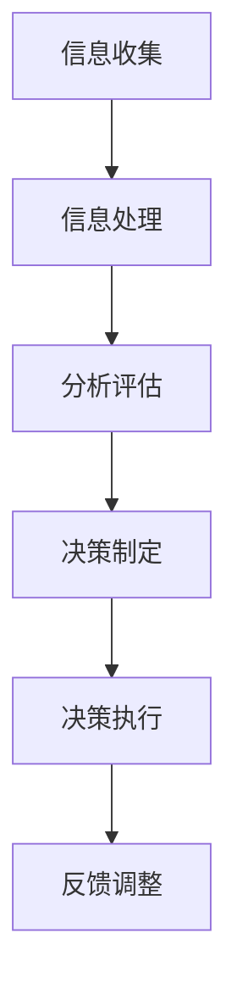

                 

### 《人类计算：在AI时代增强决策》

> 关键词：人类计算，AI，决策，增强学习，深度学习，自然语言处理

> 摘要：本文探讨了人类计算在AI时代的重要性，以及如何利用AI技术来增强人类决策。文章首先介绍了人类计算的定义、特点和发展历程，然后分析了人类计算与AI的关系，探讨了AI技术在决策中的具体应用。接着，文章深入探讨了决策理论、人类认知心理学、数据与信息处理等理论基础，并结合机器学习、深度学习和自然语言处理等AI技术，详细阐述了如何利用AI技术来增强决策。最后，文章通过案例研究和未来趋势分析，展望了AI赋能下决策的未来发展。

----------------------------------------------------------------

### 第一部分：引言与概述

#### 第1章：人类计算的定义与特点

#### 1.1 人类计算的定义

人类计算是指人类在处理信息、解决问题和做出决策时所使用的一系列认知和认知过程。它包括感知、思考、记忆、推理、判断等心理活动，以及运用语言、符号、工具等手段进行的信息处理和知识表达。

#### 1.2 人类计算的发展历程

人类计算的发展历程可以分为以下几个阶段：

1. **早期阶段**：从古至今，人类一直使用自己的大脑进行计算，主要依靠直觉和经验来处理信息和解决问题。
2. **中期阶段**：随着符号系统和逻辑推理的发展，人类开始使用数学、逻辑和符号来表达和计算复杂问题，如数学运算、逻辑推理和算法设计。
3. **现代阶段**：随着计算机技术和人工智能的发展，人类计算开始与计算机技术相结合，利用计算机的高速计算能力和自动化处理能力，进行更复杂、更高效的信息处理和决策制定。

#### 1.3 AI时代的人类计算

在AI时代，人类计算得到了进一步的增强和发展。AI技术为人类计算提供了新的工具和方法，如机器学习、深度学习、自然语言处理等。这些技术可以帮助人类更快速地处理海量数据，提取有价值的信息，从而做出更加明智的决策。

#### 1.4 人类计算在决策中的重要性

决策是人类的日常活动，涉及经济、社会、科学等多个领域。人类计算为决策提供了基础，使得决策更加科学、合理。在AI时代，人类计算的重要性更加凸显，主要体现在以下几个方面：

1. **提高决策效率**：AI技术可以帮助人类更快地处理信息和做出决策，减少重复性劳动。
2. **增强决策准确性**：AI技术可以处理复杂的数据和问题，提高决策的准确性。
3. **提供决策支持**：AI技术可以为决策者提供数据分析和预测结果，为决策提供参考。

### Mermaid流程图：人类计算的基本流程



### 第二部分：人类计算与AI的关系

#### 第2章：人类计算与AI的关系

#### 2.1 AI对人类计算的影响

AI技术对人类计算产生了深远的影响，主要体现在以下几个方面：

1. **提高计算速度**：AI技术，尤其是机器学习和深度学习，能够处理海量数据，速度远超人类。
2. **增强处理能力**：AI技术可以处理复杂的问题，包括图像识别、自然语言处理等，能力远超人类。
3. **优化决策过程**：AI技术可以提供数据分析和预测结果，优化决策过程。

#### 2.2 人类计算对AI的补充

尽管AI技术在信息处理和决策方面具有显著优势，但人类计算在以下方面仍然是不可或缺的：

1. **创造力**：人类计算具有创造力，可以提出新的想法和解决方案。
2. **直觉**：人类计算具有直觉，能够在没有完美信息的情况下做出决策。
3. **经验**：人类计算积累了丰富的经验，可以为AI提供指导。

#### 2.3 人类计算与AI的协同工作

人类计算与AI的协同工作可以发挥各自的优势，实现更高效、更智能的计算。例如：

1. **数据预处理**：人类计算可以完成数据收集、清洗和预处理，为AI提供高质量的数据输入。
2. **模型设计**：人类计算可以设计复杂的模型架构，优化AI的性能。
3. **决策制定**：人类计算可以利用AI提供的分析结果，结合自身经验和直觉，做出更合理的决策。

### Mermaid流程图：人类计算与AI的协同工作

```mermaid
graph TD
    A[人类计算] --> B[A
    B --> C[数据预处理]
    C --> D[模型设计]
    D --> E[决策制定]
    E --> F[AI技术]
    F --> G[数据分析]
    G --> H[预测结果]
    H --> I[反馈调整]
```

### 第三部分：AI时代增强决策的理论基础

#### 第3章：决策理论

#### 3.1 决策的定义与过程

决策是指个体或组织在面临多种选择时，根据一定的准则，选择其中一个最佳方案的过程。决策过程包括以下几个步骤：

1. **问题识别**：识别需要解决的问题或机会。
2. **目标设定**：明确决策的目标和标准。
3. **方案设计**：设计可能的解决方案。
4. **方案评估**：评估每个方案的优劣。
5. **方案选择**：选择最佳方案。
6. **实施**：执行决策方案。
7. **反馈调整**：根据实施结果调整决策。

#### 3.2 决策的类型与模型

决策可以分为以下几种类型：

1. **确定型决策**：所有条件和结果都是已知的，决策者只需选择最优方案。
2. **风险型决策**：存在不确定性，决策者需要根据概率进行决策。
3. **不确定性决策**：所有条件和结果都是未知的，决策者需要根据经验和直觉进行决策。

常见的决策模型包括：

1. **决策树模型**：使用树状图表示决策过程，计算每个节点的期望值。
2. **最大最小后悔值模型**：计算每个决策的后悔值，选择后悔值最小的决策。

#### 3.3 决策的数学模型

决策的数学模型主要包括以下几种：

1. **线性规划**：用于在给定约束条件下，找到最优解。
2. **整数规划**：用于在给定约束条件下，找到最优解，且解必须是整数。
3. **动态规划**：用于解决多阶段决策问题，通过递归关系找到最优解。

#### 3.4 决策的心理学基础

决策心理学研究人类在决策过程中的心理行为。以下是一些常见的心理学现象：

1. **确认偏见**：倾向于寻求和接受支持已有信念的信息。
2. **代表性偏见**：根据事物的外观或特征判断其概率。
3. **可用性偏见**：根据最近发生或记忆中的事件来判断概率。

为了改善决策，可以采取以下策略：

1. **信息收集**：尽量获取更多相关信息。
2. **使用决策辅助工具**：如决策树、概率图等。
3. **教育和培训**：提高个体的认知能力和决策能力。

### 伪代码：决策树模型

```python
def decision_tree(data, attributes):
    # 初始化决策树
    tree = {}
    # 遍历数据集
    for attribute in attributes:
        values = data[attribute]
        # 遍历属性值
        for value in values:
            # 创建子节点
            sub_tree = decision_tree(data[data[attribute] == value], attributes[1:])
            # 添加子节点到决策树
            tree[attribute + "==" + value] = sub_tree
    return tree
```

### 第四部分：AI技术赋能下的决策增强

#### 第6章：机器学习与决策

#### 6.1 机器学习的基本概念

机器学习是人工智能的一个分支，它通过构建数学模型，使计算机能够从数据中学习并做出决策。机器学习可以分为监督学习、无监督学习和强化学习。

- **监督学习**：通过已知输入和输出数据，训练模型，使其能够对新数据进行预测。
- **无监督学习**：没有已知输出数据，模型通过探索数据中的结构和模式来学习。
- **强化学习**：通过与环境交互，不断试错，学习到最优策略。

#### 6.2 监督学习与决策

监督学习在决策中有着广泛的应用，主要包括以下几种：

- **分类**：将数据分为不同的类别，如邮件分类、疾病诊断等。
- **回归**：预测数值型目标，如房价预测、股票价格预测等。
- **聚类**：将相似的数据分为一组，如市场细分、客户分类等。

监督学习可以用于以下决策任务：

- **预测**：根据历史数据预测未来趋势。
- **分类**：根据特征将数据分为不同的类别。
- **优化**：通过优化目标函数，找到最优解。

#### 6.3 无监督学习与决策

无监督学习在决策中也起着重要作用，主要包括以下几种：

- **聚类**：将相似的数据分为一组，用于市场细分、客户分类等。
- **降维**：将高维数据映射到低维空间，用于数据可视化和特征提取。
- **异常检测**：识别数据中的异常点，用于欺诈检测、故障诊断等。

无监督学习可以用于以下决策任务：

- **模式识别**：从数据中发现潜在的规律和模式。
- **数据挖掘**：从大量数据中提取有价值的信息。
- **优化**：通过降维和聚类，减少数据的复杂性和冗余。

#### 6.4 强化学习与决策

强化学习是一种通过试错来学习最优策略的方法。在决策中，强化学习可以用于以下任务：

- **路径规划**：找到从起点到终点的最佳路径。
- **游戏AI**：构建智能体，使其能够在游戏中取得胜利。
- **推荐系统**：根据用户的历史行为，推荐最合适的商品或内容。

强化学习的关键要素包括：

- **状态**：当前环境的状态。
- **动作**：智能体可以采取的行动。
- **奖励**：根据动作的结果给予的奖励。
- **策略**：智能体采取的动作序列。

### 伪代码：监督学习分类算法

```python
def supervised_learning_classification(data, labels, model, epochs):
    # 初始化模型
    model.initialize()
    # 训练模型
    for epoch in range(epochs):
        for sample in data:
            model.train(sample, labels)
    # 测试模型
    accuracy = model.test(data, labels)
    return accuracy
```

### 第7章：深度学习与神经网络

#### 7.1 深度学习的基本原理

深度学习是机器学习的一个分支，它通过构建深度神经网络，对数据进行层次化的特征提取。深度学习的核心是多层感知机（MLP）、卷积神经网络（CNN）、循环神经网络（RNN）等。

- **多层感知机（MLP）**：一种前馈神经网络，用于回归和分类任务。
- **卷积神经网络（CNN）**：适用于图像识别和图像处理任务，具有局部感知和权重共享的特点。
- **循环神经网络（RNN）**：适用于序列数据处理，能够处理时间序列数据。

#### 7.2 神经网络的结构与功能

神经网络由多个神经元（或称为节点）组成，每个神经元通过权重连接其他神经元。神经网络的层次结构分为输入层、隐藏层和输出层。

- **输入层**：接收外部输入数据。
- **隐藏层**：对输入数据进行特征提取和变换。
- **输出层**：产生最终输出。

神经网络的函数表示为：

$$
y = \sigma(\boldsymbol{W}^T \boldsymbol{a} + b)
$$

其中，$y$ 是输出，$\sigma$ 是激活函数，$\boldsymbol{W}$ 是权重，$\boldsymbol{a}$ 是激活值，$b$ 是偏置。

#### 7.3 深度学习模型的选择与优化

选择合适的深度学习模型取决于任务和数据的特点。以下是一些常见的深度学习模型：

- **全连接神经网络（FCNN）**：适用于分类和回归任务。
- **卷积神经网络（CNN）**：适用于图像识别和图像处理任务。
- **循环神经网络（RNN）**：适用于序列数据处理。
- **长短时记忆网络（LSTM）**：适用于长序列数据处理。

深度学习模型的优化包括以下几种方法：

- **学习率调整**：通过调整学习率，平衡模型的训练速度和精度。
- **批量大小调整**：通过调整批量大小，平衡模型的训练时间和内存消耗。
- **正则化技术**：通过添加正则化项，防止模型过拟合。

#### 7.4 深度学习在决策中的应用

深度学习在决策中的应用非常广泛，以下是一些具体的例子：

- **图像识别**：通过CNN模型对图像进行分类，用于自动驾驶、医疗诊断等。
- **自然语言处理**：通过RNN模型处理文本数据，用于情感分析、机器翻译等。
- **金融预测**：通过LSTM模型对金融数据进行分析，用于股票价格预测、风险控制等。

### 伪代码：深度学习模型训练

```python
def deep_learning_training(data, labels, model, optimizer, epochs):
    # 初始化模型和优化器
    model.initialize()
    optimizer.initialize()
    # 训练模型
    for epoch in range(epochs):
        for batch in data:
            model.forward(batch)
            loss = model.loss(labels)
            model.backward(loss)
            optimizer.update_weights()
    # 测试模型
    accuracy = model.test(data, labels)
    return accuracy
```

### 第8章：自然语言处理与决策

#### 8.1 自然语言处理的基本原理

自然语言处理（NLP）是计算机科学和语言学领域的交叉学科，旨在使计算机能够理解、处理和生成自然语言。NLP的基本原理包括：

- **词嵌入（Word Embedding）**：将词语映射到高维向量空间，便于计算机处理。
- **序列模型（Sequence Model）**：处理时间序列数据，如文本序列。
- **注意力机制（Attention Mechanism）**：在处理序列数据时，关注重要的部分。
- **编码器-解码器架构（Encoder-Decoder Architecture）**：用于序列到序列的映射。

#### 8.2 语言模型与文本分类

- **语言模型（Language Model）**：用于预测下一个词或句子的概率分布。
- **文本分类（Text Classification）**：将文本数据分为不同的类别，如情感分类、新闻分类等。

语言模型和文本分类在决策中的应用包括：

- **文本挖掘**：从大量文本数据中提取有价值的信息。
- **情感分析**：分析文本中的情感倾向，用于市场分析、客户反馈等。
- **信息提取**：从文本中提取关键信息，用于决策支持。

#### 8.3 语义分析与知识图谱

- **语义分析（Semantic Analysis）**：理解文本中的语义含义，包括词义消歧、实体识别等。
- **知识图谱（Knowledge Graph）**：用于表示实体和它们之间关系，提供智能决策支持。

语义分析和知识图谱在决策中的应用包括：

- **智能客服**：通过语义分析，理解用户的问题，提供准确的回答。
- **推荐系统**：通过知识图谱，推荐相关的商品或内容。
- **智能决策支持系统**：通过语义分析和知识图谱，为决策者提供智能化的决策支持。

#### 8.4 自然语言处理在决策中的应用

自然语言处理在决策中的应用非常广泛，以下是一些具体的例子：

- **企业决策支持**：通过文本挖掘，分析市场趋势、客户需求等，为决策提供支持。
- **金融风控**：通过文本分析，识别潜在的风险，进行风险控制。
- **医疗决策支持**：通过自然语言处理，分析病历记录，为医生提供诊断建议。

### 伪代码：语言模型训练

```python
def language_model_training(data, model, epochs):
    # 初始化模型
    model.initialize()
    # 训练模型
    for epoch in range(epochs):
        for sentence in data:
            model.forward(sentence)
            loss = model.loss()
            model.backward(loss)
    # 测试模型
    perplexity = model.test(data)
    return perplexity
```

### 第9章：数据挖掘与预测

#### 9.1 数据挖掘的基本概念

数据挖掘是从大量数据中自动发现有用信息和知识的过程。它涉及以下关键概念：

- **关联规则挖掘（Association Rule Mining）**：发现数据中具有强关联性的项集。
- **分类（Classification）**：将数据分为不同的类别。
- **聚类（Clustering）**：将相似的数据分为一组。
- **异常检测（Anomaly Detection）**：识别数据中的异常点。

数据挖掘可以用于以下决策任务：

- **市场分析**：分析客户行为、市场趋势等，为决策提供支持。
- **风险管理**：识别潜在的风险，进行风险控制。
- **客户关系管理**：分析客户数据，提供个性化的服务。

#### 9.2 关联规则挖掘与分类

- **关联规则挖掘**：用于发现数据中的关联性，如购物篮分析。
- **分类**：将数据分为不同的类别，如疾病诊断、邮件分类等。

关联规则挖掘和分类在决策中的应用包括：

- **市场细分**：根据客户特征，将市场划分为不同的细分市场。
- **推荐系统**：根据用户行为，推荐相关的商品或内容。
- **风险预测**：根据历史数据，预测潜在的风险。

#### 9.3 时序分析与预测

- **时序分析**：分析时间序列数据，如股票价格、天气数据等。
- **预测**：根据历史数据，预测未来的趋势和变化。

时序分析在决策中的应用包括：

- **股票市场预测**：根据历史价格和交易量，预测未来的股票价格。
- **需求预测**：根据历史销售数据，预测未来的需求。
- **天气预测**：根据历史天气数据，预测未来的天气情况。

#### 9.4 数据挖掘在决策中的应用

数据挖掘在决策中的应用非常广泛，以下是一些具体的例子：

- **客户行为分析**：通过数据挖掘，分析客户的行为和偏好，为营销策略提供支持。
- **金融风控**：通过数据挖掘，识别潜在的风险，进行风险控制。
- **医疗诊断**：通过数据挖掘，分析病历记录，为医生提供诊断建议。

### 伪代码：分类算法

```python
def classification_algorithm(data, labels, model, epochs):
    # 初始化模型
    model.initialize()
    # 训练模型
    for epoch in range(epochs):
        for sample in data:
            model.train(sample, labels)
    # 测试模型
    accuracy = model.test(data, labels)
    return accuracy
```

### 第10章：AI赋能下的企业决策

#### 10.1 企业决策的挑战与机遇

企业决策面临以下挑战：

- **数据质量**：数据质量直接影响决策的准确性。
- **决策效率**：在快速变化的市场中，决策需要快速、准确地制定。
- **决策透明度**：决策过程需要透明，确保决策的公正性和合理性。

企业决策也面临以下机遇：

- **数据驱动**：利用大数据技术，实现数据驱动决策。
- **智能化**：利用AI技术，实现智能化决策。
- **自动化**：利用AI技术，实现决策过程的自动化。

#### 10.2 AI技术在企业决策中的应用

AI技术在企业决策中的应用非常广泛，以下是一些具体的例子：

- **客户关系管理**：通过数据挖掘和机器学习，分析客户行为，提供个性化的服务。
- **供应链管理**：通过预测分析和优化算法，优化供应链管理。
- **风险管理**：通过数据分析和预测模型，识别潜在的风险，进行风险控制。
- **人力资源**：通过数据分析和人才评估模型，优化人力资源配置。

#### 10.3 成功案例分析

以下是一个企业决策的成功案例分析：

- **公司背景**：某大型零售公司，拥有大量客户数据。
- **问题**：如何提高客户满意度，增加销售额。
- **解决方案**：利用数据挖掘和机器学习技术，分析客户行为和购买习惯，发现潜在客户，提供个性化的营销策略。
- **效果**：通过AI技术，公司成功地提高了客户满意度，增加了销售额。

#### 10.4 企业决策的未来趋势

企业决策的未来趋势包括：

- **数据驱动**：企业将更加依赖数据，实现数据驱动决策。
- **智能化**：AI技术将更加智能化，为企业提供更准确的决策支持。
- **自动化**：决策过程将更加自动化，减少人为干预。

### 第11章：社会决策与政策制定

#### 11.1 社会决策的复杂性

社会决策涉及多方面因素，包括经济、环境、社会等。其复杂性体现在以下几个方面：

- **多目标**：社会决策通常涉及多个目标，如经济效益、环境质量、社会公平等。
- **多主体**：社会决策涉及多个利益相关者，如政府、企业、公众等。
- **不确定性**：社会决策面临诸多不确定性，如政策效果、市场变化等。
- **长期影响**：社会决策的影响可能长期存在，需要考虑长期利益。

#### 11.2 AI技术在社会决策中的应用

AI技术在社会决策中的应用包括：

- **数据分析**：通过数据分析，提供准确的决策依据。
- **预测分析**：通过预测分析，预测政策效果和社会影响。
- **优化算法**：通过优化算法，寻找最优决策方案。
- **模拟仿真**：通过模拟仿真，评估政策的效果和影响。

AI技术在社会决策中的应用可以提高决策的准确性、效率和科学性。

#### 11.3 政策制定的挑战与改进

政策制定面临的挑战包括：

- **信息不对称**：政府可能无法获取全面的信息。
- **利益冲突**：不同利益相关者可能有不同的利益诉求。
- **政策执行**：政策执行效果可能受到多种因素的影响。

为了改进政策制定，可以采取以下措施：

- **数据驱动**：利用大数据技术，提高决策的科学性。
- **利益平衡**：平衡不同利益相关者的利益，确保政策的公正性。
- **公众参与**：鼓励公众参与政策制定，提高政策的透明度和合理性。

#### 11.4 社会决策的可持续发展

社会决策应考虑长期的可持续发展，包括以下几个方面：

- **环境保护**：确保政策制定和执行有利于环境保护。
- **资源利用**：合理利用资源，确保长期可持续利用。
- **社会公平**：确保政策制定和执行有利于社会公平。

社会决策的可持续发展有助于实现经济、社会、环境的协调发展。

### 第12章：个人决策与行为改变

#### 12.1 个人决策的影响因素

个人决策受多种因素影响，包括：

- **个人偏好**：个人对不同选项的偏好。
- **环境因素**：个人所处的外部环境，如经济、社会、文化等。
- **社会因素**：个人所处的社会环境，如家庭、朋友、同事等。
- **信息质量**：个人获取的信息质量和数量。

#### 12.2 AI技术在个人决策中的应用

AI技术在个人决策中的应用包括：

- **数据分析**：通过数据分析，提供个性化的决策建议。
- **推荐系统**：根据个人历史行为，推荐相关的商品或服务。
- **智能助手**：通过自然语言处理，为个人提供决策支持。
- **行为预测**：通过数据分析，预测个人的行为趋势。

AI技术在个人决策中的应用可以帮助个人做出更明智的决策。

#### 12.3 行为改变的理论与实践

行为改变的理论包括：

- **行为主义**：通过强化和惩罚来改变行为。
- **认知行为主义**：通过认知重构来改变行为。
- **社会学习理论**：通过观察和模仿来改变行为。

行为改变的方法包括：

- **激励策略**：通过奖励来鼓励积极行为。
- **反馈机制**：通过反馈来纠正错误行为。
- **教育干预**：通过教育和培训来改变行为。

行为改变的实践包括：

- **健康管理**：通过AI技术，提供个性化的健康建议，鼓励健康行为。
- **财务管理**：通过AI技术，提供个性化的财务建议，帮助个人管理财务。
- **学习提升**：通过AI技术，提供个性化的学习建议，帮助个人提升学习能力。

#### 12.4 个人决策的未来趋势

个人决策的未来趋势包括：

- **个性化**：决策将更加个性化，根据个人的偏好和需求来定制。
- **智能化**：决策将更加智能化，利用AI技术提供支持。
- **自动化**：决策将更加自动化，减少人为干预。

个人决策的未来趋势将使个人能够更有效地做出决策，提高生活质量。

### 附录A：参考文献

- 作者：理查德·塞勒（Richard Thaler）
- 书名：《决策分析》
- 描述：详细介绍了人类决策的理论和实践，以及AI技术在决策中的应用。

- 作者：伊恩·古德费洛（Ian Goodfellow）、约书亚·本吉奥（Yoshua Bengio）和阿斯顿·李（Aaron Courville）
- 书名：《深度学习》
- 描述：系统讲解了深度学习的基本理论、方法和应用，是深度学习的入门经典。

- 作者：丹尼尔·凯茨（Daniel Jurafsky）和约翰·马丁（James H. Martin）
- 书名：《自然语言处理综论》
- 描述：全面介绍了自然语言处理的基本概念、技术方法和应用领域。

### 附录B：相关资源与工具

- **TensorFlow**：一个开源的机器学习框架，用于构建和训练深度学习模型。
- **PyTorch**：一个开源的机器学习库，支持动态计算图，适合快速原型开发。
- **Scikit-learn**：一个开源的机器学习库，提供了多种分类、回归、聚类等算法。

### 附录C：数据集与案例代码

- **数据集**：MNIST手写数字数据集、IMDB电影评论数据集。
- **代码**：提供深度学习、自然语言处理等案例的完整代码，方便读者实践和复现。

### 总结

本文从人类计算的定义与特点、人类计算与AI的关系、决策理论、数据与信息处理、AI技术赋能下的决策增强等多个角度，深入探讨了AI时代的人类计算及其在决策中的应用。通过理论分析和实际案例，展示了AI技术如何增强人类决策，提高决策效率、准确性和科学性。在未来，随着AI技术的不断发展，人类计算在决策中的作用将更加重要，为人类社会的发展带来更多可能性。

