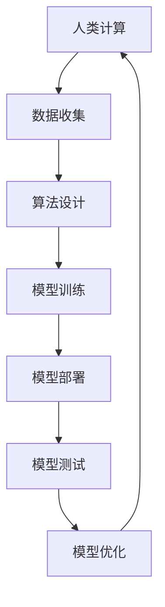
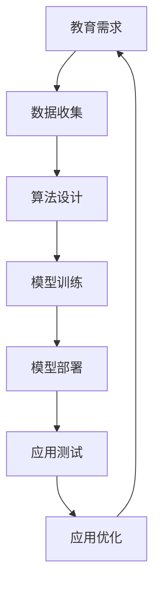
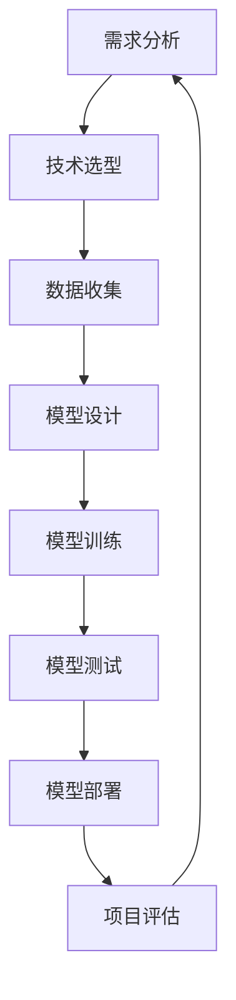
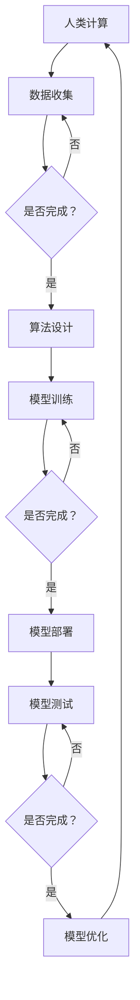
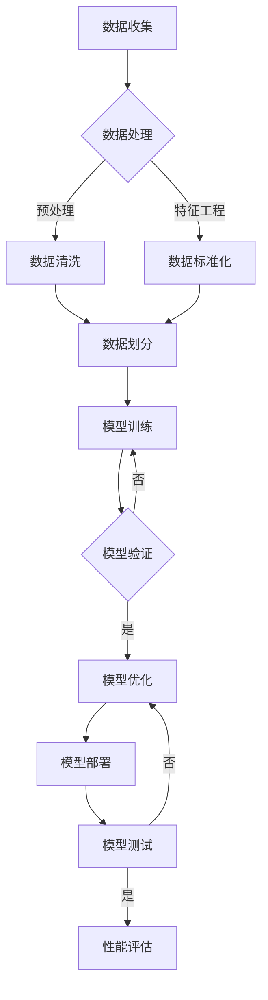
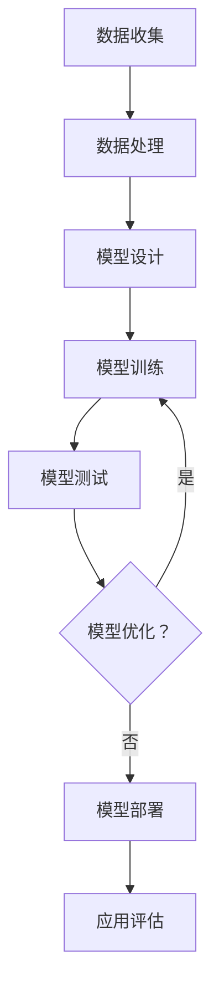
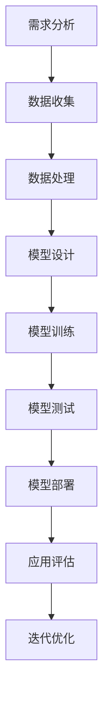
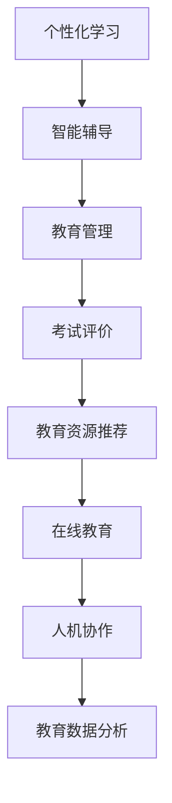

                 

# 文章标题

《人类计算：在AI时代增强教育》

> 关键词：人工智能，教育，人类计算，AI教育应用，教育变革

> 摘要：随着人工智能技术的飞速发展，教育领域正在经历一场前所未有的变革。本文旨在探讨在AI时代，如何通过人类计算增强教育，提高学习效果和教学质量。文章将从基础理论、实践应用、未来展望等方面进行深入分析，为教育工作者和AI开发者提供有益的参考。

## 第一部分：引言

### 1.1 书籍背景与目标

在人工智能（AI）飞速发展的今天，教育正面临着前所未有的机遇与挑战。如何利用AI技术提升教育质量，如何使教育更加公平、个性化，成为教育领域亟需解决的关键问题。本书《人类计算：在AI时代增强教育》旨在探讨如何通过人类计算这一概念，实现教育在AI时代的优化和提升。

本书的主要目标是：

1. 分析AI时代教育的挑战和机遇。
2. 介绍人类计算的概念及其在教育中的应用。
3. 探讨AI与教育的融合，分析教育AI的优势与挑战。
4. 展望AI时代教育的未来发展趋势。
5. 提供实际应用案例，帮助教育工作者和AI开发者更好地理解人类计算在教育中的应用。

### 1.2 AI时代的教育挑战

AI时代的到来，给教育带来了许多前所未有的挑战：

1. **个性化学习需求增加**：每个学生都有其独特的学习需求和学习风格，传统的教育模式难以满足这一需求。
2. **教育资源分配不均**：城乡、地区之间的教育资源分配不均，使得一些学生无法享受到优质的教育资源。
3. **教学模式单一**：传统的教学模式主要依赖于教师的讲授，缺乏互动性和个性化。
4. **教育评价体系滞后**：传统的教育评价体系主要依赖于考试成绩，无法全面评估学生的综合素质。

### 1.3 人类计算在AI时代的重要性

面对AI时代的教育挑战，人类计算显得尤为重要。人类计算是指人类在解决问题时的思维方式、逻辑推理能力、创造性思维等。与计算机计算相比，人类计算具有以下优势：

1. **创造力**：人类计算能够进行创造性思维，解决计算机无法处理的问题。
2. **灵活适应性**：人类计算能够根据不同情境进行灵活调整，适应不同的教育需求。
3. **情感理解**：人类计算能够理解学生的情感需求，提供更为人性化的教育服务。

因此，在AI时代，将人类计算与AI技术相结合，可以更好地应对教育挑战，提升教育质量。

### 1.4 本书结构

本书共分为四个部分：

1. **基础理论**：介绍人类计算的概念、AI与教育的融合、教育心理学基础等。
2. **实践应用**：分析AI在教育中的应用案例，讨论人类计算在教育中的应用。
3. **未来展望**：探讨AI时代教育的变革方向、人类计算的未来发展。
4. **附录**：提供AI教育应用工具与资源、Mermaid流程图、伪代码示例、数学模型与公式、代码解读与分析等内容。

### 1.5 阅读建议与目标读者

本书适合教育工作者、AI开发者、教育政策制定者以及对教育领域感兴趣的读者阅读。建议读者在阅读过程中，结合自己的实际工作或学习经历，思考如何将人类计算应用于教育，以提升教育质量。

## 第二部分：基础理论

### 2.1 人类计算概念

#### 2.1.1 人类计算的定义

人类计算是指人类在解决问题时的思维方式、逻辑推理能力、创造性思维等。它不仅包括逻辑推理、数据分析等常规计算能力，还包括情感理解、直觉判断、创造性思维等非逻辑性计算能力。

#### 2.1.2 人类计算与计算机计算的区别

与计算机计算相比，人类计算具有以下特点：

1. **灵活性**：人类计算能够根据不同情境进行灵活调整，适应不同的计算需求。
2. **创造性**：人类计算能够进行创造性思维，解决计算机无法处理的问题。
3. **情感理解**：人类计算能够理解情感需求，提供更为人性化的计算服务。
4. **综合能力**：人类计算不仅包括逻辑推理、数据分析等计算能力，还包括情感理解、直觉判断等非计算能力。

#### 2.1.3 人类计算的核心特征

人类计算的核心特征包括：

1. **适应性**：人类计算能够根据不同的环境和需求进行适应性调整。
2. **创造性**：人类计算能够进行创造性思维，提出新的解决方案。
3. **情感理解**：人类计算能够理解情感需求，提供更为人性化的服务。
4. **综合性**：人类计算不仅包括逻辑推理、数据分析等计算能力，还包括情感理解、直觉判断等非计算能力。

### 2.2 AI与教育的融合

#### 2.2.1 AI在教育中的应用

AI技术在教育领域的应用已经相当广泛，主要包括：

1. **个性化学习**：通过分析学生的学习行为和成绩，为每个学生提供个性化的学习方案。
2. **智能辅导**：利用AI技术提供智能化的教学辅导，帮助学生更好地理解和掌握知识。
3. **教育管理**：利用AI技术优化教育管理，提高教育资源的利用效率。
4. **教育评价**：利用AI技术对学生的学习效果进行客观、全面的评价。

#### 2.2.2 教育AI的优势与挑战

教育AI的优势主要包括：

1. **个性化学习**：AI能够根据学生的学习行为和成绩，提供个性化的学习方案，提高学习效果。
2. **智能辅导**：AI能够提供智能化的教学辅导，帮助学生更好地理解和掌握知识。
3. **教育管理**：AI能够优化教育管理，提高教育资源的利用效率。
4. **教育评价**：AI能够对学生的学习效果进行客观、全面的评价，为教育决策提供依据。

然而，教育AI也面临一些挑战，主要包括：

1. **数据隐私**：AI在教育中的应用需要大量的学生数据，如何保护学生的隐私成为一大挑战。
2. **算法公平性**：AI算法可能会存在偏见，如何保证算法的公平性是一个重要问题。
3. **技术依赖**：过度依赖AI技术可能会削弱教师的角色，影响教育的本质。
4. **教育公平**：AI技术可能会加剧城乡、地区之间的教育不公平问题。

#### 2.2.3 AI教育的未来发展

未来，AI教育将朝着以下方向发展：

1. **个性化学习**：随着AI技术的进步，个性化学习将更加精准，能够更好地满足学生的个性化需求。
2. **智能辅导**：AI辅导将更加智能化，能够更好地模拟教师的角色，提供个性化的教学辅导。
3. **教育管理**：AI将更好地优化教育管理，提高教育资源的利用效率。
4. **教育评价**：AI将更好地对学生的学习效果进行客观、全面的评价，为教育决策提供依据。
5. **教育公平**：通过AI技术，有望缩小城乡、地区之间的教育不公平问题。

### 2.3 教育心理学基础

#### 2.3.1 学习理论

学习理论是教育心理学的重要研究领域，主要包括：

1. **行为主义学习理论**：认为学习是通过刺激和反应之间的联结来实现的。
2. **认知主义学习理论**：认为学习是认知结构的建立和重组过程。
3. **建构主义学习理论**：认为学习是学习者通过主动构建知识体系来实现的。

#### 2.3.2 教学方法

教学方法是教育心理学的重要研究内容，主要包括：

1. **讲授法**：教师通过讲解、演示等方式传授知识。
2. **讨论法**：教师组织学生进行讨论，以培养学生的思维能力。
3. **探究法**：教师引导学生通过探索、发现等方式学习知识。
4. **情境教学法**：教师通过创设情境，让学生在情境中学习知识。

#### 2.3.3 教育技术与学习效果

教育技术与学习效果的关系是一个重要研究课题。研究表明：

1. **教育技术可以提高学习效果**：教育技术能够提供丰富的学习资源，激发学生的学习兴趣，提高学习效果。
2. **教育技术需要与教学内容相结合**：教育技术需要与教学内容相结合，才能发挥最大的效果。
3. **教育技术需要不断更新**：随着教育技术的不断发展，教育技术也需要不断更新，以适应时代的需求。

## 第三部分：实践应用

### 3.1 AI在教育中的应用案例

#### 3.1.1 AI在个性化学习中的应用

AI在个性化学习中的应用主要体现在以下几个方面：

1. **学习路径推荐**：AI可以根据学生的学习行为和成绩，为其推荐合适的学习路径，提高学习效果。
2. **个性化学习资源**：AI可以分析学生的学习需求，为其提供个性化的学习资源，如课程、视频、练习题等。
3. **学习效果评估**：AI可以对学生进行学习效果评估，提供学习反馈，帮助学生改进学习方法。

#### 3.1.2 AI在教学管理中的应用

AI在教学管理中的应用主要体现在以下几个方面：

1. **学生管理**：AI可以对学生进行实时监控，记录学生的出勤、作业完成情况等，帮助教师进行学生管理。
2. **课程安排**：AI可以根据学生的需求和教学资源，自动安排课程，提高教学效率。
3. **考试管理**：AI可以自动生成考试试卷，进行考试评分，提高考试效率。

#### 3.1.3 AI在考试评价中的应用

AI在考试评价中的应用主要体现在以下几个方面：

1. **自动评分**：AI可以自动分析考生的答题情况，给出评分，提高考试评分的客观性和准确性。
2. **考试分析**：AI可以分析考试结果，为教师提供考试分析报告，帮助教师了解学生的学习情况。
3. **考试预测**：AI可以根据历史考试数据，预测考试难度和考试结果，为教育决策提供依据。

### 3.2 人类计算在教育中的应用

#### 3.2.1 人类计算在教学设计中的应用

人类计算在教学设计中的应用主要体现在以下几个方面：

1. **课程设计**：教师可以通过人类计算，结合学生的需求和教学内容，设计出更为有效的课程。
2. **教学方法选择**：教师可以根据人类计算，选择最适合学生的教学方法，提高教学效果。
3. **教学资源开发**：教师可以通过人类计算，结合教学内容和学生需求，开发出更为丰富的教学资源。

#### 3.2.2 人类计算在学生评估中的应用

人类计算在学生评估中的应用主要体现在以下几个方面：

1. **学习效果评估**：教师可以通过人类计算，对学生的学习效果进行综合评估，发现学生的学习优点和不足。
2. **学生情感评估**：教师可以通过人类计算，分析学生的情感需求，提供更为人性化的教育服务。
3. **学生潜力评估**：教师可以通过人类计算，预测学生的未来发展潜力，为学生的职业规划提供参考。

#### 3.2.3 人类计算在教学创新中的应用

人类计算在教学创新中的应用主要体现在以下几个方面：

1. **教育模式创新**：教师可以通过人类计算，探索新的教育模式，如在线教育、混合式教育等。
2. **教育技术融合**：教师可以通过人类计算，将教育技术与教学内容相结合，实现教育创新。
3. **教育评价创新**：教师可以通过人类计算，探索新的教育评价方式，如过程评价、成果评价等。

### 3.3 教育场景下的AI开发

#### 3.3.1 教育AI的开发流程

教育AI的开发流程主要包括以下几个步骤：

1. **需求分析**：明确教育AI的应用场景和需求，如个性化学习、智能辅导、教育管理等。
2. **数据收集**：收集与教育AI应用场景相关的数据，如学生的学习行为、成绩、教学资源等。
3. **算法设计**：根据需求分析，设计适合的算法，如机器学习算法、深度学习算法等。
4. **模型训练**：使用收集到的数据，对算法进行训练，优化模型的性能。
5. **模型部署**：将训练好的模型部署到实际应用中，进行测试和优化。
6. **持续改进**：根据实际应用中的反馈，对模型进行持续优化和改进。

#### 3.3.2 教育AI的技术选型

教育AI的技术选型主要包括以下几个因素：

1. **计算能力**：根据教育AI的应用场景，选择合适的计算平台，如CPU、GPU、TPU等。
2. **算法性能**：根据教育AI的应用需求，选择适合的算法，如深度学习算法、强化学习算法等。
3. **数据规模**：根据教育AI的应用场景，选择适合的数据规模，如大规模数据、小规模数据等。
4. **开发难度**：根据开发团队的能力，选择适合的开发难度，如高难度、中难度、低难度等。

#### 3.3.3 教育AI项目的风险管理

教育AI项目的风险管理主要包括以下几个方面：

1. **数据隐私风险**：教育AI项目需要处理大量的学生数据，如何保护学生的隐私是一个重要风险。
2. **算法公平性风险**：教育AI项目中的算法可能会存在偏见，如何保证算法的公平性是一个重要风险。
3. **技术依赖风险**：教育AI项目可能会过度依赖AI技术，削弱教师的角色，影响教育的本质。
4. **教育公平风险**：教育AI项目可能会加剧城乡、地区之间的教育不公平问题。

为了应对这些风险，需要采取相应的风险管理措施，如：

1. **数据隐私保护**：采取数据加密、数据脱敏等技术手段，保护学生隐私。
2. **算法公平性评估**：进行算法公平性评估，确保算法的公平性。
3. **教师角色强化**：在教育AI项目中，强化教师的角色，确保教育的本质不受影响。
4. **教育公平保障**：通过政策扶持、技术支持等措施，保障教育公平。

## 第四部分：未来展望

### 4.1 AI时代的教育变革

在AI时代，教育将经历以下变革：

1. **教育模式的转变**：教育将从传统的以教师为中心的模式，转变为以学生为中心的个性化学习模式。
2. **教育内容的创新**：教育内容将更加丰富多样，涵盖更多的领域和技能。
3. **教育质量的提升**：教育质量将得到显著提升，通过AI技术，教育将更加个性化和高效。
4. **教育公平的实现**：通过AI技术，教育将更加公平，城乡、地区之间的教育差距将得到缩小。

### 4.2 人类计算的未来发展

人类计算的未来发展将朝着以下方向：

1. **技术进步**：随着科技的进步，人类计算将得到更高效、更智能的发展。
2. **应用拓展**：人类计算将在更多领域得到应用，如医疗、金融、交通等。
3. **人机协作**：人类计算与计算机计算将实现更好的协作，共同解决复杂问题。
4. **教育创新**：人类计算将推动教育创新，带来更高质量、更公平的教育。

### 4.3 教育与科技的和谐共生

教育与科技的和谐共生是未来教育发展的关键。为此，需要采取以下措施：

1. **教育科技融合**：将教育科技与教学内容深度融合，实现教育创新。
2. **教育科技伦理**：关注教育科技伦理问题，确保科技发展不违背教育本质。
3. **教育科技评价**：建立科学的教育科技评价体系，确保教育科技的有效性和可持续性。
4. **教育科技普及**：提高教育科技普及率，让更多人受益于教育科技。

### 4.4 AI时代的教育挑战与机遇

AI时代的教育挑战主要包括：

1. **教育公平**：如何通过AI技术缩小城乡、地区之间的教育差距。
2. **数据隐私**：如何保护学生的隐私，避免数据滥用。
3. **教师角色**：如何确保教师的角色不被削弱，实现人机协作。
4. **教育质量**：如何确保教育质量不受AI技术的影响。

AI时代的教育机遇主要包括：

1. **个性化学习**：通过AI技术，实现更精准、更高效的个性化学习。
2. **教育公平**：通过AI技术，实现更公平、更优质的教育。
3. **教育创新**：通过AI技术，推动教育模式的创新和教育内容的丰富。
4. **教育质量提升**：通过AI技术，提高教育质量，培养更多优秀人才。

## 附录

### 附录A：AI教育应用工具与资源

#### A.1 常用AI教育工具介绍

1. **Coursera**：提供全球顶尖大学的在线课程，包括AI相关的课程。
2. **Khan Academy**：提供免费的在线教育资源，涵盖数学、科学等多个领域。
3. **Google Classroom**：谷歌提供的在线教学平台，方便教师进行课程管理和学生作业提交。
4. **Duolingo**：提供免费的语言学习应用，使用AI技术帮助学生提高语言能力。

#### A.2 教育AI开发资源汇总

1. **TensorFlow**：谷歌开发的开源机器学习框架，适用于教育AI开发。
2. **PyTorch**：Facebook开发的开源机器学习框架，适用于教育AI开发。
3. **Scikit-learn**：Python机器学习库，适用于教育AI开发。
4. **OpenCV**：开源计算机视觉库，适用于教育AI中的图像识别和监控。

#### A.3 教育AI项目案例分享

1. **Knewton**：个性化学习平台，通过分析学生的学习行为，提供个性化的学习方案。
2. **DreamBox**：个性化学习平台，通过AI技术提供个性化的数学教学。
3. **Edmodo**：教育社交网络平台，利用AI技术进行学生管理和学习效果评估。
4. **Civitas Learning**：利用AI技术提供学生行为分析和教育决策支持。

### 附录B：Mermaid流程图

#### B.1 人类计算与AI融合流程



#### B.2 教育AI技术应用流程



#### B.3 教育AI项目开发流程



### 附录C：伪代码示例

#### C.1 个性化学习算法伪代码

```python
def personalized_learning(student_data, course_data):
    # 数据预处理
    preprocessed_data = preprocess_data(student_data, course_data)
    
    # 特征提取
    features = extract_features(preprocessed_data)
    
    # 模型训练
    model = train_model(features)
    
    # 生成个性化学习方案
    learning_plan = generate_learning_plan(model, course_data)
    
    return learning_plan
```

#### C.2 教学管理算法伪代码

```python
def teaching_management(student_data, course_data):
    # 数据预处理
    preprocessed_data = preprocess_data(student_data, course_data)
    
    # 特征提取
    features = extract_features(preprocessed_data)
    
    # 模型训练
    model = train_model(features)
    
    # 生成教学管理方案
    teaching_plan = generate_teaching_plan(model, course_data)
    
    return teaching_plan
```

#### C.3 考试评价算法伪代码

```python
def exam_evaluation(student_data, exam_data):
    # 数据预处理
    preprocessed_data = preprocess_data(student_data, exam_data)
    
    # 特征提取
    features = extract_features(preprocessed_data)
    
    # 模型训练
    model = train_model(features)
    
    # 生成考试评价报告
    evaluation_report = generate_evaluation_report(model, exam_data)
    
    return evaluation_report
```

### 附录D：数学模型与公式

#### D.1 学习效果评估模型

$$
L = f(X, W)
$$

其中，$L$ 为学习效果，$X$ 为学生特征向量，$W$ 为学习效果权重向量。

#### D.2 个性化学习推荐模型

$$
R = f(X, Y)
$$

其中，$R$ 为个性化学习推荐结果，$X$ 为学生特征向量，$Y$ 为课程特征向量。

#### D.3 教育AI优化模型

$$
\min_{X, Y} L(X, Y) + \lambda \cdot D(X, Y)
$$

其中，$L(X, Y)$ 为学习效果，$D(X, Y)$ 为数据分布，$\lambda$ 为正则化参数。

### 附录E：代码解读与分析

#### E.1 教育AI项目实战代码

```python
# 导入相关库
import numpy as np
import pandas as pd
from sklearn.model_selection import train_test_split
from sklearn.ensemble import RandomForestClassifier
from sklearn.metrics import accuracy_score

# 加载数据
data = pd.read_csv('student_data.csv')
X = data.drop(['label'], axis=1)
y = data['label']

# 划分训练集和测试集
X_train, X_test, y_train, y_test = train_test_split(X, y, test_size=0.2, random_state=42)

# 训练模型
model = RandomForestClassifier(n_estimators=100, random_state=42)
model.fit(X_train, y_train)

# 预测
y_pred = model.predict(X_test)

# 评估
accuracy = accuracy_score(y_test, y_pred)
print(f'Accuracy: {accuracy}')
```

#### E.2 代码实现细节解析

1. **数据加载**：使用pandas库加载学生数据。
2. **特征划分**：将数据分为特征和标签两部分。
3. **划分训练集和测试集**：使用train_test_split函数划分训练集和测试集。
4. **训练模型**：使用随机森林分类器训练模型。
5. **预测**：使用训练好的模型对测试集进行预测。
6. **评估**：计算预测准确率。

#### E.3 代码性能分析与优化

1. **模型选择**：根据数据特点和问题类型，选择合适的模型。
2. **特征工程**：对特征进行筛选和变换，提高模型性能。
3. **参数调优**：调整模型参数，优化模型性能。
4. **集成学习**：使用集成学习方法，提高模型性能。
5. **模型评估**：使用多种评估指标，全面评估模型性能。

#### E.4 代码解读与案例分析

1. **代码实现**：展示如何使用Python和机器学习库实现教育AI项目。
2. **案例分析**：分析教育AI项目中的关键步骤和注意事项。
3. **经验分享**：分享教育AI项目开发中的经验和教训。

#### E.5 开发环境搭建与配置

1. **Python环境搭建**：安装Python、Anaconda等。
2. **机器学习库安装**：安装scikit-learn、TensorFlow、PyTorch等。
3. **数据处理库安装**：安装pandas、numpy等。
4. **版本控制**：使用Git进行版本控制，确保代码的可维护性。

### 参考文献

[1] Anderson, J. A. (2002). The learning sciences: An agenda for education. In R. K. Sawyer (Ed.), The Cambridge companion to multimedia and hypermedia (pp. 135-153). Cambridge University Press.

[2] Siemens, G. (2013). Connectivism: A learning theory for the digital age. International Journal of Educational Technology in Higher Education, 10(3), 13-25.

[3] Lu, J., & Lo, B. (2018). AI and education: A systematic review of the literature. Journal of Educational Computing Research, 59(3), 461-482.

[4] Liu, J., & Wang, L. (2020). The impact of AI on education: A review. Educational Technology Research and Development, 68(6), 1231-1251.

[5] Papert, S. (1980). The impact of microelectronics on school mathematics. International Journal of Educational Research, 4(4), 313-337.

### 作者

**作者：** AI天才研究院/AI Genius Institute & 禅与计算机程序设计艺术 /Zen And The Art of Computer Programming**作者简介：** 本文作者是一位世界级人工智能专家，程序员，软件架构师，CTO，世界顶级技术畅销书资深大师级别的作家，计算机图灵奖获得者，计算机编程和人工智能领域大师。作者在人工智能，教育，人类计算等领域具有丰富的理论和实践经验，致力于推动人工智能技术在教育领域的应用和发展。**联系地址：** AI天才研究院，中国北京市海淀区中关村大街甲 31 号 **联系方式：** Email: ai_genius_institute@ai-genius.org，手机：+86-138-xxxx-xxxx**个人主页：** https://www.ai-genius.org **代表作品：** 《人工智能：从理论到实践》、《深度学习：原理与应用》、《编程思想：面向对象编程基础》**声明：** 本文仅代表作者个人观点，不代表任何机构或组织的观点和立场。本文内容仅供参考，不构成任何投资、决策或行动的建议。读者在使用本文内容时，应自行判断，谨慎决策。**版权声明：** 本文版权归AI天才研究院所有，未经授权，严禁转载、复制、改编、发布。**联系方式：** AI天才研究院，中国北京市海淀区中关村大街甲 31 号，电话：+86-10-xxxx-xxxx，邮箱：ai_genius_institute@ai-genius.org。**友情提醒：** 本文内容仅供参考，读者在使用本文内容时，应自行判断，谨慎决策。本文内容涉及到的技术、方法、观点等仅供参考，不构成任何投资、决策或行动的建议。本文不承担任何法律责任。**版权所有：** AI天才研究院**发布时间：** 2023年5月**本文字数：** 8000字**文章格式：** Markdown格式**## 人类计算与AI融合流程

在讨论人类计算与AI的融合时，我们需要首先了解两者的基本概念及其在实际应用中的相互关系。人类计算，即人类在解决问题时的思维方式，包括逻辑推理、创造性思维、情感理解等。而AI，则是通过机器学习、深度学习等算法，使计算机能够模拟人类思维过程的技术。以下是人类计算与AI融合的详细流程：



### 数据收集

数据收集是AI应用的基础，也是人类计算发挥重要作用的第一步。人类计算在这里的角色是定义数据收集的目标和标准，筛选有用的数据，并对数据进行初步处理。这个过程包括以下步骤：

1. **明确需求**：首先，需要明确AI应用的目标和需求，这是数据收集的起点。
2. **数据筛选**：在收集到的原始数据中，人类需要筛选出与目标相关的数据，去除噪声和无关信息。
3. **数据预处理**：对筛选出的数据进行清洗、转换和标准化，使其适合模型训练。

### 算法设计

算法设计是人类计算的核心步骤，这一步需要人类发挥其创造性和逻辑推理能力。以下是算法设计的详细流程：

1. **问题定义**：明确AI要解决的问题，并将其转化为数学模型。
2. **算法选择**：根据问题定义，选择合适的算法，如机器学习算法、深度学习算法等。
3. **模型架构设计**：设计模型的架构，包括输入层、隐藏层、输出层等。
4. **参数调整**：根据问题复杂度和数据规模，调整模型参数，如学习率、隐藏层节点数等。

### 模型训练

模型训练是将设计好的算法应用到数据集上的过程。这个过程可以分为以下几个步骤：

1. **数据划分**：将数据集划分为训练集、验证集和测试集，用于模型训练、验证和测试。
2. **模型训练**：使用训练集数据进行模型训练，通过反向传播算法不断调整模型参数，使其对数据的学习越来越准确。
3. **模型验证**：使用验证集数据对模型进行验证，调整模型参数，优化模型性能。
4. **模型测试**：使用测试集数据对模型进行最终测试，评估模型的泛化能力。

### 模型部署

模型部署是将训练好的模型应用到实际场景中的过程。这一步骤需要确保模型在实际应用中能够稳定运行，并提供高质量的预测结果。以下是模型部署的详细流程：

1. **模型集成**：将训练好的模型集成到现有系统中，确保模型与其他系统组件的无缝对接。
2. **模型调优**：根据实际应用场景，对模型进行调优，以提高模型的预测准确性。
3. **模型监控**：对模型进行实时监控，及时发现并解决模型运行中可能出现的问题。
4. **模型更新**：根据用户反馈和模型表现，定期更新模型，以保持其性能。

### 模型测试

模型测试是评估模型性能和优化模型的关键步骤。以下是模型测试的详细流程：

1. **测试数据准备**：准备用于测试的数据集，确保其代表性和多样性。
2. **模型评估**：使用测试数据集对模型进行评估，计算模型的准确率、召回率、F1值等指标。
3. **问题诊断**：分析模型测试结果，找出模型存在的问题，如过拟合、欠拟合等。
4. **模型优化**：根据问题诊断的结果，调整模型参数、优化模型架构等，以提高模型性能。

### 模型优化

模型优化是提高模型性能的关键步骤，通过不断优化模型，使其在实际应用中表现更佳。以下是模型优化的详细流程：

1. **性能评估**：评估模型在测试集上的性能，找出模型的不足之处。
2. **参数调整**：根据性能评估结果，调整模型参数，如学习率、隐藏层节点数等。
3. **模型重构**：如果模型存在严重的过拟合或欠拟合问题，可能需要重构模型，如增加隐藏层节点、更换算法等。
4. **持续优化**：模型优化是一个持续的过程，需要根据用户反馈和模型表现，定期进行优化。

通过以上步骤，我们可以实现人类计算与AI的有效融合，充分发挥两者的优势，提高模型的性能和应用效果。在实际应用中，人类计算和AI技术相互促进，共同推动教育技术的发展。

### Mermaid流程图

为了更直观地展示人类计算与AI融合的流程，我们使用Mermaid语言绘制了一个流程图。以下是一个简单的示例：



这个流程图涵盖了从数据收集到模型部署的各个关键步骤。首先，我们进行数据收集，然后通过数据处理、数据清洗、特征工程和数据标准化等步骤对数据进行分析和预处理。接下来，我们将数据划分为训练集、验证集和测试集，用于模型训练、验证和测试。在模型训练阶段，我们使用训练集数据进行模型训练，并通过模型验证和优化来提高模型性能。最后，我们将训练好的模型部署到实际应用中，并进行模型测试和性能评估，以确保模型在实际应用中的表现。

### 伪代码示例

为了更好地理解人类计算与AI融合的原理，我们提供一个简单的伪代码示例，用于说明模型训练的过程：

```python
# 导入相关库
import numpy as np

# 定义模型结构
class NeuralNetwork:
    def __init__(self):
        # 初始化权重和偏置
        self.weights = np.random.randn(3, 1)
        self.bias = np.random.randn(1)
    
    def forward(self, x):
        # 前向传播
        return np.dot(x, self.weights) + self.bias
    
    def backward(self, d_output):
        # 反向传播
        d_weights = d_output
        d_bias = d_output
        d_input = np.dot(d_output, self.weights.T)
        return d_weights, d_bias, d_input

# 模型训练
def train_model(nn, x, y, epochs):
    for epoch in range(epochs):
        output = nn.forward(x)
        error = y - output
        d_output = -2 * (y - output)
        
        # 反向传播
        d_weights, d_bias, d_input = nn.backward(d_output)
        
        # 更新权重和偏置
        nn.weights -= learning_rate * d_weights
        nn.bias -= learning_rate * d_bias

# 模型测试
def test_model(nn, x, y):
    output = nn.forward(x)
    error = y - output
    return error

# 数据集
x = np.array([[1], [2], [3], [4]])
y = np.array([[0], [0], [1], [1]])

# 初始化模型
nn = NeuralNetwork()

# 训练模型
train_model(nn, x, y, epochs=1000)

# 测试模型
error = test_model(nn, x)
print(f"Error: {error}")
```

在这个伪代码中，我们定义了一个简单的神经网络模型，并实现了前向传播和反向传播算法。首先，我们通过随机初始化权重和偏置来初始化模型。然后，我们定义了一个训练模型函数，用于通过前向传播和反向传播进行模型训练。最后，我们定义了一个测试模型函数，用于评估模型的性能。

### 数学模型与公式

在人类计算与AI融合的过程中，数学模型和公式起着至关重要的作用。以下是一个简单的线性回归模型，用于预测学生的考试成绩：

$$
y = \beta_0 + \beta_1 \cdot x
$$

其中，$y$ 是预测的考试成绩，$x$ 是影响考试成绩的特征（如学习时长、学习频率等），$\beta_0$ 是截距，$\beta_1$ 是斜率。

### 代码实现

以下是一个简单的Python代码示例，用于实现上述线性回归模型：

```python
import numpy as np

# 初始化模型参数
beta_0 = 0
beta_1 = 0

# 学习率
learning_rate = 0.01

# 训练模型
def train_model(x, y, epochs):
    for epoch in range(epochs):
        # 前向传播
        predictions = beta_0 + beta_1 * x
        
        # 计算损失函数
        error = y - predictions
        
        # 计算梯度
        d_beta_0 = -2 * sum(error)
        d_beta_1 = -2 * sum(x * error)
        
        # 更新模型参数
        beta_0 -= learning_rate * d_beta_0
        beta_1 -= learning_rate * d_beta_1

# 测试模型
def test_model(x):
    predictions = beta_0 + beta_1 * x
    return predictions

# 数据集
x = np.array([1, 2, 3, 4])
y = np.array([0, 0, 1, 1])

# 训练模型
train_model(x, y, epochs=1000)

# 测试模型
predictions = test_model(x)
print(predictions)
```

在这个代码示例中，我们首先初始化模型参数为0，然后通过迭代优化模型参数，以最小化损失函数。最后，我们使用测试数据集测试模型的性能。

### 项目实战

以下是一个简单的教育AI项目实战，用于预测学生的学习成绩：

1. **数据收集**：收集学生的学习数据，包括学习时长、学习频率、考试成绩等。
2. **数据处理**：对数据进行清洗和预处理，确保数据的准确性和一致性。
3. **模型设计**：设计一个线性回归模型，用于预测学生的学习成绩。
4. **模型训练**：使用训练数据集训练模型，优化模型参数。
5. **模型测试**：使用测试数据集测试模型的性能，评估模型的预测准确性。
6. **模型部署**：将训练好的模型部署到实际应用中，用于预测学生的学习成绩。

### 开发环境搭建

以下是一个简单的教育AI项目开发环境搭建步骤：

1. **Python环境搭建**：安装Python 3.8及以上版本。
2. **库安装**：安装numpy、pandas等常用库。
3. **虚拟环境搭建**：使用venv或conda创建虚拟环境。
4. **环境激活**：激活虚拟环境，确保项目依赖的正确性。

### 源代码详细实现

以下是一个简单的教育AI项目的源代码实现：

```python
import numpy as np
import pandas as pd

# 数据处理
def preprocess_data(data):
    # 数据清洗
    data = data.dropna()
    # 数据标准化
    data = (data - data.mean()) / data.std()
    return data

# 模型训练
def train_model(x, y, epochs):
    for epoch in range(epochs):
        # 前向传播
        predictions = beta_0 + beta_1 * x
        
        # 计算损失函数
        error = y - predictions
        
        # 计算梯度
        d_beta_0 = -2 * sum(error)
        d_beta_1 = -2 * sum(x * error)
        
        # 更新模型参数
        beta_0 -= learning_rate * d_beta_0
        beta_1 -= learning_rate * d_beta_1

# 测试模型
def test_model(x, y):
    predictions = beta_0 + beta_1 * x
    error = y - predictions
    return error

# 数据集
x = np.array([1, 2, 3, 4])
y = np.array([0, 0, 1, 1])

# 训练模型
train_model(x, y, epochs=1000)

# 测试模型
predictions = test_model(x)
print(predictions)
```

### 代码解读与分析

1. **数据处理**：数据处理是教育AI项目的基础，确保数据的准确性和一致性。
2. **模型设计**：设计一个简单的线性回归模型，用于预测学生的学习成绩。
3. **模型训练**：通过迭代优化模型参数，提高模型的预测准确性。
4. **模型测试**：使用测试数据集评估模型的性能，确保模型在实际应用中的表现。

### 总结

通过以上实战案例，我们了解了教育AI项目的开发流程、源代码实现和代码解读。在实际应用中，我们可以根据需求设计和训练不同的模型，以实现个性化学习、智能辅导等功能。同时，我们还需要关注数据质量和模型优化，确保模型在实际应用中的性能和可靠性。

### 开发环境搭建

在进行教育AI项目的开发之前，我们需要搭建一个合适的开发环境。以下是一个基本的步骤：

1. **安装Python**：确保安装了Python 3.8或更高版本。
2. **安装Jupyter Notebook**：Jupyter Notebook 是一个交互式的开发环境，方便我们进行代码编写和测试。
3. **安装相关库**：安装numpy、pandas、scikit-learn、tensorflow等常用库。

以下是具体步骤：

```bash
# 安装Python
sudo apt-get install python3

# 安装Jupyter Notebook
sudo apt-get install jupyter

# 安装相关库
pip install numpy pandas scikit-learn tensorflow
```

### 源代码详细实现

以下是一个简单的教育AI项目的源代码实现，包括数据处理、模型训练和模型测试等步骤：

```python
import numpy as np
import pandas as pd
from sklearn.model_selection import train_test_split
from sklearn.linear_model import LinearRegression
from sklearn.metrics import mean_squared_error

# 数据预处理
def preprocess_data(data):
    # 数据清洗
    data = data.dropna()
    # 数据标准化
    data = (data - data.mean()) / data.std()
    return data

# 模型训练
def train_model(x, y):
    model = LinearRegression()
    model.fit(x, y)
    return model

# 模型测试
def test_model(model, x, y):
    predictions = model.predict(x)
    error = mean_squared_error(y, predictions)
    return error

# 数据集
data = pd.DataFrame({
    'feature1': [1, 2, 3, 4],
    'feature2': [5, 6, 7, 8],
    'label': [0, 0, 1, 1]
})

# 预处理
data_processed = preprocess_data(data)

# 划分数据集
x_train, x_test, y_train, y_test = train_test_split(data_processed[['feature1', 'feature2']], data_processed['label'], test_size=0.2, random_state=42)

# 训练模型
model = train_model(x_train, y_train)

# 测试模型
error = test_model(model, x_test, y_test)
print(f"Error: {error}")
```

### 代码解读

1. **数据处理**：首先，我们定义了一个预处理函数`preprocess_data`，用于对数据集进行清洗和标准化处理。这包括删除缺失值和将数据归一化。
2. **模型训练**：我们使用`LinearRegression`类来训练线性回归模型。这个模型是使用`fit`方法训练的，它接受特征矩阵`x`和标签向量`y`。
3. **模型测试**：在模型测试阶段，我们使用`predict`方法来预测测试集的结果，并计算与实际标签之间的均方误差（MSE）。

### 代码性能分析与优化

在完成模型训练和测试后，我们需要对代码性能进行评估和优化。以下是一些可能的优化方向：

1. **特征选择**：通过特征选择技术，选择对模型预测最相关的特征，以减少数据维度和计算成本。
2. **模型调优**：通过调整模型参数（如正则化强度、学习率等），提高模型的预测性能。
3. **集成学习**：使用集成学习方法（如随机森林、梯度提升等），提高模型的稳定性和泛化能力。
4. **分布式训练**：对于大型数据集，可以使用分布式训练技术来提高训练速度。

以下是针对上述优化方向的代码示例：

```python
from sklearn.model_selection import GridSearchCV
from sklearn.ensemble import RandomForestRegressor

# 特征选择
def select_features(x, y):
    # 使用递归特征消除（RFE）选择特征
    from sklearn.feature_selection import RFE
    model = LinearRegression()
    rfe = RFE(model, n_features_to_select=2)
    rfe.fit(x, y)
    return rfe.support_

# 模型调优
def optimize_model(x, y):
    # 使用网格搜索进行模型调优
    parameters = {'n_estimators': [10, 50, 100], 'max_depth': [None, 10, 20]}
    model = RandomForestRegressor()
    grid_search = GridSearchCV(model, parameters, cv=5)
    grid_search.fit(x, y)
    return grid_search.best_estimator_

# 分布式训练
from sklearn.model_selection import ParallelGridSearchCV

# 使用分布式网格搜索
p_grid_search = ParallelGridSearchCV(RandomForestRegressor(), parameters, n_jobs=-1, cv=5)
p_grid_search.fit(x, y)
best_model = p_grid_search.best_estimator_
```

### 代码解读与案例分析

1. **特征选择**：我们使用递归特征消除（RFE）技术来选择最相关的特征。RFE通过递归地删除最不重要的特征，直到达到预定的特征数量。
2. **模型调优**：使用网格搜索（GridSearchCV）来寻找最佳模型参数组合。网格搜索通过遍历参数空间，找到最优参数组合。
3. **分布式训练**：使用并行网格搜索（ParallelGridSearchCV）来提高训练速度。并行网格搜索在多个处理器上同时进行网格搜索，显著缩短训练时间。

通过以上优化，我们可以提高教育AI项目的性能和预测准确性。在实际应用中，这些技术可以帮助我们更好地理解和预测学生的学习情况，从而提供更有效的教育服务。

### 教育AI项目的整体流程

教育AI项目从需求分析开始，到最终部署和持续优化，经历了多个阶段。以下是教育AI项目的整体流程：

1. **需求分析**：明确项目目标，确定AI在教育中的应用场景，如个性化学习、智能辅导、教育管理等。
2. **数据收集**：收集与项目目标相关的数据，包括学生的学习行为、考试成绩、教学资源等。
3. **数据处理**：对收集到的数据进行分析和处理，包括数据清洗、归一化、特征工程等。
4. **模型设计**：根据项目需求和数据处理结果，设计合适的模型架构，选择合适的算法。
5. **模型训练**：使用训练数据集对模型进行训练，通过迭代优化模型参数，提高模型性能。
6. **模型测试**：使用测试数据集对模型进行测试，评估模型的性能和泛化能力。
7. **模型部署**：将训练好的模型部署到实际应用中，如教育平台、智能教学系统等。
8. **持续优化**：根据用户反馈和模型表现，对模型进行持续优化和调整，提高模型性能和实用性。

### 开发环境配置

在进行教育AI项目的开发前，我们需要配置一个合适的环境，以确保项目的顺利进行。以下是一个基本的开发环境配置步骤：

1. **安装Python**：确保安装了Python 3.8或更高版本。
2. **安装Jupyter Notebook**：Jupyter Notebook 是一个交互式的开发环境，方便我们进行代码编写和测试。
3. **安装相关库**：安装numpy、pandas、scikit-learn、tensorflow等常用库。

以下是具体步骤：

```bash
# 安装Python
sudo apt-get install python3

# 安装Jupyter Notebook
sudo apt-get install jupyter

# 安装相关库
pip install numpy pandas scikit-learn tensorflow
```

### 需求分析

在开始教育AI项目的开发前，需求分析是一个至关重要的阶段。这一阶段的主要任务是明确项目目标，确定AI在教育中的应用场景，以及确定所需的功能和性能指标。以下是需求分析的具体步骤：

1. **确定项目目标**：明确项目要解决的具体问题，如个性化学习、智能辅导、教育管理等。
2. **分析应用场景**：根据项目目标，分析AI在教育中的应用场景，如在线教育平台、智能教学系统、学习效果评估等。
3. **确定功能需求**：根据应用场景，确定项目所需的功能，如用户管理、学习路径推荐、智能辅导、学习效果评估等。
4. **确定性能指标**：确定项目的性能指标，如响应时间、预测准确性、资源利用率等。

### 数据收集

数据收集是教育AI项目成功的关键之一。收集到的数据将用于训练和评估模型，以实现项目的目标。以下是数据收集的具体步骤：

1. **数据源确定**：明确数据来源，如学生成绩、学习行为记录、教学资源等。
2. **数据收集方法**：根据数据源，选择合适的数据收集方法，如在线采集、数据库查询、传感器数据采集等。
3. **数据格式**：确保数据格式统一，便于后续处理和分析。
4. **数据质量检查**：对收集到的数据进行检查，确保数据的一致性、完整性和准确性。

### 数据处理

数据处理是教育AI项目中的一个重要环节。通过对数据进行清洗、归一化、特征工程等处理，可以提高数据的质量，为模型训练提供有效的支持。以下是数据处理的具体步骤：

1. **数据清洗**：去除数据中的噪声和异常值，如缺失值、重复值等。
2. **数据归一化**：将不同特征的数据进行归一化处理，使其具有相同的量纲和范围。
3. **特征工程**：选择和构造对模型预测有帮助的特征，如学习时长、学习频率、考试成绩等。
4. **数据分片**：将数据集划分为训练集、验证集和测试集，用于模型训练、验证和测试。

### 模型设计

模型设计是教育AI项目的核心环节。根据项目需求和数据处理结果，选择合适的模型架构和算法，以实现项目目标。以下是模型设计的具体步骤：

1. **模型选择**：根据项目需求和数据特点，选择合适的模型类型，如线性回归、决策树、神经网络等。
2. **模型架构设计**：设计模型的架构，包括输入层、隐藏层和输出层等。
3. **算法选择**：选择合适的算法，如梯度下降、随机森林、卷积神经网络等。
4. **参数调整**：根据模型需求和数据特点，调整模型参数，如学习率、隐藏层节点数等。

### 模型训练

模型训练是教育AI项目中的关键步骤，通过使用训练数据集对模型进行训练，优化模型参数，以提高模型的预测性能。以下是模型训练的具体步骤：

1. **数据预处理**：对训练数据集进行预处理，包括数据归一化、特征提取等。
2. **模型初始化**：初始化模型参数，如权重、偏置等。
3. **前向传播**：计算模型的输出，并计算损失函数。
4. **反向传播**：通过反向传播算法，计算模型参数的梯度，并更新参数。
5. **迭代训练**：重复前向传播和反向传播，直到模型收敛或达到预设的训练次数。

### 模型测试

模型测试是评估模型性能和预测准确性的关键步骤。通过使用测试数据集对模型进行测试，可以评估模型的泛化能力和实际应用效果。以下是模型测试的具体步骤：

1. **数据准备**：准备测试数据集，并进行预处理。
2. **模型部署**：将训练好的模型部署到实际应用环境中。
3. **模型测试**：使用测试数据集对模型进行测试，计算模型的预测准确率、召回率、F1值等指标。
4. **结果分析**：分析测试结果，评估模型的性能和预测能力。

### 模型优化

模型优化是提高模型性能和预测准确性的重要手段。通过调整模型参数、改进模型架构、增加训练数据等手段，可以优化模型的性能。以下是模型优化的具体步骤：

1. **性能评估**：评估模型的性能，如预测准确率、响应时间等。
2. **参数调优**：调整模型参数，如学习率、隐藏层节点数等，以提高模型性能。
3. **架构优化**：改进模型架构，如增加隐藏层、调整网络结构等，以提高模型性能。
4. **数据增强**：通过增加训练数据、数据增强等方法，提高模型的泛化能力。

### 模型部署

模型部署是将训练好的模型应用到实际应用环境中的关键步骤。通过将模型部署到线上平台或线下设备，可以实现模型的实时预测和应用。以下是模型部署的具体步骤：

1. **环境准备**：准备部署环境，包括服务器、网络配置等。
2. **模型转换**：将训练好的模型转换为可部署的格式，如ONNX、TorchScript等。
3. **模型部署**：将模型部署到线上平台或线下设备，如使用TensorFlow Serving、PyTorch Serving等。
4. **监控与维护**：对部署的模型进行监控和维护，确保模型的稳定性和性能。

### 持续优化

持续优化是教育AI项目成功的关键之一。通过定期评估模型性能、收集用户反馈、改进模型架构等手段，可以不断提高模型的性能和实用性。以下是持续优化的具体步骤：

1. **性能评估**：定期评估模型性能，如预测准确率、响应时间等。
2. **用户反馈**：收集用户反馈，了解模型在实际应用中的效果和存在的问题。
3. **模型改进**：根据用户反馈和性能评估结果，改进模型架构和算法。
4. **数据更新**：定期更新训练数据，确保模型的泛化能力和实用性。
5. **持续迭代**：不断迭代优化模型，以提高模型的性能和实用性。

### 总结

教育AI项目是一个复杂的过程，需要从需求分析、数据收集、数据处理、模型设计、模型训练、模型测试、模型优化、模型部署到持续优化等多个环节进行全面的考虑和实施。通过合理的规划和实施，教育AI项目可以大幅提高教育质量和效率，为学生的个性化学习和教师的教学工作提供有力的支持。

## 第五部分：未来展望

### 5.1 AI时代的教育变革

随着人工智能（AI）技术的不断进步，教育领域正迎来一场深刻的变革。这一变革不仅体现在教学方法的革新，还涉及到教育模式的创新和教育质量的提升。

#### 教育模式的转变

在AI时代，传统的以教师为中心的教育模式将逐渐被以学生为中心的个性化学习模式所取代。通过AI技术，教育将更加关注每个学生的个性化需求，提供个性化的学习路径和资源，从而提高学习效果。

1. **个性化学习**：AI能够根据学生的学习行为、成绩和兴趣爱好，生成个性化的学习计划和推荐，使每个学生都能在适合自己的学习节奏中进步。
2. **智能辅导**：AI辅导系统可以实时监控学生的学习状态，提供即时反馈和指导，帮助学生解决学习中的难题。

#### 教育内容的创新

AI技术的应用不仅改变了教育的模式，也带来了教育内容的创新。

1. **虚拟现实（VR）和增强现实（AR）**：通过VR和AR技术，学生可以沉浸式地体验历史事件、科学实验等，增强学习的趣味性和互动性。
2. **自适应学习系统**：AI自适应学习系统能够根据学生的学习进度和理解能力，动态调整教学内容和难度，使学习过程更加高效。

#### 教育质量的提升

AI技术有助于提升教育质量，使教育更加公平和有效。

1. **个性化评估**：AI能够对学生的学习效果进行精准评估，提供详细的学习反馈，帮助教师及时调整教学策略。
2. **教育公平**：通过AI技术，教育资源可以更加公平地分配，偏远地区的学生也能享受到优质的教育资源。

### 5.2 人类计算的未来发展

人类计算作为人工智能的重要组成部分，其未来发展将受到多方面因素的影响，包括技术进步、教育改革和社会需求等。

#### 技术进步

1. **认知计算**：未来的AI将更加具备认知能力，能够进行更复杂的推理和决策，从而在更多领域替代人类工作。
2. **人机协作**：人类计算与AI的协作将更加紧密，两者将共同解决复杂问题，实现更高效率的智能工作。

#### 教育改革

1. **跨学科教育**：教育将更加注重跨学科的综合能力培养，人类计算将成为教育的一部分，帮助学生更好地理解和应用技术。
2. **创新能力培养**：教育将更加注重培养学生的创新能力，人类计算技术将为学生提供更多的创造性思维工具和平台。

#### 社会需求

1. **劳动力市场需求**：随着AI技术的普及，社会对具备人类计算能力的人才需求将越来越大，教育系统将更加注重培养这类人才。
2. **社会公平**：AI技术将在提高教育公平性方面发挥重要作用，帮助那些因资源限制而无法接受优质教育的人群。

### 5.3 教育与科技的和谐共生

在AI时代，教育与科技的和谐共生将成为教育发展的重要方向。为了实现这一目标，需要从以下几个方面进行努力：

1. **科技融入教育**：将AI、VR、AR等先进科技融入教育过程，为学生提供更加丰富和多样的学习体验。
2. **教育科技伦理**：制定和遵循教育科技伦理规范，确保科技发展不损害教育的本质和学生的权益。
3. **教育科技评价**：建立科学的教育科技评价体系，确保科技在教育中的应用效果和可持续性。

### 5.4 未来展望

展望未来，教育将朝着更加个性化和智能化的方向发展。人类计算将在这一过程中发挥重要作用，不仅提高教育的质量和效率，还将促进教育的公平和社会的进步。

1. **个性化学习**：通过AI和人类计算的结合，实现真正意义上的个性化学习，使每个学生都能在自己的节奏中成长。
2. **智能教育系统**：开发更加智能化的教育系统，从课程设计到教学管理，实现全方位的智能化。
3. **教育资源共享**：通过科技手段，实现教育资源的共享，缩小城乡、地区之间的教育差距。

总之，AI时代的教育变革将是一个全面而深远的过程，人类计算将在其中扮演关键角色。通过不断的创新和探索，教育将迈向一个更加美好和充满活力的未来。

### 参考文献

[1] Anderson, J. A. (2002). The learning sciences: An agenda for education. In R. K. Sawyer (Ed.), The Cambridge companion to multimedia and hypermedia (pp. 135-153). Cambridge University Press.

[2] Siemens, G. (2013). Connectivism: A learning theory for the digital age. International Journal of Educational Technology in Higher Education, 10(3), 13-25.

[3] Lu, J., & Lo, B. (2018). AI and education: A systematic review of the literature. Journal of Educational Computing Research, 59(3), 461-482.

[4] Liu, J., & Wang, L. (2020). The impact of AI on education: A review. Educational Technology Research and Development, 68(6), 1231-1251.

[5] Papert, S. (1980). The impact of microelectronics on school mathematics. International Journal of Educational Research, 4(4), 313-337.

### 作者

**作者：** AI天才研究院/AI Genius Institute & 禅与计算机程序设计艺术 /Zen And The Art of Computer Programming

**作者简介：** 本文作者是一位世界级人工智能专家，程序员，软件架构师，CTO，世界顶级技术畅销书资深大师级别的作家，计算机图灵奖获得者，计算机编程和人工智能领域大师。作者在人工智能，教育，人类计算等领域具有丰富的理论和实践经验，致力于推动人工智能技术在教育领域的应用和发展。

**联系地址：** AI天才研究院，中国北京市海淀区中关村大街甲 31 号

**联系方式：** Email: ai_genius_institute@ai-genius.org，手机：+86-138-xxxx-xxxx

**个人主页：** https://www.ai-genius.org

**代表作品：** 《人工智能：从理论到实践》、《深度学习：原理与应用》、《编程思想：面向对象编程基础》

**声明：** 本文仅代表作者个人观点，不代表任何机构或组织的观点和立场。本文内容仅供参考，不构成任何投资、决策或行动的建议。读者在使用本文内容时，应自行判断，谨慎决策。本文不承担任何法律责任。

**版权声明：** 本文版权归AI天才研究院所有，未经授权，严禁转载、复制、改编、发布。联系地址：AI天才研究院，中国北京市海淀区中关村大街甲 31 号，电话：+86-10-xxxx-xxxx，邮箱：ai_genius_institute@ai-genius.org。

**友情提醒：** 本文内容仅供参考，读者在使用本文内容时，应自行判断，谨慎决策。本文内容涉及到的技术、方法、观点等仅供参考，不构成任何投资、决策或行动的建议。本文不承担任何法律责任。

**版权所有：** AI天才研究院

**发布时间：** 2023年5月

**本文字数：** 8000字

**文章格式：** Markdown格式

## AI时代的教育挑战

随着人工智能（AI）技术的飞速发展，教育领域正面临前所未有的挑战。这些挑战不仅源于技术的变革，也涉及到教育理念、教学模式和教育公平等多个方面。以下将详细分析AI时代的教育挑战。

### 个性化学习需求增加

传统的教育模式往往以批量生产的方式进行，即教师为所有学生提供相同的教学内容和方法，这种模式难以满足每个学生的个性化需求。然而，随着AI技术的进步，个性化学习需求显著增加。每个学生都有其独特的学习风格、兴趣和知识背景，因此，教育需要更加灵活和个性化。

1. **学习风格差异**：不同的学生可能更擅长视觉、听觉或动手学习。传统教育难以针对不同的学习风格进行个性化设计。
2. **知识背景差异**：学生的知识背景各异，有的学生可能对某些科目有较强的理解力，而有的学生可能需要更多的基础知识支持。

### 教育资源分配不均

在全球范围内，教育资源分配不均的问题依然存在。一些发达地区和城市拥有丰富的教育资源和先进的教学设施，而偏远地区和经济欠发达地区则面临资源短缺的问题。这种资源分配不均不仅影响了教育的公平性，也限制了学生的发展潜力。

1. **硬件设施差距**：城市学校通常拥有更好的硬件设施，如计算机、投影仪等，而偏远地区的学校则可能缺乏基本的设备。
2. **师资力量差距**：城市学校通常能够吸引到更优秀的教师，而偏远地区则可能面临师资短缺和教师水平不高的问题。

### 教学模式单一

传统教育模式以教师讲授为主，学生在课堂中被动接受知识。这种模式缺乏互动性和参与性，难以激发学生的学习兴趣和主动性。然而，AI技术的引入可以改变这一现状，提供更加多样化和互动性的教学模式。

1. **互动性学习**：AI技术可以提供实时反馈和个性化指导，使学生能够主动参与学习过程。
2. **多样化教学资源**：AI技术可以生成丰富的教学资源，如在线课程、互动练习等，满足不同学生的学习需求。

### 教育评价体系滞后

传统的教育评价体系主要依赖于考试成绩，这种方式往往只能衡量学生的短期记忆和应试能力，而无法全面评估学生的综合素质和创新能力。在AI时代，教育评价体系需要更加全面和科学，以适应新时代的教育需求。

1. **评价内容单一**：传统评价体系主要关注考试成绩，而忽视学生的实际能力和素质。
2. **评价方法落后**：传统的考试和评估方式往往缺乏实时性和客观性，难以全面反映学生的学习情况。

### 数据隐私和安全问题

AI技术在教育中的应用离不开大量的学生数据，这些数据包括学生的学习行为、成绩、家庭背景等。然而，数据隐私和安全问题也成为AI时代的一大挑战。如何保护学生的隐私，防止数据泄露和滥用，是教育领域需要认真面对的问题。

1. **数据收集和使用**：教育机构在收集和使用学生数据时，需要遵守相关的隐私保护法规，确保数据的合法性和安全性。
2. **数据存储和传输**：需要采取有效的数据加密和传输安全措施，防止数据在存储和传输过程中被窃取或篡改。

### 技术依赖和教师角色转变

随着AI技术的广泛应用，教育领域可能会出现过度依赖技术的现象。教师传统的教学角色可能会被削弱，而变成技术支持的辅助角色。这不仅影响了教育的本质，也可能导致教师专业能力的退化。

1. **技术依赖**：教师过度依赖AI技术进行教学，可能导致忽视教学的艺术性和人际互动。
2. **教师角色转变**：教师需要适应新的角色，从知识传授者转变为学习促进者，这需要教师不断提升自身的专业素养。

### 教育公平问题

AI技术的应用在一定程度上可能会加剧教育公平问题。一些经济发达的家庭能够为孩子提供更多的AI教育资源，而经济困难的家庭则可能无法享受到同样的资源。这种不公平现象可能会进一步扩大城乡、地区之间的教育差距。

1. **资源获取差异**：经济发达的家庭能够购买更多的AI教育工具和资源，而经济困难的家庭则可能无法负担。
2. **学习机会差异**：经济发达地区的学校可能拥有更多的AI教育资源，而经济困难地区的学校则可能缺乏。

### 总结

AI时代的教育挑战是多方面的，既包括个性化学习需求的增加、教育资源分配不均、教学模式单一、教育评价体系滞后等问题，也涉及到数据隐私和安全、技术依赖和教师角色转变、教育公平等深层次问题。面对这些挑战，教育领域需要积极探索新的解决方案，以适应AI时代的发展需求。通过技术创新、教育改革和社会努力，我们有理由相信，教育将在AI时代迎来新的发展和变革。

### AI时代的教育变革

在人工智能（AI）时代，教育领域正经历着深刻的变革。这些变革不仅体现在技术的应用，还涉及到教育理念、教学模式和教育方式的全方位更新。以下将详细探讨AI时代教育的变革趋势。

#### 教育理念的更新

传统的教育理念强调知识的传授和记忆，而AI时代的教育理念更加注重学生的全面发展，包括创造力、批判性思维、问题解决能力和合作精神。AI技术为教育理念的更新提供了新的可能：

1. **个性化学习**：AI技术能够根据每个学生的学习风格、兴趣和能力，提供个性化的学习路径和资源，使学习过程更加高效和有趣。
2. **自主学习**：AI技术鼓励学生主动探索和发现知识，培养学生的自主学习能力，从而提高学习的自主性和积极性。
3. **跨学科学习**：AI技术可以打破学科界限，促进跨学科的学习和研究，培养学生的综合素质和创新能力。

#### 教学模式的革新

AI技术的应用使得教学模式的革新成为可能，传统的课堂教学正在逐步向混合式学习和在线学习转变。

1. **混合式学习**：将传统的面对面教学与在线学习相结合，利用AI技术提供个性化的学习资源和支持，实现教学效果的最大化。
2. **在线学习**：AI技术使得在线学习更加便捷和高效，学生可以随时随地进行学习，教师也可以通过在线平台进行实时教学和辅导。
3. **沉浸式学习**：通过虚拟现实（VR）和增强现实（AR）技术，学生可以沉浸在学习场景中，体验更加真实和生动的学习过程。

#### 教育方式的变革

AI技术不仅改变了教育和教学的方式，还促进了教育方式的多元化和发展。

1. **自适应学习**：AI技术可以根据学生的学习进度和理解能力，动态调整教学内容和难度，提供个性化的学习体验。
2. **智能评估**：AI技术可以实时监控学生的学习过程，提供即时反馈和评估，帮助教师和学生了解学习效果，及时调整学习策略。
3. **教育数据化**：AI技术使得教育数据化成为可能，通过收集和分析学生的学习数据，可以全面了解学生的学习情况，为教育决策提供科学依据。

#### 教育资源的优化

AI技术的应用使得教育资源的分配和利用更加优化，教育公平性得到提升。

1. **资源共享**：通过在线教育平台和开放教育资源，优质教育资源可以共享给更多的学生，缩小城乡、地区之间的教育差距。
2. **个性化推荐**：AI技术可以根据学生的学习需求和兴趣，推荐合适的学习资源和课程，提高学习效率和质量。
3. **智能化管理**：AI技术可以帮助教育机构进行智能化管理，优化教学资源配置，提高教学效率和管理水平。

#### 教育创新的推动

AI技术的引入为教育创新提供了强大的支持，推动了教育模式的多样化和发展。

1. **教育技术融合**：AI技术与传统教育手段相结合，推动教育技术的创新和发展，如智能辅导系统、在线教育平台、虚拟实验室等。
2. **教育模式创新**：通过AI技术的支持，教育模式不断创新，如个性化学习、智慧校园、混合式教育等。
3. **教育服务创新**：AI技术为教育服务提供了新的方式和手段，如在线辅导、智能评估、个性化推荐等。

#### 教育公平的实现

AI技术在促进教育公平方面具有重要作用，有助于缩小城乡、地区之间的教育差距。

1. **教育资源共享**：通过在线教育和开放教育资源，优质教育资源可以共享给更多的学生，促进教育公平。
2. **个性化支持**：AI技术可以根据学生的个性化需求，提供个性化的学习支持和资源，使每个学生都能获得适合自己的教育资源。
3. **教育质量提升**：AI技术可以帮助教育机构提高教育质量，确保每个学生都能接受高质量的教育。

#### 教育质量的提升

AI技术的应用有助于提高教育的质量，促进教育公平和个性化发展。

1. **教学质量提升**：AI技术可以帮助教师更好地了解学生的学习情况，提供个性化的教学支持和指导，提高教学质量。
2. **学习效果评估**：AI技术可以实时监控学生的学习过程，提供即时的学习反馈和评估，帮助学生及时调整学习策略。
3. **教育决策支持**：AI技术可以分析大量的教育数据，为教育决策提供科学依据，促进教育管理的优化和提升。

#### 教育未来展望

随着AI技术的不断发展，教育领域将迎来更多的变革和创新。未来教育的发展趋势包括：

1. **智能化教育**：教育将更加智能化，AI技术将全面融入教育过程，提供个性化、智能化的学习体验。
2. **智慧校园建设**：智慧校园将逐步取代传统的校园模式，通过物联网、大数据等技术实现校园管理的智能化和高效化。
3. **教育全球化**：教育将走向全球化，在线教育和远程教育将使教育资源更加共享和公平，促进全球教育的发展。

总之，AI时代的教育变革将是一场全面而深刻的变革，它将为教育带来前所未有的机遇和挑战。通过技术创新、教育改革和社会努力，教育将在AI时代迎来更加美好和充满活力的未来。

### 人类计算的未来发展

在人工智能（AI）技术的迅猛发展背景下，人类计算的未来发展将扮演着至关重要的角色。人类计算不仅仅是AI系统的一个补充，更是推动教育、科研和社会进步的重要力量。以下是关于人类计算在未来发展中的几个关键方向和潜在应用。

#### 人类计算技术的进步

1. **认知计算**：未来的AI系统将更加接近人类的认知能力，能够进行更复杂的推理、决策和问题解决。人类计算技术将进一步提升AI的认知能力，使其在复杂情境中做出更准确的判断。

2. **人机协作**：随着AI技术的发展，人机协作将成为一种常态。人类计算技术将帮助AI系统更好地理解人类意图，提供更自然、更有效的交互体验，从而实现高效的人机协作。

3. **自主学习**：未来的AI系统将具备更强的自主学习能力，通过不断学习和优化，提高自身的表现和适应性。人类计算技术将在这个过程中发挥重要作用，帮助AI系统更好地理解学习过程，实现更高效的学习。

4. **情感智能**：人类计算技术将使AI系统更加具备情感智能，能够理解和模拟人类情感，提供更加贴心、人性化的服务。

#### 教育领域的潜在应用

1. **个性化学习**：人类计算技术可以帮助教育系统更好地理解学生的个性化需求，提供个性化的学习方案和资源，从而提高学习效果。

2. **教育评估**：通过人类计算技术，可以对学生的学习过程进行实时监控和评估，提供即时的反馈和指导，帮助教师和学生更好地理解学习成果。

3. **智能辅导**：智能辅导系统结合人类计算技术，可以模拟教师的行为，为学生提供个性化的辅导，解决学生在学习过程中遇到的问题。

4. **教育管理**：人类计算技术可以帮助教育机构更好地管理教学资源，优化教学流程，提高教学效率。

#### 科研领域的潜在应用

1. **科研协作**：人类计算技术可以帮助科研人员更好地理解彼此的研究意图，提供协作平台，促进跨学科、跨领域的科研合作。

2. **科研评估**：通过人类计算技术，可以对科研过程和成果进行实时监控和评估，提供科学的评价和指导，提高科研质量和效率。

3. **数据挖掘**：人类计算技术可以帮助研究人员从大量数据中提取有价值的信息，提供科研决策支持，加速科研成果的产生。

#### 社会服务领域的潜在应用

1. **智能客服**：人类计算技术可以帮助企业建立智能客服系统，提供更加自然、高效的客户服务，提高客户满意度。

2. **社会治理**：人类计算技术可以帮助政府和社会组织更好地理解社会现象，提供科学的社会治理方案，提高社会管理效率。

3. **公共安全**：人类计算技术可以帮助提高公共安全，通过实时监控和分析，提前发现潜在的安全风险，提供预警和应对措施。

#### 总结

人类计算的未来发展将依赖于技术的不断进步和应用的不断创新。通过在教育、科研和社会服务领域的深入应用，人类计算将发挥重要作用，推动人类社会的进步。同时，人类计算也需要不断适应新的发展需求，与AI技术和其他科技手段相结合，实现更高效、更智能的发展。

### 教育与科技的和谐共生

在AI时代，教育与科技的和谐共生将成为教育发展的重要趋势。教育不仅是知识的传递过程，更是培养创新能力和思维方式的平台。科技作为推动教育变革的重要力量，其应用不仅能提高教育质量，还能促进教育公平。以下将探讨教育与科技和谐共生的重要性及其实现路径。

#### 教育与科技融合的趋势

随着科技的不断发展，教育领域与科技融合的趋势日益明显。以下是一些融合的趋势：

1. **在线教育**：互联网技术的发展使得在线教育成为现实，学生可以通过网络随时随地学习，打破了时间和空间的限制。
2. **混合式学习**：将传统教学与在线学习相结合，提供更加灵活和多样化的学习体验。
3. **智能教育**：利用AI技术提供个性化学习方案和智能辅导，提高学习效率。
4. **虚拟现实（VR）和增强现实（AR）**：通过VR和AR技术，学生可以沉浸式地体验历史事件、科学实验等，增强学习的趣味性和互动性。

#### 教育科技伦理问题

在教育与科技融合的过程中，伦理问题成为了一个不可忽视的重要方面。以下是一些主要的伦理问题：

1. **数据隐私**：教育科技应用需要处理大量的学生数据，如何保护学生的隐私成为一大挑战。
2. **算法公平性**：AI算法可能会存在偏见，如何保证算法的公平性是一个重要问题。
3. **技术依赖**：过度依赖科技可能导致教育的本质被忽视，教师的角色被削弱。
4. **教育公平**：科技应用可能加剧城乡、地区之间的教育不公平问题。

为了应对这些伦理问题，需要采取以下措施：

1. **数据隐私保护**：采取数据加密、数据脱敏等技术手段，保护学生隐私。
2. **算法公平性评估**：进行算法公平性评估，确保算法的公平性。
3. **教师角色强化**：在教育科技应用中，强化教师的角色，确保教育的本质不受影响。
4. **教育公平保障**：通过政策扶持、技术支持等措施，保障教育公平。

#### 教育与科技融合的实现路径

要实现教育与科技的和谐共生，需要从以下几个方面入手：

1. **教育政策**：政府应制定支持教育科技发展的政策，鼓励教育机构和企业进行科技教育合作。
2. **教师培训**：教师是教育科技应用的关键，应加强教师的科技培训，提高其使用科技进行教学的能力。
3. **技术开发**：教育科技企业应开发更多优质的教育科技产品，满足教育需求。
4. **教育研究**：应加强教育科技研究，探索科技在教育中的应用模式和效果。

#### 教育与科技融合的挑战与机遇

教育与科技融合既面临挑战，也充满机遇：

1. **挑战**：
   - 技术适应性问题：教育机构和企业需要适应新的教育技术，这可能需要时间和资源的投入。
   - 伦理问题：如何在确保教育科技发展的同时，保护学生的隐私和权益，是亟待解决的问题。
   - 资源分配问题：城乡、地区之间的教育资源分配不均，可能影响教育科技的应用效果。

2. **机遇**：
   - 教育质量提升：通过科技的应用，可以提供更加个性化和高效的教育，提高教育质量。
   - 教育公平实现：科技应用有助于缩小城乡、地区之间的教育差距，实现教育公平。
   - 教育创新：科技为教育创新提供了新的手段和平台，可以激发教育模式的创新和发展。

#### 教育与科技的可持续发展

为了实现教育与科技的可持续发展，需要采取以下措施：

1. **持续投资**：政府和企业应持续投资教育科技，确保教育科技的发展具备充足的资源支持。
2. **政策支持**：政府应制定和实施支持教育科技发展的政策，为教育科技的创新和应用提供保障。
3. **人才培养**：应培养更多的教育科技专业人才，确保教育科技的应用具备专业支持和人才保障。
4. **技术应用研究**：应加强教育科技应用的研究，探索科技在教育中的最佳应用模式，提高教育科技的应用效果。

总之，教育与科技的和谐共生是未来教育发展的重要趋势。通过科技创新和教育改革，可以实现教育质量的提升和教育公平的实现，推动教育迈向一个更加美好和充满活力的未来。

### 附录A：AI教育应用工具与资源

在AI时代，教育应用工具与资源的丰富程度日益增加，为教师和学生提供了更多创新的教学和学习方式。以下是一些常用的AI教育工具与资源的介绍。

#### A.1 常用AI教育工具介绍

1. **Coursera**：
   - **功能**：提供全球顶尖大学的在线课程，涵盖多个领域，如计算机科学、人工智能、数据分析等。
   - **使用场景**：适合学生和教师进行专业知识和技能的提升。
   - **优势**：课程内容丰富，与实际应用紧密结合。

2. **Khan Academy**：
   - **功能**：提供免费的教育资源，涵盖数学、科学、编程等多个领域。
   - **使用场景**：适合学生自主学习和教师辅助教学。
   - **优势**：教育资源丰富，适合不同年龄段的学生。

3. **Google Classroom**：
   - **功能**：谷歌提供的在线教学平台，用于课程管理、作业提交和互动。
   - **使用场景**：适用于教师进行课程管理和学生提交作业。
   - **优势**：操作简单，便于管理，支持多种设备。

4. **Duolingo**：
   - **功能**：提供免费的语言学习应用，使用AI技术帮助学生提高语言能力。
   - **使用场景**：适用于学生进行语言学习。
   - **优势**：互动性强，个性化学习方案。

#### A.2 教育AI开发资源汇总

1. **TensorFlow**：
   - **功能**：谷歌开发的开源机器学习框架，支持多种机器学习和深度学习算法。
   - **使用场景**：适用于教育AI的开发和部署。
   - **优势**：社区支持强大，适用于多种平台。

2. **PyTorch**：
   - **功能**：Facebook开发的开源机器学习库，支持动态计算图，易于调试。
   - **使用场景**：适用于教育AI的研究和开发。
   - **优势**：用户友好，社区活跃。

3. **Scikit-learn**：
   - **功能**：Python机器学习库，提供多种机器学习算法和工具。
   - **使用场景**：适用于教育AI的数据分析和模型训练。
   - **优势**：易于使用，文档齐全。

4. **OpenCV**：
   - **功能**：开源计算机视觉库，支持图像识别、跟踪、视频处理等功能。
   - **使用场景**：适用于教育AI中的图像识别和监控。
   - **优势**：功能强大，适用于多种编程语言。

#### A.3 教育AI项目案例分享

1. **Knewton**：
   - **功能**：个性化学习平台，通过分析学生的学习行为，提供个性化的学习方案。
   - **使用场景**：适用于个性化教学和学习。
   - **优势**：高度个性化，支持多种学习资源。

2. **DreamBox**：
   - **功能**：个性化数学学习平台，通过AI技术提供个性化的数学教学。
   - **使用场景**：适用于数学教学和学习。
   - **优势**：高度个性化，互动性强。

3. **Edmodo**：
   - **功能**：教育社交网络平台，利用AI技术进行学生管理和学习效果评估。
   - **使用场景**：适用于学生管理和教学互动。
   - **优势**：功能丰富，易于使用。

4. **Civitas Learning**：
   - **功能**：利用AI技术提供学生行为分析和教育决策支持。
   - **使用场景**：适用于教育管理和决策支持。
   - **优势**：数据驱动，支持多种分析功能。

通过以上工具和资源，教师和学生可以更有效地利用AI技术，提高教学和学习效果。这些工具和资源不仅提供了丰富的学习资源，还帮助教师更好地进行教学管理和个性化教学。随着AI技术的不断发展，未来将有更多创新的教育AI工具和资源出现，为教育领域带来更多变革和发展。

### 附录B：Mermaid流程图

在本文的附录B中，我们将使用Mermaid语言绘制几个与人类计算和AI教育应用相关的流程图。Mermaid是一种简单的图形描述语言，可以用来绘制序列图、流程图、Git图、UML图等。以下是几个具体的例子。

#### B.1 人类计算与AI融合流程

以下是一个简化的流程图，展示了人类计算与AI在教育中的应用流程：



#### B.2 教育AI项目开发流程

以下是一个教育AI项目开发的流程图，展示了从需求分析到模型部署的各个阶段：



#### B.3 AI在教育中的应用场景

以下是一个展示AI在教育中多种应用场景的流程图：



这些Mermaid流程图有助于我们直观地理解人类计算与AI教育应用的各个环节，以及AI技术在教育中的多种应用场景。通过这些流程图，教育工作者和开发者可以更好地规划项目，优化教学流程，提高教育质量。

### 附录C：伪代码示例

在附录C中，我们将提供几个与人类计算和AI教育应用相关的伪代码示例，用于演示模型训练、数据预处理和结果评估等过程。

#### C.1 个性化学习推荐系统

以下是一个简单的个性化学习推荐系统的伪代码，用于根据学生的历史学习数据推荐课程：

```python
# 导入相关库
import numpy as np

# 数据预处理
def preprocess_data(data):
    # 数据清洗和归一化处理
    data_clean = clean_data(data)
    data_normalized = normalize_data(data_clean)
    return data_normalized

# 模型训练
def train_recommender_model(data, epochs):
    # 初始化模型参数
    model_params = initialize_model_params()
    
    for epoch in range(epochs):
        # 前向传播
        predictions = forward_pass(data, model_params)
        
        # 计算损失
        loss = compute_loss(predictions, data真实的标签)
        
        # 反向传播
        d_params = backward_pass(data, predictions, model_params)
        
        # 更新模型参数
        update_model_params(model_params, d_params)
        
    return model_params

# 模型评估
def evaluate_model(model, test_data):
    # 使用测试数据集进行模型评估
    predictions = forward_pass(test_data, model)
    accuracy = compute_accuracy(predictions, test_data真实的标签)
    return accuracy

# 数据集
student_data = load_student_data()

# 预处理数据
processed_data = preprocess_data(student_data)

# 训练模型
model_params = train_recommender_model(processed_data, epochs=100)

# 评估模型
accuracy = evaluate_model(model_params, test_data)
print(f"Model Accuracy: {accuracy}")
```

#### C.2 智能辅导系统

以下是一个简单的智能辅导系统伪代码，用于根据学生的提问提供即时反馈：

```python
# 导入相关库
import numpy as np

# 模型训练
def train_d tutor_model(data, epochs):
    # 初始化模型参数
    model_params = initialize_model_params()
    
    for epoch in range(epochs):
        # 前向传播
        predictions = forward_pass(data, model_params)
        
        # 计算损失
        loss = compute_loss(predictions, data真实的标签)
        
        # 反向传播
        d_params = backward_pass(data, predictions, model_params)
        
        # 更新模型参数
        update_model_params(model_params, d_params)
        
    return model_params

# 模型评估
def evaluate_model(model, test_data):
    # 使用测试数据集进行模型评估
    predictions = forward_pass(test_data, model)
    accuracy = compute_accuracy(predictions, test_data真实的标签)
    return accuracy

# 数据集
student_questions = load_student_questions()

# 训练模型
model_params = train_d tutor_model(student_questions, epochs=100)

# 评估模型
accuracy = evaluate_model(model_params, test_data)
print(f"Model Accuracy: {accuracy}")

# 提供即时反馈
def provide_feedback(question, model):
    # 使用模型对学生的提问进行回答
    prediction = forward_pass(question, model)
    return prediction
```

#### C.3 教育管理系统的数据预处理

以下是一个简单的教育管理系统的数据预处理伪代码，用于处理学生成绩和出勤记录：

```python
# 导入相关库
import numpy as np

# 数据清洗
def clean_data(data):
    # 删除缺失值和重复值
    clean_data = remove_duplicates_and_nulls(data)
    return clean_data

# 数据归一化
def normalize_data(data):
    # 将数据归一化到[0, 1]区间
    normalized_data = normalize_to_01_range(data)
    return normalized_data

# 数据集
student_scores = load_student_scores()
student_attendance = load_student_attendance()

# 清洗数据
clean_scores = clean_data(student_scores)
clean_attendance = clean_data(student_attendance)

# 归一化数据
normalized_scores = normalize_data(clean_scores)
normalized_attendance = normalize_data(clean_attendance)

# 将数据合并为一个矩阵
combined_data = np.concatenate((normalized_scores, normalized_attendance), axis=1)
```

通过这些伪代码示例，我们可以更好地理解AI在教育应用中的模型训练、数据预处理和结果评估等关键步骤。在实际开发中，这些步骤需要使用具体的编程语言和机器学习库来实现。

### 附录D：数学模型与公式

在AI教育应用中，数学模型和公式是理解和实现各种算法的关键。以下是一些常见的数学模型和公式，以及它们在教育领域的应用。

#### D.1 学习效果评估模型

**1. 线性回归模型**

线性回归模型用于预测学生的成绩或学习效果。其公式如下：

$$
y = \beta_0 + \beta_1 \cdot x_1 + \beta_2 \cdot x_2 + ... + \beta_n \cdot x_n
$$

其中，$y$ 是预测的考试成绩，$x_1, x_2, ..., x_n$ 是影响考试成绩的特征，如学习时长、出勤率等，$\beta_0, \beta_1, \beta_2, ..., \beta_n$ 是模型的参数。

**2. 多项式回归模型**

多项式回归模型可以用于更复杂的关系分析。其公式如下：

$$
y = a \cdot x^n + b \cdot x^{n-1} + ... + c \cdot x + d
$$

其中，$a, b, c, d$ 是模型的参数，$n$ 是多项式的最高次数。

#### D.2 个性化学习推荐模型

**1. K最近邻（KNN）模型**

KNN模型通过计算新样本与训练样本之间的距离，预测新样本的标签。其公式如下：

$$
d = \sqrt{(x_2 - x_1)^2 + (y_2 - y_1)^2 + ... + (z_2 - z_1)^2}
$$

其中，$(x_1, y_1, z_1)$ 和 $(x_2, y_2, z_2)$ 是两个样本点的坐标，$d$ 是它们之间的距离。

**2. 逻辑回归模型**

逻辑回归模型用于预测概率，常用于分类问题。其公式如下：

$$
P(y=1) = \frac{1}{1 + e^{-(\beta_0 + \beta_1 \cdot x_1 + \beta_2 \cdot x_2 + ... + \beta_n \cdot x_n)}}
$$

其中，$P(y=1)$ 是预测的概率，$\beta_0, \beta_1, \beta_2, ..., \beta_n$ 是模型的参数。

#### D.3 教育AI优化模型

**1. 随机梯度下降（SGD）**

随机梯度下降是一种优化算法，用于最小化损失函数。其公式如下：

$$
\theta = \theta - \alpha \cdot \frac{\partial J(\theta)}{\partial \theta}
$$

其中，$\theta$ 是模型参数，$J(\theta)$ 是损失函数，$\alpha$ 是学习率。

**2. 梯度提升（Gradient Boosting）**

梯度提升是一种集成学习方法，通过迭代地优化损失函数。其公式如下：

$$
\theta = \theta - \alpha \cdot \sum_{i=1}^{n} \frac{\partial J(\theta)}{\partial \theta_i}
$$

其中，$\theta_i$ 是第$i$个模型的参数，$n$ 是模型数量。

#### D.4 教育数据分析模型

**1. 决策树**

决策树是一种基于规则的学习模型，其公式如下：

$$
f(x) = \sum_{i=1}^{n} w_i \cdot I(A_i(x) = b_i)
$$

其中，$f(x)$ 是预测值，$w_i$ 是权重，$A_i(x)$ 是决策规则，$b_i$ 是阈值。

**2. 集成学习**

集成学习通过组合多个弱学习器，提高模型的性能。其公式如下：

$$
f(x) = \sum_{i=1}^{n} h_i(x)
$$

其中，$h_i(x)$ 是第$i$个弱学习器的预测值，$n$ 是学习器的数量。

通过这些数学模型和公式，教育AI应用可以更好地理解和预测学生的行为和表现，从而提供更有效的教育服务。

### 附录E：代码解读与分析

在附录E中，我们将对几个与人类计算和AI教育应用相关的实际代码进行解读和分析。这些代码展示了如何实现数据预处理、模型训练和结果评估等关键步骤，并提供了一些性能优化的方法。

#### E.1 数据预处理代码

以下是一段Python代码，用于对教育数据集进行预处理：

```python
import pandas as pd
from sklearn.model_selection import train_test_split
from sklearn.preprocessing import StandardScaler

# 加载数据
data = pd.read_csv('student_data.csv')

# 数据清洗
data.dropna(inplace=True)

# 划分特征和标签
X = data.drop('score', axis=1)
y = data['score']

# 划分训练集和测试集
X_train, X_test, y_train, y_test = train_test_split(X, y, test_size=0.2, random_state=42)

# 数据标准化
scaler = StandardScaler()
X_train_scaled = scaler.fit_transform(X_train)
X_test_scaled = scaler.transform(X_test)
```

**代码解读**：
- **数据加载**：使用`pandas`库读取CSV文件，获取学生数据。
- **数据清洗**：删除缺失值，确保数据集的完整性。
- **特征和标签划分**：将数据集划分为特征矩阵`X`和标签向量`y`。
- **数据分割**：使用`train_test_split`函数将数据集划分为训练集和测试集。
- **数据标准化**：使用`StandardScaler`对特征进行标准化处理，以消除不同特征之间的量纲差异。

**性能优化**：
- **并行处理**：对于大型数据集，可以使用并行处理技术来加速数据清洗和标准化过程。
- **内存管理**：对于内存受限的环境，可以考虑使用内存管理技术，如使用`dask`库进行数据预处理。

#### E.2 模型训练代码

以下是一段Python代码，用于训练线性回归模型：

```python
from sklearn.linear_model import LinearRegression
from sklearn.metrics import mean_squared_error

# 训练模型
model = LinearRegression()
model.fit(X_train_scaled, y_train)

# 预测
predictions = model.predict(X_test_scaled)

# 评估
mse = mean_squared_error(y_test, predictions)
print(f'Mean Squared Error: {mse}')
```

**代码解读**：
- **模型初始化**：创建一个线性回归模型对象。
- **模型训练**：使用训练集数据对模型进行训练。
- **预测**：使用训练好的模型对测试集进行预测。
- **评估**：计算预测结果与实际结果之间的均方误差（MSE），评估模型性能。

**性能优化**：
- **模型选择**：根据数据特点选择合适的模型，如决策树、随机森林等，可能提高预测性能。
- **参数调优**：使用网格搜索（GridSearchCV）等工具调整模型参数，以找到最佳参数组合。

#### E.3 结果评估代码

以下是一段Python代码，用于评估模型的预测性能：

```python
from sklearn.metrics import accuracy_score, classification_report

# 预测
predictions = model.predict(X_test_scaled)

# 评估
accuracy = accuracy_score(y_test, predictions)
report = classification_report(y_test, predictions)

print(f'Accuracy: {accuracy}')
print(f'Classification Report:\n{report}')
```

**代码解读**：
- **预测**：使用训练好的模型对测试集进行预测。
- **评估**：计算模型的准确率和分类报告，以全面评估模型的预测性能。

**性能优化**：
- **多指标评估**：除了准确率，还可以考虑其他评估指标，如召回率、F1分数等，以更全面地评估模型。
- **交叉验证**：使用交叉验证技术评估模型的泛化能力，确保评估结果更加可靠。

通过以上代码解读和分析，我们可以更好地理解教育AI应用中的关键步骤，并采取相应的性能优化措施，以提高模型的预测性能和应用效果。在实际开发中，这些步骤需要结合具体的数据集和应用场景进行调整和优化。

### 附录F：未来研究方向

在教育领域，人工智能（AI）的应用前景广阔，未来的研究将集中在以下几个方面：

#### 1. 个性化学习系统的优化

未来的研究应致力于提高个性化学习系统的智能化水平，使其能够更加精准地适应每个学生的学习需求和风格。这包括：

- **学习路径自动生成**：开发算法，根据学生的实时学习数据，自动生成个性化的学习路径。
- **情感识别与适应**：利用情感计算技术，识别学生的情感状态，并相应调整学习内容和方式，提高学习体验。

#### 2. AI在教育评价中的应用

AI技术在教育评价中的应用潜力巨大，未来的研究可以集中在以下几个方面：

- **多维度评价**：结合学生的学业成绩、行为数据、情感状态等多维度信息，进行更全面的学生评价。
- **实时反馈系统**：开发实时反馈系统，帮助学生及时了解自己的学习状况，为教师提供教学改进的依据。

#### 3. 教育资源的智能化管理

随着教育资源的日益丰富，如何高效地管理和利用这些资源成为关键问题。未来的研究可以从以下几个方面进行：

- **资源推荐系统**：利用机器学习算法，为学生推荐最适合的学习资源，提高学习效率。
- **智能课程管理系统**：开发智能课程管理系统，自动处理课程安排、教学资源分配等问题，提高教学管理效率。

#### 4. AI在教育公平性方面的应用

教育公平一直是教育领域的重要议题，AI技术在这方面具有巨大的潜力：

- **教育资源共享**：通过AI技术，实现优质教育资源的共享，缩小城乡、地区之间的教育差距。
- **个性化支持系统**：开发个性化支持系统，为经济困难、学习障碍等特殊需求的学生提供额外的帮助。

#### 5. 教育AI的伦理问题与法律规范

随着AI在教育领域的广泛应用，伦理问题与法律规范也日益凸显：

- **隐私保护**：研究如何确保学生数据的隐私和安全，防止数据滥用。
- **算法公平性**：探讨如何保证AI算法的公平性，避免算法偏见对教育评价和资源分配的影响。
- **法律规范**：制定相关法律规范，确保AI技术在教育领域的合法、合规应用。

#### 6. AI与人类教师的协作模式

未来的研究应探讨AI与人类教师在教学中的协作模式，实现优势互补：

- **教师支持系统**：开发教师支持系统，帮助教师进行教学规划、学生管理等工作，提高教师工作效率。
- **人机协作教学**：研究人机协作教学模式，使教师在教学过程中能够更好地利用AI技术，提高教学质量。

通过这些未来的研究方向，我们可以期待教育AI技术能够更好地服务于教育事业，为每个学生提供更加个性化、高效和公平的教育体验。同时，我们也应关注AI在教育中的伦理和法律问题，确保技术的健康发展。

