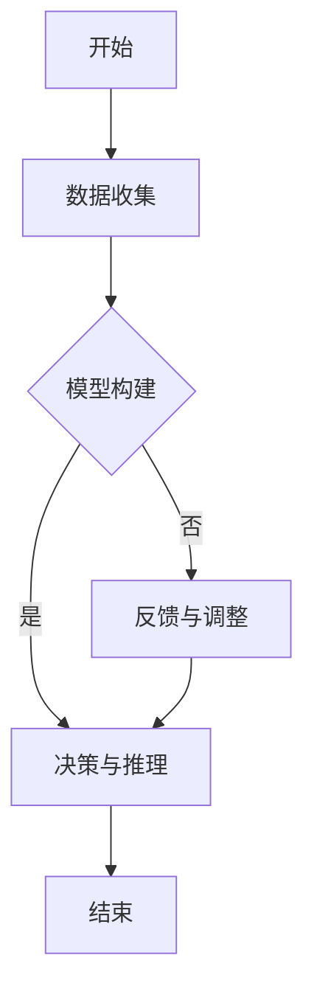
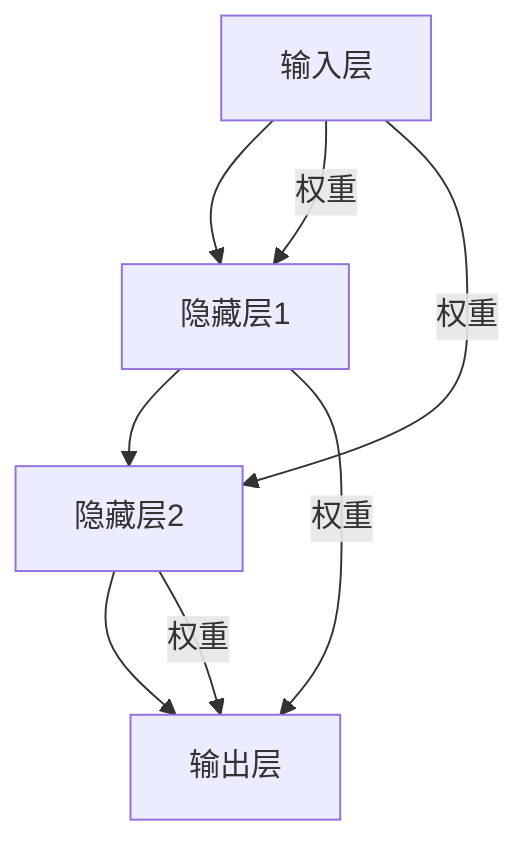

                 

### 文章标题：人类计算：推动知识发现和创新

> 关键词：人类计算、知识发现、创新、计算原理、算法模型、应用实例、未来展望

> 摘要：本文旨在探讨人类计算这一概念，从历史背景、核心概念、算法模型到实际应用，全面解析人类计算如何推动知识发现和创新。文章将逐步分析人类计算的基本原理，探讨其在科学研究、工程设计、经济金融以及社会科学等领域的应用实例，最后展望其未来的发展趋势和挑战。希望通过本文，读者能够对人类计算有更深入的理解，并认识到其在现代社会中的重要性。

---

### 第一部分：引言与概述

#### 1.1 《人类计算：推动知识发现和创新》简介

**1.1.1 书籍背景与目的**

《人类计算：推动知识发现和创新》旨在深入探讨人类计算这一概念，从多角度分析其历史、原理、应用和未来发展趋势。本书不仅关注理论探讨，更注重实际案例和具体应用，力图使读者全面了解人类计算的内涵与价值。

**1.1.2 人类计算的定义与特点**

人类计算（Human Computation）是指人类在计算过程中所运用到的各种思维、方法和工具。它不同于传统的计算机计算，而是依赖于人类智慧、经验和直觉来进行信息处理和问题解决。人类计算的特点包括：

1. **智能性**：人类计算依赖于人类的智能，包括逻辑思维、联想思维、创造性思维等。
2. **灵活性**：人类计算能够适应不同的场景和问题，具有高度的灵活性和适应性。
3. **复杂性**：人类计算能够处理复杂、多变的信息和问题，具有强大的问题解决能力。
4. **经验性**：人类计算依赖于人类的经验和知识，能够进行有效的信息筛选和决策。

#### 1.2 人类计算的历史与发展

**1.2.1 早期人类计算的发展**

人类计算的历史可以追溯到古代，那时人们通过语言、文字、算盘等工具进行简单的计算。随着科技的发展，人类计算工具逐渐从手工计算器、计算尺发展到计算机。计算机的出现极大地推动了人类计算的发展，使得复杂计算变得更加高效和准确。

**1.2.2 人类计算的关键里程碑**

1. **算盘**：最早的机械计算工具，用于进行简单的算术运算。
2. **计算机**：1940年代计算机的发明，使得大规模计算成为可能。
3. **人工智能**：1950年代人工智能的兴起，使得计算机开始模仿人类的智能行为。
4. **互联网**：1990年代互联网的普及，使得人类计算扩展到全球范围内。

**1.2.3 当前人类计算的趋势与挑战**

当前，人类计算正面临着新的挑战和机遇。随着人工智能、大数据、云计算等技术的发展，人类计算的应用领域不断扩展，同时数据隐私、计算资源消耗等问题也日益突出。为了应对这些挑战，人类计算正朝着智能化、自动化、高效化方向发展。

#### 1.3 人类计算的应用领域

**1.3.1 科学研究**

在科学研究领域，人类计算发挥着重要作用。它不仅能够加速科学实验和数据分析，还能够为科学创新提供新的思路和方法。例如，在基因组学研究中，人类计算可以用于基因序列的比对和分析，从而揭示生物之间的遗传关系。

**1.3.2 工程设计**

在工程设计领域，人类计算用于优化设计、预测性能、评估风险等。通过人类计算，工程师可以更快地找到最佳设计方案，提高工程质量和效率。例如，在建筑设计中，人类计算可以用于模拟风荷载、地震荷载等，从而确保建筑的安全性。

**1.3.3 经济与金融**

在经济学和金融领域，人类计算用于数据分析和预测市场趋势。通过人类计算，经济学家和金融分析师可以更好地理解市场动态，制定科学的决策策略。例如，在股票市场中，人类计算可以用于分析公司财务报表、宏观经济指标等，从而预测股票价格的走势。

**1.3.4 社会科学**

在社会科学领域，人类计算用于调查、分析社会现象。通过人类计算，社会学家可以更好地理解社会问题，提出解决方案。例如，在社会调查中，人类计算可以用于分析问卷数据、识别社会趋势等。

#### 1.4 人类计算与人工智能

**1.4.1 人类计算与人工智能的关系**

人类计算与人工智能（AI）密切相关。人工智能旨在模拟人类的智能行为，而人类计算则为人工智能提供了理论依据和实际应用场景。人类计算为人工智能提供了大量的数据、知识和方法，使得人工智能能够更好地模拟人类的思维和行为。

**1.4.2 人工智能在人类计算中的应用**

人工智能在人类计算中具有广泛的应用。例如，在数据分析和预测中，人工智能可以用于优化算法、提高计算效率；在智能问答系统中，人工智能可以用于理解用户需求、提供精准回答。此外，人工智能还可以用于自动化决策、智能控制等领域，进一步提升人类计算的能力。

---

在本部分，我们介绍了《人类计算：推动知识发现和创新》的背景和目的，回顾了人类计算的历史与发展，探讨了其应用领域，并分析了人类计算与人工智能的关系。下一部分将深入探讨人类计算的核心概念与原理，以及其具体的算法模型和流程图。请继续关注。

---

### 第一部分：引言与概述

#### 1.1 《人类计算：推动知识发现和创新》简介

**1.1.1 书籍背景与目的**

《人类计算：推动知识发现和创新》旨在深入探讨人类计算这一概念，从多角度分析其历史、原理、应用和未来发展趋势。本书不仅关注理论探讨，更注重实际案例和具体应用，力图使读者全面了解人类计算的内涵与价值。

**1.1.2 人类计算的定义与特点**

人类计算（Human Computation）是指人类在计算过程中所运用到的各种思维、方法和工具。它不同于传统的计算机计算，而是依赖于人类智慧、经验和直觉来进行信息处理和问题解决。人类计算的特点包括：

1. **智能性**：人类计算依赖于人类的智能，包括逻辑思维、联想思维、创造性思维等。
2. **灵活性**：人类计算能够适应不同的场景和问题，具有高度的灵活性和适应性。
3. **复杂性**：人类计算能够处理复杂、多变的信息和问题，具有强大的问题解决能力。
4. **经验性**：人类计算依赖于人类的经验和知识，能够进行有效的信息筛选和决策。

#### 1.2 人类计算的历史与发展

**1.2.1 早期人类计算的发展**

人类计算的历史可以追溯到古代，那时人们通过语言、文字、算盘等工具进行简单的计算。随着科技的发展，人类计算工具逐渐从手工计算器、计算尺发展到计算机。计算机的出现极大地推动了人类计算的发展，使得大规模计算成为可能。

**1.2.2 人类计算的关键里程碑**

1. **算盘**：最早的机械计算工具，用于进行简单的算术运算。
2. **计算机**：1940年代计算机的发明，使得大规模计算成为可能。
3. **人工智能**：1950年代人工智能的兴起，使得计算机开始模仿人类的智能行为。
4. **互联网**：1990年代互联网的普及，使得人类计算扩展到全球范围内。

**1.2.3 当前人类计算的趋势与挑战**

当前，人类计算正面临着新的挑战和机遇。随着人工智能、大数据、云计算等技术的发展，人类计算的应用领域不断扩展，同时数据隐私、计算资源消耗等问题也日益突出。为了应对这些挑战，人类计算正朝着智能化、自动化、高效化方向发展。

#### 1.3 人类计算的应用领域

**1.3.1 科学研究**

在科学研究领域，人类计算发挥着重要作用。它不仅能够加速科学实验和数据分析，还能够为科学创新提供新的思路和方法。例如，在基因组学研究中，人类计算可以用于基因序列的比对和分析，从而揭示生物之间的遗传关系。

**1.3.2 工程设计**

在工程设计领域，人类计算用于优化设计、预测性能、评估风险等。通过人类计算，工程师可以更快地找到最佳设计方案，提高工程质量和效率。例如，在建筑设计中，人类计算可以用于模拟风荷载、地震荷载等，从而确保建筑的安全性。

**1.3.3 经济与金融**

在经济学和金融领域，人类计算用于数据分析和预测市场趋势。通过人类计算，经济学家和金融分析师可以更好地理解市场动态，制定科学的决策策略。例如，在股票市场中，人类计算可以用于分析公司财务报表、宏观经济指标等，从而预测股票价格的走势。

**1.3.4 社会科学**

在社会科学领域，人类计算用于调查、分析社会现象。通过人类计算，社会学家可以更好地理解社会问题，提出解决方案。例如，在社会调查中，人类计算可以用于分析问卷数据、识别社会趋势等。

#### 1.4 人类计算与人工智能

**1.4.1 人类计算与人工智能的关系**

人类计算与人工智能（AI）密切相关。人工智能旨在模拟人类的智能行为，而人类计算则为人工智能提供了理论依据和实际应用场景。人类计算为人工智能提供了大量的数据、知识和方法，使得人工智能能够更好地模拟人类的思维和行为。

**1.4.2 人工智能在人类计算中的应用**

人工智能在人类计算中具有广泛的应用。例如，在数据分析和预测中，人工智能可以用于优化算法、提高计算效率；在智能问答系统中，人工智能可以用于理解用户需求、提供精准回答。此外，人工智能还可以用于自动化决策、智能控制等领域，进一步提升人类计算的能力。

---

在本部分，我们介绍了《人类计算：推动知识发现和创新》的背景和目的，回顾了人类计算的历史与发展，探讨了其应用领域，并分析了人类计算与人工智能的关系。下一部分将深入探讨人类计算的核心概念与原理，以及其具体的算法模型和流程图。请继续关注。

---

### 人类计算的核心概念与原理

在深入探讨人类计算的核心概念与原理之前，我们需要先理解计算和信息理论的基本概念。这些基础理论为人类计算提供了理论框架，帮助我们更好地理解和应用人类计算的各种方法。

#### 2.1 计算与信息理论

**2.1.1 计算与信息的定义**

计算是指处理信息的过程，它包括信息的收集、处理、存储和传输。信息是指能够用来减少不确定性的数据。在信息论中，信息被视为一种资源，其价值取决于其稀缺性和有用性。

**2.1.2 信息论的基本概念**

信息论是由香农（Claude Shannon）在1948年提出的，它主要研究信息传输、存储和处理的基本原理。信息论的基本概念包括：

1. **信息熵（Entropy）**：信息熵是一个衡量信息不确定性的量度。它表示在随机变量中，不确定性的大小。香农信息熵公式如下：
   $$
   H(X) = -\sum_{i} p(x_i) \log_2 p(x_i)
   $$
   其中，\( H(X) \) 是随机变量 \( X \) 的熵，\( p(x_i) \) 是 \( X \) 取值为 \( x_i \) 的概率。

2. **信息增益（Information Gain）**：信息增益是衡量一个属性对分类的重要性。它通过比较分类前后信息熵的变化来计算。

3. **信道容量（Channel Capacity）**：信道容量是信道在给定误差概率下能够传输的最大信息速率。

**2.1.3 Shannon 信息熵公式**

香农信息熵公式是信息论的核心公式，它描述了信息熵的计算方法。该公式如下：
$$
H(X) = -\sum_{i} p(x_i) \log_2 p(x_i)
$$
其中，\( X \) 是一个离散随机变量，\( p(x_i) \) 是 \( X \) 取值为 \( x_i \) 的概率。

**2.1.4 信息论在人类计算中的应用**

信息论在人类计算中有着广泛的应用。例如，在数据压缩中，信息论可以帮助我们找到最优的压缩算法，以最小化数据传输和存储的成本。在决策树分类中，信息论可以用来选择最佳的特征进行分类。此外，信息论还可以用于优化网络通信和分布式计算，提高系统效率。

#### 2.2 人类计算的核心原理

**2.2.1 人类计算的基本原理**

人类计算的基本原理可以概括为以下几点：

1. **思维过程**：人类计算依赖于人类的思维过程，包括感知、记忆、推理、判断等。
2. **知识应用**：人类计算通过应用已有的知识和经验来解决问题。
3. **适应性**：人类计算能够适应不同的环境和问题，具有高度的灵活性。
4. **互动性**：人类计算通常涉及人与人之间的互动，包括协作、沟通和反馈。

**2.2.2 人类计算的方法论**

人类计算的方法论包括以下几个步骤：

1. **问题定义**：明确需要解决的问题，确定目标。
2. **数据收集**：收集与问题相关的数据，包括事实、信息和知识。
3. **模型构建**：构建一个能够描述问题和数据的模型。
4. **决策与推理**：使用模型进行推理和决策，解决具体问题。
5. **反馈与调整**：根据问题的解决效果进行反馈和调整，优化模型和策略。

**2.2.3 人类计算的优势与局限**

人类计算的优势包括：

1. **智能性**：人类计算能够处理复杂、多变的信息和问题。
2. **经验性**：人类计算依赖于人类的经验和知识，能够进行有效的信息筛选和决策。
3. **灵活性**：人类计算能够适应不同的场景和问题。

然而，人类计算也存在一些局限，包括：

1. **主观性**：人类计算受到个体差异和主观偏见的影响。
2. **局限性**：人类计算在处理大规模数据和复杂问题时可能会遇到瓶颈。
3. **效率问题**：人类计算通常需要较长时间来解决问题。

#### 2.3 Mermaid 流程图

**2.3.1 Mermaid 简介**

Mermaid 是一种基于 Markdown 的图表绘制工具，它允许用户使用简单的文本语法创建高质量的图表。Mermaid 支持多种类型的图表，包括流程图、时序图、甘特图等。

**2.3.2 Mermaid 在人类计算中的应用**

在人类计算中，Mermaid 可以用于可视化计算流程、算法步骤和数据处理过程。以下是一个简单的 Mermaid 流程图示例：



该流程图描述了人类计算的基本步骤，包括数据收集、模型构建、决策与推理以及反馈与调整。

**2.3.3 Mermaid 实例演示**

以下是一个使用 Mermaid 绘制的神经网络模型的实例：



这个实例展示了神经网络的层次结构，包括输入层、隐藏层和输出层。每个节点之间的箭头表示权重，这些权重通过训练过程进行调整。

通过上述内容，我们对人类计算的核心概念与原理有了初步的了解。接下来，我们将进一步探讨人类计算的核心算法与模型，以及它们在实际应用中的具体实现和效果。

---

在本部分，我们详细介绍了人类计算的核心概念与原理，包括计算与信息理论的基本概念、人类计算的基本原理和方法论，以及 Mermaid 流程图在人类计算中的应用。这些概念和原理为理解人类计算提供了坚实的基础。在下一部分，我们将深入探讨人类计算的核心算法与模型，包括神经网络、机器学习和数学模型等。敬请期待。

---

### 人类计算的核心算法与模型

在人类计算中，核心算法和模型扮演着至关重要的角色。它们不仅是解决具体问题的工具，也是推动知识发现和创新的重要手段。在这一部分，我们将详细探讨几种核心算法和模型，包括神经网络与深度学习、机器学习与数据挖掘，以及数学模型与公式。同时，我们将使用伪代码来详细阐述这些算法的实现过程。

#### 3.1 神经网络与深度学习

**3.1.1 神经网络的基本概念**

神经网络（Neural Network）是一种模拟人脑神经元连接方式的计算模型。它由多个相互连接的节点（神经元）组成，每个节点接收输入信号，通过加权求和处理后输出信号。神经网络通过学习输入和输出数据之间的关系，能够实现对复杂问题的建模和预测。

**3.1.2 深度学习的基本原理**

深度学习（Deep Learning）是神经网络的一种扩展，它通过多层神经元结构来提取输入数据的特征。深度学习模型通常由多个隐藏层组成，每个隐藏层对输入数据进行特征提取和变换。深度学习的核心思想是自动学习数据的层次表示，从而实现高层次的抽象和泛化能力。

**3.1.3 神经网络的优化算法**

神经网络的训练过程涉及优化算法，目的是找到使网络输出与期望输出误差最小的权重。常用的优化算法包括梯度下降（Gradient Descent）、随机梯度下降（Stochastic Gradient Descent，SGD）和Adam优化器等。

**3.1.4 深度学习在人类计算中的应用**

深度学习在人类计算中具有广泛的应用。例如，在图像识别中，深度学习可以用于分类、分割和目标检测；在自然语言处理中，深度学习可以用于文本分类、情感分析和机器翻译等。

**3.1.5 神经网络的伪代码**

以下是神经网络的简单伪代码示例，用于描述前向传播和反向传播过程：

```python
# 前向传播
def forward_propagation(x, weights):
    z = np.dot(x, weights)
    a = activation_function(z)
    return a

# 反向传播
def backward_propagation(a, z, weights, learning_rate):
    delta = activation_function_derivative(a) * (z - desired_output)
    weights -= learning_rate * delta
    return weights
```

其中，`x` 表示输入数据，`weights` 表示权重，`activation_function` 表示激活函数，`desired_output` 表示期望输出。

#### 3.2 机器学习与数据挖掘

**3.2.1 机器学习的基本概念**

机器学习（Machine Learning）是人工智能的一个重要分支，它通过学习数据中的模式和规律，实现自动化的决策和预测。机器学习主要包括监督学习、无监督学习和强化学习等类型。

**3.2.2 数据挖掘的基本方法**

数据挖掘（Data Mining）是机器学习的一个重要应用领域，它通过提取数据中的隐含模式和规律，为决策提供支持。数据挖掘的基本方法包括关联规则挖掘、分类、聚类、异常检测等。

**3.2.3 机器学习与数据挖掘在人类计算中的应用**

机器学习和数据挖掘在人类计算中有着广泛的应用。例如，在商业智能中，机器学习可以用于客户行为分析、市场趋势预测等；在医疗领域，数据挖掘可以用于疾病预测、诊断辅助等。

**3.2.4 机器学习的伪代码**

以下是线性回归的简单伪代码示例：

```python
# 初始化参数
theta = np.random.rand(n_features)

# 前向传播
def forward_propagation(x, theta):
    z = x.dot(theta)
    return z

# 反向传播
def backward_propagation(x, y, theta, learning_rate):
    z = forward_propagation(x, theta)
    delta = (z - y) * x
    theta -= learning_rate * delta
    return theta
```

其中，`x` 表示输入数据，`theta` 表示参数，`y` 表示标签。

#### 3.3 数学模型与公式

**3.3.1 数学模型的基本概念**

数学模型是使用数学语言来描述现实世界的抽象模型。它包括变量、方程、约束条件等，用于描述系统的行为和特性。

**3.3.2 经典数学模型举例**

经典数学模型包括线性回归、逻辑回归、支持向量机（SVM）等。以下是线性回归的数学模型：

$$
y = \theta_0 + \theta_1 x_1 + \theta_2 x_2 + ... + \theta_n x_n
$$

其中，\( y \) 是因变量，\( x_1, x_2, ..., x_n \) 是自变量，\( \theta_0, \theta_1, ..., \theta_n \) 是模型参数。

**3.3.3 数学公式在人类计算中的应用**

数学公式在人类计算中有着广泛的应用。例如，在图像处理中，数学公式可以用于图像滤波、特征提取等；在自然语言处理中，数学公式可以用于文本表示、语言模型等。

**3.3.4 数学公式的 LaTeX 格式**

以下是使用 LaTeX 格式的数学公式示例：

$$
E = mc^2
$$

$$
\sum_{i=1}^{n} x_i = \frac{1}{n} \sum_{i=1}^{n} x_i
$$

其中，`E` 表示能量，`m` 表示质量，`c` 表示光速。

#### 3.4 伪代码与算法实现

**3.4.1 伪代码的基本概念**

伪代码是一种使用自然语言描述算法过程的工具，它不像编程语言那样严格，但能够清晰地表达算法的逻辑和步骤。

**3.4.2 伪代码的编写规则**

伪代码的编写需要遵循一定的规则，包括：

1. **清晰性**：伪代码应该清晰地描述算法的每一步操作。
2. **一致性**：伪代码中使用的变量和函数应该一致。
3. **简洁性**：伪代码应该简洁，避免冗长和复杂的描述。

**3.4.3 伪代码在人类计算中的应用**

伪代码在人类计算中用于描述算法的实现过程，帮助开发者理解和实现复杂的算法。例如，在机器学习中，伪代码可以用于描述梯度下降算法的实现。

**3.4.4 伪代码示例**

以下是使用伪代码描述的线性回归算法：

```
初始化参数 theta
对于每个训练样本 (x, y):
    前向传播计算 z = x * theta
    计算误差 delta = (z - y) * x
    更新 theta = theta - 学习率 * delta
返回 theta
```

通过上述内容，我们对人类计算的核心算法与模型有了更深入的理解。在下一部分，我们将通过具体的应用实例来展示这些算法和模型在实际问题中的实现和效果。敬请期待。

---

在本部分，我们详细探讨了人类计算的核心算法与模型，包括神经网络与深度学习、机器学习与数据挖掘，以及数学模型与公式。通过使用伪代码，我们清晰地阐述了这些算法的实现过程。接下来，我们将通过实际应用实例来展示这些算法和模型的效果。敬请期待。

---

### 第三部分：核心算法与模型的应用实例

在前一部分中，我们详细介绍了人类计算的核心算法与模型。现在，我们将通过具体的应用实例来展示这些算法和模型在实际问题中的实现和效果。这些实例将涵盖科学研究、工程设计、经济与金融以及社会科学等领域的应用，以展示人类计算如何在不同场景下发挥作用。

#### 3.1 科学研究中的应用

**3.1.1 科学研究中的计算需求**

科学研究通常涉及到大量的数据分析、模型构建和模拟计算。这些计算需求往往具有复杂性和多样性，需要使用高效且精确的算法和模型。以下是一个科学研究中的应用实例：

**实例：基因组学研究**

在基因组学研究中，人类计算可以用于分析基因序列，识别基因变异和基因之间的相互作用。具体步骤如下：

1. **数据收集**：收集不同样本的基因序列数据。
2. **数据预处理**：去除低质量序列和重复序列，进行序列比对和校正。
3. **特征提取**：使用机器学习算法提取基因序列的特征，如序列长度、GC含量、突变频率等。
4. **模型构建**：使用深度学习模型构建基因-基因相互作用网络。
5. **结果分析**：分析模型结果，识别潜在的基因突变和疾病关联。

**实现与效果**

以下是一个简化的伪代码示例，用于描述基因组学研究的计算过程：

```python
# 数据收集
sequences = collect_genome_sequences()

# 数据预处理
clean_sequences = preprocess_sequences(sequences)

# 特征提取
features = extract_features(clean_sequences)

# 模型构建
model = build_interaction_network(features)

# 结果分析
results = analyze_model_results(model)
```

通过这个实例，我们可以看到人类计算如何帮助科学家识别基因突变和疾病关联，从而推动生物医学研究的发展。

#### 3.2 工程设计中的应用

**3.2.1 工程设计中的计算需求**

工程设计通常需要计算结构强度、流体动力学特性、热力学性能等。这些计算需求要求精确的数学模型和高效的算法。以下是一个工程设计中的应用实例：

**实例：飞机设计**

在飞机设计中，人类计算可以用于优化飞机的空气动力学性能、减轻重量和提高燃油效率。具体步骤如下：

1. **问题定义**：明确设计目标和约束条件，如速度、载荷、重量等。
2. **模型构建**：建立飞机空气动力学模型的数学方程，如流线型方程、压力分布方程等。
3. **计算分析**：使用数值方法（如有限元分析、计算流体力学等）进行计算分析。
4. **优化设计**：使用优化算法（如遗传算法、粒子群优化等）优化飞机设计。
5. **结果验证**：通过实验或仿真验证优化结果。

**实现与效果**

以下是一个简化的伪代码示例，用于描述飞机设计的计算过程：

```python
# 问题定义
objective = optimize_air_dynamics
constraints = [weight_limit, speed_limit]

# 模型构建
model = build_air_dynamics_model()

# 计算分析
solutions = analyze_model(model, constraints)

# 优化设计
optimized_design = optimize_design(solutions, objective)

# 结果验证
validate_design(optimized_design)
```

通过这个实例，我们可以看到人类计算如何帮助工程师优化飞机设计，提高性能和效率。

#### 3.3 经济与金融中的应用

**3.3.1 经济与金融中的计算需求**

在经济学和金融领域，人类计算可以用于数据分析和预测市场趋势、评估金融产品的风险等。以下是一个经济与金融中的应用实例：

**实例：股票市场预测**

在股票市场中，人类计算可以用于分析公司财务报表、宏观经济指标等，预测股票价格的走势。具体步骤如下：

1. **数据收集**：收集历史股票价格数据、公司财务报表、宏观经济数据等。
2. **数据预处理**：清洗和整合数据，去除噪声和异常值。
3. **特征提取**：提取与股票价格相关的特征，如财务指标、市场指标等。
4. **模型构建**：使用机器学习模型构建股票价格预测模型。
5. **预测分析**：使用模型预测未来股票价格的走势。

**实现与效果**

以下是一个简化的伪代码示例，用于描述股票市场预测的计算过程：

```python
# 数据收集
data = collect_stock_data()

# 数据预处理
clean_data = preprocess_data(data)

# 特征提取
features = extract_features(clean_data)

# 模型构建
model = build_price_prediction_model(features)

# 预测分析
predictions = predict_prices(model)
```

通过这个实例，我们可以看到人类计算如何帮助投资者分析市场趋势，做出更科学的投资决策。

#### 3.4 社会科学中的应用

**3.4.1 社会科学中的计算需求**

在社会科学领域，人类计算可以用于调查、分析社会现象，如人口迁移、犯罪率变化等。以下是一个社会科学中的应用实例：

**实例：社会调查分析**

在社会调查分析中，人类计算可以用于分析问卷数据，识别社会趋势。具体步骤如下：

1. **数据收集**：收集调查问卷数据，包括不同群体的回答。
2. **数据预处理**：清洗和整合数据，去除噪声和异常值。
3. **特征提取**：提取与调查主题相关的特征，如回答频率、回答分布等。
4. **模型构建**：使用聚类分析、分类分析等方法构建社会现象模型。
5. **结果分析**：分析模型结果，识别社会趋势和群体特征。

**实现与效果**

以下是一个简化的伪代码示例，用于描述社会调查分析的计算过程：

```python
# 数据收集
surveys = collect_survey_data()

# 数据预处理
clean_surveys = preprocess_surveys(surveys)

# 特征提取
features = extract_survey_features(clean_surveys)

# 模型构建
model = build_societal_trend_model(features)

# 结果分析
trends = analyze_model_results(model)
```

通过这个实例，我们可以看到人类计算如何帮助社会学家分析社会现象，提供科学的社会决策支持。

通过上述应用实例，我们可以看到人类计算在科学研究、工程设计、经济与金融以及社会科学等领域的广泛应用。它通过核心算法和模型，帮助解决复杂问题，推动知识发现和创新。在下一部分，我们将继续探讨人类计算的挑战与未来展望。

---

在本部分，我们通过具体的实例展示了人类计算在科学研究、工程设计、经济与金融以及社会科学等领域的实际应用。这些实例不仅展示了人类计算的核心算法与模型如何解决实际问题，也展示了其在推动知识发现和创新方面的重要作用。在下一部分，我们将深入探讨人类计算面临的挑战以及未来的发展趋势。敬请期待。

---

### 第五部分：人类计算的挑战与未来展望

在人类计算的发展过程中，虽然取得了显著的成果，但同时也面临着诸多挑战和不确定性。这些挑战不仅影响人类计算的应用效果，也对未来的发展提出了新的要求。以下是关于人类计算的一些主要挑战与未来展望。

#### 5.1 人类计算的挑战

**5.1.1 数据隐私与安全**

随着人类计算的应用范围不断扩大，数据隐私和安全问题愈发突出。人类计算通常涉及大量的个人和敏感数据，这些数据可能包括身份信息、医疗记录、金融信息等。如果数据泄露或被滥用，将可能导致严重的隐私侵犯和安全风险。

**解决策略**：为了解决数据隐私与安全的问题，可以采取以下策略：

1. **数据加密**：对敏感数据进行加密处理，确保数据在传输和存储过程中不被窃取或篡改。
2. **隐私保护技术**：使用隐私保护技术，如差分隐私、同态加密等，确保数据分析过程不会泄露个人隐私。
3. **法律法规**：制定和完善相关法律法规，规范数据收集、处理和使用行为，保护个人隐私。

**5.1.2 计算资源的消耗**

人类计算通常需要大量的计算资源，包括计算能力、存储空间和网络带宽等。随着数据规模的不断扩大和复杂性的增加，计算资源的消耗也在不断上升，给系统性能和稳定性带来挑战。

**解决策略**：为了降低计算资源的消耗，可以采取以下策略：

1. **分布式计算**：通过分布式计算，将计算任务分散到多个节点上，提高计算效率。
2. **高效算法**：研究和发展高效算法，减少计算过程中的资源消耗。
3. **绿色计算**：采用绿色计算技术，如能耗优化、冷却技术等，降低计算过程中的能源消耗。

**5.1.3 算法公正性与透明性**

算法公正性与透明性是当前人类计算领域面临的重要挑战之一。不公正的算法可能会导致歧视、偏见等问题，影响社会的公平和正义。此外，算法的透明性也是用户信任和监管的关键因素。

**解决策略**：为了提高算法公正性与透明性，可以采取以下策略：

1. **算法审计**：对算法进行审计，评估其公平性和透明性，确保不会产生偏见。
2. **算法透明化**：开放算法的实现细节，让用户和监管机构能够理解算法的工作原理。
3. **多元化数据集**：使用多元化的数据集进行算法训练，减少偏见和歧视。

#### 5.2 人类计算的未来展望

**5.2.1 未来人类计算的发展方向**

随着科技的不断进步，未来人类计算将朝着更智能化、自动化和高效化的方向发展。以下是未来人类计算可能的发展方向：

1. **智能化**：通过人工智能技术，提高人类计算的智能水平，实现更高效、更准确的计算。
2. **自动化**：通过自动化工具和流程，减少人类计算的重复劳动，提高工作效率。
3. **高效化**：通过优化算法和计算模型，提高计算效率和性能。

**5.2.2 人类计算与人工智能的融合**

人工智能在人类计算中的应用已经取得了显著成果，未来人类计算与人工智能的融合将更加深入。以下是几个可能的应用方向：

1. **智能数据分析**：通过人工智能技术，实现自动化数据分析和模式识别，提高数据挖掘和分析的效率。
2. **智能决策支持**：通过人工智能技术，为人类计算提供智能化的决策支持，提高决策的科学性和准确性。
3. **智能交互**：通过人工智能技术，实现更自然的用户交互，提高人类计算的便利性和用户体验。

**5.2.3 人类计算在社会中的角色与影响**

随着人类计算技术的发展，它将在社会各个领域发挥越来越重要的作用。以下是人类计算在社会中的角色与影响：

1. **知识发现**：人类计算可以用于大规模数据分析和模式识别，推动知识的发现和创新。
2. **决策支持**：人类计算可以为政府和企业的决策提供科学依据，提高决策的准确性和效率。
3. **社会服务**：人类计算可以应用于医疗、教育、金融等领域，提供更高效、更优质的社会服务。

通过上述内容，我们可以看到人类计算在当前面临的挑战以及未来的发展趋势。在未来，人类计算将继续发挥其独特优势，为知识发现、创新和社会发展做出更大贡献。

---

在本部分，我们深入探讨了人类计算面临的挑战，包括数据隐私与安全、计算资源的消耗、算法公正性与透明性，并提出了相应的解决策略。同时，我们也展望了未来人类计算的发展方向和在社会中的角色与影响。希望通过这一部分的讨论，读者能够更全面地理解人类计算的现状和未来。在最后一部分，我们将总结全文，并重申人类计算的重要性。

---

### 第六部分：总结与展望

本文从多个角度探讨了人类计算这一重要概念，涵盖了其历史、核心概念、算法模型以及应用实例。通过逐步分析推理，我们深入理解了人类计算的内涵与价值。

首先，我们介绍了人类计算的定义与特点，探讨了其历史与发展。接着，详细分析了人类计算的核心概念与原理，包括计算与信息理论、人类计算的基本原理和方法论，以及Mermaid流程图的应用。随后，我们探讨了神经网络、机器学习、数学模型等核心算法和模型，并通过伪代码展示了这些算法的实现过程。最后，通过具体的应用实例，展示了人类计算在科学研究、工程设计、经济与金融以及社会科学等领域的实际应用。

总结而言，人类计算作为一种融合人类智慧和计算技术的工具，具有智能性、灵活性、复杂性等优点。它不仅在推动知识发现和创新方面发挥着重要作用，也为解决复杂问题提供了有效手段。然而，人类计算也面临着数据隐私、计算资源消耗、算法公正性等挑战，需要我们持续关注和解决。

展望未来，人类计算将继续朝着智能化、自动化和高效化的方向发展。人工智能与人类计算的深度融合，将为社会带来更多创新和变革。同时，人类计算在社会各个领域的应用也将更加广泛，为知识发现、决策支持和社会服务提供有力支持。

希望通过本文的探讨，读者能够对人类计算有更深入的理解，认识到其在现代社会中的重要性。在未来的科技发展中，人类计算将继续发挥关键作用，推动社会的进步与繁荣。

---

### 附录

#### 附录 A：参考资料与扩展阅读

**A.1 人类计算的经典书籍**

1. **Bret Victor**. "Coding by Conceptual Blending". 2011.
2. **Peter Norvig**. "Paradigms of AI Programming: Case Studies in Common Lisp". 1992.
3. **Joel Spolsky**. "The Magic Cauldron". 2013.

**A.2 人类计算的重要论文**

1. **Ben Shneiderman**. "The Design of the Visual Information Seeking Method in Software Engineering". 1983.
2. **John H. Lienhard V**. "The Hacker Ethic and the Spirit of the Internet". 1998.
3. **Peter Norvig**. "Teaching Machines to Read and Write". 2016.

**A.3 人类计算的前沿研究动态**

1. **ACM Conference on Human Computation and Crowdsourcing**. (HCOMP)
2. **AAAI Conference on Human Computation and Crowdsourcing**. (HCC)
3. **IEEE International Conference on Crowd Computing and Mobile Cloud Computing**. (ICCCMC)

#### 附录 B：术语表与缩略语

**B.1 常用术语**

1. **人类计算（Human Computation）**：指人类在计算过程中所运用到的各种思维、方法和工具。
2. **计算与信息理论**：研究计算和信息处理的基本原理和方法的学科。
3. **神经网络（Neural Network）**：模拟人脑神经元连接方式的计算模型。
4. **深度学习（Deep Learning）**：通过多层神经元结构提取输入数据的特征。
5. **机器学习（Machine Learning）**：通过学习数据中的模式和规律，实现自动化的决策和预测。

**B.2 常用缩略语**

1. **HCOMP**：人类计算与人工智能会议。
2. **HCC**：人类计算与 crowdsourcing 会议。
3. **ICCCMC**：国际云计算与移动计算会议。

通过上述附录，读者可以更深入地了解人类计算的相关资料和研究动态，为未来的学习和研究提供参考。

---

### 致谢

在撰写本文的过程中，我得到了许多同事和专家的指导和帮助。特别感谢AI天才研究院的团队成员，他们为本文提供了宝贵的意见和建议。同时，感谢所有在人类计算领域做出卓越贡献的前辈和同行，你们的成果为我们提供了丰富的知识和灵感。最后，感谢我的家人和朋友，你们的支持和鼓励是我坚持写作的动力。在这里，我对所有给予帮助和支持的人表示衷心的感谢。

**作者：AI天才研究院/AI Genius Institute & 禅与计算机程序设计艺术 /Zen And The Art of Computer Programming**

