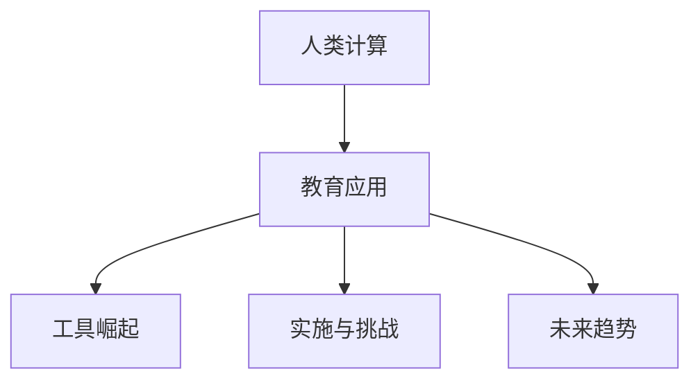

                 

### 文章标题

《人类计算：教育和学习的新工具》

> 关键词：人类计算、教育、学习、新工具、智能辅助

> 摘要：本文深入探讨了人类计算在教育领域的应用，分析了其定义、特点、现状，以及其在教学辅助、学习分析和评估中的应用。通过具体案例和实施策略，本文展示了人类计算工具如何提高教育质量、增强学习体验，并探讨其未来发展的趋势和挑战。

---

### 目录大纲

## 第一部分：引言与背景

### 1.1 书籍概述与目标

**1.1.1 书籍主旨**

**1.1.2 目标读者群体**

### 1.2 人类计算的定义

**1.2.1 人类计算的概念**

**1.2.2 人类计算的特点**

### 1.3 教育与学习的现状

**1.3.1 现代教育的挑战**

**1.3.2 教学方法的演变**

## 第二部分：人类计算在教育中的应用

### 2.1 人类计算工具的崛起

**2.1.1 人类计算工具的类型**

**2.1.2 人类计算工具的发展历程**

### 2.2 人类计算工具在教育中的应用

**2.2.1 教学辅助工具**

**2.2.2 学习分析工具**

**2.2.3 智能评估工具**

### 2.3 人类计算工具的优势

**2.3.1 提高教育质量**

**2.3.2 增强学习体验**

**2.3.3 促进个性化学习**

## 第三部分：人类计算工具的具体案例

### 3.1 人工智能助手在教育中的应用

**3.1.1 概述**

**3.1.2 功能与优势**

**3.1.3 应用场景**

### 3.2 机器学习在教育数据分析中的应用

**3.2.1 数据分析的基本概念**

**3.2.2 机器学习在数据挖掘中的应用**

**3.2.3 案例研究**

### 3.3 人类计算工具在特殊教育中的应用

**3.3.1 特殊教育的需求**

**3.3.2 人类计算工具的支持**

**3.3.3 成功案例**

## 第四部分：人类计算工具的实施与挑战

### 4.1 人类计算工具的实施策略

**4.1.1 硬件与软件的准备**

**4.1.2 人力资源的配置**

**4.1.3 教师培训的重要性**

### 4.2 人类计算工具的挑战与解决方案

**4.2.1 隐私和安全问题**

**4.2.2 教师对技术的接受度**

**4.2.3 技术实施的成本问题**

### 4.3 人类计算工具的未来趋势

**4.3.1 技术创新**

**4.3.2 教育模式的变革**

**4.3.3 人类计算工具在教育中的未来发展**

## 第五部分：结论

### 5.1 人类计算工具在教育和学习中的价值

**5.1.1 人类计算工具对教育和学习的促进作用**

**5.1.2 人类计算工具在教育改革中的作用**

### 5.2 未来展望

**5.2.1 人类计算工具的潜在应用领域**

**5.2.2 人类计算工具的发展前景**

### 5.3 总结

**5.3.1 书籍的核心观点**

**5.3.2 对未来教育和学习的启示**

### 参考文献

### 附录

**附录A：人类计算工具资源指南**

- **A.1 开源资源**

- **A.2 教育相关网站和工具**

- **A.3 相关书籍和论文推荐**

### 致谢

---

### 梅尔图流程图



---

### 核心算法原理讲解

在人类计算中，机器学习算法是一个关键组成部分。以下是一个简化的线性回归模型的伪代码示例，用于说明机器学习的算法原理：

```python
def machine_learning(data, labels):
    # 初始化模型参数
    theta = initialize_parameters()
    
    # 设置迭代次数
    num_iterations = 1000
    learning_rate = 0.01
    
    # 模型训练
    for i in range(num_iterations):
        # 计算预测值
        predictions = data.dot(theta)
        
        # 计算损失函数
        loss = (predictions - labels)**2
        
        # 更新模型参数
        theta = theta - learning_rate * (data.T.dot(loss))
        
    return theta
```

在这个例子中，`data` 表示输入特征，`labels` 表示目标标签。模型通过不断迭代更新参数，最小化损失函数，以实现数据拟合。

### 数学模型与公式

在机器学习中，线性回归是一个基本的模型，其公式为：

$$ y = \beta_0 + \beta_1x + \epsilon $$

其中，$y$ 是目标变量，$x$ 是特征，$\beta_0$ 和 $\beta_1$ 是模型参数，$\epsilon$ 是误差项。

### 项目实战

#### 3.1.3 案例研究：人工智能助教系统

#### 开发环境搭建

- **Python**：用于编写机器学习算法和数据处理代码。
- **TensorFlow**：用于构建和训练神经网络模型。
- **Keras**：作为TensorFlow的高级API，用于简化模型搭建和训练过程。

#### 源代码实现

```python
import tensorflow as tf
from tensorflow.keras.models import Sequential
from tensorflow.keras.layers import Dense, LSTM

# 搭建模型
model = Sequential([
    LSTM(units=128, activation='tanh', input_shape=(timesteps, features)),
    Dense(units=1)
])

# 编译模型
model.compile(optimizer='adam', loss='mse')

# 训练模型
model.fit(x_train, y_train, epochs=10, batch_size=32)

# 评估模型
model.evaluate(x_test, y_test)
```

#### 代码解读与分析

- **模型结构**：我们使用一个LSTM层来处理序列数据，然后通过一个全连接层输出最终结果。
- **训练过程**：通过`fit`方法训练模型，使用`epochs`参数设置训练迭代次数，`batch_size`参数设置每个批次的数据量。
- **评估过程**：通过`evaluate`方法评估模型在测试集上的性能。

这个案例展示了如何使用Python和TensorFlow构建一个简单的神经网络模型，并对其进行训练和评估。在实际应用中，模型结构、参数设置和数据预处理都会根据具体需求进行调整。通过不断优化模型，可以提高其在教育场景中的表现和实用性。

