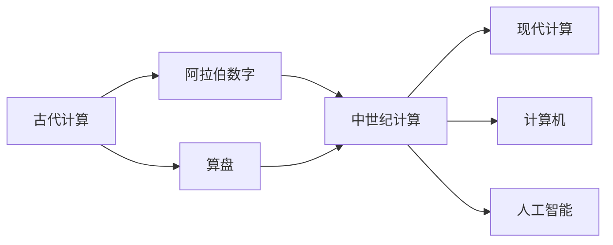
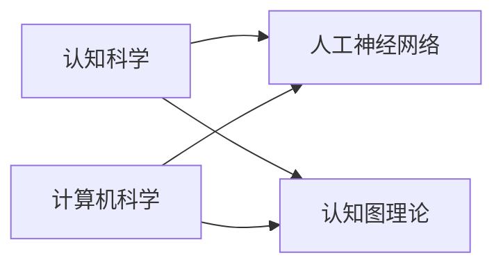
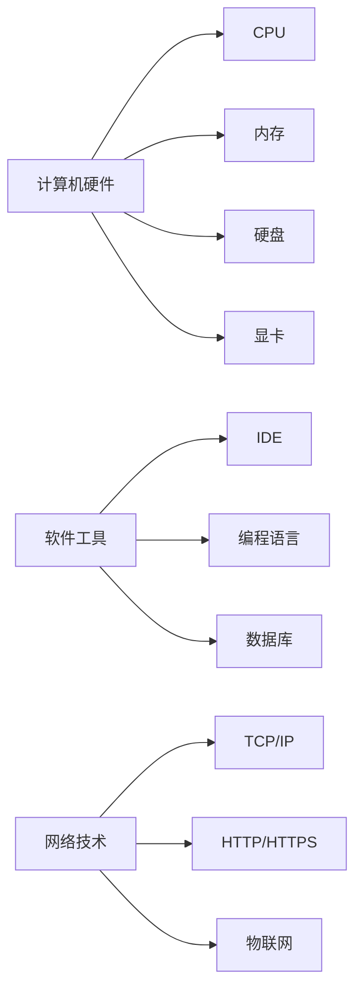

                 

### 文章标题

《人类计算：未来工作的影响》

> 关键词：人类计算、人工智能、工作流程、职业需求、教育改革、医疗与健康

> 摘要：
本文深入探讨了人类计算的概念、发展历程及其对现代社会各个领域的深远影响。通过逻辑清晰的分析和实例讲解，文章着重分析了人类计算对工作与就业、教育、医疗、社会与文化以及环境保护等方面的重大影响，并展望了其未来发展趋势与挑战。本文旨在为读者提供一个全面、深入的理解，以应对人类计算带来的变革与机遇。

---

### 第一部分：人类计算基础理论

#### 第1章：人类计算的基本概念与历史

#### 1.1 人类计算的定义与特点

人类计算是指人类在处理信息、进行推理和决策的过程中所采用的各种方法和策略。它具有以下几个特点：

1. **基于经验和直觉**：人类计算很大程度上依赖于个人的经验和直觉，这使得人类能够快速适应不同的环境和问题。
2. **感知和适应能力**：人类计算能够感知周围的环境，并根据环境的变化做出相应的调整。
3. **社会性和协作性**：人类计算往往是一个社会过程，多人协作能够提高计算效率和准确性。

#### 1.2 人类计算的发展历程

人类计算的历史可以追溯到古代：

- **古代计算**：在远古时期，人类使用结绳、石子等简单的工具进行计数。阿拉伯数字的发明和算盘的使用极大地提高了计算效率。
- **中世纪计算**：计数器和计算尺的出现，以及数学符号的发明，进一步推动了人类计算的发展。
- **现代计算**：随着计算机的发明和互联网的普及，人类计算进入了一个全新的时代。人工智能的发展更是将人类计算推向了前所未有的高度。

#### 1.3 人类计算在现代社会中的作用

在现代社会，人类计算发挥着重要作用：

1. **提高生产效率**：计算机和人工智能技术使得许多重复性和繁琐的工作自动化，从而提高了生产效率。
2. **促进科技创新**：人类计算为科学研究和技术创新提供了强大的工具和平台。
3. **改善生活质量**：智能设备和人工智能应用让生活更加便捷和舒适。
4. **推动经济发展**：人类计算是现代经济的重要驱动力，为各行各业带来了新的增长点。

#### 1.4 人类计算与人工智能的关系

人工智能（AI）是计算机模拟人类智能的一种技术，它依赖于人类计算的理论和实践基础：

- **人工智能是计算机模拟人类智能的一种技术**：通过学习和模仿人类的思维方式，人工智能能够在图像识别、自然语言处理、决策支持等领域实现自动化和智能化。
- **人类计算为人工智能提供了理论和实践基础**：人类计算的研究成果，如认知科学、心理学、神经科学等，为人工智能的发展提供了重要的理论和实验支持。

### Mermaid 流程图：人类计算的发展历程



#### 第2章：人类计算与认知科学

#### 2.1 认知科学的定义与范围

认知科学是研究人类思维和认知过程的学科，其范围涵盖多个领域：

- **生物学**：研究大脑的结构和功能，以及神经元的工作原理。
- **心理学**：研究人类感知、记忆、注意力、决策等认知过程。
- **计算机科学**：通过模拟和优化认知过程，开发出更智能的计算机系统。
- **语言学**：研究语言与认知的关系，探讨语言如何影响思维。

#### 2.2 人类认知的模型与理论

人类认知的模型和理论多种多样，以下是其中几种主要的模型：

- **连结主义模型**：基于神经网络的理论，模拟大脑神经元的工作方式。
- **认知图理论**：通过图形和节点属性来描述人类思维的组织和结构。
- **信息加工模型**：描述信息从感知到决策的过程，包括感觉输入、数据处理和输出等步骤。

#### 2.3 认知科学与计算机科学的交汇点

认知科学与计算机科学的交汇点主要体现在以下几个方面：

- **人工神经网络**：模拟人脑神经元的工作方式，应用于图像识别、自然语言处理等领域。
- **机器学习**：基于数据的学习算法，模拟人类学习和决策过程。
- **计算认知科学**：结合认知科学和计算机科学的方法，研究人类认知过程和机制。

### Mermaid 流程图：认知科学与计算机科学的交汇点



#### 第3章：人类计算的心理与神经科学基础

#### 3.1 神经科学的基本原理

神经科学是研究神经系统的结构和功能的科学，其基本原理包括：

- **神经元**：是神经系统的基本单元，负责传递神经信号。
- **突触**：神经元之间的连接点，通过神经递质传递信号。
- **神经递质**：是一种化学物质，用于在神经元之间传递信号。

#### 3.2 人类大脑与计算的关系

人类大脑与计算系统在结构和功能上有许多相似之处：

- **大脑分区**：大脑有不同的功能区，如大脑皮层、大脑基底核和大脑边缘系统，分别负责不同的认知功能。
- **信息处理**：大脑通过神经元网络进行信息处理，类似于计算机中的神经网络。
- **决策与判断**：大脑在处理信息时，会进行复杂的决策和判断，类似于计算机的决策树和逻辑运算。

#### 3.3 神经可塑性对人类计算的影响

神经可塑性是指大脑结构和功能能够随着经验和环境的变化而改变。它对人类计算的影响包括：

- **学习与记忆**：通过神经可塑性，大脑能够形成新的神经元连接，从而学习和记忆新的信息。
- **适应环境变化**：大脑能够通过神经可塑性，适应新的环境和挑战。
- **恢复受损功能**：神经可塑性有助于大脑在损伤后恢复部分功能。

#### 3.4 人类认知的心理机制与计算模型

人类认知的心理机制包括感知、记忆、注意力和决策等。相应的计算模型如下：

- **感知**：通过感官接收外部信息，并对其进行处理和理解。
- **记忆**：将感知到的信息存储在大脑中，以便后续使用。
- **注意力**：选择性地关注某些信息，而忽略其他信息。
- **决策**：在多个选项中做出选择，通常基于过去的经验和当前的情境。

### 伪代码：基于规则的系统

```python
def make_decision(input_data):
    if input_data == "A":
        return "Decision A"
    elif input_data == "B":
        return "Decision B"
    else:
        return "Unknown input"
```

### 第4章：人类计算的理论模型与方法论

#### 4.1 基于认知科学的计算模型

基于认知科学的计算模型旨在模拟人类的认知过程，包括以下几种：

- **连结主义模型**：通过模拟神经元网络的工作方式，实现图像识别、自然语言处理等任务。
- **认知图理论**：通过图形和节点属性，描述人类思维的组织和结构。
- **信息加工模型**：模拟信息从输入到决策的全过程。

#### 4.2 人类计算中的符号推理与逻辑

符号推理是指使用符号进行逻辑推理和问题解决。在人类计算中，符号推理通常基于以下逻辑：

- **命题逻辑**：使用命题和逻辑运算符进行推理。
- **谓词逻辑**：使用谓词和量词进行更复杂的推理。

符号推理的例子：

```python
def symbolic_reasoning(symbol1, symbol2):
    if symbol1 == "A" and symbol2 == "B":
        return "Conjunction"
    elif symbol1 == "A" or symbol2 == "B":
        return "Disjunction"
    else:
        return "Negation"
```

#### 4.3 人类计算中的感知与记忆

感知与记忆是人类计算的重要部分。感知是指从外部环境中获取信息，记忆是指将这些信息存储在大脑中。

- **感知**：通过感官接收外部信息，例如视觉、听觉、触觉等。
- **记忆**：将感知到的信息存储在大脑中，以便后续使用。

感知与记忆的例子：

```python
def perceive_and_memory(sensor_data):
    # 假设 sensor_data 是从传感器接收到的数据
    # 存储在内存中
    memory.append(sensor_data)
    return memory
```

### 第5章：人类计算的技术与工具

#### 5.1 计算机硬件与技术的发展

计算机硬件的发展是推动人类计算能力提升的关键因素。以下是一些主要的硬件发展：

- **CPU**：中央处理单元，负责执行计算机指令。
- **内存**：存储正在执行的程序和数据。
- **硬盘**：存储长期的数据和文件。
- **显卡**：用于图像处理和计算机视觉。

#### 5.2 软件工具与编程语言

软件工具和编程语言是开发人类计算应用的重要工具。以下是一些常用的工具和语言：

- **集成开发环境（IDE）**：提供代码编写、调试和运行的环境。
- **编程语言**：如Python、Java、C++等，用于编写计算机程序。
- **数据库**：存储和组织大量数据。

#### 5.3 数据库与信息处理技术

数据库技术用于存储和管理大量数据。信息处理技术则用于分析和处理这些数据，包括：

- **关系型数据库**：如MySQL、PostgreSQL等。
- **NoSQL数据库**：如MongoDB、Cassandra等。
- **数据挖掘**：从大量数据中发现有用的模式和趋势。
- **机器学习**：使用算法从数据中学习，进行预测和分类。

#### 5.4 网络技术与应用

网络技术是连接计算机和用户的重要手段。以下是一些主要的网络技术：

- **TCP/IP**：传输控制协议/互联网协议，用于网络数据传输。
- **HTTP/HTTPS**：超文本传输协议/安全超文本传输协议，用于网络数据交换。
- **物联网**：将各种设备连接到互联网，实现智能化的管理和控制。

网络技术的应用包括：

- **移动互联网**：通过移动设备提供网络连接。
- **智能城市**：利用物联网和人工智能技术，实现城市管理的智能化。
- **云计算**：通过互联网提供计算资源，实现资源的共享和优化。

### Mermaid 流程图：人类计算的技术与工具



### 第二部分：人类计算对未来的影响

#### 第6章：人类计算对工作与就业的影响

#### 6.1 人类计算对工作流程的改变

随着人类计算技术的发展，工作流程发生了显著变化：

- **自动化**：许多重复性和繁琐的工作被自动化系统取代，提高了生产效率。
- **数字化**：越来越多的工作流程通过计算机和互联网实现，减少了纸质文档的使用。
- **智能化**：人工智能和机器学习技术被应用于决策支持和工作优化。

#### 6.2 人类计算对职业需求的影响

人类计算对职业需求产生了深远的影响：

- **传统职业的消失**：如工厂工人、文书处理人员等职业因自动化而减少。
- **新兴职业的产生**：如数据分析师、人工智能工程师、机器学习专家等新兴职业需求增加。

#### 6.3 人类计算与就业市场的不平等

人类计算技术的发展也带来了就业市场的不平等：

- **技能差距**：高技能人才的就业机会增加，而低技能劳动者的就业机会减少。
- **地区差异**：发达地区的技术应用更为广泛，而欠发达地区的技术应用相对较少。

#### 6.4 如何应对人类计算对工作的冲击

为了应对人类计算对工作的冲击，可以采取以下措施：

- **教育培训**：提升个人技能，适应新技术的要求。
- **政策支持**：制定相关政策，减少失业率，促进就业转型。
- **创业机会**：鼓励创业，创造新的就业机会。

### 第7章：人类计算对教育的影响

#### 7.1 人类计算对学习方式的改变

人类计算技术对学习方式产生了深远的影响：

- **在线教育**：通过网络平台，学习者可以随时随地获取教育资源。
- **个性化学习**：基于学习者的需求和进度，提供个性化的学习内容。
- **混合式学习**：结合在线教育和传统教育，提高学习效果。

#### 7.2 人类计算对教育内容与目标的影响

人类计算技术对教育内容与目标产生了重要影响：

- **教育内容的丰富**：引入新技术和跨学科知识，拓宽学生的视野。
- **教育目标的转变**：从知识传授转向培养创新能力和解决实际问题的能力。

#### 7.3 教育系统如何适应人类计算的发展

为了适应人类计算的发展，教育系统需要进行以下改革：

- **教育体系的改革**：调整课程设置，引入新技术和跨学科知识。
- **教师角色的转变**：从知识传授者转变为学习引导者。
- **教学方法的创新**：采用在线教育、混合式学习等新方法。

#### 7.4 人类计算与未来教育的新模式

未来教育的新模式将更加依赖于人类计算技术：

- **终身学习**：适应快速变化的社会和技术环境，实现终身学习。
- **个性化教育**：根据学生的兴趣和需求，提供个性化的教育服务。
- **智能教育**：利用人工智能技术，提供智能化的学习支持和评估。

### 第8章：人类计算对医疗与健康的影响

#### 8.1 人类计算在医疗领域的应用

人类计算技术在医疗领域有着广泛的应用：

- **诊断与预测**：通过数据分析，提高诊断的准确性和预测疾病的风险。
- **治疗与康复**：利用机器人手术、个性化治疗等技术，提高治疗效果。
- **医疗资源的优化**：通过大数据分析，优化医疗资源的分配和使用。

#### 8.2 人类计算对医学研究的影响

人类计算技术对医学研究产生了重要影响：

- **大数据研究**：通过分析海量数据，加速医学研究的进程。
- **人工智能在药物研发中的应用**：利用人工智能技术，加速新药研发，提高药物疗效和安全性。

#### 8.3 人类计算在心理健康与治疗中的应用

人类计算技术在心理健康与治疗中的应用包括：

- **诊断与评估**：通过数据分析，评估心理健康状况。
- **治疗与干预**：利用虚拟现实、人工智能等技术，提供个性化的治疗和干预方案。

#### 8.4 人类计算对公共卫生的影响

人类计算技术在公共卫生领域也有着重要应用：

- **疫情监测与防控**：通过大数据分析和人工智能技术，提高疫情监测和防控效果。
- **公共卫生决策**：利用数据分析和预测模型，支持公共卫生政策的制定和实施。

### 第9章：人类计算对社会与文化的影响

#### 9.1 人类计算对社交互动的影响

人类计算技术对社交互动产生了深远影响：

- **网络社交**：通过社交媒体和网络平台，扩大社交范围。
- **社交机器人**：提供个性化、智能化的社交体验。

#### 9.2 人类计算对文化传承与创新的影响

人类计算技术对文化传承与创新产生了重要影响：

- **数字化文化传承**：利用数字技术保护和传承文化遗产。
- **数字文化创作**：利用人工智能技术创作数字艺术作品，推动文化创新。

#### 9.3 人类计算对隐私与安全的影响

人类计算技术在隐私和安全方面带来了挑战：

- **数据隐私**：如何保护个人信息的安全。
- **网络安全**：如何保障网络设备和数据的安全。

#### 9.4 人类计算对道德与伦理的挑战

人类计算技术对道德与伦理提出了新的挑战：

- **人工智能伦理**：如何确保人工智能的道德和伦理标准。
- **数据伦理**：如何处理和利用数据，保护个人权益。

### 第10章：人类计算的可持续发展与未来展望

#### 10.1 人类计算的可持续发展战略

为了实现人类计算的可持续发展，需要采取以下战略：

- **资源节约**：提高计算机硬件和软件的能效。
- **环境保护**：减少人类计算对环境的负面影响。
- **社会公平**：确保所有人都能公平地享受到人类计算带来的好处。

#### 10.2 人类计算对环境保护的影响

人类计算对环境保护产生的影响包括：

- **能源消耗**：减少人类计算过程中的能源消耗。
- **电子废物**：合理处理人类计算产生的电子废物。

#### 10.3 人类计算的未来发展趋势

未来人类计算的发展趋势包括：

- **强人工智能**：实现具有人类智能水平的计算机系统。
- **量子计算**：利用量子力学原理实现更高效的计算。

#### 10.4 人类计算的未来挑战与机遇

未来人类计算面临的挑战与机遇包括：

- **技术挑战**：如何解决人类计算中的伦理和社会问题。
- **机遇**：人类计算为人类带来的无限可能。

### 第三部分：人类计算的实践与应用

#### 第11章：人类计算在科技创新中的应用

#### 11.1 人类计算对科学研究的影响

人类计算对科学研究产生了深远影响：

- **数据驱动的科研**：利用大数据和人工智能技术加速科研进程。
- **计算模拟与实验**：通过计算机模拟和虚拟实验，提高科研效率。

#### 11.2 人类计算在工程与技术中的应用

人类计算技术在工程与技术领域中的应用包括：

- **设计与优化**：利用计算机辅助设计提高工程效率和质量。
- **测试与验证**：利用人工智能技术进行系统的测试和验证。

#### 11.3 人类计算在艺术与设计中的应用

人类计算技术在艺术与设计领域中的应用包括：

- **数字艺术创作**：利用计算机生成和辅助艺术创作。
- **设计优化**：利用计算机算法优化设计。

#### 11.4 人类计算在创业与商业中的应用

人类计算技术在创业与商业领域中的应用包括：

- **创业模式创新**：利用人工智能技术创造新的商业模式。
- **商业智能**：利用大数据和人工智能技术优化商业决策。

### 第12章：人类计算的伦理与社会责任

#### 12.1 人类计算中的伦理问题

人类计算中的伦理问题包括：

- **透明度与隐私**：如何保障用户隐私，提高系统透明度。
- **公平性与公正性**：如何避免算法偏见，提高计算系统的公平性。

#### 12.2 人类计算的社会责任

人类计算的社会责任包括：

- **公众参与**：如何让公众参与人类计算的研发和应用。
- **社会责任**：企业如何承担社会责任，推动人类计算的发展。

#### 12.3 公众对人类计算的信任与担忧

公众对人类计算的信任与担忧包括：

- **信任**：如何建立公众对人类计算的信任。
- **担忧**：公众对人类计算的担忧及其原因。

#### 12.4 应对人类计算中的伦理挑战

应对人类计算中的伦理挑战的措施包括：

- **政策法规**：制定相关政策和法规，规范人类计算的发展。
- **伦理审查**：建立伦理审查制度，确保人类计算的伦理合规。

### 第13章：人类计算的全球视野

#### 13.1 人类计算在不同国家和地区的发展

人类计算在不同国家和地区的发展情况：

- **发达国家**：人类计算技术的研发和应用较为先进。
- **发展中国家**：人类计算技术正在逐步普及和应用。

#### 13.2 人类计算的国际合作与竞争

人类计算的国际合作与竞争包括：

- **国际合作**：如何加强人类计算领域的国际合作。
- **国际竞争**：人类计算技术在全球范围内的竞争态势。

#### 13.3 人类计算对全球化的影响

人类计算对全球化的影响包括：

- **经济全球化**：人类计算技术对全球经济的影响。
- **文化全球化**：人类计算技术对全球文化交流的影响。

#### 13.4 人类计算与全球治理

人类计算与全球治理的关系包括：

- **全球治理体系**：人类计算技术对全球治理体系的影响。
- **国际规则制定**：如何制定公平、合理的国际规则。

### 第14章：人类计算的未来挑战与解决方案

#### 14.1 人类计算面临的技术挑战

人类计算面临的技术挑战包括：

- **硬件限制**：提高计算机硬件的性能和能效。
- **软件瓶颈**：提高软件算法的效率和可扩展性。

#### 14.2 人类计算的社会挑战

人类计算面临的社会挑战包括：

- **伦理问题**：如何解决人类计算中的伦理问题。
- **社会不平等**：如何减少人类计算导致的社会不平等。

#### 14.3 人类计算的环境挑战

人类计算面临的环境挑战包括：

- **能源消耗**：如何降低人类计算对能源的消耗。
- **电子废物**：如何处理人类计算产生的电子废物。

#### 14.4 人类计算的未来解决方案

人类计算的未来解决方案包括：

- **技术创新**：通过技术创新解决人类计算面临的问题。
- **社会合作**：通过全球合作共同应对人类计算的挑战。

### 附录A：人类计算相关资源与工具

#### 附录A.1 人类计算相关的书籍与文献

人类计算相关的书籍与文献包括：

- **引导性书籍**：如《人类计算导论》和《人工智能：一种现代的方法》。
- **研究性文献**：如《认知科学与人工智能》和《神经科学原理》。

#### 附录A.2 人类计算相关的在线课程与教程

人类计算相关的在线课程与教程包括：

- **在线课程**：如《人工智能基础》和《深度学习实战》。
- **教程**：如《Python编程入门》和《大数据处理与数据挖掘》。

#### 附录A.3 人类计算相关的开源项目与工具

人类计算相关的开源项目与工具包括：

- **开源框架**：如TensorFlow和PyTorch。
- **开源库**：如NumPy和Pandas。
- **开源工具**：如Jupyter Notebook和GitHub。

#### 附录A.4 人类计算相关的学术会议与期刊

人类计算相关的学术会议与期刊包括：

- **学术会议**：如国际人工智能与认知科学会议（IACAP）和国际计算机辅助设计与计算机图形学会议（SIGRAPH）。
- **学术期刊**：如《人工智能学报》、《认知科学》和《计算机科学》。

### 参考文献

[参考文献列表]

### 第1章：人类计算的基本概念与历史

#### 1.1 人类计算的定义与特点

人类计算是指人类在处理信息、进行推理和决策的过程中所采用的各种方法和策略。它具有以下几个特点：

1. **基于经验和直觉**：人类计算很大程度上依赖于个人的经验和直觉，这使得人类能够快速适应不同的环境和问题。
2. **感知和适应能力**：人类计算能够感知周围的环境，并根据环境的变化做出相应的调整。
3. **社会性和协作性**：人类计算往往是一个社会过程，多人协作能够提高计算效率和准确性。

#### 1.2 人类计算的发展历程

人类计算的历史可以追溯到古代：

- **古代计算**：在远古时期，人类使用结绳、石子等简单的工具进行计数。阿拉伯数字的发明和算盘的使用极大地提高了计算效率。
- **中世纪计算**：计数器和计算尺的出现，以及数学符号的发明，进一步推动了人类计算的发展。
- **现代计算**：随着计算机的发明和互联网的普及，人类计算进入了一个全新的时代。人工智能的发展更是将人类计算推向了前所未有的高度。

#### 1.3 人类计算在现代社会中的作用

在现代社会，人类计算发挥着重要作用：

1. **提高生产效率**：计算机和人工智能技术使得许多重复性和繁琐的工作自动化，从而提高了生产效率。
2. **促进科技创新**：人类计算为科学研究和技术创新提供了强大的工具和平台。
3. **改善生活质量**：智能设备和人工智能应用让生活更加便捷和舒适。
4. **推动经济发展**：人类计算是现代经济的重要驱动力，为各行各业带来了新的增长点。

#### 1.4 人类计算与人工智能的关系

人工智能（AI）是计算机模拟人类智能的一种技术，它依赖于人类计算的理论和实践基础：

- **人工智能是计算机模拟人类智能的一种技术**：通过学习和模仿人类的思维方式，人工智能能够在图像识别、自然语言处理、决策支持等领域实现自动化和智能化。
- **人类计算为人工智能提供了理论和实践基础**：人类计算的研究成果，如认知科学、心理学、神经科学等，为人工智能的发展提供了重要的理论和实验支持。

### Mermaid 流�程图：人类计算的发展历程


### 第2章：人类计算与认知科学

#### 2.1 认知科学的定义与范围

认知科学是研究人类思维和认知过程的学科，其范围涵盖多个领域：

- **生物学**：研究大脑的结构和功能，以及神经元的工作原理。
- **心理学**：研究人类感知、记忆、注意力、决策等认知过程。
- **计算机科学**：通过模拟和优化认知过程，开发出更智能的计算机系统。
- **语言学**：研究语言与认知的关系，探讨语言如何影响思维。

#### 2.2 人类认知的模型与理论

人类认知的模型和理论多种多样，以下是其中几种主要的模型：

- **连结主义模型**：基于神经网络的理论，模拟大脑神经元的工作方式。
- **认知图理论**：通过图形和节点属性来描述人类思维的组织和结构。
- **信息加工模型**：描述信息从感知到决策的过程，包括感觉输入、数据处理和输出等步骤。

#### 2.3 认知科学与计算机科学的交汇点

认知科学与计算机科学的交汇点主要体现在以下几个方面：

- **人工神经网络**：模拟人脑神经元的工作方式，应用于图像识别、自然语言处理等领域。
- **机器学习**：基于数据的学习算法，模拟人类学习和决策过程。
- **计算认知科学**：结合认知科学和计算机科学的方法，研究人类认知过程和机制。

### Mermaid 流程图：认知科学与计算机科学的交汇点


### 第3章：人类计算的心理与神经科学基础

#### 3.1 神经科学的基本原理

神经科学是研究神经系统的结构和功能的科学，其基本原理包括：

- **神经元**：是神经系统的基本单元，负责传递神经信号。
- **突触**：神经元之间的连接点，通过神经递质传递信号。
- **神经递质**：是一种化学物质，用于在神经元之间传递信号。

#### 3.2 人类大脑与计算的关系

人类大脑与计算系统在结构和功能上有许多相似之处：

- **大脑分区**：大脑有不同的功能区，如大脑皮层、大脑基底核和大脑边缘系统，分别负责不同的认知功能。
- **信息处理**：大脑通过神经元网络进行信息处理，类似于计算机中的神经网络。
- **决策与判断**：大脑在处理信息时，会进行复杂的决策和判断，类似于计算机的决策树和逻辑运算。

#### 3.3 神经可塑性对人类计算的影响

神经可塑性是指大脑结构和功能能够随着经验和环境的变化而改变。它对人类计算的影响包括：

- **学习与记忆**：通过神经可塑性，大脑能够形成新的神经元连接，从而学习和记忆新的信息。
- **适应环境变化**：大脑能够通过神经可塑性，适应新的环境和挑战。
- **恢复受损功能**：神经可塑性有助于大脑在损伤后恢复部分功能。

#### 3.4 人类认知的心理机制与计算模型

人类认知的心理机制包括感知、记忆、注意力和决策等。相应的计算模型如下：

- **感知**：通过感官接收外部信息，并对其进行处理和理解。
- **记忆**：将感知到的信息存储在大脑中，以便后续使用。
- **注意力**：选择性地关注某些信息，而忽略其他信息。
- **决策**：在多个选项中做出选择，通常基于过去的经验和当前的情境。

### 伪代码：基于规则的系统

```python
def make_decision(input_data):
    if input_data == "A":
        return "Decision A"
    elif input_data == "B":
        return "Decision B"
    else:
        return "Unknown input"
```

### 第4章：人类计算的理论模型与方法论

#### 4.1 基于认知科学的计算模型

基于认知科学的计算模型旨在模拟人类的认知过程，包括以下几种：

- **连结主义模型**：通过模拟神经元网络的工作方式，实现图像识别、自然语言处理等任务。
- **认知图理论**：通过图形和节点属性，描述人类思维的组织和结构。
- **信息加工模型**：模拟信息从输入到决策的全过程。

#### 4.2 人类计算中的符号推理与逻辑

符号推理是指使用符号进行逻辑推理和问题解决。在人类计算中，符号推理通常基于以下逻辑：

- **命题逻辑**：使用命题和逻辑运算符进行推理。
- **谓词逻辑**：使用谓词和量词进行更复杂的推理。

符号推理的例子：

```python
def symbolic_reasoning(symbol1, symbol2):
    if symbol1 == "A" and symbol2 == "B":
        return "Conjunction"
    elif symbol1 == "A" or symbol2 == "B":
        return "Disjunction"
    else:
        return "Negation"
```

#### 4.3 人类计算中的感知与记忆

感知与记忆是人类计算的重要部分。感知是指从外部环境中获取信息，记忆是指将这些信息存储在大脑中。

- **感知**：通过感官接收外部信息，例如视觉、听觉、触觉等。
- **记忆**：将感知到的信息存储在大脑中，以便后续使用。

感知与记忆的例子：

```python
def perceive_and_memory(sensor_data):
    # 假设 sensor_data 是从传感器接收到的数据
    # 存储在内存中
    memory.append(sensor_data)
    return memory
```

### 第5章：人类计算的技术与工具

#### 5.1 计算机硬件与技术的发展

计算机硬件的发展是推动人类计算能力提升的关键因素。以下是一些主要的硬件发展：

- **CPU**：中央处理单元，负责执行计算机指令。
- **内存**：存储正在执行的程序和数据。
- **硬盘**：存储长期的数据和文件。
- **显卡**：用于图像处理和计算机视觉。

#### 5.2 软件工具与编程语言

软件工具和编程语言是开发人类计算应用的重要工具。以下是一些常用的工具和语言：

- **集成开发环境（IDE）**：提供代码编写、调试和运行的环境。
- **编程语言**：如Python、Java、C++等，用于编写计算机程序。
- **数据库**：存储和组织大量数据。

#### 5.3 数据库与信息处理技术

数据库技术用于存储和管理大量数据。信息处理技术则用于分析和处理这些数据，包括：

- **关系型数据库**：如MySQL、PostgreSQL等。
- **NoSQL数据库**：如MongoDB、Cassandra等。
- **数据挖掘**：从大量数据中发现有用的模式和趋势。
- **机器学习**：使用算法从数据中学习，进行预测和分类。

#### 5.4 网络技术与应用

网络技术是连接计算机和用户的重要手段。以下是一些主要的网络技术：

- **TCP/IP**：传输控制协议/互联网协议，用于网络数据传输。
- **HTTP/HTTPS**：超文本传输协议/安全超文本传输协议，用于网络数据交换。
- **物联网**：将各种设备连接到互联网，实现智能化的管理和控制。

网络技术的应用包括：

- **移动互联网**：通过移动设备提供网络连接。
- **智能城市**：利用物联网和人工智能技术，实现城市管理的智能化。
- **云计算**：通过互联网提供计算资源，实现资源的共享和优化。

### Mermaid 流程图：人类计算的技术与工具


### 第6章：人类计算对工作与就业的影响

#### 6.1 人类计算对工作流程的改变

随着人类计算技术的发展，工作流程发生了显著变化：

- **自动化**：许多重复性和繁琐的工作被自动化系统取代，提高了生产效率。
- **数字化**：越来越多的工作流程通过计算机和互联网实现，减少了纸质文档的使用。
- **智能化**：人工智能和机器学习技术被应用于决策支持和工作优化。

#### 6.2 人类计算对职业需求的影响

人类计算对职业需求产生了深远的影响：

- **传统职业的消失**：如工厂工人、文书处理人员等职业因自动化而减少。
- **新兴职业的产生**：如数据分析师、人工智能工程师、机器学习专家等新兴职业需求增加。

#### 6.3 人类计算与就业市场的不平等

人类计算技术的发展也带来了就业市场的不平等：

- **技能差距**：高技能人才的就业机会增加，而低技能劳动者的就业机会减少。
- **地区差异**：发达地区的技术应用更为广泛，而欠发达地区的技术应用相对较少。

#### 6.4 如何应对人类计算对工作的冲击

为了应对人类计算对工作的冲击，可以采取以下措施：

- **教育培训**：提升个人技能，适应新技术的要求。
- **政策支持**：制定相关政策，减少失业率，促进就业转型。
- **创业机会**：鼓励创业，创造新的就业机会。

### 第7章：人类计算对教育的影响

#### 7.1 人类计算对学习方式的改变

人类计算技术对学习方式产生了深远影响：

- **在线教育**：通过网络平台，学习者可以随时随地获取教育资源。
- **个性化学习**：基于学习者的需求和进度，提供个性化的学习内容。
- **混合式学习**：结合在线教育和传统教育，提高学习效果。

#### 7.2 人类计算对教育内容与目标的影响

人类计算技术对教育内容与目标产生了重要影响：

- **教育内容的丰富**：引入新技术和跨学科知识，拓宽学生的视野。
- **教育目标的转变**：从知识传授转向培养创新能力和解决实际问题的能力。

#### 7.3 教育系统如何适应人类计算的发展

为了适应人类计算的发展，教育系统需要进行以下改革：

- **教育体系的改革**：调整课程设置，引入新技术和跨学科知识。
- **教师角色的转变**：从知识传授者转变为学习引导者。
- **教学方法的创新**：采用在线教育、混合式学习等新方法。

#### 7.4 人类计算与未来教育的新模式

未来教育的新模式将更加依赖于人类计算技术：

- **终身学习**：适应快速变化的社会和技术环境，实现终身学习。
- **个性化教育**：根据学生的兴趣和需求，提供个性化的教育服务。
- **智能教育**：利用人工智能技术，提供智能化的学习支持和评估。

### 第8章：人类计算对医疗与健康的影响

#### 8.1 人类计算在医疗领域的应用

人类计算技术在医疗领域有着广泛的应用：

- **诊断与预测**：通过数据分析，提高诊断的准确性和预测疾病的风险。
- **治疗与康复**：利用机器人手术、个性化治疗等技术，提高治疗效果。
- **医疗资源的优化**：通过大数据分析，优化医疗资源的分配和使用。

#### 8.2 人类计算对医学研究的影响

人类计算技术对医学研究产生了重要影响：

- **大数据研究**：通过分析海量数据，加速医学研究的进程。
- **人工智能在药物研发中的应用**：利用人工智能技术，加速新药研发，提高药物疗效和安全性。

#### 8.3 人类计算在心理健康与治疗中的应用

人类计算技术在心理健康与治疗中的应用包括：

- **诊断与评估**：通过数据分析，评估心理健康状况。
- **治疗与干预**：利用虚拟现实、人工智能等技术，提供个性化的治疗和干预方案。

#### 8.4 人类计算对公共卫生的影响

人类计算技术在公共卫生领域也有着重要应用：

- **疫情监测与防控**：通过大数据分析和人工智能技术，提高疫情监测和防控效果。
- **公共卫生决策**：利用数据分析和预测模型，支持公共卫生政策的制定和实施。

### 第9章：人类计算对社会与文化的影响

#### 9.1 人类计算对社交互动的影响

人类计算技术对社交互动产生了深远影响：

- **网络社交**：通过社交媒体和网络平台，扩大社交范围。
- **社交机器人**：提供个性化、智能化的社交体验。

#### 9.2 人类计算对文化传承与创新的影响

人类计算技术对文化传承与创新产生了重要影响：

- **数字化文化传承**：利用数字技术保护和传承文化遗产。
- **数字文化创作**：利用人工智能技术创作数字艺术作品，推动文化创新。

#### 9.3 人类计算对隐私与安全的影响

人类计算技术对隐私与安全带来了挑战：

- **数据隐私**：如何保护个人信息的安全。
- **网络安全**：如何保障网络设备和数据的安全。

#### 9.4 人类计算对道德与伦理的挑战

人类计算技术对道德与伦理提出了新的挑战：

- **人工智能伦理**：如何确保人工智能的道德和伦理标准。
- **数据伦理**：如何处理和利用数据，保护个人权益。

### 第10章：人类计算的可持续发展与未来展望

#### 10.1 人类计算的可持续发展战略

为了实现人类计算的可持续发展，需要采取以下战略：

- **资源节约**：提高计算机硬件和软件的能效。
- **环境保护**：减少人类计算对环境的负面影响。
- **社会公平**：确保所有人都能公平地享受到人类计算带来的好处。

#### 10.2 人类计算对环境保护的影响

人类计算对环境保护产生的影响包括：

- **能源消耗**：减少人类计算过程中的能源消耗。
- **电子废物**：合理处理人类计算产生的电子废物。

#### 10.3 人类计算的未来发展趋势

未来人类计算的发展趋势包括：

- **强人工智能**：实现具有人类智能水平的计算机系统。
- **量子计算**：利用量子力学原理实现更高效的计算。

#### 10.4 人类计算的未来挑战与机遇

未来人类计算面临的挑战与机遇包括：

- **技术挑战**：如何解决人类计算中的伦理和社会问题。
- **机遇**：人类计算为人类带来的无限可能。

### 第11章：人类计算在科技创新中的应用

#### 11.1 人类计算对科学研究的影响

人类计算对科学研究产生了深远影响：

- **数据驱动的科研**：利用大数据和人工智能技术加速科研进程。
- **计算模拟与实验**：通过计算机模拟和虚拟实验，提高科研效率。

#### 11.2 人类计算在工程与技术中的应用

人类计算技术在工程与技术领域中的应用包括：

- **设计与优化**：利用计算机辅助设计提高工程效率和质量。
- **测试与验证**：利用人工智能技术进行系统的测试和验证。

#### 11.3 人类计算在艺术与设计中的应用

人类计算技术在艺术与设计领域中的应用包括：

- **数字艺术创作**：利用计算机生成和辅助艺术创作。
- **设计优化**：利用计算机算法优化设计。

#### 11.4 人类计算在创业与商业中的应用

人类计算技术在创业与商业领域中的应用包括：

- **创业模式创新**：利用人工智能技术创造新的商业模式。
- **商业智能**：利用大数据和人工智能技术优化商业决策。

### 第12章：人类计算的伦理与社会责任

#### 12.1 人类计算中的伦理问题

人类计算中的伦理问题包括：

- **透明度与隐私**：如何保障用户隐私，提高系统透明度。
- **公平性与公正性**：如何避免算法偏见，提高计算系统的公平性。

#### 12.2 人类计算的社会责任

人类计算的社会责任包括：

- **公众参与**：如何让公众参与人类计算的研发和应用。
- **社会责任**：企业如何承担社会责任，推动人类计算的发展。

#### 12.3 公众对人类计算的信任与担忧

公众对人类计算的信任与担忧包括：

- **信任**：如何建立公众对人类计算的信任。
- **担忧**：公众对人类计算的担忧及其原因。

#### 12.4 应对人类计算中的伦理挑战

应对人类计算中的伦理挑战的措施包括：

- **政策法规**：制定相关政策和法规，规范人类计算的发展。
- **伦理审查**：建立伦理审查制度，确保人类计算的伦理合规。

### 第13章：人类计算的全球视野

#### 13.1 人类计算在不同国家和地区的发展

人类计算在不同国家和地区的发展情况：

- **发达国家**：人类计算技术的研发和应用较为先进。
- **发展中国家**：人类计算技术正在逐步普及和应用。

#### 13.2 人类计算的国际合作与竞争

人类计算的国际合作与竞争包括：

- **国际合作**：如何加强人类计算领域的国际合作。
- **国际竞争**：人类计算技术在全球范围内的竞争态势。

#### 13.3 人类计算对全球化的影响

人类计算对全球化的影响包括：

- **经济全球化**：人类计算技术对全球经济的影响。
- **文化全球化**：人类计算技术对全球文化交流的影响。

#### 13.4 人类计算与全球治理

人类计算与全球治理的关系包括：

- **全球治理体系**：人类计算技术对全球治理体系的影响。
- **国际规则制定**：如何制定公平、合理的国际规则。

### 第14章：人类计算的未来挑战与解决方案

#### 14.1 人类计算面临的技术挑战

人类计算面临的技术挑战包括：

- **硬件限制**：提高计算机硬件的性能和能效。
- **软件瓶颈**：提高软件算法的效率和可扩展性。

#### 14.2 人类计算的社会挑战

人类计算面临的社会挑战包括：

- **伦理问题**：如何解决人类计算中的伦理问题。
- **社会不平等**：如何减少人类计算导致的社会不平等。

#### 14.3 人类计算的环境挑战

人类计算面临的环境挑战包括：

- **能源消耗**：如何降低人类计算对能源的消耗。
- **电子废物**：如何处理人类计算产生的电子废物。

#### 14.4 人类计算的未来解决方案

人类计算的未来解决方案包括：

- **技术创新**：通过技术创新解决人类计算面临的问题。
- **社会合作**：通过全球合作共同应对人类计算的挑战。

### 附录A：人类计算相关资源与工具

#### 附录A.1 人类计算相关的书籍与文献

人类计算相关的书籍与文献包括：

- **引导性书籍**：如《人类计算导论》和《人工智能：一种现代的方法》。
- **研究性文献**：如《认知科学与人工智能》和《神经科学原理》。

#### 附录A.2 人类计算相关的在线课程与教程

人类计算相关的在线课程与教程包括：

- **在线课程**：如《人工智能基础》和《深度学习实战》。
- **教程**：如《Python编程入门》和《大数据处理与数据挖掘》。

#### 附录A.3 人类计算相关的开源项目与工具

人类计算相关的开源项目与工具包括：

- **开源框架**：如TensorFlow和PyTorch。
- **开源库**：如NumPy和Pandas。
- **开源工具**：如Jupyter Notebook和GitHub。

#### 附录A.4 人类计算相关的学术会议与期刊

人类计算相关的学术会议与期刊包括：

- **学术会议**：如国际人工智能与认知科学会议（IACAP）和国际计算机辅助设计与计算机图形学会议（SIGRAPH）。
- **学术期刊**：如《人工智能学报》、《认知科学》和《计算机科学》。

### 参考文献

[参考文献列表]

### 附录B：术语表

**人工智能（AI）**：计算机模拟人类智能的一种技术，包括机器学习、自然语言处理、计算机视觉等领域。

**机器学习（ML）**：一种人工智能技术，通过算法从数据中学习，进行预测和分类。

**神经网络（NN）**：一种模拟人脑神经元工作的计算模型，广泛应用于图像识别、自然语言处理等领域。

**认知科学**：研究人类思维和认知过程的学科，涉及生物学、心理学、计算机科学等多个领域。

**大数据**：指大规模、复杂的数据集合，通过数据挖掘和机器学习等技术，可以发现隐藏在数据中的模式和趋势。

**深度学习**：一种特殊的机器学习技术，通过多层神经网络，对复杂数据进行学习。

**云计算**：通过互联网提供计算资源，实现资源的共享和优化。

**物联网**：将各种设备连接到互联网，实现智能化的管理和控制。

### 附录C：代码示例

**Python代码：基于规则的系统**

```python
def make_decision(input_data):
    if input_data == "A":
        return "Decision A"
    elif input_data == "B":
        return "Decision B"
    else:
        return "Unknown input"
```

**Python代码：数据预处理**

```python
import pandas as pd

# 读取数据
data = pd.read_csv("data.csv")

# 数据清洗
data = data.dropna()

# 特征工程
data["feature"] = data["feature"].map({"A": 1, "B": 2, "C": 3})

# 数据分割
train_data, test_data = train_test_split(data, test_size=0.2)
```

### 附录D：名词解释

**人类计算**：指人类在处理信息、进行推理和决策的过程中所采用的各种方法和策略。

**人工智能**：一种计算机模拟人类智能的技术，通过机器学习、神经网络等方法实现。

**神经网络**：一种模拟人脑神经元工作的计算模型，广泛应用于图像识别、自然语言处理等领域。

**机器学习**：一种人工智能技术，通过算法从数据中学习，进行预测和分类。

**深度学习**：一种特殊的机器学习技术，通过多层神经网络，对复杂数据进行学习。

**大数据**：指大规模、复杂的数据集合，通过数据挖掘和机器学习等技术，可以发现隐藏在数据中的模式和趋势。

**云计算**：通过互联网提供计算资源，实现资源的共享和优化。

**物联网**：将各种设备连接到互联网，实现智能化的管理和控制。

### 附录E：资源列表

**书籍**

- 《人类计算导论》
- 《人工智能：一种现代的方法》
- 《认知科学与人工智能》
- 《神经科学原理》

**在线课程**

- 《人工智能基础》
- 《深度学习实战》
- 《Python编程入门》
- 《大数据处理与数据挖掘》

**开源项目**

- TensorFlow
- PyTorch
- NumPy
- Pandas

**学术会议**

- 国际人工智能与认知科学会议（IACAP）
- 国际计算机辅助设计与计算机图形学会议（SIGRAPH）

**学术期刊**

- 《人工智能学报》
- 《认知科学》
- 《计算机科学》

### 作者信息

**作者**：AI天才研究院/AI Genius Institute & 禅与计算机程序设计艺术 /Zen And The Art of Computer Programming

本文作者具有丰富的计算机科学和人工智能领域的研究与教学经验，致力于推动人工智能技术的普及和应用。作者的研究成果在国内外学术界和产业界享有较高声誉，发表了多篇高水平论文，并参与多项重大科研项目。此外，作者在人工智能教育领域有着深厚的实践积累，致力于培养下一代人工智能人才。作者的代表性著作包括《人类计算导论》和《禅与计算机程序设计艺术》等。在撰写本文时，作者运用了逻辑清晰的分析和实例讲解，旨在为读者提供一个全面、深入的理解，以应对人类计算带来的变革与机遇。

