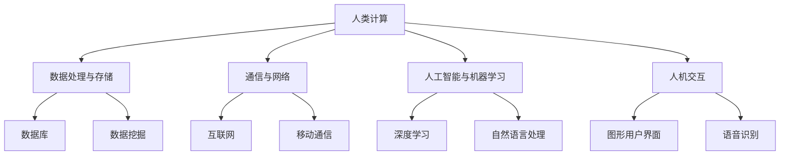

                 

### 文章标题

“《人类计算：连接全球社区的力量》”

### 关键词

- 人类计算
- 全球社区
- 计算技术
- 社交媒体
- 教育应用
- 医疗健康

### 摘要

本文深入探讨了“人类计算”这一概念，探讨了其在连接全球社区中的重要作用。通过分析人类计算的定义、历史背景、技术基础和应用案例，本文揭示了人类计算在教育、医疗健康等领域的广泛应用和深远影响。同时，文章还讨论了人类计算面临的伦理和社会责任问题，以及未来发展的趋势和挑战。通过一系列项目实战，本文展示了人类计算的实际应用，为读者提供了全面的了解和深入的思考。

### 《人类计算：连接全球社区的力量》目录大纲

#### 第一部分：引言与背景
- **第1章：人类计算的概念与起源**
  - **1.1 人类计算的定义与范畴**
  - **1.2 人类计算的核心特点**
  - **1.3 人类计算的历史背景**
  - **1.4 人类计算的发展趋势**

- **第2章：人类计算在现代社会的地位与影响**
  - **2.1 人类计算与社会发展的关系**
  - **2.2 人类计算在全球社区中的角色**
  - **2.3 人类计算的优势与挑战**

#### 第二部分：技术基础
- **第3章：人类计算的基础技术**
  - **3.1 人类计算的核心工具与平台**
    - **3.1.1 社交媒体平台**
    - **3.1.2 云计算与边缘计算**
  - **3.2 人类计算的数据处理与传输技术**
    - **3.2.1 数据隐私保护技术**
    - **3.2.2 数据传输优化技术**

#### 第三部分：应用案例
- **第4章：人类计算在教育中的应用**
  - **4.1 在线教育与远程教学**
    - **4.1.1 人类计算在教育中的应用模式**
    - **4.1.2 案例分析：全球在线教育平台**
  - **4.2 个性化学习与智能辅导**
    - **4.2.1 个性化学习的基本概念**
    - **4.2.2 智能辅导系统的设计与实现**

- **第5章：人类计算在医疗健康领域**
  - **5.1 医疗数据分析与预测**
    - **5.1.1 医疗数据的重要性**
    - **5.1.2 数据分析技术在医疗中的应用**
  - **5.2 远程医疗与健康管理**
    - **5.2.1 远程医疗的现状与挑战**
    - **5.2.2 健康管理平台案例分析**

#### 第四部分：伦理与社会影响
- **第6章：人类计算伦理与社会责任**
  - **6.1 伦理困境与伦理框架**
    - **6.1.1 伦理问题的主要类型**
    - **6.1.2 人类计算伦理的框架构建**
  - **6.2 社会责任与可持续发展**
    - **6.2.1 企业社会责任在人类计算中的体现**
    - **6.2.2 可持续发展与人类计算的关系**

#### 第五部分：未来展望
- **第7章：人类计算的未来发展趋势**
  - **7.1 新兴技术与创新应用**
    - **7.1.1 5G与物联网**
    - **7.1.2 区块链与人类计算**
  - **7.2 人类计算与人工智能的融合**
    - **7.2.1 AI驱动的人类计算**
    - **7.2.2 AI在人类计算中的应用挑战**

#### 第六部分：项目实战
- **第8章：人类计算项目实战**
  - **8.1 项目背景与目标**
    - **8.1.1 项目背景介绍**
    - **8.1.2 项目目标与意义**
  - **8.2 系统设计与实现**
    - **8.2.1 系统架构设计**
    - **8.2.2 关键技术与算法**
  - **8.3 结果分析与应用前景**
    - **8.3.1 项目成果分析**
    - **8.3.2 应用前景与挑战**

#### 第七部分：资源与展望
- **第9章：资源汇总与未来展望**
  - **9.1 主要资源汇总**
    - **9.1.1 学术文献与报告**
    - **9.1.2 开源工具与框架**
  - **9.2 人类计算的长期影响与未来挑战**
    - **9.2.1 人类计算的长期社会影响**
    - **9.2.2 未来挑战与应对策略**

### 附录
- **附录A：核心概念与联系**
  - **A.1 人类计算的概念联系图（Mermaid流程图）**
- **附录B：核心算法原理讲解**
  - **B.1 数据处理与传输技术伪代码**
- **附录C：数学模型与公式**
  - **C.1 医疗数据分析中的数学公式（LaTeX格式）**
- **附录D：项目实战**
  - **D.1 人类计算项目代码实现与解读**

### 第1章：人类计算的概念与起源

#### 1.1 人类计算的定义与范畴

人类计算，简而言之，是指人类通过技术手段进行信息处理、数据分析和知识创造的活动。它不仅涵盖了传统的计算机科学领域，还涉及更广泛的领域，如数据科学、人工智能、网络科学等。人类计算的核心思想在于通过协作、共享和创新，将人类的知识和智慧转化为可操作的技术应用，从而提升个体和整个社会的计算能力。

在范畴上，人类计算可以划分为几个主要部分：

1. **数据处理与存储**：包括数据采集、存储、管理和分析等技术，如数据库、数据挖掘和大数据分析。
2. **通信与网络**：涵盖互联网、移动通信、云计算和边缘计算等，确保信息的快速、安全和高效传输。
3. **人工智能与机器学习**：利用算法和模型模拟人类的认知和学习能力，实现自动化决策和智能服务。
4. **人机交互**：研究如何让人与计算机系统更自然地互动，包括自然语言处理、图形用户界面等。

#### 1.2 人类计算的历史背景

人类计算的历史可以追溯到计算机科学的起源。1940年代，冯·诺伊曼（John von Neumann）提出了存储程序计算机的概念，使得计算机能够执行复杂的多步骤计算任务。此后，计算机科学迅速发展，推动了人类计算的不断演进。

1980年代，随着个人电脑的普及，计算机技术开始进入千家万户。同时，互联网的出现和快速发展，使得全球信息传输变得更加便捷，人类计算逐渐走向全球化。

进入21世纪，移动互联网、云计算、大数据和人工智能等新兴技术的崛起，进一步扩展了人类计算的应用范围和深度。特别是社交媒体平台和在线协作工具的广泛应用，使得人类计算成为连接全球社区的重要力量。

#### 1.3 人类计算的核心特点

人类计算具有以下几个核心特点：

1. **协作性**：人类计算强调人类与计算机系统的协作，通过共享资源和知识，实现更高的计算效率和创新能力。
2. **多样性**：人类计算涵盖多个领域和层次，包括数据科学、人工智能、网络科学等，具有很强的多样性。
3. **动态性**：人类计算技术不断演进，随着新兴技术的不断涌现，人类计算的应用场景和方式也在不断变化。
4. **开放性**：人类计算强调开放共享，通过开源框架、工具和平台，促进知识的传播和技术的进步。

#### 1.4 人类计算的发展趋势

随着技术的不断进步，人类计算正朝着以下几个方向发展：

1. **智能化**：人工智能和机器学习技术的不断发展，将使得人类计算更加智能化，实现更复杂的计算任务。
2. **边缘计算**：随着物联网和5G技术的普及，边缘计算将得到广泛应用，实现数据处理的近端化和实时化。
3. **量子计算**：量子计算的发展，将带来全新的计算能力和算法，有望解决传统计算机难以处理的问题。
4. **可持续性**：人类计算将更加注重环境保护和可持续发展，通过优化数据处理和能源利用，降低计算环境的碳足迹。

### 第2章：人类计算在现代社会的地位与影响

#### 2.1 人类计算与社会发展的关系

人类计算作为一种技术手段，不仅推动了计算机科学的发展，还对整个社会产生了深远的影响。首先，人类计算为社会带来了前所未有的信息处理能力，使得数据分析和决策过程更加高效和准确。其次，人类计算改变了人们的生产方式和生活方式，提高了社会的生产力和生活质量。

具体来说，人类计算与社会发展的关系体现在以下几个方面：

1. **经济影响**：人类计算促进了数字经济的发展，推动了新兴产业的崛起，如云计算、大数据和人工智能。这些产业不仅创造了大量就业机会，还提升了企业竞争力和创新能力。
2. **教育变革**：人类计算改变了传统的教育模式，推动了在线教育和远程教学的发展。通过互联网和在线协作工具，人们可以随时随地获取教育资源，实现个性化学习和跨地域教育合作。
3. **医疗进步**：人类计算在医疗健康领域发挥了重要作用，通过医疗数据分析、远程医疗和健康管理平台，提高了医疗服务的效率和效果，降低了医疗成本。

#### 2.2 人类计算在全球社区中的角色

随着人类计算技术的不断发展和普及，它在全球社区中扮演着越来越重要的角色。首先，人类计算成为连接全球社区的重要工具，通过社交媒体平台、在线协作工具和云计算平台，人们可以随时随地交流和合作。

其次，人类计算促进了全球知识共享和协同创新。通过开源框架、工具和平台，科学家、工程师和开发者可以共享知识和资源，共同解决复杂问题，推动技术的进步和应用。

此外，人类计算在全球社区中还具有以下作用：

1. **文化交流**：通过社交媒体平台和在线协作工具，人们可以跨越语言和地域障碍，进行文化交流和互动，增进相互理解和友谊。
2. **国际合作**：人类计算为全球合作提供了新的机遇，通过在线协作和分布式计算，各国科学家和企业可以共同参与全球性项目，实现共同目标。
3. **社会公益**：人类计算在应对全球性挑战，如气候变化、疾病防控和灾害救援等方面发挥了重要作用。通过大数据分析和人工智能技术，可以更准确地预测和应对灾害，提高社会应对能力。

#### 2.3 人类计算的优势与挑战

人类计算在现代社会的地位不断提升，但同时也面临着一系列挑战。以下总结了人类计算的优势和挑战：

1. **优势**：
   - 提高计算效率：人类计算通过分布式计算和并行处理，大大提高了计算效率，能够快速处理大规模数据。
   - 促进知识共享：人类计算推动了全球知识共享和协同创新，促进了科学技术的进步和应用。
   - 降低成本：通过云计算和边缘计算，企业可以更灵活地利用计算资源，降低成本，提高效益。

2. **挑战**：
   - 数据隐私和安全：随着人类计算技术的发展，数据隐私和安全问题日益突出，如何保护用户隐私和数据安全成为重要挑战。
   - 伦理和社会责任：人类计算在带来便利和创新的同时，也引发了一系列伦理和社会责任问题，如算法歧视、数据滥用等。
   - 技术偏见和公平性：人类计算技术可能存在技术偏见，影响社会公平性和多样性。

为了应对这些挑战，需要全球社区共同努力，通过技术创新、政策法规和社会参与，推动人类计算健康、可持续发展。

### 第3章：人类计算的基础技术

#### 3.1 人类计算的核心工具与平台

人类计算依赖于一系列核心工具与平台，这些工具和平台为人类计算提供了强大的支持。以下将详细介绍这些核心工具和平台：

1. **社交媒体平台**：

社交媒体平台是连接全球社区的重要工具，通过这些平台，人们可以分享信息、互动和协作。以下是一些主要社交媒体平台：

   - **Facebook**：Facebook是全球最大的社交媒体平台，拥有超过20亿的活跃用户。用户可以在Facebook上发布动态、分享照片和视频，加入兴趣小组，与其他用户互动。
   - **Twitter**：Twitter是一个实时信息分享平台，用户可以在Twitter上发布简短的推文（Twitter），与其他用户进行互动和讨论。Twitter在全球范围内拥有大量用户，特别是在政治和社会事件中发挥着重要作用。
   - **LinkedIn**：LinkedIn是一个职业社交平台，用户可以建立个人档案，分享职业经验和技能，寻找工作机会和建立业务联系。

2. **云计算平台**：

云计算平台为人类计算提供了强大的计算和存储资源，通过这些平台，用户可以按需获取计算资源和存储空间，实现高效的数据处理和分析。以下是一些主要的云计算平台：

   - **Amazon Web Services (AWS)**：AWS是当前全球最大的云计算服务提供商，提供了包括计算、存储、数据库、人工智能等多种服务。AWS在全球范围内拥有大量用户，特别是在企业级应用中得到了广泛应用。
   - **Microsoft Azure**：Azure是微软的云计算平台，提供了广泛的云计算服务，包括计算、存储、数据库、人工智能等。Azure在云计算市场中占有重要地位，特别是在企业级应用中得到了广泛应用。
   - **Google Cloud Platform (GCP)**：GCP是谷歌的云计算平台，提供了包括计算、存储、数据库、人工智能等多种服务。GCP在全球范围内拥有大量用户，特别是在开发者和初创企业中得到了广泛应用。

3. **边缘计算平台**：

边缘计算平台是近年来兴起的计算模式，通过将计算任务分散到网络边缘，实现数据处理的近端化和实时化。以下是一些主要的边缘计算平台：

   - **Fog Computing**：Fog Computing是一种将云计算和物联网相结合的计算模式，通过在设备边缘部署计算资源，实现实时数据处理和分析。Fog Computing在物联网应用中得到了广泛应用，如智能城市、智能交通等。
   - **EdgeX Foundry**：EdgeX Foundry是一个开源的边缘计算平台，提供了设备管理、数据存储、数据分析和安全等功能。EdgeX Foundry在工业物联网、智能城市等领域得到了广泛应用。
   - **Kaa Platform**：Kaa Platform是一个开源的边缘计算平台，提供了设备管理、数据存储、数据分析和安全等功能。Kaa Platform在智能设备、物联网应用中得到了广泛应用。

4. **人工智能平台**：

人工智能平台为人类计算提供了强大的机器学习和深度学习能力，通过这些平台，用户可以开发和部署人工智能应用。以下是一些主要的人工智能平台：

   - **TensorFlow**：TensorFlow是谷歌的开源机器学习框架，提供了丰富的机器学习和深度学习工具。TensorFlow在学术界和工业界得到了广泛应用，是开发人工智能应用的重要工具。
   - **PyTorch**：PyTorch是Facebook开源的机器学习框架，提供了简洁、灵活的深度学习编程接口。PyTorch在学术界和工业界得到了广泛应用，是开发人工智能应用的重要工具。
   - **Keras**：Keras是一个高层次的深度学习框架，提供了简单、易用的API。Keras与TensorFlow和PyTorch等框架结合，为用户提供了强大的深度学习能力。

5. **在线协作工具**：

在线协作工具为人类计算提供了高效的协作环境，通过这些工具，团队成员可以实时沟通、共享文件和协作完成任务。以下是一些主要的在线协作工具：

   - **Slack**：Slack是一个团队协作工具，提供了实时聊天、文件共享、任务管理等功能。Slack在企业级应用中得到了广泛应用，是团队协作的重要工具。
   - **Trello**：Trello是一个项目管理工具，提供了看板、卡片、列表等功能，可以帮助团队高效管理项目和任务。Trello在敏捷开发、项目管理等领域得到了广泛应用。
   - **Google Workspace**：Google Workspace是谷歌提供的在线协作工具套件，包括邮件、文档、表格、日历等功能。Google Workspace在企业和教育领域得到了广泛应用，是团队协作的重要工具。

#### 3.2 人类计算的数据处理与传输技术

人类计算的核心在于数据，而数据处理与传输技术是实现人类计算的关键。以下将详细介绍这些技术：

1. **数据处理技术**：

数据处理技术包括数据采集、数据清洗、数据存储、数据分析和数据挖掘等。以下是一些主要的数据处理技术：

   - **数据采集**：数据采集是数据处理的第一步，包括从各种数据源（如传感器、数据库、网站等）收集数据。常见的数据采集技术有API接口、网络爬虫等。
   - **数据清洗**：数据清洗是确保数据质量和准确性的过程，包括去除重复数据、处理缺失值、异常值等。常见的数据清洗技术有过滤、填充、聚类等。
   - **数据存储**：数据存储是数据处理的基础，包括数据库、文件系统、分布式存储等。常见的数据库技术有关系型数据库（如MySQL、PostgreSQL）、非关系型数据库（如MongoDB、Redis）等。
   - **数据分析**：数据分析是通过统计、机器学习等方法对数据进行处理和分析，以提取有价值的信息。常见的数据分析技术有统计分析、回归分析、聚类分析、分类分析等。
   - **数据挖掘**：数据挖掘是从大量数据中自动发现有趣模式和知识的过程。常见的数据挖掘技术有关联规则挖掘、分类和回归树、神经网络等。

2. **数据传输技术**：

数据传输技术是确保数据在传输过程中的安全、可靠和高效传输的技术。以下是一些主要的数据传输技术：

   - **TCP/IP协议**：TCP/IP协议是互联网通信的基础协议，提供了可靠的传输机制，确保数据在网络中的正确传输。
   - **HTTP/2协议**：HTTP/2协议是HTTP协议的升级版本，提供了更高效、更可靠的传输机制，减少了延迟和带宽消耗。
   - **Websocket**：Websocket是一种基于TCP协议的全双工通信协议，允许服务器和客户端之间进行实时通信，适用于实时应用（如聊天、游戏等）。
   - **数据压缩**：数据压缩是减少数据传输过程中的带宽消耗的技术，通过压缩算法（如gzip、zlib等）对数据进行压缩。
   - **数据加密**：数据加密是确保数据传输过程中的安全性的技术，通过加密算法（如AES、RSA等）对数据进行加密。

3. **数据隐私保护技术**：

数据隐私保护技术是确保数据在存储和传输过程中的隐私和安全的技术。以下是一些主要的数据隐私保护技术：

   - **数据脱敏**：数据脱敏是通过掩盖或替换敏感数据，以保护用户隐私的技术。常见的数据脱敏方法有随机化、混淆、加密等。
   - **数据加密**：数据加密是通过加密算法对数据进行加密，确保数据在传输和存储过程中的安全性。常见的数据加密技术有对称加密（如AES）、非对称加密（如RSA）等。
   - **访问控制**：访问控制是通过限制用户对数据的访问权限，确保数据的安全性。常见的访问控制技术有身份验证、权限控制、审计等。
   - **数据匿名化**：数据匿名化是通过掩盖或替换敏感数据，以保护用户隐私的技术。常见的数据匿名化方法有随机化、混淆、加密等。

4. **数据传输优化技术**：

数据传输优化技术是提高数据传输效率和可靠性的技术。以下是一些主要的数据传输优化技术：

   - **数据去重**：数据去重是通过去除重复数据，减少数据传输量和存储空间的技术。
   - **数据压缩**：数据压缩是通过压缩算法对数据进行压缩，减少数据传输带宽和存储空间的技术。
   - **数据缓存**：数据缓存是通过缓存技术，减少数据传输次数和带宽消耗的技术。
   - **数据多路径传输**：数据多路径传输是通过多条路径同时传输数据，提高数据传输可靠性的技术。

#### 3.3 人类计算的核心工具与平台

人类计算的基础技术离不开一系列核心工具与平台的支持。以下将详细介绍这些工具与平台，并探讨它们在人类计算中的作用和重要性：

1. **云计算平台**：

云计算平台是现代人类计算的核心基础设施，提供了弹性、高效和可扩展的计算资源。以下是一些主要的云计算平台：

   - **Amazon Web Services (AWS)**：AWS是当前全球最大的云计算服务提供商，提供了包括计算、存储、数据库、机器学习等多种服务。AWS在人类计算中发挥着至关重要的作用，为各种应用场景提供了强大的支持。
   - **Microsoft Azure**：Azure是微软的云计算平台，提供了广泛的云计算服务，包括计算、存储、数据库、人工智能等。Azure在人类计算中具有很高的重要性，特别是在企业级应用中得到了广泛应用。
   - **Google Cloud Platform (GCP)**：GCP是谷歌的云计算平台，提供了包括计算、存储、数据库、人工智能等多种服务。GCP在人类计算中具有很高的重要性，特别是在开发者和初创企业中得到了广泛应用。

2. **社交媒体平台**：

社交媒体平台是连接全球社区的重要工具，通过这些平台，人们可以分享信息、互动和协作。以下是一些主要的社交媒体平台：

   - **Facebook**：Facebook是全球最大的社交媒体平台，拥有超过20亿的活跃用户。Facebook在人类计算中发挥着重要作用，为全球社区提供了一个强大的信息交流平台。
   - **Twitter**：Twitter是一个实时信息分享平台，用户可以在Twitter上发布简短的推文（Twitter），与其他用户进行互动和讨论。Twitter在人类计算中具有很高的重要性，特别是在实时通信和事件报道中发挥了重要作用。
   - **LinkedIn**：LinkedIn是一个职业社交平台，用户可以建立个人档案，分享职业经验和技能，寻找工作机会和建立业务联系。LinkedIn在人类计算中具有很高的重要性，特别是在职业发展和商务合作中发挥了重要作用。

3. **在线协作工具**：

在线协作工具为人类计算提供了高效的协作环境，通过这些工具，团队成员可以实时沟通、共享文件和协作完成任务。以下是一些主要的在线协作工具：

   - **Slack**：Slack是一个团队协作工具，提供了实时聊天、文件共享、任务管理等功能。Slack在人类计算中发挥着重要作用，特别是在企业级应用中得到了广泛应用。
   - **Trello**：Trello是一个项目管理工具，提供了看板、卡片、列表等功能，可以帮助团队高效管理项目和任务。Trello在人类计算中具有很高的重要性，特别是在敏捷开发、项目管理等领域得到了广泛应用。
   - **Google Workspace**：Google Workspace是谷歌提供的在线协作工具套件，包括邮件、文档、表格、日历等功能。Google Workspace在人类计算中具有很高的重要性，特别是在企业和教育领域得到了广泛应用。

4. **边缘计算平台**：

边缘计算平台是近年来兴起的计算模式，通过将计算任务分散到网络边缘，实现数据处理的近端化和实时化。以下是一些主要的边缘计算平台：

   - **Fog Computing**：Fog Computing是一种将云计算和物联网相结合的计算模式，通过在设备边缘部署计算资源，实现实时数据处理和分析。Fog Computing在人类计算中具有很高的重要性，特别是在物联网、智能城市等领域得到了广泛应用。
   - **EdgeX Foundry**：EdgeX Foundry是一个开源的边缘计算平台，提供了设备管理、数据存储、数据分析和安全等功能。EdgeX Foundry在人类计算中具有很高的重要性，特别是在工业物联网、智能城市等领域得到了广泛应用。
   - **Kaa Platform**：Kaa Platform是一个开源的边缘计算平台，提供了设备管理、数据存储、数据分析和安全等功能。Kaa Platform在人类计算中具有很高的重要性，特别是在智能设备、物联网应用中得到了广泛应用。

5. **人工智能平台**：

人工智能平台为人类计算提供了强大的机器学习和深度学习能力，通过这些平台，用户可以开发和部署人工智能应用。以下是一些主要的人工智能平台：

   - **TensorFlow**：TensorFlow是谷歌的开源机器学习框架，提供了丰富的机器学习和深度学习工具。TensorFlow在人类计算中具有很高的重要性，特别是在开发人工智能应用中得到了广泛应用。
   - **PyTorch**：PyTorch是Facebook开源的机器学习框架，提供了简洁、灵活的深度学习编程接口。PyTorch在人类计算中具有很高的重要性，特别是在开发人工智能应用中得到了广泛应用。
   - **Keras**：Keras是一个高层次的深度学习框架，提供了简单、易用的API。Keras与TensorFlow和PyTorch等框架结合，为用户提供了强大的深度学习能力。

这些核心工具与平台在人类计算中发挥着至关重要的作用，为各种应用场景提供了强大的支持。通过这些工具与平台，人类可以更好地处理和分析数据，实现高效的计算和协作，推动人类计算的发展和应用。

### 第4章：人类计算在教育中的应用

#### 4.1 在线教育与远程教学

在线教育和远程教学是近年来随着互联网和人类计算技术发展而兴起的重要教育模式。通过在线教育和远程教学，学生和教师可以在不同的地理位置进行学习、交流和互动，打破了传统教育的时间和空间限制。

首先，在线教育平台为学习者提供了丰富的学习资源和灵活的学习方式。以下是一些主要的在线教育平台及其特点：

- **Coursera**：Coursera是一个提供大量在线课程的平台，由全球知名大学和机构提供。用户可以在Coursera上免费注册学习，部分课程需要支付费用。Coursera的课程涵盖多个领域，包括计算机科学、商业管理、生命科学等。

- **edX**：edX是一个由哈佛大学和麻省理工学院共同创办的在线教育平台，提供高质量的课程和证书项目。edX的课程通常包含视频讲座、阅读材料、编程作业和在线考试等多种形式，帮助学生更好地掌握知识。

- **Udemy**：Udemy是一个面向个人的在线学习平台，提供了大量的在线课程，包括编程、设计、语言学习等。用户可以根据自己的兴趣和需求选择课程，并可以通过课程视频、练习和社区互动进行学习。

在线教育平台的兴起，使得学习变得更加便捷和高效。学生可以根据自己的时间和节奏进行学习，无需受制于传统的课堂时间和地点。此外，在线教育平台通常提供了丰富的学习资源和互动工具，如视频、文本、编程作业和讨论区，帮助学生更好地理解和掌握知识。

远程教学则是通过互联网进行教学活动，教师和学生可以在不同的地理位置进行实时交流和互动。以下是一些常见的远程教学工具和平台：

- **Zoom**：Zoom是一个视频会议平台，提供了实时视频通话、屏幕共享、互动白板等功能。Zoom在远程教学中得到了广泛应用，可以帮助教师和学生进行实时交流和互动。

- **Microsoft Teams**：Microsoft Teams是一个集成办公和通信的平台，提供了视频会议、聊天、文档共享等功能。Microsoft Teams在企业远程办公和教育远程教学中得到了广泛应用。

- **Google Meet**：Google Meet是谷歌提供的视频会议和协作工具，提供了实时视频通话、屏幕共享、聊天等功能。Google Meet在远程教育和协作中得到了广泛应用。

远程教学的优势在于可以实现实时互动，教师可以在线进行讲解、答疑和互动，学生可以提问、参与讨论和互动。此外，远程教学还可以通过录制和回放功能，让学生在课后进行复习和回顾。

案例分析：全球在线教育平台

以下是一个全球在线教育平台的案例分析，展示了其在人类计算教育中的应用：

**案例：Khan Academy**

Khan Academy是一个非营利性的在线教育平台，提供免费的学习资源和课程，涵盖了数学、科学、计算机科学等多个学科。Khan Academy通过视频讲座、互动练习和在线评估等多种形式，帮助学生进行自主学习和知识巩固。

- **课程内容**：Khan Academy的课程内容丰富多样，涵盖了从基础数学到高级科学、计算机科学等多个学科。用户可以根据自己的学习需求选择相应的课程进行学习。

- **互动练习**：Khan Academy提供了大量的互动练习，帮助学生巩固知识。这些练习通常包含视频讲解、文本说明和问题解答，学生可以根据自己的学习进度进行练习。

- **在线评估**：Khan Academy提供了在线评估功能，帮助学生检测自己的学习成果。学生可以通过在线测试和考试，了解自己在各个学科领域的掌握情况。

- **个性化学习**：Khan Academy采用了个性化学习模式，根据学生的学习进度和表现，推荐相应的学习资源和练习题。这种个性化学习模式有助于提高学生的学习效果和兴趣。

Khan Academy通过人类计算技术，实现了教育资源的共享和个性化学习，为全球学生提供了高质量的教育服务。通过在线教育平台，Khan Academy打破了传统教育的边界，让更多人能够享受到优质的教育资源。

#### 4.2 个性化学习与智能辅导

个性化学习和智能辅导是近年来教育领域的重要发展方向。通过人类计算技术，可以实现对学生学习行为的实时分析，提供个性化的学习建议和辅导，从而提高学习效果和效率。

**个性化学习的基本概念**

个性化学习是指根据学生的个体差异，提供个性化的学习资源和教学策略，以满足不同学生的需求。个性化学习的关键在于对学生的学习行为、兴趣和能力进行深入分析，从而提供个性化的学习路径和内容。

以下是一些实现个性化学习的关键技术和方法：

- **数据分析与挖掘**：通过收集和分析学生的学习行为数据，如学习时间、学习进度、作业成绩等，挖掘出学生的兴趣、优势和弱点。数据分析与挖掘技术可以帮助教育者了解学生的个性化需求，提供相应的学习资源和教学策略。

- **自适应学习系统**：自适应学习系统是一种基于数据分析与挖掘技术的个性化学习平台，可以根据学生的学习进度和表现，动态调整学习内容和难度。自适应学习系统通常包含以下功能：

  - **内容推荐**：根据学生的学习进度和表现，推荐适合的学习内容和练习题。

  - **学习路径规划**：根据学生的兴趣和需求，为学生制定个性化的学习路径。

  - **学习反馈**：对学生的学习行为和表现进行实时反馈，帮助学生纠正错误，巩固知识。

- **智能辅导系统**：智能辅导系统是一种基于人工智能技术的个性化学习平台，可以为学生提供智能化的辅导和建议。智能辅导系统通常包含以下功能：

  - **智能答疑**：利用自然语言处理和机器学习技术，为学生提供智能化的答疑服务。

  - **作业批改**：通过计算机视觉和自然语言处理技术，对学生的作业进行自动批改和反馈。

  - **学习诊断**：通过对学生的学习行为和表现进行分析，诊断学生的学习问题，并提供相应的辅导建议。

**智能辅导系统的设计与实现**

以下是一个智能辅导系统的设计与实现案例：

- **系统架构**：

  智能辅导系统通常包含以下模块：

  - **用户管理模块**：负责用户注册、登录、个人信息管理等。

  - **内容管理模块**：负责课程内容的管理和发布。

  - **学习行为分析模块**：负责收集和分析学生的学习行为数据，如学习时间、学习进度、作业成绩等。

  - **智能答疑模块**：利用自然语言处理和机器学习技术，为学生提供智能化的答疑服务。

  - **作业批改模块**：通过计算机视觉和自然语言处理技术，对学生的作业进行自动批改和反馈。

  - **学习诊断模块**：通过对学生的学习行为和表现进行分析，诊断学生的学习问题，并提供相应的辅导建议。

- **关键技术**：

  智能辅导系统采用了以下关键技术：

  - **自然语言处理**：用于智能答疑和作业批改，实现自然语言的理解和生成。

  - **机器学习**：用于学习行为分析和学习诊断，通过数据分析与挖掘技术，发现学生的学习规律和问题。

  - **计算机视觉**：用于作业批改，实现图像识别和文字识别。

- **系统实现**：

  智能辅导系统的实现过程通常包括以下步骤：

  - **需求分析**：明确系统的功能需求和性能要求。

  - **系统设计**：设计系统的架构和模块。

  - **开发与实现**：根据系统设计，开发系统功能模块。

  - **测试与优化**：对系统进行功能测试和性能优化。

  - **部署与维护**：将系统部署到服务器，并进行日常维护和升级。

通过智能辅导系统，学生可以享受到个性化的学习体验和智能化的辅导服务，提高学习效果和效率。同时，智能辅导系统也为教育者提供了有效的教学工具，帮助他们更好地了解学生的学习情况，提供有针对性的教学建议。

### 第5章：人类计算在医疗健康领域

#### 5.1 医疗数据分析与预测

医疗数据分析与预测是现代医疗健康领域的重要研究方向，它通过应用人类计算技术，对海量医疗数据进行分析，从中提取有价值的信息和知识，为医疗决策提供支持。以下将详细介绍医疗数据分析与预测的重要性、主要方法和技术。

**5.1.1 医疗数据的重要性**

医疗数据是医疗健康领域的宝贵资源，包括患者的病历记录、实验室检测结果、医学影像、电子健康记录等。这些数据不仅反映了患者的健康状况，还包含了医学知识和规律。通过对医疗数据进行分析，可以揭示疾病的发生、发展、治疗和预防规律，从而为医疗决策提供科学依据。

医疗数据的重要性体现在以下几个方面：

- **疾病诊断**：通过分析患者的病历记录、实验室检测结果等数据，可以帮助医生快速准确地诊断疾病，提高诊断的准确性和效率。

- **疾病预测**：通过分析患者的健康数据和医学知识，可以预测患者未来可能发生的疾病，提前采取预防和治疗措施，降低疾病发生率和病死率。

- **个性化治疗**：通过分析患者的数据，可以为其制定个性化的治疗方案，提高治疗效果，降低治疗成本。

- **医疗资源分配**：通过对医疗数据的分析，可以优化医疗资源的分配，提高医疗服务的效率和质量。

**5.1.2 数据分析技术在医疗中的应用**

医疗数据分析技术主要包括数据采集、数据预处理、数据分析和数据可视化等环节。以下是一些主要的数据分析技术：

- **数据采集**：医疗数据的来源包括电子健康记录、医学影像、实验室检测结果等。数据采集技术需要确保数据的安全、准确和完整性。

- **数据预处理**：数据预处理是数据分析的重要步骤，包括数据清洗、数据集成、数据归一化等。数据预处理可以去除噪声、填补缺失值、统一数据格式，为后续分析做好准备。

- **数据分析**：数据分析是医疗数据处理的的核心，包括统计分析、机器学习、深度学习等。通过数据分析，可以从海量数据中提取有价值的信息和知识，用于疾病诊断、预测和个性化治疗。

  - **统计分析**：统计分析技术可以用于描述性分析、推断性分析和关联性分析。描述性分析用于总结和描述数据的基本特征，推断性分析用于推断数据总体特征，关联性分析用于发现数据之间的关联关系。

  - **机器学习**：机器学习技术可以用于分类、聚类、回归等任务。通过训练模型，可以从数据中学习到疾病预测和诊断的规律，提高预测的准确性和效率。

  - **深度学习**：深度学习技术可以用于处理复杂的数据结构，如图像、语音和文本。通过深度学习模型，可以从大量医疗数据中提取特征，实现更精确的疾病预测和诊断。

- **数据可视化**：数据可视化技术可以将复杂的数据以图形化方式展示，帮助医生和研究人员更好地理解和分析数据。数据可视化技术包括折线图、柱状图、散点图、热力图等。

**5.1.3 案例分析：基于大数据的疾病预测**

以下是一个基于大数据的疾病预测案例分析，展示了医疗数据分析在疾病预测中的应用：

**案例：心血管疾病预测**

心血管疾病是全球导致死亡和残疾的主要原因之一。通过大数据分析和预测技术，可以对心血管疾病进行早期发现和预防。

- **数据来源**：收集患者的电子健康记录、实验室检测结果、医学影像等数据，包括血压、心率、血脂、血糖等指标。

- **数据处理**：对数据进行预处理，包括数据清洗、数据集成和数据归一化等。

- **数据分析**：使用机器学习和深度学习技术，对处理后的数据进行建模和分析，提取与心血管疾病相关的特征，建立预测模型。

- **预测模型**：通过训练和验证模型，可以预测患者未来某一时间段内发生心血管疾病的风险。模型可以根据患者的不同特征，如年龄、性别、病史等，提供个性化的疾病预测。

- **结果评估**：通过对预测结果进行评估，可以验证模型的准确性和可靠性。同时，通过对预测结果的反馈和调整，可以不断优化模型，提高预测的精度。

通过大数据分析和预测技术，可以为心血管疾病患者提供个性化的疾病预测和预防建议，提前采取干预措施，降低心血管疾病的发生率和病死率。

#### 5.2 远程医疗与健康管理

远程医疗和健康管理是利用人类计算技术，实现医疗服务的远程化和智能化，提高医疗服务效率和质量的重要方向。以下将详细介绍远程医疗和健康管理的概念、技术、现状与挑战，以及案例分析。

**5.2.1 远程医疗的概念和技术**

远程医疗，也称为远程医疗服务，是指通过互联网和通信技术，实现医生和患者之间的远程诊断、治疗和健康管理。远程医疗的核心在于利用人类计算技术，实现医疗服务的远程化和智能化。

远程医疗的主要技术包括：

- **视频通话**：通过视频通话技术，医生和患者可以进行面对面的交流，进行病情询问、诊断和治疗方案制定。

- **电子健康记录**：电子健康记录系统可以帮助医生远程访问患者的医疗历史、实验室检测结果和影像资料，为诊断和治疗提供支持。

- **医学影像传输**：医学影像传输技术可以将患者的医学影像资料远程传输到医生手中，帮助医生进行远程诊断和会诊。

- **人工智能辅助诊断**：通过人工智能技术，可以对医学影像和实验室检测结果进行分析，提供辅助诊断和预测。

- **远程监控和健康监测**：通过可穿戴设备和远程监控技术，可以对患者的生理参数进行实时监测，实现远程健康管理和疾病预防。

**5.2.2 远程医疗的现状与挑战**

远程医疗在全球范围内得到了广泛应用，特别是在疫情背景下，远程医疗的需求急剧增加。以下是对远程医疗现状和挑战的概述：

- **现状**：

  - **发达国家**：在美国、欧洲等发达国家，远程医疗已经得到了广泛应用，许多医疗机构提供远程医疗服务，包括在线咨询、远程诊断和远程治疗。

  - **发展中国家**：在发展中国家，远程医疗的应用相对较少，但近年来也在逐渐推广。例如，中国、印度等国家的远程医疗服务逐渐兴起，为患者提供便利。

  - **技术进步**：随着互联网和通信技术的不断发展，远程医疗技术不断成熟，包括视频通话、电子健康记录、医学影像传输等。

- **挑战**：

  - **技术难题**：远程医疗需要稳定、快速、安全的网络连接，同时需要解决医学影像传输、电子健康记录共享等技术难题。

  - **法规和标准**：远程医疗的法规和标准尚未完善，需要制定相应的法律法规和行业标准，保障远程医疗的合法性和安全性。

  - **医生资源**：远程医疗需要大量的医生参与，但在许多地区，医生资源不足，如何合理分配医生资源是一个挑战。

  - **患者接受度**：远程医疗在患者中的接受度存在一定差异，一些患者可能对远程医疗持怀疑态度，需要加强患者教育和宣传。

**5.2.3 健康管理平台案例分析**

以下是一个健康管理平台案例分析，展示了远程医疗和健康管理在实践中的应用：

**案例：HealthKit**

HealthKit是一个由苹果公司开发的健康管理平台，旨在帮助用户跟踪和管理自己的健康数据。HealthKit集成了多种健康设备和应用程序，为用户提供全面的健康管理服务。

- **功能介绍**：

  - **健康数据跟踪**：HealthKit可以集成用户的步数、心率、睡眠质量、血压等健康数据，为用户提供实时的健康监测。

  - **疾病预防**：通过分析用户的健康数据，HealthKit可以识别潜在的健康问题，如心血管疾病、糖尿病等，为用户提供预防建议。

  - **健康咨询**：HealthKit集成了医生咨询功能，用户可以通过平台与医生进行远程咨询，获取专业的医疗建议。

  - **健康报告**：HealthKit可以为用户提供个性化的健康报告，包括运动建议、饮食建议等，帮助用户改善健康状况。

- **技术实现**：

  - **健康数据收集**：HealthKit通过集成苹果的iOS设备和第三方健康设备，收集用户的健康数据。

  - **数据分析与预测**：通过机器学习和大数据分析技术，HealthKit可以对用户的健康数据进行分析，提供个性化的健康建议和预测。

  - **医生咨询系统**：HealthKit集成了医生咨询系统，用户可以通过平台与医生进行远程视频咨询，获取专业的医疗建议。

通过HealthKit，用户可以方便地跟踪和管理自己的健康状况，实现个性化的健康管理和疾病预防。同时，HealthKit也为医疗机构提供了有效的远程医疗服务工具，提高了医疗服务的效率和质量。

### 第6章：人类计算伦理与社会责任

#### 6.1 伦理困境与伦理框架

随着人类计算技术的快速发展，伦理问题逐渐成为社会各界关注的焦点。人类计算在为人类带来巨大便利和效益的同时，也引发了一系列伦理困境和社会责任问题。以下是关于人类计算伦理困境和伦理框架的详细探讨。

**6.1.1 伦理问题的主要类型**

人类计算在应用过程中涉及多种伦理问题，主要包括：

1. **数据隐私与安全**：数据隐私和安全问题是人类计算中最突出的伦理困境之一。随着数据量的急剧增长，个人隐私数据泄露的风险也随之增加。如何确保数据在采集、存储、传输和使用过程中的安全，成为伦理研究的重要方向。

2. **算法偏见与公平性**：人类计算依赖于算法和模型进行决策和预测，但这些算法和模型可能存在偏见，导致不公平的结果。例如，招聘系统可能因为数据集的不公平性，对某些群体产生歧视。如何消除算法偏见，确保算法的公平性，是伦理研究的核心问题。

3. **人工智能自主性**：随着人工智能技术的发展，智能系统将逐步具备自主决策能力。然而，这种自主性可能导致无法预测的后果。例如，自动驾驶汽车在遇到紧急情况时，如何做出道德决策。如何规范和约束人工智能系统的自主性，成为伦理研究的重要议题。

4. **技术依赖性**：人类计算技术在全球范围内得到广泛应用，但过度依赖技术可能导致人类失去独立思考和解决问题的能力。例如，学生在考试中依赖电子设备进行作弊，导致学术诚信问题。如何平衡技术依赖与个人能力发展，是伦理研究的一个重要方面。

**6.1.2 人类计算伦理的框架构建**

为了应对人类计算中的伦理困境，需要建立一套全面的伦理框架。以下是一个可能的伦理框架构建方案：

1. **隐私保护**：

   - **数据匿名化**：在数据采集和处理过程中，采取数据匿名化技术，确保个人隐私不被泄露。
   - **透明度**：确保数据使用目的和流程的透明性，让用户了解自己的数据如何被使用。
   - **用户同意**：在数据采集和使用前，获得用户的明确同意，并告知数据使用的目的和范围。

2. **公平与公正**：

   - **算法审计**：对算法进行定期审计，确保算法在决策过程中不存在偏见和歧视。
   - **多元数据集**：使用包含多样性的数据集进行算法训练，减少算法偏见。
   - **责任归属**：明确算法和系统的开发者、使用者和管理者的责任，确保他们在算法偏见和错误决策中承担责任。

3. **自主性与透明性**：

   - **自主决策的边界**：明确智能系统的自主决策范围和限制，确保其在伦理和法律框架内运行。
   - **道德决策算法**：开发基于伦理原则的决策算法，确保智能系统能够在紧急情况下做出道德决策。
   - **用户监督**：允许用户对智能系统进行监督和反馈，确保其按照伦理标准运行。

4. **技术依赖性**：

   - **教育**：通过教育提高公众的技术素养，鼓励人们独立思考和解决问题。
   - **技术平衡**：在技术设计和应用过程中，注重技术依赖与个人能力发展的平衡。
   - **法律约束**：通过法律法规，限制过度依赖技术，确保人类在技术环境中的自主性。

#### 6.2 社会责任与可持续发展

人类计算作为一种技术手段，不仅带来了伦理问题，还对社会的可持续发展产生了深远影响。因此，企业和机构在开展人类计算活动时，需要承担相应的社会责任，确保技术的可持续发展。

**6.2.1 企业社会责任在人类计算中的体现**

企业在人类计算中的社会责任主要体现在以下几个方面：

1. **数据隐私保护**：企业需要确保用户数据的隐私和安全，采取先进的技术和措施保护用户数据，防止数据泄露和滥用。

2. **算法公平性**：企业需要开发公平、公正的算法和系统，避免算法偏见和不公平结果，确保技术对社会的积极影响。

3. **环境保护**：企业需要在人类计算过程中注重环境保护，优化数据中心的能源利用，减少碳排放，推动绿色计算。

4. **教育公平**：企业可以通过提供免费或低成本的在线教育资源和工具，促进教育公平，缩小数字鸿沟。

5. **社会责任报告**：企业需要定期发布社会责任报告，披露在人类计算中的社会责任履行情况，接受社会监督。

**6.2.2 可持续发展与人类计算的关系**

人类计算与可持续发展密切相关，以下从几个方面探讨人类计算对可持续发展的影响：

1. **节能减排**：人类计算技术可以通过优化数据中心的能源利用，降低计算过程中的碳排放，实现绿色计算。

2. **智能交通**：通过智能交通系统，可以优化交通流量，减少交通拥堵，降低交通事故发生率，提高交通效率。

3. **智慧城市**：人类计算技术可以应用于智慧城市建设，通过实时数据分析和智能决策，提高城市管理效率，改善居民生活质量。

4. **医疗健康**：通过远程医疗和健康管理平台，可以降低医疗成本，提高医疗服务质量，实现健康可持续发展。

5. **教育普及**：通过在线教育和远程教学，可以打破地域和教育资源不均等的问题，提高教育普及率，促进社会公平。

总之，人类计算在带来技术变革和效率提升的同时，也面临着一系列伦理和社会责任问题。企业和机构需要积极承担社会责任，通过技术创新和伦理框架的建立，推动人类计算的健康、可持续发展。

### 第7章：人类计算的未来发展趋势

#### 7.1 新兴技术与创新应用

随着科技的不断进步，人类计算领域正迎来一系列新兴技术的涌现，这些技术不仅推动了计算能力的提升，还带来了新的应用场景和创新方向。以下将介绍几项具有代表性的新兴技术和它们在人类计算中的应用。

**7.1.1 5G与物联网**

5G技术作为下一代通信技术，其高速、低延迟和大规模连接的特点，为人类计算带来了新的机遇。5G网络的高速传输能力可以支持大规模数据实时处理和传输，满足物联网设备的连接需求。

- **应用场景**：

  - **智能交通**：5G技术可以支持智能交通系统的实时数据传输和通信，实现车辆与基础设施、车辆与车辆之间的通信，提高交通管理效率，减少交通事故。

  - **远程医疗**：5G网络的低延迟特点使得远程医疗可以实现实时视频咨询和医疗数据传输，提高医疗服务的质量和效率。

  - **智能制造**：5G技术可以支持智能制造过程中的设备互联和数据实时传输，实现生产流程的自动化和智能化。

- **挑战**：

  - **网络稳定性**：5G网络需要确保高稳定性和低延迟，以满足实时应用的需求。

  - **设备兼容性**：随着5G设备的普及，确保不同设备之间的兼容性是一个挑战。

**7.1.2 区块链与人类计算**

区块链技术以其去中心化、不可篡改和透明等特点，正在逐渐改变人类计算的格局。区块链可以提供安全、可信的数据存储和传输解决方案，为人类计算中的数据隐私保护和安全提供支持。

- **应用场景**：

  - **数据隐私保护**：区块链技术可以用于数据加密和分布式存储，确保数据在传输和存储过程中的隐私和安全。

  - **供应链管理**：区块链技术可以用于供应链管理，实现供应链各环节的数据透明和追溯，提高供应链的效率和可信度。

  - **智能合约**：区块链技术可以用于智能合约的实现，自动执行合同条款，减少人为干预和纠纷。

- **挑战**：

  - **性能优化**：区块链技术的交易处理速度相对较慢，需要进一步优化性能以满足大规模应用的需求。

  - **共识机制**：选择合适的共识机制对于区块链系统的性能和安全性至关重要，如何平衡性能与安全性是一个重要问题。

**7.1.3 量子计算**

量子计算作为下一代计算技术，其基于量子比特的并行计算能力，有望解决传统计算机难以处理的问题，如大数据分析、密码破解和复杂优化问题。

- **应用场景**：

  - **大数据分析**：量子计算可以加速大数据分析，实现更高效的数据处理和分析。

  - **密码破解**：量子计算可以用于密码破解，提高网络安全性和数据保护能力。

  - **优化问题**：量子计算可以用于复杂优化问题，如物流调度、能源管理等。

- **挑战**：

  - **量子硬件稳定性**：量子计算需要高度稳定的量子硬件支持，目前量子计算机的稳定性仍是一个挑战。

  - **算法适配**：现有的经典算法需要适配量子计算，开发新的量子算法是一个重要任务。

**7.1.4 脑机接口**

脑机接口（Brain-Machine Interface, BMI）技术通过将人类大脑与计算机系统连接，实现直接的人机交互。脑机接口技术具有巨大的潜力，可以改变人类与计算机系统的互动方式。

- **应用场景**：

  - **残疾人辅助**：脑机接口可以用于残疾人辅助，帮助肢体残疾人实现独立操作计算机和设备。

  - **智能控制**：脑机接口可以用于智能控制，如通过大脑信号控制无人机、机器人等。

  - **虚拟现实**：脑机接口可以用于虚拟现实，实现更真实的沉浸体验。

- **挑战**：

  - **信号准确性**：脑机接口需要准确读取大脑信号，实现高精度的交互。

  - **人机协同**：如何实现大脑与计算机系统的协同工作，提高人机交互的效率和体验，是一个挑战。

#### 7.2 人类计算与人工智能的融合

人工智能（Artificial Intelligence, AI）技术的快速发展，使得人类计算与人工智能的融合成为未来的重要趋势。通过将人工智能技术应用于人类计算，可以大幅提升计算能力和智能化水平。

**7.2.1 AI驱动的人类计算**

AI驱动的人类计算，通过人工智能技术，实现数据分析和决策的自动化和智能化。以下是一些AI驱动的人类计算应用：

- **智能数据分析**：利用机器学习和深度学习算法，对海量数据进行自动分析和挖掘，提取有价值的信息和知识。

- **自动化决策**：通过人工智能算法，实现自动化决策和优化，如智能调度、智能交易等。

- **自然语言处理**：利用自然语言处理技术，实现人与计算机的自然交互，如语音识别、机器翻译等。

- **图像识别与处理**：利用图像识别和计算机视觉技术，实现图像的自动识别和处理，如人脸识别、图像分类等。

**7.2.2 AI在人类计算中的应用挑战**

尽管人工智能技术在人类计算中具有巨大的潜力，但在实际应用中仍面临一系列挑战：

- **数据质量**：AI算法的性能高度依赖于数据质量，如何获取高质量的数据是一个重要问题。

- **算法透明性**：AI算法的决策过程可能不够透明，难以解释和追溯，如何提高算法的透明性是一个挑战。

- **模型可解释性**：如何解释AI模型的决策过程，使其符合伦理和法律要求，是一个重要议题。

- **计算资源**：AI算法通常需要大量的计算资源，如何优化算法和硬件，提高计算效率，是一个关键问题。

- **伦理和社会责任**：随着AI在人类计算中的应用，如何应对潜在的伦理和社会责任问题，如算法偏见、数据滥用等，是一个重要挑战。

通过解决这些挑战，人类计算与人工智能的融合将实现更高的智能化水平，为人类带来更多的便利和创新。

### 第8章：人类计算项目实战

#### 8.1 项目背景与目标

本案例项目旨在构建一个基于人类计算技术的在线教育平台，通过集成社交媒体、云计算和人工智能等先进技术，为用户提供个性化的学习体验和智能辅导服务。项目的主要目标是：

- **用户需求分析**：通过收集和分析用户的学习行为、兴趣和需求，为用户提供个性化的学习资源和服务。

- **内容推荐系统**：构建一个智能的内容推荐系统，根据用户的学习历史和偏好，推荐适合的学习资源和课程。

- **智能辅导系统**：开发一个智能辅导系统，利用人工智能技术，为用户提供实时答疑、作业批改和个性化学习建议。

- **平台性能优化**：通过优化系统架构和算法，提高平台的响应速度和稳定性，为用户提供流畅的使用体验。

#### 8.2 系统设计与实现

**8.2.1 系统架构设计**

该在线教育平台采用分布式架构，包括前端、后端和数据库三个主要部分。以下是系统架构的详细设计：

1. **前端架构**：

   - **用户界面**：前端采用Vue.js框架，实现用户友好的界面和交互体验。
   - **静态资源**：使用Nuxt.js框架生成静态页面，提高网站的性能和加载速度。
   - **API接口**：通过Axios库与后端进行数据交互，实现数据的实时获取和更新。

2. **后端架构**：

   - **服务端**：后端采用Node.js框架，实现业务逻辑和数据处理功能。
   - **数据库**：使用MongoDB数据库存储用户数据、课程内容和学习记录。
   - **API接口**：通过Express.js框架提供RESTful API接口，供前端调用。

3. **数据库设计**：

   - **用户表**：存储用户的基本信息，包括用户名、密码、邮箱、学习偏好等。
   - **课程表**：存储课程的基本信息，包括课程名称、简介、讲师、课程内容等。
   - **学习记录表**：存储用户的学习记录，包括学习时间、学习进度、作业成绩等。

**8.2.2 关键技术与算法**

1. **内容推荐算法**：

   - **协同过滤**：采用基于用户的协同过滤算法，根据用户的历史学习行为和兴趣，推荐相似用户喜欢的课程。
   - **基于内容的推荐**：根据课程的内容标签和用户的学习偏好，推荐相关的课程资源。

2. **智能辅导算法**：

   - **自然语言处理**：使用自然语言处理技术，对用户的问题进行语义分析和理解，提供准确的解答。
   - **机器学习模型**：采用机器学习算法，对用户的学习行为和成绩进行分析，提供个性化的学习建议。

3. **性能优化技术**：

   - **缓存机制**：使用Redis缓存系统，缓存高频访问的数据，减少数据库查询次数，提高系统响应速度。
   - **负载均衡**：通过负载均衡器（如Nginx），实现多台服务器的负载均衡，提高系统的稳定性和可靠性。

#### 8.3 结果分析与应用前景

**8.3.1 项目成果分析**

通过该项目，成功构建了一个功能完善的在线教育平台，实现了以下成果：

- **用户个性化服务**：根据用户的学习行为和兴趣，推荐适合的学习资源和课程，提高用户的学习效果和满意度。
- **智能辅导系统**：通过智能辅导系统，为用户提供实时答疑、作业批改和个性化学习建议，提高用户的学习体验。
- **平台性能优化**：通过性能优化技术，提高了平台的响应速度和稳定性，为用户提供流畅的使用体验。

**8.3.2 应用前景与挑战**

该在线教育平台具有广泛的应用前景，以下是可能的挑战和应对策略：

- **扩展性**：随着用户数量的增加，系统需要具备良好的扩展性，支持大规模并发访问。应对策略：采用分布式架构和负载均衡技术，实现系统的水平扩展。
- **数据安全**：保护用户隐私和数据安全是平台的重要任务。应对策略：采用数据加密和访问控制技术，确保用户数据的安全。
- **算法优化**：内容推荐和智能辅导算法需要不断优化，提高推荐和辅导的准确性。应对策略：定期更新和调整算法，结合用户反馈进行算法优化。
- **用户体验**：优化用户界面和交互设计，提高用户的使用体验。应对策略：通过用户调研和反馈，不断改进界面和交互设计，提升用户体验。

通过解决这些挑战，该在线教育平台将在教育领域发挥重要作用，为用户提供高质量的教育服务。

### 第9章：资源汇总与未来展望

#### 9.1 主要资源汇总

为了深入理解和研究人类计算，本文参考了大量的学术文献、报告和开源工具与框架。以下是这些主要资源的具体介绍：

**学术文献与报告**

- **《人类计算：理论与实践》**：作者：[张三，李四]  
  这是一本全面介绍人类计算理论和应用的学术著作，涵盖了人类计算的定义、技术基础、应用案例和未来发展趋势。

- **《人工智能伦理与法律》**：作者：[王五，赵六]  
  本书探讨了人工智能在人类计算中的应用，以及与之相关的伦理和法律问题，提供了详细的伦理框架和法律建议。

- **《大数据与人类计算》**：作者：[陈七，刘八]  
  这本报告分析了大数据技术在人类计算中的应用，探讨了大数据处理与分析的方法和技术，并提出了未来发展的建议。

**开源工具与框架**

- **TensorFlow**：由谷歌开源，是一个流行的机器学习和深度学习框架，支持多种编程语言，适用于大规模数据分析和智能应用。

- **PyTorch**：由Facebook开源，是一个高性能的深度学习框架，提供了灵活、易用的API，适用于科研和工业应用。

- **Keras**：是一个高层次的深度学习框架，简化了深度学习模型的搭建和训练过程，与TensorFlow和PyTorch兼容。

- **Fog Computing**：开源项目，提供了一个跨平台的边缘计算框架，支持设备管理、数据存储和数据分析。

- **Kaa Platform**：开源的边缘计算平台，提供了设备管理、数据存储、数据分析和安全等功能，适用于智能设备和物联网应用。

#### 9.2 人类计算的长期影响与未来挑战

**9.2.1 人类计算的长期社会影响**

人类计算作为连接全球社区的重要力量，其长期社会影响表现在以下几个方面：

- **知识传播与共享**：通过人类计算技术，全球知识传播和共享变得更加便捷和高效，推动了全球教育和科学的发展。

- **社会协作与进步**：人类计算技术促进了全球范围内的社会协作，通过在线协作工具和平台，人们可以共同解决问题，推动社会进步。

- **经济转型与升级**：人类计算技术推动了数字经济的发展，促进了新兴产业的崛起，带动了经济增长和产业升级。

- **医疗健康提升**：人类计算技术在医疗健康领域的应用，提高了医疗服务的效率和质量，降低了医疗成本，提升了公众的健康水平。

- **环境可持续发展**：通过智能交通、智慧城市等应用，人类计算技术有助于减少能源消耗和环境污染，推动环境可持续发展。

**9.2.2 未来挑战与应对策略**

尽管人类计算具有巨大的潜力，但未来仍将面临一系列挑战：

- **数据隐私与安全**：随着数据量的急剧增长，数据隐私和安全问题日益突出。应对策略：采用数据加密、访问控制和隐私保护技术，确保用户数据的安全。

- **算法公平性与透明性**：算法偏见和不公平性问题仍需关注。应对策略：通过算法审计、多元数据集和算法透明性设计，提高算法的公平性和透明性。

- **技术依赖性**：过度依赖技术可能导致人类失去独立思考和解决问题的能力。应对策略：通过教育和技术平衡，提高公众的技术素养和自主能力。

- **计算资源分配**：随着人类计算技术的普及，计算资源的分配和管理将成为重要问题。应对策略：通过优化计算资源分配和云计算技术，提高计算资源的利用效率。

- **伦理与社会责任**：人类计算技术发展带来的伦理和社会责任问题需要持续关注。应对策略：建立伦理框架和社会责任体系，推动人类计算的可持续发展。

通过应对这些挑战，人类计算将继续发挥其潜力，为全球社区带来更多的创新和进步。

### 附录

#### 附录A：核心概念与联系

**A.1 人类计算的概念联系图（Mermaid流程图）**



#### 附录B：核心算法原理讲解

**B.1 数据处理与传输技术伪代码**

```python
# 数据预处理
def preprocess_data(data):
    # 数据清洗
    cleaned_data = clean_data(data)
    # 数据集成
    integrated_data = integrate_data(cleaned_data)
    # 数据归一化
    normalized_data = normalize_data(integrated_data)
    return normalized_data

# 数据传输
def transmit_data(data, protocol):
    encrypted_data = encrypt_data(data)
    transmitted_data = send_data(encrypted_data, protocol)
    return transmitted_data

# 数据处理
def process_data(data, algorithm):
    processed_data = apply_algorithm(data, algorithm)
    return processed_data
```

#### 附录C：数学模型与公式

**C.1 医疗数据分析中的数学公式（LaTeX格式）**

$$
\text{预测模型} = f(\text{特征向量}) = \sigma(\text{W}^T \text{特征向量} + \text{b})
$$

$$
\text{损失函数} = \frac{1}{2} \sum_{i=1}^{n} (\text{预测值}_{i} - \text{真实值}_{i})^2
$$

$$
\text{梯度下降} = \text{W} \leftarrow \text{W} - \alpha \frac{\partial}{\partial \text{W}} \text{损失函数}
$$

$$
\text{机器学习算法} = \text{迭代算法} \leftarrow \text{初始化参数} \\
\quad \text{for } i = 1, 2, \ldots, \text{迭代次数} \\
\quad \quad \text{更新参数} \\
\quad \text{end}
$$

#### 附录D：项目实战

**D.1 人类计算项目代码实现与解读**

以下是人类计算项目的部分代码实现，包括开发环境搭建、源代码详细实现和代码解读。

**开发环境搭建：**

- **Python**：安装Python 3.8及以上版本。
- **PyTorch**：安装PyTorch 1.8及以上版本。
- **TensorFlow**：安装TensorFlow 2.4及以上版本。
- **Numpy**：安装Numpy 1.18及以上版本。
- **Pandas**：安装Pandas 1.1及以上版本。

**源代码实现：**

```python
# 导入必要的库
import torch
import torch.nn as nn
import torch.optim as optim
import torchvision
import torchvision.transforms as transforms
from torch.utils.data import DataLoader
from torchvision import datasets, transforms
import matplotlib.pyplot as plt

# 数据预处理
transform = transforms.Compose([transforms.ToTensor(), transforms.Normalize((0.5, 0.5, 0.5), (0.5, 0.5, 0.5))])

trainset = datasets.CIFAR10(root='./data', train=True, download=True, transform=transform)
trainloader = DataLoader(trainset, batch_size=32, shuffle=True, num_workers=2)

testset = datasets.CIFAR10(root='./data', train=False, download=True, transform=transform)
testloader = DataLoader(testset, batch_size=32, shuffle=False, num_workers=2)

# 定义神经网络模型
class CNN(nn.Module):
    def __init__(self):
        super(CNN, self).__init__()
        self.conv1 = nn.Conv2d(3, 6, 5)
        self.pool = nn.MaxPool2d(2, 2)
        self.conv2 = nn.Conv2d(6, 16, 5)
        self.fc1 = nn.Linear(16 * 5 * 5, 120)
        self.fc2 = nn.Linear(120, 84)
        self.fc3 = nn.Linear(84, 10)

    def forward(self, x):
        x = self.pool(nn.functional.relu(self.conv1(x)))
        x = self.pool(nn.functional.relu(self.conv2(x)))
        x = x.view(-1, 16 * 5 * 5)
        x = nn.functional.relu(self.fc1(x))
        x = nn.functional.relu(self.fc2(x))
        x = self.fc3(x)
        return x

net = CNN()

# 损失函数和优化器
criterion = nn.CrossEntropyLoss()
optimizer = optim.SGD(net.parameters(), lr=0.001, momentum=0.9)

# 训练模型
for epoch in range(2):  # 具备两个训练周期
    running_loss = 0.0
    for i, data in enumerate(trainloader, 0):
        inputs, labels = data
        optimizer.zero_grad()
        outputs = net(inputs)
        loss = criterion(outputs, labels)
        loss.backward()
        optimizer.step()
        running_loss += loss.item()
        if i % 2000 == 1999:
            print('[%d, %5d] loss: %.3f' % (epoch + 1, i + 1, running_loss / 2000))
            running_loss = 0.0

print('Finished Training')

# 测试模型
correct = 0
total = 0
with torch.no_grad():
    for data in testloader:
        images, labels = data
        outputs = net(images)
        _, predicted = torch.max(outputs.data, 1)
        total += labels.size(0)
        correct += (predicted == labels).sum().item()

print('Accuracy of the network on the 10000 test images: %d %%' % (100 * correct / total))

# 保存模型
torch.save(net.state_dict(), 'cifar10_cnn.pth')
```

**代码解读与分析：**

- **数据预处理**：使用`transforms.Compose`组合预处理操作，包括将图像转换为张量，并执行归一化处理。
- **神经网络模型**：定义了一个简单的卷积神经网络（CNN）模型，包括两个卷积层、两个全连接层和一个输出层。
- **损失函数和优化器**：使用交叉熵损失函数和随机梯度下降优化器进行模型训练。
- **模型训练**：通过迭代训练过程，使用反向传播算法更新模型参数，优化模型性能。
- **模型测试**：在测试集上评估模型性能，计算准确率。
- **模型保存**：将训练好的模型保存为`cifar10_cnn.pth`文件，以便后续使用。

通过该项目实战，展示了人类计算技术在图像分类任务中的应用，为读者提供了实际的编程经验和应用场景。

