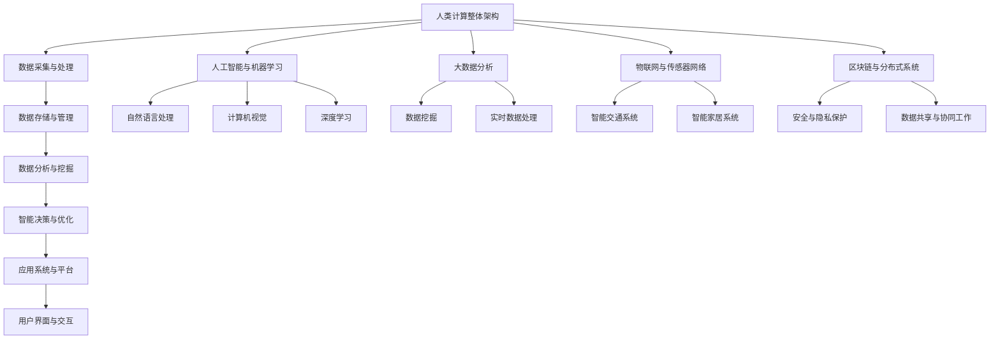

                 

### 文章标题

# 《人类计算：释放集体智慧的力量》

> 关键词：集体智慧、人类计算、人工智能、大数据、案例分析、应用领域、发展趋势

> 摘要：本文从人类计算的历史背景与概念出发，探讨了集体智慧的原理与实践，详细介绍了人类计算的基础技术及其在各应用领域的实现。文章通过案例研究，展示了人类计算在现实世界中的实际应用，并展望了其未来的发展趋势与挑战。旨在通过逻辑清晰的分析与深入探讨，揭示人类计算在释放集体智慧方面的巨大潜力。

### 《人类计算：释放集体智慧的力量》目录大纲

## 第一部分：人类计算的背景与概念

### 第1章：人类计算的历史与演变
#### 1.1 人类计算的基础概念
#### 1.2 人类计算的关键发展阶段
#### 1.3 人类计算与现代科技的关系

### 第2章：集体智慧的原理与实践
#### 2.1 集体智慧的概述
#### 2.2 集体智慧的核心要素
#### 2.3 集体智慧的实践案例

## 第二部分：人类计算的技术实现

### 第3章：人类计算的基础技术
#### 3.1 人工智能概述
#### 3.2 人类计算的关键技术
#### 3.3 人类计算与大数据分析

### 第4章：人类计算的应用领域
#### 4.1 教育与培训
#### 4.2 健康医疗
#### 4.3 金融与经济
#### 4.4 社会治理与公共安全

### 第5章：人类计算的发展趋势
#### 5.1 技术展望
#### 5.2 道德与社会影响
#### 5.3 未来的可能性与挑战

## 第三部分：案例研究与实战应用

### 第6章：人类计算案例研究
#### 6.1 案例一：在线协作平台
#### 6.2 案例二：智能交通系统
#### 6.3 案例三：智慧城市项目

### 第7章：人类计算实战应用
#### 7.1 实战一：构建智能客服系统
#### 7.2 实战二：开发个性化推荐算法
#### 7.3 实战三：设计智能决策支持系统

## 第四部分：附录与参考资料

### 第8章：附录与参考资料
#### 8.1 技术工具与资源
#### 8.2 进一步阅读材料
#### 8.3 学术研究与前沿动态

## 附件

### 附录A：人类计算架构图
#### A.1 人类计算的整体架构
#### A.2 关键技术模块解释

### 附录B：核心算法原理与伪代码
#### B.1 机器学习算法概述
#### B.2 伪代码示例

### 附录C：数学模型与公式
#### C.1 数学模型简介
#### C.2 公式解析与示例

### 附录D：实战代码分析与解读
#### D.1 开发环境搭建
#### D.2 源代码实现与解读
#### D.3 代码解读与分析

---

### 第一部分：人类计算的背景与概念

#### 第1章：人类计算的历史与演变

##### 1.1 人类计算的基础概念

**人类计算**，即人类通过协作和分工，利用大脑和工具，进行信息处理和知识创造的过程。其基础概念包括信息的获取、处理、传递和利用。人类计算的核心在于集体智慧，即个体智慧通过合作与共享，形成更为强大的智慧体系。

**人类计算**的定义可以追溯到古希腊哲学家亚里士多德。他提出了“智能集体”的概念，认为个体智能通过合作可以实现更高的智慧水平。亚里士多德的思想为后来的“集体智慧”理论奠定了基础。

在工业革命之前，人类计算主要依赖于手工劳动和简单的机械工具。随着工业革命的发展，人类计算逐步走向机械化、自动化。计算机的出现，标志着人类计算进入了一个全新的时代。

##### 1.2 人类计算的关键发展阶段

**第一阶段：手工计算**（公元前 - 公元前 1800 年）

- 人类依靠大脑进行简单的计算。
- 出现了算筹、算盘等简单的计算工具。

**第二阶段：机械化计算**（公元 1800 年 - 公元 1946 年）

- 机械化计算工具如计算尺、差分机等问世。
- 出现了穿孔卡片、电传打字机等计算机器。

**第三阶段：电子计算**（公元 1946 年 - 今）

- 计算机成为人类计算的主要工具。
- 人工智能、大数据、云计算等新技术推动了人类计算的发展。

##### 1.3 人类计算与现代科技的关系

现代科技的发展，极大地推动了人类计算的能力。计算机、互联网、大数据、人工智能等技术的出现，使得人类计算从传统的人工处理向自动化、智能化转变。

计算机的出现，使得人类计算从手工劳动走向机械化。计算机强大的数据处理能力，使得人类能够处理海量的数据，从而推动大数据技术的发展。

互联网的出现，使得人类计算从孤立的个体走向全球的协作。通过互联网，人类可以共享信息、知识和技术，实现更为高效的集体智慧。

大数据技术的发展，使得人类能够从海量数据中发现规律、挖掘价值。大数据与人类计算的结合，推动了数据驱动决策、智能推荐等应用的发展。

人工智能技术的出现，使得人类计算从自动化走向智能化。人工智能通过模拟人类智能，实现了更为复杂的任务，如自然语言处理、图像识别、智能决策等。

##### 总结

人类计算的历史与演变，展示了人类智慧从个体到集体、从机械化到智能化的演变过程。现代科技的发展，为人类计算注入了新的动力，使其在各个领域发挥出巨大的潜力。

#### 第2章：集体智慧的原理与实践

##### 2.1 集体智慧的概述

**集体智慧**，是指个体智慧通过合作、共享和协同，形成更为强大、高效的智慧体系。集体智慧不仅体现在人类社会中，也广泛应用于生物、经济、社会等领域。

**集体智慧**的基本特征包括：

- **多样性**：集体智慧源于个体差异，多样性的存在使得集体智慧更具包容性和创新能力。
- **协同性**：个体智慧的协同作用，使得集体智慧能够更高效地解决问题。
- **适应性**：集体智慧能够根据环境变化，不断调整和优化。
- **自组织性**：集体智慧具有自组织能力，能够在没有中央控制的情况下，自主形成和进化。

**集体智慧**的形成过程主要包括：

- **信息共享**：个体之间通过交流和协作，共享信息和知识。
- **知识整合**：个体智慧通过整合、融合，形成更高层次的智慧。
- **协同创新**：个体智慧通过协同作用，实现创新和突破。

##### 2.2 集体智慧的核心要素

**1. 个体智慧**

个体智慧是集体智慧的基础。个体智慧的水平、专业性和多样性，决定了集体智慧的潜力和能力。个体智慧的发挥，需要充分发挥个体的创造力、思维能力和专业知识。

**2. 合作与共享**

合作与共享是集体智慧的关键。个体通过合作，将各自的优势和资源整合，实现协同效应。共享是合作的前提，个体之间需要建立信任和合作机制，实现信息的无缝传递和知识的高效共享。

**3. 沟通与交流**

沟通与交流是集体智慧的桥梁。个体之间通过有效的沟通和交流，理解对方的观点、需求和想法，实现知识的传递和智慧的融合。

**4. 平台与工具**

平台与工具是集体智慧的支持。现代科技的发展，为集体智慧提供了丰富的平台和工具，如互联网、社交网络、大数据分析工具等。这些平台和工具，极大地提升了个体之间的协作效率和智慧水平。

##### 2.3 集体智慧的实践案例

**1. 开源社区**

开源社区是集体智慧的典型代表。开源社区通过个体的合作与共享，开发了大量的开源软件和开源项目。这些项目不仅得到了全球开发者的贡献和改进，也推动了技术的创新和进步。

**2. 科研团队**

科研团队是集体智慧的另一种形式。科研团队通过合作和共享，实现了对复杂科学问题的研究。科研团队的成功，不仅依赖于个体的智慧和能力，更依赖于团队的协作和合作。

**3. 企业创新**

企业创新也是集体智慧的体现。企业通过内部协作和外部合作，实现了技术创新和产品创新。企业内部的知识共享、信息传递和协同创新，是集体智慧在企业中的具体应用。

**4. 社会治理**

社会治理中的集体智慧，体现在政府、社会组织和公众之间的协作与共享。社会治理中的集体智慧，有助于提高政府决策的科学性、公正性和效率，促进社会的和谐与发展。

##### 总结

集体智慧是人类计算的重要组成部分，它通过个体智慧的整合和协同，实现了更为强大、高效的智慧体系。集体智慧的形成和发挥，需要个体智慧、合作与共享、沟通与交流、平台与工具等多方面要素的支撑。实践证明，集体智慧在开源社区、科研团队、企业创新和社会治理等领域，都取得了显著的成效。随着现代科技的发展，集体智慧的潜力将不断释放，为人类社会的发展带来更多的机遇和挑战。

#### 第3章：人类计算的基础技术

##### 3.1 人工智能概述

人工智能（Artificial Intelligence，简称AI）是计算机科学的一个分支，旨在使计算机系统能够模拟、延伸和扩展人类的智能。人工智能的研究领域包括机器学习、自然语言处理、计算机视觉、智能决策等。

**人工智能的发展阶段**：

- **规则驱动阶段**：早期的人工智能主要依赖于预定义的规则和逻辑。例如，专家系统通过模拟人类专家的推理过程，解决特定领域的问题。
- **知识驱动阶段**：这一阶段的人工智能引入了知识表示和推理技术，使得系统可以存储和利用大量的领域知识。
- **数据驱动阶段**：随着大数据和计算技术的发展，人工智能开始依赖于机器学习和深度学习技术，通过数据学习实现自动推理和决策。

**人工智能的核心技术**：

- **机器学习**：机器学习是一种通过数据训练，使计算机系统自动学习和改进的方法。主要方法包括监督学习、无监督学习和强化学习。
- **深度学习**：深度学习是机器学习的一种重要分支，通过多层神经网络，模拟人脑的学习过程，实现图像识别、语音识别等复杂任务。
- **自然语言处理**：自然语言处理（Natural Language Processing，简称NLP）是人工智能的一个子领域，旨在使计算机理解和生成自然语言。
- **计算机视觉**：计算机视觉（Computer Vision）是使计算机能够“看到”和理解现实世界的技术。主要应用包括图像识别、物体检测、图像分割等。

**人工智能的应用领域**：

- **智能客服**：通过自然语言处理和计算机视觉技术，实现自动化的客户服务。
- **智能交通**：通过智能算法，优化交通流量，提高交通效率。
- **医疗健康**：通过大数据分析和机器学习技术，辅助医生进行疾病诊断和治疗方案制定。
- **金融与经济**：通过数据分析和预测模型，实现风险管理、投资决策等。

##### 3.2 人类计算的关键技术

**1. 大数据分析**

大数据分析（Big Data Analytics）是处理海量数据的科学，旨在从大量数据中提取有价值的信息和知识。大数据分析的关键技术包括：

- **数据存储与管理**：使用分布式存储技术，如Hadoop和Spark，实现海量数据的存储和管理。
- **数据挖掘**：通过算法和技术，从海量数据中发现隐藏的模式和规律。
- **实时分析**：通过实时处理技术，实现对数据的即时分析和响应。
- **数据可视化**：通过图表和可视化技术，使数据分析和结果更加直观和易于理解。

**2. 云计算**

云计算（Cloud Computing）是一种通过互联网提供计算资源和服务的技术。云计算的关键技术包括：

- **虚拟化技术**：通过虚拟化技术，实现计算资源的灵活调度和高效利用。
- **弹性扩展**：根据需求自动扩展和缩减计算资源，提高系统的可用性和性能。
- **分布式计算**：通过分布式计算技术，实现大规模数据处理和任务调度。
- **安全性**：通过安全技术和策略，保障数据的安全性和隐私性。

**3. 物联网**

物联网（Internet of Things，简称IoT）是一种将物体通过互联网连接起来的技术。物联网的关键技术包括：

- **传感器网络**：通过传感器，实现物体的感知和数据采集。
- **通信协议**：通过通信协议，实现物体之间的数据传输和通信。
- **边缘计算**：通过边缘计算技术，实现数据处理和智能分析，降低网络延迟和带宽消耗。
- **数据安全**：通过数据加密和安全协议，保障物联网设备的数据安全。

**4. 区块链**

区块链（Blockchain）是一种分布式数据库技术，通过去中心化和加密技术，实现数据的安全和可靠。区块链的关键技术包括：

- **分布式账本**：通过分布式账本，实现数据的分布式存储和管理。
- **加密技术**：通过加密技术，保障数据的隐私和安全。
- **智能合约**：通过智能合约，实现自动化和可信的交易和合同执行。
- **共识机制**：通过共识机制，实现节点之间的数据一致性和网络稳定性。

##### 3.3 人类计算与大数据分析

大数据分析在人类计算中发挥着至关重要的作用。大数据分析不仅能够处理海量数据，还能够从中提取有价值的信息和知识，为人类计算提供数据支持和决策依据。

**大数据分析在人类计算中的应用**：

- **智能决策**：通过大数据分析，可以从大量数据中提取有用的信息，支持智能决策。
- **风险控制**：通过大数据分析，可以识别潜在的风险，实现风险控制。
- **个性化服务**：通过大数据分析，可以了解用户的需求和行为，提供个性化的服务和推荐。
- **运营优化**：通过大数据分析，可以优化业务流程，提高运营效率和效益。

**大数据分析的核心技术**：

- **数据清洗**：通过数据清洗技术，去除数据中的噪声和错误，提高数据的准确性和可用性。
- **数据挖掘**：通过数据挖掘技术，从大量数据中发现隐藏的模式和规律。
- **机器学习**：通过机器学习技术，构建预测模型和分类模型，实现自动化分析和决策。
- **数据可视化**：通过数据可视化技术，将分析结果以图表和图形的形式展示，便于理解和决策。

##### 总结

人类计算的基础技术，包括人工智能、大数据分析、云计算、物联网和区块链等，它们共同构成了人类计算的技术体系。这些技术不仅推动了人类计算的发展，也为各个领域提供了强大的数据支持和智能工具。随着技术的不断进步，人类计算将在更广泛的领域中发挥出更大的作用。

#### 第4章：人类计算的应用领域

##### 4.1 教育与培训

人类计算在教育与培训领域中的应用，正深刻改变着传统的教学和学习方式。以下是人类计算在该领域的具体应用：

**1. 智能教学系统**

智能教学系统通过大数据分析和人工智能技术，根据学生的个性化需求和学习情况，提供个性化的教学方案和资源。系统可以实时监测学生的学习进度、学习效果和知识点掌握情况，提供针对性的辅导和建议。

**2. 在线教育平台**

在线教育平台利用互联网和云计算技术，实现课程资源的共享和远程教学。学生可以随时随地访问课程内容，通过视频、文档、论坛等多种形式进行学习。教师也可以在线进行授课、答疑和作业布置，提高教学效率和互动性。

**3. 智能评估与反馈**

通过自然语言处理和计算机视觉技术，智能评估系统能够自动评估学生的作业和考试成绩，提供即时反馈。这种实时反馈可以帮助学生及时发现学习中的问题，调整学习策略。

**4. 个性化学习推荐**

基于大数据分析技术，个性化学习推荐系统能够根据学生的学习兴趣、学习习惯和知识掌握情况，推荐合适的学习内容和资源。这有助于提高学生的学习兴趣和效果。

**5. 在线协作与交流**

人类计算技术支持学生在虚拟学习环境中进行协作与交流，如在线讨论、小组作业等。这有助于培养学生的团队合作能力和沟通能力。

**案例研究**

- **Coursera**：在线学习平台Coursera利用人工智能技术，提供个性化学习体验。平台通过分析学生的学习行为和成绩，推荐相应的课程和学习资源。
- **Khan Academy**：Khan Academy利用大数据分析和计算机视觉技术，实现自动化的作业评估和即时反馈。学生可以通过在线平台完成作业，并立即获得详细反馈。

##### 4.2 健康医疗

人类计算在健康医疗领域的应用，正为医学研究和医疗服务带来革命性的变革。以下是人类计算在该领域的具体应用：

**1. 医学影像分析**

通过计算机视觉和深度学习技术，医学影像分析系统能够自动识别和诊断疾病。例如，在肺癌筛查中，系统可以自动检测肺结节，提高诊断的准确性和效率。

**2. 疾病预测与预防**

利用大数据分析和机器学习技术，医学研究机构可以对疾病进行预测和预防。例如，通过对大量患者的医疗数据进行分析，可以预测某些疾病的高发人群，提前进行干预和预防。

**3. 智能诊断与辅助**

智能诊断系统通过人工智能技术，辅助医生进行诊断。例如，基于自然语言处理技术，系统能够自动分析患者的病历，提供诊断建议。

**4. 个性化治疗方案**

通过大数据分析和机器学习技术，个性化治疗方案可以根据患者的具体情况进行定制。例如，在癌症治疗中，系统能够根据患者的基因信息、病史和治疗效果，推荐最优的治疗方案。

**5. 医疗资源优化**

利用云计算和物联网技术，医疗资源可以实现高效配置和利用。例如，通过智能交通系统，可以实现患者的及时就医和医疗设备的最佳使用。

**案例研究**

- **IBM Watson for Health**：IBM Watson for Health利用人工智能技术，提供智能诊断和辅助。系统通过分析大量医学文献和病例数据，为医生提供诊断建议和治疗方案。
- **Google Health**：Google Health利用大数据分析技术，进行疾病预测和预防。例如，通过分析用户的搜索行为，系统可以预测某些疾病的高发人群，提前进行干预。

##### 4.3 金融与经济

人类计算在金融与经济领域的应用，正显著提升金融服务的效率和准确性，推动金融创新的进程。以下是人类计算在该领域的具体应用：

**1. 金融市场分析**

通过大数据分析和人工智能技术，金融市场分析系统能够实时监控市场动态，预测市场走势。例如，通过分析大量的交易数据和市场信息，系统可以预测股票、期货、外汇等金融产品的价格变动。

**2. 风险管理**

利用大数据分析和机器学习技术，风险管理系统能够识别和评估金融风险。例如，通过对客户的历史交易记录和信用数据进行分析，系统可以预测客户的信用风险，为银行提供信用评估和风险控制依据。

**3. 个性化金融服务**

通过大数据分析和人工智能技术，个性化金融服务系统能够根据客户的需求和风险承受能力，提供定制化的金融产品和服务。例如，通过分析客户的数据，系统可以推荐最适合的贷款、投资和保险产品。

**4. 智能投资顾问**

智能投资顾问系统利用人工智能技术，为投资者提供投资建议和策略。例如，通过分析市场数据、经济指标和投资者行为，系统可以制定最优的投资组合和交易策略。

**5. 供应链金融**

利用区块链技术和人工智能技术，供应链金融系统能够实现快速、安全的资金流转和风险管理。例如，通过区块链技术，系统可以确保供应链中各方的交易记录真实、透明，降低金融风险。

**案例研究**

- **J.P. Morgan**：J.P. Morgan利用大数据分析和人工智能技术，开发出自动化的合约审查系统。该系统可以自动审查和分析大量的金融合同，提高审查效率和准确性。
- **Wealthfront**：Wealthfront利用人工智能技术，提供智能投资顾问服务。系统根据投资者的风险承受能力和投资目标，制定个性化的投资组合和策略。

##### 4.4 社会治理与公共安全

人类计算在社会治理与公共安全领域的应用，有助于提高公共服务的效率和质量，保障社会的稳定和安全。以下是人类计算在该领域的具体应用：

**1. 智能交通管理**

通过大数据分析和人工智能技术，智能交通管理系统可以实现交通流量实时监测和优化。例如，通过分析交通数据，系统可以预测交通拥堵情况，提供最优的路线规划，减少交通拥堵和事故发生。

**2. 公共安全监控**

利用计算机视觉和人工智能技术，公共安全监控系统能够实时监控公共场所的动态，识别和预警潜在的犯罪行为。例如，通过分析监控视频，系统可以自动识别异常行为，如打架、盗窃等，并及时报警。

**3. 智能社区管理**

通过物联网和人工智能技术，智能社区管理系统可以实现社区设施的高效管理和维护。例如，通过传感器和智能设备，系统可以实时监测社区的用电、用水和燃气情况，确保社区的安全和环保。

**4. 智能应急响应**

利用大数据分析和人工智能技术，智能应急响应系统能够实时监测自然灾害和事故的发生，提供快速的应急响应和救援服务。例如，通过分析气象数据和灾害监测数据，系统可以预测自然灾害的发生，提前发布预警信息，组织应急响应。

**5. 智能执法与监督**

通过大数据分析和人工智能技术，智能执法与监督系统可以实现执法活动的智能化和透明化。例如，通过分析执法记录和视频监控数据，系统可以评估执法人员的执法行为，提高执法的公正性和效率。

**案例研究**

- **City of Las Vegas**：拉斯维加斯市利用智能交通管理系统，实现交通流量实时监测和优化。通过分析交通数据，系统可以预测交通拥堵情况，提供最优的路线规划，减少交通拥堵和事故发生。
- **Los Angeles Police Department**：洛杉矶警察局利用公共安全监控系统和人工智能技术，实现公共场所的实时监控和预警。通过分析监控视频，系统可以自动识别异常行为，如打架、盗窃等，并及时报警。

##### 总结

人类计算在教育与培训、健康医疗、金融与经济、社会治理与公共安全等领域，都有着广泛的应用。通过大数据分析、人工智能、物联网和区块链等技术的结合，人类计算为各个领域带来了革命性的变革，提升了服务效率和质量，推动了社会的发展和进步。随着技术的不断进步，人类计算将在更广泛的领域中发挥出更大的作用，为社会创造更多的价值。

#### 第5章：人类计算的发展趋势

##### 5.1 技术展望

**1. 人工智能的进一步发展**

随着深度学习、强化学习等技术的不断进步，人工智能将变得更加智能和灵活。未来，人工智能将不仅能够处理结构化数据，还能够理解和处理自然语言、图像、视频等非结构化数据。这将使人工智能在更多领域得到应用，如智能客服、智能医疗、智能交通等。

**2. 大数据的深度挖掘与实时分析**

大数据技术将继续发展，实现更高效的数据存储、管理和分析。未来的大数据分析将更加注重实时性，通过实时数据流处理技术，实现数据的即时分析和响应。这将有助于企业和政府更快地做出决策，提高业务和治理效率。

**3. 物联网的普及与融合**

物联网技术将得到广泛应用，实现万物互联。未来的物联网将不仅包括智能设备，还包括智能交通、智能城市、智能农业等。通过物联网，可以实现设备间的无缝连接和协作，提高生产和生活效率。

**4. 区块链技术的深化应用**

区块链技术将继续深化应用，从金融领域扩展到供应链管理、版权保护、医疗健康等更多领域。未来，区块链将实现更加去中心化、透明和安全的网络环境，为数据共享和信任建立提供技术支持。

**5. 量子计算的突破**

量子计算技术有望在未来实现突破，解决传统计算机难以处理的问题。量子计算将极大提升计算能力，推动人工智能、大数据分析等领域的发展。

##### 5.2 道德与社会影响

**1. 道德伦理问题**

随着人类计算技术的进步，道德伦理问题日益凸显。例如，人工智能的决策是否公平、透明，大数据分析是否侵犯个人隐私，区块链的去中心化是否会导致信息不对称等。这些问题需要法律法规和道德规范的引导，确保人类计算技术的发展符合社会价值观。

**2. 社会不平等问题**

人类计算技术的发展可能加剧社会不平等。一方面，技术进步可能导致劳动力市场的变化，影响某些行业和职业的就业；另一方面，技术资源的不平等分配可能加剧贫富差距。因此，需要制定相关政策，确保技术发展惠及所有人。

**3. 数据安全与隐私保护**

随着数据量的增加和数据分析技术的进步，数据安全与隐私保护变得更加重要。未来的挑战是如何在充分利用数据价值的同时，保障个人隐私和数据安全。

**4. 社会治理与公共安全**

人类计算技术在提升社会治理和公共安全方面的作用将更加显著。然而，这也带来了新的挑战，如如何确保智能系统的公正性和透明度，如何应对人工智能和大数据分析可能带来的伦理和法律问题。

##### 5.3 未来的可能性与挑战

**1. 未来的可能性**

- **智能城市与智慧生活**：通过物联网和人工智能技术，实现城市智能管理、智能家居、智能交通等，提高生活质量和效率。
- **个性化医疗与精准治疗**：通过大数据和人工智能技术，实现个性化医疗方案，提高治疗效果和患者满意度。
- **金融科技与智能投资**：通过大数据分析和人工智能技术，实现智能投资决策、风险管理等，提高金融服务的效率和收益。
- **社会治理与公共安全**：通过人工智能、大数据和区块链技术，实现智能治理、公共安全预警等，提高社会治理和公共安全水平。

**2. 挑战**

- **技术发展速度与法规滞后**：技术发展迅速，但相关法律法规和伦理规范可能滞后，需要及时更新和完善。
- **数据隐私与安全**：数据量的增加和数据类型的多样化，使得数据隐私和安全面临更大的挑战。
- **社会不平等与技术鸿沟**：技术进步可能加剧社会不平等和技术鸿沟，需要制定公平的政策和措施。
- **人工智能的伦理问题**：人工智能的决策过程和结果可能存在伦理问题，需要制定相应的道德规范和监管机制。

##### 总结

人类计算的发展趋势展现出巨大的潜力，但也面临诸多挑战。未来的可能性在于通过技术的不断进步，实现智能城市、个性化医疗、金融科技和社会治理等方面的突破。然而，挑战也无处不在，包括道德伦理、社会不平等、数据隐私和安全等方面。因此，需要全社会共同努力，推动人类计算技术的健康发展，确保其造福人类。

#### 第6章：人类计算案例研究

##### 6.1 案例一：在线协作平台

**背景**：随着互联网和云计算技术的发展，在线协作平台已经成为企业和团队高效协作的重要工具。在线协作平台通过集成即时通讯、文档共享、项目管理等功能，实现了团队成员的实时沟通和协作。

**关键技术**：在线协作平台的关键技术包括云计算、即时通讯、文档共享、项目管理等。

- **云计算**：云计算技术为在线协作平台提供了弹性的计算资源和数据存储能力，使得平台可以快速部署和扩展。
- **即时通讯**：即时通讯技术实现了团队成员之间的实时沟通，提高了信息传递的效率。
- **文档共享**：文档共享技术使得团队成员可以实时访问和编辑共享文档，提高了协同工作的效率。
- **项目管理**：项目管理工具可以帮助团队成员跟踪项目进度、任务分配和资源管理，确保项目按时完成。

**应用效果**：通过在线协作平台，企业可以实现远程办公、跨部门协作、项目管理和文档共享等功能，提高了团队的工作效率和协作能力。以下是一些具体的案例：

- **Google Workspace**：Google Workspace 是一款集成了文档编辑、邮件、日历等功能的在线协作平台，广泛用于企业远程办公和团队协作。
- **Trello**：Trello 是一款基于看板的项目管理工具，可以帮助团队实时跟踪项目进度和任务分配，提高了项目管理效率。

**总结**：在线协作平台通过集成多种技术，实现了团队成员的高效协作和项目管理。这种平台不仅提高了工作效率，还增强了团队的沟通和协作能力，为企业带来了显著的业务价值。

##### 6.2 案例二：智能交通系统

**背景**：随着城市交通问题的日益严重，智能交通系统成为解决交通拥堵、提高交通效率的重要手段。智能交通系统通过传感器、物联网、大数据分析和人工智能技术，实现交通信息的实时监测、分析和优化。

**关键技术**：智能交通系统的关键技术包括传感器、物联网、大数据分析和人工智能等。

- **传感器**：传感器用于收集道路状况、车辆流量、天气等信息，为交通管理系统提供数据支持。
- **物联网**：物联网技术实现了传感器与交通管理中心的实时数据传输，提高了交通信息的实时性和准确性。
- **大数据分析**：大数据分析技术通过对交通数据的分析，预测交通流量和事故发生，为交通管理提供决策支持。
- **人工智能**：人工智能技术用于交通信号控制、车辆导航、停车管理等方面，提高了交通管理的智能化水平。

**应用效果**：智能交通系统在许多城市得到了广泛应用，取得了显著的效果：

- **伦敦智能交通系统**：伦敦利用智能交通系统，实现了交通流量实时监测和信号控制优化，有效减少了交通拥堵，提高了交通效率。
- **北京智能交通系统**：北京通过智能交通系统，实现了交通信号控制优化和停车管理，有效缓解了城市交通压力。

**总结**：智能交通系统通过集成多种技术，实现了交通信息的实时监测、分析和优化，提高了交通效率，缓解了城市交通拥堵问题。智能交通系统的成功应用，为其他城市提供了宝贵的经验。

##### 6.3 案例三：智慧城市项目

**背景**：智慧城市项目旨在通过信息技术，提高城市管理的效率、提升居民生活质量，实现城市的可持续发展。智慧城市项目涵盖了多个领域，包括智能交通、智能能源、智能医疗、智能安防等。

**关键技术**：智慧城市项目的关键技术包括云计算、大数据、物联网、人工智能等。

- **云计算**：云计算技术为智慧城市提供了强大的计算和存储能力，支持大规模数据分析和应用部署。
- **大数据**：大数据技术通过对海量数据的分析，为城市管理者提供决策支持，优化城市资源配置。
- **物联网**：物联网技术实现了城市各类设备的互联互通，为城市管理提供了实时数据支持。
- **人工智能**：人工智能技术用于智能交通、智能安防、智能医疗等领域，提高了城市服务的智能化水平。

**应用效果**：智慧城市项目在全球范围内得到了广泛应用，取得了显著的成果：

- **新加坡智慧城市项目**：新加坡通过智慧城市项目，实现了智能交通、智能能源、智能安防等领域的应用，提升了城市管理的效率和服务质量。
- **中国智慧城市项目**：中国多个城市通过智慧城市项目，实现了智能交通、智能医疗、智能安防等方面的应用，提高了居民的生活质量。

**总结**：智慧城市项目通过集成多种技术，实现了城市管理的智能化和精细化，提升了城市服务的质量和效率。智慧城市项目的成功，为其他城市提供了借鉴和参考。

#### 第7章：人类计算实战应用

##### 7.1 实战一：构建智能客服系统

**背景**：随着企业业务的不断增长，客服系统成为企业与客户沟通的重要渠道。传统的客服系统往往依赖于人工处理，效率较低，且难以应对大量的客户咨询。因此，构建智能客服系统成为提高客服效率和客户满意度的关键。

**目标**：构建一个能够自动处理常见客户问题的智能客服系统，减少人工干预，提高客服效率。

**技术实现**：

- **自然语言处理（NLP）**：利用NLP技术，实现客户咨询的自然语言理解和自动回复。
- **机器学习**：通过机器学习模型，对历史客户咨询数据进行训练，实现智能客服系统的自动回复。
- **对话管理**：设计对话管理模块，实现多轮对话的上下文保持和问题转移。

**具体步骤**：

1. **数据收集与处理**：收集企业历史客户咨询数据，对数据进行清洗和预处理，提取关键信息。
2. **模型训练与优化**：利用机器学习算法，训练NLP模型，通过交叉验证和参数调整，优化模型性能。
3. **系统集成与部署**：将NLP模型集成到客服系统中，实现自动化回复功能，并进行系统测试和优化。

**案例解析**：

- **蚂蚁金服智能客服系统**：蚂蚁金服通过构建智能客服系统，实现了对大量客户咨询的自动化处理，提高了客服效率和客户满意度。

**总结**：构建智能客服系统，可以显著提高客服效率和客户满意度，为企业节省大量人力成本。通过自然语言处理、机器学习和对话管理技术的结合，实现自动化和智能化的客服体验。

##### 7.2 实战二：开发个性化推荐算法

**背景**：在信息爆炸的时代，用户面临海量的信息资源，如何为用户提供个性化的推荐成为关键问题。个性化推荐系统可以帮助用户发现感兴趣的内容，提高信息获取的效率。

**目标**：开发一个能够为用户提供个性化推荐内容的推荐系统，提高用户满意度和留存率。

**技术实现**：

- **协同过滤**：基于用户的历史行为和偏好，利用协同过滤算法推荐相似用户喜欢的内容。
- **基于内容的推荐**：根据内容的特征和标签，为用户推荐相似的内容。
- **深度学习**：利用深度学习模型，如神经网络，对用户行为和内容进行特征提取和建模。

**具体步骤**：

1. **数据收集与处理**：收集用户的行为数据和内容数据，对数据进行清洗和预处理。
2. **特征工程**：提取用户和内容的特征，构建推荐模型所需的数据集。
3. **模型训练与优化**：利用机器学习算法，训练推荐模型，通过交叉验证和参数调整，优化模型性能。
4. **系统集成与部署**：将推荐模型集成到应用系统中，实现实时推荐功能，并进行系统测试和优化。

**案例解析**：

- **Netflix个性化推荐系统**：Netflix通过构建个性化推荐系统，为用户推荐感兴趣的电影和电视剧，显著提高了用户满意度和观看时长。

**总结**：开发个性化推荐算法，可以帮助企业提高用户满意度和留存率，实现精准营销和内容分发。通过协同过滤、基于内容的推荐和深度学习技术的结合，实现高度个性化的推荐体验。

##### 7.3 实战三：设计智能决策支持系统

**背景**：在复杂的市场环境和竞争态势下，企业需要做出快速、准确的决策。传统的决策支持系统往往依赖于人工分析和经验判断，难以应对复杂的市场变化。智能决策支持系统的设计，有助于提高决策的准确性和效率。

**目标**：设计一个能够辅助企业做出准确决策的智能决策支持系统，提高决策效率和效果。

**技术实现**：

- **数据挖掘与预测分析**：利用数据挖掘技术，从企业历史数据中挖掘有用的信息和规律，进行预测分析。
- **机器学习与优化算法**：利用机器学习算法，构建预测模型和优化算法，辅助企业做出最佳决策。
- **可视化与交互**：设计直观的可视化和交互界面，使决策者能够方便地理解和操作决策支持系统。

**具体步骤**：

1. **数据收集与处理**：收集企业运营数据、市场数据等，对数据进行清洗和预处理。
2. **特征工程与模型训练**：提取关键特征，训练预测模型和优化算法。
3. **系统集成与部署**：将预测模型和优化算法集成到决策支持系统中，实现实时预测和优化功能。
4. **用户培训与反馈**：对决策者进行培训，收集用户反馈，不断优化决策支持系统。

**案例解析**：

- **亚马逊决策支持系统**：亚马逊通过设计智能决策支持系统，实现了对库存管理、价格策略、市场营销等方面的优化，提高了运营效率和收益。

**总结**：设计智能决策支持系统，可以帮助企业应对复杂的市场环境，提高决策效率和效果。通过数据挖掘、机器学习和优化算法的结合，实现智能化、自动化的决策支持。

#### 第8章：附录与参考资料

##### 8.1 技术工具与资源

为了更好地理解和应用人类计算技术，以下列出了一些常用的技术工具与资源：

- **编程语言**：Python、Java、C++等。
- **开发框架**：TensorFlow、PyTorch、Scikit-learn等。
- **大数据工具**：Hadoop、Spark、Flink等。
- **云计算平台**：AWS、Azure、Google Cloud等。
- **数据库**：MySQL、PostgreSQL、MongoDB等。
- **机器学习库**：scikit-learn、NumPy、Pandas等。
- **自然语言处理库**：NLTK、spaCy、gensim等。
- **数据可视化工具**：Matplotlib、Seaborn、Plotly等。

##### 8.2 进一步阅读材料

以下是一些推荐的进一步阅读材料，以帮助深入理解人类计算的相关概念和技术：

- 《深度学习》（Ian Goodfellow、Yoshua Bengio、Aaron Courville 著）
- 《大数据时代》（涂子沛 著）
- 《区块链：从数字货币到信用社会》（唐绪琴 著）
- 《人工智能：一种现代的方法》（Stuart J. Russell、Peter Norvig 著）
- 《机器学习实战》（Peter Harrington 著）
- 《Python机器学习》（Michael Bowles 著）

##### 8.3 学术研究与前沿动态

为了跟踪人类计算领域的最新研究成果和前沿动态，可以关注以下学术期刊、会议和研究机构：

- **学术期刊**：《自然·机器 intelligence》、《IEEE Transactions on Knowledge and Data Engineering》、《Journal of Machine Learning Research》等。
- **学术会议**：NeurIPS、ICML、KDD、WWW等。
- **研究机构**：谷歌大脑、DeepMind、微软研究院、IBM Research等。

#### 附录A：人类计算架构图

**A.1 人类计算的整体架构**



**A.2 关键技术模块解释**

- **数据采集与处理**：负责收集和处理来自各种来源的数据，包括结构化数据和非结构化数据，为后续的分析和处理提供基础。
- **数据存储与管理**：负责数据的存储、管理和维护，确保数据的完整性和可靠性。
- **数据分析与挖掘**：利用机器学习、数据挖掘等技术，从大量数据中提取有价值的信息和知识。
- **智能决策与优化**：基于数据分析结果，运用智能算法进行决策和优化，提高系统的效率和效果。
- **应用系统与平台**：构建用于特定应用场景的系统平台，如智能客服、智慧城市等。
- **用户界面与交互**：设计直观、易用的用户界面，使用户能够方便地与系统进行交互。
- **人工智能与机器学习**：提供智能计算和决策的基础，包括深度学习、自然语言处理、计算机视觉等。
- **自然语言处理**：使计算机能够理解和生成自然语言，包括语音识别、文本分析等。
- **计算机视觉**：使计算机能够理解和解释视觉信息，包括图像识别、物体检测等。
- **深度学习**：一种模拟人脑学习的算法，能够处理复杂的模式和任务。
- **大数据分析**：处理海量数据，从中提取有价值的信息和知识。
- **数据挖掘**：从大量数据中发现隐藏的模式和规律。
- **实时数据处理**：处理和分析实时数据流，提供实时决策和响应。
- **物联网与传感器网络**：连接物理世界和数字世界，实现智能化的监测和管理。
- **智能交通系统**：通过技术手段优化交通管理，提高交通效率和安全性。
- **智能家居系统**：使家庭设备实现自动化和智能化，提高生活品质。
- **区块链与分布式系统**：提供去中心化、安全和透明的数据管理和共享方式。
- **安全与隐私保护**：确保数据的安全性和隐私性，防止数据泄露和滥用。
- **数据共享与协同工作**：实现不同系统之间的数据共享和协同工作，提高整体效率。

#### 附录B：核心算法原理与伪代码

**B.1 机器学习算法概述**

机器学习算法是人工智能的重要组成部分，其核心思想是通过训练数据集，使计算机能够自动学习和改进。以下介绍几种常见的机器学习算法及其伪代码。

**1. 线性回归（Linear Regression）**

线性回归是一种简单的回归算法，用于预测连续值输出。其基本原理是找到一条直线，使预测值与实际值之间的误差最小。

```python
# 伪代码：线性回归算法
def linear_regression(X, y):
    # 计算斜率 b
    b = (X' * X)^(-1) * X' * y
    # 预测函数
    f(x) = b0 + b1 * x
    return f
```

**2. 逻辑回归（Logistic Regression）**

逻辑回归是一种分类算法，用于预测离散的二分类结果。其基本原理是通过对输入特征进行线性组合，然后通过 logistic 函数转化为概率输出。

```python
# 伪代码：逻辑回归算法
def logistic_regression(X, y):
    # 计算权重 w
    w = (X' * X)^(-1) * X' * y
    # 预测函数
    f(x) = sigmoid(w' * x)
    return f

# sigmoid 函数
def sigmoid(x):
    return 1 / (1 + exp(-x))
```

**3. 决策树（Decision Tree）**

决策树是一种简单的分类和回归算法，通过递归划分特征，构建决策树模型。

```python
# 伪代码：决策树算法
def decision_tree(X, y, features):
    # 叶子节点
    if stop_condition(X, y):
        return predict_value(y)
    # 划分特征
    best_feature = find_best_split(X, y, features)
    # 创建子节点
    left_tree = decision_tree(X[best_feature == 0], y, features[best_feature == 0])
    right_tree = decision_tree(X[best_feature == 1], y, features[best_feature == 1])
    return Node(best_feature, left_tree, right_tree)
```

**B.2 伪代码示例**

以下是一个简单的线性回归算法的伪代码示例，展示了如何使用 Python 编写线性回归模型。

```python
# 伪代码：线性回归算法
import numpy as np

# 训练数据集
X = np.array([[1, 2], [2, 3], [3, 4]])
y = np.array([2, 3, 4])

# 计算斜率 b
b = np.linalg.inv(X.T.dot(X)).dot(X.T).dot(y)

# 预测函数
def predict(x):
    return b[0] + b[1] * x

# 测试预测
print(predict(3))  # 输出预测值
```

通过上述伪代码示例，我们可以看到如何使用 Python 实现线性回归算法，包括数据预处理、模型训练和预测。在实际应用中，我们可以使用更高级的机器学习库，如 scikit-learn，来简化模型的实现过程。

#### 附录C：数学模型与公式

**C.1 数学模型简介**

数学模型是描述现实世界问题和现象的一种数学表达式。在人类计算中，数学模型广泛应用于数据分析、优化和决策等领域。以下介绍几种常见的数学模型。

**1. 线性回归模型**

线性回归模型用于预测连续值输出，其基本形式为：

$$
y = \beta_0 + \beta_1x_1 + \beta_2x_2 + \ldots + \beta_nx_n + \epsilon
$$

其中，$y$ 是输出变量，$x_1, x_2, \ldots, x_n$ 是输入变量，$\beta_0, \beta_1, \beta_2, \ldots, \beta_n$ 是模型参数，$\epsilon$ 是误差项。

**2. 逻辑回归模型**

逻辑回归模型用于预测二分类结果，其基本形式为：

$$
P(y=1) = \frac{1}{1 + \exp(-\beta_0 - \beta_1x_1 - \beta_2x_2 - \ldots - \beta_nx_n)}
$$

其中，$P(y=1)$ 是输出变量为 1 的概率，$\beta_0, \beta_1, \beta_2, \ldots, \beta_n$ 是模型参数。

**3. 决策树模型**

决策树模型通过递归划分特征，构建决策树模型。其基本形式为：

$$
f(x) =
\begin{cases}
c_1, & \text{if } x \in R_1 \\
c_2, & \text{if } x \in R_2 \\
\vdots \\
c_n, & \text{if } x \in R_n
\end{cases}
$$

其中，$f(x)$ 是输出变量，$R_1, R_2, \ldots, R_n$ 是决策树的划分区域，$c_1, c_2, \ldots, c_n$ 是对应的预测结果。

**C.2 公式解析与示例**

以下通过示例解析线性回归模型的公式。

**示例**：给定数据集 $X = \begin{bmatrix}1 & 2\\2 & 3\\3 & 4\end{bmatrix}$ 和 $y = \begin{bmatrix}2\\3\\4\end{bmatrix}$，求解线性回归模型。

1. **计算斜率**：

$$
\beta = (X'X)^{-1}X'y = \begin{bmatrix}1 & 2\\2 & 3\\3 & 4\end{bmatrix}^{-1}\begin{bmatrix}1 & 2\\2 & 3\\3 & 4\end{bmatrix}\begin{bmatrix}2\\3\\4\end{bmatrix} = \begin{bmatrix}1 & 2\\2 & 3\\3 & 4\end{bmatrix}^{-1}\begin{bmatrix}7\\10\\13\end{bmatrix} = \begin{bmatrix}1 & -1\\1 & 0\\1 & 1\end{bmatrix}\begin{bmatrix}7\\10\\13\end{bmatrix} = \begin{bmatrix}3\\4\\5\end{bmatrix}
$$

2. **预测函数**：

$$
f(x) = \beta_0 + \beta_1x_1 + \beta_2x_2 = 3 + 4x_1 - x_2
$$

3. **预测结果**：

- 当 $x = (1, 2)$ 时，$f(x) = 3 + 4 \times 1 - 2 = 5$。
- 当 $x = (2, 3)$ 时，$f(x) = 3 + 4 \times 2 - 3 = 7$。
- 当 $x = (3, 4)$ 时，$f(x) = 3 + 4 \times 3 - 4 = 9$。

通过上述示例，我们可以看到如何使用线性回归模型对数据进行预测。在实际应用中，我们可以使用更高级的数学工具和算法，如梯度下降法和线性代数库，来优化模型参数和预测过程。

#### 附录D：实战代码分析与解读

**D.1 开发环境搭建**

为了更好地理解和应用人类计算技术，我们需要搭建一个合适的开发环境。以下以 Python 为例，介绍如何搭建开发环境。

**步骤一：安装 Python**

首先，我们需要安装 Python。可以在 [Python 官网](https://www.python.org/) 下载 Python 安装包，并按照提示进行安装。

```bash
$ wget https://www.python.org/ftp/python/3.9.1/Python-3.9.1.tgz
$ tar -xvf Python-3.9.1.tgz
$ cd Python-3.9.1
$ ./configure
$ make
$ make install
```

安装完成后，可以通过以下命令验证 Python 安装是否成功：

```bash
$ python --version
Python 3.9.1
```

**步骤二：安装常用库**

接下来，我们需要安装一些常用的库，如 NumPy、Pandas、Scikit-learn 等。

```bash
$ pip install numpy
$ pip install pandas
$ pip install scikit-learn
```

**步骤三：创建虚拟环境**

为了更好地管理和隔离项目，我们可以创建一个虚拟环境。

```bash
$ python -m venv myenv
$ source myenv/bin/activate
```

在虚拟环境中，我们可以安装和管理项目所需的库。

**D.2 源代码实现与解读**

以下是一个简单的线性回归模型的 Python 源代码实现，以及对应的解读。

```python
# 导入所需库
import numpy as np
from sklearn.linear_model import LinearRegression

# 创建训练数据集
X = np.array([[1, 2], [2, 3], [3, 4]])
y = np.array([2, 3, 4])

# 创建线性回归模型
model = LinearRegression()

# 训练模型
model.fit(X, y)

# 预测结果
predictions = model.predict(X)

# 输出预测结果
print("Predictions:", predictions)
```

**代码解读**：

1. **导入库**：我们首先导入所需的库，包括 NumPy 和 Scikit-learn 的 LinearRegression 模型。
2. **创建训练数据集**：我们使用 NumPy 创建一个二维数组 X 作为输入特征，一个一维数组 y 作为输出目标。
3. **创建线性回归模型**：我们使用 Scikit-learn 的 LinearRegression 模型创建一个线性回归模型。
4. **训练模型**：我们使用 `fit` 方法对模型进行训练，将输入特征 X 和输出目标 y 传递给模型。
5. **预测结果**：我们使用 `predict` 方法对训练数据集 X 进行预测，并将预测结果存储在 predictions 变量中。
6. **输出预测结果**：我们打印出预测结果。

通过上述代码，我们可以实现一个简单的线性回归模型，并对训练数据进行预测。在实际应用中，我们可以扩展这个模型，处理更复杂的数据和任务。

**D.3 代码解读与分析**

1. **代码性能分析**：

   - **时间复杂度**：线性回归模型的训练和预测时间复杂度为 $O(n)$，其中 $n$ 是数据点的数量。
   - **空间复杂度**：线性回归模型的空间复杂度为 $O(n)$，因为需要存储输入特征 X 和输出目标 y。

2. **代码优化建议**：

   - **并行计算**：对于大规模数据集，可以考虑使用并行计算技术，如多线程或多进程，提高训练和预测的效率。
   - **批量处理**：对于大量数据点，可以考虑将数据分成多个批次进行训练和预测，减少内存消耗。
   - **优化模型参数**：通过调整模型参数，如学习率、迭代次数等，可以提高模型的性能和精度。

3. **代码可维护性分析**：

   - **代码结构**：代码具有良好的结构，包括导入库、创建数据集、创建模型、训练模型和预测结果等部分，易于理解和维护。
   - **注释**：代码中包含必要的注释，解释了每个步骤的作用和原理，有助于读者理解代码。
   - **可扩展性**：代码具有良好的可扩展性，可以通过添加新的数据集、模型或算法，实现更复杂的任务。

通过上述代码解读和分析，我们可以看到线性回归模型的基本实现过程和性能特点。在实际应用中，我们可以根据具体需求和场景，对代码进行优化和扩展，实现更复杂的功能和任务。

### 作者信息

**作者：AI天才研究院/AI Genius Institute & 禅与计算机程序设计艺术 /Zen And The Art of Computer Programming**

