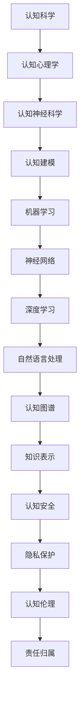

                 

### 《人类认知：AI 时代的进步》

> 关键词：人工智能、认知科学、认知心理学、认知神经科学、认知建模、深度学习、自然语言处理、认知图谱、知识表示、认知安全、隐私保护、伦理、责任

> 摘要：本文旨在探讨AI时代人类认知的进步。通过分析AI时代的认知科学基础、认知建模与算法、认知应用与挑战，以及认知安全与伦理等方面，深入探讨AI与人类认知的相互作用，揭示AI时代认知进步的潜力和挑战，为人工智能的发展提供理论支持和实践指导。

---

# 第一部分：AI时代的认知科学基础

## 1.1 AI时代的认知科学概述

### 1.1.1 认知科学的基本概念

认知科学（Cognitive Science）是研究人类思维、感知和行动的学科。它涉及心理学、神经科学、人工智能、语言学等多个领域，旨在理解人类认知的原理和机制。

认知科学的核心概念包括：

- 认知过程：指人类获取、处理、存储和使用信息的过程，包括感知、记忆、注意力、语言和决策等。
- 认知模型：指对人类认知过程的模拟和解释，如信息处理模型、神经网络模型和计算模型等。
- 认知系统：指支持认知过程的生理和心理系统，包括大脑、神经元和网络等。

### 1.1.2 AI在认知科学研究中的应用

人工智能（Artificial Intelligence，AI）在认知科学研究中的应用日益广泛。通过模拟人类认知过程，AI为认知科学提供了新的研究方法和工具。

AI在认知科学中的应用主要包括：

- 认知建模：使用机器学习和深度学习等技术模拟人类认知过程，构建认知模型，如神经网络模型、生成模型和强化学习模型等。
- 认知诊断：使用AI技术对认知障碍和心理健康问题进行诊断，如阿尔茨海默病、自闭症和焦虑症等。
- 认知增强：使用AI技术增强人类认知能力，如智能助手、增强现实和虚拟现实等。

### 1.1.3 AI时代的认知科学研究前沿

在AI时代，认知科学研究面临着许多前沿课题和挑战。

- 认知图谱与知识表示：研究如何构建大规模、结构化、可扩展的认知图谱，实现知识的自动化获取、表示和管理。
- 机器学习与认知神经科学：研究如何将机器学习算法应用于认知神经科学，揭示大脑的运作原理和认知机制。
- 认知安全与隐私保护：研究如何确保AI系统在认知科学应用中的安全性和隐私性，防止数据泄露和滥用。
- 认知伦理与责任：研究如何制定AI伦理规范和责任归属，确保AI在认知科学领域的健康发展。

## 1.2 认知心理学基础

### 1.2.1 认知心理学的定义与历史

认知心理学（Cognitive Psychology）是研究人类认知过程和心理活动的学科。它起源于20世纪50年代，以信息加工模型为基础，强调对人类认知过程进行定量分析和模型化。

认知心理学的发展历程可分为三个阶段：

- 第一阶段（1950s-1970s）：以信息加工模型为核心，研究注意力、记忆、知觉和语言等认知过程。
- 第二阶段（1970s-1990s）：研究认知过程中的认知偏差、思维策略和问题解决等高级认知功能。
- 第三阶段（1990s-至今）：将认知心理学与其他学科相结合，如神经科学、人工智能和认知神经科学等，探讨认知过程的多层次机制。

### 1.2.2 认知过程与模型

认知心理学关注的主要认知过程包括：

- 感知：指人类对环境信息的接收、处理和解释。
- 记忆：指人类对信息的存储和提取。
- 注意力：指人类在信息加工过程中对特定信息的选择和过滤。
- 语言：指人类通过符号系统进行信息传递和沟通。
- 决策：指人类在面临选择时进行信息加工、评估和选择的过程。

认知心理学提出了多种认知模型，如：

- 认知地图模型：描述人类如何在大脑中存储和检索信息。
- 产生式系统模型：描述人类如何通过规则和条件进行推理和决策。
- 注意力模型：描述人类在信息加工过程中如何分配注意力资源。

### 1.2.3 认知心理学的主要理论

认知心理学的主要理论包括：

- 认知发展理论：研究人类认知能力的发展过程，如皮亚杰的认知发展阶段理论。
- 认知神经科学理论：研究认知过程与大脑结构和功能之间的关系，如布洛卡区和韦尼克区的功能定位。
- 认知计算理论：研究认知过程的计算模型，如希尔伯特空间和马尔可夫决策过程。
- 认知行为理论：研究认知过程与行为之间的相互作用，如认知行为疗法。

## 1.3 认知神经科学

### 1.3.1 认知神经科学的定义与历史

认知神经科学（Cognitive Neuroscience）是研究认知过程与大脑结构和功能之间关系的学科。它结合了心理学、神经科学、计算机科学和认知科学等多个领域。

认知神经科学的发展历程可分为三个阶段：

- 第一阶段（19世纪末-20世纪50年代）：主要关注大脑结构与功能的关系，如定位理论。
- 第二阶段（20世纪50年代-80年代）：利用脑成像技术和生理心理学方法研究认知过程，如PET和fMRI。
- 第三阶段（20世纪80年代-至今）：将认知科学和神经科学的方法相结合，探讨认知过程的多层次机制，如神经网络模型和计算认知模型。

### 1.3.2 大脑结构与功能

大脑是认知神经科学的研究核心。大脑的主要结构包括：

- 大脑皮层：指大脑最外层的灰质层，负责高级认知功能，如语言、记忆和决策等。
- 丘脑：指大脑中心区域，负责信息的传递和整合。
- 小脑：指大脑底部区域，负责运动协调和平衡。
- 脑干：指大脑最底部区域，负责基本生命维持功能，如呼吸和心跳。

大脑的主要功能包括：

- 感知：指人类对环境信息的接收、处理和解释。
- 记忆：指人类对信息的存储和提取。
- 语言：指人类通过符号系统进行信息传递和沟通。
- 情感：指人类对情绪和情感的感受和表达。
- 自我意识：指人类对自己的认知和反思。

### 1.3.3 认知神经科学的研究方法

认知神经科学采用多种研究方法，如：

- 脑成像技术：如PET、fMRI、MEG和EEG等，用于研究大脑结构和功能。
- 行为实验：如心理实验、认知任务和反应时实验等，用于研究认知过程。
- 生理心理学方法：如电生理记录、脑刺激和药物干预等，用于研究认知过程的生理机制。
- 计算模型：如神经网络模型和计算认知模型等，用于研究认知过程的计算机制。

## 1.4 AI与人类认知的相互作用

### 1.4.1 AI如何模拟人类认知

AI通过模拟人类认知过程，实现了对人类认知的模拟和增强。具体方法包括：

- 认知建模：使用机器学习和深度学习等技术构建认知模型，模拟人类认知过程。
- 认知诊断：通过分析人类行为和脑成像数据，诊断认知障碍和心理健康问题。
- 认知增强：使用AI技术增强人类认知能力，如智能助手、增强现实和虚拟现实等。

### 1.4.2 人类认知如何影响AI

人类认知对AI的发展具有深远影响。具体表现为：

- 知识获取：人类通过感知、记忆和语言等认知过程获取知识，为AI提供训练数据和知识库。
- 算法设计：人类根据认知原理和认知心理学理论设计AI算法，提高AI的智能水平和应用效果。
- 伦理规范：人类通过伦理思考和道德判断，制定AI伦理规范和责任归属，确保AI的发展符合人类价值观。

### 1.4.3 AI与人类认知的协同进化

AI与人类认知的协同进化是未来发展的趋势。具体表现为：

- 认知融合：AI与人类认知的融合，实现人机协同，提高人类认知能力和效率。
- 认知拓展：AI扩展人类认知范围，突破人类认知极限，实现认知能力的提升。
- 认知优化：AI通过优化认知过程和认知算法，提高人类认知质量和效果。

## 1.5 AI时代的认知伦理

### 1.5.1 AI伦理的基本原则

AI伦理的基本原则包括：

- 公正性：确保AI系统在决策过程中公平、无偏见，避免歧视和偏见。
- 透明性：确保AI系统的决策过程可解释、可追溯，提高AI系统的可信度和透明度。
- 可控性：确保AI系统在运行过程中受到有效监管和控制，避免失控和滥用。
- 安全性：确保AI系统在运行过程中安全可靠，避免对人类和环境的危害。
- 责任性：明确AI系统的责任归属，确保AI系统在发生问题时承担相应的责任。

### 1.5.2 AI时代的隐私问题

AI时代的隐私问题主要包括：

- 数据隐私：确保个人数据在AI应用中的安全性和隐私性，防止数据泄露和滥用。
- 行为隐私：确保个人在AI应用中的行为隐私，避免监控和跟踪。
- 决策隐私：确保AI系统在决策过程中的隐私保护，避免隐私泄露和滥用。

### 1.5.3 AI时代的责任归属

AI时代的责任归属问题主要包括：

- 算法责任：明确算法设计者和使用者对算法责任的承担。
- 系统责任：明确AI系统开发者和运营者对系统责任的承担。
- 伦理责任：明确AI系统在伦理问题上的责任归属，确保AI系统的伦理合规性。

# 第二部分：AI时代的认知建模与算法

## 2.1 认知建模基础

### 2.1.1 认知建模的概念

认知建模（Cognitive Modeling）是指使用计算机技术模拟人类认知过程的方法和技术。通过认知建模，可以深入了解人类认知的原理和机制，提高人工智能系统的智能水平。

认知建模的主要目标包括：

- 理解人类认知过程：揭示人类认知的内在机制和规律，为认知科学提供理论支持。
- 改善人工智能系统：通过模拟人类认知过程，提高人工智能系统的智能水平，实现人机协同。
- 设计智能应用：基于认知建模，设计出更加智能、高效的应用系统，满足人类需求。

### 2.1.2 认知建模的主要方法

认知建模的主要方法包括：

- 信息加工模型：基于符号主义和计算主义理论，模拟人类认知过程中的信息加工过程。
- 神经网络模型：基于生物神经网络的原理，模拟人类认知过程中的神经元连接和活动。
- 生成模型：基于概率论和统计学理论，模拟人类认知过程中的生成和预测过程。
- 强化学习模型：基于奖励机制和策略优化理论，模拟人类认知过程中的决策和优化过程。

### 2.1.3 认知建模的评估与优化

认知建模的评估与优化主要包括以下几个方面：

- 模型评估：通过比较模型输出与实际认知过程的差异，评估认知建模的效果和准确性。
- 模型优化：通过调整模型参数和结构，提高认知建模的精度和效率。
- 模型验证：通过实验验证和数据分析，验证认知建模的可靠性和适用性。
- 模型更新：根据新的数据和认知原理，不断更新和改进认知建模方法。

## 2.2 机器学习与认知建模

### 2.2.1 机器学习的基本概念

机器学习（Machine Learning）是指通过数据训练，使计算机能够自动学习和改进的方法和技术。机器学习主要包括以下三种类型：

- 监督学习：在给定训练数据集的情况下，通过学习输入与输出之间的关系，预测新的输入数据。
- 无监督学习：在仅给定输入数据的情况下，通过学习数据分布和模式，自动发现数据结构和规律。
- 强化学习：通过与环境进行交互，根据奖励信号进行学习和决策，实现智能行为的优化。

### 2.2.2 监督学习、无监督学习和强化学习

监督学习（Supervised Learning）：监督学习是一种有监督的学习方法，通过已知的输入和输出数据，学习输入和输出之间的映射关系。常见的监督学习算法包括线性回归、决策树、支持向量机和神经网络等。

无监督学习（Unsupervised Learning）：无监督学习是一种无监督的学习方法，通过学习输入数据之间的内在结构和规律，自动发现数据分布和模式。常见的无监督学习算法包括聚类、降维和生成模型等。

强化学习（Reinforcement Learning）：强化学习是一种通过与环境进行交互，根据奖励信号进行学习和决策的方法。常见的强化学习算法包括Q学习、深度Q网络（DQN）和策略梯度等。

### 2.2.3 机器学习在认知建模中的应用

机器学习在认知建模中的应用主要包括以下几个方面：

- 认知建模：通过机器学习算法，模拟人类认知过程中的信息加工、记忆和决策等过程，构建认知模型。
- 认知诊断：通过机器学习算法，分析个体行为和脑成像数据，诊断认知障碍和心理健康问题。
- 认知增强：通过机器学习算法，设计出更加智能、高效的应用系统，增强人类认知能力。
- 认知计算：通过机器学习算法，实现认知过程的可计算化和自动化，提高认知效率和准确性。

## 2.3 神经网络与深度学习

### 2.3.1 神经网络的基本原理

神经网络（Neural Networks）是一种模拟生物神经系统的计算模型。它由大量神经元组成，通过神经元之间的连接和激活规则，实现信息的传递和处理。

神经网络的主要组成部分包括：

- 神经元：神经网络的基本单元，负责接收输入信号、进行加权求和和激活处理。
- 层：神经网络按照功能可以分为输入层、隐藏层和输出层，各层之间通过神经元连接实现信息传递。
- 权重：神经元之间的连接权重，用于调节输入信号的强度和重要性。
- 激活函数：对神经元输出进行非线性变换，引入非线性的特性。

### 2.3.2 深度学习的主要架构

深度学习（Deep Learning）是一种基于神经网络的深度结构模型，通过多层神经网络进行信息传递和处理，实现复杂函数的建模和学习。

深度学习的主要架构包括：

- 全连接神经网络（FCNN）：由多个全连接层组成，每个神经元都与前一层的所有神经元连接。
- 卷积神经网络（CNN）：由卷积层、池化层和全连接层组成，主要用于图像和视频处理。
- 循环神经网络（RNN）：由循环层组成，可以处理序列数据，如文本和语音。
- 注意力机制（Attention Mechanism）：通过学习注意力权重，关注关键信息，提高模型的表示能力和效果。

### 2.3.3 深度学习在认知建模中的应用

深度学习在认知建模中的应用主要包括以下几个方面：

- 认知建模：通过深度学习模型，模拟人类认知过程中的信息加工、记忆和决策等过程，构建认知模型。
- 认知诊断：通过深度学习模型，分析个体行为和脑成像数据，诊断认知障碍和心理健康问题。
- 认知增强：通过深度学习模型，设计出更加智能、高效的应用系统，增强人类认知能力。
- 认知计算：通过深度学习模型，实现认知过程的可计算化和自动化，提高认知效率和准确性。

## 2.4 自然语言处理与认知建模

### 2.4.1 自然语言处理的基本概念

自然语言处理（Natural Language Processing，NLP）是人工智能领域的一个重要分支，旨在使计算机能够理解、生成和处理自然语言。

NLP的基本概念包括：

- 语言模型：描述单词和句子概率分布的模型，用于生成和预测自然语言文本。
- 语义分析：对自然语言文本进行语义理解和解释，提取文本中的意义和关系。
- 信息抽取：从自然语言文本中提取关键信息，如实体、关系和事件等。
- 机器翻译：将一种自然语言文本自动翻译成另一种自然语言文本。

### 2.4.2 语言模型与序列标注模型

语言模型（Language Model）是一种用于生成和预测自然语言文本的模型，通常使用统计方法或神经网络模型实现。语言模型的核心任务是学习单词和句子的概率分布，用于生成文本和评估文本质量。

序列标注模型（Sequence Labeling Model）是一种用于对自然语言文本进行序列标注的模型，如命名实体识别、词性标注和句法分析等。序列标注模型通常采用循环神经网络（RNN）或卷积神经网络（CNN）实现，通过学习输入序列的表示，预测每个单词或词组的标签。

### 2.4.3 自然语言处理在认知建模中的应用

自然语言处理在认知建模中的应用主要包括以下几个方面：

- 认知建模：通过自然语言处理技术，模拟人类语言理解和生成过程，构建认知模型。
- 认知诊断：通过自然语言处理技术，分析个体语言行为和脑成像数据，诊断认知障碍和心理健康问题。
- 认知增强：通过自然语言处理技术，设计出更加智能、高效的语言应用系统，增强人类认知能力。
- 认知计算：通过自然语言处理技术，实现认知过程的可计算化和自动化，提高认知效率和准确性。

## 2.5 认知图谱与知识表示

### 2.5.1 认知图谱的基本概念

认知图谱（Cognitive Graph）是一种用于表示知识结构和语义关系的网络模型。它将知识表示为节点和边的图结构，通过节点和边的属性和关系，实现知识的语义理解和推理。

认知图谱的基本概念包括：

- 节点：表示知识实体，如人、地点、事物等。
- 边：表示节点之间的关系，如属于、具有、发生等。
- 属性：表示节点和边的属性，如名称、年龄、颜色等。
- 关系：表示节点之间的关系类型，如父子、朋友、邻居等。

### 2.5.2 知识表示的主要方法

知识表示（Knowledge Representation）是指将知识转换为计算机可处理的形式，以便进行存储、推理和应用。知识表示的主要方法包括：

- 符号表示：使用符号和逻辑表达式表示知识，如命题逻辑、谓词逻辑和产生式规则等。
- 图表示：使用图结构表示知识，如认知图谱、知识图谱和语义网络等。
- 矩阵表示：使用矩阵表示知识，如知识矩阵、语义矩阵和关系矩阵等。
- 神经网络表示：使用神经网络表示知识，如卷积神经网络（CNN）和循环神经网络（RNN）等。

### 2.5.3 认知图谱在认知建模中的应用

认知图谱在认知建模中的应用主要包括以下几个方面：

- 认知建模：通过认知图谱，模拟人类知识获取、存储和推理过程，构建认知模型。
- 认知诊断：通过认知图谱，分析个体知识结构和语义关系，诊断认知障碍和心理健康问题。
- 认知增强：通过认知图谱，设计出更加智能、高效的知识应用系统，增强人类认知能力。
- 认知计算：通过认知图谱，实现认知过程的可计算化和自动化，提高认知效率和准确性。

# 第三部分：AI时代的认知应用与挑战

## 3.1 AI在教育中的应用

### 3.1.1 AI教育的基本概念

AI教育（AI Education）是指利用人工智能技术进行教育的过程。它包括以下几个方面：

- 教育资源的智能化：通过AI技术，实现教育资源的个性化推荐、自动评估和智能推送。
- 教学过程的智能化：通过AI技术，实现教学过程的自动化、互动化和个性化。
- 学习效果的智能化：通过AI技术，实现学习效果的实时监测、反馈和优化。
- 教育管理的智能化：通过AI技术，实现教育管理的自动化、精细化和高效化。

### 3.1.2 AI在教育中的应用模式

AI在教育中的应用模式主要包括以下几个方面：

- 智能辅导系统：通过机器学习和深度学习技术，为学生提供个性化学习建议、智能答疑和智能评测。
- 智能教学助手：通过自然语言处理和知识图谱技术，为教师提供智能备课、课堂互动和教学评估支持。
- 智能教育平台：通过大数据和云计算技术，构建智能化的教育平台，实现教育资源的共享和优化。
- 智能学习社区：通过社交网络和在线教育平台，构建智能化的学习社区，促进师生互动和学习交流。

### 3.1.3 AI教育面临的挑战与机遇

AI教育面临的挑战主要包括：

- 数据隐私和安全：如何确保学生数据的隐私和安全，防止数据泄露和滥用。
- 教育公平和质量：如何确保AI技术在教育中的应用公平、高效和优质，避免教育资源的失衡。
- 教育伦理和责任：如何制定AI教育伦理规范和责任归属，确保AI技术在教育领域的健康发展。

AI教育带来的机遇主要包括：

- 个性化教育：通过AI技术，实现教育资源的个性化推荐和学习过程的个性化优化。
- 教育智能化：通过AI技术，提升教学过程的智能化水平和学习效果的智能化监测。
- 教育创新：通过AI技术，推动教育模式的创新和教育体系的变革。

## 3.2 AI在心理学中的应用

### 3.2.1 AI在心理评估中的应用

AI在心理评估中的应用主要包括以下几个方面：

- 心理健康监测：通过AI技术，实时监测个体的心理健康状况，如情绪、焦虑和抑郁等。
- 心理障碍诊断：通过AI技术，分析个体的行为和语言数据，诊断心理障碍和心理健康问题。
- 心理治疗效果评估：通过AI技术，评估心理治疗的效果，优化治疗方案。

### 3.2.2 AI在心理咨询中的应用

AI在心理咨询中的应用主要包括以下几个方面：

- 智能问答系统：通过自然语言处理和知识图谱技术，为用户提供智能化的心理咨询服务，如智能问答、情感分析和心理疏导等。
- 智能心理治疗：通过深度学习和强化学习技术，为用户提供个性化的心理治疗方案，如认知行为疗法和情绪调节等。
- 心理健康指导：通过大数据分析和推荐系统技术，为用户提供个性化的心理健康指导，如健康生活方式、心理调适和压力管理等。

### 3.2.3 AI在心理健康服务中的应用

AI在心理健康服务中的应用主要包括以下几个方面：

- 智能诊断与预测：通过AI技术，分析个体的行为、语言和生理数据，诊断心理障碍和心理健康问题，预测心理健康风险。
- 智能治疗与干预：通过AI技术，设计个性化的心理治疗方案和干预措施，如在线心理治疗、情绪调节和认知行为疗法等。
- 健康管理与服务：通过AI技术，为用户提供全方位的健康管理与服务，如健康监测、风险预警和预防措施等。

## 3.3 AI在医疗健康中的应用

### 3.3.1 AI在疾病诊断中的应用

AI在疾病诊断中的应用主要包括以下几个方面：

- 图像诊断：通过深度学习和计算机视觉技术，对医学图像进行分析和诊断，如肿瘤检测、心血管疾病诊断和神经系统疾病诊断等。
- 病历分析：通过自然语言处理和知识图谱技术，分析患者的病历信息，诊断疾病和预测病情。
- 分子诊断：通过深度学习和基因分析技术，分析患者的基因数据和生物标志物，诊断疾病和预测风险。

### 3.3.2 AI在药物治疗中的应用

AI在药物治疗中的应用主要包括以下几个方面：

- 药物筛选与设计：通过深度学习和分子模拟技术，预测药物分子与生物靶点的相互作用，筛选和设计新药。
- 药物剂量优化：通过机器学习和统计分析技术，分析患者的生理参数和药物代谢数据，优化药物剂量和给药方案。
- 药物不良反应预测：通过深度学习和大数据分析技术，预测药物不良反应和药物相互作用，降低药物风险。

### 3.3.3 AI在公共卫生管理中的应用

AI在公共卫生管理中的应用主要包括以下几个方面：

- 疫情监测与预测：通过大数据分析和机器学习技术，实时监测疫情动态，预测疫情发展趋势，为公共卫生决策提供支持。
- 健康风险评估：通过大数据分析和机器学习技术，评估个体的健康风险，制定个性化健康干预措施。
- 健康宣传与教育：通过自然语言处理和知识图谱技术，为公众提供个性化的健康知识和健康教育服务，提高公众的健康素养。

## 3.4 AI时代的认知安全与隐私保护

### 3.4.1 认知安全的定义与重要性

认知安全（Cognitive Security）是指确保人类认知过程不受恶意攻击和篡改的安全性和可靠性。认知安全的重要性体现在以下几个方面：

- 保护人类认知过程：确保人类认知过程的完整性、准确性和可靠性，防止恶意攻击和篡改。
- 维护社会稳定：防止恶意攻击和虚假信息传播，维护社会秩序和稳定。
- 提高AI系统的安全性：确保AI系统在处理人类认知数据时的安全性，防止数据泄露和滥用。

### 3.4.2 隐私保护的基本方法

隐私保护的基本方法主要包括以下几个方面：

- 数据加密：通过加密技术，对敏感数据进行加密存储和传输，防止数据泄露。
- 数据脱敏：通过数据脱敏技术，对敏感数据进行变形或替换，保护个人隐私。
- 访问控制：通过访问控制技术，限制对敏感数据的访问权限，防止未授权访问。
- 同步监控：通过实时监控技术，对数据传输和处理过程进行监控，及时发现和处理异常行为。

### 3.4.3 AI时代的认知安全挑战与应对策略

AI时代的认知安全挑战主要包括以下几个方面：

- 数据泄露：AI系统在处理人类认知数据时，面临数据泄露的风险。
- 恶意攻击：AI系统可能成为恶意攻击的目标，如虚假信息传播、网络攻击等。
- 虚假信息：AI系统可能生成虚假信息，误导人类认知过程。

应对策略包括：

- 强化数据加密：提高数据加密技术，确保数据在传输和存储过程中的安全性。
- 加强访问控制：实施严格的访问控制策略，确保只有授权用户可以访问敏感数据。
- 实时监控与预警：建立实时监控与预警机制，及时发现和处理异常行为。
- 提高安全意识：加强用户和开发者的安全意识培训，提高对安全风险的识别和应对能力。

## 3.5 AI时代的认知伦理与责任

### 3.5.1 AI伦理的基本原则

AI伦理的基本原则主要包括以下几个方面：

- 公平性：确保AI系统的决策过程公平、无偏见，避免歧视和偏见。
- 透明性：确保AI系统的决策过程可解释、可追溯，提高AI系统的可信度和透明度。
- 可控性：确保AI系统在运行过程中受到有效监管和控制，避免失控和滥用。
- 安全性：确保AI系统在运行过程中安全可靠，避免对人类和环境的危害。
- 责任性：明确AI系统的责任归属，确保AI系统在发生问题时承担相应的责任。

### 3.5.2 AI责任归属与法律框架

AI责任归属与法律框架主要包括以下几个方面：

- 责任主体：明确AI系统的责任主体，如开发者、运营者、用户等。
- 责任认定：制定AI责任认定的标准和程序，确保在发生问题时可以明确责任归属。
- 法律责任：制定相应的法律责任和惩罚措施，确保AI系统的正常运行和合法合规。
- 伦理规范：制定AI伦理规范，确保AI系统在发展过程中符合道德伦理标准。

### 3.5.3 AI时代的伦理困境与应对策略

AI时代的伦理困境主要包括以下几个方面：

- 隐私保护：如何在保护个人隐私的同时，充分利用AI技术的优势。
- 智能歧视：如何避免AI系统在决策过程中产生歧视和偏见。
- 伦理决策：如何确保AI系统在面临伦理困境时做出正确的决策。
- 责任归属：如何明确AI系统的责任归属，确保在发生问题时可以追究责任。

应对策略包括：

- 加强隐私保护：制定严格的隐私保护政策和法律，确保个人隐私不受侵犯。
- 消除智能歧视：加强AI系统的公平性和透明性，消除歧视和偏见。
- 培养伦理意识：加强用户和开发者的伦理教育，提高对伦理问题的认识和应对能力。
- 完善法律框架：制定完善的法律框架，明确AI系统的责任归属和法律责任。

# 附录

## 附录A：参考文献

1. Anderson, J. A. (2009). *Cognitive Neuroscience and Psychology*. Oxford University Press.
2. McClelland, J. L., & Rumelhart, D. E. (1988). *Parallel Distributed Processing: Explorations in the Microstructure of Cognition, Volume 1: Foundations*. MIT Press.
3. Minsky, M., & Papert, S. (1969). *Perceptrons: An Introduction to Computational Geometry*. MIT Press.
4. Mitchell, T. M. (1997). *Machine Learning*. McGraw-Hill.
5. Pinker, S. (1995). *The Language Instinct: How the Mind Creates Language*. William Morrow and Company.
6. Pollack, J. B. (1990). *Parallel Distributed Processing: Explorations in the Microstructure of Cognition, Volume 2: Vision*. MIT Press.
7. Russell, S., & Norvig, P. (2020). *Artificial Intelligence: A Modern Approach*. Prentice Hall.

## 附录B：认知建模与AI工具

1. TensorFlow：一种开源机器学习框架，广泛用于构建和训练神经网络。
2. PyTorch：一种开源机器学习库，提供灵活的动态计算图，用于构建深度学习模型。
3. Keras：一种基于TensorFlow和Theano的高层神经网络API，用于快速构建和训练深度学习模型。
4. Caffe：一种开源深度学习框架，专注于图像识别任务。
5. Theano：一种Python库，用于构建和优化深度学习模型，已逐渐被TensorFlow取代。

## 附录C：认知科学与AI的Mermaid流程图



## 附录D：主要算法的伪代码

### 伪代码：神经网络

```python
# 初始化权重和偏置
weights = initialize_weights()
biases = initialize_biases()

# 前向传播
output = neural_network_forward(input_data, weights, biases)

# 反向传播
neural_network_backward(output, expected_output)
```

### 伪代码：深度学习

```python
# 初始化模型
model = initialize_model()

# 训练模型
for epoch in range(num_epochs):
    for batch in data_loader:
        model.train(batch)

# 预测
prediction = model.predict(input_data)
```

## 附录E：数学模型与公式

### 感知机学习算法

$$ \text{激活函数} = \text{sign}(w \cdot x + b) $$

### 神经网络反向传播算法

$$ \delta_j = \text{激活函数}'(z_j) \cdot \delta_j^+ $$

$$ \delta_j^+ = \frac{\partial L}{\partial z_j} $$

## 附录F：项目实战

### 实战：使用TensorFlow构建一个简单的神经网络

```python
import tensorflow as tf

# 定义输入层
inputs = tf.keras.layers.Input(shape=(784,))

# 添加隐藏层
hidden = tf.keras.layers.Dense(units=128, activation='relu')(inputs)

# 添加输出层
outputs = tf.keras.layers.Dense(units=10, activation='softmax')(hidden)

# 构建模型
model = tf.keras.Model(inputs=inputs, outputs=outputs)

# 编译模型
model.compile(optimizer='adam', loss='categorical_crossentropy', metrics=['accuracy'])

# 训练模型
model.fit(x_train, y_train, epochs=5, batch_size=32, validation_data=(x_test, y_test))
```

## 附录G：开发环境搭建与代码解读

### 环境搭建

- Python 3.8+
- TensorFlow 2.4.0+

### 代码解读

- 输入层：使用 `tf.keras.layers.Input` 定义输入层。
- 隐藏层：使用 `tf.keras.layers.Dense` 定义隐藏层，并设置激活函数。
- 输出层：使用 `tf.keras.layers.Dense` 定义输出层，并设置激活函数。
- 模型编译：使用 `tf.keras.Model.compile` 编译模型，设置优化器和损失函数。
- 模型训练：使用 `tf.keras.Model.fit` 训练模型，设置训练周期、批量大小和验证数据。

---

# 作者

**作者：AI天才研究院/AI Genius Institute & 禅与计算机程序设计艺术 /Zen And The Art of Computer Programming**

