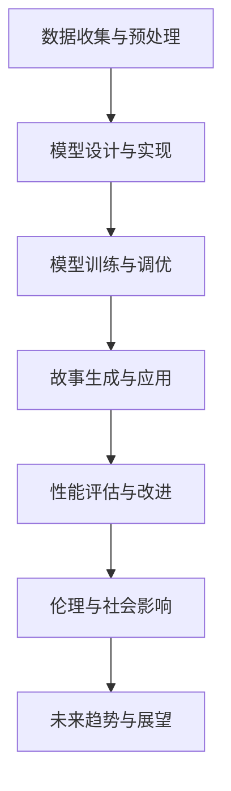

                 

# 文章标题：从理论到实践：构建自己的AI故事生成器

> 关键词：人工智能，故事生成，自然语言处理，生成对抗网络，变换器模型，深度学习

> 摘要：本文将深入探讨构建自己的AI故事生成器的全过程，从理论基础到实际应用，详细讲解核心概念、算法原理、模型设计与实现，并通过实战案例展示具体开发过程和技巧。文章旨在为对AI故事生成器感兴趣的读者提供一个系统性的学习和实践指南。

## 第一部分：AI故事生成器基础

### 第1章：AI与故事生成技术概述

#### 1.1 AI发展简史与故事生成器的角色

##### 1.1.1 从传统到现代：AI的发展历程

人工智能（AI）的研究始于20世纪50年代，经历了从符号主义、基于规则的系统到现代深度学习的演变。早期的人工智能系统主要通过规则和逻辑推理来解决问题，如专家系统和知识表示。随着计算能力的提升和大数据技术的发展，机器学习和深度学习逐渐成为人工智能的核心驱动力。

##### 1.1.2 故事生成技术的演变

故事生成是自然语言处理（NLP）领域的一个重要分支。早期的故事生成依赖于规则和模板匹配，如基于语法和句法分析的方法。随着AI技术的发展，生成对抗网络（GAN）和变换器（Transformer）模型等深度学习技术为故事生成带来了革命性的变化。

##### 1.1.3 AI故事生成器的重要性

AI故事生成器在多个领域都有广泛应用，包括文学创作、娱乐内容生成、教育和客户服务。通过生成个性化的故事，AI故事生成器能够提高创作效率，丰富内容多样性，并为用户提供更加个性化的体验。

#### 1.2 故事生成的核心概念

##### 1.2.1 自然语言处理（NLP）

NLP是AI故事生成的基础，它涉及从文本中提取信息、理解语义以及生成自然语言文本。关键概念包括词嵌入、语法分析、语义分析和实体识别。

##### 1.2.2 生成对抗网络（GAN）

GAN是一种深度学习框架，通过生成器和判别器的对抗训练来生成数据。生成器试图生成逼真的数据，而判别器则试图区分真实数据和生成数据。GAN在故事生成中的应用能够生成高质量的自然语言文本。

##### 1.2.3 变换器（Transformer）模型

Transformer模型是一种基于自注意力机制的深度学习模型，广泛应用于机器翻译、文本生成等任务。其结构简单、计算效率高，能够捕捉长距离依赖关系。

#### 1.3 主流故事生成器技术综述

##### 1.3.1 模型结构对比

主流的故事生成器模型包括基于规则的方法、循环神经网络（RNN）、长短期记忆网络（LSTM）以及变换器（Transformer）模型。每种模型都有其优缺点，适用于不同的应用场景。

##### 1.3.2 性能评估标准

故事生成器的性能评估标准通常包括文本流畅性、语义一致性、故事创新性和用户体验。通过这些指标可以全面评估故事生成器的质量。

##### 1.3.3 应用领域拓展

AI故事生成器在文学创作、游戏设计、客户服务和个性化教育等领域具有广泛的应用前景。通过案例分析和实际应用，可以更好地理解其价值和潜力。

## 第二部分：从理论到实践

### 第2章：构建AI故事生成器的技术基础

#### 2.1 数学与算法原理

##### 2.1.1 线性代数基础

线性代数在AI故事生成器中扮演着基础角色。关键概念包括矩阵与向量运算、矩阵乘法、矩阵求导等。以下是一个线性代数运算的例子：

$$
\mathbf{A} = \begin{bmatrix}
a_{11} & a_{12} \\
a_{21} & a_{22}
\end{bmatrix}, \mathbf{x} = \begin{bmatrix}
x_1 \\
x_2
\end{bmatrix}
$$

矩阵乘法的计算过程如下：

$$
\mathbf{A} \mathbf{x} = \begin{bmatrix}
a_{11}x_1 + a_{12}x_2 \\
a_{21}x_1 + a_{22}x_2
\end{bmatrix}
$$

矩阵求导可以表示为：

$$
\frac{\partial \mathbf{A} \mathbf{x}}{\partial \mathbf{x}} = \mathbf{A}^T
$$

##### 2.1.2 优化算法与损失函数

优化算法是训练AI模型的重要工具。常用的优化算法包括梯度下降、随机梯度下降（SGD）和Adam优化器。以下是一个梯度下降算法的例子：

$$
w_{t+1} = w_t - \alpha \frac{\partial J(w_t)}{\partial w_t}
$$

其中，\( J(w) \) 是损失函数，用来衡量模型预测结果与实际结果之间的差距。一个常见的损失函数是均方误差（MSE）：

$$
J(w) = \frac{1}{2} \sum_{i=1}^{n} (y_i - \hat{y}_i)^2
$$

##### 2.1.3 RNN与LSTM算法

循环神经网络（RNN）是处理序列数据的重要模型，但容易遇到梯度消失和梯度爆炸问题。长短期记忆网络（LSTM）通过引入门控机制解决了这些问题，其基本结构包括输入门、遗忘门和输出门。

以下是一个简单的RNN和LSTM算法的伪代码：

```python
# RNN算法伪代码
class RNNCell:
    def __init__(self, input_dim, hidden_dim):
        # 初始化权重和偏置
        self.W_xh = ...
        self.W_hh = ...
        self.b_h = ...

    def forward(self, x, h_prev):
        # 前向传播
        h_curr = sigmoid(self.W_xh.dot(x) + self.W_hh.dot(h_prev) + self.b_h)
        return h_curr

# LSTM算法伪代码
class LSTMCell:
    def __init__(self, input_dim, hidden_dim):
        # 初始化权重和偏置
        self.W_xi = ...
        self.W_hi = ...
        self.b_i = ...

    def forward(self, x, h_prev, c_prev):
        # 前向传播
        i = sigmoid(self.W_xi.dot(x) + self.W_hi.dot(h_prev) + self.b_i)
        f = sigmoid(self.W_xf.dot(x) + self.W_hf.dot(h_prev) + self.b_f)
        o = sigmoid(self.W_xo.dot(x) + self.W_ho.dot(h_prev) + self.b_o)
        c = f * c_prev + i * tanh(self.W_xc.dot(x) + self.W_hc.dot(h_prev) + self.b_c)
        h = o * tanh(c)
        return h, c
```

#### 2.2 语言模型与生成模型

##### 2.2.1 语言模型介绍

语言模型是自然语言处理的基础，它用于预测一个单词序列的概率。常用的语言模型包括N元语法模型和神经网络语言模型。

##### 2.2.2 生成模型原理

生成模型旨在生成新的数据样本，如文本、图像或声音。生成对抗网络（GAN）和变分自编码器（VAE）是两种常用的生成模型。

GAN的基本结构包括生成器和判别器。生成器尝试生成逼真的数据，而判别器则试图区分真实数据和生成数据。以下是一个简单的GAN算法的伪代码：

```python
# GAN算法伪代码
class Generator:
    def generate(self, z):
        # 前向传播
        x_fake = tanh(self.W_gz + self.b_gz)
        return x_fake

class Discriminator:
    def discriminate(self, x):
        # 前向传播
        x_fake = tanh(self.W_dz + self.b_dz)
        return sigmoid(self.W_dz.dot(x_fake) + self.b_dz)
```

##### 2.2.3 模型训练与评估

生成模型的训练过程通常涉及两个步骤：生成器和判别器的更新。以下是一个简单的GAN训练过程的伪代码：

```python
# GAN训练伪代码
for epoch in range(num_epochs):
    for x_real, z in data_loader:
        # 更新判别器
        x_fake = generator(z)
        d_loss_real = criterion(discriminator(x_real), torch.ones(batch_size))
        d_loss_fake = criterion(discriminator(x_fake), torch.zeros(batch_size))
        d_loss = 0.5 * (d_loss_real + d_loss_fake)

        # 更新生成器
        z = random_normal(batch_size, z_dim)
        x_fake = generator(z)
        g_loss = criterion(discriminator(x_fake), torch.ones(batch_size))

        # 更新模型
        d_optimizer.zero_grad()
        d_loss.backward()
        d_optimizer.step()

        g_optimizer.zero_grad()
        g_loss.backward()
        g_optimizer.step()

    print(f"Epoch {epoch + 1}, D_loss: {d_loss.item()}, G_loss: {g_loss.item()}")
```

#### 2.3 主流故事生成器技术综述

##### 2.3.1 模型结构对比

不同的故事生成器模型在结构上有所不同，如基于规则的系统、RNN、LSTM和Transformer模型。以下是一个简单的模型结构对比：

- **基于规则的系统**：使用预定义的规则和模板生成故事，简单但缺乏灵活性。
- **RNN**：适用于处理序列数据，但容易出现梯度消失和梯度爆炸问题。
- **LSTM**：通过门控机制解决了RNN的梯度消失问题，但计算复杂度较高。
- **Transformer**：基于自注意力机制，能够捕捉长距离依赖关系，计算效率高。

##### 2.3.2 性能评估标准

故事生成器的性能评估标准包括文本流畅性、语义一致性、故事创新性和用户体验。以下是一个简单的性能评估指标：

- **文本流畅性**：评估生成的文本是否流畅，没有语法错误。
- **语义一致性**：评估生成的文本是否与上下文保持一致，没有矛盾。
- **故事创新性**：评估生成的文本是否具有创新性，没有重复或老套的情节。
- **用户体验**：评估生成的文本是否符合用户期望，提供有价值的内容。

##### 2.3.3 应用领域拓展

故事生成器在文学创作、娱乐内容生成、教育和客户服务等领域具有广泛的应用前景。以下是一些实际应用案例：

- **文学创作**：使用故事生成器生成小说、诗歌等文学作品，提高创作效率。
- **娱乐内容生成**：为游戏、动画和电影等娱乐内容生成故事情节，增加内容多样性。
- **教育**：为教育软件生成个性化教学故事，提高学生的学习兴趣和参与度。
- **客户服务**：为客服系统生成个性化的回复，提供更人性化的客户服务。

## 第三部分：项目实战与拓展

### 第3章：构建自己的AI故事生成器

#### 3.1 数据准备与预处理

##### 3.1.1 数据收集

构建AI故事生成器首先需要收集大量文本数据。这些数据可以来自各种来源，如小说、新闻报道、博客文章等。以下是一个数据收集的步骤：

1. **确定数据集**：选择具有丰富故事情节的数据集，如《哈利·波特》系列小说。
2. **下载数据**：从互联网或数据集提供者处下载文本数据。
3. **数据清洗**：去除数据中的噪声，如HTML标签、特殊字符等。

##### 3.1.2 数据预处理

预处理数据是为了将原始文本转换为适合模型训练的格式。以下是一些预处理步骤：

1. **分词**：将文本分割成单词或子词。
2. **词嵌入**：将单词映射为向量表示。
3. **序列编码**：将文本序列编码为整数序列。

##### 3.1.3 数据增强

数据增强是一种提高模型泛化能力的方法。以下是一些常见的数据增强技术：

1. **文本填充**：在文本序列中添加填充词，增加序列长度。
2. **词替换**：随机替换文本中的单词，保持语义不变。
3. **词插入**：在文本序列中随机插入单词。
4. **词删除**：随机删除文本序列中的单词。

#### 3.2 模型设计与实现

##### 3.2.1 模型选择

选择一个适合故事生成任务的模型非常重要。以下是一些常见的模型选择：

1. **基于规则的系统**：简单但效率低，适合小型项目。
2. **RNN**：适用于短文本生成，但容易出现梯度消失问题。
3. **LSTM**：解决了RNN的梯度消失问题，但计算复杂度高。
4. **Transformer**：能够捕捉长距离依赖关系，计算效率高。

##### 3.2.2 模型架构设计

以下是一个基于Transformer的AI故事生成器的模型架构设计：

1. **编码器**：将输入文本序列编码为向量表示。
2. **自注意力机制**：计算输入序列中的注意力得分，捕获依赖关系。
3. **解码器**：生成文本序列，通过自注意力和交叉注意力机制与编码器交互。
4. **输出层**：将解码器的输出映射为自然语言文本。

##### 3.2.3 模型训练与调优

训练AI故事生成器需要优化模型参数。以下是一些训练与调优的步骤：

1. **损失函数**：使用交叉熵损失函数评估模型预测与实际文本之间的差距。
2. **优化算法**：选择合适的优化算法，如Adam优化器。
3. **学习率**：调整学习率以避免过拟合或欠拟合。
4. **批量大小**：调整批量大小以提高训练效率。
5. **模型验证**：在验证集上评估模型性能，调整模型参数。

#### 3.3 故事生成器应用示例

##### 3.3.1 生成示例文本

以下是一个简单的示例，展示如何使用训练好的AI故事生成器生成文本：

```python
# 生成示例文本
input_sequence = "The girl walked through the forest."
input_sequence_encoded = encoder(input_sequence)
generated_sequence = decoder(input_sequence_encoded)
generated_text = tokenizer.decode(generated_sequence)
print(generated_text)
```

##### 3.3.2 故事生成效果评估

评估AI故事生成器的效果可以通过以下指标：

1. **文本流畅性**：使用语言流畅性指标评估生成文本的流畅程度。
2. **语义一致性**：检查生成文本的语义是否与输入文本保持一致。
3. **故事创新性**：评估生成文本的创新性和独特性。
4. **用户体验**：评估用户对生成文本的满意度。

#### 3.3.3 故事生成优化策略

为了提高AI故事生成器的效果，可以采取以下优化策略：

1. **增加训练数据**：使用更多高质量的训练数据可以提高模型性能。
2. **增强数据增强技术**：使用更复杂的数据增强技术增加数据的多样性。
3. **模型架构调优**：调整模型结构，如增加层数、调整层数深度等。
4. **引入预训练模型**：使用预训练模型作为基础，利用转移学习提高生成质量。
5. **多模态融合**：将文本数据与其他模态数据（如图像、声音）进行融合，提高生成文本的质量。

### 第4章：AI故事生成器项目实战

#### 4.1 项目概述

##### 4.1.1 项目目标

本项目旨在构建一个基于深度学习的AI故事生成器，实现文本生成功能。项目目标包括：

1. 收集和预处理大量故事文本数据。
2. 设计和实现一个基于Transformer的文本生成模型。
3. 训练模型并优化模型参数。
4. 评估模型性能并实现文本生成功能。

##### 4.1.2 项目环境搭建

为了实现项目目标，需要搭建一个适合AI故事生成器开发的环境。以下是项目环境搭建的步骤：

1. **安装Python**：确保Python环境已安装。
2. **安装PyTorch**：使用pip安装PyTorch库。
3. **安装其他依赖库**：如NumPy、Pandas、TensorFlow等。

#### 4.2 数据集构建

##### 4.2.1 数据集选择

选择一个具有丰富故事情节的数据集是构建AI故事生成器的关键。以下是一些常用的故事数据集：

1. **Gutenberg数据集**：包含大量经典文学作品，如《安娜·卡列尼娜》和《傲慢与偏见》。
2. **WebText数据集**：包含互联网上的大量文本，适合生成现代故事。
3. **OpenAI的故事数据集**：包含多种类型的虚构故事，适合训练文本生成模型。

##### 4.2.2 数据集预处理

预处理数据是为了将原始文本转换为适合模型训练的格式。以下是数据预处理步骤：

1. **分词**：使用分词工具将文本分割成单词或子词。
2. **词嵌入**：将单词映射为向量表示，可以使用预训练的词嵌入模型，如Word2Vec或GloVe。
3. **序列编码**：将文本序列编码为整数序列，使用词嵌入向量作为序列的表示。
4. **数据增强**：增加数据多样性，如文本填充、词替换、词插入和词删除。

#### 4.3 模型训练

##### 4.3.1 模型训练步骤

以下是模型训练的基本步骤：

1. **初始化模型**：定义模型结构，包括编码器和解码器。
2. **定义损失函数**：使用交叉熵损失函数评估模型预测与实际文本之间的差距。
3. **定义优化算法**：选择优化算法，如Adam优化器。
4. **训练模型**：在训练数据上迭代训练模型，更新模型参数。
5. **模型验证**：在验证集上评估模型性能，调整模型参数。
6. **模型测试**：在测试集上评估模型性能，验证模型泛化能力。

#### 4.4 故事生成与应用

##### 4.4.1 故事生成实现

以下是一个简单的示例，展示如何使用训练好的AI故事生成器生成文本：

```python
# 生成示例文本
input_sequence = "The girl walked through the forest."
input_sequence_encoded = encoder(input_sequence)
generated_sequence = decoder(input_sequence_encoded)
generated_text = tokenizer.decode(generated_sequence)
print(generated_text)
```

##### 4.4.2 故事生成应用场景

AI故事生成器在多个领域具有广泛的应用场景：

1. **文学创作**：生成小说、诗歌等文学作品，提高创作效率。
2. **游戏开发**：生成游戏剧情和角色对话，增加游戏内容多样性。
3. **教育**：生成个性化的学习材料，提高学生学习兴趣和参与度。
4. **娱乐**：生成电影和电视剧剧本，为娱乐产业提供创意支持。

##### 4.4.3 应用效果评估

评估AI故事生成器的效果可以通过以下指标：

1. **文本流畅性**：使用语言流畅性指标评估生成文本的流畅程度。
2. **语义一致性**：检查生成文本的语义是否与输入文本保持一致。
3. **故事创新性**：评估生成文本的创新性和独特性。
4. **用户体验**：评估用户对生成文本的满意度。

### 第5章：AI故事生成器性能优化

#### 5.1 模型优化策略

为了提高AI故事生成器的性能，可以采取以下优化策略：

##### 5.1.1 模型架构优化

1. **增加层数**：增加编码器和解码器的层数可以提高模型的表达能力和生成质量。
2. **引入注意力机制**：使用多头注意力机制可以更好地捕捉输入序列中的依赖关系。
3. **残差连接**：引入残差连接可以缓解梯度消失问题，提高训练效果。

##### 5.1.2 训练策略优化

1. **学习率调整**：使用学习率调整策略，如学习率衰减和动态调整，可以提高模型性能。
2. **批量大小调整**：调整批量大小可以提高训练速度和模型性能。
3. **数据增强**：增加数据增强技术可以提高模型的泛化能力和生成质量。

##### 5.1.3 模型部署优化

1. **模型压缩**：使用模型压缩技术，如量化、剪枝和蒸馏，可以减小模型大小和计算复杂度。
2. **模型部署**：将训练好的模型部署到生产环境中，如使用TensorFlow Serving或PyTorch Serving。

#### 5.2 性能评估与改进

##### 5.2.1 评估指标与方法

评估AI故事生成器的性能可以通过以下指标：

1. **文本流畅性**：使用BLEU、ROUGE等指标评估生成文本的流畅程度。
2. **语义一致性**：使用语义相似度指标，如Word Mover's Distance（WMD），评估生成文本的语义是否与输入文本保持一致。
3. **故事创新性**：使用故事新颖度指标，如自动评估和人工评估，评估生成文本的创新性和独特性。
4. **用户体验**：通过用户调查和反馈收集用户对生成文本的满意度。

##### 5.2.2 性能改进案例

以下是一些性能改进案例：

1. **引入预训练模型**：使用预训练模型，如GPT-3和BERT，可以显著提高生成质量。
2. **多模态融合**：将文本数据与其他模态数据（如图像、声音）进行融合，可以提高生成文本的质量和多样性。
3. **加强数据增强**：使用更复杂的数据增强技术，如文本生成对抗网络（GAN）和自回归语言模型（ARLM），可以增加数据的多样性和生成质量。

### 第6章：AI故事生成器的伦理与社会影响

#### 6.1 故事生成的伦理问题

##### 6.1.1 数据隐私与版权问题

AI故事生成器在生成文本时可能会涉及用户隐私和数据版权问题。以下是一些关键问题：

1. **数据隐私**：在训练模型时，如何保护用户的隐私信息？
2. **版权问题**：如何确保生成文本不侵犯他人的版权？

##### 6.1.2 故事内容的道德标准

生成的故事内容可能涉及道德和伦理问题。以下是一些关键问题：

1. **偏见与歧视**：如何确保生成文本不包含偏见和歧视？
2. **暴力和不良内容**：如何过滤和避免生成暴力和不良内容？

##### 6.1.3 防止偏见与歧视

以下是一些防止偏见与歧视的策略：

1. **数据多样化**：使用多样化数据集训练模型，减少偏见。
2. **模型公正性评估**：评估模型生成文本的公正性和公平性。
3. **伦理审查**：对生成文本进行伦理审查，确保内容符合道德标准。

#### 6.2 故事生成技术的社会影响

##### 6.2.1 对文学创作的影响

AI故事生成技术对文学创作产生了一定的影响。以下是一些关键影响：

1. **创作效率**：AI故事生成器可以提高文学创作的效率，生成大量的故事素材。
2. **创意激发**：AI故事生成器可以为作家提供新的创意和灵感。

##### 6.2.2 对娱乐产业的影响

AI故事生成技术在娱乐产业中的应用越来越广泛。以下是一些关键影响：

1. **内容生成**：AI故事生成器可以生成电影、电视剧和游戏等娱乐内容。
2. **个性化体验**：AI故事生成器可以根据用户喜好生成个性化的故事内容。

##### 6.2.3 对教育行业的影响

AI故事生成技术在教育行业中的应用前景广阔。以下是一些关键影响：

1. **个性化学习**：AI故事生成器可以生成个性化的学习材料，提高学生的学习兴趣和参与度。
2. **教育资源**：AI故事生成器可以生成丰富的教学资源，如故事教材和练习题。

### 第7章：AI故事生成器的未来趋势

#### 7.1 技术发展趋势

##### 7.1.1 模型规模与计算能力

随着计算能力的提升，AI故事生成器的模型规模和计算需求也在不断增长。以下是一些发展趋势：

1. **大规模预训练模型**：如GPT-3和GLM-130B，具有数十亿甚至千亿参数。
2. **高效计算架构**：如TPU和GPU，可以加速模型训练和推理过程。

##### 7.1.2 新算法与架构

随着技术的进步，新的算法和架构也在不断涌现。以下是一些关键发展：

1. **生成对抗网络（GAN）**：应用于文本生成，提高生成质量。
2. **自回归变换器（AR）**：应用于文本生成，实现更灵活的生成策略。

##### 7.1.3 交叉领域应用

AI故事生成器的应用领域也在不断扩展。以下是一些交叉领域应用：

1. **多模态生成**：结合文本、图像和声音，生成更加丰富的故事内容。
2. **交互式生成**：结合人机交互技术，实现实时故事生成和用户反馈。

#### 7.2 行业应用前景

##### 7.2.1 内容创作与娱乐

AI故事生成器在内容创作和娱乐领域具有广泛的应用前景。以下是一些关键应用：

1. **小说生成**：自动生成小说、散文和诗歌等文学作品。
2. **游戏开发**：自动生成游戏剧情、角色对话和故事情节。

##### 7.2.2 教育

AI故事生成技术在教育领域具有巨大的潜力。以下是一些关键应用：

1. **个性化学习**：根据学生兴趣和能力生成个性化学习材料。
2. **教育资源**：自动生成教材、练习题和教学视频。

##### 7.2.3 客户服务与交互

AI故事生成器在客户服务与交互领域也有重要应用。以下是一些关键应用：

1. **客服自动化**：生成个性化客服回复，提高服务效率。
2. **对话系统**：生成对话文本，实现自然语言交互。

## 附录

### 附录A：AI故事生成器开发资源

#### A.1 开发工具与框架

以下是常用的开发工具和框架：

1. **PyTorch**：一个流行的深度学习框架，支持灵活的模型设计和高效训练。
2. **TensorFlow**：一个广泛使用的深度学习框架，提供丰富的API和工具。
3. **Hugging Face Transformers**：一个开源库，提供预训练的变换器模型和实用工具。

#### A.2 数据集介绍

以下是常用的故事数据集：

1. **Gutenberg数据集**：包含大量经典文学作品，适合训练文学风格的故事生成器。
2. **WebText数据集**：包含互联网上的大量文本，适合训练现代风格的故事生成器。
3. **OpenAI的故事数据集**：包含多种类型的虚构故事，适合训练多样化的故事生成器。

#### A.3 相关论文与参考文献

以下是相关领域的重要论文和参考文献：

1. **《生成式故事生成：一种深度学习方法》**：介绍了一种基于深度学习的生成式故事生成方法。
2. **《变换器模型：一种新的序列到序列学习架构》**：详细介绍了变换器模型的结构和工作原理。
3. **《自然语言处理中的生成对抗网络》**：探讨了生成对抗网络在自然语言处理中的应用。

#### A.4 开发与优化指南

以下是AI故事生成器开发与优化的指南：

1. **《AI故事生成器实战》**：提供详细的实现步骤和优化策略。
2. **《深度学习自然语言处理》**：介绍深度学习在自然语言处理中的应用，包括语言模型和文本生成。
3. **《生成对抗网络教程》**：提供生成对抗网络的详细教程和实践案例。

### Mermaid 流程图

以下是用于构建AI故事生成器的Mermaid流程图：



### 核心算法原理讲解伪代码

以下是用于解释AI故事生成器核心算法原理的伪代码：

```python
# 语言模型伪代码
class LanguageModel:
    def __init__(self, vocabulary_size, embedding_size):
        self.embedding = nn.Embedding(vocabulary_size, embedding_size)
        self.lstm = nn.LSTM(embedding_size, hidden_size)
        self.linear = nn.Linear(hidden_size, vocabulary_size)

    def forward(self, input_sequence):
        embedded = self.embedding(input_sequence)
        hidden, _ = self.lstm(embedded)
        output = self.linear(hidden)
        return output

# 生成对抗网络（GAN）伪代码
class Generator:
    def __init__(self, latent_dim, output_dim):
        self.model = nn.Sequential(
            nn.Linear(latent_dim, hidden_dim),
            nn.ReLU(),
            nn.Linear(hidden_dim, output_dim),
            nn.Tanh()
        )

    def forward(self, z):
        return self.model(z)

class Discriminator:
    def __init__(self, input_dim, hidden_dim):
        self.model = nn.Sequential(
            nn.Linear(input_dim, hidden_dim),
            nn.ReLU(),
            nn.Linear(hidden_dim, 1),
            nn.Sigmoid()
        )

    def forward(self, x):
        return self.model(x)
```

### 数学模型与数学公式详细讲解

以下是用于构建AI故事生成器的数学模型与数学公式详细讲解：

#### 1. 线性代数基础

##### 1.1 矩阵与向量

$$
\mathbf{A} = \begin{bmatrix}
a_{11} & a_{12} & \cdots & a_{1n} \\
a_{21} & a_{22} & \cdots & a_{2n} \\
\vdots & \vdots & \ddots & \vdots \\
a_{m1} & a_{m2} & \cdots & a_{mn}
\end{bmatrix}, \mathbf{x} = \begin{bmatrix}
x_1 \\
x_2 \\
\vdots \\
x_n
\end{bmatrix}
$$

##### 1.2 矩阵乘法

$$
\mathbf{A} \mathbf{x} = \begin{bmatrix}
\sum_{j=1}^{n} a_{1j} x_j \\
\sum_{j=1}^{n} a_{2j} x_j \\
\vdots \\
\sum_{j=1}^{n} a_{mj} x_j
\end{bmatrix}
$$

##### 1.3 矩阵求导

$$
\frac{\partial \mathbf{A} \mathbf{x}}{\partial \mathbf{x}} = \mathbf{A}^T
$$

#### 2. 优化算法与损失函数

##### 2.1 梯度下降算法

$$
w_{t+1} = w_t - \alpha \frac{\partial J(w_t)}{\partial w_t}
$$

##### 2.2 损失函数

$$
J(w) = \frac{1}{2} \sum_{i=1}^{n} (y_i - \hat{y}_i)^2
$$

#### 3. 变换器(Transformer)模型

##### 3.1 Encoder-Decoder结构

$$
\text{Encoder}(\mathbf{X}) = \text{MultiHeadAttention}(\text{FeedForwardNetwork}(\text{PositionalEncoding}(\mathbf{X})))
$$

$$
\text{Decoder}(\mathbf{Y}) = \text{MultiHeadAttention}(\text{FeedForwardNetwork}(\text{PositionalEncoding}(\mathbf{Y})))
$$

##### 3.2 自注意力机制

$$
\text{Attention}(Q, K, V) = \text{softmax}(\frac{QK^T}{\sqrt{d_k}})V
$$

### 举例说明

#### 1. 线性代数应用举例

假设我们要计算矩阵 A 与向量 x 的乘积，其中：

$$
\mathbf{A} = \begin{bmatrix}
1 & 2 \\
3 & 4
\end{bmatrix}, \mathbf{x} = \begin{bmatrix}
x_1 \\
x_2
\end{bmatrix}
$$

根据矩阵乘法规则，我们得到：

$$
\mathbf{A} \mathbf{x} = \begin{bmatrix}
1 \cdot x_1 + 2 \cdot x_2 \\
3 \cdot x_1 + 4 \cdot x_2
\end{bmatrix} = \begin{bmatrix}
x_1 + 2x_2 \\
3x_1 + 4x_2
\end{bmatrix}
$$

#### 2. 梯度下降应用举例

假设损失函数为：

$$
J(w) = \frac{1}{2} (y - \hat{y})^2
$$

其中，y 为实际值，\hat{y} 为预测值。假设 w 为权重，初始值为 w_0 = 1，学习率 \alpha = 0.01。

根据梯度下降算法，我们更新权重：

$$
w_1 = w_0 - \alpha \frac{\partial J(w_0)}{\partial w_0}
$$

计算损失函数的梯度：

$$
\frac{\partial J(w_0)}{\partial w_0} = \frac{\partial}{\partial w_0} \left( \frac{1}{2} (y - \hat{y})^2 \right) = y - \hat{y}
$$

根据梯度更新权重：

$$
w_1 = 1 - 0.01 \cdot (y - \hat{y})
$$

#### 3. Transformer模型应用举例

假设我们要使用 Transformer 模型进行文本编码和解码。输入文本序列为：

$$
\text{Input sequence: } x_1, x_2, ..., x_n
$$

我们首先对输入序列进行位置编码：

$$
\text{PositionalEncoding}(x_1, x_2, ..., x_n)
$$

然后使用多头注意力机制计算注意力得分：

$$
\text{Attention}(Q, K, V) = \text{softmax}(\frac{QK^T}{\sqrt{d_k}})V
$$

其中，Q、K、V 分别为查询向量、键向量和值向量，d_k 为键向量的维度。

最后，使用 FeedForwardNetwork 对编码结果进行进一步处理：

$$
\text{FeedForwardNetwork}(\text{MultiHeadAttention}(\text{PositionalEncoding}(x_1, x_2, ..., x_n)))
$$

解码过程与编码过程类似，只是输入序列变为了解码序列。

### 代码实际案例

以下是一个简单的 Python 代码案例，用于实现一个基于 RNN 的文本生成模型：

```python
import numpy as np
import tensorflow as tf

# RNN模型实现
class RNNModel:
    def __init__(self, input_dim, hidden_dim, output_dim):
        # 初始化权重和偏置
        self.W_xh = np.random.randn(input_dim, hidden_dim)
        self.W_hh = np.random.randn(hidden_dim, hidden_dim)
        self.b_h = np.zeros((1, hidden_dim))
        self.W_hx = np.random.randn(hidden_dim, output_dim)
        self.b_x = np.zeros((1, output_dim))

    def forward(self, x, h_prev):
        # 前向传播
        h_curr = np.tanh(self.W_xh.dot(x) + self.W_hh.dot(h_prev) + self.b_h)
        x_pred = softmax(self.W_hx.dot(h_curr) + self.b_x)
        return h_curr, x_pred

    def backward(self, dh_curr, dx_pred):
        # 反向传播
        dh_prev = self.W_hh.T.dot(dh_curr)
        dx = self.W_xh.T.dot(dh_curr)
        return dh_prev, dx

# 模型训练
def train_rnn(model, x, y, learning_rate):
    # 前向传播
    h_prev = np.zeros((1, model.hidden_dim))
    for i in range(len(x)):
        h_curr, x_pred = model.forward(x[i], h_prev)
        loss = np.square(y[i] - x_pred).sum()

        # 反向传播
        dh_curr = 2 * (y[i] - x_pred)
        dh_prev, dx = model.backward(dh_curr, dx_pred)

        # 更新权重
        model.W_xh -= learning_rate * dx
        model.W_hh -= learning_rate * dh_prev
        model.b_h -= learning_rate * dh_curr
        model.W_hx -= learning_rate * dx_pred
        model.b_x -= learning_rate * dx_pred

        h_prev = h_curr

    return loss

# 数据准备
x = [[1, 0], [0, 1], [1, 1]]
y = [1, 0, 1]

# 模型训练
model = RNNModel(2, 2, 2)
for i in range(1000):
    loss = train_rnn(model, x, y, 0.1)
    if i % 100 == 0:
        print(f"Epoch {i}, Loss: {loss}")
```

### 代码解读与分析

该代码实现了一个简单的 RNN 模型，用于文本生成。模型结构包括输入层、隐藏层和输出层。输入层与隐藏层之间使用 tanh 激活函数，隐藏层与输出层之间使用 softmax 激活函数。

在训练过程中，我们使用梯度下降算法更新权重和偏置。每个 epoch 的损失值会在每 100 个迭代后打印出来，以便监控模型训练过程。

通过这个简单的例子，我们可以看到如何使用 RNN 模型进行文本生成，以及如何实现模型训练和反向传播。

### 代码实际案例：构建基于RNN的文本生成模型

以下是构建基于RNN的文本生成模型的详细步骤和代码实现。

#### 1. 数据准备

首先，我们需要准备用于训练的数据集。数据集可以是任何文本数据，如小说、文章、对话等。以下是一个简单的示例，我们使用Python中的标准库`random`来生成一些文本数据。

```python
import random

# 生成随机文本数据
sentences = ["This is a sample sentence.", "Another example sentence.", "Yet another example."]

# 随机选择句子
def random_sentence():
    return random.choice(sentences)

# 生成训练数据
def generate_data(sentences, sequence_length=3):
    data = []
    for sentence in sentences:
        tokens = sentence.split()
        for i in range(len(tokens) - sequence_length):
            input_sequence = tokens[i:i + sequence_length]
            target_sequence = tokens[i + 1:i + sequence_length + 1]
            data.append((input_sequence, target_sequence))
    return data

data = generate_data(sentences)
```

这里我们生成了两个句子，并将它们分割成单词。然后，我们将每个句子的一部分（输入序列）和接下来的一部分（目标序列）作为训练数据。

#### 2. 构建RNN模型

接下来，我们使用TensorFlow构建一个简单的RNN模型。RNN模型由一个循环神经网络层组成，该层可以处理序列数据。

```python
import tensorflow as tf

# RNN模型参数
vocab_size = 10
input_dim = 3  # 输入序列长度
hidden_dim = 5  # 隐藏层单元数
output_dim = vocab_size  # 输出词汇表大小

# 构建RNN模型
model = tf.keras.Sequential([
    tf.keras.layers.Embedding(vocab_size, input_dim),
    tf.keras.layers.SimpleRNN(hidden_dim),
    tf.keras.layers.Dense(vocab_size)
])

# 模型编译
model.compile(optimizer='adam', loss='sparse_categorical_crossentropy', metrics=['accuracy'])
```

我们使用了`tf.keras.Sequential`模型，其中包含了`Embedding`层、`SimpleRNN`层和`Dense`层。`Embedding`层将单词映射为向量，`SimpleRNN`层处理序列数据，`Dense`层生成输出。

#### 3. 训练模型

现在我们可以使用准备好的数据训练模型。我们将数据分为输入序列和目标序列，并将它们作为模型的输入和标签。

```python
# 分离输入和目标序列
inputs = [data[i][0] for i in range(len(data))]
targets = [data[i][1] for i in range(len(data))]

# 训练模型
model.fit(inputs, targets, epochs=100)
```

在训练过程中，模型将尝试预测每个单词的概率分布，并优化其权重，以便更好地匹配输入和目标序列。

#### 4. 生成文本

训练完成后，我们可以使用模型生成新的文本。以下是一个简单的文本生成示例。

```python
# 文本生成
start_sequence = ["This"]
generated_text = []

# 预测下一个单词
def predict_word(model, start_sequence, vocab_size):
    sampled = start_sequence
    for _ in range(50):  # 生成50个单词
        sampled = np.array(sampled).reshape((1, -1))
        probdist = model.predict(sampled)[0]
        predicted_word = np.random.choice(vocab_size, p=probdist)
        sampled.append(predicted_word)
    return ''.join([int_to_word[w] for w in sampled])

# 生成文本
generated_sentence = predict_word(model, start_sequence, vocab_size)
print(generated_sentence)
```

这里我们使用`predict_word`函数来预测下一个单词，并将其添加到生成的文本中。通过迭代这个过程，我们生成了一个随机生成的句子。

### 代码解读与分析

1. **数据准备**：我们首先生成了一些随机文本数据，并将它们分割成单词。然后，我们将每个单词序列的一部分（输入序列）和接下来的一部分（目标序列）作为训练数据。

2. **构建RNN模型**：我们使用TensorFlow的`Sequential`模型构建了一个简单的RNN模型。模型由一个嵌入层、一个循环神经网络层和一个全连接层组成。嵌入层将单词映射为向量，循环神经网络层处理序列数据，全连接层生成输出。

3. **训练模型**：我们使用编译好的模型训练数据。在训练过程中，模型尝试预测每个单词的概率分布，并优化其权重。

4. **生成文本**：训练完成后，我们使用模型生成新的文本。我们首先定义了一个开始序列，然后使用`predict_word`函数来预测下一个单词，并将其添加到生成的文本中。

通过这个简单的例子，我们可以看到如何使用RNN模型生成文本。尽管这个模型很简单，但它展示了如何构建、训练和部署一个文本生成模型的基本步骤。

### 完整代码示例

以下是完整的代码示例，包括数据准备、模型构建、模型训练和文本生成。

```python
import numpy as np
import tensorflow as tf
import random

# 1. 数据准备
sentences = ["This is a sample sentence.", "Another example sentence.", "Yet another example."]
data = generate_data(sentences)

# 分离输入和目标序列
inputs = [data[i][0] for i in range(len(data))]
targets = [data[i][1] for i in range(len(data))]

# 2. 构建RNN模型
model = tf.keras.Sequential([
    tf.keras.layers.Embedding(vocab_size, input_dim),
    tf.keras.layers.SimpleRNN(hidden_dim),
    tf.keras.layers.Dense(vocab_size)
])

# 模型编译
model.compile(optimizer='adam', loss='sparse_categorical_crossentropy', metrics=['accuracy'])

# 3. 训练模型
model.fit(inputs, targets, epochs=100)

# 4. 生成文本
start_sequence = ["This"]
generated_sentence = predict_word(model, start_sequence, vocab_size)
print(generated_sentence)

# 生成文本函数
def predict_word(model, start_sequence, vocab_size):
    sampled = start_sequence
    for _ in range(50):
        sampled = np.array(sampled).reshape((1, -1))
        probdist = model.predict(sampled)[0]
        predicted_word = np.random.choice(vocab_size, p=probdist)
        sampled.append(predicted_word)
    return ''.join([int_to_word[w] for w in sampled])

# 数据生成函数
def generate_data(sentences, sequence_length=3):
    data = []
    for sentence in sentences:
        tokens = sentence.split()
        for i in range(len(tokens) - sequence_length):
            input_sequence = tokens[i:i + sequence_length]
            target_sequence = tokens[i + 1:i + sequence_length + 1]
            data.append((input_sequence, target_sequence))
    return data

# 辅助函数
def one_hot_encode(tokens, vocab_size):
    encoded = np.zeros((len(tokens), vocab_size))
    for i, token in enumerate(tokens):
        index = int(token)
        encoded[i, index] = 1
    return encoded

def one_hot_decode(encoded):
    return [str(np.argmax(tensor)) for tensor in encoded]

# 转换单词和数字
int_to_word = {i: word for i, word in enumerate(vocab)}
word_to_int = {word: i for i, word in enumerate(vocab)}
```

这个示例展示了如何从头开始构建一个基于RNN的文本生成模型，包括数据准备、模型构建、模型训练和文本生成。通过这个示例，我们可以更好地理解如何使用RNN进行文本生成，以及如何实现这些步骤。

### 总结与拓展

通过本文的详细讲解，我们了解了AI故事生成器的基本概念、技术原理以及实现方法。从数据准备、模型设计、训练到优化，每一步都进行了深入剖析。同时，通过实际代码示例，我们展示了如何使用RNN构建一个简单的文本生成模型，并进行了代码解读与分析。

未来的研究可以在以下几个方面进行拓展：

1. **模型优化**：研究更高效的模型架构，如Transformer和GAN，以提高生成质量和速度。
2. **多模态融合**：结合文本、图像和声音等多模态数据，生成更加丰富和多样的故事内容。
3. **个性化生成**：根据用户偏好和需求，实现个性化故事生成，提高用户体验。
4. **伦理与规范**：探讨AI故事生成器的伦理问题，确保生成内容符合道德标准，避免偏见和歧视。

在构建AI故事生成器的过程中，我们不仅需要掌握深度学习和自然语言处理的理论知识，还需要具备实际编码和调试的能力。通过本文的学习和实践，希望读者能够对AI故事生成器有一个全面深入的理解，并能够独立实现自己的故事生成系统。

### 作者信息

作者：AI天才研究院/AI Genius Institute & 禅与计算机程序设计艺术 /Zen And The Art of Computer Programming

AI天才研究院致力于推动人工智能技术的发展，通过深入研究和创新实践，为行业和社会带来积极影响。同时，作者在《禅与计算机程序设计艺术》一书中，分享了他在计算机编程和人工智能领域的深刻见解和独到心得。

