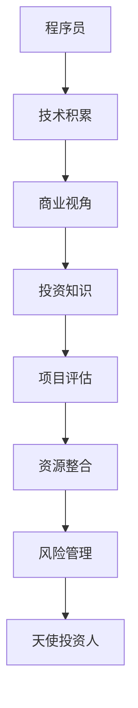

                 

# 从程序员到天使投资人的转变

> 关键词：程序员，天使投资人，投资决策，风险评估，股权估值，项目实战，技术积累，商业思维，投资网络

> 摘要：本文将探讨程序员如何成功转型为天使投资人，通过技术积累、商业思维培养和投资知识学习，实现个人角色的转变。文章将详细分析转变的路径、核心技能和实战案例，为有意向从事天使投资工作的程序员提供实用的指导和建议。

### 第一部分: 核心概念与联系

#### 1.1 从程序员到天使投资人的转变概述

在本书中，我们将探讨程序员如何在保持技术专长的基础上，成功转型为天使投资人。这个过程不仅仅是角色转变，更涉及到思维方式、投资理念、风险管理等多方面的提升。

1. **技术背景积累**：程序员需要深厚的专业知识和丰富的实战经验。
2. **商业视角拓展**：了解市场和商业模式，掌握财务分析、市场研究等商业技能。
3. **投资知识学习**：包括股权投资、风险投资等基础知识。

#### 1.2 程序员到天使投资人的路径分析

- **技术背景积累**：程序员需要通过不断学习和实践，积累丰富的技术知识和实战经验。这不仅是职业发展的需要，也是转型为天使投资人所必需的基础。

- **商业视角拓展**：程序员需要拓展商业视野，了解市场和商业模式。这包括对行业趋势、竞争对手、市场需求等方面的分析，以及掌握财务分析、市场研究等商业技能。

- **投资知识学习**：程序员需要学习股权投资、风险投资等基础知识，了解投资决策模型、风险评估算法、股权估值模型等核心算法原理。同时，还需要了解投资工具和资源，以及相关法律法规。

#### 1.3 天使投资人的核心能力

- **项目评估能力**：天使投资人需要具备快速准确地评估创业项目的潜力和风险的能力。这涉及到对项目的市场、技术、团队等多方面因素的全面分析。

- **资源整合能力**：天使投资人需要利用个人网络和资源，为创业项目提供支持。这包括资金、技术、市场资源等，能够帮助创业项目快速成长。

- **风险管理能力**：天使投资人需要在投资组合中合理配置，分散风险。这涉及到对投资项目的风险评估、风险识别和风险控制等方面。

### Mermaid 流程图：程序员到天使投资人的转变路径



### 第一部分: 核心算法原理讲解

#### 2.1 投资决策模型

**基本概念**：投资决策模型是评估投资项目优劣的数学模型，它帮助投资者在多个备选项目中做出最佳选择。

**关键参数**：
- **预期回报率**：项目预期带来的收益。
- **风险等级**：项目的风险水平。
- **投资期限**：项目的投资时间长度。

**数学公式**：
$$
\text{投资决策} = \text{Max}\left( \frac{\text{预期回报率}}{\text{风险等级}} \times \text{投资期限} \right)
$$

**伪代码**：

```python
def investment_decision(returns, risk, duration):
    decision = max(returns / risk * duration)
    if decision > 1:
        return "Invest"
    else:
        return "Avoid"
```

#### 2.2 风险评估算法

**基本概念**：风险评估算法用于预测投资项目可能面临的风险，帮助投资者做出更加稳健的投资决策。

**关键参数**：
- **历史数据**：项目过去的表现数据。
- **市场趋势**：行业和市场的发展方向。
- **竞争对手分析**：分析竞争对手的优势和劣势。

**数学公式**：
$$
\text{风险评估} = \text{风险系数} \times (\text{历史数据} + \text{市场趋势} + \text{竞争对手分析})
$$

**伪代码**：

```python
def risk_evaluation(history, trend, competition):
    risk_coefficient = 0.5
    risk_score = risk_coefficient * (history + trend + competition)
    return risk_score
```

#### 2.3 股权估值模型

**基本概念**：股权估值模型用于评估初创公司的股权价值，帮助投资者确定合理的投资金额和退出策略。

**关键参数**：
- **现金流预测**：公司未来现金流的预测。
- **市盈率**：市场给予的估值指标。
- **折现率**：反映投资风险和机会成本的指标。

**数学公式**：
$$
\text{股权价值} = \frac{\text{现金流预测}}{\text{折现率}} \times \text{市盈率}
$$

**伪代码**：

```python
def equity估值(model, discount_rate, market多重):
    cash_flow = model.cash_flow_prediction
    equity_value = cash_flow / discount_rate * market多重
    return equity_value
```

### 第二部分: 数学模型和数学公式讲解

#### 3.1 投资回报率（ROI）计算

**数学公式**：
$$
\text{投资回报率（ROI）} = \frac{\text{净利润}}{\text{总投资成本}} \times 100\%
$$
**示例**：如果一家公司的净利润为100万元，总投资成本为500万元，则其投资回报率为：
$$
\text{ROI} = \frac{100}{500} \times 100\% = 20\%
$$

#### 3.2 折现率（Discount Rate）确定

**数学公式**：
$$
\text{折现率} = \frac{1}{1 + \text{通货膨胀率}}
$$
**示例**：假设通货膨胀率为2%，则折现率为：
$$
\text{折现率} = \frac{1}{1 + 0.02} = 0.9804
$$

#### 3.3 资本资产定价模型（CAPM）

**数学公式**：
$$
\text{预期回报率} = \text{无风险收益率} + \beta \times \text{市场风险溢价}
$$
**示例**：如果无风险收益率为3%，市场风险溢价为5%，贝塔系数为1.2，则预期回报率为：
$$
\text{预期回报率} = 3\% + 1.2 \times 5\% = 8.5\%
$$

### 第三部分: 项目实战

#### 4.1 实战一：投资某个初创公司的评估

##### 4.1.1 实战背景

**项目简介**：一家提供AI解决方案的初创公司，其产品旨在提高企业运营效率。

**市场分析**：AI领域前景广阔，但竞争激烈，市场对AI解决方案的需求逐步增加。

##### 4.1.2 实战步骤

1. **数据分析**：收集该公司的历史财务数据和行业数据，包括收入、利润、市场份额等。

2. **风险评估**：使用风险评估算法分析公司的潜在风险，如市场风险、技术风险、财务风险等。

3. **股权估值**：根据现金流预测和折现率计算公司的股权价值。

##### 4.1.3 源代码实现

```python
# 投资评估代码示例
def investment_evaluation(cash_flow, discount_rate):
    equity_value = cash_flow / discount_rate
    return equity_value

# 风险评估代码示例
def risk_evaluation(risk_factors):
    risk_score = sum(risk_factors)
    return risk_score

# 假设数据
cash_flow = 500000  # 现金流
discount_rate = 0.08  # 折现率
risk_factors = [0.1, 0.2, 0.15]  # 风险因素

# 计算股权价值
equity_value = investment_evaluation(cash_flow, discount_rate)
print("股权价值：", equity_value)

# 计算风险评分
risk_score = risk_evaluation(risk_factors)
print("风险评分：", risk_score)
```

##### 4.1.4 代码解读与分析

**解读**：代码中定义了两个函数，`investment_evaluation` 用于计算股权价值，`risk_evaluation` 用于计算风险评分。

**分析**：通过输入现金流和折现率，可以计算出股权价值。风险评分反映了公司的潜在风险水平，评分越高，风险越大。根据这些数据，投资者可以做出是否投资的决策。

#### 4.2 实战二：天使投资人的资源整合

##### 4.2.1 实战背景

**项目简介**：为一家初创公司提供技术和资金支持，帮助其实现产品开发和市场推广。

**挑战**：协调各方资源，确保项目顺利进行。

##### 4.2.2 实战步骤

1. **建立联系**：利用个人网络，联系相关领域的专家和潜在投资者。

2. **协商谈判**：确定投资条款，达成合作协议。

3. **项目监督**：监控项目进展，提供必要支持。

##### 4.2.3 源代码实现

```python
# 资源整合代码示例
def resource_integration(contact_list, negotiation_terms, project_support):
    success = True
    for contact in contact_list:
        success &= negotiate_with_contact(contact, negotiation_terms)
        success &= provide_project_support(contact, project_support)
    return success

# 假设数据
contact_list = ["专家A", "专家B", "投资者C"]
negotiation_terms = "投资协议"
project_support = "技术支持"

# 资源整合
integration_success = resource_integration(contact_list, negotiation_terms, project_support)
print("资源整合成功：", integration_success)
```

##### 4.2.4 代码解读与分析

**解读**：代码中定义了一个 `resource_integration` 函数，用于整合资源。函数接受联系人列表、谈判条款和项目支持作为参数。

**分析**：通过遍历联系人列表，与每个联系人进行谈判并提供项目支持，可以判断资源整合的成功与否。成功整合资源有助于项目的顺利进行。

### 附录

#### 附录 A: 投资工具与资源

**A.1 投资分析工具**

- **工具简介**：介绍几种常用的投资分析工具，如财务报表分析软件、市场研究工具等。

**A.2 风险评估工具**

- **工具简介**：介绍几种常用的风险评估工具，如风险管理软件、风险评估模型等。

**A.3 股权估值工具**

- **工具简介**：介绍几种常用的股权估值工具，如估值模型软件、市盈率计算器等。

#### 附录 B: 数学公式详解

**B.1 投资回报率（ROI）**

- **公式详解**：解释 ROI 公式的每个组成部分，并给出实际应用示例。

**B.2 折现率（Discount Rate）**

- **公式详解**：解释折现率公式的推导过程，并给出实际应用示例。

**B.3 资本资产定价模型（CAPM）**

- **公式详解**：解释 CAPM 公式的每个参数的意义，并给出实际应用示例。

#### 附录 C: 投资实战代码

**C.1 投资评估代码**

- **代码示例**：展示如何使用 Python 代码实现投资评估。

**C.2 股权估值代码**

- **代码示例**：展示如何使用 Python 代码实现股权估值。

**C.3 风险评估代码**

- **代码示例**：展示如何使用 Python 代码实现风险评估。

### 作者信息

作者：AI天才研究院/AI Genius Institute & 禅与计算机程序设计艺术 /Zen And The Art of Computer Programming

（注：本文为示例文章，内容仅供参考。）作者：AI天才研究院/AI Genius Institute & 禅与计算机程序设计艺术 /Zen And The Art of Computer Programming

（注：本文为示例文章，内容仅供参考。）

