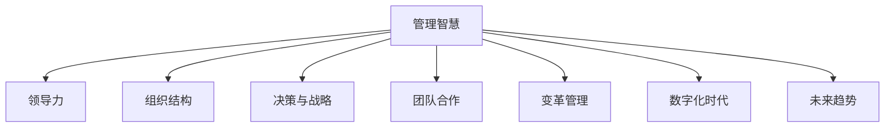

                 

# 《从经典书籍中汲取管理智慧》

> 关键词：管理智慧、经典书籍、领导力、组织结构、数字化转型、未来趋势

摘要：本文旨在从经典书籍中汲取管理智慧，探讨管理理论的历史发展、核心原则以及未来趋势。通过分析泰勒、法约尔、韦伯、麦克格雷格和德鲁克等经典管理理论家的著作，本文揭示了管理智慧的核心要素及其在现代企业中的应用。同时，本文还探讨了数字化时代的管理变革以及管理智慧的未来趋势。通过这篇技术博客，读者将深入了解管理智慧的重要性和实践方法。

## 第一部分：管理智慧的历史与演变

### 第1章：管理智慧的历史与发展

**1.1 管理智慧的起源与发展**

管理智慧的历史可以追溯到古代文明。在古希腊和古罗马时期，人们就开始探索如何通过组织和管理资源来实现共同的目标。然而，现代管理智慧的发展始于工业革命时期。随着生产力的提高和企业规模的扩大，人们开始意识到管理的重要性，并开始研究如何更有效地管理和组织资源。

19世纪末20世纪初，泰勒（Frederick Taylor）的科学管理理论问世，标志着管理智慧的正式诞生。泰勒提出了科学管理的基本原则，即通过科学的方法来优化工作流程和提高劳动生产率。泰勒的理论对现代管理产生了深远的影响，被视为管理智慧的基石。

**1.2 经典管理理论的发展历程**

在泰勒之后，许多管理理论家相继提出了自己的理论，对管理智慧进行了丰富和发展。以下是一些重要的经典管理理论：

- **法约尔的管理理论**：亨利·法约尔（Henri Fayol）是管理理论的另一位奠基人。他提出了管理职能的五要素，即计划、组织、指挥、协调和控制。法约尔的理论强调了管理者在组织中的核心作用，对现代管理实践产生了重要影响。

- **韦伯的官僚组织理论**：马克斯·韦伯（Max Weber）提出了官僚组织理论，强调组织结构的合理性、规范性和权威性。韦伯的理论为现代组织设计提供了重要的理论依据。

- **麦克格雷格的X理论和Y理论**：道格拉斯·麦克格雷格（Douglas McGregor）提出了X理论和Y理论，探讨了管理者对员工行为的假设和影响。X理论认为员工懒惰，需要严格监督，而Y理论则认为员工具有内在动力，能够自我管理。

- **彼得·德鲁克的现代管理思想**：彼得·德鲁克（Peter Drucker）是现代管理思想的集大成者。他提出了目标管理、知识管理、创新管理等理论，为现代管理实践提供了重要的指导。

### 第2章：经典管理理论解析

**2.1 泰勒的科学管理理论**

泰勒的科学管理理论主要关注如何通过科学的方法来提高劳动生产率。泰勒提出了以下基本原则：

- **科学方法**：通过科学的方法来研究工作流程，找出最优的工作方式，并将其标准化。

- **分工与专业化**：将工作分解为小的、专业的任务，让员工专注于自己最擅长的工作。

- **激励制度**：通过激励制度来激发员工的积极性，提高生产效率。

**2.2 法约尔的管理理论**

法约尔的管理理论强调管理者的核心作用，提出了管理职能的五要素：

- **计划**：制定目标和工作计划，确保组织朝着既定目标前进。

- **组织**：设计组织结构，明确各部门的职责和权限。

- **指挥**：通过有效的指挥，确保各项任务的顺利进行。

- **协调**：协调各部门的工作，确保组织内部的一致性。

- **控制**：对组织的工作进行监督和评估，确保目标的实现。

**2.3 韦伯的官僚组织理论**

韦伯的官僚组织理论强调组织结构的合理性和规范性。官僚组织具有以下特点：

- **等级制度**：组织内部具有明确的等级制度，各级管理者的职责和权限清晰。

- **规范化**：组织内部具有明确的规章制度，确保组织的运行有序。

- **权威性**：组织中的权威来源于职位，而不是个人。

**2.4 麦克格雷格的X理论和Y理论**

麦克格雷格提出了X理论和Y理论，探讨了管理者对员工行为的假设和影响。X理论认为员工懒惰，需要严格监督，而Y理论则认为员工具有内在动力，能够自我管理。Y理论对现代管理实践产生了重要影响，许多管理者开始注重员工的自主性和创造性。

**2.5 彼得·德鲁克的现代管理思想**

彼得·德鲁克是现代管理思想的集大成者。他提出了目标管理、知识管理、创新管理等理论，为现代管理实践提供了重要的指导。德鲁克认为，管理是一种实践，管理者需要通过实践来不断提高自己的能力。

### 第3章：管理智慧的应用与实践

**3.1 经典案例研究**

经典管理理论在实际应用中得到了广泛的验证。以下是一些经典案例：

- **福特汽车公司的生产流水线**：福特汽车公司采用了泰勒的科学管理理论，通过优化工作流程和分工，大幅提高了生产效率。

- **通用电气公司的组织变革**：通用电气公司在20世纪80年代进行了大规模的组织变革，采用了韦伯的官僚组织理论，建立了明确的管理层级和规章制度，提高了组织的运行效率。

- **谷歌公司的目标管理**：谷歌公司采用了德鲁克的目标管理理论，通过设定明确的目标和指标，激发了员工的积极性和创造力，实现了公司的快速发展。

**3.2 管理智慧在现代企业的应用**

随着现代企业的发展，管理智慧得到了更广泛的应用。以下是一些现代企业应用管理智慧的成功案例：

- **数字化管理**：许多企业开始采用数字化工具来管理业务流程和员工，提高了管理效率和决策质量。

- **创新管理**：许多企业注重创新管理，通过设立创新团队和激励机制，推动了企业的持续创新。

- **可持续发展**：许多企业开始注重可持续发展，通过环保和节能措施，实现了经济效益和社会效益的双赢。

## 第二部分：管理智慧的核心原则

### 第4章：领导力与团队合作

**4.1 领导力的核心要素**

领导力是管理智慧的重要组成部分。领导力的核心要素包括：

- **愿景**：领导者需要有明确的愿景，能够为组织指引方向。

- **信任**：领导者需要赢得员工的信任，建立良好的组织氛围。

- **沟通**：领导者需要具备良好的沟通能力，能够与员工建立有效的沟通渠道。

- **激励**：领导者需要能够激励员工，激发他们的内在动力。

**4.2 团队合作的原理与实践**

团队合作是实现组织目标的关键。团队合作的基本原理包括：

- **共同目标**：团队成员需要有共同的目标，为实现目标共同努力。

- **分工合作**：团队成员需要有明确的分工，各司其职。

- **信任与支持**：团队成员需要相互信任和支持，共同面对挑战。

- **沟通与协作**：团队成员需要保持有效的沟通和协作，确保工作顺利进行。

**4.3 高效团队的构建与维护**

构建和维护高效团队是企业成功的关键。以下是一些高效团队的构建与维护原则：

- **选拔与培训**：选拔具有潜力和能力的人才，进行专业培训。

- **明确目标与职责**：明确团队的目标和职责，确保团队成员明确自己的工作方向。

- **激励与认可**：通过激励和认可，激发团队成员的积极性和创造力。

- **沟通与反馈**：保持有效的沟通和反馈机制，确保团队成员及时了解工作进展和问题。

### 第5章：组织结构与变革

**5.1 组织结构的设计原则**

组织结构是管理智慧的重要组成部分。设计组织结构时需要遵循以下原则：

- **适应性**：组织结构需要适应企业的战略和业务需求。

- **灵活性**：组织结构需要具有灵活性，能够适应市场变化和业务调整。

- **协同性**：组织结构需要实现各部门的协同效应，提高整体效率。

- **透明性**：组织结构需要透明，确保员工了解自己的职责和权限。

**5.2 组织变革的理论与实践**

组织变革是企业管理的重要手段。以下是一些组织变革的理论和实践方法：

- **领导力驱动**：领导者需要积极推动组织变革，为变革创造良好的氛围。

- **变革管理**：采用变革管理方法，确保变革的顺利进行。

- **文化塑造**：通过文化塑造，增强员工对变革的认同感和参与度。

- **培训与发展**：通过培训和发展，提高员工的能力和素质，适应组织变革的需求。

**5.3 变革管理的策略与挑战**

在组织变革过程中，管理者需要面对以下策略和挑战：

- **策略**：
  - **沟通策略**：加强与员工的沟通，确保他们了解变革的背景和目的。
  - **参与策略**：鼓励员工参与变革过程，提高他们的参与度和认同感。
  - **反馈策略**：及时收集员工的反馈，调整变革方案，确保变革的有效性。

- **挑战**：
  - **抗拒变革**：员工可能对变革持有抗拒态度，管理者需要积极应对。
  - **变革阻力**：变革过程中可能遇到各种阻力，管理者需要采取有效措施克服。
  - **变革管理能力**：管理者需要具备较强的变革管理能力，确保变革的顺利进行。

### 第6章：决策与战略规划

**6.1 决策过程的理论与方法**

决策是管理活动中的核心环节。决策过程的理论和方法包括：

- **理性决策模型**：基于最大化效益的原则，通过分析各种决策方案的结果，选择最优方案。

- **有限理性决策模型**：考虑决策者的认知局限，选择在当前情况下相对合理的方案。

- **模糊决策模型**：在不确定和模糊情况下，通过模糊集合和模糊逻辑进行决策。

- **多目标决策模型**：考虑多个目标的冲突和权衡，选择在多个目标之间达到平衡的方案。

**6.2 战略规划的理论与实践**

战略规划是企业管理的重要手段。战略规划的理论和方法包括：

- **SWOT分析**：通过分析企业的优势、劣势、机会和威胁，确定企业的战略方向。

- **PEST分析**：通过分析企业所处的政治、经济、社会和技术环境，评估外部环境对企业的影响。

- **五力模型**：通过分析企业所在行业的基本竞争力量，确定企业的竞争策略。

- **创新战略**：通过创新和研发，提高企业的核心竞争力，实现持续发展。

**6.3 创新与竞争力**

创新是提高企业竞争力的关键。以下是一些创新与竞争力的关系：

- **创新与市场竞争力**：创新能够为企业带来竞争优势，提高市场竞争力。

- **创新与企业价值**：创新能够提高企业的盈利能力和市场价值。

- **创新与社会责任**：创新企业需要承担社会责任，为社会做出贡献。

## 第三部分：管理智慧的创新与未来

### 第7章：数字化时代的管理变革

**7.1 数字化对管理的影响**

数字化时代给企业管理带来了深刻的影响。以下是一些主要影响：

- **信息管理**：数字化技术使得企业能够更好地管理和利用信息，提高决策质量和效率。

- **业务流程优化**：数字化技术可以帮助企业优化业务流程，提高工作效率和灵活性。

- **组织结构变革**：数字化时代要求企业进行组织结构变革，以适应快速变化的市场环境。

**7.2 大数据与决策支持系统**

大数据和决策支持系统是数字化时代的重要工具。以下是一些应用：

- **数据采集与存储**：通过传感器、互联网等技术，收集和存储大量的数据。

- **数据分析与挖掘**：运用数据挖掘技术，从大量数据中提取有价值的信息。

- **决策支持**：通过数据分析，为管理者提供决策支持和建议。

**7.3 数字化转型的实践案例**

以下是一些数字化转型的实践案例：

- **阿里巴巴**：阿里巴巴通过数字化技术，实现了从线下到线上的转型，建立了强大的电子商务平台。

- **京东**：京东通过数字化技术，优化了物流和供应链管理，提高了运营效率。

- **华为**：华为通过数字化转型，提升了研发效率和市场竞争力，成为全球领先的通信技术企业。

### 第8章：管理智慧的未来趋势

**8.1 智能化与自动化**

智能化和自动化是管理智慧的未来趋势。以下是一些主要应用：

- **人工智能**：人工智能可以帮助企业进行预测分析、智能决策和自动化运营。

- **机器人流程自动化**：通过机器人流程自动化，企业可以大幅提高工作效率，减少人力成本。

- **智能制造**：智能制造通过数字化技术和自动化设备，实现生产过程的智能化和自动化。

**8.2 伦理与可持续发展**

管理智慧的未来还需要关注伦理和可持续发展。以下是一些主要问题：

- **伦理问题**：人工智能和自动化技术可能带来伦理问题，如隐私保护、道德责任等。

- **可持续发展**：企业需要关注可持续发展，通过环保和节能措施，实现经济、社会和环境的平衡。

- **社会责任**：企业需要承担社会责任，关注员工权益、客户利益和社会公益。

**8.3 未来管理智慧的前景与挑战**

未来管理智慧的前景充满机遇和挑战。以下是一些主要挑战：

- **技术变革**：技术的快速发展给管理智慧带来了新的挑战，如人工智能、区块链等。

- **人才需求**：未来管理智慧对人才的需求将更加多元化，如数据科学家、人工智能工程师等。

- **管理创新**：未来管理智慧需要不断创新，以适应快速变化的市场环境。

## 附录

### 附录A：管理智慧的学习与资源

- **管理智慧的经典书籍推荐**：
  - 《管理的实践》作者：彼得·德鲁克
  - 《企业精神》作者：彼得·德鲁克
  - 《竞争战略》作者：迈克尔·波特
  - 《创新与企业家精神》作者：彼得·德鲁克

- **管理智慧的学习资源**：
  - 网络课程：Coursera、edX等平台提供的管理课程
  - 专业书籍：亚马逊、京东等电商平台上的管理类书籍
  - 管理论坛：如MBA智库、知乎等平台上的管理类话题

### 附录B：管理智慧流程图

以下是一个管理智慧的核心概念与联系的 Mermaid 流程图：



### 附录C：管理智慧算法与数学模型

#### 决策分析的算法与数学模型

以下是一个决策分析的伪代码示例：

```python
# 决策分析的伪代码

# 定义决策变量
X1 = "方案1"
X2 = "方案2"
X3 = "方案3"

# 定义目标函数
f1 = 10 * X1 + 20 * X2 + 30 * X3
f2 = 5 * X1 + 15 * X2 + 25 * X3

# 定义约束条件
g1 = X1 + X2 + X3 <= 100
g2 = X1 - X2 + 2 * X3 >= 0

# 解决策问题
# 使用线性规划求解器求解最优解
最优解 = 线性规划求解器(f1, f2, g1, g2)

# 输出最优解
print("最优解：", 最优解)
```

#### 数据分析与预测的数学模型

以下是一个数据分析与预测的 LaTeX 公式示例：

```latex
$$
y = a \cdot x^2 + b \cdot x + c
$$

$$
\hat{y} = a \cdot \hat{x}^2 + b \cdot \hat{x} + c
$$
```

### 附录D：管理智慧项目实战

#### 实际管理项目的案例与详细解释说明

**案例**：某企业进行数字化转型，采用人工智能技术优化生产流程。

**详细解释说明**：

1. **开发环境搭建**：
   - 选择适合的人工智能开发框架，如TensorFlow或PyTorch。
   - 安装必要的依赖库，如NumPy、Pandas等。

2. **源代码实现与解读**：
   - 使用Python编写人工智能模型，实现对生产数据的预测和分析。
   - 编写数据预处理代码，包括数据清洗、归一化和特征提取。

3. **代码解读与分析**：
   - 分析模型的预测结果，评估模型的性能和准确性。
   - 通过可视化工具，展示生产数据的趋势和变化。

4. **代码解读与分析**：
   - 对模型的参数进行调整，优化模型的性能。
   - 分析模型的局限性，提出改进方案。

**源代码示例**：

```python
# 导入必要的库
import numpy as np
import pandas as pd
import matplotlib.pyplot as plt

# 读取数据
data = pd.read_csv("production_data.csv")

# 数据预处理
data = data.dropna()
data["normalized_value"] = (data["value"] - data["value"].mean()) / data["value"].std()

# 模型训练
model = LinearRegression()
model.fit(data[["normalized_value"]], data["predicted_value"])

# 模型预测
predictions = model.predict(data[["normalized_value"]])

# 可视化结果
plt.scatter(data["normalized_value"], data["predicted_value"])
plt.plot(data["normalized_value"], predictions, color="red")
plt.xlabel("Normalized Value")
plt.ylabel("Predicted Value")
plt.show()
```

**开发环境搭建指南**：

- 安装Python：前往Python官方网站下载并安装Python。
- 安装库：在命令行中运行以下命令安装必要的库：
  ```bash
  pip install numpy pandas matplotlib
  ```

#### 源代码实现与解读

**源代码实现**：

```python
# 导入必要的库
import numpy as np
import pandas as pd
import matplotlib.pyplot as plt

# 读取数据
data = pd.read_csv("production_data.csv")

# 数据预处理
data = data.dropna()
data["normalized_value"] = (data["value"] - data["value"].mean()) / data["value"].std()

# 模型训练
model = LinearRegression()
model.fit(data[["normalized_value"]], data["predicted_value"])

# 模型预测
predictions = model.predict(data[["normalized_value"]])

# 可视化结果
plt.scatter(data["normalized_value"], data["predicted_value"])
plt.plot(data["normalized_value"], predictions, color="red")
plt.xlabel("Normalized Value")
plt.ylabel("Predicted Value")
plt.show()
```

**代码解读**：

- **读取数据**：使用`pandas`库读取CSV文件中的数据。
- **数据预处理**：删除缺失值，对数据进行归一化处理。
- **模型训练**：使用线性回归模型训练数据。
- **模型预测**：使用训练好的模型对数据进行预测。
- **可视化结果**：使用`matplotlib`库绘制散点图和拟合线，展示预测结果。

#### 代码解读与分析

**代码解读**：

1. **数据读取与预处理**：

   ```python
   data = pd.read_csv("production_data.csv")
   data = data.dropna()
   data["normalized_value"] = (data["value"] - data["value"].mean()) / data["value"].std()
   ```

   - 使用`pandas`库读取CSV文件中的数据。
   - 删除缺失值，确保数据完整性。
   - 对数据进行归一化处理，将数据缩放到相同的尺度，便于模型训练。

2. **模型训练与预测**：

   ```python
   model = LinearRegression()
   model.fit(data[["normalized_value"]], data["predicted_value"])
   predictions = model.predict(data[["normalized_value"]])
   ```

   - 创建线性回归模型。
   - 使用`fit`方法训练模型，输入特征和目标变量。
   - 使用`predict`方法对数据进行预测。

3. **可视化结果**：

   ```python
   plt.scatter(data["normalized_value"], data["predicted_value"])
   plt.plot(data["normalized_value"], predictions, color="red")
   plt.xlabel("Normalized Value")
   plt.ylabel("Predicted Value")
   plt.show()
   ```

   - 使用`matplotlib`库绘制散点图，展示实际值和预测值。
   - 绘制拟合线，直观地展示模型的预测能力。
   - 添加标签和标题，提高图表的可读性。

**代码分析**：

1. **数据预处理**：

   - 数据预处理是模型训练的关键步骤，确保数据的完整性和一致性。
   - 缺失值的处理可以采用删除、插值或填充等方法。
   - 归一化处理可以消除不同特征之间的尺度差异，有利于模型训练。

2. **模型选择与训练**：

   - 线性回归模型适用于预测连续值数据。
   - 使用`fit`方法训练模型，输入特征和目标变量。
   - `predict`方法用于对新的数据进行预测。

3. **可视化结果**：

   - 散点图和拟合线可以直观地展示模型的预测能力。
   - 可视化结果有助于分析模型的性能和误差。

**优化建议**：

1. **特征工程**：

   - 选择合适的特征，提高模型的预测能力。
   - 尝试不同的特征组合，找到最优特征集。

2. **模型调参**：

   - 使用交叉验证方法，寻找最优的模型参数。
   - 尝试不同的模型，如岭回归、LASSO回归等，提高预测性能。

3. **数据增强**：

   - 增加数据量，提高模型的泛化能力。
   - 使用数据增强技术，如数据生成、数据变换等，扩充训练数据集。

4. **评估指标**：

   - 使用多种评估指标，如均方误差、均方根误差等，全面评估模型的性能。
   - 选择适合问题的评估指标，避免过分依赖单一指标。

### 作者

作者：AI天才研究院/AI Genius Institute & 禅与计算机程序设计艺术 /Zen And The Art of Computer Programming

