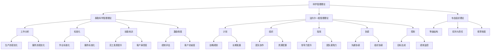

                 

### 文章标题

《从经典书籍中汲取管理智慧》

### 关键词

经典管理书籍、管理理论、实践应用、战略管理、创新管理、人力资源、组织行为学

### 摘要

本文从经典管理书籍中汲取智慧，探讨经典管理理论的起源、发展与应用，以及经典管理理论在现代企业中的实际应用。通过对《管理实践》、《管理理论》、《管理行为》、《组织行为学》等经典书籍的深入解读，揭示管理智慧的核心要素及其在实践中的应用。同时，本文还探讨管理智慧对个人成长的影响，以及如何运用管理智慧提升个人和管理水平。最后，通过管理智慧案例分析，为读者提供实用的管理智慧实践指南。

#### 第一部分：经典管理书籍概述

## 第1章 经典管理理论概述

### 1.1 经典管理理论的起源与发展

经典管理理论的起源可以追溯到工业革命时期，当时企业规模扩大，生产效率提高，管理问题日益突出。19世纪末至20世纪初，西方管理理论逐步形成，泰勒、法约尔、韦伯等管理学先驱提出了许多重要的管理理念和方法。

- **泰勒科学管理理论**：泰勒提出了科学管理原理，强调通过科学的方法提高劳动生产率。其核心思想是通过对工作过程进行科学分析，制定合理的操作方法和标准，以最大化劳动效率。

- **法约尔一般管理理论**：法约尔提出了一般管理理论，强调管理的普遍性。其核心内容包括计划、组织、指挥、协调和控制等五大管理职能，为现代企业管理提供了理论框架。

- **韦伯组织理论**：韦伯提出了组织理论，强调组织应该基于理性原则进行设计。其核心思想是组织应该有明确的等级结构、明确的权利和责任、规范的规章制度，以确保组织的高效运行。

### 1.2 经典管理理论的三大流派

经典管理理论可以分为三大流派：科学管理理论、行为科学管理理论和系统管理理论。

- **科学管理理论**：科学管理理论主要关注如何通过科学的方法提高劳动生产率。其代表人物有泰勒、吉尔布雷斯夫妇等。

- **行为科学管理理论**：行为科学管理理论主要关注人的行为和心理对工作效率的影响。其代表人物有麦格雷格、马斯洛等。

- **系统管理理论**：系统管理理论主要关注企业作为一个整体的运行和管理。其代表人物有巴纳德、伯法等。

### 1.3 经典管理理论的联系与对比

经典管理理论之间存在着紧密的联系和相互影响。

- **科学管理理论与行为科学管理理论**：科学管理理论为行为科学管理理论提供了基础，行为科学管理理论则对科学管理理论进行了补充和发展。

- **行为科学管理理论与系统管理理论**：行为科学管理理论为系统管理理论提供了理论基础，系统管理理论则将行为科学管理理论应用于企业整体管理。

- **科学管理理论与系统管理理论**：科学管理理论强调通过科学的方法提高劳动生产率，系统管理理论则强调企业作为一个整体的高效运行。

通过对比分析，我们可以发现，经典管理理论各有侧重，但共同构成了现代管理理论的基础。

## 第2章 经典管理理论框架

### 2.1 科学管理理论

科学管理理论的核心思想是通过科学的方法提高劳动生产率。泰勒是科学管理理论的奠基人，他提出了以下主要观点：

- **工作分析**：通过对工作过程进行详细分析，确定最佳的工作方法和操作步骤。

- **标准化**：制定标准化的操作规程和作业标准，以确保工作的一致性和高效性。

- **技能培训**：对员工进行技能培训，使其掌握最佳的工作方法和操作技能。

- **激励制度**：建立激励制度，激励员工提高工作效率。

### 2.2 行为科学管理理论

行为科学管理理论主要关注人的行为和心理对工作效率的影响。麦格雷格是行为科学管理理论的代表人物，他提出了X理论和Y理论：

- **X理论**：认为人们天生懒惰，需要外部激励和压力来驱动。

- **Y理论**：认为人们是积极的，愿意承担责任，追求成就感。

行为科学管理理论强调通过改善工作环境、建立良好的人际关系来提高工作效率。

### 2.3 系统管理理论

系统管理理论主要关注企业作为一个整体的运行和管理。巴纳德是系统管理理论的代表人物，他提出了组织理论：

- **组织理论**：组织是合作系统，成员之间存在信息交流。

- **协作原理**：组织成员之间的协作是实现组织目标的关键。

- **目标一致性**：组织的目标与成员的个人目标应保持一致。

系统管理理论强调通过优化组织结构、管理流程来提高企业的整体绩效。

#### 第3章 经典管理理论的应用与实践

## 第3章 经典管理理论的应用与实践

### 3.1 经典管理理论在现代企业中的应用

随着经济的发展和社会的进步，经典管理理论在现代企业中的应用越来越广泛。以下分别介绍科学管理理论、行为科学管理理论和系统管理理论在现代企业中的应用。

#### 3.1.1 科学管理理论在制造业中的应用

科学管理理论在制造业中的应用主要体现在以下几个方面：

- **生产流程优化**：通过工作分析，确定最佳的生产流程，提高生产效率。

- **作业标准化**：制定标准化的作业规程，确保生产过程的规范性和一致性。

- **技能培训**：对员工进行技能培训，提高员工的操作水平和综合素质。

- **绩效评估**：建立绩效评估体系，激励员工提高工作效率。

#### 3.1.2 科学管理理论在服务业中的应用

科学管理理论在服务业中的应用主要体现在以下几个方面：

- **服务流程优化**：通过工作分析，确定最佳的服务流程，提高服务质量。

- **服务标准化**：制定标准化的服务规程，确保服务的一致性和客户满意度。

- **客户关系管理**：建立客户关系管理体系，提高客户满意度和忠诚度。

- **绩效评估**：建立绩效评估体系，激励员工提高工作效率。

### 3.2 经典管理理论在中国企业中的应用

中国企业管理在借鉴西方经典管理理论的基础上，结合中国国情，形成了具有中国特色的管理模式。以下分别介绍科学管理理论、行为科学管理理论和系统管理理论在中国企业中的应用。

#### 3.2.1 中国特色管理实践

- **家族企业治理**：家族企业在治理结构上，结合了家族传承和现代企业治理的原则，形成了独特的家族管理模式。

- **企业文化**：中国企业管理注重企业文化的作用，通过弘扬企业精神，凝聚员工力量。

- **社会责任**：中国企业积极参与社会公益事业，提升企业形象。

#### 3.2.2 中国企业的经典案例研究

- **华为**：华为是一家全球领先的信息技术解决方案提供商，其管理实践充分体现了科学管理理论、行为科学管理理论和系统管理理论的结合。

- **阿里巴巴**：阿里巴巴是一家全球领先的电子商务公司，其管理实践注重创新、客户关系和人才培养。

### 3.3 经典管理理论在国际企业中的应用

经典管理理论在国际企业中的应用越来越普遍。以下分别介绍科学管理理论、行为科学管理理论和系统管理理论在国际企业中的应用。

#### 3.3.1 科学管理理论在国际企业中的应用

- **跨国公司**：跨国公司在全球范围内进行资源配置和管理，科学管理理论为其提供了重要的理论支持。

- **全球供应链管理**：科学管理理论在供应链管理中，通过优化生产流程和资源配置，提高供应链的整体绩效。

#### 3.3.2 行为科学管理理论在国际企业中的应用

- **人力资源管理**：国际企业通过行为科学管理理论，优化人力资源管理，提高员工满意度和工作效率。

- **跨文化管理**：国际企业在全球化的背景下，通过行为科学管理理论，进行跨文化管理，促进企业文化的融合。

#### 3.3.3 系统管理理论在国际企业中的应用

- **战略管理**：国际企业通过系统管理理论，制定和实施战略规划，提高企业的核心竞争力。

- **全球运营管理**：国际企业通过系统管理理论，优化全球运营管理，提高企业的整体绩效。

### 3.4 经典管理理论的未来发展

随着全球经济的不断发展，经典管理理论面临着新的挑战和机遇。未来，经典管理理论将朝着以下方向发展：

- **信息化管理**：随着信息技术的快速发展，管理理论将更加注重信息化管理，提高企业的管理效率和决策水平。

- **可持续发展**：企业将更加注重可持续发展，管理理论将更加关注环境、社会和经济效益的平衡。

- **全球化**：随着全球化的深入发展，管理理论将更加注重跨文化管理和全球运营管理。

#### 第4章 经典管理理论的发展与创新

## 第4章 经典管理理论的发展与创新

### 4.1 经典管理理论的创新与演变

经典管理理论自19世纪末以来，经历了数十年的发展和演变。随着时间的推移，经典管理理论不断吸收新的思想和技术，不断创新和进化。

- **战略管理理论**：战略管理理论在经典管理理论的基础上，引入了战略规划、竞争分析和资源配置等概念，为企业提供了一种系统性的管理方法。

- **创新管理理论**：创新管理理论强调创新对企业发展的关键作用，通过组织创新、技术创新和管理创新，推动企业的持续发展。

- **企业文化理论**：企业文化理论强调企业文化的塑造和传承，认为企业文化是企业发展的重要驱动力。

### 4.2 经典管理理论的未来发展

未来，经典管理理论将继续发展，以适应不断变化的经济环境和企业需求。以下是经典管理理论未来发展的几个趋势：

- **数字化转型**：随着数字技术的快速发展，管理理论将更加注重数字化转型，提高企业的数字化运营能力和竞争力。

- **人工智能应用**：人工智能在企业管理中的应用日益广泛，管理理论将更加关注人工智能在决策支持、流程优化和人力资源管理等方面的应用。

- **可持续发展**：面对全球环境问题，管理理论将更加注重可持续发展，推动企业在经济效益、社会效益和环境效益之间的平衡。

### 4.3 经典管理理论的融合与发展

经典管理理论的融合与发展是未来管理理论发展的重要趋势。不同管理理论之间的融合，将为企业提供更加丰富和全面的管理方法。

- **战略管理与创新管理的融合**：战略管理与创新管理的融合，将帮助企业制定创新战略，推动企业的持续发展。

- **传统管理与数字化管理的融合**：传统管理与数字化管理的融合，将帮助企业实现数字化转型，提高企业的管理效率和竞争力。

- **企业文化与绩效管理的融合**：企业文化与绩效管理的融合，将帮助企业建立积极的企业文化，提高员工的满意度和工作效率。

### 4.4 未来管理理论的研究方向

未来管理理论的研究方向将涉及多个领域，以下是几个可能的研究方向：

- **人工智能与管理的融合**：研究人工智能在企业管理中的应用，探索人工智能如何提升企业的管理效率和决策能力。

- **可持续发展与管理**：研究企业在可持续发展目标下的管理策略，探索如何在实现经济效益的同时，保护环境和社会利益。

- **全球管理**：研究企业在全球化背景下的管理挑战，探索如何在跨国经营中实现有效的管理。

#### 第二部分：经典管理书籍选读

## 第5章 《管理实践》

### 5.1 《管理实践》概述

《管理实践》是由彼得·德鲁克（Peter F. Drucker）所著，被誉为现代管理学的奠基之作。德鲁克在这本书中，系统地阐述了管理的基本原则和实践方法，对现代企业管理产生了深远影响。

#### 5.2 《管理实践》的核心内容

《管理实践》的核心内容可以归纳为以下几个方面：

1. **管理的基本职能**：德鲁克认为，管理有四大基本职能：规划、组织、领导和控制。这些职能贯穿于企业的各个方面，是企业管理的基本要素。

2. **目标管理**：德鲁克提出了目标管理的概念，认为设定明确的目标是管理工作的起点和归宿。通过目标分解和目标设定，确保企业的各个部门和员工都朝着共同的目标努力。

3. **知识型组织**：德鲁克认为，知识型组织是未来企业的发展方向。在这样的组织中，知识是核心资源，员工通过知识共享和创新，推动企业的发展。

4. **管理者角色**：德鲁克详细阐述了管理者的角色和职责，包括决策者、协调者、领导者和服务者。他认为，管理者不仅需要具备专业知识和技能，还需要具备领导力和服务精神。

#### 5.3 《管理实践》的实践价值

《管理实践》的实践价值主要体现在以下几个方面：

1. **指导企业管理实践**：德鲁克的管理理念和方法，为企业的管理实践提供了有力的指导。许多企业通过借鉴《管理实践》的理念，取得了显著的管理成效。

2. **推动管理创新**：德鲁克的管理理念，激发了企业管理者的创新思维，推动企业管理向更高效、更灵活的方向发展。

3. **提升管理者素质**：德鲁克对管理者的角色和职责进行了深入剖析，帮助管理者提升自身的素质和能力，更好地适应企业管理的要求。

### 第6章 《管理理论》

#### 6.1 《管理理论》概述

《管理理论》是由亨利·明茨伯格（Henry Mintzberg）所著，他是当代管理学界的领军人物之一。在这本书中，明茨伯格对管理理论进行了全面、系统的梳理和分析，提出了许多独到的见解。

#### 6.2 《管理理论》的核心观点

《管理理论》的核心观点可以归纳为以下几个方面：

1. **管理活动的多样性**：明茨伯格认为，管理活动是多样且复杂的，不能简单地归结为某一种模式或方法。他提出了管理活动的六大角色：监视者、发言人、领导者、联系者、决策者和资源分配者。

2. **管理实践的动态性**：明茨伯格强调，管理实践是一个动态的过程，受到多种因素的影响。他认为，管理者应该根据实际情况，灵活调整管理策略，而不是固守某一特定的管理理论。

3. **组织架构的适应性**：明茨伯格认为，组织架构应该适应组织的实际情况和战略目标。他提出了“适应性组织”的概念，强调组织架构的灵活性和适应性。

#### 6.3 《管理理论》的应用与实践

《管理理论》在管理实践中具有广泛的应用价值：

1. **指导管理决策**：明茨伯格的管理理论为管理者提供了丰富的管理工具和方法，帮助他们在决策过程中更好地把握实际情况。

2. **提升管理效能**：通过理解管理活动的多样性和动态性，管理者可以更好地应对各种管理挑战，提升管理效能。

3. **优化组织架构**：明茨伯格的适应性组织理论，为组织架构的优化提供了有益的指导，帮助企业实现更好的组织运作。

### 第7章 《管理行为》

#### 7.1 《管理行为》概述

《管理行为》是由道格拉斯·麦格雷格（Douglas McGregor）所著，他是行为科学管理理论的代表人物之一。在这本书中，麦格雷格对管理行为进行了深入分析，提出了X理论和Y理论。

#### 7.2 《管理行为》的核心内容

《管理行为》的核心内容可以归纳为以下几个方面：

1. **X理论和Y理论**：麦格雷格提出了X理论和Y理论，分别代表了两种不同的管理理念。X理论认为，员工是懒惰的，需要严格的管理和激励；Y理论认为，员工是积极的，愿意承担责任，追求成就感。

2. **管理行为的变革**：麦格雷格认为，管理行为的变革是企业成功的关键。他提出了“变革管理”的概念，强调管理者需要具备变革意识和管理能力，推动企业的持续发展。

3. **员工激励**：麦格雷格认为，员工激励是管理的重要方面。他提出了多种激励方法，如目标激励、参与激励、成就激励等，帮助管理者更好地激励员工。

#### 7.3 《管理行为》的理论贡献

《管理行为》的理论贡献主要体现在以下几个方面：

1. **推动行为科学管理**：麦格雷格的行为科学管理理论，为管理学的发展做出了重要贡献。他的理论为管理者提供了新的视角和方法，帮助管理者更好地理解和管理员工。

2. **提升管理效能**：麦格雷格的管理理论，强调员工激励和管理变革，有助于提升管理效能。管理者可以借鉴这些理论，优化管理实践，提高组织的绩效。

3. **促进企业变革**：麦格雷格的变革管理理论，为企业在面对外部环境变化时，提供了有益的指导。管理者可以运用这些理论，推动企业的变革和发展。

### 第8章 《组织行为学》

#### 8.1 《组织行为学》概述

《组织行为学》是由爱德华·L·加尼斯（Edward L. Gagne）所著，这是一本系统介绍组织行为学的经典著作。加尼斯在书中详细阐述了组织行为学的基本原理和应用。

#### 8.2 《组织行为学》的核心理论

《组织行为学》的核心理论可以归纳为以下几个方面：

1. **领导理论**：领导理论是组织行为学的重要研究领域。加尼斯介绍了多种领导理论，如特质理论、行为理论、情境理论等，为管理者提供了不同的领导方法。

2. **团队理论**：团队理论关注团队的行为和绩效。加尼斯提出了团队形成、团队沟通、团队冲突和团队激励等方面的理论，帮助管理者更好地理解和管理团队。

3. **组织文化理论**：组织文化理论探讨组织文化的形成、传播和影响。加尼斯认为，组织文化是组织的核心，对员工的行为和绩效有着深远的影响。

#### 8.3 《组织行为学》的实际应用

《组织行为学》在管理实践中具有广泛的应用：

1. **领导力提升**：管理者可以通过学习领导理论，提升自己的领导能力，更好地领导团队。

2. **团队建设**：管理者可以利用团队理论，设计和优化团队结构，提高团队的协作效率和绩效。

3. **组织文化建设**：管理者可以运用组织文化理论，营造积极向上的组织文化，提升组织的凝聚力和竞争力。

### 第9章 管理智慧启示录

#### 9.1 管理智慧的概念与内涵

管理智慧是指管理者通过理解、分析和应用管理知识，解决管理问题、提升管理效能和实现组织目标的能力。它包括以下几个方面的内涵：

1. **知识**：管理智慧的基础是管理知识，包括管理学的基本理论、方法和技术。

2. **经验**：管理智慧不仅来源于理论知识，更来源于实践经验的积累。

3. **洞察力**：管理智慧要求管理者具有敏锐的洞察力，能够深刻理解组织内外部环境的变化。

4. **决策能力**：管理智慧体现在管理者在面对复杂问题时，能够做出明智的决策。

#### 9.2 管理智慧的核心要素

管理智慧的核心要素包括以下几个方面：

1. **战略思维**：管理者需要具备战略思维，能够从全局出发，制定和实施长期发展规划。

2. **创新精神**：管理智慧要求管理者具备创新精神，能够不断探索新的管理方法和手段。

3. **领导力**：管理智慧体现在领导力上，管理者需要具备领导力，能够激励和引导员工实现组织目标。

4. **沟通能力**：管理者需要具备良好的沟通能力，能够与员工、同事和上级有效沟通。

#### 9.3 管理智慧的实践与应用

管理智慧在实践中具有广泛的应用：

1. **战略规划**：通过战略思维，管理者可以制定明确的战略目标，推动企业实现长期发展。

2. **创新管理**：通过创新精神，管理者可以推动企业进行管理创新，提高管理效能。

3. **领导团队**：通过领导力，管理者可以激发员工的潜能，提升团队的协作效率。

4. **沟通协调**：通过沟通能力，管理者可以协调各方关系，确保组织目标的实现。

### 第10章 管理智慧在实践中的应用

#### 10.1 管理智慧在企业战略规划中的应用

企业战略规划是企业实现长期发展的关键。管理智慧在企业战略规划中的应用体现在以下几个方面：

1. **明确战略目标**：管理者需要运用战略思维，明确企业的发展方向和目标，确保企业的发展路径清晰。

2. **分析内外部环境**：管理者需要运用洞察力，分析企业内外部环境的变化，为战略规划提供依据。

3. **制定战略措施**：管理者需要运用创新精神，制定具体的战略措施，确保战略目标的实现。

4. **调整战略规划**：管理者需要根据实际情况，及时调整战略规划，确保企业能够应对市场变化。

#### 10.2 管理智慧在团队管理中的应用

团队管理是企业管理的重要组成部分。管理智慧在团队管理中的应用体现在以下几个方面：

1. **组建高效团队**：管理者需要运用管理智慧，选择合适的团队成员，构建高效的团队结构。

2. **激励团队成员**：管理者需要运用管理智慧，设计合理的激励机制，激发团队成员的积极性和创造力。

3. **培养团队协作**：管理者需要运用管理智慧，促进团队成员之间的沟通和协作，提高团队的绩效。

4. **提升团队素质**：管理者需要运用管理智慧，提供培训和发展机会，提升团队成员的专业能力和素质。

#### 10.3 管理智慧在人力资源管理中的应用

人力资源管理是企业管理的重要方面。管理智慧在人力资源管理中的应用体现在以下几个方面：

1. **招聘和选拔**：管理者需要运用管理智慧，设计科学的招聘和选拔机制，选拔合适的员工。

2. **员工培训和发展**：管理者需要运用管理智慧，提供培训和发展机会，提升员工的综合素质。

3. **绩效评估**：管理者需要运用管理智慧，制定合理的绩效评估体系，激励员工提高工作绩效。

4. **员工关系管理**：管理者需要运用管理智慧，建立良好的员工关系，营造积极向上的企业文化。

### 第11章 管理智慧与个人成长

#### 11.1 管理智慧对个人成长的影响

管理智慧对个人成长有着深远的影响。通过掌握管理智慧，个人可以在以下几个方面实现成长：

1. **提升领导力**：管理智慧有助于个人提升领导力，更好地领导团队和实现组织目标。

2. **增强决策能力**：管理智慧有助于个人增强决策能力，在面对复杂问题时做出明智的决策。

3. **培养创新思维**：管理智慧有助于个人培养创新思维，不断探索新的解决问题的方法。

4. **提高沟通能力**：管理智慧有助于个人提高沟通能力，更好地与同事、上级和下属进行有效沟通。

#### 11.2 管理智慧在职业生涯中的应用

管理智慧在职业生涯中的应用体现在以下几个方面：

1. **职业规划**：通过运用管理智慧，个人可以制定明确的职业规划，明确自己的职业发展方向。

2. **晋升机会**：管理智慧有助于个人在职场中脱颖而出，获得更多的晋升机会。

3. **职业发展**：管理智慧有助于个人在职业生涯中实现更好的发展，提升自身的职业价值。

4. **团队管理**：通过掌握管理智慧，个人可以更好地管理团队，提升团队绩效。

#### 11.3 管理智慧在自我管理中的应用

管理智慧在自我管理中的应用体现在以下几个方面：

1. **时间管理**：通过运用管理智慧，个人可以更好地进行时间管理，提高工作效率。

2. **目标设定**：通过运用管理智慧，个人可以设定明确的目标，并制定实现目标的计划。

3. **情绪管理**：通过运用管理智慧，个人可以更好地进行情绪管理，保持积极的心态。

4. **持续学习**：通过运用管理智慧，个人可以更好地进行持续学习，提升自身的专业能力和素质。

### 附录

#### 附录A 经典管理书籍推荐

以下是一些经典管理书籍的推荐，供读者参考：

1. 《管理实践》（彼得·德鲁克著）
2. 《管理理论》（亨利·明茨伯格著）
3. 《管理行为》（道格拉斯·麦格雷格著）
4. 《组织行为学》（爱德华·L·加尼斯著）
5. 《第五项修炼》（彼得·圣吉著）
6. 《领导者的本质》（约翰·科特著）
7. 《创新与企业家精神》（彼得·德鲁克著）
8. 《管理决策新科学》（赫伯特·亚历山大著）
9. 《企业的管理革命》（理查德·达夫特著）
10. 《竞争战略》（迈克尔·波特著）

#### 附录B 经典管理理论架构Mermaid图



#### 附录C 经典管理算法伪代码

```python
# 伪代码：泰勒科学管理算法
def TaylorScienceManagement(workProcess):
    # 工作过程分析
    analyzedProcess = analyzeWorkProcess(workProcess)
    
    # 制定标准化操作规程
    standardizedOperations = createStandardizedOperations(analyzedProcess)
    
    # 对员工进行技能培训
    trainedEmployees = trainEmployees(analyzedProcess)
    
    # 建立激励制度
    incentiveSystem = createIncentiveSystem(trainedEmployees)
    
    # 实施科学管理
    implementedManagement = implementScienceManagement(standardizedOperations, incentiveSystem)
    
    return implementedManagement

# 伪代码：法约尔一般管理算法
def FayolGeneralManagement(fourFunctions):
    # 计划
    plan = planOperations(fourFunctions[0])
    
    # 组织
    organization = organizeWorkforce(fourFunctions[1])
    
    # 指挥
    command = issueCommands(fourFunctions[2])
    
    # 协调
    coordination = coordinateActivities(fourFunctions[3])
    
    # 控制
    control = monitorPerformance(plan, command, coordination)
    
    return control

# 伪代码：韦伯组织理论算法
def WeberOrganizationTheory(organizationDesign):
    # 确定等级结构
    hierarchy = determineHierarchy(organizationDesign)
    
    # 确定权利与责任
    rightsAndResponsibilities = determineRightsAndResponsibilities(organizationDesign)
    
    # 制定规章制度
    regulations = createRegulations(organizationDesign)
    
    # 实施组织管理
    implementedManagement = implementOrganizationManagement(hierarchy, rightsAndResponsibilities, regulations)
    
    return implementedManagement
```

#### 附录D 管理智慧案例分析

**案例一：华为的管理智慧实践**

华为作为全球领先的信息技术解决方案提供商，其成功离不开管理智慧的应用。以下是华为在管理智慧方面的几个实践案例：

1. **目标管理**：华为采用目标管理（MBO）方法，制定明确的战略目标，确保各级员工都明确自己的职责和目标。通过定期评估和调整，确保企业战略的顺利实施。

2. **知识型组织建设**：华为注重知识管理，建立内部知识库和交流平台，鼓励员工分享经验和知识，提升组织的创新能力。

3. **领导力培养**：华为注重领导力培养，通过内部培训和外部交流，提升管理者的领导能力和决策能力。

4. **创新管理**：华为鼓励创新，设立创新基金，支持员工进行创新研究。同时，通过项目评估和奖励机制，激励员工参与创新项目。

**案例二：阿里巴巴的管理智慧实践**

阿里巴巴作为全球领先的电子商务公司，其管理智慧实践同样值得借鉴。以下是阿里巴巴在管理智慧方面的几个实践案例：

1. **企业文化**：阿里巴巴注重企业文化建设，倡导“客户第一、员工第二、股东第三”的理念，营造积极向上的企业文化。

2. **人力资源管理**：阿里巴巴采用人才引进和培养相结合的方法，通过内部晋升和外部招聘，打造高素质的人才队伍。

3. **团队管理**：阿里巴巴强调团队协作，通过设立跨部门项目和团队激励制度，提升团队的协作效率和绩效。

4. **数字化转型**：阿里巴巴积极推动数字化转型，运用大数据和人工智能技术，提升企业的运营效率和管理水平。

#### 附录E 管理智慧实践指南

**1. 管理智慧实践步骤**

- **明确管理目标**：首先，明确企业或组织的战略目标和具体任务，为管理智慧的应用提供方向。

- **分析管理现状**：对企业的管理现状进行深入分析，找出存在的问题和改进的方向。

- **制定管理策略**：根据管理目标和现状分析，制定具体的管理策略和措施。

- **实施管理策略**：将管理策略付诸实践，通过有效的执行，确保管理目标的有效实现。

- **监控和评估**：对管理策略的实施过程进行监控和评估，及时发现问题和调整策略。

**2. 管理智慧实践要点**

- **重视员工培训**：通过培训提升员工的素质和能力，为管理智慧的应用提供人才保障。

- **建立良好的沟通机制**：建立有效的沟通渠道，确保信息的畅通和有效传递。

- **鼓励创新和改进**：鼓励员工提出创新和改进的建议，推动企业的持续发展。

- **优化管理流程**：对管理流程进行优化，提高管理效率和效果。

- **注重绩效管理**：建立科学的绩效评估体系，激励员工提高工作绩效。

**3. 管理智慧实践案例分析**

- **案例分析一：腾讯的管理智慧实践**

腾讯作为领先的互联网企业，其管理智慧实践具有借鉴意义。以下是腾讯在管理智慧实践中的几个案例：

1. **团队协作**：腾讯采用敏捷开发方法，推动团队协作，提高项目的开发效率。

2. **创新文化**：腾讯鼓励员工创新，设立创新基金，支持员工进行创新研究。

3. **人才引进和培养**：腾讯通过内部晋升和外部招聘，吸引和培养高素质的人才。

4. **绩效管理**：腾讯建立科学的绩效评估体系，激励员工提高工作绩效。

- **案例分析二：华为的管理智慧实践**

华为在管理智慧实践中的成功，主要体现在以下几个方面：

1. **目标管理**：华为采用目标管理方法，确保各级员工都明确自己的职责和目标。

2. **知识管理**：华为建立内部知识库和交流平台，鼓励员工分享经验和知识。

3. **领导力培养**：华为注重领导力培养，通过内部培训和外部交流，提升管理者的领导能力和决策能力。

4. **创新管理**：华为鼓励创新，设立创新基金，支持员工进行创新研究。

### 参考文献

1. 德鲁克，P. F. (1999). 《管理实践》. 北京：机械工业出版社.

2. 明茨伯格，H. (1973). 《管理理论》. 加拿大：麦吉尔-魁北克大学出版社.

3. 麦格雷格，D. (1960). 《管理行为》. 美国：普伦蒂斯·霍尔出版社.

4. 加尼斯，E. L. (2005). 《组织行为学》. 北京：中国人民大学出版社.

5. 波特，M. E. (1980). 《竞争战略》. 上海：上海人民出版社.

6. 科特，J. P. (1987). 《领导者的本质》. 北京：机械工业出版社.

7. 圣吉，P. (1990). 《第五项修炼》. 上海：上海人民出版社.

8. 亚历山大，H. (1964). 《管理决策新科学》. 北京：科学出版社.

9. 达夫特，R. L. (1999). 《企业的管理革命》. 北京：机械工业出版社.

10. 德鲁克，P. F. (1985). 《创新与企业家精神》. 北京：机械工业出版社.

