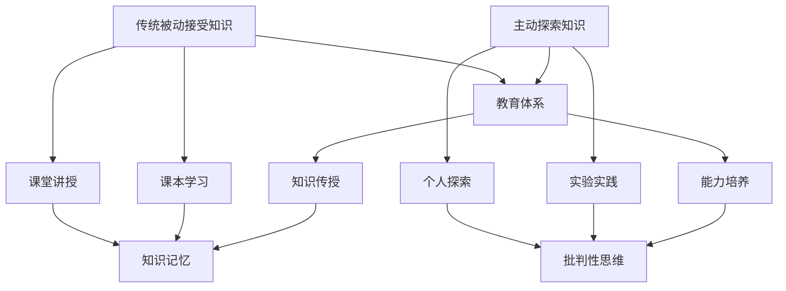

                 

### 文章标题：从被动接受到主动探索：知识获取方式的转变

> 关键词：知识获取方式、被动接受、主动探索、教育、职业发展、个人成长

> 摘要：本文深入探讨了知识获取方式的转变，从传统被动接受知识到现代主动探索知识的转变过程。通过分析知识获取方式的背景、核心概念、教育领域和职业场景的应用，以及对社会发展的影响，本文旨在帮助读者理解这一转变的深远意义，并展望其未来发展趋势。

----------------------------------------------------------------

## 第一部分：背景与核心概念理解

### 1.1 知识获取方式的转变背景

在信息技术飞速发展的今天，知识获取方式正经历着深刻的变革。传统上，人们主要通过课堂教学、书籍阅读等被动方式获取知识。然而，随着互联网、移动设备和在线学习平台的发展，知识获取方式逐渐向主动探索转变。这种转变不仅影响了学习者的学习习惯，也对教育体系提出了新的要求。

**背景分析：**

- **信息技术的发展**：互联网和移动设备的普及，使得信息获取更加便捷，知识传播更加迅速。
- **学习方式的多样化**：在线学习平台和开放教育资源的兴起，为学习者提供了丰富的学习资源和多样化的学习方式。
- **个性化学习的需求**：随着社会的发展，人们对于教育和职业的要求越来越高，个性化学习成为趋势。

### 1.2 被动接受知识与主动探索知识的区别

#### 1.2.1 被动接受知识

被动接受知识通常是指通过传统教育模式，如课堂讲授、课本学习等，获取知识的方式。这种方式的学习往往是以教师为中心，学生是知识的接受者，学习过程注重记忆和理解。

- **教学目标**：以传授知识为主，注重知识的记忆和理解。
- **学习方法**：依赖教师的讲解和课本的内容，学生被动接受知识。
- **学习效果**：通过考试和作业等方式评估学习成果。

#### 1.2.2 主动探索知识

主动探索知识则强调学习者通过个人探索、实验、实践等方式主动构建知识体系。这种方式的学习强调批判性思维、问题解决能力和创新思维，是对被动接受知识的重要补充。

- **教学目标**：培养学习者的自主学习能力和创新能力，注重知识的应用和解决实际问题的能力。
- **学习方法**：通过项目式学习、探究式学习等方式，让学生在探索和实践中学习。
- **学习效果**：通过实践项目、研究报告等方式评估学习成果。

### 1.3 知识获取方式转变对教育的影响

知识获取方式的转变对教育体系产生了深远的影响。传统教育模式注重知识的传授，而现代教育更加注重培养学生的自主学习能力和创新能力。

- **教育目标**：从以知识传授为主转向以能力培养为主，注重培养学生的综合素质。
- **教学方法**：从单一的课堂讲授转向多样化的教学方法，如项目式学习、探究式学习等。
- **教育公平**：知识获取方式的转变有助于缩小教育差距，使更多学习者有机会接受高质量的教育。

### 1.4 本书内容结构概述

本书旨在探讨知识获取方式的转变，以及这一转变对教育、学习和个人发展的影响。本书分为三个主要部分：

- **第一部分：背景与核心概念理解**：介绍知识获取方式的转变背景，分析被动接受知识与主动探索知识的区别及其对教育的影响。
- **第二部分：知识获取方式转变的实践应用**：探讨知识获取方式转变在不同教育领域和职业场景中的应用，以及相关的挑战和机遇。
- **第三部分：未来趋势与展望**：展望知识获取方式转变的未来发展趋势，提出针对教育者和学习者的建议。

### Mermaid 流程图：知识获取方式的转变

### 1.5 小结

知识获取方式的转变是现代社会发展的必然趋势，对教育体系和个人学习方式都提出了新的挑战和机遇。了解这一转变的背景、原因和影响，对于教育者和学习者都具有重要意义。本书将深入探讨这一主题，帮助读者更好地适应和应对这一转变。

### 1.6 本章小结

本章介绍了知识获取方式的转变背景、被动接受知识与主动探索知识的区别，以及这一转变对教育的影响。通过Mermaid流程图，我们更直观地理解了知识获取方式的转变及其影响。本章内容为后续章节的讨论奠定了基础。

----------------------------------------------------------------

## 第二部分：知识获取方式转变的实践应用

### 2.1 知识获取方式转变在教育中的应用

在教育领域，知识获取方式的转变正逐步改变传统的教学模式和学习方式。现代教育越来越强调学生的主动参与和自主学习，以培养学生的创新能力、批判性思维和实践能力。

#### 2.1.1 在线学习平台

在线学习平台如Coursera、edX和Udemy等，为学习者提供了丰富的学习资源和灵活的学习方式。这些平台不仅提供了高质量的课程，还允许学习者根据自己的时间和节奏进行学习。

- **学习灵活性**：学生可以随时随地访问课程内容，无需受限于时间和地点。
- **个性化学习**：平台通过算法分析学习者的行为数据，提供个性化的学习建议和资源推荐。

#### 2.1.2 项目式学习

项目式学习（Project-Based Learning, PBL）是一种以学生为中心的教学方法，通过实际项目的完成，培养学生的学习能力、团队合作能力和解决问题的能力。

- **实践性**：学生通过实际项目来应用所学知识，提高实践能力。
- **团队合作**：项目通常需要学生合作完成，培养团队合作精神和沟通能力。

#### 2.1.3 游戏化学习

游戏化学习将游戏的元素融入学习过程中，通过积分、奖励等机制激发学生的学习兴趣和积极性。

- **趣味性**：游戏化学习使学习过程更加有趣，提高了学生的学习动机。
- **参与度**：游戏化的任务和挑战增加了学生的参与度，提高了学习效果。

### 2.2 知识获取方式转变在职业场景中的应用

在职业场景中，知识获取方式的转变同样具有重要意义。职场人士需要不断更新知识和技能，以适应快速变化的工作环境。

#### 2.2.1 在职培训

许多企业为员工提供了多种形式的在职培训，以提升员工的职业技能和工作效率。

- **技能提升**：通过培训，员工可以学习到最新的行业动态和技术趋势。
- **职业发展**：在职培训有助于员工职业晋升和职业转型。

#### 2.2.2 持续学习文化

企业建立持续学习文化，鼓励员工不断提升自己的知识和技能。

- **自主学习**：员工可以自主选择学习内容和方式，提高学习效率。
- **团队合作**：通过团队合作学习，增强团队凝聚力和创新能力。

#### 2.2.3 工作学习相结合

在职场中，工作与学习相结合成为一种趋势。员工通过实际工作来学习，并通过反思和总结来提升自己的能力。

- **实践应用**：工作学习相结合使知识更加贴近实际工作，提高了知识的应用能力。
- **反思总结**：通过反思和总结，员工可以更好地理解和应用所学知识。

### 2.3 知识获取方式转变面临的挑战和机遇

知识获取方式的转变虽然带来了许多机遇，但也面临一些挑战。

- **挑战**：
  - **技术依赖**：过度依赖技术可能导致人际沟通和社交技能的减弱。
  - **信息过载**：大量的信息资源可能使学习者感到压力和困惑，难以筛选和利用。
  - **学习习惯**：从被动接受知识到主动探索知识需要时间适应，学习者需要培养良好的学习习惯。

- **机遇**：
  - **知识共享**：知识获取方式的转变促进了知识共享和传播，为个人和组织的知识积累和创新提供了更广阔的空间。
  - **跨界合作**：知识获取方式的转变使得跨领域的学习和合作变得更加容易，有助于培养复合型人才和创新团队。

### 2.4 实战案例：知识获取方式转变在企业培训中的应用

**案例背景：** 某科技公司为了提升员工的技能和知识，决定进行一次大规模的在职培训项目。

**案例实施：**
1. **需求调研**：公司首先对员工进行了需求调研，了解员工的培训需求和期望。
2. **课程设计**：根据调研结果，公司设计了包括技术培训、领导力培训和团队协作培训等多个维度的培训课程。
3. **在线学习平台搭建**：公司选择了知名的在线学习平台，为员工提供了丰富的课程资源和互动学习工具。
4. **项目式学习实践**：公司实施了项目式学习，让员工在真实的工作项目中学习和应用新知识和技能。
5. **持续反馈与改进**：公司定期收集员工的反馈，对培训内容和方法进行持续改进。

**案例效果：**
- 通过这次培训项目，公司员工的技能和知识水平得到了显著提升，工作效率和创新能力也得到了提高。
- 员工的满意度和参与度也得到了提升，公司整体的工作氛围和团队凝聚力得到了增强。

### 2.5 本章小结

本章介绍了知识获取方式转变在教育领域和职业场景中的应用，分析了这一转变带来的挑战和机遇。通过实战案例，我们看到了知识获取方式转变在实际操作中的具体实施效果。这一部分的内容为下一部分关于未来趋势与展望的讨论奠定了基础。

----------------------------------------------------------------

## 第三部分：知识获取方式的转变：未来趋势与展望

### 3.1 人工智能与知识获取

随着人工智能技术的不断发展，知识获取方式将变得更加智能化和个性化。人工智能可以通过大数据分析和机器学习算法，对大量信息进行高效处理和分析，为学习者提供精准的知识推荐和个性化学习路径。

- **智能推荐系统**：基于学习者的行为数据和兴趣偏好，智能推荐系统将能够推荐最适合的学习资源和内容，提高学习效果。
- **智能学习助理**：智能学习助理将结合自然语言处理和机器学习技术，为学习者提供实时的问题解答和个性化指导。
- **知识图谱的应用**：知识图谱将通过对实体和关系的网络化表示，提供更加系统和全面的知识服务，帮助学习者构建全面的知识体系。

### 3.2 跨学科知识与跨领域合作

随着社会问题的复杂性和多样性增加，跨学科和跨领域的知识融合将成为趋势。跨学科研究将整合不同领域的知识和方法，为解决复杂问题提供新的思路和方案。

- **多学科交叉研究**：多学科交叉研究能够整合不同领域的知识和方法，为解决复杂问题提供新的思路和方案。
- **跨领域合作**：企业、研究机构、教育机构等不同领域的合作，将共同开发和应用新兴技术，推动知识获取方式的变革和创新。

### 3.3 开放式学习和知识共享

开放式学习和知识共享是知识获取方式转变的重要趋势。开放式学习通过开放教育资源（Open Educational Resources, OER）和在线课程平台，打破了传统教育的边界，使学习资源更加普及和可获取。

- **开放教育资源**：开放教育资源为全球学习者提供了丰富的学习资源，促进了知识的传播和共享。
- **知识共享平台**：知识共享平台如维基百科、GitHub等，鼓励用户贡献知识和代码，促进了全球范围内的知识交流和合作。

### 3.4 教育技术的创新与发展

教育技术的创新和发展是知识获取方式变革的重要推动力。虚拟现实（VR）、增强现实（AR）、混合现实（MR）等新兴技术的应用，为学习者提供了更加沉浸式和互动性的学习体验。

- **虚拟实验室**：虚拟实验室通过模拟真实的实验环境，让学生在虚拟空间中进行实验操作，提高实践能力。
- **互动式学习工具**：如互动式电子书、虚拟现实课堂等，通过增强互动性和参与度，提高学习效果。

### 3.5 面向未来的学习环境与教学模式

面向未来，学习环境和教学模式的变革将成为知识获取方式转变的核心。个性化学习、终身学习和协作学习将成为主流教学模式。

- **个性化学习**：通过大数据分析和人工智能技术，为每个学习者提供个性化的学习路径和资源，提高学习效果。
- **终身学习**：随着知识更新速度的加快，终身学习成为必需，学习者需要持续更新知识和技能，以适应不断变化的工作和生活环境。
- **协作学习**：协作学习强调学习者之间的互动与合作，通过团队合作和知识共享，提高学习效率和创新能力。

### 3.6 未来展望

知识获取方式的转变将为未来的教育、学习和个人发展带来深远的影响。随着人工智能、大数据、物联网等技术的发展，学习将变得更加个性化和智能化，知识的获取和传播将变得更加高效和广泛。未来的学习环境将是一个开放、互动、多样化的空间，学习者将能够在任何时间、任何地点进行学习和探索。

### 3.7 本章小结

本部分从人工智能与知识获取、跨学科知识与跨领域合作、开放式学习和知识共享、教育技术的创新与发展以及面向未来的学习环境与教学模式等多个方面，探讨了知识获取方式的转变的未来趋势与展望。通过这些分析，我们可以看到知识获取方式变革的广阔前景和巨大潜力。这一部分的内容为下一部分关于知识获取方式转变的理论与实践基础的讨论奠定了基础。

----------------------------------------------------------------

## 第四部分：知识获取方式转变的理论与实践基础

### 4.1 理论基础

知识获取方式的转变并非凭空而来，它建立在一系列相关理论基础之上。这些理论为知识获取方式的转变提供了理论支持和指导。

- **建构主义学习理论**：建构主义认为知识是通过个体与环境的交互过程中主动建构的，学习者是知识建构的主动参与者。这一理论强调了学习者的主体性和自主性，与知识获取方式的转变密切相关。
- **学习心理学**：学习心理学研究学习过程的心理机制，包括记忆、理解、应用和创新等。通过理解学习心理学的原理，教育者和学习者可以更好地设计学习策略和优化学习过程。
- **信息科学理论**：信息科学理论关注信息的组织、传播和处理，为知识获取方式的转变提供了技术基础和理论支持。

### 4.2 实践基础

知识获取方式的转变已经在教育、职业培训等多个领域得到了广泛应用，积累了丰富的实践经验。以下是一些关键的实践基础：

- **在线学习平台**：在线学习平台提供了丰富的学习资源和灵活的学习方式，使学习者能够根据自己的需求和进度进行学习。
- **项目式学习**：项目式学习通过实际项目的完成，培养学习者的实践能力和团队合作精神，使学习过程更加贴近实际工作场景。
- **协作学习**：协作学习通过学习者之间的互动和合作，促进知识的共享和创新，提高了学习效果和团队协作能力。

### 4.3 知识获取方式转变的挑战与对策

虽然知识获取方式的转变带来了许多机遇，但也面临着一些挑战。以下是一些主要挑战及相应的对策：

- **技术挑战**：新兴技术的发展和应用往往伴随着不确定性和风险，需要教育者和学习者具备一定的技术素养和适应能力。
- **教育资源的不均衡**：不同地区和群体之间的教育资源存在不均衡，需要政策支持和资源调配，以确保教育公平。
- **学习习惯的转变**：从被动接受知识到主动探索知识的转变需要时间和努力，需要教育者和学习者共同培养良好的学习习惯。

### 4.4 案例研究

为了更深入地理解知识获取方式转变的理论与实践基础，以下是一个案例研究：

**案例背景**：某高校在疫情期间采用了线上教学的方式，以应对线下教学受到的限制。

**案例实施**：
1. **课程内容调整**：根据线上教学的特点，课程内容进行了调整，更加注重互动性和实践性。
2. **在线学习平台搭建**：学校与在线学习平台合作，为学生提供了丰富的学习资源和在线学习工具。
3. **教学方法和策略**：教师采用了多种教学方法，如在线讨论、虚拟实验、项目式学习等，以激发学生的学习兴趣和参与度。
4. **学生反馈机制**：学校建立了学生反馈机制，定期收集学生的意见和建议，对教学进行持续改进。

**案例效果**：通过这次案例的实施，学校不仅成功应对了疫情带来的挑战，还积累了宝贵的线上教学经验，提高了教学质量和学生的学习效果。

### 4.5 本章小结

本章从理论基础和实践基础的角度，探讨了知识获取方式转变的背景和原因。通过案例研究，我们看到了知识获取方式转变在实际操作中的具体实施效果。这一部分的内容为下一部分关于知识获取方式转变在不同教育领域的应用的讨论奠定了基础。

----------------------------------------------------------------

## 第五部分：知识获取方式转变在不同教育领域的应用

### 5.1 高等教育中的应用

在高等教育中，知识获取方式的转变正逐渐改变传统的教学和学习模式。随着在线教育平台和资源的普及，学生可以更加灵活地选择课程和学习时间，同时也为教师提供了新的教学手段和方法。

#### 5.1.1 在线课程

在线课程是高等教育中知识获取方式转变的重要体现。通过在线教育平台，学生可以随时随地访问课程内容，进行自主学习。

- **学习灵活性**：学生可以根据自己的时间和节奏进行学习，无需受限于教室和时间。
- **个性化学习**：在线教育平台通过算法分析学生的行为数据，提供个性化的学习资源和推荐。

#### 5.1.2 混合式学习

混合式学习（Blended Learning）结合了传统课堂教学与在线学习的优势，为学生提供了更加多样化和个性化的学习体验。

- **课堂互动**：教师在课堂上与学生进行互动，解答疑惑，加深理解。
- **在线资源**：学生可以通过在线平台访问丰富的学习资源，进行自主学习。

#### 5.1.3 虚拟实验室

虚拟实验室通过模拟真实的实验环境，为学生提供了实践操作的机会。

- **实践性**：学生可以在虚拟环境中进行实验，提高实践能力。
- **安全性**：虚拟实验室减少了实验中的安全风险，提高了实验的可行性和安全性。

### 5.2 中小学教育中的应用

在中小学生教育中，知识获取方式的转变同样具有重要意义。现代教育技术为学生提供了更加丰富和有趣的学习资源，激发了他们的学习兴趣。

#### 5.2.1 数字化教学资源

数字化教学资源，如电子书、教学视频等，为教师提供了丰富的教学素材，提高了教学效果。

- **互动性**：数字化教学资源具有互动性，可以更好地吸引学生的注意力。
- **便捷性**：数字化教学资源可以随时随地访问，提高了教学的便捷性。

#### 5.2.2 个性化学习

通过大数据分析和人工智能技术，学校可以为每个学生制定个性化的学习计划，提高学习效果。

- **学习路径**：个性化学习为学生提供了定制化的学习路径，满足学生的个性化需求。
- **学习效果**：个性化学习提高了学生的学习效率，增强了学习效果。

#### 5.2.3 游戏化学习

游戏化学习通过将游戏元素融入学习过程中，提高了学生的学习兴趣和积极性。

- **趣味性**：游戏化学习使学习过程更加有趣，提高了学生的学习动机。
- **参与度**：游戏化学习增加了学生的参与度，提高了学习效果。

### 5.3 职业教育与培训中的应用

在职业教育和培训中，知识获取方式的转变对于技能培训和职业发展具有直接影响。现代职业教育和培训更加注重实践性和应用性，为学生提供了丰富的实践机会和职业发展路径。

#### 5.3.1 实践导向的课程设计

职业教育课程更加注重实践操作，通过实际项目和企业合作，提高学生的实践能力和就业竞争力。

- **项目式学习**：通过项目式学习，学生可以在真实的工作项目中应用所学知识，提高实践能力。
- **企业合作**：与企业合作，学校可以为学生提供实习机会，提高就业竞争力。

#### 5.3.2 在线职业培训

在线职业培训平台为学生提供了便捷的学习渠道和丰富的课程资源，帮助他们快速提升职业技能。

- **灵活性**：在线职业培训使学生可以根据自己的时间和进度进行学习，提高了学习的灵活性。
- **资源丰富**：在线职业培训平台提供了丰富的课程资源，包括视频教程、电子书、实践项目等。

#### 5.3.3 职业认证

通过职业认证和资格认证，学生可以获得专业的职业资格，提高就业竞争力和职业发展机会。

- **职业认证**：职业认证是对学生专业技能的认可，有助于提高就业竞争力。
- **资格认证**：资格认证为学生提供了进一步发展的机会，可以促进职业晋升和职业转型。

### 5.4 终身学习中的应用

随着社会的发展，终身学习变得越来越重要。知识获取方式的转变为终身学习提供了新的机会和平台。

#### 5.4.1 开放教育资源

开放教育资源为终身学习者提供了丰富的学习资源，他们可以根据自己的需求和兴趣进行自主选择和学习。

- **资源丰富**：开放教育资源涵盖了各个领域的知识，为终身学习者提供了广泛的学习选择。
- **灵活性**：开放教育资源可以随时随地访问，提高了学习的灵活性。

#### 5.4.2 在线学习平台

在线学习平台提供了多样化的课程和学习方式，使终身学习更加便捷和灵活。

- **课程多样**：在线学习平台提供了各种类型的课程，满足终身学习者的不同需求。
- **互动性强**：在线学习平台具有互动性强，可以通过讨论区、论坛等方式与其他学习者交流和分享。

#### 5.4.3 学习社区

学习社区为终身学习者提供了交流和分享的平台，促进了知识的传播和共享。

- **知识共享**：学习社区鼓励学习者分享知识和经验，促进了知识的传播和共享。
- **经验交流**：学习社区为学习者提供了交流经验和技巧的平台，有助于提升学习效果。

### 5.5 案例研究：知识获取方式转变在高等教育中的应用

以下是一个关于知识获取方式转变在高等教育中应用的案例研究：

**案例背景**：某高校为了提升学生的自主学习能力和实践能力，决定实施一系列改革措施。

**案例实施**：
1. **课程改革**：学校对课程进行了全面改革，增加了实践性课程和跨学科课程，鼓励学生进行自主学习和团队合作。
2. **在线教育平台**：学校与知名在线教育平台合作，为学生提供了丰富的在线课程资源，提高了学习效率和灵活性。
3. **实践教学**：学校建立了多个虚拟实验室和创新创业基地，为学生提供了实践操作的机会，提高了实践能力。
4. **学习反馈机制**：学校建立了学习反馈机制，定期收集学生的意见和建议，对教学进行持续改进。

**案例效果**：通过这次改革，学生的自主学习能力和实践能力得到了显著提升，毕业生的就业率和职业发展前景也得到了改善。

### 5.6 本章小结

本章介绍了知识获取方式转变在不同教育领域的应用，包括高等教育、中小学教育、职业教育与培训和终身学习。通过案例研究，我们看到了知识获取方式转变在实际操作中的具体应用效果。这一部分的内容为下一部分关于知识获取方式转变对个人发展的影响的讨论奠定了基础。

----------------------------------------------------------------

### 第六部分：知识获取方式转变对个人发展的影响

#### 6.1 自我学习和创新能力提升

知识获取方式的转变对个人的自我学习和创新能力提升具有重要意义。传统的教育模式往往侧重于知识的传授，而现代教育更加注重培养学习者的自主学习和创新能力。

- **自主学习**：知识获取方式的转变提供了丰富的学习资源和灵活的学习方式，学习者可以根据自己的兴趣和需求进行自主选择和学习，提高了学习的主动性和积极性。
- **创新能力**：知识获取方式的转变鼓励学习者通过实践、探索和反思来构建知识体系，培养批判性思维和创新思维，提高了创新能力。

#### 6.2 信息素养和信息技能提升

在信息时代，信息素养和信息技能成为个人发展的重要能力。知识获取方式的转变为提升信息素养和信息技能提供了良好的机会。

- **信息素养**：信息素养包括信息获取、处理、评估和利用的能力。知识获取方式的转变提供了丰富的信息资源和工具，帮助学习者提高信息素养。
- **信息技能**：信息技能包括使用信息技术工具进行信息处理、分析和管理的能力。知识获取方式的转变通过在线学习平台和数字化工具，提高了学习者的信息技能。

#### 6.3 社交能力和团队合作能力提升

知识获取方式的转变不仅影响了个人的学习和技能，还对其社交能力和团队合作能力产生了积极影响。

- **社交能力**：知识获取方式的转变通过线上学习和交流，为学习者提供了更多的社交机会，提高了社交能力。
- **团队合作能力**：知识获取方式的转变鼓励学习者通过团队项目和实践来培养团队合作能力，提高了团队合作效果。

#### 6.4 职业发展和就业竞争力提升

知识获取方式的转变对个人的职业发展和就业竞争力具有重要意义。通过自主学习和创新能力提升，个人能够更好地适应职场需求，提高就业竞争力。

- **职业发展**：知识获取方式的转变提供了丰富的职业培训和在线课程资源，帮助个人不断提升职业能力和知识水平，实现职业发展。
- **就业竞争力**：知识获取方式的转变通过提高个人自主学习和创新能力、信息素养和信息技能，增强了个人在职场中的竞争力。

#### 6.5 案例研究：知识获取方式转变对个人发展的积极影响

以下是一个关于知识获取方式转变对个人发展积极影响的案例研究：

**案例背景**：张华是一名大学生，在大学期间积极利用在线学习平台和数字化工具进行学习和实践。

**案例实施**：
1. **在线学习**：张华通过在线学习平台选修了多个与专业相关的课程，提高了专业知识水平。
2. **实践项目**：张华参加了多个实践项目，通过团队合作和实际操作，提升了实践能力和团队合作能力。
3. **技能培训**：张华参加了多个职业培训课程，掌握了多种信息技能，提高了职业竞争力。
4. **社交交流**：张华通过线上学习社区和社交媒体，结交了许多志同道合的朋友，拓展了社交圈子。

**案例效果**：通过知识获取方式的转变，张华在大学期间积累了丰富的知识，提升了自我学习和创新能力，提高了信息素养和信息技能，社交能力和团队合作能力也得到了显著提升。毕业后，张华顺利找到了一份理想的工作，并在短时间内得到了晋升。

### 6.6 本章小结

本章从自我学习和创新能力提升、信息素养和信息技能提升、社交能力和团队合作能力提升、职业发展和就业竞争力提升等方面，探讨了知识获取方式转变对个人发展的积极影响。通过案例研究，我们看到了知识获取方式转变在实际个人发展中的具体效果。这一部分的内容为下一部分关于知识获取方式转变对社会发展的影响的讨论奠定了基础。

----------------------------------------------------------------

### 第七部分：知识获取方式转变对社会发展的影响

#### 7.1 教育体系变革

知识获取方式的转变对教育体系产生了深远的影响。传统教育模式以教师为中心，学生被动接受知识，而现代教育则强调以学生为中心，鼓励学生主动探索和自主学习。

- **教育资源的普及**：知识获取方式的转变使得教育资源的获取更加便捷和普及，特别是通过在线学习平台和开放教育资源，学习者可以随时随地获取所需的知识和技能。
- **教学方法的创新**：知识获取方式的转变推动了教学方法的创新，如项目式学习、协作学习和游戏化学习等，这些教学方法更符合现代学习者的需求，提高了学习效果。
- **教育公平的提升**：知识获取方式的转变有助于缩小教育资源的不平等，使更多学习者有机会接受高质量的教育，提高了教育公平性。

#### 7.2 职业技能培养和劳动力市场的变化

知识获取方式的转变对职业技能培养和劳动力市场也产生了重要影响。随着技术的不断进步，职场对技能的要求也在不断变化。

- **技能需求的多样化**：知识获取方式的转变使得学习者能够更加灵活地获取多样化的技能，劳动力市场对多种技能的需求得到了满足。
- **终身学习的重要性**：知识获取方式的转变强调了终身学习的重要性，职场人士需要不断更新知识和技能，以适应快速变化的职场环境。
- **职业转型的便捷性**：知识获取方式的转变为职场人士提供了便捷的学习途径，使他们能够更轻松地进行职业转型和岗位调整。

#### 7.3 创新和创业环境的改善

知识获取方式的转变为创新和创业提供了良好的环境。现代教育技术和在线学习平台为创业者提供了丰富的知识和资源，降低了创业门槛。

- **知识共享**：知识获取方式的转变促进了知识的共享和传播，为创新和创业提供了更多的灵感和思路。
- **实践机会**：知识获取方式的转变通过项目式学习和实践性课程，为创业者提供了更多的实践机会，提高了创业的成功率。
- **跨学科合作**：知识获取方式的转变促进了跨学科合作，为创新和创业提供了更多的复合型人才和创新方案。

#### 7.4 社会文化的变革

知识获取方式的转变不仅影响了教育、职业和创新，还对整个社会文化产生了深远的影响。

- **学习型社会**：知识获取方式的转变推动了学习型社会的建设，学习成为社会生活的重要组成部分，人们更加注重自我提升和知识积累。
- **知识传播**：知识获取方式的转变使得知识的传播变得更加迅速和广泛，推动了社会知识的普及和文化的多样发展。
- **价值观的变革**：知识获取方式的转变影响了人们的价值观，强调个人自主性和创新精神，推动了社会文化的进步和发展。

#### 7.5 案例研究：知识获取方式转变对社会发展的积极影响

以下是一个关于知识获取方式转变对社会发展积极影响的案例研究：

**案例背景**：某城市在推进知识获取方式转变的过程中，通过政策支持和教育资源投入，成功推动了教育、职业和创新的发展。

**案例实施**：
1. **政策支持**：政府出台了相关政策，支持在线教育和开放教育资源的发展，提高了教育资源的普及率。
2. **教育资源投入**：政府投入大量资金，建设在线学习平台和虚拟实验室，为学习者提供了丰富的学习资源。
3. **职业培训**：政府与企业合作，开展职业培训和技能提升项目，提高了劳动者的职业技能和就业竞争力。
4. **创新创业支持**：政府提供创新创业扶持政策，鼓励创业者利用在线学习和教育资源进行创新和创业。

**案例效果**：通过知识获取方式转变的推进，该城市的教育水平、职业技能水平和创新能力得到了显著提升，社会经济发展和居民生活质量也得到了明显改善。

### 7.6 本章小结

本章从教育体系变革、职业技能培养和劳动力市场的变化、创新和创业环境的改善、社会文化的变革等方面，探讨了知识获取方式转变对社会发展的积极影响。通过案例研究，我们看到了知识获取方式转变在实际社会发展中的具体效果。这一部分的内容为下一部分关于知识获取方式转变面临的挑战和对策的讨论奠定了基础。

----------------------------------------------------------------

### 第八部分：知识获取方式转变的未来趋势与展望

#### 8.1 人工智能与知识获取的深度融合

随着人工智能技术的不断发展，未来知识获取方式将更加智能化和自动化。人工智能可以通过大数据分析和机器学习算法，对大量信息进行高效处理和分析，为学习者提供精准的知识推荐和个性化学习路径。

- **智能推荐系统**：基于学习者的行为数据和兴趣偏好，智能推荐系统将能够推荐最适合的学习资源和内容，提高学习效果。
- **智能学习助理**：智能学习助理将结合自然语言处理和机器学习技术，为学习者提供实时的问题解答和个性化指导。
- **知识图谱的应用**：知识图谱将通过对实体和关系的网络化表示，提供更加系统和全面的知识服务，帮助学习者构建全面的知识体系。

#### 8.2 知识共享与开放教育资源的普及

未来，知识共享和开放教育资源将得到更加广泛的应用和普及。随着互联网技术的不断进步，开放教育资源将更加丰富和多样化，学习者可以通过多种渠道获取高质量的教育资源。

- **全球教育资源共享**：开放教育资源将突破地域限制，实现全球范围内的共享和传播，为全球学习者提供平等的学习机会。
- **个性化教育资源**：通过大数据分析和人工智能技术，个性化教育资源将更加精准地满足学习者的需求，提高学习效果。
- **跨学科知识融合**：开放教育资源将促进跨学科知识的融合，为学习者提供更加全面和立体的知识体系。

#### 8.3 跨领域合作与知识整合

未来，跨领域合作和知识整合将成为知识获取方式的重要趋势。面对复杂的社会问题和科学难题，单一学科的知识和方法已经难以应对，跨领域合作和知识整合将发挥关键作用。

- **跨学科研究**：跨学科研究将整合不同领域的知识和方法，提供更加全面和创新的解决方案。
- **知识整合平台**：知识整合平台将汇聚各领域的专家和资源，为跨领域合作提供基础设施和技术支持。
- **创新团队建设**：跨领域合作将促进创新团队的建设，通过团队协作和知识共享，推动知识创新和技术突破。

#### 8.4 教育技术与学习体验的深度融合

未来，教育技术将与学习体验深度融合，提供更加丰富和多样的学习体验。

- **虚拟现实和增强现实**：虚拟现实和增强现实技术将提供沉浸式和互动性的学习体验，使学习过程更加生动和有趣。
- **个性化学习平台**：个性化学习平台将根据学习者的兴趣、能力和学习风格，提供个性化的学习路径和资源，提高学习效果。
- **协作学习工具**：协作学习工具将促进学习者之间的互动和合作，提高团队合作能力和知识共享效果。

#### 8.5 终身学习与知识更新的常态化

随着知识更新速度的加快，终身学习将成为未来知识获取方式的重要特征。个人和组织将需要不断更新知识和技能，以适应快速变化的工作和生活环境。

- **终身学习体系**：建立完善的终身学习体系，为个人和组织提供持续的学习机会和资源。
- **知识更新机制**：建立知识更新机制，及时跟踪和掌握最新的知识和技术动态，确保知识和技能的持续更新。
- **学习社区与网络**：通过学习社区和网络，促进知识和经验的分享和传播，构建终身学习的支持体系。

### 8.6 未来展望

知识获取方式的转变将在未来带来深刻的影响，推动教育、职业、社会和文化等多个领域的变革和发展。通过人工智能、知识共享、跨领域合作、教育技术与学习体验的深度融合以及终身学习等趋势，知识获取方式将变得更加智能化、个性化、多样化和普及化。未来的学习者和教育者将需要不断适应和创新，以应对这一变革，实现知识的有效获取和应用。

### 8.7 本章小结

本章从人工智能与知识获取的深度融合、知识共享与开放教育资源的普及、跨领域合作与知识整合、教育技术与学习体验的深度融合以及终身学习与知识更新的常态化等多个方面，探讨了知识获取方式转变的未来趋势与展望。通过对这些趋势的分析，我们可以看到知识获取方式转变的广阔前景和巨大潜力，为未来的学习和教育提供了重要的参考和指导。

----------------------------------------------------------------

### 书籍总结与未来方向

#### 总结

《从被动接受到主动探索：知识获取方式的转变》一书详细探讨了知识获取方式的转变，从传统被动接受知识到现代主动探索知识的转变过程。本书通过深入分析知识获取方式转变的背景、核心概念、教育领域和职业场景中的应用，以及对社会发展的影响，展示了这一转变的深远意义。书中还展望了知识获取方式的未来趋势，包括人工智能与知识获取的深度融合、知识共享与开放教育资源的普及、跨领域合作与知识整合、教育技术与学习体验的深度融合以及终身学习与知识更新的常态化。

#### 未来方向

未来的知识获取方式将更加智能化、个性化和多样化，以下是未来方向的一些展望：

1. **智能化的知识服务**：随着人工智能技术的发展，智能化的知识服务将成为主流，通过大数据分析和机器学习算法，为学习者提供精准的知识推荐和个性化学习路径。

2. **开放教育资源的普及**：开放教育资源将继续普及，推动全球教育公平，使更多学习者能够获取高质量的教育资源。

3. **跨领域合作与知识整合**：跨领域合作和知识整合将得到进一步发展，通过整合不同领域的知识和方法，提供创新的解决方案。

4. **教育技术与学习体验的深度融合**：教育技术将继续创新和应用，如虚拟现实、增强现实、互动式学习等，提供更加丰富和多样的学习体验。

5. **终身学习与知识更新的常态化**：终身学习将成为未来知识获取方式的重要特征，个人和组织将需要不断更新知识和技能，以适应快速变化的工作和生活环境。

#### 结论

知识获取方式的转变是现代社会发展的必然趋势，它不仅改变了学习者的学习方式，也对教育、职业和社会发展产生了深远影响。通过深入研究和探索，我们能够更好地理解和应对这一转变，为未来的学习和教育提供新的方向和思路。教育者和学习者应积极适应这一变革，利用新技术和新方法，提高知识获取的效率和质量，实现个人和社会的可持续发展。

#### 作者信息

作者：AI天才研究院/AI Genius Institute & 禅与计算机程序设计艺术 /Zen And The Art of Computer Programming

本文由AI天才研究院（AI Genius Institute）撰写，研究院致力于推动人工智能和计算机科学的发展，倡导创新思维和实践精神。同时，本文也参考了《禅与计算机程序设计艺术》（Zen And The Art of Computer Programming）一书，该书中对编程哲学的深入探讨为本文提供了丰富的理论支持和启示。希望通过本文的探讨，能够为读者带来对知识获取方式转变的深入理解，并激发对未来的思考和期待。

