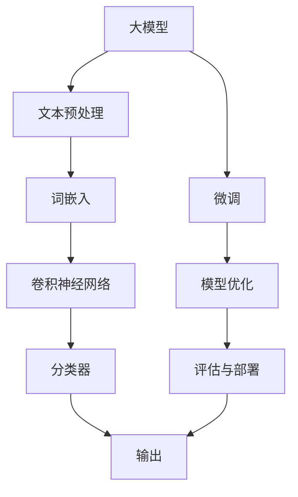

                 

# 文章标题：从零开始大模型开发与微调：使用卷积对文本分类的补充内容

> 关键词：大模型开发、文本分类、卷积神经网络、微调、机器学习

> 摘要：
本文旨在深入探讨大模型开发的基础知识，重点分析卷积神经网络（CNN）在文本分类中的应用。我们将从零开始，逐步讲解大模型的概念、开发基础、CNN的技术细节以及微调技巧，并通过实际项目案例，展示如何将理论应用于实践。文章最后还将讨论大模型开发中常见的问题及解决方法。

## 第一部分：从零开始大模型开发基础

### 第1章：大模型与文本分类概述

#### 第1.1节：大模型的概念与类型

**定义与特点**

大模型（Large Models）是指那些拥有数亿至数千亿参数的机器学习模型。这些模型通常具有以下特点：

- **参数量庞大**：大模型的参数数量远超传统机器学习模型，可以捕捉更多复杂的特征。
- **计算需求高**：由于参数量巨大，大模型在训练和推理过程中需要更多的计算资源。
- **强泛化能力**：大模型能够处理大规模数据，具有较强的泛化能力。

**类型**

- **自然语言处理（NLP）大模型**：如BERT、GPT等，主要用于文本生成、文本分类等任务。
- **计算机视觉（CV）大模型**：如ResNet、EfficientNet等，主要用于图像分类、目标检测等任务。
- **其他领域大模型**：如时间序列分析、推荐系统等领域的大型模型。

#### 第1.2节：文本分类技术概述

**文本分类的定义**

文本分类是指将文本数据按照预定的类别进行分类的过程。常见的分类任务包括垃圾邮件检测、情感分析、新闻分类等。

**分类技术**

- **传统机器学习算法**：如朴素贝叶斯、支持向量机（SVM）等。
- **深度学习模型**：如卷积神经网络（CNN）、循环神经网络（RNN）、Transformer等。
- **大模型在文本分类中的应用**：大模型在文本分类中具有显著的优势，可以处理大规模数据，提高分类准确率。

#### 第1.3节：卷积神经网络（CNN）补充内容

**CNN基础**

- **CNN的基本结构**：CNN包括卷积层、池化层和全连接层。
- **卷积与池化操作**：卷积操作用于提取特征，池化操作用于降低数据维度。

**CNN在文本分类中的应用**

- **卷积神经网络与词嵌入**：将文本数据转换为词嵌入向量，然后输入到CNN中。
- **卷积神经网络在文本分类中的实战案例**：通过实际案例展示CNN在文本分类中的应用。

### 第二部分：大模型开发实践

#### 第2章：大模型开发环境与工具

##### 第2.1节：大模型开发环境搭建

**Python环境配置**

- **Python版本要求**：确保Python版本在3.6及以上。
- **相关库的安装与配置**：安装TensorFlow或PyTorch等深度学习框架。

##### 第2.2节：大模型训练与微调

**数据预处理**

- **数据集准备**：收集和处理用于训练的数据集。
- **数据预处理方法**：包括文本清洗、分词、词嵌入等。

**模型训练**

- **训练流程**：介绍模型训练的基本流程，包括前向传播、反向传播和参数更新。
- **调参技巧**：如何选择合适的模型参数，提高模型性能。

**模型微调**

- **微调策略**：在预训练模型的基础上进行微调，适用于特定任务。
- **微调实战案例**：通过实际案例展示如何进行模型微调。

#### 第3章：卷积神经网络（CNN）在文本分类中的应用

##### 第3.1节：卷积神经网络（CNN）详解

**CNN基本概念**

- **卷积层**：通过卷积操作提取特征。
- **池化层**：通过池化操作降低数据维度。
- **激活函数**：用于增加模型的非线性。

**CNN在文本分类中的应用**

- **文本表示**：使用词嵌入技术将文本转换为向量表示。
- **CNN架构**：介绍CNN在文本分类中的架构设计。
- **实验与结果**：展示实验设计与结果分析。

### 第三部分：项目实战与案例分析

#### 第4章：项目实战一：新闻分类

##### 第4.1节：项目背景与目标

**项目背景**

新闻分类是文本分类的一个重要应用场景，可以帮助新闻网站和组织自动对新闻进行分类，提高信息检索效率。

**项目目标**

使用CNN对新闻分类数据集进行分类，实现高准确率的新闻分类。

##### 第4.2节：数据集准备

**数据集来源**

- **数据集介绍**：介绍新闻分类数据集的特点和来源。
- **数据预处理方法**：包括文本清洗、分词、词嵌入等。

##### 第4.3节：模型构建与训练

**模型构建**

- **CNN架构设计**：介绍CNN在新闻分类中的架构设计。
- **模型训练**：介绍模型训练的过程，包括数据加载、模型训练和调参技巧。

##### 第4.4节：模型评估与优化

**模型评估**

- **评估指标**：介绍常用的评估指标，如准确率、召回率等。
- **评估结果**：展示模型评估的结果。

**模型优化**

- **优化策略**：介绍如何优化模型，提高分类性能。
- **优化效果**：展示优化后的模型效果。

#### 第5章：项目实战二：社交媒体情感分析

##### 第5.1节：项目背景与目标

**项目背景**

社交媒体情感分析是分析社交媒体用户对特定事件、产品等的情感倾向，对企业和政府具有重要的参考价值。

**项目目标**

使用CNN对社交媒体情感分析数据集进行分类，实现高准确率的情感分析。

##### 第5.2节：数据集准备

**数据集来源**

- **数据集介绍**：介绍社交媒体情感分析数据集的特点和来源。
- **数据预处理方法**：包括文本清洗、分词、词嵌入等。

##### 第5.3节：模型构建与训练

**模型构建**

- **CNN架构设计**：介绍CNN在社交媒体情感分析中的架构设计。
- **模型训练**：介绍模型训练的过程，包括数据加载、模型训练和调参技巧。

##### 第5.4节：模型评估与优化

**模型评估**

- **评估指标**：介绍常用的评估指标，如准确率、召回率等。
- **评估结果**：展示模型评估的结果。

**模型优化**

- **优化策略**：介绍如何优化模型，提高分类性能。
- **优化效果**：展示优化后的模型效果。

### 第四部分：大模型开发与微调进阶

#### 第6章：大模型微调技巧

##### 第6.1节：微调策略

**数据选择**

- **微调数据集的选择标准**：选择具有代表性的数据集，提高模型泛化能力。

**模型调整**

- **模型初始化策略**：介绍如何选择合适的模型初始化方法。
- **超参数调整方法**：介绍如何调整模型超参数，提高模型性能。

##### 第6.2节：实战案例分析

**案例一：改进文本分类效果**

- **案例背景**：介绍文本分类案例的背景和目标。
- **微调方法**：介绍如何对文本分类模型进行微调。
- **实验结果分析**：展示微调后的模型效果。

**案例二：提高社交媒体情感分析准确率**

- **案例背景**：介绍社交媒体情感分析案例的背景和目标。
- **微调方法**：介绍如何对社交媒体情感分析模型进行微调。
- **实验结果分析**：展示微调后的模型效果。

### 第五部分：深入理解与拓展

#### 第7章：大模型架构与算法详解

##### 第7.1节：大模型架构

- **Transformer模型**：介绍Transformer模型的基本原理、结构与特性。
- **BERT模型**：介绍BERT模型的基本原理、结构与特性。

##### 第7.2节：大模型算法

- **自监督学习**：介绍自监督学习的基本原理与实现。
- **迁移学习**：介绍迁移学习的基本原理与实现。

#### 第8章：大模型在计算机视觉中的应用

##### 第8.1节：大模型在图像分类中的应用

- **实例分析**：介绍CNN在图像分类中的应用案例。
- **最新进展**：展示最新大模型在图像分类中的应用。

##### 第8.2节：大模型在目标检测中的应用

- **实例分析**：介绍R-CNN系列模型在目标检测中的应用案例。
- **最新进展**：展示最新大模型在目标检测中的应用。

### 附录

#### 附录A：大模型开发常用工具与资源

##### A.1 常用深度学习框架

- **TensorFlow**：介绍TensorFlow的使用方法与技巧。
- **PyTorch**：介绍PyTorch的使用方法与技巧。

##### A.2 大模型开源项目

- **OpenAI**：介绍OpenAI的大模型开源项目。
- **Hugging Face**：介绍Hugging Face的大模型开源项目。

##### A.3 大模型相关论文与资料

- **近期论文精选**：介绍大模型领域的最新研究论文。
- **经典资料**：介绍大模型领域的基础读物。

## 大模型与文本分类联系与架构 Mermaid 流程图



## 大模型开发中的数学模型与算法伪代码

#### 数学模型

- **卷积操作**

  $$ \text{Conv}(x, w) = \sum_{i=1}^{k} \sum_{j=1}^{k} x_{ij} w_{ij} $$

- **池化操作**

  $$ \text{Pooling}(x, p) = \max(x \cdot p) $$

#### 算法伪代码

- **卷积神经网络训练**

  ```python
  for epoch in range(num_epochs):
      for x, y in data_loader:
          optimizer.zero_grad()
          output = model(x)
          loss = criterion(output, y)
          loss.backward()
          optimizer.step()
  ```

- **文本分类模型微调**

  ```python
  for epoch in range(num_epochs):
      for x, y in data_loader:
          optimizer.zero_grad()
          output = model(x)
          loss = criterion(output, y)
          loss.backward()
          optimizer.step()
          if (epoch + 1) % save_interval == 0:
              torch.save(model.state_dict(), f"model_epoch_{epoch+1}.pth")
  ```

### CNN在文本分类中的应用详解

卷积神经网络（CNN）通常用于图像处理，但在文本分类任务中也表现出色。以下是CNN在文本分类中的应用详解：

#### 卷积神经网络（CNN）基本原理

**卷积层**：卷积层是CNN的核心部分，通过卷积操作提取文本特征。卷积核在文本上滑动，每次卷积操作都会提取一部分特征。

**池化层**：池化层用于降低数据维度，减少参数数量，提高模型泛化能力。常见的池化操作有最大池化和平均池化。

**全连接层**：全连接层将卷积层和池化层提取的特征映射到分类结果。

#### CNN在文本分类中的架构设计

- **词嵌入层**：将文本转换为词嵌入向量，作为输入。
- **卷积层**：卷积层用于提取局部特征。
- **池化层**：池化层用于降低特征维度。
- **全连接层**：全连接层将特征映射到分类结果。

#### CNN在文本分类中的实战案例

- **数据集**：使用新闻分类数据集进行实验。
- **模型训练**：通过训练数据训练CNN模型，并使用验证集进行调参。
- **模型评估**：使用测试集评估模型性能。

**模型构建**

```python
import tensorflow as tf

model = tf.keras.Sequential([
    tf.keras.layers.Embedding(input_dim=vocab_size, output_dim=embedding_dim, input_length=max_length),
    tf.keras.layers.Conv1D(filters=128, kernel_size=5, activation='relu'),
    tf.keras.layers.GlobalMaxPooling1D(),
    tf.keras.layers.Dense(units=10, activation='softmax')
])
```

**模型训练**

```python
model.compile(optimizer='adam', loss='categorical_crossentropy', metrics=['accuracy'])
model.fit(x_train, y_train, epochs=5, batch_size=32, validation_split=0.2)
```

**模型评估**

```python
loss, accuracy = model.evaluate(x_test, y_test)
print(f"Test accuracy: {accuracy}")
```

#### CNN在文本分类中的优缺点分析

**优点**

- **强大的特征提取能力**：CNN可以提取文本中的局部特征，适用于复杂文本分类任务。
- **适用于大规模数据**：CNN能够处理大规模数据，提高模型泛化能力。

**缺点**

- **计算量大**：卷积操作需要大量的计算资源。
- **参数调优复杂**：需要仔细调优卷积核大小、步长等超参数。
- **无法捕捉全局特征**：在处理长文本时，可能无法捕捉到全局特征。

