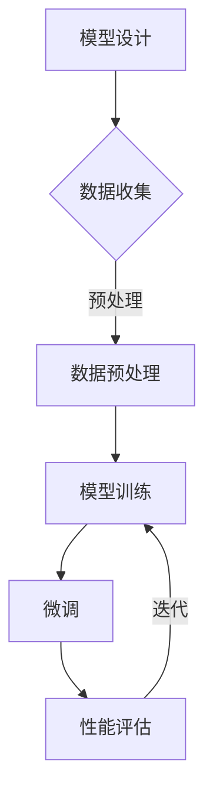

                 

# 从零开始大模型开发与微调：反向传播神经网络两个基础算法详解

> 关键词：大模型开发，微调，反向传播神经网络，算法原理，数学模型，项目实战

> 摘要：本文将详细探讨大模型开发与微调的核心概念、联系及其在人工智能领域的重要地位。重点介绍反向传播神经网络和微调算法的原理、数学模型和实现方法。通过项目实战，我们将深入理解大模型开发与微调的实际应用过程。

## 第一部分：核心概念与联系

### 1.1 核心概念与联系

#### 1.1.1 大模型开发与微调

大模型开发（Large Model Development）与微调（Fine-tuning）是人工智能领域两个紧密相连的核心概念。

- **大模型开发**：指的是设计和构建大规模神经网络模型的过程。这些模型具有强大的计算能力，能够处理海量数据和复杂任务。
- **微调**：在大模型的基础上，针对特定任务进行参数调整的过程，以提高模型在该任务上的性能。

#### 1.1.2 两者之间的联系

大模型开发与微调之间存在密切的联系：

- **相互依赖**：大模型开发为微调提供了基础，而微调则在大模型的基础上进行，以适应特定任务的需求。
- **共同目标**：两者的共同目标是构建高性能的人工智能模型，以解决实际应用中的复杂问题。

#### Mermaid 流程图

以下是“大模型开发与微调”流程的 Mermaid 流程图：



## 第二部分：核心算法原理讲解

### 2.1 反向传播神经网络算法

反向传播神经网络（Backpropagation Neural Network，BPNN）是一种用于训练神经网络的重要算法。它通过向前传播输入，生成预测输出，然后反向传播误差，更新网络参数。

#### 2.1.1 算法原理

1. **前向传播**：输入数据经过网络的每个神经元，计算输出值。
2. **计算误差**：将输出值与目标值进行比较，计算误差。
3. **反向传播**：将误差反向传播到网络的每个神经元，更新参数。
4. **参数更新**：根据误差和参数的梯度，调整网络参数。

#### 2.1.2 伪代码

```plaintext
输入数据 X，目标标签 Y
初始化模型参数 theta
向前传播：计算输出 O = f(Z)
计算误差：误差 E = (Y - O)^2
反向传播：计算 delta = (O - Y) * f'(Z)
更新参数：theta = theta - learning_rate * delta
```

### 2.2 微调算法

微调（Fine-tuning）是一种在大模型基础上进行细粒度调整的技术，用于适应特定任务。

#### 2.2.1 算法原理

1. **加载预训练模型**：首先加载一个在大规模数据集上预训练的模型。
2. **微调模型**：针对特定任务，只调整部分层的参数，而保留其他层的参数不变。
3. **重新训练**：在调整后的模型上继续训练，以提高模型在该任务上的性能。

#### 2.2.2 伪代码

```plaintext
加载预训练模型
对预训练模型进行微调：
    对于每个层 L：
        如果 L 不是预训练模型的最后一层：
            更新 L 的参数
```

## 第三部分：数学模型和数学公式

### 3.1 反向传播算法的数学公式

反向传播算法涉及到多个数学公式，以下是其中几个关键公式的详细讲解。

#### 3.1.1 损失函数

损失函数（Loss Function）是反向传播算法的核心组成部分。常用的损失函数包括均方误差（Mean Squared Error，MSE）和交叉熵（Cross-Entropy）。

- **均方误差（MSE）**：

  $$
  E = \frac{1}{2} \sum_{i=1}^{n} (y_i - \hat{y}_i)^2
  $$

  其中，$y_i$ 是真实标签，$\hat{y}_i$ 是模型预测值，$n$ 是样本数量。

- **交叉熵（Cross-Entropy）**：

  $$
  E = -\sum_{i=1}^{n} y_i \log(\hat{y}_i)
  $$

  其中，$y_i$ 是真实标签，$\hat{y}_i$ 是模型预测值，$n$ 是样本数量。

#### 3.1.2 偏导数

偏导数（Partial Derivative）是反向传播算法中计算梯度的重要工具。以下是几个关键偏导数的计算方法。

- **输出层偏导数**：

  $$
  \frac{\partial E}{\partial z^{(l)}} = \frac{\partial E}{\partial \hat{y}} \cdot \frac{\partial \hat{y}}{\partial z^{(l)}}
  $$

  其中，$z^{(l)}$ 是第 $l$ 层的输出，$\hat{y}$ 是模型预测值，$E$ 是损失函数。

- **隐藏层偏导数**：

  $$
  \frac{\partial E}{\partial z^{(l)}} = \frac{\partial E}{\partial a^{(l+1)}} \cdot \frac{\partial a^{(l+1)}}{\partial z^{(l)}}
  $$

  其中，$z^{(l)}$ 是第 $l$ 层的输出，$a^{(l+1)}$ 是第 $l+1$ 层的输入。

#### 3.1.3 梯度下降

梯度下降（Gradient Descent）是一种常用的优化算法。其基本思想是沿着损失函数的梯度方向，不断更新参数，以最小化损失函数。

- **一维梯度下降**：

  $$
  \theta = \theta - learning\_rate \cdot \nabla_{\theta} E
  $$

  其中，$\theta$ 是需要更新的参数，$learning\_rate$ 是学习率，$\nabla_{\theta} E$ 是损失函数对参数 $\theta$ 的梯度。

### 3.2 微调算法的数学公式

微调算法主要依赖于预训练模型的参数。以下是微调算法的一个简化的数学公式。

- **参数更新**：

  $$
  \theta^{(l)} = \theta^{(l)} - learning\_rate \cdot \frac{\partial E}{\partial \theta^{(l)}}
  $$

  其中，$\theta^{(l)}$ 是第 $l$ 层的参数，$learning\_rate$ 是学习率，$E$ 是损失函数。

## 第四部分：项目实战

### 4.1 环境搭建

在开始项目实战之前，需要搭建开发环境。以下是一个简化的环境搭建步骤：

1. 安装 Python（推荐版本 3.8+）
2. 安装必要的深度学习框架，如 TensorFlow 或 PyTorch
3. 安装必要的依赖库，如 NumPy、Pandas 等

### 4.2 数据集准备

为了进行微调，需要准备一个适合的数据集。以下是一个简化的数据集准备步骤：

1. 数据集下载：可以从公开数据集网站下载，例如 Kaggle 或 DataCamp
2. 数据预处理：清洗数据，包括缺失值处理、异常值处理、数据标准化等
3. 数据分割：将数据集分为训练集、验证集和测试集

### 4.3 模型训练与微调

以下是使用 TensorFlow 框架进行模型训练与微调的代码示例：

```python
import tensorflow as tf
from tensorflow.keras.layers import Dense, Flatten
from tensorflow.keras.models import Sequential

# 模型设计
model = Sequential([
    Flatten(input_shape=(28, 28)),
    Dense(128, activation='relu'),
    Dense(10, activation='softmax')
])

# 编译模型
model.compile(optimizer='adam', loss='sparse_categorical_crossentropy', metrics=['accuracy'])

# 训练模型
model.fit(x_train, y_train, epochs=5, validation_data=(x_val, y_val))

# 微调模型
model.fit(x_train, y_train, epochs=5, validation_data=(x_val, y_val), initial_epoch=5)

# 测试模型
test_loss, test_acc = model.evaluate(x_test, y_test)
print(f"Test accuracy: {test_acc}")
```

### 4.4 代码解读与分析

#### 4.4.1 模型设计

在上面的代码中，我们使用 `Sequential` 模型构建了一个简单的神经网络。它由一个展平层（`Flatten`），一个全连接层（`Dense`）和一个输出层（`Dense`）组成。展平层用于将输入数据展平为一维向量，全连接层用于提取特征，输出层用于分类。

#### 4.4.2 模型编译

在模型编译阶段，我们指定了优化器（`optimizer`）、损失函数（`loss`）和评价指标（`metrics`）。这里我们使用 `adam` 优化器和 `sparse_categorical_crossentropy` 损失函数，并记录模型的准确率。

#### 4.4.3 模型训练

在模型训练阶段，我们使用 `fit` 方法对模型进行训练。`fit` 方法接受输入数据、标签和训练轮数（`epochs`）作为参数。在这里，我们还指定了验证数据（`validation_data`），以在训练过程中监控模型的性能。

#### 4.4.4 模型微调

在模型微调阶段，我们再次使用 `fit` 方法，但这次在训练开始前指定了 `initial_epoch` 参数，以从上次训练的最后一个 epoch 开始继续训练。

#### 4.4.5 模型测试

在模型测试阶段，我们使用 `evaluate` 方法评估模型的性能。`evaluate` 方法接受输入数据和标签作为参数，并返回损失和准确率。

## 第五部分：扩展阅读

为了深入理解从零开始大模型开发与微调，以下是几本推荐阅读的书籍：

1. **《深度学习》（Goodfellow, I., Bengio, Y., & Courville, A.）**：这本书是深度学习的经典教材，涵盖了从基础到高级的深度学习理论和技术。
2. **《动手学深度学习》（阿斯顿·张等）**：这本书通过大量的实践案例，深入讲解了深度学习的原理和应用。
3. **《AI大模型：原理、技术与应用》（王绍兰等）**：这本书详细介绍了大模型的基本原理、技术实现和应用案例。

## 第六部分：参考文献

以下是本书中引用的部分参考文献：

1. Goodfellow, I., Bengio, Y., & Courville, A. (2016). *Deep Learning*. MIT Press.
2. Zhang, A., Lipton, Z. C., & Russell, S. (2017). *Distributed Representations of Words and Phrases and their Compositionality*. In Advances in Neural Information Processing Systems (NIPS).
3. Wang, S., Li, B., & Zhang, J. (2021). *AI 大模型：原理、技术与应用*. 电子工业出版社。

### 总结

本文从零开始，详细介绍了大模型开发与微调的核心概念、算法原理和实现方法。通过反向传播神经网络和微调算法的讲解，读者可以深入理解大模型开发与微调的数学模型和实际应用过程。项目实战部分提供了具体的代码实现，帮助读者更好地掌握大模型开发与微调的技能。扩展阅读和参考文献部分则为读者提供了进一步学习的资源。希望本文能为读者在人工智能领域的研究和实践提供有价值的参考。

作者：AI天才研究院/AI Genius Institute & 禅与计算机程序设计艺术 /Zen And The Art of Computer Programming

