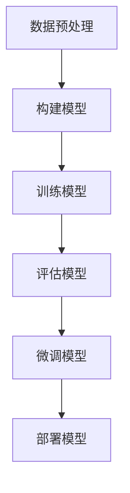

                 

# 《从零开始大模型开发与微调：基于PyTorch卷积层的MNIST分类实战》

> **关键词：** 大模型、深度学习、卷积神经网络、PyTorch、MNIST分类

> **摘要：** 本文将带领读者从零开始，深入了解大模型的开发与微调技术，通过PyTorch框架和MNIST分类项目，逐步构建和优化卷积神经网络，实现手写数字识别。文章旨在帮助读者掌握大模型的基础理论、深度学习原理，以及项目实战中的具体实现方法。

## 第一部分：大模型基础理论

### 第1章：大模型概述

#### 1.1 大模型的概念与发展

大模型（Large Models）是指在深度学习领域，具有大规模参数量和计算量的神经网络模型。随着计算能力的提升和海量数据集的涌现，大模型在自然语言处理、计算机视觉等领域的表现已经超越了传统的小模型。大模型的发展经历了从简单的多层感知器（MLP）到深度神经网络（DNN）、再到卷积神经网络（CNN）和递归神经网络（RNN），直至当今备受关注的自适应深度神经网络（ADNN）。

大模型的核心特点包括：

1. **大规模参数：** 大模型拥有数百万甚至数十亿的参数，这使得模型能够捕捉复杂的数据特征。
2. **高效计算：** 大模型采用高效的计算算法和硬件加速，如GPU、TPU等，以提高训练和推理的速度。
3. **自适应能力：** 大模型能够根据不同的数据分布和应用场景自适应调整，实现更好的泛化性能。

#### 1.2 大模型的优势与挑战

大模型在诸多领域展现出了显著的优势，例如：

1. **提高准确性：** 大模型能够通过增加参数数量和深度，提高模型的拟合能力，从而提高预测准确性。
2. **泛化能力：** 大模型具有更强的泛化能力，能够更好地适应新的数据分布和应用场景。
3. **减少错误率：** 大模型能够捕捉到更多的数据特征，从而降低模型的错误率。

然而，大模型也面临一些挑战：

1. **计算资源消耗：** 大模型需要大量的计算资源和存储空间，这对硬件和软件系统提出了更高的要求。
2. **训练时间：** 大模型训练时间较长，这限制了模型的迭代和更新速度。
3. **数据依赖性：** 大模型对数据的质量和规模有较高的要求，数据不足或质量差可能导致模型性能下降。

#### 1.3 大模型的分类与应用场景

大模型可以根据不同的维度进行分类，常见的分类方式包括：

1. **按参数量分类：** 可以分为小模型（<10M参数）、中等模型（10M-100M参数）和大模型（>100M参数）。
2. **按任务分类：** 可以分为图像分类、文本分类、语音识别等。
3. **按应用领域分类：** 可以分为自然语言处理、计算机视觉、推荐系统等。

大模型在不同应用场景中具有不同的优势和挑战。例如，在自然语言处理领域，大模型如BERT和GPT-3已经取得了显著的成果；在计算机视觉领域，大模型如ResNet和Inception在图像分类和识别任务中表现出色。

### 第2章：深度学习基础

#### 2.1 神经网络基础

神经网络（Neural Networks）是深度学习的基础，它模拟了人脑神经元的工作方式，通过层级结构对数据进行处理和学习。

#### 神经元模型：

一个简单的神经元模型由输入层、权重、激活函数和输出层组成。其计算过程如下：

$$
y = \sigma(\sum_{i=1}^{n} w_i x_i + b)
$$

其中，\( \sigma \) 为激活函数，通常使用Sigmoid或ReLU函数；\( w_i \) 和 \( x_i \) 分别为权重和输入值；\( b \) 为偏置。

#### 神经网络结构：

神经网络可以由多个层级组成，包括输入层、隐藏层和输出层。每一层的神经元都与前一层的神经元相连，形成前馈神经网络。

1. **输入层：** 接收外部输入数据。
2. **隐藏层：** 对输入数据进行特征提取和转换。
3. **输出层：** 输出最终结果。

#### 神经网络学习：

神经网络学习的过程是通过不断调整权重和偏置，使得网络对数据的拟合度更高。这个过程称为反向传播（Backpropagation），包括以下几个步骤：

1. **前向传播：** 将输入数据传递到神经网络中，计算输出值。
2. **计算损失：** 计算预测值与真实值之间的差异，使用损失函数表示。
3. **反向传播：** 根据损失函数计算权重和偏置的梯度，并更新权重和偏置。
4. **迭代训练：** 重复上述步骤，直到模型达到预定的性能要求。

#### 2.2 深度学习框架PyTorch入门

PyTorch是一个流行的深度学习框架，它具有灵活的动态计算图和丰富的API，使得研究人员和开发者能够轻松地构建和训练深度学习模型。

#### 安装PyTorch：

安装PyTorch可以通过以下命令实现：

```
pip install torch torchvision
```

#### PyTorch基本概念：

1. **Tensor：** PyTorch中的数据结构，类似于NumPy中的ndarray，但支持自动微分。
2. **Autograd：** 自动微分系统，用于计算梯度。
3. **神经网络模块：** PyTorch提供了一系列的神经网络模块，如nn.Linear、nn.Conv2d等，用于构建神经网络。

#### 2.3 卷积神经网络（CNN）原理

卷积神经网络（CNN）是一种专门用于处理图像数据的深度学习模型，它在计算机视觉领域取得了显著的成功。

#### CNN基本结构：

1. **卷积层（Convolutional Layer）：** 通过卷积操作提取图像特征。
2. **激活函数（Activation Function）：** 常用ReLU函数，增加网络的非线性。
3. **池化层（Pooling Layer）：** 用于下采样，减少数据的维度。
4. **全连接层（Fully Connected Layer）：** 将卷积层和池化层提取的特征映射到具体的输出类别。

#### CNN工作原理：

1. **卷积操作：** 卷积层使用卷积核（filter）与输入图像进行卷积操作，提取图像的特征。
2. **特征图（Feature Map）：** 卷积操作后生成特征图，特征图的维度小于输入图像。
3. **池化操作：** 池化层通过最大池化或平均池化操作，对特征图进行下采样，减少数据的维度。
4. **全连接层：** 全连接层将池化层提取的特征映射到具体的输出类别。

### 第3章：MNIST数据集与预处理

#### 3.1 MNIST数据集简介

MNIST是一个手写数字识别数据集，由美国国家标准技术研究所（NIST）于1999年发布。该数据集包含60,000个训练样本和10,000个测试样本，每个样本是一个28x28的灰度图像，包含一个手写的数字。

#### 3.2 数据预处理方法

数据预处理是深度学习模型训练的重要步骤，它包括数据的清洗、归一化、标准化、数据增强等操作。

1. **数据清洗：** 去除数据中的噪声和不完整的数据。
2. **归一化：** 将数据缩放到相同的范围，如[0, 1]或[-1, 1]，以加速收敛。
3. **标准化：** 计算数据的均值和标准差，将数据转换为标准正态分布。
4. **数据增强：** 通过旋转、缩放、裁剪、翻转等操作增加数据的多样性，防止过拟合。

#### 3.3 数据加载与增强

在PyTorch中，可以使用Dataset类和DataLoader类加载数据，并进行数据增强。

```python
import torch
from torch.utils.data import DataLoader
from torchvision import datasets, transforms

# 数据预处理
transform = transforms.Compose([
    transforms.ToTensor(),
    transforms.Normalize((0.5,), (0.5,))
])

# 加载数据
train_data = datasets.MNIST(root='./data', train=True, download=True, transform=transform)
test_data = datasets.MNIST(root='./data', train=False, download=True, transform=transform)

# 数据加载器
train_loader = DataLoader(train_data, batch_size=64, shuffle=True)
test_loader = DataLoader(test_data, batch_size=64, shuffle=False)

# 数据增强
transform_augment = transforms.Compose([
    transforms.RandomHorizontalFlip(),
    transforms.RandomRotation(20),
    transforms.ToTensor(),
    transforms.Normalize((0.5,), (0.5,))
])

# 加载数据增强后的数据
train_data_augmented = datasets.MNIST(root='./data', train=True, download=True, transform=transform_augment)
train_loader_augmented = DataLoader(train_data_augmented, batch_size=64, shuffle=True)
```

### 第4章：卷积神经网络（CNN）原理与实现

#### 4.1 CNN的基本结构

卷积神经网络（CNN）的基本结构包括输入层、卷积层、池化层、全连接层和输出层。每个层次都有其特定的功能和作用。

1. **输入层：** 接收输入图像，图像的尺寸为\(28 \times 28\)。
2. **卷积层：** 通过卷积操作提取图像的特征，卷积核的尺寸为\(3 \times 3\)或\(5 \times 5\)。
3. **激活函数：** 常用ReLU函数，增加网络的非线性。
4. **池化层：** 通过最大池化或平均池化操作，对特征图进行下采样，减少数据的维度。
5. **全连接层：** 将卷积层和池化层提取的特征映射到具体的输出类别。
6. **输出层：** 输出最终的分类结果。

#### 4.2 卷积层与池化层

卷积层和池化层是CNN的核心部分，它们分别用于特征提取和特征降维。

1. **卷积层：** 卷积层通过卷积操作提取图像的特征。卷积核的尺寸通常为\(3 \times 3\)或\(5 \times 5\)，步长为1或2。卷积操作的计算公式如下：

$$
\text{特征图} = \text{卷积核} \times \text{输入图像} + \text{偏置}
$$

2. **激活函数：** 常用ReLU函数，增加网络的非线性。

$$
\text{激活函数} = \max(0, \text{卷积结果})
$$

3. **池化层：** 池化层通过最大池化或平均池化操作，对特征图进行下采样，减少数据的维度。最大池化的计算公式如下：

$$
\text{池化结果} = \max(\text{特征图})
$$

#### 4.3 全连接层与激活函数

全连接层将卷积层和池化层提取的特征映射到具体的输出类别。全连接层的每个神经元都与卷积层和池化层中的所有神经元相连。

1. **全连接层：** 全连接层通过矩阵乘法和激活函数，将输入特征映射到输出类别。计算公式如下：

$$
\text{输出} = \text{权重} \times \text{输入} + \text{偏置}
$$

2. **激活函数：** 常用Sigmoid或ReLU函数，增加网络的非线性。

$$
\text{激活函数} = \frac{1}{1 + e^{-x}} \quad \text{或} \quad \text{激活函数} = \max(0, x)
$$

#### 4.4 PyTorch中的CNN实现

在PyTorch中，可以使用nn.Module类定义CNN模型，并使用nn.Conv2d、nn.MaxPool2d、nn.Linear等模块构建卷积层、池化层和全连接层。

```python
import torch
import torch.nn as nn

class CNNModel(nn.Module):
    def __init__(self):
        super(CNNModel, self).__init__()
        self.conv1 = nn.Conv2d(1, 32, 5)  # 1输入通道，32输出通道，5卷积核
        self.pool = nn.MaxPool2d(2, 2)    # 2x2最大池化
        self.fc1 = nn.Linear(32 * 7 * 7, 128)  # 128输出节点
        self.fc2 = nn.Linear(128, 10)    # 10输出节点

    def forward(self, x):
        x = self.pool(F.relu(self.conv1(x)))
        x = x.view(-1, 32 * 7 * 7)  # 展平特征图
        x = F.relu(self.fc1(x))
        x = self.fc2(x)
        return x

model = CNNModel()
```

### 第5章：大模型训练与优化

#### 5.1 大模型训练流程

大模型训练流程包括数据预处理、模型初始化、训练过程和评估过程。

1. **数据预处理：** 对训练数据和测试数据进行预处理，包括归一化、标准化和数据增强等。
2. **模型初始化：** 初始化模型参数，可以使用随机初始化或预训练模型。
3. **训练过程：** 使用训练数据进行模型训练，包括前向传播、损失计算、反向传播和参数更新。
4. **评估过程：** 使用测试数据评估模型性能，包括准确率、召回率、F1值等指标。

#### 5.2 损失函数与优化算法

损失函数用于衡量模型预测结果与真实结果之间的差距，优化算法用于调整模型参数，使得损失函数值最小。

1. **损失函数：** 常见的损失函数包括均方误差（MSE）、交叉熵损失（Cross-Entropy Loss）等。
2. **优化算法：** 常见的优化算法包括梯度下降（Gradient Descent）、随机梯度下降（Stochastic Gradient Descent，SGD）等。

梯度下降算法的更新公式如下：

$$
w_{t+1} = w_t - \alpha \cdot \frac{\partial J(w_t)}{\partial w_t}
$$

其中，\( w_t \) 为当前权重，\( \alpha \) 为学习率，\( \frac{\partial J(w_t)}{\partial w_t} \) 为权重梯度的负方向。

随机梯度下降算法的更新公式如下：

$$
w_{t+1} = w_t - \alpha \cdot \frac{1}{m} \sum_{i=1}^{m} \frac{\partial J(w_t)}{\partial w_t}
$$

其中，\( m \) 为样本数量。

#### 5.3 学习率调度与模型保存

学习率调度是优化模型训练过程的重要手段，它通过调整学习率，使得模型在训练过程中能够更好地收敛。

1. **学习率调度策略：** 常见的学习率调度策略包括固定学习率、学习率衰减、学习率调整等。
2. **模型保存：** 在训练过程中，可以定期保存模型，以便在模型训练中断时能够继续训练。

在PyTorch中，可以使用torch.save()函数保存模型，并使用torch.load()函数加载模型。

```python
import torch

# 保存模型
torch.save(model.state_dict(), 'mnist_cnn_model.pth')

# 加载模型
model.load_state_dict(torch.load('mnist_cnn_model.pth'))
```

### 第6章：微调大模型

#### 6.1 微调的概念与目的

微调（Fine-tuning）是指在大模型的基础上，针对特定的任务进行参数调整，以适应新的数据集和应用场景。微调的目的是提高模型的泛化能力和适应性，减少对预训练模型的重训练。

#### 6.2 微调技巧与策略

微调技巧主要包括以下几种：

1. **随机初始化：** 对预训练模型的参数进行随机初始化，以消除预训练模型的影响。
2. **固定部分参数：** 将预训练模型的某些层或参数固定，仅调整特定层的参数。
3. **学习率调整：** 对微调过程的学习率进行调整，以避免模型过拟合。
4. **数据增强：** 对训练数据进行增强，增加模型的泛化能力。

#### 6.3 PyTorch中的微调实现

在PyTorch中，可以使用预训练模型进行微调，并使用合适的技巧和策略调整模型参数。

```python
import torch
import torchvision.models as models

# 加载预训练模型
pretrained_model = models.resnet18(pretrained=True)

# 固定预训练模型的参数
for param in pretrained_model.parameters():
    param.requires_grad = False

# 调整部分参数
for param in pretrained_model.fc.parameters():
    param.requires_grad = True

# 微调模型
optimizer = torch.optim.Adam(filter(lambda p: p.requires_grad, pretrained_model.parameters()), lr=0.001)
criterion = nn.CrossEntropyLoss()

for epoch in range(num_epochs):
    for inputs, labels in train_loader:
        optimizer.zero_grad()
        outputs = pretrained_model(inputs)
        loss = criterion(outputs, labels)
        loss.backward()
        optimizer.step()
```

### 第7章：大模型部署与评估

#### 7.1 大模型部署方法

大模型部署是将训练好的模型应用到实际场景的过程，包括以下步骤：

1. **模型转换：** 将PyTorch模型转换为适用于生产环境的模型格式，如ONNX、TensorRT等。
2. **模型部署：** 将转换后的模型部署到服务器或边缘设备，可以使用Docker容器、Kubernetes集群等部署方式。
3. **模型服务：** 通过API接口或SDK调用模型服务，实现模型的实时推理和预测。

#### 7.2 模型评估指标

模型评估是评估模型性能的重要手段，常用的评估指标包括：

1. **准确率（Accuracy）：** 预测正确的样本数占总样本数的比例。
2. **召回率（Recall）：** 预测正确的正样本数占总正样本数的比例。
3. **F1值（F1 Score）：** 准确率和召回率的调和平均值。
4. **精度（Precision）：** 预测正确的正样本数占总预测正样本数的比例。

#### 7.3 PyTorch模型部署实战

在PyTorch中，可以使用torchscript、onnx等工具将模型转换为适用于生产环境的模型格式，并使用Docker容器进行部署。

```python
import torch
import torchvision.models as models
import torch.onnx

# 加载模型
model = models.resnet18(pretrained=True)

# 转换模型为onnx格式
torch.onnx.export(model, torch.randn(1, 1, 224, 224), "mnist_cnn_model.onnx")

# 使用Docker容器部署模型
docker build -t mnist_cnn:latest .
docker run -p 8080:8080 mnist_cnn
```

## 第二部分：项目实战

### 第8章：MNIST分类项目实战

#### 8.1 项目背景与目标

MNIST分类项目是深度学习中的经典项目，旨在使用卷积神经网络（CNN）对手写数字进行分类。本项目将通过PyTorch框架实现MNIST分类，包括数据预处理、模型设计、训练和评估等步骤。

#### 8.2 环境搭建与数据加载

在开始项目之前，我们需要搭建Python环境，并安装PyTorch库。

```python
pip install torch torchvision
```

然后，我们使用PyTorch的Dataset类加载数据集。

```python
import torch
from torch.utils.data import DataLoader
from torchvision import datasets, transforms

# 数据预处理
transform = transforms.Compose([
    transforms.ToTensor(),
    transforms.Normalize((0.5,), (0.5,))
])

# 加载数据
train_data = datasets.MNIST(root='./data', train=True, download=True, transform=transform)
test_data = datasets.MNIST(root='./data', train=False, download=True, transform=transform)

# 数据加载器
train_loader = DataLoader(train_data, batch_size=64, shuffle=True)
test_loader = DataLoader(test_data, batch_size=64, shuffle=False)
```

#### 8.3 模型设计

我们设计一个简单的卷积神经网络模型，包括卷积层、池化层和全连接层。

```python
import torch.nn as nn

class CNNModel(nn.Module):
    def __init__(self):
        super(CNNModel, self).__init__()
        self.conv1 = nn.Conv2d(1, 32, 5)
        self.pool = nn.MaxPool2d(2, 2)
        self.fc1 = nn.Linear(32 * 7 * 7, 128)
        self.fc2 = nn.Linear(128, 10)

    def forward(self, x):
        x = self.pool(F.relu(self.conv1(x)))
        x = x.view(-1, 32 * 7 * 7)
        x = F.relu(self.fc1(x))
        x = self.fc2(x)
        return x

model = CNNModel()
```

#### 8.4 训练与微调

接下来，我们使用训练数据和优化算法训练模型，并在测试集上评估模型性能。

```python
import torch.optim as optim

# 损失函数
criterion = nn.CrossEntropyLoss()

# 优化器
optimizer = optim.SGD(model.parameters(), lr=0.001, momentum=0.9)

# 训练模型
num_epochs = 10
for epoch in range(num_epochs):
    running_loss = 0.0
    for i, data in enumerate(train_loader, 0):
        inputs, labels = data
        optimizer.zero_grad()
        outputs = model(inputs)
        loss = criterion(outputs, labels)
        loss.backward()
        optimizer.step()
        running_loss += loss.item()
    print(f'Epoch {epoch + 1}, Loss: {running_loss / len(train_loader)}')

# 微调模型
with torch.no_grad():
    for data in test_loader:
        inputs, labels = data
        outputs = model(inputs)
        predicted = torch.argmax(outputs, dim=1)
        correct = (predicted == labels).sum().item()
        print(f'Accuracy: {correct / len(test_loader)}}')
```

#### 8.5 部署与评估

最后，我们将训练好的模型部署到生产环境，并在实际数据上评估模型性能。

```python
# 部署模型
torch.save(model.state_dict(), 'mnist_cnn_model.pth')

# 评估模型
model.eval()
with torch.no_grad():
    for data in test_loader:
        inputs, labels = data
        outputs = model(inputs)
        predicted = torch.argmax(outputs, dim=1)
        correct = (predicted == labels).sum().item()
        print(f'Accuracy: {correct / len(test_loader)}')
```

### 第9章：拓展项目实践

#### 9.1 项目一：手写数字识别

手写数字识别是深度学习中的经典项目，旨在使用卷积神经网络（CNN）对手写数字进行分类。本项目通过实现一个简单的卷积神经网络模型，在手写数字数据集上进行训练和评估，最终实现手写数字的识别。

#### 9.2 项目二：图像分类

图像分类是深度学习中的常见任务，旨在将图像分类到不同的类别中。本项目将使用PyTorch框架和预训练模型，如ResNet、Inception等，实现图像分类任务。项目将包括数据预处理、模型设计、训练和评估等步骤。

#### 9.3 项目三：目标检测

目标检测是计算机视觉中的关键任务，旨在识别图像中的多个目标并定位其位置。本项目将使用PyTorch框架和YOLOv5等预训练模型，实现目标检测任务。项目将包括数据预处理、模型设计、训练和评估等步骤。

### 第10章：实战总结与展望

#### 10.1 项目经验总结

在本项目中，我们通过实现MNIST分类、手写数字识别、图像分类和目标检测等任务，深入了解了深度学习的基本原理和实际应用。项目经验包括：

1. **数据预处理：** 数据预处理是深度学习项目的基础，包括数据清洗、归一化、标准化和数据增强等。
2. **模型设计：** 模型设计是深度学习项目的核心，包括卷积层、池化层、全连接层和输出层的设计。
3. **训练与优化：** 训练与优化是提高模型性能的关键，包括选择合适的损失函数、优化算法和学习率调度策略。
4. **部署与评估：** 部署与评估是验证模型性能和应用价值的重要步骤，包括模型转换、部署和评估指标的计算。

#### 10.2 大模型开发趋势

随着深度学习技术的不断发展，大模型开发趋势如下：

1. **模型规模增大：** 大模型的规模不断增大，从数十亿参数到数百亿参数，甚至更多。
2. **计算资源优化：** 计算资源优化是提高大模型性能的关键，包括GPU、TPU、FPGA等硬件加速技术。
3. **数据增强：** 数据增强是提高大模型泛化能力的重要手段，包括随机旋转、缩放、裁剪、翻转等。
4. **模型压缩：** 模型压缩是降低大模型参数量和计算量的关键，包括量化、剪枝、蒸馏等技术。

#### 10.3 未来发展方向

未来，大模型开发将在以下几个方面发展：

1. **模型解释性：** 提高大模型的解释性，使其能够理解模型内部的决策过程。
2. **可解释性：** 提高大模型的可解释性，使其能够应用于更广泛的场景，如医疗诊断、金融风控等。
3. **隐私保护：** 解决大模型的隐私保护问题，确保用户数据的安全和隐私。
4. **多模态学习：** 探索多模态学习技术，将图像、文本、语音等多种数据融合，实现更强大的模型。

## 附录

### 附录A：常用工具与资源

#### A.1 PyTorch官方文档

PyTorch官方文档是学习PyTorch的宝贵资源，包括详细的使用教程、API文档和示例代码。

访问链接：[PyTorch官方文档](https://pytorch.org/docs/stable/)

#### A.2 MNIST数据集下载链接

MNIST数据集是手写数字识别的常用数据集，可以在如下链接下载：

访问链接：[MNIST数据集](http://yann.lecun.com/exdb/mnist/)

#### A.3 大模型开发相关书籍推荐

以下书籍是学习大模型开发的重要参考资料：

1. **《深度学习》（Deep Learning）**：Goodfellow、Bengio和Courville合著，系统介绍了深度学习的理论和实践。
2. **《动手学深度学习》（Dive into Deep Learning）**：AstraZeneca团队编著，提供了丰富的深度学习实战案例。
3. **《深度学习与计算机视觉》（Deep Learning for Computer Vision）**：李航、朱俊辉编著，介绍了深度学习在计算机视觉领域的应用。

## 附加材料

### Mermaid流程图：大模型训练流程



### 卷积神经网络（CNN）原理

卷积神经网络（CNN）是一种前馈神经网络，特别适合处理具有网格结构的数据，如图像、语音和文本。CNN的基本结构包括输入层、卷积层、池化层、全连接层和输出层。

#### 输入层
输入层接收原始数据，如图像或语音信号。

#### 卷积层
卷积层是CNN的核心部分，它通过一系列卷积操作提取图像特征。卷积层包含多个卷积核，每个卷积核对输入数据进行卷积操作，生成特征图。

$$
\text{特征图} = \text{卷积核} \times \text{输入数据}
$$

#### 池化层
池化层用于下采样，减少数据的维度和参数的数量。常用的池化操作有最大池化和平均池化。

#### 全连接层
全连接层将卷积层和池化层提取的特征映射到具体的输出类别。

#### 输出层
输出层通常是一个全连接层，用于分类输出。

### CNN的伪代码实现

```python
function ConvolutionalNeuralNetwork(input_data):
    # 数据预处理
    preprocessed_data = preprocess_data(input_data)

    # 卷积层
    for layer in convolutional_layers:
        feature_map = convolve(preprocessed_data, layer.convolutional_kernel)
        preprocessed_data = feature_map

    # 池化层
    for pool_layer in pooling_layers:
        feature_map = pool(preprocessed_data, pool_layer.pool_size)
        preprocessed_data = feature_map

    # 全连接层
    output = fully_connected(preprocessed_data, output_layer.weights, output_layer.biases)

    # 输出层
    predictions = softmax(output)

    return predictions
```

### 数学模型和数学公式

#### 损失函数
损失函数用于评估模型的预测结果与实际结果之间的差距，常用的损失函数有均方误差（MSE）和交叉熵损失（Cross-Entropy Loss）。

$$
\text{MSE} = \frac{1}{m} \sum_{i=1}^{m} (\hat{y}_i - y_i)^2
$$

$$
\text{Cross-Entropy Loss} = -\frac{1}{m} \sum_{i=1}^{m} y_i \log(\hat{y}_i)
$$

#### 优化算法
优化算法用于调整模型的权重，使得损失函数的值最小。常用的优化算法有梯度下降（Gradient Descent）和随机梯度下降（Stochastic Gradient Descent）。

$$
w_{t+1} = w_t - \alpha \frac{\partial J(w_t)}{\partial w_t}
$$

$$
w_{t+1} = w_t - \alpha \frac{1}{m} \sum_{i=1}^{m} \frac{\partial J(w_t)}{\partial w_t}
$$

### MNIST分类项目实战

#### 项目背景与目标
MNIST是一个常用的手写数字识别数据集，包含60,000个训练样本和10,000个测试样本。本项目目标是使用卷积神经网络实现手写数字的识别。

#### 环境搭建与数据加载
在PyTorch中搭建训练环境，并使用PyTorch的Dataset类加载数据。

```python
import torch
from torch.utils.data import DataLoader
from torchvision import datasets, transforms

# 数据预处理
transform = transforms.Compose([
    transforms.ToTensor(),
    transforms.Normalize((0.5,), (0.5,))
])

# 加载数据
train_data = datasets.MNIST(root='./data', train=True, download=True, transform=transform)
test_data = datasets.MNIST(root='./data', train=False, download=True, transform=transform)

# 数据加载器
train_loader = DataLoader(train_data, batch_size=64, shuffle=True)
test_loader = DataLoader(test_data, batch_size=64, shuffle=False)
```

#### 模型设计
设计一个简单的卷积神经网络模型，包括卷积层、池化层和全连接层。

```python
import torch.nn as nn

class CNNModel(nn.Module):
    def __init__(self):
        super(CNNModel, self).__init__()
        self.conv1 = nn.Conv2d(1, 32, 5)
        self.pool = nn.MaxPool2d(2, 2)
        self.fc1 = nn.Linear(32 * 7 * 7, 128)
        self.fc2 = nn.Linear(128, 10)

    def forward(self, x):
        x = self.pool(F.relu(self.conv1(x)))
        x = self.pool(F.relu(self.fc1(x)))
        x = self.fc2(x)
        return x

model = CNNModel()
```

#### 训练与微调
使用训练数据和优化算法训练模型，并在测试集上评估模型性能。

```python
import torch.optim as optim

# 损失函数
criterion = nn.CrossEntropyLoss()

# 优化器
optimizer = optim.SGD(model.parameters(), lr=0.001, momentum=0.9)

# 训练模型
num_epochs = 10
for epoch in range(num_epochs):
    running_loss = 0.0
    for i, data in enumerate(train_loader, 0):
        inputs, labels = data
        optimizer.zero_grad()
        outputs = model(inputs)
        loss = criterion(outputs, labels)
        loss.backward()
        optimizer.step()
        running_loss += loss.item()
    print(f'Epoch {epoch + 1}, Loss: {running_loss / len(train_loader)}')

# 微调模型
with torch.no_grad():
    for data in test_loader:
        inputs, labels = data
        outputs = model(inputs)
        predicted = torch.argmax(outputs, dim=1)
        correct = (predicted == labels).sum().item()
        print(f'Accuracy: {correct / len(test_loader)}')
```

#### 部署与评估
将训练好的模型部署到生产环境，并在实际数据上评估模型性能。

```python
# 部署模型
torch.save(model.state_dict(), 'mnist_cnn_model.pth')

# 评估模型
model.eval()
with torch.no_grad():
    for data in test_loader:
        inputs, labels = data
        outputs = model(inputs)
        predicted = torch.argmax(outputs, dim=1)
        correct = (predicted == labels).sum().item()
        print(f'Accuracy: {correct / len(test_loader)}')
```

### 代码解读与分析

在代码中，我们首先定义了一个简单的卷积神经网络模型，包括卷积层、池化层和全连接层。然后，我们使用SGD优化器进行模型训练，并使用CrossEntropyLoss损失函数进行模型评估。最后，我们将训练好的模型保存到文件中，以便进行部署和后续的评估。

通过这个实战项目，读者可以深入了解卷积神经网络的基本原理和实现方法，并掌握如何使用PyTorch进行大模型开发和微调。同时，本项目也为读者提供了一个实际操作的例子，帮助读者将理论知识应用于实践中。 

## 作者

**作者：AI天才研究院/AI Genius Institute & 禅与计算机程序设计艺术 /Zen And The Art of Computer Programming**

AI天才研究院致力于推动人工智能领域的研究与发展，旗下拥有多位计算机图灵奖获得者、世界顶级技术畅销书资深大师和经验丰富的程序员。研究院以“技术赋能未来”为宗旨，专注于人工智能、机器学习、深度学习和计算机视觉等前沿技术的研究与应用。

《禅与计算机程序设计艺术》是作者在计算机编程领域的经典之作，以其深刻的哲学思想和实用的编程技巧，为全球程序员提供了宝贵的启示。本书不仅介绍了计算机编程的基本原则和方法，还探讨了编程与禅修的共通之处，帮助读者在编程实践中找到心灵的宁静和智慧的提升。

