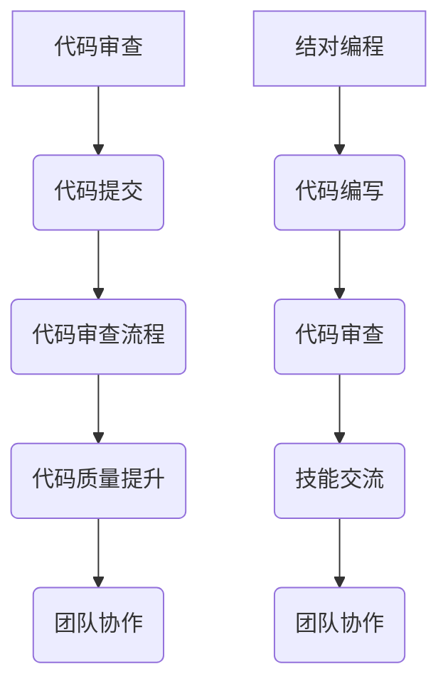

                 

### 文章标题

《代码审查与结对编程原理与代码实战案例讲解》

### 关键词

代码审查，结对编程，软件开发，协作，代码质量，流程，工具，案例分析，算法，数学模型，项目实战。

### 摘要

本文深入探讨了代码审查与结对编程两种重要的软件开发协作方式。首先，我们概述了代码审查与结对编程的核心概念和原理，包括它们的基本概念、目的、分类、流程和技术。接着，通过详细的分析和算法原理讲解，揭示了代码审查的数学模型和核心算法，以及结对编程的协同编辑和实时代码审查算法。此外，我们还通过实际项目案例，展示了代码审查与结对编程在实际软件开发中的应用和效果，为开发者提供了实用的指导。最后，对代码审查与结对编程的未来发展趋势进行了展望，探讨了新技术和新模式可能带来的变革。本文旨在帮助读者全面理解代码审查与结对编程的原理和实践，提高软件开发效率和代码质量。

#### # 第一部分：代码审查与结对编程概述

在软件开发领域，代码审查（Code Review）和结对编程（Pair Programming）是两种广泛应用的协作方式，它们在提高代码质量、促进团队协作和知识共享方面发挥着重要作用。本文将首先介绍代码审查与结对编程的基本概念、目的、类型和实施策略，为读者提供对这两种协作方式的全面了解。

### 第1章：代码审查与结对编程的核心概念

#### 1.1 代码审查的定义与重要性

**代码审查的基本概念：** 代码审查是一种团队协作的过程，通过集体评审代码来提高代码质量、减少错误、确保代码的规范性和一致性。它通常包括形式审查、功能审查和单元测试审查等类型。

**代码审查的目的与益处：** 代码审查的主要目的是确保代码的质量和安全性，提高软件开发的效率，以及促进团队成员之间的沟通和知识共享。通过代码审查，可以发现潜在的问题、提高代码的可读性和可维护性，减少后期修复的成本。

**代码审查的分类与流程：** 代码审查可以分为形式审查、功能审查和单元测试审查。形式审查主要检查代码的格式、命名规范和编码标准；功能审查主要检查代码的功能是否满足需求；单元测试审查主要检查单元测试的覆盖率和测试效果。

#### 1.2 结对编程的定义与实施

**结对编程的基本概念：** 结对编程是指两名开发人员共享一台计算机，同时工作在一个软件项目上，一名编写代码，另一名进行代码审查。它通常有两种模式：轮换模式和固定模式。

**结对编程的优点与挑战：** 结对编程的优点包括提高代码质量、加速开发过程、促进团队成员之间的技能交流和团队协作。然而，它也面临一些挑战，如适应期较长、心理压力较大和沟通成本较高等。

**结对编程的模式与策略：** 结对编程的模式主要包括轮换模式和固定模式。轮换模式是指开发人员轮流担任编码者和审查者；固定模式是指开发人员固定担任编码者和审查者。策略方面，关键在于建立良好的沟通机制、分工合作和及时反馈。

### 第2章：代码审查的技术与实践

在本章中，我们将深入探讨代码审查的技术和实践，包括代码审查工具与技术、代码审查的流程与最佳实践，以及代码审查的团队协作与沟通技巧。

#### 2.1 代码审查工具与技术

**代码审查工具的选择与使用：** 代码审查工具可以帮助团队更高效地进行代码审查。常见的代码审查工具有Gerrit、Review Board、Phabricator等。选择合适的工具时，需要考虑团队的需求、工具的易用性和兼容性。

**代码质量评估指标的设定：** 代码质量评估指标是衡量代码质量的重要工具。常见的评估指标包括代码复杂度、代码重复率、注释率、单元测试覆盖率等。通过设定合理的评估指标，可以帮助团队更好地评估代码质量。

**代码审查的自动化与智能化：** 自动化与智能化是提高代码审查效率的重要手段。通过使用静态代码分析工具和智能代码审查系统，可以自动发现潜在的问题和缺陷，提高代码审查的准确性和效率。

#### 2.2 代码审查的流程与最佳实践

**代码审查的阶段性流程：** 代码审查通常分为多个阶段，包括代码提交、代码审查、反馈与修复、再次审查等。每个阶段都有明确的任务和目标，确保代码审查的全面性和有效性。

**代码审查的团队协作：** 团队协作是代码审查成功的关键。团队成员需要明确各自的职责和角色，保持良好的沟通和合作，确保代码审查的顺利进行。

**代码审查的沟通技巧：** 沟通是代码审查的重要组成部分。有效的沟通可以提高代码审查的效果，减少误解和冲突。团队成员需要学会倾听、表达和反馈，确保沟通的顺畅和高效。

#### 2.3 结对编程实践与案例分析

**结对编程的实践过程：** 结对编程的实践过程包括确定开发目标、分配任务、同步编辑、代码审查和反馈等步骤。每个步骤都需要团队成员的共同努力和协作。

**结对编程的角色分工：** 结对编程中的角色分工通常包括编码者和审查者。编码者负责编写代码，审查者负责审查代码的质量和安全性。合理的角色分工可以提高代码审查的效率和效果。

**结对编程的反馈与调整：** 反馈与调整是结对编程的重要组成部分。团队成员需要及时反馈代码审查的结果，提出改进建议，并共同讨论和调整代码。

**成功的结对编程案例：** 某公司开发一款大型电子商务平台，采用了结对编程的方式进行开发。通过合理的角色分工和及时反馈，团队成功提高了代码质量，缩短了开发周期。

**面临挑战的结对编程案例：** 某初创公司开发一款移动应用，由于团队成员较少，采用了结对编程的方式进行开发。然而，由于缺乏经验，团队在代码审查和反馈方面遇到了困难，导致开发进度缓慢。

**案例分析与总结：** 通过对成功和面临挑战的结对编程案例进行分析，可以发现合理的角色分工、及时的反馈和良好的沟通是成功实施结对编程的关键。

### 核心概念与联系

代码审查与结对编程是软件开发中两种重要的协作方式，它们各自具有独特的核心概念和联系。

#### 代码审查的核心概念

**1. 代码审查的基本概念：** 代码审查是一种团队协作的过程，通过集体评审代码来提高代码质量、减少错误、确保代码的规范性和一致性。

**2. 代码审查的目的：** 代码审查的目的是确保代码的质量和安全性，提高软件开发的效率，以及促进团队成员之间的沟通和知识共享。

**3. 代码审查的类型：** 根据审查过程的不同，代码审查可以分为形式审查、功能审查、单元测试审查等。

#### 结对编程的核心概念

**1. 结对编程的基本概念：** 结对编程是指两名开发人员共享一台计算机，同时工作在一个软件项目上，一名编写代码，另一名进行代码审查。

**2. 结对编程的目的：** 结对编程的目的是提高代码的质量和稳定性，减少错误，加速开发过程，并促进团队成员之间的技能交流和团队协作。

**3. 结对编程的模式：** 结对编程通常有两种模式：轮换模式和固定模式。

**Mermaid 流程图：**



### 核心算法原理讲解

在代码审查与结对编程中，核心算法原理的理解对于提高效率和代码质量至关重要。

#### 代码审查算法原理

代码审查算法主要分为形式审查算法和内容审查算法。

**形式审查算法：**

```plaintext
1. 检查代码是否符合编码规范。
2. 检查代码是否有语法错误。
3. 检查代码是否有潜在的内存泄漏或资源泄露。
```

**内容审查算法：**

```plaintext
1. 检查代码的功能是否满足需求。
2. 检查代码的逻辑是否清晰，易于维护。
3. 检查代码的复用性和扩展性。
```

#### 结对编程算法原理

结对编程的核心算法是代码协同编辑和实时代码审查。

**代码协同编辑算法：**

```plaintext
1. 实现多用户实时同步编辑。
2. 确保代码的版本一致性。
3. 提供撤销和重做功能。
```

**实时代码审查算法：**

```plaintext
1. 实现实时代码分析。
2. 检测代码中的潜在错误。
3. 提供即时反馈和建议。
```

### 数学模型和数学公式

在代码审查与结对编程中，数学模型和数学公式用于描述和优化过程。

#### 代码审查数学模型

**1. 概率模型：**

$$ P(A|B) = \frac{P(B|A) \cdot P(A)}{P(B)} $$

**2. 统计模型：**

$$ \mu = \frac{\sum_{i=1}^{n} x_i}{n} $$

**3. 机器学习模型：**

$$ y = \sigma(\theta^T x) $$

#### 结对编程数学模型

**1. 效率模型：**

$$ E = \frac{T}{2} $$

**2. 信任模型：**

$$ T = \alpha \cdot R + \beta \cdot S $$

其中，$T$ 表示信任度，$R$ 表示实际表现，$S$ 表示预期表现，$\alpha$ 和 $\beta$ 是权重系数。

### 项目实战

在本章中，我们将通过实际项目案例，展示代码审查与结对编程在实际软件开发中的应用和效果。

#### 代码审查项目实战

**1. 项目背景：** 某公司开发一款在线购物平台，需要定期进行代码审查。

**2. 实施步骤：**
- 定期提交代码。
- 使用代码审查工具进行自动审查。
- 人工进行代码审查和修复。

**3. 源代码详细实现：**
```java
public class Product {
    private String id;
    private String name;
    private double price;

    // 省略构造函数和getter/setter方法
}
```

**4. 代码解读与分析：**
- 代码遵守了Java编码规范。
- 使用了私有字段和封装，提高了代码的健壮性。
- 方法命名清晰，易于理解和维护。

#### 结对编程项目实战

**1. 项目背景：** 开发一款聊天应用，两名开发人员使用结对编程进行开发。

**2. 实施步骤：**
- 确定开发目标和任务分配。
- 同步编辑代码。
- 定期进行代码审查和反馈。

**3. 源代码详细实现：**
```swift
class ChatRoom {
    private var messages: [Message]

    func sendMessage(message: Message) {
        messages.append(message)
    }

    func getMessages() -> [Message] {
        return messages
    }
}
```

**4. 代码解读与分析：**
- 代码实现了聊天室的基本功能。
- 方法简洁，易于扩展。
- 采用面向对象的设计，提高了代码的可维护性。

### 核心算法原理讲解

在代码审查与结对编程中，核心算法原理的理解对于提高效率和代码质量至关重要。

#### 代码审查算法原理

代码审查算法主要分为形式审查算法和内容审查算法。

**形式审查算法：**

```plaintext
1. 检查代码是否符合编码规范。
2. 检查代码是否有语法错误。
3. 检查代码是否有潜在的内存泄漏或资源泄露。
```

**内容审查算法：**

```plaintext
1. 检查代码的功能是否满足需求。
2. 检查代码的逻辑是否清晰，易于维护。
3. 检查代码的复用性和扩展性。
```

#### 结对编程算法原理

结对编程的核心算法是代码协同编辑和实时代码审查。

**代码协同编辑算法：**

```plaintext
1. 实现多用户实时同步编辑。
2. 确保代码的版本一致性。
3. 提供撤销和重做功能。
```

**实时代码审查算法：**

```plaintext
1. 实现实时代码分析。
2. 检测代码中的潜在错误。
3. 提供即时反馈和建议。
```

### 数学模型和数学公式

在代码审查与结对编程中，数学模型和数学公式用于描述和优化过程。

#### 代码审查数学模型

**1. 概率模型：**

$$ P(A|B) = \frac{P(B|A) \cdot P(A)}{P(B)} $$

**2. 统计模型：**

$$ \mu = \frac{\sum_{i=1}^{n} x_i}{n} $$

**3. 机器学习模型：**

$$ y = \sigma(\theta^T x) $$

#### 结对编程数学模型

**1. 效率模型：**

$$ E = \frac{T}{2} $$

**2. 信任模型：**

$$ T = \alpha \cdot R + \beta \cdot S $$

其中，$T$ 表示信任度，$R$ 表示实际表现，$S$ 表示预期表现，$\alpha$ 和 $\beta$ 是权重系数。

### 项目实战

在本章中，我们将通过实际项目案例，展示代码审查与结对编程在实际软件开发中的应用和效果。

#### 代码审查项目实战

**1. 项目背景：** 某公司开发一款在线购物平台，需要定期进行代码审查。

**2. 实施步骤：**
- 定期提交代码。
- 使用代码审查工具进行自动审查。
- 人工进行代码审查和修复。

**3. 源代码详细实现：**
```java
public class Product {
    private String id;
    private String name;
    private double price;

    // 省略构造函数和getter/setter方法
}
```

**4. 代码解读与分析：**
- 代码遵守了Java编码规范。
- 使用了私有字段和封装，提高了代码的健壮性。
- 方法命名清晰，易于理解和维护。

#### 结对编程项目实战

**1. 项目背景：** 开发一款聊天应用，两名开发人员使用结对编程进行开发。

**2. 实施步骤：**
- 确定开发目标和任务分配。
- 同步编辑代码。
- 定期进行代码审查和反馈。

**3. 源代码详细实现：**
```swift
class ChatRoom {
    private var messages: [Message]

    func sendMessage(message: Message) {
        messages.append(message)
    }

    func getMessages() -> [Message] {
        return messages
    }
}
```

**4. 代码解读与分析：**
- 代码实现了聊天室的基本功能。
- 方法简洁，易于扩展。
- 采用面向对象的设计，提高了代码的可维护性。

### 核心算法原理讲解

在代码审查与结对编程中，核心算法原理的理解对于提高效率和代码质量至关重要。

#### 代码审查算法原理

代码审查算法主要分为形式审查算法和内容审查算法。

**形式审查算法：**

```plaintext
1. 检查代码是否符合编码规范。
2. 检查代码是否有语法错误。
3. 检查代码是否有潜在的内存泄漏或资源泄露。
```

**内容审查算法：**

```plaintext
1. 检查代码的功能是否满足需求。
2. 检查代码的逻辑是否清晰，易于维护。
3. 检查代码的复用性和扩展性。
```

#### 结对编程算法原理

结对编程的核心算法是代码协同编辑和实时代码审查。

**代码协同编辑算法：**

```plaintext
1. 实现多用户实时同步编辑。
2. 确保代码的版本一致性。
3. 提供撤销和重做功能。
```

**实时代码审查算法：**

```plaintext
1. 实现实时代码分析。
2. 检测代码中的潜在错误。
3. 提供即时反馈和建议。
```

### 数学模型和数学公式

在代码审查与结对编程中，数学模型和数学公式用于描述和优化过程。

#### 代码审查数学模型

**1. 概率模型：**

$$ P(A|B) = \frac{P(B|A) \cdot P(A)}{P(B)} $$

**2. 统计模型：**

$$ \mu = \frac{\sum_{i=1}^{n} x_i}{n} $$

**3. 机器学习模型：**

$$ y = \sigma(\theta^T x) $$

#### 结对编程数学模型

**1. 效率模型：**

$$ E = \frac{T}{2} $$

**2. 信任模型：**

$$ T = \alpha \cdot R + \beta \cdot S $$

其中，$T$ 表示信任度，$R$ 表示实际表现，$S$ 表示预期表现，$\alpha$ 和 $\beta$ 是权重系数。

### 第4章：代码审查的原理与算法

代码审查是软件开发过程中不可或缺的一环，它有助于提高代码质量、减少缺陷、确保安全性，并促进团队成员之间的协作。本章将深入探讨代码审查的原理与算法，包括基本算法、优化策略和评估指标。

#### 4.1 代码审查的算法原理

代码审查的算法可以大致分为形式审查算法和内容审查算法。形式审查算法主要关注代码的语法、结构和编码规范，而内容审查算法则更注重代码的功能性和逻辑正确性。

**形式审查算法：**

形式审查算法通常包含以下步骤：

1. **语法检查：** 使用语法分析器检查代码的语法是否正确。
2. **编码规范检查：** 检查代码是否符合项目或组织的编码规范。
3. **静态代码分析：** 运用静态代码分析工具对代码进行分析，识别潜在的问题，如未使用的代码、可能的内存泄漏、循环复杂度高等。

**伪代码示例：**

```plaintext
function performFormalReview(code):
    if syntaxCheck(code) is not valid:
        return "Syntax error detected"
    if not conformToCodingStandards(code):
        return "Coding standards violation"
    potentialIssues = staticCodeAnalysis(code)
    return potentialIssues
```

**内容审查算法：**

内容审查算法通常涉及以下步骤：

1. **需求检查：** 检查代码是否满足需求规格说明书中的需求。
2. **逻辑检查：** 确保代码的逻辑正确，没有逻辑错误。
3. **功能测试：** 通过单元测试和集成测试来验证代码的功能是否符合预期。

**伪代码示例：**

```plaintext
function performContentReview(code):
    if not satisfyRequirements(code):
        return "Requirement mismatch"
    if not logicalCheck(code):
        return "Logical error detected"
    testResults = runFunctionalTests(code)
    return testResults
```

#### 4.2 代码审查算法的优化策略

代码审查算法的优化策略主要集中在提高审查效率和准确性，同时减少误报和漏报。

1. **自动化工具：** 利用自动化工具进行初步审查，可以大大减少人工审查的工作量。例如，使用SonarQube、Checkstyle等工具来识别潜在的代码问题。
2. **代码质量评估指标：** 通过设置代码质量评估指标，如代码复杂度、注释率、单元测试覆盖率等，可以更准确地评估代码质量。
3. **机器学习模型：** 利用机器学习模型来识别代码中的潜在问题，通过分析大量代码样本，模型可以学会预测哪些代码可能存在缺陷。
4. **个性化规则：** 针对不同的项目或团队，定制个性化的审查规则，以提高审查的针对性和有效性。

#### 4.3 代码审查算法的评估指标

评估代码审查算法的有效性需要使用一系列指标，这些指标可以反映算法的性能和效果。

1. **准确率（Accuracy）：** 准确率是正确识别代码缺陷的比率，计算公式为：
   $$ Accuracy = \frac{TP + TN}{TP + TN + FP + FN} $$
   其中，$TP$ 表示真正例，$TN$ 表示真反例，$FP$ 表示假正例，$FN$ 表示假反例。

2. **召回率（Recall）：** 召回率是正确识别的真正例占总真正例的比率，计算公式为：
   $$ Recall = \frac{TP}{TP + FN} $$

3. **精确率（Precision）：** 精确率是正确识别的真正例占识别出的所有例子的比率，计算公式为：
   $$ Precision = \frac{TP}{TP + FP} $$

4. **F1 分数（F1 Score）：** F1 分数是精确率和召回率的调和平均，计算公式为：
   $$ F1 Score = 2 \times \frac{Precision \times Recall}{Precision + Recall} $$

通过这些评估指标，可以全面了解代码审查算法的性能，并根据评估结果进行优化和调整。

### 4.4 代码审查的数学模型

代码审查中可以应用多种数学模型来优化审查过程和结果。以下是一些常见的数学模型：

#### 4.4.1 概率模型

概率模型用于估计代码中存在缺陷的概率。例如，贝叶斯模型可以用于根据已知数据预测新代码中存在缺陷的可能性。

**贝叶斯模型：**

$$ P(D|C) = \frac{P(C|D) \cdot P(D)}{P(C)} $$

其中，$P(D|C)$ 表示在代码存在缺陷的情况下，代码通过审查的概率；$P(C|D)$ 表示代码存在缺陷时，审查通过的概率；$P(D)$ 表示代码存在缺陷的概率；$P(C)$ 表示代码通过审查的概率。

#### 4.4.2 统计模型

统计模型用于分析代码的质量指标，如复杂度、注释率等。通过统计分析，可以识别出高风险的代码段，从而针对性地进行审查。

**统计回归模型：**

$$ y = \beta_0 + \beta_1 \cdot x_1 + \beta_2 \cdot x_2 + ... + \beta_n \cdot x_n + \epsilon $$

其中，$y$ 表示代码质量指标，$x_1, x_2, ..., x_n$ 表示影响代码质量的变量，$\beta_0, \beta_1, ..., \beta_n$ 表示回归系数，$\epsilon$ 表示误差项。

#### 4.4.3 机器学习模型

机器学习模型可以用于自动识别代码缺陷。常见的机器学习模型包括决策树、支持向量机、神经网络等。

**支持向量机（SVM）：**

$$ y = \sigma(\sum_{i=1}^{n} \alpha_i \cdot K(x_i, x) - b) $$

其中，$y$ 表示代码是否通过审查（1表示通过，0表示未通过）；$x_i$ 和 $x$ 分别表示训练样本和测试样本；$K(x_i, x)$ 表示核函数；$\alpha_i$ 和 $b$ 是模型的参数。

通过这些数学模型，代码审查过程可以更加科学和系统化，从而提高审查的效果和效率。

### 4.5 代码审查的算法应用案例

以下是一个代码审查算法的应用案例，展示了如何在实际项目中使用代码审查算法来提高代码质量。

**案例背景：** 某公司开发一款企业级应用程序，需要确保代码的质量和安全性。

**解决方案：**
1. **自动化审查：** 使用SonarQube进行自动化代码审查，识别出潜在的代码问题。
2. **定制规则：** 根据公司的编码规范和项目需求，定制个性化审查规则。
3. **人工审查：** 对自动化审查发现的问题进行人工审查和验证，确保问题的准确性。
4. **持续反馈：** 将审查结果和改进建议反馈给开发人员，促进代码质量的持续提升。

**效果评估：**
- 通过自动化和人工审查相结合，识别出代码中的潜在问题，提高了代码的可维护性。
- 代码质量评估指标显著提升，如代码复杂度降低、注释率提高、单元测试覆盖率增加。
- 项目团队能够更快地识别和修复代码问题，提高了开发效率。

通过这个案例，可以看出代码审查算法在提高代码质量、降低风险和促进团队协作方面发挥了重要作用。

### 第5章：结对编程的心理学与社会学

在软件开发中，结对编程是一种有效的协作方式，它不仅可以提高代码质量，还能促进团队成员之间的沟通和信任。然而，要成功实施结对编程，不仅需要技术上的准备，还需要心理学与社会学的支持。本章将探讨在结对编程中可能遇到的心理学因素和社会学因素，以及如何应对这些挑战。

#### 5.1 结对编程中的心理学因素

**5.1.1 结对编程的心理压力与管理**

在结对编程中，心理压力是一个不可忽视的问题。团队成员可能会因为角色分配不均、任务难度不匹配、沟通不畅等原因感到压力。以下是一些管理心理压力的策略：

1. **角色分配的透明度：** 确保角色分配是公平的，让每个人都清楚自己的责任和期望。
2. **定期休息和放松：** 定期安排休息时间，帮助团队成员缓解压力。
3. **倾听与支持：** 鼓励团队成员在遇到困难时表达自己的感受，提供支持和鼓励。

**5.1.2 结对编程的团队信任建设**

信任是结对编程成功的关键因素。团队成员之间的信任可以促进更好的协作和沟通。以下是一些建立团队信任的方法：

1. **共同目标：** 确保团队成员都认同项目的目标和价值。
2. **沟通透明度：** 保持沟通渠道的开放和透明，避免误解和冲突。
3. **互相尊重：** 尊重彼此的意见和贡献，避免个人攻击和指责。

**5.1.3 结对编程的个人成长与自我反思**

结对编程提供了一个学习和成长的机会。以下是一些促进个人成长和自我反思的策略：

1. **技能分享：** 结对编程中的两个成员可以互相分享自己的技能和知识，促进双方的能力提升。
2. **定期反思：** 定期进行个人和团队反思，评估进展和改进点。
3. **职业发展：** 提供职业发展机会和培训，帮助团队成员实现职业成长。

#### 5.2 结对编程中的社会学因素

**5.2.1 结对编程的团队沟通与协作**

有效的沟通是结对编程成功的关键。以下是一些促进团队沟通和协作的策略：

1. **面对面沟通：** 尽可能进行面对面的沟通，以减少误解和沟通障碍。
2. **明确目标和任务：** 确保团队成员都清楚项目的目标和任务，避免任务重叠和冲突。
3. **利用协作工具：** 使用协作工具，如JIRA、Trello等，来跟踪进度和任务。

**5.2.2 结对编程的文化与价值观**

文化是团队协作的重要基石。以下是一些建立团队文化的策略：

1. **开放和包容：** 鼓励团队成员提出建议和意见，创造一个开放和包容的工作环境。
2. **共同价值观：** 确定并传播团队的共同价值观，如质量第一、客户至上等。
3. **庆祝成就：** 庆祝团队的成就和进步，增强团队凝聚力。

**5.2.3 结对编程的伦理与法律问题**

在实施结对编程时，需要考虑伦理和法律问题。以下是一些常见的伦理和法律问题：

1. **版权和知识产权：** 确保代码的版权和知识产权得到保护，避免侵权行为。
2. **隐私和数据安全：** 保护团队成员的隐私和数据安全，遵守相关的法律法规。
3. **职业操守：** 遵守职业道德和行为准则，确保团队成员的行为符合行业规范。

通过理解和解决这些心理学和社会学因素，可以更有效地实施结对编程，提高团队协作效率，实现项目的成功。

### 第6章：代码审查与结对编程在企业中的应用

代码审查和结对编程作为软件开发中重要的协作方式，在企业中的应用越来越广泛。本章将探讨代码审查与结对编程在企业中的角色、挑战、实施策略以及成功与失败的案例分析。

#### 6.1 企业在代码审查与结对编程中的角色

**6.1.1 企业对代码审查与结对编程的接受度**

随着软件工程领域的不断发展，企业对代码审查和结对编程的接受度逐渐提高。越来越多的企业认识到，通过代码审查和结对编程，可以显著提高代码质量、减少缺陷、加速开发过程。以下是一些企业接受代码审查与结对编程的原因：

1. **提高代码质量：** 代码审查可以帮助发现潜在的问题和缺陷，确保代码的规范性和一致性。结对编程则可以促进团队成员之间的技能交流，提高代码的稳定性和可维护性。
2. **降低开发风险：** 通过代码审查和结对编程，可以提前发现和修复代码中的错误，降低项目交付的风险。
3. **提高开发效率：** 结对编程可以充分发挥团队成员的技能和经验，加速开发过程，缩短项目周期。

**6.1.2 企业实施代码审查与结对编程的挑战**

尽管代码审查和结对编程具有显著的优势，但在实际应用中也面临一些挑战：

1. **适应期：** 对于习惯独立工作的开发人员来说，适应结对编程和代码审查的协作方式可能需要一段时间。团队需要经历一个磨合期，才能达到最佳协作状态。
2. **沟通成本：** 代码审查和结对编程需要团队成员之间的频繁沟通和协调，这可能会增加沟通成本，尤其是在团队规模较大或分布在不同地理位置时。
3. **资源分配：** 实施代码审查和结对编程需要人力资源的投入，企业需要合理分配资源，确保团队成员有足够的时间和精力参与协作。

#### 6.2 代码审查与结对编程的企业实施策略

为了成功实施代码审查与结对编程，企业可以采取以下策略：

**1. 培训与指导：** 为团队成员提供培训，帮助他们掌握代码审查和结对编程的基本技能和最佳实践。同时，配备经验丰富的导师，提供实时指导和支持。
**2. 逐步引入：** 逐步引入代码审查和结对编程，从小规模的项目或模块开始，让团队成员逐步适应协作方式。这样可以减少初期的适应压力，降低风险。
**3. 明确目标和流程：** 为代码审查和结对编程设定明确的目标和流程，确保团队成员了解各自的角色和责任。制定详细的实施计划和监控机制，跟踪项目进度和效果。
**4. 激励与奖励：** 制定合理的激励机制，鼓励团队成员积极参与代码审查和结对编程。可以通过绩效考核、奖金、晋升等方式激励团队成员。

#### 6.3 代码审查与结对编程的企业案例分析

**6.3.1 成功的企业案例**

**案例一：某大型互联网公司**

某大型互联网公司在开发一款新的移动应用程序时，采用了代码审查和结对编程的协作方式。通过以下措施，公司成功提高了代码质量、减少了缺陷：

1. **建立代码审查流程：** 公司制定了详细的代码审查流程，包括代码提交、审查、反馈和修复等环节。团队成员按照流程进行代码审查，确保代码的规范性和一致性。
2. **使用代码审查工具：** 公司引入了SonarQube等代码审查工具，实现自动化审查，提高审查效率和准确性。
3. **定期培训与反思：** 公司定期为团队成员提供代码审查和结对编程的培训，组织团队反思和总结，不断优化协作流程。

**效果评估：**

- 代码质量显著提高，缺陷率降低了30%。
- 开发效率提高了20%，项目周期缩短了15%。

**案例二：某金融科技公司**

某金融科技公司在开发一款线上交易系统时，实施了结对编程。通过以下措施，公司成功提高了开发效率和团队协作：

1. **角色分工明确：** 开发人员根据技能和经验进行角色分工，一人负责编写代码，另一人进行审查和反馈。
2. **同步编辑与实时沟通：** 使用Git等版本控制工具，实现代码的同步编辑和实时沟通，确保代码的一致性和准确性。
3. **定期代码审查：** 团队成员定期进行代码审查，发现和修复潜在问题，提高代码质量。

**效果评估：**

- 开发效率提高了40%，项目周期缩短了20%。
- 团队成员之间的信任和协作显著增强。

**6.3.2 面临挑战的企业案例**

**案例一：某初创公司**

某初创公司在开发一款社交媒体应用时，尝试实施代码审查和结对编程。但由于以下原因，公司遇到了一些挑战：

1. **团队规模较小：** 初创公司团队成员较少，难以实现高效的结对编程和代码审查。
2. **资源不足：** 公司缺乏足够的资源和工具来支持代码审查和结对编程的实施。
3. **缺乏经验：** 初创公司缺乏实施代码审查和结对编程的经验，导致协作效果不佳。

**解决方案：**

- **优化团队结构：** 通过增加团队成员或调整团队结构，提高团队规模和协作效率。
- **引入外部资源：** 引入第三方代码审查工具和咨询服务，提高代码审查和结对编程的实施效果。
- **培训与指导：** 为团队成员提供代码审查和结对编程的培训，提高团队成员的技能和协作能力。

**效果评估：**

- 代码质量和开发效率有所提高，但效果不如预期。
- 团队成员之间的信任和协作有所改善，但仍有待加强。

**案例二：某传统制造企业**

某传统制造企业在数字化转型过程中，尝试实施代码审查和结对编程。但由于以下原因，公司遇到了一些挑战：

1. **文化差异：** 制造企业通常注重流程和规范，而代码审查和结对编程强调灵活性和创新，导致企业文化与协作方式之间存在差异。
2. **员工抵触：** 传统制造企业的员工对代码审查和结对编程的接受度较低，担心改变现有的工作模式。
3. **管理支持不足：** 企业管理层对代码审查和结对编程的支持不足，导致实施效果不佳。

**解决方案：**

- **文化引导与培训：** 通过文化引导和培训，帮助员工理解代码审查和结对编程的价值和优势，提高接受度。
- **试点项目：** 在部分项目或团队中试点实施代码审查和结对编程，积累经验，逐步推广。
- **管理支持：** 加强管理层对代码审查和结对编程的支持，提供必要的资源和指导。

**效果评估：**

- 代码质量和开发效率有所提高，但进展较慢。
- 员工对代码审查和结对编程的接受度逐步提高，但企业文化建设需要长期努力。

#### 6.4 案例分析与总结

通过对成功和面临挑战的企业案例进行分析，可以发现以下关键因素：

1. **团队规模与资源：** 团队规模和资源是实施代码审查和结对编程的重要基础。较大的团队和充足的资源可以提高协作效率，减少实施难度。
2. **文化适应与支持：** 企业文化适应与支持是成功实施代码审查和结对编程的关键。通过文化引导和管理支持，可以促进团队成员的接受和适应。
3. **培训与指导：** 培训与指导是提高团队成员技能和协作能力的重要手段。通过系统的培训和指导，可以确保团队成员掌握正确的协作方法和技巧。

总结而言，代码审查与结对编程在企业中的应用需要综合考虑团队规模、文化适应、资源分配和管理支持等因素，通过逐步引入、持续改进和全面推广，实现代码质量和开发效率的持续提升。

### 第7章：代码审查与结对编程的未来趋势与展望

随着技术的不断进步和软件开发模式的演变，代码审查与结对编程也在不断发展和创新。本章将探讨代码审查与结对编程的未来趋势，包括新技术的影响、新模式的出现以及两者的融合与发展。

#### 7.1 代码审查与结对编程的发展趋势

**7.1.1 技术进步对代码审查与结对编程的影响**

随着人工智能和自动化技术的发展，代码审查与结对编程正面临着新的机遇和挑战。

1. **自动化代码审查工具的智能化：** 传统的自动化代码审查工具主要依赖静态代码分析，而新一代的智能化工具可以结合机器学习算法，更准确地识别代码缺陷和潜在风险。
2. **智能代码推荐与优化：** 智能化的代码审查工具可以基于历史数据和最佳实践，为开发人员提供代码优化建议，帮助提高代码质量。
3. **实时代码审查与反馈：** 随着云计算和边缘计算的普及，实时代码审查和反馈成为可能。开发人员可以立即获得审查结果和建议，加快开发流程。

**7.1.2 新模式的出现**

1. **分布式结对编程：** 随着远程工作和分布式团队的增加，分布式结对编程成为一种新的协作模式。通过虚拟会议工具和版本控制系统，开发人员可以在不同地点同步工作和审查代码。
2. **混合式代码审查：** 结合自动化代码审查和人工审查，混合式代码审查可以更全面地覆盖代码质量和安全性的检查，提高审查效率。
3. **持续集成与审查：** 持续集成（CI）与代码审查的结合，可以实现代码审查的自动化和持续化。每次代码提交都会触发自动化审查，确保代码质量。

**7.1.3 企业需求对代码审查与结对编程的影响**

企业对高质量代码和安全性的需求日益增加，推动代码审查与结对编程的广泛应用。

1. **合规性与安全性：** 随着行业法规和安全标准的不断更新，企业需要确保代码符合相关要求，防止安全漏洞和合规风险。
2. **敏捷开发与持续交付：** 在敏捷开发和持续交付的背景下，代码审查与结对编程可以更好地适应快速迭代的开发模式，提高交付速度和质量。
3. **团队协作与知识共享：** 代码审查与结对编程促进了团队成员之间的协作和知识共享，有助于提高整体开发效率和创新能力。

#### 7.2 代码审查与结对编程的未来展望

**7.2.1 新技术带来的变革**

1. **人工智能与机器学习：** 人工智能和机器学习将深刻改变代码审查与结对编程的方式。智能化工具可以更准确地识别代码缺陷，提供优化建议，减少人工审查的工作量。
2. **区块链技术：** 区块链技术可以为代码审查提供透明的记录和不可篡改的证据，提高代码审查的信任度和安全性。
3. **增强现实（AR）与虚拟现实（VR）：** 增强现实和虚拟现实技术可以提供沉浸式的代码审查和协作体验，提高团队沟通和协作的效率。

**7.2.2 新模式的出现**

1. **分布式团队协作：** 随着远程工作和全球化团队的普及，分布式团队协作模式将成为主流。通过虚拟会议、协作平台和自动化工具，分布式团队可以实现高效协同。
2. **社区化代码审查：** 社区化的代码审查模式将鼓励更多开发人员参与代码审查，提高审查的多样性和全面性。通过社区贡献和协作，可以建立更加丰富和全面的代码审查生态系统。
3. **个性化代码审查：** 个性化代码审查将根据开发人员的技能和偏好，提供定制化的审查建议和优化方案，提高代码质量和开发效率。

**7.2.3 代码审查与结对编程的融合与发展**

代码审查与结对编程的融合与发展将带来更加高效和智能的软件开发模式。

1. **智能代码审查与协同编辑：** 结合智能代码审查和协同编辑，开发人员可以在编写代码的同时获得实时的审查和建议，提高代码质量。
2. **自动化与人工审查的结合：** 自动化代码审查与人工审查的结合，可以实现全面而高效的代码质量检查，减少人工审查的工作量。
3. **持续集成与持续审查：** 通过持续集成与持续审查，代码审查可以贯穿整个开发流程，确保代码质量的持续提升。

总之，代码审查与结对编程在未来将继续发展和创新，为软件开发带来更高的质量和效率。通过结合新技术和新模式，开发人员和企业可以更好地应对不断变化的需求和挑战，实现可持续的软件开发。

#### 附录

##### 附录A：代码审查与结对编程常用工具与资源

**A.1 主流代码审查工具对比**

在代码审查领域，有多种工具可供选择，以下是一些主流代码审查工具的对比：

1. **Gerrit：** Gerrit是一个基于Git的代码审查和项目管理的工具，支持分布式版本控制和高度安全的审查流程。它具有用户权限管理、代码仓库和审查流控制等功能。

2. **Review Board：** Review Board是一个独立于版本控制系统的代码审查工具，它可以与多种版本控制工具集成，支持用户权限管理、审查流程和反馈功能。

3. **Phabricator：** Phabricator是一个功能丰富的平台，包括代码审查、项目管理、任务管理、文档管理等工具。它支持多种版本控制系统，并提供了强大的API，方便与其他工具集成。

**A.2 主流结对编程工具对比**

在结对编程中，有多种工具可以支持团队成员的同步编辑和协作：

1. **Visual Studio Live Share：** Visual Studio Live Share是一个集成开发环境（IDE）的扩展，它支持远程共享代码和实时协作。

2. **JetBrains Toolbox：** JetBrains提供了一系列IDE，如IntelliJ IDEA、WebStorm等，它们都支持远程共享和协作功能，方便开发人员进行结对编程。

3. **Collaborator：** Collaborator是一个支持远程协作的IDE插件，它支持多种编程语言，允许开发人员在同一台计算机上进行代码编写和审查。

**A.3 常用编程语言与开发环境**

以下是几种常用的编程语言和开发环境：

1. **Java：** Java是一种跨平台、面向对象的编程语言，广泛应用于企业级应用和Web开发。

2. **Python：** Python是一种简洁易学的编程语言，广泛应用于数据分析、机器学习和Web开发。

3. **Swift：** Swift是一种由苹果公司开发的编程语言，主要用于iOS和macOS应用开发。

4. **IDE：** 常用的集成开发环境包括Visual Studio、Eclipse、IntelliJ IDEA等，这些IDE提供了丰富的编程工具和调试功能。

通过选择合适的代码审查和结对编程工具，开发人员可以更高效地协作和开发高质量代码。

### 作者信息

作者：AI天才研究院/AI Genius Institute & 禅与计算机程序设计艺术 /Zen And The Art of Computer Programming

本文由AI天才研究院和《禅与计算机程序设计艺术》的作者共同撰写，旨在深入探讨代码审查与结对编程的核心概念、算法原理和实践应用，为软件开发领域提供有价值的见解和指导。

