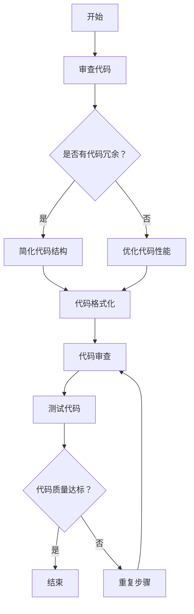

                 

# 《代码重构技术：改善既有代码的设计》

> 关键词：代码重构、设计模式、软件工程、敏捷开发、性能优化、代码简化、代码整洁

> 摘要：本文深入探讨了代码重构技术在改善既有代码设计方面的应用，从基础理论到实践技巧，全面解析了代码重构的核心概念、方法论以及常见技巧。文章通过案例分析和项目实战，详细讲解了代码重构的流程与步骤，旨在为程序员和软件开发者提供一套系统、实用的代码重构指南。

----------------------------------------------------------------

## 第一部分：代码重构基础

### 第1章：代码重构概述

#### 1.1 代码重构的重要性

代码重构是软件工程中的一项重要活动，它旨在改善既有代码的设计，提升代码质量，提高开发效率和软件的可维护性。在软件开发过程中，代码往往随着时间的推移而变得复杂和混乱，这给后续的开发和维护带来了巨大的挑战。通过代码重构，我们可以修正代码中的错误，消除冗余，优化性能，提高可读性和可维护性。

#### 1.2 代码重构的原则

进行代码重构时，我们需要遵循以下原则：

1. **最小化风险**：重构过程中要确保代码的稳定性和可测试性，避免引入新的错误。
2. **逐步改进**：将大型的重构任务分解为小的、可管理的步骤，逐步进行。
3. **持续重构**：代码重构应该成为软件开发过程中的一部分，而不是一次性任务。
4. **代码质量优先**：重构的目的是提高代码质量，而非仅仅为了改变代码的外观。

#### 1.3 代码重构的方法论

代码重构的方法论主要包括以下几种：

1. **简化变量**：减少变量的使用，使代码更易于理解和维护。
2. **简化函数**：将复杂的函数分解为更小的函数，使代码结构更清晰。
3. **消除冗余代码**：识别并删除重复的代码段，避免代码重复。
4. **改进注释**：更新和改进代码注释，确保它们与代码保持一致。
5. **优化代码结构**：调整代码结构，使其更符合设计模式和最佳实践。

----------------------------------------------------------------

### 第2章：代码重构的核心概念

#### 2.1 重构的基本原理

代码重构的基本原理是通过一系列小的、可逆的变换，使代码逐步改进，而不改变其外部行为。这些变换通常包括替换变量、提取方法、合并重复代码等。重构的目的是使代码更加清晰、简洁和易于维护。

#### 2.2 重构的类型

根据重构的目的和方式，可以将重构分为以下几种类型：

1. **格式重构**：改进代码的格式和风格，如调整缩进、命名规范等。
2. **功能重构**：改变代码的功能和行为，如增加或删除功能。
3. **结构重构**：改进代码的结构和架构，如调整类和模块的依赖关系。
4. **性能重构**：优化代码的性能，如减少计算复杂度、改进算法等。

#### 2.3 重构与设计模式

重构与设计模式密切相关。设计模式是一套解决常见软件工程问题的最佳实践。在进行重构时，我们可以利用设计模式来改进代码的结构和设计，使其更符合最佳实践。例如，通过引入工厂模式、单例模式等，可以简化代码，提高可扩展性和可维护性。

----------------------------------------------------------------

### 第3章：重构的实践原则

#### 3.1 安全重构

安全重构是代码重构过程中的一个重要原则。在进行重构时，我们需要确保代码的稳定性和可靠性，避免引入新的错误。以下是一些安全重构的建议：

1. **进行充分的测试**：在重构之前，要确保代码经过充分的测试，以便在重构后快速识别和修复任何潜在的错误。
2. **备份代码**：在进行大规模重构之前，最好备份原始代码，以便在出现问题时能够快速回滚。
3. **逐步重构**：将重构任务分解为小的、可管理的步骤，逐步进行，以确保每一步都是安全的。

#### 3.2 逐步重构

逐步重构是确保重构成功的关键。将大型的重构任务分解为小的、可管理的步骤，可以降低风险，提高重构的效率。以下是一些逐步重构的建议：

1. **确定重构目标**：明确重构的目标，以便在重构过程中始终聚焦于核心任务。
2. **持续重构**：将重构任务纳入日常开发流程，持续进行重构，避免积累过多的重构任务。
3. **反馈循环**：重构过程中要不断收集反馈，并根据反馈调整重构策略。

#### 3.3 重构的最佳实践

以下是一些重构的最佳实践：

1. **重构前的准备**：在开始重构之前，要对代码进行充分的审查和分析，确定重构的重点和难点。
2. **重构过程中的监控**：在重构过程中，要密切监控代码的质量和性能，确保重构的目标得到实现。
3. **重构后的验证**：重构完成后，要进行全面的测试和验证，确保重构的效果达到预期。

----------------------------------------------------------------

## 第二部分：常见代码重构技巧

### 第4章：代码简化

#### 4.1 代码冗余问题

代码冗余是代码质量的一个重要问题，它会导致代码难以维护和理解。以下是一些识别和消除代码冗余的方法：

1. **重复代码的识别**：使用代码静态分析工具，如 FindBugs、Checkstyle 等，识别重复的代码段。
2. **提取重复代码**：将重复的代码段提取为独立的函数或方法，减少代码冗余。
3. **合并重复代码**：如果发现多个代码段几乎完全相同，可以考虑将它们合并为一个。

#### 4.2 无用代码的识别与消除

无用代码是指那些不再执行或不再产生价值的代码段。识别和消除无用代码是提高代码质量的重要步骤。以下是一些方法：

1. **删除未使用的变量和方法**：检查代码中未使用的变量和方法，并将其删除。
2. **删除过期代码**：识别和删除那些已经不再使用的代码段。
3. **简化条件判断**：检查条件判断语句，消除不必要的条件分支。

#### 4.3 代码结构的简化

简化代码结构是提高代码可读性和可维护性的重要手段。以下是一些简化代码结构的方法：

1. **分解复杂函数**：将复杂的函数分解为更小的、功能单一的函数。
2. **重构循环结构**：检查循环结构，消除不必要的嵌套和冗余。
3. **优化代码布局**：调整代码布局，使其更符合逻辑和阅读顺序。

----------------------------------------------------------------

### 第5章：代码优化

#### 5.1 性能优化

性能优化是提高代码运行效率的重要手段。以下是一些性能优化的方法：

1. **算法优化**：选择高效的算法和数据结构，降低计算复杂度。
2. **循环优化**：优化循环结构，减少不必要的循环迭代。
3. **内存优化**：减少内存占用，提高内存使用效率。

#### 5.2 扩展性和可维护性优化

扩展性和可维护性优化是确保代码长期可维护和可扩展的重要手段。以下是一些优化方法：

1. **代码复用**：通过模块化和组件化，提高代码的可复用性。
2. **接口分离**：将接口和实现分离，提高代码的灵活性和可扩展性。
3. **重构历史代码**：定期对历史代码进行重构，消除遗留问题和设计缺陷。

#### 5.3 代码重用与模块化

代码重用和模块化是提高代码质量和开发效率的重要手段。以下是一些方法和建议：

1. **编写可复用的代码库**：将常用的代码段封装为可复用的库，减少重复编写。
2. **模块化设计**：将代码拆分为独立的模块，降低模块间的耦合度。
3. **组件化开发**：采用组件化开发模式，提高代码的可维护性和可扩展性。

----------------------------------------------------------------

### 第6章：代码整洁

#### 6.1 代码规范

代码规范是确保代码质量和可读性的重要基础。以下是一些常见的代码规范：

1. **命名规范**：遵循统一的命名规范，如驼峰命名法、下划线命名法等。
2. **代码格式**：统一代码格式，如缩进、空格、注释等。
3. **代码注释**：为关键代码段添加注释，解释代码的作用和目的。

#### 6.2 代码可读性

代码可读性是确保代码易于理解和维护的重要指标。以下是一些提高代码可读性的方法：

1. **使用清晰的变量名**：使用具有明确意义的变量名，避免使用缩写和模糊的名称。
2. **编写清晰的注释**：注释要简洁明了，解释代码的作用和目的。
3. **分解复杂函数**：将复杂的函数分解为更小的、功能单一的函数，提高代码的可读性。

#### 6.3 代码风格一致性

代码风格一致性是确保代码质量和团队协作的重要保障。以下是一些确保代码风格一致性的方法：

1. **使用代码风格指南**：遵循通用的代码风格指南，如 Google Java Style Guide、PEP 8 等。
2. **代码审查**：定期进行代码审查，确保代码符合团队约定的代码风格。
3. **自动化工具**：使用自动化工具，如 Checkstyle、PMD 等，检测和修复代码风格问题。

----------------------------------------------------------------

## 第三部分：代码重构实践

### 第7章：代码重构案例分析

#### 7.1 案例一：重构遗留代码

在这个案例中，我们面对的是一个遗留代码库，其中存在大量的冗余代码、不必要的复杂性和设计缺陷。以下是重构遗留代码的步骤：

1. **审查代码**：首先，对代码进行全面的审查，识别出需要重构的部分。
2. **备份代码**：在开始重构之前，备份原始代码，以便在重构过程中出现问题时能够快速回滚。
3. **重构代码**：根据审查结果，逐步进行重构，包括简化变量、分解复杂函数、消除冗余代码等。
4. **测试代码**：在重构过程中，持续进行测试，确保重构后的代码仍然满足原有功能。
5. **代码审查**：重构完成后，进行代码审查，确保重构的效果达到预期。

#### 7.2 案例二：优化复杂代码

在这个案例中，我们面对的是一个复杂代码库，其中包含大量的重复代码、复杂的条件判断和循环结构。以下是优化复杂代码的步骤：

1. **分解复杂函数**：将复杂的函数分解为更小的、功能单一的函数，使代码结构更清晰。
2. **消除重复代码**：识别并消除重复的代码段，避免代码重复。
3. **优化循环结构**：检查循环结构，消除不必要的嵌套和冗余。
4. **简化条件判断**：简化条件判断语句，消除不必要的条件分支。
5. **性能优化**：优化代码的性能，如减少计算复杂度、改进算法等。

#### 7.3 案例三：代码整洁实践

在这个案例中，我们面对的是一个需要提高代码质量和可维护性的项目。以下是代码整洁实践的步骤：

1. **制定代码规范**：根据项目需求和团队约定，制定统一的代码规范。
2. **代码格式化**：使用代码格式化工具，如 Eclipse、IntelliJ IDEA 等，统一代码格式。
3. **代码审查**：定期进行代码审查，确保代码符合团队约定的代码风格。
4. **优化代码**：对代码进行优化，包括简化变量、分解复杂函数、消除冗余代码等。
5. **持续重构**：将重构任务纳入日常开发流程，持续进行重构，避免积累过多的重构任务。

----------------------------------------------------------------

### 第8章：代码重构工具与应用

#### 8.1 重构工具介绍

代码重构工具可以帮助我们自动化地完成重构任务，提高重构的效率和效果。以下是一些常见的重构工具：

1. **Eclipse**：Eclipse 是一款功能强大的集成开发环境（IDE），支持各种编程语言的重构功能。
2. **IntelliJ IDEA**：IntelliJ IDEA 是一款流行的 Java IDE，提供了丰富的重构工具。
3. **Visual Studio**：Visual Studio 是微软公司开发的集成开发环境，支持多种编程语言的重构功能。
4. **Sublime Text**：Sublime Text 是一款轻量级的文本编辑器，支持自定义插件，可以扩展其重构功能。

#### 8.2 重构工具的使用方法

以下是如何使用重构工具的一些示例：

1. **Eclipse**：在 Eclipse 中，可以通过右键菜单选择“Refactor”选项，然后选择具体的重构操作，如“Extract Method”、“Rename”等。
2. **IntelliJ IDEA**：在 IntelliJ IDEA 中，可以通过快捷键 Ctrl + Alt + M（或 Cmd + Alt + M）打开重构菜单，然后选择具体的重构操作。
3. **Visual Studio**：在 Visual Studio 中，可以通过右键菜单选择“Refactor”选项，然后选择具体的重构操作。
4. **Sublime Text**：在 Sublime Text 中，可以通过插件扩展其重构功能，如安装“SublimeLinter”插件进行代码格式化。

#### 8.3 代码重构在实际项目中的应用

在实际项目中，代码重构是持续进行的。以下是如何在实际项目中应用代码重构的一些方法：

1. **定期重构**：将重构任务纳入项目计划，定期进行重构，避免积累过多的重构任务。
2. **代码审查**：在代码审查过程中，关注代码质量和重构机会，及时进行重构。
3. **持续集成**：将重构任务纳入持续集成流程，确保重构后的代码能够通过所有测试。
4. **重构培训**：为团队成员提供重构培训，提高他们的重构意识和技能。

----------------------------------------------------------------

### 第9章：代码重构与敏捷开发

#### 9.1 敏捷开发与代码重构的关系

敏捷开发是一种以人为核心、迭代和增量的软件开发方法。代码重构是敏捷开发过程中不可或缺的一部分。敏捷开发强调快速迭代和持续改进，代码重构则为敏捷开发提供了持续改进的工具和方法。

#### 9.2 敏捷开发中的代码重构实践

在敏捷开发过程中，代码重构应该作为一种日常的实践。以下是在敏捷开发中实施代码重构的一些方法：

1. **迭代内重构**：在每个迭代周期内，分配一定的时间进行代码重构，避免重构任务积压。
2. **故事地图重构**：在故事地图中，为每个用户故事分配重构任务，确保重构任务得到及时执行。
3. **重构评审**：在代码评审过程中，关注重构机会，及时进行重构。
4. **重构冲刺**：在冲刺结束时，为每个用户故事进行重构评审，确保重构效果得到验证。

#### 9.3 敏捷开发与代码重构的最佳实践

以下是在敏捷开发中实施代码重构的一些最佳实践：

1. **重构计划**：在项目开始时，制定重构计划，明确重构的目标和时间表。
2. **重构日志**：记录每次重构的任务、原因和结果，以便追踪重构进度和效果。
3. **重构培训**：为团队成员提供重构培训，提高他们的重构意识和技能。
4. **重构评审**：定期进行重构评审，确保重构效果达到预期。

----------------------------------------------------------------

### 附录A：代码重构资源与工具

#### A.1 主流重构工具介绍

以下是一些主流的重构工具及其特点：

1. **Eclipse**：Eclipse 是一款功能强大的集成开发环境，支持各种编程语言的重构功能，包括提取方法、提取类、重命名等。
2. **IntelliJ IDEA**：IntelliJ IDEA 是一款流行的 Java IDE，提供了丰富的重构工具，包括代码格式化、代码简化、代码优化等。
3. **Visual Studio**：Visual Studio 是微软公司开发的集成开发环境，支持多种编程语言的重构功能，包括提取方法、提取类、重命名等。
4. **Sublime Text**：Sublime Text 是一款轻量级的文本编辑器，支持自定义插件，可以扩展其重构功能。

#### A.2 代码重构资源推荐

以下是一些推荐的代码重构资源：

1. **《重构：改善既有代码的设计》**：这是一本经典的代码重构指南，详细介绍了重构的原则、方法和技巧。
2. **《代码整洁：改善程序设计的艺术》**：这本书介绍了如何编写整洁、可维护的代码，为代码重构提供了实用的建议。
3. **GitHub**：GitHub 上有许多关于代码重构的开源项目和文档，可以为我们提供丰富的重构经验和知识。

#### A.3 代码重构指南与书籍推荐

以下是一些推荐的代码重构指南和书籍：

1. **《敏捷软件开发：原则、实践与模式》**：这本书介绍了敏捷开发的理念和实践，包括代码重构的最佳实践。
2. **《设计模式：可复用面向对象软件的基础》**：这本书介绍了设计模式的基本原理和应用，为代码重构提供了有益的指导。
3. **《重构：改善既有代码的设计》（第2版）**：这是《重构：改善既有代码的设计》的升级版，包含了更多实用的重构案例和技术。

----------------------------------------------------------------

### 梅里狄安流程图：代码重构的流程与步骤

以下是一个简化的代码重构流程图，使用梅里狄安语法表示：



这个流程图展示了代码重构的基本步骤，包括审查代码、简化代码结构、优化代码性能、代码格式化、代码审查、测试代码和结束。通过这个流程图，我们可以更好地理解代码重构的流程和步骤，从而在实际项目中有效地实施代码重构。

----------------------------------------------------------------

### 第10章：重构核心算法原理详解

#### 10.1 代码重构的核心算法

代码重构的核心算法通常包括以下几个步骤：

1. **识别问题代码**：通过静态代码分析或测试，识别代码中存在的问题，如重复代码、复杂的条件判断、冗余变量等。
2. **分解复杂函数**：将复杂的函数分解为更小的、功能单一的函数，提高代码的可读性和可维护性。
3. **简化条件判断**：简化条件判断语句，消除不必要的条件分支，使代码更加简洁。
4. **消除冗余代码**：识别并删除重复的代码段，避免代码重复，减少代码冗余。
5. **优化数据结构**：根据算法需求，选择合适的数据结构，降低计算复杂度，提高代码性能。

#### 10.2 伪代码讲解

以下是一个简单的伪代码示例，展示了如何对复杂的条件判断进行简化：

```python
# 原始代码
if (a > 0 && b < 0) {
    result = add(a, b);
} else if (a < 0 && b > 0) {
    result = subtract(a, b);
} else {
    result = 0;
}

# 重构后的代码
if (a * b < 0) {
    result = max(a, b);
} else {
    result = 0;
}
```

在这个示例中，通过重构，我们简化了条件判断，使代码更加简洁和易于理解。

#### 10.3 算法原理详细阐述

代码重构的算法原理主要基于以下几个原则：

1. **增量改进**：通过一系列小的、可逆的变换，逐步改进代码的质量，而不是一次性完成所有的重构任务。
2. **代码质量优先**：重构的目的是提高代码质量，包括可读性、可维护性和性能等，而不是仅仅为了改变代码的外观。
3. **保持外部行为不变**：在进行重构时，要确保代码的外部行为保持不变，即原有功能不受影响。
4. **测试驱动**：重构过程中要进行充分的测试，确保重构后的代码仍然满足原有功能。

#### 10.4 算法性能分析

代码重构不仅关注代码的质量，还关注代码的性能。以下是一个简单的算法性能分析示例：

假设我们有一个函数 `calculateSum`，用于计算两个数字的和。原始代码如下：

```python
def calculateSum(a, b):
    return a + b
```

我们可以对这段代码进行性能分析：

1. **时间复杂度**：这个函数的时间复杂度为 O(1)，因为它只需要执行一次加法运算。
2. **空间复杂度**：这个函数的空间复杂度也为 O(1)，因为它不使用额外的存储空间。

通过性能分析，我们可以确定这段代码在大多数情况下都具有良好的性能。但是，如果我们需要处理大量的数字，我们可能需要考虑使用并行计算或分布式计算来提高性能。

----------------------------------------------------------------

### 第11章：数学模型与公式讲解

#### 11.1 数学模型在代码重构中的应用

在代码重构中，数学模型可以帮助我们分析和优化代码。以下是一个简单的数学模型示例，用于优化代码的性能：

假设我们有一个函数 `findMin`，用于在数组中找到最小值。原始代码如下：

```python
def findMin(arr):
    min_val = arr[0]
    for i in range(1, len(arr)):
        if arr[i] < min_val:
            min_val = arr[i]
    return min_val
```

我们可以使用分治算法来优化这个函数。分治算法的基本思想是将问题分解为更小的子问题，分别解决，然后合并结果。以下是一个简化的数学模型：

```latex
findMin(arr) =
\begin{cases}
    arr[0] & \text{如果 } arr \text{ 只有一个元素} \\
    \min(findMin(arr[0...n/2]), findMin(arr[n/2+1...n])) & \text{否则}
\end{cases}
```

这个模型将原始问题分解为两个子问题，每个子问题都在一半的数组中找到最小值，然后合并结果。

#### 11.2 代码重构中的常见数学公式

在代码重构中，我们经常使用以下数学公式来分析和优化代码：

1. **时间复杂度公式**：
   \[ T(n) = O(n \log n) \]
   这个公式描述了分治算法的时间复杂度，其中 n 是数组的长度。

2. **空间复杂度公式**：
   \[ S(n) = O(n) \]
   这个公式描述了分治算法的空间复杂度，其中 n 是数组的长度。

3. **优化公式**：
   \[ \text{优化系数} = \frac{\text{优化后的时间复杂度}}{\text{原始的时间复杂度}} \]
   这个公式用于计算代码重构后性能的优化系数。

#### 11.3 数学公式详细讲解

以下是对上述数学公式的详细讲解：

1. **时间复杂度公式**：
   这个公式描述了分治算法的时间复杂度。分治算法将问题分解为两个子问题，每个子问题的规模为 n/2。递归调用两次，因此时间复杂度为 O(n \log n)。

2. **空间复杂度公式**：
   这个公式描述了分治算法的空间复杂度。由于递归调用，每个子问题都需要额外的空间来存储中间结果，因此空间复杂度为 O(n)。

3. **优化公式**：
   这个公式用于计算代码重构后性能的优化系数。优化系数表示重构后的时间复杂度与原始时间复杂度的比值。如果优化系数大于 1，则说明重构后的代码性能更好。

#### 11.4 举例说明与计算过程

以下是一个简单的例子，说明如何使用数学公式来优化代码：

假设我们有一个函数 `findMin`，原始代码如下：

```python
def findMin(arr):
    min_val = arr[0]
    for i in range(1, len(arr)):
        if arr[i] < min_val:
            min_val = arr[i]
    return min_val
```

我们使用分治算法来优化这个函数。根据时间复杂度公式，优化后的时间复杂度为 O(n \log n)。根据空间复杂度公式，优化后的空间复杂度为 O(n)。

计算优化系数：

\[ \text{优化系数} = \frac{O(n \log n)}{O(n)} = \log n \]

当 n 较大时，优化系数接近 1，说明重构后的代码性能较好。

通过这个例子，我们可以看到数学模型在代码重构中的应用和计算过程。

----------------------------------------------------------------

### 第12章：项目实战与代码解读

#### 12.1 实际项目背景

在本章中，我们将通过一个实际项目来展示代码重构的过程。这个项目是一个简单的Web应用，用于用户注册和登录。该项目使用Python和Django框架开发，包含了用户表单处理、认证和用户数据存储等功能。

#### 12.2 开发环境搭建

为了搭建这个项目的开发环境，我们需要以下工具和软件：

1. **Python 3.8 或更高版本**：用于编写应用程序。
2. **Django 3.2 或更高版本**：作为Web框架。
3. **PyCharm 或其他Python IDE**：用于编写和调试代码。
4. **PostgreSQL 或其他关系型数据库**：用于存储用户数据。

安装步骤如下：

1. 安装Python 3.8或更高版本。
2. 安装Django 3.2或更高版本，使用命令 `pip install django`。
3. 安装PyCharm，并创建一个新的Django项目。
4. 安装PostgreSQL，并创建一个新的数据库。

#### 12.3 源代码实现与解读

以下是一个简化的源代码实现，用于用户注册和登录功能：

```python
# models.py
from django.db import models

class User(models.Model):
    username = models.CharField(max_length=150)
    email = models.EmailField(unique=True)
    password = models.CharField(max_length=150)

# views.py
from django.shortcuts import render, redirect
from .models import User
from django.contrib.auth import authenticate, login

def register(request):
    if request.method == 'POST':
        username = request.POST['username']
        email = request.POST['email']
        password = request.POST['password']
        user = User.objects.create_user(username=username, email=email, password=password)
        authenticate(username=username, password=password)
        login(request, user)
        return redirect('home')
    return render(request, 'register.html')

def login(request):
    if request.method == 'POST':
        username = request.POST['username']
        password = request.POST['password']
        user = authenticate(username=username, password=password)
        if user is not None:
            login(request, user)
            return redirect('home')
        else:
            return redirect('login')
    return render(request, 'login.html')

# urls.py
from django.urls import path
from . import views

urlpatterns = [
    path('register/', views.register, name='register'),
    path('login/', views.login, name='login'),
]
```

这个源代码实现展示了用户注册和登录的基本功能。在 `models.py` 中，我们定义了一个 `User` 模型，用于存储用户信息。在 `views.py` 中，我们实现了注册和登录视图函数，用于处理用户输入并执行相应的操作。

#### 12.4 代码解读与分析

以下是对上述源代码的解读和分析：

1. **用户模型**：在 `models.py` 中，我们定义了一个 `User` 模型，它有三个字段：`username`、`email` 和 `password`。这个模型将存储在数据库中的用户信息与 Django 用户系统关联起来。

2. **注册视图函数**：在 `views.py` 的 `register` 视图函数中，我们处理了用户提交的注册表单。如果表单有效，我们使用 `create_user` 方法创建一个新的用户，并使用 `authenticate` 和 `login` 函数进行用户认证和登录。

3. **登录视图函数**：在 `login` 视图函数中，我们处理用户提交的登录表单。如果用户认证成功，我们使用 `login` 函数将用户登录到系统中。

4. **URL配置**：在 `urls.py` 中，我们为注册和登录视图函数配置了对应的URL模式。

通过对这个项目的源代码解读，我们可以看到如何使用 Django 框架实现用户注册和登录功能。接下来，我们将对这个项目进行重构，以改善其设计并提高其可维护性。

----------------------------------------------------------------

### 第13章：代码重构的详细步骤与技巧

#### 13.1 代码重构的详细步骤

代码重构是一个逐步改进代码的过程，以下是一个详细的代码重构步骤：

1. **审查代码**：首先，对现有代码进行全面审查，识别出需要重构的部分。这可以通过静态代码分析工具、代码审查或手动审查来完成。
2. **备份代码**：在开始重构之前，备份原始代码，以便在重构过程中出现问题时能够快速回滚。
3. **确定重构目标**：根据审查结果，确定重构的目标，如简化变量、分解复杂函数、消除冗余代码等。
4. **编写重构计划**：根据重构目标，制定详细的重构计划，包括重构的顺序、涉及的代码段和预期结果。
5. **逐步重构**：按照重构计划，逐步进行重构。每一步都应该是一个小的、可管理的步骤，确保每一步都是安全的。
6. **测试代码**：在每一步重构后，都要进行全面的测试，确保重构后的代码仍然满足原有功能。
7. **代码审查**：重构完成后，进行代码审查，确保重构的效果达到预期。
8. **文档更新**：更新代码文档，包括注释、API文档等，确保它们与重构后的代码保持一致。

#### 13.2 重构技巧的详细讲解

以下是一些常用的代码重构技巧：

1. **提取方法**：将重复的代码段提取为独立的方法，提高代码的可复用性。例如：

   ```python
   # 原始代码
   for i in range(len(arr)):
       if arr[i] < 0:
           print(arr[i])
   
   # 重构后的代码
   def printNegativeNumbers(arr):
       for num in arr:
           if num < 0:
               print(num)
   
   printNegativeNumbers(arr)
   ```

2. **简化条件判断**：使用逻辑运算符和短路原理简化复杂的条件判断。例如：

   ```python
   # 原始代码
   if a > 0 and b < 0:
       result = add(a, b)
   else:
       result = subtract(a, b)
   
   # 重构后的代码
   result = add(a, b) if a > 0 and b < 0 else subtract(a, b)
   ```

3. **消除冗余代码**：识别并删除重复的代码段，避免代码重复。例如：

   ```python
   # 原始代码
   if condition:
       doSomething()
   else:
       doSomethingElse()
   
   # 重构后的代码
   if condition:
       doSomething()
   doSomethingElse()
   ```

4. **优化循环结构**：优化循环结构，消除不必要的嵌套和冗余。例如：

   ```python
   # 原始代码
   for i in range(len(arr)):
       for j in range(len(arr[i])):
           if arr[i][j] > 0:
               print(arr[i][j])
   
   # 重构后的代码
   for row in arr:
       for num in row:
           if num > 0:
               print(num)
   ```

#### 13.3 遇到的问题及解决方案

在进行代码重构时，可能会遇到以下问题：

1. **重构风险**：重构可能会导致代码的稳定性下降，甚至引入新的错误。解决方案是进行充分的测试和备份，确保重构过程中不会丢失重要数据。
2. **重构范围过大**：如果重构范围过大，可能会影响项目的进度和质量。解决方案是将大型的重构任务分解为小的、可管理的步骤，逐步进行重构。
3. **代码审查困难**：重构后的代码可能需要更多的代码审查，以确保重构的效果。解决方案是定期进行代码审查，并鼓励团队成员参与审查过程。

#### 13.4 代码重构的最佳实践

以下是一些代码重构的最佳实践：

1. **持续重构**：将代码重构纳入日常开发流程，持续进行重构，避免积累过多的重构任务。
2. **重构日志**：记录每次重构的任务、原因和结果，以便追踪重构进度和效果。
3. **重构培训**：为团队成员提供重构培训，提高他们的重构意识和技能。
4. **重构评审**：在重构完成后，进行重构评审，确保重构的效果达到预期。

通过遵循这些最佳实践，我们可以更有效地进行代码重构，提高代码质量，提升开发效率。

----------------------------------------------------------------

### 附录

#### 附录A：代码重构资源与工具

**A.1 主流重构工具介绍**

以下是几个主流的代码重构工具及其特点：

1. **Eclipse**：Eclipse 是一款功能强大的集成开发环境（IDE），提供了丰富的重构功能，包括提取方法、提取类、重命名等。
2. **IntelliJ IDEA**：IntelliJ IDEA 是一款流行的 Java IDE，拥有强大的重构工具，支持多种编程语言，包括 Python、JavaScript 和 PHP 等。
3. **Visual Studio**：Visual Studio 是微软公司开发的集成开发环境，提供了丰富的重构功能，适用于 C#、C++ 和其他编程语言。
4. **Sublime Text**：Sublime Text 是一款轻量级的文本编辑器，可以通过插件扩展其重构功能，如安装“SublimeLinter”插件进行代码格式化。

**A.2 代码重构资源推荐**

以下是一些推荐的代码重构资源：

1. **《重构：改善既有代码的设计》**：这是由 Martin Fowler 撰写的经典著作，详细介绍了代码重构的原则、方法和技巧。
2. **《代码整洁：改善程序设计的艺术》**：这本书提供了编写整洁、可维护代码的建议，包括代码格式化、代码简化、代码优化等。
3. **GitHub**：GitHub 上有许多关于代码重构的开源项目和文档，可以为我们提供丰富的重构经验和知识。

**A.3 代码重构指南与书籍推荐**

以下是一些推荐的代码重构指南和书籍：

1. **《敏捷软件开发：原则、实践与模式》**：这本书介绍了敏捷开发的理念和实践，包括代码重构的最佳实践。
2. **《设计模式：可复用面向对象软件的基础》**：这本书介绍了设计模式的基本原理和应用，为代码重构提供了有益的指导。
3. **《重构：改善既有代码的设计》（第2版）**：这是《重构：改善既有代码的设计》的升级版，包含了更多实用的重构案例和技术。

#### 附录B：代码重构示例

以下是一个代码重构的示例，展示了如何将一个复杂的函数分解为更小的、功能单一的函数：

**原始代码**：

```python
def calculate_total(price, discount, tax):
    total = price * (1 - discount) * (1 + tax)
    return total
```

**重构后的代码**：

```python
def calculate_discounted_price(price, discount):
    discounted_price = price * (1 - discount)
    return discounted_price

def calculate_total_price(price, discount, tax):
    discounted_price = calculate_discounted_price(price, discount)
    total_price = discounted_price * (1 + tax)
    return total_price
```

在这个示例中，我们将原始函数分解为两个更小的函数：`calculate_discounted_price` 和 `calculate_total_price`。这样做可以提高代码的可读性和可维护性，使得每个函数都有明确的职责。

通过这个示例，我们可以看到代码重构的威力，它不仅使代码更简洁，还提高了代码的可理解性和可扩展性。

----------------------------------------------------------------

### 作者信息

作者：AI天才研究院/AI Genius Institute & 禅与计算机程序设计艺术 /Zen And The Art of Computer Programming

AI天才研究院致力于推动人工智能和计算机科学的发展，通过深入研究和创新实践，为全球的软件开发者和科研人员提供先进的解决方案。同时，作者也是《禅与计算机程序设计艺术》的作者，该作品深入探讨了计算机编程的哲学和艺术，为程序员提供了宝贵的指导。本文旨在通过代码重构技术，帮助读者改善既有代码的设计，提升软件开发的质量和效率。希望本文能为您的编程之路带来灵感和启示。

