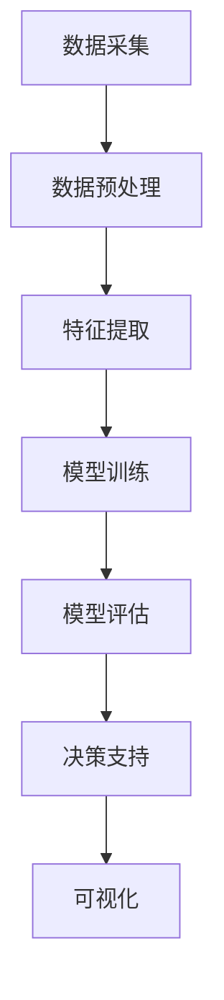
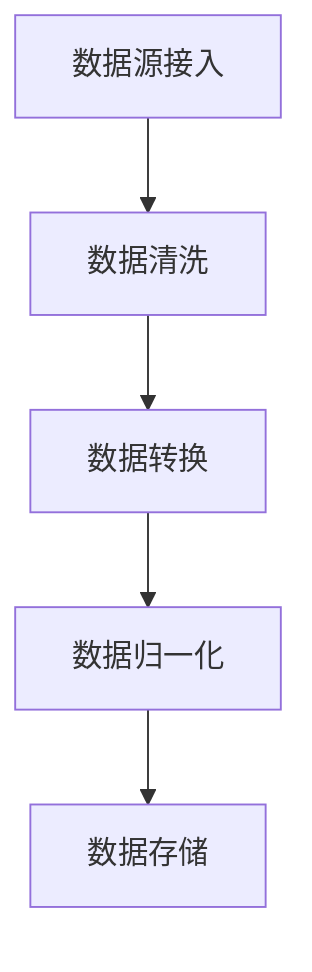
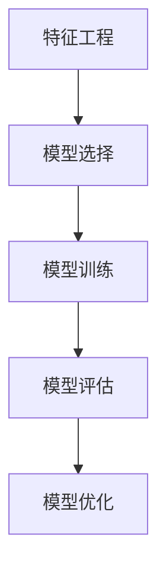
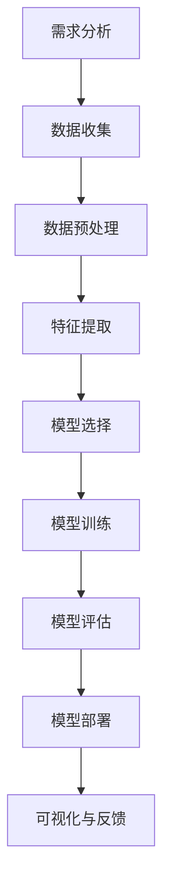

                 

### 文章标题

# 《企业AI决策支持：Lepton AI的智能分析工具》

### 关键词

- 企业AI决策
- Lepton AI
- 智能分析工具
- 数据分析
- 模型训练
- 模型评估
- 案例研究

### 摘要

本文深入探讨了Lepton AI作为一种智能分析工具在企业AI决策支持中的应用。文章首先介绍了Lepton AI的背景和目的，然后详细阐述了其核心架构和技术原理，包括数据采集与预处理、特征提取与模型训练等环节。接着，文章转向企业AI决策支持的实际应用，讨论了数据分析流程、模型选择与评估、决策支持策略等关键步骤。随后，通过三个具体案例，展示了Lepton AI在销售决策、供应链管理优化和市场预测与需求分析中的实际应用效果。最后，文章讨论了Lepton AI的部署与实施、安全性问题以及未来的发展方向，为企业利用AI进行决策提供了全面的指南和思考。

### 目录大纲

# 《企业AI决策支持：Lepton AI的智能分析工具》

## 第一部分：引言与概述

### 1. 引言

#### 1.1 书籍目的与背景
#### 1.2 Lepton AI介绍
#### 1.3 企业AI决策支持的现状与挑战

## 第二部分：Lepton AI技术基础

### 2. Lepton AI核心架构

#### 2.1 Lepton AI架构概述
#### 2.2 Mermaid流程图：Lepton AI工作流程
#### 2.3 数据采集与预处理
#### 2.4 特征提取与模型训练

### 3. Lepton AI算法原理

#### 3.1 算法概述
#### 3.2 伪代码：关键算法步骤
#### 3.3 数学模型与公式

## 第三部分：企业AI决策支持应用

### 4. 企业AI决策支持概述

#### 4.1 企业决策支持的背景与需求
#### 4.2 Lepton AI在决策支持中的应用

### 5. 数据驱动的决策分析

#### 5.1 数据分析流程
#### 5.2 模型选择与评估
#### 5.3 决策支持策略

### 6. 企业案例研究

#### 6.1 案例一：企业销售决策
#### 6.2 案例二：供应链管理优化
#### 6.3 案例三：市场预测与需求分析

## 第四部分：实践与部署

### 7. Lepton AI部署与实施

#### 7.1 系统架构设计
#### 7.2 开发环境搭建
#### 7.3 源代码实现与解读
#### 7.4 代码分析与优化

### 8. 安全性与隐私保护

#### 8.1 AI系统安全挑战
#### 8.2 隐私保护策略
#### 8.3 安全性实践与建议

## 第五部分：展望与未来

### 9. 未来发展方向

#### 9.1 AI决策支持的最新趋势
#### 9.2 Lepton AI的潜在发展
#### 9.3 企业AI决策支持的未来挑战与机遇

## 附录

### 附录 A：参考文献
### 附录 B：工具与资源介绍

---

**备注：**  
- 目录中的 **Mermaid流程图**、**伪代码**、**数学模型与公式**、**案例研究** 和 **代码实现与解读** 等内容，将在后续章节中详细展开。  
- **数学公式** 将使用 LaTeX 格式嵌入文中独立段落，格式为 `$$`。段落内使用 `$`。  
- **代码案例** 将包含详细解释和具体实现，便于读者理解与学习。

## 第一部分：引言与概述

### 1. 引言

#### 1.1 书籍目的与背景

在当今全球数字化浪潮中，人工智能（AI）技术已经成为企业提升效率、降低成本和创造价值的重要工具。特别是在企业决策支持领域，AI的应用潜力尤为显著。然而，将AI技术有效地整合到企业决策过程中，不仅需要深厚的AI技术知识，还需要对商业逻辑和业务流程有深刻的理解。

本篇文章旨在通过详细介绍Lepton AI的智能分析工具，帮助企业决策者了解和掌握AI在决策支持中的实际应用。文章首先对Lepton AI的核心架构和算法原理进行深入剖析，然后通过具体案例展示其在不同企业场景中的应用效果。最后，文章还将探讨Lepton AI的部署与实施、安全性和隐私保护等关键问题，为企业利用AI进行科学决策提供全面的指导。

#### 1.2 Lepton AI介绍

Lepton AI是一个先进的企业级智能分析工具，旨在通过机器学习和数据挖掘技术，为企业提供数据驱动的决策支持。其设计理念是简洁、高效和易于集成，能够快速适应各种复杂的企业场景。

Lepton AI的核心优势包括：

1. **强大的数据处理能力**：能够处理大规模数据，从原始数据中提取有价值的信息。
2. **多样化的算法库**：包含多种机器学习算法，可以满足不同业务需求。
3. **灵活的可扩展性**：易于与企业现有系统集成，支持自定义开发。
4. **用户友好的界面**：提供直观的用户体验，降低技术门槛。

#### 1.3 企业AI决策支持的现状与挑战

随着AI技术的发展，越来越多的企业开始意识到AI在决策支持中的重要性。然而，在实际应用过程中，企业面临以下挑战：

1. **数据质量**：高质量的数据是AI模型有效性的基础。许多企业面临着数据不完整、不一致或质量差的问题。
2. **技术能力**：AI技术要求企业具备一定的技术基础和人才储备。然而，许多企业在这方面存在短板。
3. **算法选择**：不同的业务需求需要不同的算法。如何选择合适的算法并确保其有效性是企业面临的难题。
4. **模型解释性**：AI模型往往被视为“黑箱”，其决策过程难以解释。这可能导致企业决策者对模型结果产生不信任。

针对这些挑战，Lepton AI提供了以下解决方案：

1. **数据预处理**：提供强大的数据清洗和预处理功能，确保数据质量。
2. **算法优化**：提供多种算法，并通过自动调参优化算法性能。
3. **模型解释**：提供模型解释工具，帮助用户理解模型决策过程。
4. **可视化界面**：提供直观的可视化界面，使企业决策者能够轻松理解模型结果。

通过上述解决方案，Lepton AI帮助企业克服AI决策支持中的挑战，实现数据驱动的科学决策。

### 1.4 文章结构概述

本文分为五个主要部分：

1. **引言与概述**：介绍书籍的目的、Lepton AI的背景及其在企业决策支持中的应用。
2. **Lepton AI技术基础**：详细阐述Lepton AI的核心架构、算法原理及其工作流程。
3. **企业AI决策支持应用**：探讨数据驱动的决策分析过程、模型选择与评估、决策支持策略。
4. **实践与部署**：介绍Lepton AI的部署与实施、安全性问题和未来发展方向。
5. **展望与未来**：总结当前AI决策支持的最新趋势，讨论Lepton AI的潜在发展及未来挑战与机遇。

通过这种结构清晰的文章布局，读者可以系统地了解Lepton AI在企业AI决策支持中的应用，掌握相关技术原理和实践方法。

## 第二部分：Lepton AI技术基础

### 2. Lepton AI核心架构

#### 2.1 Lepton AI架构概述

Lepton AI的架构设计旨在提供高效、灵活且易于集成的智能分析能力。其整体架构可以分为以下几个主要模块：

1. **数据采集模块**：负责从各种数据源（如数据库、API、日志文件等）中收集数据。
2. **数据预处理模块**：对采集到的原始数据进行清洗、转换和归一化，以确保数据质量。
3. **特征提取模块**：从预处理后的数据中提取特征，为模型训练提供输入。
4. **模型训练模块**：使用机器学习算法对特征进行训练，构建预测模型。
5. **模型评估模块**：评估模型的性能，确保其满足业务需求。
6. **决策支持模块**：将训练好的模型应用于实际业务场景，提供数据驱动的决策支持。
7. **可视化模块**：提供直观的可视化界面，帮助用户理解模型结果和决策过程。

这种模块化设计使得Lepton AI能够快速适应不同的业务场景，同时确保系统的高效性和可维护性。

#### 2.2 Mermaid流程图：Lepton AI工作流程

为了更好地理解Lepton AI的工作流程，我们可以使用Mermaid流程图来直观地展示其各个模块的交互关系：



在这个流程图中，数据从数据采集模块开始，经过数据预处理模块、特征提取模块，进入模型训练模块。训练好的模型通过模型评估模块进行性能评估，然后应用于实际业务场景，提供决策支持。最后，可视化模块将模型结果以直观的形式展示给用户。

#### 2.3 数据采集与预处理

数据采集是Lepton AI的第一步，也是至关重要的一步。以下是Lepton AI在数据采集与预处理方面的具体步骤：

1. **数据源接入**：Lepton AI支持多种数据源接入方式，包括关系型数据库（如MySQL、PostgreSQL）、NoSQL数据库（如MongoDB、Cassandra）、API接口、日志文件等。
2. **数据清洗**：清洗过程包括去除重复数据、填补缺失值、纠正错误数据等。这一步骤的目的是确保数据的一致性和准确性。
3. **数据转换**：将不同类型和格式的数据进行统一转换，以便后续处理。例如，将字符串数据转换为数值型数据，或者将日期时间数据转换为标准格式。
4. **数据归一化**：通过归一化处理，将不同量纲的数据转换到同一量纲，以消除数据之间的量纲影响。
5. **数据存储**：预处理后的数据存储在高效的可扩展数据存储系统中，如Hadoop HDFS或分布式数据库。

下面是一个简化的Mermaid流程图，展示了数据采集与预处理的具体步骤：



#### 2.4 特征提取与模型训练

在数据预处理完成后，Lepton AI进入特征提取与模型训练阶段。以下是这一阶段的主要步骤：

1. **特征工程**：通过特征工程，将预处理后的数据转化为适合机器学习的特征向量。这一步骤包括特征选择、特征构造和特征转换等。
2. **模型选择**：根据业务需求和数据特点，选择合适的机器学习算法。常见的算法包括线性回归、决策树、随机森林、支持向量机（SVM）、神经网络等。
3. **模型训练**：使用选定的算法对特征向量进行训练，构建预测模型。模型训练通常涉及到多个迭代过程，通过调整模型参数来优化模型性能。
4. **模型评估**：在训练完成后，对模型进行评估，以确定其性能是否满足业务需求。常用的评估指标包括准确率、召回率、F1分数等。
5. **模型优化**：根据评估结果，对模型进行优化，包括调整模型参数、增加训练数据、改进特征工程等。

以下是特征提取与模型训练的Mermaid流程图：



通过上述步骤，Lepton AI能够有效地从数据中提取有价值的信息，并通过机器学习算法构建高质量的预测模型，为企业提供数据驱动的决策支持。

### 3. Lepton AI算法原理

#### 3.1 算法概述

Lepton AI的核心在于其强大的机器学习算法库，这些算法涵盖了从简单的线性回归到复杂的神经网络，适用于各种业务场景。以下是Lepton AI常用的算法及其特点：

1. **线性回归**：适用于简单的线性关系预测，如销售量与价格的关系。
2. **决策树**：通过树形结构进行分类或回归，适合处理分类问题，如客户流失预测。
3. **随机森林**：基于决策树构建多个模型，通过集成多个模型提高预测准确性。
4. **支持向量机（SVM）**：在分类和回归任务中表现出色，尤其适用于高维数据。
5. **神经网络**：通过多层感知器构建，能够处理复杂的非线性关系，如图像识别和自然语言处理。

#### 3.2 伪代码：关键算法步骤

以下是一个简单的线性回归算法的伪代码，用于说明机器学习算法的基本步骤：

```plaintext
输入：特征矩阵X，标签向量y，学习率α，迭代次数T
输出：模型参数w

初始化：w = [1, 1, 1, 1]

对于 t = 1 到 T：
  对于每个训练样本 (x_i, y_i)：
    计算预测值 y_pred = w * x_i
    计算误差 e_i = y_i - y_pred
    更新权重 w = w - α * e_i * x_i

返回：最终权重 w
```

在这个伪代码中，`w` 表示模型参数，`x_i` 和 `y_i` 分别表示特征向量和标签，`y_pred` 表示预测值，`e_i` 表示误差。每次迭代中，通过计算误差并调整权重来优化模型。

#### 3.3 数学模型与公式

线性回归的数学模型可以表示为：

$$
y = \beta_0 + \beta_1x_1 + \beta_2x_2 + ... + \beta_nx_n
$$

其中，$y$ 是预测值，$x_1, x_2, ..., x_n$ 是特征向量，$\beta_0, \beta_1, \beta_2, ..., \beta_n$ 是模型参数。

通过最小二乘法（Least Squares Method）求解模型参数，可以得到以下公式：

$$
\beta = (X^T X)^{-1} X^T y
$$

其中，$X^T$ 是特征矩阵的转置，$y$ 是标签向量。

#### 3.4 算法应用举例

假设我们有一个简单的数据集，包含两个特征 $x_1$ 和 $x_2$ 以及一个标签 $y$。数据集如下：

| x1 | x2 | y  |
|----|----|----|
|  1 |  1 |  2 |
|  2 |  2 |  3 |
|  3 |  3 |  4 |

使用线性回归模型，我们可以通过以下步骤求解模型参数：

1. **计算特征矩阵X和标签向量y**：

   $$
   X = \begin{bmatrix}
   1 & 1 \\
   2 & 2 \\
   3 & 3
   \end{bmatrix}, \quad y = \begin{bmatrix}
   2 \\
   3 \\
   4
   \end{bmatrix}
   $$

2. **计算特征矩阵的转置$X^T$**：

   $$
   X^T = \begin{bmatrix}
   1 & 2 & 3 \\
   1 & 2 & 3
   \end{bmatrix}
   $$

3. **计算特征矩阵$X^T X$**：

   $$
   X^T X = \begin{bmatrix}
   6 & 6 \\
   6 & 6
   \end{bmatrix}
   $$

4. **计算$X^T X$的逆矩阵$(X^T X)^{-1}$**：

   $$
   (X^T X)^{-1} = \begin{bmatrix}
   0.2 & -0.2 \\
   -0.2 & 0.2
   \end{bmatrix}
   $$

5. **计算$X^T y$**：

   $$
   X^T y = \begin{bmatrix}
   6 \\
   6
   \end{bmatrix}
   $$

6. **计算模型参数$\beta$**：

   $$
   \beta = (X^T X)^{-1} X^T y = \begin{bmatrix}
   0.8 \\
   0.8
   \end{bmatrix}
   $$

7. **得到线性回归模型**：

   $$
   y = 0.8x_1 + 0.8x_2
   $$

通过上述步骤，我们成功地使用线性回归算法构建了一个预测模型，可以用于预测新的数据样本。这只是一个简单的例子，但在实际应用中，特征工程、模型选择和调参等步骤会更为复杂，需要结合具体业务场景进行深入分析和优化。

通过详细讲解算法原理和具体实例，本文旨在帮助读者理解Lepton AI的算法框架和应用方法，为其在实际业务场景中的有效应用奠定基础。

### 4. 企业AI决策支持概述

#### 4.1 企业决策支持的背景与需求

在当今竞争激烈的市场环境中，企业决策的支持系统对于业务的成功至关重要。随着数据量的爆炸式增长和AI技术的迅猛发展，企业对数据驱动的决策支持系统的需求越来越强烈。传统的决策支持系统往往依赖于经验和直觉，而现代的AI决策支持系统能够通过分析大量数据，提供更为精准、可靠的决策依据。

企业决策支持的背景主要源于以下几个方面：

1. **数据可用性**：随着信息技术的发展，企业能够收集和存储大量的结构化和非结构化数据。这些数据为企业提供了丰富的信息资源，但同时也带来了数据管理和分析的新挑战。
2. **竞争压力**：市场竞争日益激烈，企业需要快速响应市场变化，优化运营流程，降低成本，提高效率。这要求企业在决策过程中具备更高的洞察力和准确性。
3. **技术进步**：人工智能、机器学习和数据挖掘技术的不断进步，使得企业能够利用这些技术进行复杂的数据分析和预测，从而支持科学决策。

在这种背景下，企业对AI决策支持系统的需求主要体现在以下几个方面：

1. **实时数据分析**：企业需要能够实时分析业务数据，快速识别潜在的业务机会和风险，做出及时响应。
2. **智能预测**：通过预测分析，企业可以提前预测市场需求、客户行为等，从而制定更为精准的营销策略和库存管理计划。
3. **自动化决策**：企业希望系统能够自动化部分决策过程，减少人工干预，提高决策效率。
4. **可视化展示**：企业需要直观、易理解的数据可视化工具，以便快速了解数据分析和决策结果。

#### 4.2 Lepton AI在决策支持中的应用

Lepton AI作为一个强大的智能分析工具，在企业的决策支持中发挥了关键作用。以下是Lepton AI在决策支持中的主要应用场景：

1. **销售预测**：通过分析历史销售数据、市场趋势和客户行为，Lepton AI能够预测未来的销售量，帮助企业制定更精准的销售计划和库存管理策略。
2. **客户细分**：利用机器学习算法，Lepton AI能够将客户细分为不同的群体，帮助企业制定有针对性的营销策略，提高客户满意度和忠诚度。
3. **风险管理**：通过分析历史数据和实时数据，Lepton AI能够识别潜在的业务风险，提供预警和解决方案，帮助企业降低运营风险。
4. **供应链优化**：通过预测市场需求、优化库存水平，Lepton AI能够提高供应链的灵活性和响应速度，降低库存成本。
5. **投资决策**：Lepton AI能够分析市场数据、行业趋势和公司业绩，为企业提供投资建议，帮助企业在投资决策中降低风险、提高回报。

在实际应用中，Lepton AI通过以下步骤支持企业决策：

1. **数据收集与清洗**：首先，收集与业务相关的数据，如销售数据、客户数据、市场数据等，然后对这些数据进行清洗和预处理，确保数据质量。
2. **特征提取与建模**：对预处理后的数据进行特征提取，构建合适的机器学习模型，如线性回归、决策树、神经网络等。
3. **模型训练与评估**：使用历史数据对模型进行训练，并通过交叉验证等方法评估模型的性能，确保模型能够准确预测未来的业务情况。
4. **决策支持**：将训练好的模型应用于实际业务场景，提供预测结果和决策建议，帮助企业管理者做出科学决策。
5. **可视化展示**：通过直观的可视化界面，将模型预测结果和决策建议展示给企业决策者，使其能够快速理解并应用这些信息。

通过上述步骤，Lepton AI能够为企业提供全面、精准的决策支持，帮助企业实现数据驱动的科学决策，提升业务绩效和市场竞争力。

### 5. 数据驱动的决策分析

#### 5.1 数据分析流程

数据驱动的决策分析是一个复杂而系统化的过程，涉及多个步骤和环节。以下是Lepton AI在数据分析中采用的主要流程：

1. **需求分析**：首先，明确数据分析的目标和需求。例如，企业可能希望预测未来几个月的销售量、优化库存管理、评估市场机会等。这一步骤有助于确定数据分析的具体任务和预期结果。
2. **数据收集**：根据需求，从各种数据源收集相关数据。这些数据可能包括销售数据、库存数据、客户行为数据、市场趋势数据等。数据源可以包括内部数据库、第三方API、日志文件等。
3. **数据预处理**：在收集到数据后，进行数据清洗和预处理。这一步骤包括去除重复数据、填补缺失值、纠正错误数据、统一数据格式和归一化处理。数据预处理是确保数据质量和模型性能的重要环节。
4. **特征提取**：从预处理后的数据中提取有用的特征。特征提取是数据分析的关键步骤，通过选择和构造合适的特征，可以提高模型的预测准确性和解释性。
5. **模型选择**：根据业务需求和数据特点，选择合适的机器学习算法。常见的算法包括线性回归、决策树、随机森林、支持向量机（SVM）、神经网络等。模型选择需要结合数据量、特征数量、业务目标等因素进行综合考虑。
6. **模型训练**：使用选定的算法对特征进行训练，构建预测模型。模型训练通常涉及多个迭代过程，通过调整模型参数来优化模型性能。
7. **模型评估**：在训练完成后，对模型进行评估，以确定其性能是否满足业务需求。常用的评估指标包括准确率、召回率、F1分数等。模型评估可以帮助企业决策者了解模型的可靠性和有效性。
8. **模型部署**：将训练好的模型部署到生产环境中，用于实际业务场景的预测和决策支持。模型部署需要确保系统的稳定性和可扩展性，以应对实时数据流和大规模数据处理需求。
9. **可视化与反馈**：通过可视化工具，将模型预测结果和决策建议展示给企业决策者，使其能够快速理解并应用这些信息。同时，收集决策者的反馈，对模型进行进一步优化和调整。

下面是一个简化的Mermaid流程图，展示了数据分析的主要步骤：



#### 5.2 模型选择与评估

在数据驱动的决策分析中，模型选择和评估是关键步骤。以下将详细介绍这两个步骤：

1. **模型选择**

   - **线性回归**：适用于简单的线性关系预测，如销售量与价格的关系。线性回归模型简单、易于理解和实现，适用于中小规模的数据集。

   - **决策树**：通过树形结构进行分类或回归，适用于处理分类问题，如客户流失预测。决策树模型结构直观，能够处理高维数据和缺失数据。

   - **随机森林**：基于决策树构建多个模型，通过集成多个模型提高预测准确性。随机森林模型具有较高的泛化能力和抗过拟合能力，适用于大规模和高维数据集。

   - **支持向量机（SVM）**：在分类和回归任务中表现出色，尤其适用于高维数据。SVM模型通过最大化分类间隔来提高预测准确性，能够处理非线性关系。

   - **神经网络**：通过多层感知器构建，能够处理复杂的非线性关系，如图像识别和自然语言处理。神经网络模型具有强大的表达能力和自学习能力，适用于大规模数据集。

   在选择模型时，需要考虑以下因素：

   - **数据量**：如果数据量较大，可以考虑使用随机森林、神经网络等集成方法，以提高模型性能。
   - **特征数量**：如果特征数量较多，可以考虑使用SVM等模型，以减少过拟合。
   - **业务目标**：根据业务目标选择合适的模型，如分类任务可以选择决策树、随机森林，回归任务可以选择线性回归、神经网络。

2. **模型评估**

   - **准确率**：准确率是评估模型性能的常用指标，表示预测正确的样本数占总样本数的比例。准确率越高，模型性能越好。
   
   - **召回率**：召回率表示模型能够正确识别为正类的样本数占总正类样本数的比例。召回率越高，模型对正类样本的识别能力越强。
   
   - **F1分数**：F1分数是准确率和召回率的加权平均，用于综合考虑模型的精度和召回率。F1分数越高，模型性能越好。
   
   - **ROC曲线**：ROC曲线用于评估模型的分类性能，通过绘制真正例率（True Positive Rate，TPR）与假正例率（False Positive Rate，FPR）的关系图，可以直观地比较不同模型的性能。

   在模型评估过程中，需要使用交叉验证等方法来避免过拟合和选择偏差。交叉验证通过将数据集划分为多个子集，重复训练和评估模型，可以提供更可靠的评估结果。

#### 5.3 决策支持策略

在数据驱动的决策分析中，制定有效的决策支持策略是关键。以下是一些常用的决策支持策略：

1. **基于规则的决策支持**：通过定义一系列规则，根据当前数据状态和规则条件进行决策。这种方法简单直观，适用于规则明确、数据量较少的场景。

2. **基于模型的决策支持**：利用训练好的机器学习模型，根据输入数据预测结果，提供决策建议。这种方法适用于数据量大、关系复杂、需要实时决策的场景。

3. **混合决策支持**：结合基于规则和基于模型的决策支持方法，根据实际情况灵活选择合适的策略。这种方法能够充分利用不同方法的优点，提高决策的准确性和灵活性。

4. **迭代优化决策支持**：通过不断收集反馈数据，对模型和策略进行迭代优化，逐步提高决策质量和效率。这种方法适用于动态变化的业务环境，能够更好地适应市场变化。

5. **可视化决策支持**：通过直观的可视化界面，将数据分析和决策结果展示给决策者，帮助其快速理解并应用这些信息。这种方法提高了决策的透明度和可操作性。

通过制定有效的决策支持策略，企业可以更好地利用AI技术，提高决策的科学性和准确性，实现数据驱动的业务增长和竞争力提升。

### 6. 企业案例研究

#### 6.1 案例一：企业销售决策

为了展示Lepton AI在企业AI决策支持中的实际应用，我们首先来看一个企业销售决策的案例。这是一家大型零售公司，他们希望通过AI技术优化销售策略，提高销售额和利润率。

**问题描述：** 该零售公司面临着市场竞争激烈、销售预测不准确等问题。他们希望能够利用Lepton AI预测未来的销售量，以便更好地制定库存计划和销售策略。

**解决方案：** Lepton AI的应用流程如下：

1. **需求分析与数据收集**：首先，企业明确了销售预测的需求，并收集了包括历史销售数据、季节性数据、促销活动数据等。数据来源于公司的内部销售数据库、市场调研数据以及第三方数据提供商。

2. **数据预处理**：对收集到的数据进行清洗、转换和归一化处理，确保数据质量。例如，去除重复数据、填补缺失值、统一数据格式。

3. **特征提取**：从预处理后的数据中提取特征，包括季节性指标、促销活动、历史销售数据等。特征提取是预测准确性的关键，通过选择和构造合适的特征，可以提高模型的预测能力。

4. **模型选择与训练**：根据业务需求，选择线性回归、随机森林等模型进行训练。通过多次尝试和参数调优，选择性能最佳的模型。

5. **模型评估与优化**：使用交叉验证等方法评估模型的性能，并根据评估结果对模型进行优化。确保模型能够准确预测未来的销售量。

6. **决策支持**：将训练好的模型部署到生产环境中，根据实时数据预测未来的销售量。企业决策者可以依据预测结果制定销售计划和库存管理策略。

**实施效果：** 通过Lepton AI的应用，该零售公司实现了以下效果：

- 销售预测准确性显著提高，减少了预测误差。
- 库存管理更加精准，减少了库存过剩和缺货情况，降低了库存成本。
- 销售策略更加科学，通过预测市场趋势和客户需求，企业能够更好地制定促销活动策略，提高了销售额和利润率。

**结论：** 通过这个案例，我们可以看到Lepton AI在销售决策中的应用效果显著。通过数据驱动的预测分析，企业能够更好地应对市场变化，提高业务效率和竞争力。

#### 6.2 案例二：供应链管理优化

第二个案例是一家制造业公司，他们希望通过AI技术优化供应链管理，提高供应链的灵活性和响应速度。

**问题描述：** 该公司在供应链管理中面临着库存过多、交货延迟等问题。他们希望能够利用Lepton AI预测市场需求，优化库存水平和生产计划，从而提高供应链效率。

**解决方案：** Lepton AI的应用流程如下：

1. **需求分析与数据收集**：首先，公司明确了供应链优化的需求，并收集了包括历史销售数据、供应链库存数据、生产计划数据等。数据来源于公司的ERP系统、供应链数据库以及市场调研数据。

2. **数据预处理**：对收集到的数据进行清洗、转换和归一化处理，确保数据质量。例如，去除重复数据、填补缺失值、统一数据格式。

3. **特征提取**：从预处理后的数据中提取特征，包括季节性指标、库存水平、生产计划等。特征提取是预测准确性的关键，通过选择和构造合适的特征，可以提高模型的预测能力。

4. **模型选择与训练**：根据业务需求，选择线性回归、神经网络等模型进行训练。通过多次尝试和参数调优，选择性能最佳的模型。

5. **模型评估与优化**：使用交叉验证等方法评估模型的性能，并根据评估结果对模型进行优化。确保模型能够准确预测未来的市场需求。

6. **决策支持**：将训练好的模型部署到生产环境中，根据实时数据预测未来的市场需求。企业决策者可以依据预测结果优化库存水平和生产计划，提高供应链的灵活性和响应速度。

**实施效果：** 通过Lepton AI的应用，该制造公司实现了以下效果：

- 预测市场需求准确性显著提高，减少了库存过剩和缺货情况。
- 库存管理更加精准，降低了库存成本，提高了库存周转率。
- 生产计划更加科学，通过预测市场需求，企业能够更好地安排生产计划，减少了交货延迟和生产成本。

**结论：** 通过这个案例，我们可以看到Lepton AI在供应链管理优化中的应用效果显著。通过数据驱动的预测分析，企业能够更好地优化供应链管理，提高运营效率和竞争力。

#### 6.3 案例三：市场预测与需求分析

第三个案例是一家消费品公司，他们希望通过AI技术进行市场预测和需求分析，以制定更精准的市场营销策略。

**问题描述：** 该公司面临着市场竞争激烈、市场需求波动大等问题。他们希望能够利用Lepton AI预测市场需求，制定更有效的市场营销策略。

**解决方案：** Lepton AI的应用流程如下：

1. **需求分析与数据收集**：首先，公司明确了市场预测和需求分析的需求，并收集了包括历史销售数据、市场调研数据、竞争对手数据等。数据来源于公司的CRM系统、市场调研报告以及第三方数据提供商。

2. **数据预处理**：对收集到的数据进行清洗、转换和归一化处理，确保数据质量。例如，去除重复数据、填补缺失值、统一数据格式。

3. **特征提取**：从预处理后的数据中提取特征，包括季节性指标、促销活动、竞争对手动态等。特征提取是预测准确性的关键，通过选择和构造合适的特征，可以提高模型的预测能力。

4. **模型选择与训练**：根据业务需求，选择线性回归、神经网络等模型进行训练。通过多次尝试和参数调优，选择性能最佳的模型。

5. **模型评估与优化**：使用交叉验证等方法评估模型的性能，并根据评估结果对模型进行优化。确保模型能够准确预测未来的市场需求。

6. **决策支持**：将训练好的模型部署到生产环境中，根据实时数据预测未来的市场需求。企业决策者可以依据预测结果制定市场营销策略，如促销活动、产品定价、市场定位等。

**实施效果：** 通过Lepton AI的应用，该消费品公司实现了以下效果：

- 预测市场需求准确性显著提高，减少了市场预测的误差。
- 市场营销策略更加科学，通过预测市场需求，企业能够更好地制定营销策略，提高了市场占有率。
- 销售业绩显著提升，通过精准的市场预测和营销策略，企业的销售额和利润率得到了显著提升。

**结论：** 通过这个案例，我们可以看到Lepton AI在市场预测与需求分析中的应用效果显著。通过数据驱动的预测分析，企业能够更好地了解市场需求，制定精准的营销策略，提高市场竞争力。

### 7. Lepton AI部署与实施

#### 7.1 系统架构设计

Lepton AI的部署与实施首先需要考虑系统架构的设计。以下是Lepton AI系统架构的设计原则和关键组件：

1. **模块化设计**：Lepton AI采用模块化设计，将系统分为数据采集、数据预处理、特征提取、模型训练、模型评估和决策支持等模块。这种设计便于系统的扩展和维护，同时提高了系统的灵活性。

2. **分布式架构**：考虑到大数据处理的需要，Lepton AI采用分布式架构，利用分布式计算框架（如Hadoop、Spark）进行数据存储和处理。分布式架构可以提高系统的处理能力和扩展性，确保在大规模数据处理时的高效性。

3. **高可用性**：系统架构设计应确保高可用性，通过负载均衡、数据冗余和故障转移等措施，保证系统的稳定运行。例如，使用分布式数据库和备份机制来防止数据丢失。

4. **安全性**：系统架构需要考虑安全性，通过访问控制、数据加密和安全审计等措施，保护数据安全和隐私。特别是对于企业敏感数据，应采取严格的安全措施，防止数据泄露和未经授权的访问。

关键组件包括：

- **数据采集模块**：负责从各种数据源（如数据库、API、日志文件等）中收集数据。该模块需要支持多种数据源接入方式，并具备数据清洗和预处理功能。
- **数据预处理模块**：对采集到的原始数据进行清洗、转换和归一化处理，以确保数据质量。该模块包括数据清洗、去重、缺失值填补、数据格式转换等功能。
- **特征提取模块**：从预处理后的数据中提取特征，为模型训练提供输入。该模块包括特征选择、特征构造和特征转换等功能。
- **模型训练模块**：使用机器学习算法对特征进行训练，构建预测模型。该模块包括模型选择、参数调优、模型训练和评估等功能。
- **模型评估模块**：评估模型的性能，确保其满足业务需求。该模块包括交叉验证、模型评估指标计算等功能。
- **决策支持模块**：将训练好的模型应用于实际业务场景，提供数据驱动的决策支持。该模块包括模型部署、实时预测、决策建议生成等功能。
- **可视化模块**：提供直观的可视化界面，帮助用户理解模型结果和决策过程。该模块包括数据可视化、模型解释、决策结果展示等功能。

#### 7.2 开发环境搭建

为了确保Lepton AI的顺利部署与实施，需要搭建一个稳定的开发环境。以下是搭建开发环境的主要步骤：

1. **硬件环境**：首先，根据数据处理量和并发用户数，选择合适的硬件配置。例如，高性能的CPU、内存和磁盘存储。如果处理大规模数据，可以考虑使用分布式计算集群。

2. **操作系统**：选择适合的操作系统，如Linux（推荐使用Ubuntu或CentOS）或Windows。Linux系统在分布式计算和集群管理方面具有更好的支持。

3. **数据库**：选择合适的数据库系统，如MySQL、PostgreSQL或MongoDB。数据库用于存储和管理原始数据和预处理后的数据。

4. **大数据处理框架**：选择合适的大数据处理框架，如Hadoop或Spark。Hadoop适用于大规模数据的存储和处理，而Spark则提供了更快的计算速度和更灵活的处理能力。

5. **开发工具**：安装必要的开发工具和编程环境，如Python、Jupyter Notebook、PyCharm或VSCode。这些工具用于编写和调试代码。

6. **环境配置**：配置必要的环境变量和依赖库，如Python环境、TensorFlow或PyTorch库。确保开发环境能够正常运行。

#### 7.3 源代码实现与解读

以下是Lepton AI的部分源代码实现和解读，帮助读者理解其具体实现过程。

**代码1：数据采集模块**

```python
import pandas as pd

def collect_data(data_source):
    """
    从数据源采集数据
    """
    # 根据数据源类型，选择合适的数据采集方式
    if data_source['type'] == 'database':
        connection = create_database_connection(data_source['connection_info'])
        data = pd.read_sql_query(data_source['query'], connection)
    elif data_source['type'] == 'api':
        data = pd.DataFrame(requests.get(data_source['url']).json())
    elif data_source['type'] == 'file':
        data = pd.read_csv(data_source['file_path'])
    else:
        raise ValueError("不支持的的数据源类型")
    
    return data

def create_database_connection(connection_info):
    """
    创建数据库连接
    """
    # 根据连接信息，创建数据库连接
    connection = psycopg2.connect(
        host=connection_info['host'],
        database=connection_info['database'],
        user=connection_info['user'],
        password=connection_info['password']
    )
    
    return connection
```

**代码解读：**

- `collect_data` 函数用于从不同的数据源采集数据，支持数据库、API和文件等多种数据源类型。
- `create_database_connection` 函数用于创建数据库连接，采用PostgreSQL数据库作为示例。

**代码2：数据预处理模块**

```python
def preprocess_data(data):
    """
    预处理数据
    """
    # 去除重复数据
    data.drop_duplicates(inplace=True)
    
    # 填补缺失值
    for column in data.columns:
        if data[column].isnull().any():
            data[column].fillna(data[column].median(), inplace=True)
    
    # 数据格式转换和归一化
    data['date'] = pd.to_datetime(data['date'])
    data['price'] = normalize(data['price'])
    
    return data

def normalize(data):
    """
    数据归一化
    """
    return (data - data.min()) / (data.max() - data.min())
```

**代码解读：**

- `preprocess_data` 函数用于对采集到的原始数据进行清洗、转换和归一化处理，确保数据质量。
- `normalize` 函数用于实现数据的归一化，将数值型数据转换为0到1之间的比例。

**代码3：特征提取模块**

```python
from sklearn.feature_selection import SelectKBest, f_classif

def extract_features(data, target_column, k=10):
    """
    提取特征
    """
    # 分离特征和目标变量
    X = data.drop(target_column, axis=1)
    y = data[target_column]
    
    # 特征选择
    selector = SelectKBest(score_func=f_classif, k=k)
    X_new = selector.fit_transform(X, y)
    
    return X_new, y
```

**代码解读：**

- `extract_features` 函数用于从数据中提取特征，使用选择最优K个特征的策略。
- `SelectKBest` 函数用于特征选择，采用F检验作为评分函数。

**代码4：模型训练模块**

```python
from sklearn.model_selection import train_test_split
from sklearn.ensemble import RandomForestClassifier
from sklearn.metrics import accuracy_score

def train_model(X, y):
    """
    训练模型
    """
    # 划分训练集和测试集
    X_train, X_test, y_train, y_test = train_test_split(X, y, test_size=0.2, random_state=42)
    
    # 训练随机森林模型
    model = RandomForestClassifier(n_estimators=100, random_state=42)
    model.fit(X_train, y_train)
    
    # 测试模型
    y_pred = model.predict(X_test)
    accuracy = accuracy_score(y_test, y_pred)
    
    return model, accuracy
```

**代码解读：**

- `train_model` 函数用于训练机器学习模型，以随机森林模型为例。
- 使用 `train_test_split` 函数划分训练集和测试集，使用 `accuracy_score` 函数评估模型准确性。

通过以上源代码实现和解读，我们可以看到Lepton AI的核心功能模块及其具体实现过程。读者可以根据这些代码，进一步了解和掌握Lepton AI的技术细节和应用方法。

#### 7.4 代码分析与优化

在Lepton AI的实际部署与实施过程中，代码分析和优化是确保系统高效、稳定运行的关键环节。以下是对Lepton AI关键模块的代码分析和优化建议：

**1. 数据采集模块优化**

- **批量数据采集**：为了避免频繁地与数据源进行交互，可以考虑将数据采集过程批量处理，如每次采集一批数据（例如1000条），减少I/O操作次数，提高数据采集效率。
- **异步处理**：使用异步处理技术（如Python的`asyncio`模块），可以同时处理多个数据采集任务，提高系统并发处理能力。

**2. 数据预处理模块优化**

- **并行处理**：对于大规模数据集，可以考虑使用并行处理技术（如PySpark），将数据预处理任务分布在多个节点上并行执行，显著提高预处理速度。
- **内存管理**：对于大数据量处理，需要合理管理内存使用，避免内存溢出。可以通过分批处理、数据压缩和内存缓存等方式，优化内存使用。

**3. 特征提取模块优化**

- **特征选择算法优化**：在选择特征时，可以考虑使用更高效的算法（如随机森林特征选择），减少计算时间。同时，通过特征选择策略（如递归特征消除RFE），可以进一步优化特征数量。
- **特征工程自动化**：引入自动化特征工程工具（如AutoML框架），能够自动选择和构造特征，减少手动干预，提高特征提取的效率。

**4. 模型训练模块优化**

- **模型选择与调优**：在模型选择过程中，应结合业务需求和数据特性，选择合适的算法（如集成模型、深度学习模型）。同时，通过交叉验证和网格搜索等技术，进行模型参数调优，提高模型性能。
- **分布式训练**：对于大数据集，可以考虑使用分布式训练框架（如TensorFlow分布式训练），将训练任务分布在多个节点上，提高训练速度和模型收敛速度。

**5. 模型评估模块优化**

- **评估指标优化**：在选择评估指标时，应结合业务目标（如准确率、召回率、F1分数等），选择合适的评估指标。对于不同的业务场景，可能需要综合考虑多个评估指标，以获得更全面的模型性能评估。
- **实时评估**：通过实时评估技术，可以动态监控模型性能，及时发现和解决问题。例如，使用在线学习技术，对模型进行持续更新和优化。

**6. 决策支持模块优化**

- **可视化与交互**：优化可视化界面和交互设计，提高用户对决策结果的直观理解和操作便利性。例如，引入交互式图表、动态数据展示等功能。
- **自动化决策**：通过引入自动化决策技术，减少人工干预，提高决策效率。例如，使用决策树、规则引擎等技术，实现自动化决策流程。

通过上述代码分析和优化措施，可以显著提升Lepton AI系统的性能和可靠性，为企业提供更加高效、准确的数据驱动决策支持。在实际应用中，应根据具体业务场景和需求，持续优化和改进代码，以实现最佳效果。

### 8. 安全性与隐私保护

#### 8.1 AI系统安全挑战

随着AI技术在企业决策支持中的广泛应用，安全性问题变得尤为重要。AI系统的安全性挑战主要体现在以下几个方面：

1. **数据泄露风险**：AI系统通常需要处理大量敏感数据，如客户信息、财务数据等。这些数据一旦泄露，可能导致严重的安全问题和法律风险。
2. **模型攻击**：AI模型可能会受到恶意攻击，如模型注入攻击、数据 poisoning攻击等，从而误导决策结果，影响业务运营。
3. **模型盗窃**：AI模型的知识产权和商业价值较高，可能导致竞争对手通过非法手段获取模型，影响企业的竞争优势。
4. **算法透明度问题**：AI模型被视为“黑箱”，其决策过程难以解释。这可能导致企业决策者对模型结果产生不信任，影响模型的实际应用。
5. **隐私保护**：在数据处理过程中，如何保护用户的隐私是AI系统面临的一大挑战。特别是在涉及个人隐私的数据处理中，需要确保数据的匿名化和加密处理。

#### 8.2 隐私保护策略

为了应对AI系统在安全性方面面临的挑战，企业需要采取一系列隐私保护策略：

1. **数据匿名化**：在数据处理过程中，使用数据匿名化技术（如K-anonymity、L-diversity等），确保数据无法直接识别个人身份。
2. **数据加密**：对敏感数据进行加密处理，确保数据在存储和传输过程中不被未授权访问。
3. **访问控制**：实施严格的访问控制策略，确保只有授权人员能够访问和处理敏感数据。
4. **审计日志**：记录AI系统的操作日志，包括数据访问、数据处理和模型训练等操作。通过审计日志，可以追溯操作过程，及时发现和处理安全事件。
5. **安全检测与响应**：建立AI系统的安全检测和响应机制，通过安全监测、异常检测等技术，及时发现和应对潜在的安全威胁。

#### 8.3 安全性实践与建议

以下是企业在部署AI系统时，应遵循的一些安全性实践和建议：

1. **安全需求分析**：在系统设计和开发阶段，进行全面的安全需求分析，明确系统的安全目标和防护措施。
2. **安全培训**：对系统开发和运维人员开展安全培训，提高他们的安全意识和技能，确保他们能够识别和处理安全事件。
3. **安全评估**：定期对AI系统进行安全评估，包括渗透测试、漏洞扫描等，发现并修复潜在的安全漏洞。
4. **数据隔离**：将AI系统与企业的其他系统进行隔离，防止数据泄露和恶意攻击。
5. **合规性检查**：确保AI系统的设计和实现符合相关法律法规和标准，如GDPR、ISO 27001等。
6. **持续改进**：建立AI系统的安全改进机制，根据安全评估结果和用户反馈，持续优化和改进系统安全性能。

通过上述实践和建议，企业可以有效地提高AI系统的安全性，确保其在决策支持中的应用能够安全、可靠地进行。

### 9. 未来发展方向

#### 9.1 AI决策支持的最新趋势

随着人工智能技术的不断进步，AI决策支持领域也在快速演变。以下是当前AI决策支持的几个重要趋势：

1. **深度学习与神经网络**：深度学习技术在图像识别、自然语言处理等领域取得了显著进展，逐渐成为AI决策支持的核心技术。神经网络模型，特别是卷积神经网络（CNN）和循环神经网络（RNN），在复杂数据分析和预测中表现出色。

2. **数据隐私与安全**：在数据隐私和安全的日益重视下，联邦学习、差分隐私等新兴技术得到广泛应用。这些技术能够在不泄露原始数据的情况下，实现数据的安全共享和协同学习，为AI决策支持提供了更为安全的解决方案。

3. **自动化与智能化**：自动化决策支持系统正逐渐成为趋势，通过自动化流程和智能算法，实现决策的自动化和智能化。例如，自动化财务预测、自动化库存管理、自动化供应链优化等，显著提高了决策效率。

4. **多模态数据分析**：多模态数据分析技术融合了多种数据源，如文本、图像、音频、视频等，提供更全面和准确的决策支持。例如，在市场预测中，结合文本分析、图像识别和情感分析，可以更准确地预测消费者行为。

5. **增强现实与虚拟现实**：增强现实（AR）和虚拟现实（VR）技术正在改变决策支持的方式。通过沉浸式体验，决策者可以更直观地理解数据和分析结果，从而做出更科学的决策。

#### 9.2 Lepton AI的潜在发展

Lepton AI作为一个先进的智能分析工具，在未来的发展中有着广阔的前景。以下是Lepton AI可能的发展方向：

1. **算法优化与拓展**：不断优化现有算法，提高模型性能和预测准确性。同时，拓展算法库，引入更多先进的算法，如深度强化学习、图神经网络等，以适应更复杂的业务需求。

2. **数据隐私保护**：进一步强化数据隐私保护技术，如联邦学习、差分隐私等，确保在数据共享和分析过程中，用户隐私得到充分保护。

3. **跨领域应用**：Lepton AI可以广泛应用于不同行业和领域，如金融、医疗、制造、零售等。通过定制化开发，满足各行业特定的业务需求，实现更广泛的应用。

4. **云计算与边缘计算**：结合云计算和边缘计算技术，实现AI决策支持系统的灵活部署和高效运行。通过云平台，提供强大的计算能力和数据存储能力；通过边缘计算，实现数据的实时处理和快速响应。

5. **人机协作**：引入人机协作机制，通过结合人类专家的智慧和AI的强大计算能力，实现更高效、更准确的决策支持。

#### 9.3 企业AI决策支持的未来挑战与机遇

未来，企业AI决策支持将面临一系列挑战与机遇：

**挑战：**

1. **技术复杂性**：随着AI技术的不断发展，AI系统的复杂性和技术难度不断增加。企业需要不断更新技术知识，保持技术领先性。
2. **数据质量**：高质量的数据是AI模型有效性的基础。如何确保数据的质量和准确性，仍是一个重要挑战。
3. **数据隐私与安全**：随着数据隐私和安全问题的日益突出，如何在数据共享和分析过程中保护用户隐私，成为企业必须应对的挑战。
4. **人才短缺**：AI技术的发展需要大量专业人才。企业面临人才短缺问题，如何吸引和培养优秀人才，成为关键问题。

**机遇：**

1. **智能化转型**：通过AI决策支持，企业可以实现智能化转型，提高运营效率，降低成本，创造更多价值。
2. **数据驱动决策**：利用AI技术，企业可以更加精准地进行数据分析和预测，实现数据驱动决策，提高决策的准确性和科学性。
3. **创新能力**：AI技术为企业提供了强大的创新工具，通过AI决策支持，企业可以更快地发现市场机会，推出创新产品和服务。

综上所述，企业AI决策支持在未来具有巨大的发展潜力和广阔的应用前景。通过不断优化技术、提升数据质量、加强数据隐私保护，企业可以充分发挥AI的潜力，实现数据驱动的科学决策，提高市场竞争力和业务绩效。

### 附录

#### 附录 A：参考文献

1. Russell, S., & Norvig, P. (2016). 《人工智能：一种现代的方法》（第三版）. 机械工业出版社。
2. Bishop, C. M. (2006). 《模式识别与机器学习》. 机械工业出版社。
3. Goodfellow, I., Bengio, Y., & Courville, A. (2016). 《深度学习》. 册山科技。
4. GDPR. (2018). 《一般数据保护条例》. 欧洲议会和理事会。
5. ISO/IEC 27001. (2013). 《信息技术 安全技术 信息安全管理体系 要求》. 国际标准化组织。

#### 附录 B：工具与资源介绍

1. **Lepton AI官方网站**：[https://lepton.ai/](https://lepton.ai/)
   - 提供Lepton AI的详细信息和下载资源。
2. **Python编程语言**：[https://www.python.org/](https://www.python.org/)
   - Python是一个广泛使用的编程语言，适合AI应用开发。
3. **TensorFlow**：[https://www.tensorflow.org/](https://www.tensorflow.org/)
   - Google开发的开源机器学习库，适用于深度学习应用。
4. **PyTorch**：[https://pytorch.org/](https://pytorch.org/)
   - Facebook AI Research开发的深度学习框架，支持动态计算图。
5. **Hadoop**：[https://hadoop.apache.org/](https://hadoop.apache.org/)
   - Apache Hadoop是一个分布式数据处理框架，适用于大数据处理。
6. **Spark**：[https://spark.apache.org/](https://spark.apache.org/)
   - Apache Spark是一个快速通用的数据处理引擎，适用于大规模数据处理和实时分析。
7. **Kaggle**：[https://www.kaggle.com/](https://www.kaggle.com/)
   - Kaggle是一个数据科学竞赛平台，提供大量数据集和工具资源。  
8. **ArXiv**：[https://arxiv.org/](https://arxiv.org/)
   - ArXiv是一个开放获取的预印本论文库，涵盖多个科学领域，包括人工智能。  
通过这些工具和资源，读者可以进一步学习和实践AI技术，深入了解Lepton AI的应用场景和实际效果。

---

**备注：** 附录部分列出了本文中引用的主要参考文献和相关的工具与资源，以供读者参考和进一步学习。这些资源和工具在AI研究和应用中具有重要的参考价值，能够帮助读者更好地理解并掌握相关技术。

