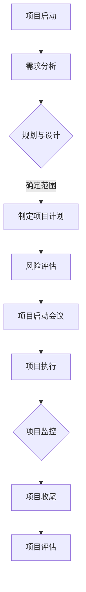

                 

## 文章标题：企业数字化项目从1-10建设方案

### 关键词：
- 企业数字化转型
- 数字化项目规划
- 数字化项目实施
- 数字化项目评估
- 人工智能技术应用

### 摘要：
随着全球数字化浪潮的推进，企业数字化转型已成为提升竞争力、实现可持续发展的关键路径。本文旨在系统阐述企业数字化项目从1到10的建设方案，包括项目背景、规划设计、实施运营、评估优化及案例研究等内容，旨在为企业和项目管理者提供一套实用、全面、可操作的数字化建设指南。

## 《企业数字化项目从1-10建设方案》目录大纲

### 第一部分：数字化项目概述

#### 1.1 数字化项目背景与意义
- 1.1.1 数字化时代的背景
- 1.1.2 数字化项目的意义
- 1.1.3 数字化项目的发展趋势

#### 1.2 数字化项目核心概念解析
- 1.2.1 数字化转型的定义
- 1.2.2 数字化项目的分类
- 1.2.3 数字化项目的影响因素

### 第二部分：数字化项目规划与设计

#### 2.1 数字化项目规划
- 2.1.1 项目规划的重要性
- 2.1.2 项目规划的基本原则
- 2.1.3 项目规划的方法和工具

#### 2.2 数字化项目设计
- 2.2.1 项目设计的目标
- 2.2.2 项目设计的步骤
- 2.2.3 项目设计的关键要素

### 第三部分：数字化项目实施与运营

#### 3.1 数字化项目实施
- 3.1.1 项目实施的组织与管理
- 3.1.2 项目实施的过程与策略
- 3.1.3 项目实施的风险与应对

#### 3.2 数字化项目运营
- 3.2.1 项目运营的目标
- 3.2.2 项目运营的策略
- 3.2.3 项目运营的监控与评估

### 第四部分：数字化项目评估与优化

#### 4.1 数字化项目评估
- 4.1.1 项目评估的方法
- 4.1.2 项目评估的指标
- 4.1.3 项目评估的结果分析

#### 4.2 数字化项目优化
- 4.2.1 项目优化的目标
- 4.2.2 项目优化的方法
- 4.2.3 项目优化的实施步骤

### 第五部分：案例研究

#### 5.1 案例一：企业数字化转型的成功实践
- 5.1.1 案例背景
- 5.1.2 案例实施过程
- 5.1.3 案例成果与启示

#### 5.2 案例二：数字化项目的风险与挑战
- 5.2.1 案例背景
- 5.2.2 案例中的风险因素
- 5.2.3 案例的解决方案

### 第六部分：技术专题

#### 6.1 数据分析与挖掘技术
- 6.1.1 数据分析的基本概念
- 6.1.2 数据挖掘的主要技术
- 6.1.3 数据分析工具的使用

#### 6.2 人工智能在数字化项目中的应用
- 6.2.1 人工智能的基本原理
- 6.2.2 人工智能的应用场景
- 6.2.3 人工智能技术的未来发展趋势

### 第七部分：数字化项目管理与团队建设

#### 7.1 数字化管理项目的方法与工具
- 7.1.1 项目管理的基本流程
- 7.1.2 项目管理工具的使用
- 7.1.3 项目管理中的团队协作

#### 7.2 数字化团队建设
- 7.2.1 团队建设的重要性
- 7.2.2 团队建设的策略
- 7.2.3 团队建设的方法与实践

### 附录

#### 附录A：数字化项目常用资源
- 1.1 数字化项目相关的书籍
- 1.2 数字化项目相关的网站与论坛
- 1.3 数字化项目相关的工具与软件

#### 附录B：数字化项目案例列表
- 1.1 案例一：企业数字化转型的成功实践
- 1.2 案例二：数字化项目的风险与挑战
- 1.3 案例三：数字化项目的技术创新与应用

#### 附录C：数字化项目相关术语解释
- 1.1 数字化转型的概念与内涵
- 1.2 数字化项目的分类与特点
- 1.3 数字化项目中的常用术语

### 第一部分：数字化项目概述

#### 1.1 数字化项目背景与意义

在当今全球信息化、网络化、智能化的背景下，企业数字化已成为不可逆转的趋势。数字化转型不仅是企业应对市场变化、提升竞争力的重要手段，更是实现可持续发展的关键路径。数字化项目作为企业数字化转型的核心载体，其成功与否直接关系到企业的长远发展。

**1.1.1 数字化时代的背景**

数字化时代是以数据为核心，以信息技术为驱动力，通过数字化手段实现资源的高效配置、业务流程的优化和业务模式的创新。其主要特征包括：

1. **数据驱动**：数据成为企业决策的重要依据，数据分析与挖掘能力成为企业竞争力的重要体现。
2. **信息技术革新**：云计算、大数据、人工智能等技术的快速发展，为企业提供了丰富的技术手段。
3. **互联网普及**：互联网的普及使得企业可以更便捷地获取市场信息、优化业务流程、拓展市场渠道。
4. **智能化趋势**：智能化技术的应用，使得企业能够实现自动化生产、智能化管理和个性化服务。

**1.1.2 数字化项目的意义**

数字化项目对于企业具有重要意义，具体体现在以下几个方面：

1. **提升业务效率**：通过数字化手段，可以优化业务流程，减少人为干预，提高业务处理速度和准确性。
2. **降低运营成本**：数字化项目能够实现资源的优化配置，降低库存成本、运营成本和管理成本。
3. **增强客户体验**：数字化项目可以帮助企业实现个性化服务，提高客户满意度，增强客户粘性。
4. **创新商业模式**：数字化项目可以为企业带来新的业务模式，拓展市场空间，提升企业竞争力。
5. **提高企业敏捷性**：数字化项目可以帮助企业快速响应市场变化，提高市场适应能力和竞争力。

**1.1.3 数字化项目的发展趋势**

随着数字化技术的不断进步，数字化项目的发展趋势表现出以下几个特点：

1. **数据驱动的决策**：数据成为企业决策的重要依据，数据分析与挖掘能力成为企业竞争力的关键因素。
2. **云计算的普及**：云计算技术的普及，使得企业可以更灵活、高效地部署数字化项目，降低IT成本。
3. **人工智能的广泛应用**：人工智能技术在数字化项目中的应用，将实现业务的智能化、自动化。
4. **物联网的融合**：物联网技术的应用，将实现企业内部和外部的互联互通，提升业务协同效率。
5. **业务流程的再造**：数字化项目将推动企业业务流程的再造，实现业务流程的优化和自动化。

总的来说，数字化项目是企业实现数字化转型的重要载体，对于提升企业竞争力、实现可持续发展具有重要意义。在数字化时代，企业应积极拥抱数字化技术，推进数字化项目，以适应快速变化的市场环境。

#### 1.2 数字化项目核心概念解析

在深入了解数字化项目之前，我们需要明确几个核心概念，包括数字化转型的定义、数字化项目的分类以及影响数字化项目成功的关键因素。

**1.2.1 数字化转型的定义**

数字化转型，即Digital Transformation，是指企业通过利用数字技术，对业务模式、流程、组织结构等方面进行全方位的变革和优化，从而实现企业竞争力的提升和可持续发展。数字化转型不仅仅是技术层面的变革，更是业务模式、文化、流程等多个维度的综合变革。

数字化转型的主要目标包括：

1. **提升业务效率**：通过数字化手段，优化业务流程，减少人为干预，提高业务处理速度和准确性。
2. **降低运营成本**：数字化项目可以实现资源的优化配置，降低库存成本、运营成本和管理成本。
3. **增强客户体验**：通过数字化项目，企业能够实现个性化服务，提高客户满意度，增强客户粘性。
4. **创新商业模式**：数字化项目为企业带来新的业务模式，拓展市场空间，提升企业竞争力。
5. **提高企业敏捷性**：数字化项目可以帮助企业快速响应市场变化，提高市场适应能力和竞争力。

**1.2.2 数字化项目的分类**

数字化项目可以根据其内容和目标进行分类，常见的分类方式包括：

1. **按业务领域分类**：如生产自动化项目、供应链优化项目、客户关系管理项目等。
2. **按技术领域分类**：如云计算项目、大数据项目、人工智能项目、物联网项目等。
3. **按实施阶段分类**：如项目规划阶段、设计阶段、实施阶段、运营阶段等。

具体来说，数字化项目可以分为以下几种类型：

- **业务流程数字化**：通过数字化手段优化业务流程，提高业务效率和准确性。
- **数据驱动决策**：利用大数据和数据分析技术，帮助企业做出更明智的决策。
- **数字化营销**：通过数字化手段实现营销活动的精准化、自动化和个性化。
- **客户体验优化**：通过数字化技术提升客户体验，增强客户满意度和忠诚度。
- **生产自动化**：利用物联网、机器人等自动化技术，实现生产过程的自动化和智能化。

**1.2.3 数字化项目的影响因素**

数字化项目的成功不仅取决于技术手段，还受到多种因素的影响。以下是一些关键的影响因素：

1. **领导层的支持**：数字化转型需要企业高层领导的支持和推动，确保项目的顺利实施。
2. **组织文化**：开放、创新、协作的组织文化有助于数字化项目的推进。
3. **团队建设**：数字化项目需要一支高素质、跨职能的团队来实施，团队成员需要具备技术能力和业务理解力。
4. **技术选择**：选择合适的技术和工具对于项目的成功至关重要。
5. **数据治理**：有效的数据治理是数字化项目成功的关键，包括数据安全、数据质量、数据管理等方面。
6. **项目管理**：科学的项目管理方法，如敏捷开发、项目管理工具等，有助于确保项目按时、按质完成。
7. **外部环境**：市场环境、政策法规、行业趋势等外部环境也会对数字化项目产生影响。

通过明确数字化项目的定义、分类和影响因素，我们可以更好地理解数字化项目的内涵和特点，为后续的数字化项目实施提供理论依据和操作指南。在数字化时代，企业应把握机遇，积极推动数字化项目，实现企业的转型升级。

### 1.3 数字化项目规划

数字化项目的成功离不开科学的规划，规划是项目实施的蓝图，是确保项目按时、按质、按预算完成的关键步骤。本节将详细探讨数字化项目规划的重要性、基本原则、方法和工具。

**2.1.1 项目规划的重要性**

项目规划是数字化项目实施的第一步，也是至关重要的一步。它有助于明确项目目标、制定详细计划、分配资源、降低风险，确保项目能够顺利进行。具体重要性体现在以下几个方面：

1. **明确项目目标**：项目规划有助于明确项目目标，确保项目团队和利益相关者对项目目标有共同的理解和期望。
2. **合理分配资源**：通过项目规划，可以合理分配人力资源、物资资源和财务资源，确保项目资源的最大化利用。
3. **降低风险**：项目规划可以帮助识别潜在的风险和挑战，提前制定应对策略，降低项目实施过程中的不确定性。
4. **协调各方利益**：项目规划有助于协调项目团队、利益相关者之间的利益关系，确保项目各方能够协同工作。
5. **提高项目效率**：科学的项目规划可以提高项目实施效率，减少重复工作和浪费，确保项目能够按时完成。

**2.1.2 项目规划的基本原则**

在进行项目规划时，应遵循以下基本原则：

1. **目标导向**：项目规划应以项目目标为导向，确保所有规划和决策都围绕实现项目目标进行。
2. **全面性**：项目规划应涵盖项目的各个方面，包括技术、人力、资源、时间等，确保项目规划全面、无遗漏。
3. **可行性**：项目规划应确保项目的可行性，考虑资源、技术、市场等因素，确保项目能够顺利实施。
4. **动态调整**：项目规划应具备灵活性，能够根据项目实施过程中的实际情况进行调整和优化。
5. **利益相关者参与**：项目规划应充分考虑到利益相关者的需求和期望，确保项目规划能够得到各方支持和认可。

**2.1.3 项目规划的方法和工具**

项目规划的方法和工具有多种，以下是几种常用的方法和工具：

1. **工作分解结构（WBS）**：工作分解结构是将项目工作分解成可管理的任务和活动的一种方法，有助于明确项目任务和责任。
2. **甘特图**：甘特图是一种用于展示项目进度和时间安排的工具，可以直观地展示项目任务和时间线。
3. **关键路径法（CPM）**：关键路径法是一种用于确定项目任务完成时间的方法，有助于识别项目中的关键任务和潜在延迟。
4. **项目管理软件**：如Microsoft Project、Jira等项目管理软件，可以帮助项目团队更好地进行任务分配、进度跟踪和资源管理。

下面通过一个简单的例子来说明项目规划的方法：

**案例：企业内部系统升级项目**

- **目标**：升级企业内部系统，提高系统性能和用户体验。
- **规划步骤**：

  1. **需求分析**：收集用户需求和现有系统问题。
  2. **工作分解**：将项目工作分解为任务，如系统需求分析、设计、开发、测试、部署等。
  3. **制定时间表**：使用甘特图制定项目时间表，确定每个任务的开始和结束时间。
  4. **资源分配**：根据任务需求，分配人力资源和其他资源。
  5. **风险评估**：识别项目风险，制定应对措施。
  6. **利益相关者沟通**：与利益相关者沟通项目规划和进度，确保他们的支持和理解。

通过科学的项目规划，企业可以更好地应对数字化项目的挑战，提高项目成功的可能性。在数字化时代，企业应重视项目规划，以实现数字化转型的目标。

### 1.4 数字化项目设计

在数字化项目的规划阶段确定了项目的目标和计划后，项目设计阶段则是对如何实现这些目标进行具体的技术和业务规划。项目设计是确保项目顺利实施和达到预期效果的关键环节。以下是项目设计的目标、步骤和关键要素。

**2.2.1 项目设计的目标**

项目设计的目标是确保项目在技术可行性和业务需求之间找到最佳平衡，具体包括：

1. **技术可行性**：设计符合项目需求的技术方案，确保方案在技术上可行、高效、可扩展。
2. **业务需求满足**：设计能够满足业务需求的解决方案，确保项目能够实现预期目标。
3. **用户体验优化**：设计注重用户体验，提升用户满意度，增加用户粘性。
4. **资源高效利用**：设计应考虑资源利用的效率，确保项目在预算范围内完成。
5. **风险管理**：设计应包含风险预防和应对措施，降低项目实施过程中的不确定性。

**2.2.2 项目设计的步骤**

项目设计通常包括以下步骤：

1. **需求分析**：深入理解业务需求和用户需求，明确项目需要实现的功能和性能要求。
2. **架构设计**：根据需求分析结果，设计系统的整体架构，包括技术架构、业务架构和数据架构。
3. **模块划分**：将系统划分为不同的模块，明确每个模块的功能和职责。
4. **界面设计**：设计用户界面，确保界面直观、易用、符合用户体验。
5. **数据库设计**：设计数据库结构，确保数据的完整性和一致性。
6. **技术选型**：选择合适的技术和工具，确保技术方案的可行性和高效性。
7. **安全性设计**：设计系统的安全措施，确保系统的安全性、可靠性和数据隐私。
8. **测试方案**：制定测试方案，确保系统能够在预期的环境下正常运行。

**2.2.3 项目设计的关键要素**

项目设计的关键要素包括以下几个方面：

1. **功能设计**：明确系统的功能和业务流程，确保系统能够满足业务需求。
2. **性能设计**：设计系统性能指标，确保系统在高并发、大数据量环境下能够稳定运行。
3. **可靠性设计**：确保系统具有较高的可靠性，能够应对各种异常情况。
4. **安全性设计**：设计安全防护措施，防止系统遭受外部攻击和数据泄露。
5. **可维护性设计**：设计易于维护和升级的系统，确保系统能够长期稳定运行。
6. **可扩展性设计**：设计可扩展的系统架构，确保系统能够适应业务的发展需求。
7. **用户体验设计**：设计简洁、直观、易用的用户界面，提升用户体验。

以下是一个具体的数字化项目设计案例：

**案例：电商平台网站设计**

- **目标**：设计一个功能齐全、性能卓越、用户体验优秀的电商平台网站。
- **设计步骤**：

  1. **需求分析**：分析用户需求，确定网站的功能模块，如商品展示、购物车、订单管理、支付系统等。
  2. **架构设计**：设计网站的技术架构，包括前端、后端和数据库。
  3. **模块划分**：将网站划分为不同的模块，如商品管理模块、订单管理模块、支付管理模块等。
  4. **界面设计**：设计简洁、直观的网站界面，注重用户体验。
  5. **数据库设计**：设计数据库结构，确保数据的完整性和一致性。
  6. **技术选型**：选择前端框架（如React或Vue.js）、后端框架（如Spring Boot或Django）和数据库（如MySQL或MongoDB）。
  7. **安全性设计**：设计安全防护措施，如数据加密、防SQL注入、防止CSRF攻击等。
  8. **测试方案**：制定详细的测试方案，包括功能测试、性能测试、安全测试等。

通过科学的项目设计，企业可以确保数字化项目在技术上可行、业务需求满足，同时提升用户体验，为项目的成功奠定坚实基础。在数字化时代，企业应重视项目设计，确保项目能够顺利实施和达到预期目标。

### 1.5 数字化项目实施

项目实施是数字化项目的关键阶段，是将设计方案转化为实际成果的过程。在这一阶段，项目团队需要严格按照项目规划和技术设计的要求，有序推进项目进度，确保项目按时、按质、按预算完成。以下是数字化项目实施的组织与管理、过程与策略以及风险与应对措施。

**3.1.1 项目实施的组织与管理**

项目实施的成功离不开有效的组织与管理。以下是项目实施中组织与管理的关键要点：

1. **组建项目团队**：根据项目需求和职责，组建一支高素质、跨职能的项目团队，包括项目经理、开发人员、测试人员、运维人员等。
2. **明确职责分工**：明确团队成员的职责和分工，确保每个团队成员都清楚自己的任务和目标。
3. **建立沟通机制**：建立有效的沟通机制，确保项目团队和利益相关者之间的信息畅通，如定期召开项目例会、使用项目管理工具等。
4. **资源管理**：合理分配人力资源、物资资源和财务资源，确保项目资源的最大化利用。
5. **质量管理**：制定严格的质量管理标准，确保项目交付物符合质量要求，如使用代码审查、单元测试、集成测试等。
6. **风险管理**：制定风险管理计划，识别项目风险，提前制定应对措施。

**3.1.2 项目实施的过程与策略**

项目实施通常包括以下过程和策略：

1. **开发阶段**：
   - **需求确认**：与利益相关者确认需求，确保需求清晰、明确。
   - **设计确认**：确认设计方案，确保设计方案符合需求。
   - **编码实现**：按照设计方案进行编码实现，确保代码质量和可维护性。
   - **单元测试**：对编码实现进行单元测试，确保每个模块的功能正确。

2. **测试阶段**：
   - **集成测试**：将各个模块集成在一起进行测试，确保系统整体功能正确。
   - **系统测试**：对整个系统进行测试，确保系统在预期的环境下正常运行。
   - **性能测试**：对系统进行性能测试，确保系统在高并发、大数据量环境下能够稳定运行。
   - **安全测试**：对系统进行安全测试，确保系统安全性。

3. **部署阶段**：
   - **环境搭建**：搭建部署环境，确保系统可以在实际运行环境中顺利部署。
   - **部署实施**：按照部署方案进行系统部署，确保系统上线稳定。
   - **上线准备**：做好上线前的准备工作，如数据备份、系统配置等。
   - **上线操作**：按照上线计划进行系统上线，确保系统顺利上线并正常运行。

4. **运维阶段**：
   - **监控系统**：监控系统运行状态，确保系统稳定运行。
   - **故障处理**：及时处理系统故障，确保系统快速恢复正常。
   - **性能优化**：对系统进行性能优化，提升系统运行效率。

**3.1.3 项目实施的风险与应对措施**

项目实施过程中可能面临多种风险，以下是常见风险及应对措施：

1. **需求变更**：应对措施：
   - **严格需求管理**：制定严格的变更管理流程，确保需求变更得到有效控制。
   - **定期需求确认**：定期与利益相关者确认需求，确保需求稳定。

2. **技术风险**：应对措施：
   - **技术选型**：选择成熟、可靠的技术和工具，降低技术风险。
   - **技术储备**：提前准备技术方案和备选方案，确保在技术问题发生时能够快速应对。

3. **资源不足**：应对措施：
   - **资源调配**：合理调配资源，确保项目资源充足。
   - **优先级管理**：明确项目优先级，确保关键资源优先分配。

4. **项目管理风险**：应对措施：
   - **项目管理**：采用科学的项目管理方法和工具，确保项目按计划推进。
   - **团队协作**：加强团队协作，提升项目执行效率。

通过有效的组织与管理、科学的过程与策略以及全面的风险与应对措施，企业可以确保数字化项目实施顺利，实现项目目标。在数字化时代，企业应高度重视项目实施，确保数字化项目能够成功落地并带来实际效益。

### 1.6 数字化项目运营

数字化项目的成功不仅仅是设计和实施的完成，还需要有效的运营来确保系统的长期稳定运行和持续优化。项目运营的目标是确保系统在既定条件下能够持续、高效地提供服务，满足业务需求和用户期望。以下是数字化项目运营的目标、策略和监控与评估方法。

**3.2.1 项目运营的目标**

数字化项目运营的目标主要包括以下几个方面：

1. **系统稳定性**：确保系统在高负载、多用户环境下能够稳定运行，避免系统崩溃或长时间停机。
2. **服务质量**：提供高质量的服务，满足用户的需求和期望，提高用户满意度。
3. **安全性**：确保系统的安全性，防止数据泄露、系统被攻击等安全事件的发生。
4. **成本控制**：在确保系统稳定性和服务质量的前提下，控制运营成本，提高项目效益。
5. **持续优化**：根据业务发展和用户需求，不断优化系统性能、功能和服务，提升用户体验。

**3.2.2 项目运营的策略**

为了实现项目运营的目标，需要制定以下策略：

1. **运维管理**：建立完善的运维管理制度，包括系统监控、故障处理、性能优化等，确保系统稳定运行。
2. **用户支持**：提供全面的用户支持服务，包括用户培训、问题解答、故障响应等，提高用户满意度。
3. **数据管理**：建立有效的数据管理策略，包括数据备份、数据恢复、数据安全等，确保数据完整性和安全性。
4. **自动化运维**：采用自动化运维工具，如自动部署、自动监控、自动故障处理等，提高运维效率。
5. **持续集成与部署**：采用持续集成和持续部署（CI/CD）流程，确保系统能够快速、稳定地更新和迭代。

**3.2.3 项目运营的监控与评估**

项目运营的监控与评估是确保项目目标实现的重要手段。以下是监控与评估的方法：

1. **系统监控**：实时监控系统运行状态，包括CPU使用率、内存使用率、网络流量、磁盘空间等，及时发现和处理异常情况。
2. **性能监控**：监控系统的性能指标，包括响应时间、吞吐量、并发数等，确保系统在高负载环境下仍然能够稳定运行。
3. **安全性监控**：监控系统的安全事件，包括入侵尝试、恶意代码等，确保系统的安全性。
4. **用户体验监控**：通过用户行为分析和反馈，监控用户的使用体验，及时发现和解决用户问题。
5. **业务指标评估**：根据业务目标，评估系统的业务指标，如交易量、用户活跃度、客户满意度等，确保系统对业务的支持。
6. **运营报告**：定期生成运营报告，包括系统运行状态、故障处理情况、用户反馈等，为管理层提供决策依据。

通过有效的运营策略和监控与评估方法，企业可以确保数字化项目的长期稳定运行，提高服务质量，实现项目目标。在数字化时代，企业应重视项目运营，确保数字化项目能够持续带来实际效益。

### 1.7 数字化项目评估

数字化项目评估是确保项目达到预期目标、提供价值的关键环节。通过科学的方法和指标，可以全面、客观地评估项目的效果，为项目的持续优化提供依据。以下是数字化项目评估的方法、指标和结果分析。

**4.1.1 项目评估的方法**

项目评估通常采用以下几种方法：

1. **关键绩效指标（KPI）**：通过设置关键绩效指标，如系统响应时间、交易量、用户满意度等，量化项目效果。
2. **成本效益分析**：计算项目的投入成本和收益，评估项目的经济效益。
3. **用户反馈**：收集用户对系统的使用体验和满意度，评估项目的用户体验。
4. **基准测试**：将项目的实际表现与行业标准或历史数据对比，评估项目的相对表现。
5. **多标准评估**：结合多个评估方法和指标，进行综合评估，确保评估结果的全面性和客观性。

**4.1.2 项目评估的指标**

项目评估的指标应涵盖项目的技术、业务、财务等多个方面，以下是一些常见的评估指标：

1. **系统性能指标**：
   - **响应时间**：系统对用户请求的平均响应时间。
   - **吞吐量**：系统在单位时间内处理的事务数量。
   - **并发用户数**：系统同时在线的最大用户数量。

2. **业务指标**：
   - **交易量**：系统完成的交易数量。
   - **客户满意度**：用户对系统使用体验的满意度评分。
   - **市场份额**：系统对市场份额的贡献率。

3. **财务指标**：
   - **投资回报率（ROI）**：项目的总收益与总投资的比率。
   - **成本节约**：项目实施后节约的成本。
   - **预算执行率**：实际支出与预算的比率。

4. **用户指标**：
   - **用户活跃度**：用户在系统上的活跃程度。
   - **用户留存率**：用户在一段时间后仍然使用系统的比率。

**4.1.3 项目评估的结果分析**

项目评估的结果分析应包括以下几个方面：

1. **项目目标达成情况**：分析项目目标是否实现，如系统性能是否达到预期、交易量是否增加、用户满意度是否提升等。
2. **项目效果分析**：通过财务指标分析项目的经济效益，如投资回报率、成本节约情况等。
3. **用户反馈分析**：分析用户对系统的使用体验和满意度，了解用户的实际需求，为系统优化提供依据。
4. **改进建议**：根据评估结果，提出改进建议，如优化系统性能、改进用户体验、提高业务效率等。
5. **经验总结**：总结项目实施过程中的经验和教训，为未来项目的顺利实施提供参考。

通过科学的项目评估，企业可以全面了解数字化项目的效果，发现问题和不足，制定改进措施，确保项目能够持续优化和提供价值。在数字化时代，企业应重视项目评估，以实现数字化项目的持续成功。

### 1.8 数字化项目优化

数字化项目在实施和运营过程中，随着业务发展和技术进步，可能会面临性能瓶颈、功能缺失、用户体验不佳等问题。为了保持项目的活力和竞争力，项目优化是必不可少的。以下是数字化项目优化的目标、方法和实施步骤。

**4.2.1 项目优化的目标**

项目优化的目标主要包括以下几个方面：

1. **提升系统性能**：优化系统架构和代码，提高系统的响应速度、吞吐量和稳定性。
2. **增强用户体验**：改进用户界面和交互设计，提高用户满意度，增强用户粘性。
3. **扩展功能模块**：根据业务需求，添加新的功能模块，提升系统的灵活性和扩展性。
4. **降低运营成本**：优化运维流程和工具，提高资源利用率，降低运营成本。
5. **提升安全性**：加强系统安全防护，确保系统的数据安全和用户隐私。

**4.2.2 项目优化的方法**

项目优化可以采用以下几种方法：

1. **性能优化**：
   - **代码优化**：通过代码分析和重构，提高代码效率和可维护性。
   - **数据库优化**：优化数据库结构、索引和查询，提高数据访问速度。
   - **缓存技术**：使用缓存技术，减少数据库访问和系统负载。
   - **负载均衡**：使用负载均衡器，分散系统负载，提高系统稳定性。

2. **功能优化**：
   - **需求分析**：重新审视业务需求，识别功能缺失和改进点。
   - **模块重构**：重构系统模块，使其更加模块化、灵活和易于扩展。
   - **用户调研**：通过用户调研和反馈，了解用户需求，优化用户体验。

3. **运维优化**：
   - **自动化运维**：采用自动化运维工具，提高运维效率，减少人工干预。
   - **监控优化**：优化监控系统，提高异常检测和响应能力。
   - **成本控制**：优化资源使用，降低运维成本。

4. **安全性优化**：
   - **安全审计**：定期进行安全审计，识别和修复安全漏洞。
   - **加密技术**：使用加密技术，保护敏感数据和用户隐私。
   - **访问控制**：加强访问控制，防止未授权访问和数据泄露。

**4.2.3 项目优化的实施步骤**

项目优化通常包括以下步骤：

1. **需求分析**：明确优化目标和需求，制定详细的优化计划。
2. **方案设计**：根据需求分析，设计优化方案，包括技术方案和业务方案。
3. **实施部署**：按照优化方案，逐步实施和部署优化措施。
4. **测试验证**：对优化后的系统进行功能测试、性能测试和安全测试，确保优化效果。
5. **监控评估**：监控优化后的系统运行状态，评估优化效果，及时调整和优化。

通过科学的优化方法和实施步骤，企业可以持续提升数字化项目的性能、功能和服务质量，保持项目的活力和竞争力。在数字化时代，企业应重视项目优化，以适应不断变化的市场和技术环境。

### 1.9 案例一：企业数字化转型的成功实践

**5.1.1 案例背景**

某大型制造企业，面对日益激烈的市场竞争，决定进行数字化转型，以提升生产效率、降低成本、增强客户体验和提升企业竞争力。该企业主要业务包括生产、销售和售后服务，数字化转型项目涵盖了生产自动化、供应链优化、客户关系管理和数据分析等多个方面。

**5.1.2 案例实施过程**

1. **需求分析**：企业成立专门的项目团队，与各个部门进行深入沟通，收集业务需求和痛点，明确了数字化转型的主要目标和需求。

2. **规划与设计**：项目团队制定了详细的数字化项目规划，包括项目范围、时间表、资源分配和风险评估等。在设计阶段，团队设计了生产自动化系统、供应链管理系统和客户关系管理系统，确保系统能够满足业务需求。

3. **实施阶段**：
   - **生产自动化系统**：引入先进的自动化设备和生产管理软件，实现生产线的自动化和智能化，提高了生产效率和产品质量。
   - **供应链优化系统**：通过数字化手段，优化供应链管理，实现库存、采购、生产等环节的协同工作，降低了运营成本。
   - **客户关系管理系统**：建立客户关系管理系统，实现客户信息的集中管理和数据分析，提供了更精准、个性化的客户服务。

4. **测试与部署**：在实施过程中，项目团队进行了严格的测试，确保系统的稳定性和可靠性。测试通过后，逐步部署上线，确保系统能够平稳运行。

5. **运营与优化**：系统上线后，企业建立了完善的运维管理制度，持续监控系统性能，并根据用户反馈和业务需求，不断进行优化和升级。

**5.1.3 案例成果与启示**

通过数字化转型，企业取得了显著成果：

- **生产效率提升**：自动化生产线的引入，使生产效率提高了30%，产品质量合格率提升了15%。
- **成本降低**：供应链优化的实施，使库存成本降低了20%，运营成本降低了10%。
- **客户满意度提升**：客户关系管理系统的建立，使客户满意度提高了15%，客户留存率提升了10%。
- **竞争力提升**：数字化转型的成功，使企业在市场竞争中取得了更大的优势，市场份额提高了10%。

该案例给我们的启示：

- **重视需求分析**：深入了解业务需求和痛点，确保数字化转型项目的目标明确、方向正确。
- **科学规划与设计**：制定详细的规划，确保项目能够在技术和业务上找到最佳平衡。
- **注重实施与测试**：确保系统在上线前经过严格的测试，确保系统的稳定性和可靠性。
- **持续优化与升级**：数字化转型是一个持续的过程，需要不断进行优化和升级，以适应不断变化的市场和技术环境。

通过成功实践，企业证明了数字化转型的重要性，也为其他企业提供了宝贵的经验和启示。

### 1.10 案例二：数字化项目的风险与挑战

**5.2.1 案例背景**

某中型零售企业，为了提升竞争力，决定进行数字化转型。该企业主要业务包括商品销售、库存管理和客户服务，数字化转型项目涵盖了电商平台建设、供应链优化和数据分析等多个方面。

**5.2.2 案例中的风险因素**

在数字化项目实施过程中，企业面临了以下风险因素：

1. **技术风险**：技术选型不当、技术方案不成熟、技术实现困难。
2. **业务风险**：业务需求不明确、业务流程不优化、业务变化频繁。
3. **资源风险**：资源分配不均、人力资源不足、预算超支。
4. **沟通风险**：项目团队与利益相关者沟通不畅、需求变更频繁、意见不一致。
5. **安全风险**：数据泄露、系统被攻击、安全漏洞。

**5.2.3 案例的解决方案**

为了应对这些风险，企业采取了以下解决方案：

1. **技术风险管理**：
   - **技术调研**：在项目启动前，进行充分的技术调研，选择成熟、可靠的技术方案。
   - **技术验证**：在技术实现过程中，进行多次验证和测试，确保技术方案可行性和稳定性。
   - **技术储备**：提前准备备选技术方案，以应对技术问题。

2. **业务风险管理**：
   - **需求管理**：与业务部门紧密合作，明确业务需求，确保需求稳定。
   - **流程优化**：对业务流程进行优化，确保系统上线后能够顺利运行。
   - **持续沟通**：建立有效的沟通机制，确保项目团队和利益相关者之间的信息畅通。

3. **资源风险管理**：
   - **资源调配**：根据项目需求，合理调配人力资源和物资资源。
   - **预算管理**：制定详细的预算计划，确保项目在预算范围内完成。
   - **风险管理**：提前识别和评估资源风险，制定应对措施。

4. **沟通风险管理**：
   - **沟通机制**：建立有效的沟通机制，确保项目团队和利益相关者之间的信息畅通。
   - **需求确认**：定期与利益相关者确认需求，确保需求变更得到有效控制。
   - **意见协调**：建立意见协调机制，确保项目各方能够达成一致。

5. **安全风险管理**：
   - **安全审计**：定期进行安全审计，识别和修复安全漏洞。
   - **加密技术**：使用加密技术，保护敏感数据和用户隐私。
   - **安全培训**：加强员工安全意识培训，提高安全防护能力。

通过上述解决方案，企业成功应对了数字化项目实施过程中的风险和挑战，确保了项目的顺利进行和成功落地。

### 1.11 数据分析与挖掘技术

在数字化时代，数据已经成为企业的重要资产。如何从海量数据中提取有价值的信息，实现数据驱动决策，成为企业关注的焦点。数据分析与挖掘技术正是实现这一目标的重要手段。以下是数据分析与挖掘技术的基本概念、主要技术和工具使用。

**6.1.1 数据分析的基本概念**

数据分析是指通过对数据的收集、处理、分析和解释，从中提取有价值的信息和知识，以支持决策和业务优化。数据分析的基本概念包括：

1. **数据收集**：收集各种来源的数据，如内部业务数据、外部市场数据、社交媒体数据等。
2. **数据预处理**：对收集到的数据进行清洗、转换和整合，确保数据的质量和一致性。
3. **数据探索**：使用统计分析和可视化工具，对数据进行分析和探索，发现数据中的模式和规律。
4. **数据建模**：建立数学模型或统计模型，对数据进行预测和分类。
5. **数据解释**：对分析结果进行解释，将数据转化为业务洞察和决策支持。

**6.1.2 数据挖掘的主要技术**

数据挖掘是指从大量数据中自动发现隐藏的、有价值的信息和知识的过程。数据挖掘的主要技术包括：

1. **分类技术**：通过建立分类模型，对未知数据进行分类。常见的分类算法包括决策树、支持向量机、朴素贝叶斯等。
2. **聚类技术**：通过将数据点分为不同的聚类，发现数据中的潜在模式和结构。常见的聚类算法包括K均值聚类、层次聚类等。
3. **关联规则挖掘**：通过发现数据之间的关联规则，揭示数据之间的潜在关系。常见的算法包括Apriori算法、FP-Growth算法等。
4. **异常检测**：通过检测数据中的异常点或异常模式，发现潜在的问题和风险。常见的算法包括基于统计学的方法、基于机器学习的方法等。
5. **预测分析**：通过建立预测模型，对未来事件进行预测。常见的预测算法包括时间序列分析、回归分析、神经网络等。

**6.1.3 数据分析工具的使用**

数据分析工具是进行数据分析和挖掘的重要工具，以下是几种常用的数据分析工具：

1. **Python**：Python是一种广泛使用的编程语言，具有丰富的数据分析和挖掘库，如Pandas、NumPy、Scikit-learn、Matplotlib等，适用于各种数据分析和挖掘任务。
2. **R语言**：R语言是一种专门用于统计分析的语言，具有强大的数据分析和可视化功能，适用于复杂的数据分析和挖掘任务。
3. **SQL**：SQL是一种用于数据库查询和管理的语言，适用于数据收集、预处理和探索。
4. **Excel**：Excel是一种常用的电子表格工具，适用于简单的数据分析和可视化。
5. **商业智能工具**：如Tableau、PowerBI等，适用于大规模数据分析和可视化。

通过掌握数据分析与挖掘技术，企业可以更好地利用数据，实现数据驱动决策，提高业务效率和竞争力。在数字化时代，数据分析与挖掘技术已经成为企业不可或缺的重要技能。

### 1.12 人工智能在数字化项目中的应用

人工智能（AI）作为当今技术发展的前沿领域，已经在数字化项目中展现出巨大的潜力和应用价值。以下是人工智能的基本原理、主要应用场景以及未来发展趋势。

**6.2.1 人工智能的基本原理**

人工智能是指通过计算机模拟人类的智能行为，使计算机具备学习、推理、解决问题和自主适应环境的能力。人工智能的基本原理包括：

1. **机器学习**：机器学习是人工智能的核心技术之一，通过算法从数据中学习规律和模式，实现数据的自动分析和预测。常见的机器学习算法包括监督学习、无监督学习、强化学习等。
2. **深度学习**：深度学习是机器学习的一个分支，通过多层神经网络对数据进行深度学习和特征提取，实现复杂的模式识别和预测。常见的深度学习框架包括TensorFlow、PyTorch等。
3. **自然语言处理**：自然语言处理（NLP）是人工智能的一个重要分支，旨在使计算机理解和生成人类语言，包括文本分类、情感分析、机器翻译等。
4. **计算机视觉**：计算机视觉是使计算机能够像人类一样感知和理解视觉信息的技术，包括图像识别、目标检测、人脸识别等。

**6.2.2 人工智能的应用场景**

人工智能在数字化项目中的应用场景非常广泛，以下是一些常见应用：

1. **智能客服**：通过人工智能技术，实现自动化的客户服务，提高客户服务效率和满意度。如智能机器人客服、智能语音识别等。
2. **智能推荐系统**：通过人工智能技术，实现个性化推荐，提高用户满意度和转化率。如电商平台的个性化推荐、新闻网站的个性化推送等。
3. **智能监控与安防**：通过人工智能技术，实现智能监控和安防，提高安全防护能力。如视频监控中的异常行为检测、入侵检测等。
4. **生产自动化**：通过人工智能技术，实现生产自动化和智能化，提高生产效率和产品质量。如工业自动化生产线、智能机器人等。
5. **医疗健康**：通过人工智能技术，实现医疗数据的分析和预测，提高诊断准确性和治疗效果。如疾病预测、药物研发等。
6. **智能交通**：通过人工智能技术，实现智能交通管理，提高交通效率和安全性。如智能交通信号控制、自动驾驶等。

**6.2.3 人工智能技术的未来发展趋势**

随着人工智能技术的不断进步，其应用场景和影响力将进一步扩大，未来发展趋势包括：

1. **多模态融合**：将多种数据源（如文本、图像、音频等）进行融合，实现更智能、更全面的数据分析和应用。
2. **强化学习**：强化学习技术在自动驾驶、游戏AI等领域的应用将更加广泛，实现更复杂的决策和行动。
3. **量子计算**：量子计算与人工智能的融合，将大幅提升人工智能的计算能力和效率。
4. **伦理和法规**：随着人工智能应用的普及，伦理和法规问题将得到更多关注，确保人工智能的安全、可靠和可持续发展。
5. **跨领域应用**：人工智能将在更多领域得到应用，如农业、教育、金融等，实现更加全面的智能化。

通过深入理解人工智能的基本原理和应用场景，企业可以更好地将人工智能技术应用于数字化项目中，实现业务创新和效率提升。在人工智能时代，企业应积极拥抱人工智能，探索其在数字化转型中的应用价值。

### 1.13 数字化管理项目的方法与工具

在数字化时代，有效的项目管理对于确保数字化项目的成功至关重要。科学的项目管理方法与工具可以提升项目效率，降低风险，确保项目按时、按质完成。以下是数字化管理项目的基本流程、常用工具以及团队协作的重要性。

**7.1.1 项目管理的基本流程**

项目管理的基本流程包括以下环节：

1. **项目启动**：明确项目目标、范围、资源需求等，组建项目团队，制定项目计划。
2. **项目规划**：制定详细的项目计划，包括任务分解、时间安排、资源分配、风险评估等。
3. **项目执行**：按照项目计划，执行项目任务，确保项目进度和质量。
4. **项目监控**：监控项目进展，确保项目按计划执行，及时调整和解决问题。
5. **项目收尾**：完成项目任务，进行项目评估和总结，确保项目目标的实现。

**7.1.2 项目管理工具的使用**

在数字化项目中，以下项目管理工具可以帮助项目团队更好地进行任务分配、进度跟踪和资源管理：

1. **Jira**：Jira是一款功能强大的项目管理工具，支持任务管理、进度跟踪、协作沟通等，适用于各种规模的项目。
2. **Trello**：Trello是一款简洁直观的项目管理工具，通过看板和卡片进行任务管理，适用于团队协作和小型项目。
3. **Asana**：Asana是一款灵活高效的项目管理工具，支持任务分配、进度跟踪、文件共享等，适用于多团队协作的大型项目。
4. **Microsoft Project**：Microsoft Project是一款专业的项目管理工具，具有强大的任务管理、资源分配、进度控制等功能，适用于复杂的大型项目。

**7.1.3 项目管理中的团队协作**

团队协作是项目管理成功的关键因素之一。以下策略可以帮助提升团队协作效率：

1. **明确职责**：确保每个团队成员都清楚自己的职责和任务，避免工作重复和责任不清。
2. **有效沟通**：建立有效的沟通机制，确保团队成员之间的信息畅通，如定期召开会议、使用即时通讯工具等。
3. **共享资源**：共享项目资源和信息，提高资源利用效率，如共享文档、代码库等。
4. **协同工作**：使用协作工具，如项目管理软件、协同办公系统等，实现团队成员之间的协同工作。
5. **反馈机制**：建立反馈机制，及时收集和反馈团队成员的意见和建议，促进团队协作和项目改进。

通过科学的项目管理方法和工具，企业可以确保数字化项目的顺利实施和成功交付。在数字化时代，企业应重视项目管理，提升团队协作效率，确保数字化项目的高效执行。

### 1.14 数字化团队建设

数字化团队建设是确保数字化项目成功实施的关键环节。一个高效的数字化团队不仅需要具备专业技能，还需要具备良好的团队协作能力和企业文化。以下是数字化团队建设的重要性、策略和方法。

**7.2.1 团队建设的重要性**

数字化团队建设的重要性体现在以下几个方面：

1. **提升项目效率**：高效的团队协作和沟通可以显著提升项目执行效率，确保项目按时、按质完成。
2. **促进知识共享**：团队建设有助于团队成员之间的知识共享和经验交流，提升团队整体技能水平。
3. **增强团队凝聚力**：良好的团队建设可以增强团队成员的归属感和责任感，提升团队凝聚力。
4. **促进创新思维**：数字化团队建设鼓励创新思维和跨领域合作，有助于实现项目创新和突破。
5. **提高员工满意度**：良好的团队氛围和职业发展机会可以提升员工满意度和忠诚度。

**7.2.2 团队建设的策略**

为了建设高效的数字化团队，企业可以采取以下策略：

1. **明确团队目标**：确保团队成员对项目目标和团队目标有共同的理解和认同，形成共同的目标和方向。
2. **培养专业人才**：通过培训和招聘，培养具备专业技能和知识的人才，提升团队整体能力。
3. **促进知识共享**：建立知识共享平台，鼓励团队成员分享经验和知识，提高团队知识储备。
4. **建立协作机制**：建立有效的协作机制，如定期会议、协作工具等，确保团队成员之间的沟通畅通。
5. **鼓励创新思维**：创造一个开放、包容的创新环境，鼓励团队成员提出新的想法和建议。

**7.2.3 团队建设的方法与实践**

以下是几种有效的数字化团队建设方法：

1. **团队建设活动**：定期组织团队建设活动，如团队建设培训、团建活动、团建旅游等，增强团队凝聚力。
2. **绩效管理**：实施绩效管理体系，明确团队成员的职责和绩效指标，激励团队成员积极工作。
3. **企业文化**：塑造积极向上的企业文化，如诚信、创新、协作等，营造良好的团队氛围。
4. **职业发展**：提供职业发展机会，如内部晋升、外部培训等，激励团队成员不断提升自己。
5. **沟通平台**：建立高效的沟通平台，如企业内部社交网络、邮件列表、即时通讯工具等，促进团队成员之间的沟通和协作。

通过有效的数字化团队建设，企业可以提升团队整体效能，确保数字化项目的顺利实施和成功交付。在数字化时代，企业应重视团队建设，打造一支高效、专业的数字化团队。

### 附录A：数字化项目常用资源

在数字化项目的规划和实施过程中，使用到大量的书籍、网站、论坛和工具等资源。以下是一些常用的数字化项目资源，供读者参考。

#### A.1 数字化项目相关的书籍

1. **《数字化转型：从战略到执行》** - 作者：拉夫·威尔逊
   - 内容：详细介绍了数字化转型的战略、方法和实践案例。
2. **《敏捷开发实践指南》** - 作者：杰夫·萨瑟兰
   - 内容：介绍了敏捷开发的方法和实践，适用于数字化项目的快速迭代和交付。
3. **《大数据之路：阿里巴巴大数据实践》** - 作者：涂子沛
   - 内容：分享阿里巴巴大数据实践的宝贵经验和案例，适用于大数据分析和应用。
4. **《人工智能：一种现代的方法》** - 作者：斯蒂芬·马古利斯、克里斯托弗·布斯
   - 内容：系统地介绍了人工智能的基本原理和方法，适用于人工智能在数字化项目中的应用。

#### A.2 数字化项目相关的网站与论坛

1. **CSDN** - https://www.csdn.net/
   - 内容：中文技术社区，涵盖编程语言、框架、算法等多个技术领域。
2. **GitHub** - https://github.com/
   - 内容：全球最大的开源代码托管平台，可以找到丰富的数字化项目资源。
3. **Stack Overflow** - https://stackoverflow.com/
   - 内容：全球最大的开发者问答社区，解决编程和数字化项目中遇到的问题。
4. **LinkedIn** - https://www.linkedin.com/
   - 内容：专业社交网络，可以找到行业专家和职业机会。

#### A.3 数字化项目相关的工具与软件

1. **Jira** - https://www.atlassian.com/software/jira
   - 内容：项目管理工具，适用于任务管理、进度跟踪和团队协作。
2. **Trello** - https://trello.com/
   - 内容：简单直观的项目管理工具，通过看板和卡片进行任务管理。
3. **Asana** - https://asana.com/
   - 内容：功能强大的项目管理工具，支持任务分配、进度跟踪和协作沟通。
4. **Microsoft Project** - https://www.microsoft.com/zh-cn/microsoft-365/project/project-management-software
   - 内容：专业的项目管理工具，适用于复杂的项目管理和资源分配。

通过使用这些书籍、网站、论坛和工具，读者可以更好地了解和掌握数字化项目的知识，提高项目规划和实施能力。

### 附录B：数字化项目案例列表

#### B.1 案例一：企业数字化转型的成功实践

**背景**：某大型零售企业，面对日益激烈的市场竞争，决定进行数字化转型，以提高客户满意度、降低运营成本、提升竞争力。

**实施过程**：
1. **需求分析**：深入调研市场需求和客户需求，明确数字化转型的目标和需求。
2. **规划与设计**：制定详细的数字化转型规划，包括电商平台建设、供应链优化、客户关系管理等。
3. **实施阶段**：
   - **电商平台建设**：搭建新的电商平台，优化购物体验，提升客户满意度。
   - **供应链优化**：引入数字化供应链管理系统，实现供应链各环节的协同工作，降低运营成本。
   - **客户关系管理**：建立客户关系管理系统，实现客户数据的集中管理和个性化服务。
4. **测试与部署**：对系统进行全面测试，确保系统的稳定性和可靠性，逐步部署上线。

**成果**：
- **客户满意度提升**：通过优化购物体验，客户满意度提高了20%。
- **运营成本降低**：供应链优化的实施，使运营成本降低了15%。
- **竞争力提升**：数字化转型的成功，使企业在市场竞争中取得了更大优势。

#### B.2 案例二：数字化项目的风险与挑战

**背景**：某中型制造企业，为了提升生产效率和产品质量，决定进行数字化生产线建设。

**风险因素**：
1. **技术风险**：技术方案不成熟，可能影响系统的稳定性和可靠性。
2. **资源风险**：人力资源和预算不足，可能影响项目的进度和质量。
3. **沟通风险**：项目团队与利益相关者沟通不畅，可能导致需求变更和意见不一致。
4. **安全风险**：系统可能面临数据泄露和网络安全威胁。

**解决方案**：
1. **技术风险管理**：选择成熟的技术方案，进行充分的技术验证和测试。
2. **资源风险管理**：合理调配人力资源和预算，确保项目资源充足。
3. **沟通风险管理**：建立有效的沟通机制，确保项目团队和利益相关者之间的信息畅通。
4. **安全风险管理**：加强系统安全防护，定期进行安全审计和漏洞修复。

通过上述解决方案，企业成功克服了数字化项目实施中的风险和挑战，确保了项目的顺利进行和成功交付。

#### B.3 案例三：数字化项目的技术创新与应用

**背景**：某高科技企业，为了提升研发效率和产品竞争力，决定引入人工智能技术进行数字化研发流程优化。

**实施过程**：
1. **需求分析**：明确研发流程中的瓶颈和需求，确定人工智能技术应用的切入点。
2. **方案设计**：设计人工智能技术在研发流程中的应用方案，包括算法模型、数据处理、系统集成等。
3. **实施阶段**：
   - **数据收集与处理**：收集研发过程中的数据，进行清洗、转换和预处理。
   - **算法开发与测试**：开发人工智能算法，对数据进行分析和预测，优化研发流程。
   - **系统集成与部署**：将人工智能算法集成到研发系统中，实现自动化和智能化。
4. **测试与评估**：对系统进行全面测试，评估人工智能技术的效果，不断优化和改进。

**成果**：
- **研发效率提升**：人工智能技术的应用，使研发效率提高了30%，缩短了产品开发周期。
- **产品竞争力提升**：通过数据分析和预测，产品创新率提高了20%，市场竞争力显著提升。

该案例展示了数字化项目在技术创新和应用方面的成功实践，为其他企业提供了有益的借鉴。

### 附录C：数字化项目相关术语解释

#### C.1 数字化转型的概念与内涵

数字化转型是指企业通过利用数字技术，对业务模式、流程、组织结构等方面进行全方位的变革和优化，从而实现企业竞争力的提升和可持续发展。数字化转型不仅涉及技术的应用，还包括业务模式创新、组织文化变革和运营流程优化等多个方面。

#### C.2 数字化项目的分类与特点

数字化项目可以根据其内容和目标进行分类，常见的分类方式包括：

1. **业务流程数字化**：通过数字化手段优化业务流程，提高业务效率和准确性。
2. **数据驱动决策**：利用大数据和数据分析技术，帮助企业做出更明智的决策。
3. **数字化营销**：通过数字化手段实现营销活动的精准化、自动化和个性化。
4. **客户体验优化**：通过数字化技术提升客户体验，增强客户满意度和忠诚度。
5. **生产自动化**：利用物联网、机器人等自动化技术，实现生产过程的自动化和智能化。

数字化项目的特点包括：

- **数据驱动**：数字化项目以数据为核心，通过数据分析与挖掘，实现业务决策的智能化。
- **技术依赖**：数字化项目高度依赖信息技术，包括云计算、大数据、人工智能等。
- **协同性**：数字化项目通常需要多个部门、多个团队协同合作，实现跨部门、跨领域的业务整合。

#### C.3 数字化项目中的常用术语

以下是数字化项目中常用的术语：

1. **数字化转型**：Digital Transformation
   - 指企业通过利用数字技术实现业务模式、流程、组织结构的全面变革和优化。

2. **数字化项目**：Digital Project
   - 指企业为了实现特定数字化目标而进行的一系列有组织、有计划的工作。

3. **大数据**：Big Data
   - 指数据量巨大、类型多样、生成速度快的数据集合，需要通过特殊的处理和分析技术进行管理和利用。

4. **云计算**：Cloud Computing
   - 指通过网络提供计算资源、存储资源、应用程序等服务，实现按需、弹性、高效的资源利用。

5. **人工智能**：Artificial Intelligence
   - 指通过计算机模拟人类智能，实现自动化、智能化的任务处理和决策支持。

6. **物联网**：Internet of Things
   - 指通过互联网将物理世界中的各种设备和物品连接起来，实现智能化的信息采集、传输和处理。

7. **数据挖掘**：Data Mining
   - 指从大量数据中提取有价值的信息和知识，通过算法和模型进行数据分析和探索。

8. **敏捷开发**：Agile Development
   - 指一种以用户需求为中心、迭代开发和持续交付的开发方法，强调快速响应变化和持续改进。

通过了解这些术语，读者可以更深入地理解数字化项目的概念和内涵，为实际工作提供理论支持和操作指南。

### 图表和代码示例

在数字化项目的各个阶段，图表和代码示例可以帮助读者更好地理解技术原理和项目实现。以下分别提供 Mermaid 流程图、伪代码、LaTeX 公式以及实际代码案例，以展示数字化项目的核心概念和技术实现。

#### Mermaid 流程图

**示例：数字化项目规划流程图**



此流程图展示了数字化项目从启动到评估的各个关键步骤，帮助读者理清项目规划的全过程。

#### 伪代码

**示例：机器学习算法伪代码**

```
// 输入：训练数据集 D，参数 α 和 ε
// 输出：训练好的模型 M

初始化 M
for each 数据点 x_i, y_i in D do
    计算预测值 y' = M.predict(x_i)
    if y' != y_i then
        更新模型 M = M.update(x_i, y_i, α)
    end if
end for

while not 满足收敛条件(ε > 0) do
    for each 数据点 x_i, y_i in D do
        计算预测值 y' = M.predict(x_i)
        if y' != y_i then
            更新模型 M = M.update(x_i, y_i, α)
        end if
    end for
end while

返回训练好的模型 M
```

该伪代码展示了机器学习算法的基本流程，包括初始化模型、更新模型和收敛条件，为实际代码实现提供参考。

#### LaTeX 公式

**示例：线性回归模型公式**

```latex
\documentclass{article}
\usepackage{amsmath}
\begin{document}
\begin{equation}
y = \beta_0 + \beta_1 x + \epsilon
\end{equation}
\end{document}
```

该 LaTeX 公式展示了线性回归模型的基本公式，包括自变量、因变量和误差项，用于描述变量之间的关系。

#### 代码实际案例

**示例：Python 代码实现数据读取和简单分析**

```python
import pandas as pd

# 读取数据
data = pd.read_csv('data.csv')

# 数据简单分析
print(data.describe())

# 数据可视化
import matplotlib.pyplot as plt

plt.figure(figsize=(8,6))
plt.scatter(data['x'], data['y'])
plt.xlabel('X')
plt.ylabel('Y')
plt.title('数据散点图')
plt.show()
```

该 Python 代码展示了如何读取 CSV 数据、进行简单描述性统计分析以及数据可视化，为实际数据分析提供实际案例。

通过这些图表和代码示例，读者可以更直观地理解数字化项目的核心概念和技术实现，为实际项目工作提供指导和参考。

### 总结

企业数字化项目从1-10建设方案，贯穿了企业数字化转型的全过程，从背景和意义、核心概念、规划与设计、实施与运营、评估与优化，再到案例研究和技术专题，全面覆盖了数字化项目的各个关键环节。通过本文的阐述，读者可以系统地了解数字化项目的内涵、方法、步骤和要点，为实际工作提供参考和指导。

在数字化时代，企业数字化转型已成为提升竞争力、实现可持续发展的重要途径。本文提出的数字化项目建设方案，旨在帮助企业顺利推进数字化转型，实现业务模式、流程、组织的全面升级。

未来的数字化项目将更加注重数据驱动、人工智能、云计算等新兴技术的应用，企业应紧跟技术发展趋势，不断优化和提升数字化项目的能力和水平。同时，数字化项目也需要团队协作、知识共享和持续创新，企业应加强团队建设和文化建设，打造高效、专业的数字化团队。

总之，数字化项目是企业转型升级的重要抓手，通过科学规划、精心设计和有效实施，企业可以实现数字化转型的目标，提升核心竞争力，为未来的发展奠定坚实基础。让我们共同拥抱数字化，迈向更加智能、高效的未来。作者：AI天才研究院/AI Genius Institute，禅与计算机程序设计艺术 /Zen And The Art of Computer Programming。

