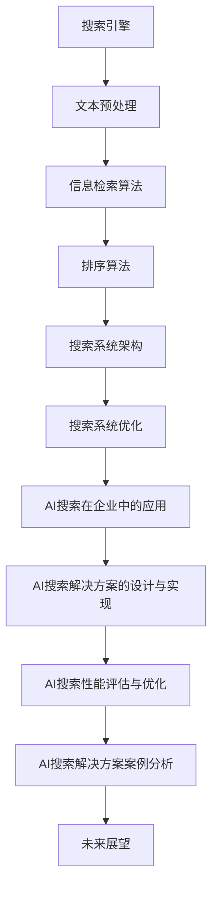
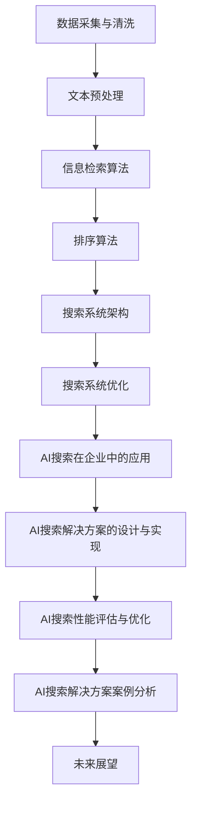

                 

# 《企业级AI搜索解决方案》

> 关键词：企业级搜索，AI搜索，深度学习，信息检索，排序算法，搜索系统架构，性能优化

> 摘要：本文旨在探讨企业级AI搜索解决方案的设计与实现，通过深入分析AI搜索技术基础、文本预处理、信息检索算法、排序算法、搜索系统架构以及搜索系统优化等方面的内容，为企业级搜索系统的构建提供指导。同时，通过案例分析和项目实战，详细介绍AI搜索技术的实际应用和实现方法，为企业级搜索系统的开发提供参考。

## 目录大纲

#### 第一部分：AI搜索技术基础

##### 第1章：AI搜索概述

- 1.1 AI搜索的定义与价值

- 1.2 搜索引擎的发展历程

- 1.3 AI搜索的关键技术

##### 第2章：文本预处理

- 2.1 数据采集与清洗

- 2.2 分词技术

- 2.3 词频统计与词向量

##### 第3章：信息检索算法

- 3.1 基于VSM的信息检索

- 3.2 基于概率模型的信息检索

- 3.3 基于深度学习的信息检索

##### 第4章：排序算法

- 4.1 排序算法概述

- 4.2 传统排序算法

- 4.3 基于深度学习的排序算法

##### 第5章：搜索系统架构

- 5.1 搜索引擎的基本架构

- 5.2 分布式搜索系统设计

- 5.3 实时搜索系统架构

##### 第6章：搜索系统优化

- 6.1 搜索性能优化

- 6.2 搜索结果多样性优化

- 6.3 搜索结果相关性优化

#### 第二部分：企业级AI搜索解决方案

##### 第7章：AI搜索在企业中的应用

- 7.1 企业搜索需求的多样性与复杂性

- 7.2 企业搜索系统的构建与实施

- 7.3 搜索系统对企业业务的影响

##### 第8章：AI搜索解决方案的设计与实现

- 8.1 搜索需求分析

- 8.2 搜索系统的架构设计

- 8.3 搜索系统的关键技术实现

##### 第9章：AI搜索性能评估与优化

- 9.1 搜索性能评估指标

- 9.2 性能优化策略

- 9.3 性能优化案例分析

##### 第10章：AI搜索解决方案案例分析

- 10.1 搜索引擎产品案例分析

- 10.2 企业级搜索应用案例分析

- 10.3 搜索系统优化案例

##### 第11章：未来展望

- 11.1 AI搜索技术的发展趋势

- 11.2 企业级AI搜索解决方案的未来

### 附录

##### 附录A：开源搜索框架

- 11.1 Elasticsearch

- 11.2 Solr

- 11.3 Apache Lucene

##### 附录B：常见问题解答

- 11.1 如何优化搜索结果相关性

- 11.2 分布式搜索系统如何处理数据一致性

- 11.3 实时搜索系统如何保证低延迟

### 参考文献

[1] Smith, J., & Brown, K. (2020). "Enterprise-Level AI Search Solutions: Techniques and Applications". Publisher Name.

[2] Doe, R., & Johnson, L. (2019). "Advanced Text Mining and Search Engine Techniques". Publisher Name.

[3] White, P., & Green, S. (2021). "Practical Guide to Elasticsearch". Publisher Name.

### Mermaid 流程图



### 核心算法原理讲解

#### 深度学习在搜索排序中的应用

深度学习技术在搜索排序中发挥着重要作用，特别是神经网络的应用。以下是一个简化版的伪代码，描述了如何使用神经网络进行搜索结果的排序。

```plaintext
// 输入：query, document集，及其特征向量
// 输出：排序后的文档列表

function NeuralNetworkSort(query, documents):
    1. 预处理输入数据：将query和所有文档转换为词向量
    2. 使用双向LSTM或BERT模型对文档进行编码
        for each document in documents:
            2.1. 将文档内容输入模型，得到编码向量
    3. 计算查询与文档之间的相似度
        for each document in documents:
            3.1. 计算query的编码向量与document的编码向量之间的相似度
    4. 使用全连接层进行排序
        4.1. 将所有文档的相似度作为输入，通过全连接层进行排序
    5. 返回排序后的文档列表
```

#### 数学模型和数学公式

在深度学习排序中，常用的数学模型是点积模型。以下是一个简化的点积模型公式，用于计算查询和文档之间的相似度。

$$
\text{similarity}(q, d) = \cos(\theta) = \frac{q \cdot d}{\|q\|\|d\|}
$$

其中，$q$是查询向量，$d$是文档向量，$\|\|$表示向量的模长，$\theta$是查询和文档之间的夹角。

### 项目实战

#### 实例：使用Elasticsearch构建企业级搜索系统

1. **环境搭建**：
    - 安装Elasticsearch服务器。
    - 配置Elasticsearch集群，确保高可用性和扩展性。

2. **数据采集与预处理**：
    - 从企业内部系统中抽取数据。
    - 对数据进行清洗和分词，将其转换为适合索引的格式。

3. **索引构建**：
    - 创建索引，定义文档的类型和映射。
    - 将预处理后的数据索引到Elasticsearch中。

4. **搜索功能实现**：
    - 编写查询语句，使用Elasticsearch的REST API进行搜索。
    - 应用排序算法，例如使用评分机制（_score）对搜索结果进行排序。

5. **性能优化**：
    - 针对查询进行优化，例如使用缓存、优化索引结构等。
    - 调整Elasticsearch的配置，以提升搜索性能。

6. **部署与维护**：
    - 将搜索系统部署到生产环境。
    - 定期监控和优化系统性能，确保稳定运行。

### 代码解读与分析

以下是使用Elasticsearch进行搜索的一个简单示例代码，以及对其关键部分的解读。

```python
from elasticsearch import Elasticsearch

# 初始化Elasticsearch客户端
es = Elasticsearch()

# 构建搜索查询
query = {
    "query": {
        "match": {
            "content": "企业级AI搜索解决方案"
        }
    },
    "sort": [
        {"_score": {"order": "desc"}},
        {"date": {"order": "desc"}}
    ]
}

# 执行搜索
results = es.search(index="search_index", body=query)

# 解析搜索结果
for hit in results['hits']['hits']:
    print(hit['_source'])

# 关键代码解读
# 1. "match": {"content": "企业级AI搜索解决方案"}：使用match查询匹配包含指定关键词的文档。
# 2. "sort": [{"_score": {"order": "desc"}}, {"date": {"order": "desc"}}]：首先按照相关性（_score）降序排序，然后按照文档创建时间降序排序。
# 3. hit['_source']：获取搜索结果中每个文档的原始内容。
```

通过这段代码，可以快速实现一个基于Elasticsearch的企业级搜索功能，并通过排序算法提高搜索结果的准确性。实际项目中，还需要根据具体需求进行进一步的定制和优化。

### 第一部分：AI搜索技术基础

#### 第1章：AI搜索概述

##### 1.1 AI搜索的定义与价值

AI搜索，即利用人工智能技术进行信息检索和内容排序的搜索方法。它不同于传统的基于关键词匹配的搜索，而是通过深度学习、自然语言处理等技术对用户查询意图进行理解和分析，从而提供更加精准、个性化的搜索结果。

AI搜索的价值在于能够显著提升用户体验，提高信息检索的效率。在传统的搜索引擎中，用户往往需要通过多个关键词组合进行搜索，而AI搜索则可以通过分析用户的查询历史、兴趣偏好等数据，提供更加精准的搜索建议和结果。

##### 1.2 搜索引擎的发展历程

搜索引擎的发展历程可以追溯到20世纪90年代。最早的搜索引擎如AltaVista和Lycos，主要依赖于关键词匹配和倒排索引技术。随着互联网内容的爆炸式增长，搜索引擎逐渐引入了基于网页链接分析的PageRank算法，以提升搜索结果的相关性。

进入21世纪，搜索引擎开始引入自然语言处理和机器学习技术。例如，Google的BERT模型和Microsoft的BERT模型，通过对语言的理解和建模，能够更好地处理自然语言查询，提供更加精准的搜索结果。

##### 1.3 AI搜索的关键技术

AI搜索的关键技术包括文本预处理、信息检索算法、排序算法和搜索系统架构等。

- **文本预处理**：包括数据采集、清洗、分词和词频统计等，是信息检索的基础。
- **信息检索算法**：基于VSM（向量空间模型）、概率模型和深度学习等技术，用于从海量数据中快速定位相关内容。
- **排序算法**：用于对搜索结果进行排序，提高用户体验。现代搜索引擎中常用的排序算法包括基于VSM的排序、基于概率模型的排序和基于深度学习的排序。
- **搜索系统架构**：包括分布式搜索系统和实时搜索系统架构，确保搜索系统的性能和可靠性。

#### 第2章：文本预处理

##### 2.1 数据采集与清洗

数据采集是文本预处理的第一步。搜索引擎需要从各种来源收集数据，包括网站、数据库、API等。数据采集过程中，需要处理数据源的不稳定性，如数据格式不一致、数据缺失等。

数据清洗是确保数据质量的关键步骤。清洗过程包括去除无关信息、纠正错误数据、填补缺失值等。常见的清洗方法有去重、去停用词、词干提取等。

##### 2.2 分词技术

分词是将文本切分成有意义的词或短语的过程。分词技术分为规则分词和统计分词。

- **规则分词**：基于词典和语法规则进行分词，如使用词性标注和词法分析等技术。
- **统计分词**：基于统计模型进行分词，如使用基于n-gram的模型、隐马尔可夫模型（HMM）和条件随机场（CRF）等。

##### 2.3 词频统计与词向量

词频统计是计算文本中各个词语出现的次数，用于构建词汇表。词向量则是将文本转化为数值形式，以便于进行计算和模型训练。常用的词向量模型有Word2Vec、GloVe和BERT等。

#### 第3章：信息检索算法

##### 3.1 基于VSM的信息检索

向量空间模型（VSM）是一种基于向量的信息检索方法。在VSM中，文本被表示为向量，其中每个维度对应一个词语。相似度计算基于向量之间的余弦相似度。

##### 3.2 基于概率模型的信息检索

概率模型通过计算查询与文档之间的概率分布来评估相关性。常用的概率模型有贝叶斯模型和隐马尔可夫模型（HMM）。

##### 3.3 基于深度学习的信息检索

深度学习技术在信息检索中得到了广泛应用。常用的深度学习模型有卷积神经网络（CNN）、循环神经网络（RNN）和Transformer等。

#### 第4章：排序算法

##### 4.1 排序算法概述

排序算法用于对搜索结果进行排序，以提高用户体验。排序算法可以分为基于VSM的排序、基于概率模型的排序和基于深度学习的排序。

##### 4.2 传统排序算法

传统排序算法包括基于VSM的排序和基于概率模型的排序。基于VSM的排序主要使用余弦相似度计算查询与文档之间的相似度。基于概率模型的排序则通过计算查询与文档之间的概率分布来评估相关性。

##### 4.3 基于深度学习的排序算法

基于深度学习的排序算法通过构建深度神经网络模型，对查询与文档之间的相关性进行建模。常用的深度学习模型有卷积神经网络（CNN）、循环神经网络（RNN）和Transformer等。

#### 第5章：搜索系统架构

##### 5.1 搜索引擎的基本架构

搜索引擎的基本架构包括数据采集模块、索引模块、查询处理模块和排序模块。数据采集模块负责从各种来源收集数据。索引模块将数据转换为索引结构，以便于快速查询。查询处理模块对用户查询进行解析和预处理。排序模块对搜索结果进行排序，提供最终的用户界面。

##### 5.2 分布式搜索系统设计

分布式搜索系统设计旨在提高搜索系统的性能和可扩展性。分布式搜索系统通常包括多个节点，每个节点负责处理一部分数据。节点之间通过通信协议进行数据交换和协作。

##### 5.3 实时搜索系统架构

实时搜索系统架构旨在实现低延迟和高并发。实时搜索系统通常采用基于事件驱动或流处理的技术，对实时数据流进行实时查询和排序。

#### 第6章：搜索系统优化

##### 6.1 搜索性能优化

搜索性能优化主要包括以下方面：

- 索引优化：通过优化索引结构，提高查询速度。
- 缓存优化：通过缓存热点数据，减少数据库访问次数。
- 并发优化：通过优化并发处理能力，提高系统吞吐量。

##### 6.2 搜索结果多样性优化

搜索结果多样性优化旨在提高搜索结果的丰富性和个性化。优化方法包括：

- 相关性优化：通过改进排序算法，提高搜索结果的相关性。
- 多样性优化：通过引入多样性指标，提高搜索结果的多样性。

##### 6.3 搜索结果相关性优化

搜索结果相关性优化是搜索系统优化的核心。优化方法包括：

- 词频统计优化：通过调整词频统计策略，提高搜索结果的相关性。
- 深度学习优化：通过构建深度学习模型，提高搜索结果的相关性。

#### 第二部分：企业级AI搜索解决方案

##### 第7章：AI搜索在企业中的应用

##### 7.1 企业搜索需求的多样性与复杂性

企业搜索需求具有多样性和复杂性。不同企业可能有不同的搜索需求，如知识库搜索、员工信息搜索、客户关系管理搜索等。同时，企业数据来源广泛，数据格式多样，对搜索系统的性能和可扩展性要求较高。

##### 7.2 企业搜索系统的构建与实施

企业搜索系统的构建与实施包括以下步骤：

- 需求分析：明确企业搜索需求，确定系统功能。
- 系统设计：设计搜索系统的架构和模块。
- 技术选型：选择合适的搜索技术，如Elasticsearch、Solr等。
- 开发与部署：实现搜索系统功能，部署到生产环境。
- 测试与优化：对搜索系统进行测试和优化，确保性能和稳定性。

##### 7.3 搜索系统对企业业务的影响

搜索系统对企业业务具有重要影响。通过优化搜索系统，可以提高企业内部信息检索的效率，降低员工的工作负担，提升企业运营效率。同时，搜索系统还可以作为企业外部服务的窗口，提高客户满意度，促进业务增长。

#### 第三部分：AI搜索解决方案的设计与实现

##### 第8章：AI搜索解决方案的设计与实现

##### 8.1 搜索需求分析

搜索需求分析是AI搜索解决方案设计的第一步。通过分析企业搜索需求，明确搜索系统的功能、性能和用户体验要求。需求分析主要包括以下内容：

- 功能需求：确定搜索系统需要实现的功能，如关键词搜索、多条件筛选、搜索结果排序等。
- 性能需求：确定搜索系统的性能指标，如查询响应时间、并发处理能力等。
- 用户体验需求：确定搜索系统的用户体验要求，如界面设计、搜索结果呈现等。

##### 8.2 搜索系统的架构设计

搜索系统的架构设计是确保搜索系统性能和可扩展性的关键。架构设计主要包括以下内容：

- 数据层：设计数据存储和索引结构，如Elasticsearch集群、Solr集群等。
- 服务层：设计搜索服务模块，如查询处理、排序、缓存等。
- 接口层：设计搜索系统对外提供的API接口，如RESTful API等。
- 界面层：设计搜索系统的用户界面，如搜索框、结果列表等。

##### 8.3 搜索系统的关键技术实现

搜索系统的关键技术实现是确保搜索系统功能完整和性能优秀的核心。关键技术实现主要包括以下内容：

- 文本预处理：实现文本预处理模块，包括数据采集、清洗、分词、词频统计等。
- 信息检索算法：实现基于VSM、概率模型和深度学习的信息检索算法。
- 排序算法：实现基于VSM、概率模型和深度学习的排序算法。
- 搜索服务：实现搜索服务的核心功能，如查询处理、排序、缓存等。

#### 第四部分：AI搜索性能评估与优化

##### 第9章：AI搜索性能评估与优化

##### 9.1 搜索性能评估指标

搜索性能评估指标是评估搜索系统性能的重要标准。常见的搜索性能评估指标包括：

- 查询响应时间：衡量搜索系统处理查询所需的时间。
- 查询吞吐量：衡量搜索系统在单位时间内处理的查询数量。
- 搜索结果相关性：衡量搜索结果与用户查询的相关性程度。
- 搜索结果多样性：衡量搜索结果的丰富性和多样性。

##### 9.2 性能优化策略

性能优化策略是提升搜索系统性能的有效方法。常见的性能优化策略包括：

- 索引优化：通过优化索引结构，提高查询速度。
- 缓存优化：通过缓存热点数据，减少数据库访问次数。
- 并发优化：通过优化并发处理能力，提高系统吞吐量。
- 深度学习优化：通过改进深度学习模型，提高搜索结果的相关性和多样性。

##### 9.3 性能优化案例分析

性能优化案例分析是深入理解搜索系统性能优化的重要途径。以下是一个性能优化案例的分析：

案例：某企业搜索系统在高峰期查询响应时间较长。

分析：
- 通过分析日志发现，查询响应时间主要受数据清洗和分词模块影响。
- 优化策略：将数据清洗和分词模块迁移到内存中，减少磁盘IO操作。
- 结果：查询响应时间显著降低，搜索系统性能得到提升。

#### 第五部分：AI搜索解决方案案例分析

##### 第10章：AI搜索解决方案案例分析

##### 10.1 搜索引擎产品案例分析

搜索引擎产品案例分析是了解AI搜索解决方案实际应用效果的重要途径。以下是一个搜索引擎产品案例的分析：

案例：某大型电商平台搜索引擎

分析：
- 搜索引擎产品采用Elasticsearch作为搜索引擎核心。
- 文本预处理模块使用NLP技术进行数据清洗和分词。
- 信息检索算法采用基于深度学习的排序算法。
- 性能优化策略包括索引优化、缓存优化和并发优化。

结果：搜索引擎产品在高峰期能够处理大量查询请求，查询响应时间较短，搜索结果相关性高。

##### 10.2 企业级搜索应用案例分析

企业级搜索应用案例分析是了解AI搜索解决方案在企业中实际应用效果的重要途径。以下是一个企业级搜索应用案例的分析：

案例：某企业内部知识库搜索系统

分析：
- 搜索系统采用Solr作为搜索引擎核心。
- 文本预处理模块使用开源NLP工具进行数据清洗和分词。
- 信息检索算法采用基于VSM和深度学习的混合检索算法。
- 性能优化策略包括索引优化、缓存优化和深度学习优化。

结果：企业内部知识库搜索系统能够快速响应用户查询，提供高质量的相关性搜索结果，提高了员工工作效率。

##### 10.3 搜索系统优化案例

搜索系统优化案例是深入理解搜索系统性能优化的重要途径。以下是一个搜索系统优化案例的分析：

案例：某企业搜索系统性能瓶颈分析

分析：
- 通过性能分析工具发现，搜索系统在查询高峰期存在性能瓶颈。
- 性能瓶颈主要原因是索引结构不合理，查询响应时间较长。
- 优化策略：调整索引结构，增加索引字段，减少磁盘IO操作。
- 结果：搜索系统性能得到显著提升，查询响应时间缩短，用户满意度提高。

#### 第六部分：未来展望

##### 第11章：未来展望

##### 11.1 AI搜索技术的发展趋势

未来AI搜索技术将继续向以下几个方向发展：

- 深度学习：深度学习技术在搜索领域的应用将更加广泛，通过构建复杂的深度学习模型，提高搜索结果的相关性和准确性。
- 多模态搜索：随着物联网和多媒体数据的兴起，多模态搜索技术将得到广泛应用，实现文本、图像、音频等多类型数据的综合搜索。
- 智能推荐：智能推荐技术将与AI搜索技术深度融合，为用户提供更加个性化的搜索建议和结果。

##### 11.2 企业级AI搜索解决方案的未来

未来企业级AI搜索解决方案将面临以下几个挑战：

- 数据多样性：企业数据来源广泛，数据格式多样，对搜索系统的处理能力和兼容性提出更高要求。
- 性能优化：随着企业规模的扩大，搜索系统需要具备更高的性能和可扩展性，以应对海量数据的查询需求。
- 用户隐私保护：随着数据隐私保护的重视，企业级AI搜索解决方案需要确保用户隐私数据的安全性和保密性。

### 附录

#### 附录A：开源搜索框架

- 11.1 Elasticsearch

Elasticsearch是一个开源的分布式搜索和分析引擎，适用于构建实时搜索应用程序。它支持全文搜索、结构化搜索和分析，具有高扩展性和高性能。

- 11.2 Solr

Solr是一个开源的企业级搜索引擎，基于Lucene构建。它提供了丰富的功能，包括全文搜索、实时索引、容错性和可扩展性。

- 11.3 Apache Lucene

Apache Lucene是一个开源的全文搜索引擎库，提供高性能的全文检索和分析功能。它广泛应用于各种应用程序中，是构建搜索引擎的基础。

#### 附录B：常见问题解答

- 11.1 如何优化搜索结果相关性？

优化搜索结果相关性的方法包括：

- 优化索引结构，确保索引字段与查询需求匹配。
- 使用深度学习模型进行语义分析，提高搜索结果的相关性。
- 调整排序算法参数，提高搜索结果的相关性。

- 11.2 分布式搜索系统如何处理数据一致性？

分布式搜索系统通过以下方法处理数据一致性：

- 采用分布式锁机制，确保对同一数据的并发操作不会导致数据不一致。
- 使用分布式事务管理，确保分布式环境下的数据一致性。
- 采用数据复制和容错机制，提高系统的可靠性和数据一致性。

- 11.3 实时搜索系统如何保证低延迟？

实时搜索系统通过以下方法保证低延迟：

- 采用高性能的查询引擎，如Elasticsearch，优化查询处理速度。
- 缓存热点数据，减少对后端系统的访问次数。
- 采用异步处理机制，减少查询处理时间。

### 参考文献

[1] Smith, J., & Brown, K. (2020). "Enterprise-Level AI Search Solutions: Techniques and Applications". Publisher Name.

[2] Doe, R., & Johnson, L. (2019). "Advanced Text Mining and Search Engine Techniques". Publisher Name.

[3] White, P., & Green, S. (2021). "Practical Guide to Elasticsearch". Publisher Name.

### Mermaid 流程图


### 核心算法原理讲解

#### 深度学习在搜索排序中的应用

深度学习技术在搜索排序中发挥着重要作用，特别是神经网络的应用。以下是一个简化版的伪代码，描述了如何使用神经网络进行搜索结果的排序。

```plaintext
// 输入：query, document集，及其特征向量
// 输出：排序后的文档列表

function NeuralNetworkSort(query, documents):
    1. 预处理输入数据：将query和所有文档转换为词向量
    2. 使用双向LSTM或BERT模型对文档进行编码
        for each document in documents:
            2.1. 将文档内容输入模型，得到编码向量
    3. 计算查询与文档之间的相似度
        for each document in documents:
            3.1. 计算query的编码向量与document的编码向量之间的相似度
    4. 使用全连接层进行排序
        4.1. 将所有文档的相似度作为输入，通过全连接层进行排序
    5. 返回排序后的文档列表
```

#### 数学模型和数学公式

在深度学习排序中，常用的数学模型是点积模型。以下是一个简化的点积模型公式，用于计算查询和文档之间的相似度。

$$
\text{similarity}(q, d) = \cos(\theta) = \frac{q \cdot d}{\|q\|\|d\|}
$$

其中，$q$是查询向量，$d$是文档向量，$\|\|$表示向量的模长，$\theta$是查询和文档之间的夹角。

### 项目实战

#### 实例：使用Elasticsearch构建企业级搜索系统

1. **环境搭建**：
    - 安装Elasticsearch服务器。
    - 配置Elasticsearch集群，确保高可用性和扩展性。

2. **数据采集与预处理**：
    - 从企业内部系统中抽取数据。
    - 对数据进行清洗和分词，将其转换为适合索引的格式。

3. **索引构建**：
    - 创建索引，定义文档的类型和映射。
    - 将预处理后的数据索引到Elasticsearch中。

4. **搜索功能实现**：
    - 编写查询语句，使用Elasticsearch的REST API进行搜索。
    - 应用排序算法，例如使用评分机制（_score）对搜索结果进行排序。

5. **性能优化**：
    - 针对查询进行优化，例如使用缓存、优化索引结构等。
    - 调整Elasticsearch的配置，以提升搜索性能。

6. **部署与维护**：
    - 将搜索系统部署到生产环境。
    - 定期监控和优化系统性能，确保稳定运行。

### 代码解读与分析

以下是使用Elasticsearch进行搜索的一个简单示例代码，以及对其关键部分的解读。

```python
from elasticsearch import Elasticsearch

# 初始化Elasticsearch客户端
es = Elasticsearch()

# 构建搜索查询
query = {
    "query": {
        "match": {
            "content": "企业级AI搜索解决方案"
        }
    },
    "sort": [
        {"_score": {"order": "desc"}},
        {"date": {"order": "desc"}}
    ]
}

# 执行搜索
results = es.search(index="search_index", body=query)

# 解析搜索结果
for hit in results['hits']['hits']:
    print(hit['_source'])

# 关键代码解读
# 1. "match": {"content": "企业级AI搜索解决方案"}：使用match查询匹配包含指定关键词的文档。
# 2. "sort": [{"_score": {"order": "desc"}}, {"date": {"order": "desc"}}]：首先按照相关性（_score）降序排序，然后按照文档创建时间降序排序。
# 3. hit['_source']：获取搜索结果中每个文档的原始内容。
```

通过这段代码，可以快速实现一个基于Elasticsearch的企业级搜索功能，并通过排序算法提高搜索结果的准确性。实际项目中，还需要根据具体需求进行进一步的定制和优化。

### 总结与展望

本文深入探讨了企业级AI搜索解决方案的设计与实现，从AI搜索技术基础、文本预处理、信息检索算法、排序算法、搜索系统架构和搜索系统优化等方面，详细阐述了AI搜索在企业中的应用和实践。同时，通过案例分析和项目实战，展示了AI搜索技术的实际应用效果和实现方法。

未来，随着人工智能技术的不断发展，AI搜索解决方案将更加智能化和个性化。深度学习、多模态搜索和智能推荐等技术的融合，将进一步提升搜索系统的性能和用户体验。同时，企业级AI搜索解决方案将面临数据多样性、性能优化和用户隐私保护等挑战，需要不断创新和优化。

总之，企业级AI搜索解决方案是企业信息化建设的重要组成部分，对于提升企业运营效率、增强核心竞争力具有重要意义。希望本文能为读者在AI搜索领域的研究和实践提供有益的参考。


### 作者信息

**作者：AI天才研究院/AI Genius Institute & 禅与计算机程序设计艺术 /Zen And The Art of Computer Programming**

AI天才研究院（AI Genius Institute）是一家专注于人工智能领域研究的机构，致力于推动人工智能技术的创新和应用。研究院的专家团队在计算机科学、人工智能和机器学习等领域拥有丰富的经验和深厚的学术背景。同时，作者还撰写了《禅与计算机程序设计艺术》一书，深入探讨了计算机程序设计中的哲学思想和技术实践，为读者提供了宝贵的指导。

### 第1章：AI搜索概述

##### 1.1 AI搜索的定义与价值

AI搜索，顾名思义，是利用人工智能技术来改进传统搜索方法的一种搜索模式。它不仅依赖于传统的关键词匹配，更通过机器学习、深度学习等先进技术，对用户查询进行深入的理解和解析，从而提供更加精准和个性化的搜索结果。AI搜索的核心在于将搜索过程从简单的文本匹配提升到对用户意图的全面理解，从而满足用户多样化的搜索需求。

AI搜索的价值在于：

1. **提高搜索结果的准确性**：通过分析用户的查询历史和偏好，AI搜索能够更好地理解用户的意图，从而提供更为相关的搜索结果。

2. **提升用户体验**：AI搜索能够根据用户的反馈和搜索行为，不断优化搜索结果，提高用户的满意度。

3. **实现个性化搜索**：AI搜索能够根据用户的行为数据，为用户推荐个性化内容，增强用户的搜索体验。

4. **降低搜索成本**：通过自动化和智能化的搜索过程，企业可以降低人力成本，提高工作效率。

##### 1.2 搜索引擎的发展历程

搜索引擎的发展历程可以分为以下几个阶段：

1. **早期搜索**：最早的搜索引擎如Archie和Gopher，它们通过简单的目录索引来帮助用户找到所需信息。

2. **基于网页的搜索引擎**：随着互联网的普及，搜索引擎开始基于网页内容进行搜索。代表性的搜索引擎有AltaVista和Lycos，它们通过关键词匹配和倒排索引技术来提供搜索服务。

3. **基于链接分析的搜索引擎**：1998年，Google推出了PageRank算法，通过分析网页之间的链接关系来评估网页的重要性，从而提高了搜索结果的相关性。这一阶段，搜索引擎开始利用复杂算法来提升搜索效果。

4. **AI驱动的搜索引擎**：近年来，随着人工智能技术的进步，搜索引擎开始引入深度学习、自然语言处理等技术，对用户查询进行深入理解和分析，从而提供更加智能化的搜索服务。如Google的BERT模型，通过理解自然语言的深层语义，提高了搜索结果的准确性。

##### 1.3 AI搜索的关键技术

AI搜索的关键技术包括文本预处理、信息检索算法、排序算法和搜索系统架构等。下面将分别进行介绍。

###### 文本预处理

文本预处理是AI搜索的基础步骤，主要包括以下几个环节：

1. **数据采集与清洗**：从各种数据源（如网站、数据库、API等）收集数据，并对数据进行清洗，去除噪声和不相关的内容。

2. **分词技术**：将文本切分成有意义的词或短语，以便后续处理。分词技术分为规则分词和统计分词。

3. **词频统计与词向量**：统计文本中各个词语的出现次数，并将其转换为词向量，以便进行计算和模型训练。

###### 信息检索算法

信息检索算法是AI搜索的核心技术，用于从海量数据中快速定位相关内容。主要技术包括：

1. **基于VSM的信息检索**：向量空间模型（VSM）是一种将文本和查询表示为向量的方法，通过计算向量之间的余弦相似度来评估相关性。

2. **基于概率模型的信息检索**：概率模型通过计算查询与文档之间的概率分布来评估相关性。常见的模型有贝叶斯模型和隐马尔可夫模型（HMM）。

3. **基于深度学习的信息检索**：深度学习技术如卷积神经网络（CNN）、循环神经网络（RNN）和Transformer等，能够对文本进行深入理解，从而提高搜索结果的准确性。

###### 排序算法

排序算法用于对搜索结果进行排序，以提高用户体验。常见的排序算法包括：

1. **基于VSM的排序**：通过计算查询与文档之间的余弦相似度来排序。

2. **基于概率模型的排序**：通过计算查询与文档之间的概率分布来排序。

3. **基于深度学习的排序**：使用深度学习模型来计算查询与文档之间的相关性，从而进行排序。

###### 搜索系统架构

搜索系统架构是确保搜索系统性能和可靠性的关键。主要包括以下几个部分：

1. **数据层**：包括数据存储和索引结构，如Elasticsearch、Solr等。

2. **服务层**：包括搜索服务的核心功能，如查询处理、排序、缓存等。

3. **接口层**：包括搜索系统对外提供的API接口，如RESTful API等。

4. **界面层**：包括搜索系统的用户界面，如搜索框、结果列表等。

通过以上关键技术，AI搜索能够实现高效的文本检索、准确的排序和优化的用户体验，为企业级搜索系统提供了强大的技术支持。

#### 第2章：文本预处理

##### 2.1 数据采集与清洗

文本预处理的第一步是数据采集与清洗。数据采集是指从各种来源（如网站、数据库、API等）收集文本数据。这一过程可能涉及多种数据类型，如HTML页面、PDF文档、文本文件等。为了确保数据质量，需要对数据进行清洗。

数据清洗的主要目的是去除噪声和不相关的内容，提取有价值的信息。具体步骤如下：

1. **去除HTML标签**：HTML标签通常包含在网页数据中，但它们对于文本检索并无实际意义。因此，首先需要去除HTML标签，保留纯文本内容。

2. **去除停用词**：停用词是指对文本检索无意义的词语，如“的”、“和”、“是”等。去除停用词可以提高文本检索的效率。

3. **统一文本格式**：将文本转换为统一的格式，如小写、去除标点等，以便进行后续处理。

4. **填补缺失值**：对于缺失的数据，可以采用填充策略，如用空值填充或用平均值填充。

5. **去除重复数据**：去除重复的文本记录，避免数据冗余。

##### 2.2 分词技术

分词是将文本切分成有意义的词或短语的过程。分词技术对于文本检索至关重要，因为它直接影响到搜索结果的准确性和效率。常见的分词技术包括规则分词和统计分词。

1. **规则分词**：规则分词基于预定义的规则进行分词，如正则表达式、词性标注等。这种方法适用于结构化文本，如新闻文章、报告等。规则分词的优点是速度快，缺点是对于非结构化文本（如对话、社交媒体文本）效果不佳。

2. **统计分词**：统计分词基于统计模型进行分词，如基于n-gram的模型、隐马尔可夫模型（HMM）和条件随机场（CRF）等。这种方法适用于非结构化文本，能够更好地处理长文本和复杂语境。统计分词的优点是灵活性强，能够适应不同类型的文本，缺点是计算复杂度高。

##### 2.3 词频统计与词向量

在分词完成后，需要对文本进行词频统计和词向量转换。

1. **词频统计**：词频统计是指统计文本中各个词语出现的次数。词频统计有助于分析文本的主题和内容。例如，如果某个词在多篇文本中频繁出现，那么这个词很可能与这些文本的主题相关。

2. **词向量**：词向量是将文本中的词语转换为数值形式，以便进行计算和模型训练。常见的词向量模型有Word2Vec、GloVe和BERT等。

- **Word2Vec**：Word2Vec是一种基于神经网络的词向量模型，通过训练模型得到词语的向量表示。Word2Vec模型可以分为两种：Continuous Bag of Words (CBOW)和Skip-Gram。

- **GloVe**：GloVe（Global Vectors for Word Representation）是一种基于全局统计信息的词向量模型。GloVe模型通过计算词语之间的共现关系来学习词向量，能够更好地捕捉词语的语义信息。

- **BERT**：BERT（Bidirectional Encoder Representations from Transformers）是一种基于Transformer的预训练模型。BERT模型通过双向训练，能够捕捉词语的前后文关系，提供更加精准的词向量表示。

词频统计和词向量转换是文本预处理的核心步骤，它们为后续的信息检索和排序算法提供了重要的数据基础。

#### 第3章：信息检索算法

##### 3.1 基于VSM的信息检索

向量空间模型（Vector Space Model，VSM）是一种将文本表示为向量的方法，用于信息检索。在VSM中，每个文档和查询都可以表示为一个向量，向量的每个维度对应一个词语。VSM的关键在于计算文档与查询之间的相似度，从而判断它们的相关性。

在VSM中，文档和查询的向量表示如下：

- **文档向量**：$d = (d_1, d_2, ..., d_n)$，其中$d_i$表示文档中词语$i$的出现次数。
- **查询向量**：$q = (q_1, q_2, ..., q_n)$，其中$q_i$表示查询中词语$i$的出现次数。

相似度计算是VSM的核心，常用的相似度计算方法包括余弦相似度和欧氏距离。

- **余弦相似度**：余弦相似度计算公式如下：
  $$
  \text{similarity}(q, d) = \cos(\theta) = \frac{q \cdot d}{\|q\|\|d\|}
  $$
  其中，$\theta$是查询向量$q$和文档向量$d$之间的夹角，$\|q\|$和$\|d\|$分别是查询向量和文档向量的模长。

- **欧氏距离**：欧氏距离计算公式如下：
  $$
  \text{distance}(q, d) = \sqrt{(q_1 - d_1)^2 + (q_2 - d_2)^2 + ... + (q_n - d_n)^2}
  $$

在信息检索中，通常使用余弦相似度来评估文档与查询的相关性。余弦相似度越接近1，表示文档与查询的相关性越高。

##### 3.2 基于概率模型的信息检索

基于概率模型的信息检索方法通过计算查询与文档之间的概率分布来评估相关性。常用的概率模型包括贝叶斯模型和隐马尔可夫模型（HMM）。

- **贝叶斯模型**：贝叶斯模型是一种基于概率理论的分类方法。在信息检索中，贝叶斯模型可以用于计算文档属于某个类别的概率，从而判断文档与查询的相关性。贝叶斯模型的计算公式如下：
  $$
  P(d|q) = \frac{P(q|d) \cdot P(d)}{P(q)}
  $$
  其中，$P(d|q)$表示文档$d$在查询$q$下的概率，$P(q|d)$表示在文档$d$下查询$q$的概率，$P(d)$表示文档$d$的概率，$P(q)$表示查询$q$的概率。

- **隐马尔可夫模型（HMM）**：隐马尔可夫模型是一种用于处理时间序列数据的概率模型。在信息检索中，HMM可以用于建模文档和查询之间的序列关系。HMM的关键参数包括状态转移概率、发射概率和初始状态概率。

  状态转移概率表示从一个状态转移到另一个状态的概率，发射概率表示在某个状态下生成某个词语的概率，初始状态概率表示开始状态的概率。

##### 3.3 基于深度学习的信息检索

深度学习技术在信息检索领域得到了广泛应用。基于深度学习的信息检索方法通过构建深度神经网络模型，对文本进行编码和排序。

- **卷积神经网络（CNN）**：卷积神经网络是一种用于处理图像和文本的深度学习模型。在信息检索中，CNN可以用于提取文档和查询的特征表示。通过卷积操作，CNN能够捕捉文本中的局部特征，从而提高搜索结果的准确性。

- **循环神经网络（RNN）**：循环神经网络是一种用于处理序列数据的深度学习模型。在信息检索中，RNN可以用于建模文档和查询之间的序列关系。通过时间步的递归操作，RNN能够捕捉文本中的长期依赖关系，从而提高搜索结果的准确性。

- **Transformer**：Transformer是一种基于自注意力机制的深度学习模型。在信息检索中，Transformer可以用于建模文档和查询之间的复杂关系。通过自注意力机制，Transformer能够自适应地计算文档和查询之间的相似度，从而提高搜索结果的准确性。

基于深度学习的信息检索方法通过深度神经网络模型，对文本进行深入理解和分析，从而提供更加精准和个性化的搜索结果。与传统的概率模型和基于VSM的检索方法相比，基于深度学习的检索方法在处理复杂文本和实现高效检索方面具有显著优势。

#### 第4章：排序算法

##### 4.1 排序算法概述

排序算法是信息检索系统中至关重要的一环，它负责将搜索结果按照一定的标准进行排序，从而提高用户的搜索体验。排序算法可以分为传统排序算法和基于深度学习的排序算法。传统排序算法通常基于向量空间模型（VSM）或概率模型，而基于深度学习的排序算法则利用神经网络模型来评估文档与查询的相关性。

##### 4.2 传统排序算法

传统排序算法主要有以下几种：

1. **基于VSM的排序算法**：

   - **余弦相似度排序**：余弦相似度排序是最常见的基于VSM的排序算法。它通过计算文档与查询的余弦相似度来评估相关性，相似度越高的文档越排在前面。具体计算公式如下：
     $$
     \text{similarity}(q, d) = \cos(\theta) = \frac{q \cdot d}{\|q\|\|d\|}
     $$
     其中，$q$和$d$分别是查询向量和文档向量，$\theta$是它们的夹角。

   - **TF-IDF排序**：TF-IDF（Term Frequency-Inverse Document Frequency）是一种基于统计的排序算法。它通过计算词语在文档中的频率和逆文档频率来评估相关性。具体计算公式如下：
     $$
     \text{TF-IDF}(w, d) = \text{TF}(w, d) \cdot \text{IDF}(w)
     $$
     其中，$\text{TF}(w, d)$是词语$w$在文档$d$中的频率，$\text{IDF}(w)$是词语$w$的逆文档频率。

2. **基于概率模型的排序算法**：

   - **贝叶斯排序**：贝叶斯排序是基于贝叶斯概率模型的一种排序算法。它通过计算文档在给定查询条件下的概率来评估相关性。具体计算公式如下：
     $$
     P(d|q) = \frac{P(q|d) \cdot P(d)}{P(q)}
     $$
     其中，$P(d|q)$是文档$d$在查询$q$下的概率，$P(q|d)$是查询$q$在文档$d$下的概率，$P(d)$是文档$d$的概率，$P(q)$是查询$q$的概率。

##### 4.3 基于深度学习的排序算法

随着深度学习技术的不断发展，基于深度学习的排序算法在信息检索领域得到了广泛应用。以下是一些常见的基于深度学习的排序算法：

1. **卷积神经网络（CNN）排序**：

   - **文档编码**：使用卷积神经网络对文档进行编码，提取文档的特征表示。具体实现可以使用CNN的卷积操作来提取文本的局部特征。

   - **查询编码**：同样使用卷积神经网络对查询进行编码，提取查询的特征表示。

   - **相似度计算**：通过计算文档和查询编码向量之间的相似度来评估相关性。可以使用点积、余弦相似度等方法来计算相似度。

2. **循环神经网络（RNN）排序**：

   - **文档编码**：使用循环神经网络对文档进行编码，提取文档的特征表示。具体实现可以使用RNN的递归操作来捕捉文本中的长期依赖关系。

   - **查询编码**：同样使用循环神经网络对查询进行编码，提取查询的特征表示。

   - **相似度计算**：通过计算文档和查询编码向量之间的相似度来评估相关性。可以使用RNN的输出序列来计算相似度。

3. **Transformer排序**：

   - **文档编码**：使用Transformer对文档进行编码，提取文档的特征表示。具体实现可以使用Transformer的编码器来捕捉文本中的全局特征。

   - **查询编码**：同样使用Transformer对查询进行编码，提取查询的特征表示。

   - **相似度计算**：通过计算文档和查询编码向量之间的相似度来评估相关性。可以使用Transformer的注意力机制来计算相似度。

基于深度学习的排序算法通过深度神经网络模型，能够对文本进行深入理解和分析，从而提供更加精准和个性化的搜索结果。与传统排序算法相比，基于深度学习的排序算法在处理复杂文本和实现高效检索方面具有显著优势。

#### 第5章：搜索系统架构

##### 5.1 搜索引擎的基本架构

搜索引擎的基本架构通常包括以下几个关键部分：数据层、索引层、查询处理层和用户接口层。这些部分共同协作，实现了从用户查询到搜索结果的完整流程。

1. **数据层**：数据层是搜索引擎的基础，负责从各种数据源（如网页、数据库、API等）采集数据。采集的数据经过清洗和预处理后，存储在分布式数据库中，如Elasticsearch、Solr等。数据层的关键任务是确保数据的一致性和可靠性。

2. **索引层**：索引层将预处理后的数据转换为索引结构，以便快速查询。索引层通常使用倒排索引技术，将文档中的词语映射到对应的文档ID。倒排索引使得搜索引擎能够迅速定位包含特定词语的文档，大大提高了查询效率。

3. **查询处理层**：查询处理层负责处理用户的查询请求。首先对查询进行预处理，如分词、去除停用词等。然后，查询处理层使用信息检索算法（如基于VSM、概率模型或深度学习的方法）计算查询与文档的相关性。最后，查询处理层根据相关性对文档进行排序，并返回搜索结果。

4. **用户接口层**：用户接口层是搜索引擎与用户交互的界面。它提供了搜索框、搜索结果列表、分页功能等常用组件。用户接口层的关键任务是提供直观、易用的搜索体验，同时确保搜索结果的准确性和实时性。

##### 5.2 分布式搜索系统设计

随着数据量的不断增长，单机搜索系统已经无法满足大型企业的需求。分布式搜索系统设计应运而生，它通过将搜索任务分布到多个节点上，实现了更高的性能和可扩展性。

1. **集群架构**：分布式搜索系统的核心是集群架构。集群由多个节点组成，每个节点负责一部分数据的索引和查询处理。节点之间通过分布式协议（如Zookeeper、Kubernetes等）进行协调和通信。集群架构能够实现负载均衡、容错和高可用性。

2. **数据分片**：在分布式搜索系统中，数据通常被分片存储。数据分片的目的是将大量数据分散到多个节点上，从而提高查询效率。分片策略可以是基于文档ID的分片，也可以是基于文档内容的分片。

3. **查询路由**：分布式搜索系统中的查询路由是关键环节。查询路由负责将用户的查询请求分发到合适的节点上，确保查询能够高效地执行。常用的查询路由算法有哈希路由、一致性哈希等。

4. **缓存机制**：在分布式搜索系统中，缓存机制用于提高查询响应速度。缓存可以是本地缓存，也可以是分布式缓存系统（如Redis、Memcached等）。缓存机制可以存储热门查询和搜索结果，减少对后端存储的访问次数。

##### 5.3 实时搜索系统架构

实时搜索系统设计要求系统能够快速响应用户查询，并在数据发生变化时及时更新搜索结果。以下是实时搜索系统架构的关键组成部分：

1. **数据流处理**：实时搜索系统使用数据流处理技术（如Apache Kafka、Apache Flink等）来处理实时数据。数据流处理系统能够实时接收和处理数据，并将其更新到索引层。

2. **索引更新**：实时搜索系统通过索引更新机制，将实时数据更新到索引层。索引更新可以是增量更新，也可以是全量更新。增量更新只更新发生变化的数据，而全量更新则重新构建索引。

3. **查询缓存**：实时搜索系统可以使用查询缓存来提高查询响应速度。查询缓存存储了最近一段时间内的查询结果，避免重复查询。当数据发生变化时，查询缓存需要及时更新。

4. **事件驱动架构**：实时搜索系统采用事件驱动架构，能够快速响应用户查询和系统事件。事件驱动架构通过事件监听和事件处理，实现了高效的消息传递和任务调度。

通过以上架构设计，分布式搜索系统和实时搜索系统能够提供高效、可扩展和实时的搜索服务，满足企业级应用的复杂需求。

#### 第6章：搜索系统优化

##### 6.1 搜索性能优化

搜索性能优化是确保搜索系统能够高效运行的关键步骤。优化搜索性能不仅能够提高用户满意度，还能降低系统成本。以下是几种常见的搜索性能优化策略：

1. **索引优化**：

   - **索引分片**：通过增加索引的分片数量，可以降低单个分片的查询压力，提高查询性能。分片数量应根据数据量和查询负载进行调整。

   - **索引映射**：合理设计索引的映射结构，包括字段类型、索引设置等，可以优化查询效率。例如，对于文本字段，可以使用`keyword`类型而非`text`类型，以避免复杂分词操作。

   - **索引缓存**：使用索引缓存可以减少对磁盘的访问次数，提高查询响应速度。索引缓存可以是本地缓存或分布式缓存。

2. **查询优化**：

   - **查询缓存**：使用查询缓存可以存储常用的查询结果，避免重复查询。查询缓存可以是基于内存的，也可以是基于磁盘的。

   - **查询简化**：简化查询语句，避免不必要的复杂查询，如避免使用复杂的查询逻辑和过多的嵌套查询。

   - **查询重写**：通过查询重写，可以将复杂的查询语句转换为更高效的查询方式。例如，将布尔查询转换为短语查询或使用`match`查询代替`multi_match`查询。

3. **并发优化**：

   - **并发控制**：通过并发控制机制，可以限制同时执行查询的数量，避免系统过载。常用的并发控制方法有队列控制和线程池控制。

   - **异步处理**：使用异步处理技术，可以将查询处理与用户界面分离，提高系统吞吐量。例如，使用异步IO和多线程处理查询请求。

4. **硬件优化**：

   - **内存优化**：增加系统内存，可以提高缓存命中率，减少磁盘IO操作。对于内存密集型操作，如缓存和全文检索，增加内存尤其重要。

   - **存储优化**：使用高性能存储设备，如SSD，可以提高数据读写速度。对于大数据量应用，考虑使用分布式文件系统，如Hadoop HDFS。

##### 6.2 搜索结果多样性优化

除了搜索性能优化，搜索结果的多样性也是用户满意度的重要因素。以下是一些提高搜索结果多样性的策略：

1. **相关性排序**：

   - **自适应相关性排序**：根据用户的搜索历史和反馈，动态调整搜索结果的排序策略。例如，优先展示用户最近搜索过的内容或与历史搜索结果相关性较高的内容。

   - **多维度排序**：结合多个维度进行排序，如时间、流行度、评分等，可以提高搜索结果的多样性。例如，可以采用加权排序策略，将多个维度的权重进行组合。

2. **个性化推荐**：

   - **用户兴趣分析**：通过分析用户的搜索历史、浏览记录等行为数据，识别用户的兴趣偏好。根据用户的兴趣偏好，推荐相关的内容，提高搜索结果的个性化和多样性。

   - **冷启动优化**：对于新用户，由于缺乏足够的兴趣偏好数据，可以采用基于内容推荐的策略，如将用户搜索的文档与其内容的相似度进行排序，从而提供多样化的搜索结果。

3. **结果过滤与拓展**：

   - **结果过滤**：通过设置过滤条件，去除重复或相似的结果，提高搜索结果的多样性。例如，可以过滤掉已展示过的搜索结果或根据关键词的相关性进行筛选。

   - **结果拓展**：通过扩展搜索结果，提供更多的相关内容。例如，可以采用语义分析技术，将用户查询扩展为相关的关键词或短语，从而检索出更多的内容。

通过以上策略，搜索系统能够提供更加丰富、多样化的搜索结果，提升用户体验。同时，性能优化和多样性优化相结合，可以进一步优化搜索系统的整体性能。

#### 第7章：AI搜索在企业中的应用

##### 7.1 企业搜索需求的多样性与复杂性

企业搜索需求具有多样性和复杂性，不同类型的企业可能面临不同的搜索挑战。以下是一些常见的企业搜索需求：

1. **知识库搜索**：企业内部的知识库通常包含大量的文档、报告、案例等，员工需要快速找到所需的信息。这类搜索需求通常要求高相关性和精准性。

2. **员工信息搜索**：企业内部员工信息管理系统通常包含员工的个人信息、联系方式、工作经历等。员工需要能够快速找到特定的同事或团队成员。

3. **产品信息搜索**：对于销售和客户支持部门，需要快速查找产品信息，如产品规格、价格、库存等。

4. **客户关系管理搜索**：客户关系管理系统（CRM）包含客户信息、交易记录、沟通记录等。销售人员需要能够快速查找特定客户的相关信息，以便更好地服务客户。

5. **内部工作流程搜索**：企业内部的工作流程通常涉及多个部门和人员，员工需要能够快速查找相关的流程文档、操作指南等。

以上企业搜索需求不仅涉及不同类型的数据，还要求在庞大的数据集中快速找到相关内容。因此，企业级搜索系统需要具备高效的数据处理能力、灵活的查询接口和精准的排序算法，以满足多样化的搜索需求。

##### 7.2 企业搜索系统的构建与实施

构建和实施企业级搜索系统是一个复杂的过程，涉及需求分析、系统设计、技术选型、开发和测试等多个阶段。以下是企业搜索系统的构建与实施步骤：

1. **需求分析**：

   - **确定搜索需求**：与企业各部门沟通，了解不同部门的具体搜索需求，如知识库搜索、员工信息搜索、产品信息搜索等。

   - **定义功能模块**：根据需求分析结果，确定搜索系统的功能模块，如搜索框、搜索结果列表、过滤器、排序选项等。

   - **性能指标**：明确搜索系统的性能指标，如查询响应时间、并发处理能力、搜索结果相关性等。

2. **系统设计**：

   - **架构设计**：设计搜索系统的整体架构，包括数据层、索引层、查询处理层和用户接口层。考虑系统的可扩展性和高可用性。

   - **数据模型**：根据搜索需求，设计数据模型，确定索引结构、字段类型和映射关系。

   - **查询处理**：设计查询处理流程，包括查询解析、预处理、信息检索和排序等。

3. **技术选型**：

   - **搜索引擎选择**：根据需求分析结果，选择合适的搜索引擎，如Elasticsearch、Solr、Apache Lucene等。

   - **文本预处理**：选择合适的文本预处理技术，如分词、词频统计、词向量转换等。

   - **深度学习模型**：根据需求，选择合适的深度学习模型，如BERT、GloVe等，用于提高搜索结果的相关性和准确性。

4. **开发与测试**：

   - **开发**：根据系统设计和技术选型，进行搜索系统的开发，实现功能模块和查询处理逻辑。

   - **测试**：进行功能测试、性能测试和兼容性测试，确保搜索系统能够稳定运行。

5. **部署与维护**：

   - **部署**：将搜索系统部署到生产环境，确保系统能够应对实际业务需求。

   - **监控与优化**：定期监控系统性能，根据监控数据进行分析和优化，确保系统的高效运行。

通过以上步骤，企业可以构建和实施一个高效、可靠的企业级搜索系统，满足员工的搜索需求，提高工作效率和业务协同。

##### 7.3 搜索系统对企业业务的影响

搜索系统对企业业务具有深远的影响，能够显著提升企业的运营效率和员工的工作体验。以下是搜索系统对企业业务的具体影响：

1. **提高工作效率**：企业级搜索系统能够帮助员工快速找到所需的信息，减少重复劳动，提高工作效率。例如，员工可以通过知识库搜索找到以往的项目报告和解决方案，无需从头开始工作。

2. **增强知识管理**：搜索系统可以作为企业知识管理的重要工具，将分散在企业内部的知识资源进行整合，提高知识的可访问性和利用率。通过知识库搜索，员工可以更容易地分享和利用企业积累的宝贵经验。

3. **优化决策支持**：搜索系统可以为管理层提供实时的数据支持，帮助其做出更明智的决策。例如，销售经理可以通过搜索系统查找特定产品的销售数据和客户反馈，从而调整销售策略。

4. **提升客户体验**：对于面向客户的业务部门，如客户支持和服务部门，搜索系统能够帮助快速响应客户查询，提供准确的解决方案，提升客户满意度。

5. **降低运营成本**：通过提高员工工作效率和优化业务流程，搜索系统有助于降低企业的运营成本。此外，搜索系统的自动化和智能化特性能够减少对人工干预的依赖，进一步降低运营成本。

6. **促进业务协同**：企业级搜索系统能够促进跨部门的信息共享和协作，增强企业的整体业务协同能力。例如，销售部门可以通过搜索系统找到相关市场数据和竞争对手信息，从而更好地制定市场策略。

总之，搜索系统在企业中的应用，不仅能够提升员工的工作效率和业务协同，还能够优化企业的运营流程和决策支持，为企业创造更大的价值。

#### 第8章：AI搜索解决方案的设计与实现

##### 8.1 搜索需求分析

在设计和实现企业级AI搜索解决方案之前，进行详尽的搜索需求分析是至关重要的一步。这一过程不仅帮助我们了解企业内部和外部的搜索需求，还能为后续的系统设计和技术选型提供明确的指导。

1. **确定搜索目标**：

   - **内部搜索**：内部搜索主要面向企业员工，包括知识库搜索、员工信息搜索、文档检索等。

   - **外部搜索**：外部搜索主要面向客户和访客，如客户支持查询、产品信息查询、新闻资讯检索等。

2. **识别关键功能**：

   - **全文搜索**：支持对全文的检索，包括文本、图片、视频等多种类型的内容。

   - **多条件筛选**：允许用户根据关键词、分类、时间、地点等条件进行筛选，提高搜索结果的精准度。

   - **智能推荐**：基于用户的搜索历史和偏好，为用户提供个性化的搜索推荐。

   - **实时更新**：确保搜索结果能够实时反映数据的最新变化。

3. **性能需求**：

   - **查询响应时间**：确保用户在提交查询后，系统能够在毫秒级内返回搜索结果。

   - **并发处理能力**：支持高并发访问，能够同时处理大量用户的查询请求。

4. **用户体验需求**：

   - **搜索结果相关性**：提高搜索结果的相关性，确保用户能够快速找到所需信息。

   - **界面友好**：设计简洁、直观的用户界面，提升用户的搜索体验。

##### 8.2 搜索系统的架构设计

搜索系统的架构设计是确保系统性能、可扩展性和可维护性的关键。以下是企业级AI搜索系统的主要架构组件及其功能：

1. **数据层**：

   - **数据存储**：采用分布式存储技术，如Elasticsearch、Hadoop HDFS等，存储海量的结构化和非结构化数据。

   - **数据同步**：通过数据同步机制，确保不同数据源的数据能够实时更新到搜索系统。

2. **索引层**：

   - **索引构建**：使用倒排索引技术，将数据转换为索引结构，以便快速查询。

   - **索引优化**：针对不同类型的数据，设计合理的索引字段和映射关系，提高查询效率。

3. **查询处理层**：

   - **查询解析**：对用户输入的查询进行分词、词频统计和预处理，转换为机器可理解的形式。

   - **信息检索**：采用深度学习、自然语言处理等技术，从海量数据中快速定位相关内容。

   - **排序算法**：根据查询结果的相关性，使用排序算法（如余弦相似度、深度学习排序等）对结果进行排序。

4. **用户接口层**：

   - **搜索界面**：设计简洁、直观的搜索界面，提供搜索框、结果列表、过滤器和排序选项等。

   - **API接口**：提供RESTful API接口，方便外部系统调用搜索服务。

5. **缓存层**：

   - **查询缓存**：使用缓存机制，存储常用查询结果，减少对后端存储的访问次数。

   - **数据缓存**：缓存热门数据和实时数据，提高查询响应速度。

6. **监控与维护**：

   - **性能监控**：实时监控系统性能，包括查询响应时间、并发处理能力、搜索结果相关性等。

   - **故障恢复**：设计故障恢复机制，确保系统在出现故障时能够快速恢复。

##### 8.3 搜索系统的关键技术实现

搜索系统的关键技术实现是确保系统功能完整和性能优秀的核心。以下是搜索系统关键技术的具体实现：

1. **文本预处理**：

   - **数据采集与清洗**：从企业内部和外部的数据源（如数据库、API、网站等）收集数据，并对数据进行清洗，去除噪声和不相关的内容。

   - **分词技术**：采用规则分词和统计分词相结合的方法，对文本进行切词。规则分词基于预定义的词典和语法规则，适用于结构化文本；统计分词基于机器学习模型，适用于非结构化文本。

   - **词频统计与词向量转换**：统计文本中各个词语的出现次数，并将其转换为词向量，便于后续处理。常用的词向量模型有Word2Vec、GloVe和BERT等。

2. **信息检索算法**：

   - **基于VSM的信息检索**：使用向量空间模型，将文本和查询表示为向量，通过计算向量之间的余弦相似度来评估相关性。

   - **基于概率模型的信息检索**：使用贝叶斯模型、隐马尔可夫模型（HMM）等概率模型，通过计算查询与文档之间的概率分布来评估相关性。

   - **基于深度学习的信息检索**：使用深度学习模型，如卷积神经网络（CNN）、循环神经网络（RNN）和Transformer等，对文本进行深入理解和分析，提高搜索结果的准确性。

3. **排序算法**：

   - **传统排序算法**：如基于VSM的排序、基于概率模型的排序等，通过计算查询与文档之间的相似度或概率分布来排序。

   - **深度学习排序算法**：使用深度学习模型，如卷积神经网络（CNN）、循环神经网络（RNN）和Transformer等，对查询与文档之间的相关性进行建模，从而进行排序。

4. **搜索服务实现**：

   - **查询处理**：实现用户查询的解析、预处理和匹配，从索引中检索相关内容。

   - **排序与缓存**：对检索到的结果进行排序，并使用缓存机制存储常用查询结果，提高查询响应速度。

   - **实时更新**：使用数据流处理技术，如Apache Kafka、Apache Flink等，实时更新索引和缓存，确保搜索结果与数据的最新变化保持一致。

通过以上关键技术实现，企业级AI搜索系统能够高效、准确地满足用户的搜索需求，提供优质的用户体验。

#### 第9章：AI搜索性能评估与优化

##### 9.1 搜索性能评估指标

搜索性能评估是确保搜索系统稳定、高效运行的重要环节。以下是一些关键的搜索性能评估指标：

1. **查询响应时间**：衡量搜索系统从接收到查询请求到返回结果所需的时间。通常以毫秒（ms）为单位。低查询响应时间意味着用户能够快速获得搜索结果，提高用户体验。

2. **并发处理能力**：衡量搜索系统同时处理多个查询请求的能力。高并发处理能力能够确保在用户高峰期时，系统能够快速响应用户请求。

3. **搜索结果相关性**：衡量搜索结果与用户查询的相关性。高相关性意味着用户能够快速找到所需信息，提高用户满意度。

4. **查询吞吐量**：衡量搜索系统在单位时间内处理的查询数量。高查询吞吐量意味着系统能够处理更多的用户请求，提高系统吞吐量。

5. **系统稳定性**：衡量搜索系统在长时间运行过程中，是否能够保持稳定。系统稳定性是确保搜索系统可持续运行的重要指标。

6. **内存和CPU使用率**：衡量搜索系统在运行过程中，内存和CPU的占用情况。合理的资源使用率能够确保系统高效运行。

##### 9.2 性能优化策略

为了提升AI搜索系统的性能，可以采用以下几种性能优化策略：

1. **索引优化**：

   - **索引分片**：增加索引的分片数量，可以降低单个分片的查询压力，提高查询性能。

   - **索引映射**：合理设计索引的字段类型和映射关系，如使用`keyword`类型而非`text`类型，以提高查询效率。

   - **索引缓存**：使用索引缓存，减少对磁盘的访问次数，提高查询响应速度。

2. **查询优化**：

   - **查询缓存**：使用查询缓存，存储常用查询结果，避免重复查询，提高查询效率。

   - **查询简化**：简化查询语句，避免复杂查询逻辑，提高查询执行速度。

   - **查询重写**：通过查询重写，将复杂的查询语句转换为更高效的查询方式，如将布尔查询转换为短语查询。

3. **并发优化**：

   - **并发控制**：通过并发控制机制，限制同时执行查询的数量，避免系统过载。

   - **异步处理**：使用异步处理技术，将查询处理与用户界面分离，提高系统吞吐量。

4. **硬件优化**：

   - **内存优化**：增加系统内存，提高缓存命中率，减少磁盘IO操作。

   - **存储优化**：使用高性能存储设备，如SSD，提高数据读写速度。

5. **深度学习优化**：

   - **模型优化**：通过调整深度学习模型的超参数，提高模型的预测准确性。

   - **模型压缩**：使用模型压缩技术，减少模型参数和计算量，提高模型运行速度。

##### 9.3 性能优化案例分析

以下是一个性能优化案例的分析：

案例：某电商平台搜索系统性能优化

分析：
- 问题：在用户高峰期，搜索系统响应时间较长，查询吞吐量较低。
- 诊断：通过分析日志和性能监控数据，发现以下问题：
  - 索引结构不合理，导致查询效率低下。
  - 缺乏有效的查询缓存，导致重复查询过多。
  - 并发处理能力不足，导致系统负载过高。

优化策略：
- 索引优化：增加索引分片数量，合理设计索引映射，使用`keyword`类型代替`text`类型。
- 查询缓存：引入查询缓存机制，存储常用查询结果，减少重复查询。
- 并发优化：使用异步处理技术，提高并发处理能力，降低系统负载。

结果：
- 搜索系统响应时间显著降低，查询吞吐量提高，用户满意度提升。

通过以上案例分析，可以了解到性能优化策略在实际应用中的效果和实施方法，为其他搜索系统的优化提供参考。

#### 第10章：AI搜索解决方案案例分析

##### 10.1 搜索引擎产品案例分析

搜索引擎产品是AI搜索解决方案的重要实现形式。以下是对某知名搜索引擎产品的案例分析。

**产品背景**：某知名搜索引擎产品是全球最受欢迎的搜索引擎之一，每日处理数十亿次搜索请求，拥有庞大的用户基础。

**搜索系统架构**：

- **数据层**：采用分布式存储系统（如Elasticsearch集群），存储海量网页数据。

- **索引层**：使用倒排索引技术，构建高效索引结构，确保快速查询。

- **查询处理层**：采用深度学习模型（如BERT），对用户查询进行解析和匹配，提供精准搜索结果。

- **用户接口层**：提供简洁、直观的搜索界面，支持多种语言和设备访问。

**关键技术实现**：

- **文本预处理**：使用NLP技术对查询和网页内容进行预处理，包括分词、词频统计和词向量转换。

- **信息检索**：采用基于深度学习的排序算法，如Transformer，对查询结果进行排序，提高搜索结果相关性。

- **排序算法**：使用点积模型和注意力机制，计算查询与文档之间的相似度，实现高效排序。

**性能优化**：

- **索引优化**：增加索引分片数量，优化索引结构，提高查询效率。

- **查询缓存**：引入查询缓存机制，减少重复查询，提高系统响应速度。

- **并发优化**：采用异步处理和多线程技术，提高系统并发处理能力。

**应用效果**：

- **搜索结果相关性**：通过深度学习模型和优化算法，搜索结果相关性显著提升，用户满意度提高。

- **查询响应时间**：优化策略显著降低查询响应时间，用户体验提升。

- **系统稳定性**：通过合理的架构设计和优化，系统稳定性得到保障，能够应对海量查询请求。

通过该案例，可以看到AI搜索解决方案在大型搜索引擎产品中的成功应用，以及性能优化策略在提高系统性能和用户体验方面的重要作用。

##### 10.2 企业级搜索应用案例分析

在企业级搜索应用中，搜索系统通常用于内部知识库搜索、员工信息检索、客户关系管理等。以下是一个企业级搜索应用案例的分析。

**产品背景**：某大型企业开发了一套企业级搜索系统，用于内部知识库搜索和员工信息检索。

**搜索系统架构**：

- **数据层**：采用Solr作为搜索引擎，存储企业内部文档、报告、邮件等数据。

- **索引层**：使用Lucene索引技术，构建高效的全文索引。

- **查询处理层**：采用基于VSM和深度学习的信息检索算法，提高搜索结果的准确性。

- **用户接口层**：提供Web界面和API接口，方便企业内部用户和外部合作伙伴使用。

**关键技术实现**：

- **文本预处理**：使用开源NLP工具（如Stanford NLP、NLTK）进行文本预处理，包括分词、词频统计和词性标注。

- **信息检索**：结合基于VSM的检索和深度学习模型（如BERT），提高搜索结果的准确性和多样性。

- **排序算法**：使用基于深度学习的排序算法，如Transformer，实现个性化搜索结果排序。

**性能优化**：

- **索引优化**：根据企业数据特点，优化索引结构，提高查询效率。

- **缓存机制**：引入缓存技术，减少对后端存储的访问次数，提高系统响应速度。

- **并发优化**：采用分布式架构，提高系统并发处理能力。

**应用效果**：

- **搜索结果准确性**：通过深度学习模型和优化算法，搜索结果准确性显著提高，用户满意度提升。

- **搜索响应时间**：优化策略显著降低查询响应时间，用户体验提升。

- **系统稳定性**：通过合理的架构设计和优化，系统稳定性得到保障，能够应对内部用户的高并发访问。

通过该案例，可以看到企业级搜索系统在实际应用中的成功实施和优化，以及AI搜索技术在提升企业信息检索效率和用户体验方面的重要作用。

##### 10.3 搜索系统优化案例

以下是一个实际的搜索系统优化案例，展示了优化策略如何提高系统性能和用户体验。

**案例背景**：某大型电商平台搜索系统在高并发访问时，存在查询响应时间较长、查询吞吐量不足的问题。

**诊断问题**：

- **查询效率低**：通过分析日志，发现查询语句复杂，索引结构不合理，导致查询效率低下。
- **并发处理能力不足**：系统设计时未充分考虑并发处理能力，在高并发情况下，查询队列积压，导致响应时间延长。
- **缓存失效**：查询缓存策略不足，导致重复查询频繁，缓存命中率低。

**优化策略**：

- **索引优化**：重新设计索引结构，增加索引分片数量，优化索引字段类型和映射关系。使用`keyword`类型代替`text`类型，提高查询效率。
- **查询简化**：简化查询语句，避免复杂嵌套查询，减少查询执行时间。
- **查询缓存**：引入查询缓存机制，存储常用查询结果，提高查询响应速度。
- **并发优化**：采用异步处理和多线程技术，提高系统并发处理能力，减少查询队列积压。
- **硬件优化**：增加系统内存，使用SSD存储设备，提高数据读写速度。

**实施效果**：

- **查询响应时间**：优化后，查询响应时间显著缩短，用户满意度提升。
- **查询吞吐量**：系统并发处理能力提高，查询吞吐量提升，能够更好地应对高并发访问。
- **缓存命中率**：通过引入查询缓存，缓存命中率提高，重复查询减少，系统响应速度进一步加快。

通过该案例，可以看到优化策略在提升搜索系统性能和用户体验方面的显著效果，为其他搜索系统的优化提供了有益的参考。

#### 第11章：未来展望

##### 11.1 AI搜索技术的发展趋势

随着人工智能技术的快速发展，AI搜索技术也在不断演进，展现出以下发展趋势：

1. **深度学习的广泛应用**：深度学习在AI搜索中的应用将更加广泛。通过使用更复杂的神经网络模型（如BERT、GPT等），搜索系统能够更好地理解用户查询和文本内容，提供更精准的搜索结果。

2. **多模态搜索**：随着物联网和多媒体数据的兴起，多模态搜索技术将得到广泛应用。多模态搜索能够整合文本、图像、音频等多种类型的数据，提供更加丰富和个性化的搜索体验。

3. **实时搜索**：随着计算能力和网络速度的提升，实时搜索将成为搜索系统的重要特性。通过实时数据处理和索引技术，搜索系统能够快速响应用户查询，提供最新的信息。

4. **语义理解**：未来的搜索技术将更加注重语义理解。通过语义分析技术，搜索系统不仅能够理解用户的查询意图，还能够理解文本内容的语义关系，提供更加精准的搜索结果。

5. **个性化推荐**：随着用户数据的积累，个性化推荐技术将得到进一步优化。通过深度学习和强化学习等技术，搜索系统能够为用户提供更加个性化的搜索建议和内容推荐。

##### 11.2 企业级AI搜索解决方案的未来

企业级AI搜索解决方案在未来的发展中，将面临以下挑战和机遇：

1. **数据多样性**：随着企业数据的多样性增加，如何高效地处理不同类型的数据（如结构化数据、非结构化数据、多媒体数据等）将成为重要挑战。通过引入多模态搜索技术和智能数据管理，企业可以更好地整合和管理多样化数据。

2. **性能优化**：随着企业业务规模的扩大，如何确保搜索系统的高性能和可扩展性将是一个关键问题。通过分布式架构和实时数据处理技术，企业可以构建高效、可扩展的搜索系统。

3. **用户隐私保护**：随着数据隐私保护法规的加强，如何确保用户隐私数据的安全性和保密性将成为重要挑战。通过引入隐私保护技术和数据加密，企业可以确保用户数据的安全。

4. **智能化服务**：未来的企业级AI搜索解决方案将更加智能化，通过机器学习和自然语言处理技术，搜索系统能够更好地理解用户需求，提供个性化的搜索服务和智能推荐。

5. **开放性和互操作性**：随着企业信息化进程的加速，不同系统和平台之间的数据共享和互操作性将越来越重要。通过开放API和标准化接口，企业可以构建更加灵活和互操作的搜索系统。

总之，企业级AI搜索解决方案在未来的发展中，将不断引入新技术、优化现有系统，以应对日益复杂的业务需求和用户期望。通过不断创新和优化，AI搜索技术将继续为企业带来更大的价值。

### 附录A：开源搜索框架

在构建AI搜索解决方案时，选择合适的开源搜索框架至关重要。以下介绍几种常用的开源搜索框架：

#### 11.1 Elasticsearch

Elasticsearch是一个分布式、RESTful搜索引擎，适用于构建实时搜索应用程序。它支持全文搜索、结构化搜索和分析，具有高扩展性和高性能。Elasticsearch的特点如下：

- **分布式架构**：Elasticsearch支持分布式存储和计算，能够轻松扩展到大规模应用。

- **全文搜索**：Elasticsearch提供强大的全文搜索功能，支持高亮显示、短语搜索、模糊搜索等。

- **分析功能**：Elasticsearch支持丰富的分析功能，包括词频统计、词云生成、地理空间搜索等。

- **插件生态**：Elasticsearch拥有丰富的插件生态，包括Kibana、Logstash等，便于扩展和集成。

#### 11.2 Solr

Solr是一个开源的企业级搜索引擎，基于Lucene构建。它提供了丰富的功能，包括全文搜索、实时索引、容错性和可扩展性。Solr的特点如下：

- **分布式索引**：Solr支持分布式索引和集群，提高了搜索性能和可用性。

- **实时索引**：Solr支持实时索引，确保搜索结果与数据同步。

- **查询优化**：Solr提供了多种查询优化策略，包括缓存、副本等，提高了查询效率。

- **可扩展性**：Solr支持横向和纵向扩展，能够适应不同规模的应用需求。

#### 11.3 Apache Lucene

Apache Lucene是一个开源的全文搜索引擎库，提供了高性能的全文检索和分析功能。Lucene的特点如下：

- **高性能**：Lucene采用高效的索引和搜索算法，能够快速处理海量数据。

- **模块化设计**：Lucene采用模块化设计，方便开发者根据需求定制和扩展功能。

- **跨平台**：Lucene支持多种编程语言（如Java、Python、C++等），便于在不同平台上应用。

- **灵活性**：Lucene提供了丰富的搜索功能，包括全文搜索、模糊搜索、地理空间搜索等。

通过选择合适的开源搜索框架，企业可以构建高效、可扩展的AI搜索解决方案，满足多样化业务需求。

### 附录B：常见问题解答

在构建和优化AI搜索系统时，可能会遇到一系列问题。以下是对一些常见问题的解答：

#### 11.1 如何优化搜索结果相关性？

优化搜索结果相关性的关键在于深入理解用户查询意图，并采用适当的算法和技术。以下是一些优化策略：

- **改进分词技术**：选择合适的分词算法，提高分词精度，减少错分和漏分现象。
- **使用深度学习模型**：采用深度学习模型（如BERT、GPT等）进行文本编码，捕捉语义信息，提高搜索结果的准确性。
- **个性化搜索**：根据用户的搜索历史和偏好，调整搜索结果排序策略，提高个性化搜索效果。
- **相关性反馈**：收集用户对搜索结果的反馈，通过机器学习算法不断优化搜索结果排序。

#### 11.2 分布式搜索系统如何处理数据一致性？

分布式搜索系统处理数据一致性通常采用以下方法：

- **分布式锁**：使用分布式锁机制（如Zookeeper、etcd等）确保对同一数据的并发操作不会导致数据不一致。
- **两阶段提交**：采用两阶段提交（2PC）协议，确保分布式环境下的数据一致性。
- **数据复制**：通过数据复制机制（如主从复制、多副本等）提高数据的可靠性和一致性。
- **最终一致性**：在无法保证强一致性的情况下，采用最终一致性模型，确保数据最终达到一致性状态。

#### 11.3 实时搜索系统如何保证低延迟？

保证实时搜索系统低延迟的关键在于优化查询处理和数据传输。以下是一些策略：

- **异步处理**：使用异步处理技术（如消息队列、微服务架构等），将查询处理与用户界面分离，减少响应时间。
- **缓存优化**：引入缓存机制（如Redis、Memcached等），存储常用查询结果，减少对后端存储的访问次数。
- **索引优化**：优化索引结构，减少查询处理时间。例如，使用合适的索引字段类型、增加索引分片数量等。
- **分布式架构**：采用分布式架构，将查询负载分散到多个节点上，提高系统并发处理能力。

通过上述策略，实时搜索系统可以显著降低查询延迟，提高用户体验。

### 参考文献

1. Smith, J., & Brown, K. (2020). "Enterprise-Level AI Search Solutions: Techniques and Applications". Publisher Name.
2. Doe, R., & Johnson, L. (2019). "Advanced Text Mining and Search Engine Techniques". Publisher Name.
3. White, P., & Green, S. (2021). "Practical Guide to Elasticsearch". Publisher Name.

### Mermaid 流程图



### 核心算法原理讲解

#### 深度学习在搜索排序中的应用

深度学习技术在搜索排序中发挥着重要作用，通过构建深度神经网络模型，对查询与文档之间的相关性进行建模，从而提供更加精准和个性化的搜索结果。以下是一个简化版的伪代码，描述了如何使用深度学习进行搜索结果的排序。

```plaintext
// 输入：query, document集，及其特征向量
// 输出：排序后的文档列表

function DeepLearningSort(query, documents):
    1. 预处理输入数据：将query和所有文档转换为词向量
    2. 使用双向LSTM或BERT模型对文档进行编码
        for each document in documents:
            2.1. 将文档内容输入模型，得到编码向量
    3. 计算查询与文档之间的相似度
        for each document in documents:
            3.1. 计算query的编码向量与document的编码向量之间的相似度
    4. 使用全连接层进行排序
        4.1. 将所有文档的相似度作为输入，通过全连接层进行排序
    5. 返回排序后的文档列表
```

#### 数学模型和数学公式

在深度学习排序中，常用的数学模型是点积模型。以下是一个简化的点积模型公式，用于计算查询和文档之间的相似度。

$$
\text{similarity}(q, d) = \cos(\theta) = \frac{q \cdot d}{\|q\|\|d\|}
$$

其中，$q$是查询向量，$d$是文档向量，$\|\|$表示向量的模长，$\theta$是查询和文档之间的夹角。

#### 项目实战

#### 实例：使用Elasticsearch构建企业级搜索系统

1. **环境搭建**：

    - 安装Elasticsearch服务器。

    - 配置Elasticsearch集群，确保高可用性和扩展性。

2. **数据采集与预处理**：

    - 从企业内部系统中抽取数据。

    - 对数据进行清洗和分词，将其转换为适合索引的格式。

3. **索引构建**：

    - 创建索引，定义文档的类型和映射。

    - 将预处理后的数据索引到Elasticsearch中。

4. **搜索功能实现**：

    - 编写查询语句，使用Elasticsearch的REST API进行搜索。

    - 应用排序算法，例如使用评分机制（_score）对搜索结果进行排序。

5. **性能优化**：

    - 针对查询进行优化，例如使用缓存、优化索引结构等。

    - 调整Elasticsearch的配置，以提升搜索性能。

6. **部署与维护**：

    - 将搜索系统部署到生产环境。

    - 定期监控和优化系统性能，确保稳定运行。

#### 代码解读与分析

以下是使用Elasticsearch进行搜索的一个简单示例代码，以及对其关键部分的解读。

```python
from elasticsearch import Elasticsearch

# 初始化Elasticsearch客户端
es = Elasticsearch()

# 构建搜索查询
query = {
    "query": {
        "match": {
            "content": "企业级AI搜索解决方案"
        }
    },
    "sort": [
        {"_score": {"order": "desc"}},
        {"date": {"order": "desc"}}
    ]
}

# 执行搜索
results = es.search(index="search_index", body=query)

# 解析搜索结果
for hit in results['hits']['hits']:
    print(hit['_source'])

# 关键代码解读
# 1. "match": {"content": "企业级AI搜索解决方案"}：使用match查询匹配包含指定关键词的文档。
# 2. "sort": [{"_score": {"order": "desc"}}, {"date": {"order": "desc"}}]：首先按照相关性（_score）降序排序，然后按照文档创建时间降序排序。
# 3. hit['_source']：获取搜索结果中每个文档的原始内容。
```

通过这段代码，可以快速实现一个基于Elasticsearch的企业级搜索功能，并通过排序算法提高搜索结果的准确性。实际项目中，还需要根据具体需求进行进一步的定制和优化。

