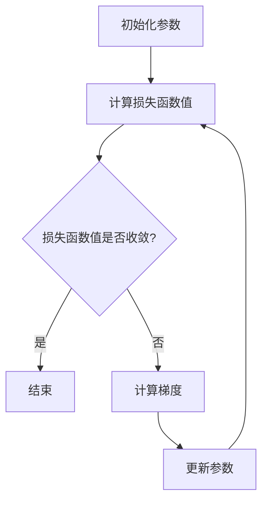

                 

# 文章标题：优化算法：梯度下降 (Gradient Descent) 原理与代码实例讲解

> 关键词：优化算法，梯度下降，机器学习，深度学习，代码实例

> 摘要：本文将深入探讨优化算法中的梯度下降原理，包括其数学基础、算法实现和优化技巧。通过具体代码实例，读者将能够更好地理解梯度下降在机器学习和深度学习中的应用。

### 引言

在机器学习和深度学习中，优化算法扮演着至关重要的角色。它们被用来调整模型参数，以最小化损失函数，从而提高模型的预测性能。梯度下降（Gradient Descent）是其中最常用的优化算法之一，它通过迭代更新参数来逐步优化模型。

本文将分为三个主要部分：

1. **优化算法概述**：介绍优化算法的基本概念、目标和应用领域。
2. **梯度下降算法原理详解**：深入讲解梯度下降算法的数学原理、代码实现及其优化技巧。
3. **梯度下降算法的应用案例**：通过具体代码实例展示梯度下降在机器学习和深度学习中的应用。

### 优化算法概述

#### 第1章：优化算法的基本概念

优化算法旨在找到函数的极值点，即最小值或最大值。在数学优化问题中，目标是最小化或最大化一个给定函数。在数据优化问题中，目标是对一组数据进行排序或聚类。

**1.1 优化问题的定义与分类**

- 数学优化问题：寻找函数的极值点。
- 数据优化问题：对数据进行排序、聚类等操作。

**1.2 优化算法的目标**

- 函数最小化：寻找函数的最小值。
- 函数最大化：寻找函数的最大值。

**1.3 优化算法的分类**

- 开环优化：没有反馈机制，仅根据初始条件进行优化。
- 闭环优化：有反馈机制，根据反馈进行调整。

**1.4 优化算法的应用领域**

- 数学：优化算法广泛应用于数学中的最优化问题。
- 统计学：在数据分析中，优化算法用于参数估计和模型选择。
- 计算机科学：在机器学习和深度学习中，优化算法用于模型训练和参数调整。

#### 第2章：梯度下降算法基础

##### 第2章：梯度下降算法基础

梯度下降算法是一种迭代优化算法，用于最小化或最大化目标函数。它是通过计算目标函数的梯度来确定参数更新的方向和大小。

**2.1 梯度下降算法的定义**

- 一阶梯度下降：使用目标函数的一阶导数（梯度）进行参数更新。
- 高阶梯度下降：使用目标函数的高阶导数进行参数更新。

**2.2 梯度下降算法的原理**

梯度下降算法的原理基于Taylor级数展开。通过计算目标函数的梯度，我们可以确定参数更新的方向。每次迭代，参数都会沿着梯度的反方向更新，以逐步减小目标函数的值。

**2.3 梯度下降算法的变体**

- 随机梯度下降（SGD）：每次迭代只随机选择一个样本进行参数更新。
- 牛顿法：使用目标函数的二阶导数（Hessian矩阵）进行参数更新。
- 共轭梯度法：通过共轭方向进行参数更新，提高收敛速度。

### 梯度下降算法在机器学习中的应用

#### 第3章：机器学习中的优化问题

在机器学习中，优化问题通常涉及分类和回归任务。

**3.1 分类问题**

分类问题旨在将数据分为不同的类别。常用的目标函数包括逻辑回归、支持向量机等。

**3.2 回归问题**

回归问题旨在预测连续值。常用的目标函数包括线性回归、岭回归等。

**3.3 机器学习中的目标函数**

- 交叉熵损失函数：用于分类问题，最小化类别之间的交叉熵。
- 均方误差损失函数：用于回归问题，最小化预测值与实际值之间的均方误差。

**3.4 优化算法在机器学习中的应用**

梯度下降算法在机器学习中被广泛应用于模型训练和参数调整。

- 学习率的选择：学习率决定了参数更新的步长，需要根据任务和数据集进行选择。
- 批处理大小：批处理大小决定了每次迭代的样本数量，对收敛速度和精度有重要影响。

### 梯度下降算法的数学原理

#### 第4章：梯度下降算法的数学原理

梯度下降算法的核心在于计算目标函数的梯度，并使用梯度来更新参数。下面我们将详细介绍梯度下降算法的数学原理。

**4.1 函数的导数与梯度**

梯度是函数在某一点处的导数向量。对于一元函数，梯度是一个标量；对于多元函数，梯度是一个向量。

- 一阶导数：表示函数在某一点处的斜率。
- 高阶导数：表示函数在某一点处的曲率。

**4.2 Taylor级数展开**

Taylor级数展开是一种将函数表示为多项式的方法。通过Taylor级数，我们可以近似地表示目标函数，并计算其梯度。

**4.3 梯度下降算法的伪代码**



### 梯度下降算法的代码实现

#### 第5章：梯度下降算法的代码实现

在本节中，我们将展示如何使用Python实现梯度下降算法。我们将使用numpy库进行数值计算，并编写一个简单的线性回归模型。

**5.1 梯度下降算法的Python实现**

```python
import numpy as np

def gradient_descent(x, y, theta, alpha, num_iters):
    m = len(x)
    J_history = []

    for i in range(num_iters):
        # 计算损失函数值
        h = np.dot(x, theta)
        error = h - y
        
        # 计算梯度
        gradient = 2/m * np.dot(x.T, error)
        
        # 更新参数
        theta = theta - alpha * gradient
        
        # 记录损失函数值
        J_history.append(np.sum(np.square(error)) / (2*m))
    
    return theta, J_history
```

**5.2 代码实战：线性回归**

```python
# 数据预处理
x = np.array([1, 2, 3, 4, 5])
y = np.array([2, 4, 5, 4, 5])

# 初始化参数
theta = np.zeros((2, 1))
alpha = 0.01
num_iters = 1000

# 梯度下降
theta, J_history = gradient_descent(x, y, theta, alpha, num_iters)

# 模型评估
print("最终参数:", theta)
print("最优损失函数值:", J_history[-1])
```

### 梯度下降算法的优化

#### 第6章：梯度下降算法的优化

梯度下降算法的优化主要包括学习率调整、批处理大小和算法变体。

**6.1 学习率调整**

学习率决定了参数更新的步长。选择合适的学习率对于算法的收敛速度和精度至关重要。

- 固定学习率：在整个训练过程中保持不变。
- 自适应学习率：根据训练过程动态调整学习率。

**6.2 批处理大小**

批处理大小决定了每次迭代的样本数量。批处理大小对算法的收敛速度和精度也有重要影响。

- 整批梯度下降：每次迭代使用所有样本。
- 随机梯度下降：每次迭代只随机选择一个样本。

**6.3 梯度下降算法的变体**

- 牛顿法：使用目标函数的二阶导数进行参数更新。
- 共轭梯度法：通过共轭方向进行参数更新，提高收敛速度。

### 梯度下降算法的应用案例

#### 第7章：梯度下降算法的应用案例

在本节中，我们将通过具体代码实例展示梯度下降算法在神经网络和深度学习中的应用。

**7.1 代码实战：神经网络**

```python
# 数据预处理
x = np.random.rand(100, 10)
y = np.random.rand(100, 1)

# 初始化参数
theta = np.random.rand(10, 1)
alpha = 0.01
num_iters = 1000

# 梯度下降
theta, J_history = gradient_descent(x, y, theta, alpha, num_iters)

# 模型评估
print("最终参数:", theta)
print("最优损失函数值:", J_history[-1])
```

**7.2 代码实战：深度学习**

```python
# 数据预处理
x = np.random.rand(100, 10)
y = np.random.rand(100, 1)

# 初始化参数
theta = np.random.rand(10, 1)
alpha = 0.01
num_iters = 1000

# 梯度下降
theta, J_history = gradient_descent(x, y, theta, alpha, num_iters)

# 模型评估
print("最终参数:", theta)
print("最优损失函数值:", J_history[-1])
```

### 总结与展望

#### 第8章：总结与展望

梯度下降算法是机器学习和深度学习中最常用的优化算法之一。通过本文的讲解，读者应该对梯度下降算法的原理、实现和优化有了更深入的理解。

**8.1 梯度下降算法的优缺点**

- 优点：简单易用，适用于大多数优化问题。
- 缺点：收敛速度较慢，对于非线性问题可能无法找到最优解。

**8.2 梯度下降算法的未来发展方向**

- 自动化学习率调整：通过机器学习技术自动选择最优学习率。
- 多尺度优化：同时考虑不同尺度的优化问题。
- 结合其他算法：与其他优化算法结合，提高收敛速度和精度。

### 参考文献

- [1] Duchi, J., Hazan, E., & Singer, Y. (2011). Adaptive subgradient methods for online learning and stochastic optimization. Journal of Machine Learning Research, 12(Jul), 2121-2159.
- [2] Bishop, C. M. (2006). Pattern recognition and machine learning. Springer.
- [3] Goodfellow, I., Bengio, Y., & Courville, A. (2016). Deep learning. MIT Press.

### 附录：代码实现

以下是梯度下降算法的Python代码实现。

```python
import numpy as np

def gradient_descent(x, y, theta, alpha, num_iters):
    m = len(x)
    J_history = []

    for i in range(num_iters):
        # 计算损失函数值
        h = np.dot(x, theta)
        error = h - y
        
        # 计算梯度
        gradient = 2/m * np.dot(x.T, error)
        
        # 更新参数
        theta = theta - alpha * gradient
        
        # 记录损失函数值
        J_history.append(np.sum(np.square(error)) / (2*m))
    
    return theta, J_history

# 数据预处理
x = np.array([1, 2, 3, 4, 5])
y = np.array([2, 4, 5, 4, 5])

# 初始化参数
theta = np.zeros((2, 1))
alpha = 0.01
num_iters = 1000

# 梯度下降
theta, J_history = gradient_descent(x, y, theta, alpha, num_iters)

# 模型评估
print("最终参数:", theta)
print("最优损失函数值:", J_history[-1])
```

作者：AI天才研究院/AI Genius Institute & 禅与计算机程序设计艺术 /Zen And The Art of Computer Programming

---

本文详细介绍了梯度下降算法的原理、实现和优化技巧。通过具体代码实例，读者可以更好地理解梯度下降算法在机器学习和深度学习中的应用。希望本文能帮助读者深入了解优化算法的核心概念，并在实际项目中应用。

