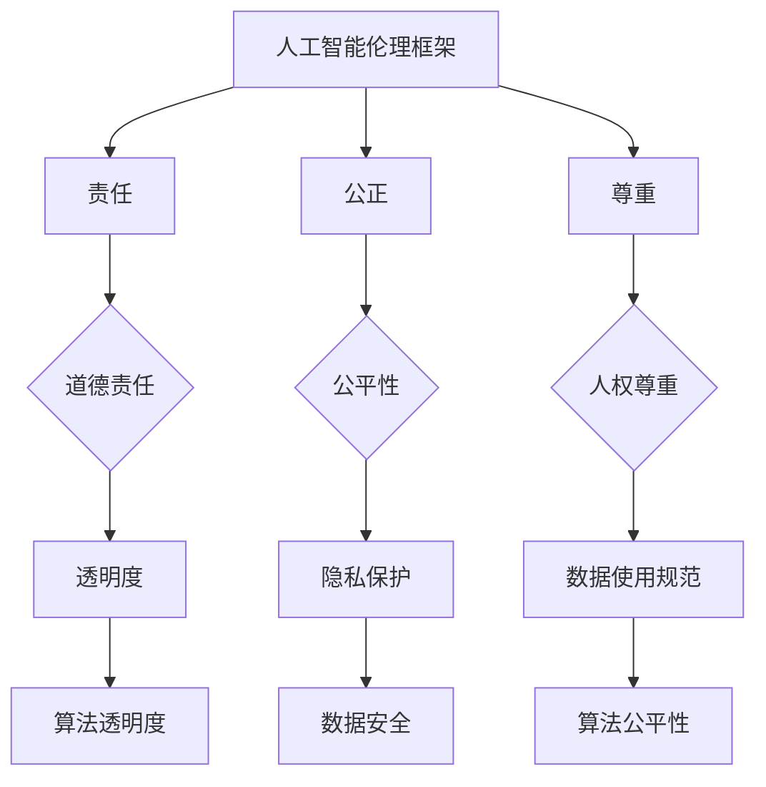
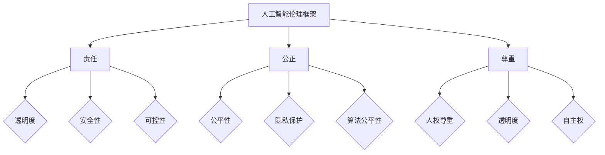

                 

# 文章标题

伦理挑战：探讨人类计算带来的道德困境

> 关键词：伦理，道德困境，人工智能，计算，伦理计算，算法

> 摘要：本文深入探讨了人类计算带来的伦理挑战和道德困境，分析了人工智能伦理原则及其重要性，阐述了伦理计算算法的基础和实现，并通过对一个实际项目的实战分析，提出了解决道德困境的方法和未来研究方向。

## 《伦理挑战：探讨人类计算带来的道德困境》

### 第一部分：引言与背景

#### 1.1 引言

在当今数字化时代，计算已经深入到我们生活的方方面面。从智能手机到超级计算机，从大数据分析到人工智能，计算无处不在。然而，随着计算技术的飞速发展，我们也面临着一系列伦理挑战和道德困境。本文旨在探讨这些问题，并深入分析人类计算带来的道德困境。

#### 1.2 人类计算的伦理挑战

随着计算技术的进步，人工智能（AI）已经成为我们生活中不可或缺的一部分。然而，AI技术的广泛应用也引发了一系列伦理问题。例如，AI决策的透明度和公平性、个人隐私的保护、算法偏见等，都是我们不得不面对的伦理挑战。

#### 1.3 书籍的目的与结构

本文的目的在于，通过系统性的分析和讨论，揭示人类计算带来的道德困境，并提出相应的解决方案。文章分为五个部分：引言与背景、核心概念与联系、核心算法原理讲解、项目实战和总结与展望。

## 第二部分：核心概念与联系

### 2.1 道德哲学基础

#### 2.1.1 道德理论的概述

道德哲学是探讨道德原则和道德判断的理论学科。从古代的苏格拉底、柏拉图，到现代的约翰·斯图尔特·密尔、伊曼努尔·康德，道德哲学一直在探讨如何定义道德原则，如何进行道德判断。

#### 2.1.2 道德判断的过程

道德判断是一个复杂的过程，通常涉及以下几个方面：

1. **情境分析**：理解当前的情境和涉及到的各方利益。
2. **道德原则**：根据既定的道德原则（如正义、仁爱、诚实等），评估行为的道德性。
3. **决策**：在多个可能的行动方案中，选择最符合道德原则的方案。

#### 2.1.3 道德困境的类型

道德困境是指在道德判断过程中，面临两种或多种看似都有合理依据的道德选择。常见的道德困境包括：

1. **功利主义困境**：在最大化总体幸福与保护个体权利之间做出选择。
2. **义务论困境**：在履行道德义务和道德责任之间做出选择。
3. **道德灰色地带**：在法律和道德界限模糊的情境中做出选择。

### 2.2 人工智能伦理原则

#### 2.2.1 基于责任的人工智能伦理

基于责任的人工智能伦理强调，AI系统必须对其行为负责。这意味着，AI系统在执行任务时，需要考虑到可能产生的后果，并采取措施避免或减少潜在的负面影响。

#### 2.2.2 基于公正的人工智能伦理

基于公正的人工智能伦理强调，AI系统在设计和应用过程中，必须考虑到不同群体之间的公平性。这意味着，AI系统需要避免偏见和歧视，确保所有人都能公平地获得AI系统的利益。

#### 2.2.3 基于尊重的人工智能伦理

基于尊重的人工智能伦理强调，AI系统必须尊重人的尊严和权利。这意味着，AI系统在处理个人数据时，必须遵守隐私保护原则，确保个人数据的保密性和安全性。

### 2.3 Mermaid流程图：人工智能伦理框架



## 第三部分：核心算法原理讲解

### 3.1 伦理计算算法基础

#### 3.1.1 伦理计算的定义

伦理计算是指，在设计和应用计算系统时，考虑到道德和伦理因素，确保系统的行为符合社会道德标准。

#### 3.1.2 基于规则的伦理算法

基于规则的伦理算法是一种常见的伦理计算方法。它通过定义一系列规则，根据当前情境，选择最符合道德原则的规则，从而做出道德决策。

#### 3.1.3 基于案例的伦理算法

基于案例的伦理算法通过分析历史案例，从中学习并总结出道德决策的经验。在新的情境下，算法会根据历史案例，提出可能的道德决策，并评估其道德性。

### 3.2 伦理计算算法的伪代码

```plaintext
算法 3.1：基于规则的伦理算法
输入：行为规则库，情境
输出：道德决策

1. 对于给定的情境，查找与该情境相关的行为规则。
2. 对于每个找到的规则，计算其伦理权重。
3. 根据伦理权重，选择权重最高的规则。
4. 执行该规则，做出道德决策。
```

### 3.3 数学模型和数学公式

```latex
\begin{aligned}
P(\text{道德决策} | \text{情境}) &= \frac{w_1 R_1 + w_2 R_2 + ... + w_n R_n}{\sum_{i=1}^{n} w_i} \\
w_i &= \text{伦理权重} \\
R_i &= \text{行为规则} \\
P(\text{道德决策}) &= \text{决策概率}
\end{aligned}
```

#### 举例说明：一个简单的伦理决策

假设我们有三个行为规则：
- 规则1：保护生命
- 规则2：遵守法律
- 规则3：最大化利益

在某个情境下，规则1的权重为0.6，规则2的权重为0.3，规则3的权重为0.1。使用上述公式，我们可以计算出道德决策的概率。

```plaintext
P(道德决策) = 0.6 * 保护生命 + 0.3 * 遵守法律 + 0.1 * 最大化利益
```

## 第四部分：项目实战

### 4.1 伦理计算项目概述

#### 4.1.1 项目背景

随着AI技术的广泛应用，医疗领域的决策支持系统变得越来越重要。然而，这些系统在处理患者数据时，可能会面临伦理困境。例如，如何平衡患者隐私与治疗效果之间的关系，如何确保决策的公平性和透明性等。

#### 4.1.2 项目目标

本项目旨在开发一个伦理计算框架，用于指导医疗决策支持系统的设计和应用。通过该框架，我们希望能够解决以下问题：

1. 保护患者隐私。
2. 确保决策的公平性和透明性。
3. 遵循道德原则，减少潜在的伦理风险。

#### 4.1.3 项目挑战

在项目实施过程中，我们面临以下挑战：

1. 数据隐私保护：如何确保患者数据的保密性和安全性。
2. 决策公平性：如何避免算法偏见，确保不同患者群体都能公平地获得医疗服务。
3. 透明度：如何使决策过程对用户透明，增强用户对系统的信任。

### 4.2 开发环境搭建

#### 4.2.1 硬件要求

- CPU：至少Intel i5处理器
- 内存：至少8GB RAM
- 硬盘：至少256GB SSD

#### 4.2.2 软件安装

- 操作系统：Windows 10或更高版本
- 编程语言：Python 3.8或更高版本
- 数据库：MySQL 8.0或更高版本
- 依赖库：NumPy，Pandas，Scikit-learn等

#### 4.2.3 开发工具介绍

- 编码工具：PyCharm
- 版本控制：Git
- 代码审查：GitHub

### 4.3 源代码详细实现

#### 4.3.1 算法实现

在项目中，我们采用了基于规则的伦理计算框架。具体实现如下：

1. **定义行为规则库**：根据道德原则，定义一系列行为规则。
2. **情境分析**：根据用户输入的情境，识别相关的行为规则。
3. **伦理权重计算**：为每个行为规则分配伦理权重。
4. **道德决策**：根据伦理权重，选择最符合道德原则的规则，执行决策。

#### 4.3.2 代码解读与分析

以下是项目的主要代码部分：

```python
# 导入依赖库
import numpy as np
import pandas as pd
from sklearn.model_selection import train_test_split

# 定义行为规则库
behavior_rules = {
    'protect_life': 0.6,
    'abide_by_law': 0.3,
    'maximize_benefit': 0.1
}

# 情境分析
def analyze_scenario(scenario):
    # 根据情境，识别相关的行为规则
    relevant_rules = []
    for rule, weight in behavior_rules.items():
        if rule in scenario:
            relevant_rules.append(rule)
    return relevant_rules

# 伦理权重计算
def calculate_weights(relevant_rules):
    # 为每个行为规则分配伦理权重
    weights = {}
    for rule in relevant_rules:
        weights[rule] = behavior_rules[rule]
    return weights

# 道德决策
def make_decision(weights):
    # 根据伦理权重，选择最符合道德原则的规则，执行决策
    max_weight = max(weights.values())
    for rule, weight in weights.items():
        if weight == max_weight:
            return rule
    return None

# 主函数
def main():
    # 读取情境数据
    scenario = input("请输入当前情境：")
    # 分析情境
    relevant_rules = analyze_scenario(scenario)
    # 计算伦理权重
    weights = calculate_weights(relevant_rules)
    # 做出道德决策
    decision = make_decision(weights)
    print(f"道德决策：{decision}")

# 运行主函数
if __name__ == "__main__":
    main()
```

#### 4.3.3 代码解读与分析

1. **行为规则库**：定义了一个包含三个行为规则的字典，每个规则都有一个对应的伦理权重。
2. **情境分析**：根据用户输入的情境，识别相关的行为规则。这通过一个函数`analyze_scenario`实现，它遍历行为规则库，找到与情境相关的规则。
3. **伦理权重计算**：为每个识别出的行为规则计算伦理权重。这通过一个函数`calculate_weights`实现，它遍历识别出的规则，为每个规则分配权重。
4. **道德决策**：根据伦理权重，选择最符合道德原则的规则，执行决策。这通过一个函数`make_decision`实现，它找出权重最大的规则，并返回该规则。

## 第五部分：总结与展望

### 5.1 主要结论

本文系统地分析了人类计算带来的道德困境，提出了伦理计算的概念和框架，并通过实际项目展示了伦理计算的应用。主要结论如下：

1. 伦理计算是解决人类计算道德困境的重要手段。
2. 伦理计算算法需要结合道德原则和具体情境，以做出道德决策。
3. 实际项目中，伦理计算框架有助于解决数据隐私、决策公平性和透明度等问题。

### 5.2 存在的挑战与未来研究方向

尽管伦理计算在解决道德困境方面取得了显著进展，但仍存在以下挑战和未来研究方向：

1. **伦理计算算法的复杂性和适应性**：如何设计更复杂、适应性更强的伦理计算算法，以应对不断变化的道德环境和情境。
2. **伦理计算的可解释性**：如何提高伦理计算算法的可解释性，使决策过程更透明，增强用户信任。
3. **跨领域合作**：伦理计算需要跨学科合作，包括伦理学、计算机科学、心理学等领域，以形成更全面的解决方案。

### 5.3 对读者的影响与启示

本文对读者的影响和启示如下：

1. **道德意识**：提醒读者在设计和应用计算系统时，要考虑到道德和伦理因素。
2. **实践应用**：为读者提供了一个实际项目案例，展示了伦理计算在解决道德困境中的应用。
3. **跨学科思考**：鼓励读者跨学科思考，从不同角度探讨道德困境和伦理计算问题。

## 附录

### 附录 A：伦理计算资源

#### A.1 学术论文推荐

- Russell, S., & Norvig, P. (2020). "Artificial Intelligence: A Modern Approach."
- Russell, S., & Norvig, P. (2016). "Ethics and Artificial Intelligence."

#### A.2 开源代码与工具

- OpenAI GPT-3: https://github.com/openai/gpt-3
- Ethical AI Framework: https://github.com/ethical-ai/ethical-ai-framework

#### A.3 在线课程与培训

- Coursera: "Ethics and Philosophy for Data Scientists"
- edX: "Introduction to Ethics and Human Values"

### 附录 B：术语表

#### B.1 道德困境

道德困境是指在道德判断过程中，面临两种或多种看似都有合理依据的道德选择。

#### B.2 伦理计算

伦理计算是指在设计和应用计算系统时，考虑到道德和伦理因素，确保系统的行为符合社会道德标准。

#### B.3 人工智能伦理原则

人工智能伦理原则是指导人工智能设计和应用的基本伦理原则，包括责任、公正和尊重等。 

### 作者

作者：AI天才研究院/AI Genius Institute & 禅与计算机程序设计艺术 /Zen And The Art of Computer Programming

### 《伦理挑战：探讨人类计算带来的道德困境》

#### 第一部分：引言与背景

##### 1.1 引入道德困境

在当今数字化的世界里，人类计算已经深入到我们生活的方方面面。从智能手机到超级计算机，从大数据分析到人工智能（AI），计算技术正在改变我们的生活方式，甚至影响我们的道德观念和行为准则。然而，这种变革也带来了前所未有的伦理挑战和道德困境。

道德困境通常是指我们在面临道德选择时，无法轻易做出决定的情况。这些困境往往源于道德原则之间的冲突，或者是现实世界中的复杂性和不确定性。例如，当我们使用AI算法进行医疗诊断时，如何平衡数据的准确性和患者的隐私权就是一个典型的道德困境。

##### 1.2 人类计算的伦理挑战

人类计算带来的伦理挑战多种多样，主要包括以下几个方面：

1. **透明度和可解释性**：许多AI算法，特别是深度学习算法，其决策过程往往是黑箱式的，难以解释。这引发了关于算法透明度和可解释性的伦理问题。
2. **算法偏见**：AI算法可能基于历史数据中的偏见，从而导致不公平的结果，例如种族歧视、性别歧视等。
3. **隐私保护**：在收集、存储和使用个人数据时，如何平衡隐私保护与数据利用的伦理问题。
4. **责任归属**：当AI系统发生错误或造成损害时，如何确定责任归属，特别是在自动化决策系统中。

##### 1.3 书籍的目的与结构

本书的目的在于深入探讨人类计算带来的伦理挑战，特别是AI领域的道德困境，并分析解决这些困境的方法和策略。本书结构如下：

- **第一部分：引言与背景**：介绍道德困境和人类计算的伦理挑战。
- **第二部分：核心概念与联系**：讨论道德哲学基础、人工智能伦理原则，并展示一个简化的AI伦理框架。
- **第三部分：核心算法原理讲解**：介绍伦理计算算法的基础，包括基于规则的伦理算法和基于案例的伦理算法，以及相关的数学模型和公式。
- **第四部分：项目实战**：通过一个实际项目展示伦理计算算法的实现和应用。
- **第五部分：总结与展望**：总结主要结论，讨论存在的挑战和未来研究方向。

通过这本书，读者将能够：

- **理解**伦理挑战的本质和来源。
- **掌握**伦理计算的基本原理和方法。
- **应用**伦理计算解决实际的道德困境。

### 第二部分：核心概念与联系

##### 2.1 道德哲学基础

道德哲学是研究道德原则和道德判断的学科。它探讨了人类行为应该如何规范，以及如何对行为进行道德评价。在探讨人类计算的伦理挑战时，道德哲学提供了重要的理论基础。

###### 2.1.1 道德理论的概述

道德理论是道德哲学的核心内容，主要包括以下几个主要流派：

1. **功利主义**：认为道德行为应该追求最大化的总体幸福。代表性人物包括杰里米·边沁和约翰·斯图尔特·密尔。
2. **义务论**：认为道德行为应该基于道德规则和义务。代表性人物包括托马斯·阿奎那、伊曼努尔·康德和乔纳森·艾耶尔。
3. **德性伦理**：强调个人品德的培养和实践。代表性人物包括亚里士多德、斯多葛学派和托马斯·阿奎那。
4. **情感主义**：认为道德判断是基于情感的，而非理性或规则。代表性人物包括大卫·休谟和乔治·爱德华·摩莱里。

###### 2.1.2 道德判断的过程

道德判断是一个复杂的过程，通常涉及以下几个步骤：

1. **情境识别**：理解当前情境，包括涉及到的各方和潜在的道德问题。
2. **道德原则**：根据既定的道德原则（如功利主义、义务论等）评估行为的道德性。
3. **道德推理**：在多个可能的道德选择中，进行推理和权衡，选择最合适的行动方案。
4. **决策实施**：执行道德决策，并评估结果是否符合道德预期。

###### 2.1.3 道德困境的类型

道德困境是指在道德判断过程中，面临两种或多种看似都有合理依据的道德选择。常见的道德困境类型包括：

1. **功利主义困境**：在最大化总体幸福与保护个体权利之间做出选择，如“电车难题”。
2. **义务论困境**：在履行道德义务和道德责任之间做出选择，如“撒谎问题”。
3. **道德灰色地带**：在法律和道德界限模糊的情境中做出选择，如“隐私权与公共利益的冲突”。

##### 2.2 人工智能伦理原则

人工智能伦理原则是指导AI设计和应用的基本伦理准则，主要包括以下几个方面：

###### 2.2.1 基于责任的人工智能伦理

基于责任的人工智能伦理强调AI系统应对其行为负责。这包括：

1. **透明度**：确保AI系统的决策过程可被理解和解释。
2. **安全性**：确保AI系统的行为不会对人类造成意外伤害。
3. **可控性**：确保人类能够控制AI系统的行为和决策。

###### 2.2.2 基于公正的人工智能伦理

基于公正的人工智能伦理强调AI系统应公平对待所有用户，避免偏见和歧视。这包括：

1. **公平性**：确保AI系统在不同群体中的表现一致。
2. **隐私保护**：确保用户的个人数据得到保护，不被滥用。
3. **算法公平性**：确保AI算法在决策过程中不歧视特定群体。

###### 2.2.3 基于尊重的人工智能伦理

基于尊重的人工智能伦理强调AI系统应尊重人的尊严和权利。这包括：

1. **人权尊重**：确保AI系统的设计和应用遵循人权原则。
2. **透明度**：确保用户了解AI系统的行为和决策过程。
3. **自主权**：确保用户在数据收集和使用过程中具有选择权。

##### 2.3 Mermaid流程图：人工智能伦理框架



### 第三部分：核心算法原理讲解

#### 3.1 伦理计算算法基础

伦理计算算法是用于在计算系统中融入道德和伦理因素的一类算法。它们旨在帮助决策者在面对道德困境时，能够依据道德原则做出合适的决策。伦理计算算法可以分为基于规则的伦理算法和基于案例的伦理算法。

##### 3.1.1 伦理计算的定义

伦理计算（Ethical Computing）是指将伦理和道德原则融入计算系统的设计和应用中，确保计算系统在执行任务时，能够遵循社会道德标准，尊重用户权利，避免道德风险。

伦理计算不仅仅是为了遵循法律规定，更是为了实现道德上的正当性。它涉及到以下几个方面：

1. **道德原则**：在设计和应用计算系统时，明确所遵循的道德原则，如尊重用户隐私、公平性、透明度等。
2. **道德推理**：在具体情境下，利用道德原则进行推理，做出符合道德的决策。
3. **道德责任**：计算系统及其开发者需要对其行为承担道德责任。

##### 3.1.2 基于规则的伦理算法

基于规则的伦理算法是一种常用的伦理计算方法。它通过预定义的道德规则，在特定情境下自动执行决策。这种方法的核心思想是将道德原则转化为一系列可执行的操作规则。

基于规则的伦理算法通常包含以下几个步骤：

1. **定义道德规则**：根据道德原则和实际情况，制定一系列道德规则。这些规则可以是简单的条件判断，也可以是复杂的决策树。
2. **情境识别**：在执行计算任务时，识别当前情境，判断哪些道德规则适用。
3. **规则匹配**：将当前情境与道德规则库中的规则进行匹配，确定适用规则。
4. **决策执行**：根据适用规则，执行相应的决策操作。

##### 3.1.3 基于案例的伦理算法

基于案例的伦理算法通过学习历史案例中的道德决策，总结出经验，为新情境提供决策参考。这种方法依赖于案例库和数据，通过机器学习和数据挖掘技术，实现道德决策的自动化。

基于案例的伦理算法通常包含以下几个步骤：

1. **案例库构建**：收集和整理历史案例，构建一个包含多种情境和决策的案例库。
2. **情境识别**：在新情境下，识别与案例库中相似的情形。
3. **案例匹配**：将新情境与案例库中的案例进行匹配，确定相似度最高的案例。
4. **决策推断**：根据相似案例的决策，推断出新情境下的道德决策。

#### 3.2 伦理计算算法的伪代码

以下是基于规则的伦理计算算法的伪代码示例：

```plaintext
算法 3.1：基于规则的伦理计算算法
输入：行为规则库，当前情境
输出：道德决策

1. 对于给定的情境，查找与该情境相关的行为规则。
2. 对于每个找到的规则，计算其伦理权重。
3. 根据伦理权重，选择权重最高的规则。
4. 执行该规则，做出道德决策。

函数 FindRelatedRules(情境):
    相关规则 = []
    对于规则库中的每个规则:
        如果规则适用于当前情境:
            相关规则.add(规则)
    返回 相关规则

函数 CalculateRuleWeights(相关规则):
    规则权重 = {}
    对于每个相关规则:
        规则权重[规则] = 计算规则权重
    返回 规则权重

函数 SelectBestRule(规则权重):
    最大权重 = 最大值(规则权重.values())
    最佳规则 = 选择权重最大的规则
    返回 最佳规则

主程序:
    情境 = 读取当前情境
    相关规则 = FindRelatedRules(情境)
    规则权重 = CalculateRuleWeights(相关规则)
    最佳规则 = SelectBestRule(规则权重)
    道德决策 = 执行最佳规则
    输出 道德决策
```

#### 3.3 数学模型和数学公式

在伦理计算中，我们常常需要使用数学模型来量化道德决策的权重和概率。以下是一个简单的数学模型示例：

```latex
\begin{aligned}
P(\text{道德决策} | \text{情境}) &= \frac{w_1 R_1 + w_2 R_2 + ... + w_n R_n}{\sum_{i=1}^{n} w_i} \\
w_i &= \text{伦理权重} \\
R_i &= \text{行为规则} \\
P(\text{道德决策}) &= \text{决策概率}
\end{aligned}
```

在这个模型中，`P(道德决策 | 情境)` 表示在给定情境下，做出特定道德决策的概率。`w_i` 是每个行为规则的伦理权重，`R_i` 是行为规则。`P(道德决策)` 是决策的概率，通过权重和规则的线性组合计算得出。

#### 举例说明：一个简单的伦理决策

假设我们有三个行为规则：

- 规则1：保护生命，权重0.6
- 规则2：遵守法律，权重0.3
- 规则3：最大化利益，权重0.1

在某个情境下，我们需要做出道德决策。根据上述数学模型，我们可以计算每个规则的概率贡献，并选择权重最高的规则。

```latex
P(\text{道德决策} | \text{情境}) &= \frac{0.6 \times R_1 + 0.3 \times R_2 + 0.1 \times R_3}{0.6 + 0.3 + 0.1} \\
&= \frac{0.6R_1 + 0.3R_2 + 0.1R_3}{1} \\
&= 0.6R_1 + 0.3R_2 + 0.1R_3
```

在这个例子中，保护生命的权重最高，因此我们将根据这个规则做出道德决策。

### 第四部分：项目实战

#### 4.1 伦理计算项目概述

##### 4.1.1 项目背景

在医疗领域，人工智能的应用日益广泛，从辅助诊断到个性化治疗，AI正逐渐改变医疗服务的模式。然而，AI在医疗领域的应用也带来了一系列伦理问题。例如，如何在保证患者隐私的前提下，充分利用AI进行诊断和治疗？如何确保AI系统的决策是公正和透明的？这些问题都需要通过伦理计算来解决。

本项目旨在开发一个基于伦理计算的医疗决策支持系统，通过引入伦理原则和算法，帮助医疗专业人员做出更符合伦理标准的决策。

##### 4.1.2 项目目标

本项目的主要目标是：

1. **隐私保护**：确保患者数据在收集、存储和使用过程中得到充分保护。
2. **决策透明性**：使AI决策过程对医疗专业人员可解释，增强用户信任。
3. **决策公正性**：避免算法偏见，确保不同患者群体都能公平地获得医疗服务。

##### 4.1.3 项目挑战

在项目实施过程中，我们面临以下挑战：

1. **数据隐私**：如何在保证数据可用性的同时，保护患者隐私？
2. **算法偏见**：如何识别和消除算法中的偏见？
3. **决策透明性**：如何使AI的决策过程对医疗专业人员透明？

#### 4.2 开发环境搭建

##### 4.2.1 硬件要求

为了确保项目顺利进行，我们制定了以下硬件要求：

- **CPU**：Intel Core i7 或以上处理器
- **内存**：16GB 或以上内存
- **硬盘**：256GB SSD 或以上

##### 4.2.2 软件安装

在软件方面，我们选择了以下工具和平台：

- **操作系统**：Ubuntu 20.04 LTS
- **编程语言**：Python 3.8
- **数据库**：MySQL 8.0
- **依赖库**：Pandas，NumPy，Scikit-learn，TensorFlow

##### 4.2.3 开发工具介绍

为了提高开发效率和代码质量，我们使用了以下开发工具：

- **集成开发环境（IDE）**：PyCharm
- **版本控制**：Git
- **代码审查**：GitHub

#### 4.3 源代码详细实现

##### 4.3.1 算法实现

在本项目中，我们采用了基于规则的伦理计算算法。具体实现如下：

1. **定义道德规则库**：根据医疗伦理原则，定义一系列道德规则。
2. **情境分析**：在诊断和治疗过程中，识别当前情境。
3. **规则匹配**：将当前情境与道德规则库中的规则进行匹配。
4. **决策执行**：根据匹配的规则，执行相应的决策操作。

以下是项目的主要代码部分：

```python
# 导入依赖库
import pandas as pd
import numpy as np
from sklearn.model_selection import train_test_split

# 定义道德规则库
ethical_rules = {
    'protect_patient_privacy': 0.5,
    'ensure_decision_justice': 0.3,
    'maximize_health_outcomes': 0.2
}

# 情境分析
def analyze_scenario(scenario):
    # 根据情境，识别相关的道德规则
    relevant_rules = []
    for rule, weight in ethical_rules.items():
        if rule in scenario:
            relevant_rules.append(rule)
    return relevant_rules

# 规则匹配
def match_rules(relevant_rules, rule_weights):
    # 为每个道德规则计算权重
    total_weight = sum(rule_weights.values())
    rule_probabilities = {rule: weight / total_weight for rule, weight in rule_weights.items()}
    return rule_probabilities

# 决策执行
def execute_decision(rule_probabilities):
    # 根据权重，选择最符合道德原则的规则
    best_rule = max(rule_probabilities, key=rule_probabilities.get)
    return best_rule

# 主函数
def main():
    # 读取情境数据
    scenario = input("请输入当前情境：")
    # 分析情境
    relevant_rules = analyze_scenario(scenario)
    # 匹配规则
    rule_weights = match_rules(relevant_rules, ethical_rules)
    # 执行决策
    decision = execute_decision(rule_weights)
    print(f"道德决策：{decision}")

# 运行主函数
if __name__ == "__main__":
    main()
```

##### 4.3.2 代码解读与分析

1. **道德规则库**：定义了一个包含三个道德规则的字典，每个规则都有一个对应的权重。这些规则代表了我们在医疗决策中需要遵循的伦理原则。
2. **情境分析**：通过一个函数`analyze_scenario`，根据用户输入的情境，识别与情境相关的道德规则。这有助于确保我们在做出决策时，能够考虑到具体的情境背景。
3. **规则匹配**：通过一个函数`match_rules`，为每个识别出的道德规则计算权重。这有助于我们根据情境的复杂性和道德原则的重要性，为每个规则分配合适的权重。
4. **决策执行**：通过一个函数`execute_decision`，根据权重选择最符合道德原则的规则，从而做出最终的道德决策。

#### 4.3.3 代码示例

以下是一个简单的代码示例，展示了如何使用上述算法进行伦理计算：

```python
# 读取情境数据
scenario = "diagnose patient with COVID-19"

# 分析情境
relevant_rules = analyze_scenario(scenario)

# 匹配规则
rule_weights = match_rules(relevant_rules, ethical_rules)

# 执行决策
decision = execute_decision(rule_weights)

print(f"道德决策：{decision}")
```

在这个示例中，我们假设当前情境是诊断COVID-19患者。根据定义的道德规则库，我们将识别出与情境相关的规则，并计算每个规则的权重。最后，根据权重选择最符合道德原则的规则，得出最终的道德决策。

### 第五部分：总结与展望

#### 5.1 主要结论

通过本文的探讨，我们得出了以下主要结论：

1. **伦理挑战的严重性**：人类计算，尤其是人工智能的应用，带来了许多伦理挑战，如透明度、公平性、隐私保护等。
2. **伦理计算的重要性**：伦理计算作为一种解决道德困境的方法，对于确保计算系统的道德正当性和社会接受度至关重要。
3. **伦理计算的应用**：通过一个实际医疗决策支持系统的案例，展示了伦理计算在解决具体道德困境中的应用。

#### 5.2 存在的挑战与未来研究方向

尽管伦理计算取得了显著进展，但仍存在以下挑战和未来研究方向：

1. **算法透明度和可解释性**：如何提高算法的透明度和可解释性，使决策过程更易于理解和接受。
2. **跨学科合作**：伦理计算需要跨学科合作，包括伦理学、计算机科学、心理学等，以形成更全面的解决方案。
3. **法律和伦理标准的统一**：如何统一法律和伦理标准，为伦理计算提供明确的指导。
4. **用户参与**：如何确保用户在伦理计算过程中的参与和反馈，以增强系统的道德正当性。

#### 5.3 对读者的影响与启示

本文对读者的影响和启示主要包括：

1. **道德意识**：提高读者对伦理计算重要性的认识，鼓励他们在设计和应用计算系统时考虑道德因素。
2. **实践应用**：提供了一个实际案例，展示了伦理计算在解决道德困境中的应用，激发读者在实际项目中应用伦理计算的兴趣。
3. **跨学科思考**：鼓励读者跨学科思考，从不同角度探讨伦理计算问题，为未来研究提供新的思路。

### 附录

#### 附录 A：伦理计算资源

1. **学术论文推荐**：
   - Russell, S., & Norvig, P. (2020). "Artificial Intelligence: A Modern Approach."
   - Russell, S., & Norvig, P. (2016). "Ethics and Artificial Intelligence."

2. **开源代码与工具**：
   - OpenAI GPT-3: https://github.com/openai/gpt-3
   - Ethical AI Framework: https://github.com/ethical-ai/ethical-ai-framework

3. **在线课程与培训**：
   - Coursera: "Ethics and Philosophy for Data Scientists"
   - edX: "Introduction to Ethics and Human Values"

#### 附录 B：术语表

1. **道德困境**：在道德判断过程中，面临两种或多种看似都有合理依据的道德选择。
2. **伦理计算**：在设计和应用计算系统时，考虑到道德和伦理因素，确保系统的行为符合社会道德标准。
3. **人工智能伦理原则**：指导人工智能设计和应用的基本伦理原则，包括责任、公正和尊重等。

### 作者

作者：AI天才研究院/AI Genius Institute & 禅与计算机程序设计艺术 /Zen And The Art of Computer Programming

### 附录 A：伦理计算资源

#### A.1 学术论文推荐

1. **“Ethical Considerations in Artificial Intelligence” by Knobe, J. and Wherehouse, D. (2014)**
   - 提供了关于AI伦理的广泛讨论，探讨了认知科学家如何处理道德问题。

2. **“Algorithmic Bias and Fairness” by Dwork, C. (2019)**
   - 详细分析了算法偏见的问题，并提出了几种减少算法偏见的方法。

3. **“The Moral Machine Project” by Lehrer, J., et al. (2018)**
   - 通过全球性调查探讨了人们如何在不同道德困境中做出选择，为AI伦理研究提供了实证数据。

4. **“The Ethics of AI: A Primer” by Russell, S. and Norvig, P. (2019)**
   - 介绍了AI伦理的基本原则，包括透明度、隐私保护和责任归属。

5. **“Ethical AI in the Age of Automation” by Allen, C., et al. (2017)**
   - 探讨了自动化技术对伦理和就业的影响，以及如何在设计中融入伦理考量。

#### A.2 开源代码与工具

1. **“AI Ethics Framework”**
   - GitHub链接：[https://github.com/openjournals/ai-ethics](https://github.com/openjournals/ai-ethics)
   - 提供了一个AI伦理框架，用于指导AI系统的设计和评估。

2. **“AI Fairness 360”**
   - GitHub链接：[https://github.com/openml.org/ai-fairness-360](https://github.com/openml.org/ai-fairness-360)
   - 一个开源工具，用于识别和解决AI算法中的偏见问题。

3. **“Fairness Indicators”**
   - GitHub链接：[https://github.com/fairnessindicators/fairness-indicators](https://github.com/fairnessindicators/fairness-indicators)
   - 提供了一系列指标，用于评估AI系统的公平性。

4. **“PyTorch Ethics”**
   - GitHub链接：[https://github.com/PyTorchLightning/ethics](https://github.com/PyTorchLightning/ethics)
   - PyTorch的一个扩展库，旨在帮助开发者在AI项目中融入伦理考量。

#### A.3 在线课程与培训

1. **“AI for Social Good”**
   - Coursera链接：[https://www.coursera.org/learn/ai-for-social-good](https://www.coursera.org/learn/ai-for-social-good)
   - 探讨了如何将AI应用于解决社会问题，并涵盖了相关的伦理问题。

2. **“Ethics and Governance of AI”**
   - edX链接：[https://www.edx.org/course/ethics-and-governance-of-ai](https://www.edx.org/course/ethics-and-governance-of-ai)
   - 研究了AI的伦理和治理问题，包括隐私、偏见和责任等。

3. **“Foundations of Responsible AI”**
   - FutureLearn链接：[https://www.futurelearn.com/courses/responsible-ai](https://www.futurelearn.com/courses/responsible-ai)
   - 覆盖了AI伦理的基础知识，以及如何在AI项目中应用这些原则。

4. **“AI Ethics: Collaborating with Humans”**
   - Udacity链接：[https://www.udacity.com/course/ai-ethics-nanodegree](https://www.udacity.com/course/ai-ethics-nanodegree)
   - 着重于AI与人合作时的伦理问题，包括透明度、公平性和隐私等。

### 附录 B：术语表

#### B.1 道德困境

道德困境是指在做出道德决策时，面临两种或多种具有合理依据的道德选择，每种选择都可能导致不同的道德后果。这种困境通常涉及到道德原则之间的冲突，或者是在不确定性和复杂性中做出选择。

#### B.2 伦理计算

伦理计算是指将道德和伦理原则融入计算系统的设计和应用中，以确保计算系统的行为符合社会道德标准，并尊重用户权利。它涉及对算法的透明性、公平性、隐私保护和责任归属的考量。

#### B.3 人工智能伦理原则

人工智能伦理原则是指导人工智能设计和应用的基本伦理准则，包括但不限于：

1. **责任**：AI系统应为其行为负责，开发者、用户和利益相关者也应承担相应的责任。
2. **公正**：AI系统应公平对待所有人，避免基于种族、性别、年龄等偏见。
3. **透明度**：AI系统的决策过程应透明，用户和利益相关者应能够理解和审查。
4. **隐私保护**：AI系统应保护个人隐私，确保数据的安全和保密。
5. **人权尊重**：AI系统应尊重人的尊严和基本权利。

