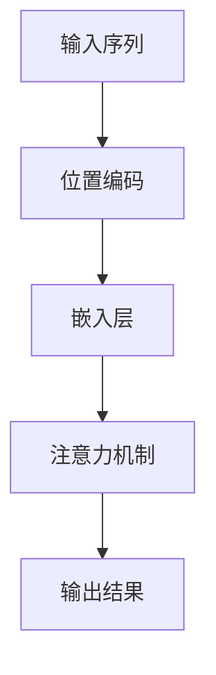
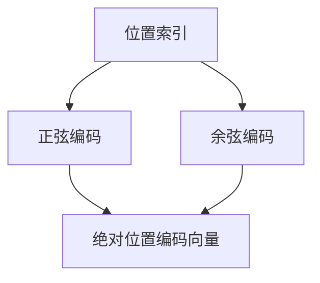
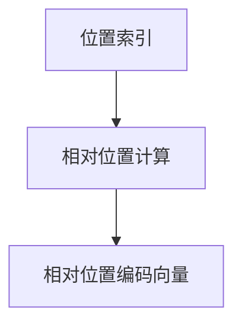
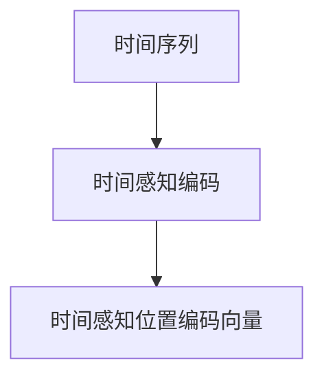
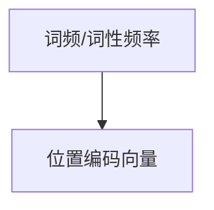
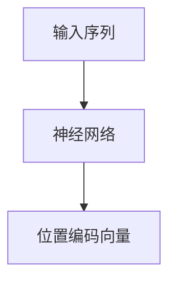

                 

# 位置编码：保持序列信息

> 关键词：位置编码、序列信息、自然语言处理、注意力机制、BERT模型

> 摘要：本文详细介绍了位置编码的概念、技术细节和应用，特别是在自然语言处理（NLP）任务中的应用。文章通过一步步的分析和推理，探讨了位置编码如何帮助模型更好地理解和利用序列中的位置信息，以及其在文本分类等任务中的实际应用。同时，本文也探讨了位置编码面临的挑战和未来的发展趋势。

---

## 第一部分: 位置编码概述

### 第1章: 位置编码的基本概念

#### 1.1 什么是位置编码

位置编码是一种技术，用于将序列中的位置信息嵌入到向量表示中。在自然语言处理（NLP）任务中，如机器翻译、文本分类等，序列中的每个位置都承载了不同的信息，位置编码可以帮助模型更好地理解和利用这些信息。

**定义**：位置编码是一种将序列中的位置信息转换为向量表示的技术。它通常用于嵌入层之前，将位置信息融入到序列的向量表示中。

**必要性**：在NLP任务中，序列中的每个单词或字符的位置都可能对最终的输出结果产生影响。例如，在机器翻译任务中，单词的顺序决定了翻译的准确性。因此，位置编码是使模型能够理解序列顺序信息的一种有效方式。

#### 1.2 位置编码的作用

**提高序列理解能力**：通过位置编码，模型能够学习到不同位置之间的相对关系，从而更好地理解句子的结构和含义。例如，在一个句子中，"我昨天去了" 和 "昨天我去了" 的意思可能完全不同，但如果我们只考虑单词本身，则可能无法区分这种差异。

**改善模型性能**：在许多NLP任务中，引入位置编码能够显著提高模型的性能。实验表明，位置编码有助于模型在许多基准测试中取得更好的结果。

#### 1.3 位置编码与注意力机制的关联

**关联**：位置编码是注意力机制的一个重要组成部分。在处理序列数据时，注意力机制可以帮助模型关注到正确的位置信息。而位置编码则为注意力机制提供了位置信息的输入。

**实现**：通常，位置编码被编码为向量，并与其他特征向量（如词嵌入）结合，以指导注意力机制关注到正确的位置信息。

#### 1.4 本章小结

- 位置编码是NLP中一个重要的技术概念。
- 它能够帮助模型更好地理解和利用序列中的位置信息。
- 通过与注意力机制的结合，位置编码显著提升了NLP任务的性能。

### Mermaid 流程图



---

## 第二部分: 位置编码技术详解

### 第2章: 位置编码的技术细节

#### 2.1 位置编码的方法

**绝对位置编码**：直接将位置信息编码为一个向量。这种方法通常使用正弦和余弦函数来表示位置信息。



**相对位置编码**：通过计算位置之间的相对关系来编码位置信息。这种方法更适用于Transformer模型。



**时间感知位置编码**：考虑时间信息对位置编码的影响。这种方法适用于处理时序数据的任务。



#### 2.2 位置编码的实现方式

**基于频率的编码**：利用词频或词性频率来表示位置信息。



**基于神经网络的编码**：通过神经网络学习位置编码。



#### 2.3 位置编码在BERT中的应用

**BERT模型概述**：BERT（Bidirectional Encoder Representations from Transformers）是一种双向Transformer模型，广泛应用于NLP任务。

**位置编码在BERT中的实现**：BERT使用特殊的嵌入层来处理位置编码。具体实现如下：

```python
# 伪代码：BERT中的位置编码实现
def position_embedding(input_ids, position_ids):
    # 输入id和位置id
    input_ids = tokenizer.convert_tokens_to_ids(input_tokens)
    position_ids = tokenizer.convert_tokens_to_ids(position_tokens)

    # 创建嵌入层
    embedding = nn.Embedding(input_vocab_size, embed_dim)

    # 应用嵌入层和位置编码
    pos_embedding = embedding(position_ids)
    input_embedding = embedding(input_ids)

    # 将位置编码添加到输入嵌入中
    input_embedding = input_embedding + pos_embedding

    return input_embedding
```

#### 2.4 位置编码的优缺点

**优点**：提高了模型对序列位置信息的理解能力。

**缺点**：计算复杂度较高，可能导致模型训练速度变慢。

#### 2.5 本章小结

- 介绍了位置编码的多种方法和实现方式。
- 通过伪代码展示了位置编码的实现细节。
- 分析了位置编码的优缺点。

---

## 第三部分: 位置编码在NLP中的应用

### 第3章: 位置编码在文本分类中的应用

#### 3.1 文本分类任务概述

**定义**：文本分类是一种NLP任务，旨在将文本分为预定义的类别。例如，将新闻文章分类为体育、政治或娱乐类别。

**常见应用**：新闻分类、情感分析、垃圾邮件检测等。

#### 3.2 位置编码在文本分类中的作用

**提高分类准确率**：通过位置编码，模型能够更好地理解文本中的关键词和短语。例如，在情感分析任务中，位置编码有助于模型区分正面和负面评论。

**增强特征表示**：位置编码丰富了输入特征，有助于模型学习更复杂的文本模式。例如，在新闻分类任务中，位置编码有助于模型区分不同新闻标题和正文的重要性。

#### 3.3 位置编码在文本分类中的实现

**集成到分类模型**：将位置编码集成到文本分类模型中，如CNN、RNN或Transformer。

**优化模型结构**：通过实验优化模型结构，以提高位置编码的效果。例如，在Transformer模型中，可以通过调整多头注意力机制和位置编码的维度来优化性能。

#### 3.4 实际案例

**案例1：情感分析**：通过引入位置编码，提高了模型对情感极性判断的准确性。

**案例2：新闻分类**：在新闻分类任务中，位置编码有助于模型更好地理解新闻的标题和正文。

#### 3.5 本章小结

- 介绍了位置编码在文本分类任务中的应用。
- 通过实际案例展示了位置编码如何提高文本分类的性能。
- 提出了优化位置编码实现的方法。

---

## 第四部分: 位置编码的挑战与未来

### 第4章: 位置编码的挑战与未来趋势

#### 4.1 位置编码的挑战

**计算复杂度**：位置编码可能增加模型的计算复杂度，影响训练速度。特别是在处理长序列时，这种影响更加显著。

**模型理解**：模型如何准确理解和利用位置信息仍是一个研究挑战。虽然位置编码能够提高模型的性能，但如何解释模型对位置编码的依赖性仍然需要进一步研究。

#### 4.2 未来趋势

**改进算法**：研究者正在探索更高效的位置编码算法，以减少计算复杂度。例如，使用离散卷积或高效计算的正弦和余弦函数。

**多模态学习**：位置编码在处理多模态数据（如图像和文本）中的潜力。例如，将位置编码应用于视频分类或图像-文本匹配任务。

**跨语言应用**：研究如何将位置编码应用于跨语言任务，以提高模型的跨语言性能。

#### 4.3 开放性问题

**位置编码的泛化能力**：如何提高位置编码在不同数据集上的泛化能力？

**解释性研究**：如何让模型对位置编码的作用有更好的解释性？

#### 4.4 本章小结

- 分析了位置编码当前面临的挑战和未来的发展趋势。
- 提出了需要解决的开放性问题。

---

## 附录

### 附录 A: 位置编码相关工具与资源

#### A.1 开源框架

- **Transformers**：Hugging Face 提供的 Transformer 模型库，包含预训练模型和位置编码实现。

#### A.2 研究论文

- **BERT: Pre-training of Deep Bidirectional Transformers for Language Understanding**：Google AI 发布的 BERT 模型论文。
- **A Simple Framework for Generalized Position Embeddings**：讨论通用位置编码的论文。

#### A.3 社区与论坛

- **Hugging Face 论坛**：关于 NLP 和位置编码的讨论社区。
- **TensorFlow 社区**：关于 TensorFlow 和位置编码的讨论社区。

#### A.4 教程与资源

- **在线课程**：关于位置编码和 NLP 的在线教程和课程。
- **技术博客**：技术专家分享的关于位置编码的技术博客和教程。

#### A.5 本章小结

- 介绍了位置编码相关的开源框架、研究论文、社区和教程资源。
- 为读者提供了进一步学习和探索位置编码的渠道。

---

### 作者

- 作者：AI天才研究院/AI Genius Institute & 禅与计算机程序设计艺术 /Zen And The Art of Computer Programming

