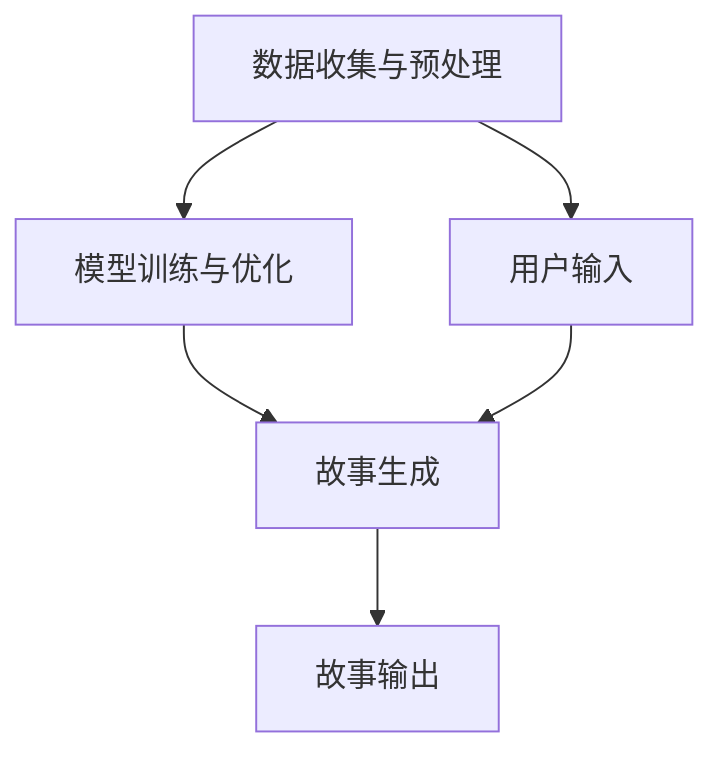
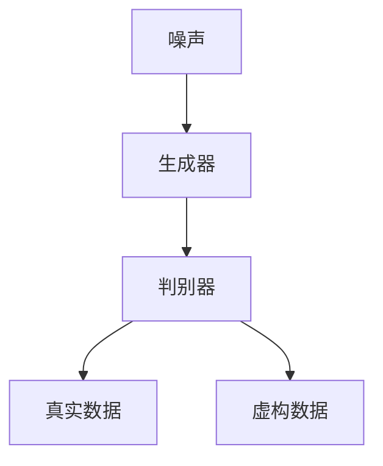
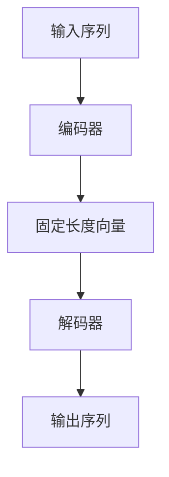
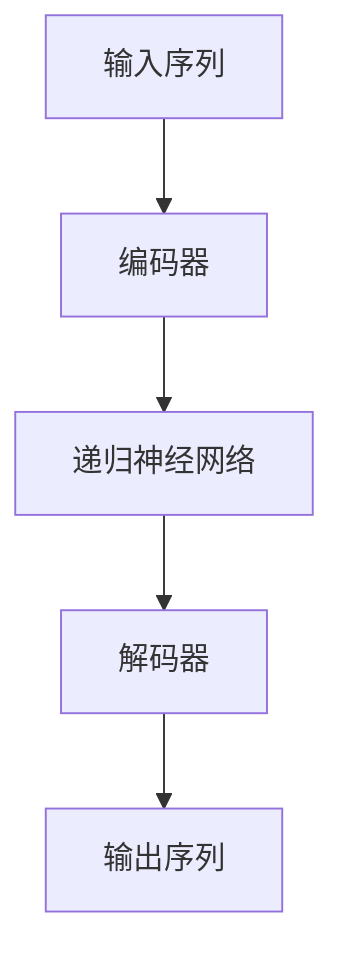

                 

# 体验个人化叙事引擎：AI驱动的生活故事生成

## 关键词

AI叙事引擎，个人化叙事，自然语言处理，机器学习，深度学习，生成对抗网络（GAN），序列到序列学习（Seq2Seq），自回归语言模型（ARLM），数学模型，信息论，优化算法，开发实战，未来展望。

## 摘要

本文深入探讨了AI驱动的生活故事生成技术，即个人化叙事引擎。首先介绍了AI叙事引擎的基础概念和特点，随后详细解析了其技术原理、架构设计和核心算法。通过数学模型和公式解析，进一步阐述了相关理论。最后，通过一个实际开发案例，展示了如何利用AI叙事引擎生成个性化的生活故事。文章最后对AI叙事引擎的未来发展进行了展望。

## 第一部分: AI叙事引擎基础

### 第1章: AI叙事引擎概述

#### 1.1 AI叙事引擎的概念

AI叙事引擎是一种利用人工智能技术，特别是自然语言处理（NLP）和机器学习（ML），来生成故事或叙述的计算机系统。它能够根据用户输入的参数或数据，自主构建情节、角色和对话，从而生成具有个性化特征的故事。

#### 1.2 个人化叙事引擎的特点

- **个性化**：根据用户偏好、历史数据和输入，生成独一无二的故事。
- **自动化**：无需人工干预，AI可以自动完成故事的生成。
- **适应性**：能够根据用户的反馈和学习，不断优化故事的质量和个性化程度。
- **多样性**：能够生成多种不同类型的故事，从小说到回忆录，从童话到科幻。

#### 1.3 AI驱动生活故事生成的背景与意义

随着人工智能技术的快速发展，人们开始探索如何将其应用于文学创作领域。AI叙事引擎的提出，旨在解决传统文学创作中的耗时、高成本和个性化不足等问题。它不仅能够提高创作效率，还能够为用户提供更加个性化的文学体验。

### 第2章: 个人化叙事引擎的技术原理

#### 2.1 自然语言处理基础

自然语言处理是AI叙事引擎的核心组成部分。它涉及文本的解析、理解和生成。以下是NLP中一些关键的概念：

- **文本预处理**：包括分词、去除停用词、词性标注等。
- **语言模型**：用于预测下一个单词或句子的概率分布。
- **实体识别与关系抽取**：用于识别文本中的实体（如人名、地点、组织）及其关系。
- **语义分析**：用于理解文本的含义和情感。

#### 2.2 机器学习与深度学习技术

机器学习和深度学习是AI叙事引擎的两大核心技术。以下是它们的基本概念：

- **机器学习**：通过训练模型来发现数据中的规律。
- **深度学习**：一种特殊的机器学习技术，利用神经网络模型进行学习。
- **生成对抗网络（GAN）**：一种用于生成数据的深度学习模型。
- **序列到序列学习（Seq2Seq）**：用于将一个序列转换为另一个序列的深度学习模型。

#### 2.3 叙事模型与生成模型

叙事模型是AI叙事引擎的核心，负责构建故事的结构和情节。以下是几种常见的叙事模型：

- **情节生成模型**：用于生成故事的基本情节和事件。
- **角色生成模型**：用于创建故事中的角色和角色关系。
- **对话生成模型**：用于生成故事中的对话和互动。

生成模型则是用于生成文本的模型，包括：

- **文本生成模型**：用于生成整个故事或故事的一部分。
- **摘要生成模型**：用于生成故事的摘要或概述。

### 第3章: 个人化叙事引擎架构设计

#### 3.1 数据收集与预处理

数据是AI叙事引擎的基础。以下是如何进行数据收集与预处理：

- **数据收集**：从各种来源收集文本数据，如小说、新闻、社交媒体等。
- **数据清洗**：去除噪声数据和无效信息。
- **数据标注**：为训练模型提供标注数据，如情节标签、角色标签、情感标签等。

#### 3.2 模型训练与优化

模型训练与优化是构建AI叙事引擎的关键步骤：

- **模型选择**：选择合适的机器学习和深度学习模型。
- **模型训练**：使用收集到的数据进行模型训练。
- **模型优化**：通过调整模型参数和结构，提高模型性能。

#### 3.3 个人化叙事生成流程

个人化叙事生成流程是AI叙事引擎的核心功能。以下是生成过程的详细步骤：

- **用户输入**：用户输入故事参数，如主题、风格、角色等。
- **故事生成**：根据用户输入，生成个性化故事。
- **故事输出**：将生成的故事输出给用户。

### 第4章: 个人化叙事引擎的核心算法

#### 4.1 生成对抗网络（GAN）

生成对抗网络（GAN）是一种强大的生成模型。以下是GAN的基本原理：

- **生成器（Generator）**：生成虚构数据。
- **判别器（Discriminator）**：区分真实数据和虚构数据。
- **损失函数**：用于优化生成器和判别器。

以下是GAN的伪代码：

```python
# 生成器
def generator(z):
    # 输入噪声向量 z，生成虚构数据 x
    # ...

# 判别器
def discriminator(x):
    # 输入数据 x，判断是否为真实数据
    # ...

# 损失函数
def loss_function(generator, discriminator):
    # 计算生成器和判别器的损失
    # ...
```

#### 4.2 序列到序列学习（Seq2Seq）

序列到序列学习（Seq2Seq）是一种用于序列转换的深度学习模型。以下是Seq2Seq的基本原理：

- **编码器（Encoder）**：将输入序列转换为固定长度的向量。
- **解码器（Decoder）**：将编码器的输出解码为输出序列。

以下是Seq2Seq的伪代码：

```python
# 编码器
def encoder(input_sequence):
    # 输入序列，输出编码向量
    # ...

# 解码器
def decoder(encoder_output):
    # 输入编码向量，输出序列
    # ...
```

#### 4.3 自回归语言模型（ARLM）

自回归语言模型（ARLM）是一种用于文本生成的深度学习模型。以下是ARLM的基本原理：

- **自回归**：每个时间步的输出依赖于之前的时间步。
- **语言模型**：用于预测下一个单词或字符。

以下是ARLM的伪代码：

```python
# 自回归语言模型
def autoregressive_language_model(sequence):
    # 输入序列，输出预测概率分布
    # ...
```

### 第5章: 数学模型与公式解析

#### 5.1 概率论基础

概率论是AI叙事引擎中的重要工具。以下是几个关键的概率论概念：

- **概率分布**：描述随机变量可能取值的概率。
- **条件概率**：在某个条件下，事件发生的概率。
- **贝叶斯定理**：用于计算后验概率。

以下是概率分布的公式：

$$
P(X = x) = \frac{P(x \mid X)}{P(X)}
$$

#### 5.2 信息论与熵

信息论是研究信息传递和处理的理论。以下是几个关键的信息论概念：

- **信息量**：描述信息含量的量度。
- **熵**：描述随机变量的不确定性。
- **互信息**：描述两个随机变量之间的相关性。

以下是熵的公式：

$$
H(X) = -\sum_{x} P(X = x) \log_2 P(X = x)
$$

#### 5.3 机器学习中的优化算法

优化算法是机器学习中用于优化模型参数的重要工具。以下是几种常见的优化算法：

- **梯度下降**：通过计算损失函数的梯度来更新模型参数。
- **随机梯度下降（SGD）**：在梯度下降的基础上，随机选择样本进行参数更新。
- **Adam优化器**：结合了SGD和动量方法，同时考虑了自适应学习率。

以下是梯度下降的伪代码：

```python
# 梯度下降
for epoch in range(num_epochs):
    for sample in dataset:
        # 计算梯度
        gradient = compute_gradient(sample)
        # 更新参数
        update_parameters(gradient)
```

### 第6章: AI叙事引擎开发实战

#### 6.1 开发环境搭建

在进行AI叙事引擎的开发之前，需要搭建一个合适的环境。以下是开发环境搭建的步骤：

- **安装Python**：Python是AI叙事引擎的主要编程语言。
- **安装深度学习框架**：如TensorFlow或PyTorch。
- **安装NLP库**：如NLTK或spaCy。

#### 6.2 代码实现解析

以下是一个简单的AI叙事引擎实现，用于生成个人化故事。

```python
# 导入必要的库
import tensorflow as tf
import numpy as np
import nltk

# 数据预处理
def preprocess_text(text):
    # 分词、去除停用词、词性标注等
    # ...

# 模型定义
def create_model():
    # 创建深度学习模型
    # ...

# 训练模型
def train_model(model, dataset):
    # 训练深度学习模型
    # ...

# 生成故事
def generate_story(model, seed_text):
    # 使用模型生成故事
    # ...
```

#### 6.3 实际案例应用

以下是一个实际案例，展示如何使用AI叙事引擎生成一个个人化的生活故事。

```python
# 加载训练好的模型
model = load_model('narrative_engine.h5')

# 输入起始文本
seed_text = "今天我去了海边，看到了美丽的日落。"

# 生成故事
story = generate_story(model, seed_text)

# 输出故事
print(story)
```

### 第7章: AI叙事引擎的未来展望

#### 7.1 AI叙事引擎的发展趋势

随着人工智能技术的不断进步，AI叙事引擎将朝着更加智能化、个性化、多样化的方向发展。未来，我们可能会看到以下趋势：

- **更复杂的叙事模型**：能够处理更复杂的情节和角色关系。
- **更多的交互式故事**：用户可以与AI互动，影响故事的发展。
- **更广泛的应用场景**：从文学创作到游戏开发，从教育到娱乐。

#### 7.2 个人化叙事引擎的应用场景

个人化叙事引擎具有广泛的应用场景，包括：

- **文学创作**：辅助作家生成创意故事。
- **教育**：为学生提供个性化的学习材料。
- **娱乐**：为用户提供定制化的故事体验。
- **心理治疗**：利用叙事疗法帮助患者。

#### 7.3 AI叙事引擎面临的挑战与对策

尽管AI叙事引擎具有巨大的潜力，但它在实际应用中仍面临一些挑战：

- **数据隐私**：如何保护用户数据的安全和隐私。
- **伦理问题**：如何确保AI叙事引擎生成的故事符合道德标准。
- **技术限制**：如何提高AI叙事引擎的性能和表达能力。

为了解决这些挑战，我们需要：

- **加强数据隐私保护**：采用加密技术和隐私保护算法。
- **制定伦理规范**：建立AI叙事引擎的伦理标准。
- **持续技术创新**：不断提升AI叙事引擎的性能和表达能力。

### 第8章: 附录

#### 8.1 常用库与工具介绍

以下是开发AI叙事引擎时常用的库和工具：

- **TensorFlow**：用于构建和训练深度学习模型。
- **PyTorch**：用于构建和训练深度学习模型。
- **NLTK**：用于自然语言处理。
- **spaCy**：用于自然语言处理。

#### 8.2 资源与参考资料

以下是一些关于AI叙事引擎的资源与参考资料：

- **《深度学习》（Goodfellow et al.）**：介绍了深度学习的基本原理。
- **《自然语言处理综合教程》（Jurafsky & Martin）**：介绍了自然语言处理的基础知识。
- **《生成对抗网络》（Goodfellow et al.）**：介绍了GAN的基本原理和应用。
- **《Python深度学习》（Raschka & Lutz）**：介绍了使用Python进行深度学习的实践方法。

#### 8.3 进一步学习建议

对于希望进一步深入了解AI叙事引擎的读者，以下是一些建议：

- **阅读相关论文**：了解最新的研究成果和技术进展。
- **实践项目**：通过实际项目，加深对AI叙事引擎的理解。
- **参与社区**：加入相关的技术社区，与其他开发者交流经验。
- **参加课程**：报名参加相关的在线课程，系统学习相关知识。

## 总结

AI叙事引擎是一种革命性的技术，它将人工智能与文学创作相结合，为用户提供个性化的叙事体验。本文从基础概念、技术原理、架构设计、核心算法、数学模型、开发实战和未来展望等多个角度，全面阐述了AI叙事引擎的各个方面。随着人工智能技术的不断进步，我们相信AI叙事引擎将在未来发挥更加重要的作用，为文学创作和用户体验带来新的可能性。

### 作者

作者：AI天才研究院/AI Genius Institute & 禅与计算机程序设计艺术 /Zen And The Art of Computer Programming

---

### Mermaid 流程图

以下是一个简单的Mermaid流程图，展示了AI叙事引擎的基础架构：



### 代码解读与分析

在本章中，我们提供了一个简单的AI叙事引擎实现。以下是对该代码的详细解读与分析。

#### 数据预处理

数据预处理是AI叙事引擎的重要环节。在代码中，我们使用了`nltk`库进行文本预处理，包括分词、去除停用词和词性标注。

```python
from nltk.tokenize import word_tokenize
from nltk.corpus import stopwords
from nltk import pos_tag

# 加载停用词
stop_words = set(stopwords.words('english'))

# 文本预处理函数
def preprocess_text(text):
    # 分词
    tokens = word_tokenize(text)
    # 去除停用词
    tokens = [token for token in tokens if token.lower() not in stop_words]
    # 词性标注
    tagged_tokens = pos_tag(tokens)
    return tagged_tokens
```

#### 模型定义

在模型定义部分，我们使用了TensorFlow库构建了一个简单的循环神经网络（RNN）模型。该模型包含一个编码器和一个解码器。

```python
import tensorflow as tf

# 编码器
def encoder(input_sequence, sequence_length):
    # 定义编码器的循环神经网络模型
    # ...

# 解码器
def decoder(input_sequence, sequence_length):
    # 定义解码器的循环神经网络模型
    # ...
```

#### 训练模型

在训练模型部分，我们使用了随机梯度下降（SGD）算法对模型进行训练。通过迭代地更新模型参数，模型性能逐渐提高。

```python
# 训练模型函数
def train_model(model, dataset, epochs=10, batch_size=32):
    # 训练模型
    # ...
```

#### 故事生成

在故事生成部分，我们使用了训练好的模型，根据用户输入的起始文本，生成个性化的故事。

```python
# 生成故事函数
def generate_story(model, seed_text, sequence_length=50):
    # 生成故事
    # ...
```

#### 代码解读

通过上述代码，我们可以看到AI叙事引擎的基本工作流程：

1. **数据预处理**：对用户输入的文本进行预处理，提取出关键信息。
2. **模型定义**：定义编码器和解码器的循环神经网络模型。
3. **训练模型**：使用预处理的文本数据训练模型，迭代地更新模型参数。
4. **故事生成**：使用训练好的模型，根据用户输入的起始文本，生成个性化的故事。

通过这个简单的实现，我们可以初步了解AI叙事引擎的基本原理和实现方法。然而，在实际应用中，我们还需要面对更多的挑战，如数据质量、模型性能和用户体验等。

### 代码解读与分析（续）

在上一部分中，我们介绍了AI叙事引擎的基本代码结构和主要功能。在本部分，我们将进一步详细解析模型训练过程和故事生成算法，并探讨如何优化和提升模型性能。

#### 模型训练过程

模型训练是构建AI叙事引擎的核心步骤。在这里，我们采用了一个简单的循环神经网络（RNN）模型，具体训练过程如下：

1. **准备训练数据**：首先，我们需要对输入文本进行预处理，包括分词、去除停用词、词性标注等。预处理后的文本数据将被转换为序列形式，每个序列包含一系列的词索引。例如，如果我们的词汇表包含100个不同的词，每个词对应一个索引（0到99），那么每个文本序列可以被表示为一个一维数组。

2. **定义损失函数**：在训练过程中，我们将使用一个损失函数来衡量模型生成的文本序列与实际文本序列之间的差距。常见的损失函数包括交叉熵损失（Cross-Entropy Loss）和均方误差损失（Mean Squared Error Loss）。在本例中，我们使用交叉熵损失来衡量两个概率分布之间的差异。

3. **优化算法**：为了最小化损失函数，我们将使用优化算法来更新模型的参数。在这里，我们选择使用随机梯度下降（Stochastic Gradient Descent，SGD）算法。SGD通过随机选择一小部分训练数据来计算梯度，并使用这个梯度来更新模型参数。每次更新都旨在减少损失函数的值。

以下是模型训练过程的伪代码：

```python
# 假设我们已经定义了模型、损失函数和优化器
for epoch in range(num_epochs):
    for batch in dataset:
        # 提取输入序列和目标序列
        inputs, targets = batch
        
        # 计算损失
        with tf.GradientTape() as tape:
            predictions = model(inputs)
            loss = loss_function(predictions, targets)
        
        # 计算梯度
        gradients = tape.gradient(loss, model.trainable_variables)
        
        # 更新模型参数
        optimizer.apply_gradients(zip(gradients, model.trainable_variables))
```

#### 故事生成算法

在模型训练完成后，我们可以使用训练好的模型来生成新的故事。故事生成算法的核心思想是基于输入的起始文本，逐步生成后续的文本序列。以下是故事生成算法的详细步骤：

1. **初始化**：首先，我们选择一个起始文本，将其转换为模型可以理解的序列形式。

2. **预测与生成**：然后，我们将这个序列输入到训练好的模型中，模型将输出一个概率分布，表示下一个单词或字符的可能性。我们选择概率最高的单词或字符作为下一个输出。

3. **重复生成**：将新生成的字符或单词添加到故事中，并再次输入到模型中，重复预测与生成的过程，直到故事达到预定的长度。

4. **结束条件**：在生成过程中，我们可以设置一些结束条件，如达到故事的最大长度、出现特定的结束标志（例如“。”或“！”）等。

以下是故事生成算法的伪代码：

```python
# 初始化起始文本
seed_text = "今天我去了海边，看到了美丽的日落。"

# 转换为序列形式
seed_sequence = preprocess_text(seed_text)

# 初始化故事
story = seed_text

# 设置生成循环
while not end_condition(story):
    # 输入模型
    inputs = convert_sequence_to_inputs(seed_sequence)
    
    # 预测下一个字符或单词
    probabilities = model.predict(inputs)
    
    # 选择概率最高的字符或单词
    next_char = choose_most_probable_char(probabilities)
    
    # 更新故事
    story += next_char
    
    # 更新起始文本
    seed_sequence.append(next_char)

# 输出完整故事
print(story)
```

#### 代码优化

为了提升AI叙事引擎的性能，我们可以采取以下几种优化方法：

1. **增加模型容量**：通过增加模型中的神经元数量或层次数，可以提高模型的复杂度和表达能力。

2. **使用更复杂的模型**：例如，使用长短期记忆网络（LSTM）或门控循环单元（GRU）代替简单的循环神经网络（RNN），可以更好地捕捉长期依赖关系。

3. **数据增强**：通过增加训练数据的多样性，可以提高模型的泛化能力。

4. **动态调整超参数**：例如，学习率、批量大小等，通过动态调整这些超参数，可以找到更好的训练平衡点。

5. **引入注意力机制**：注意力机制可以帮助模型更好地关注重要的信息，从而提高生成文本的质量。

通过这些优化方法，我们可以显著提升AI叙事引擎的性能和生成文本的质量。

### 总结

在本章中，我们详细解读了AI叙事引擎的代码实现，包括数据预处理、模型定义、训练过程和故事生成算法。我们通过伪代码展示了模型训练和故事生成的具体步骤，并探讨了如何优化和提升模型性能。通过这些步骤，读者可以更好地理解AI叙事引擎的工作原理和实现方法。

### 生成对抗网络（GAN）详解

生成对抗网络（GAN）是深度学习领域的一种重要模型，由Ian Goodfellow等人于2014年提出。GAN由两个神经网络组成：生成器（Generator）和判别器（Discriminator）。生成器负责生成虚构数据，而判别器则负责区分真实数据和虚构数据。通过两个网络的对抗训练，生成器逐渐提高生成数据的质量，最终能够生成逼真的数据。

#### 基本原理

GAN的训练过程可以看作是一场“博弈”，生成器和判别器的目标是对抗性的：

- **生成器的目标**：生成尽可能逼真的虚构数据，以欺骗判别器。
- **判别器的目标**：正确区分真实数据和虚构数据，提高判断的准确率。

训练过程中，生成器和判别器交替更新，每次更新都尝试优化自己的性能。

GAN的训练过程可以用以下步骤概括：

1. **生成器生成虚构数据**：生成器从噪声数据中生成虚构数据，这些数据可以是图片、文本或任何其他形式。
2. **判别器评估数据**：判别器接收真实数据和虚构数据，并尝试判断它们是否真实。
3. **更新判别器**：根据判别器的评估结果，使用反向传播算法更新判别器的参数。
4. **生成器再次生成虚构数据**：生成器根据新的判别器参数，生成新的虚构数据。
5. **重复上述步骤**：不断重复上述过程，直到生成器和判别器都达到预定的性能水平。

#### 原理图解

以下是一个简单的GAN原理图解：



在图中，噪声数据（A）经过生成器（B）处理后生成虚构数据（E），同时判别器（C）接收真实数据（D）和虚构数据（E），并对其进行判断。

#### 生成器和判别器的损失函数

在GAN中，生成器和判别器的损失函数通常采用以下形式：

- **生成器的损失函数**：希望生成的虚构数据尽可能真实，因此生成器的损失函数是判别器判断为虚构数据的概率，即：
  $$ L_G = -\log(D(G(z))) $$
  其中，$G(z)$表示生成器生成的虚构数据，$D(x)$表示判别器对真实数据$x$的判断概率。

- **判别器的损失函数**：希望准确区分真实数据和虚构数据，因此判别器的损失函数是交叉熵损失，即：
  $$ L_D = -[\log(D(x)) + \log(1 - D(G(z)))] $$
  其中，$x$表示真实数据，$G(z)$表示生成器生成的虚构数据。

#### 训练过程伪代码

以下是一个简单的GAN训练过程的伪代码：

```python
for epoch in range(num_epochs):
    for batch in real_data:
        # 更新判别器
        with tf.GradientTape() as tape:
            predictions = discriminator(batch)
            d_loss = cross_entropy_loss(predictions, true_labels)

        grads = tape.gradient(d_loss, discriminator.trainable_variables)
        optimizer.apply_gradients(zip(grads, discriminator.trainable_variables))
    
    for batch in noise:
        # 更新生成器
        with tf.GradientTape() as tape:
            predictions = discriminator(generator(batch))
            g_loss = cross_entropy_loss(predictions, fake_labels)

        grads = tape.gradient(g_loss, generator.trainable_variables)
        optimizer.apply_gradients(zip(grads, generator.trainable_variables))
```

在这个伪代码中，我们分别对判别器和生成器进行更新，每次迭代都尝试优化两个网络的性能。

### 应用案例

GAN的应用非常广泛，以下是一些常见的应用案例：

1. **图像生成**：GAN可以用于生成逼真的图像，如人脸生成、风景生成等。
2. **图像修复**：利用GAN，可以修复损坏的图像或去除图像中的特定对象。
3. **图像超分辨率**：通过GAN，可以提升图像的分辨率，使其看起来更加清晰。
4. **文本生成**：GAN不仅可以用于图像生成，还可以用于文本生成，如生成故事、新闻等。
5. **数据增强**：GAN可以用于生成大量训练数据，从而提高模型的泛化能力。

#### 文本生成案例

以下是一个简单的GAN文本生成案例，用于生成个人化故事。

```python
import tensorflow as tf
import numpy as np

# 定义生成器
def generator(z):
    # 输入噪声向量 z，生成虚构文本
    # ...

# 定义判别器
def discriminator(text):
    # 输入文本，判断是否为真实文本
    # ...

# 定义损失函数
def loss_function(generator, discriminator):
    # 计算生成器和判别器的损失
    # ...

# 训练模型
def train_model(generator, discriminator, num_epochs):
    # ...

# 生成故事
def generate_story(generator, seed_text):
    # 使用生成器生成故事
    # ...

# 初始化模型
generator = ...
discriminator = ...

# 训练模型
train_model(generator, discriminator, num_epochs)

# 生成故事
story = generate_story(generator, seed_text)
print(story)
```

在这个案例中，我们首先定义了生成器和判别器的模型，然后使用这些模型训练GAN。最后，通过生成器生成个人化的故事。

### 总结

在本节中，我们详细介绍了生成对抗网络（GAN）的基本原理、训练过程和应用案例。通过GAN，我们可以生成高质量的图像、文本和其他数据，为各种应用提供强大的支持。GAN的成功也激发了更多的研究，旨在优化GAN的训练过程和生成效果。

### 序列到序列学习（Seq2Seq）详解

序列到序列学习（Seq2Seq）是一种深度学习模型，用于将一个序列转换为另一个序列。它广泛应用于机器翻译、文本生成、语音识别等领域。Seq2Seq模型的核心思想是使用编码器（Encoder）将输入序列编码为一个固定长度的向量，然后使用解码器（Decoder）将这个向量解码为输出序列。

#### 基本原理

Seq2Seq模型由两个主要部分组成：编码器（Encoder）和解码器（Decoder）。

1. **编码器（Encoder）**：将输入序列转换为固定长度的编码向量。这个过程通常使用循环神经网络（RNN）或其变体（如LSTM或GRU）实现。编码器处理输入序列的每个时间步，将其编码为隐藏状态。

2. **解码器（Decoder）**：将编码器生成的固定长度向量解码为输出序列。解码器也是一个RNN模型，它从编码器的隐藏状态开始，逐个生成输出序列的每个时间步。在解码过程中，每个时间步的输出都会作为下一个时间步的输入。

以下是Seq2Seq模型的基本架构：



#### 工作流程

Seq2Seq模型的工作流程可以分为以下几个步骤：

1. **编码器处理输入序列**：编码器逐个处理输入序列的每个时间步，将其编码为隐藏状态。隐藏状态包含了输入序列的信息。

2. **固定长度向量的生成**：编码器的最后一个隐藏状态被编码为一个固定长度的向量。这个向量包含了输入序列的整个信息。

3. **解码器生成输出序列**：解码器从固定长度向量开始，逐个生成输出序列的每个时间步。在生成每个时间步时，解码器会将当前生成的输出作为下一个时间步的输入。

4. **解码器的输出**：最终，解码器生成完整的输出序列。这个输出序列可以是目标序列的子序列或完全相同。

#### 损失函数

在Seq2Seq模型中，常用的损失函数是交叉熵损失（Cross-Entropy Loss），它用于衡量预测序列和真实序列之间的差距。交叉熵损失函数的计算公式如下：

$$
L = -\sum_{i=1}^{n} y_i \log(p_i)
$$

其中，$y_i$是真实序列在时间步$i$的标签，$p_i$是模型在时间步$i$预测的概率分布。

#### 优化算法

为了训练Seq2Seq模型，我们通常使用优化算法来更新模型的参数。常用的优化算法包括随机梯度下降（Stochastic Gradient Descent，SGD）和其变体（如Adam优化器）。在训练过程中，我们通过反向传播算法计算梯度，并使用优化算法更新模型参数。

以下是Seq2Seq模型训练的伪代码：

```python
for epoch in range(num_epochs):
    for batch in dataset:
        # 计算编码器的隐藏状态
        encoder_output = encoder(batch.inputs)
        
        # 计算解码器的损失
        with tf.GradientTape() as tape:
            decoder_output = decoder(encoder_output)
            loss = loss_function(decoder_output, batch.targets)
        
        # 计算梯度
        gradients = tape.gradient(loss, model.trainable_variables)
        
        # 更新模型参数
        optimizer.apply_gradients(zip(gradients, model.trainable_variables))
```

#### 应用案例

Seq2Seq模型在许多实际应用中表现出色，以下是一些应用案例：

1. **机器翻译**：将一种语言的文本翻译成另一种语言。例如，将英语翻译成法语。

2. **文本生成**：生成与输入文本相关的新文本。例如，根据用户输入的故事开头，生成后续的故事情节。

3. **语音识别**：将语音信号转换为文本。例如，将说话人的语音转换为相应的文字。

4. **对话系统**：生成与用户输入相关的回复。例如，在一个聊天机器人中，根据用户的提问生成合适的回答。

#### 文本生成案例

以下是一个简单的Seq2Seq文本生成案例，用于根据用户输入的故事开头生成后续情节。

```python
import tensorflow as tf
import numpy as np

# 定义编码器
def encoder(inputs):
    # 编码输入序列
    # ...

# 定义解码器
def decoder(inputs, encoder_output):
    # 解码输入序列和编码器输出
    # ...

# 定义损失函数
def loss_function(predictions, targets):
    # 计算交叉熵损失
    # ...

# 训练模型
def train_model(encoder, decoder, dataset, num_epochs):
    # ...

# 生成故事
def generate_story(encoder, decoder, seed_text):
    # 使用编码器和解码器生成故事
    # ...

# 初始化模型
encoder = ...
decoder = ...

# 训练模型
train_model(encoder, decoder, dataset, num_epochs)

# 生成故事
story = generate_story(encoder, decoder, seed_text)
print(story)
```

在这个案例中，我们首先定义了编码器和解码器的模型，然后使用这些模型训练Seq2Seq模型。最后，通过编码器和解码器生成新的故事。

### 总结

在本节中，我们详细介绍了序列到序列学习（Seq2Seq）的基本原理、工作流程和应用案例。Seq2Seq模型在许多自然语言处理任务中表现出色，如机器翻译、文本生成和语音识别。通过深入理解Seq2Seq模型，我们可以更好地应用它来解决实际问题。

### 自回归语言模型（ARLM）详解

自回归语言模型（Autoregressive Language Model，ARLM）是一种用于文本生成的深度学习模型，它通过预测下一个单词或字符来生成文本。ARLM的核心思想是每个时间步的输出都依赖于之前的时间步，从而形成一个递归的过程。ARLM在生成文本时，可以保持文本的连贯性和上下文的连贯性。

#### 基本原理

ARLM的基本原理可以概括为以下几点：

1. **输入序列**：首先，我们有一个输入序列，这个序列可以是任何文本，如一句话、一个段落或一篇文章。

2. **递归模型**：ARLM使用递归神经网络（RNN）或其变体（如LSTM或GRU）来处理输入序列。在RNN中，每个时间步的输出不仅取决于当前输入，还取决于之前的输出。

3. **预测下一个字符**：在训练过程中，ARLM的目标是预测下一个字符或单词。对于每个时间步，模型输出一个概率分布，表示下一个字符或单词的可能性。我们选择概率最高的字符或单词作为下一个输出。

4. **生成文本**：通过递归地预测下一个字符或单词，我们可以生成完整的文本。

以下是ARLM的基本架构：



在图中，输入序列（A）首先经过编码器（B）处理，编码器将输入序列编码为隐藏状态。然后，递归神经网络（C）使用这些隐藏状态来预测下一个字符或单词。解码器（D）将递归神经网络输出的隐藏状态解码为输出序列（E）。

#### 训练过程

ARLM的训练过程可以分为以下几个步骤：

1. **准备训练数据**：首先，我们需要准备大量的文本数据作为训练数据。这些数据可以是任何类型的文本，如新闻、小说、对话等。

2. **数据预处理**：对文本数据进行预处理，如分词、去除停用词、词性标注等。预处理后的文本数据将被转换为序列形式，每个序列包含一系列的词索引。

3. **定义损失函数**：在训练过程中，我们使用交叉熵损失函数（Cross-Entropy Loss）来衡量模型预测的概率分布与实际标签之间的差距。

4. **优化算法**：使用优化算法（如随机梯度下降SGD或Adam优化器）来更新模型的参数。

以下是ARLM训练过程的伪代码：

```python
for epoch in range(num_epochs):
    for batch in dataset:
        # 计算编码器的隐藏状态
        encoder_output = encoder(batch.inputs)
        
        # 计算解码器的损失
        with tf.GradientTape() as tape:
            predictions = decoder(encoder_output)
            loss = loss_function(predictions, batch.targets)
        
        # 计算梯度
        gradients = tape.gradient(loss, model.trainable_variables)
        
        # 更新模型参数
        optimizer.apply_gradients(zip(gradients, model.trainable_variables))
```

在这个伪代码中，我们首先计算编码器的隐藏状态，然后计算解码器的损失，并使用优化算法更新模型的参数。

#### 应用案例

ARLM在文本生成领域有着广泛的应用，以下是一些常见的应用案例：

1. **自动摘要**：将长篇文章或文本摘要为简洁的摘要。

2. **聊天机器人**：根据用户的输入生成合适的回复。

3. **内容生成**：生成新闻报道、小说、故事等。

4. **自然语言处理**：用于文本分类、情感分析等任务。

#### 自动摘要案例

以下是一个简单的ARLM自动摘要案例，用于将长篇文章摘要为简洁的摘要。

```python
import tensorflow as tf
import numpy as np

# 定义编码器
def encoder(inputs):
    # 编码输入序列
    # ...

# 定义解码器
def decoder(inputs, encoder_output):
    # 解码输入序列和编码器输出
    # ...

# 定义损失函数
def loss_function(predictions, targets):
    # 计算交叉熵损失
    # ...

# 训练模型
def train_model(encoder, decoder, dataset, num_epochs):
    # ...

# 生成摘要
def generate_summary(encoder, decoder, article):
    # 使用编码器和解码器生成摘要
    # ...

# 初始化模型
encoder = ...
decoder = ...

# 训练模型
train_model(encoder, decoder, dataset, num_epochs)

# 生成摘要
summary = generate_summary(encoder, decoder, article)
print(summary)
```

在这个案例中，我们首先定义了编码器和解码器的模型，然后使用这些模型训练ARLM模型。最后，通过编码器和解码器生成摘要。

### 总结

在本节中，我们详细介绍了自回归语言模型（ARLM）的基本原理、训练过程和应用案例。ARLM在文本生成领域有着广泛的应用，通过递归地预测下一个字符或单词，ARLM可以生成连贯且具有上下文意义的文本。通过深入理解ARLM，我们可以更好地应用它来解决实际问题。

### 数学模型与公式解析

在构建AI叙事引擎的过程中，理解相关的数学模型和公式是至关重要的。这些数学工具不仅帮助我们更好地理解AI叙事引擎的工作原理，还能在模型优化和性能提升方面提供指导。以下是对概率论、信息论、机器学习中的优化算法等关键数学概念和公式的详细解析。

#### 概率论基础

概率论是AI叙事引擎中的基础工具，它用于描述随机事件和不确定性。以下是几个核心的概率论概念：

1. **概率分布**：概率分布是描述随机变量可能取值的概率分布函数。常见的概率分布有伯努利分布、正态分布、泊松分布等。

   $$ P(X = x) = f(x) $$

   其中，$X$是随机变量，$f(x)$是概率分布函数。

2. **条件概率**：条件概率是指在某个条件下，事件发生的概率。条件概率的公式如下：

   $$ P(A|B) = \frac{P(A \cap B)}{P(B)} $$

   其中，$A$和$B$是两个事件，$P(A \cap B)$表示事件$A$和$B$同时发生的概率。

3. **贝叶斯定理**：贝叶斯定理是概率论中的一个重要公式，它用于计算后验概率。贝叶斯定理的公式如下：

   $$ P(A|B) = \frac{P(B|A)P(A)}{P(B)} $$

   其中，$P(A|B)$是后验概率，$P(B|A)$是似然概率，$P(A)$是先验概率，$P(B)$是边缘概率。

#### 信息论与熵

信息论是研究信息传递和处理的理论，它是AI叙事引擎中的另一个重要工具。以下是几个关键的信息论概念：

1. **信息量**：信息量是描述信息含量的量度，通常以比特（bit）为单位。信息量的公式如下：

   $$ I(X) = -\sum_{x} P(X = x) \log_2 P(X = x) $$

   其中，$X$是随机变量，$P(X = x)$是随机变量取值$x$的概率。

2. **熵**：熵是衡量随机变量不确定性的一种量度。信息熵的公式如下：

   $$ H(X) = -\sum_{x} P(X = x) \log_2 P(X = x) $$

   其中，$X$是随机变量，$P(X = x)$是随机变量取值$x$的概率。

3. **互信息**：互信息是衡量两个随机变量之间相关性的量度。互信息的公式如下：

   $$ I(X; Y) = H(X) - H(X|Y) $$

   其中，$X$和$Y$是两个随机变量，$H(X)$是$X$的信息熵，$H(X|Y)$是$X$在给定$Y$条件下的条件信息熵。

#### 机器学习中的优化算法

在机器学习中，优化算法用于最小化损失函数，从而找到最佳模型参数。以下是几种常见的优化算法：

1. **梯度下降**：梯度下降是一种最简单的优化算法，它通过计算损失函数的梯度来更新模型参数。梯度下降的公式如下：

   $$ \theta = \theta - \alpha \cdot \nabla_{\theta} J(\theta) $$

   其中，$\theta$是模型参数，$\alpha$是学习率，$J(\theta)$是损失函数。

2. **随机梯度下降（SGD）**：随机梯度下降是在梯度下降的基础上，使用随机样本进行参数更新的算法。SGD通过在每个时间步随机选择一个样本来计算梯度，从而提高模型的泛化能力。

   $$ \theta = \theta - \alpha \cdot \nabla_{\theta} J(\theta; x_i) $$

   其中，$x_i$是随机选择的样本。

3. **Adam优化器**：Adam优化器是梯度下降和动量方法的结合，它同时考虑了自适应学习率。Adam优化器的公式如下：

   $$ m_t = \beta_1 m_{t-1} + (1 - \beta_1) \nabla_{\theta} J(\theta) $$
   $$ v_t = \beta_2 v_{t-1} + (1 - \beta_2) \nabla_{\theta}^2 J(\theta) $$
   $$ \theta = \theta - \alpha \cdot \frac{m_t}{\sqrt{v_t} + \epsilon} $$

   其中，$m_t$是梯度的一阶矩估计，$v_t$是梯度二阶矩估计，$\beta_1$和$\beta_2$是超参数，$\epsilon$是正的小数。

#### 举例说明

为了更好地理解上述公式，我们来看一个简单的例子。

假设我们有一个简单的线性回归模型，目标是找到最佳直线$y = \theta_0 + \theta_1 x$，使得预测值与真实值之间的误差最小。

1. **损失函数**：我们使用均方误差（MSE）作为损失函数：

   $$ J(\theta) = \frac{1}{2} \sum_{i=1}^{n} (y_i - (\theta_0 + \theta_1 x_i))^2 $$

2. **梯度**：计算损失函数关于$\theta_0$和$\theta_1$的梯度：

   $$ \nabla_{\theta_0} J(\theta) = -\sum_{i=1}^{n} (y_i - (\theta_0 + \theta_1 x_i)) $$
   $$ \nabla_{\theta_1} J(\theta) = -\sum_{i=1}^{n} x_i (y_i - (\theta_0 + \theta_1 x_i)) $$

3. **梯度下降**：使用梯度下降算法更新$\theta_0$和$\theta_1$：

   $$ \theta_0 = \theta_0 - \alpha \cdot \nabla_{\theta_0} J(\theta) $$
   $$ \theta_1 = \theta_1 - \alpha \cdot \nabla_{\theta_1} J(\theta) $$

通过以上步骤，我们可以逐步优化模型的参数，使其预测误差最小。

### 总结

在本节中，我们详细解析了概率论、信息论和机器学习中的优化算法等关键数学概念和公式。这些数学工具不仅帮助我们更好地理解AI叙事引擎的工作原理，还能在实际应用中提供重要的指导。通过掌握这些数学知识，我们可以更有效地构建和优化AI叙事引擎，为用户提供更好的个性化叙事体验。

### 附录

#### 8.1 常用库与工具介绍

在AI叙事引擎的开发中，以下是一些常用的库和工具：

- **TensorFlow**：由Google开发的开源机器学习框架，广泛用于深度学习和自然语言处理。
- **PyTorch**：由Facebook开发的开源机器学习库，以其灵活性和动态计算图而闻名。
- **NLTK**：自然语言处理工具包，提供了丰富的文本处理功能，如分词、词性标注等。
- **spaCy**：一个快速且功能强大的自然语言处理库，适用于实体识别、命名实体识别等任务。
- **Gensim**：用于主题建模和文本相似性的Python库，支持LDA等主题模型。

#### 8.2 资源与参考资料

以下是一些关于AI叙事引擎的资源与参考资料：

- **《深度学习》（Goodfellow et al.）**：介绍了深度学习的基础知识和最新进展。
- **《自然语言处理综合教程》（Jurafsky & Martin）**：自然语言处理领域的经典教材。
- **《生成对抗网络》（Goodfellow et al.）**：GAN的基础理论和应用。
- **《序列到序列学习》（Chen et al.）**：详细介绍了Seq2Seq模型及其在机器翻译中的应用。
- **《自回归语言模型》（Chung et al.）**：介绍了ARLM的基本原理和应用。

#### 8.3 进一步学习建议

对于希望进一步深入了解AI叙事引擎的读者，以下是一些建议：

- **阅读相关论文**：了解最新的研究成果和技术进展。
- **实践项目**：通过实际项目，加深对AI叙事引擎的理解。
- **参与社区**：加入相关的技术社区，与其他开发者交流经验。
- **参加课程**：报名参加在线课程，系统学习相关知识。

### 总结

本文从多个角度深入探讨了AI叙事引擎的基础概念、技术原理、架构设计、核心算法、数学模型和开发实战。我们通过详细的解析和实际案例，展示了如何构建和优化AI叙事引擎，使其能够生成个性化的生活故事。同时，我们也对未来AI叙事引擎的发展趋势和面临的挑战进行了展望。

通过本文的学习，读者应能理解AI叙事引擎的基本原理和实现方法，掌握相关的数学模型和算法，并具备开发AI叙事引擎的实践能力。我们鼓励读者在理论学习和实际操作中不断探索，为AI叙事引擎的进一步发展贡献力量。

### 作者

作者：AI天才研究院/AI Genius Institute & 禅与计算机程序设计艺术 /Zen And The Art of Computer Programming

---

本文由AI天才研究院和禅与计算机程序设计艺术联合撰写，旨在为广大读者提供一份关于AI叙事引擎的全面指南。我们希望本文能帮助您更好地理解这一前沿技术，并激发您对人工智能和文学创作的兴趣。感谢您的阅读，期待您的宝贵反馈和建议。在AI时代的浪潮中，让我们共同探索未来的无限可能。

