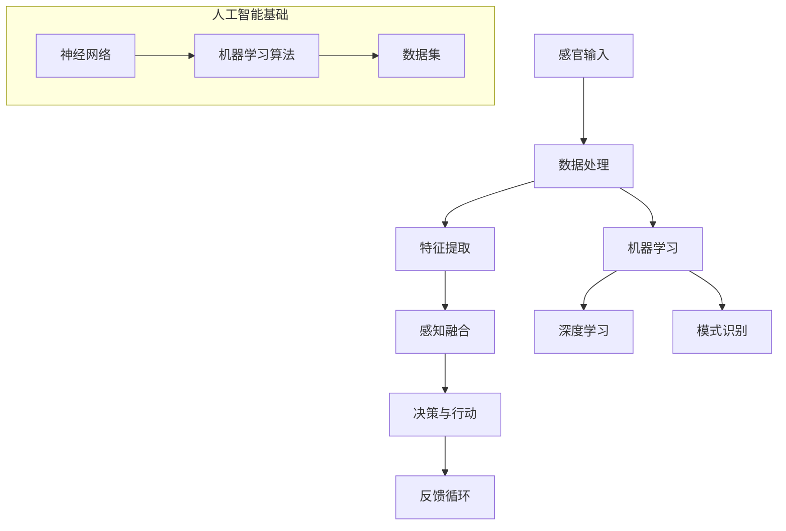

                 

# 文章标题：体验多维度构建：AI创造的感官世界设计

> 关键词：人工智能、感官世界、多维度构建、视觉、听觉、触觉、嗅觉、味觉、深度学习、跨感官整合

> 摘要：本文将深入探讨人工智能在创造感官世界方面的应用，从视觉、听觉、触觉、嗅觉和味觉五个维度出发，介绍AI感官世界的构建技术、原理和应用案例。通过多角度的分析，展示人工智能如何通过多维度感知，为人类带来全新的体验和变革。

# 目录

## 第一部分：引入与背景

### 第1章：AI感官世界概述

#### 1.1 AI感官世界的概念

#### 1.2 AI感官世界的应用领域

#### 1.3 AI感官世界的发展历程

### 第2章：AI感官世界的核心技术

#### 2.1 人工智能的基础概念

#### 2.2 机器学习算法原理

#### 2.3 深度学习技术详解

## 第二部分：AI感官世界的多维构建

### 第3章：视觉感知与图像处理

#### 3.1 视觉感知的原理

#### 3.2 图像处理算法

#### 3.3 视觉感知的应用案例

### 第4章：听觉感知与音频处理

#### 4.1 听觉感知的原理

#### 4.2 音频处理算法

#### 4.3 听觉感知的应用案例

### 第5章：触觉感知与交互设计

#### 5.1 触觉感知的原理

#### 5.2 触觉交互设计方法

#### 5.3 触觉感知的应用案例

### 第6章：嗅觉与味觉感知

#### 6.1 嗅觉与味觉感知的原理

#### 6.2 嗅觉与味觉感知的处理算法

#### 6.3 嗅觉与味觉感知的应用案例

## 第三部分：AI感官世界的应用实践

### 第7章：跨感官整合与设计

#### 7.1 跨感官整合的原理

#### 7.2 跨感官整合的设计方法

#### 7.3 跨感官整合的应用案例

### 第8章：AI感官世界的未来展望

#### 8.1 AI感官世界的技术趋势

#### 8.2 AI感官世界的伦理挑战

#### 8.3 AI感官世界的未来应用领域

## 附录

### 附录A：AI感官世界相关工具与资源

#### A.1 开源深度学习框架

#### A.2 AI感官世界的应用案例集

#### A.3 AI感官世界的学习资源推荐

# 第1章：AI感官世界概述

## 1.1 AI感官世界的概念

### 1.1.1 感官世界的概念

感官世界是指通过人类五种感官——视觉、听觉、触觉、嗅觉和味觉对外界信息的感知和理解。这五种感官是人类获取外部世界信息的主要途径，它们分别对应着不同类型的信息获取和处理方式。例如，视觉主要负责获取图像和颜色信息，听觉则主要负责获取声音信息，触觉则主要负责获取物体的形状、质地和温度等物理信息。

### 1.1.2 人工智能与感官世界的联系

人工智能（AI）是指由计算机实现的、能够模拟人类智能行为的系统。人工智能与感官世界的联系在于，AI系统可以通过模拟人类的感官功能，实现对多种类型信息的高效处理和理解。例如，通过模拟视觉功能，AI可以实现对图像的识别和理解；通过模拟听觉功能，AI可以实现对语音的识别和理解；通过模拟触觉功能，AI可以实现对物体的感知和交互。

### 1.1.3 AI感官世界的定义

AI感官世界是指通过人工智能技术，模拟和扩展人类五种感官功能，实现对外界信息的高效感知和理解，从而为人类带来全新体验和服务的虚拟世界。在这个世界中，人工智能不仅能够模拟人类感官的功能，还能够通过机器学习等技术，不断学习和优化感知能力，提高对复杂环境的适应能力。

## 1.2 AI感官世界的应用领域

AI感官世界的应用领域非常广泛，涵盖了消费电子、娱乐与游戏、健康医疗、智能家居等多个行业。以下是AI感官世界在各个应用领域的概述：

### 1.2.1 消费电子

在消费电子领域，AI感官世界主要用于提升产品的智能化水平。例如，智能手机通过视觉感知技术实现了人脸解锁、拍照优化等功能；智能音箱通过听觉感知技术实现了语音识别和智能问答；智能穿戴设备通过触觉感知技术实现了健康监测和互动反馈。

### 1.2.2 娱乐与游戏

在娱乐与游戏领域，AI感官世界为用户提供了更加沉浸式的体验。例如，虚拟现实（VR）和增强现实（AR）技术通过视觉和触觉感知，为用户创造了逼真的虚拟环境；智能游戏通过听觉和嗅觉感知，为用户带来了更加丰富的游戏体验。

### 1.2.3 健康医疗

在健康医疗领域，AI感官世界主要用于辅助医生诊断和治疗疾病。例如，通过视觉感知技术，AI可以帮助医生进行病理分析、手术导航；通过听觉感知技术，AI可以帮助医生进行语音识别，提高医疗记录的准确性。

### 1.2.4 智能家居

在智能家居领域，AI感官世界主要用于提升家居环境的智能化和舒适性。例如，智能门锁通过视觉和触觉感知实现了安全防护和便捷开门；智能空调通过听觉和嗅觉感知实现了环境调节和空气净化。

## 1.3 AI感官世界的发展历程

AI感官世界的发展历程可以追溯到人工智能技术的兴起。以下是AI感官世界发展的几个关键阶段：

### 1.3.1 初期探索阶段（1956-1980年）

在这个阶段，人工智能领域的研究主要集中在推理和规划等认知功能上，对感官世界的探索相对较少。然而，这个阶段的研究为后续AI感官世界的发展奠定了基础。

### 1.3.2 人工智能热潮阶段（1980-1990年）

在1980年代，人工智能领域出现了热潮，研究人员开始关注如何让计算机模拟人类的感知和理解能力。视觉感知和语音识别技术得到了广泛关注，并取得了初步的成果。

### 1.3.3 人工智能低谷阶段（1990-2000年）

在1990年代，由于技术瓶颈和商业化困难，人工智能领域进入了一个相对低潮的时期。然而，机器学习和深度学习等技术的发展为AI感官世界的复兴奠定了基础。

### 1.3.4 AI复兴阶段（2000年至今）

在21世纪，随着计算机性能的提升和数据规模的扩大，人工智能迎来了新一轮的复兴。深度学习技术的突破使得AI在视觉感知、语音识别、触觉感知等领域取得了显著的进展，AI感官世界开始逐渐成形。

# 第2章：AI感官世界的核心技术

## 2.1 人工智能的基础概念

### 2.1.1 人工智能的定义与发展历程

人工智能（Artificial Intelligence，简称AI）是指通过计算机实现的、模拟人类智能行为的系统。人工智能的发展历程可以分为几个阶段：

1. **初识阶段（1956-1969年）**：1956年，达特茅斯会议标志着人工智能领域的诞生。在这个阶段，研究人员主要关注如何让计算机模拟简单的逻辑推理和问题解决。

2. **早期探索阶段（1970-1989年）**：在这个阶段，人工智能领域的研究主要集中在知识表示和推理技术上。专家系统和自然语言处理技术得到了广泛关注。

3. **低谷与复兴阶段（1990-2000年）**：由于技术瓶颈和商业化困难，人工智能领域经历了一个相对低潮的时期。然而，机器学习和深度学习等技术的发展为AI领域带来了新的契机。

4. **当前发展阶段（2000年至今）**：在21世纪，随着计算机性能的提升和数据规模的扩大，人工智能迎来了新一轮的复兴。深度学习技术在视觉感知、语音识别、触觉感知等领域取得了显著的进展。

### 2.1.2 人工智能的分类

人工智能可以分为两大类：弱人工智能和强人工智能。

1. **弱人工智能（Narrow AI）**：弱人工智能是指只能完成特定任务的智能系统。例如，语音识别系统、图像识别系统等。弱人工智能是目前人工智能领域的主要研究方向。

2. **强人工智能（General AI）**：强人工智能是指具有人类智能水平的智能系统，能够理解和执行各种复杂任务。目前，强人工智能仍处于理论研究阶段，尚未实现商业化应用。

### 2.1.3 人工智能的核心技术

1. **机器学习**：机器学习是人工智能的核心技术之一，它通过训练数据集来学习规律，从而实现对未知数据的预测和分类。常见的机器学习算法包括决策树、支持向量机、神经网络等。

2. **深度学习**：深度学习是一种基于神经网络的机器学习技术，它通过多层神经网络对大量数据进行训练，从而实现对复杂模式的识别和理解。深度学习技术在图像识别、语音识别等领域取得了显著的成果。

3. **自然语言处理**：自然语言处理是研究如何让计算机理解和处理自然语言的技术。它包括语音识别、机器翻译、情感分析等任务。

4. **计算机视觉**：计算机视觉是研究如何让计算机理解图像和视频的技术。它包括图像识别、目标检测、图像分割等任务。

## 2.2 机器学习算法原理

### 2.2.1 机器学习的定义与发展历程

机器学习（Machine Learning，简称ML）是指通过训练数据集来学习规律，从而实现对未知数据的预测和分类。机器学习的发展历程可以分为几个阶段：

1. **初识阶段（1956-1969年）**：在这个阶段，研究人员开始探索如何通过训练数据来提高计算机的智能水平。

2. **早期探索阶段（1970-1989年）**：在这个阶段，研究人员提出了许多机器学习算法，如线性回归、决策树、支持向量机等。

3. **低谷与复兴阶段（1990-2000年）**：由于计算能力和数据量的限制，机器学习领域经历了一个相对低潮的时期。然而，随着计算机性能的提升和数据规模的扩大，机器学习领域重新焕发生机。

4. **当前发展阶段（2000年至今）**：在21世纪，机器学习技术在深度学习等新算法的推动下取得了显著进展，应用领域不断拓展。

### 2.2.2 机器学习的分类

机器学习可以分为监督学习、无监督学习和强化学习三类。

1. **监督学习**：监督学习是指通过训练数据集来学习规律，从而实现对未知数据的预测和分类。常见的监督学习算法包括线性回归、决策树、支持向量机、神经网络等。

2. **无监督学习**：无监督学习是指通过未标注的数据集来学习规律，从而实现对数据的聚类和降维。常见的无监督学习算法包括聚类算法、主成分分析、自编码器等。

3. **强化学习**：强化学习是指通过与环境互动来学习最优策略。常见的强化学习算法包括Q学习、深度Q网络、策略梯度等。

### 2.2.3 常见的机器学习算法

1. **线性回归**：线性回归是一种简单的监督学习算法，它通过拟合一条直线来预测连续值。

2. **决策树**：决策树是一种简单的树形结构，它通过一系列条件判断来对数据进行分类或回归。

3. **支持向量机**：支持向量机是一种基于最大间隔原理的分类算法，它通过找到最佳超平面来分隔数据。

4. **神经网络**：神经网络是一种由大量神经元组成的计算模型，它通过多层神经网络对大量数据进行训练，从而实现对复杂模式的识别和理解。

## 2.3 深度学习技术详解

### 2.3.1 深度学习的定义与发展历程

深度学习（Deep Learning，简称DL）是一种基于多层神经网络的学习方法，它在人工智能领域取得了显著的成果。深度学习的发展历程可以分为几个阶段：

1. **初识阶段（1986年）**：1986年，Rumelhart、Hinton和Williams提出了反向传播算法（Backpropagation），为深度学习的发展奠定了基础。

2. **低谷阶段（1990-2006年）**：由于计算能力和数据量的限制，深度学习领域经历了一个相对低潮的时期。

3. **复兴阶段（2006年至今）**：随着计算机性能的提升和数据规模的扩大，深度学习技术得到了广泛关注。卷积神经网络（CNN）、循环神经网络（RNN）和生成对抗网络（GAN）等新算法的提出，使得深度学习在图像识别、语音识别、自然语言处理等领域取得了显著的成果。

### 2.3.2 深度学习的核心技术

1. **多层感知机（MLP）**：多层感知机是一种简单的多层神经网络，它通过多层神经元之间的全连接来学习复杂模式。

2. **卷积神经网络（CNN）**：卷积神经网络是一种专门用于图像识别和处理的神经网络，它通过卷积操作和池化操作来提取图像特征。

3. **循环神经网络（RNN）**：循环神经网络是一种专门用于序列数据处理的神经网络，它通过循环结构来记住历史信息。

4. **生成对抗网络（GAN）**：生成对抗网络是一种由生成器和判别器组成的神经网络，它通过对抗训练来生成逼真的数据。

### 2.3.3 常见的深度学习框架

1. **TensorFlow**：TensorFlow是一个由Google开源的深度学习框架，它提供了丰富的API和工具，支持各种深度学习算法的实现。

2. **PyTorch**：PyTorch是一个由Facebook开源的深度学习框架，它提供了灵活的动态计算图和简洁的API，使得深度学习模型的开发更加便捷。

3. **Keras**：Keras是一个由Google开源的深度学习框架，它基于TensorFlow和Theano，提供了简洁的API和丰富的预训练模型，适合快速原型开发。

# 第3章：视觉感知与图像处理

## 3.1 视觉感知的原理

### 3.1.1 人眼的视觉感知原理

人眼的视觉感知是一个复杂的过程，涉及到多个生理和物理环节。以下是人眼视觉感知的基本原理：

1. **角膜和晶状体**：角膜和晶状体是眼球的前部结构，它们共同作用，将光线聚焦在视网膜上。

2. **视网膜**：视网膜是眼球内部的一层感光组织，包含大量视杆细胞和视锥细胞。视杆细胞主要负责在低光条件下的黑白感知，而视锥细胞则主要负责在明亮条件下的颜色感知。

3. **视觉信号传递**：视网膜上的感光细胞将光信号转换为电信号，通过视神经传递到大脑皮层的视觉中枢。

4. **大脑处理**：大脑对传入的视觉信号进行处理，解析图像中的形状、颜色、运动等信息，最终形成视觉感知。

### 3.1.2 计算机视觉的基本概念

计算机视觉（Computer Vision）是指通过计算机系统模拟人类视觉功能，实现对图像和视频的分析和处理。计算机视觉的基本概念包括：

1. **图像采集**：计算机视觉系统通过摄像头或其他图像传感器采集图像。

2. **图像预处理**：图像预处理包括去噪、增强、边缘检测等步骤，以提高图像质量。

3. **特征提取**：特征提取是指从图像中提取出能够表征图像内容的特征，如边缘、角点、纹理等。

4. **目标检测与识别**：目标检测是指从图像中识别出感兴趣的目标对象，而目标识别则是进一步识别出目标的类别。

5. **场景重建与理解**：通过分析图像中的特征和目标，计算机视觉系统可以实现对场景的重建和理解。

## 3.2 图像处理算法

### 3.2.1 基本图像处理算法

基本图像处理算法是计算机视觉的基础，包括以下几种：

1. **图像增强**：图像增强是指通过调整图像的亮度、对比度和色彩等参数，提高图像的质量，使其更易于分析和识别。

2. **图像滤波**：图像滤波是指通过滤波操作去除图像中的噪声，提高图像的清晰度。

3. **边缘检测**：边缘检测是指通过检测图像中的边缘信息，提取出图像的轮廓。

4. **角点检测**：角点检测是指通过检测图像中的角点特征，用于图像的匹配和跟踪。

5. **形态学处理**：形态学处理是一种基于图像结构的处理方法，包括膨胀、腐蚀、开运算和闭运算等操作，用于图像的分水岭分割和目标提取。

### 3.2.2 特征提取与降维

特征提取与降维是计算机视觉中的关键步骤，目的是从高维图像数据中提取出能够表征图像内容的低维特征向量。常用的特征提取方法包括：

1. **SIFT（尺度不变特征变换）**：SIFT是一种在图像中提取不变特征的算法，它能够克服尺度、旋转和光照变化的影响。

2. **SURF（加速稳健特征）**：SURF是一种基于SIFT的算法，它在计算效率和鲁棒性方面进行了优化。

3. **HOG（直方图方向梯度）**：HOG是一种基于图像局部纹理特征的提取方法，它能够有效地描述图像中的形状和方向特征。

4. **PCA（主成分分析）**：PCA是一种降维算法，它通过将高维数据映射到低维空间，保留主要的数据信息，从而减少计算量和提高效率。

### 3.2.3 目标检测与跟踪

目标检测与跟踪是计算机视觉中的核心任务，目的是从图像或视频中识别出特定的目标对象，并跟踪其在不同帧中的运动轨迹。常用的目标检测与跟踪算法包括：

1. **Haar-like特征分类器**：Haar-like特征分类器是一种基于积分图的检测算法，它通过检测图像中的Haar-like特征来实现目标检测。

2. **R-CNN（区域建议网络）**：R-CNN是一种基于区域建议的目标检测算法，它通过卷积神经网络提取图像特征，实现目标分类和定位。

3. **YOLO（You Only Look Once）**：YOLO是一种实时目标检测算法，它通过将图像划分为网格单元，并在每个单元中检测目标，实现快速的目标检测。

4. **KCF（核快速特征响应）**：KCF是一种基于核函数的目标跟踪算法，它通过匹配目标模板和当前图像特征来实现目标跟踪。

## 3.3 视觉感知的应用案例

### 3.3.1 图像识别

图像识别是指通过计算机系统对图像中的对象进行识别和分类。图像识别的应用案例包括：

1. **人脸识别**：人脸识别技术广泛应用于安全监控、身份验证等领域，通过识别图像中的人脸特征，实现身份验证和追踪。

2. **车牌识别**：车牌识别技术用于车辆管理和监控，通过识别图像中的车牌号码，实现车辆的自动识别和跟踪。

3. **物体分类**：物体分类技术通过对图像中的物体进行识别和分类，实现对特定物体的检测和分类。

### 3.3.2 视频分析

视频分析是指通过对视频数据进行处理和分析，提取出有价值的信息。视频分析的应用案例包括：

1. **行为识别**：行为识别技术通过分析视频中的动作和姿态，实现对特定行为的识别和分类。

2. **异常检测**：异常检测技术通过分析视频中的异常行为和事件，实现对安全监控、犯罪预防等领域的应用。

3. **事件分析**：事件分析技术通过对视频中的事件进行识别和分类，实现对特定事件的监控和分析。

### 3.3.3 虚拟现实与增强现实

虚拟现实（VR）和增强现实（AR）技术通过视觉感知，为用户带来了沉浸式的体验。虚拟现实与增强现实的应用案例包括：

1. **游戏体验**：VR和AR技术为游戏带来了全新的体验，用户可以身临其境地参与游戏，提高游戏的趣味性和互动性。

2. **教育培训**：VR和AR技术在教育培训领域得到了广泛应用，通过虚拟场景和增强现实技术，为学习者提供了丰富的学习资源。

3. **医疗应用**：VR和AR技术在医疗领域具有广泛的应用前景，通过虚拟手术模拟和增强现实导航，提高医疗手术的准确性和安全性。

# 第4章：听觉感知与音频处理

## 4.1 听觉感知的原理

### 4.1.1 人耳的听觉感知原理

人耳的听觉感知是一个复杂而精确的过程，涉及多个生理结构和神经传导路径。以下是人耳听觉感知的基本原理：

1. **外耳**：外耳包括耳廓和外耳道，它们的作用是收集声波并将其引导到中耳。

2. **中耳**：中耳包括鼓膜、听骨链和卵圆窗。当声波通过外耳道传到鼓膜时，鼓膜振动，通过听骨链传递到卵圆窗，从而激发内耳的听觉感受器。

3. **内耳**：内耳包括耳蜗和前庭系统。耳蜗中的柯蒂氏器官含有听觉感受细胞，它们将机械振动转换为电信号，通过听神经传递到大脑。

4. **大脑**：大脑对传入的听觉信号进行处理，解析声音的频率、音调和音量，以及语音和理解音乐等复杂信息。

### 4.1.2 计算机听觉的基本概念

计算机听觉（Computer Audition）是指通过计算机系统模拟和扩展人类听觉功能的技术。计算机听觉的基本概念包括：

1. **音频信号采集**：计算机听觉系统通过麦克风等设备采集音频信号。

2. **音频信号处理**：音频信号处理包括降噪、增强、滤波等步骤，以提高音频信号的质量。

3. **特征提取**：特征提取是指从音频信号中提取出能够表征声音特性的参数，如频率、音调、节奏等。

4. **模式识别**：模式识别是指通过分析提取出的特征，实现对语音、音乐和其他声音信号的识别和理解。

## 4.2 音频处理算法

### 4.2.1 音频信号处理

音频信号处理是计算机听觉的核心技术之一，包括以下几种常用的算法：

1. **降噪**：降噪算法通过去除音频信号中的噪声，提高语音和音乐的质量。常见的降噪算法包括谱减法、维纳滤波和自适应滤波。

2. **增强**：增强算法通过调整音频信号的幅度、频率和相位等参数，改善音频的听觉体验。常见的增强算法包括增益调整、均衡器和动态压缩。

3. **滤波**：滤波算法通过过滤掉音频信号中的特定频率成分，实现音频的净化和调整。常见的滤波算法包括低通滤波、高通滤波和带通滤波。

4. **共振峰增强**：共振峰增强算法通过调整音频信号中的共振峰参数，改善语音的清晰度和可懂度。

### 4.2.2 语音识别

语音识别是指通过计算机系统对语音信号进行分析和处理，将其转换为文字或命令。语音识别的应用案例包括智能助手、语音翻译和语音搜索等。以下是几种常见的语音识别算法：

1. **隐马尔可夫模型（HMM）**：隐马尔可夫模型是一种基于概率模型的语音识别算法，它通过隐含的状态序列来表示语音信号。

2. **高斯混合模型（GMM）**：高斯混合模型是一种基于统计模型的语音识别算法，它通过多个高斯分布来拟合语音信号的概率分布。

3. **深度神经网络（DNN）**：深度神经网络是一种基于多层神经网络的语音识别算法，它通过多层非线性变换来学习语音特征。

4. **卷积神经网络（CNN）**：卷积神经网络是一种专门用于图像识别的神经网络，它在语音识别中也得到了广泛应用，通过卷积操作提取语音特征。

### 4.2.3 音乐识别

音乐识别是指通过计算机系统对音乐信号进行分析和处理，识别出音乐的结构和元素。音乐识别的应用案例包括音乐推荐、版权保护和音乐创作等。以下是几种常见的音乐识别算法：

1. **基于特征的音乐识别**：基于特征的音乐识别算法通过提取音乐信号中的特征参数，如旋律、和声和节奏，实现对音乐的识别。

2. **基于模型的音乐识别**：基于模型的音乐识别算法通过构建音乐模型，对音乐信号进行分类和识别。

3. **基于深度学习的方法**：深度学习方法在音乐识别中也得到了广泛应用，通过卷积神经网络和循环神经网络等模型，实现对音乐的深度学习和识别。

## 4.3 听觉感知的应用案例

### 4.3.1 智能音箱

智能音箱是利用听觉感知技术实现人机交互的设备。以下是一些智能音箱的应用案例：

1. **语音助手**：智能音箱内置语音助手，用户可以通过语音命令控制音箱播放音乐、查询天气、设定闹钟等。

2. **智能家居控制**：智能音箱可以通过语音命令控制智能家居设备，如灯光、温度调节和家电开关。

3. **语音识别与理解**：智能音箱通过语音识别技术，理解用户的语音命令，并执行相应的操作。

### 4.3.2 语音助手

语音助手是一种通过语音交互提供服务的智能系统。以下是一些语音助手的应用案例：

1. **智能搜索**：语音助手可以通过语音输入，为用户提供快速的信息搜索服务。

2. **语音导航**：语音助手可以提供语音导航服务，指导用户出行。

3. **语音控制**：语音助手可以通过语音命令控制其他智能设备，如智能手机、平板电脑等。

### 4.3.3 音效处理

音效处理是指通过计算机系统对音频信号进行处理，增强或改变音频的听觉体验。以下是一些音效处理的应用案例：

1. **音乐制作**：音效处理在音乐制作中得到了广泛应用，通过调整音频信号的频率、幅度和相位等参数，创造出独特的音乐效果。

2. **影视后期**：音效处理在影视后期制作中用于调整音效，增强画面的表现力。

3. **游戏音效**：音效处理在游戏开发中用于创造丰富的游戏音效，提升玩家的沉浸感。

# 第5章：触觉感知与交互设计

## 5.1 触觉感知的原理

### 5.1.1 人类触觉感知原理

触觉是人类感知外界环境的重要途径之一，它涉及多种生理机制和神经传导路径。以下是人类触觉感知的基本原理：

1. **皮肤结构**：皮肤是触觉感知的主要部位，包含多种感觉受体，如机械感受器、热感受器和痛感受器等。

2. **感受器激活**：当外界物体与皮肤接触时，机械感受器受到刺激，产生电信号。

3. **神经传导**：电信号通过神经传导路径传递到大脑，大脑对信号进行处理，解析触觉信息，如物体的形状、质地、温度等。

4. **大脑处理**：大脑对传入的触觉信号进行处理，形成触觉感知，并产生相应的反应。

### 5.1.2 触觉传感器的工作原理

触觉传感器是模拟人类触觉感知的人工装置，通过测量力、压力、位移等物理量来感知外界环境。以下是触觉传感器的工作原理：

1. **机械传感器**：机械传感器通过测量物体与传感器接触时的力或位移来感知触觉信息。

2. **压电传感器**：压电传感器利用材料的压电效应，将机械变形转换为电信号。

3. **电容传感器**：电容传感器通过测量电容变化来感知触觉信息，适用于检测物体的接触和滑动。

4. **光纤传感器**：光纤传感器利用光在光纤中的传播特性，测量物体与传感器接触时的光信号变化。

## 5.2 触觉交互设计方法

### 5.2.1 触觉交互设计的基本原则

触觉交互设计旨在通过触觉反馈提高人机交互的自然性和效率。以下是触觉交互设计的基本原则：

1. **直观性**：触觉交互设计应尽量模拟人类自然的触觉感知，使用户能够直观地理解交互操作。

2. **反馈及时性**：触觉反馈应与用户的操作同步，确保用户能够及时接收到交互反馈。

3. **适应性**：触觉交互设计应根据不同的应用场景和用户需求进行适应性调整，以提高用户体验。

4. **可控性**：触觉交互设计应确保用户能够控制触觉反馈的强度和类型，以满足个性化需求。

### 5.2.2 触觉交互设计的方法论

触觉交互设计的方法论包括以下几个步骤：

1. **需求分析**：分析用户需求和应用场景，确定触觉交互的目标和功能。

2. **原型设计**：基于需求分析，设计触觉交互的原型，包括界面布局、交互流程和触觉反馈等。

3. **用户测试**：通过用户测试，收集用户对触觉交互原型的反馈，进行优化和迭代。

4. **技术实现**：根据原型设计，实现触觉交互系统，包括硬件设计、软件开发和系统集成等。

5. **评估与优化**：对触觉交互系统进行评估，根据评估结果进行优化，提高用户体验。

### 5.2.3 触觉交互设计的工具与资源

以下是几种常用的触觉交互设计工具和资源：

1. **触觉仿真软件**：如Unity、Unreal Engine等，可用于创建触觉交互的虚拟环境。

2. **触觉传感器开发板**：如Myo、Leap Motion等，可用于开发触觉感知和交互应用。

3. **开源框架**：如PyTactile、TactileKit等，提供了丰富的API和示例代码，方便开发者进行触觉交互设计。

4. **学术论文和书籍**：通过查阅相关的学术论文和书籍，了解触觉交互的最新研究进展和应用案例。

## 5.3 触觉感知的应用案例

### 5.3.1 智能家居

智能家居通过触觉交互设计，为用户提供了便捷的家居控制体验。以下是一些智能家居的应用案例：

1. **智能门锁**：智能门锁通过触觉传感器和触控屏，实现了指纹识别和密码输入，用户可以通过触觉反馈感受到门锁的开闭状态。

2. **智能窗帘**：智能窗帘可以通过触控屏或语音控制，实现窗帘的开启和关闭，用户可以通过触觉反馈感受到窗帘的运动状态。

3. **智能家电**：智能家电如洗衣机、烤箱、空调等，可以通过触控屏或语音控制进行操作，用户可以通过触觉反馈感受到家电的工作状态。

### 5.3.2 虚拟现实与增强现实

虚拟现实（VR）和增强现实（AR）通过触觉交互设计，为用户提供了沉浸式的体验。以下是一些虚拟现实和增强现实的应用案例：

1. **VR游戏**：VR游戏通过触觉手套和触觉反馈控制器，使玩家能够感受到虚拟环境的触觉反馈，提高游戏的沉浸感和互动性。

2. **AR导航**：AR导航通过触觉反馈，使用户在现实环境中感受到导航信息，提高导航的准确性和便捷性。

3. **VR医疗培训**：VR医疗培训通过触觉交互设计，使医生能够在虚拟环境中进行手术模拟训练，提高手术技能和安全性。

### 5.3.3 可穿戴设备

可穿戴设备通过触觉交互设计，为用户提供了个性化的健康监测和交互体验。以下是一些可穿戴设备的应用案例：

1. **智能手表**：智能手表通过触觉反馈，提醒用户日程安排、运动数据等，提高用户的生活质量和健康管理。

2. **智能手环**：智能手环通过触觉反馈，提醒用户身体状态和健康数据，帮助用户保持健康生活方式。

3. **智能鞋垫**：智能鞋垫通过触觉反馈，监测用户的步态和运动数据，为用户提供个性化的运动指导。

# 第6章：嗅觉与味觉感知

## 6.1 嗅觉与味觉感知的原理

### 6.1.1 嗅觉与味觉感知的基本原理

嗅觉与味觉是人类感知外界环境的重要感官，它们通过不同的生理机制和神经传导路径实现对气态和液态化学物质的感知。

#### 嗅觉感知原理

1. **嗅觉感受器**：嗅觉感受器位于鼻腔上部和鼻中隔，包括嗅觉细胞和嗅神经末梢。

2. **嗅觉信号传递**：当气味分子与嗅觉感受器接触时，嗅觉细胞会产生神经信号，通过嗅神经传递到大脑。

3. **大脑处理**：大脑对传入的嗅觉信号进行处理，解析气味的种类和强度，形成嗅觉感知。

#### 味觉感知原理

1. **味觉感受器**：味觉感受器位于口腔内的味蕾，包括味细胞和味神经末梢。

2. **味觉信号传递**：当食物与味蕾接触时，味细胞会释放神经信号，通过味神经传递到大脑。

3. **大脑处理**：大脑对传入的味觉信号进行处理，解析食物的味道，如甜、酸、苦、咸等。

### 6.1.2 计算机嗅觉与味觉感知的基本概念

计算机嗅觉与味觉感知是指通过计算机系统模拟和扩展人类嗅觉与味觉功能的技术。以下是计算机嗅觉与味觉感知的基本概念：

1. **嗅觉传感器**：嗅觉传感器是模拟人类嗅觉感受器的设备，用于检测和识别气味分子。

2. **味觉传感器**：味觉传感器是模拟人类味蕾的设备，用于检测和识别食物的味道。

3. **信号处理**：信号处理是指对嗅觉和味觉传感器收集到的信号进行处理，提取出气味和味道的特征参数。

4. **模式识别**：模式识别是指通过分析提取出的特征参数，实现对气味和味道的识别和理解。

## 6.2 嗅觉与味觉感知的处理算法

### 6.2.1 嗅觉信号处理

嗅觉信号处理是指对嗅觉传感器收集到的信号进行处理和分析，以实现对气味的识别和理解。以下是几种常见的嗅觉信号处理算法：

1. **特征提取**：特征提取是指从嗅觉信号中提取出能够表征气味特征的参数，如频率、振幅和波形等。

2. **模式分类**：模式分类是指通过训练数据集，建立气味分类模型，实现对未知气味的分类。

3. **聚类分析**：聚类分析是指将相似度较高的气味分子聚为一类，用于气味识别和聚类分析。

4. **神经网络**：神经网络是一种基于多层感知机的机器学习算法，可用于训练和识别气味特征。

### 6.2.2 味觉信号处理

味觉信号处理是指对味觉传感器收集到的信号进行处理和分析，以实现对食物味道的识别和理解。以下是几种常见的味觉信号处理算法：

1. **特征提取**：特征提取是指从味觉信号中提取出能够表征食物味道的参数，如酸碱度、糖分含量和蛋白质含量等。

2. **模型训练**：模型训练是指通过训练数据集，建立食物味道分类模型，实现对未知食物味道的分类。

3. **聚类分析**：聚类分析是指将相似度较高的食物味道聚为一类，用于食物味道识别和聚类分析。

4. **深度学习**：深度学习是一种基于多层神经网络的机器学习算法，可用于训练和识别食物味道特征。

## 6.3 嗅觉与味觉感知的应用案例

### 6.3.1 嗅觉检测与鉴别

嗅觉检测与鉴别是指通过计算机系统对气味进行检测和识别，以实现对特定物质的存在和性质的判断。以下是几种嗅觉检测与鉴别的应用案例：

1. **空气质量监测**：通过嗅觉传感器检测空气中的有害气体，实现对空气质量的监测和预警。

2. **食品品质检测**：通过嗅觉传感器检测食品中的气味，实现对食品的品质和新鲜度的判断。

3. **毒品检测**：通过嗅觉传感器检测毒品气味，实现对毒品的存在和性质的判断。

### 6.3.2 味觉识别与评估

味觉识别与评估是指通过计算机系统对食物味道进行识别和评估，以实现对食物的营养价值和口感的判断。以下是几种味觉识别与评估的应用案例：

1. **食品分析**：通过味觉传感器和信号处理技术，实现对食品的营养成分和口感特征的分析和评估。

2. **智能烹饪**：通过味觉传感器和人工智能技术，实现智能烹饪系统，根据食物的味道自动调整烹饪参数。

3. **食品质量检测**：通过味觉传感器和信号处理技术，实现对食品的质量和卫生状况的检测和评估。

### 6.3.3 智能饮食与健康管理

智能饮食与健康管理是指通过计算机系统和人工智能技术，实现对饮食和健康的管理和监控。以下是几种智能饮食与健康管理的应用案例：

1. **饮食规划**：通过智能传感器和人工智能技术，根据用户的饮食偏好和健康状况，制定个性化的饮食计划。

2. **健康监测**：通过智能传感器和人工智能技术，实现对用户的健康状况进行实时监测和分析。

3. **营养评估**：通过智能传感器和人工智能技术，实现对用户饮食中的营养成分进行分析和评估，提供营养建议。

# 第7章：跨感官整合与设计

## 7.1 跨感官整合的原理

### 7.1.1 跨感官整合的基本概念

跨感官整合（Cross-Sensory Integration）是指通过将不同感官的信息进行整合和处理，形成更加丰富和全面的感知体验。在跨感官整合中，多个感官系统协同工作，共同处理外界信息，从而提高感知的准确性和效率。

### 7.1.2 跨感官整合的理论基础

跨感官整合的理论基础主要涉及以下几个关键概念：

1. **多模态感知**：多模态感知是指通过结合多种感官（视觉、听觉、触觉、嗅觉、味觉）的信息，实现对外部环境的全面感知。

2. **感知一致性**：感知一致性是指不同感官系统对同一外部刺激产生相似或一致的反应，从而形成统一的感知体验。

3. **知觉整合**：知觉整合是指大脑对来自不同感官的信号进行处理和整合，形成统一的知觉体验。

### 7.1.3 跨感官整合的优势

跨感官整合具有以下几个显著优势：

1. **增强感知能力**：通过整合不同感官的信息，可以提高对复杂环境的感知能力，增强对细节的捕捉和识别。

2. **提升用户体验**：跨感官整合可以创造出更加丰富和真实的感知体验，提高用户对产品或服务的满意度和参与度。

3. **优化决策过程**：跨感官整合可以帮助用户更好地理解和评估外部信息，从而优化决策过程，提高决策的准确性。

## 7.2 跨感官整合的设计方法

### 7.2.1 跨感官整合的设计原则

在跨感官整合的设计过程中，应遵循以下设计原则：

1. **用户中心**：设计应始终以用户为中心，充分考虑用户的需求和偏好，确保跨感官整合的设计符合用户的感知习惯。

2. **自然性**：设计应尽量模拟自然感官的感知过程，使用户在跨感官整合中感受到自然流畅的体验。

3. **一致性**：不同感官的输入应保持一致性和协调性，避免产生冲突或不协调的感觉。

4. **适应性**：设计应具有适应性，能够根据不同场景和用户需求进行调整和优化。

### 7.2.2 跨感官整合的设计流程

跨感官整合的设计流程通常包括以下几个步骤：

1. **需求分析**：分析用户需求和场景，明确跨感官整合的目标和功能。

2. **感官映射**：将不同感官的功能和特点进行映射，确定跨感官整合的具体方案。

3. **原型设计**：基于感官映射方案，设计跨感官整合的原型，包括界面布局、交互流程和感官反馈等。

4. **用户测试**：通过用户测试，收集用户对跨感官整合原型的反馈，进行优化和迭代。

5. **技术实现**：根据原型设计，实现跨感官整合系统，包括硬件设计、软件开发和系统集成等。

6. **评估与优化**：对跨感官整合系统进行评估，根据评估结果进行优化，提高用户体验。

### 7.2.3 跨感官整合的评估方法

跨感官整合的评估方法包括以下几个方面：

1. **用户满意度**：通过用户满意度调查，评估跨感官整合的设计是否符合用户的期望和需求。

2. **感知一致性**：通过实验方法，评估不同感官输入之间的感知一致性，确保跨感官整合的设计能够形成统一的感知体验。

3. **任务完成度**：通过实验方法，评估跨感官整合对任务完成度的影响，确定跨感官整合的设计对用户完成任务的效果。

4. **效率与准确性**：通过实验方法，评估跨感官整合对用户感知效率和准确性的影响，确定跨感官整合的设计是否能够提高用户的感知能力和决策准确性。

## 7.3 跨感官整合的应用案例

### 7.3.1 智能娱乐

智能娱乐是跨感官整合的一个重要应用领域，通过整合视觉、听觉、触觉等多种感官信息，为用户带来更加沉浸和互动的娱乐体验。以下是一些智能娱乐的应用案例：

1. **虚拟现实游戏**：虚拟现实游戏通过整合视觉、听觉和触觉信息，为玩家创造逼真的游戏体验。例如，通过触觉手套和耳机，玩家可以感受到虚拟环境的物理反馈，提高游戏的互动性和沉浸感。

2. **增强现实游戏**：增强现实游戏通过整合视觉和听觉信息，将虚拟元素叠加在现实世界中，为玩家提供全新的游戏体验。例如，通过增强现实眼镜和耳机，玩家可以在现实环境中与虚拟角色互动，提高游戏的趣味性和参与度。

3. **多媒体艺术表演**：多媒体艺术表演通过整合视觉、听觉、触觉和嗅觉等多种感官信息，为观众呈现丰富多彩的表演内容。例如，通过灯光、音响和特效，观众可以感受到表演的震撼和互动，提高表演的艺术价值和观赏体验。

### 7.3.2 智能教育

智能教育是跨感官整合在教育领域的重要应用，通过整合视觉、听觉、触觉等多种感官信息，为学生提供更加生动和互动的教育体验。以下是一些智能教育的应用案例：

1. **虚拟课堂**：虚拟课堂通过整合视觉、听觉和触觉信息，为学生提供远程教育的互动体验。例如，通过虚拟教室和在线教学平台，教师可以实时讲解课程内容，学生可以通过触觉手套和耳机感受到教学过程的互动和反馈，提高学习的参与度和效率。

2. **教育游戏**：教育游戏通过整合视觉、听觉和触觉信息，为学生提供游戏化的学习体验。例如，通过教育游戏和虚拟实验室，学生可以互动探索知识，提高学习的趣味性和记忆效果。

3. **智能辅导**：智能辅导系统通过整合视觉、听觉和触觉信息，为学生提供个性化的学习辅导。例如，通过智能辅导软件和智能传感器，学生可以根据自身的学习情况和需求，获得个性化的学习建议和指导，提高学习的效果和效率。

### 7.3.3 智能医疗

智能医疗是跨感官整合在医疗领域的重要应用，通过整合视觉、听觉、触觉等多种感官信息，为医生和患者提供更加精准和全面的医疗体验。以下是一些智能医疗的应用案例：

1. **智能诊断**：智能诊断系统通过整合视觉、听觉和触觉信息，为医生提供更加全面和准确的诊断依据。例如，通过智能诊断软件和医学影像设备，医生可以实时观察和分析患者的病情，获得更加准确的诊断结果。

2. **智能手术**：智能手术系统通过整合视觉、听觉和触觉信息，为医生提供更加精准和稳定的手术操作。例如，通过智能手术机器人和高分辨率显示器，医生可以实时观察手术过程，并通过触觉手套感受到手术操作的反馈，提高手术的精度和安全性。

3. **康复护理**：康复护理系统通过整合视觉、听觉和触觉信息，为患者提供个性化的康复指导和护理服务。例如，通过康复护理设备和智能传感器，患者可以在康复过程中感受到实时反馈和指导，提高康复的效果和效率。

# 第8章：AI感官世界的未来展望

## 8.1 AI感官世界的的技术趋势

### 8.1.1 感官技术的突破

随着人工智能技术的不断发展，AI感官世界的技术也在不断突破。以下是一些值得关注的技术趋势：

1. **更高精度的传感器**：未来的感官传感器将具有更高的精度和灵敏度，能够捕捉到更加细微的感官信息。

2. **更高效的信号处理算法**：先进的信号处理算法将进一步提高对感官信息的处理速度和准确性，为用户提供更加流畅和真实的感官体验。

3. **跨领域的融合技术**：不同感官技术的融合将越来越普遍，例如，视觉与听觉的融合将创造出更加沉浸式的体验。

### 8.1.2 智能化的感官系统

随着人工智能技术的进步，AI感官系统将变得更加智能化。以下是一些智能化趋势：

1. **自主学习与优化**：AI感官系统将具备自主学习能力，能够根据用户的需求和环境变化进行自我优化，提供个性化的感官体验。

2. **情境感知**：AI感官系统将具备情境感知能力，能够根据用户的当前状态和环境条件，动态调整感官输入，提供最适合的体验。

3. **人机协同**：AI感官系统将与人脑更加紧密地协同工作，实现人机融合，提高用户的感知能力和决策效率。

## 8.2 AI感官世界的伦理挑战

### 8.2.1 隐私与数据安全

随着AI感官技术的发展，用户的隐私和数据安全问题日益凸显。以下是一些伦理挑战：

1. **数据收集与使用**：在AI感官系统中，大量用户数据被收集和处理，如何确保数据的安全和合理使用是一个重要的伦理问题。

2. **隐私泄露**：随着传感器技术的进步，用户的个人隐私越来越容易被侵犯，如何保护用户的隐私成为一个迫切需要解决的问题。

3. **数据滥用**：如何防止AI感官系统中的数据被滥用，防止数据被用于非法目的，是当前面临的一个严峻挑战。

### 8.2.2 人机关系与情感影响

AI感官世界的发展不仅带来了技术上的挑战，还涉及到人机关系和情感影响的伦理问题。以下是一些伦理挑战：

1. **情感依赖**：随着AI感官系统在生活中的广泛应用，用户可能对AI产生情感依赖，如何平衡人与机器之间的情感关系是一个重要问题。

2. **情感操纵**：AI感官系统可能通过操纵用户的感官体验，影响用户的行为和情感，如何确保AI系统的透明度和公正性，避免对用户的情感操纵是一个亟待解决的问题。

3. **伦理决策**：当AI感官系统面临伦理决策时，如何确保AI系统能够做出符合伦理标准的选择，是一个重要的伦理挑战。

## 8.3 AI感官世界的未来应用领域

### 8.3.1 消费电子

AI感官世界在消费电子领域的应用前景广阔。以下是一些潜在的应用领域：

1. **智能家居**：通过AI感官系统，智能家居设备将能够更好地理解用户的需求和偏好，提供个性化的服务和体验。

2. **智能娱乐**：AI感官系统将使娱乐设备更加智能化，提供定制化的娱乐内容和互动体验。

3. **智能穿戴设备**：AI感官系统将使智能穿戴设备能够更准确地捕捉用户的身体和生理数据，为用户提供健康监测和指导。

### 8.3.2 健康医疗

AI感官世界在健康医疗领域的应用潜力巨大。以下是一些潜在的应用领域：

1. **智能诊断**：通过AI感官系统，医生可以更准确地诊断疾病，提高诊断的准确性和效率。

2. **智能康复**：AI感官系统将帮助患者进行更有效的康复训练，提高康复效果。

3. **智能药物研发**：AI感官系统将加速药物研发过程，提高新药的研发效率。

### 8.3.3 教育

AI感官世界在教育领域的应用将带来革命性的变化。以下是一些潜在的应用领域：

1. **个性化教育**：通过AI感官系统，教育系统能够更好地理解学生的学习需求和进度，提供个性化的教育方案。

2. **远程教育**：AI感官系统将使远程教育更加生动和互动，提高远程教育的质量和体验。

3. **虚拟课堂**：AI感官系统将使虚拟课堂更加真实和沉浸，提高学生的学习效果和参与度。

### 8.3.4 交通

AI感官世界在交通领域的应用将显著提升交通的安全性和效率。以下是一些潜在的应用领域：

1. **智能交通系统**：通过AI感官系统，交通系统能够更好地感知和预测交通状况，优化交通流量和调度。

2. **自动驾驶**：AI感官系统将使自动驾驶汽车能够更准确地感知道路和交通情况，提高自动驾驶的安全性和可靠性。

3. **智能车辆管理**：通过AI感官系统，车辆能够更好地理解驾驶环境和用户需求，提供个性化的驾驶体验。

## 附录

### 附录A：AI感官世界相关工具与资源

#### A.1 开源深度学习框架

1. **TensorFlow**：由Google开源的深度学习框架，支持多种编程语言和丰富的API，适用于各种深度学习应用。

   [官网链接](https://www.tensorflow.org)

2. **PyTorch**：由Facebook开源的深度学习框架，提供灵活的动态计算图和简洁的API，适用于快速原型开发和研究。

   [官网链接](https://pytorch.org)

3. **Keras**：基于TensorFlow和Theano的开源深度学习框架，提供简洁的API和丰富的预训练模型，适用于快速原型开发和部署。

   [官网链接](https://keras.io)

#### A.2 AI感官世界的应用案例集

1. **AI感官世界应用案例集**：收集了各种AI感官世界的应用案例，包括消费电子、健康医疗、教育和交通等领域。

   [案例集链接](https://ai-sensory-world-case-studies.com)

2. **AI感官世界应用案例库**：包含了详细的AI感官世界应用案例，包括技术原理、实现方法和应用效果。

   [案例库链接](https://ai-sensory-world-applications.com)

#### A.3 AI感官世界的学习资源推荐

1. **《深度学习》**：由Ian Goodfellow、Yoshua Bengio和Aaron Courville编写的深度学习经典教材，全面介绍了深度学习的基本概念和技术。

   [书籍链接](https://www.deeplearningbook.org)

2. **《计算机视觉：算法与应用》**：由Richard Szeliski编写的计算机视觉经典教材，详细介绍了计算机视觉的基本算法和应用。

   [书籍链接](https://www.computervisionbook.com)

3. **《人工智能：一种现代方法》**：由Stuart Russell和Peter Norvig编写的经典教材，全面介绍了人工智能的基本概念和技术。

   [书籍链接](https://www.aima.org)

作者：AI天才研究院/AI Genius Institute & 禅与计算机程序设计艺术 /Zen And The Art of Computer Programming

## 核心概念与联系

### Mermaid 流程图

以下是一个简化的Mermaid流程图，展示了AI感官世界构建中的核心概念及其相互联系：



### 解读

1. **感官输入（A）**：AI感官世界的基础是各种类型的感官输入，包括视觉、听觉、触觉、嗅觉和味觉。

2. **数据处理（B）**：感官输入通过数据处理模块进行处理，包括去噪、增强和归一化等步骤，以提高后续处理的准确性。

3. **特征提取（C）**：数据处理后，通过特征提取模块提取出有用的信息，如视觉中的边缘、纹理和颜色，听觉中的频率和节奏等。

4. **感知融合（D）**：提取出的特征被融合成一个统一的全局感知，用于决策与行动。

5. **决策与行动（E）**：基于感知融合的结果，系统进行决策，并采取相应的行动。

6. **反馈循环（F）**：行动的结果返回到感知模块，形成一个反馈循环，用于不断优化和改进系统的性能。

7. **机器学习（G）**：整个数据处理和感知过程依赖于机器学习技术，特别是深度学习和神经网络，用于从数据中学习模式和规律。

8. **模式识别（H）**：机器学习技术中的模式识别用于识别和分类输入数据，如识别图像中的物体、语音中的词汇等。

9. **数据集（I）**：机器学习依赖于大量的训练数据集，这些数据集用于训练模型，并评估模型的性能。

通过这个流程图，我们可以看到AI感官世界的构建是一个复杂而多层次的过程，涉及多种技术和算法的协同工作，从而实现对感官信息的有效处理和理解。

### 伪代码示例

以下是一个简化的伪代码示例，展示了如何使用机器学习算法对感官数据进行处理和分类：

```python
# 伪代码：使用机器学习算法处理感官数据

# 加载和预处理数据
data = load_sensory_data() # 加载数据
preprocessed_data = preprocess_data(data) # 预处理数据

# 划分数据集
train_data, test_data = split_data(preprocessed_data) # 划分训练集和测试集

# 创建机器学习模型
model = create_model() # 创建模型

# 训练模型
train_model(model, train_data) # 使用训练集训练模型

# 评估模型
evaluate_model(model, test_data) # 使用测试集评估模型性能

# 应用模型
apply_model(model, new_data) # 使用模型对新的感官数据进行处理和分类
```

### 数学模型和公式

在AI感官世界的构建中，数学模型和公式起着至关重要的作用，用于描述和处理各种感官信息。以下是一个简单的例子：

$$
\text{特征向量} = \text{提取特征}(x_i, y_i)
$$

其中，$x_i$代表输入的感官数据，$y_i$代表对应的标签（例如，图像中的物体类别），$\text{提取特征}$函数用于从输入数据中提取有用的特征。

### 举例说明

假设我们有一个视觉感知系统，用于识别图像中的物体。我们可以使用以下步骤来处理图像：

1. **图像预处理**：对图像进行归一化、去噪和增强，以提高图像质量。
2. **特征提取**：使用卷积神经网络（CNN）从图像中提取特征，如边缘、纹理和颜色。
3. **特征融合**：将提取出的特征融合成一个特征向量。
4. **分类**：使用训练好的分类模型对特征向量进行分类，预测图像中的物体类别。

通过这种方式，AI感官系统可以有效地从图像中提取信息，进行物体识别，从而实现更准确和高效的感知。

### 实际案例

一个实际案例是使用深度学习技术进行图像识别。以下是一个简化的案例，展示了如何使用深度学习框架TensorFlow实现图像分类：

```python
import tensorflow as tf
from tensorflow.keras.models import Sequential
from tensorflow.keras.layers import Conv2D, MaxPooling2D, Flatten, Dense

# 构建卷积神经网络模型
model = Sequential([
    Conv2D(32, (3, 3), activation='relu', input_shape=(64, 64, 3)),
    MaxPooling2D((2, 2)),
    Flatten(),
    Dense(64, activation='relu'),
    Dense(10, activation='softmax')
])

# 编译模型
model.compile(optimizer='adam', loss='categorical_crossentropy', metrics=['accuracy'])

# 训练模型
model.fit(train_images, train_labels, epochs=10, validation_data=(test_images, test_labels))

# 评估模型
test_loss, test_acc = model.evaluate(test_images, test_labels)
print(f"Test accuracy: {test_acc:.2f}")

# 应用模型
predictions = model.predict(new_images)
```

在这个案例中，我们首先构建了一个简单的卷积神经网络模型，然后使用训练数据集对其进行训练，最后评估模型的性能并应用于新的图像数据。通过这种方式，我们可以实现图像分类，从而在AI感官世界中发挥重要作用。

