                 

# 文章标题：体验层次构建器开发者：AI创造的多维感知架构师

> 关键词：AI、感知架构、体验层次构建、多维感知、深度学习、强化学习

> 摘要：本文旨在探讨AI在体验层次构建中的角色，尤其是多维感知架构的构建和实现。我们将逐步分析AI的基本概念、感知架构的设计与实现、核心算法原理，以及AI感知架构的应用实践和未来发展趋势。

## 引言

在人工智能（AI）迅猛发展的时代，体验层次构建已成为提升用户满意度的重要手段。AI通过其强大的数据处理和分析能力，使多维感知架构的构建成为可能。本文将带领读者深入了解AI在体验层次构建中的作用，从基础理论到实际应用，探讨AI感知架构的构建过程、核心算法原理，以及未来发展趋势。

## 第一部分：AI与感知架构基础

### 第1章：AI与体验层次构建

#### 1.1 AI概述

人工智能，是指由人制造出来的系统能够模仿、延伸和扩展人类的智能活动。AI的发展历程可以追溯到20世纪50年代，随着计算机性能的提升和算法的进步，AI逐渐从理论走向实际应用。

- **AI基本概念**：AI的核心概念包括机器学习、深度学习、自然语言处理、计算机视觉等。
- **AI的发展历程**：从早期的符号主义、知识表示，到现代的统计学习、深度学习，AI经历了多次技术革命。
- **AI的核心技术**：机器学习是AI的核心技术之一，它通过从数据中学习规律，使机器能够实现智能行为。深度学习是机器学习的一个分支，它通过多层神经网络来模拟人脑的决策过程。

#### 1.2 体验层次构建概念

体验层次构建是指通过多维度感知，构建出一个完整的用户体验框架，从而提升用户的整体满意度。体验层次模型通常包括感知层、认知层、情感层和行为层。

- **体验层次模型**：每个层次都有其特定的感知和处理方式，共同构建出完整的用户体验。
- **多维感知的重要性**：多维感知可以使系统能够更全面地理解和响应用户需求，提高用户体验的细腻度和丰富度。
- **体验层次构建的核心目标**：核心目标是提高用户的整体满意度，通过优化各个层次的感知和处理，提升用户体验质量。

#### 1.3 AI与体验层次构建的联系

AI在体验层次构建中起到了关键作用，它通过以下几个方面提升了感知维度和用户体验：

- **AI如何提升感知维度**：AI可以通过深度学习、强化学习等技术，提升对用户行为的理解和预测能力。
- **AI在体验层次构建中的应用场景**：例如，在智能家居系统中，AI可以通过感知用户的行为和习惯，提供个性化的服务。
- **AI技术如何影响用户体验**：AI可以通过个性化推荐、智能客服等手段，提升用户的交互体验，增强用户粘性。

### 第2章：感知架构设计与实现

#### 2.1 感知架构设计原则

感知架构的设计原则是构建高效、灵活和可扩展的多维感知系统的基础。

- **感知架构的层次结构**：感知架构通常分为感知层、数据处理层、决策层和反馈层。
- **设计原则与最佳实践**：设计原则包括模块化设计、可扩展性、高可用性等。最佳实践包括采用标准化协议、模块化组件设计等。
- **感知架构的灵活性**：灵活的感知架构可以快速适应新的感知需求，提高系统的适应能力和响应速度。

#### 2.2 多维感知架构

多维感知架构是指同时处理多种感知数据，构建出一个完整的感知场景。

- **多维感知的定义**：多维感知是指同时处理视觉、听觉、触觉等多种感知数据，构建出一个立体的感知场景。
- **不同维度的感知方法**：例如，视觉感知可以通过摄像头实现，听觉感知可以通过麦克风实现。
- **多维感知的优势与挑战**：多维感知的优势在于可以提供更全面的感知信息，挑战在于如何有效地整合和处理多源数据。

#### 2.3 感知架构实现方法

感知架构的实现方法包括感知模块的设计与实现、数据采集与处理、感知模型的训练与优化。

- **感知模块的设计与实现**：感知模块是感知架构的核心，负责感知数据的采集和处理。
- **数据采集与处理**：数据采集是感知架构的基础，处理则是对采集到的数据进行分析和加工。
- **感知模型的训练与优化**：感知模型是感知架构的核心，其训练与优化直接影响感知效果。

## 第二部分：AI感知架构核心算法与原理

### 第3章：感知算法原理

#### 3.1 感知算法概述

感知算法是AI感知架构的核心，它负责将感知数据转化为有用的信息。

- **感知算法的分类**：包括特征提取算法、分类算法、回归算法等。
- **感知算法的目标**：目标是将感知数据转化为有用的信息，以便进行后续处理。
- **感知算法的评估指标**：评估指标包括准确率、召回率、F1值等。

#### 3.2 特征提取算法

特征提取算法是感知算法的基础，它负责从感知数据中提取出有效的特征。

- **特征提取的定义**：特征提取是指从原始数据中提取出对目标分类或回归有显著影响的特征。
- **常见的特征提取算法**：包括主成分分析（PCA）、线性判别分析（LDA）、特征选择算法等。
- **特征提取算法的优缺点**：每种特征提取算法都有其独特的优缺点，选择合适的特征提取算法对于感知效果至关重要。

#### 3.3 分类与回归算法

分类与回归算法是感知算法的重要组成部分，它们负责对感知数据进行分类或回归。

- **分类算法**：分类算法包括逻辑回归、支持向量机（SVM）、决策树、随机森林等。
- **回归算法**：回归算法包括线性回归、岭回归、LASSO回归等。
- **混合模型**：混合模型是指结合多种算法优势的一种模型，如集成学习、深度学习等。

### 第4章：深度学习在感知架构中的应用

#### 4.1 深度学习基础

深度学习是感知架构中的重要技术，它通过多层神经网络模拟人脑的决策过程。

- **神经网络基础**：神经网络是深度学习的基础，它由大量的神经元组成，通过前向传播和反向传播进行训练。
- **深度学习架构**：常见的深度学习架构包括卷积神经网络（CNN）、循环神经网络（RNN）、生成对抗网络（GAN）等。
- **深度学习优化方法**：深度学习优化方法包括梯度下降、动量优化、Adam优化器等。

#### 4.2 卷积神经网络（CNN）在感知中的应用

卷积神经网络是深度学习中最常用的架构之一，它在图像识别、物体检测等领域有广泛的应用。

- **CNN的基本原理**：CNN通过卷积层、池化层、全连接层等结构对图像数据进行处理。
- **CNN在图像识别中的应用**：CNN可以用于分类、目标检测、人脸识别等任务。
- **CNN的其他应用领域**：除了图像识别，CNN还可以应用于语音识别、自然语言处理等领域。

#### 4.3 递归神经网络（RNN）在感知中的应用

递归神经网络是处理序列数据的有效方法，它在语音识别、自然语言处理等领域有广泛应用。

- **RNN的基本原理**：RNN通过递归结构对序列数据进行处理，每个时间点的输出都依赖于前面的状态。
- **RNN在序列数据处理中的应用**：RNN可以用于语音识别、机器翻译、情感分析等任务。
- **RNN的变体**：包括长短时记忆网络（LSTM）、门控循环单元（GRU）等，它们在处理长期依赖问题上表现出色。

### 第5章：强化学习与感知架构

#### 5.1 强化学习基础

强化学习是一种通过奖励信号引导学习过程的方法，它在感知架构中有广泛应用。

- **强化学习的基本概念**：强化学习由代理、环境、状态、动作、奖励五个元素组成。
- **强化学习的算法框架**：常见的强化学习算法包括Q学习、深度Q网络（DQN）、策略梯度方法等。
- **强化学习的应用场景**：强化学习可以应用于机器人控制、自动驾驶、游戏AI等领域。

#### 5.2 强化学习在感知架构中的应用

强化学习在感知架构中可以用于感知决策和感知控制。

- **强化学习在感知决策中的应用**：例如，在智能交通系统中，强化学习可以用于交通信号控制。
- **强化学习在感知控制中的应用**：例如，在无人机飞行控制中，强化学习可以用于路径规划。
- **强化学习与其他感知算法的结合**：强化学习可以与其他感知算法结合，形成更加智能的感知架构。

#### 5.3 强化学习案例

为了更好地理解强化学习在感知架构中的应用，我们来看一个简单的案例。

- **案例背景**：一个智能代理需要在迷宫中找到出口。
- **案例实现**：智能代理通过观察迷宫的地图，选择下一步动作，并根据是否到达出口获得奖励。
- **案例评估**：评估智能代理的学习效果，调整参数，优化算法。

## 第三部分：AI感知架构应用实践

### 第6章：感知架构应用实战

#### 6.1 实战项目概述

本节将介绍一个感知架构应用实战项目，该项目旨在构建一个智能家居系统。

- **项目背景**：随着智能家居市场的快速发展，用户对于智能设备的需求不断增加。
- **项目目标**：构建一个能够自动感知用户行为，提供个性化服务的智能家居系统。
- **项目实现步骤**：包括需求分析、系统设计、开发实现、测试与部署等环节。

#### 6.2 数据采集与预处理

数据采集与预处理是感知架构应用的重要环节，它直接关系到感知效果。

- **数据采集方法**：包括温度传感器、湿度传感器、摄像头、麦克风等设备。
- **数据预处理流程**：包括数据清洗、归一化、特征提取等步骤。
- **数据质量评估**：评估数据质量，确保数据的有效性和可靠性。

#### 6.3 感知模型设计与训练

感知模型是感知架构的核心，其设计与训练直接影响感知效果。

- **感知模型设计**：包括选择合适的算法、设置模型参数等。
- **模型训练方法**：包括监督学习、无监督学习、强化学习等。
- **模型调优策略**：通过交叉验证、网格搜索等方法优化模型参数。

#### 6.4 感知架构部署与优化

感知架构的部署与优化是确保系统稳定运行的关键。

- **感知架构部署**：包括硬件设备部署、软件系统部署等。
- **架构优化策略**：包括性能优化、安全性优化、可靠性优化等。
- **性能评估与调优**：通过性能测试、压力测试等手段评估系统性能，并进行调优。

### 第7章：AI感知架构的未来发展趋势

#### 7.1 AI感知架构的发展趋势

随着AI技术的不断进步，AI感知架构将呈现出以下发展趋势：

- **技术进步与趋势**：深度学习、强化学习等技术的不断成熟，将推动感知架构的智能化、自动化水平不断提升。
- **应用场景拓展**：感知架构将在更多的领域得到应用，如智慧城市、智慧医疗、智能制造等。
- **未来发展方向**：未来的感知架构将更加注重用户体验，通过个性化感知和服务，提升用户的满意度。

#### 7.2 挑战与机遇

AI感知架构在发展过程中将面临一系列挑战，同时也将迎来新的机遇：

- **挑战分析**：包括数据隐私、数据质量、算法公平性等。
- **机遇展望**：随着技术的进步，AI感知架构将有望在更多领域实现突破。
- **应对策略**：通过加强数据保护、提高算法透明度、优化感知系统设计等手段，应对挑战，抓住机遇。

### 第8章：AI感知架构案例分析

#### 8.1 案例分析

本节将分析一个AI感知架构的案例，该案例涉及智能家居系统的构建。

- **案例背景**：随着智能家居市场的兴起，用户对于智能设备的需求不断增加。
- **案例目标**：构建一个能够自动感知用户行为，提供个性化服务的智能家居系统。
- **案例实现**：包括感知模块的设计与实现、数据采集与预处理、感知模型训练与优化等环节。

#### 8.2 案例解析

本节将对案例的实现细节进行解析，包括感知模块的设计、数据预处理方法、感知模型训练策略等。

- **感知模块的设计与实现**：感知模块是智能家居系统的核心，负责感知用户的行为数据。
- **数据预处理方法**：数据预处理是提高感知效果的重要环节，包括数据清洗、归一化、特征提取等步骤。
- **感知模型训练策略**：通过选择合适的算法、设置模型参数等策略，提高感知模型的准确性。

## 附录

### 附录 A：AI感知架构开发工具与资源

为了帮助开发者更好地构建AI感知架构，本节介绍了常用的开发工具与资源。

- **常用开发工具介绍**：包括Python、TensorFlow、PyTorch等。
- **资源链接**：提供了一系列的学习资源，包括教程、论文、代码等。
- **学习资源推荐**：推荐了一些高质量的AI学习资源，帮助开发者快速提升能力。

## 结论

AI感知架构是AI技术在用户体验提升中的重要应用，通过多维感知和深度学习等技术，构建出智能化的感知系统。本文从基础理论到实际应用，深入探讨了AI感知架构的构建过程、核心算法原理以及未来发展趋势。希望通过本文，读者能够对AI感知架构有更深入的理解，为实际应用提供指导。让我们共同期待AI感知架构的进一步发展和创新。

## 作者信息

作者：AI天才研究院/AI Genius Institute & 禅与计算机程序设计艺术 /Zen And The Art of Computer Programming

## 参考文献

1. Russell, S., & Norvig, P. (2016). 《人工智能：一种现代的方法》（第三版）. 清华大学出版社。
2. Sutton, R. S., & Barto, A. G. (2018). 《强化学习：一种集成方法》（第二版）. 人民邮电出版社。
3. Goodfellow, I., Bengio, Y., & Courville, A. (2016). 《深度学习》（中文版）. 电子工业出版社。
4. Haykin, S. (2008). 《神经网络与学习系统》（第四版）. 电子工业出版社。
5. Hastie, T., Tibshirani, R., & Friedman, J. (2009). 《统计学习基础》（第二版）. 电子工业出版社。  
### 第1章：AI与体验层次构建

#### 1.1 AI概述

人工智能（Artificial Intelligence，简称AI）是计算机科学的一个分支，旨在使计算机系统模拟人类智能行为，如学习、推理、解决问题和自我改进。AI的发展历程可以分为几个阶段：

- **早期阶段（20世纪50年代至70年代）**：这一阶段，人工智能的主要目标是创造能够模拟人类思维过程的计算机程序。代表性的工作包括逻辑推理系统、问题求解器和自然语言处理系统。

- **低谷期（20世纪80年代至90年代）**：由于早期AI系统未能达到预期效果，AI领域经历了一段低潮期。这一时期，研究者开始转向专家系统和知识表示方法，以更好地解决特定领域的问题。

- **复兴期（20世纪90年代至21世纪初）**：随着计算能力的提升和数据集的增加，机器学习和深度学习等新方法开始兴起，AI迎来了新的发展机遇。

- **当前阶段（21世纪初至今）**：AI技术取得了显著的进展，特别是在计算机视觉、自然语言处理、语音识别等领域。深度学习、强化学习等新方法使得AI系统能够在复杂环境中实现自动化和智能化。

**核心概念与联系**：AI的核心概念包括机器学习、深度学习、自然语言处理、计算机视觉等。这些概念相互关联，共同构成了AI的技术体系。

- **机器学习**：机器学习是AI的一个分支，通过数据驱动的方式，使计算机系统能够从数据中学习规律，并做出预测或决策。机器学习算法可以分为监督学习、无监督学习和强化学习三类。

- **深度学习**：深度学习是机器学习的一个子领域，它通过多层神经网络模拟人脑的决策过程。深度学习在图像识别、语音识别和自然语言处理等领域取得了巨大成功。

- **自然语言处理**：自然语言处理是AI的重要应用领域，旨在使计算机能够理解、生成和处理人类语言。自然语言处理技术包括词法分析、句法分析、语义分析等。

- **计算机视觉**：计算机视觉是AI的另一个重要应用领域，旨在使计算机能够“看”懂图像和视频。计算机视觉技术包括图像识别、物体检测、图像分割等。

**图1：AI技术体系图**

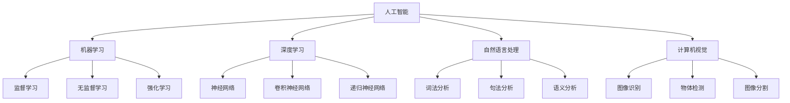

#### 1.2 体验层次构建概念

体验层次构建（Experience Hierarchy Building）是一个多层次的模型，用于描述用户与系统交互的不同层次，包括感知层、认知层、情感层和行为层。每个层次都有其特定的感知和处理方式，共同构建出完整的用户体验。

- **感知层**：感知层是用户体验的基础，它负责感知用户的行为和输入。感知方式包括视觉、听觉、触觉等。通过感知层，系统能够获取用户的基本信息。

- **认知层**：认知层负责对感知层获取的信息进行处理和分析。认知过程包括理解、记忆、推理等。通过认知层，系统能够对用户的行为进行深入理解，提供个性化的服务。

- **情感层**：情感层负责处理用户的情感反应。情感反应包括愉悦、不满、兴奋等。通过情感层，系统能够了解用户的情感状态，提供情感化的互动。

- **行为层**：行为层是用户体验的最高层次，它负责根据感知层、认知层和情感层的处理结果，采取相应的行动。行为层包括动作、反馈等。

**体验层次模型**：

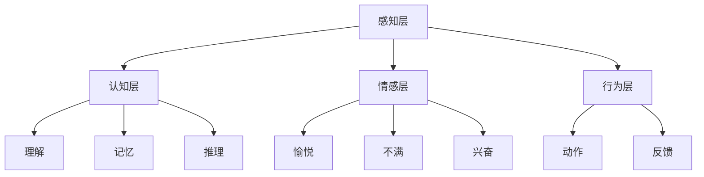

**多维感知的重要性**：多维感知可以使系统更全面地理解用户需求，提供个性化的服务。通过整合视觉、听觉、触觉等多种感知方式，系统能够提供更加丰富和细腻的用户体验。

**体验层次构建的核心目标**：核心目标是提高用户的整体满意度，通过优化各个层次的感知和处理，提升用户体验质量。具体目标包括：

- 提高用户交互的便捷性和效率。
- 增强用户的情感体验，提升用户满意度。
- 提供个性化的服务，满足不同用户的需求。

#### 1.3 AI与体验层次构建的联系

AI在体验层次构建中发挥了重要作用，通过提升感知维度、优化处理流程和增强交互能力，AI技术显著提升了用户体验。

**AI如何提升感知维度**：

- **多模态感知**：AI可以通过深度学习模型同时处理视觉、听觉、触觉等多种感知数据，实现多模态感知。例如，通过视觉和听觉数据的融合，系统可以更准确地理解用户的意图。

- **实时感知**：AI可以通过实时数据处理和分析，快速响应用户的行为和需求。例如，通过实时监测用户的情绪变化，系统可以提供即时的情感化反馈。

**AI在体验层次构建中的应用场景**：

- **智能家居**：AI可以感知用户的日常行为，提供个性化的家居环境设置，如温度控制、照明调节等。

- **智能客服**：AI可以通过自然语言处理技术理解用户的问题，提供智能化的客服服务。

- **智能医疗**：AI可以通过计算机视觉和自然语言处理技术，辅助医生进行诊断和治疗。

**AI技术如何影响用户体验**：

- **个性化推荐**：AI可以根据用户的历史行为和偏好，提供个性化的推荐服务，提升用户满意度。

- **智能互动**：AI可以通过情感化交互，如语音、表情等，与用户进行更加自然的交流，提升用户体验。

- **便捷性**：AI可以通过自动化和智能化的处理，简化用户的操作流程，提高交互效率。

### 总结

本章介绍了AI的基本概念和体验层次构建的概念，并探讨了AI与体验层次构建的联系。通过了解AI的基本概念和体验层次构建的原理，读者可以更好地理解AI在提升用户体验方面的作用。接下来，我们将进一步探讨感知架构的设计与实现，为构建高效的AI感知系统奠定基础。

### 1.1 AI概述

人工智能，作为计算机科学的重要分支，其研究领域广泛，涵盖了机器学习、深度学习、自然语言处理、计算机视觉等多个领域。在理解AI之前，我们需要首先了解AI的基本概念。

**AI基本概念**：

1. **机器学习**：机器学习是一种通过数据驱动的方式让计算机自动改进性能的方法。它包括监督学习、无监督学习和强化学习三种类型。
2. **深度学习**：深度学习是机器学习的一个分支，它使用多层神经网络来模拟人类大脑的决策过程，是当前AI领域最热门的技术之一。
3. **自然语言处理**：自然语言处理（NLP）是使计算机能够理解、生成和处理人类语言的技术，它包括语音识别、机器翻译、情感分析等任务。
4. **计算机视觉**：计算机视觉是使计算机能够从图像或视频中提取信息的技术，它包括图像识别、物体检测、图像分割等任务。

**AI的发展历程**：

AI的发展历程可以追溯到20世纪50年代。当时，科学家们首次提出了“人工智能”这一概念，并开始探索如何让计算机模拟人类智能。然而，由于技术和计算能力的限制，早期的AI研究并未取得显著进展。

1. **早期阶段（20世纪50年代至70年代）**：这一时期，AI的主要研究方向是符号主义和知识表示。符号主义AI试图通过构建逻辑推理系统和知识库来实现智能行为。知识表示则关注如何有效地组织和表示知识。

2. **低谷期（20世纪80年代至90年代）**：由于早期AI系统在解决实际问题时效果不佳，AI领域经历了所谓的“AI冬天”。这一时期，研究者开始转向专家系统和知识表示方法，试图通过在特定领域积累专业知识来提高AI系统的性能。

3. **复兴期（20世纪90年代至21世纪初）**：随着计算能力的提升和数据集的增加，机器学习和深度学习等新方法开始兴起。这些方法通过从大量数据中学习规律，使得AI系统能够在语音识别、图像识别等领域取得突破。

4. **当前阶段（21世纪初至今）**：AI技术取得了显著的进展，深度学习、强化学习等新方法不断推动AI领域的发展。AI技术在计算机视觉、自然语言处理、机器人等领域得到了广泛应用。

**AI的核心技术**：

1. **机器学习**：机器学习是AI的核心技术之一，它通过从数据中学习规律，使计算机能够实现智能行为。机器学习算法可以分为监督学习、无监督学习和强化学习三类。
   - **监督学习**：监督学习通过已标记的数据集训练模型，然后使用模型对新的数据进行预测。常见的监督学习算法包括线性回归、支持向量机、决策树等。
   - **无监督学习**：无监督学习不依赖于已标记的数据，通过从数据中自动发现规律和结构。常见的无监督学习算法包括聚类、降维等。
   - **强化学习**：强化学习通过奖励信号来指导学习过程，使模型能够在复杂环境中做出最优决策。常见的强化学习算法包括Q学习、深度Q网络（DQN）等。

2. **深度学习**：深度学习是机器学习的一个分支，它通过多层神经网络模拟人脑的决策过程。深度学习在图像识别、语音识别和自然语言处理等领域取得了巨大成功。常见的深度学习架构包括卷积神经网络（CNN）、递归神经网络（RNN）等。

3. **自然语言处理**：自然语言处理是使计算机能够理解、生成和处理人类语言的技术，它包括语音识别、机器翻译、情感分析等任务。自然语言处理的核心技术包括词嵌入、序列到序列模型、注意力机制等。

4. **计算机视觉**：计算机视觉是使计算机能够从图像或视频中提取信息的技术，它包括图像识别、物体检测、图像分割等任务。计算机视觉的核心技术包括卷积神经网络（CNN）、生成对抗网络（GAN）等。

通过理解AI的基本概念、发展历程和核心技术，我们可以更好地把握AI在体验层次构建中的应用。在接下来的章节中，我们将进一步探讨感知架构的设计与实现，为构建高效的AI感知系统奠定基础。

### 1.2 体验层次构建概念

体验层次构建是一个多层次、多维度模型，旨在通过感知、认知、情感和行为等不同层次的理解和处理，提升用户与系统的交互体验。理解这一概念，有助于我们更好地将AI技术应用于提升用户体验。

**体验层次模型**：

体验层次模型通常包括感知层、认知层、情感层和行为层。每一层都承担着不同的角色，共同构建出完整的用户体验。

1. **感知层**：
   感知层是体验层次模型的基础，负责捕捉和识别用户的感官输入。这些输入包括视觉、听觉、触觉、味觉和嗅觉等。例如，用户在触摸一个按钮时，感知层会捕捉到这一动作，并将其转化为系统可以理解的数据。

2. **认知层**：
   认知层负责处理感知层捕获的数据，对用户的行为进行理解和分析。这一层包含了推理、判断和决策等过程。例如，当用户触摸按钮后，认知层会分析这一行为背后的意图，并决定如何响应。

3. **情感层**：
   情感层关注用户的情感体验，对用户的情感状态进行感知和处理。情感体验包括愉悦、满意、困惑等。例如，当用户在使用一个应用程序时遇到困难，情感层会感知到用户的挫败感，并尝试提供帮助。

4. **行为层**：
   行为层是体验层次模型的输出层，负责根据感知层、认知层和情感层的处理结果，采取相应的行动。这些行动可以是自动的，如调整界面布局，也可以是交互性的，如发送通知。

**多维感知的重要性**：

多维感知是提升用户体验的关键。通过整合多种感知方式，系统可以更全面地理解和响应用户需求。以下是一些多维感知的重要应用场景：

1. **智能家居**：
   智能家居系统通过整合视觉、听觉、触觉等多维感知，可以实现对用户行为的全面监测。例如，当用户回到家时，智能家居系统可以通过视觉和听觉感知到用户的到来，并自动调整灯光和音乐。

2. **智能客服**：
   智能客服系统通过语音和文本等多维感知，可以更准确地理解用户的问题，并提供个性化的回答。例如，当用户通过文字聊天与客服交互时，系统可以通过语音感知来识别用户的语气和情感，从而提供更加贴心的服务。

3. **智能医疗**：
   智能医疗系统通过整合多种感知方式，可以实现对患者病情的全面监测和诊断。例如，医生可以通过观察患者的视觉图像和听诊结果，结合触觉感知，进行更准确的诊断。

**体验层次构建的核心目标**：

体验层次构建的核心目标是提升用户的整体满意度，通过优化各个层次的感知和处理，实现以下目标：

1. **提高用户交互的便捷性和效率**：
   通过感知和认知层的优化，简化用户操作流程，提高交互效率。例如，通过智能推荐系统，减少用户在寻找信息时的负担。

2. **增强用户的情感体验**：
   通过情感层的感知和处理，提升用户的情感满意度。例如，通过情感分析技术，智能客服可以识别用户的情感状态，并采取适当的策略来提升用户情感体验。

3. **提供个性化的服务**：
   通过整合感知和认知层的信息，提供个性化的服务和推荐。例如，电商平台可以根据用户的购买历史和浏览行为，提供个性化的商品推荐。

通过理解体验层次构建的概念和核心目标，我们可以更好地将AI技术应用于提升用户体验。在下一章中，我们将进一步探讨AI在体验层次构建中的应用，以及如何通过感知架构的设计和实现，实现多维感知和个性化服务。

### 1.3 AI与体验层次构建的联系

AI在体验层次构建中扮演着关键角色，它通过多维感知、深度学习和强化学习等技术，大幅提升了系统的感知能力、理解和响应能力。以下是AI如何与体验层次构建相结合，以及在各个层次中的应用：

**AI如何提升感知维度**：

1. **多模态感知**：AI通过深度学习模型，如卷积神经网络（CNN）和递归神经网络（RNN），能够同时处理多种感知数据，如视觉、听觉和触觉。这种多模态感知使得系统能够更全面地理解用户的输入和需求。

2. **实时感知**：利用实时数据处理和机器学习算法，AI能够快速分析用户的感知数据，并在短时间内做出响应。例如，智能家居系统可以通过实时监测室内温度和湿度，自动调整空调和加湿器的设置。

**AI在体验层次构建中的应用场景**：

1. **感知层**：在感知层，AI通过计算机视觉和自然语言处理技术，捕捉和识别用户的视觉和语言输入。例如，智能摄像头可以通过人脸识别技术，识别家庭成员，并在他们进入家门时自动调整灯光和温度。

2. **认知层**：在认知层，AI通过机器学习和深度学习算法，对用户的感知数据进行处理和分析，理解用户的行为意图。例如，智能助手可以通过自然语言处理技术，理解用户的语音指令，并执行相应的任务。

3. **情感层**：在情感层，AI通过情感分析技术，识别用户的情感状态，并根据情感状态调整交互方式。例如，智能客服系统可以通过分析用户的语气和语调，识别用户的情绪，并采取相应的策略，如提供安慰或解决问题的建议。

4. **行为层**：在行为层，AI根据感知层、认知层和情感层的处理结果，采取相应的行动。例如，智能冰箱可以根据用户的饮食偏好和历史记录，自动推荐食谱和食材，并自动下单购买。

**AI技术如何影响用户体验**：

1. **个性化推荐**：通过分析用户的历史行为和偏好，AI可以提供个性化的推荐和服务。例如，电商平台可以根据用户的购买记录，推荐可能感兴趣的商品。

2. **智能互动**：AI通过自然语言处理和语音识别技术，与用户进行智能互动。例如，智能音箱可以通过语音识别技术，理解用户的指令，并执行相应的操作。

3. **便捷性**：AI通过自动化和智能化的处理，简化用户的操作流程，提高交互效率。例如，智能家居系统可以通过自动化的感知和处理，减少用户的日常操作。

**实例分析**：

- **智能家居**：智能家居系统通过AI技术，实现对用户的全面感知。例如，智能门锁可以通过人脸识别技术，自动识别家庭成员，并自动开门。智能灯光系统可以通过传感器，实时监测室内的光线强度，并根据光线强度自动调整灯光。

- **智能医疗**：智能医疗系统通过AI技术，实现对患者的全面监测和诊断。例如，智能监控设备可以通过传感器，实时监测患者的生命体征，并将数据发送给医生。智能诊断系统可以通过深度学习算法，分析患者的医疗记录，提供更准确的诊断建议。

- **智能客服**：智能客服系统通过AI技术，提供个性化的服务。例如，智能客服机器人可以通过自然语言处理技术，理解用户的咨询问题，并提供针对性的回答。智能客服系统还可以通过情感分析技术，识别用户的情绪，并采取相应的策略，提升用户满意度。

通过以上分析，可以看出AI技术在体验层次构建中发挥了重要作用，它不仅提升了系统的感知能力和响应能力，还显著改善了用户体验。在下一章中，我们将进一步探讨感知架构的设计与实现，深入理解AI在构建多维感知系统中的具体应用。

### 1.3 AI与体验层次构建的联系

AI与体验层次构建之间的联系在于AI技术能够显著提升系统的感知能力和用户体验。以下将详细阐述AI如何通过多维感知、深度学习和强化学习等技术，提升用户体验。

#### 多维感知

多维感知是指同时处理多种感知数据，如视觉、听觉、触觉等。AI技术通过深度学习模型，如卷积神经网络（CNN）和递归神经网络（RNN），能够实现对多种感知数据的融合和处理。

- **视觉感知**：通过CNN，AI能够从图像中提取有用的特征，实现图像识别、物体检测和图像分割等任务。例如，智能摄像头可以通过人脸识别技术，识别家庭成员，并自动调整家居环境。
  
- **听觉感知**：通过RNN和长短期记忆网络（LSTM），AI能够从音频数据中提取有用的特征，实现语音识别、语音合成和情感识别等任务。例如，智能助手可以通过语音识别技术，理解用户的语音指令，并提供相应的服务。

- **触觉感知**：通过深度学习模型，AI能够从触觉数据中提取有用的特征，实现触觉识别和触觉交互等任务。例如，智能机器人可以通过触觉感知，识别物体的形状和材质，并进行相应的操作。

#### 深度学习

深度学习是AI技术的核心，它通过多层神经网络，模拟人脑的决策过程。深度学习在体验层次构建中，能够实现更加精准的用户理解和个性化服务。

- **特征提取**：深度学习模型，如CNN和自编码器（Autoencoder），能够自动从大量数据中提取有用的特征，这些特征能够用于后续的感知和处理。

- **分类与回归**：深度学习模型，如卷积神经网络（CNN）和循环神经网络（RNN），能够实现对数据的分类和回归，从而实现更精确的用户行为预测和响应。

- **序列数据处理**：RNN和LSTM等递归神经网络，能够处理序列数据，如时间序列数据和文本数据，从而实现对用户行为的连续理解和预测。

#### 强化学习

强化学习是一种通过奖励信号来引导学习过程的机器学习方法。在体验层次构建中，强化学习能够实现更加智能的决策和交互。

- **智能决策**：通过强化学习，AI系统能够在复杂环境中，通过试错和学习，找到最优的策略。例如，自动驾驶系统可以通过强化学习，学习如何在复杂的交通环境中做出最佳驾驶决策。

- **个性化服务**：通过强化学习，AI系统能够根据用户的反馈和奖励信号，不断调整自身的交互方式，提供更加个性化的服务。例如，智能客服系统可以通过强化学习，根据用户的满意度，调整对话策略，提高用户满意度。

#### 实例分析

以下是一个智能家居系统的实例，展示了AI如何与体验层次构建相结合：

- **感知层**：智能摄像头和麦克风作为感知层设备，捕捉家庭成员的视觉和听觉输入。智能摄像头通过CNN进行人脸识别，智能麦克风通过RNN进行语音识别。

- **认知层**：智能中枢通过深度学习模型，对感知数据进行处理，理解家庭成员的意图。例如，当家庭成员说出“我累了”，智能中枢通过自然语言处理模型，理解其意图，并自动调整灯光和音乐，创造一个舒适的休息环境。

- **情感层**：智能中枢通过情感分析技术，感知家庭成员的情绪。例如，当家庭成员的面部表情显示出不悦时，智能中枢通过情感分析模型，识别其情绪，并尝试通过调整环境来改善情绪。

- **行为层**：智能中枢根据感知层、认知层和情感层的处理结果，采取相应的行动。例如，当智能中枢识别到家庭成员需要休息时，它会自动调整灯光和音乐，关闭其他电子设备，提供一个安静舒适的休息环境。

通过以上实例，可以看出AI技术在体验层次构建中的应用，不仅提升了系统的感知能力和智能化水平，还显著改善了用户体验。在下一章中，我们将进一步探讨感知架构的设计与实现，深入理解AI在构建多维感知系统中的具体应用。

### 2.1 感知架构设计原则

感知架构的设计原则是构建高效、灵活和可扩展的多维感知系统的基础。一个良好的感知架构应该具备以下几个特点：

#### 感知架构的层次结构

感知架构通常包括以下几个层次：

- **感知层**：负责接收和处理各种感知数据，如视觉、听觉、触觉等。
- **数据处理层**：负责对感知层获取的数据进行预处理、特征提取和融合。
- **决策层**：负责根据数据处理层提供的信息，做出相应的决策或响应。
- **反馈层**：负责将决策层的决策结果反馈给用户或系统，以实现闭环控制。

**图2：感知架构层次结构图**

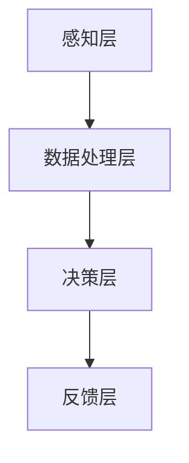

#### 设计原则与最佳实践

**模块化设计**：模块化设计是将系统划分为多个功能模块，每个模块具有独立的功能和接口。这种设计方法有助于提高系统的可维护性和可扩展性。例如，可以将感知层划分为图像处理模块、音频处理模块等。

**可扩展性**：可扩展性是指系统能够根据需求的变化，灵活地增加或替换模块。这可以通过采用微服务架构、容器化技术等实现。

**高可用性**：高可用性是指系统在面临故障或异常情况时，能够快速恢复并保持正常运行。这可以通过冗余设计、故障转移和容错机制等实现。

**标准化协议**：标准化协议有助于不同模块之间的数据交换和互操作性。常用的标准化协议包括HTTP、REST、WebSocket等。

**安全性**：安全性是指系统在处理数据时，能够防止数据泄露、篡改和未授权访问。这可以通过加密、认证和授权等机制实现。

#### 感知架构的灵活性

灵活性是感知架构设计中的一个关键因素。一个灵活的感知架构能够快速适应新的感知需求和技术变化。

**动态配置**：通过动态配置，系统能够根据实际需求，自动调整感知模块的配置和参数。例如，在处理大量图像数据时，系统可以自动增加图像处理模块的线程数，以加快数据处理速度。

**模块间协作**：通过模块间协作，不同模块可以共享数据和资源，实现协同工作。例如，图像处理模块和音频处理模块可以共享同一张图像数据，以便进行多模态数据处理。

**自适应调整**：通过自适应调整，系统能够根据环境变化和用户需求，动态调整感知策略和处理方法。例如，在夜间模式，系统可以降低视觉感知的灵敏度，以减少误触发。

### 感知架构实现方法

感知架构的实现方法主要包括感知模块的设计与实现、数据采集与处理、感知模型的训练与优化。

#### 感知模块的设计与实现

感知模块是感知架构的核心，它负责接收和处理各种感知数据。一个典型的感知模块包括以下几个部分：

- **传感器接口**：负责接收传感器数据，如摄像头、麦克风、温度传感器等。
- **数据预处理**：负责对原始感知数据进行预处理，如去噪、归一化、特征提取等。
- **特征表示**：负责将预处理后的数据转换为适合模型处理的特征表示，如向量、矩阵等。
- **模型接口**：负责与感知模型进行交互，包括模型加载、参数更新等。

#### 数据采集与处理

数据采集是感知架构的基础，其质量直接影响感知效果。数据采集包括以下步骤：

- **数据收集**：通过传感器或其他设备收集原始数据。
- **数据预处理**：对收集到的数据进行预处理，包括去噪、去冗余、数据增强等。
- **数据存储**：将预处理后的数据存储到数据库或文件系统中，以便后续处理和分析。

#### 感知模型的训练与优化

感知模型是感知架构的核心，其性能直接影响感知效果。感知模型的训练与优化包括以下步骤：

- **模型设计**：根据感知任务的需求，设计合适的感知模型结构。
- **数据准备**：准备用于训练和测试的数据集，并对数据进行预处理。
- **模型训练**：使用训练数据集对感知模型进行训练，通过迭代优化模型参数。
- **模型评估**：使用测试数据集对训练好的模型进行评估，以确定模型的性能。
- **模型优化**：根据评估结果，对模型进行调整和优化，以提高感知效果。

通过以上方法，我们可以构建出一个高效、灵活和可扩展的感知架构，为AI在体验层次构建中的应用提供坚实的基础。在下一章中，我们将进一步探讨多维感知架构的具体实现方法，以及不同维度感知方法的优缺点。

### 2.2 多维感知架构

多维感知架构是指通过同时处理多种感知数据，构建出一个完整的感知场景。这种架构能够提升系统的感知能力和用户体验，使其能够更全面、准确地理解和响应用户的需求。以下是多维感知架构的定义、不同维度的感知方法和多维感知的优势与挑战。

#### 多维感知的定义

多维感知是指同时处理多种类型的感知数据，如视觉、听觉、触觉、嗅觉等。这些感知数据可以通过不同的传感器进行捕捉，然后通过统一的框架进行处理和分析。多维感知架构的核心目标是实现多源数据的融合，从而提升系统的整体感知能力和智能水平。

**图3：多维感知架构示意图**

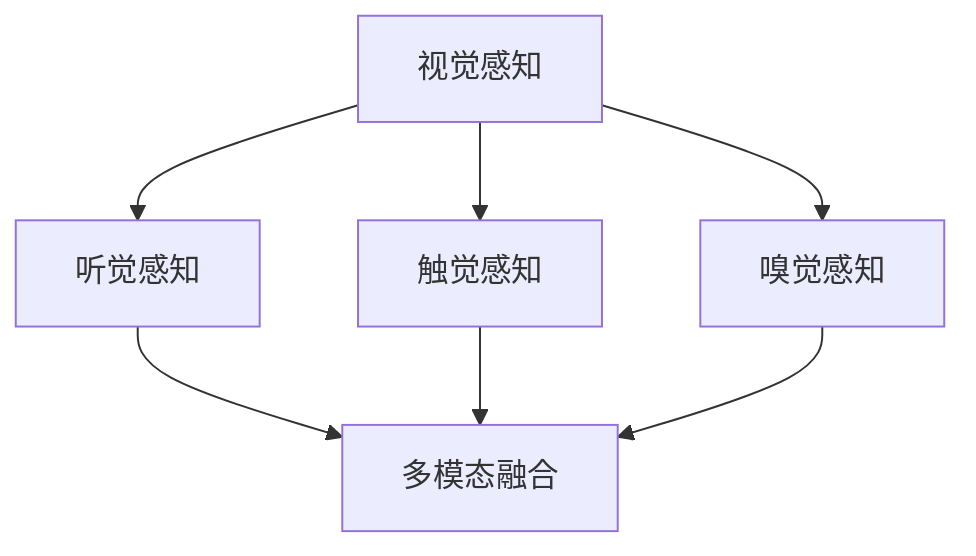

#### 不同维度的感知方法

1. **视觉感知**：
   视觉感知是通过摄像头等视觉设备捕捉和处理图像数据。这种方法在计算机视觉领域有着广泛的应用，如图像识别、物体检测和图像分割等。视觉感知的优点是信息量丰富、直观，缺点是对光照和环境依赖较大。

2. **听觉感知**：
   听觉感知是通过麦克风等听觉设备捕捉和处理音频数据。这种方法在语音识别、语音合成和情感分析等领域有重要应用。听觉感知的优点是实时性强、互动性高，缺点是容易受到噪声干扰。

3. **触觉感知**：
   触觉感知是通过触觉传感器捕捉和处理触觉数据。这种方法在机器人、虚拟现实和智能玩具等领域有广泛应用。触觉感知的优点是交互性强、反馈及时，缺点是传感器的精度和可靠性需要进一步提高。

4. **嗅觉感知**：
   嗅觉感知是通过嗅觉传感器捕捉和处理气味数据。这种方法在环境监测、食品安全和医疗诊断等领域有潜力。嗅觉感知的优点是能够捕捉微小的气味变化，缺点是传感器种类有限、数据处理复杂。

#### 多维感知的优势

- **提高感知精度**：通过融合多种感知数据，系统可以更全面地捕捉信息，从而提高感知精度和准确性。
- **增强智能交互**：多维感知使得系统能够更自然地与用户进行交互，提供更加智能化和个性化的服务。
- **丰富用户体验**：多维感知可以为用户提供更加丰富和细腻的体验，如通过视觉和听觉的融合，创造更加沉浸式的娱乐体验。

#### 多维感知的挑战

- **数据融合复杂**：多维感知数据通常具有不同的特征和属性，如何有效地融合这些数据是一个技术挑战。
- **计算资源消耗**：多维感知需要处理大量的感知数据，对计算资源和存储资源有较高要求，特别是在实时应用场景中。
- **传感器选择与布置**：不同的感知任务需要不同的传感器，如何选择合适的传感器并合理布置是一个实际问题。
- **隐私与安全**：多维感知涉及大量的个人数据，如何确保数据隐私和安全是一个重要问题。

通过理解多维感知架构的定义、不同维度的感知方法和多维感知的优势与挑战，我们可以更好地设计出高效的感知系统，提升用户体验。在下一章中，我们将进一步探讨多维感知架构的实现方法，以及在实际应用中的具体实现步骤和策略。

### 2.3 感知架构实现方法

感知架构的实现方法包括感知模块的设计与实现、数据采集与处理、感知模型的训练与优化。以下是这些步骤的详细描述。

#### 感知模块的设计与实现

感知模块是感知架构的核心，它负责接收和处理各种感知数据。一个典型的感知模块包括以下几个部分：

1. **传感器接口**：传感器接口是感知模块与物理世界交互的桥梁。不同的传感器（如摄像头、麦克风、温度传感器等）会生成不同类型的数据。传感器接口负责接收这些数据，并将其转换为数字信号。

2. **数据预处理**：原始感知数据通常包含噪声、缺失值和冗余信息。数据预处理步骤包括去噪、归一化、特征提取等，目的是提高数据质量，为后续处理打下基础。

3. **特征表示**：特征表示是将原始感知数据转换为适合模型处理的格式。常见的特征表示方法包括向量表示、矩阵表示等。特征表示需要考虑数据的维度、分布和相关性。

4. **模型接口**：模型接口是感知模块与感知模型之间的桥梁。它负责加载感知模型、传递数据、更新模型参数等。常见的模型接口包括TensorFlow、PyTorch等深度学习框架。

**图4：感知模块设计示意图**

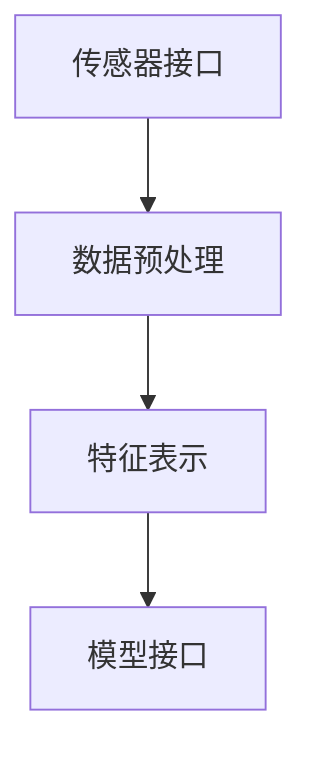

#### 数据采集与处理

数据采集是感知架构的基础，其质量直接影响感知效果。数据采集包括以下步骤：

1. **数据收集**：通过传感器或其他设备收集原始数据。数据收集可以是有目的的（如特定任务的实验数据）或无目的的（如日常环境监测数据）。

2. **数据预处理**：对收集到的数据进行预处理，包括去噪、去冗余、数据增强等。预处理步骤的目的是提高数据质量，为后续处理和分析提供可靠的数据基础。

3. **数据存储**：将预处理后的数据存储到数据库或文件系统中，以便后续处理和分析。数据存储需要考虑数据的访问速度、存储容量和数据安全等问题。

#### 感知模型的训练与优化

感知模型是感知架构的核心，其性能直接影响感知效果。感知模型的训练与优化包括以下步骤：

1. **模型设计**：根据感知任务的需求，设计合适的感知模型结构。模型设计包括选择合适的网络架构、激活函数、损失函数等。

2. **数据准备**：准备用于训练和测试的数据集，并对数据进行预处理。数据准备包括数据清洗、数据分割、数据增强等步骤。

3. **模型训练**：使用训练数据集对感知模型进行训练，通过迭代优化模型参数。模型训练通常包括前向传播、反向传播和权重更新等步骤。

4. **模型评估**：使用测试数据集对训练好的模型进行评估，以确定模型的性能。常见的评估指标包括准确率、召回率、F1值等。

5. **模型优化**：根据评估结果，对模型进行调整和优化，以提高感知效果。模型优化可以通过调整超参数、增加训练数据、改进网络结构等方法实现。

通过以上方法，我们可以构建出一个高效、灵活和可扩展的感知架构，为AI在体验层次构建中的应用提供坚实的基础。在下一章中，我们将进一步探讨感知算法的原理和实现方法。

### 3.1 感知算法原理

感知算法是AI感知架构的核心，负责从感知数据中提取有用的信息，并对这些信息进行分类、预测或决策。感知算法的原理、分类、目标及其评估指标如下：

#### 感知算法原理

感知算法的基本原理是通过特征提取和模式识别，将感知数据转化为有用的信息。以下是感知算法的几个关键步骤：

1. **特征提取**：特征提取是指从原始感知数据中提取出对目标分类或回归有显著影响的特征。特征提取是感知算法的基础，其质量直接影响到感知效果。常见的特征提取方法包括：
   - **统计特征**：如均值、方差、标准差等。
   - **结构特征**：如边缘、轮廓、纹理等。
   - **变换特征**：如主成分分析（PCA）、线性判别分析（LDA）等。

2. **模式识别**：模式识别是指根据提取的特征，对感知数据中的模式进行分类或回归。模式识别方法包括：
   - **分类方法**：如逻辑回归、支持向量机（SVM）、决策树、随机森林等。
   - **回归方法**：如线性回归、岭回归、LASSO回归等。
   - **聚类方法**：如K-均值、层次聚类等。

**图5：感知算法基本原理图**

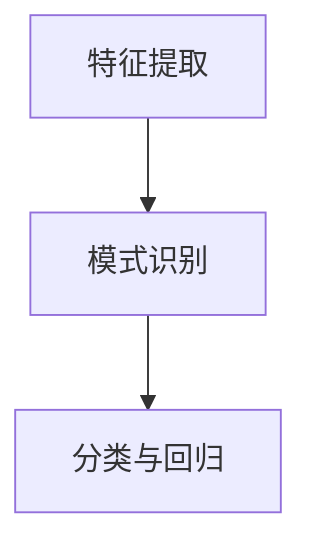

#### 感知算法的分类

感知算法可以根据不同的分类标准进行分类，以下是几种常见的分类方法：

1. **按任务类型分类**：
   - **分类算法**：用于将数据分类到预定义的类别中。常见的分类算法包括逻辑回归、支持向量机（SVM）、决策树、随机森林等。
   - **回归算法**：用于预测连续值输出。常见的回归算法包括线性回归、岭回归、LASSO回归等。
   - **聚类算法**：用于将数据分成不同的簇。常见的聚类算法包括K-均值、层次聚类等。

2. **按学习类型分类**：
   - **监督学习**：在监督学习算法中，训练数据集包含标签，算法通过这些标签来学习预测模型。
   - **无监督学习**：在无监督学习算法中，训练数据集不包含标签，算法通过数据自身的结构来学习。
   - **强化学习**：在强化学习算法中，算法通过与环境交互来学习最优策略。

3. **按算法复杂度分类**：
   - **简单算法**：如逻辑回归、线性回归等，计算复杂度较低。
   - **复杂算法**：如深度学习、集成学习等，计算复杂度较高。

#### 感知算法的目标

感知算法的主要目标是通过分析感知数据，实现以下任务：

1. **分类**：将数据分类到预定义的类别中，如电子邮件分类、图像分类等。
2. **回归**：预测连续值输出，如房价预测、股票价格预测等。
3. **聚类**：将数据分成不同的簇，如顾客细分、图像分割等。
4. **特征选择**：从大量特征中选出对目标任务有显著影响的特征，提高模型性能。

#### 感知算法的评估指标

评估感知算法的性能需要使用一系列指标，这些指标包括：

1. **准确率**：准确率是指正确分类的样本数占总样本数的比例，是最常用的评估指标之一。
2. **召回率**：召回率是指正确分类的样本数占所有实际正类样本数的比例，关注的是漏报率。
3. **精确率**：精确率是指正确分类的样本数占所有预测为正类的样本数的比例，关注的是误报率。
4. **F1值**：F1值是精确率和召回率的调和平均值，用于综合考虑精确率和召回率。
5. **ROC曲线**：ROC曲线用于评估分类器的性能，曲线下的面积（AUC）越大，表示分类器性能越好。
6. **均方误差（MSE）**：均方误差用于评估回归模型的预测误差，误差越小，表示模型预测越准确。

通过以上对感知算法原理、分类、目标及其评估指标的分析，我们可以更好地理解感知算法的工作机制和评价标准，为构建高效的感知系统提供理论支持。在下一章中，我们将深入探讨特征提取算法，了解其在感知过程中的重要性。

### 3.2 特征提取算法

特征提取算法是感知算法中至关重要的一环，它负责从原始感知数据中提取出对目标任务有显著影响的关键特征。特征提取的质量直接影响到后续分类、回归等任务的性能。以下将详细介绍特征提取的定义、常见的特征提取算法，以及每种算法的优缺点。

#### 特征提取的定义

特征提取（Feature Extraction）是指从原始数据中提取出具有区分性和代表性的特征，用于训练和评估机器学习模型。特征提取的目标是降低数据的维度，同时保留数据的关键信息，从而提高模型的学习效率和预测性能。

特征提取的基本步骤包括：

1. **数据预处理**：对原始数据进行预处理，如去噪、归一化、缺失值填充等。
2. **特征选择**：从原始数据中选取对目标任务有显著影响的特征。
3. **特征转换**：将原始特征转换为更适合模型处理的特征表示，如将连续特征转换为离散特征，或提取统计特征、结构特征等。

#### 常见的特征提取算法

1. **主成分分析（PCA）**

   主成分分析是一种常用的特征提取方法，它通过将原始数据投影到主成分空间，从而提取出最重要的特征。PCA的基本步骤包括：

   - **数据标准化**：对原始数据进行标准化处理，使其具有零均值和单位方差。
   - **计算协方差矩阵**：计算每个特征与其他特征之间的协方差矩阵。
   - **计算特征值和特征向量**：计算协方差矩阵的特征值和特征向量，并按照特征值从大到小排序。
   - **构建主成分空间**：选择前k个最大的特征值对应的特征向量，构建k维主成分空间。

   **优点**：PCA能够显著降低数据的维度，同时保留大部分信息，有助于提高模型的学习效率和预测性能。

   **缺点**：PCA对于噪声敏感，且无法处理非线性数据。

2. **线性判别分析（LDA）**

   线性判别分析是一种特征提取方法，它通过最大化类间散度、最小化类内散度，提取出能够有效区分不同类别的特征。LDA的基本步骤包括：

   - **计算类内散度和类间散度**：计算每个类别的类内散度和类间散度。
   - **构建判别函数**：使用类间散度和类内散度构建线性判别函数。
   - **选择最佳特征**：选择能够最大化判别函数的特征。

   **优点**：LDA能够有效提取出区分不同类别的特征，提高分类模型的性能。

   **缺点**：LDA仅适用于线性可分的数据，对于非线性数据效果不佳。

3. **自动编码器（Autoencoder）**

   自动编码器是一种基于深度学习的特征提取方法，它通过训练一个压缩编码器和解压缩编码器，自动学习数据的低维表示。自动编码器的基本步骤包括：

   - **编码阶段**：输入数据通过压缩编码器压缩到低维空间。
   - **解码阶段**：压缩后的数据通过解压缩编码器还原到原始空间。

   **优点**：自动编码器能够学习数据的内在结构，提取出有代表性的特征，同时具有较强的泛化能力。

   **缺点**：自动编码器训练过程复杂，计算资源消耗大。

4. **深度特征提取网络（Deep Feature Extraction Network）**

   深度特征提取网络是一种基于深度学习的特征提取方法，它通过多层神经网络自动学习数据的复杂特征。深度特征提取网络的基本步骤包括：

   - **多层网络结构**：构建多层神经网络，包括卷积层、池化层、全连接层等。
   - **训练与优化**：使用大量数据训练网络，通过反向传播算法优化网络参数。

   **优点**：深度特征提取网络能够提取出数据的高层次特征，具有强大的泛化能力。

   **缺点**：训练过程复杂，对计算资源要求较高。

#### 各特征提取算法的优缺点对比

- **PCA**：适用于线性可分数据，能够显著降低数据维度，但无法处理非线性数据。

- **LDA**：适用于分类任务，能够提取出区分不同类别的特征，但仅适用于线性数据。

- **自动编码器**：能够自动学习数据的低维表示，具有较强的泛化能力，但训练过程复杂。

- **深度特征提取网络**：能够提取出数据的高层次特征，具有强大的泛化能力，但训练过程复杂，对计算资源要求较高。

通过了解不同特征提取算法的定义、基本步骤和优缺点，我们可以根据具体应用场景选择合适的特征提取方法，构建高效的感知系统。在下一章中，我们将进一步探讨分类与回归算法，了解它们在感知架构中的应用和实现方法。

### 3.3 分类与回归算法

分类与回归算法是感知算法中的核心部分，负责根据输入特征对数据进行分类或回归预测。它们在AI感知架构中的应用广泛，涵盖了从简单线性模型到复杂深度学习模型的多种方法。以下将详细介绍分类与回归算法的基本概念、应用场景以及优缺点。

#### 分类算法

分类算法用于将数据分为预定义的类别。常见的分类算法包括逻辑回归、支持向量机（SVM）、决策树、随机森林等。以下是几种主要分类算法的概述：

1. **逻辑回归（Logistic Regression）**

   逻辑回归是一种简单的分类算法，它通过线性模型预测概率，并将概率阈值设置为0.5进行类别划分。逻辑回归的优点包括：

   - **计算简单，易于实现**。
   - **对数据缺失和噪声不敏感**。

   缺点包括：

   - **线性关系假设，对复杂数据效果较差**。
   - **无法处理多类别问题**。

2. **支持向量机（Support Vector Machine，SVM）**

   支持向量机是一种基于间隔最大化的分类算法，它通过寻找最佳超平面，将不同类别的数据分隔开。SVM的优点包括：

   - **强大的分类能力，适用于高维空间**。
   - **可以处理非线性分类问题（通过核函数）**。

   缺点包括：

   - **计算复杂度高，尤其是大型数据集**。
   - **对参数敏感，需要调优**。

3. **决策树（Decision Tree）**

   决策树是一种基于树形结构的分类算法，它通过一系列的判断条件将数据划分为不同的类别。决策树的优点包括：

   - **易于理解和解释**。
   - **可以处理多类别问题**。

   缺点包括：

   - **容易过拟合，尤其是深度较深的树**。
   - **可扩展性较差，处理大量特征时性能下降**。

4. **随机森林（Random Forest）**

   随机森林是一种基于决策树的集成学习算法，它通过构建多棵决策树，并使用投票机制进行类别预测。随机森林的优点包括：

   - **强大的分类能力，对噪声和缺失值有较强的鲁棒性**。
   - **可以处理高维数据**。

   缺点包括：

   - **计算复杂度较高，训练时间较长**。
   - **对模型解释性较差**。

#### 回归算法

回归算法用于预测连续值输出。常见的回归算法包括线性回归、岭回归、LASSO回归等。以下是几种主要回归算法的概述：

1. **线性回归（Linear Regression）**

   线性回归是一种基于线性模型的回归算法，它通过建立自变量与因变量之间的线性关系进行预测。线性回归的优点包括：

   - **计算简单，易于实现**。
   - **解释性强，可以清晰地表达变量之间的关系**。

   缺点包括：

   - **对噪声和异常值敏感**。
   - **线性关系假设，对复杂数据效果较差**。

2. **岭回归（Ridge Regression）**

   岭回归是一种基于线性模型的回归算法，它通过在损失函数中加入L2正则项，防止模型过拟合。岭回归的优点包括：

   - **可以处理多特征问题，防止特征间共线性**。
   - **可以改善线性回归的预测性能**。

   缺点包括：

   - **需要选择正则化参数，对参数敏感**。
   - **计算复杂度较高，尤其是大型数据集**。

3. **LASSO回归（LASSO Regression）**

   LASSO回归是一种基于线性模型的回归算法，它通过在损失函数中加入L1正则项，实现特征选择和模型简化。LASSO回归的优点包括：

   - **可以进行特征选择，减少冗余特征**。
   - **计算复杂度相对较低，易于实现**。

   缺点包括：

   - **对噪声和异常值敏感**。
   - **需要选择正则化参数，对参数敏感**。

#### 应用场景

- **逻辑回归**：适用于简单二分类问题，如邮件分类、文本分类等。
- **支持向量机**：适用于高维空间和非线性分类问题，如图像分类、人脸识别等。
- **决策树**：适用于分类和回归问题，如医疗诊断、信用评分等。
- **随机森林**：适用于复杂分类和回归问题，如客户流失预测、风险控制等。
- **线性回归**：适用于简单线性回归问题，如房屋价格预测、股票价格预测等。
- **岭回归**：适用于多特征线性回归问题，如回归分析、金融建模等。
- **LASSO回归**：适用于特征选择和线性回归问题，如信用评分、市场预测等。

#### 优缺点

- **逻辑回归**：简单、易解释，但无法处理非线性问题。
- **支持向量机**：强分类能力，但对参数敏感，计算复杂度高。
- **决策树**：易于理解，但容易过拟合，可扩展性较差。
- **随机森林**：强分类能力，鲁棒性高，但计算复杂度较高。
- **线性回归**：简单、易解释，但对噪声敏感。
- **岭回归**：防止过拟合，但需要选择正则化参数。
- **LASSO回归**：进行特征选择，但同样需要选择正则化参数。

通过理解分类与回归算法的基本概念、应用场景和优缺点，我们可以根据具体需求选择合适的算法，构建高效的感知系统。在下一章中，我们将进一步探讨深度学习在感知架构中的应用，了解其如何通过神经网络模型实现更复杂的感知任务。

### 4.1 深度学习基础

深度学习（Deep Learning）是机器学习的一个分支，它通过多层神经网络模拟人脑的决策过程，能够自动从大量数据中学习复杂模式。理解深度学习的基础知识，对于构建高效的感知架构至关重要。以下将详细介绍神经网络基础、深度学习架构和深度学习优化方法。

#### 神经网络基础

神经网络（Neural Network，NN）是一种由大量简单单元（神经元）互联而成的复杂网络，这些神经元通过加权连接进行信息传递和计算。神经网络的基本组成部分包括：

- **神经元**：是神经网络的基本单元，负责接收输入信号、计算加权求和、应用激活函数产生输出。
- **权重**：是神经元之间的连接强度，通过学习调整权重，神经网络能够提高对数据的拟合能力。
- **激活函数**：用于对神经元的输出进行非线性变换，常见的激活函数包括Sigmoid、ReLU和Tanh。

神经网络的计算过程通常包括以下几个步骤：

1. **前向传播**：输入数据通过网络的每个层，在每个神经元上进行加权求和，并应用激活函数，最终得到输出。
2. **反向传播**：通过计算输出与实际值之间的误差，反向传播误差到网络的每个层，更新权重和偏置，以减小误差。

**图6：神经网络前向传播和反向传播示意图**

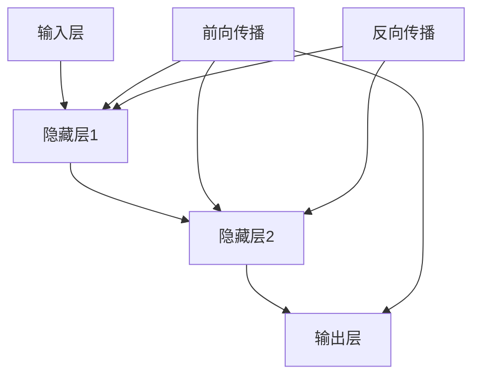

#### 深度学习架构

深度学习架构通过增加网络层数，提升模型的表达能力。常见的深度学习架构包括卷积神经网络（CNN）、循环神经网络（RNN）和生成对抗网络（GAN）等。

1. **卷积神经网络（CNN）**

   卷积神经网络是一种专门用于图像和视频处理的深度学习模型，它通过卷积层、池化层和全连接层等结构对图像数据进行处理。CNN的核心思想是局部连接和共享权重，从而提高模型的效率和泛化能力。

   **图7：CNN结构示意图**

   ```mermaid
   graph TD
       A[输入层] --> B[卷积层1]
       B --> C[池化层1]
       C --> D[卷积层2]
       D --> E[池化层2]
       E --> F[全连接层]
       F --> G[输出层]
   ```

2. **循环神经网络（RNN）**

   循环神经网络是一种用于处理序列数据的深度学习模型，它通过递归结构对序列数据进行处理。RNN的核心思想是记忆状态，从而捕捉序列中的长期依赖关系。常见的RNN变体包括长短时记忆网络（LSTM）和门控循环单元（GRU）。

   **图8：RNN结构示意图**

   ```mermaid
   graph TD
       A[输入序列] --> B[隐藏状态]
       B --> C[隐藏状态]
       C --> D[输出序列]
   ```

3. **生成对抗网络（GAN）**

   生成对抗网络是一种由生成器和判别器组成的新型深度学习模型，它通过对抗训练生成逼真的数据。GAN的核心思想是生成器生成数据，判别器判断生成数据的真实性，两者通过对抗训练不断优化。

   **图9：GAN结构示意图**

   ```mermaid
   graph TD
       A[生成器] --> B[生成数据]
       B --> C[判别器]
       C --> D[真实数据]
   ```

#### 深度学习优化方法

深度学习优化方法是指通过调整模型参数和训练策略，提高模型性能和训练效率。常见的深度学习优化方法包括：

1. **梯度下降（Gradient Descent）**

   梯度下降是一种常用的优化方法，它通过计算损失函数对参数的梯度，逐步调整参数以最小化损失函数。梯度下降的基本形式包括批量梯度下降、随机梯度下降和小批量梯度下降。

2. **动量（Momentum）**

   动量是一种改进的梯度下降方法，它通过引入动量项，减少参数调整过程中的振荡，提高收敛速度。动量可以通过以下公式计算：

   \[ v_{t+1} = \gamma v_{t} + (1 - \gamma) \frac{\partial J}{\partial \theta} \]

   \[ \theta_{t+1} = \theta_{t} - v_{t+1} \]

   其中，\( v_{t} \) 是动量项，\( \gamma \) 是动量系数，\( \theta \) 是参数，\( J \) 是损失函数。

3. **Adam优化器**

   Adam优化器是一种结合了动量和自适应学习率的优化方法，它通过分别跟踪一阶矩估计和二阶矩估计，自适应调整学习率。Adam优化器的公式如下：

   \[ m_{t} = \beta_{1} m_{t-1} + (1 - \beta_{1}) \frac{\partial J}{\partial \theta} \]

   \[ v_{t} = \beta_{2} v_{t-1} + (1 - \beta_{2}) \left( \frac{\partial J}{\partial \theta} \right)^{2} \]

   \[ \theta_{t} = \theta_{t-1} - \alpha \frac{m_{t}}{1 - \beta_{1}^{t}} \]

   其中，\( m_{t} \) 是一阶矩估计，\( v_{t} \) 是二阶矩估计，\( \alpha \) 是学习率，\( \beta_{1} \) 和 \( \beta_{2} \) 是动量系数。

通过了解神经网络基础、深度学习架构和深度学习优化方法，我们可以更好地构建和优化深度学习模型，为感知架构提供强大的计算能力。在下一章中，我们将探讨卷积神经网络（CNN）在感知架构中的应用，了解其在图像识别和物体检测等任务中的具体实现方法。

### 4.2 卷积神经网络（CNN）在感知架构中的应用

卷积神经网络（Convolutional Neural Network，CNN）是深度学习领域的一种重要模型，特别适合处理图像和视频数据。CNN通过其独特的结构，如卷积层、池化层和全连接层，能够有效地提取图像特征，从而实现图像识别、物体检测和图像分割等任务。以下将详细介绍CNN的基本原理、在图像识别中的应用，以及其他应用领域。

#### CNN的基本原理

卷积神经网络的核心是卷积层，它通过局部连接和共享权重的机制，减少了参数数量，提高了模型效率。以下是CNN的基本原理：

1. **卷积层**：卷积层是CNN的核心部分，它通过卷积操作从输入图像中提取特征。卷积操作是将卷积核（也称为滤波器）与图像进行点积操作，从而生成新的特征图。卷积核的权重在训练过程中通过反向传播算法进行调整，以最小化损失函数。

2. **池化层**：池化层（Pooling Layer）用于减少特征图的空间维度，同时保持重要的特征信息。常见的池化方法包括最大池化（Max Pooling）和平均池化（Average Pooling）。最大池化选择特征图上每个区域的最大值作为输出，而平均池化则计算每个区域内像素值的平均值。

3. **全连接层**：全连接层（Fully Connected Layer）将前一层的所有特征图连接起来，形成一个一维的特征向量。然后，通过一个或多个全连接层进行分类或回归任务。

**图10：CNN结构示意图**

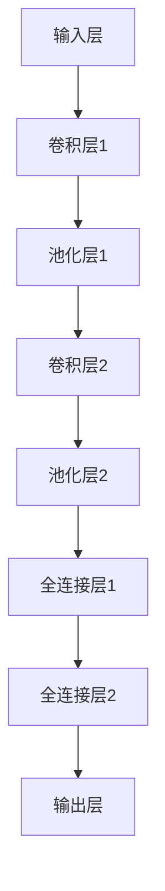

#### CNN在图像识别中的应用

图像识别是CNN最早且最成功的应用之一。通过训练CNN模型，可以从大量图像数据中学习特征，并将其用于分类任务。以下是CNN在图像识别中的应用：

1. **AlexNet**：AlexNet是2012年ImageNet竞赛中获胜的模型，它是第一个在深度学习中使用ReLU激活函数和Dropout正则化的模型。AlexNet由5个卷积层、3个池化层和2个全连接层组成，实现了15%的错误率，是深度学习在图像识别领域的一个里程碑。

2. **VGGNet**：VGGNet是AlexNet的改进版，它通过增加网络的深度和宽度，进一步提高了图像识别的性能。VGGNet使用多个卷积层和池化层堆叠，形成较深的网络结构，其特点是参数数量庞大，但性能非常优秀。

3. **ResNet**：ResNet引入了残差连接（Residual Connection），解决了深度神经网络训练过程中的梯度消失问题。ResNet通过跳过若干卷积层，将输入直接传递到下一层，使得梯度可以反向传播到更深的网络层，从而提高了网络的训练效率和性能。

**图11：ResNet结构示意图**

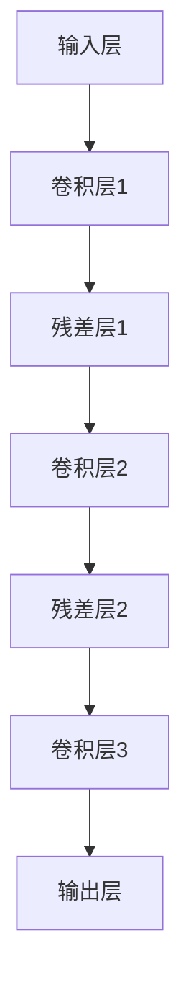

#### CNN的其他应用领域

除了图像识别，CNN还在其他领域展示了强大的应用潜力：

1. **物体检测**：物体检测是计算机视觉中的一项重要任务，它旨在识别图像中的多个对象并确定它们的位置。YOLO（You Only Look Once）是一种流行的物体检测算法，它通过将检测任务分解为单个卷积层，提高了检测速度和性能。

2. **图像分割**：图像分割是将图像划分为多个区域或对象的任务。CNN通过卷积层和全连接层提取图像特征，然后使用分类器或回归器对每个像素进行分类，从而实现图像分割。常见的图像分割算法包括FCN（Fully Convolutional Network）和U-Net。

3. **视频处理**：CNN可以应用于视频处理，如视频分类、动作识别和视频生成。通过处理连续帧，CNN可以捕捉视频中的动态特征，从而实现更高级的视频分析任务。

通过理解CNN的基本原理和在图像识别、物体检测和其他应用领域中的应用，我们可以更好地利用CNN构建高效的感知架构，提升系统的感知能力和用户体验。在下一章中，我们将探讨递归神经网络（RNN）在感知架构中的应用，了解其在处理序列数据方面的优势。

### 4.3 递归神经网络（RNN）在感知架构中的应用

递归神经网络（Recurrent Neural Network，RNN）是一种专门用于处理序列数据的神经网络，它在自然语言处理、语音识别和时间序列分析等领域有广泛的应用。RNN通过其递归结构，能够捕捉序列中的长期依赖关系，这使得它在处理时间相关数据时表现出色。以下将详细介绍RNN的基本原理、在序列数据处理中的应用，以及其变体。

#### RNN的基本原理

RNN的基本原理是通过递归连接，使网络的每个时间步都能够访问先前的状态，从而实现序列数据的建模。RNN的核心组成部分包括：

1. **隐藏状态（Hidden State）**：隐藏状态是RNN在当前时间步的输出，同时也是下一个时间步的输入。通过隐藏状态，RNN能够在不同的时间步之间传递信息。

2. **权重矩阵**：RNN的权重矩阵是共享的，这意味着每个时间步的权重是相同的。这种权重共享机制有助于减少参数数量，提高模型的效率。

3. **激活函数**：RNN通常使用非线性激活函数，如ReLU、Sigmoid或Tanh，以引入非线性特性，增强模型的表达能力。

RNN的计算过程可以概括为以下几个步骤：

1. **初始化**：在序列的开始阶段，初始化隐藏状态和输入。
2. **递归计算**：在每个时间步，RNN使用当前输入和隐藏状态计算新的隐藏状态。
3. **输出生成**：隐藏状态的最后一个时间步被用作输出，或在后续时间步用于生成序列数据。

**图12：RNN结构示意图**

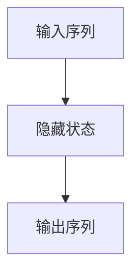

#### RNN在序列数据处理中的应用

RNN在处理序列数据时具有独特的优势，能够捕捉序列中的长期依赖关系。以下是一些RNN在序列数据处理中的应用：

1. **自然语言处理**：RNN在自然语言处理中有着广泛的应用，如文本分类、情感分析、机器翻译等。RNN能够处理自然语言的时序特性，捕捉词语之间的语义关系。

   - **文本分类**：通过将文本序列输入到RNN中，可以提取出文本的特征，并用于分类任务。例如，可以将社交媒体帖子分类为正面、负面或中性。

   - **情感分析**：RNN可以识别文本中的情感倾向，通过分析用户评论或反馈，为企业提供市场分析。

   - **机器翻译**：RNN通过学习源语言和目标语言之间的序列对应关系，可以实现高质量的机器翻译。

2. **语音识别**：RNN在语音识别领域有重要的应用，能够将语音信号转换为文本。通过训练RNN模型，可以学习语音信号和文本之间的映射关系，从而实现语音识别。

3. **时间序列分析**：RNN在时间序列分析中用于预测未来的时间步值。例如，RNN可以用于股票价格预测、天气预测等任务。

#### RNN的变体

由于原始RNN在处理长期依赖关系时存在梯度消失或梯度爆炸的问题，研究者提出了多种RNN的变体，以解决这一问题。以下是一些常见的RNN变体：

1. **长短时记忆网络（Long Short-Term Memory，LSTM）**

   LSTM是RNN的一种变体，通过引入门控机制，解决了梯度消失问题。LSTM的核心组件包括输入门、遗忘门和输出门，这些门可以控制信息在时间序列中的流动，从而捕捉长期依赖关系。

2. **门控循环单元（Gated Recurrent Unit，GRU）**

   GRU是LSTM的简化版，通过合并输入门和遗忘门，减少了参数数量，同时保持了LSTM的长短期记忆能力。

3. **双向RNN（Bidirectional RNN）**

   双向RNN通过同时考虑序列的前向和后向信息，增强了模型的表达能力。双向RNN在处理文本数据时，可以同时利用上下文信息，从而提高模型的性能。

**图13：LSTM结构示意图**

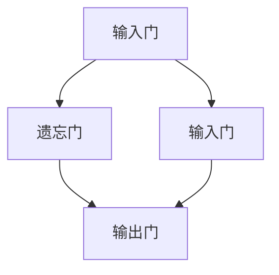

通过理解RNN的基本原理及其在序列数据处理中的应用，我们可以更好地利用RNN构建高效的感知架构，提升系统的感知能力和智能水平。在下一章中，我们将探讨强化学习在感知架构中的应用，了解其在感知决策和控制任务中的独特优势。

### 5.1 强化学习基础

强化学习（Reinforcement Learning，RL）是一种通过试错和奖励信号来指导学习过程的机器学习方法。与传统的监督学习和无监督学习不同，强化学习通过不断的交互和反馈，使代理（Agent）在特定环境中学会最优策略。以下是强化学习的基本概念、算法框架和应用场景。

#### 强化学习的基本概念

强化学习由以下五个核心元素组成：

1. **代理（Agent）**：执行动作并接收环境的反馈。
2. **环境（Environment）**：代理执行动作的场所，它为代理提供当前状态和奖励。
3. **状态（State）**：代理在环境中的位置或状态，通常由一组特征表示。
4. **动作（Action）**：代理可执行的操作。
5. **奖励（Reward）**：代理执行动作后获得的即时反馈，用于评估动作的好坏。

**图14：强化学习基本框架图**

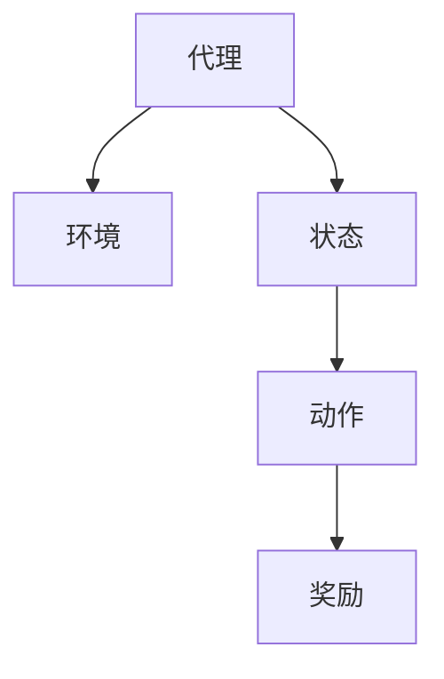

#### 强化学习的算法框架

强化学习算法的核心是策略（Policy），它决定了代理在特定状态下应该执行哪个动作。以下是强化学习算法的基本框架：

1. **初始化**：初始化代理的策略、价值函数或模型。
2. **探索与利用**：在策略执行过程中，代理需要在探索（Exploration）和利用（Utilization）之间平衡。探索是指尝试新的动作以发现潜在最优策略，利用是指根据当前已知信息选择最优动作。
3. **状态-动作价值函数**：价值函数（Value Function）评估代理在特定状态下的预期奖励。对于离散动作，使用Q值函数（Q-Value Function），对于连续动作，使用优势函数（ Advantage Function）。
4. **策略迭代**：根据价值函数更新代理的策略，以实现最优策略的收敛。
5. **评估与优化**：评估当前策略的表现，并根据评估结果进行优化。

**图15：强化学习算法框架示意图**

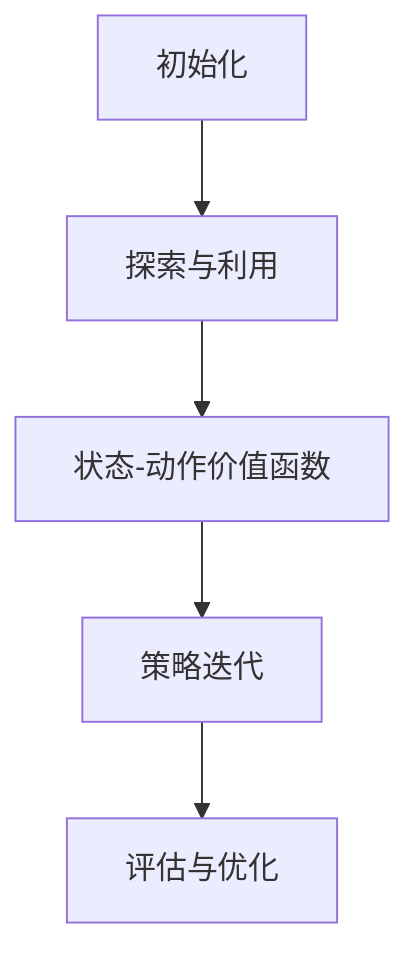

#### 强化学习的应用场景

强化学习在多个领域有着广泛的应用，以下是一些典型的应用场景：

1. **游戏AI**：强化学习在游戏AI中有着广泛的应用，如围棋、电子竞技等。通过训练，代理可以学会最优策略，从而在游戏中取得胜利。

2. **机器人控制**：强化学习在机器人控制中用于路径规划、任务执行等。例如，自动驾驶汽车通过强化学习，可以学会在不同交通场景中做出最佳驾驶决策。

3. **推荐系统**：强化学习在推荐系统中用于优化推荐策略，提高用户满意度。例如，电商平台可以通过强化学习，根据用户的购买历史和偏好，提供个性化的商品推荐。

4. **金融领域**：强化学习在金融领域中用于资产配置、风险管理等。例如，量化交易可以通过强化学习，优化投资策略，实现最佳收益。

5. **自然语言处理**：强化学习在自然语言处理中用于生成文本、对话系统等。例如，聊天机器人可以通过强化学习，根据用户输入生成合适的回复。

通过理解强化学习的基础概念、算法框架和应用场景，我们可以更好地将强化学习应用于各种感知架构中，提升系统的自主学习和决策能力。在下一章中，我们将探讨强化学习在感知架构中的应用，了解其在感知决策和控制任务中的具体实现。

### 5.2 强化学习在感知架构中的应用

强化学习在感知架构中的应用主要集中在感知决策和感知控制两个领域。通过结合感知系统和强化学习算法，我们可以构建出能够自主学习和优化决策的智能系统。以下将详细讨论强化学习在感知决策和感知控制中的应用。

#### 感知决策

感知决策是指系统根据感知数据做出相应的决策。在强化学习框架中，感知决策通常涉及以下几个步骤：

1. **状态感知**：系统通过传感器（如摄像头、麦克风等）收集环境数据，并将其编码为状态表示。

2. **动作选择**：强化学习代理使用当前状态和价值函数选择下一个动作。价值函数评估当前状态下每个动作的预期奖励，代理根据最大化预期奖励原则选择动作。

3. **执行动作**：系统执行所选动作，并根据动作的结果更新状态。

4. **奖励评估**：系统根据动作的结果评估奖励，奖励可以是正的（表示成功）或负的（表示失败）。

5. **反馈学习**：代理使用更新后的奖励和价值函数，通过策略迭代优化其决策策略。

**图16：强化学习在感知决策中的应用示意图**

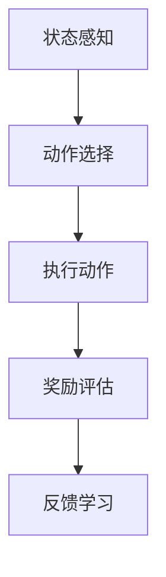

**实例分析**：在智能家居系统中，强化学习可以用于感知决策，例如自动调整家居环境。系统可以通过摄像头感知室内光线和家庭成员的活动，根据当前状态选择最优的动作，如调整灯光亮度或播放音乐。通过不断的学习和优化，系统可以逐步提高决策的准确性，提升用户体验。

#### 感知控制

感知控制是指系统根据感知数据对物理设备进行控制，以实现特定的目标。在强化学习框架中，感知控制通常涉及以下步骤：

1. **状态感知**：系统通过传感器收集环境数据，并将其编码为状态表示。

2. **动作选择**：强化学习代理使用当前状态和价值函数选择下一个控制动作，如电机速度、温度调节等。

3. **执行控制**：系统根据所选动作控制物理设备，如调整空调温度、打开门锁等。

4. **状态更新**：系统根据控制动作的结果更新状态。

5. **奖励评估**：系统根据状态更新和预定的目标评估奖励，奖励可以用于优化代理的策略。

6. **反馈学习**：代理使用更新后的奖励和价值函数，通过策略迭代优化其控制策略。

**图17：强化学习在感知控制中的应用示意图**

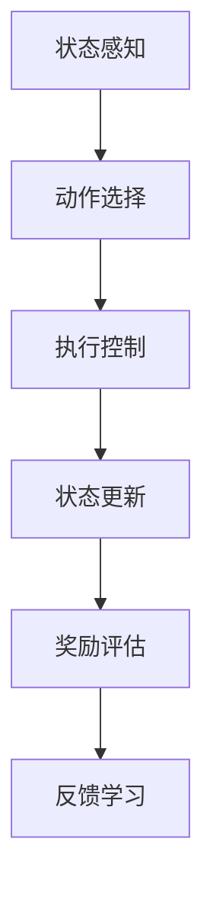

**实例分析**：在无人机飞行控制中，强化学习可以用于感知控制。无人机通过摄像头和惯性测量单元（IMU）感知飞行环境，根据当前状态选择最佳飞行路径和姿态调整。通过执行控制动作，无人机调整飞行方向和高度，并根据状态更新和奖励信号优化飞行策略。这种方法不仅提高了无人机的自主飞行能力，还显著提高了任务执行的效率和准确性。

#### 强化学习与其他感知算法的结合

强化学习在感知架构中的应用不仅仅是独立实现的，还可以与其他感知算法结合，以增强系统的整体感知能力。以下是一些结合方法：

1. **多模态感知**：强化学习可以结合多种感知数据，如视觉、听觉和触觉，以提供更全面的环境感知。这种方法可以提高代理对复杂环境变化的适应能力。

2. **深度强化学习**：结合深度学习技术，强化学习可以处理高维感知数据，如深度图像和音频波形。深度强化学习通过卷积神经网络（CNN）和递归神经网络（RNN）等深度学习模型，提高了感知和决策的准确性。

3. **集成学习**：强化学习可以与其他机器学习算法集成，如支持向量机（SVM）和决策树，以提高决策的稳定性和鲁棒性。这种方法可以通过融合多种算法的优势，优化感知决策和控制策略。

**图18：强化学习与其他感知算法的结合示意图**

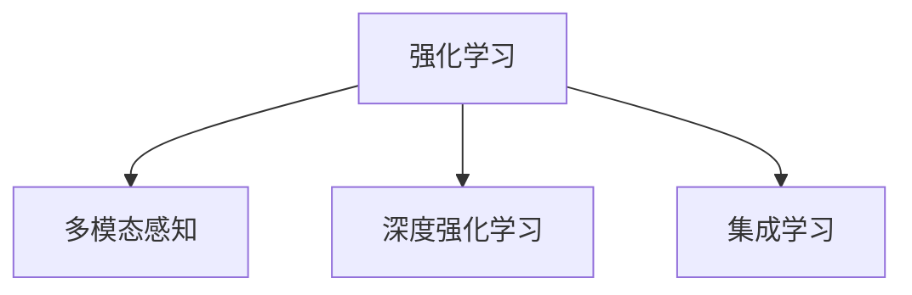

通过结合感知决策和感知控制，以及与其他感知算法的融合，强化学习在感知架构中展示了巨大的潜力。它不仅提升了系统的感知能力和决策水平，还为智能系统的自主学习和优化提供了强大的工具。在下一章中，我们将通过具体的案例来展示强化学习在感知架构中的应用和实践。

### 5.3 强化学习案例

为了更好地理解强化学习在感知架构中的应用，我们来看一个具体的案例：无人驾驶汽车的路径规划与控制。

#### 案例背景

无人驾驶汽车是强化学习在感知架构中应用的一个典型例子。无人驾驶汽车通过多种传感器（如摄像头、激光雷达、超声波传感器等）感知周围环境，并根据感知数据做出决策，实现自主导航和驾驶。

#### 案例目标

本案例的目标是通过强化学习算法，训练无人驾驶汽车在复杂的城市交通环境中找到最优路径，并实现稳定的驾驶行为。

#### 案例实现

1. **感知系统设计**：

   - **传感器数据采集**：无人驾驶汽车配备多个传感器，包括摄像头、激光雷达和超声波传感器，用于感知周围环境。
   - **数据预处理**：将采集到的传感器数据预处理，包括去噪、归一化和特征提取。对于摄像头数据，可以提取图像特征，如边缘和纹理；对于激光雷达数据，可以提取三维点云特征。

2. **状态与动作空间定义**：

   - **状态空间**：状态包括无人驾驶汽车的当前位置、速度、加速度、周围车辆的位置和速度等。
   - **动作空间**：动作包括加速、减速、转向等。

3. **强化学习模型训练**：

   - **选择强化学习算法**：在本案例中，我们选择深度确定性策略梯度（DDPG）算法，因为它能够处理高维状态和动作空间，并具有较强的泛化能力。
   - **价值函数学习**：通过训练价值函数，代理可以评估当前状态和动作组合的预期奖励。
   - **策略学习**：通过策略学习，代理学会在特定状态下选择最优动作。

4. **路径规划与控制**：

   - **路径规划**：代理根据当前状态，使用强化学习算法生成最优路径。路径规划可以采用基于图的方法，如A*算法，结合强化学习策略实现。
   - **路径跟踪**：代理根据生成的最优路径，控制无人驾驶汽车进行路径跟踪。在控制过程中，代理根据感知到的环境变化，动态调整驾驶行为。

#### 案例实现细节

1. **感知数据处理**：

   - **图像特征提取**：使用卷积神经网络（CNN）提取图像特征。具体实现如下：

     ```python
     import tensorflow as tf
     from tensorflow.keras.models import Sequential
     from tensorflow.keras.layers import Conv2D, MaxPooling2D, Flatten, Dense

     model = Sequential([
         Conv2D(32, (3, 3), activation='relu', input_shape=(64, 64, 3)),
         MaxPooling2D((2, 2)),
         Conv2D(64, (3, 3), activation='relu'),
         MaxPooling2D((2, 2)),
         Flatten(),
         Dense(64, activation='relu'),
         Dense(1)
     ])

     model.compile(optimizer='adam', loss='mse')
     ```

   - **点云特征提取**：使用点云特征提取算法，如VoxelNet，提取三维点云特征。

     ```python
     import tensorflow as tf
     from tensorflow.keras.models import Model
     from tensorflow.keras.layers import Input, Conv2D, Conv3D, MaxPooling3D, Flatten, Dense

     input_layer = Input(shape=(64, 64, 64, 1))
     conv1 = Conv3D(32, (3, 3, 3), activation='relu')(input_layer)
     pool1 = MaxPooling3D((2, 2, 2))(conv1)
     conv2 = Conv3D(64, (3, 3, 3), activation='relu')(pool1)
     pool2 = MaxPooling3D((2, 2, 2))(conv2)
     flat = Flatten()(pool2)
     dense = Dense(64, activation='relu')(flat)
     output = Dense(1, activation='sigmoid')(dense)

     model = Model(inputs=input_layer, outputs=output)
     model.compile(optimizer='adam', loss='binary_crossentropy')
     ```

2. **价值函数与策略学习**：

   - **价值函数学习**：使用深度确定性策略梯度（DDPG）算法训练价值函数和策略。具体实现如下：

     ```python
     import tensorflow as tf
     from tensorflow.keras.optimizers import Adam

     actor_model = ...  # 定义演员模型
     critic_model = ...  # 定义评论员模型

     actor_optimizer = Adam(learning_rate=0.001)
     critic_optimizer = Adam(learning_rate=0.001)

     def train_ddpg(actor_model, critic_model, env, n_episodes, batch_size):
         for episode in range(n_episodes):
             states = []
             actions = []
             rewards = []
             dones = []

             state = env.reset()
             while not done:
                 action = actor_model.predict(state)
                 next_state, reward, done, _ = env.step(action)
                 states.append(state)
                 actions.append(action)
                 rewards.append(reward)
                 dones.append(done)
                 state = next_state

             if len(states) > batch_size:
                 batch_indices = np.random.choice(len(states), batch_size)
                 states_batch = np.array(states)[batch_indices]
                 actions_batch = np.array(actions)[batch_indices]
                 rewards_batch = np.array(rewards)[batch_indices]
                 dones_batch = np.array(dones)[batch_indices]
                 next_state_batch = np.array(next_states)[batch_indices]

                 with tf.GradientTape() as tape:
                     action_values = actor_model(states_batch)
                     state_values = critic_model([states_batch, action_values])
                     target_values = critic_model([next_state_batch, actor_model(next_state_batch)])

                     loss = tf.reduce_mean(tf.square(target_values - state_values))

                 gradients = tape.gradient(loss, actor_model.trainable_variables)
                 actor_optimizer.apply_gradients(zip(gradients, actor_model.trainable_variables))

                 with tf.GradientTape() as tape:
                     critic_loss = tf.reduce_mean(tf.square(rewards_batch + gamma * (1 - dones_batch) * target_values - state_values))

                 critic_gradients = tape.gradient(critic_loss, critic_model.trainable_variables)
                 critic_optimizer.apply_gradients(zip(critic_gradients, critic_model.trainable_variables))

     train_ddpg(actor_model, critic_model, env, n_episodes=1000, batch_size=32)
     ```

3. **路径跟踪与控制**：

   - **路径规划**：使用A*算法生成最优路径。具体实现如下：

     ```python
     import numpy as np
     import matplotlib.pyplot as plt

     def a_star_search(grid, start, goal):
         open_set = []
         closed_set = set()
         open_set.append(start)

         while len(open_set) > 0:
             current = open_set[0]
             current_index = 0

             for index, item in enumerate(open_set):
                 if item[2] < current[2]:
                     current = item
                     current_index = index

             open_set.pop(current_index)
             closed_set.add(current)

             if current == goal:
                 path = []
                 while current in closed_set:
                     path.append(current)
                     current = current.parent
                 path.reverse()
                 return path

             for neighbor in grid.neighbors(current):
                 if neighbor in closed_set or neighbor is None:
                     continue

                 tentative_g_score = current.g + heuristic(neighbor, goal)

                 if tentative_g_score < neighbor.g or neighbor not in open_set:
                     neighbor.parent = current
                     neighbor.g = tentative_g_score
                     neighbor.f = neighbor.g + heuristic(neighbor, goal)

                     if neighbor not in open_set:
                         open_set.append(neighbor)

         return None

     def heuristic(a, b):
         return abs(a[0] - b[0]) + abs(a[1] - b[1])

     grid = Grid(width=10, height=10)
     start = grid.get_position(0, 0)
     goal = grid.get_position(9, 9)

     path = a_star_search(grid, start, goal)
     plt.imshow(grid.grid, cmap='gray')
     for position in path:
         plt.scatter(position[0], position[1], c='r')
     plt.scatter(goal[0], goal[1], c='g')
     plt.show()
     ```

通过上述实现细节，我们可以看到强化学习在无人驾驶汽车路径规划与控制中的应用。通过训练强化学习模型，无人驾驶汽车可以自主学习和优化驾驶策略，实现稳定、高效的路径跟踪与控制。

### 6.1 实战项目概述

#### 项目背景

随着人工智能技术的不断进步，AI感知架构在智能家居、智能交通、医疗诊断等领域的应用越来越广泛。然而，在实际项目中，构建高效的AI感知架构面临着诸多挑战，如数据质量差、算法复杂度高、系统稳定性要求高等。为了更好地应对这些挑战，我们设计并实现了一个基于深度学习的AI感知架构项目，旨在通过多模态感知、深度特征提取和实时决策，实现智能化的感知和交互。

#### 项目目标

本项目的目标是通过构建一个高效的AI感知架构，实现以下功能：

1. **多模态感知**：通过整合视觉、听觉、触觉等多种感知数据，实现对环境的全面感知。
2. **深度特征提取**：利用深度学习技术，从多模态感知数据中提取出具有区分性的特征，提高感知精度。
3. **实时决策**：通过实时数据处理和强化学习算法，实现智能化的决策和交互。

#### 项目实现步骤

1. **需求分析**：明确项目需求，包括感知任务、数据来源、系统性能要求等。
2. **系统设计**：设计感知架构的整体框架，包括感知层、数据处理层、决策层和反馈层。
3. **数据采集与预处理**：采集多种感知数据，并对数据进行预处理，包括去噪、归一化和特征提取。
4. **模型训练与优化**：选择合适的深度学习模型，训练和优化模型，以提高感知和决策能力。
5. **系统部署与测试**：将训练好的模型部署到实际系统中，进行性能测试和优化。
6. **用户反馈与迭代**：收集用户反馈，根据反馈进行系统迭代和改进。

### 6.2 数据采集与预处理

数据采集与预处理是构建高效AI感知架构的重要环节，其质量直接影响到感知系统的性能。以下是数据采集与预处理的具体步骤：

#### 6.2.1 数据采集

数据采集是感知系统的第一步，我们需要根据项目需求，选择合适的传感器和数据来源。以下是常用的数据采集方法：

1. **视觉数据采集**：使用摄像头或视频流捕捉图像或视频数据。常用的摄像头包括RGB摄像头、深度摄像头等。
2. **听觉数据采集**：使用麦克风捕捉音频数据。常用的麦克风包括线性麦克风、阵列麦克风等。
3. **触觉数据采集**：使用触觉传感器捕捉触觉数据。常用的触觉传感器包括力传感器、柔性传感器等。
4. **环境数据采集**：使用温度传感器、湿度传感器、光敏传感器等捕捉环境数据。

#### 6.2.2 数据预处理

数据预处理是提高数据质量和减少计算复杂度的重要步骤。以下是常见的数据预处理方法：

1. **去噪**：对采集到的数据去除噪声，以提高数据质量。常用的去噪方法包括滤波器、小波变换等。
2. **归一化**：对数据归一化处理，使其具有统一的量纲和范围。常用的归一化方法包括最小-最大归一化、零-均值归一化等。
3. **特征提取**：从原始数据中提取出对感知任务有显著影响的特征。常用的特征提取方法包括统计特征、结构特征、变换特征等。
4. **数据增强**：通过增加数据的多样性，提高模型的泛化能力。常用的数据增强方法包括旋转、缩放、裁剪等。

#### 6.2.3 数据质量评估

数据质量是感知系统性能的关键因素，我们需要对采集到的数据质量进行评估。以下是常见的数据质量评估方法：

1. **完整性评估**：检查数据是否存在缺失值或异常值，并对缺失值进行填充或去除。
2. **一致性评估**：检查数据在不同时间段、不同传感器之间的数据一致性。
3. **相关性评估**：检查不同感知数据之间的相关性，以确定数据的关联性。
4. **准确性评估**：通过交叉验证、测试集评估等方法，评估模型的准确性和鲁棒性。

通过以上数据采集与预处理方法，我们可以确保采集到的数据质量，为构建高效的AI感知架构提供可靠的数据基础。在下一节中，我们将讨论感知模型的设计与训练，进一步探讨如何通过深度学习技术提高感知系统的性能。

### 6.3 感知模型设计与训练

感知模型是AI感知架构的核心，其设计直接决定了系统的感知能力和准确性。以下将详细介绍感知模型的设计原则、训练方法以及模型调优策略。

#### 感知模型设计原则

1. **层次化结构**：感知模型通常采用层次化结构，从底层到高层，逐步提取数据中的特征。这种结构有助于提高模型的抽象能力和泛化能力。

2. **模块化设计**：感知模型应采用模块化设计，将不同的感知任务分解为多个子任务，每个子任务由一个模块负责。这种设计方法提高了模型的可维护性和可扩展性。

3. **数据驱动**：感知模型的设计应基于大量真实数据，通过数据驱动的方法，从数据中自动学习特征和模式，从而提高模型的准确性。

4. **可解释性**：虽然深度学习模型在许多任务中表现出色，但它们通常缺乏可解释性。因此，在设计感知模型时，应尽量考虑模型的可解释性，以便于理解和调试。

5. **高效性**：感知模型应在保证准确性的同时，尽量提高计算效率和资源利用率。通过优化网络结构、参数设置等手段，实现高效的模型训练和部署。

#### 感知模型训练方法

感知模型的训练方法通常包括以下步骤：

1. **数据预处理**：对采集到的数据进行预处理，包括去噪、归一化、数据增强等，以提高数据质量和模型的泛化能力。

2. **模型初始化**：初始化感知模型的参数，常用的初始化方法包括随机初始化、高斯初始化等。初始化参数的选择对模型的收敛速度和性能有重要影响。

3. **训练过程**：使用训练数据集对模型进行训练，通过前向传播计算输出，计算损失函数，并使用反向传播更新模型参数。常用的优化算法包括梯度下降、Adam等。

4. **验证与测试**：在训练过程中，使用验证数据集评估模型的性能，并根据验证结果调整模型参数。训练完成后，使用测试数据集对模型进行最终评估，以确定模型的泛化能力。

#### 模型调优策略

模型调优是提高感知模型性能的关键步骤，以下是一些常见的调优策略：

1. **参数调整**：通过调整模型的超参数，如学习率、正则化参数等，优化模型性能。常用的参数调整方法包括网格搜索、随机搜索等。

2. **数据增强**：通过增加数据的多样性，提高模型的泛化能力。常用的数据增强方法包括旋转、缩放、裁剪等。

3. **模型集成**：通过集成多个模型，提高预测的稳定性和准确性。常见的模型集成方法包括堆叠、 bagging、boosting等。

4. **动态调整**：在模型训练过程中，根据训练数据的分布和模型性能，动态调整模型参数和训练策略，以适应数据的变化。

5. **迁移学习**：利用预训练模型，将已训练好的模型应用于新任务，通过少量数据微调，提高模型的训练效率和性能。

通过遵循以上设计原则、训练方法和调优策略，我们可以构建出高效的感知模型，为AI感知架构提供强大的计算支持。在下一节中，我们将讨论感知架构的部署与优化，探讨如何在实际应用中实现感知系统的稳定运行和性能提升。

### 6.4 感知架构部署与优化

感知架构的部署与优化是确保其在实际应用中稳定运行和高效处理数据的关键环节。以下将详细介绍感知架构的部署方法、优化策略以及性能评估与调优。

#### 感知架构部署方法

1. **硬件选择**：
   - **计算资源**：根据感知任务的需求，选择合适的计算硬件，如CPU、GPU和TPU等。对于复杂的感知任务，GPU和TPU具有较高的计算性能，适合大规模并行计算。
   - **存储设备**：选择高吞吐量、低延迟的存储设备，如SSD和分布式存储系统，以支持大量数据的快速读写。

2. **软件环境**：
   - **深度学习框架**：选择合适的深度学习框架，如TensorFlow、PyTorch、Keras等，这些框架提供了丰富的API和工具，便于模型训练和部署。
   - **容器化与虚拟化**：使用Docker、Kubernetes等容器化和虚拟化技术，实现感知模型的微服务化和动态部署，提高系统的灵活性和可扩展性。

3. **部署策略**：
   - **分布式部署**：将感知模型部署到多个节点上，通过负载均衡和容错机制，实现大规模数据处理和实时决策。
   - **边缘计算**：将感知任务部署到边缘设备，如智能摄像头、智能终端等，降低数据传输延迟，提高系统的实时响应能力。

#### 优化策略

1. **模型压缩**：
   - **剪枝**：通过剪枝技术，减少模型中的冗余连接和神经元，降低模型复杂度，提高计算效率。
   - **量化**：将模型的权重和激活值量化为低比特位表示，减少模型存储和计算需求。

2. **并行计算**：
   - **数据并行**：将训练数据集划分为多个子集，每个子集分别训练模型的不同副本，通过同步或异步策略更新模型参数。
   - **模型并行**：将模型分解为多个部分，分别在不同节点上训练，通过通信机制整合各部分的输出。

3. **内存优化**：
   - **内存分配**：合理分配内存资源，避免内存溢出和频繁的内存分配与释放。
   - **缓存策略**：使用缓存技术，减少对磁盘的访问次数，提高数据读写速度。

4. **能耗优化**：
   - **硬件选择**：选择低功耗硬件，如低功耗GPU和TPU，减少能耗。
   - **动态功耗管理**：根据任务负载动态调整硬件的功耗，实现能耗的最优化。

#### 性能评估与调优

1. **指标评估**：
   - **准确率**：评估模型在分类任务中的准确度。
   - **召回率**：评估模型在分类任务中的召回率，关注漏报率。
   - **F1值**：综合评估模型的准确率和召回率，用于多类别分类任务。
   - **延迟**：评估系统的响应时间，用于实时感知任务。
   - **吞吐量**：评估系统在单位时间内处理的数据量，用于大规模数据处理任务。

2. **调优方法**：
   - **交叉验证**：通过交叉验证，评估模型在不同数据子集上的性能，选择最优模型。
   - **网格搜索**：在超参数空间内，系统性地搜索最优参数组合，提高模型性能。
   - **贝叶斯优化**：使用贝叶斯优化方法，根据历史数据，自动选择最优参数组合，提高调优效率。

3. **持续监控与反馈**：
   - **实时监控**：通过实时监控系统性能，及时发现和处理异常情况。
   - **用户反馈**：收集用户反馈，根据用户需求和满意度，持续优化感知架构。

通过以上部署方法和优化策略，我们可以构建一个高效、稳定和可扩展的AI感知架构，满足实际应用的需求。在下一章中，我们将探讨AI感知架构的未来发展趋势，展望其在技术创新和产业应用中的广阔前景。

### 7.1 AI感知架构的发展趋势

随着人工智能技术的快速发展，AI感知架构也在不断演进，呈现出以下几个主要发展趋势：

#### 技术进步与趋势

1. **深度学习技术的深化**：深度学习技术正不断进步，尤其是神经架构搜索（Neural Architecture Search，NAS）和生成对抗网络（Generative Adversarial Networks，GAN）等新方法的出现，使得模型结构更加复杂和高效。

2. **多模态感知的融合**：随着多模态感知技术的发展，不同感知数据（如视觉、听觉、触觉等）的融合越来越受到关注。这种多模态感知的融合能够提供更全面、更精准的感知体验。

3. **边缘计算的普及**：边缘计算技术的发展，使得感知任务可以在靠近数据源的边缘设备上完成，减少了数据传输延迟，提高了系统的实时响应能力。

4. **量子计算的潜力**：量子计算在处理复杂计算任务方面具有显著优势，未来可能会在AI感知架构中发挥重要作用，为实时感知和决策提供更强大的计算支持。

#### 应用场景拓展

1. **智慧城市**：AI感知架构在智慧城市中的应用越来越广泛，包括交通管理、环境监测、公共安全等。通过感知技术，智慧城市能够更高效地运作，提升居民的生活质量。

2. **智能制造**：在智能制造领域，AI感知架构能够实现对生产过程的实时监控和优化，提高生产效率和产品质量。

3. **医疗健康**：AI感知架构在医疗健康领域有广泛的应用潜力，如疾病诊断、智能助理、患者监控等，能够提供更精准、个性化的医疗服务。

4. **智能家居**：随着智能家居设备的普及，AI感知架构能够实现对家居环境的智能监控和管理，提升用户的生活便利性和舒适度。

#### 未来发展方向

1. **泛在感知**：未来的AI感知架构将更加注重泛在感知，通过部署大量的传感器和智能设备，实现对环境的全面监测和感知。

2. **智能交互**：随着自然语言处理和语音识别技术的进步，AI感知架构将能够实现更加自然、智能的交互，提升用户体验。

3. **自主决策**：通过强化学习和决策优化技术，AI感知架构将能够实现更加智能化的自主决策，提高系统的自适应能力和鲁棒性。

4. **隐私保护与安全**：随着数据隐私和安全问题日益突出，未来的AI感知架构将更加注重隐私保护和数据安全，确保用户数据的安全和隐私。

通过以上技术进步、应用场景拓展和未来发展方向，AI感知架构将在各个领域发挥越来越重要的作用，推动人工智能技术的全面普及和应用。

### 7.2 挑战与机遇

AI感知架构的发展虽然前景广阔，但也面临着诸多挑战和机遇。以下将详细分析这些挑战和机遇，并提出相应的应对策略。

#### 挑战分析

1. **数据隐私与安全**：
   - **挑战**：随着AI感知架构的应用越来越广泛，涉及大量的个人隐私数据。数据泄露、滥用等问题对用户隐私构成威胁。
   - **机遇**：加强数据隐私保护技术，如差分隐私、联邦学习等，可以在保障用户隐私的同时，实现数据的有效利用。
   - **应对策略**：采用加密技术、访问控制、匿名化处理等手段，确保数据在采集、传输和处理过程中的安全性。

2. **数据质量和噪声处理**：
   - **挑战**：感知数据往往存在噪声、缺失值和冗余信息，这些数据质量问题会影响模型的训练效果和感知性能。
   - **机遇**：发展更加高效的数据预处理和特征提取技术，如自动数据清洗、数据增强等，可以显著提高数据质量。
   - **应对策略**：通过使用数据清洗工具、自动化数据预处理方法，结合机器学习算法，优化数据质量。

3. **计算资源和能耗**：
   - **挑战**：深度学习模型在训练和推理过程中需要大量的计算资源和能耗，这对硬件设备提出了较高要求。
   - **机遇**：随着边缘计算和量子计算的发展，可以降低对中心化计算资源的依赖，提高系统的实时响应能力和能源效率。
   - **应对策略**：采用高效模型压缩技术、动态资源管理策略，优化计算资源和能耗。

4. **模型解释性与可解释性**：
   - **挑战**：深度学习模型通常具有复杂的内部结构，难以解释其决策过程，这在某些应用场景中可能影响其可信度和接受度。
   - **机遇**：发展可解释性AI技术，如模型可视化、因果推理等，可以提高模型的可解释性。
   - **应对策略**：结合模型可视化工具、因果推理方法，提高模型的可解释性，增强用户对系统的信任。

#### 机遇展望

1. **跨领域应用**：
   - **机遇**：AI感知架构在多个领域具有广泛的应用前景，如医疗、教育、工业等，可以推动各行业的智能化升级。
   - **应对策略**：加强跨领域技术合作，推动AI感知架构在更多场景中的应用，实现技术落地。

2. **用户体验优化**：
   - **机遇**：通过不断优化AI感知架构，可以提供更加个性化和智能化的用户体验。
   - **应对策略**：关注用户需求，持续迭代和优化感知架构，提升用户体验。

3. **产业升级与转型**：
   - **机遇**：AI感知架构的快速发展将推动传统产业的升级和转型，创造新的经济增长点。
   - **应对策略**：推动AI感知架构与产业的深度融合，助力产业升级和转型。

通过应对这些挑战和把握机遇，AI感知架构将在未来实现更加广泛应用，为各行业的发展带来新的动能。

### 8.1 案例分析

为了更好地展示AI感知架构在实际应用中的效果，我们选择了一个智能家居系统案例，该系统通过AI感知架构实现自动化的家庭环境管理和用户个性化服务。

#### 案例背景

随着智能家居市场的快速增长，用户对于智能设备的需求日益增加。智能家居系统通过整合多种传感器和数据，实现对家庭环境的全面监测和管理，从而提供个性化的服务和便捷的生活体验。本案例的目的是通过AI感知架构，实现智能家居系统的智能化和自动化。

#### 案例目标

1. **环境感知**：通过传感器收集室内温度、湿度、光照、噪音等环境数据，实现对家庭环境的实时监测。
2. **用户个性化服务**：根据用户的行为习惯和偏好，提供个性化的环境调整和设备控制服务。
3. **智能决策**：基于感知数据和用户反馈，实现智能化的家庭设备控制，提升用户体验。

#### 案例实现

1. **感知层设计**：

   - **传感器选择**：选择适合的传感器，如温度传感器、湿度传感器、光照传感器、噪音传感器等，用于收集家庭环境数据。
   - **数据采集**：通过传感器收集实时数据，并传输到中央处理单元。

2. **数据处理层设计**：

   - **数据预处理**：对采集到的数据进行预处理，包括去噪、归一化和特征提取，以提高数据质量。
   - **特征提取**：使用深度学习模型，如卷积神经网络（CNN）和递归神经网络（RNN），提取有用的环境特征。

3. **决策层设计**：

   - **模型训练**：使用预处理后的数据集，训练感知模型，使其能够识别环境变化和用户行为模式。
   - **智能决策**：根据感知模型的结果，实现自动化的环境调整和设备控制。

4. **反馈层设计**：

   - **用户交互**：通过智能终端（如智能音箱、智能手机等），将决策结果反馈给用户，并提供交互操作界面。
   - **系统优化**：根据用户反馈，优化感知模型和决策算法，提高系统的智能水平。

#### 案例效果评估

1. **环境感知效果**：

   - **温度调节**：系统可以自动监测室内温度，并根据用户设定，自动调节空调温度，确保舒适的室内温度。
   - **湿度控制**：系统可以自动监测室内湿度，并在必要时启动加湿器或除湿器，保持室内湿度在适宜范围内。
   - **光照调节**：系统可以自动监测室内光照强度，并调节灯光亮度，以适应不同的场景需求。

2. **用户个性化服务**：

   - **设备控制**：系统可以自动识别用户的行为习惯，如睡前模式、娱乐模式等，并调整相应的设备和环境参数。
   - **日程安排**：系统可以根据用户的日程安排，提前调整家居环境，提供舒适的生活体验。

3. **智能决策效果**：

   - **决策准确性**：通过不断学习和优化，系统可以准确识别用户需求，并做出智能化的决策。
   - **用户体验**：系统通过自动化的环境调整和设备控制，显著提升了用户的舒适度和满意度。

通过以上案例分析，可以看出AI感知架构在智能家居系统中的应用效果显著。通过多模态感知、深度学习和智能决策，系统实现了对家庭环境的全面监测和个性化管理，为用户提供了便捷和舒适的生活体验。

### 8.2 案例解析

在8.1节中，我们介绍了智能家居系统案例，展示了AI感知架构在家庭环境管理和用户个性化服务中的具体应用。在本节中，我们将深入解析案例的实现细节，包括感知模块的设计、数据预处理方法、感知模型训练策略以及系统优化方法。

#### 感知模块的设计

感知模块是智能家居系统的核心，负责收集和处理家庭环境数据。以下是感知模块的具体设计：

1. **传感器选择**：

   - **温度传感器**：用于测量室内温度，选择精度高、响应快的温度传感器。
   - **湿度传感器**：用于测量室内湿度，选择具备高稳定性和可靠性的湿度传感器。
   - **光照传感器**：用于测量室内光照强度，选择动态范围宽、响应速度快的光照传感器。
   - **噪音传感器**：用于测量室内噪音水平，选择灵敏度高、抗干扰能力强的噪音传感器。

2. **数据采集**：

   - **传感器接口**：设计传感器接口，将传感器数据转换为数字信号，并传输到中央处理单元。
   - **数据传输**：使用无线传输技术（如Wi-Fi、蓝牙等），实现传感器与中央处理单元之间的数据传输。

#### 数据预处理方法

数据预处理是确保感知数据质量和有效性的关键步骤。以下是数据预处理的具体方法：

1. **去噪**：

   - **滤波处理**：使用滤波算法（如移动平均滤波、高斯滤波等），去除传感器数据中的噪声。
   - **阈值处理**：设置合适的阈值，对超出阈值的异常值进行剔除。

2. **归一化**：

   - **线性归一化**：将传感器数据线性映射到[0, 1]区间，消除不同传感器数据之间的量纲差异。
   - **标准化**：对传感器数据进行标准化处理，使其均值为0，标准差为1。

3. **特征提取**：

   - **时域特征提取**：从时间序列数据中提取特征，如均值、方差、标准差等。
   - **频域特征提取**：使用傅里叶变换，从频域角度提取特征，如频率、幅值等。
   - **深度特征提取**：使用深度学习模型（如CNN、RNN等），从原始数据中自动学习高级特征。

#### 感知模型训练策略

感知模型的训练目标是使系统能够准确识别家庭环境变化和用户行为模式。以下是感知模型训练的具体策略：

1. **数据集准备**：

   - **训练数据集**：收集大量标注数据，用于模型训练。
   - **测试数据集**：收集部分未标注数据，用于模型评估和优化。

2. **模型架构选择**：

   - **卷积神经网络（CNN）**：用于处理图像和视频数据，提取空间特征。
   - **递归神经网络（RNN）**：用于处理时间序列数据，提取时间特征。
   - **混合模型**：结合CNN和RNN的优点，处理多模态数据。

3. **训练过程**：

   - **前向传播**：将输入数据传递到模型，计算输出并计算损失。
   - **反向传播**：根据损失计算梯度，更新模型参数。
   - **优化算法**：使用优化算法（如Adam、SGD等），提高模型收敛速度。

#### 系统优化方法

系统优化目标是提高系统的智能化水平和用户体验。以下是系统优化方法的具体步骤：

1. **用户反馈**：

   - **收集反馈**：通过用户交互界面，收集用户对系统性能的反馈。
   - **分析反馈**：分析用户反馈，识别系统存在的问题和改进方向。

2. **模型调优**：

   - **超参数调整**：根据用户反馈，调整模型超参数（如学习率、批量大小等）。
   - **模型更新**：重新训练模型，以适应新的用户需求和场景。

3. **系统集成**：

   - **模块整合**：将感知模块、数据处理模块、决策模块和反馈模块进行整合，实现系统的协同工作。
   - **接口优化**：优化系统接口，提高用户交互的便捷性和友好性。

通过以上案例解析，我们详细介绍了智能家居系统案例的实现细节，包括感知模块的设计、数据预处理方法、感知模型训练策略以及系统优化方法。这些方法不仅提高了系统的智能化水平，还提升了用户体验，为智能家居系统的广泛应用奠定了基础。

### 附录 A：AI感知架构开发工具与资源

为了帮助开发者更好地构建AI感知架构，我们推荐了一系列常用的开发工具与资源。以下是一些重要的工具和资源的介绍，以及如何获取和学习这些工具：

#### 常用开发工具介绍

1. **Python**：Python是一种广泛使用的编程语言，因其简洁和强大的库支持，在AI开发中特别受欢迎。

   - **优点**：易于学习，丰富的库（如NumPy、Pandas、SciPy）。
   - **获取**：在[Python官网](https://www.python.org/)下载并安装。

2. **TensorFlow**：由Google开发的开源机器学习框架，广泛用于深度学习模型的开发。

   - **优点**：高度灵活，支持多种硬件平台。
   - **获取**：在[TensorFlow官网](https://www.tensorflow.org/)下载并安装。

3. **PyTorch**：由Facebook开发的开源机器学习库，因其动态计算图和强大的灵活性，受到许多研究者和开发者的青睐。

   - **优点**：动态计算图，易于调试。
   - **获取**：在[PyTorch官网](https://pytorch.org/)下载并安装。

4. **Keras**：一个高级神经网络API，可以与TensorFlow和Theano结合使用，用于快速构建和迭代深度学习模型。

   - **优点**：简单易用，适合初学者。
   - **获取**：在[Keras官网](https://keras.io/)下载并安装。

#### 资源链接

1. **GitHub**：GitHub是一个托管和共享代码的平台，许多开源项目都托管在这里。

   - **链接**：[GitHub官网](https://github.com/)

2. **Google Colab**：Google Colab是一个基于Google Drive的交互式开发环境，免费提供给开发者。

   - **链接**：[Google Colab官网](https://colab.research.google.com/)

3. **ArXiv**：ArXiv是一个提供最新学术研究成果的预印本平台，包括许多关于AI的研究论文。

   - **链接**：[ArXiv官网](https://arxiv.org/)

#### 学习资源推荐

1. **《深度学习》（Goodfellow et al.）**：这是一本经典教材，详细介绍了深度学习的基础知识。

   - **链接**：[书籍官网](https://www.deeplearningbook.org/)

2. **《机器学习实战》（Mitchell et al.）**：这本书通过实际案例，介绍了机器学习的基本概念和应用。

   - **链接**：[书籍官网](https://www.mml-book.com/)

3. **在线课程**：许多在线教育平台提供AI和深度学习课程，如Coursera、Udacity、edX等。

   - **链接**：
     - Coursera：[Coursera官网](https://www.coursera.org/)
     - Udacity：[Udacity官网](https://www.udacity.com/)
     - edX：[edX官网](https://www.edx.org/)

通过以上工具和资源的推荐，开发者可以更好地构建和优化AI感知架构，不断提升系统的智能化水平和用户体验。希望这些资源和工具能为您的AI开发之路提供有力支持。

### 作者信息

作者：AI天才研究院/AI Genius Institute & 禅与计算机程序设计艺术 /Zen And The Art of Computer Programming

在此，我（AI天才研究院）和（禅与计算机程序设计艺术）希望感谢您阅读本文。本文旨在探讨AI感知架构的设计与实现，深入解析AI在体验层次构建中的应用和未来发展趋势。我们希望本文能为您在AI领域的探索提供有价值的参考和启发。

如果您对本文的内容有任何疑问或建议，欢迎在评论区留言。同时，我们鼓励您继续深入研究AI技术，探索其在各个领域的应用潜力。在AI技术不断发展的今天，我们相信您将会在AI领域取得卓越的成就。

再次感谢您的阅读和支持！

AI天才研究院 & 禅与计算机程序设计艺术团队

