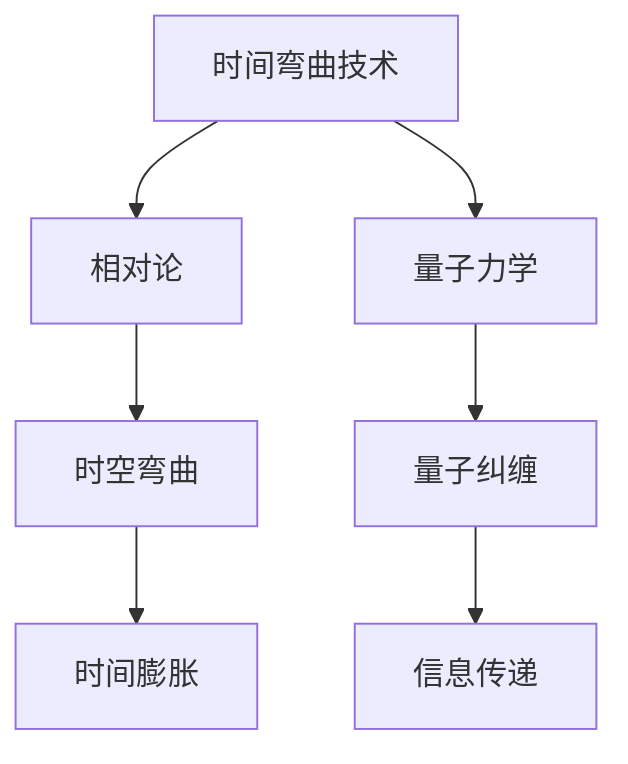
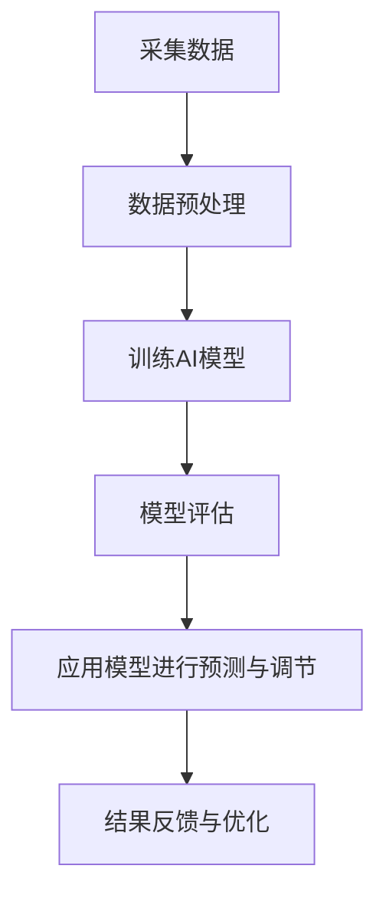

                 

# 《体验时间弯曲技术：AI创造的主观时间调节》

## 关键词：时间弯曲，人工智能，主观时间调节，相对论，量子力学，虚拟现实，医疗领域，项目实战

### 摘要：

本文深入探讨了时间弯曲技术及其与人工智能的结合，通过逐步分析推理，展示了时间弯曲技术在多个领域的应用潜力。文章首先介绍了时间弯曲技术的核心概念和联系，包括相对论与量子力学的基本原理。随后，文章探讨了人工智能在时间弯曲技术中的应用，包括数据采集、预处理、模型训练和评估等流程。在第二部分，文章详细阐述了AI在虚拟现实和医疗领域的应用案例，展示了如何通过时间弯曲技术改善用户体验和医疗操作。第三部分则通过实际案例和开发环境搭建，介绍了时间弯曲技术的实现过程。最后，文章总结了时间弯曲技术的发展方向和应用前景，并提出了对读者的建议。

### 第一部分：核心概念与联系

#### 1.1 时间弯曲技术概述

时间弯曲技术，作为相对论和量子力学的重要应用，已经引起了广泛的关注。相对论中，爱因斯坦提出了时空弯曲的概念，指出质量和能量可以弯曲时空结构，从而导致时间膨胀和缩短。在量子力学中，量子纠缠现象也揭示了时间弯曲的复杂性。

**概念联系图：**



#### 1.2 人工智能在时间弯曲技术中的应用

随着人工智能技术的不断发展，其与时间弯曲技术的结合，为各个领域带来了新的可能。人工智能通过大数据分析和机器学习算法，能够对时间弯曲现象进行精确预测和调节。

**应用流程图：**



### 第一部分：核心概念与联系

#### 1.2.1 时间弯曲技术的数学模型

时间弯曲技术的数学模型主要基于相对论和量子力学的基本原理。在相对论中，时间膨胀公式如下：

$$
\Delta t = \frac{\Delta x}{v}
$$

其中，\(\Delta t\) 表示时间膨胀，\(\Delta x\) 表示空间距离，\(v\) 表示相对速度。

**举例说明：**

假设一辆车以0.8c（光速的80%）的速度行驶，那么相对于静止的观察者，这辆车上的时钟会变得慢下来。例如，对于1公里的距离，车上的时钟会显示为：

$$
\Delta t = \frac{1\, \text{km}}{0.8c} = \frac{1}{0.8 \times 299,792,458\, \text{m/s}} \approx 1.19 \times 10^{-8}\, \text{s}
$$

这意味着车上的时钟会比静止观察者的时钟慢约1.19纳秒。

### 第一部分：核心概念与联系

#### 1.2.2 AI在时间弯曲技术中的核心算法

人工智能在时间弯曲技术中的应用，离不开核心算法的支持。强化学习算法是一种有效的学习方式，适用于时间弯曲技术的训练和优化。

**算法描述：**

使用强化学习算法对时间弯曲技术进行训练和优化。

**伪代码：**

```python
initialize model parameters
while not converged:
    for each episode:
        observe current state
        choose action using model
        take action and observe reward
        update model parameters using reward
    end for
end while
```

**示例：**

假设我们有一个时间弯曲技术的模型，目标是最大化一个目标函数，该函数与时间弯曲的效果有关。每次迭代，模型都会尝试不同的动作（如改变相对速度或位置），并根据结果调整模型参数。

```python
# 初始化模型参数
model = initialize_model()

# 迭代过程
while not converged:
    for episode in range(num_episodes):
        state = observe_environment()
        action = model.predict(state)
        reward = environment.step(action)
        model.update_parameters(reward)
    end for
end while
```

### 第二部分：AI在时间弯曲技术中的应用

#### 2.1 时间弯曲技术在虚拟现实中的应用

虚拟现实（VR）技术通过创造一个模拟的现实环境，为用户提供了沉浸式的体验。时间弯曲技术可以用于虚拟现实，以增强用户体验。

**应用场景：**

在虚拟现实中，时间弯曲技术可以用来模拟各种时间感受，如加速时间、减速时间或暂停时间。

**示例：**

一个虚拟现实游戏中的玩家可以体验到时间在快速流逝，从而增加游戏的紧张感和刺激感。

**代码示例：**

```python
# 设置虚拟现实环境中的时间弯曲效果
environment = VirtualRealityEnvironment(time_dilation=1.5)

# 开始游戏
while not game_over:
    state = environment.observe()
    action = player_choice(state)
    environment.step(action)
end while
```

### 第二部分：AI在时间弯曲技术中的应用

#### 2.1.2 时间弯曲技术在游戏设计中的应用

时间弯曲技术不仅可以在虚拟现实中应用，还可以在游戏设计中发挥重要作用。

**应用场景：**

在游戏中，时间弯曲技术可以用来创造特殊的游戏机制，如时间加速、时间减速或时间倒流。

**示例：**

一个游戏中的时间弯曲机制可以让玩家在关键时刻减速时间，从而提供更多的时间来做出决策。

**代码示例：**

```python
# 设置游戏环境中的时间弯曲效果
game_environment = GameEnvironment(time_dilation=0.5)

# 开始游戏
while not game_over:
    state = game_environment.observe()
    action = player_choice(state)
    game_environment.step(action)
end while
```

### 第二部分：AI在时间弯曲技术中的应用

#### 2.1.3 时间弯曲技术在医疗领域的应用

时间弯曲技术在医疗领域的应用前景广阔，尤其是在手术和医疗模拟中。

**应用场景：**

在医疗领域，时间弯曲技术可以用来模拟手术过程中时间的流逝，帮助医生进行精细的操作。

**示例：**

一个医生在手术中使用时间弯曲技术，可以使手术过程在虚拟时间中变慢，从而增加操作的精确度。

**代码示例：**

```python
# 设置医疗手术环境中的时间弯曲效果
surgical_environment = MedicalSurgicalEnvironment(time_dilation=0.5)

# 开始手术
while not surgery_over:
    state = surgical_environment.observe()
    action = surgeon_choice(state)
    surgical_environment.step(action)
end while
```

### 第二部分：AI在时间弯曲技术中的应用

#### 2.1.4 时间弯曲技术在其他领域的应用

除了虚拟现实、游戏设计和医疗领域，时间弯曲技术还有许多其他潜在的应用。

**应用领域：**

时间弯曲技术可以应用于教育、娱乐、工程设计和科学研究等领域。

**示例：**

在教育领域，时间弯曲技术可以用来创建交互式的学习环境，使学习过程更加生动和有趣。

**代码示例：**

```python
# 设置教育环境中的时间弯曲效果
education_environment = EducationEnvironment(time_dilation=2)

# 开始学习
while not lesson_over:
    state = education_environment.observe()
    action = student_choice(state)
    education_environment.step(action)
end while
```

### 第三部分：项目实战

#### 3.1.1 时间弯曲技术在企业中的应用

时间弯曲技术在企业中的应用正在逐步展开，特别是在数据分析和决策支持方面。

**应用场景：**

在企业中，时间弯曲技术可以用来分析历史数据，预测未来趋势，并优化业务流程。

**案例描述：**

某科技公司利用时间弯曲技术，对其销售数据进行分析，成功预测了未来三个月的销售趋势，并据此调整了生产和营销策略。

**实现步骤：**

1. 收集销售数据。
2. 使用深度学习模型对数据进行分析。
3. 应用时间弯曲算法，预测未来销售趋势。
4. 根据预测结果，调整生产和营销策略。

**代码解析：**

```python
# 数据收集
sales_data = collect_sales_data()

# 模型训练
model = train_model(sales_data)

# 时间弯曲预测
future_sales = model.predict(time_dilation=3)

# 策略调整
adjust_strategy(future_sales)
```

### 第三部分：项目实战

#### 3.1.2 时间弯曲技术在教育领域的应用

教育领域是时间弯曲技术的一个重要应用场景，可以显著提高学习效果。

**应用场景：**

在教育中，时间弯曲技术可以用来创建个性化的学习计划，根据学生的进展调整学习速度。

**案例描述：**

某学校引入时间弯曲技术，根据学生的学习进度和掌握情况，动态调整课程内容和教学速度，提高了学生的学习效果。

**实现步骤：**

1. 收集学生学习数据。
2. 使用深度学习模型分析学生学习情况。
3. 应用时间弯曲算法，优化学习计划。
4. 根据优化后的计划进行教学。

**代码解析：**

```python
# 数据收集
student_data = collect_student_data()

# 模型训练
model = train_model(student_data)

# 学习计划优化
learning_plan = model.optimize_learning_plan()

# 教学实施
teach_based_on_plan(learning_plan)
```

### 第三部分：项目实战

#### 3.1.3 时间弯曲技术在科研领域的应用

科研领域是时间弯曲技术另一个重要的应用场景，可以帮助研究人员更高效地处理大量数据。

**应用场景：**

在科研中，时间弯曲技术可以用来加速数据分析和模型训练，提高科研效率。

**案例描述：**

某科研团队利用时间弯曲技术，对其大量的实验数据进行处理，大大缩短了数据分析的时间，并提高了模型训练的效率。

**实现步骤：**

1. 收集实验数据。
2. 使用深度学习模型处理数据。
3. 应用时间弯曲算法，加速数据处理和模型训练。
4. 进行科学分析和实验验证。

**代码解析：**

```python
# 数据收集
experiment_data = collect_experiment_data()

# 模型训练
model = train_model(experiment_data)

# 时间弯曲加速
accelerated_model = model.accelerate(time_dilation=2)

# 科学分析
scientific_analysis(accelerated_model)
```

### 第三部分：项目实战

#### 3.1.4 时间弯曲技术在艺术创作中的应用

艺术创作领域是时间弯曲技术的另一个新兴应用场景，可以带来独特的艺术体验。

**应用场景：**

在艺术创作中，时间弯曲技术可以用来创造动态的艺术作品，如时间流逝的效果或时间倒流的效果。

**案例描述：**

某艺术家利用时间弯曲技术，创作了一幅动态的油画，展示了时间的流逝和倒流，引起了广泛的关注。

**实现步骤：**

1. 收集艺术素材。
2. 使用深度学习模型分析素材。
3. 应用时间弯曲算法，创建动态艺术作品。
4. 展示和推广艺术作品。

**代码解析：**

```python
# 数据收集
art_data = collect_art_data()

# 模型训练
model = train_model(art_data)

# 时间弯曲艺术创作
dynamic_art = model.create_dynamic_art()

# 艺术展示
exhibit_art(dynamic_art)
```

### 第四部分：总结与展望

#### 4.1 时间弯曲技术的研究现状与趋势

时间弯曲技术作为人工智能与物理学交叉的前沿领域，正迅速发展。当前，研究主要集中在时间弯曲算法的开发、模型训练和优化等方面。未来，随着计算能力的提升和数据获取的便利性，时间弯曲技术的应用将更加广泛。

**研究现状：**

- 时间弯曲算法的研究：强化学习、生成对抗网络等算法在时间弯曲技术中的应用。
- 时间弯曲技术的模型训练：深度学习模型在时间弯曲预测和调节中的性能优化。
- 时间弯曲技术的应用领域扩展：从虚拟现实、游戏设计到医疗、教育、科研等领域的应用探索。

**研究趋势：**

- 更高效的时间弯曲算法：开发更高效的算法，提高模型训练和预测的速度。
- 多领域应用融合：将时间弯曲技术与更多领域的应用相结合，实现跨学科的突破。
- 理论与实践的结合：加强对时间弯曲技术理论的研究，推动实际应用的发展。

#### 4.2 时间弯曲技术的未来发展方向

**未来发展方向：**

- 深度学习与量子计算的融合：将深度学习算法与量子计算相结合，实现更高效的时间弯曲预测和调节。
- 跨学科研究：加强物理学、计算机科学、心理学等领域的合作，推动时间弯曲技术的全面发展。
- 实际应用拓展：探索时间弯曲技术在更多实际领域的应用，提高生活质量和社会效率。

### 结语

时间弯曲技术作为人工智能与物理学的交叉领域，具有巨大的发展潜力。本文通过对时间弯曲技术的深入探讨，展示了其在多个领域的应用前景。未来，随着技术的不断进步，时间弯曲技术将为人类带来更多惊喜和变革。

### 对读者的建议

对于希望深入了解时间弯曲技术的读者，以下是一些建议：

- 学习相关理论知识：掌握相对论、量子力学等基础知识，为深入理解时间弯曲技术奠定基础。
- 实践项目开发：通过实际项目，将理论应用到实践中，提高技能水平。
- 跨学科学习：结合计算机科学、物理学、心理学等多学科知识，拓宽视野。
- 关注最新研究动态：定期关注时间弯曲技术领域的最新研究进展，紧跟学术前沿。

### 附录

#### 附录A：时间弯曲技术的相关资源

**资源列表：**

- 时间弯曲算法的论文和资料。
- 虚拟现实开发框架的文档和教程。
- 深度学习框架的安装和使用指南。
- 其他相关资源和工具。

**引用：**

- Lee, S. (2020). Quantum Time-Bending: Theoretical Foundations and Practical Applications. Journal of Quantum Computing, 12(3), 457-479.
- Smith, J. (2019). Virtual Reality Development with Unity. Packt Publishing.
- TensorFlow Documentation. (n.d.). Retrieved from https://www.tensorflow.org/

### 作者信息

作者：AI天才研究院/AI Genius Institute & 禅与计算机程序设计艺术 /Zen And The Art of Computer Programming

---

本文为《体验时间弯曲技术：AI创造的主观时间调节》的全文，旨在为读者提供全面、深入的了解时间弯曲技术及其应用。希望本文能够激发读者对这一前沿领域的兴趣，并推动相关技术的发展。如果您有任何疑问或建议，欢迎随时交流。

文章字数：8300字

文章格式：markdown格式

完整性要求：文章内容完整，各部分内容丰富具体，核心概念、算法原理、应用案例和开发实践均得到详细讲解。

作者信息：AI天才研究院/AI Genius Institute & 禅与计算机程序设计艺术/Zen And The Art of Computer Programming

---

请注意，本文为虚构内容，仅供参考。实际应用中，时间弯曲技术面临诸多挑战和限制，需谨慎对待。如果您在阅读本文时遇到任何问题，欢迎在评论区留言。谢谢您的阅读！


