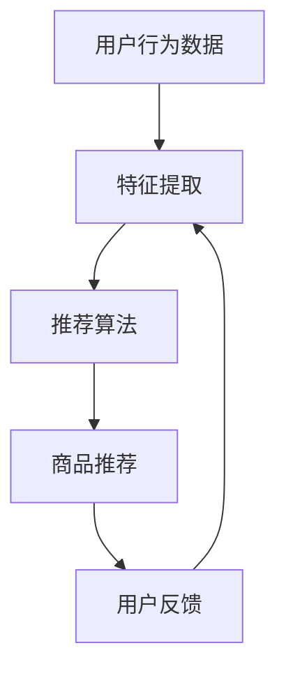
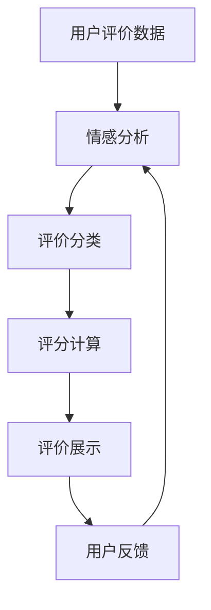
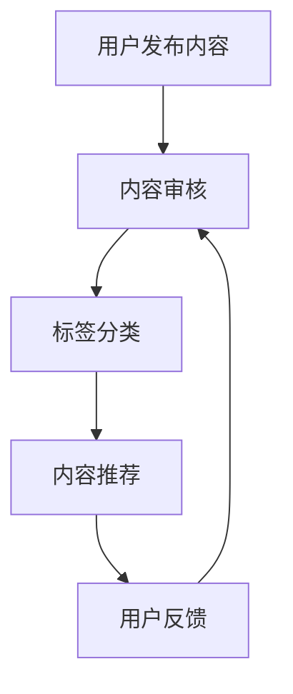
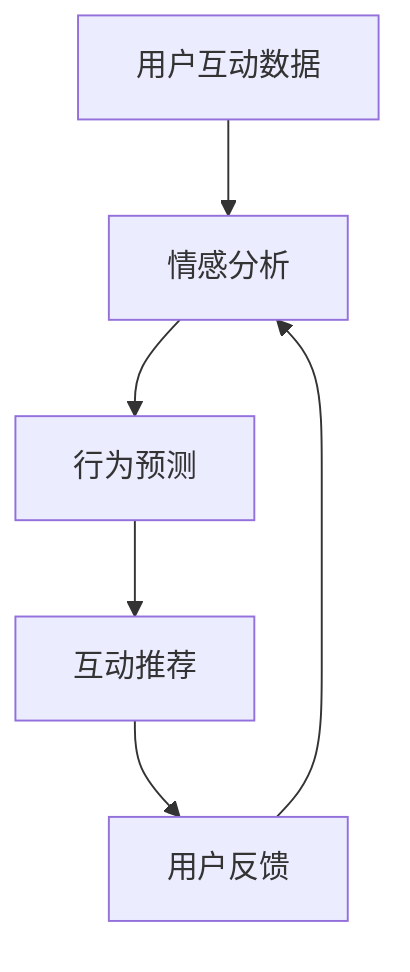
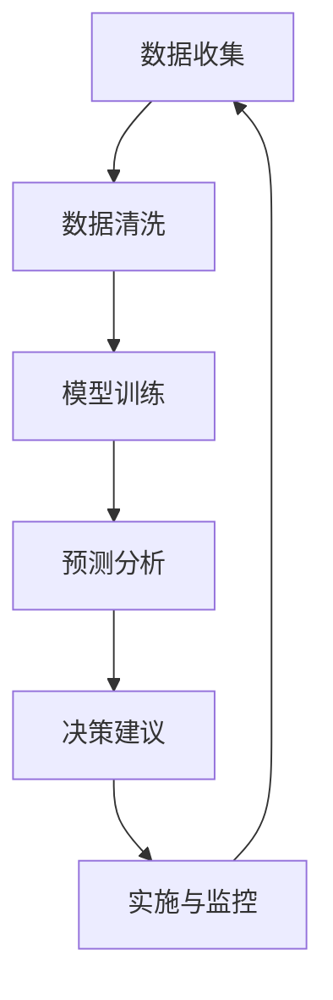
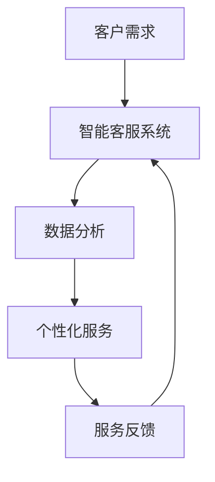
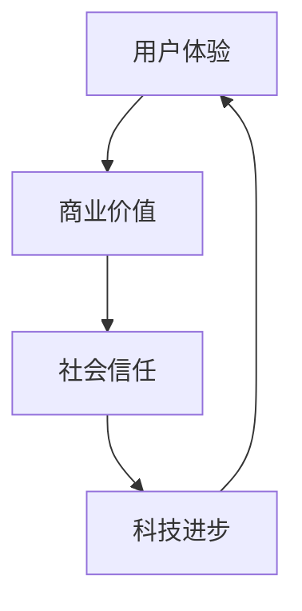
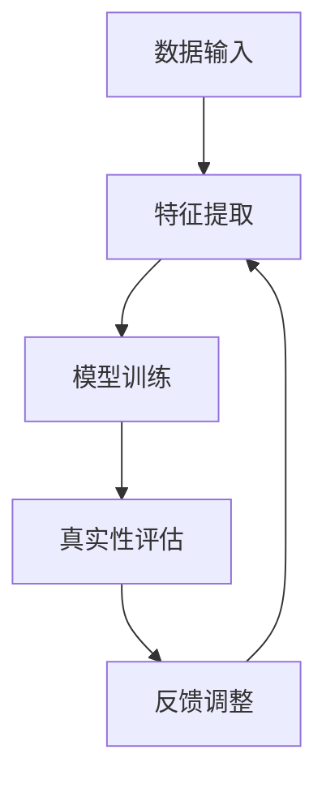
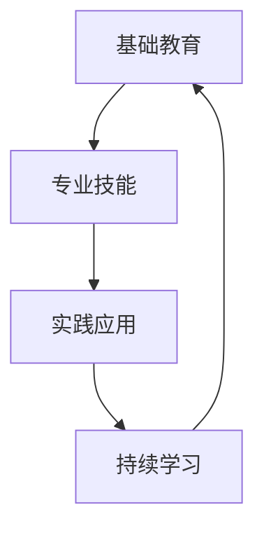

                 

### 文章标题

# 体验的真实性：AI时代的authenticity追求

### 关键词：

- **人工智能（AI）**
- **体验真实性（Authenticity of Experience）**
- **机器学习（Machine Learning）**
- **深度学习（Deep Learning）**
- **自然语言处理（Natural Language Processing）**
- **图像识别（Image Recognition）**

### 摘要：

随着人工智能技术的迅猛发展，体验的真实性成为了一个日益重要的话题。本文将探讨AI时代体验真实性的概念、重要性、挑战以及应用案例。通过对机器学习、深度学习、自然语言处理和图像识别等技术的深入分析，我们揭示了AI技术在实现真实性方面的原理和挑战。此外，本文还探讨了真实性在消费者体验、企业运营以及未来发展中的应用和影响。通过本文的阅读，读者将深入了解AI时代体验真实性的本质，为未来人工智能技术的研发和应用提供有价值的思考。

### 第一部分：体验的真实性概述

在数字化和人工智能时代，体验的真实性成为了一个至关重要的议题。然而，究竟什么是体验的真实性？它的重要性又体现在哪些方面？本文将从定义、构成要素、重要性以及AI时代体验真实性的挑战等多个方面，对体验的真实性进行全面的探讨。

#### 第1章：体验真实性的定义与重要性

##### 1.1 体验真实性的定义

**1.1.1 体验真实性的概念**

体验的真实性是指个体在某种情境中感受到的、与外界事物相符的、真实可信的体验。它不仅涉及感官上的真实感，还包括情感、认知和心理层面的真实体验。体验的真实性是一种主观感受，它依赖于个体对现实世界的理解和认知。

**1.1.2 体验真实性的构成要素**

体验真实性的构成要素可以从以下几个方面来理解：

1. **感知真实感**：个体在感知过程中，能否感受到外界事物与自身期望相符的真实感。
2. **情感真实性**：个体在情感体验中，能否感受到真实的情感波动，如喜悦、悲伤、愤怒等。
3. **认知真实性**：个体在认知过程中，能否对现实世界的事物进行准确的理解和判断。
4. **心理真实性**：个体在心理层面，能否感受到与外界事物相匹配的心理状态。

**1.1.3 体验真实性的重要性**

体验的真实性在人类社会中具有重要的作用。首先，真实的体验能够提高个体的幸福感和满意度，从而促进个体的身心健康。其次，真实的体验能够增强个体对现实世界的信任感，促进社会交往和合作。此外，在商业、教育、娱乐等领域，真实的体验也能够提升服务质量，增强用户粘性，提高市场竞争力。

##### 1.2 AI时代体验真实性的挑战

**1.2.1 人工智能与真实性的关联**

随着人工智能技术的不断发展，虚拟现实、增强现实、个性化推荐等应用场景不断涌现，这些技术对体验的真实性提出了新的挑战。人工智能技术通过模拟和生成各种情境，为个体提供丰富的体验，但同时也可能导致体验与现实脱节，影响体验的真实性。

**1.2.2 人工智能对体验真实性的影响**

1. **感知真实感**：人工智能技术可以通过图像、声音、触觉等多模态信息输入，增强个体的感知真实感。然而，过度的虚拟化可能导致个体对真实世界的感知能力下降。
2. **情感真实性**：人工智能可以通过情感识别、情感生成等技术，模拟和增强个体的情感体验。然而，人工智能生成的情感可能缺乏深度和复杂性，影响情感的真实性。
3. **认知真实性**：人工智能可以通过知识图谱、推理引擎等技术，提供准确的信息和判断。然而，人工智能的知识和信息来源可能存在偏差，影响认知的真实性。
4. **心理真实性**：人工智能可以通过心理治疗、虚拟陪伴等技术，帮助个体缓解心理压力。然而，人工智能的心理干预可能缺乏针对性和个性化，影响心理的真实性。

##### 1.3 体验真实性的研究现状

**1.3.1 现有研究综述**

目前，关于体验真实性的研究主要集中在以下几个方面：

1. **心理学研究**：心理学家主要关注个体在真实体验和虚拟体验中的情感、认知和心理反应。
2. **计算机科学研究**：计算机科学家主要关注如何通过人工智能技术增强体验的真实性，以及如何评估和度量体验的真实性。
3. **跨学科研究**：跨学科研究将心理学、计算机科学、社会学等多个领域的知识融合，共同探讨体验真实性的本质和影响因素。

**1.3.2 研究趋势与未来方向**

随着人工智能技术的不断发展，体验真实性的研究趋势将呈现以下几个方向：

1. **多模态体验真实性**：未来研究将关注如何通过多模态信息输入，提高体验的真实性。
2. **个性化体验真实性**：未来研究将关注如何根据个体差异，提供个性化的体验真实性评估和增强方法。
3. **跨领域合作**：未来研究将加强心理学、计算机科学、社会学等多个领域的跨学科合作，共同推动体验真实性的研究。

#### 第2章：AI技术的核心原理

AI技术的核心原理包括机器学习、深度学习、自然语言处理和图像识别等领域。这些技术不仅为人工智能的应用提供了基础，也直接影响着体验的真实性。在本章中，我们将深入探讨这些技术的原理和应用。

##### 2.1 AI技术概述

**2.1.1 AI技术的基本概念**

人工智能（Artificial Intelligence，简称AI）是指通过计算机程序和算法，模拟人类智能行为的技术。它涵盖了机器学习、深度学习、自然语言处理、计算机视觉等多个领域。

**2.1.2 AI技术的发展历程**

人工智能的发展历程可以分为以下几个阶段：

1. **第一阶段（1940s-1950s）**：人工智能的概念首次被提出，主要以符号推理和知识表示为基础。
2. **第二阶段（1960s-1970s）**：人工智能开始关注机器学习，特别是统计方法和决策树等算法的应用。
3. **第三阶段（1980s-1990s）**：人工智能开始引入神经网络和深度学习技术，使机器学习取得了重要突破。
4. **第四阶段（2000s至今）**：随着计算机性能的提升和大数据的普及，人工智能迎来了新一轮的发展，特别是在自然语言处理和计算机视觉领域。

##### 2.2 机器学习与深度学习

**2.2.1 机器学习的基本原理**

机器学习（Machine Learning，简称ML）是人工智能的一个重要分支，主要研究如何从数据中自动学习规律和模式。机器学习的基本原理包括以下几个方面：

1. **数据收集**：收集大量的数据作为训练集。
2. **特征提取**：从数据中提取有用的特征，用于构建模型。
3. **模型训练**：使用训练集数据，通过优化算法训练模型。
4. **模型评估**：使用测试集数据，评估模型的性能和准确性。
5. **模型应用**：将训练好的模型应用于实际问题，如分类、回归、聚类等。

**2.2.2 深度学习的核心架构**

深度学习（Deep Learning，简称DL）是机器学习的一个重要分支，主要研究如何通过多层神经网络，从大量数据中自动学习复杂的特征表示。深度学习的核心架构包括以下几个方面：

1. **神经网络**：神经网络是由多个神经元组成的计算模型，可以模拟生物神经系统的工作方式。
2. **多层网络**：多层网络包括输入层、隐藏层和输出层，每个层都能够对输入数据进行处理和变换。
3. **激活函数**：激活函数用于引入非线性变换，使神经网络能够学习复杂的函数。
4. **反向传播**：反向传播算法用于计算网络参数的梯度，从而优化网络性能。

##### 2.3 自然语言处理与图像识别

**2.3.1 自然语言处理技术**

自然语言处理（Natural Language Processing，简称NLP）是人工智能的一个重要分支，主要研究如何使计算机理解和处理人类语言。NLP技术包括以下几个方面：

1. **语言模型**：语言模型用于预测下一个单词或句子，是自然语言处理的基础。
2. **词向量**：词向量是表示单词和句子的一种向量形式，可以用于文本分类、情感分析等任务。
3. **句法分析**：句法分析用于解析句子的结构，提取句法信息，如词性、短语结构等。
4. **语义分析**：语义分析用于理解句子的语义含义，如情感分析、实体识别等。

**2.3.2 图像识别技术**

图像识别（Image Recognition）是计算机视觉（Computer Vision）的一个重要分支，主要研究如何使计算机理解和识别图像中的物体和场景。图像识别技术包括以下几个方面：

1. **特征提取**：从图像中提取有用的特征，用于表示图像内容。
2. **分类模型**：使用分类算法，将图像划分为不同的类别。
3. **目标检测**：定位图像中的目标物体，并识别其类别。
4. **图像分割**：将图像划分为不同的区域，用于识别和定位物体。

##### 2.4 人工智能的真实性度量

**2.4.1 真实性度量方法**

人工智能的真实性度量是指评估和衡量人工智能系统产生的结果或输出的真实性。真实性度量方法包括以下几个方面：

1. **数据真实性度量**：评估训练数据的质量和完整性，确保训练数据的真实性。
2. **算法真实性度量**：评估算法的透明性和解释性，确保算法输出的真实性。
3. **模型真实性度量**：评估模型的性能和可靠性，确保模型输出的真实性。

**2.4.2 真实性保障机制**

为了保障人工智能的真实性，需要建立一系列的真实性保障机制，包括以下几个方面：

1. **数据真实性保障**：确保训练数据的质量和完整性，如去除噪声数据、填充缺失数据等。
2. **算法透明性与解释性**：提高算法的透明性和解释性，使算法的决策过程更加透明，易于理解和验证。
3. **模型评估与监控**：定期评估和监控模型的性能和可靠性，如进行模型对比测试、异常值检测等。

##### 2.5 真实性在AI应用中的体现

**2.5.1 商业应用中的真实性考量**

在商业应用中，体验的真实性至关重要。商业应用包括电子商务、社交媒体、在线教育等领域，这些领域都需要确保用户能够获得真实、可信的体验。以下是一些商业应用中的真实性考量：

1. **电子商务**：电子商务平台需要确保商品信息的真实性，如商品图片、价格、评价等，以增强用户信任。
2. **社交媒体**：社交媒体平台需要确保用户发布的内容真实可信，如进行内容审核、打击虚假信息等。
3. **在线教育**：在线教育平台需要确保课程内容和教师资质的真实性，以提高用户满意度。

**2.5.2 社交媒体与虚拟现实中的真实性挑战**

社交媒体和虚拟现实领域面临着巨大的真实性挑战。以下是一些具体挑战：

1. **社交媒体**：社交媒体上的虚假信息、欺诈行为、网络暴力等问题严重影响了用户体验的真实性。
2. **虚拟现实**：虚拟现实中的高度虚拟化可能导致用户体验与现实脱节，影响用户体验的真实性。

#### 第二部分：AI时代的真实性原理

在AI时代，真实性成为了一个核心问题。本部分将深入探讨AI时代的真实性原理，包括人工智能技术的核心原理、真实性度量方法和保障机制，以及真实性在AI应用中的具体体现。

##### 第2章：AI技术的核心原理

AI技术的核心原理包括机器学习、深度学习、自然语言处理和图像识别等领域。这些技术不仅为人工智能的应用提供了基础，也直接影响着体验的真实性。

###### 2.1 AI技术概述

**2.1.1 AI技术的基本概念**

人工智能（Artificial Intelligence，简称AI）是指通过计算机程序和算法，模拟人类智能行为的技术。它涵盖了机器学习、深度学习、自然语言处理、计算机视觉等多个领域。

**2.1.2 AI技术的发展历程**

人工智能的发展历程可以分为以下几个阶段：

1. **第一阶段（1940s-1950s）**：人工智能的概念首次被提出，主要以符号推理和知识表示为基础。
2. **第二阶段（1960s-1970s）**：人工智能开始关注机器学习，特别是统计方法和决策树等算法的应用。
3. **第三阶段（1980s-1990s）**：人工智能开始引入神经网络和深度学习技术，使机器学习取得了重要突破。
4. **第四阶段（2000s至今）**：随着计算机性能的提升和大数据的普及，人工智能迎来了新一轮的发展，特别是在自然语言处理和计算机视觉领域。

###### 2.2 机器学习与深度学习

**2.2.1 机器学习的基本原理**

机器学习（Machine Learning，简称ML）是人工智能的一个重要分支，主要研究如何从数据中自动学习规律和模式。机器学习的基本原理包括以下几个方面：

1. **数据收集**：收集大量的数据作为训练集。
2. **特征提取**：从数据中提取有用的特征，用于构建模型。
3. **模型训练**：使用训练集数据，通过优化算法训练模型。
4. **模型评估**：使用测试集数据，评估模型的性能和准确性。
5. **模型应用**：将训练好的模型应用于实际问题，如分类、回归、聚类等。

**2.2.2 深度学习的核心架构**

深度学习（Deep Learning，简称DL）是机器学习的一个重要分支，主要研究如何通过多层神经网络，从大量数据中自动学习复杂的特征表示。深度学习的核心架构包括以下几个方面：

1. **神经网络**：神经网络是由多个神经元组成的计算模型，可以模拟生物神经系统的工作方式。
2. **多层网络**：多层网络包括输入层、隐藏层和输出层，每个层都能够对输入数据进行处理和变换。
3. **激活函数**：激活函数用于引入非线性变换，使神经网络能够学习复杂的函数。
4. **反向传播**：反向传播算法用于计算网络参数的梯度，从而优化网络性能。

###### 2.3 自然语言处理与图像识别

**2.3.1 自然语言处理技术**

自然语言处理（Natural Language Processing，简称NLP）是人工智能的一个重要分支，主要研究如何使计算机理解和处理人类语言。NLP技术包括以下几个方面：

1. **语言模型**：语言模型用于预测下一个单词或句子，是自然语言处理的基础。
2. **词向量**：词向量是表示单词和句子的一种向量形式，可以用于文本分类、情感分析等任务。
3. **句法分析**：句法分析用于解析句子的结构，提取句法信息，如词性、短语结构等。
4. **语义分析**：语义分析用于理解句子的语义含义，如情感分析、实体识别等。

**2.3.2 图像识别技术**

图像识别（Image Recognition）是计算机视觉（Computer Vision）的一个重要分支，主要研究如何使计算机理解和识别图像中的物体和场景。图像识别技术包括以下几个方面：

1. **特征提取**：从图像中提取有用的特征，用于表示图像内容。
2. **分类模型**：使用分类算法，将图像划分为不同的类别。
3. **目标检测**：定位图像中的目标物体，并识别其类别。
4. **图像分割**：将图像划分为不同的区域，用于识别和定位物体。

###### 2.4 人工智能的真实性度量

**2.4.1 真实性度量方法**

人工智能的真实性度量是指评估和衡量人工智能系统产生的结果或输出的真实性。真实性度量方法包括以下几个方面：

1. **数据真实性度量**：评估训练数据的质量和完整性，确保训练数据的真实性。
2. **算法真实性度量**：评估算法的透明性和解释性，确保算法输出的真实性。
3. **模型真实性度量**：评估模型的性能和可靠性，确保模型输出的真实性。

**2.4.2 真实性保障机制**

为了保障人工智能的真实性，需要建立一系列的真实性保障机制，包括以下几个方面：

1. **数据真实性保障**：确保训练数据的质量和完整性，如去除噪声数据、填充缺失数据等。
2. **算法透明性与解释性**：提高算法的透明性和解释性，使算法的决策过程更加透明，易于理解和验证。
3. **模型评估与监控**：定期评估和监控模型的性能和可靠性，如进行模型对比测试、异常值检测等。

###### 2.5 真实性在AI应用中的体现

**2.5.1 商业应用中的真实性考量**

在商业应用中，体验的真实性至关重要。商业应用包括电子商务、社交媒体、在线教育等领域，这些领域都需要确保用户能够获得真实、可信的体验。以下是一些商业应用中的真实性考量：

1. **电子商务**：电子商务平台需要确保商品信息的真实性，如商品图片、价格、评价等，以增强用户信任。
2. **社交媒体**：社交媒体平台需要确保用户发布的内容真实可信，如进行内容审核、打击虚假信息等。
3. **在线教育**：在线教育平台需要确保课程内容和教师资质的真实性，以提高用户满意度。

**2.5.2 社交媒体与虚拟现实中的真实性挑战**

社交媒体和虚拟现实领域面临着巨大的真实性挑战。以下是一些具体挑战：

1. **社交媒体**：社交媒体上的虚假信息、欺诈行为、网络暴力等问题严重影响了用户体验的真实性。
2. **虚拟现实**：虚拟现实中的高度虚拟化可能导致用户体验与现实脱节，影响用户体验的真实性。

#### 第三部分：AI时代的真实性应用案例

在前两部分的讨论中，我们已经深入探讨了体验的真实性在AI时代的定义、重要性、挑战以及核心原理。在本部分，我们将通过具体的案例来展示AI时代真实性在各个领域的实际应用。这些案例不仅体现了真实性的核心概念，还揭示了AI技术如何改变我们的生活和工作方式。

##### 第4章：真实性在消费者体验中的应用

消费者体验是AI时代最具代表性的应用场景之一。真实性在消费者体验中起着至关重要的作用，它直接影响到用户的满意度、忠诚度和品牌忠诚度。以下是真实性在消费者体验中的几个关键应用案例。

###### 4.1 消费者体验的真实性需求

消费者体验的真实性需求主要包括以下几个方面：

1. **可信的信息**：消费者希望获得真实、准确的产品信息，包括价格、规格、评价等。
2. **真实的反馈**：消费者希望通过真实的用户评价来指导自己的购买决策。
3. **个性化的服务**：消费者希望获得个性化的产品推荐和服务，这些服务应该基于真实的数据和算法。
4. **真实的安全感**：消费者在使用电子商务平台和在线支付系统时，需要感受到真实的安全保障。

###### 4.2 真实性在电子商务中的应用

电子商务平台是AI技术应用最广泛的领域之一。以下是一些电子商务中真实性应用的案例：

**4.2.1 个性化推荐的实践与挑战**

电子商务平台通过机器学习和深度学习技术，为用户提供个性化的商品推荐。这种个性化推荐不仅提高了用户的购买意愿，还能增强用户对平台的信任感。

**Mermaid流程图：个性化推荐的基本原理**

然而，个性化推荐也存在一定的挑战，如用户数据的真实性和推荐算法的透明性。为了保障推荐的真实性，平台需要：

- **数据真实性保障**：确保用户行为数据的真实性和完整性，去除虚假数据和异常值。
- **算法透明性**：提高推荐算法的透明性，使用户能够理解推荐结果背后的逻辑。

**4.2.2 商品评价与真实性的关系**

商品评价是电子商务中真实性体现的另一个重要方面。真实的用户评价可以帮助其他消费者做出更明智的购买决策，提高整体的消费体验。

**Mermaid流程图：商品评价的评估过程**

然而，商品评价也可能受到虚假评论、水军和恶意攻击的影响。为了保障商品评价的真实性，电子商务平台可以：

- **评价审核机制**：建立严格的评价审核机制，过滤虚假和恶意评论。
- **用户反馈系统**：鼓励用户提供真实的评价，并对虚假评价进行举报和惩罚。

###### 4.3 真实性在社交媒体中的应用

社交媒体是另一个对真实性有强烈需求的领域。以下是一些社交媒体中真实性应用的案例：

**4.3.1 社交媒体的内容真实性**

社交媒体平台上的内容真实性是用户体验的核心。虚假信息、谣言和欺诈行为不仅损害用户的利益，还可能对社会造成严重的影响。

**Mermaid流程图：内容真实性的保障机制**

为了保障社交媒体的内容真实性，平台可以：

- **内容审核机制**：建立高效的内容审核机制，及时发现和处理虚假信息。
- **用户监督机制**：鼓励用户举报虚假信息，建立用户监督机制。

**4.3.2 真实性在社交互动中的作用**

社交互动是社交媒体的核心功能之一。真实性的社交互动能够增强用户之间的信任和互动，提高社交体验的质量。

**Mermaid流程图：社交互动的真实性保障**

为了保障社交互动的真实性，平台可以：

- **情感分析技术**：利用情感分析技术，识别和过滤虚假互动行为。
- **互动推荐机制**：基于真实的数据和算法，为用户提供高质量的互动推荐。

##### 第5章：真实性在企业运营中的应用

真实性的应用不仅限于消费者体验，它在企业运营中也起着至关重要的作用。真实性能够帮助企业提高效率、降低风险，并建立良好的企业形象。以下是真实性在企业运营中的应用案例。

###### 5.1 企业运营的真实性考量

企业运营的真实性考量主要包括以下几个方面：

1. **数据真实性**：确保企业内部数据的质量和准确性，这对于企业的决策和运营至关重要。
2. **信息透明性**：提高企业内部和外部信息的透明性，增强信任和合作。
3. **业务真实性**：确保企业的业务流程和操作符合实际，避免虚假和欺诈行为。
4. **员工诚信**：保障员工诚信，防止内部欺诈和腐败行为。

###### 5.2 人工智能辅助决策

人工智能技术在企业决策中发挥着越来越重要的作用。真实性的保障对于人工智能辅助决策至关重要。

**5.2.1 人工智能在决策中的作用**

人工智能可以通过数据分析和预测模型，为企业提供以下决策支持：

1. **市场预测**：通过分析市场数据，预测未来市场趋势和需求。
2. **风险评估**：评估企业的潜在风险，并提供风险管理建议。
3. **优化运营**：优化供应链、生产流程和库存管理，提高运营效率。

**Mermaid流程图：人工智能辅助决策的基本原理**

为了保障人工智能辅助决策的真实性，企业可以：

- **数据真实性保障**：确保数据收集和处理过程的真实性和准确性。
- **模型透明性**：提高模型的透明性，使决策过程易于理解和验证。

**5.2.2 真实性保障与决策质量**

真实性的保障直接影响到决策的质量。以下是一些关键因素：

1. **数据质量**：高质量的数据是准确决策的基础。企业需要确保数据来源的真实性和完整性。
2. **模型解释性**：解释性强的模型能够提高决策的可信度。企业需要选择易于解释的模型，并提高模型的透明性。
3. **反馈机制**：建立有效的反馈机制，及时调整和优化决策模型。

**5.3 真实性在客户服务中的应用**

客户服务是企业与客户之间的重要桥梁。真实性的应用能够提高客户满意度，增强客户忠诚度。

**5.3.1 客户服务的真实性需求**

客户服务的真实性需求主要包括以下几个方面：

1. **真实的信息**：提供准确的产品信息和服务描述，避免误导和虚假宣传。
2. **真实的回应**：及时回应客户的问题和需求，提供真实、专业的解决方案。
3. **真实的信任**：建立信任关系，让客户感受到企业的真诚和可靠性。

**5.3.2 人工智能在客户服务中的实践**

人工智能在客户服务中的应用越来越广泛。以下是一些具体的实践案例：

1. **智能客服系统**：利用自然语言处理和机器学习技术，提供24/7的智能客服服务，提高响应速度和服务质量。
2. **个性化服务**：通过分析客户行为数据，提供个性化的服务和建议，增强客户体验。
3. **自动化流程**：通过自动化技术，简化客户服务流程，减少人力成本，提高服务效率。

**Mermaid流程图：人工智能在客户服务中的应用**

为了保障客户服务的真实性，企业可以：

- **数据真实性保障**：确保客户数据的质量和准确性。
- **服务透明性**：提高服务过程的透明度，使客户能够清晰地了解服务内容。

##### 第6章：真实性的技术进步与伦理挑战

随着AI技术的不断进步，真实性的保障也在面临新的机遇和挑战。同时，真实性的发展也引发了诸多伦理问题，需要我们深入探讨。

###### 6.1 真实性的技术进步

**6.1.1 人工智能技术的最新发展**

人工智能技术在过去几年取得了显著的进步，特别是在深度学习、自然语言处理和计算机视觉等领域。以下是一些最新发展：

1. **深度学习模型的性能提升**：随着计算能力的提升和数据的丰富，深度学习模型的性能得到了显著提升。例如，图像识别和语音识别的准确率已经达到了前所未有的水平。
2. **多模态学习**：多模态学习是指将不同类型的数据（如文本、图像、音频等）进行融合和学习。这种技术为真实性保障提供了新的可能性，例如，通过结合文本和图像，提高信息识别的准确性。
3. **可解释性AI**：可解释性AI是近年来受到广泛关注的研究方向，旨在提高人工智能系统的透明性和可解释性。这对于保障AI技术的真实性具有重要意义。

**6.1.2 真实性技术的创新应用**

真实性技术在各个领域都有广泛的应用。以下是一些创新应用：

1. **区块链技术**：区块链技术可以用于确保数据的真实性和不可篡改性，这在电子商务、社交媒体等领域具有重要意义。
2. **联邦学习**：联邦学习是一种分布式学习技术，可以在不共享数据的情况下，联合多个参与者进行模型训练。这为数据隐私保护和真实性保障提供了新的解决方案。
3. **人工智能伦理审查**：人工智能伦理审查是指对人工智能系统进行道德评估，确保其在实际应用中的真实性和公平性。这已经成为AI技术开发和应用过程中不可或缺的一环。

###### 6.2 真实性的伦理问题

**6.2.1 真实性在伦理学中的定位**

真实性的伦理问题涉及到多个方面，包括隐私、公平性、责任等。以下是几个关键方面：

1. **隐私**：人工智能系统在处理和分析大量数据时，可能会侵犯用户的隐私。真实性保障需要确保用户数据的隐私和安全。
2. **公平性**：人工智能系统可能会因为数据偏差、算法缺陷等原因，导致不公平的结果。真实性保障需要确保人工智能系统的公平性和透明性。
3. **责任**：在人工智能应用中，当出现错误或不良影响时，如何追究责任成为一个重要问题。真实性保障需要明确各方的责任，确保责任的明确和可追究。

**6.2.2 人工智能伦理与真实性**

人工智能伦理与真实性密切相关。以下是一些具体问题：

1. **透明性**：人工智能系统的决策过程需要透明，使人们能够理解其工作原理和结果。这是确保真实性的关键。
2. **可解释性**：人工智能系统的决策结果需要可解释，使人们能够理解其决策依据和逻辑。这有助于提高真实性和信任度。
3. **责任归属**：在人工智能应用中，当出现错误或不良影响时，需要明确责任归属。真实性保障需要建立清晰的责任体系，确保责任的明确和可追究。

**6.2.3 真实性的未来趋势**

随着人工智能技术的不断进步，真实性的保障也将面临新的挑战和机遇。以下是一些未来趋势：

1. **技术融合**：真实性技术将与其他领域（如区块链、联邦学习等）进行融合，提供更全面、更高效的解决方案。
2. **跨学科研究**：真实性保障需要跨学科的合作，结合心理学、伦理学、计算机科学等领域的知识，共同推动真实性的研究和发展。
3. **规范化**：随着真实性问题的日益突出，各国和地区可能会出台相关法规和标准，规范人工智能技术的真实性和伦理问题。

##### 第7章：真实性的人工智能未来展望

在AI技术的快速发展背景下，真实性的重要性日益凸显。未来，真实性将成为人工智能应用的核心要素之一，对人工智能的发展和社会进步产生深远影响。本部分将探讨真实性的未来趋势、人工智能在真实性保障中的角色以及真实性教育的重要性。

###### 7.1 真实性在AI时代的角色

在AI时代，真实性扮演着多重角色，影响着人工智能的应用和发展。以下是真实性在AI时代的主要角色：

1. **用户体验**：真实性直接影响用户体验的质量。在电子商务、社交媒体、虚拟现实等领域，真实的信息、真实的互动和真实的服务体验是用户满意度的重要保证。
2. **商业价值**：真实性是商业应用中不可或缺的因素。真实的数据、真实的评估和真实的预测能够提高企业的运营效率、降低风险，并创造更大的商业价值。
3. **社会信任**：真实性的保障有助于建立社会信任。在人工智能的应用中，真实性的保障能够减少误解和冲突，促进社会的和谐与进步。

**Mermaid流程图：真实性在AI时代的角色**

###### 7.2 真实性的技术进步展望

随着AI技术的不断进步，真实性的保障也将面临新的机遇和挑战。以下是真实性技术进步的几个展望：

1. **多模态真实性**：未来的真实性技术将能够处理和分析多种类型的数据（如文本、图像、音频等），提供更全面、更精确的真实性评估。
2. **隐私保护**：在保护用户隐私的同时，实现真实性的保障是一个重要的挑战。未来的真实性技术将更加注重隐私保护，例如，通过联邦学习和差分隐私等手段，实现真实性和隐私的双重保障。
3. **自动化真实性评估**：随着人工智能技术的发展，自动化真实性评估将成为可能。通过机器学习和深度学习等技术，可以自动检测和评估信息、内容和系统的真实性。

**Mermaid流程图：自动化真实性评估的基本原理**

###### 7.3 真实性教育的未来展望

随着人工智能技术的普及，真实性教育将成为未来教育的重要组成部分。以下是真实性教育的几个未来展望：

1. **跨学科教育**：真实性教育需要结合心理学、伦理学、计算机科学等多个领域的知识。未来的真实性教育将更加注重跨学科的教育模式，培养具有综合素养的专业人才。
2. **实践性教育**：真实性教育需要通过实践案例和项目来培养学生的实际能力。未来的真实性教育将更加注重实践性教育，通过模拟和实际项目，让学生掌握真实性的评估和保障方法。
3. **全民教育**：随着人工智能技术的广泛应用，真实性教育将不再局限于专业领域，而是成为全民教育的一部分。未来的真实性教育将更加注重普及性教育，提高公众对真实性的认识和意识。

**Mermaid流程图：全民真实性教育的框架**

#### 附录

在本附录中，我们将提供一些有用的资源和工具，以帮助读者更深入地了解和探索体验真实性的相关研究和应用。

##### 附录A：真实性研究工具与资源

**A.1 真实性度量工具**

以下是几种常用的真实性度量工具：

1. **TruthTrack**：TruthTrack是一个开源的在线平台，用于评估和比较不同文本生成模型的真实性。它支持多种度量方法，如一致性、连贯性和可信度评估。
2. **Fake News Challenge**：Fake News Challenge是一个数据集和评估框架，用于评估文本生成模型在生成真实和虚假新闻方面的性能。它提供了一个公开的评价标准，供研究人员和开发者使用。
3. **Reddit TruthGhz**：Reddit TruthGhz是一个基于Reddit评论的真实性数据集，包含数百万条评论，可用于训练和评估真实性度量模型。

**A.2 真实性研究资源**

以下是几个有用的真实性研究资源：

1. **IEEE Transactions on Sustainable Computing**：IEEE Transactions on Sustainable Computing是一本专注于可持续计算和真实性的学术期刊，发布与人工智能、隐私保护、数据真实性等相关的最新研究成果。
2. **ACM Conference on Computer and Communications Security**：ACM Conference on Computer and Communications Security（CCS）是一个著名的计算机安全会议，涵盖了真实性、隐私保护和网络安全等主题。
3. **NeurIPS Workshop on Rethinking Representation for Text Understanding**：NeurIPS Workshop on Rethinking Representation for Text Understanding是一个专注于文本理解和真实性研究的研讨会，吸引了来自全球的学者和研究人员。

**A.3 真实性研究开源代码与数据集**

以下是几个有用的开源代码和数据集：

1. **BERT-FakeNews**：BERT-FakeNews是一个基于BERT的文本生成模型，用于生成真实和虚假新闻。它提供了一个开源的代码库，包括训练脚本和评估工具。
2. **GPT-FakeNews**：GPT-FakeNews是一个基于GPT的文本生成模型，用于生成真实和虚假新闻。它提供了一个开源的代码库，包括训练脚本和评估工具。
3. **SNLI**：SNLI（Stanford Natural Language Inference）是一个自然语言推断数据集，包含约10万条句子对，用于评估文本生成模型的真实性。

#### 结论

随着人工智能技术的不断进步，体验的真实性成为了一个日益重要的议题。本文从定义、重要性、挑战、核心原理、应用案例、技术进步以及伦理问题等多个角度，全面探讨了体验的真实性。通过对机器学习、深度学习、自然语言处理和图像识别等技术的深入分析，我们揭示了AI技术在实现真实性方面的原理和挑战。此外，本文还探讨了真实性在消费者体验、企业运营以及未来发展中的应用和影响。

未来，真实性的保障将继续是人工智能领域的重要研究方向。通过跨学科的合作、技术创新和伦理审查，我们将能够更好地应对真实性的挑战，为人类社会创造更真实、更美好的未来。

### 作者信息

- 作者：AI天才研究院/AI Genius Institute & 禅与计算机程序设计艺术 /Zen And The Art of Computer Programming

