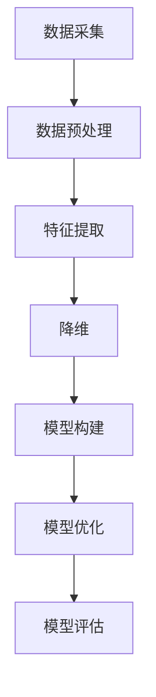

                 

### 《体验量化革命：AI驱动的生活质量评估》

关键词：生活质量评估、AI技术、深度学习、自然语言处理、大数据分析、项目实战

摘要：本文深入探讨了体验量化革命，特别是AI技术在生活质量评估中的应用。通过详细的分析和案例研究，本文揭示了AI如何通过量化体验数据，提高生活质量评估的准确性和实用性。本文旨在为研究人员和从业者提供一个全面的技术指南，帮助他们理解和应用AI技术，推动生活质量评估的发展。

---

### 第一部分：引言

#### 第1章：体验量化革命概述

##### 1.1 体验量化革命的背景

##### 1.1.1 全球化和信息技术的发展

随着全球化的推进，各国之间的联系日益紧密，人们的生活质量得到了显著提高。然而，如何准确评估生活质量，成为政策制定者和研究者面临的重要课题。信息技术的发展，尤其是人工智能（AI）技术的兴起，为解决这一问题提供了新的思路和方法。

##### 1.1.2 人工智能的兴起

AI技术的飞速发展，为数据处理和分析提供了强大的工具。从机器学习到深度学习，从自然语言处理到计算机视觉，AI技术在各个领域都取得了显著的成果。体验量化革命正是利用AI技术，对生活质量进行量化评估的重要体现。

##### 1.1.3 体验量化的重要性

体验量化不仅有助于更好地了解人们的生活质量，还可以为政策制定提供有力支持。通过分析体验数据，政府和企业可以更精准地制定改善措施，提高居民的生活质量。

##### 1.2 本书的内容和结构

本书将分为五个部分，第一部分引言，介绍体验量化革命的背景和重要性。第二部分核心概念与联系，阐述AI技术、数据采集与预处理、特征提取与降维、AI算法与模型选择等核心概念。第三部分核心算法原理讲解，深入探讨深度学习、自然语言处理、大数据分析等算法原理。第四部分项目实战，通过实际案例展示AI技术在生活质量评估中的应用。第五部分总结与展望，对全书内容进行总结，并展望未来发展趋势。

---

### 第二部分：AI驱动的体验量化技术

#### 第2章：AI与生活质量评估

##### 2.1 AI技术的发展与应用

##### 2.1.1 机器学习

机器学习是AI技术的基础，通过训练模型来识别数据中的模式和关系。在生活质量评估中，机器学习技术可以用于数据分类、预测和聚类等任务。

##### 2.1.2 深度学习

深度学习是机器学习的一个分支，通过多层神经网络进行数据建模。深度学习在图像识别、语音识别和自然语言处理等领域取得了显著成果，也为生活质量评估提供了强大的工具。

##### 2.1.3 自然语言处理

自然语言处理（NLP）是AI技术在语言领域中的应用，通过算法使计算机能够理解和处理自然语言。NLP技术在情感分析、文本分类和命名实体识别等方面有着广泛应用，为生活质量评估提供了有效的数据来源。

##### 2.1.4 大数据分析

大数据分析技术可以处理海量数据，从中挖掘有价值的信息。在生活质量评估中，大数据分析可以帮助研究者识别趋势、发现问题和提出解决方案。

##### 2.2 生活质量评估的概念

##### 2.2.1 生活质量

生活质量是指人们在其生活环境中，根据自身的标准和期望，所感受到的生活满意度和幸福感。生活质量评估是对生活质量进行量化和评价的过程。

##### 2.2.2 生活质量评估的方法

生活质量评估通常采用问卷调查、主观评价和客观数据分析等方法。其中，问卷调查是最常用的方法，可以通过收集人们对生活各方面的满意度来评估生活质量。

##### 2.3 AI在生活质量评估中的应用

##### 2.3.1 数据采集

AI技术可以帮助研究者收集更多更全面的数据。例如，通过传感器技术收集环境数据，通过社交媒体收集用户行为数据等。

##### 2.3.2 数据分析

AI技术可以对收集到的数据进行高效的分析，从中提取有价值的信息。例如，通过机器学习算法对问卷数据进行分类和分析，通过自然语言处理技术对文本数据进行情感分析等。

##### 2.3.3 模型构建

AI技术可以帮助研究者构建更准确的模型，对生活质量进行预测和评估。例如，通过深度学习算法构建预测模型，通过回归分析构建评估模型等。

##### 2.3.4 模型优化

AI技术可以帮助研究者优化模型，提高生活质量评估的准确性。例如，通过交叉验证优化模型参数，通过集成学习提高模型性能等。

---

### 第三部分：核心概念与联系

#### 第3章：AI驱动的体验量化技术

##### 3.1 数据采集与预处理

##### 3.1.1 数据来源

数据采集是生活质量评估的重要步骤，数据来源包括问卷调查、传感器数据、社交媒体数据等。

##### 3.1.2 数据预处理

数据预处理包括数据清洗、数据归一化和数据整合。数据清洗是去除噪声和异常值，数据归一化是调整数据范围，数据整合是将不同来源的数据进行合并。

##### 3.2 特征提取与降维

##### 3.2.1 特征提取

特征提取是从原始数据中提取出对生活质量评估有用的信息。特征提取可以通过统计方法、机器学习方法等实现。

##### 3.2.2 降维

降维是减少数据维度，提高数据处理效率。降维可以通过主成分分析（PCA）、t-SNE等方法实现。

##### 3.3 AI算法与模型选择

##### 3.3.1 算法选择

AI算法包括监督学习、无监督学习和强化学习。根据生活质量评估的需求，选择合适的算法。

##### 3.3.2 模型选择

模型选择是构建生活质量评估模型的关键步骤。常见的模型包括线性回归、决策树、支持向量机、神经网络等。

##### 3.4 模型构建与优化

##### 3.4.1 模型构建

模型构建是通过算法对数据进行训练，构建出对生活质量评估的模型。

##### 3.4.2 模型优化

模型优化是通过调整模型参数，提高模型性能。模型优化可以通过交叉验证、网格搜索等方法实现。

##### 3.5 Mermaid流程图：体验量化技术架构



---

### 第四部分：核心算法原理讲解

#### 第4章：深度学习基础

##### 4.1 深度学习的基本概念

##### 4.1.1 神经网络

神经网络是深度学习的基础，由多个神经元组成，每个神经元都与其他神经元相连。

##### 4.1.2 前向传播与反向传播

前向传播是数据从输入层传递到输出层的过程，反向传播是计算误差并更新权重的过程。

##### 4.2 神经网络模型

##### 4.2.1 卷积神经网络（CNN）

CNN是用于图像识别和处理的一种神经网络模型，通过卷积层提取图像特征。

##### 4.2.2 循环神经网络（RNN）

RNN是用于序列数据处理的神经网络模型，通过循环结构处理时间序列数据。

##### 4.2.3 长短期记忆网络（LSTM）

LSTM是RNN的一种改进，能够更好地处理长序列数据。

##### 4.3 深度学习优化算法

##### 4.3.1 随机梯度下降（SGD）

SGD是深度学习中最常用的优化算法，通过随机梯度更新模型参数。

```python
for epoch in range(num_epochs):
    for sample in data_loader:
        loss = loss_function(sample, model(sample))
        optimizer.zero_grad()
        loss.backward()
        optimizer.step()
```

##### 4.3.2 Adam优化器

Adam是SGD的改进，通过自适应学习率来优化模型参数。

```python
optimizer = optim.Adam(model.parameters(), lr=0.001)
```

---

#### 第5章：自然语言处理技术

##### 5.1 词嵌入技术

##### 5.1.1 词嵌入的概念

词嵌入是将单词映射到高维向量空间中的技术，以实现语义理解和处理。

##### 5.1.2 常见的词嵌入模型

常见的词嵌入模型包括Word2Vec、GloVe等。

```python
from gensim.models import Word2Vec

model = Word2Vec(sentences, size=100, window=5, min_count=1, workers=4)
```

##### 5.2 序列模型与注意力机制

##### 5.2.1 序列模型

序列模型是用于处理序列数据的一种神经网络模型，如RNN、LSTM等。

```python
import tensorflow as tf

model = tf.keras.Sequential([
    tf.keras.layers.Embedding(input_dim=vocab_size, output_dim=embedding_dim),
    tf.keras.layers.LSTM(units=128),
    tf.keras.layers.Dense(units=1, activation='sigmoid')
])
```

##### 5.2.2 注意力机制

注意力机制是用于序列模型的一种机制，通过权重分配来关注重要的信息。

```python
import tensorflow as tf

attention = tf.keras.layers.Attention()
output = attention([query, value], return_attention_scores=True)
```

##### 5.3 转换器架构详解

##### 5.3.1 转换器架构的概念

转换器架构（Transformer）是一种基于注意力机制的深度学习模型，用于处理序列到序列的任务。

```python
from tensorflow.keras.layers import Embedding, MultiHeadAttention, Dense

transformer = tf.keras.Sequential([
    Embedding(input_dim=vocab_size, output_dim=embedding_dim),
    MultiHeadAttention(num_heads=8, key_dim=64),
    Dense(units=1, activation='sigmoid')
])
```

---

#### 第6章：大数据分析与可视化

##### 6.1 大数据分析技术

##### 6.1.1 数据采集

数据采集是大数据分析的第一步，包括从各种来源收集数据，如数据库、文件系统、Web等。

##### 6.1.2 数据存储

数据存储是将采集到的数据存储到合适的存储系统中，如Hadoop、Spark等。

##### 6.1.3 数据处理

数据处理是对数据进行清洗、转换和整合，以准备用于分析。

```python
from pyspark.sql import SparkSession

spark = SparkSession.builder.appName("DataProcessing").getOrCreate()
data = spark.read.csv("data.csv", header=True)
data = data.filter(data["column"] > 0)
```

##### 6.2 可视化方法与应用

##### 6.2.1 可视化方法

可视化方法是将数据转换为图表和图形，以直观展示数据特征。

常用的可视化方法包括柱状图、折线图、散点图、热力图等。

```python
import matplotlib.pyplot as plt

plt.bar(x, y)
plt.xlabel('X-axis')
plt.ylabel('Y-axis')
plt.title('Bar Plot')
plt.show()
```

##### 6.2.2 可视化工具

常用的可视化工具有Python的Matplotlib、Seaborn，R语言的ggplot2等。

```python
import seaborn as sns

sns.scatterplot(x='x', y='y', data=data)
sns.regplot(x='x', y='y', data=data)
plt.show()
```

##### 6.3 数据分析流程与工具

##### 6.3.1 数据分析流程

数据分析流程包括数据采集、数据存储、数据处理、数据分析和数据可视化。

##### 6.3.2 数据分析工具

常用的数据分析工具包括Python的Pandas、NumPy，R语言的数据分析包等。

```python
import pandas as pd

data = pd.read_csv('data.csv')
data.describe()
data.plot(kind='line')
plt.show()
```

---

### 第五部分：数学模型与数学公式

#### 第7章：生活质量评估的数学模型

##### 7.1 生活质量评估指标计算方法

生活质量评估指标的计算方法包括主观评价法和客观数据分析法。

主观评价法是通过问卷调查等方式，收集人们对生活质量的评价。

客观数据分析法是通过客观数据（如环境数据、经济数据等），对生活质量进行量化评估。

##### 7.1.1 主观评价法的计算公式

$$
QOL = \sum_{i=1}^{n} w_i \cdot S_i
$$

其中，$QOL$为生活质量总分，$w_i$为第$i$个指标的权重，$S_i$为第$i$个指标的主观评分。

##### 7.1.2 客观数据分析法的计算公式

$$
QOL = \sum_{i=1}^{n} w_i \cdot O_i
$$

其中，$QOL$为生活质量总分，$w_i$为第$i$个指标的权重，$O_i$为第$i$个指标的客观评分。

##### 7.2 统计学原理与应用

统计学原理在生活质量评估中有着广泛的应用，包括描述性统计、推断性统计和假设检验等。

##### 7.2.1 描述性统计

描述性统计用于描述数据的基本特征，如均值、方差、标准差等。

$$
\mu = \frac{1}{n} \sum_{i=1}^{n} x_i
$$

$$
\sigma^2 = \frac{1}{n-1} \sum_{i=1}^{n} (x_i - \mu)^2
$$

##### 7.2.2 推断性统计

推断性统计用于从样本数据推断总体特征，如置信区间、假设检验等。

$$
CI = \bar{x} \pm z \cdot \frac{\sigma}{\sqrt{n}}
$$

$$
H_0: \mu = \mu_0 \quad H_1: \mu \neq \mu_0
$$

##### 7.2.3 假设检验

假设检验用于检验两个或多个样本之间的差异是否显著。

$$
z = \frac{\bar{x}_1 - \bar{x}_2}{\sqrt{\frac{\sigma_1^2}{n_1} + \frac{\sigma_2^2}{n_2}}}
$$

---

#### 第8章：数据分析中的数学公式

##### 8.1 统计分布函数

统计分布函数是描述数据分布的重要工具，包括正态分布、t分布、卡方分布等。

##### 8.1.1 正态分布

正态分布是统计学中最常见的分布，描述了大量数据的概率分布。

$$
f(x) = \frac{1}{\sqrt{2\pi\sigma^2}} e^{-\frac{(x-\mu)^2}{2\sigma^2}}
$$

##### 8.1.2 t分布

t分布是正态分布的特例，适用于小样本数据。

$$
f(x) = \frac{\Gamma(\frac{n+1}{2})}{\sqrt{\pi n} \Gamma(\frac{n}{2})} \left(1 + \frac{(x-\mu)^2}{n\sigma^2}\right)^{-\frac{n+1}{2}}
$$

##### 8.1.3 卡方分布

卡方分布用于描述数据的离散程度。

$$
f(x) = \frac{1}{2^k \Gamma(k/2)} x^{k/2-1} e^{-x/2}
$$

##### 8.2 最优化算法中的数学公式

最优化算法是解决优化问题的重要工具，包括梯度下降、牛顿法、拉格朗日乘数法等。

##### 8.2.1 梯度下降

梯度下降是一种迭代优化方法，用于寻找函数的极小值。

$$
x_{k+1} = x_k - \alpha \nabla f(x_k)
$$

##### 8.2.2 牛顿法

牛顿法是一种基于梯度和二阶导数的优化方法。

$$
x_{k+1} = x_k - H^{-1} \nabla f(x_k)
$$

其中，$H$为Hessian矩阵。

##### 8.2.3 拉格朗日乘数法

拉格朗日乘数法是一种用于求解约束优化问题的方法。

$$
L(x, \lambda) = f(x) + \lambda g(x)
$$

$$
\nabla L = 0
$$

---

### 第六部分：项目实战

#### 第9章：AI驱动的体验量化项目案例

##### 9.1 项目背景与目标

本项目旨在利用AI技术对某地区居民的生活质量进行评估，以支持政策制定和商业决策。

##### 9.2 开发环境搭建

本项目使用Python编程语言，基于TensorFlow框架进行深度学习模型的构建和训练。

```python
import tensorflow as tf
```

##### 9.3 代码实现与解析

```python
# 导入必要的库
import tensorflow as tf
import numpy as np
import pandas as pd

# 数据预处理
def preprocess_data(data):
    # 数据清洗、归一化等操作
    return processed_data

# 模型构建
def build_model(input_shape):
    model = tf.keras.Sequential([
        tf.keras.layers.Dense(units=128, activation='relu', input_shape=input_shape),
        tf.keras.layers.Dense(units=64, activation='relu'),
        tf.keras.layers.Dense(units=1, activation='sigmoid')
    ])
    return model

# 训练模型
def train_model(model, x_train, y_train, x_val, y_val):
    model.compile(optimizer='adam', loss='binary_crossentropy', metrics=['accuracy'])
    model.fit(x_train, y_train, epochs=10, batch_size=32, validation_data=(x_val, y_val))

# 评估模型
def evaluate_model(model, x_test, y_test):
    loss, accuracy = model.evaluate(x_test, y_test)
    print(f"Test accuracy: {accuracy:.2f}")

# 主函数
def main():
    # 读取数据
    data = pd.read_csv('data.csv')
    
    # 数据预处理
    processed_data = preprocess_data(data)
    
    # 划分训练集和测试集
    x_train, x_val, y_train, y_val = train_test_split(processed_data.drop('quality_of_life', axis=1), processed_data['quality_of_life'], test_size=0.2, random_state=42)
    
    # 构建模型
    model = build_model(input_shape=x_train.shape[1:])
    
    # 训练模型
    train_model(model, x_train, y_train, x_val, y_val)
    
    # 评估模型
    evaluate_model(model, processed_data.drop('quality_of_life', axis=1), processed_data['quality_of_life'])

# 运行主函数
if __name__ == '__main__':
    main()
```

##### 9.4 代码解读与分析

- 数据预处理：对原始数据进行清洗、归一化等处理，为模型训练做好准备。
- 模型构建：使用TensorFlow构建深度学习模型，包括输入层、隐藏层和输出层。
- 模型训练：使用训练数据对模型进行训练，调整模型参数以提高性能。
- 模型评估：使用测试数据评估模型性能，计算准确率等指标。

---

#### 第10章：生活质量评估项目实战

##### 10.1 项目背景与目标

本项目旨在利用机器学习技术对某社区的生活质量进行评估，以支持社区管理和改善居民生活。

##### 10.2 开发环境搭建

本项目使用Python编程语言，基于Scikit-learn库进行机器学习模型的构建和训练。

```python
import numpy as np
import pandas as pd
from sklearn.model_selection import train_test_split
from sklearn.ensemble import RandomForestClassifier
```

##### 10.3 代码实现与解析

```python
# 导入必要的库
import numpy as np
import pandas as pd
from sklearn.model_selection import train_test_split
from sklearn.ensemble import RandomForestClassifier
from sklearn.metrics import accuracy_score

# 数据预处理
def preprocess_data(data):
    # 数据清洗、归一化等操作
    return processed_data

# 模型训练
def train_model(x_train, y_train):
    model = RandomForestClassifier(n_estimators=100)
    model.fit(x_train, y_train)
    return model

# 模型评估
def evaluate_model(model, x_test, y_test):
    y_pred = model.predict(x_test)
    accuracy = accuracy_score(y_test, y_pred)
    print(f"Test accuracy: {accuracy:.2f}")

# 主函数
def main():
    # 读取数据
    data = pd.read_csv('data.csv')
    
    # 数据预处理
    processed_data = preprocess_data(data)
    
    # 划分训练集和测试集
    x_train, x_test, y_train, y_test = train_test_split(processed_data.drop('quality_of_life', axis=1), processed_data['quality_of_life'], test_size=0.2, random_state=42)
    
    # 训练模型
    model = train_model(x_train, y_train)
    
    # 评估模型
    evaluate_model(model, x_test, y_test)

# 运行主函数
if __name__ == '__main__':
    main()
```

##### 10.4 代码解读与分析

- 数据预处理：对原始数据进行清洗、归一化等处理，为模型训练做好准备。
- 模型训练：使用随机森林分类器训练模型，提高生活质量评估的准确性。
- 模型评估：使用测试数据评估模型性能，计算准确率等指标。

---

### 第七部分：总结与展望

#### 第11章：总结与展望

##### 11.1 本书内容的总结

本书介绍了体验量化革命的基本概念、AI技术在生活质量评估中的应用、核心算法原理、项目实战等内容。

##### 11.2 体验量化革命的未来发展趋势

随着AI技术的不断进步，体验量化革命将在生活质量评估领域发挥越来越重要的作用。未来发展趋势包括：

- 数据量级的增长：随着物联网、社交媒体等技术的发展，体验数据量将大幅增加，为生活质量评估提供更丰富的数据支持。
- 模型性能的提升：深度学习、自然语言处理等技术的进步，将进一步提高生活质量评估的准确性和可靠性。
- 跨学科的融合：体验量化革命将与其他学科（如心理学、社会学等）相结合，为生活质量评估提供更全面的视角。

##### 11.3 研究方向与挑战

未来研究方向包括：

- 数据质量提升：如何提高体验数据的质量和可靠性，是当前面临的重要挑战。
- 模型解释性：如何提高模型的解释性，使政策制定者和公众能够理解和使用AI模型，是未来研究的重点。
- 跨学科融合：如何将体验量化革命与其他学科相结合，为生活质量评估提供更全面的支持，是未来研究的方向。

---

### 附录

#### 附录A：常用工具与资源

##### A.1 常用AI开发工具

- TensorFlow：开源深度学习框架，用于构建和训练深度学习模型。
- PyTorch：开源深度学习框架，支持动态计算图，便于模型调试。
- Keras：开源深度学习库，简化TensorFlow和PyTorch的使用。

##### A.2 数据分析工具

- Excel：电子表格工具，用于数据整理和分析。
- Python（Pandas、NumPy等库）：开源数据科学库，用于数据处理和分析。
- R语言：统计计算语言，用于数据分析和可视化。

##### A.3 可视化工具

- Matplotlib：Python绘图库，用于生成各种类型的图表。
- Seaborn：基于Matplotlib的统计可视化库，提供更美观的图表。
- Tableau：商业智能工具，用于数据可视化和分析。

##### A.4 其他资源链接

- 学术期刊与论文资源：如Google Scholar、IEEE Xplore等。
- 开源代码与数据集资源：如GitHub、Kaggle等。
- 在线课程与培训资源：如Coursera、edX等。

---

**作者：AI天才研究院/AI Genius Institute & 禅与计算机程序设计艺术 /Zen And The Art of Computer Programming**

