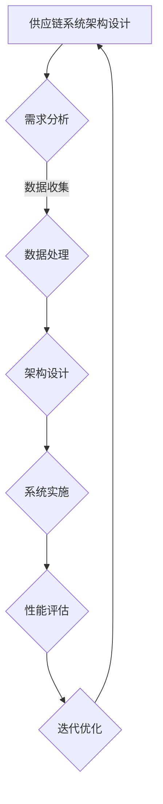

                 

# 文章标题：供应链系统、ERP系统、To B平台产品架构设计

> 关键词：供应链系统、ERP系统、To B平台、架构设计、模块化、可扩展性、核心架构、数据处理、安全性、性能优化

> 摘要：
本文章旨在详细探讨供应链系统、ERP系统及To B平台产品的架构设计。通过对这些系统的基本概念、架构设计原则和核心技术的深入分析，文章将提供一系列实际案例，帮助读者理解并掌握这些架构设计的最佳实践。此外，文章还将展望未来发展趋势，为企业的数字化转型提供有益的指导。

---

### 第一部分：供应链系统、ERP系统、To B平台产品架构设计概述

#### 第1章：供应链系统架构设计基础

##### 1.1 供应链系统基本概念

###### 1.1.1 供应链系统的定义与组成部分

供应链系统是指从原材料采购、生产、物流配送，到最终产品交付给消费者的全过程。它涉及多个参与方，包括供应商、制造商、分销商、零售商以及最终客户。

###### 1.1.2 供应链管理的关键目标

供应链管理的目标主要包括提高客户满意度、降低成本、提高效率、增强灵活性和减少风险。这些目标的实现依赖于高效的供应链系统架构设计。

##### 1.2 供应链系统架构设计原则

###### 1.2.1 模块化设计

模块化设计将系统划分为多个功能独立的模块，每个模块可以单独开发和部署，提高系统的可维护性和扩展性。

###### 1.2.2 可扩展性设计

可扩展性设计确保系统在业务规模扩大时，能够无缝地增加功能或性能，而不影响现有系统的稳定运行。

###### 1.2.3 可靠性和稳定性

可靠性和稳定性是供应链系统架构设计的关键原则，确保系统在面临高负载或故障时，能够保持稳定运行。

#### 第2章：ERP系统架构设计

##### 2.1 ERP系统概述

###### 2.1.1 ERP系统的概念与发展历程

ERP（企业资源计划）系统是一种集成了企业主要业务流程的信息系统。其发展历程经历了从单点应用到集成应用，再到云计算的演变。

###### 2.1.2 ERP系统在企业中的应用

ERP系统广泛应用于企业中的财务管理、人力资源、生产计划、供应链管理等领域，帮助企业管理资源，提高运营效率。

##### 2.2 ERP系统架构设计

###### 2.2.1 ERP系统的基础架构

ERP系统的基础架构包括数据层、应用层和表示层。数据层负责数据的存储和管理，应用层提供业务逻辑处理，表示层负责用户界面设计。

###### 2.2.2 数据库设计与数据存储

数据库设计是ERP系统架构设计的关键环节，需要考虑数据的规范化、安全性和高效查询。

###### 2.2.3 应用程序架构设计

应用程序架构设计决定了ERP系统的功能实现和性能表现，常用的设计模式包括单体架构、分层架构和微服务架构。

#### 第3章：To B平台产品架构设计

##### 3.1 To B平台产品概述

###### 3.1.1 To B平台的定义与特点

To B平台是指面向企业客户提供的商业服务和技术支持的平台。其特点包括定制化、稳定性和高可靠性。

###### 3.1.2 To B平台在企业发展中的作用

To B平台在帮助企业提高效率、降低成本、扩展业务范围和提升客户满意度等方面发挥着重要作用。

##### 3.2 To B平台产品架构设计

###### 3.2.1 产品架构设计原则

To B平台产品架构设计需要遵循模块化、可扩展性和高可用性的原则，确保产品能够满足企业客户的多样化需求。

###### 3.2.2 功能模块划分

To B平台产品通常包括核心业务模块、通用业务模块和定制化模块，功能模块的划分有助于提高系统的灵活性和可维护性。

###### 3.2.3 系统集成与扩展性

To B平台产品架构设计需要考虑与其他系统（如ERP、CRM等）的集成，以及未来业务的扩展性。

### 第二部分：供应链系统、ERP系统、To B平台核心架构设计

#### 第4章：供应链系统、ERP系统、To B平台核心架构比较分析

##### 4.1 核心架构设计与实现比较

###### 4.1.1 供应链系统核心架构

供应链系统的核心架构通常包括供应链计划模块、采购管理模块、库存管理模块、物流管理模块和订单管理模块。

###### 4.1.2 ERP系统核心架构

ERP系统的核心架构通常包括财务管理模块、人力资源管理模块、生产管理模块、供应链管理模块和客户关系管理模块。

###### 4.1.3 To B平台产品核心架构

To B平台产品的核心架构通常包括业务运营模块、数据管理模块、服务运营模块和用户管理模块。

##### 4.2 架构设计的关键技术与挑战

###### 4.2.1 数据处理与存储技术

数据处理与存储技术是供应链系统、ERP系统和To B平台产品架构设计的关键技术，包括关系型数据库、NoSQL数据库、数据仓库和大数据处理技术。

###### 4.2.2 服务化架构与微服务

服务化架构与微服务是现代企业级系统架构设计的重要方向，有助于提高系统的可维护性和扩展性。

###### 4.2.3 安全性与隐私保护

安全性与隐私保护是供应链系统、ERP系统和To B平台产品架构设计的重要挑战，需要考虑数据加密、访问控制和安全审计等技术。

### 第5章：供应链系统架构设计实践

##### 5.1 供应链系统架构设计案例

###### 5.1.1 案例背景与目标

以某制造企业为例，分析其供应链系统架构设计的背景和目标。

###### 5.1.2 架构设计思路与实现

详细描述供应链系统架构设计的思路和实现过程，包括数据层、应用层和表示层的具体设计。

##### 5.2 供应链系统架构优化与升级

###### 5.2.1 供应链系统性能优化

介绍供应链系统性能优化的方法和实践，如缓存技术、数据库优化和分布式计算。

###### 5.2.2 供应链系统功能扩展

分析供应链系统功能扩展的需求和实现，如新增模块、集成第三方服务和自定义开发。

###### 5.2.3 供应链系统集成与互操作

探讨供应链系统与其他系统集成与互操作的方法，如API接口、数据同步和事件驱动架构。

### 第6章：ERP系统架构设计实践

##### 6.1 ERP系统架构设计案例

###### 6.1.1 案例背景与目标

以某零售企业为例，分析其ERP系统架构设计的背景和目标。

###### 6.1.2 架构设计思路与实现

详细描述ERP系统架构设计的思路和实现过程，包括数据库设计、应用程序架构和服务化架构。

##### 6.2 ERP系统架构优化与升级

###### 6.2.1 ERP系统性能优化

介绍ERP系统性能优化的方法和实践，如缓存技术、数据库优化和分布式计算。

###### 6.2.2 ERP系统功能扩展

分析ERP系统功能扩展的需求和实现，如新增模块、集成第三方服务和自定义开发。

###### 6.2.3 ERP系统集成与互操作

探讨ERP系统与其他系统集成与互操作的方法，如API接口、数据同步和事件驱动架构。

### 第7章：To B平台产品架构设计实践

##### 7.1 To B平台产品架构设计案例

###### 7.1.1 案例背景与目标

以某企业服务提供商为例，分析其To B平台产品架构设计的背景和目标。

###### 7.1.2 架构设计思路与实现

详细描述To B平台产品架构设计的思路和实现过程，包括业务模块划分、数据管理和服务运营架构。

##### 7.2 To B平台产品架构优化与升级

###### 7.2.1 To B平台性能优化

介绍To B平台产品性能优化的方法和实践，如缓存技术、数据库优化和分布式计算。

###### 7.2.2 To B平台功能扩展

分析To B平台产品功能扩展的需求和实现，如新增模块、集成第三方服务和自定义开发。

###### 7.2.3 To B平台系统集成与互操作

探讨To B平台产品与其他系统集成与互操作的方法，如API接口、数据同步和事件驱动架构。

### 第8章：供应链系统、ERP系统、To B平台架构设计经验总结与展望

##### 8.1 架构设计经验总结

###### 8.1.1 设计原则与最佳实践

总结供应链系统、ERP系统和To B平台产品架构设计的原则和最佳实践。

###### 8.1.2 挑战与解决方案

分析架构设计过程中遇到的挑战和解决方案，为后续项目提供借鉴。

##### 8.2 未来发展趋势与展望

###### 8.2.1 技术革新对架构设计的影响

探讨新技术（如人工智能、区块链、云计算）对供应链系统、ERP系统和To B平台产品架构设计的影响。

###### 8.2.2 企业数字化转型与架构设计

分析企业数字化转型过程中，供应链系统、ERP系统和To B平台产品架构设计的角色和作用。

#### 附录

##### 附录A：参考资料与工具

###### A.1 参考书籍与文献

列出与供应链系统、ERP系统和To B平台产品架构设计相关的参考书籍和文献。

###### A.2 常用架构设计工具

介绍用于绘制流程图、UML图和思维导图的常用工具。

###### A.3 开发与调试工具推荐

推荐用于开发、调试供应链系统、ERP系统和To B平台产品的开发与调试工具。

### Mermaid 流�程图示例



### 核心算法原理讲解伪代码示例

```python
# 供应链系统调度算法伪代码
def schedule_chain(chain):
    # 对链式结构进行调度
    for i in range(len(chain)):
        # 对每个节点进行调度
        node = chain[i]
        if node.status == "idle":
            # 执行任务
            node.execute_task()
        else:
            # 更新状态
            node.update_status()
    return chain
```

### 数学模型与公式详细讲解示例

$$
\text{供应链成本模型} = C = C_p + C_d + C_s
$$

- \( C_p \)：采购成本
- \( C_d \)：存储成本
- \( C_s \)：服务成本

### 项目实战示例

#### 实战目标：设计并实现一个简单的供应链系统架构

#### 实战步骤：

##### 1. 需求分析
- 分析供应链系统的需求，包括采购、库存管理、订单处理等功能。

##### 2. 架构设计
- 设计供应链系统的基础架构，包括数据层、服务层、表示层等。

##### 3. 系统实现
- 使用Python编写供应链系统的核心功能代码，包括采购管理、库存管理、订单处理等。

##### 4. 代码解读与分析
- 对实现的核心功能代码进行解读和分析，说明其实现原理和关键点。

#### 代码示例：

```python
# 采购管理模块实现
def purchase_management(order):
    # 处理采购订单
    print("Processing purchase order:", order)
    # 更新库存
    update_inventory(order)
    # 发送采购通知
    send_notification("Purchase order processed.")

# 库存管理模块实现
def update_inventory(order):
    # 更新库存信息
    print("Updating inventory for order:", order)
    # 更新数据库中的库存数据
    database.update_inventory(order)

# 通知发送模块实现
def send_notification(message):
    # 发送通知
    print("Notification:", message)
```

#### 开发环境搭建与源代码详细实现

##### 开发环境：
- Python 3.8
- MySQL 8.0
- Flask 1.1.2

##### 源代码详细实现：

```python
# 导入必需的库
from flask import Flask, request, jsonify
from database import Database
from inventory import Inventory
from notification import Notification

# 创建 Flask 应用
app = Flask(__name__)

# 初始化数据库连接
db = Database()
inv = Inventory(db)
notif = Notification()

# 采购管理接口
@app.route('/purchase', methods=['POST'])
def purchase():
    order = request.json
    purchase_management(order)
    return jsonify({"status": "success"})

# 库存管理接口
@app.route('/inventory', methods=['GET'])
def inventory():
    orders = inv.get_orders()
    return jsonify(orders)

# 通知发送接口
@app.route('/notification', methods=['POST'])
def notification():
    message = request.json['message']
    send_notification(message)
    return jsonify({"status": "success"})

# 运行应用
if __name__ == '__main__':
    app.run(debug=True)
```

#### 代码解读与分析：

- 本代码示例是一个简单的供应链系统实现，包括采购管理、库存管理和通知发送三个核心模块。
- 采购管理模块通过接收采购订单，调用库存管理模块更新库存信息，并使用通知发送模块发送采购通知。
- 库存管理模块负责从数据库中获取订单信息，并更新库存数据。
- 通知发送模块负责发送通知消息。

#### 实战总结：

- 本实战实现了简单的供应链系统架构，包括数据层、服务层和表示层。
- 通过实际编码实现了采购管理、库存管理和通知发送等功能，展示了供应链系统的基础架构设计。

### 附录A：参考资料与工具

##### 附录A：参考资料与工具

###### A.1 参考书籍与文献

- 《供应链管理：战略、规划与执行》
- 《企业资源规划（ERP）系统设计与实施》
- 《To B平台产品管理：打造业务增长引擎》

###### A.2 常用架构设计工具

- Mermaid：用于绘制流程图和UML图
- Lucidchart：用于创建流程图、UML图和思维导图
- draw.io：开源图表和流程图工具

###### A.3 开发与调试工具推荐

- PyCharm：Python集成开发环境（IDE）
- MySQL Workbench：MySQL数据库管理和开发工具
- Postman：API调试和测试工具
- Swagger：API文档生成工具

---

**作者：AI天才研究院/AI Genius Institute & 禅与计算机程序设计艺术 /Zen And The Art of Computer Programming**

本文详细阐述了供应链系统、ERP系统和To B平台产品的架构设计，通过实例分析和代码实现，帮助读者深入理解这些架构设计的原理和实践。随着企业数字化转型的加速，这些架构设计将成为企业提升竞争力的重要手段。希望本文能为读者提供有价值的参考。**

