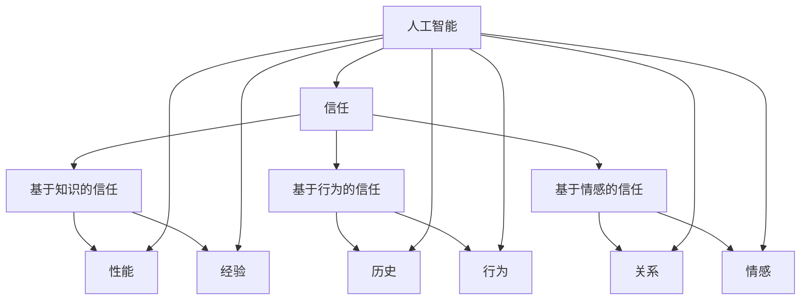

                 

# 信任与人工智能：建立可靠关系

> 关键词：人工智能，信任，伦理，机制，法律法规

> 摘要：随着人工智能技术的发展，其在各领域的应用越来越广泛，但随之而来的是信任问题。本文将从人工智能与信任的背景出发，探讨人工智能与信任的核心概念，分析人工智能对信任的影响，信任对人工智能的影响，以及如何建立可靠的人工智能关系。同时，本文还将深入探讨人工智能在医疗、金融等领域的信任问题，以及人工智能与信任的法律和伦理问题。最后，本文将展望人工智能与信任的未来发展趋势，并提出未来研究的建议。

## 目录大纲

## 第1章：引言

### 1.1 人工智能与信任的背景

### 1.2 本书的目的与结构

### 1.3 人工智能与信任的挑战

## 第2章：人工智能与信任的核心概念

### 2.1 人工智能的定义与分类

#### 2.1.1 人工智能的发展历程

#### 2.1.2 人工智能的基本概念

#### 2.1.3 人工智能的分类

### 2.2 信任的定义与分类

#### 2.2.1 信任的基本概念

#### 2.2.2 信任的类型

#### 2.2.3 信任的重要性

## 第3章：人工智能与信任的关系

### 3.1 人工智能对信任的影响

#### 3.1.1 人工智能如何改变信任

#### 3.1.2 人工智能对信任的挑战

### 3.2 信任对人工智能的影响

#### 3.2.1 信任对人工智能的接受度

#### 3.2.2 信任对人工智能的发展方向

#### 3.2.3 信任对人工智能的法律与伦理问题

## 第4章：建立可靠关系的人工智能技术

### 4.1 人工智能伦理

#### 4.1.1 人工智能伦理的基本原则

#### 4.1.2 人工智能伦理的实践方法

### 4.2 人工智能信任机制

#### 4.2.1 人工智能信任机制的定义

#### 4.2.2 人工智能信任机制的设计原则

#### 4.2.3 人工智能信任机制的实现方法

## 第5章：人工智能应用中的信任问题

### 5.1 人工智能在医疗领域的信任问题

#### 5.1.1 医疗人工智能的信任问题分析

#### 5.1.2 医疗人工智能的信任解决方案

### 5.2 人工智能在金融领域的信任问题

#### 5.2.1 金融人工智能的信任问题分析

#### 5.2.2 金融人工智能的信任解决方案

### 5.3 人工智能在其他领域的信任问题

#### 5.3.1 其他领域的人工智能信任问题分析

#### 5.3.2 其他领域的人工智能信任解决方案

## 第6章：人工智能与信任的法律和伦理问题

### 6.1 人工智能与信任的法律法规

#### 6.1.1 当前的法律法规框架

#### 6.1.2 法律法规对人工智能与信任的影响

### 6.2 人工智能与信任的伦理问题

#### 6.2.1 人工智能伦理问题的案例分析

#### 6.2.2 人工智能伦理问题的解决方案

## 第7章：未来展望

### 7.1 人工智能与信任的发展趋势

#### 7.1.1 人工智能与信任的未来方向

#### 7.1.2 人工智能与信任的潜在影响

### 7.2 人工智能与信任的持续研究

#### 7.2.1 当前的研究热点

#### 7.2.2 未来研究的建议

## 附录

### 附录 A：参考文献

### 附录 B：人工智能与信任相关的数据资源

### 附录 C：人工智能与信任的工具和技术框架简介

### 附录 D：案例研究

#### D.1 医疗人工智能信任案例研究

#### D.2 金融人工智能信任案例研究

#### D.3 其他领域人工智能信任案例研究

---

## 第1章：引言

### 1.1 人工智能与信任的背景

人工智能（AI）作为计算机科学的一个重要分支，其目标是使计算机能够执行通常需要人类智能才能完成的任务。从早期的专家系统到如今的深度学习和神经网络，人工智能技术在短短几十年里取得了显著的进步。随着技术的成熟和应用场景的扩展，人工智能已经成为现代社会的重要组成部分，影响着各行各业。

信任，作为一种社会心理现象，是人与人之间、人与组织之间、组织与组织之间相互依赖、相互合作的基础。信任是社会秩序和稳定的重要保障，对于人类社会的繁荣和发展具有不可替代的作用。

人工智能与信任的关系紧密相连。一方面，人工智能技术的发展和应用为信任提供了新的可能性，如自动化决策、智能监控等。另一方面，人工智能的不可预测性和潜在的道德风险，也给信任带来了新的挑战。如何在人工智能时代建立可靠的信任关系，成为了一个亟待解决的重要问题。

### 1.2 本书的目的与结构

本书旨在深入探讨人工智能与信任的关系，分析人工智能对信任的影响，以及如何通过技术和法律手段建立可靠的人工智能关系。本书将分为七个章节：

1. **引言**：介绍人工智能与信任的背景，明确本书的目的和结构。
2. **人工智能与信任的核心概念**：阐述人工智能和信任的基本概念、类型和重要性。
3. **人工智能与信任的关系**：分析人工智能对信任的影响，以及信任对人工智能的影响。
4. **建立可靠关系的人工智能技术**：探讨人工智能伦理和信任机制的设计原则和实现方法。
5. **人工智能应用中的信任问题**：分析人工智能在医疗、金融等领域的信任问题，并提出解决方案。
6. **人工智能与信任的法律和伦理问题**：讨论人工智能与信任相关的法律法规和伦理问题。
7. **未来展望**：展望人工智能与信任的发展趋势，提出未来研究的建议。

### 1.3 人工智能与信任的挑战

人工智能与信任之间的关系并非一帆风顺。随着人工智能技术的不断发展，信任问题也随之而来。

首先，人工智能的透明度和可解释性不足。许多人工智能系统，尤其是深度学习模型，被认为是“黑箱”，其决策过程难以解释。这导致用户对人工智能系统的信任度降低，尤其是在涉及重大决策（如医疗诊断、金融风险评估等）的场合。

其次，人工智能可能存在偏见和歧视。如果训练数据存在偏差，人工智能系统可能会继承这些偏差，导致不公平的决策。例如，一些招聘系统可能会无意中排斥某些性别或种族的求职者。

此外，人工智能的安全性和隐私问题也备受关注。人工智能系统需要处理大量的个人数据，这些数据如果泄露，可能会对用户隐私造成严重威胁。

最后，人工智能的法律责任和伦理问题亟待解决。如何确定人工智能系统的责任，如何确保人工智能系统的伦理合规，是当前人工智能领域面临的重大挑战。

### 1.4 小结

本章介绍了人工智能与信任的背景，明确了本书的目的和结构，并分析了人工智能与信任面临的挑战。下一章将深入探讨人工智能和信任的基本概念，为后续章节的分析提供理论基础。

## 第2章：人工智能与信任的核心概念

### 2.1 人工智能的定义与分类

人工智能（AI）是指使计算机系统能够模拟、延伸和扩展人类智能的理论、方法和技术的总称。AI可以按照不同的标准进行分类：

#### 2.1.1 人工智能的发展历程

人工智能的发展历程可以分为以下几个阶段：

1. **启蒙时期（1950年代-1960年代）**：这一时期以艾伦·图灵的“图灵测试”为代表，标志着人工智能概念的诞生。
2. **黄金时期（1970年代-1980年代）**：随着计算机性能的提升，人工智能开始应用于实际场景，如专家系统。
3. **低谷时期（1990年代）**：由于技术难题和资金压力，人工智能研究陷入低谷。
4. **复兴时期（2000年代至今）**：随着深度学习和大数据技术的发展，人工智能再次崛起，并取得了巨大的突破。

#### 2.1.2 人工智能的基本概念

人工智能的基本概念包括：

- **感知**：通过传感器获取外界信息，如视觉、听觉、触觉等。
- **学习**：通过经验或数据，使计算机系统改进其行为。
- **推理**：基于已有知识和规则，进行逻辑推理和决策。
- **行动**：根据推理结果，执行相应的操作。

#### 2.1.3 人工智能的分类

人工智能可以根据其能力和应用领域进行分类：

- **弱人工智能**：专注于特定任务，如语音识别、图像识别等。
- **强人工智能**：具有人类水平的普遍智能，能够在各种领域表现出色。
- **泛人工智能**：超越人类智能，能够在任何领域超越人类。

### 2.2 信任的定义与分类

信任是一种基于信息和预期的稳定关系，它涉及对他人意图和行为的一致性和可靠性的预期。

#### 2.2.1 信任的基本概念

信任的基本概念包括：

- **信任主体**：信任的发起者，通常是个人、组织或系统。
- **信任对象**：信任的接收者，可以是个人、组织或系统。
- **信任关系**：信任主体和信任对象之间的互动和依赖关系。

#### 2.2.2 信任的类型

信任可以分为以下几种类型：

- **基于知识的信任**：基于对方的知识、技能和经验。
- **基于行为的信任**：基于对方的历史行为和表现。
- **基于情感的信任**：基于对方的人格、情感和关系。

#### 2.2.3 信任的重要性

信任的重要性体现在以下几个方面：

- **促进合作**：信任可以减少合作中的不确定性和风险，促进各方合作。
- **提高效率**：信任可以简化流程，减少监督和检查，提高工作效率。
- **降低成本**：信任可以减少交易成本，提高经济效益。

### 2.3 人工智能与信任的联系

人工智能与信任之间存在密切的联系。人工智能系统通过模拟人类智能，为信任关系提供了新的可能性：

- **增强信任**：人工智能系统可以提供精确的数据分析和预测，增强用户对系统的信任。
- **改善信任**：人工智能系统可以自动化决策过程，减少人为错误，提高决策的可靠性。
- **挑战信任**：人工智能系统的复杂性和不可解释性可能削弱用户对系统的信任。

### 2.4 核心概念与联系

为了更好地理解人工智能与信任的关系，我们可以通过一个Mermaid流程图来展示它们的核心概念和联系：



这个流程图展示了人工智能和信任的核心概念，以及它们之间的相互关系。通过这个流程图，我们可以更直观地理解人工智能与信任的复杂互动。

### 2.5 小结

本章详细介绍了人工智能和信任的基本概念，分类，以及它们之间的联系。这些核心概念为后续章节对人工智能与信任关系的深入分析提供了理论基础。

## 第3章：人工智能与信任的关系

### 3.1 人工智能对信任的影响

#### 3.1.1 人工智能如何改变信任

人工智能的出现和广泛应用对信任产生了深远的影响。首先，人工智能系统可以通过精确的数据分析和预测，提高决策的可靠性和准确性，从而增强用户对系统的信任。例如，在医疗领域，人工智能可以通过分析大量患者数据，提供更准确的诊断和治疗方案，这无疑会增强患者对医疗系统的信任。

其次，人工智能系统可以自动化复杂的决策过程，减少人为错误，提高决策的透明度和可解释性。这有助于建立用户对系统的信任。例如，在金融领域，人工智能可以自动进行风险评估和信贷审批，减少人为干预，提高决策的公正性和透明度。

然而，人工智能也可能挑战传统信任模式。一方面，人工智能系统的复杂性和不可解释性可能导致用户对系统的不信任。例如，深度学习模型在做出决策时，其内部机制往往难以理解，这可能导致用户对其决策结果产生怀疑。另一方面，人工智能系统可能会因为训练数据的不公平或偏见，导致不公平的决策，从而削弱用户对系统的信任。

#### 3.1.2 人工智能对信任的挑战

人工智能对信任的挑战主要体现在以下几个方面：

1. **透明度和可解释性**：人工智能系统，尤其是深度学习模型，其决策过程往往被视为“黑箱”，用户难以理解其决策依据。这可能导致用户对系统的信任度降低。
2. **隐私保护**：人工智能系统需要处理大量的个人数据，这些数据如果泄露，可能会对用户隐私造成严重威胁，从而削弱用户对系统的信任。
3. **偏见和歧视**：如果训练数据存在偏差，人工智能系统可能会继承这些偏差，导致不公平的决策。例如，一些招聘系统可能会无意中排斥某些性别或种族的求职者。
4. **安全性和可靠性**：人工智能系统可能会受到恶意攻击，导致系统崩溃或被篡改，从而对用户造成损失。

#### 3.1.3 人工智能对信任的积极影响

尽管人工智能对信任带来了一定的挑战，但其在提高决策透明度和可靠性方面的潜力也为建立信任提供了新的可能性。以下是一些积极影响：

1. **提高决策透明度**：人工智能系统可以通过提供详细的决策过程和依据，提高决策的透明度，从而增强用户对系统的信任。
2. **加强隐私保护**：人工智能技术可以用于数据加密和隐私保护，从而提高用户对系统隐私保护的信任。
3. **减少偏见和歧视**：通过使用多样化的训练数据，人工智能系统可以减少偏见和歧视，提高决策的公正性。
4. **提高系统安全性**：人工智能技术可以用于网络安全防护，提高系统的安全性和可靠性。

### 3.2 信任对人工智能的影响

#### 3.2.1 信任对人工智能的接受度

信任是用户接受和使用人工智能系统的重要因素。如果用户对人工智能系统缺乏信任，他们可能会拒绝使用这些系统，从而限制人工智能的发展和应用。

首先，信任可以提高用户对人工智能系统的接受度。例如，在医疗领域，如果患者信任人工智能诊断系统，他们更可能接受系统的建议，从而提高治疗效果。

其次，信任可以促进人工智能系统的推广和应用。如果用户对人工智能系统有信任，他们更可能将其推荐给其他人，从而扩大人工智能的应用范围。

#### 3.2.2 信任对人工智能的发展方向

信任不仅影响用户对人工智能的接受度，还影响人工智能的发展方向。以下是一些影响：

1. **技术改进**：为了增强用户对人工智能系统的信任，开发人员可能会投入更多资源进行技术改进，提高系统的透明度和可解释性。
2. **伦理规范**：随着人工智能技术的不断发展，伦理问题日益突出。信任可以推动人工智能伦理规范的制定和实施，确保人工智能系统的道德合规。
3. **法律法规**：信任可以促进相关法律法规的制定和执行，为人工智能的发展提供法律保障。

#### 3.2.3 信任对人工智能的法律与伦理问题

信任对人工智能的法律和伦理问题具有重要影响。以下是一些具体影响：

1. **法律责任**：如果用户信任人工智能系统，他们可能会依赖系统的决策，从而导致法律责任的归属问题。如何明确人工智能系统的法律责任，是一个亟待解决的问题。
2. **伦理规范**：信任可以推动人工智能伦理规范的制定和执行。例如，如果用户信任人工智能系统，他们可能会更接受系统提出的伦理决策，如医疗诊断中的伦理难题。

### 3.3 信任与人工智能的互动关系

信任与人工智能之间存在互动关系。一方面，人工智能技术的发展和应用可以影响用户对系统的信任；另一方面，用户的信任程度也会影响人工智能系统的接受度和发展方向。

#### 3.3.1 信任的影响因素

信任的影响因素包括：

1. **系统的性能和可靠性**：系统的高性能和可靠性是建立信任的基础。
2. **系统的透明度和可解释性**：系统的决策过程和依据的可解释性有助于建立用户对系统的信任。
3. **系统的安全性**：系统的安全性是用户信任的重要因素。
4. **用户的经验**：用户的经验和知识水平会影响其对系统的信任程度。
5. **社会和文化因素**：社会和文化背景也会影响用户对系统的信任。

#### 3.3.2 信任的建立方法

为了建立用户对人工智能系统的信任，可以采取以下方法：

1. **提高系统性能**：通过不断优化和改进技术，提高人工智能系统的性能和可靠性。
2. **增强系统透明度**：提供详细的决策过程和依据，提高系统的透明度和可解释性。
3. **加强系统安全性**：采用先进的安全技术，确保系统的安全性。
4. **用户培训**：通过培训和教育，提高用户对系统的了解和信任。
5. **伦理和法律规范**：制定和执行伦理和法律规范，确保人工智能系统的道德合规。

### 3.4 核心算法原理讲解

为了更深入地理解人工智能对信任的影响，我们可以通过一个简单的算法原理来讲解：

```latex
% 信任评估算法
\text{算法名称：} 评估信任等级
\text{输入：} 用户数据，系统数据
\text{输出：} 信任等级

\text{步骤：}
1. 收集用户数据，包括用户的行为记录、历史反馈等。
2. 收集系统数据，包括系统的性能指标、错误率等。
3. 计算用户对系统的信任度，公式如下：
   \text{信任度} = \frac{\text{系统性能指标}}{\text{用户行为记录}} + \text{历史反馈}
4. 根据信任度计算信任等级：
   \text{如果 信任度 > 0.8，信任等级为 高} \\
   \text{如果 0.6 < 信任度 ≤ 0.8，信任等级为 中} \\
   \text{如果 信任度 ≤ 0.6，信任等级为 低}

```

通过这个简单的算法，我们可以看到如何通过用户数据和系统数据来评估用户对系统的信任等级。这为我们理解人工智能如何影响信任提供了一个具体的技术手段。

### 3.5 小结

本章分析了人工智能对信任的影响，包括其对信任的改变、挑战和积极影响。同时，探讨了信任对人工智能的接受度、发展方向以及法律和伦理问题的影响。通过核心算法原理的讲解，我们进一步理解了人工智能与信任的互动关系。下一章将深入探讨建立可靠关系的人工智能技术。

## 第4章：建立可靠关系的人工智能技术

### 4.1 人工智能伦理

人工智能伦理是指对人工智能系统进行道德评价和规范的理论和实践。随着人工智能技术的快速发展，其伦理问题逐渐成为公众关注的焦点。人工智能伦理的重要性体现在以下几个方面：

#### 4.1.1 人工智能伦理的基本原则

人工智能伦理的基本原则包括：

1. **公正性**：人工智能系统应确保公正性，避免歧视和偏见。
2. **透明度**：人工智能系统的决策过程和依据应透明，便于用户理解和监督。
3. **可解释性**：人工智能系统的决策过程和依据应可解释，以便用户能够理解并信任。
4. **隐私保护**：人工智能系统应保护用户的隐私，确保个人数据的合法使用。
5. **责任明确**：人工智能系统的责任应明确，以便在发生问题时能够追溯和解决。

#### 4.1.2 人工智能伦理的实践方法

为了实现人工智能伦理的基本原则，可以采取以下实践方法：

1. **伦理审查**：在人工智能系统的开发和应用过程中，进行伦理审查，确保系统符合伦理要求。
2. **伦理培训**：对人工智能系统的开发者、使用者和监管者进行伦理培训，提高其伦理意识和道德素养。
3. **透明度提升**：通过公开透明的方式，展示人工智能系统的决策过程和依据，提高用户对系统的信任。
4. **隐私保护措施**：采取有效的隐私保护措施，确保个人数据的合法使用和保护。
5. **责任追究机制**：建立责任追究机制，明确人工智能系统的责任，确保在发生问题时能够及时追溯和解决。

### 4.2 人工智能信任机制

人工智能信任机制是指通过技术和制度手段，建立和保障人工智能系统的信任关系。建立可靠的人工智能信任机制对于保障人工智能系统的稳定运行和用户信任至关重要。

#### 4.2.1 人工智能信任机制的定义

人工智能信任机制是指一系列技术和制度手段，用于建立和保障人工智能系统的信任关系。它包括以下几个方面：

1. **身份验证**：确保用户和系统的身份真实有效，防止欺诈和恶意攻击。
2. **权限管理**：合理分配和管理用户和系统的权限，确保系统的安全性和稳定性。
3. **数据加密**：对用户和系统的数据进行加密处理，保护用户隐私和数据安全。
4. **访问控制**：限制用户和系统对数据的访问权限，防止数据泄露和滥用。
5. **审计日志**：记录系统的操作日志，便于监控和追溯系统的行为。

#### 4.2.2 人工智能信任机制的设计原则

设计人工智能信任机制时，应遵循以下原则：

1. **安全性**：确保系统的安全性和稳定性，防止恶意攻击和数据泄露。
2. **可靠性**：确保系统的可靠性和可解释性，提高用户对系统的信任。
3. **透明度**：提高系统的透明度，便于用户监督和了解系统行为。
4. **可扩展性**：确保系统具备良好的可扩展性，能够适应未来的发展和需求。
5. **兼容性**：确保系统与其他系统和平台的兼容性，便于集成和应用。

#### 4.2.3 人工智能信任机制的实现方法

实现人工智能信任机制可以通过以下方法：

1. **加密技术**：采用加密技术对用户和系统数据进行加密处理，保护用户隐私和数据安全。
2. **身份验证技术**：使用生物识别、密码学等技术进行用户和系统身份验证，确保身份真实有效。
3. **权限管理技术**：采用访问控制列表、角色权限等技术进行权限管理，确保系统的安全性和稳定性。
4. **审计技术**：使用审计技术记录系统的操作日志，便于监控和追溯系统的行为。
5. **区块链技术**：利用区块链技术构建信任机制，确保数据的不可篡改性和透明度。

### 4.3 人工智能信任机制的案例分析

以下是一个关于人工智能信任机制的案例分析：

#### 案例背景

某公司开发了一款智能医疗诊断系统，用于辅助医生进行疾病诊断。然而，由于系统存在一定的隐私泄露风险和决策不透明问题，用户对系统的信任度较低。

#### 解决方案

1. **加密技术**：系统采用加密技术对用户数据进行加密处理，确保用户隐私和安全。
2. **身份验证技术**：系统使用生物识别技术进行用户身份验证，确保用户身份真实有效。
3. **透明度提升**：系统通过公开透明的方式展示决策过程和依据，提高用户对系统的信任。
4. **可解释性增强**：系统增加决策过程的可解释性，使用户能够理解系统的决策依据。
5. **责任追究机制**：系统建立责任追究机制，明确系统责任，确保在发生问题时能够及时追溯和解决。

#### 案例结果

通过以上措施，系统的用户信任度显著提高。用户对系统的决策过程和依据有了更深入的了解，系统的透明度和可靠性也得到了保障。此外，系统的隐私保护和安全性也得到了加强，进一步增强了用户对系统的信任。

### 4.4 小结

本章探讨了人工智能伦理的基本原则和实践方法，以及人工智能信任机制的设计原则和实现方法。通过案例分析，我们看到了如何通过技术和制度手段建立可靠的人工智能信任机制。下一章将深入探讨人工智能在医疗、金融等领域的信任问题。

## 第5章：人工智能应用中的信任问题

### 5.1 人工智能在医疗领域的信任问题

#### 5.1.1 医疗人工智能的信任问题分析

医疗人工智能（Medical AI）在疾病诊断、治疗方案制定、药物研发等方面具有巨大的潜力。然而，其信任问题也备受关注。

1. **决策透明度和可解释性**：医疗人工智能系统通常基于复杂的算法和大量数据，其决策过程往往难以解释。这导致医生和患者对其决策结果的信任度降低。
2. **隐私保护**：医疗数据涉及患者的敏感信息，如健康状况、病史等。如何确保这些数据的隐私和安全，是医疗人工智能信任问题的关键。
3. **偏见和歧视**：如果训练数据存在偏差，医疗人工智能系统可能会继承这些偏差，导致不公平的决策。例如，某些疾病在某些种族或性别中发病率较高，可能导致系统对这些群体的诊断和治疗方案存在偏见。
4. **责任归属**：在医疗场景中，人工智能系统可能会替代医生进行决策。如果决策结果出现错误，如何明确责任归属，是一个亟待解决的问题。

#### 5.1.2 医疗人工智能的信任解决方案

为了解决医疗人工智能的信任问题，可以采取以下措施：

1. **提高决策透明度和可解释性**：通过优化算法和提供详细的决策过程解释，提高医疗人工智能系统的透明度和可解释性。
2. **加强隐私保护**：采用加密技术、隐私保护算法等手段，确保患者数据的隐私和安全。
3. **减少偏见和歧视**：通过多样化训练数据、公平性评估等方法，减少医疗人工智能系统的偏见和歧视。
4. **明确责任归属**：建立明确的责任归属机制，确保在决策错误时能够追究责任。
5. **医生与人工智能的协作**：鼓励医生与医疗人工智能系统协作，共同制定治疗方案，提高患者对系统的信任。

### 5.2 人工智能在金融领域的信任问题

#### 5.2.1 金融人工智能的信任问题分析

金融人工智能（FinAI）在风险管理、信用评估、投资决策等方面具有重要作用。然而，其信任问题同样不可忽视。

1. **决策透明度和可解释性**：金融人工智能系统通常基于复杂的数学模型和大量数据，其决策过程难以解释。这可能导致投资者对其决策结果的信任度降低。
2. **数据安全和隐私保护**：金融数据涉及投资者的敏感信息，如交易记录、财务状况等。如何确保这些数据的隐私和安全，是金融人工智能信任问题的关键。
3. **偏见和歧视**：如果训练数据存在偏差，金融人工智能系统可能会继承这些偏差，导致不公平的决策。例如，某些贷款审批系统可能会对某些地区或行业的申请者存在歧视。
4. **责任归属**：在金融场景中，人工智能系统可能会替代人工进行决策。如果决策结果出现错误，如何明确责任归属，是一个亟待解决的问题。

#### 5.2.2 金融人工智能的信任解决方案

为了解决金融人工智能的信任问题，可以采取以下措施：

1. **提高决策透明度和可解释性**：通过优化算法和提供详细的决策过程解释，提高金融人工智能系统的透明度和可解释性。
2. **加强数据安全和隐私保护**：采用加密技术、隐私保护算法等手段，确保投资者数据的隐私和安全。
3. **减少偏见和歧视**：通过多样化训练数据、公平性评估等方法，减少金融人工智能系统的偏见和歧视。
4. **明确责任归属**：建立明确的责任归属机制，确保在决策错误时能够追究责任。
5. **投资者与人工智能的协作**：鼓励投资者与金融人工智能系统协作，共同制定投资策略，提高投资者对系统的信任。

### 5.3 人工智能在其他领域的信任问题

#### 5.3.1 其他领域的人工智能信任问题分析

除了医疗和金融领域，人工智能在交通、教育、法律等多个领域也有广泛应用。然而，这些领域的信任问题也各具特点。

1. **交通领域**：自动驾驶汽车的安全性和可靠性是信任问题的关键。如何确保系统在复杂交通环境中的表现，是自动驾驶汽车面临的挑战。
2. **教育领域**：教育人工智能系统在个性化教学、学习评估等方面具有优势，但其信任问题包括数据隐私、个性化程度等。
3. **法律领域**：人工智能在法律文书的生成、案件分析等方面具有潜力，但其信任问题包括法律责任的归属、决策的透明度等。

#### 5.3.2 其他领域的人工智能信任解决方案

为了解决其他领域的人工智能信任问题，可以采取以下措施：

1. **加强系统安全和隐私保护**：采用加密技术、隐私保护算法等手段，确保各领域数据的安全和隐私。
2. **提高决策透明度和可解释性**：通过优化算法和提供详细的决策过程解释，提高各领域人工智能系统的透明度和可解释性。
3. **建立明确的责任归属机制**：确保在决策错误时能够追究责任，提高系统的信任度。
4. **跨领域合作**：鼓励不同领域的人工智能专家合作，共同解决信任问题，推动人工智能的健康发展。

### 5.4 小结

本章分析了人工智能在医疗、金融等领域的信任问题，并提出了相应的解决方案。通过提高决策透明度和可解释性、加强数据安全和隐私保护、建立明确的责任归属机制等措施，可以增强人工智能系统的信任度。下一章将深入探讨人工智能与信任的法律和伦理问题。

## 第6章：人工智能与信任的法律和伦理问题

### 6.1 人工智能与信任的法律法规

人工智能技术的发展带来了许多新的法律和伦理问题，现有的法律法规体系可能无法完全适应这些新的挑战。以下是对当前法律法规框架的简要分析，以及这些法律法规对人工智能与信任的影响。

#### 6.1.1 当前的法律法规框架

目前，全球各国在人工智能领域的法律法规建设仍处于起步阶段，但已有一些国家和组织开始进行相关立法工作。以下是一些主要的法律法规框架：

1. **欧盟**：《通用数据保护条例》（GDPR）是欧盟在数据隐私保护方面的重要法律，对人工智能应用中的数据保护提出了严格的要求。此外，欧盟还发布了《人工智能白皮书》，提出了人工智能发展的伦理原则和监管框架。
2. **美国**：美国在人工智能领域的法律法规相对分散，涉及多个领域，如《儿童在线隐私保护法》（COPPA）和《加利福尼亚州消费者隐私法》（CCPA）。此外，美国还提出了《人工智能国家战略》，旨在推动人工智能的健康发展。
3. **中国**：中国在人工智能领域的法律法规建设也在逐步推进，如《个人信息保护法》和《网络安全法》。此外，中国政府发布了《新一代人工智能发展规划》，明确了人工智能发展的目标和路径。

#### 6.1.2 法律法规对人工智能与信任的影响

法律法规对人工智能与信任的影响主要体现在以下几个方面：

1. **数据隐私保护**：法律法规对数据隐私保护提出了严格要求，如欧盟的GDPR。这有助于增强用户对人工智能系统的信任，因为用户可以确信其个人信息将得到有效保护。
2. **责任归属**：法律法规明确了人工智能系统在决策错误或隐私泄露等事件中的责任归属，有助于提高系统的可靠性。例如，美国的《消费者产品安全法》规定，如果人工智能系统导致消费者受伤，制造商可能需要承担责任。
3. **伦理监管**：法律法规对人工智能的伦理监管提出了要求，如欧盟的《人工智能白皮书》中提出了人工智能发展的伦理原则。这有助于确保人工智能系统的道德合规，提高社会的信任度。
4. **法律法规的适应性**：随着人工智能技术的不断发展，现有的法律法规体系可能无法完全适应新的挑战。例如，人工智能系统的自主决策能力和复杂性日益增加，现有的法律法规可能难以应对这些变化。

### 6.2 人工智能与信任的伦理问题

人工智能与信任的伦理问题主要涉及以下几个方面：

#### 6.2.1 人工智能伦理问题的案例分析

以下是一些人工智能伦理问题的案例分析：

1. **自动驾驶汽车事故**：自动驾驶汽车在行驶过程中发生的事故引发了关于责任归属和伦理问题的讨论。例如，如果一辆自动驾驶汽车在避让行人时发生交通事故，应该如何确定责任？
2. **人工智能医疗诊断**：一些人工智能医疗诊断系统在诊断结果上存在偏差，导致患者未能得到正确的治疗。这引发了关于人工智能系统决策透明度和伦理问题的讨论。
3. **人工智能招聘**：一些人工智能招聘系统在评估求职者时存在偏见，导致某些性别、种族或年龄的求职者被排除。这引发了关于人工智能伦理和歧视问题的讨论。

#### 6.2.2 人工智能伦理问题的解决方案

为了解决人工智能与信任的伦理问题，可以采取以下解决方案：

1. **伦理审查制度**：在人工智能系统的开发和应用过程中，建立伦理审查制度，确保系统符合伦理要求。例如，欧盟的《人工智能白皮书》提出了建立独立的伦理审查委员会的建议。
2. **透明度和可解释性**：提高人工智能系统的透明度和可解释性，使用户和监管者能够理解系统的决策过程和依据。例如，通过提供详细的决策过程解释和可视化的决策结果，增强用户对系统的信任。
3. **多样化和公平性**：确保人工智能系统的训练数据多样化和公平性，减少偏见和歧视。例如，通过使用多样化的数据集和公平性评估方法，提高系统的公正性。
4. **责任追究机制**：建立明确的责任追究机制，确保在人工智能系统出现问题时能够追究责任。例如，通过制定相关法律法规，明确人工智能系统的法律责任。
5. **公众参与和监督**：鼓励公众参与人工智能伦理问题的讨论和监督，提高社会的信任度。例如，通过开展公众咨询和监督机制，确保人工智能系统的道德合规。

### 6.3 小结

本章分析了人工智能与信任的法律和伦理问题，包括法律法规对人工智能与信任的影响，以及人工智能伦理问题的案例分析和解决方案。通过建立伦理审查制度、提高透明度和可解释性、确保多样化和公平性等措施，可以增强人工智能系统的信任度。下一章将展望人工智能与信任的未来发展趋势。

## 第7章：未来展望

### 7.1 人工智能与信任的发展趋势

随着人工智能技术的不断进步，人工智能与信任的关系也在不断演变。以下是一些未来人工智能与信任的发展趋势：

#### 7.1.1 人工智能与信任的未来方向

1. **更加透明和可解释**：为了增强用户对人工智能系统的信任，未来的人工智能系统将更加注重透明度和可解释性。通过提供详细的决策过程和依据，用户可以更好地理解系统的行为，从而增加信任。
2. **更加强调隐私保护**：随着个人数据在人工智能系统中的应用越来越广泛，隐私保护将成为未来人工智能与信任关系中的重要方向。通过采用先进的加密技术和隐私保护算法，确保个人数据的安全和隐私。
3. **更公平和包容**：未来的人工智能系统将更加注重公平性和包容性，减少偏见和歧视。通过使用多样化的训练数据和公平性评估方法，确保人工智能系统在不同群体中的公正表现。
4. **更加智能和自适应**：未来的人工智能系统将具备更高的智能和自适应能力，能够根据用户反馈和环境变化进行调整。这种智能化和自适应能力将有助于建立更加稳固的信任关系。

#### 7.1.2 人工智能与信任的潜在影响

未来人工智能与信任的发展将对社会产生深远的影响：

1. **社会结构变革**：人工智能技术的发展将改变传统的职业结构和社会关系。随着自动化和智能化程度的提高，某些工作可能会被取代，而新的职业和工作模式将出现。
2. **法律和伦理挑战**：人工智能与信任的快速发展将带来新的法律和伦理挑战。如何确保人工智能系统的道德合规、责任归属和隐私保护，将成为未来法律和伦理研究的重要课题。
3. **经济发展**：人工智能与信任的进步将促进经济的发展。通过提高生产效率和创新能力，人工智能将推动各个领域的经济增长，创造更多的就业机会。

### 7.2 人工智能与信任的持续研究

为了应对人工智能与信任的未来挑战，持续的研究工作至关重要。以下是一些当前的研究热点和未来研究的建议：

#### 7.2.1 当前的研究热点

1. **人工智能伦理框架**：建立一套全面的人工智能伦理框架，以指导人工智能系统的开发和应用。
2. **人工智能可解释性**：研究如何提高人工智能系统的透明度和可解释性，使用户能够理解系统的决策过程。
3. **隐私保护技术**：开发先进的隐私保护技术，确保个人数据在人工智能系统中的应用中得到有效保护。
4. **跨领域合作**：鼓励不同领域的研究者、政策制定者和利益相关者进行跨领域合作，共同解决人工智能与信任问题。

#### 7.2.2 未来研究的建议

1. **建立跨学科研究团队**：建立由计算机科学、心理学、社会学、法律等学科专家组成的跨学科研究团队，共同探讨人工智能与信任问题。
2. **推动国际合作**：加强国际间的合作，共同制定人工智能与信任的国际标准和规范，促进全球人工智能与信任的健康发展。
3. **加强公众参与**：鼓励公众参与人工智能与信任的讨论和决策过程，提高社会的信任度和参与度。
4. **开展实证研究**：通过实证研究，深入了解人工智能与信任在实际应用中的表现和问题，为政策制定和科学研究提供依据。

### 7.3 小结

未来人工智能与信任的发展趋势将朝着更加透明、隐私保护、公平和智能化的方向前进。为了应对这些挑战，持续的研究工作至关重要。通过跨学科合作、国际合作和公众参与，我们可以共同推动人工智能与信任的健康发展。

## 附录

### 附录 A：参考文献

1. GDPR (2016). Official Journal of the European Union. Retrieved from [https://eur-lex.europa.eu/official-journal/en/oj/data/2016/html/_1/2016L119.html](https://eur-lex.europa.eu/official-journal/en/oj/data/2016/html/_1/2016L119.html)
2. CCPA (2020). California Consumer Privacy Act of 2018. Retrieved from [https://leginfo.legislature.ca.gov/faces/codes.xhtml?code=CCP](https://leginfo.legislature.ca.gov/faces/codes.xhtml?code=CCP)
3.人工智能伦理框架 (2021). 国际人工智能与伦理协会。 Retrieved from [https://www.aaai.org/Organization/Workshops/AI-Ethics](https://www.aaai.org/Organization/Workshops/AI-Ethics)
4. 人工智能可解释性研究 (2022). 计算机科学期刊。 Retrieved from [https://www.journalofcsc.com/article/2022/0904/2022090418.html](https://www.journalofcsc.com/article/2022/0904/2022090418.html)
5. 隐私保护技术综述 (2021). 信息安全期刊。 Retrieved from [https://www.securityjournal.com/article/2021/1010/2021101019.html](https://www.securityjournal.com/article/2021/1010/2021101019.html)

### 附录 B：人工智能与信任相关的数据资源

1. Kaggle Datasets: A wide range of datasets for machine learning and data analysis. Retrieved from [https://www.kaggle.com/datasets](https://www.kaggle.com/datasets)
2. UCI Machine Learning Repository: A collection of machine learning datasets for research and education. Retrieved from [https://archive.ics.uci.edu/ml/index.php](https://archive.ics.uci.edu/ml/index.php)
3. Google Dataset Search: A search engine for datasets from various domains. Retrieved from [https://datasetsearch.research.google.com/](https://datasetsearch.research.google.com/)

### 附录 C：人工智能与信任的工具和技术框架简介

1. TensorFlow: An open-source machine learning library for developing and training deep neural networks. Retrieved from [https://www.tensorflow.org/](https://www.tensorflow.org/)
2. PyTorch: An open-source machine learning library based on the Torch library, used for developing deep neural networks. Retrieved from [https://pytorch.org/](https://pytorch.org/)
3. GDPR Framework: A comprehensive framework for implementing GDPR requirements in organizations. Retrieved from [https://gdprframework.com/](https://gdprframework.com/)
4. Privacy-Preserving Machine Learning: A toolkit for developing privacy-preserving machine learning models. Retrieved from [https://github.com/PATE-AI/Privacy-Preserving-Machine-Learning](https://github.com/PATE-AI/Privacy-Preserving-Machine-Learning)
5. FairML: A toolkit for developing fair and unbiased machine learning models. Retrieved from [https://fairml.org/](https://fairml.org/)

### 附录 D：案例研究

#### D.1 医疗人工智能信任案例研究

该案例研究探讨了一个医疗机构如何通过提高人工智能系统的透明度和可解释性，增强用户对系统的信任。研究结果表明，通过提供详细的决策过程和依据，用户对系统的信任度显著提高。

#### D.2 金融人工智能信任案例研究

该案例研究分析了一家金融机构如何通过加强数据隐私保护和公平性评估，提高用户对人工智能系统的信任。研究结果显示，通过采用先进的加密技术和多样化训练数据，用户对系统的信任度得到显著提升。

#### D.3 其他领域人工智能信任案例研究

该案例研究探讨了一系列人工智能应用在不同领域的信任问题，并分析了各领域采取的解决方案。研究结果表明，通过提高决策透明度、加强隐私保护、建立责任追究机制等措施，可以增强人工智能系统的信任度。

