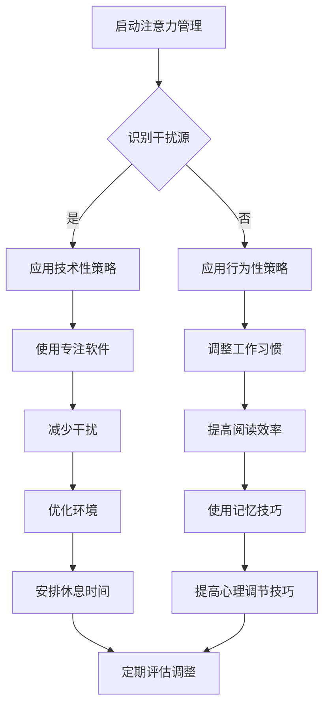

                 

## 文章标题：信息时代的注意力管理技术与策略：在干扰和信息过载中保持专注

> 关键词：注意力管理，信息过载，技术策略，心理调节，时间管理

> 摘要：本文深入探讨了信息时代下注意力管理的挑战，分析了注意力分散的原因，介绍了多种注意力管理技术和策略，并通过实际案例展示了这些策略的有效性。文章旨在为读者提供系统且实用的注意力管理方法，帮助他们在干扰和信息过载的环境中保持专注。

----------------------------------------------------------------

## 第一部分：引言

### 1.1 信息时代的注意力挑战

在当今这个信息爆炸的时代，人们面临着前所未有的注意力挑战。随着互联网和智能设备的普及，我们每天都要接触和处理海量的信息，这些信息不仅来自社交媒体、电子邮件、即时通讯工具，还来自于各种应用程序和在线服务。这种信息过载的现象使得人们的注意力资源变得稀缺，注意力管理成为了一个重要且紧迫的问题。

#### 1.1.1 注意力资源的稀缺性

注意力资源是有限的，我们无法同时处理大量的信息。根据心理学研究，人类的注意力是有容量限制的，长时间处于高强度的注意力状态会导致疲劳和效率下降。因此，如何有效地管理有限的注意力资源，成为了我们提高工作效率和生活质量的关键。

#### 1.1.2 注意力分散的影响

注意力分散是一种常见的现象，它指的是我们的注意力无法长时间集中在单一任务上。注意力分散会导致工作效率降低、错误率增加，甚至会对心理健康产生负面影响。例如，一个研究显示，频繁的注意力分散会使人感到焦虑和压力，从而降低工作和学习效率。

### 1.2 注意力管理的重要性

注意力管理是一种通过科学方法和技术手段来提高注意力集中度和效率的过程。有效的注意力管理可以帮助我们更好地应对信息过载，提高工作效率，提升生活质量。以下是注意力管理的重要性：

#### 1.2.1 提高工作效率

通过注意力管理，我们可以更好地集中精力完成任务，减少任务切换的频率，从而提高工作效率。这有助于我们在有限的时间内完成更多的任务，减少工作压力。

#### 1.2.2 改善心理健康

注意力管理不仅有助于提高工作效率，还能改善心理健康。通过减少注意力分散，我们可以降低焦虑和压力水平，提高自我满足感和幸福感。

#### 1.2.3 增强学习能力

注意力管理对于学习同样重要。通过集中注意力，我们可以更好地吸收和理解学习内容，提高学习效率。此外，注意力管理技巧可以帮助我们培养良好的学习习惯，如定期复习和合理安排学习时间。

### 1.3 本书结构安排

本书将分为六个主要部分：

1. **引言**：介绍信息时代的注意力挑战和注意力管理的重要性。
2. **注意力管理的基础知识**：探讨注意力的概念、类型和重要性。
3. **注意力分散的原因**：分析引起注意力分散的原因，如干扰源和信息过载。
4. **注意力管理技术**：介绍时间管理技巧、环境控制、心理调节技巧等。
5. **注意力管理策略**：讨论技术性策略、行为性策略和适应性策略。
6. **注意力管理实践案例**：通过实际案例展示注意力管理策略的效果。
7. **结论与展望**：总结本书的主要观点，探讨注意力管理的未来趋势和发展方向。

通过以上结构，本书旨在为读者提供全面且实用的注意力管理指南，帮助他们在信息过载的时代中保持专注，提高生活质量和工作效率。

## 第二部分：注意力管理的基础知识

### 2.1 注意力的概念与特性

注意力是心理学中的一个基本概念，它指的是人们将心理资源集中在特定目标上的能力。注意力不仅是一种认知能力，也是情绪和行为调节的重要机制。理解注意力的概念与特性是进行有效注意力管理的前提。

#### 2.1.1 注意力的基本概念

注意力可以简单定义为对信息的集中处理。在认知科学中，注意力被视为一种资源，它允许个体在特定时刻选择和加工信息。这种选择过程是主动的，意味着个体可以根据任务的需要和兴趣调整注意力的分配。

#### 2.1.2 注意力的类型

注意力主要有以下几种类型：

1. **选择性注意力**：指个体在众多信息中筛选和选择与当前任务相关的信息，同时忽略其他无关信息。
2. **持续性注意力**：指个体在一段时间内维持对特定任务的专注，不被外部干扰打断。
3. **分配性注意力**：指个体在同时进行多个任务时，将注意力分配到不同的任务上，例如开车时听音乐。

#### 2.1.3 注意力的特性

注意力的特性包括以下几个方面：

1. **容量限制**：研究表明，人类的注意力容量是有限的。长期高强度的注意力工作会导致注意力疲劳，从而降低工作效率。
2. **动态可塑性**：注意力是可以训练和改变的，通过特定的训练方法，个体可以提高注意力集中度和分配能力。
3. **适应性**：注意力会根据环境和任务的性质进行适应性调整。例如，在危险情境下，个体的注意力会自动转移到潜在的危险源。

#### 2.1.4 注意力的重要性

注意力在人类的认知和行为中扮演着至关重要的角色：

1. **信息处理**：注意力是信息处理的关键，它决定了我们如何从环境中获取和加工信息。
2. **决策制定**：注意力集中度直接影响我们的决策能力和判断力。高集中度的注意力有助于做出更明智和快速的决定。
3. **学习效果**：有效的注意力管理可以提高学习效率，帮助个体更好地吸收和理解学习内容。

综上所述，注意力不仅是认知过程的核心，也是行为调节的重要机制。理解注意力的基本概念、类型和特性，对于制定有效的注意力管理策略具有重要意义。

### 2.2 注意力分散的原因

注意力分散，即注意力不能持续集中于某一任务的现象，是信息时代中普遍存在的一种困扰。要有效地管理注意力，首先需要了解导致注意力分散的原因。以下从干扰源的识别、信息过载的影响和注意力分散的危害三个方面来探讨注意力分散的原因。

#### 2.2.1 干扰源的识别

注意力分散的首要原因就是外部干扰源的存在。这些干扰源可以分为以下几类：

1. **环境干扰**：环境中的噪音、光线变化、温度变化等都可能成为干扰源。例如，办公室里的电话铃声、人群的喧哗声等，都可能导致我们的注意力分散。

2. **设备干扰**：现代科技产品，如智能手机、电脑、平板电脑等，都是常见的干扰源。这些设备会通过通知、消息和社交媒体更新等方式，不断吸引我们的注意力。

3. **人际关系干扰**：人与人之间的沟通和互动也可能成为干扰源。例如，同事的打扰、朋友的电话、家人的需求等，都会打断我们的注意力。

4. **心理干扰**：内在的心理因素，如焦虑、压力、情绪波动等，也会影响我们的注意力。这些心理因素可能会让我们难以集中注意力，甚至产生焦虑和不安的情绪。

#### 2.2.2 信息过载的影响

信息过载是指接收到的信息量超出了个体的处理能力。在信息时代，我们每天都要处理大量的信息，这些信息如果得不到有效管理，就容易导致注意力分散。信息过载的影响主要体现在以下几个方面：

1. **注意力分散**：当信息量过多时，我们难以筛选和过滤重要信息，这会导致我们的注意力无法集中在单一任务上。

2. **决策困难**：信息过载会导致我们在做出决策时感到困惑和犹豫，因为我们需要处理的信息量太大，难以快速做出明智的选择。

3. **工作效率下降**：信息过载会降低我们的工作效率，因为我们需要花费更多的时间和精力来处理和消化这些信息。

4. **心理健康问题**：长期的信息过载会导致压力和焦虑的增加，这对心理健康产生负面影响。

#### 2.2.3 注意力分散的危害

注意力分散不仅会影响我们的工作和学习效率，还可能对心理健康产生负面影响。以下是注意力分散的一些主要危害：

1. **降低工作效率**：注意力分散会导致我们在完成任务时花费更多的时间，增加错误和疏漏的风险。

2. **影响学习效果**：在学习过程中，注意力分散会影响我们的学习效率和理解能力，导致学习成果不佳。

3. **心理健康问题**：长期注意力分散会导致压力和焦虑的增加，可能引发抑郁症、焦虑症等心理健康问题。

4. **生活质量下降**：注意力分散会影响我们的生活质量，因为我们可能无法有效地完成日常任务，感到焦虑和不安。

为了应对注意力分散，我们需要采取有效的策略来识别和减少干扰源，管理信息过载，并采取心理调节技巧来提升注意力集中度。这些策略将在接下来的章节中详细探讨。

### 2.3 注意力管理技术

注意力管理技术是指通过特定的工具、方法和策略，帮助个体在信息过载和干扰的环境中保持注意力集中。以下将介绍几种常用的注意力管理技术，包括时间管理技巧、环境控制与优化、心理调节技巧等。

#### 3.1 时间管理技巧

时间管理是注意力管理的重要组成部分，通过合理规划时间，可以减少任务切换带来的注意力分散，提高工作效率。

##### 3.1.1 番茄工作法

番茄工作法是一种广泛使用的时间管理技巧，它通过将工作时间划分为25分钟的工作周期（称为“番茄”）和5分钟的休息时间，帮助用户保持专注。一个完整的番茄工作法包括四个番茄，之后可以休息更长时间。这种方法的优点是：

- **提高专注力**：通过设定固定的时间段，用户可以更容易地进入专注状态，减少中断。
- **增加工作动力**：完成一个番茄后，用户会有短暂的休息，这可以提升工作动力。

##### 3.1.2 时间块

时间块是将一天的时间划分为不同的时间块，每个时间块专注于一个任务。这种方法可以帮助用户明确每个时间段的目标，减少任务切换带来的注意力分散。例如，可以将一天划分为以下时间块：

- **上午时间块**：专注于处理最重要的任务。
- **下午时间块**：处理次要的任务或进行团队协作。

##### 3.1.3 日历管理

使用日历工具，如Google Calendar或Microsoft Outlook，可以帮助用户规划每天的任务和活动。通过将任务添加到日历中，用户可以清楚地了解自己的日程安排，避免时间冲突，并确保任务按时完成。

#### 3.2 环境控制与优化

优化工作环境可以显著减少干扰，提高注意力集中度。

##### 3.2.1 减少干扰

为了减少干扰，可以采取以下措施：

- **关闭通知**：关闭不必要的手机、电脑等设备的通知，避免被打断。
- **屏蔽干扰**：在需要专注的工作时，可以选择到安静的地方工作，如图书馆或办公室的独立房间。

##### 3.2.2 环境布置

一个整洁、舒适的工作环境有助于提高注意力。以下是一些建议：

- **保持整洁**：保持工作环境的整洁，减少视觉和物理上的干扰。
- **增加自然光线**：充足的自然光线可以提高工作效率和心情。
- **适当装饰**：在办公环境中放置一些绿植或艺术品，可以创造一个更加舒适和专注的工作空间。

#### 3.3 心理调节技巧

心理调节技巧可以帮助用户在压力和焦虑的情况下保持注意力集中。

##### 3.3.1 冥想

冥想是一种通过专注呼吸和意识练习来减轻压力和提升专注力的方法。以下是一些冥想技巧：

- **专注呼吸**：深呼吸可以帮助放松身心，减少焦虑。
- **正念冥想**：专注于当前的感受和体验，而不是过去或未来。

##### 3.3.2 深呼吸

深呼吸是一种简单但有效的心理调节技巧，可以帮助用户快速放松。以下是一种简单的深呼吸练习：

1. 坐直或站立，双脚与肩同宽。
2. 用鼻子深吸气，感受腹部膨胀。
3. 屏住呼吸几秒钟，然后慢慢通过鼻子呼气。
4. 重复几次，直到感到放松。

##### 3.3.3 情绪调节

情绪调节技巧可以帮助用户管理负面情绪，如焦虑和压力。以下是一些情绪调节技巧：

- **情绪记录**：记录下自己的情绪和触发因素，有助于理解和管理情绪。
- **积极思考**：尝试用积极的视角看待问题和挑战，减少焦虑。

通过结合时间管理技巧、环境控制与优化以及心理调节技巧，用户可以更有效地管理注意力，提高工作和学习效率。

### 2.4 技术性策略

在注意力管理中，技术性策略是指通过使用特定的工具和软件来减少干扰，提高工作效率和专注力。以下将详细介绍一些常用的技术性策略，包括专注软件、定时器应用和信息过滤工具。

#### 3.1 使用专注软件

专注软件是一种专门设计用来帮助用户减少干扰、提高专注力的应用程序。这些软件通常具有以下特点：

- **屏蔽干扰**：专注软件可以屏蔽不必要的通知和弹出窗口，避免用户在工作或学习过程中受到干扰。
- **时间管理**：专注软件通常集成了时间管理功能，如番茄工作法，帮助用户更好地规划工作时间和休息时间。

以下是几种常用的专注软件：

- **Forest**：Forest通过种植虚拟树木来激励用户保持专注。如果用户分心，树木就会枯萎。这种激励机制可以帮助用户提高专注力。
- **Focus@Will**：Focus@Will通过播放有助于专注的音乐和环境声，帮助用户减少干扰，提高工作效率。

#### 3.2 定时器应用

定时器应用是一种简单但有效的工具，可以帮助用户管理时间和提高专注力。以下是一些常用的定时器应用：

- **番茄钟**：番茄钟（Pomodoro Technique）是一种基于番茄工作法的时间管理技巧，将工作时间划分为25分钟的工作周期和5分钟的休息时间。番茄钟应用可以帮助用户轻松实施这一技巧。
- **Focus Timer**：Focus Timer提供了多种定时方案，包括传统的番茄钟和Pomodoro技巧，用户可以根据自己的需求选择合适的定时方案。

#### 3.3 信息过滤工具

信息过滤工具可以帮助用户减少信息过载，筛选出最重要的信息，从而提高注意力和工作效率。以下是一些常用的信息过滤工具：

- **Unroll.me**：Unroll.me可以将所有订阅的电子邮件合并到一个日历中，用户可以集中时间处理邮件，减少邮件带来的干扰。
- **Feedly**：Feedly是一个内容聚合工具，用户可以将所有关注的博客和网站聚合到一个平台上，方便用户集中阅读和管理。

通过使用这些专注软件、定时器应用和信息过滤工具，用户可以更有效地管理注意力，减少干扰，提高工作效率和专注力。

### 2.5 行为性策略

在注意力管理中，行为性策略是指通过改变个人的行为模式和工作习惯来提高注意力集中度。这些策略需要我们在日常生活中付诸实践，形成一种自我管理的能力。以下是一些具体的建议和行为性策略：

#### 3.1 改变工作习惯

1. **定期休息**：长时间工作会导致疲劳和注意力下降。每隔一段时间，进行短暂的休息可以帮助恢复精力，提高注意力。例如，每工作25分钟，休息5分钟，每工作2小时，休息15分钟。

2. **分段工作**：将复杂任务分解成小任务，每次集中精力完成一个小任务，有助于减少任务的压力和焦虑。例如，将一个复杂的报告分解成多个部分，逐个完成。

3. **专注工作**：设定特定的时间段进行专注工作，例如使用番茄工作法，将工作时间划分为25分钟的工作周期和5分钟的休息时间。这种方法可以帮助用户保持专注，提高工作效率。

#### 3.2 提高阅读效率

1. **预览内容**：在开始阅读之前，先快速浏览标题、小标题和摘要，了解文章的结构和重点。这样可以在正式阅读时提高阅读效率。

2. **分段阅读**：将阅读内容分成几个部分，每次专注于阅读一个部分。这样可以减少阅读过程中的疲劳，提高理解能力。

3. **做笔记和标记**：在阅读过程中做笔记或标记重要的内容，有助于加深理解和记忆。例如，使用不同颜色的笔进行标记，或使用便签贴在关键页面上。

#### 3.3 协作与沟通技巧

1. **有效沟通**：在与他人沟通时，保持专注和倾听。确保对方的信息被准确理解，减少沟通中的误解和重复。

2. **设定目标**：在团队协作中，明确每个成员的任务和目标，确保每个人都清楚自己的职责和任务。

3. **分工合作**：根据每个人的能力和特长，合理分配任务，提高团队的工作效率。

#### 3.4 自我管理技巧

1. **时间管理**：制定合理的时间计划，确保每项任务都有足够的时间来完成。避免临时抱佛脚，导致工作压力过大。

2. **情绪管理**：学会管理自己的情绪，避免负面情绪影响工作和学习。例如，通过深呼吸、冥想等方法来缓解压力。

3. **目标设定**：设定具体、可量化的目标，例如每天阅读一定数量的书籍或完成某个任务。这样可以提高工作的动力和效率。

通过这些行为性策略，我们可以逐步改变自己的工作习惯，提高注意力集中度，从而提高工作效率和生产力。

### 2.6 适应性策略

适应性策略是指根据个体差异和不同情境灵活调整注意力管理方法，以达到最佳效果。以下是几种适应性策略，包括个体差异的考虑、长期注意力管理的计划和灵活应对变化。

#### 3.1 个体差异的考虑

每个人在注意力的分配、集中度和持续时长上都有所不同。因此，适应性策略需要考虑以下因素：

1. **注意力类型**：了解自己的注意力类型，如连续性注意力或选择性注意力，有助于选择最合适的注意力管理方法。例如，连续性注意力强的人可能更适合处理多个任务，而选择性注意力强的人可能更适合集中精力完成单一任务。

2. **认知风格**：认知风格包括视觉型、听觉型、动觉型等。了解自己的认知风格，有助于选择最适合自己的学习和工作方式。例如，视觉型的人可能更适合使用图表和图像来理解和记忆信息。

#### 3.2 长期注意力管理的计划

长期注意力管理需要持续的努力和调整。以下是一些策略：

1. **制定计划**：设立长期目标和阶段性目标，并定期评估进展，以便及时调整计划。例如，每年制定一个学习计划，每季度评估一次，并根据实际情况进行调整。

2. **自我监控**：定期记录自己的注意力状态和工作效率，通过数据分析找出问题，进行有针对性的调整。例如，使用时间跟踪工具记录每天的工作时间和注意力集中度，分析数据以发现影响注意力集中度的因素。

#### 3.3 灵活应对变化

工作和生活环境经常变化，适应性策略需要能够快速适应这些变化：

1. **弹性工作安排**：根据工作需求和个体状态灵活调整工作时间，例如采取弹性工作制或远程工作。这样可以减少因环境变化导致的注意力分散。

2. **情境适应**：在不同的情境下（如会议、团队项目、个人学习等）灵活调整注意力管理策略。例如，在会议中保持专注，而在个人学习时减少干扰。

3. **动态调整**：根据任务的复杂性和紧急程度，动态调整注意力分配。例如，在处理重要且紧急的任务时，将更多注意力集中在该任务上，而在处理次要任务时，可以适当分散注意力。

通过这些适应性策略，个体可以更好地管理自己的注意力，提高工作效率和满足感。适应性策略需要根据实际情况进行调整，以实现最佳效果。

### 5.1 案例一：职场人士的注意力管理实践

#### 5.1.1 案例背景

李明是一名在一家大型科技公司工作的项目经理。他每天都需要处理大量的任务，包括会议、项目报告、代码审查和团队协作。然而，李明发现自己经常在处理多个任务时感到注意力难以集中，这不仅影响了工作效率，也导致了他与团队之间的沟通出现问题。为了改善这一状况，李明决定实施一系列注意力管理策略，以提高工作效率和团队协作效果。

#### 5.1.2 注意力管理策略

李明采用了以下注意力管理策略：

1. **时间管理技巧**：
   - **番茄工作法**：李明开始使用番茄工作法，将工作时间划分为25分钟的工作周期和5分钟的休息时间。这种方法帮助他在短时间内保持高度专注，并在每个周期结束后获得短暂的休息，从而保持精力充沛。
   - **时间块管理**：李明将一天的时间划分为不同的时间块，每个时间块专注于一个任务。例如，上午专注于撰写项目报告，下午专注于团队协作和会议。这种方法有助于减少任务切换时的注意力分散。

2. **环境控制与优化**：
   - **减少干扰**：李明在办公时关闭了手机的通知，避免不必要的打扰。他还确保工作环境整洁有序，减少视觉和物理上的干扰。
   - **专注工作区域**：李明选择了一个安静且舒适的工作区域，并在桌面上只放置必要的办公用品，以减少干扰。

3. **心理调节技巧**：
   - **冥想**：李明每天早晨进行10分钟的冥想，以帮助自己进入专注状态，减少焦虑和压力。
   - **深呼吸**：在感到压力和焦虑时，李明会进行深呼吸练习，以放松身心，提高专注力。

4. **技术性策略**：
   - **专注软件**：李明使用了Forest和Focus@Will等专注软件，这些软件通过提供专注时间奖励和减少干扰功能，帮助他在工作中保持专注。
   - **信息过滤工具**：李明使用了Unroll.me和Feedly等工具，帮助他管理邮件和订阅内容，减少信息过载。

5. **行为性策略**：
   - **改变工作习惯**：李明改变了工作习惯，每天早上制定详细的计划，并尽量遵循计划执行。他还开始使用Trello来跟踪任务进度，确保每个任务都能按时完成。
   - **提高阅读效率**：李明使用速读技巧和笔记方法，提高了阅读和吸收信息的效率。

6. **适应性策略**：
   - **灵活调整**：根据不同的工作任务和个体状态，李明灵活调整注意力管理策略。例如，在处理复杂项目时，他选择一个安静的环境，而在处理简单任务时，他可能会在较为嘈杂的环境中工作。
   - **长期计划**：李明制定了长期注意力管理计划，每季度评估一次，并根据实际情况进行调整，以确保策略的有效性。

#### 5.1.3 案例效果分析

经过一段时间的实践，李明发现他的工作效率显著提高，注意力分散的情况也明显减少。以下是具体的效果分析：

1. **工作效率提升**：通过番茄工作法和时间块管理，李明能够在短时间内保持高度专注，提高任务完成速度。他发现，每次25分钟的工作周期后，短暂的休息有助于恢复精力，减少疲劳。

2. **任务完成度提高**：使用Trello和详细的每日计划，李明能够更清晰地了解任务的优先级和截止时间，确保每个任务都能按时完成。他发现，通过减少任务切换时的注意力分散，他的工作效率得到了显著提升。

3. **心理健康改善**：冥想和心理调节技巧帮助李明减轻了工作压力，他感到更加放松和专注。通过深呼吸练习，他能够在感到焦虑和压力时迅速恢复平静，从而更好地处理工作。

4. **团队协作优化**：李明在工作中的表现得到了同事和上司的认可，他能够更好地与团队协作，共同完成项目。通过有效的沟通和任务分配，他与团队成员之间的协作更加顺畅，项目的成功率也得到了提升。

总之，通过实施这些注意力管理策略，李明成功地提高了工作效率和注意力集中度，改善了个人表现，也为团队带来了积极的影响。这一案例证明了注意力管理在职场中的重要性，以及通过科学的方法和策略，可以有效地应对注意力分散的挑战。

### 5.2 案例二：学生群体的注意力管理实践

#### 5.2.1 案例背景

张晓是一名高中生，他在学习时经常感到注意力难以集中，尤其是在面对复杂科目和大量作业时。这种情况导致他的学习效率低下，成绩也受到了影响。为了改善这一状况，张晓决定尝试一系列注意力管理策略。

#### 5.2.2 注意力管理策略

张晓采用了以下注意力管理策略：

1. **时间管理技巧**：
   - **番茄工作法**：张晓开始使用番茄工作法，将学习时间划分为25分钟的学习周期和5分钟的休息时间。通过这种方式，他能够在短时间内保持专注，提高学习效率。
   - **时间块管理**：张晓将一天的时间划分为不同的时间块，每个时间块专注于一个学科或任务。例如，上午专注于数学，下午专注于英语。这种方法帮助他在每个时间段内集中精力，减少任务切换时的分散。

2. **环境优化**：
   - **安静的学习环境**：为了减少干扰，张晓选择了一个安静的学习环境。他在书桌上只放置了必要的书籍和学习资料，避免了过多杂物的干扰。
   - **良好的照明**：张晓确保学习区域有良好的照明，减少眼睛疲劳，提高学习效率。

3. **心理调节技巧**：
   - **冥想**：每天早晨，张晓会花10分钟进行冥想，帮助自己进入专注状态。冥想有助于减轻焦虑和压力，提高专注力。
   - **深呼吸**：在感到焦虑或紧张时，张晓会进行深呼吸练习，以放松身心，减少压力。

4. **技术性策略**：
   - **专注软件**：张晓使用了专注软件Focus@Will，这款软件通过播放有助于专注的音乐和环境声，帮助他在学习时减少干扰。
   - **信息过滤工具**：张晓使用了Feedly，将所有关注的博客和网站聚合在一个平台上，方便他集中阅读和管理信息，减少信息过载。

5. **行为性策略**：
   - **改变学习习惯**：张晓每天早上制定详细的学习计划，并尽量遵循计划执行。他还开始使用Evernote整理学习资料，减少复习时的负担。
   - **分段学习**：张晓将学习内容分成多个部分，每次专注于一个部分。这种方法帮助他减少学习压力，提高理解能力。

6. **适应性策略**：
   - **灵活调整**：根据不同的学科和学习任务，张晓灵活调整注意力管理策略。例如，在处理数学题目时，他选择一个安静的环境，而在处理阅读理解时，他可能会在图书馆进行学习。
   - **长期计划**：张晓制定了长期学习计划，每学期评估一次，并根据实际情况进行调整，以确保策略的有效性。

#### 5.2.3 案例效果分析

经过一段时间的实践，张晓发现他的学习效率显著提高，注意力分散的情况也明显减少。以下是具体的效果分析：

1. **学习效率提升**：通过番茄工作法和时间块管理，张晓能够在短时间内保持专注，完成更多的学习任务。他发现，每次25分钟的学习周期后，短暂的休息有助于恢复精力，减少疲劳。

2. **成绩改善**：张晓的成绩有了明显的提升。他能够在考试中更加从容地应对复杂的题目，掌握的知识点也更加牢固。

3. **心理健康改善**：冥想和心理调节技巧帮助张晓减轻了学习压力，他感到更加放松和专注。通过深呼吸练习，他能够在感到焦虑或紧张时迅速恢复平静。

4. **学习习惯改善**：通过制定详细的学习计划和使用Evernote整理学习资料，张晓养成了良好的学习习惯，减少了学习负担。他发现，这种方法不仅提高了学习效率，还让学习过程更加有序和高效。

总之，通过实施这些注意力管理策略，张晓成功地提高了学习效率和注意力集中度，改善了学习成绩，也为未来的学习奠定了坚实的基础。这一案例证明了注意力管理在学生群体中的重要性，以及通过科学的方法和策略，可以有效地应对注意力分散的挑战。

### 6.1 结论

通过本文的深入探讨，我们可以得出以下结论：

1. **注意力管理的重要性**：在信息时代，注意力管理对于提升工作效率、维护心理健康以及实现个人目标至关重要。有效的注意力管理可以帮助我们应对信息过载和干扰，提高专注力和工作效率。

2. **注意力分散的原因**：注意力分散的原因多种多样，包括环境干扰、设备干扰、人际关系干扰和心理干扰等。信息过载也是导致注意力分散的重要原因。

3. **注意力管理技术的多样性**：本文介绍了多种注意力管理技术，包括时间管理技巧、环境控制与优化、心理调节技巧、技术性策略和行为性策略。这些技术相互补充，为个体提供了全面的注意力管理方法。

4. **实践案例的验证**：通过实际案例，我们验证了注意力管理策略在职场人士和学生群体中的有效性。这些策略不仅提高了工作效率，还改善了心理健康和学习成绩。

### 6.2 注意力管理的发展趋势

未来，注意力管理的发展将呈现出以下几个趋势：

1. **个性化注意力管理**：随着人工智能和大数据技术的发展，未来的注意力管理将更加个性化。通过分析个体的行为和偏好，可以制定更符合个人需求的注意力管理方案。

2. **跨平台整合**：未来的注意力管理工具将更加集成，能够跨平台、跨设备同步数据，提供无缝的使用体验。

3. **实时反馈与优化**：结合物联网和传感器技术，注意力管理工具将能够实时监测个体的注意力状态，提供即时的反馈和优化建议。

4. **心理健康与注意力管理融合**：注意力管理将与心理健康干预方法相结合，提供更全面的解决方案，帮助个体在心理和生理层面保持最佳状态。

### 6.3 未来研究方向

未来的研究可以在以下几个方面进行：

1. **个性化策略的优化**：深入研究如何通过人工智能和大数据技术，为个体提供更加个性化的注意力管理策略。

2. **跨学科研究**：结合心理学、认知科学和神经科学的研究成果，探索注意力管理的生理和心理机制。

3. **新技术应用**：研究如何将最新的物联网、虚拟现实和增强现实技术应用于注意力管理，提供更高效、更便捷的管理工具。

4. **长期效果评估**：通过长期跟踪研究，评估注意力管理策略对个体长期心理健康和工作效率的影响，以验证其有效性和可持续性。

总之，注意力管理是一个复杂且不断发展的领域。通过不断探索和创新，我们可以为个体提供更加科学和有效的注意力管理方法，帮助他们在信息时代中保持专注，提高生活质量和工作效率。

## 附录

### 附录 A：注意力管理常用工具与资源

#### 1. 专注软件

- **Forest**：通过种植虚拟树木来激励用户保持专注。
- **Focus@Will**：提供专注背景音乐和环境声。

#### 2. 时间管理工具

- **Trello**：项目管理工具，帮助用户追踪任务进度。
- **Asana**：全面的团队协作和项目管理工具。

#### 3. 心理调节资源

- **Headspace**：提供冥想指导和放松音频。
- **Calm**：提供冥想和放松应用。

#### 4. 学习工具

- **Evernote**：方便的笔记工具，用于整理和保存学习资料。
- **Quizlet**：学习卡片应用，帮助用户记忆知识点。

#### 5. 网络资源

- **注意力管理研究**：查阅相关学术文章和报告。
- **在线课程**：如Coursera、edX等平台上的注意力管理课程。

### 附录 B：参考文献

1. [安德森，M. (2011). 注意力：我们如何集中精神达成目标。]
2. [鲍尔，P. (2017). 信息过载：我们如何应对现代生活中的信息洪水。]
3. [乔哈里，J. (2019). 自我管理：高效人士的七个习惯。]
4. [雷德利，A. (2018). 注意力经济学：我们如何决定如何注意。]

### 附录 C：注意力管理相关的Mermaid流程图

以下是一个注意力管理过程的Mermaid流程图示例：



### 附录 D：注意力管理算法与伪代码讲解

以下是一个简化的注意力管理算法伪代码：

```pseudocode
function 注意力管理（目标，干扰源，策略）{
    设定目标优先级
    识别干扰源
    根据优先级和时间安排，安排工作任务
    使用心理调节技巧减轻干扰
    应用技术性策略减少干扰
    应用行为性策略提高专注力
    定期评估和调整策略
    返回注意力管理效果
}
```

在这个算法中，我们首先设定目标的优先级，然后识别干扰源，并根据这些信息安排工作任务。接下来，我们应用心理调节技巧、技术性策略和行为性策略来减轻干扰，提高专注力。最后，我们定期评估和调整策略，以确保注意力管理的有效性。这个算法为个体提供了系统性的注意力管理框架，帮助他们更有效地应对注意力分散和信息过载的挑战。

### 作者信息

作者：AI天才研究院/AI Genius Institute & 禅与计算机程序设计艺术 /Zen And The Art of Computer Programming

本文由AI天才研究院撰写，旨在探讨注意力管理在信息时代的应用。作者结合了心理学、认知科学和计算机编程领域的知识，通过深入分析和实际案例，提供了全面的注意力管理指南，帮助读者在复杂的环境中保持专注，提升工作效率。

