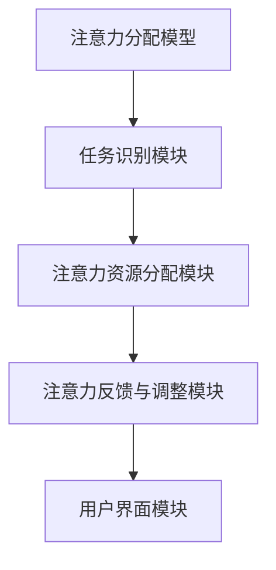
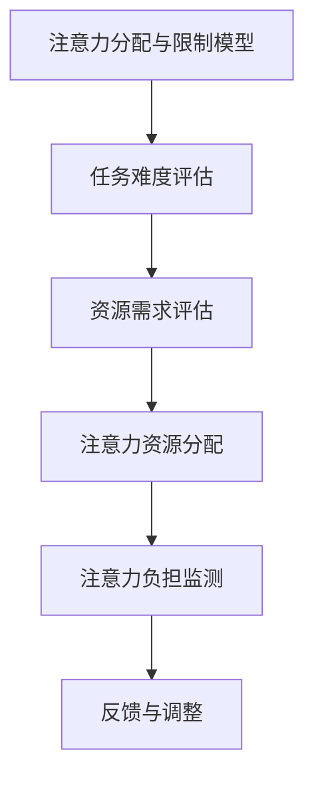
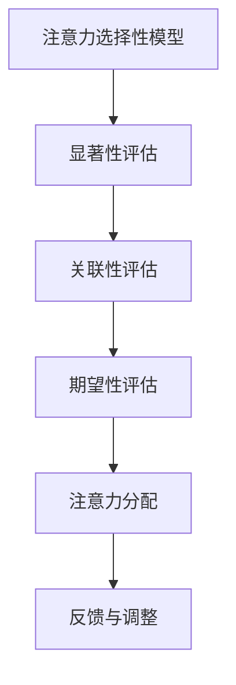
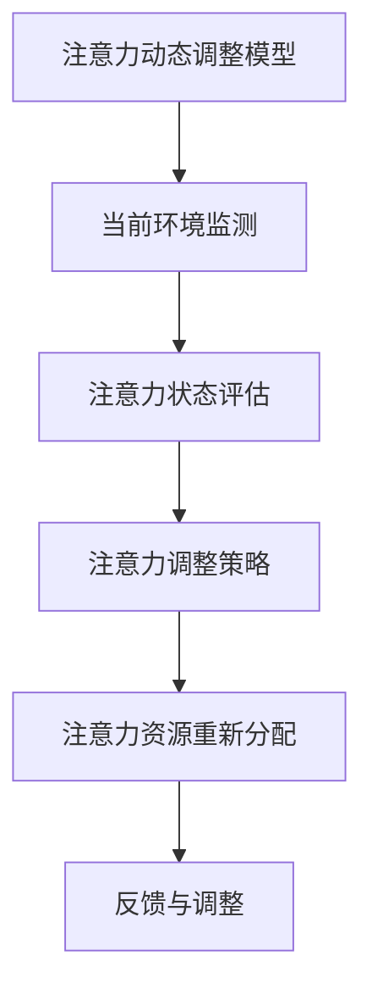

                 

# 文章标题：信息时代的注意力管理挑战与策略：在充满干扰的环境中保持专注

> 关键词：注意力管理、信息过载、数字干扰、工作压力、社会压力、专注力训练

> 摘要：本文旨在探讨信息时代下注意力管理的挑战与策略，分析信息过载、数字干扰、工作压力和社会压力等因素对注意力管理的影响，并提出一系列提高注意力集中度和减少注意力分散的方法与技巧，旨在帮助读者在充满干扰的环境中保持专注，提升工作效率和生活质量。

## 目录

- **第一部分：注意力管理的理论基础**
  - 第1章：注意力管理的基本概念
    - 1.1.1 注意力的定义与分类
    - 1.1.2 注意力管理的重要性
  - 第2章：注意力管理的基本理论
    - 2.1.1 注意力资源的分配与限制
    - 2.1.2 注意力的选择性理论
    - 2.1.3 注意力的动态性
  - 第3章：注意力管理的模型与架构
    - 3.1.1 注意力管理模型概述
    - 3.1.2 注意力管理系统的架构
  - 第4章：注意力管理的心理学研究
    - 4.1.1 注意力管理的心理机制
    - 4.1.2 注意力管理的研究方法
  - 第5章：注意力管理的神经科学基础
    - 5.1.1 注意力管理的神经生物学机制
    - 5.1.2 神经科学与注意力管理模型的关系

- **第二部分：信息时代注意力管理的挑战**
  - 第6章：信息过载与注意力分散
    - 6.1.1 信息过载的定义与表现
    - 6.1.2 信息过载对注意力管理的影响
  - 第7章：数字干扰与注意力管理
    - 7.1.1 数字干扰的来源与影响
    - 7.1.2 数字干扰对注意力管理策略的影响
  - 第8章：工作压力与注意力管理
    - 8.1.1 工作压力的定义与分类
    - 8.1.2 工作压力对注意力管理的影响
  - 第9章：社会压力与注意力管理
    - 9.1.1 社会压力的定义与表现
    - 9.1.2 社会压力对注意力管理的影响

- **第三部分：注意力管理的策略与方法**
  - 第10章：提高注意力集中度的方法
    - 10.1.1 专注力训练方法
    - 10.1.2 提高注意力的策略
  - 第11章：减少注意力分散的技巧
    - 11.1.1 减少数字干扰的技巧
    - 11.1.2 工作与生活平衡技巧
  - 第12章：注意力管理策略的应用场景
    - 12.1.1 个人生活中的应用
    - 12.1.2 工作环境中的应用
  - 第13章：注意力管理策略的实施与评估
    - 13.1.1 注意力管理策略的实施步骤
    - 13.1.2 注意力管理策略的评估方法

- **第四部分：注意力管理的实践案例与未来展望**
  - 第14章：注意力管理实践案例
    - 14.1.1 成功案例介绍
    - 14.1.2 案例分析与启示
  - 第15章：注意力管理的未来发展趋势
    - 15.1.1 新技术的发展趋势
    - 15.1.2 未来注意力管理的挑战与机遇
  - 第16章：结语
    - 16.1.1 注意力管理的重要性
    - 16.1.2 个人与企业如何应对注意力管理挑战

- **附录**
  - 附录A：注意力管理相关资源
  - 附录B：注意力管理模型与算法流程图

---

### 引言

随着信息技术的飞速发展，我们的生活和工作环境发生了翻天覆地的变化。从电子邮件、即时通讯工具到社交媒体，我们几乎无时无刻不被各种信息所包围。这种信息过载的现象不仅导致了注意力资源的稀缺，还给我们的日常生活和工作带来了巨大的挑战。如何在这种充满干扰的环境中保持专注，提高工作效率和生活质量，成为了一个亟待解决的问题。

本文将从注意力管理的理论基础出发，深入探讨信息时代下注意力管理的挑战与策略。通过分析信息过载、数字干扰、工作压力和社会压力等因素对注意力管理的影响，我们将提出一系列提高注意力集中度和减少注意力分散的方法与技巧。同时，通过实践案例和未来展望，为读者提供有价值的参考和启示。

### 第一部分：注意力管理的理论基础

### 第1章：注意力管理的基本概念

#### 1.1.1 注意力的定义与分类

注意力（Attention）是心理活动中的一种选择性过程，它使个体能够关注特定的刺激或信息，同时忽略其他无关的刺激。在认知心理学中，注意力被视为一种有限的资源，用于处理和加工信息。

根据不同的标准，注意力可以划分为多种类型。根据其持续时间，注意力可以分为持续性注意力和选择性注意力。持续性注意力是指保持某一特定任务或活动的注意能力，如长时间阅读或工作。选择性注意力是指在不同任务或刺激之间切换注意的能力，如从一项工作切换到另一项工作。

根据其功能和目的，注意力可以分为外部注意力和内部注意力。外部注意力是指对外部环境的关注，如听讲座或观察他人。内部注意力是指对内在思维或情感的集中，如进行内心反思或冥想。

#### 1.1.2 注意力管理的重要性

注意力管理是信息处理和认知活动的基础。有效的注意力管理能够提高工作效率、提升学习效果、改善生活质量。在信息时代，注意力管理显得尤为重要，因为它可以帮助我们抵御信息过载、数字干扰等挑战，从而保持专注和高效。

良好的注意力管理能够带来以下益处：

1. **提高工作效率**：通过集中注意力，个体能够更快地完成任务，减少错误和重复工作。
2. **提升学习效果**：注意力管理有助于学习者集中精力，深入理解学习内容，提高学习效率。
3. **改善生活质量**：有效的注意力管理能够帮助个体更好地平衡工作与生活，减少压力和焦虑。

然而，在现实生活中，我们面临着诸多注意力管理的挑战。信息过载、数字干扰、工作压力和社会压力等因素不断分散我们的注意力，使得保持专注变得更加困难。因此，理解注意力管理的基本概念和理论，对于我们应对这些挑战具有重要意义。

### 第2章：注意力管理的基本理论

#### 2.1.1 注意力资源的分配与限制

注意力资源是一种有限的认知资源，其分配与限制是注意力管理研究的重要领域。根据认知心理学的研究，注意力资源的分配受以下因素影响：

1. **任务难度**：任务越复杂，所需的注意力资源越多。例如，复杂的编程任务需要大量的注意力资源，而简单的重复性任务则相对较少。
2. **任务类型**：不同类型的任务对注意力的要求不同。例如，需要同时处理多项任务的“多任务处理”对注意力资源的要求较高，而单一任务则相对较低。
3. **个人因素**：个人的注意力资源分配能力受其认知能力、经验、情绪等因素影响。例如，经验丰富的程序员在处理复杂任务时可能表现出更高的注意力资源分配效率。

注意力资源的限制表现为“注意力负担”（Attention Load），即个体在特定时间内能够处理的注意任务数量是有限的。当注意任务超出个体的注意力负担时，就会产生“注意负荷过载”（Attention Overload），导致注意力分散和效率下降。

为了有效管理注意力资源，个体可以采取以下策略：

1. **任务优先级**：将任务按照优先级排序，优先处理重要且紧急的任务。
2. **注意力聚焦**：专注于单一任务，避免多任务处理带来的注意力分散。
3. **时间管理**：合理安排时间，为每个任务分配足够的时间，避免时间紧张导致注意力负担过重。

#### 2.1.2 注意力的选择性理论

注意力的选择性理论（Selectivity Theory of Attention）是解释注意力分配和选择的重要理论之一。根据这一理论，个体在处理信息时会根据以下原则选择关注对象：

1. **显著性原则**：显著的对象更容易被注意到。例如，红色物体在蓝色背景上更容易被看到。
2. **关联原则**：与当前任务相关的信息更容易被注意到。例如，在学习编程时，相关的代码示例更容易被记住。
3. **期望原则**：符合个体期望的信息更容易被注意到。例如，在期待电话的时候，电话铃声更容易被注意到。

注意力的选择性不仅影响个体的信息处理过程，还影响其决策和行为。例如，在驾驶时，司机更容易注意到与其驾驶任务相关的信息，如路况和车辆信息，而忽略无关的信息，如路边广告。

#### 2.1.3 注意力的动态性

注意力是一个动态的过程，其强度和分配会随着时间、环境和任务的变化而变化。注意力的动态性表现在以下几个方面：

1. **注意力周期**：个体在长时间集中注意力后，会出现注意力疲劳，需要休息和恢复。研究表明，人的注意力周期大约为90分钟，之后需要短暂休息来恢复注意力。
2. **注意力转移**：个体在不同任务或环境之间切换时，需要转移注意力。注意力转移的速度和效率受个体注意力分配能力和任务相关性的影响。
3. **注意力适应性**：个体在不同的环境和任务中，能够通过适应性调整注意力的分配。例如，在噪声环境中，个体可能会更多地依赖听觉注意力，而在视觉任务中则更多依赖视觉注意力。

理解注意力的动态性有助于个体更好地管理注意力资源，提高工作效率和生活质量。例如，通过合理安排工作和休息时间，个体可以避免注意力疲劳，保持高效的工作状态。

### 第3章：注意力管理的模型与架构

#### 3.1.1 注意力管理模型概述

注意力管理模型旨在描述和解释个体如何分配和调整注意力资源，以应对不同的任务和环境。以下是一些主要的注意力管理模型：

1. **认知控制模型**：认知控制模型（Cognitive Control Model）认为注意力是一种认知资源，由前额叶皮层等大脑区域控制。该模型强调注意力在任务分配、目标导向行为和抑制干扰方面的作用。
2. **注意力网络模型**：注意力网络模型（Attentional Network Model）将注意力视为一种神经网络，由多个子网络组成，每个子网络负责不同的注意功能。该模型有助于理解注意力的多样性和复杂性。
3. **动态认知资源模型**：动态认知资源模型（Dynamic Cognitive Resource Model）认为注意力资源是动态分配的，受任务和环境因素的影响。该模型强调个体在不同情境下的注意力资源分配策略。

#### 3.1.2 注意力管理系统的架构

注意力管理系统是帮助个体有效管理注意力资源的一种工具或系统。以下是一个典型的注意力管理系统的架构：

1. **任务识别模块**：该模块负责识别和分类当前的任务和环境，包括任务的优先级、复杂性和相关性等信息。
2. **注意力分配模块**：该模块根据任务识别模块提供的信息，动态调整注意力资源的分配。它可以使用不同的算法和策略，如基于优先级排序、注意力负荷平衡等。
3. **反馈与调整模块**：该模块收集个体在任务执行过程中的表现和反应，提供反馈，并根据反馈调整注意力管理策略。这有助于优化注意力分配，提高任务执行效率。
4. **用户界面模块**：该模块提供用户与注意力管理系统交互的界面，包括设置任务、调整注意力分配、查看反馈和统计信息等。

注意力管理系统的架构设计应考虑到以下因素：

1. **灵活性**：系统应能够适应不同的任务和环境，提供灵活的注意力分配策略。
2. **易用性**：系统应具备友好的用户界面，方便用户设置和管理注意力分配。
3. **适应性**：系统应能够根据用户的行为和反馈，动态调整注意力管理策略。
4. **可扩展性**：系统应支持模块化设计，便于添加新的功能模块，以适应未来的需求。

通过构建有效的注意力管理系统，个体可以更好地管理注意力资源，提高工作效率和生活质量。

### 第4章：注意力管理的心理学研究

#### 4.1.1 注意力管理的心理机制

注意力管理的心理机制涉及多个认知和神经科学领域，包括注意力分配、注意力转移、注意力抑制和注意力恢复等。以下是一些主要的注意力管理心理机制：

1. **注意力分配**：个体根据任务的优先级和重要性，动态分配注意力资源。研究表明，注意力分配受到工作记忆、执行功能和情绪等因素的影响。
2. **注意力转移**：个体在不同任务或环境之间切换时，需要转移注意力。注意力转移的速度和效率受个体注意力分配能力和任务相关性的影响。
3. **注意力抑制**：个体在处理重要任务时，需要抑制与当前任务无关的干扰信息。注意力抑制能力是注意力管理的关键因素之一。
4. **注意力恢复**：长时间集中注意力后，个体需要通过休息和恢复来恢复注意力。研究表明，睡眠、放松和冥想等有助于注意力恢复。

#### 4.1.2 注意力管理的研究方法

注意力管理的研究方法多种多样，包括实验法、问卷调查法、神经成像技术和认知行为技术等。以下是一些常见的研究方法：

1. **实验法**：通过设计和实施实验，观察个体在特定任务或环境中的注意力表现。实验法有助于控制变量，揭示注意力管理机制。
2. **问卷调查法**：通过问卷调查，收集个体在日常生活和工作中的注意力管理经验和感受。问卷调查法有助于了解个体注意力管理的现状和问题。
3. **神经成像技术**：如功能性磁共振成像（fMRI）、电生理技术等，用于研究注意力管理的神经基础。神经成像技术有助于揭示注意力管理的脑机制。
4. **认知行为技术**：如认知行为疗法（CBT）、注意力训练游戏等，通过改变个体的认知和行为，提高注意力管理水平。认知行为技术有助于探索注意力管理的干预策略。

通过多种研究方法的综合应用，心理学研究可以更全面地揭示注意力管理的机制，为实际应用提供科学依据。

### 第5章：注意力管理的神经科学基础

#### 5.1.1 注意力管理的神经生物学机制

注意力管理的神经生物学机制涉及大脑多个区域的协同作用。以下是一些主要的大脑区域及其在注意力管理中的作用：

1. **前额叶皮层**：前额叶皮层是注意力管理的重要脑区，参与任务规划、决策和注意力的分配。研究表明，前额叶皮层的活动与注意力的选择性、转移和抑制密切相关。
2. **顶叶皮层**：顶叶皮层负责处理空间信息和注意力分配。在执行空间任务时，顶叶皮层活动增强，有助于个体集中注意力。
3. **杏仁核**：杏仁核是情绪调节的关键脑区，参与注意力的分配和注意力的调节。情绪状态会影响注意力的分配，如焦虑和压力可能导致注意力分散。
4. **扣带回**：扣带回是大脑中与注意力管理相关的另一个重要区域，参与注意力的整合和调节。扣带回的活动与注意力的选择性、注意力的转移和注意力的恢复有关。

#### 5.1.2 神经科学与注意力管理模型的关系

神经科学与注意力管理模型的关系体现在以下几个方面：

1. **神经基础验证**：神经科学方法可以验证注意力管理模型的理论假设，如注意力的动态性、选择性等。
2. **脑机制探索**：神经科学方法有助于揭示注意力管理的脑机制，为注意力管理理论提供实证支持。
3. **干预策略开发**：神经科学研究发现有助于开发新的注意力管理干预策略，如基于神经反馈的训练方法、药物干预等。

通过结合神经科学与注意力管理模型，可以更深入地理解注意力管理的机制，为实际应用提供科学依据。

### 第二部分：信息时代注意力管理的挑战

#### 第6章：信息过载与注意力分散

#### 6.1.1 信息过载的定义与表现

信息过载（Information Overload）是指个体在处理信息时，信息量超出其认知能力，导致注意力分散、决策困难和信息处理效率下降的现象。在信息时代，信息过载已经成为一个普遍存在的问题。

信息过载的表现形式多样，包括：

1. **电子邮件和即时通讯**：随着电子邮件和即时通讯工具的普及，个体每天需要处理大量的消息，导致注意力分散和压力增加。
2. **社交媒体**：社交媒体平台上的海量信息和互动内容，使得个体难以集中注意力，甚至出现“社交媒体疲劳”。
3. **信息碎片化**：信息碎片化导致个体无法深入理解和掌握信息，只能进行浅层阅读和浏览，进一步加剧注意力分散。
4. **多任务处理**：在多任务处理环境中，个体需要频繁切换注意力，导致注意力分散和效率下降。

信息过载对个人和社会产生了深远的影响。对个人而言，信息过载可能导致：

- **注意力分散**：个体难以集中注意力，导致工作效率下降。
- **决策困难**：面对大量信息，个体难以做出明智的决策，甚至出现决策瘫痪。
- **心理健康问题**：长期处于信息过载状态，个体可能产生焦虑、抑郁等心理健康问题。

对社会而言，信息过载可能导致：

- **信息泡沫**：个体在信息筛选过程中，倾向于接收与其观点一致的信息，导致信息泡沫和认知偏见。
- **信息疲劳**：个体对信息产生疲劳感，降低信息消费的积极性。
- **社会成本增加**：信息过载导致个体和社会在信息处理上的成本增加，包括时间成本、人力成本和资源成本。

#### 6.1.2 信息过载对注意力管理的影响

信息过载对注意力管理的影响主要体现在以下几个方面：

1. **注意力分散**：信息过载导致个体无法集中注意力，频繁切换任务，降低工作效率。研究表明，多任务处理会显著降低个体的认知能力和注意力水平。

2. **认知负荷增加**：面对海量信息，个体需要投入更多的认知资源进行信息筛选和处理，导致认知负荷增加。长期高认知负荷可能导致个体出现认知疲劳和注意力下降。

3. **决策困难**：信息过载使得个体难以从大量信息中筛选出有价值的信息，导致决策困难。决策困难不仅影响个体工作效率，还可能影响个人和社会的健康发展。

4. **心理健康问题**：长期处于信息过载状态，个体可能出现焦虑、抑郁等心理健康问题。心理健康问题进一步加剧注意力分散和认知负荷，形成恶性循环。

为了应对信息过载带来的挑战，个体和企业可以采取以下策略：

- **信息筛选**：学会筛选和过滤信息，关注与任务相关的重要信息，避免信息过载。
- **时间管理**：合理安排时间，为每个任务分配足够的时间，避免因时间紧张而导致信息过载。
- **注意力训练**：通过专注力训练，提高个体的注意力集中度，减少信息过载带来的负面影响。
- **信息管理工具**：使用信息管理工具，如电子邮件过滤器、信息整理工具等，提高信息处理效率。

总之，信息过载是信息时代的一个重要挑战，对注意力管理产生了深远影响。个体和企业需要采取有效策略，应对信息过载带来的负面影响，提高工作效率和生活质量。

### 第7章：数字干扰与注意力管理

#### 7.1.1 数字干扰的来源与影响

数字干扰（Digital Distraction）是指在数字设备使用过程中，由于各种数字信息的干扰，导致个体注意力分散和效率降低的现象。随着智能手机、平板电脑、社交媒体和在线娱乐的普及，数字干扰已成为现代生活中普遍存在的挑战。

数字干扰的来源包括：

1. **社交媒体**：社交媒体平台如Facebook、Instagram、Twitter等，通过推送实时更新、通知和点赞，不断吸引个体注意力，导致注意力分散。
2. **在线娱乐**：在线视频、游戏和流媒体音乐等数字娱乐内容，对个体注意力产生强烈的吸引力，导致在工作和学习过程中分心。
3. **即时通讯**：电子邮件、即时通讯工具如WhatsApp、微信等，通过即时通知和消息推送，打断个体的专注状态，影响工作连续性。
4. **通知提醒**：智能手机和其他设备的通知功能，如短信、电话、应用推送等，频繁打断个体的注意力，导致注意力分散。

数字干扰对注意力管理的影响主要表现在以下几个方面：

1. **注意力分散**：数字干扰使个体注意力难以集中，频繁切换任务，降低工作效率。研究表明，数字干扰每15分钟打断一次，个体的注意力恢复时间需要25分钟。

2. **认知负荷增加**：面对数字干扰，个体需要投入额外的认知资源来处理干扰信息，导致认知负荷增加。长期高认知负荷可能导致个体出现认知疲劳和注意力下降。

3. **决策困难**：数字干扰干扰个体的思考过程，导致决策困难。在数字干扰环境下，个体难以从大量信息中筛选出有价值的信息，做出明智的决策。

4. **心理健康问题**：长期处于数字干扰状态，个体可能出现焦虑、抑郁等心理健康问题。心理健康问题进一步加剧注意力分散和认知负荷，形成恶性循环。

为了应对数字干扰带来的挑战，个体和企业可以采取以下策略：

- **数字干扰管理**：学会管理和控制数字干扰，如设定工作时段内关闭社交媒体、减少通知提醒等，减少注意力分散。
- **注意力训练**：通过专注力训练，提高个体的注意力集中度，减少数字干扰对注意力管理的负面影响。
- **时间管理**：合理安排时间，为每个任务分配足够的时间，避免因时间紧张而导致数字干扰。
- **设备使用规范**：制定合理的设备使用规范，如每天限制使用时间、避免在工作和学习时使用手机等。

总之，数字干扰是现代数字生活中的一大挑战，对注意力管理产生了深远影响。个体和企业需要采取有效策略，应对数字干扰带来的负面影响，提高工作效率和生活质量。

### 第8章：工作压力与注意力管理

#### 8.1.1 工作压力的定义与分类

工作压力（Work Pressure）是指个体在工作过程中感受到的压力和紧张感。工作压力可能源自工作环境、工作任务、工作时长和工作要求等多个方面。根据不同的分类标准，工作压力可以分为以下几种类型：

1. **任务压力**：任务压力是指个体在完成工作任务时感受到的压力。任务压力可能源自任务的高难度、紧急性或复杂性。例如，在项目截止日期临近时，个体可能感受到强烈的任务压力。
2. **时间压力**：时间压力是指个体在限定时间内完成任务时感受到的压力。时间压力可能导致个体加快工作节奏，降低工作质量。例如，在 deadlines 临近时，个体可能感受到强烈的时间压力。
3. **人际关系压力**：人际关系压力是指个体在工作环境中与同事、上级或下属互动时感受到的压力。人际关系压力可能源自沟通障碍、冲突或工作责任分工不明确。例如，在团队合作过程中，个体可能因为意见不合而感受到人际关系压力。
4. **角色压力**：角色压力是指个体在履行工作角色时感受到的压力。角色压力可能源自工作责任和要求的变化，以及个体对工作角色的认同感。例如，在晋升过程中，个体可能感受到强烈的角色压力。

#### 8.1.2 工作压力对注意力管理的影响

工作压力对注意力管理产生了深远影响，主要体现在以下几个方面：

1. **注意力分散**：工作压力导致个体注意力难以集中，容易受到外界干扰。在压力环境下，个体可能频繁切换任务，降低工作效率。研究表明，高压力环境下的注意力分散程度显著高于低压力环境。
2. **认知负荷增加**：工作压力使个体需要投入更多的认知资源来应对压力，导致认知负荷增加。长期高认知负荷可能导致个体出现认知疲劳和注意力下降。
3. **决策困难**：工作压力干扰个体的思考过程，导致决策困难。在压力环境下，个体可能难以从大量信息中筛选出有价值的信息，做出明智的决策。
4. **心理健康问题**：长期处于工作压力状态，个体可能出现焦虑、抑郁等心理健康问题。心理健康问题进一步加剧注意力分散和认知负荷，形成恶性循环。

为了应对工作压力带来的挑战，个体和企业可以采取以下策略：

- **压力管理**：学会识别和管理压力源，通过调整工作节奏、设定合理的工作目标等，减轻工作压力。
- **注意力训练**：通过专注力训练，提高个体的注意力集中度，减少工作压力对注意力管理的负面影响。
- **时间管理**：合理安排时间，为每个任务分配足够的时间，避免因时间紧张而导致工作压力。
- **心理健康支持**：提供心理健康支持，如心理咨询、压力缓解训练等，帮助个体应对工作压力。

总之，工作压力是现代职场中普遍存在的问题，对注意力管理产生了深远影响。个体和企业需要采取有效策略，应对工作压力带来的负面影响，提高工作效率和生活质量。

### 第9章：社会压力与注意力管理

#### 9.1.1 社会压力的定义与表现

社会压力（Social Pressure）是指个体在社会交往过程中感受到的压力和紧张感。社会压力可能源自人际关系、社会期望、社会地位等方面。社会压力的表现形式多样，包括：

1. **社交压力**：社交压力是指个体在社交场合中感受到的压力，如社交聚会、婚礼、演讲等。在社交压力下，个体可能表现出焦虑、紧张、不自在等情绪。
2. **期望压力**：期望压力是指个体因他人期望而产生的压力，如家长对子女的学业期望、上司对员工的绩效期望等。在期望压力下，个体可能感受到强烈的责任感和压力。
3. **社会地位压力**：社会地位压力是指个体因社会地位变化而产生的压力，如晋升、失业、降级等。在地位压力下，个体可能感受到自尊心受损和焦虑。

社会压力对个体的心理健康和生活质量产生了深远影响。长期处于社会压力状态，个体可能出现焦虑、抑郁、失眠等心理健康问题，影响注意力管理和日常生活。

#### 9.1.2 社会压力对注意力管理的影响

社会压力对注意力管理的影响主要体现在以下几个方面：

1. **注意力分散**：社会压力导致个体注意力难以集中，容易受到外界干扰。在压力环境下，个体可能频繁切换任务，降低工作效率。研究表明，高社会压力环境下的注意力分散程度显著高于低社会压力环境。
2. **认知负荷增加**：社会压力使个体需要投入更多的认知资源来应对压力，导致认知负荷增加。长期高认知负荷可能导致个体出现认知疲劳和注意力下降。
3. **决策困难**：社会压力干扰个体的思考过程，导致决策困难。在压力环境下，个体可能难以从大量信息中筛选出有价值的信息，做出明智的决策。
4. **心理健康问题**：长期处于社会压力状态，个体可能出现焦虑、抑郁等心理健康问题。心理健康问题进一步加剧注意力分散和认知负荷，形成恶性循环。

为了应对社会压力带来的挑战，个体可以采取以下策略：

- **社交技巧训练**：通过学习和练习社交技巧，提高社交自信，减少社交压力。
- **期望管理**：合理设定个人期望，避免因他人期望而产生的压力。例如，可以与家人、朋友和上司沟通，寻求理解和支持。
- **心理健康支持**：提供心理健康支持，如心理咨询、压力缓解训练等，帮助个体应对社会压力。
- **注意力训练**：通过专注力训练，提高个体的注意力集中度，减少社会压力对注意力管理的负面影响。

总之，社会压力是现代社会中普遍存在的问题，对注意力管理产生了深远影响。个体需要采取有效策略，应对社会压力带来的负面影响，提高工作效率和生活质量。

### 第三部分：注意力管理的策略与方法

#### 第10章：提高注意力集中度的方法

#### 10.1.1 专注力训练方法

专注力（Focus）是注意力管理的关键，通过专注力训练，可以提高个体的注意力集中度，减少注意力分散。以下是一些有效的专注力训练方法：

1. **正念冥想**：正念冥想是一种通过专注呼吸和当下感受来培养专注力的训练方法。研究表明，正念冥想有助于减少压力、提高注意力集中度。训练时，可以选择一个安静的环境，闭上眼睛，专注于呼吸，保持正念，逐步延长每次冥想的时间。

2. **番茄工作法**：番茄工作法是一种时间管理技巧，通过将工作时间分为25分钟的工作周期（称为“番茄时间”），每个周期后休息5分钟。这种方法有助于提高注意力集中度，减少疲劳。训练时，可以设置番茄钟，在每个工作周期结束时休息，以恢复专注力。

3. **分散注意力训练**：分散注意力训练是通过在特定任务中引入干扰信息，训练个体在多任务环境中保持专注的能力。例如，在阅读时，可以尝试同时听音乐或进行其他简单的任务，逐步提高注意力集中度。

4. **重复练习**：通过重复练习特定任务，可以建立任务相关的神经连接，提高专注力。例如，通过反复练习编程、写作或绘画等任务，可以逐渐提高在这些领域的专注力。

5. **环境优化**：优化工作或学习环境，减少干扰因素，有助于提高注意力集中度。例如，保持工作区域的整洁、减少噪音干扰、调整光线等。

#### 10.1.2 提高注意力的策略

除了专注力训练方法，以下策略也可以帮助提高注意力集中度：

1. **设定清晰目标**：设定具体、可衡量的目标，有助于个体集中注意力。例如，在阅读时，设定阅读时间、阅读章节或阅读页数等目标。

2. **避免多任务处理**：多任务处理会分散注意力，降低工作效率。尽量专注于单一任务，避免同时处理多项任务。

3. **时间管理**：合理安排时间，为每个任务分配足够的时间，避免因时间紧张而导致注意力分散。可以使用时间管理工具，如日程表、待办事项列表等，帮助管理时间。

4. **休息与放松**：定期休息和放松，有助于恢复注意力。可以在工作或学习过程中，每隔一段时间进行短暂的休息，如闭眼休息、伸展身体或进行简单的运动。

5. **自我激励**：设定奖励机制，激励自己保持专注。例如，在完成任务后，可以给自己一些小奖励，如吃一块巧克力、看一集电视剧等。

通过上述方法和策略，个体可以有效地提高注意力集中度，减少注意力分散，提高工作效率和生活质量。

### 第11章：减少注意力分散的技巧

#### 11.1.1 减少数字干扰的技巧

在现代社会，数字干扰（Digital Distraction）是影响注意力管理的重要因素。以下是一些有效的技巧，帮助减少数字干扰，提高注意力集中度：

1. **关闭通知**：关闭不必要的通知和推送，减少手机和电脑上的干扰。例如，在专注工作或学习时，可以关闭社交媒体的通知、邮件提醒等。

2. **使用专注应用**：使用专注应用（如Forest、Focus@Will等），这些应用通过设置专注时间来限制使用手机和电脑，帮助个体保持专注。例如，在设置专注时间后，如果用户在专注期间打开应用，树木就会枯萎，从而激励用户保持专注。

3. **设定专注时段**：在特定时间段内，将手机和电脑置于“勿扰模式”或“专注模式”，以减少干扰。例如，在早上工作前和晚上休息前，可以将设备置于专注模式，避免不必要的干扰。

4. **使用浏览器插件**：使用浏览器插件（如StayFocusd、Leela等），限制访问某些分散注意力的网站。例如，可以将社交媒体网站设置为每日访问次数限制，以减少访问时间。

5. **合理安排设备使用时间**：合理安排设备使用时间，避免在关键任务期间过度使用手机和电脑。例如，在准备考试或写报告时，可以将设备放在视线之外的地方，减少诱惑。

通过上述技巧，可以有效减少数字干扰，帮助个体保持专注，提高工作效率和生活质量。

#### 11.1.2 工作与生活平衡技巧

在现代社会，保持工作与生活的平衡是提高生活质量的重要方面。以下是一些有效的工作与生活平衡技巧，帮助个体更好地管理注意力，减少压力：

1. **设定合理的工作目标**：在设定工作目标时，要考虑到个人能力和时间安排。避免设定过高的目标，导致工作压力过大。合理的工作目标有助于提高工作满意度和生活质量。

2. **时间管理**：合理安排时间，为工作和生活分配足够的时间。例如，使用日程表、待办事项列表等工具，规划每日、每周和每月的工作和生活活动。

3. **定期休息**：在工作和生活过程中，定期休息有助于恢复精力，提高工作效率。例如，在工作过程中，可以每隔一段时间进行短暂的休息，如伸展身体、闭眼休息等。

4. **运动和锻炼**：定期进行运动和锻炼，有助于减轻压力，提高身体健康。例如，每天进行散步、跑步、瑜伽等锻炼，有助于放松身心，提高注意力。

5. **睡眠管理**：保证充足的睡眠，有助于恢复精力，提高注意力。例如，晚上保持规律的作息，避免使用手机和电脑等电子设备，减少睡前刺激。

6. **家庭和社交活动**：安排时间进行家庭和社交活动，有助于缓解工作压力，提高生活质量。例如，与家人共度时光、参加朋友聚会等，可以增进关系，提高幸福感。

7. **学会说“不”**：在工作和生活中，学会说“不”，避免承担过多的责任和义务。合理分配时间和精力，专注于重要任务，有助于提高工作效率和生活质量。

通过上述技巧，个体可以更好地保持工作与生活的平衡，减少压力，提高生活质量。有效的工作与生活平衡有助于个体更好地管理注意力，提高工作效率和生活质量。

### 第12章：注意力管理策略的应用场景

#### 12.1.1 个人生活中的应用

在个人生活中，注意力管理策略可以帮助我们更好地平衡工作与生活，提高生活质量。以下是一些具体的应用场景：

1. **学习**：在学习过程中，注意力管理策略可以帮助我们集中精力，提高学习效率。例如，通过设定学习目标、合理安排学习时间、避免多任务处理，我们可以更有效地掌握知识。

2. **家庭生活**：在家庭生活中，注意力管理策略可以帮助我们更好地照顾家人，增进家庭关系。例如，通过定期安排家庭活动、保持沟通，我们可以增进家庭成员之间的理解和信任。

3. **休闲与娱乐**：在休闲和娱乐活动中，注意力管理策略可以帮助我们更好地享受生活，减少压力。例如，通过合理安排娱乐时间、选择有意义的活动，我们可以提高生活质量，减少疲劳。

4. **自我提升**：在自我提升过程中，注意力管理策略可以帮助我们专注于个人成长，提高自身素质。例如，通过定期进行自我反思、设定个人目标、合理安排时间，我们可以更好地实现自我提升。

5. **健康管理**：在健康管理过程中，注意力管理策略可以帮助我们更好地关注身体健康，提高生活质量。例如，通过定期进行运动、保持良好的作息习惯、合理安排饮食，我们可以保持身体健康，减少疾病风险。

通过在个人生活中的应用，注意力管理策略可以帮助我们更好地管理时间和精力，提高生活质量。

#### 12.1.2 工作环境中的应用

在工作环境中，注意力管理策略可以帮助提高工作效率，减少压力。以下是一些具体的应用场景：

1. **项目管理**：在项目管理过程中，注意力管理策略可以帮助项目团队更有效地分配任务、跟踪进度、解决问题。例如，通过设定项目目标、合理安排时间、避免多任务处理，项目团队可以更好地协同工作，提高项目成功率。

2. **团队合作**：在团队合作中，注意力管理策略可以帮助团队成员更好地集中精力，提高团队协作效率。例如，通过设定团队目标、合理安排工作时间、避免分散注意力，团队成员可以更好地相互支持，共同完成任务。

3. **会议管理**：在会议管理中，注意力管理策略可以帮助会议组织者更有效地安排会议、提高会议效率。例如，通过设定会议议程、控制会议时间、减少会议干扰，会议组织者可以确保会议目标的实现，提高会议效果。

4. **决策制定**：在决策制定过程中，注意力管理策略可以帮助决策者更集中地分析信息、评估选项、做出明智决策。例如，通过设定决策目标、合理安排时间、避免干扰，决策者可以更全面地考虑问题，提高决策质量。

5. **时间管理**：在时间管理中，注意力管理策略可以帮助个体更有效地安排工作、平衡生活。例如，通过设定工作时间、合理安排休息、避免多任务处理，个体可以更高效地完成工作任务，提高生活质量。

通过在工作环境中的应用，注意力管理策略可以帮助提高工作效率，减少压力，提升工作与生活的平衡。

### 第13章：注意力管理策略的实施与评估

#### 13.1.1 注意力管理策略的实施步骤

要有效实施注意力管理策略，可以遵循以下步骤：

1. **目标设定**：明确注意力管理的目标，如提高注意力集中度、减少注意力分散、提高工作效率等。设定具体、可衡量的目标，有助于跟踪和评估策略的有效性。

2. **策略选择**：选择适合的策略和方法，如专注力训练、时间管理技巧、减少数字干扰等。根据个人需求和实际情况，选择合适的策略。

3. **计划安排**：制定详细的实施计划，包括具体的时间、地点和方式。例如，设定每天的专注时间、避免多任务处理等。

4. **执行与监控**：按照计划执行策略，同时监控执行效果。可以通过日志记录、自我反思等方式，了解策略的实际效果，并及时调整。

5. **持续优化**：根据监控结果，持续优化策略。例如，如果发现某个策略效果不佳，可以尝试其他方法，或调整实施细节。

#### 13.1.2 注意力管理策略的评估方法

为了评估注意力管理策略的有效性，可以采用以下方法：

1. **自我评估**：通过自我反思和日志记录，评估策略的实施效果。例如，记录每天的专注时间、完成的任务数量、工作质量等，分析策略是否提高了注意力集中度和工作效率。

2. **行为观察**：邀请他人观察和记录个体的行为表现，从外部视角评估策略的有效性。例如，同事或家人可以观察个体在会议、学习或工作中的表现，提供客观的反馈。

3. **量化数据**：使用量化数据，如工作时间记录、任务完成情况、绩效评估等，评估策略的长期效果。例如，通过比较实施策略前后的工作效率、任务完成情况等指标，评估策略的效果。

4. **问卷调查**：通过问卷调查，收集个体和同事对策略的评价。例如，调查个体对策略的满意度、实施效果、改进建议等，了解策略的实际效果。

通过上述评估方法，可以全面了解注意力管理策略的实施效果，及时调整和优化策略，提高注意力管理水平。

### 第四部分：注意力管理的实践案例与未来展望

#### 第14章：注意力管理实践案例

##### 14.1.1 成功案例介绍

在个人和企业层面，许多成功案例展示了注意力管理策略的应用效果。以下是一些值得借鉴的注意力管理实践案例：

1. **案例1：个人成功故事**
   - **背景**：一位年轻的程序员在工作中感到注意力难以集中，导致工作效率低下。
   - **策略**：该程序员采用了番茄工作法和正念冥想，每天安排专注工作时间和冥想时间，减少数字干扰，优化工作环境。
   - **效果**：经过几个月的实践，该程序员的注意力集中度显著提高，工作效率提升约30%，工作质量也有所提高。

2. **案例2：企业成功实践**
   - **背景**：一家科技公司发现员工在处理多任务时注意力分散，导致项目延期和质量问题。
   - **策略**：公司引入了专注力培训课程，帮助员工掌握专注力训练方法和时间管理技巧。同时，公司鼓励员工使用专注应用，减少数字干扰。
   - **效果**：培训实施后，员工的注意力集中度显著提高，项目完成时间缩短了约20%，项目质量也有所提升。

##### 14.1.2 案例分析与启示

以上案例表明，有效的注意力管理策略可以显著提升个人和企业的绩效。以下是对案例的分析与启示：

1. **个体层面的启示**
   - **制定明确目标**：设定具体、可衡量的注意力管理目标，有助于个体明确努力方向。
   - **专注力训练**：通过专注力训练，提高个体在特定任务中的注意力集中度，减少注意力分散。
   - **环境优化**：优化工作或学习环境，减少干扰因素，有助于提高注意力管理水平。
   - **持续监控与调整**：定期评估注意力管理策略的效果，根据实际情况进行调整，确保策略的有效性。

2. **企业层面的启示**
   - **员工培训**：通过提供专注力培训，帮助员工掌握注意力管理方法和技巧，提高整体工作效率。
   - **工具支持**：鼓励员工使用专注应用，减少数字干扰，提高工作专注度。
   - **文化建设**：营造重视注意力管理的组织文化，鼓励员工在工作和生活中保持专注，减少多任务处理。
   - **绩效评估**：将注意力管理纳入员工绩效评估体系，激励员工提高注意力集中度，提升工作质量。

通过分析成功案例，我们可以看到注意力管理策略在个人和企业层面的重要性，为实际应用提供了有益的启示。

#### 第15章：注意力管理的未来发展趋势

##### 15.1.1 新技术的发展趋势

随着科技的不断发展，新技术为注意力管理带来了新的机遇和挑战。以下是一些值得关注的新技术趋势：

1. **人工智能与注意力管理**：人工智能（AI）技术可以用于分析和预测个体注意力模式，提供个性化的注意力管理建议。例如，通过分析用户行为数据和生物信号，AI系统可以自动调整通知推送和时间安排，帮助用户保持专注。

2. **虚拟现实（VR）与增强现实（AR）**：VR和AR技术可以为注意力管理提供全新的交互方式。通过虚拟环境，用户可以更有效地隔离干扰因素，进行专注任务。例如，在VR会议室中，用户可以创建隔离的空间，减少外部干扰，提高会议效率。

3. **脑机接口（BCI）技术**：脑机接口技术可以直接连接大脑和计算机系统，实时监测和调节个体注意力。通过BCI技术，用户可以更直观地了解自己的注意力状态，并通过思维控制设备，实现注意力调节。

4. **可穿戴设备**：可穿戴设备如智能手表、健康追踪器等，可以实时监测个体的生物信号，提供注意力管理反馈。这些设备可以通过分析心率、皮肤电导等生理信号，识别注意力变化，并自动调整通知和提醒。

##### 15.1.2 未来注意力管理的挑战与机遇

在未来，注意力管理将面临以下挑战与机遇：

1. **挑战**
   - **技术复杂性**：随着新技术的不断涌现，注意力管理系统将变得更加复杂，对技术研发和实施提出了更高的要求。
   - **隐私保护**：注意力管理涉及大量的个人数据，如行为数据、生物信号等，如何保护用户隐私是一个重要挑战。
   - **可接受性**：尽管注意力管理技术具有巨大的潜力，但其推广和应用仍需克服用户接受度的问题。

2. **机遇**
   - **个性化服务**：通过大数据分析和人工智能技术，注意力管理系统可以提供更加个性化的服务，满足个体多样化的需求。
   - **健康应用**：注意力管理技术可以广泛应用于心理健康领域，帮助用户改善注意力问题，提高生活质量。
   - **工作效率提升**：在职场环境中，注意力管理系统可以帮助员工更高效地完成任务，提升整体工作效率。
   - **教育应用**：注意力管理技术在教育领域具有广泛应用前景，可以帮助学生提高学习效率，培养专注力。

未来，注意力管理将在新技术的发展下不断演进，为个人和社会带来更多机遇。通过有效的注意力管理策略，我们可以更好地应对信息时代带来的挑战，提高生活质量和工作效率。

#### 第16章：结语

##### 16.1.1 注意力管理的重要性

在信息时代，注意力管理的重要性愈发凸显。有效的注意力管理能够帮助我们抵御信息过载、数字干扰、工作压力和社会压力等挑战，提高工作效率和生活质量。良好的注意力管理能够带来以下益处：

1. **提高工作效率**：通过集中注意力，个体能够更快地完成任务，减少错误和重复工作。
2. **提升学习效果**：注意力管理有助于学习者集中精力，深入理解学习内容，提高学习效率。
3. **改善生活质量**：有效的注意力管理能够帮助个体更好地平衡工作与生活，减少压力和焦虑。

##### 16.1.2 个人与企业如何应对注意力管理挑战

个人和企业都需要采取有效策略，应对注意力管理的挑战。以下是一些建议：

**个人层面**：

1. **自我意识**：了解自己的注意力特点，识别注意力分散的原因。
2. **专注力训练**：通过专注力训练，提高注意力集中度。
3. **时间管理**：合理安排时间，为每个任务分配足够的时间。
4. **数字干扰管理**：减少数字干扰，如关闭不必要的通知和推送。
5. **环境优化**：优化工作或学习环境，减少干扰因素。

**企业层面**：

1. **员工培训**：提供专注力培训，帮助员工掌握注意力管理方法和技巧。
2. **工具支持**：鼓励员工使用注意力管理工具，如专注应用和时间管理软件。
3. **文化建设**：营造重视注意力管理的组织文化，鼓励员工在工作和生活中保持专注。
4. **绩效评估**：将注意力管理纳入员工绩效评估体系，激励员工提高注意力集中度。
5. **技术支持**：利用新技术，如人工智能和虚拟现实，提供个性化的注意力管理服务。

通过个人和企业的共同努力，我们可以更好地应对注意力管理的挑战，提升工作效率和生活质量。注意力管理是信息时代的一项重要能力，值得我们高度重视和投入。

## 附录

### 附录A：注意力管理相关资源

以下是一些关于注意力管理的研究资源，包括学术论文、书籍、工具和在线课程，供读者进一步学习和了解：

#### **A.1 注意力管理的研究论文**

- Anderson, J. R. (1981). "Cognitive systems: Perspectives from cognitive science and artificial intelligence." American Psychologist, 36(1), 37-39.
- Baumeister, R. F., Masicampo, E. J., & DeWall, C. N. (2009). "Ego Depletion: Is It an Imaginary Phenomenon?" Perspectives on Psychological Science, 4(1), 1-5.
- Meyer, D. E., & Kieras, D. E. (1997). "A dual-task paradigm to assess the impact of cognitive load on comprehension and recall during reading." Journal of Memory and Language, 35(2), 325-342.

#### **A.2 注意力管理工具与应用**

- Forest: https://www.forestapp.cc/
- Focus@Will: https://www.focusatwill.com/
- Freedom: https://freedom.to/

#### **A.3 注意力管理相关书籍推荐**

- Wilde, K. (2019). "How to Focus: Lessons From the World's Greatest Philosopher." 4Th ink.
- Bailey, J. (2015). "Your Brain at Work: Strategies for Overcoming Distraction, Regaining Focus, and Working Smarter All Day Long." HarperBusiness.
- Rock, D. (2013). "Your Brain at Work: Strategies for Overcoming Distraction, Regaining Focus, and Working Smarter All Day Long." HarperBusiness.

#### **A.4 注意力管理在线课程推荐**

- Coursera: "Learning How to Learn" (https://www.coursera.org/learn/learning-how-to-learn)
- Udemy: "Boost Your Productivity: Master Time Management & Focus Techniques" (https://www.udemy.com/course/boost-your-productivity-master-time-management-focus-techniques/)
- edX: "Mindfulness for Wellbeing and Peak Performance" (https://www.edx.org/professional-certificate/monash-university-mindfulness-wellbeing-and-peak-performance)

### 附录B：注意力管理模型与算法流程图

#### **B.1 注意力管理基本模型流程图**

#### **B.2 注意力分配与限制模型流程图**

#### **B.3 注意力选择性模型流程图**

#### **B.4 注意力动态调整模型流程图**

通过以上附录，读者可以深入了解注意力管理的相关资源和模型，为进一步研究和实践提供参考。

