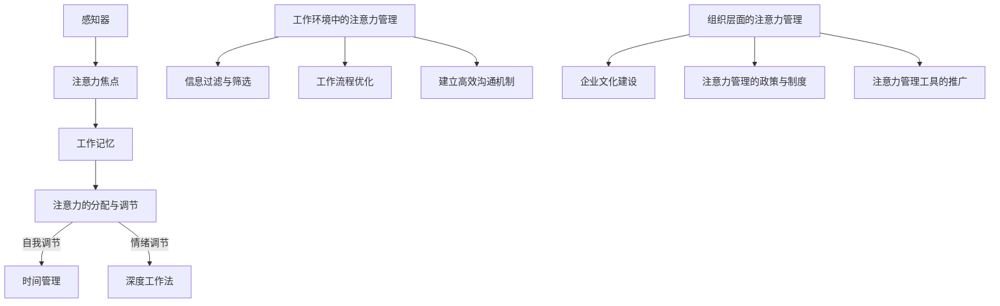

                 

# 文章标题：信息时代的注意力管理挑战与策略：在干扰和信息过载中航行

> 关键词：注意力管理、信息过载、干扰处理、策略、技术工具

> 摘要：本文深入探讨了信息时代背景下，个体和组织在注意力管理方面面临的挑战。通过介绍注意力管理的基本理论、挑战以及策略，文章旨在为读者提供一套有效的注意力管理方法和实践，帮助他们在信息过载和干扰的环境中保持高效和专注。

### 目录

1. **引言与背景**
    1.1 信息时代的社会现状
    1.2 注意力管理的概念
    1.3 注意力管理的研究现状

2. **注意力管理的理论框架**
    2.1 注意力的生物心理学基础
    2.2 注意力管理模型
    2.3 注意力管理的核心要素

3. **注意力管理面临的挑战**
    3.1 信息过载对注意力管理的影响
    3.2 信息过载对个体的影响
    3.3 信息过载对工作环境和组织的影响

4. **注意力管理的策略与方法**
    4.1 个体注意力管理的策略
    4.2 工作环境中注意力管理的策略
    4.3 集中注意力的技巧

5. **注意力管理的实践与应用**
    5.1 教育领域的注意力管理应用
    5.2 职场中的注意力管理应用
    5.3 组织层面的注意力管理

6. **注意力管理的未来趋势**
    6.1 注意力管理的未来趋势
    6.2 注意力管理面临的挑战

7. **附录**

### 1. 引言与背景

在当今快速发展的信息时代，信息过载和干扰已成为普遍现象。人们每天都被大量的信息包围，这些信息可能来自互联网、社交媒体、电子邮件、手机通知等各种渠道。注意力作为人类认知系统中的重要资源，其有限性使得我们在处理信息时面临着巨大的挑战。

1.1 信息时代的社会现状

随着互联网的普及和移动设备的普及，信息传播的速度和广度都得到了极大的提升。人们可以在瞬间获取全球各地的信息，但这种便利也带来了信息过载的问题。研究表明，现代人每天接收到的信息量是过去几十年总和的数千倍。这种信息过载现象导致人们无法有效地处理和利用这些信息，从而影响了工作和生活的质量。

1.2 注意力管理的概念

注意力是指心理活动对一定对象的指向和集中。在信息时代，注意力管理变得尤为重要。注意力管理涉及到以下几个方面：

- **注意力选择**：个体如何从众多信息中选择出最相关的信息。
- **注意力分配**：个体如何将有限的注意力资源分配给不同的任务和活动。
- **注意力调节**：个体如何根据任务的要求和环境的变化调整注意力的集中程度。

1.3 注意力管理的研究现状

注意力管理作为一个跨学科的研究领域，涵盖了心理学、神经科学、管理学等多个领域。近年来，研究者们从不同的角度对注意力管理进行了深入的研究。例如，工业与组织心理学研究者提出了多种注意力管理模型，如多任务处理模型、注意力分配模型等。神经科学研究者则通过脑成像技术探讨了注意力系统的神经基础。这些研究为理解和改善注意力管理提供了重要的理论和实践基础。

### 2. 注意力管理的理论框架

注意力管理不仅仅是个人习惯的调整，它有着深厚的理论和科学基础。本节将介绍注意力管理的理论基础，包括生物心理学基础、注意力管理模型以及注意力管理的核心要素。

2.1 注意力的生物心理学基础

注意力的生物心理学基础主要涉及神经科学和认知心理学的研究成果。研究表明，注意力系统包括多个组成部分，如感知器、注意力焦点、工作记忆和注意力的分配与调节系统。

- **感知器**：感知器是注意力的最初阶段，它负责接收和处理外部刺激。感知器的选择性决定了哪些信息能够引起我们的注意。
- **注意力焦点**：注意力焦点是指个体当前关注的特定对象或任务。注意力焦点使得个体能够集中精力处理特定信息，从而提高工作效率。
- **工作记忆**：工作记忆是注意力系统的一个重要组成部分，它负责暂时存储和处理信息。工作记忆的容量有限，因此个体在处理复杂任务时需要有效地管理注意力资源。
- **注意力的分配与调节**：注意力的分配与调节是指个体如何在不同任务和活动之间分配注意力资源，以及如何根据任务的要求和环境的变化调整注意力的集中程度。有效的注意力分配和调节有助于提高工作效率和应对复杂环境。

2.2 注意力管理模型

注意力管理模型是理解和指导注意力管理实践的重要工具。不同的模型从不同的角度对注意力管理进行了阐述。以下介绍几种常见的注意力管理模型：

- **多任务处理模型**：多任务处理模型关注个体如何同时处理多个任务。该模型认为，个体在多任务处理过程中需要灵活调整注意力资源，以适应不同任务的优先级和复杂度。
- **注意力分配模型**：注意力分配模型主要研究个体如何在不同任务和活动之间分配注意力资源。该模型强调个体需要根据任务的紧急程度和重要性来合理分配注意力，以提高工作效率。
- **注意力调节模型**：注意力调节模型关注个体如何根据任务的要求和环境的变化调整注意力的集中程度。该模型认为，个体需要具备自我调节能力，以保持注意力的稳定性和专注度。

2.3 注意力管理的核心要素

注意力管理的核心要素包括注意力选择、注意力分配和注意力调节。

- **注意力选择**：注意力选择是指个体如何从众多信息中选择出最相关的信息。有效的注意力选择有助于个体集中精力处理关键任务，提高工作效率。注意力选择涉及到感知器的作用，即如何从外部刺激中选择出重要的信息。
- **注意力分配**：注意力分配是指个体如何在不同任务和活动之间分配注意力资源。有效的注意力分配有助于个体在多任务环境中保持高效和专注。注意力分配需要考虑任务的优先级和复杂度，以及个体注意力资源的有限性。
- **注意力调节**：注意力调节是指个体如何根据任务的要求和环境的变化调整注意力的集中程度。有效的注意力调节有助于个体保持注意力的稳定性和专注度，应对复杂和变化的环境。注意力调节需要个体具备自我调节能力，能够灵活调整注意力的集中程度。

### 3. 注意力管理面临的挑战

尽管注意力管理在理论和实践中都取得了显著进展，但在信息过载和干扰日益严重的环境中，注意力管理仍然面临着诸多挑战。

3.1 信息过载对注意力管理的影响

信息过载是指个体接收到的信息量超过了其处理能力，从而导致信息处理效率降低和认知负担增加。信息过载对注意力管理的影响主要体现在以下几个方面：

- **注意力资源的消耗**：信息过载导致个体需要处理大量的信息，从而消耗了有限的注意力资源。这种消耗不仅降低了个体处理信息的效率，还可能导致注意力疲劳和注意力分散。
- **决策能力的削弱**：信息过载使得个体难以在短时间内做出高质量的决策。大量信息的干扰使得个体无法清晰地判断信息的价值和重要性，从而影响了决策的准确性和有效性。
- **工作环境和组织的影响**：信息过载不仅影响个体的注意力管理，还可能导致工作环境和组织效率的下降。在信息过载的环境中，团队成员之间可能存在沟通障碍，难以协作完成任务。

3.2 信息过载对个体的影响

信息过载对个体的影响是全方位的，不仅影响个体的认知功能，还可能对个体的身心健康产生负面影响。以下从几个方面分析信息过载对个体的影响：

- **认知功能下降**：信息过载导致个体在处理信息时容易出现注意力分散、记忆困难等问题。这种认知功能的下降使得个体难以高效地完成任务，降低了工作和学习效率。
- **情绪波动**：信息过载可能导致个体情绪波动，例如焦虑、压力和紧张等。这些负面情绪会影响个体的心理健康和生活质量。
- **生理疲劳**：长时间处理大量信息可能导致个体出现生理疲劳，例如眼睛疲劳、头痛和睡眠障碍等。这些生理问题进一步加剧了信息过载对个体的负面影响。

3.3 信息过载对工作环境和组织的影响

信息过载不仅影响个体，还对工作环境和组织产生深远的影响。以下从几个方面分析信息过载对工作环境和组织的影响：

- **工作效率下降**：信息过载导致团队成员在处理信息时效率降低，从而影响了整体的工作效率。团队成员可能需要花费更多的时间来筛选和处理信息，导致任务延误。
- **团队合作障碍**：信息过载可能阻碍团队成员之间的有效沟通和协作。大量信息的干扰使得团队成员难以集中精力进行讨论和协作，从而影响了团队的整体表现。
- **组织文化影响**：信息过载可能导致组织内部出现低效、混乱和压力过大的情况。这种组织文化可能导致员工流失、工作效率低下和创新能力下降。

### 4. 注意力管理的策略与方法

面对信息过载和干扰，个体和组织需要采取一系列有效的注意力管理策略和方法，以保持高效和专注。以下从个体层面和工作环境层面介绍注意力管理的策略和方法。

#### 4.1 个体注意力管理的策略

个体注意力管理策略主要关注如何提高个人的注意力质量和管理能力。以下介绍几种常见的个体注意力管理策略：

- **时间管理**：时间管理是注意力管理的基础。通过合理规划时间，个体可以更好地分配注意力资源，避免时间的浪费和冲突。例如，使用日历应用程序或时间管理工具来安排任务和日程，确保注意力集中在高优先级的任务上。

- **情绪调节**：情绪调节是注意力管理的重要组成部分。个体需要学会应对压力和负面情绪，以保持心理平衡和专注度。例如，通过深呼吸、冥想或运动来放松身心，提高情绪调节能力。

- **深度工作法**：深度工作法是一种专注于高质量工作的策略。个体通过减少干扰和设定专注时间，进入“深度工作”状态，从而提高工作质量和效率。例如，使用专注工具或隔离应用程序来屏蔽干扰，保持专注。

- **简化任务与目标**：简化任务和目标是注意力管理的关键。个体需要明确任务的重要性和目标，将复杂的任务分解为简单的步骤，以减少注意力的分散和压力。例如，使用任务管理工具或清单来组织任务，确保注意力集中。

#### 4.2 工作环境中注意力管理的策略

工作环境对个体注意力管理具有重要影响。以下介绍几种常见的工作环境中注意力管理的策略：

- **工作流程优化**：工作流程优化是提高工作效率和减少干扰的重要手段。通过分析和改进工作流程，个体和组织可以减少不必要的步骤和环节，提高工作的流畅性和效率。例如，采用精益管理方法或流程优化工具来改进工作流程。

- **信息过滤与筛选**：信息过滤与筛选是减少信息过载和干扰的有效策略。个体和组织需要学会筛选和过滤与工作无关的信息，确保注意力集中在高优先级的任务上。例如，使用邮件过滤器、社交媒体屏蔽工具或信息过滤应用程序来减少干扰。

- **建立高效沟通机制**：建立高效沟通机制有助于减少信息过载和干扰。通过明确沟通目的、规范沟通流程和选择合适的沟通工具，个体和组织可以确保信息的有效传递和接收。例如，使用即时通讯工具、视频会议系统或协作平台来提高沟通效率。

- **组织文化塑造**：组织文化对个体的注意力管理具有重要影响。一个积极、高效和团结的组织文化有助于个体保持专注和投入。例如，通过鼓励自主管理、建立奖励机制和提供培训机会来塑造组织文化。

#### 4.3 集中注意力的技巧

集中注意力是注意力管理的重要目标。以下介绍几种常见的集中注意力的技巧：

- **番茄工作法**：番茄工作法是一种时间管理技巧，通过将工作时间划分为25分钟的专注时段（番茄时间）和5分钟的休息时间，帮助个体保持专注。这种方法通过规律性的休息来提高注意力的持久性和效率。

- **专注空间设计**：专注空间设计是创造一个有利于集中注意力的环境。个体和组织可以通过调整工作空间布局、减少噪音和干扰因素来创造一个安静、舒适和有序的专注空间。

- **专注工具使用**：专注工具可以帮助个体屏蔽干扰，提高专注度。例如，使用专注应用程序、屏蔽应用程序或噪声屏蔽器来减少外部干扰。

### 5. 注意力管理的实践与应用

注意力管理的理论和方法在实际应用中具有广泛的应用前景。以下从教育领域、职场和组织层面介绍注意力管理的实践与应用。

#### 5.1 教育领域的注意力管理应用

教育领域是一个重视注意力管理的典型领域。通过有效的注意力管理，学生可以更好地掌握知识，提高学习效果。以下介绍几种教育领域的注意力管理应用：

- **注意力训练课程**：注意力训练课程旨在提高学生的注意力质量和管理能力。这些课程通常包括注意力集中训练、注意力分配训练和注意力调节训练等，帮助学生掌握注意力管理的技巧。

- **注意力管理工具的使用**：注意力管理工具可以帮助学生更好地管理学习时间和任务。例如，使用日历应用程序、任务管理工具和学习计划工具来组织学习任务和日程，确保注意力集中在高优先级的任务上。

- **教学过程中的注意力管理**：教师在教学过程中也需要关注学生的注意力管理。通过合理设计教学活动、控制课堂节奏和提供明确的指导，教师可以帮助学生保持专注，提高学习效果。

#### 5.2 职场中的注意力管理应用

职场是一个高度依赖注意力管理的环境。通过有效的注意力管理，职场人员可以提高工作效率和职业素养。以下介绍几种职场中的注意力管理应用：

- **提高工作效率的技巧**：职场人员可以通过时间管理、情绪调节和深度工作法等技巧来提高工作效率。例如，使用番茄工作法来管理工作时间，通过情绪调节来保持心理平衡，通过深度工作法来提高专注度和工作质量。

- **建立高效的沟通机制**：职场中的沟通是注意力管理的重要组成部分。通过建立高效的沟通机制，职场人员可以确保信息的有效传递和接收，减少信息过载和干扰。例如，使用即时通讯工具、视频会议系统和协作平台来提高沟通效率。

- **组织层面的注意力管理**：组织可以通过建立良好的组织文化和提供培训机会来提高员工的注意力管理能力。例如，通过鼓励自主管理、建立奖励机制和提供注意力管理培训来塑造组织文化。

#### 5.3 组织层面的注意力管理

组织层面的注意力管理是提高组织整体效率和绩效的重要手段。以下介绍几种组织层面的注意力管理应用：

- **企业文化建设**：企业文化建设是组织层面注意力管理的基础。通过建立积极、高效和团结的企业文化，组织可以激发员工的潜能和创造力，提高组织的整体效率和绩效。

- **注意力管理的政策与制度**：组织可以通过制定注意力管理的政策和制度来规范员工的行为和习惯。例如，制定工作时间制度、休息制度和学习制度等，确保员工在工作和学习中保持高效和专注。

- **注意力管理工具的推广**：组织可以推广注意力管理工具，帮助员工更好地管理注意力和时间。例如，提供专注应用程序、时间管理工具和学习平台等，提高员工的工作效率和职业素养。

### 6. 注意力管理的未来趋势

随着科技的不断进步和社会的快速发展，注意力管理面临着新的挑战和机遇。以下探讨注意力管理的未来趋势。

#### 6.1 注意力管理的未来趋势

- **新技术的应用**：随着人工智能、虚拟现实和增强现实等新技术的不断发展，注意力管理将迎来新的变革。例如，通过人工智能技术，可以实时分析个体的注意力状态和行为模式，提供个性化的注意力管理建议和干预措施。

- **个性化注意力管理**：未来注意力管理将更加注重个性化。通过大数据和人工智能技术，可以收集和分析个体的注意力数据，为个体提供定制化的注意力管理策略和方案。

- **注意力管理的普及**：随着对注意力管理重要性的认识不断提高，注意力管理将逐渐成为社会各界关注的热点。从学校教育到职场培训，从个体自我管理到组织管理，注意力管理将成为提高工作效率和提升生活质量的重要手段。

#### 6.2 注意力管理面临的挑战

- **技术进步带来的影响**：技术进步一方面提高了信息的传播速度和广度，但另一方面也加剧了信息过载和干扰。如何在享受技术进步带来的便利的同时，有效管理注意力资源，将成为未来注意力管理的重要挑战。

- **社会变革对注意力管理的要求**：随着社会的快速变革，人们对注意力管理的需求也在不断变化。例如，远程办公、灵活工作制和数字化教育等新兴工作方式对注意力管理提出了新的要求和挑战。如何适应这些变革，提高注意力管理能力，将成为未来研究的重要方向。

### 7. 附录

#### 7.1 注意力管理相关的工具与资源

- **注意力管理应用软件推荐**：
  - **Forest**：一款基于番茄工作法的专注应用，通过种植虚拟树木来激励用户保持专注。
  - **App Focus**：一款专注时间追踪工具，可以帮助用户监控自己的注意力分散情况。

- **注意力管理研究文献与报告**：
  - 《注意力管理：理论与实践》
  - 《信息过载与注意力管理：挑战与应对》
  - 相关期刊：Journal of Attention Studies、Attention and Performance Series等。

### 梅尔图流程图示例



### 伪代码示例

```python
def attention_management(task_list, priority_list, time_limit):
    current_time = 0
    while current_time < time_limit:
        highest_priority_task = select_highest_priority(task_list, priority_list)
        start_time = current_time
        perform_task(highest_priority_task)
        current_time += highest_priority_task.duration
        if is_interference_detected():
            current_time += handle_interference()
    return "Attention management completed."

def select_highest_priority(task_list, priority_list):
    highest_priority_task = None
    for task in task_list:
        if priority_list[task.id] > (highest_priority_task is None or priority_list[highest_priority_task.id]):
            highest_priority_task = task
    return highest_priority_task

def perform_task(task):
    print(f"Performing task: {task.name}")
    time.sleep(task.duration)

def is_interference_detected():
    # Implement logic to detect interference
    return True

def handle_interference():
    # Implement logic to handle interference
    return 5  # 5 seconds of interference
```

### 数学模型示例

**注意力分配模型**

$$
\begin{aligned}
    &\text{选择函数} = f(\text{任务优先级}, \text{当前注意力资源}) \\
    &f(p, a) = \frac{p}{a}
\end{aligned}
$$

其中，$p$ 表示任务的优先级，$a$ 表示当前可用的注意力资源。

### 项目实战示例

**Python代码：注意力管理工具实现**

```python
import time
import threading

def work_session(tasks, session_duration):
    start_time = time.time()
    completed_tasks = []
    for task in tasks:
        if (time.time() - start_time) > session_duration:
            break
        thread = threading.Thread(target=execute_task, args=(task,))
        thread.start()
        completed_tasks.append(task)
    print("Work session ended. Tasks completed:", completed_tasks)

def execute_task(task):
    print(f"Executing task: {task['name']}")
    time.sleep(task['duration'])
    print(f"Task {task['name']} completed.")

tasks = [
    {"name": "Reading Document", "duration": 30},
    {"name": "Coding", "duration": 45},
    {"name": "Meeting Preparation", "duration": 15}
]

work_session(tasks, 60*3)  # 60-minute work session
```

### 代码解读与分析

在上面的代码中，我们实现了一个简单的注意力管理工具，用于在一个给定的时间段内按任务优先级执行任务。`work_session` 函数接受一个任务列表和一个总工作时长（以秒为单位），并创建线程来并行执行任务。

- **任务列表**：每个任务都有一个名称和预计的处理时间。
- **总工作时长**：设定一个工作时段，用于限制任务的执行时间。

在 `work_session` 函数中，我们首先记录开始时间，然后遍历任务列表。对于每个任务，我们启动一个新的线程来执行任务。线程的使用确保了任务可以在后台并行执行，从而提高了工作效率。

在每次循环中，我们检查当前时间是否超过了总工作时长。如果没有，则启动新的任务线程。如果超过了，则跳出循环，结束工作时段。

`execute_task` 函数是任务执行的入口，它接受一个任务对象，打印任务名称，然后模拟任务执行，通过`time.sleep`函数暂停相应的时间，表示任务处理完成。

这个简单的代码示例展示了如何使用线程和定时器来实现注意力管理。在实际应用中，可以进一步扩展这个模型，包括任务优先级的动态调整、任务依赖关系的处理和异常情况的处理等。

### 作者信息

作者：AI天才研究院/AI Genius Institute & 禅与计算机程序设计艺术 /Zen And The Art of Computer Programming

