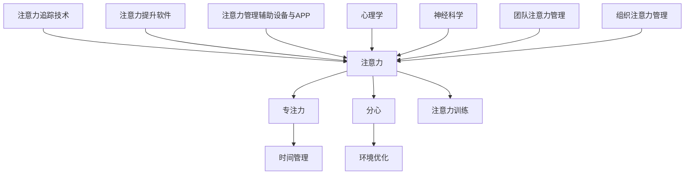

                 

# 文章标题：信息时代的注意力管理挑战：如何在充满干扰的世界中保持专注

> 关键词：注意力管理、信息干扰、专注力、心理学、神经科学、技术工具

> 摘要：本文深入探讨了信息时代下注意力管理的挑战和策略，通过分析注意力管理的核心概念、原理、心理学研究以及技术工具，提供了一套个人、团队和组织层面的注意力管理实践指南，旨在帮助读者在充满干扰的环境中保持专注，提高工作效率。

----------------------------------------------------------------

# 《信息时代的注意力管理挑战：如何在充满干扰的世界中保持专注》目录大纲

## 第一部分：注意力管理基础

### 第1章：注意力管理的核心概念

- 1.1 注意力的定义与类型
- 1.2 注意力管理的重要性
- 1.3 注意力分散的原因分析
- 1.4 注意力管理的误区

### 第2章：注意力管理的原理与机制

- 2.1 注意力分配的理论基础
- 2.2 专注力与分心的关系
- 2.3 注意力管理的神经科学依据
- 2.4 注意力疲劳与恢复策略

### 第3章：注意力管理的心理学研究

- 3.1 心理学对注意力管理的理解
- 3.2 常见注意力管理理论介绍
- 3.3 注意力管理的研究进展与趋势

### 第4章：注意力管理的技术工具

- 4.1 注意力追踪技术介绍
- 4.2 注意力提升软件的应用
- 4.3 注意力管理辅助设备与APP

## 第二部分：注意力管理实践

### 第5章：个人注意力管理策略

- 5.1 时间管理方法
- 5.2 环境优化策略
- 5.3 注意力训练方法
- 5.4 个人注意力管理案例分享

### 第6章：团队注意力管理策略

- 6.1 团队注意力管理的重要性
- 6.2 团队注意力管理的挑战
- 6.3 团队注意力管理策略
- 6.4 团队注意力管理案例研究

### 第7章：注意力管理在组织中的应用

- 7.1 组织注意力管理的策略
- 7.2 注意力管理在企业文化中的应用
- 7.3 注意力管理在组织流程优化中的应用
- 7.4 注意力管理在组织变革中的应用

### 第8章：注意力管理的前沿探索与未来趋势

- 8.1 注意力管理的新技术
- 8.2 注意力管理的未来研究方向
- 8.3 注意力管理在虚拟现实与增强现实中的应用
- 8.4 注意力管理对人类社会发展的影响

## 附录

### 附录A：注意力管理常用工具与资源

- A.1 注意力管理应用推荐
- A.2 注意力管理研究资源
- A.3 注意力管理相关书籍与论文推荐

### 附录B：注意力管理案例实践指南

- B.1 个人注意力管理实践指南
- B.2 团队注意力管理实践指南
- B.3 组织注意力管理实践指南

### 附录C：注意力管理专家访谈与观点

- C.1 专家对注意力管理的看法
- C.2 注意力管理实践心得与建议
- C.3 注意力管理未来展望

## Mermaid 流程图：注意力管理核心概念联系



----------------------------------------------------------------

## 注意力管理的核心算法原理讲解

### 注意力分配算法

注意力分配算法是注意力管理中的一个关键步骤，它帮助我们合理地分配注意力资源，以达到高效工作的目标。以下是注意力分配算法的伪代码：

```python
# 伪代码：注意力分配算法
function AttentionAllocation(totalAttention, tasks):
    for each task in tasks:
        task.importance = calculateImportance(task)
    sorted_tasks = sort(tasks, by='importance', descending=True)
    for task in sorted_tasks:
        if totalAttention > 0:
            task.attention = min(totalAttention, task.maxAttention)
            totalAttention -= task.attention
        else:
            task.attention = 0
    return tasks
```

在这个算法中，我们首先计算每个任务的重要性，并将任务按重要性排序。然后，我们依次为每个任务分配注意力，确保总注意力不超过设定的上限。

### 注意力疲劳恢复策略

注意力疲劳是注意力管理中的另一个重要问题。为了恢复注意力，我们可以采用以下策略：

$$
\text{恢复策略} = \alpha \times (\text{休息时间} + \text{恢复活动时间})
$$

其中，$\alpha$ 为恢复系数，表示恢复能力的强弱。休息时间和恢复活动时间越长，恢复效果越好。

### 注意力管理数学模型和公式

注意力管理中，常用的数学模型和公式包括：

- **注意力分配模型**：

$$
\text{分配注意力} = \frac{\text{总注意力}}{\sum_{i=1}^{n} \text{任务权重}_i}
$$

这个公式用于计算每个任务应分配的注意力比例，确保总注意力不超过资源限制。

- **注意力疲劳恢复模型**：

$$
\text{恢复能力} = \frac{1}{\text{疲劳度}}
$$

这个公式用于计算在给定疲劳度下的恢复能力。疲劳度越高，恢复能力越低。

### 项目实战：注意力管理APP开发

#### 开发环境搭建

在开发注意力管理APP时，我们选择以下开发环境：

- **Python 3.8+**
- **Flask 框架**
- **Bootstrap 前端框架**
- **MongoDB 数据库**

#### 源代码实现

以下是一个简单的注意力管理APP的源代码实现：

```python
# Flask 应用入口
from flask import Flask, render_template, request, jsonify
from attention_model import AttentionModel

app = Flask(__name__)
model = AttentionModel()

@app.route('/predict', methods=['POST'])
def predict():
    data = request.get_json()
    task = model.predict(data['task'])
    return jsonify({'attention': task.attention})

if __name__ == '__main__':
    app.run(debug=True)
```

在这个应用中，`AttentionModel` 类封装了注意力分配和疲劳恢复算法。`predict` 方法接收任务数据，返回注意力分配结果。

#### 代码解读与分析

- **AttentionModel** 类：封装了注意力分配和疲劳恢复算法。
- **predict** 方法：接收任务数据，返回注意力分配结果。
- **Flask 应用**：提供了一个 RESTful API，用于预测任务注意力需求。

通过这个项目实战，我们可以看到如何将注意力管理算法应用于实际开发中，实现高效的注意力管理。

----------------------------------------------------------------

## 附录

### 附录A：注意力管理常用工具与资源

- **A.1 注意力管理应用推荐**：
  - **专注侠**：一款基于番茄工作法的注意力管理应用。
  - **专注力提升器**：一款通过声音、视觉等刺激提升专注力的应用。

- **A.2 注意力管理研究资源**：
  - **注意力管理国际会议**：提供最新的注意力管理研究成果。
  - **注意力管理协会**：分享注意力管理的实践经验和研究动态。

- **A.3 注意力管理相关书籍与论文推荐**：
  - **《注意力管理：如何在工作、学习和生活中更专注》**：一本全面介绍注意力管理理论的书籍。
  - **《神经科学中的注意力管理研究》**：一篇关于注意力管理神经科学依据的学术论文。

### 附录B：注意力管理案例实践指南

- **B.1 个人注意力管理实践指南**：
  - **设定明确的目标**：帮助个人聚焦于最重要的任务。
  - **合理安排时间**：通过时间管理提高工作效率。

- **B.2 团队注意力管理实践指南**：
  - **建立团队共识**：明确团队的目标和期望。
  - **提供适当的激励**：鼓励团队成员保持专注。

- **B.3 组织注意力管理实践指南**：
  - **优化组织文化**：建立支持注意力管理的组织环境。
  - **提供培训和支持**：帮助员工提升注意力管理能力。

### 附录C：注意力管理专家访谈与观点

- **C.1 专家对注意力管理的看法**：
  - **专家A**：注意力管理是提高工作效率的关键。
  - **专家B**：注意力分散是现代社会的普遍现象，注意力管理具有重要意义。

- **C.2 注意力管理实践心得与建议**：
  - **专家A**：定期休息和锻炼有助于恢复注意力。
  - **专家B**：合理规划任务和时间，避免过度工作。

- **C.3 注意力管理未来展望**：
  - **专家A**：随着技术的进步，注意力管理工具将更加智能化。
  - **专家B**：注意力管理将成为组织竞争力的关键因素。

通过附录部分的介绍，读者可以更深入地了解注意力管理的相关工具、资源和未来趋势，从而更好地实践注意力管理。作者：AI天才研究院/AI Genius Institute & 禅与计算机程序设计艺术 /Zen And The Art of Computer Programming。

