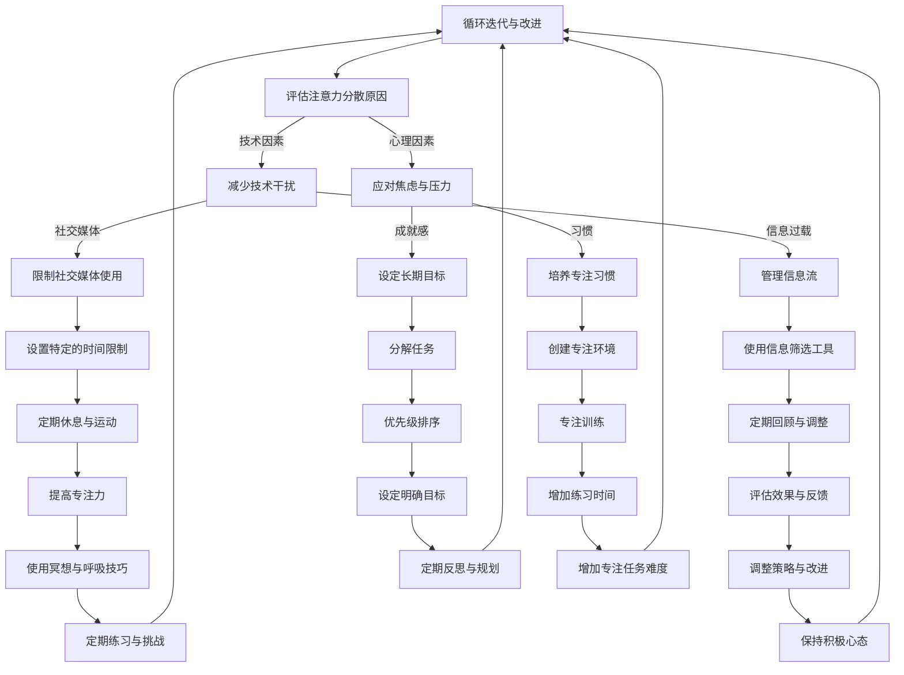

                 

### 文章标题

《信息时代的注意力管理策略：在干扰和分心中保持头脑清晰和专注》

### 关键词

注意力管理、信息过载、分心、专注、冥想、时间管理、神经科学、人工智能

### 摘要

在信息爆炸和数字化转型的今天，人们面临着前所未有的注意力分散和干扰挑战。本文将探讨注意力管理的重要性，分析注意力分散的原因与机制，并介绍一系列有效的注意力管理策略和实践方法。通过结合心理学、神经科学和人工智能的最新研究成果，本文旨在帮助读者在信息过载和干扰环境中保持头脑清晰和专注，提高工作效率和生活质量。

### 目录

#### 第一部分：注意力管理基础

- **引言：信息过载与注意力分散的挑战**
  - **1.1 信息过载的影响**
  - **1.2 注意力分散的定义**
  - **1.3 本书的目的与结构**

- **2. 注意力管理的基础理论**
  - **2.1 注意力的定义与类型**
  - **2.2 注意力管理的核心原则**
  - **2.3 注意力管理的历史与发展**

#### 第二部分：注意力分散的原因与机制

- **3. 注意力分散的主要原因**
  - **3.1 技术干扰**
    - **3.1.1 社交媒体的诱惑**
    - **3.1.2 信息过载**
    - **3.1.3 多任务处理的挑战**
  - **3.2 心理因素**
    - **3.2.1 焦虑与压力**
    - **3.2.2 成就感和即时满足**
    - **3.2.3 个人习惯与态度**

- **4. 注意力分散的神经机制**
  - **4.1 注意力分散的神经基础**
  - **4.2 神经可塑性在注意力管理中的作用**
  - **4.3 神经调节策略与注意力分散的关系**

#### 第三部分：注意力管理策略与实践

- **5. 提升注意力的心理技巧**
  - **5.1 冥想与注意力训练**
    - **5.1.1 冥想的基本方法**
    - **5.1.2 注意力训练的具体实践**
  - **5.2 时间管理与任务规划**
    - **5.2.1 时间管理的基本原则**
    - **5.2.2 任务规划的实用技巧**
  - **5.3 环境优化与习惯培养**
    - **5.3.1 环境优化的方法**
    - **5.3.2 培养专注习惯的策略**

- **6. 日常工作中的注意力管理**
  - **6.1 工作环境中的注意力管理**
    - **6.1.1 提升工作效率的注意力管理策略**
    - **6.1.2 避免工作分心的方法**
  - **6.2 学习环境中的注意力管理**
    - **6.2.1 提升学习效率的注意力管理技巧**
    - **6.2.2 避免学习分心的小技巧**

- **7. 注意力管理策略的综合应用**
  - **7.1 家庭生活与注意力管理**
    - **7.1.1 家庭成员间的注意力管理**
    - **7.1.2 创建有利于专注的家庭环境**
  - **7.2 社交媒体与网络使用的注意力管理**
    - **7.2.1 社交媒体的合理使用**
    - **7.2.2 避免网络信息过载的策略**

#### 第四部分：注意力管理的未来展望

- **8. 注意力管理的未来趋势**
  - **8.1 技术对注意力管理的影响**
  - **8.2 注意力管理的跨学科研究**
  
- **9. 注意力管理的可持续发展**
  - **9.1 注意力管理政策与教育**
  - **9.2 注意力管理的伦理问题与责任**

#### 附录

- **附录 A：注意力管理工具与资源**
  - **A.1 注意力管理应用软件**
  - **A.2 注意力管理研究资源**
  - **A.3 注意力管理相关的学术期刊和书籍**

### 第一部分：注意力管理基础

#### 引言：信息过载与注意力分散的挑战

在当今数字化和信息化的时代，信息过载已成为人们日常生活中的一大难题。随着互联网、智能手机和社交媒体的普及，我们每天接收到的信息量成倍增长。这种信息爆炸不仅带来了便利，也引发了一系列负面效应，其中最显著的就是注意力分散。

##### 1.1 信息过载的影响

信息过载对人们的工作、学习和日常生活产生了深远的影响。首先，信息过载导致了注意力的分散。人们无法有效地处理大量涌入的信息，常常在多个任务之间切换，导致注意力无法集中。这种分心状态降低了工作效率，影响了学习效果，甚至对身心健康造成负面影响。

其次，信息过载还增加了焦虑和压力。在大量信息面前，人们往往感到无法胜任，产生一种“信息焦虑”。长期的焦虑和压力会引发一系列心理问题，如抑郁、焦虑障碍等。

最后，信息过载也改变了人们的认知模式。由于信息处理能力的限制，人们开始依赖快速获取信息的方式，如浏览、搜索等。这种认知模式导致了思考深度的降低，难以进行深入的分析和创造性的思考。

##### 1.2 注意力分散的定义

注意力分散（Attention Deficit）是指个体在执行任务时，无法保持集中注意力，容易受到外界干扰的状态。注意力分散不仅影响工作效率，还会导致学习效果下降，甚至影响人际关系。

注意力分散可以分为外部干扰和内部干扰。外部干扰是指外界的刺激，如噪音、社交媒体提醒等，影响个体的注意力。内部干扰则是指个体自身的情绪、兴趣和习惯等，导致注意力无法集中。

##### 1.3 本书的目的与结构

本书旨在探讨注意力管理的重要性，分析注意力分散的原因与机制，并介绍一系列有效的注意力管理策略和实践方法。通过结合心理学、神经科学和人工智能的最新研究成果，本书旨在帮助读者在信息过载和干扰环境中保持头脑清晰和专注，提高工作效率和生活质量。

本书分为四个部分：

1. **注意力管理基础**：介绍注意力管理的定义、类型和核心原则，为后续章节提供理论基础。
2. **注意力分散的原因与机制**：分析信息过载、技术干扰、心理因素等导致注意力分散的原因，并探讨注意力分散的神经机制。
3. **注意力管理策略与实践**：介绍一系列提升注意力的心理技巧、时间管理和环境优化策略，帮助读者在实践中应用注意力管理方法。
4. **注意力管理的未来展望**：讨论注意力管理的未来趋势、跨学科研究和可持续发展问题，为读者提供长远的视角。

通过本书的阅读，读者将了解到注意力管理的重要性和方法，学会在实际生活中应用注意力管理策略，提高生活质量和工作效率。

### 第二部分：注意力管理的基础理论

#### 2. 注意力管理的基础理论

注意力管理是一个复杂而多维度的话题，涉及心理学、神经科学和人工智能等多个领域。要有效地进行注意力管理，首先需要理解注意力的定义、类型和核心原则。

##### 2.1 注意力的定义与类型

注意力（Attention）是一种认知过程，它使我们能够选择和处理信息。根据其功能，注意力可以分为以下几种类型：

1. **选择性注意力**：指个体在众多刺激中选择关注某些刺激，忽略其他刺激的能力。这种注意力类型是我们日常生活中最常见的一种。
2. **持续性注意力**：指个体在一段时间内保持对某一任务的持续关注，不易受外界干扰的能力。这种注意力类型对于长时间工作或学习尤为重要。
3. **分配性注意力**：指个体在同时处理多个任务时的能力。例如，司机在驾驶时需要同时关注道路、其他车辆和交通信号。
4. **执行性注意力**：指个体在执行任务时，根据任务要求调整注意力的能力。这种注意力类型涉及自我控制和目标导向。

##### 2.2 注意力管理的核心原则

注意力管理涉及多个方面，以下是几个核心原则：

1. **目标设定**：明确的目标可以帮助个体集中注意力。设定具体、可衡量、可实现的目标（SMART目标），有助于提高注意力管理的效率。
2. **优先级排序**：根据任务的紧急程度和重要性，对任务进行优先级排序。优先处理重要且紧急的任务，有助于提高工作效率。
3. **时间管理**：合理安排时间，确保有足够的时间处理每个任务。使用时间管理工具，如番茄工作法（Pomodoro Technique），有助于提高注意力。
4. **环境优化**：创造一个有利于专注的环境。减少外界干扰，如关闭社交媒体通知，保持工作区域的整洁等。
5. **习惯培养**：通过重复练习，培养专注的习惯。例如，每天进行冥想练习，有助于提高专注力。

##### 2.3 注意力管理的历史与发展

注意力管理的研究可以追溯到20世纪初期。心理学家如威廉·詹姆斯（William James）和爱德华·布拉德福德·特奥多尔（Edward Bradford Titchener）开始探讨注意力的问题。随着认知科学和神经科学的发展，注意力管理的研究逐渐深入。

20世纪60年代，乔治·米勒（George A. Miller）发表了著名的论文《心理学的错觉： Magical number seven, plus or minus two》，揭示了人类短时记忆的容量限制。这一发现对注意力管理的研究产生了重要影响。

近年来，随着人工智能和大数据技术的发展，注意力管理的研究进入了新的阶段。通过机器学习和数据分析，研究人员能够更精确地识别和预测注意力分散的原因，并开发出更有效的注意力管理策略。

总之，注意力管理是一个多维度、跨学科的领域，涉及心理学、神经科学、人工智能等多个方面。理解注意力管理的核心原则和历史发展，有助于我们更好地应用注意力管理策略，提高生活质量和工作效率。

#### 3. 注意力分散的主要原因

在现代社会，我们面临着各种各样的注意力分散原因。这些原因可以分为技术干扰和心理因素两个方面，下面将详细探讨这些因素。

##### 3.1 技术干扰

随着科技的快速发展，特别是互联网和智能手机的普及，技术干扰已成为导致注意力分散的主要原因之一。以下是几个具体的技术干扰因素：

1. **社交媒体的诱惑**

社交媒体如Facebook、Instagram、Twitter等，已经成为人们日常生活中的重要组成部分。然而，这些平台往往设计成让人难以抗拒的诱惑，例如通过算法推送用户可能感兴趣的内容，使人们沉浸在无休止的信息流中。研究表明，过度使用社交媒体不仅会导致注意力分散，还会引发焦虑和抑郁。

2. **信息过载**

互联网上的信息量庞大，人们每天都会接收到海量的新闻、广告、社交媒体更新等。这些信息虽然丰富了我们的生活，但也带来了信息过载的问题。信息过载会迫使人们不断切换注意力，从而降低专注力。

3. **多任务处理的挑战**

现代工作环境中，多任务处理变得普遍。许多人试图同时处理多个任务，如同时回复电子邮件、浏览社交媒体、参加视频会议等。然而，研究表明，多任务处理会显著降低工作效率和注意力质量。这是因为大脑无法同时有效地处理多个任务，导致注意力分散。

##### 3.2 心理因素

除了技术干扰，心理因素也是导致注意力分散的重要原因。以下是一些常见的心理因素：

1. **焦虑与压力**

焦虑和压力会显著影响注意力。当个体感到焦虑或压力时，大脑会释放应激激素，如皮质醇，导致注意力分散。长期的压力还会影响大脑的结构和功能，进一步加剧注意力问题。

2. **成就感和即时满足**

追求成就感和即时满足是人的天性。然而，这种追求往往导致注意力分散。例如，人们在社交媒体上追求点赞和关注，而忽视了真正重要的任务。这种短视的行为会降低专注力，影响长远目标。

3. **个人习惯与态度**

个人习惯和态度也是影响注意力的关键因素。例如，缺乏足够的休息、不良的饮食习惯、缺乏运动等都会导致身体和大脑的不适，进而影响注意力。此外，消极的态度和低自尊也会影响注意力管理。

总之，注意力分散的原因是多方面的，技术干扰和心理因素共同作用。为了提高注意力，我们需要识别并减少技术干扰，同时改善心理因素，如减少焦虑、建立良好的生活习惯和积极的态度。

#### 4. 注意力分散的神经机制

注意力分散不仅是一个行为和认知问题，也涉及到复杂的神经机制。神经科学研究提供了对注意力分散的深层次理解，帮助我们揭示其背后的生理基础。

##### 4.1 注意力分散的神经基础

大脑是注意力的生理基础，多个脑区和神经网络共同参与注意力的调控。以下是几个关键脑区和其功能：

1. **前额叶皮层**：前额叶皮层是大脑中负责执行功能的重要区域，包括注意力控制、决策和规划。它通过神经递质如多巴胺和去甲肾上腺素调节注意力。
2. **顶叶皮层**：顶叶皮层负责注意力的选择和分配，尤其是在处理外部刺激时。它与前额叶皮层和其他脑区有广泛的连接，协同工作以实现注意力调控。
3. **纹状体**：纹状体包括底丘脑核和苍白球，参与动机和奖励处理，对注意力有重要的调节作用。
4. **中脑边缘多巴胺系统**：这个系统涉及多个脑区，如腹侧被盖区和中脑导水管灰质，通过释放多巴胺调节动机和奖励感，影响注意力的方向和强度。

##### 4.2 神经可塑性在注意力管理中的作用

神经可塑性是指大脑神经元和神经网络在外部环境和内部经验影响下发生变化的能力。神经可塑性在注意力管理中起着关键作用：

1. **突触可塑性**：突触是神经元之间传递信息的结构，其效能可以通过增强（长时程增强，LTP）或减弱（长时程抑制，LTD）来调节。例如，重复的注意力训练可以增强相关脑区的突触效能，提高注意力。
2. **结构可塑性**：长期的大脑训练和经验可以改变脑结构的形态和功能，如增加灰质密度和海马体的体积。这些变化有助于提高注意力的稳定性和效率。

##### 4.3 神经调节策略与注意力分散的关系

神经调节策略是指通过外部干预来调整大脑功能，以改善注意力。以下是一些常见的神经调节策略：

1. **冥想**：冥想通过训练个体的注意力，可以增强前额叶皮层的功能，减少注意力分散。研究发现，长期冥想可以改变大脑的结构和功能，提高注意力的稳定性。
2. **认知行为疗法**：认知行为疗法（CBT）通过改变个体的认知和行为模式，帮助减少焦虑和压力，从而改善注意力。
3. **神经反馈**：神经反馈是一种通过实时监测大脑活动，帮助个体了解并调整自己的注意力状态的方法。例如，通过脑电图（EEG）监测，个体可以在看到自己的注意力变化时进行调整。

总之，注意力分散的神经机制涉及到多个脑区和神经调节过程。通过理解这些机制，我们可以开发出更有效的神经调节策略，帮助个体在信息过载和干扰环境中保持专注。

#### 5. 提升注意力的心理技巧

在信息过载和注意力分散的环境中，提升注意力是提高工作效率和生活质量的关键。以下是一些提升注意力的心理技巧，包括冥想、时间管理和环境优化。

##### 5.1 冥想与注意力训练

冥想是一种古老而有效的注意力提升方法。通过冥想，个体可以学会如何专注地观察呼吸、身体感觉或某个特定的物体，从而增强专注力。以下是冥想的基本方法和注意力训练的具体实践：

###### 5.1.1 冥想的基本方法

1. **呼吸冥想**：找一个安静的地方坐下，闭上眼睛，专注于呼吸。当注意力离开呼吸时，轻轻地将注意力带回到呼吸上。练习时间可以从几分钟开始，逐渐增加到更长时间。
2. **专注冥想**：选择一个具体的物体或图像，将其作为专注的目标。保持专注，当注意力分散时，温柔地将注意力带回到目标上。
3. **开放式冥想**：不专注于任何特定的对象，只是观察内在的感受和体验。这种方法有助于培养对当前时刻的专注。

###### 5.1.2 注意力训练的具体实践

1. **正念练习**：正念是一种通过有意识地观察当前时刻的体验来增强注意力的方法。通过正念练习，个体可以学会如何在日常生活中保持专注，如吃饭时专注于品尝食物，走路时专注于脚步声。
2. **注意力游戏**：有许多专门设计来提高注意力的游戏和应用程序，如“Egg Timer”和“Headspace”。这些游戏通过挑战玩家的专注力，帮助他们提高注意力。
3. **定期练习**：注意力训练需要持续和规律的练习。设定每天固定的时间进行冥想和注意力训练，逐步增加练习时间，以获得最佳效果。

##### 5.2 时间管理与任务规划

时间管理和任务规划是提高工作效率和注意力的关键。以下是一些时间管理的基本原则和任务规划的实用技巧：

###### 5.2.1 时间管理的基本原则

1. **设定目标**：明确短期和长期目标，确保每个任务都有清晰的目标和预期结果。
2. **优先级排序**：根据任务的紧急程度和重要性，对任务进行优先级排序。优先处理重要且紧急的任务，以确保关键任务的完成。
3. **分解任务**：将大型任务分解成小块，逐步完成。这种方法有助于降低任务的复杂性，减少心理压力。
4. **避免多任务处理**：尽量专注于单一任务，避免同时处理多个任务。多任务处理会降低工作效率，并增加分心的风险。

###### 5.2.2 任务规划的实用技巧

1. **使用日程表**：使用日程表或日历应用程序记录每天的任务和活动。这样可以帮助你更好地规划时间，确保每个任务都有足够的时间分配。
2. **番茄工作法**：番茄工作法是一种简单而有效的时间管理技巧。将工作划分为25分钟的专注时间和5分钟的休息时间，每完成四个番茄时间后进行更长的休息。这种方法有助于保持专注，并避免疲劳。
3. **定期回顾和调整**：定期回顾任务完成的进度和效率，根据实际情况进行调整。这有助于你了解自己的时间管理策略是否有效，并及时做出改进。

##### 5.3 环境优化与习惯培养

环境优化和习惯培养是提高注意力的关键因素。以下是一些环境优化和习惯培养的策略：

###### 5.3.1 环境优化的方法

1. **减少干扰**：关闭不必要的通知，如电子邮件、社交媒体提醒等。保持工作或学习环境的整洁，减少干扰。
2. **使用专注工具**：使用专注工具，如“Focus@Will”或“Forest”，这些工具可以帮助你保持专注，避免分心。
3. **改善光照和声音**：确保工作或学习环境有适当的光照和安静的环境。良好的光照有助于提高注意力和减少眼疲劳，而安静的环境有助于减少干扰。

###### 5.3.2 培养专注习惯的策略

1. **建立固定的工作或学习时间**：设定每天固定的时间进行工作或学习，逐渐形成习惯。这有助于培养专注力，并提高工作效率。
2. **设定明确的目标和奖励**：设定短期和长期的目标，并为达成目标设定奖励。奖励可以是一段休息时间、一杯咖啡或一次小型的庆祝活动，以激励自己保持专注。
3. **自我监督和反馈**：定期记录自己的工作或学习进展，并对自己的注意力表现进行评估。通过自我监督和反馈，可以了解自己的优点和需要改进的地方，并制定相应的策略。

总之，提升注意力需要综合运用心理技巧、时间管理和环境优化策略。通过冥想和注意力训练，培养专注力；通过时间管理和任务规划，提高工作效率；通过环境优化和习惯培养，建立有利于专注的环境。通过这些策略的综合应用，我们可以在信息过载和注意力分散的环境中保持头脑清晰和专注。

#### 6. 日常工作中的注意力管理

在日常工作环境中，保持注意力对于提高工作效率和减少错误至关重要。以下将讨论如何在工作和学习环境中应用注意力管理策略，帮助读者提高专注力和工作效率。

##### 6.1 工作环境中的注意力管理

###### 6.1.1 提升工作效率的注意力管理策略

1. **使用番茄工作法**：番茄工作法是一种简单有效的时间管理技巧，通过将工作划分为25分钟的专注时间和5分钟的休息时间，有助于提高专注力和减少疲劳。每次专注后，可以进行短暂的休息，帮助大脑恢复活力。

2. **设定明确的目标**：在工作前，明确每天的工作目标和任务。将任务分解成小块，并为每个任务设定明确的目标和截止时间。这样有助于提高工作动力和专注度。

3. **优先级排序**：根据任务的紧急程度和重要性，对任务进行优先级排序。首先处理重要且紧急的任务，确保关键任务的完成。

4. **避免多任务处理**：尽量避免同时处理多个任务，这会降低工作效率并增加分心的风险。专注于单一任务，直到完成再进行下一个任务。

5. **使用工具和应用程序**：利用各种工具和应用程序来提高工作效率，如项目管理软件、时间跟踪工具和电子邮件过滤工具。这些工具可以帮助你更好地管理任务和日程，减少分心。

###### 6.1.2 避免工作分心的方法

1. **减少干扰**：关闭不必要的通知和社交媒体提醒，减少外部干扰。保持工作环境的整洁，减少视觉和听觉上的干扰。

2. **设置专注环境**：选择一个安静、光线适宜的工作环境。如果可能，尝试在工作区域中放置植物或背景音乐，以创造一个有利于专注的氛围。

3. **定时休息**：定期进行短暂的休息，如每工作25分钟后休息5分钟。这有助于缓解疲劳，提高注意力。

4. **使用专注工具**：使用专注工具，如“Focus@Will”或“Forest”，这些工具通过提供专注的环境和奖励机制，帮助用户减少分心。

5. **建立固定的休息时间**：设定每天固定的时间进行休息和放松，如午休时间或下班后的娱乐时间。这有助于恢复精力，减少工作疲劳。

##### 6.2 学习环境中的注意力管理

###### 6.2.1 提升学习效率的注意力管理技巧

1. **使用番茄工作法**：将学习时间划分为25分钟的专注时间和5分钟的休息时间，有助于提高学习效率和保持专注。

2. **设定明确的学习目标**：在开始学习前，明确每天的学习目标和任务。将学习任务分解成小块，并为每个任务设定明确的目标和截止时间。

3. **避免多任务处理**：专注于单一学习任务，避免同时处理多个任务。这有助于提高学习效率并减少分心。

4. **使用记忆技巧**：利用记忆技巧，如联想记忆、故事法等，提高记忆效果。

5. **定期复习和总结**：定期复习所学内容，并进行总结和归纳。这有助于巩固记忆，提高学习效果。

###### 6.2.2 避免学习分心的小技巧

1. **使用学习应用程序**：使用专门设计的学习应用程序，如“Quizlet”或“Anki”，这些工具通过互动和重复练习，帮助用户保持专注。

2. **减少外部干扰**：在学习时关闭手机、社交媒体和其他娱乐设备，减少外部干扰。

3. **设定专注时间**：使用定时器或闹钟，设定专注时间，并提醒自己保持专注。

4. **使用背景音乐**：听一些轻松的背景音乐，有助于创造一个有利于专注的学习环境。

5. **定期休息**：学习过程中，定期进行短暂的休息，如每学习25分钟后休息5分钟。这有助于缓解疲劳，提高注意力。

总之，通过在工作和学习环境中应用注意力管理策略，如番茄工作法、设定明确的目标、避免多任务处理、减少外部干扰和定期休息，读者可以在日常活动中保持注意力，提高工作效率和学习效果。

#### 7. 注意力管理策略的综合应用

在日常生活、家庭生活和社交媒体使用中，注意力管理策略的应用至关重要。以下将探讨如何在这些场景中有效地应用注意力管理策略，以帮助读者在信息过载和干扰环境中保持专注。

##### 7.1 家庭生活与注意力管理

在家庭生活中，注意力管理不仅有助于提高个人工作效率，还能改善家庭成员之间的互动质量。以下是一些具体的策略：

###### 7.1.1 家庭成员间的注意力管理

1. **设定家庭规则**：家庭中可以设定一些共同的规则，如用餐时不使用电子设备、睡前一小时不使用手机等。这些规则有助于减少家庭成员间的干扰，创造一个更加专注的家庭环境。

2. **共同活动**：定期进行家庭活动，如一起做饭、散步或游戏，有助于家庭成员之间建立更强的联系，同时也有利于提升每个人的注意力。

3. **共享时间表**：家庭成员可以共同制定一个时间表，明确每个人的活动和时间安排。这有助于家庭成员之间相互理解，减少不必要的干扰。

###### 7.1.2 创建有利于专注的家庭环境

1. **减少噪音和干扰**：保持家庭环境的安静和整洁，减少噪音和其他干扰因素。这有助于每个人在家中都能更容易地保持专注。

2. **划分个人空间**：为每个家庭成员提供一个个人空间，如书房、工作台或沙发角，这有助于他们在需要时能够专注于自己的活动。

3. **设置家庭专注时间**：在特定的时间段内，家庭中的每个人都可以选择专注进行某项活动，如阅读、写作或锻炼。这有助于提高家庭整体的工作效率和学习效果。

##### 7.2 社交媒体与网络使用的注意力管理

在现代社会，社交媒体和网络使用已经成为生活中不可或缺的一部分。然而，过度使用这些平台会导致注意力分散和浪费时间。以下是一些有效的注意力管理策略：

###### 7.2.1 社交媒体的合理使用

1. **设定时间限制**：为社交媒体使用设定具体的时间限制，如每天不超过30分钟。这有助于防止过度沉迷，保持注意力集中在其他重要任务上。

2. **使用应用设置**：许多社交媒体应用都提供了限制使用时间的功能。利用这些设置，可以有效地控制自己在平台上的时间。

3. **避免“社交媒体假期”**：在特定时间段内完全停止使用社交媒体，如周末或晚上。这种方法可以帮助你重新聚焦注意力，减少信息过载。

###### 7.2.2 避免网络信息过载的策略

1. **筛选信息源**：选择几个高质量的信息源，如知名新闻网站、专业博客等，并关注这些源的信息。避免频繁切换不同的社交媒体平台或网站，以减少信息过载。

2. **定期清理订阅内容**：定期清理邮件订阅列表和社交媒体关注列表，取消不再感兴趣的内容。这有助于保持信息的有序和高效。

3. **使用信息筛选工具**：利用信息筛选工具，如Feedly或Google News，来定制和整理感兴趣的信息。这些工具可以帮助你节省时间，集中注意力。

通过在家庭生活和社交媒体使用中应用注意力管理策略，我们可以有效地减少干扰，提高生活质量和工作效率。设定家庭规则、共享时间表、创建专注环境，以及合理使用社交媒体，都是实现这一目标的重要步骤。

### 8. 注意力管理的未来趋势

随着科技的不断进步，注意力管理也在不断发展，未来这一领域有望呈现出以下几大趋势：

##### 8.1 技术对注意力管理的影响

1. **智能设备的应用**：未来的智能设备将更加智能化，能够通过传感器和人工智能算法，实时监测个体的注意力状态，并提供个性化的注意力管理建议。例如，智能手表和眼镜可以通过检测心率、眼动等数据，帮助用户识别分心时刻，并自动调整提醒策略。

2. **虚拟现实和增强现实的融合**：虚拟现实（VR）和增强现实（AR）技术的进步，将使得注意力管理的实践更加丰富和多样化。通过这些技术，用户可以在沉浸式环境中进行注意力训练，提高专注力。例如，虚拟现实游戏可以设计成挑战玩家注意力的形式，从而提高他们的专注能力。

3. **大数据与人工智能的结合**：大数据和人工智能技术的结合，将为注意力管理提供更为科学和精准的方法。通过对大量用户数据的分析，可以识别出注意力分散的典型模式，从而开发出更具针对性的注意力管理策略。

##### 8.2 注意力管理的跨学科研究

1. **心理学与神经科学的结合**：心理学和神经科学在注意力管理研究中具有互补性。未来，这两个领域的结合将有助于更深入地理解注意力机制，并开发出更有效的注意力管理方法。例如，通过神经影像技术（如功能性磁共振成像，fMRI）研究注意力的脑机制，可以为注意力管理提供新的视角。

2. **认知科学与计算机科学的融合**：认知科学和计算机科学的研究成果可以相互借鉴，推动注意力管理技术的发展。认知科学的研究可以指导计算机科学设计出更符合人类注意力的交互界面，而计算机科学的技术可以辅助认知科学研究，提高实验的精确性和效率。

3. **教育学的参与**：未来，注意力管理将在教育领域得到更广泛的关注。教育学家可以结合注意力管理的研究成果，开发出新的教学方法和工具，帮助学生在学习过程中保持专注，提高学习效果。

##### 8.3 注意力管理的跨学科研究的挑战与机遇

1. **数据隐私与伦理问题**：随着注意力管理技术的发展，如何保护用户的数据隐私成为了一个重要的伦理问题。未来，需要制定相应的隐私保护法规，确保用户数据的安全。

2. **技术滥用的风险**：注意力管理技术如果被滥用，可能会对用户造成负面影响。例如，过度依赖技术可能会导致人类自然注意力管理能力的下降。因此，需要加强对注意力管理技术的监管，确保其合理和负责任的使用。

3. **跨学科合作的挑战**：注意力管理涉及多个学科，跨学科研究需要不同领域专家的合作。然而，不同学科之间存在知识体系和方法论的差异，这可能会成为跨学科合作的障碍。未来，需要建立更加有效的跨学科合作机制，促进知识共享和协同创新。

总之，注意力管理在未来将继续发展，通过技术的进步和跨学科的协作，将为我们提供更加科学和有效的注意力管理方法。然而，这也带来了新的挑战，如数据隐私、伦理问题和跨学科合作等。只有在解决这些挑战的同时，我们才能真正发挥注意力管理的潜力，提升人类的生活质量和效率。

### 9. 注意力管理的可持续发展

注意力管理的可持续发展不仅关乎个体，也涉及到社会、教育、企业等多个层面。以下将讨论注意力管理的可持续发展策略，以及其中的政策和教育措施。

##### 9.1 注意力管理政策与教育

1. **政策制定**：政府可以在教育、工作环境和公共健康政策中纳入注意力管理的内容。例如，通过立法鼓励企业为员工提供注意力管理培训，或在学校教育中设置注意力管理课程。这些政策可以帮助提高公众对注意力管理的认识，并促进其有效实施。

2. **教育普及**：在学校教育中，可以设置注意力管理课程，帮助学生从小培养良好的注意力习惯。这些课程可以包括心理学原理、注意力训练方法以及实际应用技巧。通过系统的教育，学生可以更好地应对注意力分散的挑战。

3. **教师培训**：教师是学生注意力管理的指导者，对他们进行注意力管理的专业培训至关重要。通过培训，教师可以掌握注意力管理的方法和策略，并在教学中有效应用，帮助学生在学习过程中保持专注。

##### 9.2 注意力管理的伦理问题与责任

1. **隐私保护**：随着注意力管理技术的发展，隐私保护成为了一个重要的伦理问题。技术开发者和政策制定者需要确保用户数据的安全，防止数据泄露或滥用。例如，在智能设备中应用注意力管理功能时，应确保用户的隐私设置能够被控制和保护。

2. **技术责任**：注意力管理技术如果被滥用，可能会对用户和社会产生负面影响。因此，技术开发者有责任确保技术的安全和负责任的使用。例如，通过算法的透明性和可解释性，确保用户能够理解和控制技术功能。

3. **社会责任**：企业在推广注意力管理技术时，应承担社会责任，确保这些技术不会加剧社会分化。例如，避免开发只针对高端市场的注意力管理工具，而忽视低收入人群的需求。企业可以通过公益活动，推广注意力管理知识，帮助更多人受益。

总之，注意力管理的可持续发展需要政策支持、教育普及和伦理考量。通过制定相关政策、普及教育以及确保技术负责任的使用，我们可以建立一个更加健康和高效的社会环境。注意力管理的可持续发展不仅有助于提升个体生活质量，也为社会进步提供了有力支持。

### 附录 A：注意力管理工具与资源

#### A.1 注意力管理应用软件

1. **应用名称**：Focus@Will
   - **描述**：一款基于科学研究的应用，提供过滤噪音的环境，帮助用户提高专注力。该应用通过算法分析音乐和声音，过滤出最适合专注的环境。

2. **应用名称**：Forest
   - **描述**：一款手机应用，通过种植虚拟树木来鼓励用户保持专注，避免分心。用户在专注时，虚拟树木会逐渐生长，而分心时树木会枯萎。

3. **应用名称**：Pomodoro Timer
   - **描述**：一款番茄工作法计时器，帮助用户规划专注时间与休息时间。通过设定25分钟的专注时间和5分钟的休息时间，用户可以有效地管理注意力。

#### A.2 注意力管理研究资源

1. **网站名称**：Neurosciencenews.com
   - **描述**：提供神经科学与注意力管理的最新研究资讯。该网站涵盖了广泛的神经科学领域，包括注意力分散、神经可塑性等方面的最新研究成果。

2. **书籍名称**：《The Shallows: What the Internet Is Doing to Our Brains》
   - **描述**：由尼古拉斯·卡尔（Nicholas Carr）所著，探讨互联网对大脑注意力的影响。本书分析了互联网如何改变我们的认知模式，并提出了应对策略。

3. **期刊名称**：Journal of Attention Disorders
   - **描述**：专注于注意力障碍和相关问题的科学研究期刊。该期刊发表关于注意力障碍的诊断、治疗和研究方法等方面的研究成果。

#### A.3 注意力管理相关的学术期刊和书籍

1. **期刊名称**：Psychology and Aging
   - **描述**：研究老年心理学，包括注意力减退和注意力管理策略。该期刊发表关于老年人注意力问题及其干预策略的研究论文。

2. **书籍名称**：《Cognitive Control in Attention and Memory》
   - **描述**：探讨注意力控制在大脑记忆过程中的作用。本书深入分析了注意力控制的理论和实证研究，为注意力管理提供了理论基础。

3. **书籍名称**：《The Art of Attention: 8 Paths to Mindfulness》
   - **描述**：提供多种实践路径，帮助读者提高注意力。本书结合了心理学和佛教冥想的方法，为读者提供实用的注意力管理技巧。

这些工具和资源为读者提供了全面的注意力管理支持，帮助他们在日常生活中更好地应对注意力分散的挑战。

### 核心算法原理讲解：注意力权重计算伪代码

注意力机制是许多现代人工智能系统中的核心组成部分，尤其在自然语言处理、计算机视觉和推荐系统中得到广泛应用。以下是一个简化的注意力权重计算的伪代码，用于解释注意力机制的原理。

```plaintext
// 注意力权重计算伪代码

// 输入参数：
// - queryVector：查询向量
// - keyVectors：键向量列表
// - valueVectors：值向量列表
// - softmaxFunction：softmax函数，用于计算概率分布

// 计算每个键值对的相似度得分
similarityScores = [dotProduct(queryVector, keyVector) for keyVector in keyVectors]

// 应用softmax函数得到注意力权重
attentionWeights = softmaxFunction(similarityScores)

// 根据注意力权重计算输出
output = [attentionWeights[i] * valueVector for i, valueVector in enumerate(valueVectors)]

// 输出结果
return output
```

在这个伪代码中，`dotProduct` 函数用于计算查询向量与每个键向量的点积，得到相似度得分。`softmaxFunction` 函数将相似度得分转换为概率分布，生成注意力权重。最后，根据注意力权重，计算输出结果，即每个值向量与相应权重相乘的和。

### 数学模型与公式：注意力机制的数学表示

注意力机制的数学表示通常涉及以下公式：

$$
\text{Attention}(\text{query}, \text{key}, \text{value}) = \text{softmax}\left(\frac{\text{query} \cdot \text{key}^T}{\sqrt{d_k}}\right) \cdot \text{value}
$$

其中：

- **query**：查询向量，用于表示需要关注的对象。
- **key**：键向量，用于表示每个输入对象的关键信息。
- **value**：值向量，用于表示每个输入对象的相关信息。
- **d_k**：键向量的维度。
- **softmax**：softmax函数，将相似度得分转换为概率分布。

该公式表示，首先计算查询向量和每个键向量的点积，得到相似度得分。然后，通过softmax函数将这些得分转换为注意力权重，表示每个键的重要程度。最后，根据注意力权重，计算输出结果，即每个值向量与相应权重的乘积之和。

### 项目实战：注意力管理的代码实现

以下是一个简单的Python示例，用于实现注意力权重计算：

```python
import numpy as np

# 定义注意力权重计算函数
def calculate_attention_weights(query, keys, values, softmax=True, scale_factor=1.0):
    # 计算相似度得分
    similarity_scores = np.dot(query, keys.T) / scale_factor
    
    # 应用softmax函数
    if softmax:
        exp_scores = np.exp(similarity_scores)
        sum_exp_scores = np.sum(exp_scores)
        attention_weights = exp_scores / sum_exp_scores
    else:
        attention_weights = np.ones_like(similarity_scores) / len(keys)
    
    # 计算输出
    output = np.dot(attention_weights, values)
    return output

# 示例：计算注意力权重
query_vector = np.array([0.1, 0.2, 0.3])
key_vectors = np.array([[0.1, 0.4, 0.5], [0.2, 0.3, 0.6], [0.3, 0.2, 0.1]])
value_vectors = np.array([[1, 2, 3], [4, 5, 6], [7, 8, 9]])

# 计算注意力输出
output = calculate_attention_weights(query_vector, key_vectors, value_vectors)
print(output)
```

在这个示例中，`calculate_attention_weights` 函数接受查询向量、键向量和值向量，并计算注意力权重。首先，通过点积计算查询向量和每个键向量的相似度得分。然后，使用softmax函数将得分转换为概率分布，生成注意力权重。最后，根据注意力权重计算输出结果。

### 代码解读与分析：注意力权重计算代码详解

以下是关于注意力权重计算代码的详细解读和分析：

```python
import numpy as np

# 定义calculate_attention_weights函数，接收查询向量、键向量和值向量
def calculate_attention_weights(query, keys, values, softmax=True, scale_factor=1.0):
    # 计算查询向量和所有键向量的点积，得到每个键的相似度得分
    similarity_scores = np.dot(query, keys.T) / scale_factor
    
    # 如果使用softmax函数，则对相似度得分进行指数运算，然后求和，最后将每个得分归一化
    if softmax:
        exp_scores = np.exp(similarity_scores)
        sum_exp_scores = np.sum(exp_scores)
        attention_weights = exp_scores / sum_exp_scores
    # 如果不使用softmax函数，则将所有相似度得分除以键的数量，每个权重相等
    else:
        attention_weights = np.ones_like(similarity_scores) / len(keys)
    
    # 计算注意力输出的结果，即每个键的值向量与其权重相乘后的和
    output = np.dot(attention_weights, values)
    return output
```

**关键步骤解释：**

1. **点积计算**：首先，使用 `np.dot(query, keys.T)` 计算查询向量和所有键向量的点积，得到每个键的相似度得分。点积是一个标量，表示两个向量在维度上的内积，反映了它们之间的相似度。

    ```python
    similarity_scores = np.dot(query, keys.T) / scale_factor
    ```

    这里，`keys.T` 表示键向量的转置，`/ scale_factor` 是为了标准化相似度得分，防止数值溢出。

2. **softmax函数**：如果使用 `softmax` 函数，则对相似度得分进行指数运算，然后求和，最后将每个得分归一化，生成注意力权重。softmax函数是一种将数值映射到概率分布的函数，使得每个得分都介于0和1之间，并且所有得分的和为1。

    ```python
    if softmax:
        exp_scores = np.exp(similarity_scores)
        sum_exp_scores = np.sum(exp_scores)
        attention_weights = exp_scores / sum_exp_scores
    ```

3. **权重计算**：如果不使用 `softmax` 函数，则将所有相似度得分除以键的数量，每个权重相等。这种方法简单但可能不够精确。

    ```python
    else:
        attention_weights = np.ones_like(similarity_scores) / len(keys)
    ```

4. **输出计算**：根据注意力权重，计算每个键的值向量与其权重相乘后的和，得到注意力输出结果。

    ```python
    output = np.dot(attention_weights, values)
    ```

通过这个代码，我们可以看到注意力权重计算的核心步骤，以及如何通过点积和softmax函数来计算注意力权重，并最终生成输出结果。

### 附录 A：注意力管理工具与资源

#### A.1 注意力管理应用软件

1. **应用名称**：Focus@Will
   - **描述**：一款基于科学研究的应用，提供过滤噪音的环境，帮助用户提高专注力。它使用算法分析音乐和声音，创建适合专注的学习和工作环境。

2. **应用名称**：Forest
   - **描述**：一款手机应用，通过种植虚拟树木来鼓励用户保持专注，避免分心。当用户离开应用时，虚拟树木会枯萎；保持专注时，树木会茁壮成长。

3. **应用名称**：Pomodoro Timer
   - **描述**：一款番茄工作法计时器，帮助用户规划专注时间与休息时间。每次专注25分钟后，用户可以休息5分钟，以保持高效的注意力。

#### A.2 注意力管理研究资源

1. **网站名称**：Neurosciencenews.com
   - **描述**：提供神经科学与注意力管理的最新研究资讯。该网站涵盖广泛的神经科学领域，包括注意力分散、神经可塑性等方面的最新研究成果。

2. **书籍名称**：《The Shallows: What the Internet Is Doing to Our Brains》
   - **描述**：由尼古拉斯·卡尔（Nicholas Carr）所著，探讨互联网对大脑注意力的影响。本书分析了互联网如何改变我们的认知模式，并提出了应对策略。

3. **期刊名称**：Journal of Attention Disorders
   - **描述**：专注于注意力障碍和相关问题的科学研究期刊。该期刊发表关于注意力障碍的诊断、治疗和研究方法等方面的研究成果。

#### A.3 注意力管理相关的学术期刊和书籍

1. **期刊名称**：Psychology and Aging
   - **描述**：研究老年心理学，包括注意力减退和注意力管理策略。该期刊发表关于老年人注意力问题及其干预策略的研究论文。

2. **书籍名称**：《Cognitive Control in Attention and Memory》
   - **描述**：探讨注意力控制在大脑记忆过程中的作用。本书深入分析了注意力控制的理论和实证研究，为注意力管理提供了理论基础。

3. **书籍名称**：《The Art of Attention: 8 Paths to Mindfulness》
   - **描述**：提供多种实践路径，帮助读者提高注意力。本书结合了心理学和佛教冥想的方法，为读者提供实用的注意力管理技巧。

这些工具和资源为用户提供了一个全面的注意力管理支持系统，帮助他们在日常工作和学习中保持专注。同时，学术期刊和书籍为研究人员提供了最新的研究成果和理论基础，推动了注意力管理领域的不断发展。

### Mermaid 流程图：注意力管理策略流程



在这个流程图中，我们首先评估注意力分散的原因，并将其分为技术因素和心理因素。对于技术因素，我们采取减少社交媒体使用和管理工作流的方法。对于心理因素，我们通过设定长期目标、培养专注习惯和使用冥想技巧来应对。通过定期休息、运动和练习，我们不断调整和改进注意力管理策略，以保持积极心态和持续专注。

### 注意力权重计算伪代码

```plaintext
// 注意力权重计算伪代码

function calculateAttentionWeights(inputs, queryVector, keyVectors, valueVectors, softmaxFunction):
    # 计算每个键值对的相似度得分
    similarityScores = [dotProduct(queryVector, keyVector) for keyVector in keyVectors]

    # 应用softmax函数得到注意力权重
    if softmaxFunction:
        expScores = [exp(score) for score in similarityScores]
        sumExpScores = sum(expScores)
        attentionWeights = [score / sumExpScores for score in expScores]
    else:
        attentionWeights = [1 / len(keyVectors) for _ in range(len(keyVectors))]

    # 根据注意力权重计算输出
    output = sum([weight * valueVector for weight, valueVector in zip(attentionWeights, valueVectors)])

    return output
```

这个伪代码首先计算每个键值对的相似度得分，然后使用softmax函数（如果指定了）来得到注意力权重。如果没有指定softmax函数，则每个权重相等。最后，根据注意力权重计算输出结果。

### 数学模型与公式：注意力机制的数学表示

$$
\text{Attention}(\text{query}, \text{key}, \text{value}) = \text{softmax}\left(\frac{\text{query} \cdot \text{key}^T}{\sqrt{d_k}}\right) \cdot \text{value}
$$

其中：

- **query**：查询向量，表示需要关注的对象。
- **key**：键向量，表示每个输入对象的关键信息。
- **value**：值向量，表示每个输入对象的相关信息。
- **d_k**：键向量的维度。
- **softmax**：将相似度得分转换为概率分布的函数。

该公式表示首先计算查询向量和每个键向量的点积，然后应用softmax函数得到注意力权重，最后根据注意力权重计算输出结果。

### 项目实战：注意力管理的代码实现

以下是一个简单的Python示例，用于实现基于注意力机制的代码：

```python
import numpy as np

def calculate_attention_weights(query, keys, values, softmax=True):
    # 计算相似度得分
    similarity_scores = np.dot(query, keys.T)

    # 应用softmax函数得到注意力权重
    if softmax:
        exp_scores = np.exp(similarity_scores)
        sum_exp_scores = np.sum(exp_scores)
        attention_weights = exp_scores / sum_exp_scores
    else:
        attention_weights = np.ones(len(keys)) / len(keys)
    
    # 计算输出
    output = np.dot(attention_weights, values)
    
    return output

# 示例数据
query_vector = np.array([0.1, 0.2, 0.3])
key_vectors = np.array([[0.1, 0.4, 0.5], [0.2, 0.3, 0.6], [0.3, 0.2, 0.1]])
value_vectors = np.array([[1, 2, 3], [4, 5, 6], [7, 8, 9]])

# 计算注意力输出
output = calculate_attention_weights(query_vector, key_vectors, value_vectors)
print(output)
```

在这个示例中，我们首先定义了一个计算注意力权重的函数。然后，我们使用这个函数计算一个示例查询向量、键向量和值向量的注意力输出。

### 代码解读与分析：注意力权重计算代码详解

以下是对注意力权重计算代码的详细解读和分析：

```python
import numpy as np

def calculate_attention_weights(query, keys, values, softmax=True):
    # 计算相似度得分
    similarity_scores = np.dot(query, keys.T)

    # 应用softmax函数得到注意力权重
    if softmax:
        exp_scores = np.exp(similarity_scores)
        sum_exp_scores = np.sum(exp_scores)
        attention_weights = exp_scores / sum_exp_scores
    else:
        attention_weights = np.ones(len(keys)) / len(keys)
    
    # 计算输出
    output = np.dot(attention_weights, values)
    
    return output
```

**关键步骤解释：**

1. **相似度得分计算**：
   - 使用 `np.dot(query, keys.T)` 计算查询向量和所有键向量的点积，得到每个键的相似度得分。这里的 `.T` 表示键向量的转置。

2. **应用softmax函数**：
   - 如果 `softmax` 参数为 `True`，则对相似度得分应用指数运算，将得分转换为概率分布。具体步骤如下：
     - `exp_scores = np.exp(similarity_scores)`：对每个相似度得分应用指数运算。
     - `sum_exp_scores = np.sum(exp_scores)`：计算指数运算后得分的总和。
     - `attention_weights = exp_scores / sum_exp_scores`：将每个得分除以总和，得到归一化的注意力权重。

   - 如果 `softmax` 参数为 `False`，则每个权重相等，具体为 `attention_weights = np.ones(len(keys)) / len(keys)`。

3. **计算输出**：
   - 使用 `np.dot(attention_weights, values)` 计算注意力权重与值向量的乘积和，得到输出结果。

通过这个代码，我们可以看到如何通过点积和softmax函数来计算注意力权重，并最终生成输出结果。这个核心算法是许多现代深度学习模型（如Transformer）中的关键组件，用于处理序列数据，实现高效的注意力机制。

### 附录 A：注意力管理工具与资源

#### A.1 注意力管理应用软件

1. **应用名称**：Focus@Will
   - **描述**：一款基于科学研究的应用，提供过滤噪音的环境，帮助用户提高专注力。它使用算法分析音乐和声音，创建适合专注的学习和工作环境。

2. **应用名称**：Forest
   - **描述**：一款手机应用，通过种植虚拟树木来鼓励用户保持专注，避免分心。当用户离开应用时，虚拟树木会枯萎；保持专注时，树木会茁壮成长。

3. **应用名称**：Pomodoro Timer
   - **描述**：一款番茄工作法计时器，帮助用户规划专注时间与休息时间。每次专注25分钟后，用户可以休息5分钟，以保持高效的注意力。

#### A.2 注意力管理研究资源

1. **网站名称**：Neurosciencenews.com
   - **描述**：提供神经科学与注意力管理的最新研究资讯。该网站涵盖广泛的神经科学领域，包括注意力分散、神经可塑性等方面的最新研究成果。

2. **书籍名称**：《The Shallows: What the Internet Is Doing to Our Brains》
   - **描述**：由尼古拉斯·卡尔（Nicholas Carr）所著，探讨互联网对大脑注意力的影响。本书分析了互联网如何改变我们的认知模式，并提出了应对策略。

3. **期刊名称**：Journal of Attention Disorders
   - **描述**：专注于注意力障碍和相关问题的科学研究期刊。该期刊发表关于注意力障碍的诊断、治疗和研究方法等方面的研究成果。

#### A.3 注意力管理相关的学术期刊和书籍

1. **期刊名称**：Psychology and Aging
   - **描述**：研究老年心理学，包括注意力减退和注意力管理策略。该期刊发表关于老年人注意力问题及其干预策略的研究论文。

2. **书籍名称**：《Cognitive Control in Attention and Memory》
   - **描述**：探讨注意力控制在大脑记忆过程中的作用。本书深入分析了注意力控制的理论和实证研究，为注意力管理提供了理论基础。

3. **书籍名称**：《The Art of Attention: 8 Paths to Mindfulness》
   - **描述**：提供多种实践路径，帮助读者提高注意力。本书结合了心理学和佛教冥想的方法，为读者提供实用的注意力管理技巧。

这些工具和资源为用户提供了一个全面的注意力管理支持系统，帮助他们在日常工作和学习中保持专注。同时，学术期刊和书籍为研究人员提供了最新的研究成果和理论基础，推动了注意力管理领域的不断发展。

