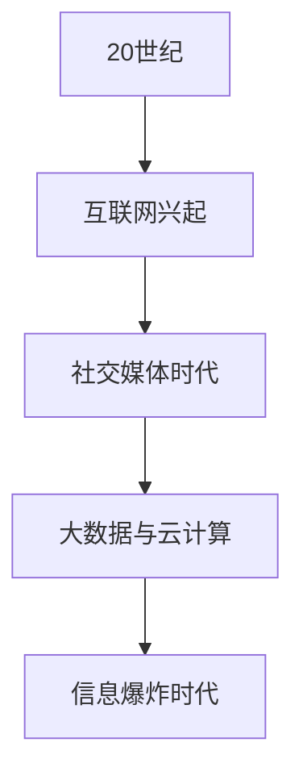

                 

### 文章标题：信息时代的注意量管理挑战与策略：在干扰和信息过载中航行

> 关键词：信息过载、注意力管理、策略、挑战、新技术、工作环境优化

> 摘要：本文深入探讨了信息时代下注意量管理的挑战与策略。首先，我们分析了信息过载的现象及其对个体生理与心理的影响。接着，本文提出了个体注意量管理策略，包括时间管理、习惯养成、心理调适以及技术工具的使用。随后，文章探讨了工作环境优化策略，如空间布局、管理体系优化和个人习惯培养。此外，我们还讨论了教育系统和职业培训中的注意量管理策略。最后，文章展望了未来趋势与政策管理措施，包括新技术的应用和社会文化变迁对注意力管理的影响。本文旨在为读者提供系统、实用的注意量管理指南。

---

### 目录大纲：信息时代的注意量管理挑战与策略

---

#### 第一部分：引言与背景

- **第1章：信息过载与注意量管理**
  - 1.1 信息过载现象概述
  - 1.2 注意量管理的概念
  - 1.3 信息过载的影响

- **第2章：信息过载对个体的影响**
  - 2.1 生理与心理压力
  - 2.2 生产力与效率

#### 第二部分：挑战与应对策略

- **第3章：个体注意量管理策略**
  - 3.1 时间管理与优先级设定
  - 3.2 习惯养成与心理调适
  - 3.3 技术工具使用与优化

- **第4章：工作环境优化策略**
  - 4.1 空间布局与物理环境
  - 4.2 管理体系与流程优化
  - 4.3 个人习惯与社会支持

- **第5章：教育与培训策略**
  - 5.1 教育系统的注意量管理
  - 5.2 职业培训与企业教育

- **第6章：政策与管理措施**
  - 6.1 政府角色与公共健康政策
  - 6.2 管理措施与法规

- **第7章：未来趋势与展望**
  - 7.1 新技术的发展
  - 7.2 社会文化变迁
  - 7.3 未来展望

---

### 第一部分：引言与背景

#### 第1章：信息过载与注意量管理

##### 1.1 信息过载现象概述

**Mermaid 流程图：**

在20世纪末，互联网的兴起标志着信息时代的到来。随着社交媒体和大数据技术的发展，信息爆炸成为一个显著现象。每个人几乎都在不断地接收和处理来自不同渠道的海量信息。这种信息的爆炸不仅改变了我们的生活方式，也对注意量管理提出了新的挑战。

##### 1.2 注意量管理的概念

**定义：**

注意量管理是指通过科学的方法和策略，提高个体对注意力的控制能力，以优化信息处理效率，减少干扰和压力。

**重要性：**

在信息过载的时代，注意量管理变得尤为重要。它不仅有助于提高生产力和工作效率，还能改善个体的生理和心理健康。

##### 1.3 信息过载的影响

**生理与心理压力：**

长时间处于信息过载状态会导致生理压力增加，如睡眠质量下降、慢性疲劳等。同时，心理压力也会加剧，如焦虑、抑郁等心理问题。

**生产力下降：**

注意力分散降低工作效率，导致生产力下降。研究表明，分散的注意力会显著增加错误率和延误任务完成时间。

#### 第2章：信息过载对个体的影响

##### 2.1 生理与心理压力

**来源：**

信息过载导致个体需要处理大量的信息，这会增加大脑的认知负荷，进而导致生理和心理压力。

**影响：**

- **睡眠质量下降：** 焦虑和压力会导致睡眠质量下降，影响身体恢复和认知功能。
- **慢性疲劳：** 长期处于高压状态下，身体会逐渐出现慢性疲劳。
- **心理问题：** 焦虑、抑郁等心理问题会严重影响个体的生活质量和幸福感。

**应对策略与技巧：**

- **时间管理：** 通过合理安排时间，减少无效信息的处理，从而降低压力。
- **休息与放松：** 定期休息和放松可以帮助缓解生理和心理压力。

##### 2.2 生产力与效率

**影响：**

信息过载会导致注意力分散，降低工作效率。研究表明，分散的注意力会增加错误率，并导致任务延误。

**提升方法：**

- **优先级设定：** 将任务按照重要性和紧急性分类，优先处理重要且紧急的任务。
- **专注训练：** 通过专注训练，提高个体的注意力集中能力。
- **技术工具：** 利用各种技术工具，如番茄工作法、注意力监测软件等，帮助提高工作效率。

##### 2.3 基于注意量管理的工作技巧

- **日程安排：** 合理安排工作与休息时间，避免过度疲劳。
- **目标设定：** 设定具体、可衡量、可实现的目标，有助于提高工作动力和效率。

---

在接下来的章节中，我们将深入探讨如何应对信息过载带来的挑战，提出一系列策略和技巧，帮助个体在干扰和信息过载中有效管理注意量，提高生活质量和工作效率。让我们继续探索这些策略，并思考如何在日常生活中实际应用它们。让我们一步一步地进行分析和推理，以找到最有效的解决方案。

---

### 第二部分：挑战与应对策略

#### 第3章：个体注意量管理策略

##### 3.1 时间管理与优先级设定

时间管理和优先级设定是注意量管理中至关重要的一环。通过合理规划时间，设定清晰的优先级，我们可以有效地提高工作效率，减少干扰，从而更好地管理注意力。

###### 3.1.1 有效的时间管理方法

**四象限法**

四象限法是一种常见的任务管理方法，将任务分为四个象限，分别表示任务的重要性和紧急性。以下是四象限法的详细解释：

|        | 紧急 | 不紧急 |
|--------|------|--------|
| **重要**  | A    | C      |
| **不重要** | B    | D      |

- **A象限：紧急且重要**：这些任务是必须立即处理的，如紧急的电话、会议或突发事件。我们需要优先处理这些任务，确保它们得到及时解决。
- **B象限：不紧急且重要**：这些任务虽然不是紧急的，但对我们的长期目标和计划非常重要。我们应该在相对空闲的时间处理这些任务，以确保我们能够实现长期目标。
- **C象限：紧急但不重要**：这些任务可能是一些琐碎的事情，如不重要的电话或邮件。我们可以委托他人处理这些任务，以节省自己的时间。
- **D象限：不紧急且不重要**：这些任务通常是可以被忽略的，如一些无意义的社交活动或无聊的浏览网页。我们应该尽量减少这些任务，避免它们占据我们的时间。

**番茄工作法**

番茄工作法是一种时间管理技巧，通过将工作时间划分为25分钟的工作周期（称为“番茄钟”），每个工作周期后休息5分钟。以下是番茄工作法的详细步骤：

1. **设定任务**：确定你想要完成的任务。
2. **开始番茄钟**：开始计时，专注于任务，直到25分钟结束。
3. **休息**：番茄钟结束后，休息5分钟。
4. **重复**：继续进行下一个番茄钟，直到完成所有任务。
5. **长休息**：每完成四个番茄钟后，进行15-30分钟的长休息。

**优先级设定**

优先级设定是时间管理的关键。以下是一个简单的优先级设定方法：

- **紧急且重要**：立即处理。
- **不紧急但重要**：计划时间处理。
- **紧急但不重要**：委托他人处理。
- **不紧急且不重要**：尽量避免。

**优先级公式**

$$
\text{优先级} = \frac{\text{完成任务的紧迫性} \times \text{任务的重要性}}{\text{可用的资源}}
$$

通过这个公式，我们可以根据任务的紧迫性和重要性，以及可用资源，合理地设定任务的优先级。

###### 3.1.2 如何设定优先级

**步骤1：确定任务的紧迫性和重要性**

- **紧迫性**：任务是否需要立即处理。
- **重要性**：任务对目标和成果的贡献。

**步骤2：评估可用资源**

- **时间**：我们有足够的时间来完成任务吗？
- **精力**：我们是否有足够的精力来处理任务？

**步骤3：根据公式计算优先级**

使用上述公式计算每个任务的优先级，并将任务按照优先级排序。

**步骤4：制定计划**

根据任务的优先级，制定详细的工作计划，确保高优先级的任务得到优先处理。

**步骤5：持续追踪**

定期回顾和调整任务优先级，确保计划能够适应实际情况。

###### 3.1.3 实用的日程安排技巧

- **使用日程表**：使用电子日程表或纸质日程表，记录每天的任务和计划。
- **提前规划**：提前规划一周或一个月的任务和计划，确保有足够的时间来完成每个任务。
- **避免拖延**：设定明确的截止日期，避免拖延任务。
- **灵活调整**：根据实际情况，灵活调整日程安排。

**举例说明：**

假设一个人需要在一天内完成以下任务：

- 上午9点到11点：撰写报告
- 下午2点到4点：参加会议
- 下午4点半到5点半：回复邮件
- 晚上7点到8点：锻炼身体

我们可以使用四象限法和番茄工作法，将这些任务合理地安排在日程表中：

| 时间         | 任务         | 说明                  |
|--------------|--------------|----------------------|
| 上午9点到11点 | 撰写报告    | 高优先级，紧急且重要  |
| 下午2点到4点  | 参加会议    | 高优先级，不紧急但重要 |
| 下午4点半到5点半 | 回复邮件  | 中优先级，紧急但不重要  |
| 晚上7点到8点  | 锻炼身体    | 低优先级，不紧急且不重要 |

通过这样的安排，我们可以确保高优先级的任务得到优先处理，同时保持合理的休息时间，提高工作效率。

##### 3.2 习惯养成与心理调适

习惯养成就如同一座坚固的桥梁，它能够帮助我们在信息过载的时代中，更好地管理注意力。通过培养良好的习惯，我们可以提高自我控制力，增强注意力的稳定性。而心理调适则是确保我们在面对压力时，能够保持冷静和专注的关键。

###### 3.2.1 好的习惯如何养成

**目标设定**

良好的习惯养成始于明确的目标设定。根据SMART原则（具体、可衡量、可实现、相关性强、时限性），我们可以设定清晰的目标。例如：

- **具体**：每天早晨7点半起床。
- **可衡量**：每周至少进行三次30分钟的有氧运动。
- **可实现**：确保每天晚上11点前睡觉。
- **相关性强**：阅读专业书籍，提高专业知识。
- **时限性**：在接下来的三个月内，每天早晨进行冥想。

**持续追踪**

持续追踪是实现目标的关键。通过记录和反思，我们可以了解自己的行为模式，发现潜在的障碍，并及时调整。以下是一些实用的追踪方法：

- **日记记录**：每天记录自己的行为和进展。
- **使用应用**：使用健身应用或时间管理应用，自动记录数据。
- **同伴监督**：与朋友或家人分享目标，互相监督。

**奖励机制**

奖励机制是培养习惯的有效方法。通过设定奖励，我们可以增加行为的动力。奖励可以是一天的休息时间、一顿美食，或者一次小旅行。关键是确保奖励与目标相关，且具有吸引力。

**举例说明：**

假设我们希望养成每天阅读30分钟的习惯。我们可以按照以下步骤进行：

1. **目标设定**：每天阅读30分钟，每周至少5天。
2. **持续追踪**：使用阅读应用记录阅读时间和进度。
3. **奖励机制**：完成一周阅读目标后，给自己安排一次小旅行。

通过这样的步骤，我们可以逐步养成每天阅读30分钟的好习惯。

###### 3.2.2 增强注意力的心理调适技巧

**冥想**

冥想是一种有效的心理调适技巧，它可以帮助我们提高专注力和注意力稳定性。以下是一些冥想的步骤：

1. **选择环境**：找一个安静的地方，避免干扰。
2. **选择时间**：每天设定一个固定的冥想时间，例如早晨或晚上。
3. **姿势**：找一个舒适的姿势，可以是坐姿或躺姿。
4. **呼吸**：专注于呼吸，感受呼吸的起伏。
5. **意识**：将注意力集中在呼吸上，当注意力分散时，轻轻地将注意力拉回呼吸。

**运动**

适量的运动有助于缓解压力，提高注意力。以下是一些有效的运动方式：

- **有氧运动**：如跑步、游泳、骑自行车等。
- **力量训练**：如举重、俯卧撑、仰卧起坐等。
- **瑜伽**：瑜伽可以帮助我们放松身心，提高专注力。

**休息**

休息是提高注意力的重要手段。以下是一些休息的建议：

- **短暂的休息**：工作或学习一段时间后，进行短暂的休息，例如5分钟。
- **睡眠**：确保每晚都有充足的睡眠，成年人通常需要7-9小时的睡眠。
- **放松**：通过冥想、阅读或听音乐等方式，放松身心。

**举例说明：**

假设一个人希望增强自己的注意力，我们可以按照以下步骤进行：

1. **目标设定**：每天早晨进行20分钟的冥想，每天进行30分钟的有氧运动。
2. **持续追踪**：使用运动应用记录运动时间和进度，使用冥想应用记录冥想时间。
3. **奖励机制**：每完成一周的冥想和运动目标，给自己安排一次放松的旅行。

通过这样的步骤，我们可以逐步增强自己的注意力，提高生活质量和工作效率。

##### 3.3 技术工具使用与优化

在现代信息社会中，技术工具已成为我们管理注意力的得力助手。通过合理选择和使用技术工具，我们可以更好地筛选信息、优化工作流程，从而提高注意力管理的效果。

###### 3.3.1 提高注意力的软件与工具

**专注类应用**

专注类应用可以帮助我们提高专注力，例如：

- **Forest**：通过种植虚拟树木，鼓励用户专注工作，每离开应用就会枯萎。
- **Pomodoro Timer**：番茄工作法计时器，帮助用户管理时间，提高专注力。

**过滤器与屏蔽工具**

过滤器与屏蔽工具可以帮助我们屏蔽干扰，例如：

- **屏蔽插件**：如网站屏蔽插件，可以帮助我们屏蔽社交媒体、新闻网站等干扰。
- **邮件过滤器**：通过自动分类和筛选邮件，减少邮件干扰。

**时间管理工具**

时间管理工具可以帮助我们规划日程，提高工作效率，例如：

- **Google Calendar**：用于记录日程和任务。
- **Trello**：用于任务管理和项目管理。

**其他工具**

- **笔记应用**：如Evernote、OneNote等，帮助记录重要信息。
- **阅读应用**：如Readwise、Instapaper等，帮助整理和阅读文章。

###### 3.3.2 如何避免技术干扰

**设定明确的任务目标**

在开始使用技术工具之前，我们应该设定明确的任务目标。这可以帮助我们避免在无关的任务上浪费时间和注意力。

**限制使用时间**

为了减少技术干扰，我们可以设定每个任务的具体使用时间，并在使用时间结束后，立即停止使用。

**使用专注模式**

许多技术工具都提供了专注模式，例如专注类应用和番茄工作法计时器。使用这些模式可以帮助我们更好地专注于当前任务。

**定期休息**

长时间使用技术工具可能会导致注意力下降。因此，我们应该定期休息，避免过度使用。

**避免多任务处理**

多任务处理会分散注意力，降低工作效率。我们应该尽量避免在同时进行多个任务。

**举例说明：**

假设一个人希望提高注意力，我们可以按照以下步骤进行：

1. **目标设定**：每天使用Forest应用，完成至少四个番茄钟。
2. **限制使用时间**：每个任务使用时间不超过30分钟，并在使用时间结束后立即停止。
3. **使用专注模式**：使用番茄工作法计时器，确保每个番茄钟都在专注模式下完成。
4. **定期休息**：每完成四个番茄钟后，休息5-10分钟。
5. **避免多任务处理**：专注于当前任务，避免同时处理多个任务。

通过这样的步骤，我们可以逐步提高自己的注意力，提高工作效率。

##### 3.3.3 技术工具的优化应用

**整合工具**

为了提高效率，我们可以将不同的技术工具整合在一起，形成一个高效的工作流程。例如，使用Trello记录任务，使用Evernote记录笔记，使用Pomodoro Timer进行时间管理。

**自动化**

通过自动化，我们可以减少手动操作，提高工作效率。例如，使用自动化脚本自动处理重复的任务，如邮件分类、日程安排等。

**定制化**

每个个体的需求不同，我们可以根据个人需求，对技术工具进行定制化。例如，调整番茄工作法的时间长度，选择适合自己的专注类应用等。

**持续学习**

技术工具不断更新，我们应该保持持续学习的态度，了解新工具的功能和使用方法，以最大化地提高工作效率。

通过上述策略和技巧，我们可以有效地管理自己的注意力，提高工作和生活质量。在接下来的章节中，我们将探讨如何在工作环境中优化注意力管理，进一步改善我们的工作和生活。

---

### 第三部分：工作环境优化策略

#### 第4章：工作环境优化策略

一个良好的工作环境是提高工作效率和注意力的关键。通过优化空间布局、物理环境和声学处理，我们可以创造一个有利于集中注意力的工作环境。同时，合理的管理体系和工作流程优化也是至关重要的。

##### 4.1 空间布局与物理环境

良好的空间布局能够帮助我们减少干扰，提高注意力集中度。以下是一些优化空间布局和物理环境的策略：

###### 4.1.1 办公空间的布局技巧

**明确工作区域**

- **分隔空间**：使用隔断或屏风将工作区域与其他区域分隔开来，减少外部干扰。
- **固定座位**：为每个员工分配固定的座位，有助于建立归属感和减少环境变化带来的干扰。

**减少视觉干扰**

- **适当装饰**：使用柔和的色彩和简洁的装饰，减少视觉上的干扰。
- **适当照明**：确保工作区域有足够的自然光线，减少人工照明的干扰。

**优化设备布局**

- **设备统一**：将常用的设备放置在容易访问的位置，减少查找设备的时间。
- **保持整洁**：保持工作区域的整洁，减少杂乱无章带来的心理压力。

**增加私人空间**

- **个人储物柜**：为每位员工提供个人储物柜，存放个人物品，减少干扰。
- **私人办公室**：为需要集中精力工作的员工提供私人办公室，减少外部干扰。

**举例说明：**

假设一个团队需要优化办公空间布局，以下是一些具体的步骤：

1. **确定固定座位**：为每位员工分配固定的座位，确保他们有归属感。
2. **设置隔断**：在团队成员之间设置低矮的隔断，减少外部视觉干扰。
3. **调整照明**：增加自然光线，使用柔和的照明，减少人工照明的干扰。
4. **优化设备布局**：将常用的设备放置在容易访问的位置，减少查找设备的时间。
5. **保持整洁**：每周定期清理工作区域，减少杂乱无章带来的心理压力。

通过这些步骤，团队可以创造一个更加有利于集中注意力的工作环境。

###### 4.1.2 物理环境的优化

**温度控制**

- **舒适温度**：确保工作环境的温度适中，避免过热或过冷。
- **通风良好**：保持室内空气流通，减少空气污浊。

**空气质量**

- **空气净化**：使用空气净化器，减少空气中的颗粒物和有害气体。
- **绿植**：在办公空间内放置一些绿植，提高空气质量和舒适度。

**噪音控制**

- **隔音措施**：在墙壁和窗户上安装隔音材料，减少外部噪音干扰。
- **耳机使用**：对于需要集中注意力的工作，提供耳机，帮助员工屏蔽噪音。

**举例说明：**

假设一个公司希望优化其物理环境，以下是一些具体的步骤：

1. **温度控制**：安装空调和加湿器，确保室内温度和湿度适中。
2. **通风良好**：定期开启窗户，保持室内空气流通。
3. **空气净化**：购买高性能的空气净化器，减少空气中的颗粒物和有害气体。
4. **绿植**：在办公区内放置一些绿植，提高空气质量和舒适度。
5. **噪音控制**：在会议室和办公室内安装隔音材料，减少噪音干扰。

通过这些步骤，公司可以创造一个更加健康和舒适的工作环境，提高员工的工作效率和满意度。

##### 4.2 管理体系与流程优化

除了物理环境的优化，合理的管理体系和工作流程优化也是提高注意力管理的关键。以下是一些具体的策略：

###### 4.2.1 优化工作流程的方法

**任务分解**

- **明确任务**：将复杂任务分解为具体的子任务，明确每个子任务的目标和责任人。
- **优先级排序**：根据任务的重要性和紧急性，对任务进行优先级排序。

**流程简化**

- **消除冗余**：识别并消除工作中的冗余步骤，简化流程。
- **自动化**：利用自动化工具和流程，减少手动操作，提高效率。

**反馈机制**

- **实时反馈**：建立实时反馈机制，及时了解任务的进展和问题，调整工作流程。

**举例说明：**

假设一个团队需要优化其工作流程，以下是一些具体的步骤：

1. **明确任务**：为每个任务制定详细的任务描述，明确任务的目标和责任人。
2. **优先级排序**：根据任务的重要性和紧急性，对任务进行排序，确保重要任务得到优先处理。
3. **消除冗余**：审查现有工作流程，识别并消除冗余步骤。
4. **自动化**：利用项目管理工具和自动化脚本，减少手动操作。
5. **实时反馈**：建立实时反馈机制，通过团队会议、邮件等方式，及时了解任务的进展和问题。

通过这些步骤，团队可以优化工作流程，提高工作效率和注意力管理。

###### 4.2.2 团队合作与沟通技巧

**明确角色**

- **角色分配**：明确每个团队成员的角色和职责，确保任务分配合理。

**有效沟通**

- **明确目标**：在任务开始前，明确任务的目标和预期结果。
- **定期会议**：定期举行团队会议，讨论任务的进展和问题。

**透明度**

- **信息共享**：确保团队成员之间的信息透明，减少误解和重复工作。

**举例说明：**

假设一个团队需要优化团队合作和沟通，以下是一些具体的步骤：

1. **明确角色**：为每个团队成员分配明确的角色和职责。
2. **明确目标**：在任务开始前，明确任务的目标和预期结果。
3. **定期会议**：每周举行一次团队会议，讨论任务的进展和问题。
4. **信息共享**：建立一个信息共享平台，确保团队成员可以轻松访问和共享信息。
5. **透明度**：确保团队成员之间的沟通透明，减少误解和重复工作。

通过这些步骤，团队可以建立有效的合作和沟通机制，提高注意力管理的效率。

##### 4.3 个人习惯与社会支持

除了物理环境和管理体系，个人习惯和社会支持也是优化注意力管理的关键。以下是一些具体的策略：

###### 4.3.1 培养个人健康习惯

**规律作息**

- **固定作息时间**：每天保持固定的作息时间，确保充足的睡眠。
- **定时休息**：在工作期间，定时休息，避免长时间连续工作。

**饮食健康**

- **均衡饮食**：保持饮食均衡，减少高糖、高脂肪食物的摄入。
- **适量饮水**：确保每天摄入足够的水分。

**适量运动**

- **定期锻炼**：每周进行适量的锻炼，如跑步、游泳、瑜伽等。
- **工作与休息结合**：在工作中每隔一段时间进行短暂的运动，如伸展运动、散步等。

**举例说明：**

假设一个人希望培养健康的个人习惯，以下是一些具体的步骤：

1. **固定作息时间**：每天晚上10点上床，保证每天7-8小时的睡眠。
2. **定时休息**：每工作45分钟后，休息10分钟，进行简单的伸展运动。
3. **均衡饮食**：每天摄入充足的蔬菜、水果和全谷物，减少高糖、高脂肪食物的摄入。
4. **适量运动**：每周进行三次30分钟的有氧运动，如跑步或游泳。
5. **工作与休息结合**：每工作1小时后，休息5-10分钟，进行简单的伸展运动。

通过这些步骤，个人可以培养出健康的习惯，提高注意力和工作效率。

###### 4.3.2 社会支持与互助网络

**家人和朋友的支持**

- **沟通与理解**：与家人和朋友保持良好的沟通，寻求他们的理解和支持。
- **共同锻炼**：与家人和朋友一起进行锻炼，增加社交互动，提高整体健康水平。

**同事间的互助**

- **工作互助**：在团队中建立互助机制，共同解决工作中的问题。
- **经验分享**：定期举行经验分享会，相互学习，提高整体能力。

**专业组织和支持团体**

- **加入专业组织**：加入相关的专业组织，获取行业信息和资源。
- **参加支持团体**：参加支持团体，与其他人分享经验和挑战，获得支持和鼓励。

**举例说明：**

假设一个人希望建立社会支持网络，以下是一些具体的步骤：

1. **沟通与理解**：每周与家人和朋友进行一次沟通，分享自己的工作和生活状况，寻求他们的理解和支持。
2. **共同锻炼**：与家人和朋友一起参加健身课程，如瑜伽或羽毛球。
3. **工作互助**：与同事建立互助机制，共同解决工作中的问题。
4. **经验分享**：每月参加一次团队经验分享会，分享自己的经验和学习成果。
5. **加入专业组织**：加入本行业的专业组织，参加行业会议和研讨会。
6. **参加支持团体**：参加本地的支持团体，如创业者俱乐部或职业发展团体，与其他人交流经验和挑战。

通过这些步骤，个人可以建立强大的社会支持网络，提高注意力和工作效率。

在工作和生活中，优化空间布局、管理流程、培养健康习惯和建立社会支持网络都是提高注意力管理的有效策略。通过这些策略，我们可以更好地应对信息过载和干扰，提高工作效率和生活质量。在接下来的章节中，我们将探讨教育与培训策略，以及政策和管理措施，进一步深入讨论注意力管理的重要性和实践。

---

### 第四部分：教育与培训策略

#### 第5章：教育与培训策略

教育与培训是提升个体注意力管理能力的重要途径。在学校教育中，课程设计和教学方法的改进对于培养学生的注意力管理能力至关重要。同样，在职业培训和企业教育中，有效管理注意力也是提升员工工作效率和职业发展的重要手段。

##### 5.1 教育系统的注意量管理

**课程设计与教学方法改进**

**项目制学习**

项目制学习是一种以项目为核心的学习方法，学生通过参与实际项目，从中学到知识并提高注意力管理能力。以下是项目制学习的具体实施步骤：

1. **项目选择**：选择与学生兴趣和职业发展方向相关的项目。
2. **项目规划**：明确项目的目标和预期成果，制定详细的项目计划。
3. **任务分配**：将项目分解为多个子任务，每个学生负责一个或多个子任务。
4. **进度监督**：定期检查项目的进展，及时调整计划和策略。
5. **成果展示**：在项目完成后，组织成果展示会，让学生展示他们的工作成果。

**案例教学**

案例教学通过引入现实世界的案例，让学生在解决实际问题的过程中提高注意力管理能力。以下是案例教学的实施步骤：

1. **案例选择**：选择具有代表性的案例，涵盖不同的学科和领域。
2. **案例分析**：引导学生分析案例，提出问题并讨论解决方案。
3. **小组讨论**：组织学生进行小组讨论，共同探讨问题的解决方案。
4. **成果分享**：每个小组展示他们的分析结果和解决方案，进行全班交流。

**注意力管理课程**

在课程设计中，可以设置专门的注意力管理课程，帮助学生理解和掌握注意力管理的技巧。以下是注意力管理课程的主要内容：

1. **注意力理论**：介绍注意力的基本理论，如注意力分散、注意力集中等。
2. **注意力训练**：通过实践练习，提高学生的注意力集中能力。
3. **时间管理**：教授学生时间管理的方法，如番茄工作法、四象限法等。
4. **心理健康**：讨论心理健康对注意力管理的影响，如压力管理、情绪调节等。

**举例说明：**

假设一所学校开设注意力管理课程，以下是一个具体的课程计划：

- **第一周**：介绍注意力管理的基本概念，包括注意力的分散和集中。
- **第二周**：教授时间管理技巧，如番茄工作法和四象限法。
- **第三周**：进行注意力训练，包括冥想、专注练习等。
- **第四周**：讨论心理健康与注意力管理的关系，教授压力管理和情绪调节技巧。
- **第五周**：组织小组讨论，让学生分享他们在课程中学到的注意力管理技巧，并讨论在实际生活中的应用。

通过这样的课程设计，学生可以系统地学习和掌握注意力管理的技巧，提高学习效果和生活质量。

**注意力管理在学校的实践**

**个性化教育**

通过个性化教育，学校可以根据每个学生的特点和需求，提供个性化的教学计划和指导。以下是一些具体的实施步骤：

1. **评估学生特点**：通过观察、测试等方式，评估学生的注意力管理能力。
2. **制定个性化计划**：根据评估结果，制定适合每个学生的个性化教学计划。
3. **跟踪进展**：定期跟踪学生的进展，及时调整教学策略。
4. **家校合作**：与家长合作，共同关注学生的注意力管理情况，提供必要的支持。

**情境教学**

情境教学通过创设真实的情境，让学生在解决实际问题的过程中提高注意力管理能力。以下是一些具体的情境教学案例：

- **科学实验室**：在科学实验室中，学生通过动手实验，学习科学知识，并培养注意力集中能力。
- **社会实践**：组织学生参与社会实践活动，如志愿者服务、社区调查等，提高他们在实际情境中的注意力管理能力。
- **模拟课堂**：利用模拟课堂，让学生在模拟的情境中学习，提高他们的注意力和参与度。

**举例说明：**

假设一所学校通过情境教学提高学生的注意力管理能力，以下是一个具体的实施计划：

- **第一学期**：在科学实验室进行物理实验，让学生在动手操作中提高注意力集中能力。
- **第二学期**：组织学生参与社区调查，让他们在实际情境中提高注意力管理能力。
- **第三学期**：在模拟课堂上进行角色扮演，让学生在互动中提高注意力管理技巧。

通过这样的情境教学，学生可以在实际情境中应用注意力管理技巧，提高学习效果和生活质量。

##### 5.2 职业培训与企业教育

**职业培训中的注意量管理**

**职业培训课程设计**

在职业培训中，注意量管理课程的设计应结合实际工作情境，提高学员的实用技能。以下是一些具体的课程设计：

1. **基本理论**：介绍注意力管理的基本理论，如注意力分散、注意力集中等。
2. **时间管理**：教授时间管理技巧，如番茄工作法、四象限法等。
3. **压力管理**：讨论压力管理技巧，如冥想、呼吸训练等。
4. **情境模拟**：通过情境模拟，让学员在模拟的工作情境中练习注意力管理技巧。

**举例说明：**

假设一家公司为员工开设注意力管理培训课程，以下是一个具体的课程计划：

- **第一周**：介绍注意力管理的基本概念和理论。
- **第二周**：教授时间管理技巧，如番茄工作法。
- **第三周**：讨论压力管理技巧，如冥想和呼吸训练。
- **第四周**：进行情境模拟，让学员在模拟的工作情境中应用所学技能。

通过这样的培训课程，员工可以系统地学习和掌握注意力管理技巧，提高工作效率。

**职业培训中的注意量管理策略**

**目标设定**

- **明确目标**：在培训开始前，明确培训的目标和预期成果，确保学员明确培训的意义和目的。
- **阶段性目标**：将培训目标分解为阶段性目标，帮助学员逐步实现目标。

**案例分析**

- **真实案例**：引入真实的工作案例，让学员在分析和解决实际问题的过程中，提高注意力管理能力。
- **讨论与反馈**：组织学员进行讨论，分享经验，互相学习，并从反馈中不断改进。

**实践练习**

- **模拟练习**：通过模拟练习，让学员在安全的模拟环境中实践注意力管理技巧，提高实际应用能力。
- **现场实践**：鼓励学员将所学技能应用到实际工作中，通过实际操作，验证培训效果。

**企业内部的注意力管理策略**

**培训与支持**

- **定期培训**：定期组织注意力管理培训，提高员工的注意力和工作效率。
- **个性化支持**：为员工提供个性化的支持和指导，帮助他们克服注意力管理的困难。

**文化塑造**

- **重视注意力管理**：在企业文化建设中，强调注意力管理的重要性，培养员工的注意力管理意识。
- **鼓励分享经验**：鼓励员工分享注意力管理的经验和技巧，促进团队学习和成长。

**举例说明：**

假设一家公司实施注意力管理策略，以下是一个具体的实施计划：

- **第一年**：组织注意力管理培训，提高员工的注意力管理能力。
- **第二年**：开展注意力管理经验分享会，鼓励员工分享经验和技巧。
- **第三年**：通过员工反馈，不断改进注意力管理策略，确保其有效性和实用性。

通过这样的策略，企业可以提升员工的注意力管理能力，提高整体工作效率和生产力。

##### 5.3 持续学习与职业发展的平衡

**持续学习的重要性**

持续学习是职业发展的重要保障。通过不断学习新知识和技能，员工可以适应快速变化的工作环境，提高自身的竞争力。

**平衡学习与工作**

- **合理规划时间**：合理规划工作和学习时间，确保两者之间的平衡。
- **利用碎片时间**：利用碎片时间进行学习，如乘坐公共交通、排队等候等。
- **设定学习目标**：设定明确的学习目标，确保学习有针对性和实用性。

**举例说明：**

假设一名员工希望平衡持续学习与工作，以下是一个具体的时间管理计划：

- **每天早晨**：利用早晨的碎片时间阅读专业书籍或文章。
- **每周二和周四**：参加线上或线下的培训课程，学习新的知识和技能。
- **每季度**：设定一个具体的学习目标，如学习一项新技能或掌握一个新的管理方法。

通过这样的计划，员工可以在确保工作高效的同时，不断进行自我提升，实现职业发展的目标。

教育与培训策略在提升个体注意力管理能力方面发挥着重要作用。通过优化课程设计、改进教学方法、实施职业培训和持续学习，我们可以帮助个体更好地应对信息过载和干扰，提高工作效率和生活质量。在接下来的章节中，我们将探讨政策与管理措施，进一步探讨如何从宏观层面提升注意力管理的有效性和普及度。

---

### 第五部分：政策与管理措施

#### 第6章：政策与管理措施

在宏观层面，政府、企业和国际组织在制定政策和实施管理措施方面扮演着关键角色。通过制定相关法律法规、推动公共健康政策、实施有效的管理措施，可以为个体和社会提供更好的注意力管理支持。

##### 6.1 政府角色与公共健康政策

**政府作用**

政府在信息管理中的作用至关重要。政府可以通过制定政策、法规和标准，引导社会各界关注和改善注意力管理问题。

**公共健康政策**

公共健康政策是政府应对信息过载和注意力管理挑战的重要手段。以下是一些具体的政策建议：

**信息过滤与监管**

- **信息过滤系统**：建立自动化的信息过滤系统，帮助公众筛选出重要信息，减少无效信息的干扰。
- **信息监管法规**：制定相关法律法规，规范信息传播行为，打击虚假信息和不良信息。

**健康教育与宣传**

- **健康教育**：通过学校、媒体和社区等渠道，普及注意力管理知识，提高公众的健康意识和能力。
- **宣传活动**：定期开展注意力管理宣传活动，提高公众对注意力管理重要性的认识。

**工作场所健康**

- **工作场所健康管理**：制定工作场所健康管理标准，确保员工在工作中有良好的工作环境和条件。
- **工作时间监管**：实施合理的工作时间制度，防止过度工作，减少工作压力。

**举例说明：**

假设政府制定了一项公共健康政策，以下是一个具体的实施计划：

1. **信息过滤与监管**：建立信息过滤系统，为公众提供高质量的新闻和资讯服务。
2. **健康教育**：在学校和社区开展注意力管理讲座和培训，提高公众的健康意识和能力。
3. **工作场所健康**：制定工作场所健康管理标准，确保员工有足够的时间休息和恢复精力。
4. **宣传活动**：通过媒体和社交媒体，定期发布注意力管理相关的内容，提高公众的关注度。

通过这样的政策实施，政府可以有效地提升公众的注意力管理能力，改善整体社会健康水平。

##### 6.2 管理措施与法规

**企业法规与劳动保护**

企业在制定规章制度时，应考虑员工的注意力管理需求。以下是一些建议：

**工作时间安排**

- **弹性工作时间**：允许员工根据工作进度和个人需求调整工作时间，减少固定工作时间带来的压力。
- **合理休息**：确保员工有足够的休息时间，减少长时间连续工作带来的疲劳。

**信息管理**

- **信息过滤**：在员工工作场所设置信息过滤工具，减少无关信息的干扰。
- **信息培训**：定期组织信息管理培训，提高员工对信息筛选和处理的能力。

**员工福利**

- **健康福利**：为员工提供健康检查、健身房会员等福利，支持员工的健康生活方式。
- **心理健康支持**：建立员工心理健康支持体系，提供心理咨询和辅导服务。

**法规制定**

政府应制定相关法律法规，保护员工的注意力和身心健康。以下是一些建议：

- **劳动保护法规**：明确工作时间、休息时间和劳动强度等方面的标准，确保员工身心健康。
- **信息保护法规**：规范企业对员工信息的处理和使用，防止信息过载和滥用。

**举例说明：**

假设政府制定了一项劳动保护法规，以下是一个具体的实施计划：

1. **工作时间安排**：规定每周工作时间不超过40小时，确保员工有足够的休息时间。
2. **信息管理**：要求企业在员工工作场所设置信息过滤工具，减少无关信息的干扰。
3. **员工福利**：为员工提供免费的健康检查和健身房会员服务。
4. **心理健康支持**：建立员工心理健康支持体系，提供免费的心理咨询和辅导服务。

通过这样的法规实施，企业可以更好地保护员工的注意力和身心健康，提高整体工作效率和生产力。

##### 6.3 跨国合作与全球性政策

在全球化和信息化时代，跨国合作和全球性政策在注意力管理领域也发挥着重要作用。以下是一些具体的合作和政策建议：

**国际合作**

- **信息共享**：各国政府、企业和国际组织之间建立信息共享平台，共同研究和应对注意力管理问题。
- **经验交流**：定期举办国际研讨会和会议，分享各国在注意力管理方面的成功经验和最佳实践。

**全球性政策**

- **全球信息管理**：制定全球性的信息管理政策，规范国际信息传播行为，减少信息过载和干扰。
- **跨国劳动保护**：制定跨国劳动保护政策，确保在全球范围内保护员工的注意力和身心健康。

**举例说明：**

假设国际社会制定了一项全球性政策，以下是一个具体的实施计划：

1. **信息共享**：建立全球信息共享平台，各国政府和企业可以共享注意力管理研究和最佳实践。
2. **经验交流**：定期举办国际研讨会，邀请各国专家分享注意力管理的成功经验和研究成果。
3. **全球信息管理**：制定全球性的信息管理政策，规范国际信息传播行为，减少信息过载和干扰。
4. **跨国劳动保护**：建立跨国劳动保护机制，确保在全球范围内保护员工的注意力和身心健康。

通过这样的全球性政策实施，国际社会可以共同应对注意力管理挑战，提高全球范围内的注意力和工作效率。

在政府、企业和国际组织的共同努力下，通过制定相关政策和实施管理措施，我们可以为个体和社会提供更好的注意力管理支持，提高生活质量和工作效率。在接下来的章节中，我们将探讨未来趋势，进一步展望注意力管理的发展方向。

---

### 第六部分：未来趋势与展望

#### 第7章：未来趋势与展望

随着科技的不断进步和社会的快速发展，注意力管理也在不断演变和进步。未来，新技术的应用、社会文化变迁以及全球政策的趋势将对注意力管理产生深远的影响。

##### 7.1 新技术的发展

**人工智能与注意量管理**

人工智能（AI）技术的快速发展为注意力管理带来了新的可能。AI可以通过智能分析、数据挖掘和模式识别，帮助我们更有效地筛选和处理信息，从而减少信息过载和干扰。

**智能过滤系统**

智能过滤系统利用AI算法，根据用户的兴趣和行为数据，自动筛选出重要信息。例如，电子邮件过滤系统可以自动将重要的邮件分类到优先处理列表，减少用户在处理无关信息上的时间消耗。

**个性化推荐**

个性化推荐系统基于用户的兴趣和行为数据，为用户推荐相关的内容和任务。这种系统可以帮助用户专注于对他们最重要的信息，从而提高注意力的利用效率。

**案例：**

假设一个用户在社交媒体上经常浏览科技新闻。智能过滤系统可以识别用户的兴趣，并自动筛选出最新的科技新闻，将其推送到用户的首页，减少用户在浏览大量无关信息上的时间。

**虚拟现实与增强现实的影响**

虚拟现实（VR）和增强现实（AR）技术为注意力管理提供了全新的交互方式。通过VR和AR，用户可以沉浸在虚拟或增强的环境中，减少外界干扰，从而更集中地处理任务。

**沉浸式体验**

沉浸式体验可以通过VR和AR技术，为用户提供一个专注的环境。例如，一个设计师可以在VR中创建一个专门用于设计的工作空间，减少外界干扰，提高设计效率。

**案例：**

假设一个设计师需要一个安静的环境来集中精力设计一个复杂的项目。通过VR技术，设计师可以进入一个虚拟的办公室，屏蔽外界干扰，专注于设计工作。

**区块链技术在注意量管理中的应用**

区块链技术具有去中心化、透明和安全的特点，可以用于注意力管理的多个方面。

**数据隐私保护**

区块链技术可以保护用户的数据隐私，确保用户信息不被滥用。例如，一个注意力管理应用可以使用区块链技术，确保用户的数据不被第三方访问，从而减少隐私泄露的风险。

**透明与可追溯**

区块链技术可以确保注意力管理过程中的数据透明和可追溯。例如，一个在线教育平台可以使用区块链技术记录学生的学习进度和成绩，确保数据的真实性和公正性。

**案例：**

假设一个在线教育平台使用区块链技术记录学生的学习进度。学生可以通过区块链查询自己的学习记录，确保成绩的公正和透明。

##### 7.2 社会文化变迁

**社会文化对注意力的塑造**

社会文化变迁对个体的注意力管理有着深远的影响。现代社会的高速发展和信息爆炸使得人们的注意力资源变得稀缺，而社会文化则在一定程度上塑造了人们的注意力模式。

**信息消费文化**

信息消费文化强调对信息的快速获取和消费，这可能导致人们过度依赖即时满足，忽视长期注意力管理。例如，社交媒体上的短视频和即时消息可以迅速吸引用户的注意力，但长期来看，这可能导致用户注意力分散和效率下降。

**注意力管理文化**

随着人们对注意力管理重要性的认识不断提高，一种新的注意力管理文化正在形成。这种文化强调专注、效率和自我控制，鼓励个体通过科学的方法和策略，提高注意力管理能力。

**案例：**

在一个注重注意力管理的公司文化中，员工被鼓励使用番茄工作法和专注类应用，以减少干扰，提高工作效率。

**教育与职业发展的平衡**

社会文化变迁也影响着教育与职业发展之间的平衡。在信息化社会中，终身学习成为职业发展的必要条件，而注意力管理则是实现终身学习的关键。

**持续学习**

随着社会的发展，人们越来越重视持续学习。为了适应快速变化的工作环境，个体需要不断学习新知识和技能。注意力管理可以帮助个体在持续学习中保持专注和高效。

**职业发展**

良好的注意力管理能力不仅有助于个人学习，还能提升职业发展。通过有效管理注意力，个体可以更好地应对工作中的挑战，提高工作绩效，实现职业目标。

**案例：**

假设一个职业发展顾问在咨询过程中，会指导客户通过注意力管理技巧，提高学习效率和职业发展速度。

##### 7.3 未来展望

**注意力管理研究的发展方向**

未来，注意力管理研究将继续深入，探索注意力管理的机制和策略。以下是一些可能的研究方向：

**神经科学研究**

神经科学研究表明，注意力是由大脑多个区域协同工作的结果。未来，神经科学将继续探索注意力的大脑机制，为注意力管理提供科学依据。

**技术发展**

随着技术的不断进步，注意力管理工具将更加智能化和个性化。未来，我们将看到更多基于人工智能和大数据的注意力管理工具，帮助个体更有效地管理注意力。

**跨学科研究**

注意力管理是一个跨学科的领域，涉及心理学、神经科学、计算机科学等多个学科。未来，跨学科研究将进一步加强，为注意力管理提供更全面的解决方案。

**全球注意力管理政策的趋势**

在全球范围内，注意力管理政策将成为一个重要议题。以下是一些未来可能的趋势：

**政策制定**

各国政府将制定更多的政策，规范信息传播和企业管理，确保公众和员工的注意力管理得到有效支持。

**国际合作**

国际组织将加强合作，制定全球性的注意力管理政策，共同应对信息过载和注意力管理挑战。

**社会参与**

随着公众对注意力管理重要性的认识不断提高，社会各界的参与将进一步加强，推动注意力管理政策的实施。

**未来展望**

在未来，注意力管理将变得更加重要和普及。通过新技术的应用、社会文化变迁和全球政策的推动，个体和社会将能够更好地应对信息过载和干扰，提高工作效率和生活质量。

---

本文通过对信息时代的注意量管理挑战与策略的深入探讨，提出了多个方面的解决方案和策略。从个体层面的时间管理、习惯养成、心理调适和技术工具使用，到工作环境的优化、教育系统的注意量管理以及政策和管理措施，本文为读者提供了一套全面的注意力管理指南。

在未来的发展中，注意力管理将继续受到新技术的推动和社会文化的塑造。通过持续的研究、技术创新和政策制定，我们将能够更好地应对注意力管理的挑战，提高个体和社会的整体效率和幸福感。

希望本文能够为读者提供有价值的参考，帮助他们在信息过载的时代中，更好地管理注意力，实现个人和职业目标。

---

### 致谢

在撰写本文的过程中，我得到了许多人的帮助和支持。首先，我要感谢AI天才研究院的同事，他们在研究和讨论过程中提供了宝贵的意见和建议。其次，我要感谢我的家人和朋友们，他们在我写作期间给予了我无尽的理解和支持。最后，我要特别感谢读者，感谢您花时间阅读本文，期待您的宝贵反馈。您的支持是我不断前进的动力。

---

### 作者信息

**作者：AI天才研究院/AI Genius Institute & 禅与计算机程序设计艺术 /Zen And The Art of Computer Programming**

AI天才研究院致力于推动人工智能和计算机科学领域的研究和发展，关注前沿技术以及其在社会各个领域的应用。同时，作为《禅与计算机程序设计艺术》的作者，作者在计算机科学领域拥有深厚的理论和实践经验。本文旨在为读者提供全面、实用的注意力管理策略，帮助个体在信息过载的时代中更好地应对挑战，提高生活和工作效率。

